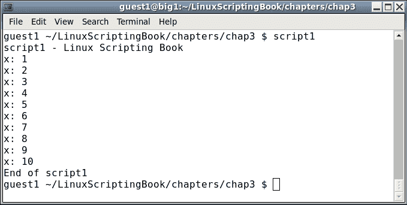
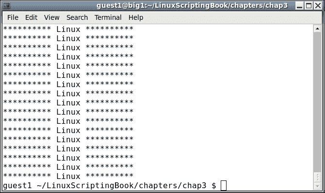
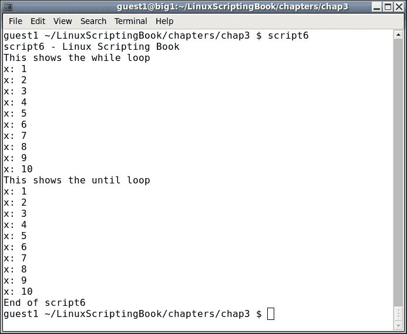
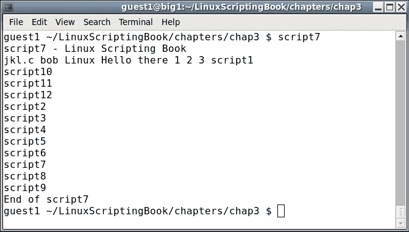
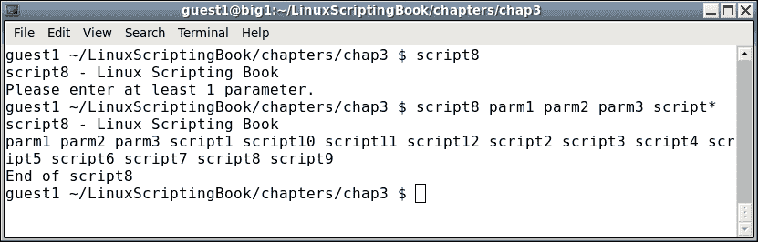
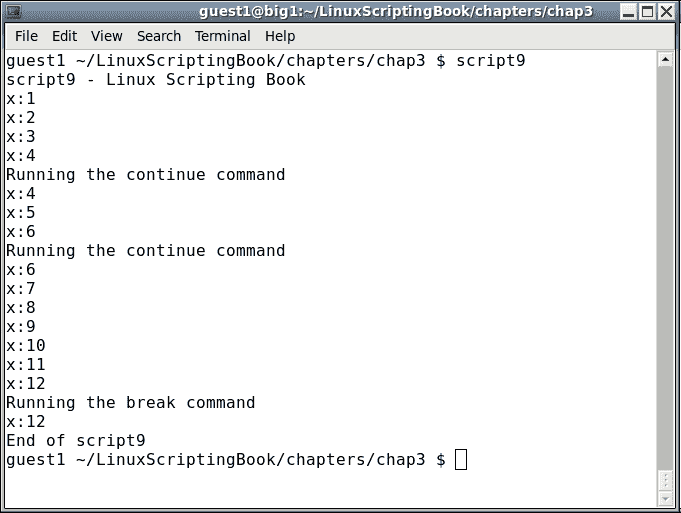
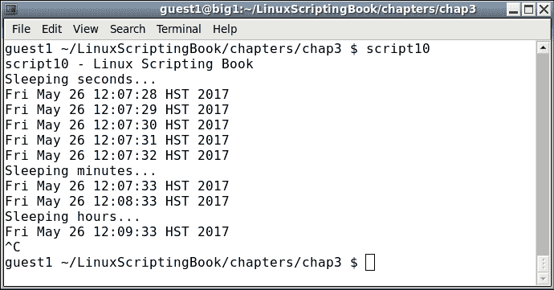
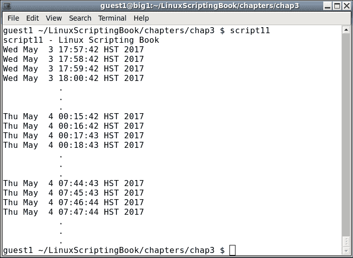
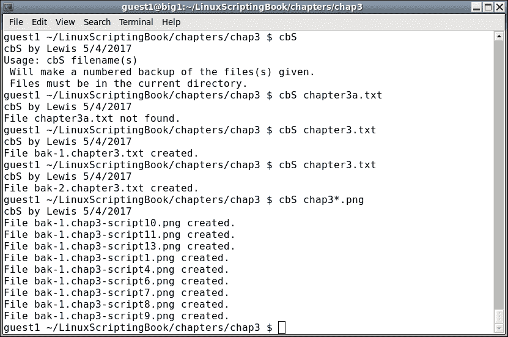

# 第三章：使用循环和 sleep 命令

本章展示了如何使用循环执行迭代操作。它还展示了如何在脚本中创建延迟。读者将学习如何在脚本中使用循环和`sleep`命令。

本章涵盖的主题如下：

+   标准的`for`、`while`和`until`循环。

+   循环的嵌套，以及如何避免混淆。

+   介绍`sleep`命令以及它在脚本中如何用于造成延迟。

+   讨论使用`sleep`的一个常见陷阱。

# 使用循环

任何编程语言最重要的特性之一就是能够执行一个任务或多个任务，然后在满足结束条件时停止。这是通过使用循环来实现的。

下一节展示了一个非常简单的`while`循环的例子：

## 第三章 - 脚本 1

```
#!/bin/sh
#
# 5/2/2017
#
echo "script1 - Linux Scripting Book"
x=1
while [ $x -le 10 ]
do
 echo x: $x
 let x++
done

echo "End of script1"

exit 0
```

以下是输出：



我们首先将变量`x`设置为`1`。`while`语句检查`x`是否小于或等于`10`，如果是，则运行`do`和`done`语句之间的命令。它将继续这样做，直到`x`等于`11`，此时`done`语句后的行将被运行。

在你的系统上运行这个。理解这个脚本非常重要，这样我们才能进入更高级的循环。

让我们在下一节看另一个脚本，看看你能否确定它有什么问题。

## 第三章 - 脚本 2

```
#!/bin/sh
#
# 5/2/2017
#
echo "script2 - Linux Scripting Book"

x=1
while [ $x -ge 0 ]
do
 echo x: $x
 let x++
done

echo "End of script2"

exit 0
```

随意跳过这个脚本的运行，除非你真的想要。仔细看`while`测试。它说当`x`大于或等于`0`时，运行循环内的命令。`x`会不会不满足这个条件？不会，这就是所谓的无限循环。不用担心；你仍然可以通过按下*Ctrl* + *C*（按住*Ctrl*键然后按*C*键）来终止脚本。

我想立即介绍无限循环，因为你几乎肯定会偶尔这样做，我想让你知道当发生这种情况时如何终止脚本。当我刚开始学习时，我肯定做过几次。

好了，让我们做一些更有用的事情。假设你正在开始一个新项目，需要在你的系统上创建一些目录。你可以一次执行一个命令，或者在脚本中使用循环。

我们将在*脚本 3*中看到这个。

## 第三章 - 脚本 3

```
#!/bin/sh
#
# 5/2/2017
#
echo "script3 - Linux Scripting Book"

x=1
while [ $x -le 10 ]
do
 echo x=$x
 mkdir chapter$x
 let x++
done
echo "End of script3"

exit 0
```

这个简单的脚本假设你是从基本目录开始的。运行时，它将创建`chapter 1`到`chapter 10`的目录，然后继续到结束。

在运行对计算机进行更改的脚本时，最好在真正运行之前确保逻辑是正确的。例如，在运行这个脚本之前，我注释掉了`mkdir`行。然后我运行脚本，确保它在显示`x`等于`10`后停止。然后我取消注释该行并真正运行它。

# 屏幕操作

我们将在下一节中看到另一个使用循环在屏幕上显示文本的脚本：

## 第三章 - 脚本 4

```
#!/bin/sh
#
# 5/2/2017
#
echo "script4 - Linux Scripting Book"

if [ $# -ne 1 ] ; then
 echo "Usage: script4 string"
 echo "Will display the string on every line."
 exit 255
fi

tput clear                   # clear the screen

x=1
while [ $x -le $LINES ]
do
 echo "********** $1 **********"
 let x++
done

exit 0
```

在执行这个脚本之前运行以下命令：

```
echo $LINES
```

如果终端中没有显示行数，请运行以下命令：

```
export LINES=$LINES
```

然后继续运行脚本。在我的系统上，当使用`script4` `Linux`运行时，输出如下：



好吧，我同意这可能不是非常有用，但它确实展示了一些东西。`LINES`环境变量包含当前终端中的行数。这对于在更复杂的脚本中限制输出可能很有用，这将在后面的章节中展示。这个例子还展示了如何在脚本中操作屏幕。

如果需要导出`LINES`变量，你可能希望将其放在你的`.bashrc`文件中并重新加载它。

我们将在下一节中看另一个脚本：

## 第三章 - 脚本 5

```
#!/bin/sh
#
# 5/2/2017
#
# script5 - Linux Scripting Book

tput clear                   # clear the screen

row=1
while [ $row -le $LINES ]
do
 col=1
 while [ $col -le $COLUMNS ]
 do
  echo -n "#"
  let col++
 done
 echo ""                     # output a carriage return
 let row++
done

exit 0
```

这与*脚本 4*类似，它展示了如何在终端的范围内显示输出。注意，你可能需要像我们使用`LINES`变量一样导出`COLUMNS`环境变量。

您可能已经注意到这个脚本中有一点不同。在`while`语句内部有一个`while`语句。这称为嵌套循环，在编程中经常使用。

我们首先声明`row=1`，然后开始外部`while`循环。然后将`col`变量设置为`1`，然后启动内部循环。这个内部循环显示了该行每一列的字符。当到达行的末尾时，循环结束，`echo`语句输出回车。然后增加`row`变量，然后再次开始该过程。在最后一行结束后结束。

通过仅使用`LINES`和`COLUMNS`环境变量，可以将实际屏幕写入。您可以通过运行程序然后扩展终端来测试这一点。

在使用嵌套循环时，很容易混淆哪里放什么。这是我每次都尝试做的事情。当我第一次意识到程序（可以是脚本、C、Java 等）需要一个循环时，我首先编写循环体，就像这样：

```
 while [ condition ]
 do
    other statements will go here
 done
```

这样我就不会忘记`done`语句，而且它也排列得很整齐。如果我需要另一个循环，我只需再次执行它：

```
 while [ condition ]
 do
   while [ condition ]
   do
     other statements will go here
   done
 done
```

您可以嵌套任意多个循环。

# 缩进您的代码

现在可能是谈论缩进的好时机。在过去（即 30 多年前），每个人都使用等宽字体的文本编辑器来编写他们的代码，因此只需一个空格的缩进就可以相对容易地保持一切对齐。后来，当人们开始使用具有可变间距字体的文字处理器时，变得更难看到缩进，因此使用了更多的空格（或制表符）。我的建议是使用您感觉最舒适的方式。但是，话虽如此，您可能必须学会阅读和使用公司制定的任何代码风格。

到目前为止，我们只谈到了`while`语句。现在让我们在下一节中看看`until`循环：

## 第三章 - 脚本 6

```
#!/bin/sh
#
# 5/3/2017
#
echo "script6 - Linux Scripting Book"

echo "This shows the while loop"

x=1
while [ $x -lt 11 ]          # perform the loop while the condition 
do                           # is true
 echo "x: $x"
 let x++
done

echo "This shows the until loop"

x=1
until [ $x -gt 10 ]          # perform the loop until the condition 
do                           # is true
 echo "x: $x"
 let x++
done

echo "End of script6"

exit 0
```

输出：



看看这个脚本。两个循环的输出是相同的；但是，条件是相反的。第一个循环在条件为真时继续，第二个循环在条件为真时继续。这是一个不那么微妙的区别，所以要注意这一点。

# 使用`for`语句

循环的另一种方法是使用`for`语句。在处理文件和其他列表时通常使用。`for`循环的一般语法如下：

```
 for variable in list
 do
     some commands
 done
```

列表可以是字符串集合，也可以是文件名通配符等。我们可以在下一节中给出的示例中看一下这一点。

## 第三章 - 脚本 7

```
#!/bin/sh
#
# 5/4/2017
#
echo "script7 - Linux Scripting Book"

for i in jkl.c bob Linux "Hello there" 1 2 3
do
 echo -n "$i "
done

for i in script*             # returns the scripts in this directory
do
 echo $i
done

echo "End of script7"
exit 0
```

以及我的系统输出。这是我的`chap3`目录：



下一个脚本显示了`for`语句如何与文件一起使用：

## 第三章 - 脚本 8

```
#!/bin/sh
#
# 5/3/2017
#
echo "script8 - Linux Scripting Book"

if [ $# -eq 0 ] ; then
 echo "Please enter at least 1 parameter."
 exit 255
fi

for i in $*                  # the "$*" returns every parameter given 
do                           # to the script
 echo -n "$i "
done

echo ""                      # carriage return
echo "End of script8"

exit 0
```

以下是输出：



您可以使用`for`语句做一些其他事情，请参阅 Bash 的`man`页面以获取更多信息。

# 提前离开循环

有时在编写脚本时，您会遇到一种情况，希望在满足结束条件之前提前退出循环。可以使用`break`和`continue`命令来实现这一点。

这是一个显示这些命令的脚本。我还介绍了`sleep`命令，将在下一个脚本中详细讨论。

## 第三章 - 脚本 9

```
#!/bin/sh
#
# 5/3/2017
#
echo "script9 - Linux Scripting Book"

FN1=/tmp/break.txt
FN2=/tmp/continue.txt

x=1
while [ $x -le 1000000 ]
do
 echo "x:$x"
 if [ -f $FN1 ] ; then
  echo "Running the break command"
  rm -f $FN1
  break
 fi

 if [ -f $FN2 ] ; then
  echo "Running the continue command"
  rm -f $FN2
  continue
 fi

 let x++
 sleep 1
done

echo "x:$x"

echo "End of script9"

exit 0
```

这是我的系统输出：



在您的系统上运行此命令，并在另一个终端中`cd`到`/tmp`目录。运行命令`touch continue.txt`并观察发生了什么。如果愿意，您可以多次执行此操作（请记住，上箭头会调用上一个命令）。请注意，当命中`continue`命令时，变量`x`不会增加。这是因为控制立即返回到`while`语句。

现在运行`touch break.txt`命令。脚本将结束，再次，`x`没有被增加。这是因为`break`立即导致循环结束。

`break`和`continue`命令在脚本中经常使用，因此一定要充分尝试，真正理解发生了什么。

# 睡眠命令

我之前展示了`sleep`命令，让我们更详细地看一下。一般来说，`sleep`命令用于在脚本中引入延迟。例如，在前面的脚本中，如果我没有使用`sleep`，输出会太快而无法看清发生了什么。

`sleep`命令接受一个参数，指示延迟的时间。例如，`sleep 1`表示引入 1 秒的延迟。以下是一些示例：

```
sleep 1       # sleep 1 second (the default is seconds)
sleep 1s      # sleep 1 second
sleep 1m      # sleep 1 minute
sleep 1h      # sleep 1 hour
sleep 1d      # sleep 1 day
```

`sleep`命令实际上比这里展示的更有能力。有关更多信息，请参阅`man`页面（`man sleep`）。

以下是一个更详细展示了`sleep`工作原理的脚本：

## 第三章 - 脚本 10

```
#!/bin/sh
#
# 5/3/2017
#
echo "script10 - Linux Scripting Book"

echo "Sleeping seconds..."
x=1
while [ $x -le 5 ]
do
 date
 let x++
 sleep 1
done

echo "Sleeping minutes..."
x=1
while [ $x -le 2 ]
do
 date
 let x++
 sleep 1m
done

echo "Sleeping hours..."
x=1
while [ $x -le 2 ]
do
 date
 let x++
 sleep 1h
done

echo "End of script10"
exit 0
```

和输出：



您可能已经注意到，我按下了*Ctrl* + *C*来终止脚本，因为我不想等待 2 个小时才能完成。这种类型的脚本在 Linux 系统中被广泛使用，用于监视进程，观察文件等。

在使用`sleep`命令时有一个常见的陷阱需要提到。

### 注意

请记住，`sleep`命令会在脚本中引入延迟。明确地说，当您编写`sleep 60`时，这意味着引入 60 秒的延迟；而不是每 60 秒运行一次脚本。这是一个很大的区别。

我们将在下一节中看到一个例子：

## 第三章 - 脚本 11

```
#!/bin/sh
#
# 5/3/2017
#
echo "script11 - Linux Scripting Book"

while [ true ]
do
 date
 sleep 60                    # 60 seconds
done

echo "End of script11"

exit 0
```

这是我的系统输出。最终会出现不同步的情况：



对于绝大多数脚本来说，这永远不会成为一个问题。只要记住，如果您要完成的任务是时间关键的，比如每天晚上准确在 12:00 运行一个命令，您可能需要考虑其他方法。请注意，`crontab`也不会做到这一点，因为在运行命令之前会有大约 1 到 2 秒的延迟。

# 监视一个进程

在本章中，还有一些其他主题需要我们看一下。假设您希望在系统上运行的进程结束时收到警报。

以下是一个脚本，当指定的进程结束时通知用户。请注意，还有其他方法可以完成这个任务，这只是一种方法。

## 第三章 - 脚本 12

```
#!/bin/sh
#
# 5/3/2017
#
echo "script12 - Linux Scripting Book"

if [ $# -ne 1 ] ; then
 echo "Usage: script12 process-directory"
 echo " For example: script12 /proc/20686"
 exit 255
fi

FN=$1                        # process directory i.e. /proc/20686
rc=1
while [ $rc -eq 1 ]
do
 if [ ! -d $FN ] ; then      # if directory is not there
  echo "Process $FN is not running or has been terminated."
  let rc=0
 else
  sleep 1
 fi
done

echo "End of script12"
exit 0
```

要查看此脚本的运行情况，请运行以下命令：

+   在终端中运行`script9`

+   在另一个终端中运行`ps auxw | grep script9`。输出将类似于这样：

```
guest1   20686  0.0  0.0 106112  1260 pts/34   S+   17:20   0:00 /bin/sh ./script9
guest1   23334  0.0  0.0 103316   864 pts/18   S+   17:24   0:00 grep script9
```

+   使用`script9`的进程 ID（在本例中为`20686`），并将其用作运行`script12`的参数：

```
$ script12 /proc/20686
```

如果您愿意，可以让它运行一段时间。最终返回到运行`script9`的终端，并使用*Ctrl* + *C*终止它。您将看到`script12`输出一条消息，然后也终止。随时尝试这个，因为它包含了很多重要信息。

您可能会注意到，在这个脚本中，我使用了一个变量`rc`来确定何时结束循环。我可以使用我们在本章前面看到的`break`命令。然而，使用控制变量（通常被称为）被认为是更好的编程风格。

当您启动一个命令然后它花费的时间比您预期的时间长时，这样的脚本非常有用。

例如，前段时间我使用`mkfs`命令在一个外部 1TB USB 驱动器上启动了一个格式化操作。它花了几天的时间才完成，我想确切地知道何时完成，以便我可以继续使用该驱动器。

# 创建编号的备份文件

现在作为一个奖励，这是一个可以直接运行的脚本，可以用来创建编号的备份文件。在我想出这个方法之前（很多年前），我会手工制作备份的仪式。我的编号方案并不总是一致的，我很快意识到让脚本来做这件事会更容易。这正是计算机擅长的事情。

我称这个脚本为`cbS`。我写这个脚本已经很久了，我甚至不确定它代表什么。也许是**计算机备份脚本**之类的东西。

## 第三章-脚本 13

```
#!/bin/sh
#
echo "cbS by Lewis 5/4/2017"

if [ $# -eq 0 ] ; then
 echo "Usage: cbS filename(s) "
 echo " Will make a numbered backup of the files(s) given."
 echo " Files must be in the current directory."
 exit 255
fi

rc=0                         # return code, default is no error
for fn in $*                 # for each filename given on the command line
do
 if [ ! -f $fn ] ; then      # if not found
  echo "File $fn not found."
  rc=1                       # one or more files were not found
 else
  cnt=1                      # file counter
  loop1=0                    # loop flag
  while [ $loop1 -eq 0 ]
  do
   tmp=bak-$cnt.$fn
   if [ ! -f $tmp ] ; then
     cp $fn $tmp
     echo "File "$tmp" created."
     loop1=1                 # end the inner loop
   else
     let cnt++               # try the next one
   fi
  done
 fi
done

exit $rc                     # exit with return code
```

它以一个`Usage`消息开始，因为它至少需要一个文件名来操作。

请注意，这个命令要求文件在当前目录中，所以像`cbS /tmp/file1.txt`这样的操作会产生错误。

`rc`变量被初始化为`0`。如果找不到文件，它将被设置为`1`。

现在让我们来看内部循环。这里的逻辑是使用`cp`命令从原始文件创建一个备份文件。备份文件的命名方案是`bak-(数字).原始文件名`，其中`数字`是下一个顺序中的数字。代码通过查看所有的`bak-#.文件名`文件来确定下一个数字是什么。直到找不到一个为止。然后那个就成为新的文件名。

在你的系统上让这个脚本运行起来。随意给它取任何你喜欢的名字，但要小心给它取一个不同于现有的 Linux 命令的名字。使用`which`命令来检查。

这是我系统上的一些示例输出：



这个脚本可以得到很大的改进。它可以被制作成适用于路径/文件，并且应该检查`cp`命令是否有错误。这种编码水平将在后面的章节中介绍。

# 总结

在本章中，我们介绍了不同类型的循环语句以及它们之间的区别。还介绍了嵌套循环和`sleep`命令。还提到了使用`sleep`命令时的常见陷阱，并介绍了一个备份脚本，展示了如何轻松创建编号的备份文件。

在下一章中，我们将介绍子程序的创建和调用。
