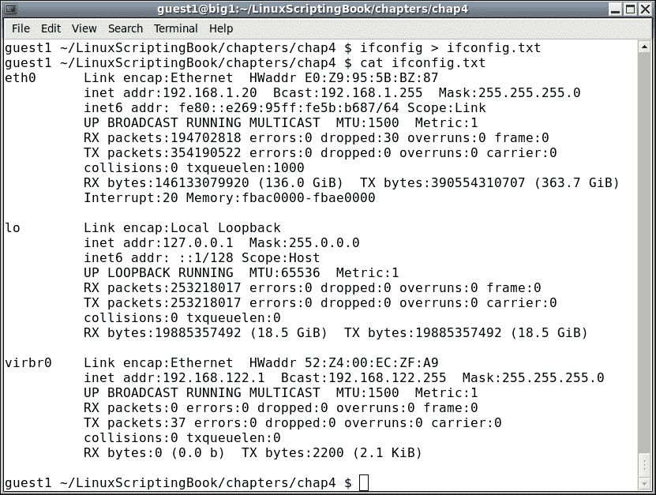
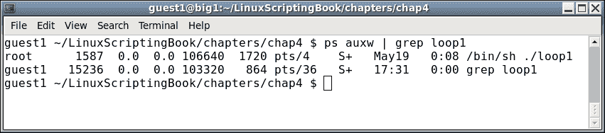
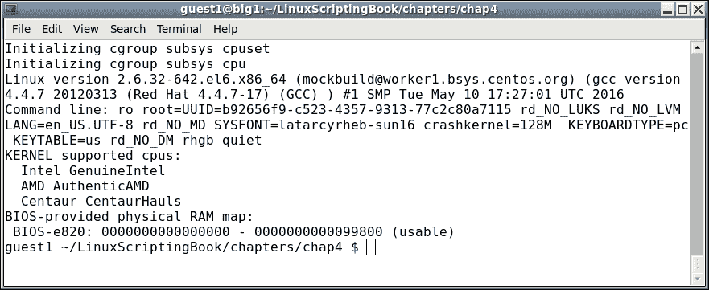
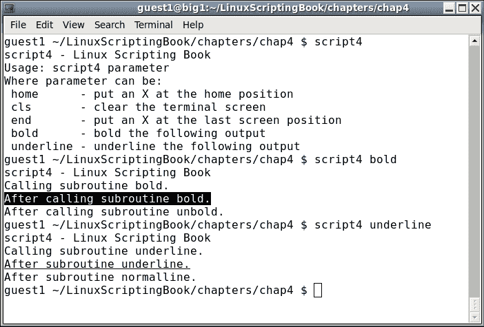
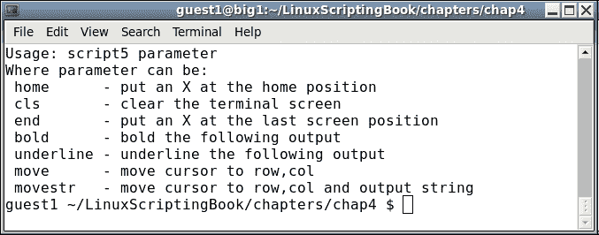
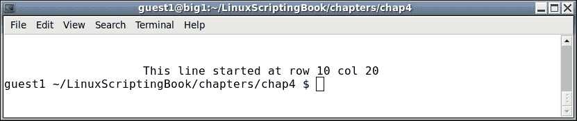
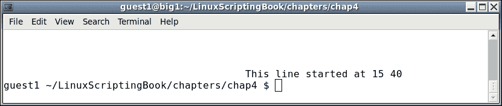
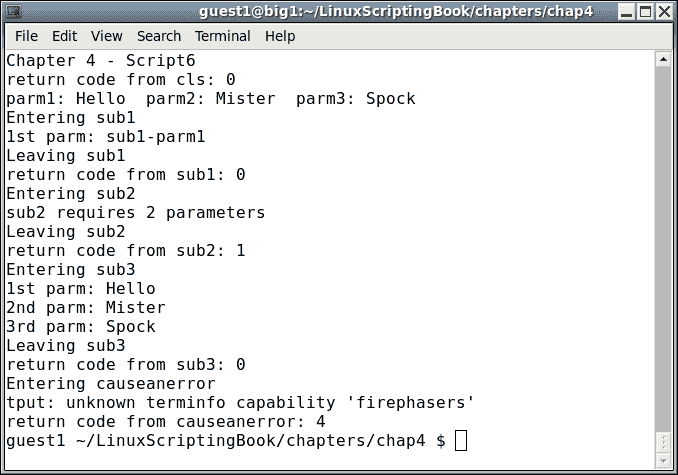
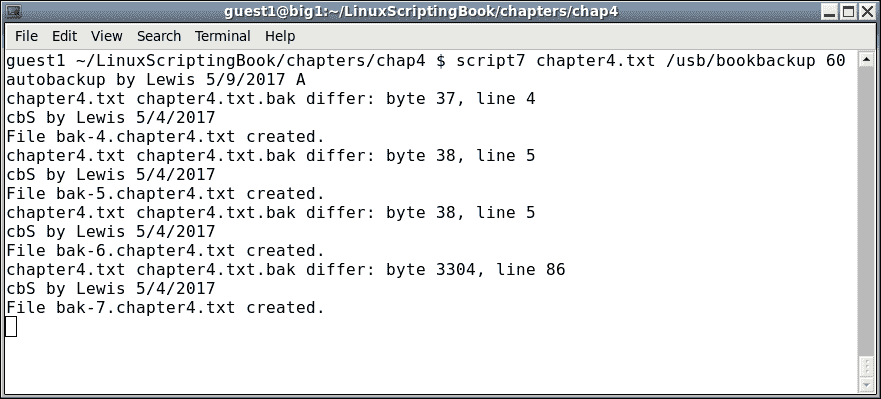

# 第四章：创建和调用子程序

本章介绍了如何在脚本中创建和调用子程序。

本章涵盖的主题如下：

+   显示一些简单的子程序。

+   显示更高级的例程。

+   再次提到返回代码以及它们在脚本中的工作方式。

在前几章中，我们主要看到了一些不太复杂的简单脚本。脚本实际上可以做更多的事情，我们将很快看到。

首先，让我们从一些简单但强大的脚本开始。这些主要是为了让读者了解脚本可以快速完成的工作。

# 清屏

`tput clear`终端命令可用于清除当前的命令行会话。您可以一直输入`tput clear`，但只输入`cls`会不会更好？

这是一个简单的清除当前屏幕的脚本：

## 第四章 - 脚本 1

```
#!/bin/sh
#
# 5/8/2017
#
tput clear
```

请注意，这是如此简单，以至于我甚至都没有包括`Usage`消息或返回代码。记住，要在您的系统上将其作为命令执行，请执行以下操作：

+   `cd $HOME/bin`

+   创建/编辑名为`cls`的文件

+   将上述代码复制并粘贴到此文件中

+   保存文件

+   运行`chmod 755 cls`

现在您可以在任何终端（在该用户下）输入`cls`，屏幕将被清除。试试看。

# 文件重定向

在这一点上，我们需要讨论文件重定向。这是将命令或脚本的输出复制到文件而不是显示在屏幕上的能力。这是通过使用重定向运算符来完成的，实际上就是大于号。

这是我在我的系统上运行的一些命令的屏幕截图：



如您所见，`ifconfig`命令的输出被发送（或重定向）到`ifconfig.txt`文件。

# 命令管道

现在让我们看看命令管道，即运行一个命令并将其输出作为另一个命令的输入的能力。

假设您的系统上正在运行名为`loop1`的程序或脚本，并且您想知道其 PID。您可以运行`ps auxw`命令到一个文件，然后使用`grep`命令在文件中搜索`loop1`。或者，您可以使用管道一步完成如下操作：



很酷，对吧？这是 Linux 系统中非常强大的功能，并且被广泛使用。我们很快将看到更多。

接下来的部分显示了另一个非常简短的使用一些命令管道的脚本。它清除屏幕，然后仅显示`dmesg`的前 10 行：

## 第四章 - 脚本 2

```
#!/bin/sh
#
# 5/8/2017
#
tput clear
dmesg | head
```

以下是输出：



接下来的部分显示文件重定向。

## 第四章 - 脚本 3

```
#!/bin/sh
#
# 5/8/2017
#
FN=/tmp/dmesg.txt
dmesg > $FN
echo "File $FN created."
exit 0
```

在您的系统上试一试。

这显示了创建一个脚本来执行通常在命令行上键入的命令是多么容易。还要注意`FN`变量的使用。如果以后要使用不同的文件名，您只需在一个地方进行更改。

# 子程序

现在让我们真正进入子程序。为此，我们将使用更多的`tput`命令：

```
tput cup <row><col>         # moves the cursor to row, col
tput cup 0 0                # cursor to the upper left hand side
tput cup $LINES $COLUMNS    # cursor to bottom right hand side
tput clear                  # clears the terminal screen
tput smso                   # bolds the text that follows
tput rmso                   # un-bolds the text that follows
```

这是脚本。这主要是为了展示子程序的概念，但也可以作为编写交互式工具的指南使用。

## 第四章 - 脚本 4

```
#!/bin/sh
# 6/13/2017
# script4

# Subroutines
cls()
{
 tput clear
 return 0
}

home()
{
 tput cup 0 0
 return 0
}

end()
{
 let x=$COLUMNS-1
 tput cup $LINES $x
 echo -n "X"                 # no newline or else will scroll
}

bold()
{
 tput smso
}

unbold()
{
 tput rmso
}

underline()
{
 tput smul
}

normalline()
{
 tput rmul
}

# Code starts here
rc=0                         # return code
if [ $# -ne 1 ] ; then
 echo "Usage: script4 parameter"
 echo "Where parameter can be: "
 echo " home      - put an X at the home position"
 echo " cls       - clear the terminal screen"
 echo " end       - put an X at the last screen position"
 echo " bold      - bold the following output"
 echo " underline - underline the following output"
 exit 255
fi

parm=$1                      # main parameter 1

if [ "$parm" = "home" ] ; then
 echo "Calling subroutine home."
 home
 echo -n "X"
elif [ "$parm" = "cls" ] ; then
 cls
elif [ "$parm" = "end" ] ; then
 echo "Calling subroutine end."
 end
elif [ "$parm" = "bold" ] ; then
 echo "Calling subroutine bold."
 bold
 echo "After calling subroutine bold."
 unbold
 echo "After calling subroutine unbold."
elif [ "$parm" = "underline" ] ; then
 echo "Calling subroutine underline."
 underline
 echo "After subroutine underline."
 normalline
 echo "After subroutine normalline."
else
 echo "Unknown parameter: $parm"
 rc=1
fi

exit $rc
```

以下是输出：



在您的系统上尝试一下。如果您使用`home`参数运行它，可能会对您看起来有点奇怪。代码在`home 位置`（0,0）放置了一个大写的`X`，这会导致提示打印一个字符。这里没有错，只是看起来有点奇怪。如果这对您来说仍然不合理，不要担心，继续查看*脚本 5*。

# 使用参数

好的，让我们向这个脚本添加一些例程，以展示如何在`子例程`中使用参数。为了使输出看起来更好，首先调用`cls`例程清除屏幕：

## 第四章 - 脚本 5

```
#!/bin/sh
# 6/13/2017
# script5

# Subroutines
cls()
{
 tput clear
 return 0
}

home()
{
 tput cup 0 0
 return 0
}

end()
{
 let x=$COLUMNS-1
 tput cup $LINES $x
 echo -n "X"                 # no newline or else will scroll
}

bold()
{
 tput smso
}

unbold()
{
 tput rmso
}

underline()
{
 tput smul
}

normalline()
{
 tput rmul
}

move()                       # move cursor to row, col
{
 tput cup $1 $2
}

movestr()                    # move cursor to row, col
{
 tput cup $1 $2
 echo $3
}

# Code starts here
cls                          # clear the screen to make the output look better
rc=0                         # return code
if [ $# -ne 1 ] ; then
 echo "Usage: script5 parameter"
 echo "Where parameter can be: "
 echo " home      - put an X at the home position"
 echo " cls       - clear the terminal screen"
 echo " end       - put an X at the last screen position"
 echo " bold      - bold the following output"
 echo " underline - underline the following output"
 echo " move      - move cursor to row,col"
 echo " movestr   - move cursor to row,col and output string"
 exit 255
fi

parm=$1                      # main parameter 1

if [ "$parm" = "home" ] ; then
 home
 echo -n "X"
elif [ "$parm" = "cls" ] ; then
 cls
elif [ "$parm" = "end" ] ; then
 move 0 0
 echo "Calling subroutine end."
end
elif [ "$parm" = "bold" ] ; then
 echo "Calling subroutine bold."
 bold
 echo "After calling subroutine bold."
 unbold
 echo "After calling subroutine unbold."
elif [ "$parm" = "underline" ] ; then
 echo "Calling subroutine underline."
 underline
 echo "After subroutine underline."
 normalline
 echo "After subroutine normalline."
elif [ "$parm" = "move" ] ; then
 move 10 20
 echo "This line started at row 10 col 20"
elif [ "$parm" = "movestr" ] ; then
 movestr 15 40 "This line started at 15 40"
else
 echo "Unknown parameter: $parm"
 rc=1
fi

exit $rc
```

由于此脚本只有两个额外的功能，您可以直接运行它们。这将逐个命令显示如下：

```
guest1 $ script5
```



```
guest1 $ script5 move
```



```
guest1 $ script5 movestr
```



由于我们现在将光标放在特定位置，输出对您来说应该更有意义。请注意，命令行提示重新出现在上次光标位置的地方。

您可能已经注意到，子例程的参数与脚本的参数工作方式相同。参数 1 是`$1`，参数 2 是`$2`，依此类推。这既是好事也是坏事，好的是您不必学习任何根本不同的东西。但坏的是，如果不小心，很容易混淆`$1`，`$2`等变量。

一个可能的解决方案，也是我使用的解决方案，是将主脚本中的`$1`，`$2`等变量分配给一个有意义的变量。

例如，在这些示例脚本中，我将`parm1`设置为`$1（parm1=$1）`，依此类推。

请仔细查看下一节中的脚本：

## 第四章-脚本 6

```
#!/bin/sh
#
# 6/13/2017
# script6

# Subroutines
sub1()
{
 echo "Entering sub1"
 rc1=0                       # default is no error
 if [ $# -ne 1 ] ; then
  echo "sub1 requires 1 parameter"
  rc1=1                      # set error condition
 else
  echo "1st parm: $1"
 fi

 echo "Leaving sub1"
 return $rc1                 # routine return code
}

sub2()
{
 echo "Entering sub2"
 rc2=0                       # default is no error
 if [ $# -ne 2 ] ; then
  echo "sub2 requires 2 parameters"
  rc2=1                      # set error condition
 else
  echo "1st parm: $1"
  echo "2nd parm: $2"
 fi
 echo "Leaving sub2"
 return $rc2                 # routine return code
}

sub3()
{
 echo "Entering sub3"
 rc3=0                       # default is no error
 if [ $# -ne 3 ] ; then
  echo "sub3 requires 3 parameters"
  rc3=1                      # set error condition
 else
  echo "1st parm: $1"
  echo "2nd parm: $2"
  echo "3rd parm: $3"
 fi
 echo "Leaving sub3"
 return $rc3                 # routine return code
}

cls()                        # clear screen
{
 tput clear
 return $?                   # return code from tput
}

causeanerror()
{
 echo "Entering causeanerror"
 tput firephasers
 return $?                   # return code from tput
}

# Code starts here
cls                          # clear the screen
rc=$?
echo "return code from cls: $rc"
rc=0                         # reset the return code
if [ $# -ne 3 ] ; then
 echo "Usage: script6 parameter1 parameter2 parameter3"
 echo "Where all parameters are simple strings."
 exit 255
fi

parm1=$1                     # main parameter 1
parm2=$2                     # main parameter 2
parm3=$3                     # main parameter 3

# show main parameters
echo "parm1: $parm1  parm2: $parm2  parm3: $parm3"

sub1 "sub1-parm1"
echo "return code from sub1: $?"

sub2 "sub2-parm1"
echo "return code from sub2: $?"

sub3 $parm1 $parm2 $parm3
echo "return code from sub3: $?"

causeanerror
echo "return code from causeanerror: $?"

exit $rc
```

以下是输出



这里有一些新概念，所以我们会非常仔细地讲解这个。

首先，我们定义了子例程。请注意，已添加了返回代码。还包括了一个`cls`例程，以便显示返回代码。

我们现在开始编码。调用`cls`例程，然后将其返回值存储在`rc`变量中。然后将显示显示脚本标题的`echo`语句。

那么，为什么我必须将`cls`命令的返回代码放入`rc`变量中呢？我不能在显示脚本标题的`echo`之后直接显示它吗？不行，因为`echo $?`总是指的是紧随其后的命令。这很容易被忘记，所以请确保您理解这一点。

好的，现在我们将`rc`变量重置为`0`并继续。我本可以使用不同的变量，但由于`rc`的值不会再次需要，我选择重用`rc`变量。

现在，在检查参数时，如果没有三个参数，将显示`Usage`语句。

输入三个参数后，我们会显示它们。这总是一个好主意，特别是在首次编写脚本/程序时。如果不需要，您随时可以将其删除。

第一个子例程`sub1`以`1`个参数运行。这将进行检查，如果需要，将显示错误。

`sub2`也是一样的情况，但在这种情况下，我故意设置它只运行一个参数，以便显示错误消息。

对于`sub3`，您可以看到主要参数仍然可以从子例程中访问。实际上，所有命名变量都可以访问，还有通配符`*`和其他文件扩展标记。只有主脚本参数无法访问，这就是为什么我们将它们放入变量中的原因。

最后，创建了最终例程以展示如何处理错误。您可以看到，`tput`命令本身显示了错误，然后我们还在脚本中捕获了它。

最后，脚本以主`rc`变量退出。

正如前面提到的，这个脚本包含了很多内容，所以一定要仔细研究它。请注意，当我想在`tput`中显示错误时，我只是假设`firephasers`将成为一个未知的命令。如果一些相位器实际上从我的计算机中射出（或更糟的是，射入），我会感到非常惊讶！

# 备份您的工作

现在，作为另一个奖励，下一节显示了我用来每 60 秒备份当前书籍章节的脚本：

## 第四章-脚本 7

```
#!/bin/sh
#
# Auto backs up the file given if it has changed
# Assumes the cbS command exists
# Checks that ../back exists
# Copies to specific USB directory
# Checks if filename.bak exists on startup, copy if it doesn't

echo "autobackup by Lewis 5/9/2017 A"
if [ $# -ne 3 ] ; then
 echo "Usage: autobackup filename USB-backup-dir delay"
 exit 255
fi

# Create back directory if it does not exist
if [ ! -d back ] ; then
 mkdir back
fi

FN=$1                        # filename to monitor
USBdir=$2                    # USB directory to copy to
DELAY=$3                     # how often to check

if [ ! -f $FN ] ; then       # if no filename abort
 echo "File: $FN does not exist."
 exit 5
fi

if [ ! -f $FN.bak ] ; then
 cp $FN $FN.bak
fi

filechanged=0
while [ 1 ]
do
 cmp $FN $FN.bak
 rc=$?
 if [ $rc -ne 0 ] ; then
  cp $FN back
  cp $FN $USBdir
  cd back
  cbS $FN
  cd ..
  cp $FN $FN.bak
  filechanged=1
 fi

 sleep $DELAY
done
```

在我的系统上的输出



这个脚本中没有我们尚未涵盖的内容。顶部的非正式注释主要是为了我自己，这样我就不会忘记我写了什么或为什么写了。

检查参数并在不存在时创建后备子目录。我似乎总是记不住要创建它，所以我让脚本来做。

接下来，设置了主要变量，然后如果`.bak`文件不存在就创建它（这有助于逻辑）。

在`while`循环中，你可以看到它永远运行，使用`cmp` Linux 命令来查看原始文件是否与备份文件发生了变化。如果是，`cmp`命令返回非零值，文件将使用我们的`cbS`脚本作为带编号的备份复制回`subdir`。该文件也会被复制到备份目录，这种情况下是我的 USB 驱动器。循环会一直持续，直到我开始新的章节，这时我按下*Ctrl* + *C*退出。

这是脚本自动化的一个很好的例子，将在第六章*使用脚本自动化任务*中更详细地介绍。

# 总结

我们从一些非常简单的脚本开始，然后继续展示一些简单的子程序。

然后我们展示了一些带参数的子程序。再次提到了返回码，以展示它们在子程序中的工作原理。我们包括了几个脚本来展示这些概念，并且还额外免费包含了一个特别的奖励脚本。

在下一章中，我们将介绍如何创建交互式脚本。
