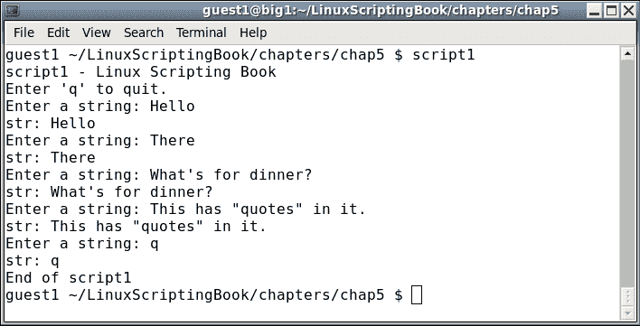
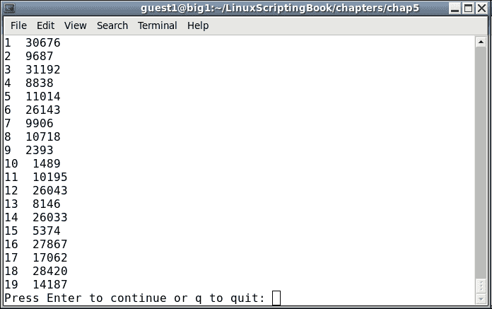
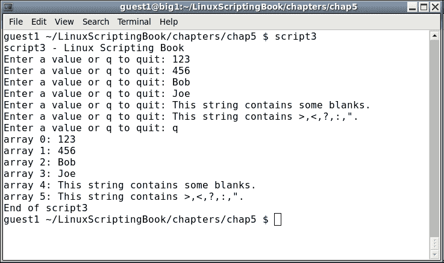
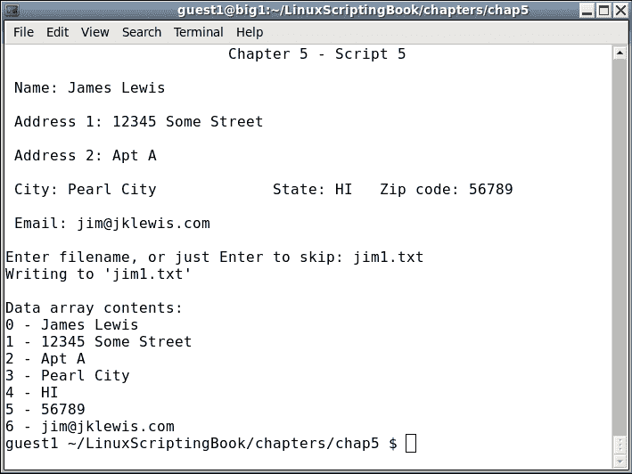
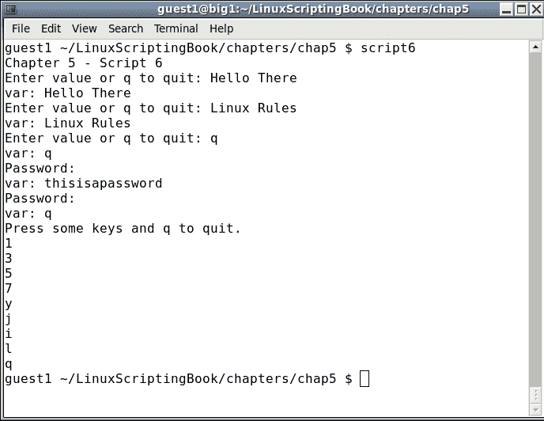
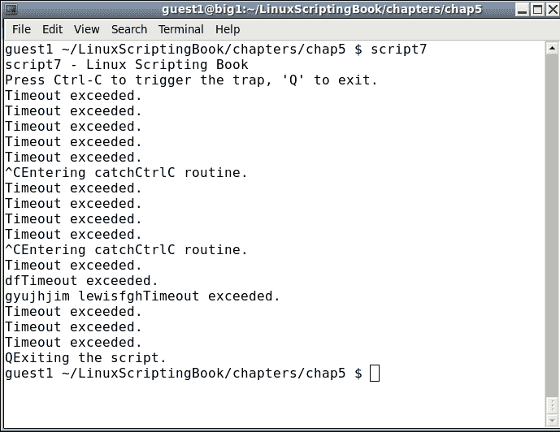
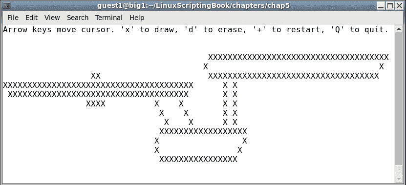

# 第五章：创建交互式脚本

本章展示了如何读取键盘以创建交互式脚本。

本章涵盖的主题有：

+   如何使用`read`内置命令查询键盘。

+   使用`read`的不同方式。

+   使用陷阱（中断）。

读者将学习如何创建交互式脚本。

到目前为止我们看过的脚本都没有太多用户交互。`read`命令用于创建可以查询键盘的脚本。然后根据输入采取行动。

这是一个简单的例子：

# 第五章 - 脚本 1

```
#!/bin/sh
#
# 5/16/2017
#
echo "script1 - Linux Scripting Book"

echo "Enter 'q' to quit."
rc=0
while [ $rc -eq 0 ]
do
 echo -n "Enter a string: "
 read str
 echo "str: $str"
 if [ "$str" = "q" ] ; then
  rc=1
 fi
done

echo "End of script1"
exit 0
```

在我的系统上运行时的输出如下：



这是一个在您的系统上运行的好例子。尝试几种不同的字符串、数字等。注意返回的字符串包含空格、特殊字符等。你不必引用任何东西，如果你这样做了，那些也会被返回。

您还可以使用`read`命令在脚本中加入简单的暂停。这将允许您在屏幕上滚动之前看到输出。它也可以在调试时使用，将在第九章 *调试脚本*中显示。

以下脚本显示了如何在输出到屏幕的最后一行时创建暂停：

## 第五章 - 脚本 2

```
#!/bin/sh
#
# 5/16/2017
# Chapter 5 - Script 2
#
linecnt=1                    # line counter
loop=0                       # loop control var
while [ $loop -eq 0 ]
do
 echo "$linecnt  $RANDOM"    # display next random number
 let linecnt++
 if [ $linecnt -eq $LINES ] ; then
  linecnt=1
  echo -n "Press Enter to continue or q to quit: "
  read str                   # pause
  if [ "$str" = "q" ] ; then
   loop=1                    # end the loop
  fi
 fi
done

echo "End of script2"
exit 0
```

在我的系统上运行时的输出如下：



我按了两次*Enter*，然后在最后一个上按了*Q*和*Enter*。

让我们尝试一些更有趣的东西。下一个脚本显示了如何用从键盘获取的值填充数组：

## 第五章 - 脚本 3

```
#!/bin/sh
#
# 5/16/2017
#
echo "script3 - Linux Scripting Book"

if [ "$1" = "--help" ] ; then
 echo "Usage: script3"
 echo " Queries the user for values and puts them into an array."
 echo " Entering 'q' will halt the script."
 echo " Running 'script3 --help' shows this Usage message."
 exit 255
fi

x=0                          # subscript into array
loop=0                       # loop control variable
while [ $loop -eq 0 ]
do
 echo -n "Enter a value or q to quit: "
 read value
 if [ "$value" = "q" ] ; then
  loop=1
 else
  array[$x]="$value"
  let x++
 fi
done

let size=x
x=0
while [ $x -lt $size ]
do
 echo "array $x: ${array[x]}"
 let x++
done

echo "End of script3"
exit 0
```

和输出：



由于这个脚本不需要任何参数，我决定添加一个`Usage`语句。如果用户使用`--help`运行它，这将显示，并且在许多系统脚本和程序中是一个常见的特性。

这个脚本中唯一新的东西是`read`命令。`loop`和`array`变量在之前的章节中已经讨论过。再次注意，使用`read`命令，你输入的就是你得到的。

现在让我们创建一个完整的交互式脚本。但首先我们需要检查当前终端的大小。如果太小，你的脚本输出可能会变得混乱，用户可能不知道原因或如何修复。

以下脚本包含一个检查终端大小的子例程：

## 第五章 - 脚本 4

```
#!/bin/sh
#
# 5/16/2017
#
echo "script4 - Linux Scripting Book"

checktermsize()
{
 rc1=0                       # default is no error
 if [[ $LINES -lt $1 || $COLUMNS -lt $2 ]] ; then
  rc1=1                      # set return code
 fi
 return $rc1
}

rc=0                         # default is no error
checktermsize 40 90          # check terminal size
rc=$?
if [ $rc -ne 0 ] ; then
 echo "Return code: $rc from checktermsize"
fi

exit $rc
```

在您的系统上以不同大小的终端运行此脚本以检查结果。从代码中可以看出，如果终端比所需的大，那没问题；只是不能太小。

### 注意

关于终端大小的一点说明：当使用`tput`光标移动命令时，请记住是先行后列。然而，大多数现代 GUI 是按列然后行。这是不幸的，因为很容易把它们弄混。

现在让我们看一个完整的交互式脚本：

## 第五章 - 脚本 5

```
#!/bin/sh
#
# 5/27/2017
#
echo "script5 - Linux Scripting Book"

# Subroutines
cls()
{
 tput clear
}

move()                       # move cursor to row, col
{
 tput cup $1 $2
}

movestr()                    # move cursor to row, col
{
 tput cup $1 $2
 echo -n "$3"                # display string
}

checktermsize()
{
 rc1=0                       # default is no error
 if [[ $LINES -lt $1 || $COLUMNS -lt $2 ]] ; then
  rc1=1                      # set return code
 fi
 return $rc1
}

init()                       # set up the cursor position array
{
 srow[0]=2;  scol[0]=7       # name
 srow[1]=4;  scol[1]=12      # address 1
 srow[2]=6;  scol[2]=12      # address 2
 srow[3]=8;  scol[3]=7       # city
 srow[4]=8;  scol[4]=37      # state
 srow[5]=8;  scol[5]=52      # zip code
 srow[6]=10; scol[6]=8       # email
}

drawscreen()                 # main screen draw routine
{
 cls                         # clear the screen
 movestr 0 25 "Chapter 5 - Script 5"
 movestr 2 1 "Name:"
 movestr 4 1 "Address 1:"
 movestr 6 1 "Address 2:"
 movestr 8 1 "City:"
 movestr 8 30 "State:"
 movestr 8 42 "Zip code:"
 movestr 10 1 "Email:"
}

getdata()
{
 x=0                         # array subscript
 rc1=0                       # loop control variable
 while [ $rc1 -eq 0 ]
 do
  row=${srow[x]}; col=${scol[x]}
  move $row $col
  read array[x]
  let x++
  if [ $x -eq $sizeofarray ] ; then
   rc1=1
  fi
 done
 return 0
}

showdata()
{
 fn=0
 echo ""
 read -p "Enter filename, or just Enter to skip: " filename
 if [ -n "$filename" ] ; then       # if not blank
  echo "Writing to '$filename'"
 fn=1                       # a filename was given
 fi
 echo ""                     # skip 1 line
 echo "Data array contents: "
 y=0
 while [ $y -lt $sizeofarray ]
 do
  echo "$y - ${array[$y]}"
  if [ $fn -eq 1 ] ; then
   echo "$y - ${array[$y]}">>"$filename"
  fi
  let y++
 done
 return 0
}

# Code starts here
sizeofarray=7                # number of array elements

if [ "$1" = "--help" ] ; then
 echo "Usage: script5 --help"
 echo " This script shows how to create an interactive screen program."
 exit 255
fi

checktermsize 25 80
rc=$?
if [ $rc -ne 0 ] ; then
 echo "Please size the terminal to 25x80 and try again."
 exit 1
fi

init                         # initialize the screen array
drawscreen                   # draw the screen
getdata                      # cursor movement and data input routine
showdata                     # display the data

exit 0
```

这是一些示例输出：



这里有很多新信息，让我们来看看。首先定义了子例程，你可以看到我们从前面的*脚本 4*中包含了`checktermsize`子例程。

`init`例程设置了光标放置数组。将初始值放入子例程是良好的编程实践，特别是如果它将被再次调用。

`drawscreen`例程显示初始表单。请注意，我可以在这里使用`srow`和`scol`数组中的值，但我不想让脚本看起来太乱。

非常仔细地看`getdata`例程，因为这是乐趣开始的地方：

+   首先，数组下标`x`和控制变量`rc1`被设置为`0`。

+   在循环中，光标放置在第一个位置（`Name:`）。

+   查询键盘，用户的输入进入子`x`的数组。

+   `x`增加，我们进入下一个字段。

+   如果`x`等于数组的大小，我们离开循环。请记住我们从`0`开始计数。

`showdata`例程显示数组数据，然后我们就完成了。

### 提示

请注意，如果使用`--help`选项运行脚本，则会显示`Usage`消息。

这只是一个交互式脚本的小例子，展示了基本概念。在后面的章节中，我们将更详细地讨论这个问题。

`read`命令可以以多种不同的方式使用。以下是一些示例：

```
read var
Wait for input of characters into the variable var.
read -p "string" var
Display contents of string, stay on the line, and wait for input.

read -p "Enter password:" -s var
Display "Enter password:", but do not echo the typing of the input. Note that a carriage return is not output after Enter is pressed.

read -n 1 var
```

`-n`选项意味着等待那么多个字符，然后继续，它不会等待*Enter*按键。

在这个例子中，它将等待 1 个字符，然后继续。这在实用脚本和游戏中很有用：

## 第五章-脚本 6

```
#!/bin/sh
#
# 5/27/2017
#
echo "Chapter 5 - Script 6"

rc=0                         # return code
while [ $rc -eq 0 ]
do
 read -p "Enter value or q to quit: " var
 echo "var: $var"
 if [ "$var" = "q" ] ; then
  rc=1
 fi
done

rc=0                         # return code
while [ $rc -eq 0 ]
do
 read -p "Password: " -s var
 echo ""                     # carriage return
 echo "var: $var"
if [ "$var" = "q" ] ; then
  rc=1
 fi
done

echo "Press some keys and q to quit."
rc=0                         # return code
while [ $rc -eq 0 ]
do
 read -n 1 -s var            # wait for 1 char, does not output it
 echo $var                   # output it here
 if [ "$var" = "q" ] ; then
  rc=1
 fi
done

exit $rc
```

输出：



脚本中的注释应该使这个脚本相当容易理解。`read`命令还有一些其他选项，其中一个将在下一个脚本中显示。

通过使用所谓的陷阱，还有另一种查询键盘的方法。这是一个在按下特殊键序列时访问的子例程，比如*Ctrl* + *C*。

这是使用陷阱的一个例子：

## 第五章-脚本 7

```
#!/bin/sh
#
# 5/16/2017
#
echo "script7 - Linux Scripting Book"

trap catchCtrlC INT          # Initialize the trap

# Subroutines
catchCtrlC()
{
 echo "Entering catchCtrlC routine."
}

# Code starts here

echo "Press Ctrl-C to trigger the trap, 'Q' to exit."

loop=0
while [ $loop -eq 0 ]
do
 read -t 1 -n 1 str          # wait 1 sec for input or for 1 char
 rc=$?

 if [ $rc -gt 128 ] ; then
  echo "Timeout exceeded."
 fi

 if [ "$str" = "Q" ] ; then
  echo "Exiting the script."
  loop=1
 fi

done

exit 0
```

这是我系统上的输出：



在你的系统上运行这个脚本。按一些键，看看反应。也按几次*Ctrl* + *C*。完成后按*Q*。

那个`read`语句需要进一步解释。使用带有`-t`选项（超时）的`read`意味着等待那么多秒钟的字符。如果在规定的时间内没有输入字符，它将返回一个值大于 128 的代码。正如我们之前看到的，`-n 1`选项告诉`read`等待 1 个字符。这意味着我们等待 1 秒钟来输入 1 个字符。这是`read`可以用来创建游戏或其他交互式脚本的另一种方式。

### 注意

使用陷阱是捕捉意外按下*Ctrl* + *C*的好方法，这可能会导致数据丢失。然而，需要注意的是，如果你决定捕捉*Ctrl* + *C*，请确保你的脚本有其他退出方式。在上面的简单脚本中，用户必须输入“Q”才能退出。

如果你陷入无法退出脚本的情况，可以使用`kill`命令。

例如，如果我需要停止`script7`，指示如下：

```
 guest1 $ ps auxw | grep script7
 guest1   17813  0.0  0.0 106112  1252 pts/32   S+   17:23   0:00 /bin/sh ./script7
 guest1   17900  0.0  0.0 103316   864 pts/18   S+   17:23   0:00 grep script7
 guest1   29880  0.0  0.0  10752  1148 pts/17   S+   16:47   0:00 kw script7
 guest1 $ kill -9 17813
 guest1 $
```

在运行`script7`的终端上，你会看到它停在那里，并显示`Killed`。

请注意，一定要终止正确的进程！

在上面的例子中，PID`29880`是我正在写`script7`的文本编辑器会话。杀死它不是一个好主意：）。

现在来点乐趣！下一个脚本允许你在屏幕上画粗糙的图片：

## 第五章-脚本 8

```
#!/bin/sh
#
# 5/16/2017
#
echo "script8 - Linux Scripting Book"

# Subroutines
cls()
{
 tput clear
}

move()                       # move cursor to row, col
{
 tput cup $1 $2
}

movestr()                    # move cursor to row, col
{
 tput cup $1 $2
 echo -n "$3"                # display string
}

init()                       # set initial values
{
 minrow=1                    # terminal boundaries
 maxrow=24
 mincol=0
 maxcol=79
 startrow=1
 startcol=0
}

restart()                    # clears screen, sets initial cursor position
{
 cls
 movestr 0 0 "Arrow keys move cursor. 'x' to draw, 'd' to erase, '+' to restart, 'Q' to quit."
 row=$startrow
 col=$startcol

 draw=0                      # default is not drawing
 drawchar=""
}

checktermsize2()             # must be the specified size
{
 rc1=0                       # default is no error
 if [[ $LINES -ne $1 || $COLUMNS -ne $2 ]] ; then
  rc1=1                      # set return code
 fi
 return $rc1
}

# Code starts here
if [ "$1" = "--help" ] ; then
 echo "Usage: script7 --help"
 echo " This script shows the basics on how to create a game."
 echo " Use the arrow keys to move the cursor."
 echo " Press c to restart and Q to quit."
 exit 255
fi

checktermsize2 25 80         # terminal must be this size
rc=$?
if [ $rc -ne 0 ] ; then
 echo "Please size the terminal to 25x80 and try again."
 exit 1
fi

init                         # initialize values
restart                      # set starting cursor pos and clear screen

loop=1
while [ $loop -eq 1 ]
do
 move $row $col              # position the cursor here
 read -n 1 -s ch

 case "$ch" in
  A) if [ $row -gt $minrow ] ; then
      let row--
     fi
     ;;
  B) if [ $row -lt $maxrow ] ; then
      let row++
     fi
     ;;
  C) if [ $col -lt $maxcol ] ; then
      let col++
     fi
     ;;
  D) if [ $col -gt $mincol ] ; then
      let col--
     fi
     ;;
  d) echo -n ""             # delete char
     ;;
  x) if [ $col -lt $maxcol ] ; then
      echo -n "X"            # put char
      let col++
     fi
     ;;
  +) restart ;;
  Q) loop=0 ;;
 esac
done

movestr 24 0 "Script completed normally."
echo ""                      # carriage return

exit 0
```

写这个脚本很有趣，比我预期的更有趣一些。

我们还没有涉及的一件事是`case`语句。这类似于`if...then...else`，但使代码更易读。基本上，检查输入到`read`语句的值是否与每个`case`子句中的匹配。如果匹配，那个部分就会被执行，然后控制转到`esac`语句后的行。如果没有匹配，它也会这样做。

尝试这个脚本，并记住将终端设置为 25x80（或者如果你的 GUI 是这样工作的，80x25）。

这只是这个脚本可以做的一个例子：



好吧，我想这表明我不是一个很好的艺术家。我会继续从事编程和写书。

# 总结

在本章中，我们展示了如何使用`read`内置命令来查询键盘。我们解释了一些不同的读取选项，并介绍了陷阱的使用。还包括了一个简单的绘图游戏。

下一章将展示如何自动运行脚本，使其可以无人值守地运行。我们将解释如何使用`cron`在特定时间运行脚本。还将介绍归档程序`zip`和`tar`，因为它们在创建自动化备份脚本时非常有用。
