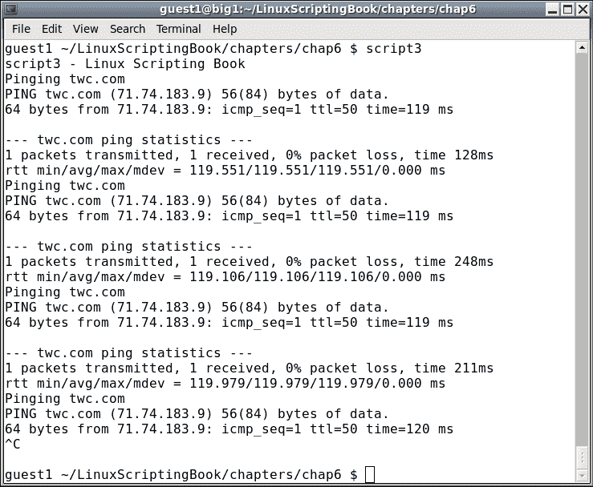
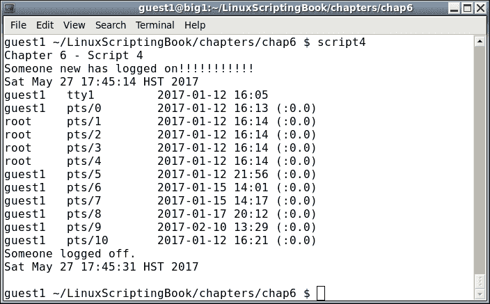
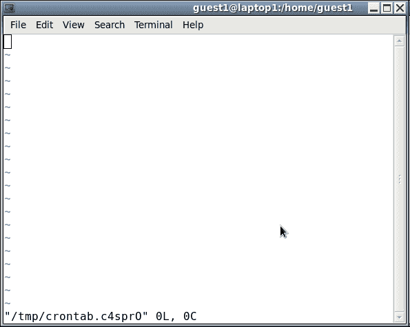
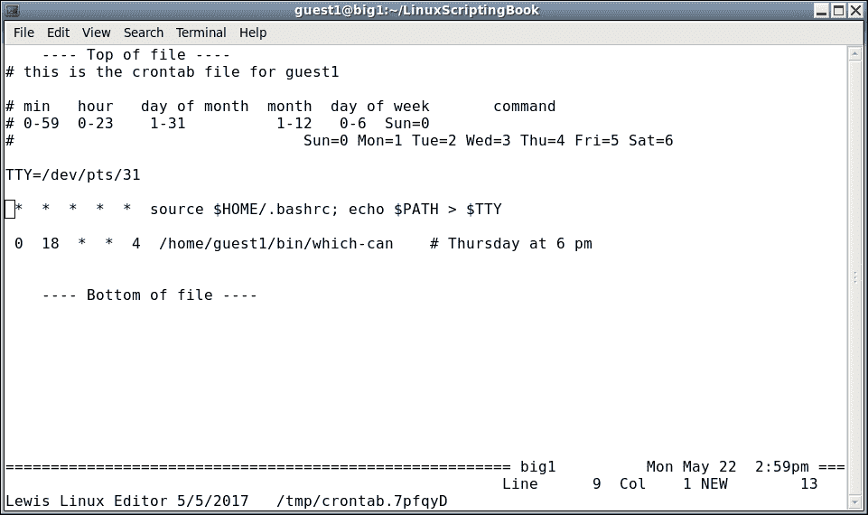
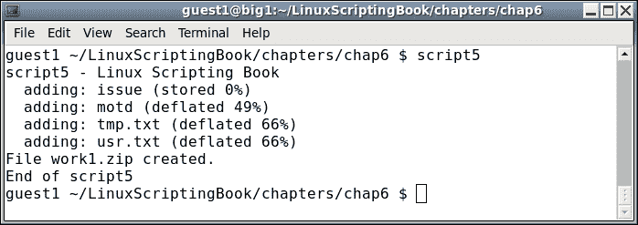

# 第六章：使用脚本自动化任务

本章介绍了如何使用脚本自动化各种任务。

本章涵盖的主题如下：

+   如何创建一个自动化任务的脚本。

+   使用 cron 在特定时间自动运行脚本的正确方法。

+   如何使用`ZIP`和`TAR`进行压缩备份。

+   源代码示例。

读者将学习如何创建自动化脚本。

我们在第三章*使用循环和 sleep 命令*中谈到了`sleep`命令。只要遵循一些准则，它可以用来创建一个自动化脚本（即在特定时间运行而无需用户干预），。

这个非常简单的脚本将强化我们在第三章*使用循环和 sleep 命令*中所讨论的关于使用`sleep`命令进行自动化的内容：

# 第六章 - 脚本 1

```
#!/bin/sh
#
# 5/23/2017
#
echo "script1 - Linux Scripting Book"
while [ true ]
do
  date
  sleep 1d
done
echo "End of script1"
exit 0
```

如果你在你的系统上运行它并等几天，你会发现日期会有所偏移。这是因为`sleep`命令在脚本中插入了延迟，这并不意味着它会每天在同一时间运行脚本。

### 注意

以下脚本更详细地展示了这个问题。请注意，这是一个不应该做的例子。

## 第六章 - 脚本 2

```
#!/bin/sh
#
# 5/23/2017
#
echo "script2 - Linux Scripting Book"
while [ true ]
do
 # Run at 3 am
 date | grep -q 03:00:
 rc=$?
 if [ $rc -eq 0 ] ; then
  echo "Run commands here."
  date
 fi
 sleep 60                   # sleep 60 seconds
done
echo "End of script2"
exit 0
```

你会注意到的第一件事是，这个脚本会一直运行，直到它被手动终止，或者使用`kill`命令终止（或者机器因为任何原因而关闭）。自动化脚本通常会一直运行。

`date`命令在没有任何参数的情况下返回类似这样的东西：

```
  guest1 $ date
  Fri May 19 15:11:54 HST 2017
```

现在我们只需要使用`grep`来匹配那个时间。不幸的是，这里有一个非常微妙的问题。已经验证可能会偶尔漏掉。例如，如果时间刚刚变成凌晨 3 点，程序现在在休眠中，当它醒来时可能已经是 3:01 了。在我早期的计算机工作中，我经常看到这样的代码，从来没有想过。当有一天重要的备份被错过时，我的团队被要求找出问题所在，我们发现了这个问题。一个快速的解决方法是将秒数改为 59，但更好的方法是使用 cron，这将在本章后面展示。

注意`grep`的`-q`选项，这只是告诉它抑制任何输出。如果你愿意，可以在编写脚本时去掉这个选项。还要注意，`grep`在找到匹配时返回`0`，否则返回非零值。

说了这么多，让我们来看一些简单的自动化脚本。我从 1996 年开始在我的 Linux 系统上运行以下脚本：

## 第六章 - 脚本 3

```
#!/bin/sh
#
# 5/23/2017
#
echo "script3 - Linux Scripting Book"
FN=/tmp/log1.txt             # log file
while [ true ]
do
  echo Pinging $PROVIDER
  ping -c 1 $PROVIDER
  rc=$?
  if [ $rc -ne 0 ] ; then
    echo Cannot ping $PROVIDER
    date >> $FN
    echo Cannot ping $PROVIDER >> $FN
  fi
  sleep 60
done
echo "End of script3"        # 60 seconds
exit 0
```

以及在我的系统上的输出：



我只运行了三次，但它可以一直运行。在你的系统上运行之前，让我们谈谈`PROVIDER`环境变量。我的系统上有几个处理互联网的脚本，我发现自己不断地更改提供者。很快我意识到这是一个很好的时机来使用一个环境变量，因此是`PROVIDER`。

这是在我的`/root/.bashrc`和`/home/guest1/.bashrc`文件中的：

```
 export PROVIDER=twc.com
```

根据需要替换你自己的。还要注意，当发生故障时，它会被写入屏幕和文件中。由于使用了`>>`追加操作符，文件可能最终会变得相当大，所以如果你的连接不太稳定，要做好相应的计划。

### 提示

小心，不要在短时间内多次 ping 或以其他方式访问公司网站。这可能会被检测到，你的访问可能会被拒绝。

以下是一个脚本，用于检测用户何时登录或退出系统：

## 第六章 - 脚本 4

```
#!/bin/sh
#
# 5/23/2017
#
echo "Chapter 6 - Script 4"
numusers=`who | wc -l`
while [ true ]
do
  currusers=`who | wc -l`           # get current number of users
  if [ $currusers -gt $numusers ] ; then
    echo "Someone new has logged on!!!!!!!!!!!"
    date
    who
#   beep
    numusers=$currusers
  elif [ $currusers -lt $numusers ] ; then
    echo "Someone logged off."
    date
    numusers=$currusers
  fi
  sleep 1                    # sleep 1 second
done
```

以下是输出（根据长度调整）：



这个脚本检查 `who` 命令的输出，看看自上次运行以来是否有变化。如果有变化，它会采取适当的行动。如果你的系统上有 `beep` 命令或等效命令，这是一个很好的使用场景。

看一下这个陈述：

```
  currusers=`who | wc -l`           # get current number of users
```

这需要一些澄清，因为我们还没有涵盖它。那些反引号字符表示在其中运行命令，并将结果放入变量中。在这种情况下，`who` 命令被管道传递到 `wc -l` 命令中以计算行数。然后将这个值放入 `currusers` 变量中。如果这听起来有点复杂，不用担心，下一章将更详细地介绍。

脚本的其余部分应该已经很清楚了，因为我们之前已经涵盖过这部分。如果你决定在你的系统上运行类似的东西，只需记住，它将在每次打开新终端时触发。

## Cron

好了，现在来玩点真正的东西。即使你只是短时间使用 Linux，你可能已经意识到了 cron。这是一个守护进程，或者说是后台进程，它在特定的时间执行命令。

Cron 每分钟读取一个名为 `crontab` 的文件，以确定是否需要运行命令。

在本章的示例中，我们将只关注访客账户的 `crontab`（而不是 root 的）。

使用我的 `guest1` 账户，第一次运行时会是这个样子。在你的系统上以访客账户跟着做可能是个好主意：

```
guest1 $ crontab -l
no crontab for guest1
guest1 $
```

这是有道理的，因为我们还没有为 `guest1` 创建 `crontab` 文件。它不是用来直接编辑的，所以使用 `crontab -e` 命令。

现在在你的系统上以访客账户运行 `crontab -e`。

这是我在使用 vi 时在我的系统上的样子的屏幕截图：



正如你所看到的，`crontab` 命令创建了一个临时文件。不幸的是，这个文件是空的，因为他们应该提供一个模板。现在让我们添加一个。将以下文本复制并粘贴到文件中：

```
# this is the crontab file for guest1
# min   hour   day of month  month  day of week       command
# 0-59  0-23    1-31          1-12   0-6
#                                    Sun=0 Mon=1 Tue=2 Wed=3 Thu=4 Fri=5 Sat=6
```

将 `guest1` 替换为你的用户名。现在我们知道了应该放在哪里。

在这个文件中添加以下行：

```
  *     *      *      *      *                 date > /dev/pts/31
```

`*` 表示匹配字段中的所有内容。因此，这行实际上每分钟触发一次。

我们使用重定向运算符将 `echo` 命令的输出写入另一个终端。根据需要替换你自己的。

在你的系统上尝试上述操作。记住，你必须先保存文件，然后你应该看到这个输出：

```
guest1 $ crontab -e
crontab: installing new crontab
guest1 $
```

这意味着添加成功了。现在等待下一分钟到来。你应该在另一个终端看到当前日期显示出来。

现在我们可以看到 cron 的基础知识。以下是一些快速提示：

```
0   0    *   *   *   command            # run every day at midnight
0   3    *   *   *   command            # run every day at 3 am
30  9    1   *   *   command            # run at 9:30 am on the first of the month
45  14   *   *   0   command            # run at 2:45 pm on Sundays
0   0    25  12  *   command            # run at midnight on my birthday
```

这只是 cron 中日期和时间设置的一个非常小的子集。要了解更多信息，请参考 cron 和 `crontab` 的 `man` 页面。

需要提到的一件事是用户的 cron 的 `PATH`。它不会源自用户的 `.bashrc` 文件。你可以通过添加以下行来验证这一点：

```
*   *    *   *   *   echo $PATH > /dev/pts/31    # check the PATH
```

在我的 CentOS 6.8 系统上显示为：

```
/usr/bin:/bin
```

为了解决这个问题，你可以源自你的 `.bashrc` 文件：

```
*   *    *   *   *    source $HOME/.bashrc;  echo $PATH > /dev/pts/31    # check the PATH
```

现在应该显示真实路径。`EDITOR` 环境变量在第二章中提到，*变量处理*。如果你想让 `crontab` 使用不同的文本编辑器，你可以将 `EDITOR` 设置为你想要的路径/名称。

例如，在我的系统上，我有这个：

```
export EDITOR=/home/guest1/bin/kw
```

当我运行 `crontab -e` 时，我得到这个：



还有一件事需要提到的是，如果在使用 `crontab` 时出现错误，有些情况下它会在你尝试保存文件时告诉你。但它无法检查所有内容，所以要小心。此外，如果一个命令出现错误，`crontab` 将使用邮件系统通知用户。因此，记住这一点，当使用 cron 时，你可能需要不时地运行 `mail` 命令。

现在我们已经了解了基础知识，让我们创建一个使用`zip`命令的备份脚本。如果你不熟悉`zip`，不用担心，这会让你迅速掌握。在 Linux 系统上，大多数人只使用`tar`命令，然而，如果你知道`zip`的工作原理，你可以更容易地与 Windows 用户共享文件。

在一个访客账户的目录下，在你的系统上运行这些命令。像往常一样，我使用了`/home/guest1/LinuxScriptingBook`：

创建一个`work`目录：

```
guest1 ~/LinuxScriptingBook $ mkdir work
```

切换到它：

```
guest1 ~/LinuxScriptingBook $ cd work
```

创建一些临时文件，和/或将一些现有文件复制到这个目录：

```
guest1 ~/LinuxScriptingBook/work $ route > route.txt
guest1 ~/LinuxScriptingBook/work $ ifconfig > ifconfig.txt
guest1 ~/LinuxScriptingBook/work $ ls -la /usr > usr.txt
guest1 ~/LinuxScriptingBook/work $ cp /etc/motd .      
```

获取一个列表：

```
guest1 ~/LinuxScriptingBook/work $ ls -la
total 24
drwxrwxr-x 2 guest1 guest1 4096 May 23 09:44 .
drwxr-xr-x 8 guest1 guest1 4096 May 22 15:18 ..
-rw-rw-r-- 1 guest1 guest1 1732 May 23 09:44 ifconfig.txt
-rw-r--r-- 1 guest1 guest1 1227 May 23 09:44 motd
-rw-rw-r-- 1 guest1 guest1  335 May 23 09:44 route.txt
-rw-rw-r-- 1 guest1 guest1  724 May 23 09:44 usr.txt
```

把它们压缩起来：

```
guest1 ~/LinuxScriptingBook/work $ zip work1.zip *
  adding: ifconfig.txt (deflated 69%)
  adding: motd (deflated 49%)
  adding: route.txt (deflated 52%)
  adding: usr.txt (deflated 66%)
```

再获取一个列表：

```
guest1 ~/LinuxScriptingBook/work $ ls -la
total 28
drwxrwxr-x 2 guest1 guest1 4096 May 23 09:45 .
drwxr-xr-x 8 guest1 guest1 4096 May 22 15:18 ..
-rw-rw-r-- 1 guest1 guest1 1732 May 23 09:44 ifconfig.txt
-rw-r--r-- 1 guest1 guest1 1227 May 23 09:44 motd
-rw-rw-r-- 1 guest1 guest1  335 May 23 09:44 route.txt
-rw-rw-r-- 1 guest1 guest1  724 May 23 09:44 usr.txt
-rw-rw-r-- 1 guest1 guest1 2172 May 23 09:45 work1.zip
```

现在在那个目录中有一个名为`work1.zip`的文件。创建`zip`文件的语法是：

```
 zip [optional parameters] filename.zip list-of-files-to-include
```

要解压缩它：

```
 unzip filename.zip
```

要查看（或列出）`zip`文件的内容而不解压缩它：

```
 unzip -l filename.zip
```

这也是确保`.zip`文件正确创建的好方法，因为如果无法读取文件，解压缩会报错。请注意，`zip`命令不仅创建了一个`.zip`文件，还压缩了数据。这样可以生成更小的备份文件。 

这是一个使用`zip`备份一些文件的简短脚本：

## 第六章 - 脚本 5

```
#!/bin/sh
#
# 5/23/2017
#
echo "script5 - Linux Scripting Book"
FN=work1.zip
cd /tmp
mkdir work 2> /dev/null      # suppress message if directory already exists
cd work
cp /etc/motd .
cp /etc/issue .
ls -la /tmp > tmp.txt
ls -la /usr > usr.txt
rm $FN 2> /dev/null          # remove any previous file
zip $FN *
echo File "$FN" created.
# cp to an external drive, and/or scp to another computer
echo "End of script5"
exit 0
```

在我的系统上的输出：



这是一个非常简单的脚本，但它展示了使用`zip`命令备份一些文件的基础知识。

假设我们想每天在午夜运行这个命令。假设`script5`位于`/tmp`下，`crontab`的条目将如下：

```
guest1 /tmp/work $ crontab -l
# this is the crontab file for guest1

# min   hour   day of month  month  day of week       command
# 0-59  0-23    1-31          1-12   0-6  Sun=0
#                                Sun=0 Mon=1 Tue=2 Wed=3 Thu=4 Fri=5 Sat=6

0 0 * * * /tmp/script5
```

在这种情况下，我们不需要源`/home/guest1/.bashrc`文件。还要注意，任何错误都会发送到用户的邮件账户。`zip`命令不仅可以做到这一点，例如它可以递归到目录中。要了解更多信息，请参考 man 手册。

现在让我们谈谈 Linux 的`tar`命令。它比`zip`命令更常用，更擅长获取所有文件，甚至是隐藏的文件。回到`/tmp/work`目录，这是你如何使用`tar`来备份它的。假设文件仍然存在于上一个脚本中：

```
guest1 /tmp $ tar cvzf work1.gz work/
work/
work/motd
work/tmp.txt
work/issue
work/work1.zip
work/usr.txt
guest1 /tmp $
```

现在在`/tmp`目录下有一个名为`work1.gz`的文件。它是`/tmp/work`目录下所有文件的压缩存档，包括我们之前创建的`.zip`文件。

tar 的语法一开始可能有点晦涩，但你会习惯的。tar 中可用的一些功能包括：

| 参数 | 特性 |
| --- | --- |
| `c` | 创建一个归档 |
| `x` | 提取一个归档 |
| `v` | 使用详细选项 |
| `z` | 使用 gunzip 风格的压缩（.gz） |
| `f` | 要创建/提取的文件名 |

请注意，如果不包括`z`选项，文件将不会被压缩。按照惯例，文件扩展名将只是 tar。请注意，用户控制文件的实际名称，而不是`tar`命令。

好了，现在我们有一个压缩的`tar-gz 文件`（或存档）。这是如何解压缩和提取文件的方法。我们将在`/home/guest1`下进行操作：

```
guest1 /home/guest1 $ tar xvzf /tmp/work1.gz
work/
work/motd
work/tmp.txt
work/issue
work/work1.zip
work/usr.txt
guest1 /home/guest1 $
```

使用 tar 备份系统真的很方便。这也是配置新机器使用你的个人文件的好方法。例如，我经常备份主系统上的以下目录：

```
 /home/guest1
 /lewis
 /temp
 /root
```

这些文件然后自动复制到外部 USB 驱动器。请记住，tar 会自动递归到目录中，并获取每个文件，包括隐藏的文件。Tar 还有许多其他选项，可以控制如何创建存档。最常见的选项之一是排除某些目录。

例如，当备份`/home/guest1`时，真的没有理由包括`.cache`、`Cache`、`.thumbnails`等目录。

排除目录的选项是`--exclude=<目录名>`，在下一个脚本中显示。

以下是我在主要 Linux 系统上使用的备份程序。这是两个脚本，一个用于安排备份，另一个用于实际执行工作。我主要是这样做的，以便我可以对实际备份脚本进行更改而不关闭调度程序脚本。需要设置的第一件事是`crontab`条目。这是我系统上的样子：

```
guest1 $ crontab -l
# this is the crontab file for guest1
# min   hour   day of month  month  day of week       command
# 0-59  0-23    1-31          1-12   0-6  Sun=0
#                                Sun=0 Mon=1 Tue=2 Wed=3 Thu=4 Fri=5 Sat=6
TTY=/dev/pts/31

 0  3   *  *  *  touch /tmp/runbackup-cron.txt
```

这将在每天凌晨 3 点左右创建文件`/tmp/backup-cron.txt`。

请注意，以下脚本必须以 root 身份运行：

## 第六章-脚本 6

```
#!/bin/sh
#
# runbackup1 - this version watches for file from crontab
#
# 6/3/2017 - mainlogs now under /data/mainlogs
#
VER="runbackup1 6/4/2017 A"
FN=/tmp/runbackup-cron.txt
DR=/wd1                      # symbolic link to external drive

tput clear
echo $VER

# Insure backup drive is mounted
file $DR | grep broken
rc=$?
if [ $rc -eq 0  ] ; then
 echo "ERROR: USB drive $DR is not mounted!!!!!!!!!!!!!!"
 beep
 exit 255
fi

cd $LDIR/backup

while [ true ]
do
 # crontab creates the file at 3 am

 if [ -f $FN ] ; then
  rm $FN
  echo Running backup1 ...
  backup1 | tee /data/mainlogs/mainlog`date '+%Y%m%d'`.txt
  echo $VER
 fi

 sleep 60                    # check every minute
done
```

这里有很多信息，所以我们将逐行进行解释：

+   脚本首先设置变量，清除屏幕，并显示脚本的名称。

+   `DR`变量分配给我的 USB 外部驱动器（`wd1`），它是一个符号链接。

+   然后使用`file`命令执行检查，以确保`/wd1`已挂载。如果没有，`file`命令将返回损坏的符号链接，`grep`将触发此操作，脚本将中止。

+   如果驱动器已挂载，则进入循环。每分钟检查文件的存在以查看是否是开始备份的时间。

+   找到文件后，将运行`backup1`脚本（见下文）。它的输出将使用`tee`命令发送到屏幕和文件。

+   日期格式说明符`'+%Y%m%d'`以 YYYYMMDD 格式显示日期

我不时检查`/data/mainlogs`目录中的文件，以确保我的备份正确创建且没有错误。

以下脚本用于备份我的系统。这里的逻辑是当前的每日备份存储在`$TDIR`目录中的硬盘上。它们也被复制到外部驱动器上的编号目录中。这些目录从 1 到 7 编号。当达到最后一个时，它会重新从 1 开始。这样，外部驱动器上始终有 7 天的备份可用。

此脚本也必须以 root 身份运行：

## 第六章-脚本 7

```
#!/bin/sh
#   Jim's backup program
#   Runs standalone
#   Copies to /data/backups first, then to USB backup drive
VER="File backup by Jim Lewis 5/27/2017 A"
TDIR=/data/backups
RUNDIR=$LDIR/backup
DR=/wd1
echo $VER
cd $RUNDIR
# Insure backup drive is mounted
file $DR | grep broken
a=$?
if [ "$a" != "1" ] ; then
 echo "ERROR: USB drive $DR is not mounted!!!!!!!!!!!!!!"
 beep
 exit 255
fi
date >> datelog.txt
date
echo "Removing files from $TDIR"
cd "$TDIR"
rc=$?
if [ $rc -ne 0 ] ; then
 echo "backup1: Error cannot change to $TDIR!"
 exit 250
fi
rm *.gz
echo "Backing up files to $TDIR"
X=`date '+%Y%m%d'`
cd /
tar cvzf "$TDIR/lewis$X.gz"  lewis
tar cvzf "$TDIR/temp$X.gz"   temp
tar cvzf "$TDIR/root$X.gz"   root
cd /home
tar cvzf "$TDIR/guest$X.gz" --exclude=Cache --exclude=.cache --exclude=.evolution --exclude=vmware --exclude=.thumbnails  --exclude=.gconf --exclude=.kde --exclude=.adobe  --exclude=.mozilla  --exclude=.gconf  --exclude=thunderbird  --exclude=.local --exclude=.macromedia  --exclude=.config   guest1
cd $RUNDIR
T=`cat filenum1`
BACKDIR=$DR/backups/$T
rm $BACKDIR/*.gz
cd "$TDIR"
cp *.gz $BACKDIR
echo $VER
cd $BACKDIR
pwd
ls -lah
cd $RUNDIR
let T++
if [ $T -gt 7 ] ; then
 T=1
fi
echo $T > filenum1
```

这比以前的脚本要复杂一些，所以让我们逐行进行解释：

+   `RUNDIR`变量保存脚本的起始目录。

+   `DR`变量指向外部备份驱动器。

+   检查驱动器以确保它已挂载。

+   当前日期被附加到`datelog.txt`文件。

+   `TDIR`变量是备份的目标目录。

+   执行`cd`到该目录并检查返回代码。出现错误时，脚本将以`250`退出。

+   删除前一天的备份。

现在它返回到`/`目录执行 tar 备份。

请注意，`guest1`目录中排除了几个目录。

+   `cd $RUNDIR`将其放回到起始目录。

+   `T=`filenum1``从该文件获取值并将其放入`T`变量中。这是用于在外部驱动器上下一个目录的计数器。

+   `BACKDIR`设置为旧备份，然后它们被删除。

+   控制再次返回到起始目录，并将当前备份复制到外部驱动器上的适当目录。

+   程序的版本再次显示，以便在杂乱的屏幕上轻松找到。

+   控制转到备份目录，`pwd`显示名称，然后显示目录的内容。

+   `T`变量递增 1。如果大于 7，则设置回 1。

最后，更新后的`T`变量被写回`filenum1`文件。

这个脚本应该作为您想要开发的任何备份过程的良好起点。请注意，`scp`命令可用于在没有用户干预的情况下直接将文件复制到另一台计算机。这将在第十章中介绍，*脚本最佳实践*。

# 总结

我们描述了如何创建一个脚本来自动化一个任务。我们讨论了如何使用 cron 在特定时间自动运行脚本的正确方法。我们讨论了存档命令`zip`和`tar`，以展示如何执行压缩备份。我们还包括并讨论了完整的调度程序和备份脚本。

在下一章中，我们将展示如何在脚本中读写文件。
