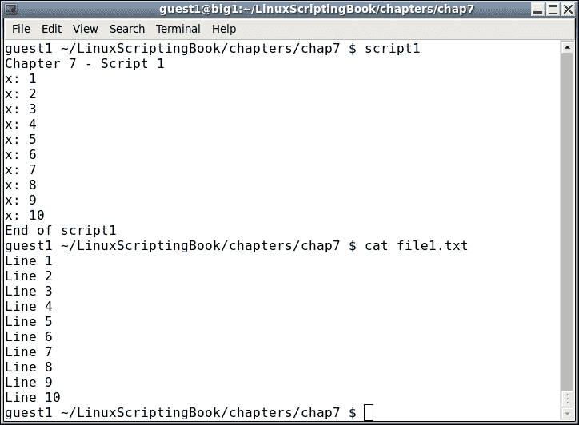
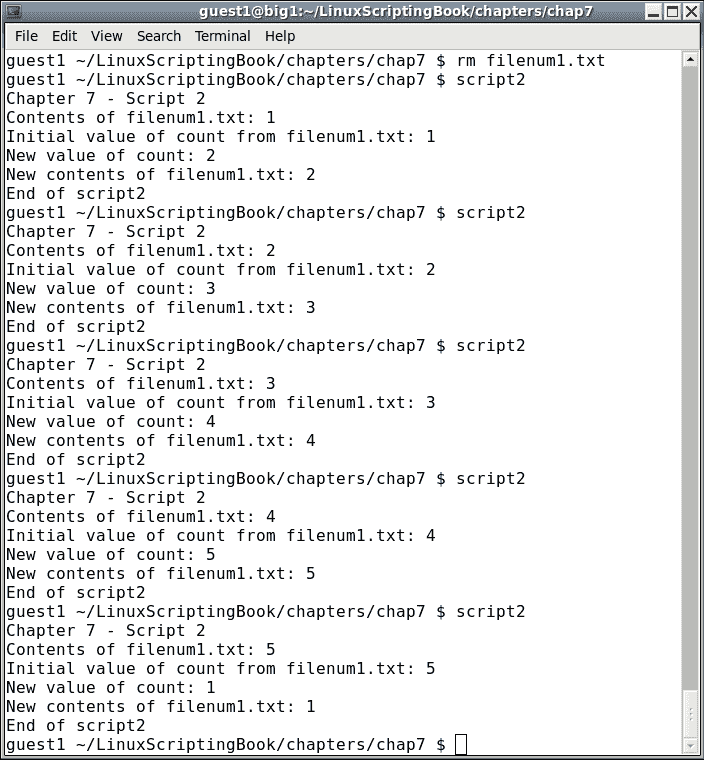
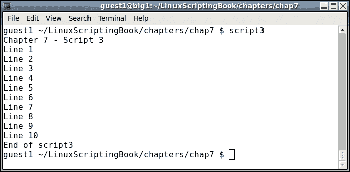
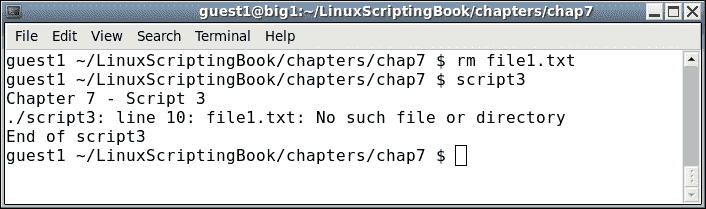
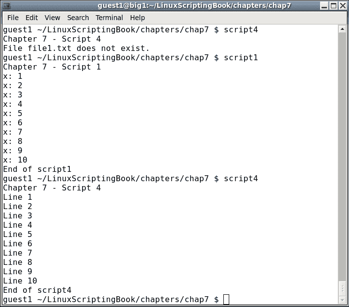
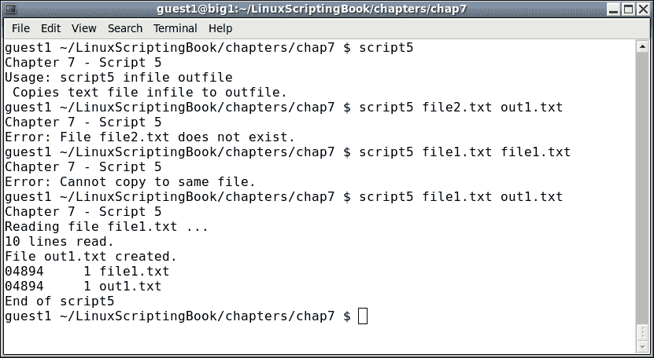
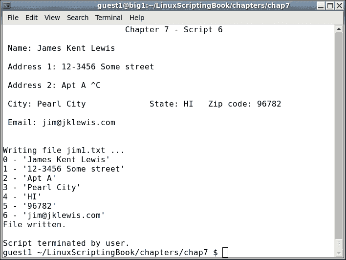
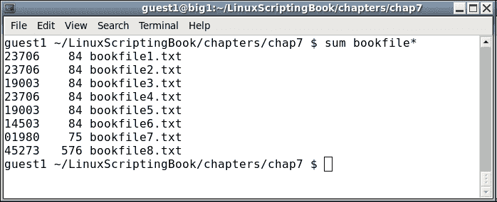
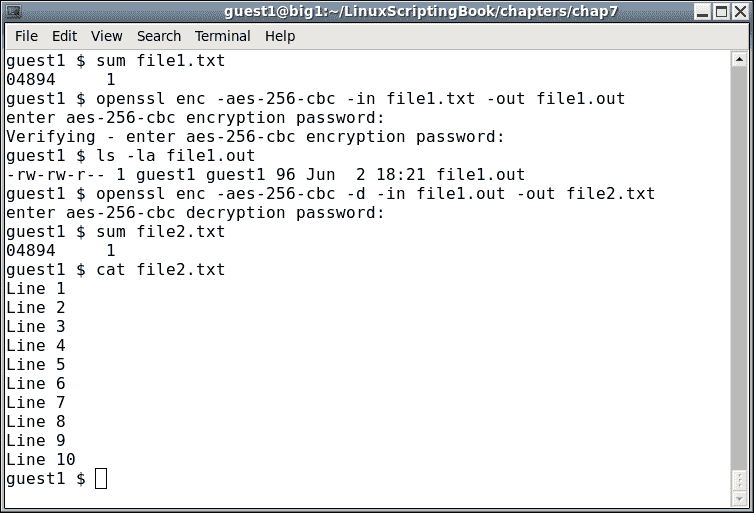
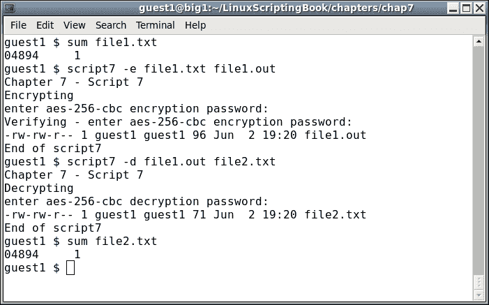

# 第七章：文件操作

本章将展示如何从文本文件中读取和写入。它还将涵盖文件加密和校验和。

本章涵盖的主题如下：

+   展示如何使用重定向操作符写出文件

+   展示如何读取文件

+   解释如何捕获命令的输出并在脚本中使用

+   查看`cat`和其他重要命令

+   涵盖文件加密和校验和程序，如 sum 和 OpenSSL

# 写文件

我们在之前的一些章节中展示了如何使用重定向操作符创建和写入文件。简而言之，此命令将创建文件`ifconfig.txt`（或覆盖文件，如果文件已经存在）：

```
  ifconfig  >  ifconfig.txt
```

以下命令将追加到任何先前的文件，如果文件不存在，则创建一个新文件：

```
  ifconfig  >>  ifconfig.txt
```

之前的一些脚本使用反引号操作符从文件中检索数据。让我们通过查看*脚本 1*来回顾一下：

## 第七章-脚本 1

```
#!/bin/sh
#
# 6/1/2017
#
echo "Chapter 7 - Script 1"
FN=file1.txt
rm $FN 2> /dev/null          # remove it silently if it exists
x=1
while [ $x -le 10 ]          # 10 lines
do
 echo "x: $x"
 echo "Line $x" >> $FN       # append to file
 let x++
done
echo "End of script1"
exit 0
```

这是一个截图：



这很简单。如果文件存在，它会将文件（静默地）删除，然后输出每一行到文件，每次增加`x`。当`x`达到`10`时，循环终止。

# 读取文件

现在让我们再次看看上一章中备份脚本用于从文件中获取值的方法：

## 第七章-脚本 2

```
#!/bin/sh
#
# 6/2/2017
#
echo "Chapter 7 - Script 2"

FN=filenum1.txt              # input/output filename
MAXFILES=5                   # maximum number before going back to 1

if [ ! -f $FN ] ; then
  echo 1 > $FN               # create the file if it does not exist
fi

echo -n "Contents of $FN: "
cat $FN                      # display the contents

count=`cat $FN`              # put the output of cat into variable count
echo "Initial value of count from $FN: $count"

let count++
if [ $count -gt $MAXFILES ] ; then
 count=1
fi

echo "New value of count: $count"
echo $count > $FN

echo -n "New contents of $FN: "
cat $FN

echo "End of script2"
exit 0
```

这是*脚本 2*的截图：



我们首先将`FN`变量设置为文件名（`filenum1.txt`）。它由`cat`命令显示，然后文件的内容被分配给`count`变量。它被显示，然后增加 1。新值被写回文件，然后再次显示。至少运行 6 次以查看其如何循环。

这只是创建和读取文件的一种简单方法。现在让我们看一个从文件中读取多行的脚本。它将使用前面*脚本 1*创建的文件`file1.txt`。

## 第七章-脚本 3

```
#!/bin/sh
#
# 6/1/2017
#
echo "Chapter 7 - Script 3"
FN=file1.txt                 # filename
while IFS= read -r linevar   # use read to put line into linevar
do
  echo "$linevar"            # display contents of linevar
done < $FN                   # the file to use as input
echo "End of script3"
exit 0
```

以下是输出：



这里的结构可能看起来有点奇怪，因为它与我们以前看到的非常不同。此脚本使用`read`命令获取文件的每一行。在语句中：

```
 while IFS= read -r linevar
```

`IFS=`（**内部字段分隔符**）防止`read`修剪前导和尾随的空白字符。`-r`参数使`read`忽略反斜杠转义序列。下一行使用重定向操作符，将`file1.txt`作为`read`的输入。

```
 done  <  $FN
```

这里有很多新材料，所以仔细查看，直到你对它感到舒适为止。

上面的脚本有一个小缺陷。如果文件不存在，将会出现错误。看看下面的截图：



Shell 脚本是解释性的，这意味着系统会逐行检查并运行。这与用 C 语言编写的程序不同，后者是经过编译的。这意味着任何语法错误都会在编译阶段出现，而不是在运行程序时出现。我们将在第九章“调试脚本”中讨论如何避免大多数 shell 脚本语法错误。

这是*脚本 4*，解决了缺少文件的问题：

## 第七章-脚本 4

```
#!/bin/sh
#
# 6/1/2017
#
echo "Chapter 7 - Script 4"

FN=file1.txt                 # filename
if [ ! -f $FN ] ; then
 echo "File $FN does not exist."
 exit 100
fi

while IFS= read -r linevar   # use read to put line into linevar
do
  echo "$linevar"            # display contents of linevar
done < $FN                   # the file to use as input

echo "End of script4"
exit 0
```

以下是输出：



在使用文件时请记住这一点，并始终检查文件是否存在，然后再尝试读取它。

# 读写文件

下一个脚本读取一个文本文件并创建其副本：

## 第七章-脚本 5

```
#!/bin/sh
#
# 6/1/2017
#
echo "Chapter 7 - Script 5"

if [ $# -ne 2 ] ; then
 echo "Usage: script5 infile outfile"
 echo " Copies text file infile to outfile."
 exit 255
fi

INFILE=$1
OUTFILE=$2

if [ ! -f $INFILE ] ; then
 echo "Error: File $INFILE does not exist."
 exit 100
fi

if [ $INFILE = $OUTFILE ] ; then
 echo "Error: Cannot copy to same file."
 exit 101
fi

rm $OUTFILE 2> /dev/null       # remove it
echo "Reading file $INFILE ..."

x=0
while IFS= read -r linevar     # use read to put line into linevar
do
  echo "$linevar" >> $OUTFILE  # append to file
  let x++
done < $INFILE                 # the file to use as input
echo "$x lines read."

diff $INFILE $OUTFILE          # use diff to check the output
rc=$?
if [ $rc -ne 0 ] ; then
 echo "Error, files do not match."
 exit 103
else
 echo "File $OUTFILE created."
fi

sum $INFILE $OUTFILE           # show the checksums

echo "End of script5"
exit $rc
```

这是*脚本 5*的截图：



这展示了如何在脚本中读写文本文件。以下解释了每一行：

+   脚本开始时检查是否给出了两个参数，如果没有，则显示“用法”消息。

+   然后检查输入文件是否存在，如果不存在，则以代码`100`退出。

+   检查以确保用户没有尝试复制到相同的文件，因为在第 34 行可能会发生语法错误。这段代码确保不会发生这种情况。

+   如果输出文件存在，则删除它。这是因为我们想要复制到一个新文件，而不是追加到现有文件。

+   `while`循环读取和写入行。对`x`中行数进行计数。

+   循环结束时输出行数。

+   作为一个健全性检查，使用`diff`命令来确保文件是相同的。

+   并且作为额外的检查，对这两个文件运行`sum`命令。

# 交互式地读写文件

这个脚本与第五章中的一个类似，创建交互式脚本。它读取指定的文件，显示一个表单，并允许用户编辑然后保存它：

## 第七章-脚本 6

```
#!/bin/sh
# 6/2/2017
# Chapter 7 - Script 6

trap catchCtrlC INT          # Initialize the trap

# Subroutines
catchCtrlC()
{
 move 13 0
 savefile
 movestr 23 0 "Script terminated by user."
 echo ""                     # carriage return
 exit 0
}

cls()
{
 tput clear
}

move()                       # move cursor to row, col
{
 tput cup $1 $2
}

movestr()                    # move cursor to row, col
{
 tput cup $1 $2
 echo -n "$3"                # display string
}

checktermsize()
{
 rc1=0                       # default is no error
 if [[ $LINES -lt $1 || $COLUMNS -lt $2 ]] ; then
  rc1=1                      # set return code
 fi
 return $rc1
}

init()                       # set up the cursor position array
{
 srow[0]=2;  scol[0]=7       # name
 srow[1]=4;  scol[1]=12      # address 1
 srow[2]=6;  scol[2]=12      # address 2
 srow[3]=8;  scol[3]=7       # city
 srow[4]=8;  scol[4]=37      # state
 srow[5]=8;  scol[5]=52      # zip code
 srow[6]=10; scol[6]=8       # email
}

drawscreen()                 # main screen draw routine
{
 cls                         # clear the screen
 movestr 0 25 "Chapter 7 - Script 6"

 movestr 2 1  "Name: ${array[0]}"
 movestr 4 1  "Address 1: ${array[1]}"
 movestr 6 1  "Address 2: ${array[2]}"
 movestr 8 1  "City: ${array[3]}"
 movestr 8 30 "State: ${array[4]}"
 movestr 8 42 "Zip code: ${array[5]}"
 movestr 10 1 "Email: ${array[6]}"
}

getdata()
{
 x=0                         # start at the first field
 while [ true ]
 do
  row=${srow[x]}; col=${scol[x]}
  move $row $col
  read var
  if [ -n "$var" ] ; then    # if not blank assign to array
    array[$x]=$var
  fi
  let x++
  if [ $x -eq $sizeofarray ] ; then
   x=0                       # go back to first field
  fi
 done

 return 0
}

savefile()
{
 rm $FN 2> /dev/null         # remove any existing file
 echo "Writing file $FN ..."
 y=0
 while [ $y -lt $sizeofarray ]
 do
  echo "$y - '${array[$y]}'"            # display to screen
  echo "${array[$y]}" >> "$FN"          # write to file
  let y++
 done
 echo "File written."
 return 0
}

getfile()
{
 x=0
 if [ -n "$FN" ] ; then      # check that file exists
  while IFS= read -r linevar # use read to put line into linevar
  do
   array[$x]="$linevar"
   let x++
  done < $FN                 # the file to use as input
 fi
 return 0
}

# Code starts here
if [ $# -ne 1 ] ; then
 echo "Usage: script6 file"
 echo " Reads existing file or creates a new file"
 echo " and allows user to enter data into fields."
 echo " Press Ctrl-C to end."
 exit 255
fi

FN=$1                        # filename (input and output)
sizeofarray=7                # number of array elements
checktermsize 25 80
rc=$?
if [ $rc -ne 0 ] ; then
 echo "Please size the terminal to 25x80 and try again."
 exit 1
fi

init                         # initialize the screen array
getfile                      # read in file if it exists
drawscreen                   # draw the screen
getdata                      # read in the data and put into the fields

exit 0
```

在我的系统上是这样的：



这是代码的描述：

+   在这个脚本中设置的第一件事是一个*Ctrl* + *C*的陷阱，它会导致文件被保存并且脚本结束。

+   定义子例程。

+   使用`getdata`例程读取用户输入。

+   `savefile`例程写出数据数组。

+   `getfile`例程将文件（如果存在）读入数组。

+   检查参数，因为需要一个文件名。

+   将`FN`变量设置为文件的名称。

+   在使用数组时，最好有一个固定的大小，即`sizeofarray`。

+   检查终端的大小，确保它是 25x80（或 80x25，取决于你的 GUI）。

+   调用`init`例程设置屏幕数组。

+   调用`getfile`和`drawscreen`例程。

+   `getdata`例程用于移动光标并将字段中的数据放入正确的数组位置。

+   *Ctrl* + *C*用于保存文件并终止脚本。

这是一个简单的 Bash 屏幕输入/输出例程的示例。这个脚本可能需要一些改进，以下是部分列表：

+   检查现有文件是否有特定的头。这可以帮助确保文件格式正确，避免语法错误。

+   检查输入文件，确保它是文本而不是二进制。提示：使用`file`和`grep`命令。

+   如果文件无法正确写出，请确保优雅地捕获错误。

# 文件校验和

你可能注意到了上面使用了`sum`命令。它显示文件的校验和和块计数，可用于确定两个或更多个文件是否是相同的文件（即具有完全相同的内容）。

这是一个真实世界的例子：

假设你正在写一本书，文件正在从作者发送到出版商进行审阅。出版商进行了一些修订，然后将修订后的文件发送回作者。有时很容易出现不同步的情况，并收到一个看起来没有任何不同的文件。如果对这两个文件运行`sum`命令，你可以轻松地确定它们是否相同。

看一下下面的截图：



第一列是校验和，第二列是块计数。如果这两者都相同，那意味着文件的内容是相同的。所以，在这个例子中，bookfiles 1、2 和 4 是相同的。Bookfiles 3 和 5 也是相同的。然而，bookfiles 6、7 和 8 与任何文件都不匹配，最后两个甚至没有相同的块计数。

### 提示

注意：`sum`命令只查看文件的内容和块计数。它不查看文件名或其他文件属性，如所有权或权限。要做到这一点，你可以使用`ls`和`stat`命令。

# 文件加密

有时候你可能想要加密系统中一些重要和/或机密的文件。有些人把他们的密码存储在计算机的文件中，这可能没问题，但前提是要使用某种类型的文件加密。有许多加密程序可用，在这里我们将展示 OpenSSL。

OpenSSL 命令行工具非常流行，很可能已经安装在您的计算机上（它默认安装在我的 CentOS 6.8 系统上）。它有几个选项和加密方法，但我们只会涵盖基础知识。

再次使用上面的`file1.txt`在您的系统上尝试以下操作：



我们首先对`file1.txt`文件执行求和，然后运行`openssl`。以下是语法：

+   `enc`：指定要使用的编码，在本例中是`aes-256-cbc`

+   `-in`：输入文件

+   `-out`：输出文件

+   `-d`：解密

运行`openssl`命令后，我们执行`ls -la`来验证输出文件是否确实已创建。

然后我们解密文件。请注意文件的顺序和添加`-d`参数（用于解密）。我们再次进行求和，以验证生成的文件与原始文件相同。

由于我不可能一直这样输入，让我们写一个快速脚本来做到这一点：

## 第七章-脚本 7

```
#!/bin/sh
#
# 6/2/2017
#
echo "Chapter 7 - Script 7"

if [ $# -ne 3 ] ; then
 echo "Usage: script7 -e|-d infile outfile"
 echo " Uses openssl to encrypt files."
 echo " -e to encrypt"
 echo " -d to decrypt"
 exit 255
fi

PARM=$1
INFILE=$2
OUTFILE=$3

if [ ! -f $INFILE ] ; then
 echo "Input file $INFILE does not exist."
 exit 100
fi

if [ "$PARM" = "-e" ] ; then
 echo "Encrypting"
 openssl enc -aes-256-cbc -in $INFILE -out $OUTFILE
elif [ "$PARM" = "-d" ] ; then
 echo "Decrypting"
 openssl enc -aes-256-cbc -d -in $INFILE -out $OUTFILE
else
 echo "Please specify either -e or -d."
 exit 101
fi

ls -la $OUTFILE

echo "End of script7"
exit 0
```

这是屏幕截图：



这显然比输入（或尝试记住）openssl 的语法要容易得多。正如您所看到的，解密后的文件（`file2.txt`）与`file1.txt`文件相同。

# 摘要

在本章中，我们展示了如何使用重定向运算符写出文件，以及如何使用（格式正确的）`read`命令读取文件。涵盖了将文件内容转换为变量的内容，以及使用校验和和文件加密。

在下一章中，我们将介绍一些可以用来从互联网上的网页收集信息的实用程序。
