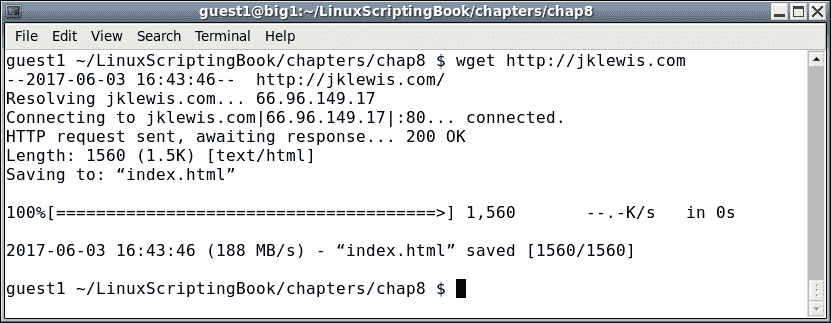
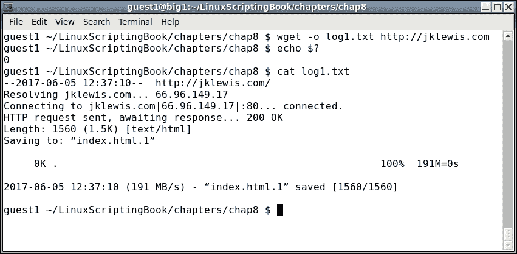
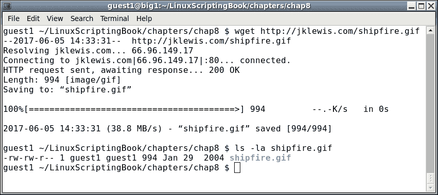
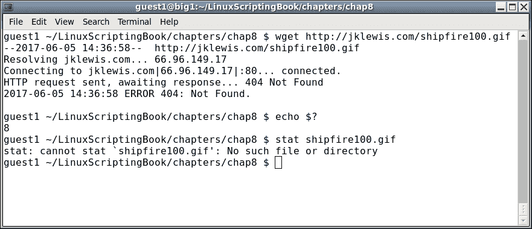
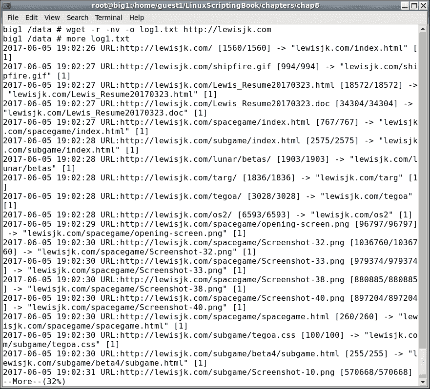
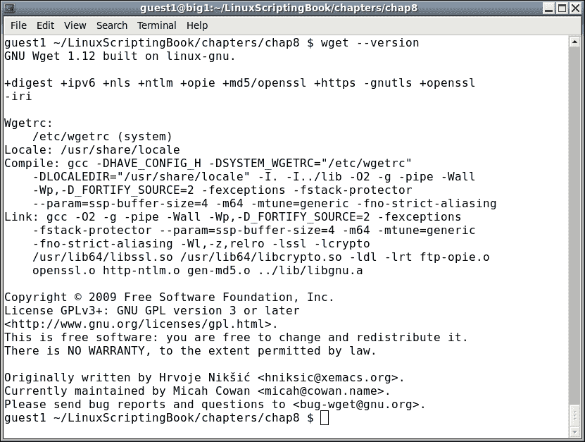
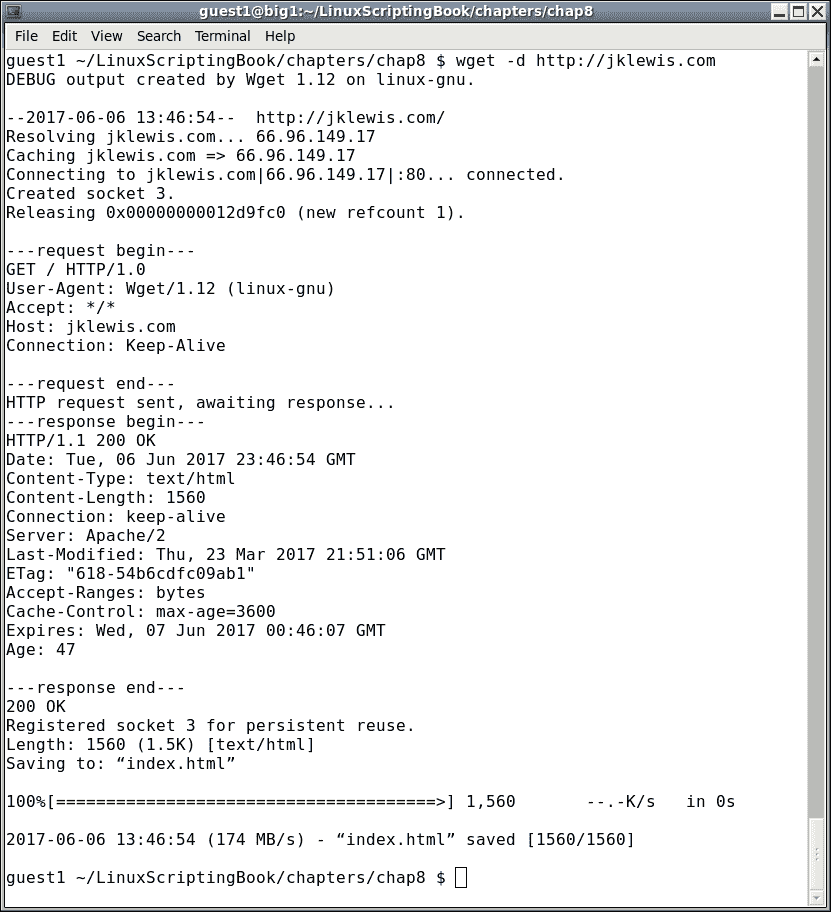
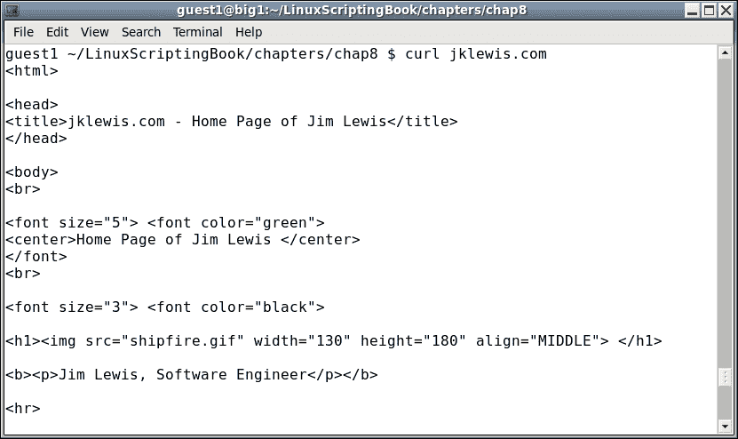
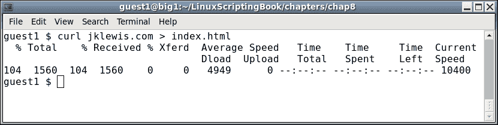
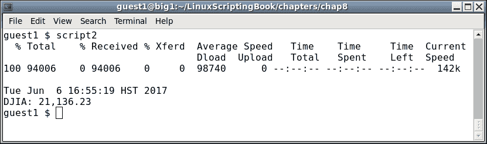

# 第八章。使用 wget 和 curl

本章将展示如何使用`wget`和`curl`直接从互联网上收集信息。

本章涵盖的主题有：

+   展示如何使用`wget`获取信息。

+   展示如何使用`curl`获取信息。

以这种方式收集数据的脚本可以是非常强大的工具。正如您从本章中所看到的，您可以从世界各地的网站自动获取股票报价、湖泊水位等等。

# 介绍 wget 程序

您可能已经听说过或者甚至使用过`wget`程序。它是一个命令行实用程序，可用于从互联网下载文件。

这里有一张截图显示了`wget`的最简单形式：



## wget 选项

在输出中，您可以看到`wget`从我的[jklewis.com](http://jklewis.com)网站下载了`index.html`文件。

这是`wget`的默认行为。标准用法是：

```
  wget [options] URL
```

其中**URL**代表**统一资源定位符**，或者网站的地址。

这里只是`wget`的许多可用选项的简短列表：

| 参数 | 解释 |
| --- | --- |
| `-o` | `log`文件，消息将被写入这里，而不是到`STDOUT` |
| `-a` | 与`-o`相同，除了它附加到`log`文件 |
| `-O` | 输出文件，将文件复制到这个名称 |
| `-d` | 打开调试 |
| `-q` | 静默模式 |
| `-v` | 详细模式 |
| `-r` | 递归模式 |

让我们试试另一个例子：



在这种情况下使用了`-o`选项。检查了返回代码，代码`0`表示没有失败。没有输出，因为它被定向到`log`文件，然后由`cat`命令显示。

在这种情况下使用了`-o`选项，将输出写入文件。没有显示输出，因为它被定向到`log`文件，然后由`cat`命令显示。检查了`wget`的返回代码，代码`0`表示没有失败。

请注意，这次它将下载的文件命名为`index.html.1`。这是因为`index.html`是在上一个例子中创建的。这个应用程序的作者这样做是为了避免覆盖先前下载的文件。非常好！

看看下面的例子：



在这里，我们告诉`wget`下载给定的文件（`shipfire.gif`）。

在下一个截图中，我们展示了`wget`如何返回一个有用的错误代码：



## wget 返回代码

这个错误发生是因为在我的网站的基本目录中没有名为`shipfire100.gif`的文件。请注意输出显示了**404 Not Found**消息，这在网络上经常看到。一般来说，这意味着在那个时间点请求的资源不可用。在这种情况下，文件不存在，所以会出现这个消息。

还要注意`wget`如何返回了一个`8`错误代码。`wget`的 man 页面显示了可能的退出代码：

| 错误代码 | 解释 |
| --- | --- |
| `0` | 没有发生问题。 |
| `1` | 通用错误代码。 |
| `2` | 解析错误。例如在解析命令行选项时，`.wgetrc`或`.netrc`文件 |
| `3` | 文件 I/O 错误。 |
| `4` | 网络故障。 |
| `5` | SSL 验证失败。 |
| `6` | 用户名/密码验证失败。 |
| `7` | 协议错误。 |
| `8` | 服务器发出错误响应。 |

返回`8`是非常合理的。服务器找不到文件，因此返回了`404`错误代码。

## wget 配置文件

现在是时候提到不同的`wget`配置文件了。有两个主要文件，`/etc/wgetrc`是全局`wget`启动文件的默认位置。在大多数情况下，您可能不应该编辑这个文件，除非您真的想要进行影响所有用户的更改。文件`$HOME/.wgetrc`是放置任何您想要的选项的更好位置。一个好的方法是在文本编辑器中打开`/etc/wgetrc`和`$HOME/.wgetrc`，然后将您想要的部分复制到您的`$HOME./wgetrc`文件中。

有关`wget`配置文件的更多信息，请参阅`man`页面（`man wget`）。

现在让我们看看`wget`的运行情况。我写了这个脚本一段时间，以跟踪我曾经划船的湖泊的水位：

### 第八章-脚本 1

```
#!/bin/sh
# 6/5/2017
# Chapter 8 - Script 1

URL=http://www.arlut.utexas.edu/omg/weather.html
FN=weather.html
TF=temp1.txt                 # temp file
LF=logfile.txt               # log file

loop=1
while [ $loop -eq 1 ]
do
 rm $FN 2> /dev/null         # remove old file
 wget -o $LF $URL
 rc=$?
 if [ $rc -ne 0 ] ; then
  echo "wget returned code: $rc"
  echo "logfile:"
  cat $LF

  exit 200
 fi

 date
 grep "Lake Travis Level:" $FN > $TF
 cat $TF | cut  -d ' ' -f 12 --complement

 sleep 1h
done

exit 0
```

这个输出是从 2017 年 6 月 5 日。它看起来不怎么样，但在这里：

第八章-脚本 1

您可以从脚本和输出中看到，它每小时运行一次。如果您想知道为什么会有人写这样的东西，我需要知道湖泊水位是否低于 640 英尺，因为我必须把我的船移出码头。这是德克萨斯州的一次严重干旱期间。

编写这样的脚本时需要记住一些事情：

+   首次编写脚本时，手动执行`wget`一次，然后使用下载的文件进行操作。

+   不要在短时间内多次使用`wget`，否则您可能会被网站屏蔽。

+   请记住，HTML 程序员喜欢随时更改事物，因此您可能需要相应地调整您的脚本。

+   当您最终调整好脚本时，一定要再次激活`wget`。

# wget 和递归

`wget`程序还可以使用递归（`-r`）选项下载整个网站的内容。

例如，请查看以下屏幕截图：



使用无冗长（`-nv`）选项来限制输出。`wget`命令完成后，使用 more 命令来查看日志的内容。根据文件数量，输出可能会非常长。

在使用`wget`时，您可能会遇到意外问题。它可能不会获取任何文件，或者可能获取其中一些但不是全部。它甚至可能在没有合理错误消息的情况下失败。如果发生这种情况，请非常仔细地查看`man`页面（`man wget`）。可能有一个选项可以帮助您解决问题。特别是要查看以下内容。

在您的系统上运行`wget --version`。它将显示选项和功能的详细列表，以及`wget`的编译方式。

以下是从我运行 CentOS 6.8 64 位系统中获取的示例：



# wget 选项

通常情况下，`wget`的默认设置对大多数用户来说已经足够好，但是，您可能需要不时地进行调整，以使其按照您的意愿进行工作。

以下是一些`wget`选项的部分列表：

| wget 选项 | 解释 |
| --- | --- |
| --- | --- |
| `-o`文件名 | 将输出消息输出到`log`文件。这在本章中已经介绍过了。 |
| `-t`数字 | 在放弃连接之前尝试的次数。 |
| `-c` | 继续从以前的`wget`中下载部分下载的文件。 |
| `-S` | 显示服务器发送的标头。 |
| `-Q`数字 | 下载的总字节数配额。数字可以是字节，千字节（k）或兆字节（m）。设置为 0 或 inf 表示没有配额。 |
| `-l`数字 | 这指定了最大递归级别。默认值为 5。 |
| `-m` | 在尝试创建站点的镜像时很有用。相当于使用`-r -N -l inf --no-remove-listing`选项。 |

您可能尝试的另一件事是使用`-d`选项打开调试。请注意，这仅在您的`wget`版本编译时带有调试支持时才有效。让我们看看当我在我的系统上尝试时会发生什么：



我不确定调试是否已打开，现在我知道了。这个输出可能不是很有用，除非你是开发人员，但是，如果你需要发送关于`wget`的错误报告，他们会要求调试输出。

正如你所看到的，`wget`是一个非常强大的程序，有许多选项。

### 注意

记得小心使用`wget`，不要忘记在循环中至少放一个睡眠。一个小时会更好。

# curl

现在让我们看一下`curl`程序，因为它与`wget`有些相似。`wget`和`curl`之间的主要区别之一是它们如何处理输出。

`wget`程序默认在屏幕上显示一些进度信息，然后下载`index.html`文件。相比之下，`curl`通常在屏幕上显示文件本身。

这是`curl`在我的系统上运行的一个例子，使用了我最喜欢的网站（截图缩短以节省空间）：



将输出重定向到文件的另一种方法是使用重定向，就像这样：



当重定向到文件时，你会注意到传输进度显示在屏幕上。还要注意，如果重定向了，任何错误输出都会进入文件而不是屏幕。

## curl 选项

这里是 curl 中可用选项的一个非常简要的列表：

| Curl 选项 | 说明 |
| --- | --- |
| `-o` | 输出文件名 |
| `-s` | 静默模式。什么都不显示，甚至错误也不显示 |
| `-S` | 在静默模式下显示错误 |
| `-v` | 详细模式，用于调试 |

`curl`还有许多其他选项，以及几页的返回代码。要了解更多信息，请参阅`curl man`页面。

现在这里有一个脚本，展示了如何使用 curl 自动获取道琼斯工业平均指数的当前值：

### 第八章-脚本 2

```
#!/bin/sh
# 6/6/2017
# Chapter 8 - Script 2

URL="https://www.google.com/finance?cid=983582"
FN=outfile1.txt              # output file
TF=temp1.txt                 # temp file for grep

loop=1
while [ $loop -eq 1 ]
do
 rm $FN 2> /dev/null         # remove old file
 curl -o $FN $URL            # output to file
 rc=$?
 if [ $rc -ne 0 ] ; then
  echo "curl returned code: $rc"
  echo "outfile:"
  cat $FN

  exit 200
 fi

 echo ""                     # carriage return
 date
 grep "ref_983582_l" $FN > $TF
 echo -n "DJIA: "
 cat $TF | cut -c 25-33

 sleep 1h
done

exit 0
```

这是在我的系统上的样子。通常情况下，你可能会使用`-s`选项将进度信息从输出中去掉，但我觉得它看起来很酷，所以留了下来：



你可以看到`curl`和`wget`基本上是以相同的方式工作的。记住，当编写这样的脚本时，要牢记页面的格式几乎肯定会不时改变，所以要做好相应的计划。

# 总结

在本章中，我们展示了如何在脚本中使用`wget`和`curl`。展示了这些程序的默认行为，以及其中的许多选项。还讨论了返回代码，并呈现了一些示例脚本。 

以下章节将介绍如何更轻松地调试脚本中的语法和逻辑错误。
