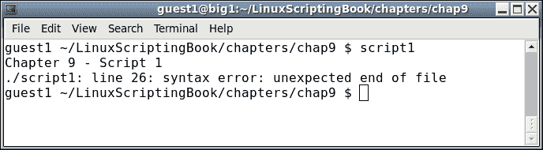
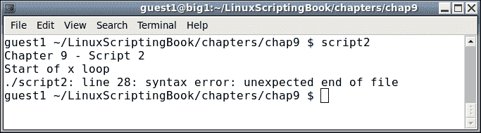
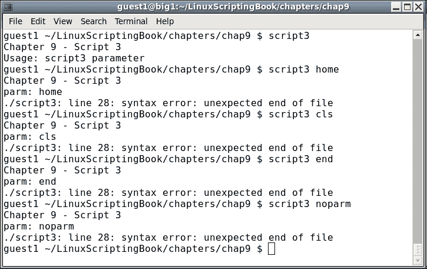
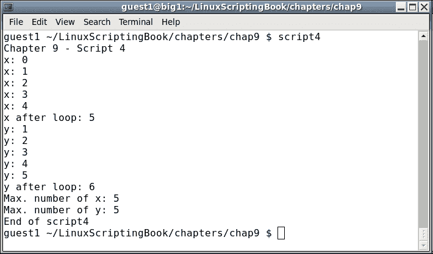
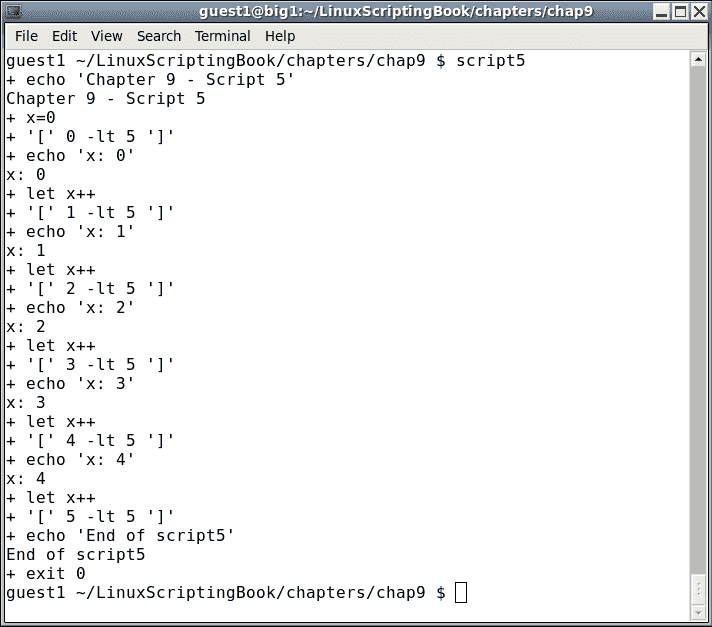
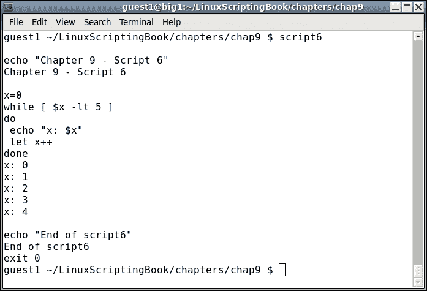
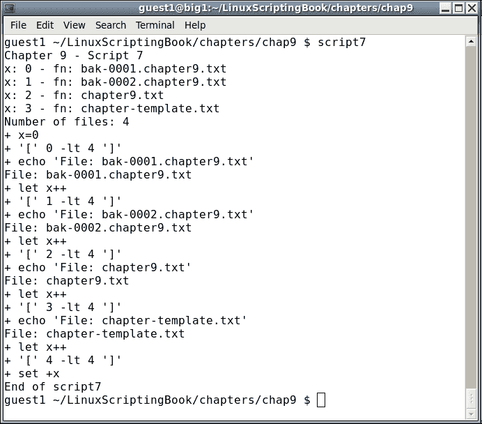
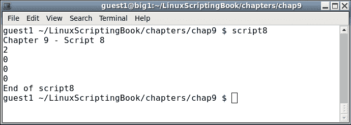
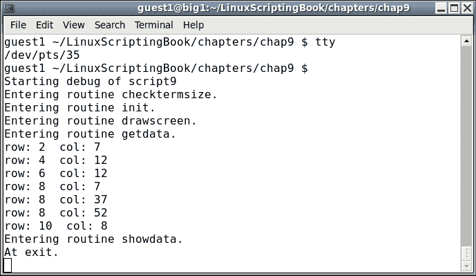

# 第九章：调试脚本

本章介绍了如何调试 Bash shell 脚本。

使用任何语言进行编程，无论是 C、Java、FORTRAN、COBOL*还是 Bash，都可能非常有趣。然而，通常不有趣的是当出现问题时，需要花费大量时间找到问题并解决问题。本章将尝试向读者展示如何避免一些常见的语法和逻辑错误，以及在出现这些错误时如何找到它们。

*COBOL：好吧，我必须说，在 COBOL 中编程从来都不是一件有趣的事情！

本章涵盖的主题是：

+   如何防止一些常见的语法和逻辑错误。

+   shell 调试命令，如`set -x`和`set -v`。

+   其他设置调试的方法。

+   如何使用重定向实时调试。

# 语法错误

在编写脚本或程序时，遇到语法错误弹出来可能会让人非常沮丧。在某些情况下，解决方案非常简单，您可以立即找到并解决它。在其他情况下，可能需要花费几分钟甚至几个小时。以下是一些建议：

编写循环时，首先放入整个`while...do...done`结构。有时很容易忘记结束的`done`语句，特别是如果代码跨越了一页以上。

看看*脚本 1*：

## 第九章-脚本 1

```
#!/bin/sh
#
# 6/7/2017
#
echo "Chapter 9 - Script 1"

x=0
while [ $x -lt 5 ]
do
 echo "x: $x"
 let x++

y=0
while [ $y -lt 5 ]
do
 echo "y: $y"
 let y++
done

# more code here
# more code here

echo "End of script1"
exit 0
```

以下是输出：



仔细看，它说错误出现在**第 26 行**。哇，怎么可能，当文件只有 25 行时？简单的答案是这就是 Bash 解释器处理这种情况的方式。如果您还没有找到错误，实际上是在第 12 行。这就是应该出现`done`语句的地方，我故意省略了它，导致了错误。现在想象一下，如果这是一个非常长的脚本。根据情况，可能需要很长时间才能找到导致问题的行。

现在看看*脚本 2*，它只是*脚本 1*，带有一些额外的`echo`语句：

## 第九章-脚本 2

```
#!/bin/sh
#
# 6/7/2017
#
echo "Chapter 9 - Script 2"

echo "Start of x loop"
x=0
while [ $x -lt 5 ]
do
 echo "x: $x"
 let x++

echo "Start of y loop"
y=0
while [ $y -lt 5 ]
do
 echo "y: $y"
 let y++
done

# more code here
# more code here

echo "End of script2"
exit 0
```

以下是输出：



您可以看到`echo`语句“x 循环的开始”已显示。但是，第二个“y 循环的开始”没有显示。这让你很清楚，错误出现在第二个`echo`语句之前的某个地方。在这种情况下，就在前面，但不要指望每次都那么幸运。

# 自动备份

现在给出一些免费的编程建议，备份文件的自动备份在第四章中提到过，*创建和调用子例程*。我强烈建议在编写任何稍微复杂的东西时使用类似的方法。没有什么比在编写程序或脚本时工作得很顺利，只是做了一些更改，然后以一种奇怪的方式失败更令人沮丧的了。几分钟前它还在工作，然后砰！它出现了故障，您无法弄清楚是什么更改导致了它。如果您没有编号的备份，您可能会花费几个小时（也许是几天）来寻找错误。我见过人们花费数小时撤消每个更改，直到找到问题。是的，我也这样做过。

显然，如果您有编号的备份，只需返回并找到最新的没有故障的备份。然后您可以对比两个版本，可能会非常快地找到错误。如果没有编号的备份，那么您就自己解决了。不要像我一样等待 2 年或更长时间才意识到所有这些。

# 更多的语法错误

Shell 脚本的一个基本问题是，语法错误通常直到解释器解析具有问题的行时才会显示出来。以下是一个我经常犯的常见错误。看看你能否通过阅读脚本找到问题：

## 第九章-脚本 3

```
#!/bin/sh
#
# 6/7/2017
#
echo "Chapter 9 - Script 3"

if [ $# -ne 1 ] ; then
 echo "Usage: script3 parameter"
 exit 255
fi

parm=$1
echo "parm: $parm"

if [ "$parm" = "home" ] ; then
 echo "parm is home."
elif if [ "$parm" = "cls" ] ; then
 echo "parm is cls."
elif [ "$parm" = "end" ] ; then
 echo "parm is end."
else
 echo "Unknown parameter: $parm"
fi

echo "End of script3"
exit 0
```

以下是输出：



你找到我的错误了吗？当我编写`if...elif...else`语句时，我倾向于复制并粘贴第一个`if`语句。然后我在下一个语句前加上`elif`，但忘记删除`if`。这几乎每次都会让我犯错。

看看我是如何运行这个脚本的。我首先只用脚本的名称来调用`Usage`子句。你可能会发现有趣的是，解释器没有报告语法错误。那是因为它从来没有执行到那一行。这可能是脚本的一个真正问题，因为它可能运行数天、数周，甚至数年，然后在有语法错误的代码部分运行并失败。在编写和测试脚本时请记住这一点。

这里是另一个经典语法错误的快速示例（经典是指我刚刚再次犯了这个错误）：

```
for i in *.txt
 echo "i: $i"
done
```

运行时输出如下：

```
./script-bad: line 8: syntax error near unexpected token `echo'
./script-bad: line 8: ` echo "i: $i"'
```

你能找到我的错误吗？如果找不到，请再看一遍。我忘了在`for`语句后加上`do`语句。糟糕的 Jim！

在脚本中最容易出错的事情之一是忘记在变量前加上`$`。如果你在其他语言如 C 或 Java 中编码，特别容易出错，因为在这些语言中你不需要在变量前加上`$`。我能给出的唯一真正的建议是，如果你的脚本似乎做不对任何事情，请检查所有的变量是否有`$`。但要小心，不要过度添加它们！

# 逻辑错误

现在让我们谈谈逻辑错误。这些很难诊断，不幸的是我没有任何神奇的方法来避免这些错误。然而，有一些事情可以指出来，以帮助追踪它们。

编码中的一个常见问题是所谓的 1 偏差错误。这是由于计算机语言设计者在六十年代决定从 0 开始编号事物而引起的。计算机可以愉快地从任何地方开始计数，而且从不抱怨，但大多数人类在从 1 开始计数时通常做得更好。我的大多数同行可能会不同意这一点，但由于我总是不得不修复他们的 1 偏差缺陷，我坚持我的看法。

现在让我们看一下以下非常简单的脚本：

## 第九章 - 脚本 4

```
#!/bin/sh
#
# 6/7/2017
#
echo "Chapter 9 - Script 4"

x=0
while [ $x -lt 5 ]
do
 echo "x: $x"
 let x++
done

echo "x after loop: $x"
let maxx=x

y=1
while [ $y -le 5 ]
do
 echo "y: $y"
 let y++
done

echo "y after loop: $y"
let maxy=y-1                 # must subtract 1

echo "Max. number of x: $maxx"
echo "Max. number of y: $maxy"

echo "End of script4"
exit 0
```

输出：



看一下两个循环之间的微妙差异：

+   在`x`循环中，计数从`0`开始。

+   `x`在小于`5`的情况下递增。

+   循环后`x`的值为`5`。

+   变量`maxx`，它应该等于迭代次数，被设置为`x`。

+   在`y`循环中，计数从`1`开始。

+   `y`在小于或等于`5`的情况下递增。

+   循环后`y`的值为`6`。

+   变量`maxy`，它应该等于迭代次数，被设置为`y-1`。

如果你已经完全理解了上面的内容，你可能永远不会遇到 1 偏差错误的问题，那太好了。

对于我们其他人，我建议你仔细看一下，直到你完全理解为止。

# 使用 set 调试脚本

你可以使用`set`命令来帮助调试你的脚本。`set`有两个常见的选项，`x`和`v`。以下是每个选项的描述。

请注意，`-`激活`set`，而`+`则取消激活。如果这对你来说听起来很反常，那是因为它确实是反常的。

使用：

+   `set -x`：在运行命令之前显示扩展的跟踪

+   `set -v`：显示解析输入行

看一下*脚本 5*，它展示了`set -x`的作用：

## 第九章 - 脚本 5 和脚本 6

```
#!/bin/sh
#
# 6/7/2017
#
set -x                       # turn debugging on

echo "Chapter 9 - Script 5"

x=0
while [ $x -lt 5 ]
do
 echo "x: $x"
 let x++
done

echo "End of script5"
exit 0
```

输出：



如果一开始看起来有点奇怪，不要担心，你看得越多就会变得更容易。实质上，以`+`开头的行是扩展的源代码行，而没有`+`的行是脚本的输出。

看一下前两行。它显示：

```
 + echo 'Chapter 9 - Script 5'
 Chapter 9 - Script 5
```

第一行显示了扩展的命令，第二行显示了输出。

您还可以使用`set -v`选项。这是*Script 6*的屏幕截图，它只是*Script 5*，但这次使用了`set -v`：



您可以看到输出有很大的不同。

请注意，使用`set`命令，您可以在脚本中的任何时候打开和关闭它们。这样可以将输出限制为您感兴趣的代码区域。

让我们看一个例子：

## 第九章 - 脚本 7

```
#!/bin/sh
#
# 6/8/2017
#
set +x                       # turn debugging off

echo "Chapter 9 - Script 7"

x=0
for fn in *.txt
do
 echo "x: $x - fn: $fn"
 array[$x]="$fn"
 let x++
done

maxx=$x
echo "Number of files: $maxx"

set -x                       # turn debugging on

x=0
while [ $x -lt $maxx ]
do
  echo "File: ${array[$x]}"
  let x++
done

set +x                       # turn debugging off

echo "End of script7"
exit 0
```

和输出：



请注意，尽管默认情况下关闭了调试，但在脚本开头明确关闭了调试。这是一个很好的方法，可以跟踪何时关闭和何时打开调试。仔细查看输出，看看调试语句直到第二个循环与数组开始显示。然后在运行最后两行之前关闭它。

使用`set`命令时的输出有时可能很难看，因此这是限制您必须浏览以找到感兴趣的行的好方法。

还有一种调试技术，我经常使用。在许多情况下，我认为它优于使用`set`命令，因为显示不会变得太混乱。您可能还记得在第六章中，*使用脚本自动化任务*，我们能够将输出显示到其他终端。这是一个非常方便的功能。

以下脚本显示了如何在另一个终端中显示输出。一个子例程用于方便：

## 第九章 - 脚本 8

```
#!/bin/sh
#
# 6/8/2017
#
echo "Chapter 9 - Script 8"
TTY=/dev/pts/35              # TTY of other terminal

# Subroutines
p1()                         # display to TTY
{
 rc1=0                       # default is no error
 if [ $# -ne 1 ] ; then
  rc1=2                      # missing parameter
 else
  echo "$1" > $TTY
  rc1=$?                     # set error status of echo command
 fi

 return $rc1
}

# Code
p1                           # missing parameter
echo $?

p1 Hello
echo $?

p1 "Linux Rules!"
echo $?

p1 "Programming is fun!"
echo $?

echo "End of script8"
exit 0
```

和输出：



记得引用`p1`的参数，以防它包含空格字符。

这个子例程可能有点过度使用于调试，但它涵盖了本书中之前讨论的许多概念。这种方法也可以用于在脚本中在多个终端中显示信息。我们将在下一章中讨论这一点。

### 提示

当写入终端时，如果收到类似于此的消息：

./script8: 第 26 行：/dev/pts/99：权限被拒绝

这可能意味着终端尚未打开。还要记住将终端设备字符串放入变量中，因为这些在重新启动后往往会更改。像`TTY=/dev/pts/35`这样的东西是个好主意。

使用这种调试技术的好时机是在编写表单脚本时，就像我们在第五章中所做的那样，*创建交互式脚本*。因此，让我们再次看一下该脚本，并使用这个新的子例程。

## 第九章 - 脚本 9

```
#!/bin/sh
# 6/8/2017
# Chapter 9 - Script 9
#
TTY=/dev/pts/35              # debug terminal

# Subroutines
cls()
{
 tput clear
}

move()                       # move cursor to row, col
{
 tput cup $1 $2
}

movestr()                    # move cursor to row, col
{
 tput cup $1 $2
 echo -n "$3"                # display string
}

checktermsize()
{
 p1 "Entering routine checktermsize."

 rc1=0                       # default is no error
 if [[ $LINES -lt $1 || $COLUMNS -lt $2 ]] ; then
  rc1=1                      # set return code
 fi
 return $rc1
}

init()                       # set up the cursor position array
{
 p1 "Entering routine init."

 srow[0]=2;  scol[0]=7       # name
 srow[1]=4;  scol[1]=12      # address 1
 srow[2]=6;  scol[2]=12      # address 2
 srow[3]=8;  scol[3]=7       # city
 srow[4]=8;  scol[4]=37      # state
 srow[5]=8;  scol[5]=52      # zip code
 srow[6]=10; scol[6]=8       # email
}

drawscreen()                 # main screen draw routine
{
 p1 "Entering routine drawscreen."

 cls                         # clear the screen
 movestr 0 25 "Chapter 9 - Script 9"
 movestr 2 1 "Name:"
 movestr 4 1 "Address 1:"
 movestr 6 1 "Address 2:"
 movestr 8 1 "City:"
 movestr 8 30 "State:"
 movestr 8 42 "Zip code:"
 movestr 10 1 "Email:"
}

getdata()
{
 p1 "Entering routine getdata."

 x=0                         # array subscript
 rc1=0                       # loop control variable
 while [ $rc1 -eq 0 ]
 do
  row=${srow[x]}; col=${scol[x]}

  p1 "row: $row  col: $col"

  move $row $col
  read array[x]
  let x++
  if [ $x -eq $sizeofarray ] ; then
   rc1=1
  fi
 done
 return 0
}

showdata()
{
 p1 "Entering routine showdata."

 fn=0
 echo ""
 read -p "Enter filename, or just Enter to skip: " filename
 if [ -n "$filename" ] ; then       # if not blank
  echo "Writing to '$filename'"
  fn=1                       # a filename was given
 fi
 echo ""                     # skip 1 line
 echo "Data array contents: "
 y=0
 while [ $y -lt $sizeofarray ]
 do
  echo "$y - ${array[$y]}"
  if [ $fn -eq 1 ] ; then
   echo "$y - ${array[$y]}" >> "$filename"
  fi
  let y++
 done
 return 0
}

p1()                         # display to TTY
{
 rc1=0                       # default is no error
 if [ $# -ne 1 ] ; then
  rc1=2                      # missing parameter
 else
  echo "$1" > $TTY
  rc1=$?                     # set error status of echo command
 fi

 return $rc1
}

# Code starts here

p1 " "                       # carriage return
p1 "Starting debug of script9"

sizeofarray=7                # number of array elements

if [ "$1" = "--help" ] ; then
 p1 "In Usage clause."

 echo "Usage: script9 --help"
 echo " This script shows how to create an interactive screen program"
 echo " and how to use another terminal for debugging."
 exit 255
fi

checktermsize 25 80
rc=$?
if [ $rc -ne 0 ] ; then
 echo "Please size the terminal to 25x80 and try again."
 exit 1
fi

init                         # initialize the screen array
drawscreen                   # draw the screen
getdata                      # cursor movement and data input routine
showdata                     # display the data

p1 "At exit."
exit 0
```

这是调试终端的输出（`dev/pts/35`）：



通过在另一个终端中显示调试信息，更容易看到代码中发生了什么。

您可以将`p1`例程放在您认为问题可能出现的任何地方。标记正在使用的子例程也可以帮助确定问题是在子例程中还是在主代码体中。

当您的脚本完成并准备好使用时，您不必删除对`p1`例程的调用，除非您真的想这样做。您只需在例程顶部编写`return 0`。

我在调试 shell 脚本或 C 程序时使用这种方法，它对我来说总是非常有效。

# 摘要

在本章中，我们解释了如何防止一些常见的语法和逻辑错误。还描述了 shell 调试命令`set -x`和`set -v`。还展示了使用重定向将脚本的输出发送到另一个终端以实时调试的方法。

在下一章中，我们将讨论脚本编写的最佳实践。这包括仔细备份您的工作并选择一个好的文本编辑器。还将讨论使用环境变量和别名来帮助您更有效地使用命令行的方法。
