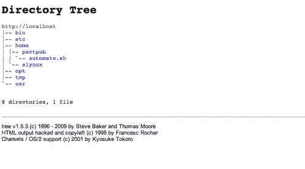

# 第三章：文件输入，文件输出

在本章中，我们将涵盖：

+   生成任意大小的文件

+   文本文件上的交集和集差（A-B）

+   查找和删除重复文件

+   为长路径创建目录

+   文件权限、所有权和粘性位

+   使文件不可变

+   批量生成空白文件

+   查找符号链接及其目标

+   列举文件类型统计

+   回环文件和挂载

+   创建 ISO 文件，混合 ISO

+   查找文件之间的差异，打补丁

+   头和尾-打印最后或前 10 行

+   仅列出目录-替代方法

+   使用 pushd 和 popd 进行快速命令行目录导航

+   计算文件中的行数、单词数和字符数

+   打印目录树

# 介绍

UNIX 将操作系统中的每个对象都视为文件。我们可以找到与执行的每个操作相关联的文件，并可以利用它们进行不同的系统或进程相关的操作。例如，我们使用的命令终端与设备文件相关联。我们可以通过向特定终端的相应设备文件写入来写入终端。文件可以采用不同的形式，如目录、常规文件、块设备、字符特殊设备、符号链接、套接字、命名管道等。文件名、大小、文件类型、修改时间、访问时间、更改时间、inode、关联的链接以及文件所在的文件系统都是文件可能具有的属性和属性。本章涉及处理与文件相关的任何操作或属性的配方。

# 生成任意大小的文件

出于各种原因，您可能需要生成一个填充有随机数据的文件。这可能是为了创建一个用于执行测试的测试文件，例如使用大文件作为输入的应用程序效率测试，或者测试将文件拆分成多个文件，或者创建回环文件系统（回环文件是可以包含文件系统本身的文件，这些文件可以类似于使用`mount`命令挂载物理设备）。通过编写特定的程序来创建这样的文件是很困难的。因此，我们使用通用实用程序。

## 如何做...

使用`dd`命令创建指定大小的大文件是最简单的方法。`dd`命令克隆给定的输入并将精确的副本写入输出。输入可以是`stdin`、设备文件、常规文件等。输出可以是`stdout`、设备文件、常规文件等。`dd`命令的示例如下：

```

$ dd if=/dev/zero of=junk.data bs=1M count=1
1+0 records in
1+0 records out
1048576 bytes (1.0 MB) copied, 0.00767266 s, 137 MB/s

```

上述命令将创建一个名为`junk.data`的文件，其大小正好为 1MB。让我们来看看参数：`if`代表`- 输入`文件，`of`代表`- 输出`文件，`bs`代表块的字节数，`count`代表要复制的`bs`块数。

在这里，我们只通过将`bs`设置为 1MB 并将计数设置为 1 来创建一个大小为 1MB 的文件。如果`bs`设置为`2M`，计数设置为 2，则总文件大小将为 4MB。

我们可以使用以下各种单位来指定**块** **大小**（**BS**）。将以下任何字符附加到数字后，以指定以字节为单位的大小：

| 单位大小 | 代码 |
| --- | --- |
| 字节（1B） | `c` |
| 字（2B） | `w` |
| 块（512B） | `b` |
| 千字节（1024B） | `k` |
| 兆字节（1024 KB） | `M` |
| Giga Byte（1024 MB） | `G` |

我们可以使用这个来生成任意大小的文件。我们可以使用前面表中提到的其他单位符号，而不是 MB。

`/dev/zero`是一个字符特殊设备，它无限返回零字节（`\0`）。

如果未指定输入参数（`if`），它将默认从`stdin`读取输入。同样，如果未指定输出参数（`of`），它将使用`stdout`作为默认输出接收器。

`dd`命令还可用于通过传输大量数据并检查命令输出（例如，`1048576 字节（1.0 MB）已复制，0.00767266 秒，137 MB/s`，如前面的示例所示）来测量内存操作的速度。

# 交集和集合差异（A-B）的文本文件

交集和集合差异操作在集合论数学课上通常被使用。然而，在文本上进行类似的操作在某些情况下也非常有帮助。

## 准备工作

`comm`命令是一个用于比较两个文件的实用程序。它有许多很好的选项，可以安排输出，以便我们可以执行交集、差异和集合差异操作。

+   **交集**：交集操作将打印指定文件彼此之间共有的行。

+   **差异**：差异操作将打印指定文件包含的行，而这些行在所有这些文件中都不相同。

+   **集合差异**：集合差异操作将打印文件“A”中与指定的所有文件集合（例如“B”加“C”）中不匹配的行。

## 如何做...

请注意，`comm`接受排序后的文件作为输入。看一下以下示例：

```
$ cat A.txt
apple
orange
gold
silver
steel
iron

$ cat B.txt
orange
gold
cookies
carrot

$ sort A.txt -o A.txt ; sort B.txt -o B.txt
$ comm A.txt B.txt 
apple
 carrot
 cookies
 gold
iron
 orange
silver
steel

```

输出的第一列包含了在`A.txt`中的行，不包括两个文件中的共同行。第二列包含了在`B.txt`中的行，不包括共同行。第三列包含了来自`A.txt`和`B.txt`的共同行。每一列都是用制表符（`\t`）分隔的。

有一些选项可用于根据我们的要求格式化输出。例如：

+   `-1`从输出中删除第一列

+   `-2`删除第二列

+   `-3`删除第三列

为了打印两个文件的交集，我们需要删除第一列和第二列，只打印第三列，如下所示：

```
$ comm A.txt B.txt -1 -2
gold
orange

```

打印在两个文件中不常见的行，如下所示：

```
$ comm A.txt B.txt  -3
apple
 carrot
 cookies
iron
silver
steel

```

在`comm`命令中使用`-3`参数可以从输出中删除第三列。但是，它会将第一列和第二列写入输出。第一列包含了`A.txt`中不包括`B.txt`中的行。同样，第二列包含了`B.txt`中不包括`A.txt`中的行。由于输出是双列输出，因此并不是很有用。每个唯一行的列都有空白字段。因此，两列都不会在同一行上有内容。两列中的其中一列将会有内容。为了使其成为可用的输出文本格式，我们需要删除空白字段，并将两列合并为单列输出，如下所示：

```
apple
carrot
cookies
iron
silver
steel

```

为了产生这样的输出，我们需要删除行开头的`\t`字符。我们可以删除每行开头的`\t`字符，并将列统一为一列，如下所示：

```
$ comm A.txt B.txt  -3 | sed 's/^\t//'
apple
carrot
cookies
iron
silver
steel

```

`sed`命令被连接到`comm`输出。`sed`删除了行开头的`\t`字符。`sed`脚本中的`s`代表替换。`/^\t/`匹配行开头的`\t`（`^`是行开始标记）。`//`（没有字符）是每个行开头的`\t`的替换字符串。因此，每个行开头的`\t`都被删除了。

可以按照以下段落中的说明执行两个文件的集合差异操作。

集合差异操作使您能够比较两个文件，并打印出所有在文件`A.txt`或`B.txt`中的行，不包括在`A.txt`和`B.txt`中共同的行。当`A.txt`和`B.txt`作为`comm`命令的参数给出时，输出将包含第一列，其中包含了相对于`B.txt`的集合差异，第二列将包含相对于`A.txt`的集合差异。

通过删除不必要的列，我们可以产生`A.txt`和`B.txt`的集合差异，如下所示：

+   **A.txt 的集合差异**：

```
$ comm A.txt B.txt -2 -3

```

`-2 -3`删除第二列和第三列。

+   **B.txt 的集合差异**：

```
$ comm A.txt B.txt -1 -3

```

`-2 -3`删除第二列和第三列。

# 查找和删除重复文件

重复文件是相同文件的副本。在某些情况下，我们可能需要删除重复文件并保留其中的一个副本。通过查看文件内容来识别重复文件是一项有趣的任务。可以使用一组 shell 实用程序来完成。本文介绍了查找重复文件并根据结果执行操作的方法。

## 准备工作

重复文件是具有不同名称但相同数据的文件。我们可以通过比较文件内容来识别重复文件。校验和是通过查看文件内容计算的。由于具有完全相同内容的文件将产生重复的校验和值，我们可以使用这一点来删除重复的行。

## 如何做...

生成一些测试文件如下：

```
$ echo "hello" > test ; cp test test_copy1 ; cp test test_copy2;
$ echo "next" > other;
# test_copy1 and test_copy2 are copy of test

```

用于删除重复文件的脚本的代码如下：

```
#!/bin/bash
#Filename: remove_duplicates.sh
#Description:  Find and remove duplicate files and keep one sample of each file.

ls -lS | awk 'BEGIN { 
getline;getline; 
name1=$8; size=$5 
 } 
{ name2=$8; 
if (size==$5) 
{ 

"md5sum "name1 | getline; csum1=$1;
"md5sum "name2 | getline; csum2=$1;
if ( csum1==csum2 ) 
{print name1; print name2 } 

}; 
size=$5; name1=name2; 
 }' | sort -u > duplicate_files 

cat duplicate_files | xargs -I {} md5sum {} | sort | uniq -w 32 | awk '{ print "^"$2"$" }' | sort -u >  duplicate_sample

echo Removing..
comm duplicate_files duplicate_sample  -2 -3 | tee /dev/stderr | xargs rm
echo Removed duplicates files successfully.
```

运行如下：

```
$ ./remove_duplicates.sh

```

## 它是如何工作的...

上述命令将在目录中查找相同文件的副本，并删除除文件的一个副本之外的所有副本。让我们看看代码如何工作。`ls -lS`将列出当前目录中按文件大小排序的文件的详细信息。`awk`将读取`ls -lS`的输出，并对输入文本的列和行进行比较，以找出重复文件。

前面代码的逻辑如下：

+   我们按文件大小排序列出文件，以便大小相似的文件将被分组在一起。首先识别具有相同文件大小的文件，以找到相同的文件。接下来，我们计算文件的校验和。如果校验和匹配，则文件是重复的，重复文件组的一组将被删除。

+   `awk`的`BEGIN{}`块在从文件中读取行之前首先执行。行的读取发生在`{}`块中，在读取和处理所有行结束后，执行`END{}`块中的语句。`ls -lS`的输出是：

```
total 16
4 -rw-r--r-- 1 slynux slynux 5 2010-06-29 11:50 other
4 -rw-r--r-- 1 slynux slynux 6 2010-06-29 11:50 test
4 -rw-r--r-- 1 slynux slynux 6 2010-06-29 11:50 test_copy1
4 -rw-r--r-- 1 slynux slynux 6 2010-06-29 11:50 test_copy2

```

+   第一行的输出告诉我们文件的总数，这在这种情况下是没有用的。我们使用`getline`读取第一行，然后将其丢弃。我们需要比较每一行和下一行的大小。为此，我们使用`getline`显式地读取第一行，并存储名称和大小（它们是第八列和第五列）。因此，使用`getline`提前读取一行。现在，当`awk`进入`{}`块（其中其余的行被读取）时，该块对每次离线读取都执行。它比较当前行获取的大小和存储在`size`变量中的先前存储的大小。如果它们相等，这意味着两个文件的大小相同。因此，它们需要进一步通过`md5sum`进行检查。

我们已经采取了一些巧妙的方法来解决这个问题。

在`awk`中可以读取外部命令的输出：

`"cmd"| getline`

然后我们在行`$0`中接收输出，每列输出可以在`$1,$2,..$n`中接收，依此类推。在这里，我们读取`csum1`和`csum2`变量中文件的 md5sum。变量`name1`和`name2`用于存储连续的文件名。如果两个文件的校验和相同，则确认它们是重复的，并打印出来。

我们需要找到一组重复文件中的一个文件，以便我们可以删除除一个之外的所有其他重复文件。我们计算重复文件的`md5sum`并通过仅比较每行的`md5sum`（使用`-w 32`，`md5sum`输出的前 32 个字符；通常，`md5sum`输出由 32 个字符的哈希后跟文件名组成）找到重复文件组中的一个文件。因此，每个重复文件组中的一个样本被写入`duplicate_sample`。

现在，我们需要删除`duplicate_files`中列出的所有文件，但不包括`duplicate_sample`中列出的文件。`comm`命令打印`duplicate_files`中的文件，但不在`duplicate_sample`中。

为此，我们使用了一个集合差异操作（参考交集、差异和集合差异的用法）。

`comm` 始终接受排序后的文件。因此，在重定向到 `duplicate_files` 和 `duplicate_sample` 之前，使用 `sort -u` 作为过滤器。

这里使用 `tee` 命令执行一个技巧，以便它可以将文件名传递给 `rm` 命令以及 `print`。`tee` 将出现在 `stdin` 中的行写入文件并将它们发送到 `stdout`。我们还可以通过重定向到 `stderr` 将文本打印到终端。`/dev/stderr` 是对应于 `stderr`（标准错误）的设备。通过重定向到 `stderr` 设备文件，通过 `stdin` 出现的文本将被打印到终端作为标准错误。

## 另请参阅

+   *基本 awk 入门* 第四章 解释了 awk 命令。

+   *校验和验证* 第二章 解释了 md5sum 命令。

# 为长路径创建目录

有时我们需要创建一个空目录树。如果给定路径中存在一些中间目录，还必须包含检查目录是否存在的检查。这将使代码变得更大且低效。让我们看看使用情况和解决问题的示例。

## 准备就绪

`mkdir` 是创建目录的命令。例如：

```
$ mkdir dirpath

```

如果目录已经存在，它将返回一个 "文件已存在" 的错误消息，如下所示：

```
mkdir: cannot create directory `dir_name': File exists 

```

给定一个目录路径（`/home/slynux/test/hello/child`）。目录 `/home/slynux` 已经存在。我们需要在路径中创建其余的目录（`/home/slynux/test`，`/home/slynux/test/hello` 和 `/home/slynux/test/hello`）。

以下代码用于确定路径中的每个目录是否存在：

```
if  [ -e /home/slynux ]; then
  # Create next level directory
fi
```

-e 是在条件构造 `[ ]` 中使用的参数，用于确定文件是否存在。在类 UNIX 系统中，目录也是一种文件类型。`[ -e FILE_PATH ]` 如果文件存在，则返回 true。

## 如何做...

需要执行以下代码序列来在树中创建多层级的目录：

```
$ mkdir /home 2> /dev/null
$ mkdir /home/slynux 2> /dev/null
$ mkdir /home/slynux/test 2> /dev/null
$ mkdir /home/slynux/test/hello 2> /dev/null
$ mkdir /home/slynux/test/hello/child 2> /dev/null

```

如果遇到错误，比如 "目录已存在"，它会被忽略，并且错误消息会被使用 `2>` 重定向转储到 `/dev/null` 设备。但这很冗长且非标准。执行此操作的标准单行命令是：

```
$ mkdir -p /home/slynux/test/hello/child

```

这个单一命令代替了上面列出的五个不同的命令。它会忽略任何级别的目录是否存在，并创建缺失的目录。

# 文件权限、所有权和粘滞位

文件权限和所有权是 UNIX/Linux 文件系统的一个显著特征，如扩展（ext FS）。在许多情况下，在 UNIX/Linux 平台上工作时，我们会遇到与权限和所有权相关的问题。这个示例是权限和所有权的不同用例的演练。

## 准备就绪

在 Linux 系统中，每个文件都与许多类型的权限相关联。在这些权限中，三组权限（用户、组和其他人）通常被操纵。

**用户** 是文件的所有者。组是允许对文件进行一些访问的用户集合（由系统定义）。其他是除了文件的用户或组所有者之外的任何实体。

可以使用 `ls -l` 命令列出文件的权限：

```
-rw-r--r-- 1 slynux slynux  2497  2010-02-28 11:22 bot.py
-rw-r--r-- 1 slynux slynux  16237 2010-02-06 21:42 c9.php
drwxr-xr-x 2 slynux slynux  4096  2010-05-27 14:31a.py
-rw-r--r-- 1 slynux slynux  539   2010-02-10 09:11 cl.pl

```

输出的第一列指定了以下内容。第一个字母对应于：

+   "-"——如果是一个普通文件。

+   "d"——如果是一个目录

+   "c"——对于字符设备

+   "b"——对于块设备

+   "l"——如果是一个符号链接

+   "s"——对于套接字

+   "p"——对于管道

其余部分可以分为三组三个字母（`------`）。前三个`---`字符对应用户（所有者）的权限，第二组三个字符对应组的权限，第三组三个字符对应其他人的权限。九个字符序列中的每个字符（九个权限）指定了权限是设置还是未设置。如果权限被设置，字符将出现在相应的位置，否则在该位置出现'-'字符，这意味着相应的权限未设置（不可用）。

让我们看看这三个字符集对用户、组和其他人分别意味着什么。

**用户：**

权限字符串：`rwx------`

三个字母中的第一个字母指定用户是否对文件具有读取权限。如果用户的读取权限被设置，字符`r`将出现在第一个位置。类似地，第二个字符指定写入（修改）权限（`w`），第三个字符指定用户是否具有执行（`x`）权限（运行文件的权限）。执行权限通常设置为可执行文件。用户还有一个称为 setuid（`S`）的特殊权限，它出现在执行（`x`）的位置。setuid 权限使可执行文件在由另一个用户运行时有效地作为其所有者执行。

具有 setuid 权限的文件的示例如下：

```
-rwS------
```

读取、写入和执行权限也适用于目录。但是，在目录的上下文中，读取、写入和执行权限的解释略有不同，如下所示：

+   目录的读取权限（`r`）使得能够读取目录中文件和子目录的列表

+   目录的写入权限（`w`）使得能够在目录中创建或删除文件和子目录

+   执行权限（`x`）指定是否可以访问目录中的文件和子目录

**组：**

权限字符串：`---rwx---`

第二组三个字符指定组的权限。权限`rwx`的解释与用户的权限相同。组具有一个称为 setgid（`S`）的位，而不是 setuid。它使得能够以所有者组的有效组运行可执行文件。但是，启动命令的组可能不同。组权限的示例如下：

```
----rwS---
```

**其他人：**

权限字符串：`------rwx`

其他权限出现在权限字符串的最后三个字符集中。其他人拥有与用户和组相同的读取、写入和执行权限。但它没有`S`权限（比如 setuid 和 setgid）。

目录具有一种称为粘滞位的特殊权限。当为目录设置了粘滞位时，创建目录的用户即使组和其他人具有写权限，也只能删除目录中的文件。粘滞位出现在其他人权限集的执行字符（`x`）的位置。它表示为字符`t`或`T`。如果执行权限未设置且设置了粘滞位，则`t`出现在`x`的位置。如果设置了粘滞位和执行权限，则`T`出现在`x`的位置。

例如：

`------`rwt，`------`rwT

默认情况下，具有粘滞位的目录的典型示例是`/tmp`。粘滞位是一种写保护。

在每个`ls -l`输出行中，字符串`slynux slynux`对应于所拥有的用户和所拥有的组。这里的第一个'slynux'是用户，第二个'slynux'是组所有者。

## 如何做到...

为了设置文件的权限，我们使用`chmod`命令。

假设我们需要设置权限：`rwx rw- r--`

可以使用 chmod 设置如下：

```
$ chmod u=rwx g=rw o=r filename

```

在这里：

+   `u =`指定用户权限

+   `g =`指定组权限

+   `o =`指定其他人的权限

为了在当前文件上添加额外的权限，使用 + 为用户、组或其他添加权限，使用 - 删除权限。为已经具有权限 `rwx rw- r--` 的文件添加可执行权限如下：

```
$ chmod o+x filename

```

此命令为其他用户添加了 `x` 权限。

为所有权限类别（用户、组和其他）添加可执行权限如下：

```
$ chmod a+x filename

```

这里的 `a` 表示所有。

为了删除任何权限，使用 -。例如：

```
$ chmod a-x filename

```

权限也可以使用八进制数设置。权限用三位数的八进制数表示，其中每个数字对应用户、组和其他。

读、写和执行权限具有以下唯一的八进制数：

+   `r--` = 4

+   `-w-` = 2

+   `--x` = 1

我们可以通过添加所需权限集的八进制值来获得所需的权限组合。例如：

+   `rw-` = 4 + 2 = 6

+   `r-x` = 4 + 1 = 5

数字方法中的权限 `rwx rw- r--` 如下：

+   `rwx` = 4 + 2 + 1 = 7

+   `rw-` = 4 + 2 = 6

+   `r--` = 4

因此，`rwx rw- r--` 等于 764，使用八进制值设置权限的命令是：

```
$ chmod 764 filename

```

## 还有更多...

让我们看看可以为文件和目录执行的一些额外任务。

### 更改所有权

为了更改文件的所有权，使用 `chown` 命令如下：

```
$ chown user.group filename

```

例如：

```
$ chown slynux.slynux test.sh

```

这里，`slynux` 是用户和组。

### 设置粘滞位

粘滞位是应用于目录的一种有趣的权限类型。通过设置粘滞位，它限制只有拥有它的用户才能删除文件，即使组和其他人有足够的权限。

为了设置粘滞位，在目录上使用 `chmod` 如下应用 `+t`：

```
$ chmod a+t directory_name

```

### 对文件递归应用权限

有时可能需要递归更改当前目录中所有文件和目录的权限。可以按以下方式完成：

```
$ chmod 777 . –R

```

`-R` 选项指定递归应用更改权限。

我们使用“.” 指定路径为当前工作目录。它相当于：

```
$ chmod 777 "$(pwd)" –R.
Sarath Lakshman 7 January 2011 8:41 PM

```

### 递归应用所有权

我们可以使用 `chown` 命令的 `-R` 标志递归应用所有权，如下所示：

```
$ chown user.group . -R

```

### 以不同用户身份运行可执行文件（setuid）

有些可执行文件需要以不同的用户（而不是启动文件执行的当前用户）的身份有效执行，例如通过文件路径 `./executable_name`。文件的一种特殊权限属性称为 `setuid` 权限，使得在其他用户运行程序时有效地以文件所有者的身份执行。

首先将所有权更改为需要每次执行的用户，并登录为所有者用户。然后，运行以下命令：

```
$ chmod +s executable_file

# chown root.root executable_file
# chmod +s executable_file
$ ./executable_file

```

现在每次以 root 用户的身份有效执行。

`setuid` 受限制，因此 `setuid` 对脚本无效，但对于 Linux ELF 二进制文件有效。这是确保安全性的修复。

# 使文件不可变

在 Linux 中常见的扩展类型文件系统上（例如 ext2、ext3、ext4 等），可以使文件不可变。某些类型的文件属性帮助设置文件的不可变属性。当文件被设置为不可变时，任何用户或超级用户都无法删除文件，直到从文件中删除不可变属性为止。我们可以通过查看 `/etc/mtab` 文件轻松找到任何挂载分区的文件系统类型。文件的第一列指定分区设备路径（例如 `/dev/sda5`），第三列指定文件系统类型（例如 ext3）。让我们看看如何使文件不可变。

## 准备好了

`chattr` 可用于使文件不可变。但是，它不是唯一可以通过 `chattr` 更改的扩展属性。

使文件不可变是保护文件免受修改的方法之一。最著名的例子是`/etc/shadow`文件。shadow 文件包含当前系统中每个用户的加密密码。通过注入加密密码，我们可以登录到系统。用户通常可以使用`passwd`命令更改密码。当您执行`passwd`命令时，它实际上修改了`/etc/shadow`文件。我们可以使 shadow 文件不可变，以便任何用户都无法更改密码。让我们看看如何做到这一点。

## 如何做...

可以按照以下方式使文件不可变：

```
chattr +i file

```

或者：

```
$ sudo chattr +i file

```

因此文件被设置为不可变。现在尝试以下命令：

```
rm file
rm: cannot remove `file': Operation not permitted

```

为了使其可写，按照以下方式移除不可变属性：

```
chattr -i file

```

# 批量生成空文件

有时我们可能需要生成测试用例。我们可能会使用操作数千个文件的程序。但是测试文件是如何生成的呢？

## 准备就绪

`touch`是一个可以创建空文件或修改文件时间戳的命令。让我们看看如何使用它们。

## 如何做...

使用以下命令将创建一个名为`filename`的空文件：

```
$ touch filename

```

按照以下方式生成具有不同名称模式的批量文件：

```
for name in {1..100}.txt
do
touch $name
done

```

在上面的代码中，`{1..100}`将被扩展为字符串"1, 2, 3, 4, 5, 6, 7...100"。我们可以使用各种简写模式，如`test{1..200}.c`，`test{a..z}.txt`等，而不是`{1..100}.txt`。

如果文件已经存在，则`touch`命令会将与文件相关的所有时间戳更改为当前时间。但是，如果我们想要指定只修改某些时间戳，我们可以使用以下选项：

+   `touch -a`仅修改访问时间

+   `touch -m`仅修改修改时间

我们可以按照以下方式指定时间和日期来为文件盖上时间戳，而不是使用当前时间：

```
$ touch -d "Fri Jun 25 20:50:14 IST 1999" filename

```

与`-d`一起使用的日期字符串不一定总是以相同的格式。它将接受任何标准日期格式。我们可以从字符串中省略时间，并提供方便的日期格式，如“Jan 20 2010”。

# 查找符号链接及其目标

符号链接在类 UNIX 系统中很常见。我们可能会遇到基于符号链接的各种操作。这个示例可能没有任何实际目的，但它可以练习处理符号链接，这可能有助于编写其他目的的 shell 脚本。

## 准备就绪

符号链接只是指向其他文件的指针。它们在功能上类似于 Mac OS X 中的别名或 Windows 中的快捷方式。删除符号链接时，不会对原始文件造成任何伤害。

## 如何做...

我们可以按照以下方式创建符号链接：

```
$ ln -s target symbolic_link_name

```

例如：

```
$ ln –l -s /var/www/ ~/web

```

这在登录用户的主目录中创建了一个名为“web”的符号链接。该链接指向`/var/www/`。这可以在以下命令的输出中看到：

```
$ ls web
lrwxrwxrwx 1 slynux slynux 8 2010-06-25 21:34 web -> /var/www

```

`web -> /var/www`指定`web`指向`/var/www`。

对于每个符号链接，权限表示块（`lrwxrwxrwx`）以字母“l”开头，表示符号链接。

因此，为了打印当前目录中的符号链接，请使用以下命令：

```
$ ls -l | grep "^l" | awk '{ print $8 }'

```

`grep`将过滤`ls -l`输出的行，以便仅显示以 l 开头的行。`^`是字符串的起始标记。`awk`用于打印第八列。因此它打印第八列，也就是文件名。

打印符号链接的另一种方法是使用`find`，如下所示：

```
$ find . -type l -print

```

在上述命令中，在`find`参数`type`中，我们指定了“l”，这将指示`find`命令仅搜索符号链接文件。`-print`选项用于将符号链接列表打印到标准输出（`stdout`）。文件搜索应该从当前目录开始，给出为'.'。

为了打印符号链接的目标，请使用以下命令：

```
$ ls -l web | awk '{ print $10 }'
/var/www

```

`ls –l`命令列出每行对应文件的许多细节。`ls –l web`列出名为`web`的文件的细节，这是一个符号链接。`ls –l`输出的第十列包含文件指向的链接（如果文件是符号链接）。因此，为了找到与符号链接关联的目标，我们可以使用`awk`从文件详细列表（从`ls –l`的输出）中打印第十列。

或者，我们可以使用标准方法来读取给定符号链接的目标路径，使用`readlink`命令。这是最常用的方法，可以如下使用：

```
$ readlink web
/var/www

```

# 枚举文件类型统计

有许多文件类型。编写一个脚本来枚举目录内所有文件及其后代，并打印提供文件类型（不同文件类型的文件）和每种文件类型的数量的报告将是一个有趣的练习。这个配方是一个关于如何编写脚本来枚举大量文件并收集详细信息的练习。

## 准备好

文件命令可用于通过查看文件的内容来查找文件的类型。在 UNIX/Linux 系统中，文件类型不是基于文件的扩展名确定的（就像 Microsoft Windows 平台那样）。这个配方旨在收集一些文件的文件类型统计信息。为了存储相同类型文件的计数，我们可以使用一个关联数组，`file`命令可以用于从每个文件中获取文件类型的详细信息。

## 如何做...

为了打印文件的文件类型，使用以下命令：

```
$ file filename

$ file /etc/passwd
/etc/passwd: ASCII text

```

仅通过排除文件名打印文件类型如下：

```
$ file -b filename
ASCII text

```

文件统计脚本如下：

```
#!/bin/bash
# Filename: filestat.sh

if [ $# -ne 1 ];
then
  echo $0 basepath;
  echo
fi
path=$1

declare -A statarray;

while read line;
do
  ftype=`file -b "$line"`
  let statarray["$ftype"]++;

done< <(find $path -type f -print)

echo ============ File types and counts =============
for ftype in "${!statarray[@]}";
do
  echo $ftype :  ${statarray["$ftype"]}
done
```

用法如下：

```
$ ./filestat.sh /home/slynux/temp

```

下面显示了一个示例输出：

```
$ ./filetype.sh /home/slynux/programs
============ File types and counts =============
Vim swap file : 1
ELF 32-bit LSB executable : 6
ASCII text : 2
ASCII C program text : 10

```

## 它是如何工作的...

在这里，声明了一个名为`statarray`的关联数组，以便它可以将文件类型作为文件索引并将每种文件类型的计数存储在数组中。每次遇到文件类型时，使用`let`来增加计数。使用`find`命令递归获取文件路径列表。使用`while`循环逐行迭代`find`命令的输出。在前一个脚本中，使用输入行`ftype=`file -b "$line"``来使用`file`命令找出文件类型。`–b`选项指定文件命令仅打印文件类型（在输出中不包括文件名）。文件类型输出包括更多细节，例如图像编码和分辨率（在图像文件的情况下）。但我们对更多细节不感兴趣，我们只需要基本信息。详细信息以逗号分隔，如下例所示：

```
$ file a.out -b
ELF 32-bit LSB executable, Intel 80386, version 1 (SYSV), dynamically linked (uses shared libs), for GNU/Linux 2.6.15, not stripped

```

我们需要仅从上述细节中提取"ELF 32 位 LSB 可执行文件"。因此，我们使用`cut –d, -f1`，它指定使用"`,`"作为分隔符，并仅打印第一个字段。

`完成< <(find $path –type f –print);`是一段重要的代码。逻辑如下：

`当`读取行;

`做`某事

`完成<`文件名

我们使用`find`的输出而不是文件名。

`<(find $path -type f -print)`相当于一个文件名。但它用子进程输出替换了文件名。请注意，这里有一个额外的`<`。

`${!statarray[@]}`用于返回数组索引的列表。

# 回环文件和挂载

回环文件系统是 Linux 系统中非常有趣的组件。我们通常在设备上创建文件系统（例如，磁盘驱动器分区）。这些存储设备可用作设备文件，如`/dev/device_name`。为了使用存储设备文件系统，我们需要将其挂载到某个目录，称为挂载点。回环文件系统是我们在文件中创建的文件系统，而不是物理设备。我们可以将这些文件挂载为设备到挂载点。让我们看看如何做到这一点。

## 准备好

回环文件系统驻留在一个文件上。我们通过将这些文件附加到设备文件来挂载这些文件。回环文件系统的一个示例是初始 ramdisk 文件，您可以在`boot/initrd.img`中看到。它在一个文件中存储了内核的初始文件系统。

让我们看看如何在大小为 1GB 的文件上创建 ext4 文件系统。

## 如何做...

以下命令将创建一个大小为 1GB 的文件。

```
$ dd if=/dev/zero of=loopbackfile.img bs=1G count=1
1024+0 records in
1024+0 records out
1073741824 bytes (1.1 GB) copied, 37.3155 s, 28.8 MB/s

```

您可以看到所创建文件的大小超过了 1GB。这是因为硬盘是一个块设备，因此存储是按块大小的整数倍分配的。

现在使用`mkfs`命令格式化 1GB 文件如下：

```
# mkfs.ext4 loopbackfile.img

```

此命令将其格式化为 ext4。使用以下命令检查文件类型：

```
$ sudo file loopbackfile.img
loopbackfile.img: Linux rev 1.0 ext4 filesystem data, UUID=c9d56c42-f8e6-4cbd-aeab-369d5056660a (extents) (large files) (huge files)

```

现在您可以按以下方式挂载回环文件：

```
$ sudo mkdir /mnt/loopback
# mount -o loop loopback.img /mnt/loopback

```

`-o loop`附加选项用于挂载任何回环文件系统。

这是快捷方法。我们不将其附加到任何设备上。但在内部，它会附加到一个名为`/dev/loop1`或`loop2`的设备上。

我们可以手动执行如下操作：

```
# losetup /dev/loop1 loopback.img
# mount /dev/loop1 /mnt/loopback

```

第一种方法并非在所有情况下都适用。假设我们想要创建一个硬盘文件，然后想要对其进行分区并挂载一个子分区，我们不能使用`mount -o loop`。我们必须使用第二种方法。按以下方式对零转储文件进行分区：

```
# losetup /dev/loop1 loopback.img
# fdisk /dev/loop1

```

在`loopback.img`中创建分区，以便按以下方式挂载第一个分区：

```
# losetup -o 32256 /dev/loop2 loopback.img

```

现在`/dev/loop2`代表第一个分区。

`-o`是偏移标志。`32256`字节用于 DOS 分区方案。第一个分区从硬盘的起始位置偏移 32256 字节后开始。

我们可以通过指定所需的偏移量来设置第二个分区。挂载后，我们可以执行所有常规操作，就像在物理设备上一样。

为了`umount`，使用以下语法：

```
# umount mount_point

```

例如：

```
# umount /mnt/sda1

```

或者，我们可以使用设备文件路径作为`umount`命令的参数，如：

```
# umount /dev/sda1

```

请注意，`umount`命令应以 root 用户身份执行，因为它是一个特权命令。

## 还有更多...

让我们更多地了解附加挂载选项。

### 作为回环挂载挂载 ISO 文件

ISO 文件是任何光学介质的存档。我们可以通过回环挂载的方式挂载 ISO 文件，就像我们挂载物理光盘一样。

挂载点只是一个目录，用作通过文件系统访问设备内容的访问路径。我们甚至可以使用非空目录作为挂载路径。然后，挂载路径将包含来自设备的数据，而不是原始内容，直到设备被卸载。例如：

```
# mkdir /mnt/iso
# mount -o loop linux.iso /mnt/iso

```

现在使用`/mnt/iso`中的文件执行操作。ISO 是一个只读文件系统。

### 使用 sync 立即刷新更改

在挂载设备上进行更改时，更改不会立即写入物理设备。只有当缓冲区满时才会写入。但是我们可以使用`sync`命令强制立即写入更改，如下所示：

`# sync`

您应该以 root 身份执行`sync`命令。

# 创建 ISO 文件，混合 ISO

ISO 映像是一种存储光盘的确切存储映像的存档格式，如 CD-ROM、DVD-ROM 等。我们通常将 ISO 映像刻录到光盘上。但是，如果您想要创建光盘的映像，该怎么办？为此，我们需要从光盘创建 ISO 映像。许多人依赖第三方实用程序从光盘创建 ISO 映像。但是，使用命令行，这只是一个单行工作。

此外，许多人不区分可引导和不可引导的光盘。可引导光盘能够从自身引导，并运行操作系统或其他产品。不可引导的 ISO 无法做到这一点。人们通常遵循的做法是从可引导 CD-ROM 复制文件并将其粘贴到另一个位置以保留副本。之后，他们使用复制的目录来刻录 CD-ROM。但是，这样做将失去其可引导性质。为了保持可引导性质，应将其复制为磁盘映像或 ISO 文件。

如今，大多数人使用闪存驱动器或硬盘等设备来替代光盘。当我们将可引导的 ISO 写入闪存驱动器时，除非使用专门为此目的设计的特殊混合 ISO 映像，否则它将不再是可引导的。

这个配方将让您深入了解 ISO 映像和操作。

## 准备好了

正如我们在本书中多次描述的那样，UNIX 将所有内容都视为文件。每个设备都是一个文件。因此，如果我们想要复制设备的精确映像，该怎么办？我们需要从中读取所有数据并写入另一个文件，对吧？

我们知道，`cat`命令可以用于读取任何数据，并且可以使用重定向将其写入文件。

## 如何做到...

要从`/dev/cdrom`创建 ISO 映像，请使用以下命令：

```
# cat /dev/cdrom > image.iso

```

这将起作用，它将读取设备的所有字节并写入 ISO 映像。

使用`cat`命令创建 ISO 映像是一种棘手的方法。但创建 ISO 映像的最佳方式是使用`dd`实用程序。

```
# dd if=/dev/cdrom of=image.iso

```

`mkisofs`是用于创建 ISO 系统的命令。`mkisofs`的输出文件可以使用诸如`cdrecord`之类的实用程序写入 CD ROM 或 DVD ROM。我们可以使用`mkisofs`创建一个包含所有所需文件的目录的 ISO 文件，这些文件应该出现为 ISO 文件的内容，如下所示：

```
$ mkisofs -V "Label" -o image.iso source_dir/ 

```

`mkisofs`命令中的`-o`选项指定 ISO 文件路径。`source_dir`是应用作 ISO 源内容的目录路径，`-V`选项指定应用于 ISO 文件的标签。

## 还有更多...

让我们学习更多与 ISO 文件相关的命令和技术。

### 从闪存驱动器或硬盘引导的混合 ISO

通常，可引导的 ISO 文件无法传输或写入 USB 存储设备，并从 USB 键引导操作系统。但是称为混合 ISO 的特殊类型的 ISO 文件可以被刷写，并且能够从这些设备引导。

我们可以使用`isohybrid`命令将标准 ISO 文件转换为混合 ISO。`isohybrid`命令是一个新的实用程序，大多数 Linux 发行版默认情况下不包括此命令。您可以从以下网址下载 syslinux 软件包：[`syslinux.zytor.com`](http://syslinux.zytor.com)。

看看以下命令：

```
# isohybrid image.iso

```

使用此命令，我们将获得一个名为`image.iso`的混合 ISO，并且可以将其写入 USB 存储设备。

使用以下命令将 ISO 写入 USB 存储：

```
# dd if=image.iso of=/dev/sdb1 

```

使用适当的设备替代`sdb1`。

或者，您可以使用以下命令：

```
# cat image.iso > /dev/sdb1

```

### 从命令行刻录 ISO

`cdrecord`命令用于将 ISO 文件刻录到 CD ROM 或 DVD ROM 中。可以使用以下命令将图像刻录到 CD ROM 中：

```
# cdrecord -v dev=/dev/cdrom image.iso

```

一些额外的选项如下：

+   我们可以使用`-speed`选项指定刻录速度，如下所示：

```
-speed SPEED
```

例如：

```
# cdrecord –v dev=/dev/cdrom image.iso –speed 8

```

速度为 8x，指定为 8。

+   CD ROM 可以进行多会话刻录，这样我们可以多次在一张光盘上刻录数据。可以使用`-multi`选项执行多会话刻录，如下所示：

```
# cdrecord –v dev=/dev/cdrom image.iso -multi

```

### 玩转 CD ROM 托盘

尝试以下命令并玩得开心：

+   **$ eject**

此命令用于弹出托盘。

+   **$ eject -t**

此命令用于关闭托盘。

尝试编写一个循环，打开托盘并关闭托盘“N”次。

# 查找文件之间的差异，打补丁

当文件有多个版本可用时，将文件之间的差异突出显示比手动比较两个文件更有用。如果文件有 1000 多行，手动比较实际上非常困难和耗时。本教程说明了如何生成带有行号的文件之间的差异。在多个开发人员处理大文件时，当其中一个人进行了更改并且需要向其他人显示这些更改时，将整个源代码发送给其他开发人员在空间和时间上都是昂贵的，手动检查更改。发送一个不同的文件是有帮助的。它只包含已更改、添加或删除的行，并附有行号。这个差异文件称为补丁文件。我们可以使用补丁命令将补丁文件中指定的更改添加到原始源代码中。我们也可以通过再次打补丁来还原更改。让我们看看如何做到这一点。

## 如何做...

`diff`命令实用程序用于生成差异文件。

为了生成差异信息，创建以下文件：

+   文件 1：`version1.txt`

```
this is the original text
line2
line3
line4
happy hacking !
```

+   文件 2：`version2.txt`

```
this is the original text 
line2
line4
happy hacking ! 
GNU is not UNIX
```

非统一的`diff`输出（不带`-u`标志）将如下所示：

```
$ diff version1.txt version2.txt 
3d2
<line3
6c5
> GNU is not UNIX

```

统一的`diff`输出将如下所示：

```
$ diff -u version1.txt version2.txt
--- version1.txt	2010-06-27 10:26:54.384884455 +0530 
+++ version2.txt	2010-06-27 10:27:28.782140889 +0530 
@@ -1,5 +1,5 @@ 
this is the original text 
line2
-line3
line4
happy hacking !
-
+GNU is not UNIX

```

`-u`选项用于生成统一的输出。每个人都更喜欢统一的输出，因为统一的输出更易读，而且更容易解释两个文件之间所做的差异。

在统一的`diff`中，以`+`开头的行是新添加的行，以`-`开头的行是被删除的行。

可以通过将`diff`输出重定向到文件来生成补丁文件，如下所示：

```
$ diff -u version1.txt version2.txt > version.patch

```

现在使用补丁命令，我们可以将更改应用到任何两个文件中。当应用到`version1.txt`时，我们得到`version2.txt`文件。当应用到`version2.txt`时，我们得到`version1.txt`。

使用以下命令应用补丁：

```
$ patch -p1 version1.txt < version.patch
patching file version1.txt

```

现在我们有了与`version2.txt`内容相同的`version1.txt`。

为了将更改还原，使用以下命令：

```
$ patch -p1 version1.txt < version.patch 
patching file version1.txt
Reversed (or previously applied) patch detected!  Assume -R? [n] y
#Changes are reverted.

```

使用`-R`选项以及补丁命令来在不提示用户输入`y/n`的情况下还原更改。

## 还有更多...

让我们来看一下`diff`提供的其他功能。

### 针对目录生成差异

`diff`命令也可以递归地针对目录进行操作。它将为目录中所有后代文件生成差异输出。

使用以下命令：

```
$ diff -Naur directory1 directory2

```

上述每个选项的解释如下：

+   `-N`是用于将缺失的文件视为空文件

+   `-a`是为了将所有文件视为文本文件

+   `-u`是为了生成统一的输出

+   `-r`是为了递归遍历目录中的文件

# head 和 tail - 打印最后或前 10 行

当查看一个包含成千上万行的大文件时，我们不会使用`cat`命令来打印整个文件内容。相反，我们寻找一个样本（例如，文件的前 10 行或最后 10 行）。我们可能还需要打印前 n 行或最后 n 行。还可能需要打印除了最后的“n”行之外的所有行或除了前面的“n”行之外的所有行。

另一个用例是打印从第 n 行到第 m 行的行。

`head`和`tail`命令可以帮助我们做到这一点。

## 如何做...

`head`命令总是读取输入文件的头部部分。

如下所示打印前 10 行：

```
$ head file

```

从 stdin 读取数据如下：

```
$ cat text | head

```

指定要打印的前几行的数量如下：

```
$ head -n 4 file

```

这个命令打印四行。

如下所示打印除了最后的`N`行之外的所有行：

```
$ head -n -N file

```

请注意这是负 N。

例如，要打印除了最后 5 行之外的所有行，请使用以下代码：

```
$ seq 11 | head -n -5
1
2
3
4
5
6

```

然而，以下命令将从 1 打印到 5：

```
$ seq 100 | head -n 5

```

通过排除最后几行进行打印是`head`的一个非常重要的用法。但是人们总是寻找其他复杂的方法来做同样的事情。

打印文件的最后 10 行如下：

```
$ tail file

```

为了从`stdin`读取，您可以使用以下代码：

```
$ cat text | tail

```

打印最后 5 行如下：

```
$ tail -n 5 file

```

为了打印除了前 N 行之外的所有行，请使用以下代码：

```
$ tail -n +(N+1)

```

例如，要打印除了前 5 行之外的所有行，N + 1 = 6，因此命令将如下所示：

```
$ seq 100 | tail -n +6 

```

这将打印从 6 到 100。

`tail`的一个重要用途是读取不断增长的文件。由于新行不断附加到文件的末尾，`tail`可以用来显示随着写入文件而不断增加的所有新行。当我们简单运行`tail`时，它将读取最后 10 行并退出。然而，到那时，某个进程可能已经向文件附加了新行。为了不断监视文件的增长，`tail`有一个特殊选项`-f`或`--follow`，它使`tail`能够跟踪附加的行并保持与数据增长的更新：

```
$ tail -f growing_file

```

这种增长文件的一个例子是日志文件。监视文件增长的命令将是：

```
# tail -f /var/log/messages

```

或者

```
$ dmesg | tail -f

```

我们经常运行`dmesg`来查看内核环形缓冲区消息，无论是调试 USB 设备还是查看`sdX`（`X`是`sd`设备的次要编号）。`tail -f`还可以添加一个睡眠间隔`-s`，这样我们就可以设置在监视文件更新的时间间隔。

`tail`具有一个有趣的属性，允许它在给定的进程 ID 死亡后终止。

假设我们正在读取一个增长的文件，并且一个进程`Foo`正在向文件附加数据，应该执行`tail -f`直到进程`Foo`死亡。

```
$ PID=$(pidof Foo)
$ tail -f file --pid $PID

```

当进程`Foo`终止时，`tail`也会终止。

让我们来看一个例子。

使用任何文本编辑器创建一个新文件`file.txt`并打开文件。

在 gedit 中向文件添加新行并频繁保存文件。

现在运行：

```
$ PID=$(pidof gedit)
$ tail -f file.txt --pid $PID

```

当您频繁更改文件时，`tail`命令将将其写入终端。当您关闭`gedit`时，`tail`命令将被终止。

# 仅列出目录-替代方法

尽管只列出目录似乎是一个简单的任务，但许多人可能无法做到。我经常看到这种情况，即使是问擅长 shell 脚本的人也是如此。这个技巧很值得知道，因为它介绍了多种只列出目录的技巧和技术。

## 准备工作

有多种只列出目录的方法。当您询问人们这些技术时，他们可能会给出的第一个答案可能是`dir`。但是，这是错误的。`dir`命令只是另一个像`ls`一样的命令，比`ls`的选项少。让我们看看如何列出目录。

## 如何做到...

当前路径中目录可以显示的四种方式。它们是：

+   **$ ls -d */**

只有与`-d`结合使用的组合才会打印目录。

+   **$ ls -F | grep "/$"**

当使用`-F`参数时，所有条目都附加有某种文件字符，如`@`、`*`、`|`等。对于目录，条目都附加有`/`字符。我们使用`grep`来过滤只以`/$`结尾的条目。

+   **$ ls -l | grep "^d"**

`ls -d`输出每个文件条目的行的第一个字符是文件类型字符。对于目录，文件类型字符是`"d"`。因此我们使用`grep`来过滤以`"d"`开头的行。`^`是行起始指示符。

+   **$ find . -type d -maxdepth 1 -print**

`find`命令可以使用参数`type`作为目录，并且`maxdepth`设置为`1`，因为它不应搜索后代目录。

# 使用 pushd 和 popd 进行快速命令行导航

在终端或 shell 提示符上处理多个位置时，我们的常见做法是复制和粘贴路径。只有在使用鼠标时，复制粘贴才有效。当只有命令行访问而没有 GUI 时，很难通过多个路径进行导航。例如，如果我们正在处理位置`/var/www`、`/home/slynux`和`/usr/src`，当我们需要逐个导航到这些位置时，每次需要在路径之间切换时键入路径是非常困难的。因此，基于命令行界面（CLI）的导航技术，如 pushd 和 popd 被使用。让我们看看如何练习它们。

## 准备就绪

`pushd`和`popd`用于在多个目录之间切换，而无需复制粘贴目录路径。`pushd`和`popd`在堆栈上操作。我们知道堆栈是**后进先出**（LIFO）的数据结构。它将在堆栈中存储目录路径，并使用推送和弹出操作在它们之间切换。

## 如何做到...

在使用`pushd`和`popd`时，我们省略了`cd`命令的使用。

为了推送并更改目录到一个路径使用：

```
~ $ pushd /var/www

```

现在堆栈包含`/var/www ~`，当前目录更改为`/var/www`。

现在再次按以下方式推送下一个目录路径：

```
/var/www $ pushd /usr/src

```

现在堆栈包含`/usr/src /var/www ~`，当前目录是`/usr/src`。

您可以类似地推送所需的许多目录路径。

使用以下命令查看堆栈内容：

```
$ dirs
/usr/src /var/www ~ /usr/share /etc
0        1        2 3          4 

```

当您想要切换到列表中的任何路径时，从`0`到`n`为每个路径编号，然后使用需要切换的路径编号，例如：

```
$ pushd +3

```

它将旋转堆栈并切换到目录`/usr/share`。

`pushd`将始终将路径添加到堆栈中，要从堆栈中删除路径，请使用`popd`。

通过使用以下方法删除最后推送的路径并更改目录到下一个目录：

```
$ popd

```

假设堆栈是`/usr/src /var/www ~ /usr/share /etc`，当前目录是`/usr/src`，`popd`将把堆栈更改为`/var/www ~ /usr/share /etc`并将目录更改为`/var/www`。

为了从列表中删除特定路径，使用`popd +no`。

`no`从左到右被计为`0`到`n`。

## 还有更多...

让我们看看基本的目录导航实践。

### 最常用的目录切换

当使用三个以上的目录路径时，可以使用`pushd`和`popd`。但是当您只使用两个位置时，有一种替代和更简单的方法。那就是`cd -`。

如果当前路径是`/var/www`，执行以下操作：

```
/var/www $  cd /usr/src
/usr/src $ # do something

```

现在要切换回`/var/www`，您不必再次输入，只需执行：

```
/usr/src $ cd -

```

现在您可以按以下方式切换到`/usr/src`：

```
/var/www $ cd -

```

# 计算文件中的行数、单词数和字符数

对文本或文件中的行数、单词数和字符数进行计数对于文本操作非常有用。在几种情况下，单词或字符的计数以间接方式用于执行一些技巧，以产生所需的输出模式和结果。本书在其他章节中包括了一些这样棘手的例子。**计数** **LOC**（**代码行数**）对于开发人员来说是一个重要的应用。我们可能需要计算特定类型的文件，而排除不必要的文件。`wc`与其他命令的组合有助于执行这项工作。

## 准备就绪

`wc`是用于计数的实用程序。它代表**Word Count (wc)**。让我们看看如何使用`wc`来计算行数、单词数和字符数。

## 如何做到...

按以下方式计算行数：

```
$ wc -l file

```

为了使用`stdin`作为输入，使用以下命令：

```
$ cat file | wc -l

```

按以下方式计算单词数：

```
$ wc -w file
$ cat file | wc -w

```

为了计算字符数，请使用：

```
$ wc -c file
$ cat file | wc -c

```

例如，我们可以按以下方式计算文本中的字符数：

```
echo -n 1234 | wc -c
4

```

`-n`用于避免额外的换行符。

当`wc`没有任何选项执行时：

```
$ wc file

```

它将打印由制表符分隔的行数、单词数和字符数。

## 还有更多...

让我们看看`wc`命令的其他可用选项。

### 打印最长行的长度

`wc`也可以使用`-L`选项打印最长行的长度：

```
$ wc file -L

```

# 打印目录树

以图形方式表示目录和文件系统的树层次结构在准备教程和文档时非常有用。有时，在编写某些监控脚本时，使用易于阅读的树形表示来查看文件系统也是很有用的。让我们看看如何做到这一点。

## 准备工作

`tree`命令是帮助打印文件和目录的图形树的英雄。通常，`tree`不随 Linux 发行版一起提供。您需要使用软件包管理器安装它。

## 如何做...

以下是一个示例 UNIX 文件系统树：

```
$ tree ~/unixfs
unixfs/
|-- bin
|   |-- cat
|   `-- ls
|-- etc
|   `-- passwd
|-- home
|   |-- pactpub
|   |   |-- automate.sh
|   |   `-- schedule
|   `-- slynux
|-- opt
|-- tmp
`-- usr
8 directories, 5 files

```

`tree`命令带有许多有趣的选项，让我们看看其中的一些。

仅突出显示与模式匹配的文件，如下所示：

```
$ tree path -P PATTERN # Pattern should be wildcard

```

例如：

```
$ tree PATH -P "*.sh" # Replace PATH with a directory path
|-- home
|   |-- pactpub
|   |   `-- automate.sh

```

仅通过使用排除匹配模式来突出显示文件：

```
$ tree path -I PATTERN

```

为了打印大小以及文件和目录，使用`-h`选项如下：

```
$ tree -h

```

## 还有更多...

让我们看看`tree`命令提供的一个有趣选项。

### 树的 HTML 输出

可以从`tree`命令生成 HTML 输出。例如，使用以下命令创建一个带有树输出的 HTML 文件。

```
$ tree PATH -H http://localhost -o out.html

```

将`http://localhost`替换为您想要托管文件的 URL。将 PATH 替换为基本目录的真实路径。对于当前目录，请使用'.'作为路径。

从目录列表生成的网页将如下所示：


