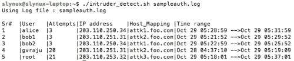
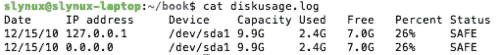

# 第八章：戴上监视器的帽子

在本章中，我们将涵盖：

+   磁盘使用技巧

+   计算命令的执行时间

+   有关已登录用户、启动日志、启动失败的信息

+   打印最常用的 10 个命令

+   列出 1 小时内 CPU 消耗最多的前 10 个进程

+   使用 watch 监视命令输出

+   记录对文件和目录的访问

+   使用 logrotate 管理日志文件

+   使用 syslog 记录

+   监视用户登录以查找入侵者

+   远程磁盘使用健康监控

+   查找系统上活跃用户的小时数

# 介绍

操作系统由一系列系统软件组成，设计用于不同的目的，为不同的任务集提供服务。这些程序中的每一个都需要被操作系统或系统管理员监视，以了解它是否正常工作。我们还将使用一种称为日志记录的技术，通过该技术在应用程序运行时将重要信息写入文件。通过阅读这个文件，我们可以了解正在进行的特定软件或守护进程的操作时间线。如果应用程序或服务崩溃，这些信息有助于调试问题，并使我们能够解决任何问题。日志记录和监视还有助于从数据池中收集信息。日志记录和监视是确保操作系统安全和调试的重要任务。

本章介绍了可以用于监视不同活动的不同命令。它还介绍了日志记录技术及其用途。

# 磁盘使用技巧

磁盘空间是有限的资源。我们经常对硬盘或任何存储介质进行磁盘使用计算，以找出磁盘上可用的空闲空间。当空闲空间变得稀缺时，我们需要找出需要删除或移动的大文件，以便创建空闲空间。磁盘使用操作通常在 shell 脚本环境中使用。本文将说明用于磁盘操作的各种命令，以及可以使用各种选项计算磁盘使用情况的问题。

## 准备工作

`df`和`du`是用于计算 Linux 磁盘使用的两个重要命令。命令`df`代表磁盘空闲，`du`代表磁盘使用。让我们看看如何使用它们执行涉及磁盘使用计算的各种任务。

## 如何做...

要查找文件（或文件）使用的磁盘空间，请使用：

```
$ du  FILENAME1 FILENAME2 ..

```

例如：

```
$ du file.txt
4

```

为了获取目录中所有文件的磁盘使用情况，以及在每行中显示每个文件的个别磁盘使用情况，请使用：

```
$ du -a DIRECTORY

```

-a 在指定的目录或递归目录中输出所有文件的结果。

### 提示

运行`du DIRECTORY`将输出类似的结果，但它只会显示子目录消耗的大小。然而，它们不显示每个文件的磁盘使用情况。要打印文件的磁盘使用情况，-a 是必需的。

例如：

```
$  du -a test
4  test/output.txt
4  test/process_log.sh
4  test/pcpu.sh
16  test

```

使用`du DIRECTORY`的示例如下：

```
$ du test
16  test

```

## 还有更多...

让我们看看`du`命令的其他用法。

### 以 KB、MB 或块显示磁盘使用情况

默认情况下，磁盘使用命令显示文件使用的总字节数。当以标准单位 KB、MB 或 GB 表示磁盘使用时，更易读的格式。为了以友好的格式打印磁盘使用情况，请使用`-h`如下：

```
du -h FILENAME

```

例如：

```
$ du -sh test/pcpu.sh
4.0K  test/pcpu.sh
# Multiple file arguments are accepted

```

或：

```
# du -h DIRECTORY
$ du -h hack/
16K  hack/

```

### 显示磁盘使用的总和

假设我们需要计算所有文件或目录占用的总大小，显示个别文件大小将不会有帮助。`du`有一个选项`-c`，它将输出作为参数给出的所有文件和目录的总磁盘使用情况。它附加了一行 SIZE 总和结果。语法如下：

```
$ du -c FILENAME1 FILENAME2..

```

例如：

```
du -c process_log.sh pcpu.sh
4  process_log.sh
4  pcpu.sh
8  total

```

或：

```
$ du  -c DIRECTORY

```

例如：

```
$ du -c test/
16  test/
16  total

```

或：

```
$ du -c *.txt
# Wildcards

```

-c 可以与其他选项一起使用，如-a 和-h。它提供与不使用-c 相同的输出。唯一的区别是它附加了一个包含总大小的额外行。

还有另一个选项`-s`（汇总），它将只打印总和作为输出。它将打印总和，并且可以与`-h`标志一起使用以以人类可读的格式打印。这个命令在实践中经常使用。语法如下：

```
$ du -s FILES(s)
$ du -sh DIRECTORY

```

例如：

```
$ du -sh slynux
680K  slynux

```

### 以指定单位打印文件

我们可以强制`du`以指定的单位打印磁盘使用量。例如：

+   通过使用以下方式以字节（默认）打印大小：

```
$ du -b FILE(s)

```

+   通过使用以下方式以千字节为单位打印大小：

```
$ du -k FILE(s)

```

+   通过使用以下方式打印以兆字节为单位的大小：

```
$ du -m FILE(s)

```

+   通过使用指定的 BLOCK 大小打印大小：

```
$ du -B BLOCK_SIZE FILE(s)

```

这里，`BLOCK_SIZE`以字节为单位指定。

一个包含所有命令的示例如下：

```
$ du pcpu.sh
4  pcpu.sh
$ du -b pcpu.sh
439	pcpu.sh
$ du -k pcpu.sh
4  pcpu.sh
$ du -m pcpu.sh
1  pcpu.sh
$ du -B 4  pcpu.sh
1024  pcpu.sh

```

### 排除磁盘使用量计算中的文件

有时我们需要从磁盘使用量计算中排除某些文件。这些被排除的文件可以通过两种方式指定：

1.  **通配符**

我们可以使用通配符指定如下：

```
$ du --exclude "WILDCARD" DIRECTORY

```

例如：

```
$ du --exclude "*.txt" FILES(s)
# Excludes all .txt files from calculation

```

1.  **排除列表**

我们可以指定要从文件中排除的文件列表如下：

```
$ du --exclude-from EXCLUDE.txt DIRECTORY
# EXCLUDE.txt is the file containing list

```

`du`还提供了一些其他方便的选项，以限制磁盘使用量的计算。我们可以通过使用`--max-depth`参数指定`du`应该遍历的层次结构的最大深度来计算整个磁盘使用量。指定深度为`1`计算当前目录中文件的大小。深度`2`将计算当前目录中的文件和下一个子目录的文件，并在第二个子目录处停止遍历。

例如：

```
$ du --max-depth 2 DIRECTORY

```

### 注意

`du`可以通过使用`-x`参数限制只遍历单个文件系统。假设运行`du DIRECTORY`，它将递归地遍历`DIRECTORY`的每个可能的子目录。目录层次结构中的一个子目录可能是一个挂载点（例如，`/mnt/sda1`是`/mnt`的子目录，它是设备`/dev/sda1`的挂载点）。`du`将遍历该挂载点，并计算该设备文件系统的磁盘使用总和。为了防止`du`遍历和计算其他挂载点或文件系统，可以在其他`du`选项中使用`-x`标志。`du -x /`将排除`/mnt/`中的所有挂载点进行磁盘使用量计算。

在使用`du`时，请确保它遍历的目录或文件具有适当的读取权限。

### 从给定目录中查找最大的 10 个文件大小

查找大尺寸文件是我们经常遇到的一个常规任务。我们经常需要删除这些巨大的文件或移动它们。我们可以使用`du`和`sort`命令轻松找到大尺寸文件。以下一行脚本可以完成这项任务：

```
$ du -ak SOURCE_DIR | sort -nrk 1 | head

```

这里的`-a`指定所有目录和文件。因此，`du`遍历`SOURCE_DIR`并计算所有文件的大小。输出的第一列包含以千字节为单位的大小，因为指定了`-k`，第二列包含文件或文件夹名称。

`sort`用于对第 1 列进行数字排序并将其反转。`head`用于从输出中解析前 10 行。

例如：

```
$ du -ak /home/slynux | sort -nrk 1 | head -n 4
50220 /home/slynux
43296 /home/slynux/.mozilla
43284 /home/slynux/.mozilla/firefox
43276 /home/slynux/.mozilla/firefox/8c22khxc.default

```

上述一行命令的一个缺点是它包括目录在结果中。然而，当我们只需要找到最大的文件而不是目录时，我们可以改进一行命令，只输出大尺寸的文件，如下所示：

```
$ find . -type f -exec du -k {} \; | sort -nrk 1 | head

```

我们使用`find`来过滤`du`而不是允许`du`自行递归遍历。

### 磁盘空闲信息

`du`命令提供有关使用情况的信息，而`df`提供有关可用磁盘空间的信息。它可以与`-h`一起使用，也可以不使用。当`df`与`-h`一起使用时，它以人类可读的格式打印磁盘空间。

例如：

```
$ df
Filesystem           1K-blocks      Used Available Use% Mounted on
/dev/sda1              9611492   2276840   6846412  25% /
none                    508828       240    508588   1% /dev
none                    513048       168    512880   1% /dev/shm
none                    513048        88    512960   1% /var/run
none                    513048         0    513048   0% /var/lock
none                    513048         0    513048   0% /lib/init/rw
none                   9611492   2276840   6846412  25% /var/lib/ureadahead/debugfs

$ df -h
FilesystemSize  Used Avail Use% Mounted on
/dev/sda1             9.2G  2.2G  6.6G  25% /
none                  497M  240K  497M   1% /dev
none                  502M  168K  501M   1% /dev/shm
none                  502M   88K  501M   1% /var/run
none                  502M     0  502M   0% /var/lock
none                  502M     0  502M   0% /lib/init/rw
none                  9.2G  2.2G  6.6G  25% /var/lib/ureadahead/debugfs

```

# 计算命令的执行时间

在测试应用程序或比较给定问题的不同算法时，程序所花费的执行时间非常关键。一个好的算法应该在最短的时间内执行。有几种情况下，我们需要监视程序执行所花费的时间。例如，在学习排序算法时，如何实际陈述哪个算法更快？答案是计算相同数据集的执行时间。让我们看看如何做到这一点。

## 如何做到...

`time`是任何类 UNIX 操作系统中都可用的命令。您可以在要计算执行时间的命令前加上`time`，例如：

```
$ time COMMAND

```

命令将被执行并显示其输出。除了输出之外，`time`命令还会在`stderr`中附加所用的时间。例如：

```
$ time ls
test.txt
next.txt
real    0m0.008s
user    0m0.001s
sys     0m0.003s

```

它将显示执行的实际、用户和系统时间。三种不同的时间可以定义如下：

+   **Real**是挂钟时间——从调用开始到结束的时间。这是包括其他进程使用的时间片和进程被阻塞时花费的时间（例如，如果它正在等待 I/O 完成）的所有经过的时间。

+   **User**是进程内用户模式代码（内核之外）中花费的 CPU 时间。这只是执行进程时实际使用的 CPU 时间。其他进程和进程被阻塞时花费的时间不计入这个数字。

+   **Sys**是进程内核中花费的 CPU 时间。这意味着内核中系统调用中执行的 CPU 时间，而不是仍在用户空间中运行的库代码。与“用户时间”一样，这只是进程使用的 CPU 时间。

### 注意

`time`命令的可执行二进制文件位于`/usr/bin/time`，还有一个名为`time`的 shell 内置命令。当我们运行`time`时，默认情况下会调用 shell 内置命令。shell 内置的 time 选项有限。因此，我们应该使用可执行文件（`/usr/bin/time`）的绝对路径来执行其他功能。

我们可以使用`-o filename`选项将时间统计信息写入文件，如下所示：

```
$ /usr/bin/time -o output.txt COMMAND

```

文件名应该始终出现在`-o`标志之后。

为了将时间统计信息附加到文件而不覆盖，使用`-a`标志以及`-o`选项如下：

```
$ /usr/bin/time –a -o output.txt COMMAND

```

我们还可以使用`-f`选项使用格式字符串格式化时间输出。格式字符串由与特定选项对应的参数组成，前缀为`%`。实际时间、用户时间和系统时间的格式字符串如下：

+   实际时间 - `%e`

+   用户 - `%U`

+   sys - `%S`

通过组合参数字符串，我们可以创建格式化的输出，如下所示：

```
$ /usr/bin/time -f "FORMAT STRING" COMMAND

```

例如：

```
$ /usr/bin/time -f "Time: %U" -a -o timing.log uname
Linux

```

这里`%U`是用户时间的参数。

生成格式化输出时，命令的格式化输出被写入标准输出，而被计时的`COMMAND`的输出被写入标准错误。我们可以使用重定向运算符（`>`）重定向格式化输出，并使用（`2>`）错误重定向运算符重定向时间信息输出。例如：

```
$ /usr/bin/time -f "Time: %U" uname> command_output.txt 2>time.log
$ cat time.log
Time: 0.00
$ cat command_output.txt
Linux

```

使用`time`命令可以收集有关进程的许多细节。重要的细节包括退出状态、接收的信号数、进行的上下文切换次数等。可以使用适当的格式字符串显示每个参数。

以下表格显示了一些有趣的参数：

| 参数 | 描述 |
| --- | --- |
| `%C` | 被计时命令的名称和命令行参数。 |
| `%D` | 进程的未共享数据区的平均大小，以千字节为单位。 |
| `%E` | 进程使用的实际经过的时间（挂钟时间）[小时:]分钟:秒。 |
| `%x` | 命令的退出状态。 |
| `%k` | 传递给进程的信号数。 |
| `%W` | 进程被交换出主内存的次数。 |
| `％Z` | 系统的页面大小（以字节为单位）。这是一个每系统常量，但在系统之间有所不同。 |
| `％P` | 此作业获得的 CPU 百分比。这只是用户+系统时间除以总运行时间。它还打印一个百分号。 |
| `％K` | 进程的平均总（数据+堆栈+文本）内存使用量，以千字节为单位。 |
| `％w` | 程序自愿上下文切换的次数，例如在等待 I/O 操作完成时。 |
| `％c` | 进程被非自愿上下文切换的次数（因为时间片到期）。 |

例如，可以使用`％Z`参数显示页面大小如下：

```
$ /usr/bin/time -f "Page size: %Z bytes" ls> /dev/null
Page size: 4096 bytes

```

这里不需要`timed`命令的输出，因此将标准输出重定向到`/dev/null`设备，以防止它写入终端。

还有更多的格式字符串参数可用。阅读`man time`以获取更多详细信息。

# 有关登录用户、引导日志和引导失败的信息

收集有关操作环境、登录用户、计算机已经运行的时间以及任何引导失败的信息非常有帮助。这个教程将介绍一些用于收集有关活动机器信息的命令。

## 准备工作

这个教程将介绍`who`、`w`、`users`、`uptime`、`last`和`lastb`命令。

## 如何做...

要获取有关当前登录到计算机的用户的信息，请使用：

```
$ who
slynux   pts/0   2010-09-29 05:24 (slynuxs-macbook-pro.local)
slynux   tty7    2010-09-29 07:08 (:0) 

```

或者：

```
$ w
 07:09:05 up  1:45,  2 users,  load average: 0.12, 0.06, 0.02
USER     TTY     FROM    LOGIN@   IDLE  JCPU PCPU WHAT
slynux   pts/0   slynuxs 05:24  0.00s  0.65s 0.11s sshd: slynux 
slynux   tty7    :0      07:08  1:45m  3.28s 0.26s gnome-session

```

它将提供有关登录用户、用户使用的伪 TTY、当前从伪终端执行的命令以及用户登录的 IP 地址的信息。如果是本地主机，它将显示主机名。`who`和`w`的格式输出略有不同。`w`命令提供的详细信息比`who`更多。

TTY 是与文本终端相关联的设备文件。当用户新生成终端时，将在`/dev/`中创建相应的设备（例如`/dev/pts/3`）。可以通过键入和执行`tty`命令来找出当前终端的设备路径。

要列出当前登录到计算机的用户，请使用：

```
$ users
Slynux slynux slynux hacker

```

如果用户已经打开了多个伪终端，将显示相同用户的多个条目。在上面的输出中，用户`slynux`已经打开了三个伪终端。打印唯一用户的最简单方法是使用`sort`和`uniq`进行过滤，如下所示：

```
$ users | tr ' ' '\n' | sort | uniq
slynux
hacker

```

我们使用`tr`将`' '`替换为`'\n'`。然后`sort`和`uniq`的组合将为每个用户生成唯一的条目。

为了查看系统已经运行了多长时间，请使用：

```
$ uptime
 21:44:33 up  3:17,  8 users,  load average: 0.09, 0.14, 0.09

```

跟在单词`up`后面的时间表示系统已经运行的时间。我们可以编写一个简单的一行代码来提取仅运行时间。

`uptime`输出中的平均负载是指系统负载的一个参数。这在章节*Administration Calls!*中有更详细的解释。为了获取有关以前的引导和用户登录会话的信息，请使用：

```
$ last
slynux   tty7         :0              Tue Sep 28 18:27   still logged in
reboot   system boot  2.6.32-21-generi Tue Sep 28 18:10 - 21:46  (03:35)
slynux   pts/0        :0.0            Tue Sep 28 05:31 - crash  (12:39)

```

`last`命令将提供有关登录会话的信息。实际上，它是一个系统登录的日志，其中包含`tty`从中登录的信息、登录时间、状态等。

`last`命令使用日志文件`/var/log/wtmp`作为输入日志数据。还可以使用`-f`选项明确指定`last`命令的日志文件。例如：

```
$ last –f /var/log/wtmp

```

为了获取单个用户的登录会话信息，请使用：

```
$ last USER

```

获取有关重新启动会话的信息如下：

```
$ last reboot
reboot   system boot  2.6.32-21-generi Tue Sep 28 18:10 - 21:48  (03:37)
reboot   system boot  2.6.32-21-generi Tue Sep 28 05:14 - 21:48  (16:33)

```

为了获取有关失败的用户登录会话的信息，请使用：

```
# lastb
test     tty8         :0               Wed Dec 15 03:56 - 03:56  (00:00) 
slynux   tty8         :0               Wed Dec 15 03:55 - 03:55  (00:00)

```

您应该以 root 用户身份运行`lastb`。

# 打印最常用的 10 个命令

终端是用于访问 shell 提示符的工具，在那里我们输入和执行命令。用户在 shell 中运行许多命令。其中许多是经常使用的。通过查看他经常使用的命令，可以很容易地识别用户的性质。这个教程是一个小练习，用于找出最常用的 10 个命令。

## 准备工作

Bash 通过用户之前输入的命令并存储在文件`~/.bash_history`中来跟踪先前输入的命令。但它只保留最近执行的一定数量（比如 500）的命令。可以使用`history`命令或`cat ~/.bash_history`命令查看命令的历史记录。我们将使用这个来查找经常使用的命令。

## 如何做...

我们可以从`~/.bash_history`获取命令列表，仅获取不包括参数的命令，计算每个命令的出现次数，并找出出现次数最高的 10 个命令。

以下脚本可用于查找经常使用的命令：

```
#!/bin/bash
#Filename: top10_commands.sh
#Description: Script to list top 10 used commands

printf "COMMAND\tCOUNT\n" ;

cat ~/.bash_history | awk '{ list[$1]++; } \
END{
for(i in list)
{
printf("%s\t%d\n",i,list[i]); }
}'| sort -nrk 2 | head
```

示例输出如下：

```
$ ./top10_commands.sh
COMMAND  COUNT
ping    80
ls      56
cat     35
ps      34
sudo    26
du      26
cd      26
ssh     22
sftp    22
clear   21

```

## 它是如何工作的...

在上述脚本中，历史文件`~/.bash_history`是使用的源文件。源输入通过管道传递给`awk`。在`awk`中，我们有一个关联数组列表。这个数组可以使用命令名称作为索引，并将命令的计数存储在数组位置中。因此，对于每个命令的到达或出现，它将递增一个（`list[$1]++`）。`$1`被用作索引。`$1`是输入行中文本的第一个单词。如果使用`$0`，它将包含命令的所有参数。例如，如果`ssh 192.168.0.4`是来自`.bash_history`的一行，`$0`等于`ssh 192.168.0.4`，`$1`等于`ssh`。

一旦历史文件的所有行都被遍历，我们将得到一个带有命令名称作为索引和它们计数作为值的数组。因此，具有最大计数值的命令名称将是最常用的命令。因此，在`awk`的`END{}`块中，我们遍历命令的索引并打印所有命令名称和它们的计数。`sort -nrk 2`将根据第二列（`COUNT`）执行数值排序并反转它。因此，我们使用`head`命令从列表中提取前 10 个命令。您可以使用参数`head -n NUMBER`将前 10 个自定义为前 5 个或任何其他数字。

# 列出一个小时内消耗前 10 个 CPU 的进程

CPU 时间是一个重要的资源，有时我们需要跟踪在一段时间内消耗最多 CPU 周期的进程。在常规的台式机或笔记本电脑上，CPU 被大量消耗可能不是一个问题。然而，对于处理大量请求的服务器来说，CPU 是一个关键资源。通过监视一定时间内的 CPU 使用情况，我们可以识别一直占用 CPU 的进程，并优化它们以有效地使用 CPU 或者由于其他问题对它们进行调试。这个配方是一个处理监视和记录进程的实践。

## 准备工作

`ps`是一个用于收集有关系统上运行的进程的详细信息的命令。它可以用于收集诸如 CPU 使用情况、正在执行的命令、内存使用情况、进程状态等的详细信息。可以记录一个小时内消耗 CPU 的进程，并通过适当使用`ps`和文本处理来确定前 10 个进程。有关`ps`命令的更多详细信息，请参阅章节：*管理调用*。

## 如何做...

让我们通过以下 shell 脚本来监视和计算一个小时内的 CPU 使用情况：

```
#!/bin/bash
#Name: pcpu_usage.sh
#Description: Script to calculate cpu usage by processes for 1 hour

SECS=3600
UNIT_TIME=60

#Change the SECS to total seconds for which monitoring is to be performed.
#UNIT_TIME is the interval in seconds between each sampling

STEPS=$(( $SECS / $UNIT_TIME ))

echo Watching CPU usage... ;

for((i=0;i<STEPS;i++))
do
  ps -eo comm,pcpu | tail -n +2 >> /tmp/cpu_usage.$$
  sleep $UNIT_TIME
done

echo
echo CPU eaters :

cat /tmp/cpu_usage.$$ | \
awk '
{ process[$1]+=$2; }
END{ 
  for(i in process)
  {
    printf("%-20s %s",i, process[i] ;
  }

   }' | sort -nrk 2 | head

rm /tmp/cpu_usage.$$
#Remove the temporary log file
```

示例输出如下：

```
$ ./pcpu_usage.sh
Watching CPU usage...
CPU eaters :
Xorg        20
firefox-bin   15
bash        3
evince      2
pulseaudio    1.0
pcpu.sh         0.3
wpa_supplicant  0
wnck-applet     0
watchdog/0      0
usb-storage     0

```

## 它是如何工作的...

在上述脚本中，主要的输入来源是`ps -eocomm, pcpu`。`comm`代表命令名称，`pcpu`代表 CPU 使用率百分比。它将输出所有进程名称和 CPU 使用率百分比。对于输出中的每个进程都存在一行。由于我们需要监视一个小时的 CPU 使用情况，我们会使用`ps -eo comm,pcpu` `| tail -n +2`重复地获取使用统计信息，并将其附加到一个文件`/tmp/cpu_usage.$$`中，该文件在`for`循环中运行，每次迭代都等待 60 秒。这个等待是由`sleep 60`提供的。它将每分钟执行一次`ps`。

`tail -n +2`用于剥离`ps`输出中的标题和`COMMAND %CPU`。

`$$`在`cpu_usage.$$`中表示它是当前脚本的进程 ID。假设 PID 为 1345，在执行期间它将被替换为`/tmp/cpu_usage.1345`。我们将这个文件放在`/tmp`中，因为它是一个临时文件。

统计文件将在一小时后准备好，并包含 60 个条目，对应于每分钟的进程状态。然后使用`awk`来对每个进程的总 CPU 使用情况进行求和。一个关联数组进程用于 CPU 使用情况的求和。它使用进程名称作为数组索引。最后，它根据总 CPU 使用情况进行数字逆排序，并通过 head 获取前 10 个使用情况条目。

## 另请参阅

+   *第四章的基本 awk 入门*，解释了 awk 命令

+   *head 和 tail - 打印第三章的最后或前十行*，解释了 tail 命令

# 使用 watch 监视命令输出

我们可能需要在相等的时间间隔内持续观察命令的输出一段时间。例如，对于大文件复制，我们需要观察文件大小的增长。为了做到这一点，新手们反复输入命令并按回车键多次。相反，我们可以使用 watch 命令重复查看输出。本教程解释了如何做到这一点。

## 如何做...

`watch`命令可用于定期监视终端上命令的输出。`watch`命令的语法如下：

```
$ watch COMMAND

```

例如：

```
$ watch ls

```

或者：

```
$ watch 'COMMANDS'

```

例如：

```
$ watch 'ls -l | grep "^d"'
# list only directories

```

此命令将以默认间隔两秒更新输出。

我们还可以通过使用`-n SECONDS`来指定输出需要更新的时间间隔。例如：

```
$ watch -n 5 'ls -l'
#Monitor the output of ls -l at regular intervals of 5 seconds

```

## 还有更多

让我们探索`watch`命令的一个附加功能。

### 突出显示 watch 输出中的差异

在`watch`中，有一个选项可以在执行命令期间更新的差异以突出显示，并使用颜色进行标记。可以通过使用`-d`选项启用差异突出显示，如下所示：

```
$ watch -d 'COMMANDS'

```

# 记录对文件和目录的访问

记录文件和目录访问对于跟踪文件和文件夹发生的变化非常有帮助。本教程将描述如何记录用户访问。

## 准备就绪

`inotifywait`命令可用于收集有关文件访问的信息。它不会默认随每个 Linux 发行版一起提供。您必须使用软件包管理器安装`inotify-tools`软件包。它还需要 Linux 内核编译时启用 inotify 支持。大多数新的 GNU/Linux 发行版都启用了内核中的 inotify。

## 如何做...

让我们走一遍监视目录访问的 shell 脚本：

```
#/bin/bash
#Filename: watchdir.sh
#Description: Watch directory access
path=$1
#Provide path of directory or file 
as argument to script

inotifywait -m -r -e create,move,delete $path  -q 

```

示例输出如下：

```
$ ./watchdir.sh .
./ CREATE new
./ MOVED_FROM new
./ MOVED_TO news
./ DELETE news

```

## 它是如何工作的...

先前的脚本将记录从给定路径创建、移动和删除文件和文件夹的事件。给出`-m`选项以持续监视更改，而不是在事件发生后退出。给出`-r`以启用递归监视目录。`-e`指定要监视的事件列表。`-q`是为了减少冗长的消息并只打印所需的消息。此输出可以重定向到日志文件。

我们可以添加或删除事件列表。可用的重要事件如下：

| 事件 | 描述 |
| --- | --- |
| `access` | 当文件发生读取时。 |
| `modify` | 当文件内容被修改时。 |
| `attrib` | 当元数据被更改时。 |
| `move` | 当文件进行移动操作时。 |
| `create` | 当创建新文件时。 |
| `open` | 当文件进行打开操作时。 |
| `close` | 当文件进行关闭操作时。 |
| `delete` | 当文件被删除时。 |

# 使用 logrotate 进行日志文件管理

日志文件是 Linux 系统维护的重要组成部分。日志文件有助于跟踪系统上不同服务发生的事件。这有助于系统管理员调试问题，还提供了有关实时机器上发生的事件的统计信息。需要管理日志文件，因为随着时间的推移，日志文件的大小会变得越来越大。因此，我们使用一种称为轮换的技术来限制日志文件的大小，如果日志文件达到了限制之外的大小，它将剥离日志文件并将日志文件的旧条目存储在归档中。因此，旧日志可以被存储和保留以供将来参考。让我们看看如何轮换日志并存储它们。

## 准备工作

`logrotate`是每个 Linux 系统管理员都应该了解的命令。它有助于限制日志文件的大小。在日志文件中，记录器将信息追加到日志文件中。因此，最近的信息出现在日志文件的底部。`logrotate`将根据配置文件扫描特定的日志文件。它将保留日志文件的最后 100 千字节（例如，指定 SIZE = 100k），并将其余数据（旧的日志数据）移动到一个新文件`logfile_name.1`中。当日志文件（`logfile_name.1`）中出现更多条目并且超过了 SIZE 时，它将使用最新的条目更新日志文件，并创建带有旧日志的`logfile_name.2`。这个过程可以很容易地通过`logrotate`进行配置。`logrotate`还可以将旧日志压缩为`logfile_name.1.gz`、`logfile_name2.gz`等。是否压缩旧日志文件的选项在`logrotate`配置中可用。

## 如何做...

`logrotate`的配置目录位于`/etc/logrotate.d`。如果列出该目录的内容，可以找到许多其他日志文件的配置。

我们可以为我们的日志文件编写自定义配置（比如`/var/log/program.log`）如下：

```
$ cat /etc/logrotate.d/program
/var/log/program.log {
missingok
notifempty
size 30k
 compress
weekly
 rotate 5
create 0600 root root
}

```

现在配置已经完成。配置中的`/var/log/program.log`指定了日志文件路径。它将在相同的目录路径中归档旧日志。让我们看看这些参数各是什么：

| 参数 | 描述 |
| --- | --- |
| `missingok` | 如果日志文件丢失，则忽略并返回而不进行日志轮换。 |
| `notifempty` | 只有在源日志文件不为空时才进行日志轮换。 |
| `size 30k` | 限制要进行轮换的日志文件的大小。可以是 1M 表示 1MB。 |
| `compress` | 启用 gzip 对较旧的日志进行压缩。 |
| `weekly` | 指定进行轮换的时间间隔。可以是每周、每年或每天。 |
| `rotate 5` | 要保留的旧日志文件归档副本的数量。由于指定了 5，将会有`program.log.1.gz`、`program.log.2.gz`，以此类推，直到`program.log.5.gz`。 |
| `create 0600 root root` | 指定要创建的日志文件归档的模式、用户和组。 |

表中指定的选项是可选的；我们可以在`logrotate`配置文件中只指定所需的选项。`logrotate`有许多可用的选项。请参考 man 页面（[`linux.die.net/man/8/logrotate`](http://linux.die.net/man/8/logrotate)）获取有关`logrotate`的更多信息。

# 使用 syslog 记录

日志文件是为向用户提供服务的应用程序的重要组成部分。应用程序在运行时将状态信息写入其日志文件。如果发生任何崩溃或者我们需要查询有关服务的一些信息，我们会查看日志文件。您可以在`/var/log`目录中找到与不同守护程序和应用程序相关的许多日志文件。这是存储日志文件的常见目录。如果您阅读日志文件的几行，您会发现日志中的行是以常见格式编写的。在 Linux 中，创建和将日志信息写入`/var/log`日志文件由一种称为 syslog 的协议处理。它由`syslogd`守护程序处理。每个标准应用程序都使用 syslog 来记录信息。在本教程中，我们将讨论如何使用`syslogd`从 shell 脚本记录信息。

## 准备就绪

日志文件对帮助您推断系统出现了什么问题非常有用。因此，在编写关键应用程序时，始终将应用程序的进度记录到日志文件中是一种良好的做法。我们将学习命令记录器以使用`syslogd`记录到日志文件。在了解如何写入日志文件之前，让我们先浏览一下 Linux 中使用的重要日志文件列表：

| 日志文件 | 描述 |
| --- | --- |
| `/var/log/boot.log` | 启动日志信息。 |
| `/var/log/httpd` | Apache Web 服务器日志。 |
| `/var/log/messages` | 启动后内核信息。 |
| `/var/log/auth.log` | 用户认证日志。 |
| `/var/log/dmesg` | 系统启动消息。 |
| `/var/log/mail.log` | 邮件服务器日志。 |
| `/var/log/Xorg.0.log` | X 服务器日志。 |

## 如何做…

为了记录到 syslog 文件`/var/log/messages`，请使用：

```
$ logger LOG_MESSAGE

```

例如：

```
$ logger This is a test log line

$ tail -n 1 /var/log/messages
Sep 29 07:47:44 slynux-laptop slynux: This is a test log line

```

日志文件`/var/log/messages`是一个通用目的的日志文件。当使用`logger`命令时，默认情况下会记录到`/var/log/messages`。为了记录到具有指定标记的 syslog 中，请使用：

```
$ logger -t TAG This is a message

$ tail -n 1 /var/log/messages
Sep 29 07:48:42 slynux-laptop TAG: This is a message

```

syslog 处理`/var/log`中的许多日志文件。但是，当记录器发送消息时，它使用标记字符串来确定需要记录到哪个日志文件中。`syslogd`通过使用与日志相关的`TAG`来决定应将日志记录到哪个文件中。您可以从位于`/etc/rsyslog.d/`目录中的配置文件中查看标记字符串和相关的日志文件。

为了将另一个日志文件的最后一行记录到系统日志中，请使用：

```
$ logger -f /var/log/source.log

```

## 另见

+   *head 和 tail - 打印最后或前 10 行* 第三章 ，解释 head 和 tail 命令

# 监视用户登录以查找入侵者

日志文件可用于收集有关系统状态的详细信息。以下是一个有趣的脚本编写问题陈述：

我们有一个连接到启用 SSH 的互联网的系统。许多攻击者试图登录系统。我们需要编写一个 shell 脚本来设计入侵检测系统。入侵者被定义为尝试在两分钟以上进行多次尝试并且所有尝试都失败的用户。应检测此类用户并生成报告，其中包括以下详细信息：

+   尝试登录的用户帐户

+   尝试次数

+   攻击者的 IP 地址

+   IP 地址的主机映射

+   尝试登录的时间范围。

## 入门

我们可以编写一个 shell 脚本，可以扫描日志文件并从中收集所需的信息。在这里，我们正在处理 SSH 登录失败。用户认证会话日志被写入日志文件`/var/log/auth.log`。脚本应扫描日志文件以检测失败的登录尝试，并对日志执行不同的检查以推断数据。我们可以使用`host`命令从 IP 地址找出主机映射。

## 如何做…

让我们编写一个入侵者检测脚本，该脚本可以使用认证日志文件生成入侵者报告，如下所示：

```
#!/bin/bash
#Filename: intruder_detect.sh
#Description: Intruder reporting tool with auth.log input
AUTHLOG=/var/log.auth.log

if [[ -n $1 ]];
then
  AUTHLOG=$1
  echo Using Log file : $AUTHLOG
fi

LOG=/tmp/valid.$$.log
grep -v "invalid" $AUTHLOG > $LOG
users=$(grep "Failed password" $LOG | awk '{ print $(NF-5) }' | sort | uniq)

printf "%-5s|%-10s|%-10s|%-13s|%-33s|%s\n" "Sr#" "User" "Attempts" "IP address" "Host_Mapping" "Time range"

ucount=0;

ip_list="$(egrep -o "[0-9]+\.[0-9]+\.[0-9]+\.[0-9]+" $LOG | sort | uniq)"

for ip in $ip_list;
do
  grep $ip $LOG > /tmp/temp.$$.log

for user in $users;
do
  grep $user /tmp/temp.$$.log> /tmp/$$.log
  cut -c-16 /tmp/$$.log > $$.time
  tstart=$(head -1 $$.time);
  start=$(date -d "$tstart" "+%s");

  tend=$(tail -1 $$.time);
  end=$(date -d "$tend" "+%s")

  limit=$(( $end - $start ))

  if [ $limit -gt 120 ];
  then
    let ucount++;

    IP=$(egrep -o "[0-9]+\.[0-9]+\.[0-9]+\.[0-9]+" /tmp/$$.log | head -1 );

    TIME_RANGE="$tstart-->$tend"

    ATTEMPTS=$(cat /tmp/$$.log|wc -l);

    HOST=$(host $IP | awk '{ print $NF }' )

  printf "%-5s|%-10s|%-10s|%-10s|%-33s|%-s\n" "$ucount" "$user" "$ATTEMPTS" "$IP" "$HOST" "$TIME_RANGE";
  fi
done
done

rm /tmp/valid.$$.log /tmp/$$.log $$.time /tmp/temp.$$.log 2> /dev/null
```

示例输出如下：



## 它是如何工作的...

在`intruder_detect.sh`脚本中，我们使用`auth.log`文件作为输入。我们可以通过使用命令行参数将日志文件作为输入提供给脚本，或者默认情况下，它读取`/var/log/auth.log`文件。我们只需要记录关于有效用户名的登录尝试的详细信息。当发生无效用户的登录尝试时，类似于`Failed password for invalid user bob from 203.83.248.32 port 7016 ssh2`的日志将被记录到`auth.log`。因此，我们需要排除日志文件中所有包含“invalid”单词的行。使用带有反转选项（`-v`）的`grep`命令来删除所有与无效用户对应的日志。下一步是找出发生登录尝试并失败的用户列表。SSH 将记录类似于`sshd[21197]: Failed password for bob1 from 203.83.248.32 port 50035 ssh2`的日志行，表示密码错误。

因此，我们应该找到所有包含“failed password”单词的行。现在需要找出所有唯一的 IP 地址，以提取与每个 IP 地址对应的所有日志行。可以使用 IP 地址的正则表达式和`egrep`命令来提取 IP 地址的列表。使用`for`循环来迭代 IP 地址，并使用`grep`找到相应的日志行，并将其写入临时文件。日志行中倒数第六个单词是用户名（例如，bob1）。使用`awk`命令从最后一个单词中提取第六个单词。`NF`返回最后一个单词的列数。因此，`NF-5`给出了倒数第六个单词的列数。我们使用`sort`和`uniq`命令来生成一个不重复的用户列表。

现在我们应该收集包含每个用户名称的失败登录日志行。使用`for`循环来读取与每个用户对应的行，并将这些行写入临时文件。每个日志行中的前 16 个字符是时间戳。使用`cut`命令来提取时间戳。一旦我们获得了用户的所有失败登录尝试的时间戳，我们应该检查第一次尝试和最后一次尝试之间的时间差。第一条日志行对应于第一次尝试，最后一条日志行对应于最后一次尝试。我们使用`head -1`提取第一行和`tail -1`提取最后一行。现在我们有第一次（`tstart`）和最后一次尝试（`tends`）的时间戳的字符串格式。使用`date`命令，我们可以将字符串表示的日期转换为 UNIX Epoch 时间的总秒数（第一章的*获取、设置日期和延迟*中的配方解释了 Epoch 时间）。

变量 start 和 end 具有与日期字符串中的开始和结束时间戳对应的秒数。现在，取它们之间的差异，并检查是否超过两分钟（120 秒）。因此，特定用户被称为入侵者，并且相应的带有详细信息的条目将被生成为日志。可以使用 IP 地址的正则表达式和`egrep`命令从日志中提取 IP 地址。尝试次数是用户的日志行数。可以使用`wc`命令找出行数。主机名映射可以通过使用 IP 地址作为参数运行 host 命令的输出来提取。时间范围可以使用我们提取的时间戳来打印。最后，脚本中使用的临时文件将被删除。

上述脚本旨在说明从日志中扫描并生成报告的模型。它试图使脚本更小更简单，以排除复杂性。因此它有一些错误。您可以通过使用更好的逻辑来改进脚本。

# 远程磁盘使用健康监视器

一个网络由几台具有不同用户的机器组成。网络需要对远程机器的磁盘使用情况进行集中监控。网络的系统管理员需要每天记录网络中所有机器的磁盘使用情况。每条日志行应包含日期、机器的 IP 地址、设备、设备容量、已使用空间、剩余空间、使用百分比和健康状态等详细信息。如果任何远程机器中任何分区的磁盘使用率超过 80％，健康状态应设置为警报，否则应设置为安全。本示例将说明如何编写一个监控脚本，可以从网络中的远程机器收集详细信息。

## 准备工作

我们需要从网络中的每台机器单独收集磁盘使用统计信息，并在中央机器中编写日志文件。可以安排每天在特定时间运行收集详细信息并写入日志的脚本。可以使用 SSH 登录到远程系统来收集磁盘使用数据。

## 如何做…

首先，我们必须在网络中的所有远程机器上设置一个公共用户帐户。这是为了让 disklog 程序登录到系统中。我们应该为该特定用户配置 SSH 自动登录（在第七章的*使用 SSH 进行无密码自动登录*一节中，解释了自动登录的配置）。我们假设所有远程机器中都有一个名为 test 的用户，配置了自动登录。让我们来看一下 shell 脚本：

```
#!/bin/bash
#Filename: disklog.sh
#Description: Monitor disk usage health for remote systems

logfile="diskusage.log"

if [[ -n $1 ]]
then
  logfile=$1
fi

if [ ! -e $logfile ]
then

  printf "%-8s %-14s %-9s %-8s %-6s %-6s %-6s %s\n" "Date" "IP address" "Device" "Capacity" "Used" "Free" "Percent" "Status" > $logfile
fi

IP_LIST="127.0.0.1 0.0.0.0"
#provide the list of remote machine IP addresses 

(
for ip in $IP_LIST;
do

  ssh slynux@$ip 'df -H' | grep ^/dev/ > /tmp/$$.df

  while read line;
  do
    cur_date=$(date +%D)
    printf "%-8s %-14s " $cur_date $ip
    echo $line | awk '{ printf("%-9s %-8s %-6s %-6s %-8s",$1,$2,$3,$4,$5); }'

  pusg=$(echo $line | egrep -o "[0-9]+%")
  pusg=${pusg/\%/};
  if [ $pusg -lt 80 ];
  then
    echo SAFE
  else
    echo ALERT
  fi

  done< /tmp/$$.df	
done

) >> $logfile
```

我们可以使用 cron 实用程序安排定期运行脚本。例如，要在每天上午 10 点运行脚本，可以在`crontab`中写入以下条目：

```
00 10 * * * /home/path/disklog.sh /home/user/diskusg.log
```

运行命令`crontab -e`。添加上述行并保存文本编辑器。

您可以手动运行脚本，如下所示：

```
$ ./disklog.sh

```

上述脚本的示例输出日志如下：



## 它是如何工作的…

在`disklog.sh`脚本中，我们可以将日志文件路径作为命令行参数提供，否则它将使用默认日志文件。如果日志文件不存在，它将把日志文件头文本写入新文件中。使用`-e $logfile`来检查文件是否存在。远程机器的 IP 地址列表存储在变量`IP_LIST`中，用空格分隔。必须确保`IP_LIST`中列出的所有远程系统都有一个名为`test`的公共用户，并配置了 SSH 自动登录。使用`for`循环来迭代每个 IP 地址。执行远程命令`df -H`来使用`ssh`命令获取磁盘空闲使用数据。它被存储在一个临时文件中。使用`while`循环逐行读取文件。使用`awk`提取数据并打印。还打印日期。使用`egrep`命令提取百分比使用率，并用`none`替换`%`以获得百分比的数值。检查百分比值是否超过 80。如果小于 80，则状态设置为安全，如果大于或等于 80，则状态设置为警报。整个打印数据应重定向到日志文件。因此，代码部分被封装在子 shell`()`中，并且标准输出被重定向到日志文件。

## 另请参阅

+   *使用 cron 进行调度*在第九章中，解释了 crontab 命令

# 查找系统上活跃用户的小时数

考虑一个具有共享托管的 Web 服务器。每天有许多用户登录和退出服务器。用户活动记录在服务器的系统日志中。这个示例是一个实践任务，利用系统日志，找出每个用户在服务器上花了多少小时，并根据总使用小时数对它们进行排名。应该生成一个报告，包括排名、用户、第一次登录日期、最后登录日期、登录次数和总使用小时数等详细信息。让我们看看如何解决这个问题。

## 准备工作

`last`命令用于列出系统中用户的登录会话的详细信息。日志数据存储在`/var/log/wtmp`文件中。通过为每个用户单独添加会话小时数，我们可以找出总使用小时数。

## 如何做到这一点...

让我们通过脚本找出活跃用户并生成报告。

```
#!/bin/bash
#Filename: active_users.sh
#Description: Reporting tool to find out active users

log=/var/log/wtmp

if [[ -n $1 ]];
then
  log=$1
fi

printf "%-4s %-10s %-10s %-6s %-8s\n" "Rank" "User" "Start" "Logins" "Usage hours"

last -f $log | head -n -2   > /tmp/ulog.$$

cat /tmp/ulog.$$ |  cut -d' ' -f1 | sort | uniq> /tmp/users.$$

(
while read user;
do
  grep ^$user /tmp/ulog.$$ > /tmp/user.$$
  seconds=0

while read t
  do
    s=$(date -d $t +%s 2> /dev/null) 
    let seconds=seconds+s
  done< <(cat /tmp/user.$$ | awk '{ print $NF }' | tr -d ')(')

  firstlog=$(tail -n 1 /tmp/user.$$ | awk '{ print $5,$6 }')
  nlogins=$(cat /tmp/user.$$ | wc -l) 
  hours=$(echo "$seconds / 60.0" | bc)

  printf "%-10s %-10s %-6s %-8s\n"  $user "$firstlog" $nlogins $hours
done< /tmp/users.$$ 

) | sort -nrk 4 | awk '{ printf("%-4s %s\n", NR, $0) }' 
rm /tmp/users.$$ /tmp/user.$$ /tmp/ulog.$$
```

一个示例输出如下：

```
$ ./active_users.sh
Rank User       Start      Logins Usage hours
1    easyibaa   Dec 11     531    11437311943
2    demoproj   Dec 10     350    7538718253
3    kjayaram   Dec 9      213    4587849555
4    cinenews   Dec 11     85     1830831769
5    thebenga   Dec 10     54     1163118745
6    gateway2   Dec 11     52     1120038550
7    soft132    Dec 12     49     1055420578
8    sarathla   Nov 1      45     969268728
9    gtsminis   Dec 11     41     883107030
10   agentcde   Dec 13     39     840029414

```

## 它是如何工作的...

在`active_users.sh`脚本中，我们可以将`wtmp`日志文件作为命令行参数提供，或者它将使用`defaulwtmp`日志文件。使用`last -f`命令来打印日志文件内容。日志文件中的第一列是用户名。通过使用`cut`命令，我们从日志文件中提取第一列。然后使用`sort`和`uniq`命令找出唯一的用户。现在对于每个用户，使用`grep`找出对应其登录会话的日志行，并将其写入临时文件。最后一条日志中的最后一列是用户登录会话的持续时间。因此，为了找出用户的总使用小时数，需要将会话持续时间相加。使用时间命令将使用持续时间转换为秒。

为了提取用户的会话小时数，我们使用了`awk`命令。为了去掉括号，使用了`tr -d`命令。使用`<( COMMANDS )`操作符将使用小时字符串列表传递给`while`循环的标准输入。它充当文件输入。通过使用`date`命令，将每个小时字符串转换为秒，并添加到变量`seconds`中。用户的第一次登录时间在最后一行，并且被提取出来。登录尝试次数是日志行数。为了根据总使用小时数计算每个用户的排名，数据记录需要按照使用小时作为关键字进行降序排序。为了指定反向排序的数量，使用`-nr`选项以及`sort`命令。`-k4`用于指定关键列（使用小时）。最后，排序的输出被传递给`awk`。`awk`命令为每行添加了行号，这成为每个用户的排名。
