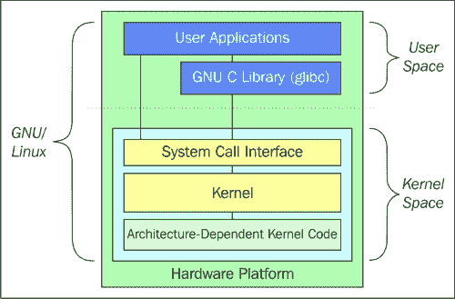
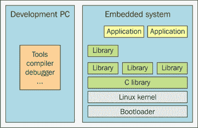
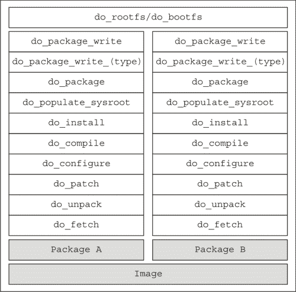
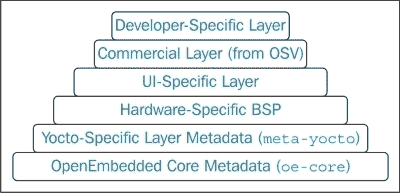

# 第一章：介绍

在本章中，您将了解 Linux 和开源开发的优势。将介绍运行嵌入式 Linux 的系统的示例，许多嵌入式硬件平台都支持。之后，您将介绍嵌入式 Linux 系统的架构和开发环境，最后介绍 Yocto 项目，总结其 Poky 构建系统的属性和目的。

# Linux 和开源系统的优势

本书中大部分可获得的信息和作为练习呈现的示例有一个共同点：它们都是任何人都可以自由访问的。本书试图为您提供如何与现有的和免费可用的软件包进行交互的指导，这些软件包可以帮助像您这样的嵌入式工程师，并且同时也试图激发您的好奇心，让您学到更多。

### 注

有关开源的更多信息可以从**开源倡议**（**OSI**）[`opensource.org/`](http://opensource.org/)获取。

开源的主要优势在于它允许开发人员更专注于他们的产品和附加值。拥有开源产品可以获得各种新的可能性和机会，比如减少许可成本、增加公司的技能和知识。使用大多数人都可以访问并理解其工作原理的开源产品意味着预算节省。节省下来的资金可以用于其他部门，比如硬件或收购。

通常，人们对开源产品有很少或没有控制权的误解。然而，事实恰恰相反。开源系统一般来说提供了对软件的完全控制，我们将证明这一点。对于任何软件，您的开源项目都驻留在一个允许每个人查看的存储库中。由于您是项目的负责人，也是其管理员，您有权接受他人的贡献，这使他们和您拥有同样的权利，基本上给了您想做任何事情的自由。当然，可能会有人受到您的项目的启发，做出了开源社区更受欢迎的事情。然而，这就是进步的方式，坦率地说，如果您是一家公司，这种情况几乎是无效的。即使在这种情况下，这种情况也并不意味着您的项目的失败，而是一个机会。在这里，我想引用以下引用：

|   | *"如果你想建立一个开源项目，你不能让自己的自尊挡住你的路。你不能重写每个人的补丁，你不能对每个人进行第二次猜测，你必须给人们平等的控制权。"* |   |
| --- | --- | --- |
|   | --*– Rasmus Lerdorf* |

允许他人访问、获得外部帮助、对您的开源软件进行修改、调试和优化意味着产品的寿命更长，随着时间的推移，质量也得到了提高。同时，开源环境提供了各种组件的访问，如果需要，这些组件可以轻松地集成到您的产品中。这可以实现快速的开发过程，降低成本，并且还可以将大部分的维护和开发工作从您的产品中转移出去。此外，它还提供了支持特定组件的可能性，以确保它继续满足您的需求。然而，在大多数情况下，您需要花一些时间从零开始为您的产品构建这个组件。

这将我们带到开源的下一个好处，涉及我们产品的测试和质量保证。除了测试所需的工作量较少之外，还可以在决定哪个组件最适合我们的产品之前从多个选项中进行选择。此外，使用开源软件比购买和评估专有产品更便宜。这种接受和回馈的过程，在开源社区中可见，是产生更高质量和更成熟产品的过程。这种质量甚至比其他专有或闭源类似产品的质量更高。当然，这并不是一个普遍有效的断言，只发生在成熟和广泛使用的产品上，但在这里出现了社区和基金会这个术语。

一般来说，开源软件是由开发人员和用户社区共同开发的。这个系统提供了直接从开发人员那里获得更大支持的机会——这在使用闭源工具时是不会发生的。此外，无论您是为公司工作与否，寻找问题答案时都没有限制。成为开源社区的一部分意味着不仅仅是修复错误、报告错误或开发功能。它是开发人员所做的贡献，但同时也为工程师提供了在工作环境之外获得认可的可能性，面对新挑战并尝试新事物。它也可以被视为一个巨大的激励因素和所有参与过程的灵感来源。

作为结论，我还想引用这个过程的核心人物的一句话，他给了我们 Linux 并使其保持开源：

|   | *"我认为，从根本上讲，开源软件确实更稳定。这是正确的做事方式。"* |   |
| --- | --- | --- |
|   | --*– Linus Torvalds* |

# 嵌入式系统

既然开源的好处已经向您介绍了，我相信我们可以通过一些嵌入式系统、硬件、软件及其组件的例子。首先，嵌入式设备随处可见：看看您的智能手机、汽车信息娱乐系统、微波炉甚至您的 MP3 播放器。当然，并非所有这些都符合 Linux 操作系统的要求，但它们都有嵌入式组件，使它们能够实现其设计功能。

## 一般描述

要在任何设备硬件上运行 Linux，您将需要一些能够将硬件相关组件抽象为硬件无关组件的硬件相关组件。引导加载程序、内核和工具链包含使所有其他组件的工作更容易的硬件相关组件。例如，BusyBox 开发人员只会专注于为他的应用程序开发所需的功能，而不会专注于硬件兼容性。所有这些硬件相关组件都支持 32 位和 64 位的各种硬件架构。例如，U-Boot 实现是最容易作为源代码检查的例子。从中，我们可以很容易地想象如何添加对新设备的支持。

我们现在将尝试做一些之前介绍的小练习，但在继续之前，我必须介绍我将继续进行练习的计算机配置，以确保您尽可能少遇到问题。我正在使用 Ubuntu 14.04，并已从 Ubuntu 网站[`www.ubuntu.com/download/desktop`](http://www.ubuntu.com/download/desktop)下载了 64 位镜像。

使用此命令可以收集有关在计算机上运行的 Linux 操作的信息：

```
uname –srmpio

```

前面的命令生成了这个输出：

```
Linux 3.13.0-36-generic x86_64 x86_64 x86_64 GNU/Linux

```

收集与 Linux 操作相关的信息的下一个命令如下：

```
cat /etc/lsb-release

```

前面的命令生成了这个输出：

```
DISTRIB_ID=Ubuntu
DISTRIB_RELEASE=14.04
DISTRIB_CODENAME=trusty
DISTRIB_DESCRIPTION="Ubuntu 14.04.1 LTS"

```

## 例子

现在，转到练习，第一个要求您获取 U-Boot 软件包的`git`存储库源代码：

```
sudo apt-get install git-core
git clone http://git.denx.de/u-boot.git

```

在您的机器上可用源代码之后，您可以尝试查看`board`目录内部；在这里，将出现许多开发板制造商。让我们看看`board/atmel/sama5d3_xplained`，`board/faraday/a320evb`，`board/freescale/imx`和`board/freescale/b4860qds`。通过观察这些目录，可以看到一种模式。几乎所有的板都包含一个`Kconfig`文件，主要受到内核源的启发，因为它们以更清晰的方式呈现配置依赖关系。一个`maintainers`文件提供了对特定板支持的贡献者列表。基本的`Makefile`文件从更高级别的 makefiles 中获取必要的对象文件，这些对象文件是在构建特定板支持后获得的。与`board/freescale/imx`的区别在于，它只提供了一个配置数据列表，这些数据将在高级别 makefiles 中使用。

在内核级别，硬件相关的支持添加到`arch`文件中。在这里，除了`Makefile`和`Kconfig`之外，还可以添加各种数量的子目录。这些子目录为内核的不同方面提供支持，例如引导、内核、内存管理或特定应用程序。

通过克隆内核源代码，可以使用以下代码轻松可视化前面的信息：

```
git clone https://git.kernel.org/pub/scm/linux/kernel/git/torvalds/linux.git

```

一些可以可视化的目录是`arch`/`arc`和`arch`/`metag`。

从工具链的角度来看，硬件相关的组件由 GNU C 库表示，通常由`glibc`表示。这提供了系统调用接口，连接到内核架构相关的代码，并进一步为用户应用程序提供这两个实体之间的通信机制。如果克隆了`glibc`源代码，系统调用将显示在`glibc`源代码的`sysdeps`目录中，如下所示：

```
git clone http://sourceware.org/git/glibc.git

```

可以使用两种方法验证前面的信息：第一种方法涉及打开`sysdeps/arm`目录，例如，或者阅读`ChangeLog.old-ports-arm`库。尽管它已经过时，且存在不存在的链接，比如从存储库的新版本中消失的 ports 目录，但后者仍然可以用作参考点。

这些软件包也可以通过 Yocto 项目的`poky`存储库非常容易地访问。如[`www.yoctoproject.org/about`](https://www.yoctoproject.org/about)所述：

> “Yocto 项目是一个开源协作项目，提供模板、工具和方法，帮助您创建嵌入式产品的自定义 Linux 系统，无论硬件架构如何。它成立于 2010 年，是许多硬件制造商、开源操作系统供应商和电子公司之间的合作，旨在为嵌入式 Linux 开发的混乱带来一些秩序。”

与 Yocto 项目的大多数交互都是通过 Poky 构建系统完成的，这是其核心组件之一，提供了生成完全可定制的 Linux 软件堆栈所需的功能和功能。确保与存储库源进行交互的第一步是克隆它们：

```
git clone -b dizzy http://git.yoctoproject.org/git/poky

```

在您的计算机上存在源代码之后，需要检查一组配方和配置文件。可以检查的第一个位置是 U-Boot 配方，位于`meta/recipes-bsp/u-boot/u-boot_2013.07.bb`。它包含构建相应选定机器的 U-Boot 软件包所需的指令。下一个要检查的地方是内核中可用的配方。在这里，工作是稀疏的，有更多的软件包版本可用。它还为可用的配方提供了一些`bbappends`，例如`meta/recipes-kernel/linux/linux-yocto_3.14.bb`和`meta-yocto-bsp/recipes-kernel/linux/linux-yocto_3.10.bbappend`。这构成了使用 BitBake 开始新构建时可用的内核软件包版本的一个很好的例子。

工具链的构建对于主机生成的软件包来说是一个重要的步骤。为此，需要一组软件包，如`gcc`、`binutils`、`glibc`库和`内核头文件`，它们起着重要的作用。对应于这些软件包的配方可在`meta/recipes-devtools/gcc/`、`meta/recipes-devtools/binutils`和`meta/recipes-core/glibc`路径中找到。在所有可用的位置，都可以找到大量的配方，每个配方都有特定的目的。这些信息将在下一章中详细介绍。

选择一个软件包版本而不是另一个的配置和选项主要添加在机器配置中。一个这样的例子是 Yocto 1.6 支持的 Freescale `MPC8315E-rdb`低功耗型号，其机器配置可在`meta-yocto-bsp/conf/machine/mpc8315e-rdb.conf`文件中找到。

### 注意

有关此开发板的更多信息，请访问[`www.freescale.com/webapp/sps/site/prod_summary.jsp?code=MPC8315E`](http://www.freescale.com/webapp/sps/site/prod_summary.jsp?code=MPC8315E)。

# 介绍 GNU/Linux

GNU/Linux，或者通常所说的 Linux，代表着一个悠久的传统，是开源软件中最重要的联盟之一。不久，您将会了解到今天为全世界人们提供的历史以及在选择个人计算机操作系统方面的选择。最重要的是，我们将看看硬件开发人员提供的内容以及可用于平台开发的共同基础。

GNU/Linux 由 Linux 内核和一系列用户空间应用程序组成，这些应用程序放在 GNU C 库之上；这充当了计算机操作系统。它可以被认为是最多产的开源和免费软件之一，仍在发展中。它的历史始于 1983 年，当时 Richard Stallman 创立了 GNU 项目，旨在开发一个完整的类 Unix 操作系统，只能使用免费软件组装。到了 1990 年代初，GNU 已经提供了一系列库、类 Unix shell、编译器和文本编辑器。然而，它缺少一个内核。他们在 1990 年开始开发自己的内核 Hurd。该内核基于 Mach 微内核设计，但证明难以使用，并且开发过程缓慢。

与此同时，1991 年，一位芬兰学生在赫尔辛基大学上学时开始了另一个内核的业余工作。他还得到了来自互联网上各种程序员的帮助。那位学生的名字叫 Linus Torvalds，在 1992 年，他的内核与 GNU 系统结合在一起。结果是一个名为 GNU/Linux 的完全功能的操作系统，它是免费和开源的。GNU 系统的最常见形式通常被称为*GNU/Linux 系统*，甚至是*Linux 发行版*，是 GNU 的最流行的变体。今天，有许多基于 GNU 和 Linux 内核的发行版，其中最广泛使用的有：Debian、Ubuntu、Red Hat Linux、SuSE、Gentoo、Mandriva 和 Slackware。这张图片向我们展示了 Linux 的两个组件是如何一起工作的：



尽管最初并不是为了在 x86 PC 之外的其他设备上运行，但今天，Linux 操作系统是最广泛和可移植的操作系统。它可以在嵌入式设备或超级计算机上找到，因为它为用户和开发人员提供了自由。拥有生成可定制 Linux 系统的工具是这个工具发展的又一个重大进步。它为新类别的人提供了访问 GNU/Linux 生态系统的途径，通过使用 BitBake 等工具，他们最终会了解更多关于 Linux、其架构差异、根文件系统的构建和配置、工具链以及 Linux 世界中的许多其他内容。

Linux 并不是设计用于微控制器。如果 RAM 小于 32MB，它将无法正常工作，并且至少需要 4MB 的存储空间。然而，如果你看一下这个要求，你会发现它非常宽松。另外，它还支持各种通信外围设备和硬件平台，这清楚地说明了为什么它如此广泛地被采用。

### 注意

嗯，它可能在 8MB 的 RAM 上运行，但这取决于应用程序的大小。

在嵌入式环境中使用 Linux 架构需要遵循一定的标准。这是一个图形化表示的环境，它是在 free-electrons Linux 课程中提供的：



前面的图像展示了在嵌入式设备世界中使用 Linux 进行开发过程中涉及的两个主要组件：

+   **主机**：这是所有开发工具所在的机器。在 Yocto 世界之外，这些工具由为特定目标交叉编译的相应工具链以及其必要的应用程序源代码和补丁表示。然而，对于 Yocto 用户，所有这些软件包和所涉及的准备工作都被简化为在实际工作之前执行的自动化任务。当然，这必须得到适当的优先考虑。

+   **目标机器**：这是嵌入式系统，用于进行工作和测试。目标上可用的所有软件通常都是在主机上进行交叉编译的，主机是一个更强大、更高效的环境。通常需要用于嵌入式设备引导 Linux 并运行各种应用程序的组件，包括使用引导加载程序进行基本初始化和加载 Linux 内核。这反过来初始化驱动程序和内存，并通过可用的 C 库的功能为应用程序提供服务。

### 注意

还有其他与嵌入式设备一起工作的方法，比如交叉加拿大和本地开发，但这里介绍的方法是最常用的，对于开发人员和公司在嵌入式设备的软件开发方面都能够取得最好的结果。

在开发板上拥有一个功能完整的 Linux 操作系统之前，开发人员首先需要确保内核、引导程序和板对应的驱动程序正常工作，然后才能开始开发和集成其他应用程序和库。

# Yocto 项目简介

在前一节中，介绍了拥有开源环境的好处。回顾 Yocto 项目出现之前嵌入式开发是如何进行的，可以完整地展现这个项目的好处。它也解释了为什么它被如此迅速地和如此大量地采用。

使用 Yocto 项目，整个过程变得更加自动化，主要是因为工作流程允许这样做。手动操作需要开发人员执行一系列步骤：

1.  选择并下载必要的软件包和组件。

1.  配置下载的软件包。

1.  编译配置好的软件包。

1.  在开发机上安装生成的二进制文件、库等到`rootfs`上。

1.  生成最终可部署的格式。

所有这些步骤在需要引入最终可部署状态的软件包数量增加时会变得更加复杂。考虑到这一点，可以明确地说，手动工作只适用于少量组件；自动化工具通常更适用于大型和复杂的系统。

在过去的十年里，有许多自动化工具可以用来生成嵌入式 Linux 发行版。它们都基于之前描述的相同策略，但它们还需要一些额外的信息来解决依赖性相关的问题。这些工具都建立在一个用于执行任务的引擎周围，并包含描述操作、依赖关系、异常和规则的元数据。

最值得注意的解决方案是 Buildroot、Linux 目标镜像生成器（LTIB）、Scratchbox、OpenEmbedded、Yocto 和 Angstrom。然而，Scratchbox 似乎不再活跃，最后一次提交是在 2012 年 4 月。LTIB 曾是 Freescale 的首选构建工具，最近更多地转向 Yocto；在短时间内，LTIB 也可能被淘汰。

## Buildroot

Buildroot 作为一个工具，试图简化使用交叉编译器生成 Linux 系统的方式。Buildroot 能够生成引导程序、内核映像、根文件系统，甚至交叉编译器。它可以独立生成每一个组件，因此它的主要用途被限制在生成相应的自定义根文件系统的交叉编译工具链上。它主要用于嵌入式设备，很少用于 x86 架构；它的主要关注点是 ARM、PowerPC 或 MIPS 等架构。与本书中介绍的每个工具一样，它都是为 Linux 设计的，并且期望主机系统上有一些特定的软件包以便正确使用。有一些强制性的软件包和一些可选的软件包。

在 Buildroot 手册中有一份包含特定软件包的强制性软件包列表，可以在[`buildroot.org/downloads/manual/manual.html`](http://buildroot.org/downloads/manual/manual.html)找到。这些软件包如下：

+   `which`

+   `sed`

+   `make`（3.81 版本或更高版本）

+   `binutils`

+   `build-essential`（仅适用于基于 Debian 的系统）

+   `gcc`（2.95 版本或更高版本）

+   `g++`（2.95 版本或更高版本）

+   `bash`

+   `patch`

+   `gzip`

+   `bzip2`

+   `perl`（5.8.7 版本或更高版本）

+   `tar`

+   `cpio`

+   `python`（2.6 或 2.7 版本）

+   `unzip`

+   `rsync`

+   `wget`

除了这些强制性软件包外，还有一些可选的软件包。它们对以下方面非常有用：

+   **源获取工具**：在官方树中，大多数软件包的检索都是使用`wget`从`http`、`https`甚至`ftp`链接进行的，但也有一些链接需要使用版本控制系统或其他类型的工具。为了确保用户没有获取软件包的限制，可以使用以下工具：

+   `bazaar`

+   `cvs`

+   `git`

+   `mercurial`

+   `rsync`

+   `scp`

+   `subversion`

+   **接口配置依赖**：它们由需要确保内核、BusyBox 和 U-Boot 配置等任务能够顺利执行的软件包表示：

+   `ncurses5`用于 menuconfig 界面

+   `qt4`用于`xconfig`界面

+   `glib2`，`gtk2`和`glade2`用于`gconfig`界面

+   **与 Java 相关的软件包交互**：这用于确保当用户想要与 Java 类路径组件进行交互时，可以顺利进行：

+   `javac`：这是指 Java 编译器

+   `jar`：这是指 Java 存档工具

+   **图形生成工具**：以下是图形生成工具：

+   `graphviz`用于使用`graph-depends`和`<pkg>-graph-depends`

+   `python-matplotlib`用于使用`graph-build`

+   **文档生成工具**：以下是文档生成过程中所需的工具：

+   `asciidoc`，版本 8.6.3 或更高版本

+   `w3m`

+   `python`与`argparse`模块（在 2.7+和 3.2+版本中自动可用）

+   `dblatex`（仅用于 pdf 手册生成）

Buildroot 发布每三个月一次，具体在 2 月、5 月、8 月和 11 月，并且发布名称采用`buildroot-yyyy-mm`格式。对于有兴趣尝试 Buildroot 的人来说，前一节中描述的手册应该是安装和配置的起点。对于有兴趣查看 Buildroot 源代码的开发人员，可以参考[`git.buildroot.net/buildroot/`](http://git.buildroot.net/buildroot/)。

### 注意

在克隆 Buildroot 源代码之前，建议快速查看[`buildroot.org/download`](http://buildroot.org/download)。这可能会帮助那些使用代理服务器的人。

接下来，将介绍一组新的工具，它们为这一领域做出了贡献，并将 Buildroot 项目放在了较低的支持级别上。我相信有必要快速回顾一下这些工具的优势和劣势。我们将从 Scratchbox 开始，考虑到它已经被弃用，关于它的内容并不多；它之所以被提及纯粹是出于历史原因。接下来是 LTIB，它构成了 Freescale 硬件的标准，直到采用 Yocto 为止。它在**板支持包**（**BSPs**）方面得到了 Freescale 的良好支持，并包含了大量的组件数据库。另一方面，它相当古老，已经被 Yocto 取代。它不包含对新发行版的支持，也不被许多硬件供应商使用，在短时间内，它很可能会像 Scratchbox 一样被弃用。Buildroot 是它们中的最后一个，它易于使用，采用`Makefile`基本格式，并有一个活跃的社区支持。然而，它仅限于较小和较简单的镜像或设备，并不支持部分构建或软件包。

## OpenEmbedded

接下来要介绍的工具非常相关，并且实际上具有相同的灵感和共同的祖先，即 OpenEmbedded 项目。这三个项目都由一个称为 Bitbake 的共同引擎连接，并受到 Gentoo Portage 构建工具的启发。OpenEmbedded 最初是在 2001 年开发的，当时夏普公司推出了基于 ARM 的 PDA 和 SL-5000 Zaurus，运行 Lineo，一个嵌入式 Linux 发行版。在夏普 Zaurus 推出后不久，Chris Larson 发起了 OpenZaurus 项目，旨在取代基于 Buildroot 的 SharpROM。之后，人们开始贡献更多的软件包，甚至支持新设备，最终系统开始显示其局限性。2003 年，开始讨论一个新的构建系统，可以提供一个通用的构建环境，并结合开源社区所需的使用模型；这是用于嵌入式 Linux 发行版的系统。这些讨论在 2003 年开始显示结果，今天出现的就是 Openembedded 项目。它有从 OpenZaurus 移植过来的软件包，如 Chris Larson、Michael Lauer 和 Holger Schurig 等人，根据新构建系统的能力。

Yocto 项目是同一项目的下一个演进阶段，其核心部分是 Poky 构建系统，由 Richard Purdie 创建。该项目最初是 OpenEmbedded 项目的一个稳定分支，只包括 OpenEmbedded 上可用的众多 recipes 的子集；它还具有有限的设备和架构支持。随着时间的推移，它变得更多：它变成了一个软件开发平台，集成了 fakeroot 替代品、Eclipse 插件和基于 QEMU 的镜像。现在 Yocto 项目和 OpenEmbedded 围绕一个称为**OpenEmbedded-Core**（**OE-Core**）的核心元数据进行协调。

Yocto 项目由 Linux 基金会赞助，为对开发定制嵌入式产品的 Linux 开发人员提供了一个**硬件无关环境**的起点。Poky 构建系统代表了其核心组件之一，也非常复杂。在所有这些中心是 Bitbake，它驱动一切的引擎，处理元数据的工具，下载相应的源代码，解决依赖关系，并相应地存储所有必要的库和可执行文件在构建目录中。Poky 结合了 OpenEmbedded 的优点，以分层的方式添加或删除构建环境配置中的额外软件组件，具体取决于开发人员的需求。

Poky 是一个以简单性为理念开发的构建系统。默认情况下，测试构建的配置需要用户很少的交互。基于之前练习中的克隆，我们可以进行一个新的练习来强调这个理念：

```
cd poky
source oe-init-build-env ../build-test
bitbake core-image-minimal

```

正如本例所示，很容易获得一个 Linux 镜像，以便在 QEMU 环境中进行测试。有许多可用的镜像足迹，从可以通过 shell 访问的最小镜像到具有 GNOME Mobile 用户界面支持的 LSB 兼容镜像都有。当然，这些基本镜像可以导入到新的镜像中以获得额外的功能。Poky 具有分层结构是一个巨大的优势，因为它增加了扩展功能的可能性，并且包含了错误的影响。层可以用于各种功能，从为新的硬件平台添加支持到扩展工具的支持，从新的软件堆栈到扩展的镜像功能。这里的可能性是无限的，因为几乎任何 recipe 都可以与另一个组合。

所有这些都是可能的，因为 Bitbake 引擎，它在环境设置和满足最小系统要求的测试之后，根据配置文件和接收到的输入，识别任务之间的相互依赖关系，任务的执行顺序，生成一个完全功能的交叉编译环境，并开始构建必要的本地和目标特定的软件包任务，就像它们被开发人员定义的那样。这里有一个示例，列出了一个软件包的可用任务列表：



### 注意

有关 Bitbake 及其烘烤过程的更多信息，请参阅《使用 Yocto 项目进行嵌入式 Linux 开发》，作者是 Otavio Salvador 和 Daiane Angolini。

元数据模块化基于两个想法——第一个是关于优先考虑层的结构的可能性，第二个是关于当一个配方需要更改时不需要重复工作的可能性。这些层是重叠的。最一般的层是 meta，所有其他层通常都堆叠在其上，比如`meta-yocto`与 Yocto 特定的配方、机器特定的板支持包，以及其他可选层，取决于开发人员的需求和需求。应该使用位于上层的`bbappend`来定制配方。这种方法更受青睐，以确保不会重复配方，并且还有助于支持更新和旧版本。

在前面指定软件包的可用任务列表的示例中，可以找到层的组织示例。如果用户有兴趣识别在前面的练习中指定软件包的可用任务列表的`test`构建设置使用的层，`bblayers.conf`文件是一个很好的灵感来源。如果在此文件上执行`cat`命令，将看到以下输出：

```
# LAYER_CONF_VERSION is increased each time build/conf/bblayers.conf
# changes incompatibly
LCONF_VERSION = "6"

BBPATH = "${TOPDIR}"
BBFILES ?= ""

BBLAYERS ?= " \
  /home/alex/workspace/book/poky/meta \
  /home/alex/workspace/book/poky/meta-yocto \
  /home/alex/workspace/book/poky/meta-yocto-bsp \
  "
BBLAYERS_NON_REMOVABLE ?= " \
  /home/alex/workspace/book/poky/meta \
  /home/alex/workspace/book/poky/meta-yocto \
  "
```

执行此操作的完整命令是：

```
cat build-test/conf/bblayers.conf

```

这是一个更通用的构建目录的分层结构的可视模式：



Yocto 作为一个项目提供了另一个重要的功能：无论主机机器上发生了什么变化，都可以以相同的方式重新生成镜像。这是一个非常重要的功能，不仅考虑到在开发过程中，一些工具的更改，如`autotools`、`交叉编译器`、`Makefile`、`perl`、`bison`、`pkgconfig`等，可能会发生，还考虑到与仓库的交互过程中参数可能会发生变化。简单地克隆一个仓库分支并应用相应的补丁可能无法解决所有问题。Yocto 项目对这些问题的解决方案非常简单。通过在任何安装步骤之前定义变量和配置参数，并确保配置过程也是自动化的，将最小化手动交互的风险。这个过程确保了镜像生成总是像第一次那样进行。

由于主机上的开发工具容易发生变化，Yocto 通常会编译用于软件包和镜像开发过程的必要工具，只有在它们的构建过程完成后，Bitbake 构建引擎才开始构建所请求的软件包。这种与开发人员机器的隔离有助于开发过程，保证了主机机器的更新不会影响或影响生成嵌入式 Linux 发行版的过程。

Yocto 项目优雅解决的另一个关键问题是工具链处理头文件和库的方式；因为这可能不仅会带来编译错误，还会带来非常难以预测的执行错误。 Yocto 通过将所有头文件和库移动到相应的`sysroots`目录中，并使用`sysroot`选项，构建过程确保不会与本地组件发生污染来解决这些问题。一个例子将更好地强调这一信息：

```
ls -l build-test/tmp/sysroots/
total 12K
drwxr-xr-x 8 alex alex 4,0K sep 28 04:17 qemux86/
drwxr-xr-x 5 alex alex 4,0K sep 28 00:48 qemux86-tcbootstrap/
drwxr-xr-x 9 alex alex 4,0K sep 28 04:21 x86_64-linux/

ls -l build-test/tmp/sysroots/qemux86/ 
total 24K
drwxr-xr-x 2 alex alex 4,0K sep 28 01:52 etc/
drwxr-xr-x 5 alex alex 4,0K sep 28 04:15 lib/
drwxr-xr-x 6 alex alex 4,0K sep 28 03:51 pkgdata/
drwxr-xr-x 2 alex alex 4,0K sep 28 04:17 sysroot-providers/
drwxr-xr-x 7 alex alex 4,0K sep 28 04:16 usr/
drwxr-xr-x 3 alex alex 4,0K sep 28 01:52 var/

```

Yocto 项目有助于实现可靠的嵌入式 Linux 开发，由于其规模，它被用于许多事情，从硬件公司的板支持包到软件开发公司的新软件解决方案。 Yocto 并不是一个完美的工具，它有一定的缺点：

+   磁盘空间和机器使用要求相当高

+   缺乏高级用法的文档

+   工具，如 Autobuilder 和 Eclipse 插件，现在存在功能问题

还有其他一些困扰开发人员的事情，比如`ptest`集成和 SDK sysroot 的缺乏可扩展性，但其中一部分问题已经被项目背后的大社区解决，直到项目显示出其局限性，新的问题仍然需要等待来取代它。在此之前，Yocto 是开发基于 Linux 的自定义嵌入式 Linux 发行版或产品的框架。

# 总结

在本章中，您将了解开源的优势，以及开源如何帮助 Linux 内核、Yocto 项目、OpenEmbedded 和 Buildroot 等项目的发展和增长，例如 LTIB 和 Scratchbox；缺乏开源贡献意味着它们随着时间的推移被淘汰和消失。向您呈现的信息将以示例的形式呈现，这将让您更清楚地了解本书中的概念。

在下一章中，将会有更多关于工具链及其组成部分的信息。使用手动和自动方法生成让您更好地了解工具链的练习。
