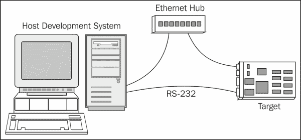
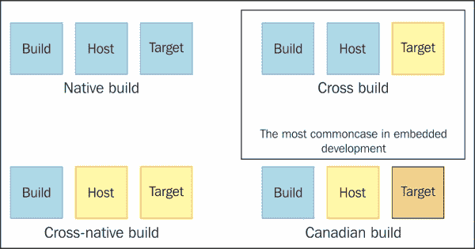
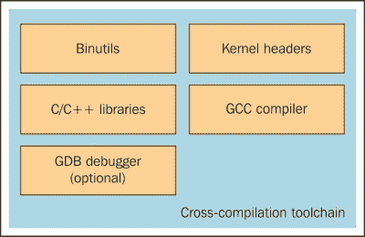

# 第二章：交叉编译

在本章中，您将了解工具链，如何使用和自定义它们，以及代码标准如何适用于它们。工具链包含了许多工具，如编译器、链接器、汇编器、调试器和各种杂项实用程序，帮助操纵生成的应用程序二进制文件。在本章中，您将学习如何使用 GNU 工具链，并熟悉其特性。您将看到涉及手动配置的示例，并同时将这些示例移至 Yocto 项目环境。在本章结束时，将进行分析，以确定手动部署工具链和自动部署工具链之间的相似性和差异，以及可用于它的各种使用场景。

# 介绍工具链

工具链代表了一个编译器及其相关实用程序，用于生成特定目标所需的内核、驱动程序和应用程序。工具链通常包含一组通常相互链接的工具。它包括`gcc`、`glibc`、`binutils`或其他可选工具，如用于特定编程语言（如 C++、Ada、Java、Fortran 或 Objective-C）的调试器可选编译器。

通常，一个可用于传统桌面或服务器的工具链在这些机器上执行，并生成可在同一系统上运行的可执行文件和库。通常用于嵌入式开发环境的工具链称为交叉工具链。在这种情况下，诸如 gcc 之类的程序在主机系统上运行，用于特定目标架构生成二进制代码。整个过程称为交叉编译，这是构建嵌入式开发源代码的最常见方式。



在工具链环境中，有三台不同的机器：

+   代表创建工具链的机器的构建机器

+   代表执行工具链的主机机器

+   代表工具链生成二进制代码的目标机器

这三台机器用于生成四种不同的工具链构建过程：

+   **本地工具链**：这通常在普通 Linux 发行版或您的普通桌面系统上可用。通常编译和运行，并为相同的架构生成代码。

+   **交叉本地工具链**：这代表了在一个系统上构建的工具链，尽管在目标系统上运行并生成二进制代码。一个常见的用例是在目标平台上需要本地`gcc`而无需在目标平台上构建它。

+   **交叉编译工具链**：这是用于嵌入式开发的最常见的工具链类型。它在一个架构类型上编译和运行，通常是 x86，并为目标架构生成二进制代码。

+   **交叉加拿大构建**：这代表了一个涉及在系统 A 上构建工具链的过程。然后在另一个系统上运行该工具链，例如 B，生成第三个系统 C 的二进制代码。这是最不常用的构建过程之一。

生成四种不同的工具链构建过程的三台机器在下图中描述：



工具链代表了使今天大多数伟大项目的存在成为可能的工具列表。这包括开源项目。没有相应的工具链，这种多样性是不可能的。这也发生在嵌入式世界中，新的可用硬件需要相应工具链的组件和支持**板支持包**（**BSP**）。

工具链配置并不是一个简单的过程。在寻找预构建的工具链，甚至自己构建工具链之前，最好的解决方案是检查特定目标 BSP；每个开发平台通常都提供一个。

# 工具链的组成部分

GNU 工具链是 GNU 项目下的一组编程工具的术语。这套工具通常被称为**工具链**，用于应用程序和操作系统的开发。它在嵌入式系统和 Linux 系统的开发中起着重要作用。

以下项目包含在 GNU 工具链中：

+   GNU make：这代表了用于编译和构建的自动化工具

+   GNU 编译器套件（GCC）：这代表了用于多种可用编程语言的编译器套件

+   GNU Binutils：这包含了链接器、汇编器等工具 - 这些工具能够操作二进制文件

+   GNU Bison：这是一个解析器生成器

+   GNU 调试器（GDB）：这是一个代码调试工具

+   GNU m4：这是一个 m4 宏处理器

+   GNU 构建系统（autotools）：包括以下内容：

+   Autoconf

+   Autoheaders

+   Automake

+   Libtool

工具链中包含的项目如下图所示：



嵌入式开发环境需要的不仅仅是交叉编译工具链。它还需要库，并且应该针对特定系统的软件包，如程序、库和实用程序，以及特定主机的调试器、编辑器和实用程序。在某些情况下，通常是在谈论公司的环境时，一些服务器托管目标设备，并且某些硬件探针通过以太网或其他方法连接到主机。这强调了嵌入式发行版包括大量工具的事实，通常情况下，其中一些工具需要定制。介绍这些工具中的每一个将占用书中的一个章节以上。

然而，在本书中，我们只会涵盖工具链构建组件。这些包括以下内容：

+   `binutils`

+   `gcc`

+   `glibc`（C 库）

+   内核头文件

我将从介绍列表中的第一项开始，即**GNU Binutils 软件包**。根据 GNU GPL 许可证开发，它代表了一组工具，用于创建和管理给定架构的二进制文件、目标代码、汇编文件和配置数据。以下是 GNU Binutils 软件包可用工具的功能和名称列表：

+   GNU 链接器，即`ld`

+   GNU 汇编器，即`as`

+   将地址转换为文件名和行号的实用程序，即`addr2line`

+   创建、提取和修改存档的实用程序，即`ar`

+   用于列出对象文件中可用符号的工具，即`nm`

+   复制和翻译对象文件，即`objcopy`

+   显示来自对象文件的信息，即`objdump`

+   为存档内容生成索引的工具，即`ranlib`

+   显示任何 ELF 格式对象文件的信息，即`readelf`

+   列出对象或存档文件的段大小，即`size`

+   从文件中列出可打印的字符串，即`strings`

+   丢弃符号实用程序，即`strip`

+   过滤或解码编码的 C++符号，即`c++filt`

+   创建使用 DLL 的文件，即`dlltool`

+   一种新的、更快的、仅支持 ELF 的链接器，目前仍处于测试阶段，即`gold`

+   显示分析信息工具，即`gprof`

+   将目标代码转换为 NLM 的实用程序，即`nlmconv`

+   一个兼容 Windows 的消息编译器，即`windmc`

+   用于 Windows 资源文件的编译器，即`windres`

这些工具中的大多数使用**二进制文件描述符**（**BFD**）库进行低级数据操作，而且其中许多使用`opcode`库来组装和反汇编操作。

### 注意

有关`binutils`的有用信息可以在[`www.gnu.org/software/binutils/`](http://www.gnu.org/software/binutils/)找到。

在工具链生成过程中，列表上的下一项是内核头文件，它们被 C 库所需，用于与内核交互。在编译相应的 C 库之前，需要提供内核头文件，以便它们可以访问可用的系统调用、数据结构和常量定义。当然，任何 C 库都定义了针对每个硬件架构特定的规范集；在这里，我指的是**应用二进制接口**（**ABI**）。

应用二进制接口（ABI）代表两个模块之间的接口。它提供了有关函数调用方式以及应该在组件之间或操作系统之间传递的信息的信息。参考一本书，比如*The Linux Kernel Primer*，会对你有好处，而且在我看来，它是 ABI 提供的完整指南。我将尝试为你复制这个定义。

ABI 可以被视为类似于协议或协议的一组规则，它提供了链接器将编译模块组合成一个组件的可能性，而无需重新编译的可能性。同时，ABI 描述了这些组件之间的二进制接口。遵守 ABI 的这种约定并符合 ABI 的好处是可以链接使用不同编译器编译的目标文件。

很容易从这两个定义中看出，ABI 取决于平台的类型，这可能包括物理硬件、某种虚拟机等。它也可能取决于所使用的编程语言和编译器，但大部分取决于平台。

ABI 展示了生成的代码如何运行。代码生成过程也必须了解 ABI，但在高级语言中编码时，对 ABI 的关注很少是一个问题。这些信息可以被视为指定一些与 ABI 相关选项的必要知识。

一般规则是，ABI 必须尊重其与外部组件的交互。但是，就其与内部模块的交互而言，用户可以自由做任何他或她想做的事情。基本上，他们能够重新发明 ABI，并形成自己对机器限制的依赖。这里的简单例子与属于自己国家或地区的各种公民有关，因为他们从出生开始就学会并了解该地区的语言。因此，他们能够互相理解并无障碍地交流。对于外部公民来说，要能够交流，他或她需要了解一个地区的语言，并且在这个社区中似乎是很自然的，因此这不会构成问题。编译器也能够设计自己的自定义调用约定，其中他们了解在模块内调用的函数的限制。这通常是出于优化的原因而进行的。然而，这可能被视为 ABI 术语的滥用。

与用户空间 ABI 相关的内核是向后兼容的，并确保使用旧内核头版本生成的二进制文件比在运行内核上可用的版本更好地工作。这样做的缺点在于，使用较新内核头的工具链生成的新系统调用、数据结构和二进制文件可能无法使用较新功能。需要最新内核头的原因可以通过需要访问最新内核功能来证明。

GNU 编译器集合，也称为 GCC，代表了 GNU 工具链的关键组件。尽管最初被命名为 GNU C 编译器，因为它只处理 C 编程语言，但很快开始代表一系列语言，如 C、C++、Objective C、Fortran、Java、Ada 和 Go，以及其他语言的库（如`libstdc++`、`libgcj`等）。

它最初是作为 GNU 操作系统的编译器编写的，并作为 100％自由软件开发。它在 GNU GPL 下分发。这有助于它在各种体系结构上扩展其功能，并在开源软件的增长中发挥了重要作用。

GCC 的开发始于 Richard Stallman 为引导 GNU 操作系统所付出的努力。这个任务导致 Stallman 从头开始编写自己的编译器。它于 1987 年发布，Stallman 是作者，其他人是贡献者。到 1991 年，它已经达到了稳定阶段，但由于其架构限制，无法包含改进。这意味着开始了对 GCC 版本 2 的工作，但不久之后，对它进行新语言接口开发的需求也开始出现，并且开发人员开始对编译器源代码进行自己的分支。这种分支倡议被证明是非常低效的，由于接受代码程序的困难，对它的工作变得非常沮丧。

这在 1997 年发生了变化，当时一群开发人员聚集在**实验/增强 GNU 编译系统**（**EGCS**）工作组，开始将几个分支合并为一个项目。他们在这个冒险中取得了巨大成功，并收集了许多功能，以至于他们使**自由软件基金会**（**FSF**）停止了他们对 GCC 版本 2 的开发，并于 1999 年 4 月任命 EGCS 为官方 GCC 版本和维护者。他们在发布 GCC 2.95 时合并在一起。有关 GNU 编译器集合的历史和发布历史的更多信息，请访问[`www.gnu.org/software/gcc/releases.html`](https://www.gnu.org/software/gcc/releases.html)和[`en.wikipedia.org/wiki/GNU_Compiler_Collection#Revision_history`](http://en.wikipedia.org/wiki/GNU_Compiler_Collection#Revision_history)。

GCC 接口类似于 Unix 约定，用户调用特定于语言的驱动程序，解释参数并调用编译器。然后运行汇编程序生成输出，必要时运行链接器以获得最终可执行文件。对于每种语言编译器，都有一个执行源代码读取的单独程序。

从源代码获取可执行文件的过程有一些执行步骤。在第一步之后，生成抽象语法树，在这个阶段，可以应用编译器优化和静态代码分析。优化和静态代码分析可以同时应用于与体系结构无关的**GIMPLE**或其超集 GENERIC 表示，也可以应用于与体系结构相关的**寄存器传输语言**（**RTL**）表示，它类似于 LISP 语言。使用由 Jack Davidson 和 Christopher Fraser 编写的模式匹配算法生成机器代码。

GCC 最初几乎完全用 C 语言编写，尽管 Ada 前端主要用 Ada 语言编写。然而，2012 年，GCC 委员会宣布采用 C++作为实现语言。尽管 GCC 库的主要活动包括添加新语言支持、优化、改进的运行时库和增加调试应用程序的速度，但它不能被认为是一个完成的实现语言。

每个可用的前端都从给定的源代码生成一个树。使用这种抽象树形式，不同的语言可以共享相同的后端。最初，GCC 使用由 Bison 生成的**Look-Ahead LR**（**LALR**）解析器，但随着时间的推移，它在 2006 年转向了递归下降解析器，用于 C、C++和 Objective-C。今天，所有可用的前端都使用手写的递归下降解析器。

直到最近，程序的语法树抽象与目标处理器不独立，因为树的含义在不同的语言前端之间是不同的，每个前端都提供自己的树语法。所有这些都随着 GCC 4.0 版本引入的 GENERIC 和 GIMPLE 架构无关表示的引入而发生了变化。

GENERIC 是一个更复杂的中间表示，而 GIMPLE 是一个简化的 GENERIC，目标是 GCC 的所有前端。诸如 C、C++或 Java 前端的语言直接在前端生成 GENERIC 树表示。其他使用不同的中间表示，然后被解析和转换为 GENERIC 表示。

GIMPLE 转换表示复杂表达式，这些表达式使用临时变量分割成三地址代码。GIMPLE 表示受到了 McCAT 编译器上使用的 SIMPLE 表示的启发，用于简化程序的分析和优化。

GCC 的中间阶段表示涉及代码分析和优化，并且在编译语言和目标架构方面是独立的。它从 GENERIC 表示开始，继续到**寄存器传输语言**（**RTL**）表示。优化主要涉及跳转线程、指令调度、循环优化、子表达式消除等。RTL 优化不如通过 GIMPLE 表示进行的优化重要。但是，它们包括死代码消除、全局值编号、部分冗余消除、稀疏条件常量传播、聚合标量替换，甚至自动矢量化或自动并行化。

GCC 后端主要由预处理宏和特定目标架构函数表示，例如大小端定义，调用约定或字大小。后端的初始阶段使用这些表示来生成 RTL；这表明，尽管 GCC 的 RTL 表示在名义上是处理器无关的，但抽象指令的初始处理是针对每个特定目标进行调整的。

机器特定的描述文件包含 RTL 模式，还包括最终汇编的代码片段或操作数约束。在 RTL 生成过程中，验证目标架构的约束。要生成一个 RTL 片段，它必须与机器描述文件中的一个或多个 RTL 模式匹配，并且同时满足这些模式的限制。如果不这样做，最终 RTL 转换为机器代码的过程将是不可能的。在编译的最后阶段，RTL 表示变得严格。它的表示包含了真实的机器寄存器对应关系，以及每个指令引用的目标机器描述文件的模板。

因此，通过调用与相应模式相关联的小代码片段来获得机器代码。这样，指令就从目标指令集生成。这个过程涉及从重新加载阶段使用寄存器、偏移和地址。

### 注意

有关 GCC 编译器的更多信息，请访问[`gcc.gnu.org/`](http://gcc.gnu.org/)或[`en.wikipedia.org/wiki/GNU_Compiler_Collection`](http://en.wikipedia.org/wiki/GNU_Compiler_Collection)。

需要在这里介绍的最后一个元素是 C 库。它代表了 Linux 内核和 Linux 系统上使用的应用程序之间的接口。同时，它还为应用程序的更轻松开发提供了帮助。在这个社区中有几个 C 库可用：

+   `glibc`

+   `eglibc`

+   `Newlib`

+   `bionic`

+   `musl`

+   `uClibc`

+   `dietlibc`

+   `Klibc`

GCC 编译器使用的 C 库的选择将在工具链生成阶段执行，并且不仅受到库提供的大小和应用程序支持的影响，还受到标准的符合性、完整性和个人偏好的影响。

# 深入研究 C 库

我们将在这里讨论的第一个库是`glibc`库，它旨在提高性能、符合标准和可移植性。它是由自由软件基金会为 GNU/Linux 操作系统开发的，至今仍然存在于所有积极维护的 GNU/Linux 主机系统上。它是根据 GNU Lesser General Public License 发布的。

`glibc`库最初是由 Roland McGrath 在 20 世纪 80 年代编写的，直到 20 世纪 90 年代才继续发展，当时 Linux 内核分叉了`glibc`，称其为`Linux libc`。它在 1997 年 1 月之前是分开维护的，当时自由软件基金会发布了`glibc 2.0`。`glibc 2.0`包含了很多功能，使得继续开发`Linux libc`毫无意义，因此他们停止了分支并回到了使用`glibc`。在`Linux libc`中进行的更改没有合并到`glibc`中，因为代码的作者身份存在问题。

`glibc`库在尺寸上相当大，不适合小型嵌入式系统，但它提供了**单一 UNIX 规范**（**SUS**）、POSIX、ISO C11、ISO C99、伯克利 Unix 接口、System V 接口定义和 X/Open 可移植性指南 4.2 版的功能，以及与 X/Open 系统接口兼容系统以及 X/Open UNIX 扩展的所有扩展。此外，GLIBC 还提供了在开发 GNU 时被认为有用或必要的扩展。

我将在这里讨论的下一个 C 库是 Yocto 项目在 1.7 版本之前使用的主要 C 库。这里，我指的是`eglibc`库。这是`glibc`的一个版本，经过优化，用于嵌入式设备的使用，并且同时能够保持兼容性标准。

自 2009 年以来，Debian 及其一些派生版本选择从 GNU C 库转移到`eglibc`。这可能是因为 GNU LGPL 和`eglibc`之间的许可证存在差异，这使他们能够接受`glibc`开发人员可能拒绝的补丁。自 2014 年以来，官方`eglibc`主页声明`eglibc`的开发已经停止，因为`glibc`也已经转移到相同的许可证，而且 Debian Jessie 的发布意味着它已经回到了`glibc`。在 Yocto 支持的情况下，他们也决定将`glibc`作为他们的主要库支持选项。

`newlib`库是另一个旨在用于嵌入式系统的 C 库。它是由 Cygnus Support 开发并由 Red Hat 维护的一组自由软件许可证下的库组件。它是用于非 Linux 嵌入式系统的首选 C 库版本之一。

`newlib`系统调用描述了 C 库在多个操作系统上的使用，以及在不需要操作系统的嵌入式系统上的使用。它包含在商业 GCC 发行版中，如 Red Hat、CodeSourcery、Attolic、KPIT 等。它还受到包括 ARM、Renesas 在内的架构供应商的支持，或者类 Unix 环境，如 Cygwin，甚至 Amiga 个人电脑的专有操作系统的支持。

到 2007 年，它还得到了任天堂 DS、PlayStation、便携式 SDK Game Boy Advance 系统、Wii 和 GameCube 开发平台的工具链维护者的支持。2013 年，谷歌原生客户端 SDK 将`newlib`作为其主要 C 库包含在此列表中。

Bionic 是由 Google 为基于 Linux 内核的 Android 开发的 BSD C 库的派生版本。它的开发独立于 Android 代码开发。它的许可证是 3 条款 BSD 许可证，其目标是公开可用的。这些目标包括：

+   **小尺寸**：与`glibc`相比，Bionic 尺寸更小

+   **速度**：这些 CPU 设计为在低频率下工作

+   **BSD 许可证**：谷歌希望将 Android 应用程序与 GPL 和 LGPL 许可证隔离开来，这就是它转向非版权许可证的原因，具体如下：

+   Android 基于 GPLv2 许可证的 Linux 内核

+   `glibc`基于 LGPL，允许链接动态专有库，但不允许静态链接

与`glibc`相比，它还有一系列限制，如下：

+   它不包括 C++异常处理，主要是因为 Android 大多数代码都是用 Java 编写的。

+   它不支持宽字符。

+   它不包括标准模板库，尽管可以手动包含。

+   它在 Bionic POSIX 中运行，甚至系统调用头文件都是 Android 特定函数的包装器或存根。这有时可能会导致奇怪的行为。

+   当 Android 4.2 发布时，它包括对`glibc``FORTIFY_SOURCE`功能的支持。这些功能在 Yocto 和嵌入式系统中经常使用，但只存在于带有 ARM 处理器的 Android 设备的`gcc`版本中。

接下来要讨论的 C 库是`musl`。它是一个用于嵌入式和移动系统的 Linux 操作系统的 C 库。它具有 MIT 许可证，并且是根据从头开始开发的干净、符合标准的`libc`的想法而开发的。作为一个 C 库，它被优化用于静态库的链接。它与 C99 标准和 POSIX 2008 兼容，并实现了 Linux、`glibc`和 BSD 非标准函数。

接下来，我们将讨论`uClibc`，这是为 Linux 嵌入式系统和移动设备设计的 C 标准库。尽管最初是为μClinux 开发并设计用于微控制器，但它获得了追踪，并成为任何在设备上有限空间的人的首选。这是因为它变得受欢迎的原因：

+   它侧重于尺寸而不是性能

+   它具有 GNU Lesser General Public License（LGPL）免费许可证

+   它比 glibc 小得多，减少了编译时间

+   由于许多功能可以使用类似于 Linux 内核、U-Boot 甚至 BusyBox 等软件包上可用的`menuconfig`界面进行启用，因此它具有很高的可配置性。

`uClibc`库还具有另一个使其非常有用的特性。它引入了一种新的思想，因此 C 库不试图支持尽可能多的标准。然而，它专注于嵌入式 Linux，并包括对面临可用空间限制的开发人员必要的功能。出于这个原因，这个库是从头开始编写的，尽管它有其自身的局限性，但`uClibc`是`glibc`的一个重要替代品。如果我们考虑到大多数 C 库使用的功能都包含在其中，最终尺寸要小四倍，WindRiver、MontaVista 和 TimeSys 都是其活跃的维护者。

`dietlibc`库是由 Felix von Leitner 开发的标准 C 库，并在 GNU GPL v2 许可下发布。尽管它也包含一些商业许可的组件，但其设计基于与`uClibc`相同的思想：在尽可能小的尺寸下编译和链接软件。它与`uClibc`还有另一个相似之处；它是从头开始开发的，并且只实现了最常用和已知的标准函数。它的主要用途主要是在嵌入式设备市场。

C 库列表中的最后一个是`klibc`标准 C 库。它是由 H. Peter Anvin 开发的，并且被开发用作 Linux 启动过程中早期用户空间的一部分。它被用于运行内核启动过程的组件，但不用于内核模式，因此它们无法访问标准 C 库。

`klibc`的开发始于 2002 年，旨在将 Linux 初始化代码移出内核。其设计使其适用于嵌入式设备。它还有另一个优势：它针对小尺寸和数据正确性进行了优化。`klibc`库在 Linux 启动过程中从**initramfs**（临时 Ram 文件系统）中加载，并且默认情况下使用`mkinitramfs`脚本将其合并到基于 Debian 和 Ubuntu 的文件系统中。它还可以访问一小组实用程序，如`mount`，`mkdir`，`dash`，`mknod`，`fstype`，`nfsmount`，`run-init`等，在早期初始化阶段非常有用。

### 注意

有关 initramfs 的更多信息可以在内核文档中找到：[`www.kernel.org/doc/Documentation/filesystems/ramfs-rootfs-initramfs.txt`](https://www.kernel.org/doc/Documentation/filesystems/ramfs-rootfs-initramfs.txt)。

`klibc`库根据 GNU GPL 许可，因为它使用了一些来自 Linux 内核的组件，因此作为整体，它被视为 GPL 许可的软件，限制了其在商业嵌入式软件中的适用性。然而，大多数库的源代码都是根据 BSD 许可编写的。

# 使用工具链

在生成工具链时，需要做的第一件事是建立用于生成二进制文件的 ABI。这意味着内核需要理解这个 ABI，同时系统中的所有二进制文件都需要使用相同的 ABI 进行编译。

在使用 GNU 工具链时，收集信息并了解使用这些工具的方式的一个很好的来源是查阅 GNU 编码标准。编码标准的目的非常简单：确保在 GNU 生态系统中以清晰、简单和一致的方式执行工作。这是一个需要被有兴趣使用 GNU 工具编写可靠、稳固和可移植软件的人使用的指南。GNU 工具链的主要重点是 C 语言，但这里应用的规则对于任何编程语言也非常有用。通过确保将给定信息背后的逻辑传递给读者来解释每条规则的目的。

我们将主要关注的语言也将是 C 编程语言。关于 GNU 编码标准与 GNU 库、异常或实用程序的兼容性，以及它们与 Berkeley Unix、标准 C 或 POSIX 等标准的比较应该非常好。在兼容性冲突的情况下，为该编程语言拥有兼容模式非常有用。

标准，如 POSIX 和 C，对于支持扩展有许多限制 - 然而，这些扩展仍然可以通过包括`—posix`，`—ansi`或`—compatible`选项来禁用它们。如果扩展提供了破坏程序或脚本的高概率，因为不兼容，应重新设计其接口以确保兼容性。

大量的 GNU 程序抑制了已知会与 POSIX 冲突的扩展，如果定义了`POSIXLY_CORRECT`环境变量。用户定义功能的使用为交换 GNU 功能与其他完全不同、更好甚至兼容功能提供了可能性。额外的有用功能总是受欢迎的。

如果我们快速浏览 GNU 标准文档，可以从中学到一些有用的信息：

最好使用`int`类型，尽管您可能考虑定义一个更窄的数据类型。当然，也有一些特殊情况可能很难使用。一个例子是`dev_t`系统类型，因为在某些机器上它比`int`短，在其他机器上则更宽。支持非标准 C 类型的唯一方法是使用`Autoconf`检查`dev_t`的宽度，然后相应地选择参数类型。然而，这可能不值得麻烦。

对于 GNU 项目来说，实施组织标准规范是可选的，只有在帮助系统整体变得更好的情况下才能实现。在大多数情况下，遵循已发布的标准符合用户需求，因为他们的程序或脚本可能被认为更具可移植性。一个例子是 GCC，它几乎实现了标准 C 的所有特性，正如标准要求的那样。这为 C 程序的开发人员提供了巨大的优势。这也适用于遵循 POSIX.2 规范的 GNU 实用程序。

还有一些规范中没有遵循的具体要点，但这是为了使 GNU 系统更好地为用户服务。一个例子是标准 C 程序不允许对 C 进行扩展，但是 GCC 实现了其中的许多扩展，其中一些后来被标准所采纳。对于希望按照标准输出错误消息的开发人员，可以使用`--pedantic`参数。这是为了确保 GCC 完全实现了标准。

POSIX.2 标准提到，诸如`du`和`df`之类的命令应该以 512 字节为单位输出大小。然而，用户希望以 1KB 为单位，因此实现了这种默认行为。如果有人希望具有 POSIX 标准要求的行为，他们需要设置`POSIXLY_CORRECT`环境变量。

另一个例子是 GNU 实用程序，当涉及到长命令行选项的支持或选项与参数的混合时，并不总是遵循 POSIX.2 标准规范。这种与 POSIX 标准的不兼容在实践中对开发人员非常有用。这里的主要思想不是拒绝任何新功能或删除旧功能，尽管某个标准将其视为已弃用或禁止。

### 注意

有关 GNU 编码标准的更多信息，请参阅[`www.gnu.org/prep/standards/html_node/`](https://www.gnu.org/prep/standards/html_node/)。

## 健壮编程的建议

为了确保编写健壮的代码，应该提到一些指导方针。第一个指导方针是不应该对任何数据结构使用限制，包括文件、文件名、行和符号，尤其是任意限制。所有数据结构都应该是动态分配的。其中一个原因是大多数 Unix 实用程序会悄悄地截断长行；GNU 实用程序不会这样做。

用于读取文件的实用程序应避免删除`null`字符或不可打印字符。这里的例外是，当这些旨在与某些类型的打印机或终端进行接口的实用程序无法处理先前提到的字符时。在这种情况下，我会建议尝试使用 UTF-8 字符集或其他用于表示多字节字符的字节序列使程序正常工作。

确保检查系统调用的错误返回值；例外情况是开发人员希望忽略错误。最好在由系统调用崩溃导致的错误消息中包括`strerror`、`perror`或等效错误处理函数的系统错误文本，还要添加源代码文件的名称和实用程序的名称。这样做是为了确保错误消息易于被与源代码或程序交互的任何人阅读和理解。

检查`malloc`或`realloc`的返回值，以验证它们是否返回了零。如果在系统中使用`realloc`使块变小，系统将近似块尺寸为 2 的幂，则`realloc`可能会有不同的行为并获得不同的块。在 Unix 中，当`realloc`存在错误时，它会破坏零返回值的存储块。对于 GNU，这个错误不会发生，当它失败时，原始块保持不变。如果要在 Unix 上运行相同的程序并且不想丢失数据，可以检查 Unix 系统上的错误是否已解决，或者使用 GNU 的`malloc`。

释放的块的内容不可访问以进行更改或进行任何其他用户交互。这可以在调用 free 之前完成。

当`malloc`命令在非交互式程序中失败时，我们面临致命错误。如果发生相同的情况，但这次涉及交互式程序，最好中止命令并返回读取循环。这提供了释放虚拟内存、终止其他进程并重试命令的可能性。

要解码参数，可以使用`getopt_long`选项。

在程序执行期间写入静态存储时，使用 C 代码进行初始化。但是，对于不会更改的数据，请保留 C 初始化声明。

尽量远离对未知 Unix 数据结构的低级接口——当数据结构无法以兼容的方式工作时，可能会发生这种情况。例如，要查找目录中的所有文件，开发人员可以使用`readdir`函数或任何高级接口可用函数，因为这些函数没有兼容性问题。

对于信号处理，使用 BSD 变体的`signal`和 POSIX 的`sigaction`函数。在这种情况下，USG 的`signal`接口不是最佳选择。如今，使用 POSIX 信号函数被认为是开发可移植程序的最简单方法。但是，使用一个函数而不是另一个完全取决于开发人员。

对于识别不可能情况的错误检查，只需中止程序，因为无需打印任何消息。这种类型的检查证明了错误的存在。要修复这些错误，开发人员将不得不检查可用的源代码，甚至启动调试器。解决这个问题的最佳方法是在源代码中使用注释描述错误和问题。在使用调试器相应地检查变量后，可以找到相关信息。

不要将程序中遇到的错误数量作为退出状态。这种做法并不是最佳的，主要是因为退出状态的值仅限于 8 位，可执行文件的执行可能有超过 255 个错误。例如，如果尝试返回进程的退出状态 256，父进程将看到状态为零，并认为程序成功完成。

如果创建了临时文件，请检查`TMPDIR`环境变量是个好主意。如果定义了该变量，最好使用`/tmp`目录。应谨慎使用临时文件，因为在可写入世界的目录中创建它们可能会导致安全漏洞。对于 C 语言，可以通过以下方式避免在临时文件中创建临时文件：

```
fd = open (filename, O_WRONLY | O_CREAT | O_EXCL, 0600);
```

这也可以使用`mkstemps`函数来完成，该函数由`Gnulib`提供。

对于 bash 环境，使用`noclobber`环境变量，或`set -C`的简短版本，以避免前面提到的问题。此外，`mktemp`可用实用程序是在 GNU Coreutils 软件包中的制作临时文件的更好解决方案。

### 注意

有关 GNU C 标准的更多信息，请访问[`www.gnu.org/prep/standards/standards.html`](https://www.gnu.org/prep/standards/standards.html)。

## 生成工具链

在介绍组成工具链的软件包之后，本节将介绍获取自定义工具链所需的步骤。将生成的工具链包含与 Poky dizzy 分支中可用的相同源。在这里，我指的是`gcc`版本 4.9，`binutils`版本 2.24 和`glibc`版本 2.20。对于 Ubuntu 系统，也有快捷方式可用。可以使用可用的软件包管理器安装通用工具链，还有其他选择，例如从 Board Support Packages 中下载可用的自定义工具链，甚至从 CodeSourcery 和 Linaro 等第三方下载。有关工具链的更多信息，请访问[`elinux.org/Toolchains`](http://elinux.org/Toolchains)。将用作演示的架构是 ARM 架构。

工具链构建过程有八个步骤。我只会概述每个步骤所需的活动，但必须提到它们都在 Yocto 项目配方中自动化。在 Yocto 项目部分，工具链是在不知不觉中生成的。与生成的工具链交互的最简单任务是调用**meta-ide-support**，但这将在适当的部分中介绍如下：

+   **设置**：这代表了创建顶级构建目录和源子目录的步骤。在此步骤中，定义了诸如`TARGET`，`SYSROOT`，`ARCH`，`COMPILER`，`PATH`等变量。

+   **获取源代码**：这代表了在后续步骤中可用的软件包，如`binutils`，`gcc`，`glibc`，`Linux 内核`头文件和各种补丁。

+   **GNU Binutils 设置** - 这代表了与`binutils`软件包交互的步骤，如下所示：

+   解压相应版本的源代码

+   如果适用，相应地对源代码进行打补丁

+   相应地配置软件包

+   编译源代码

+   将源代码安装在相应的位置

+   **Linux 内核头文件设置**：这代表了与 Linux 内核源交互的步骤，如下所示：

+   解压内核源代码。

+   如果适用，对内核源代码进行打补丁。

+   为所选的架构配置内核。在此步骤中，将生成相应的内核配置文件。有关 Linux 内核的更多信息将在第四章中介绍，*Linux Kernel*。

+   编译 Linux 内核头文件并将其复制到相应的位置。

+   将头文件安装在相应的位置。

+   **Glibc 头文件设置**：这代表了设置`glibc`构建区域和安装头文件的步骤，如下所示：

+   解压 glibc 存档和头文件

+   如果适用，对源代码进行打补丁

+   配置源代码，启用`-with-headers`变量以将库链接到相应的 Linux 内核头文件

+   编译`glibc`头文件

+   相应地安装头文件

+   **GCC 第一阶段设置**：这代表了生成 C 运行时文件（如`crti.o`和`crtn.o`）的步骤：

+   解压 gcc 存档

+   如有必要，对`gcc`源代码进行修补

+   配置源代码，启用所需的功能

+   编译 C 运行时组件

+   相应地安装源代码

+   **构建`glibc`源代码**：这代表了构建`glibc`源代码并进行必要的 ABI 设置的步骤，如下所示：

+   通过相应地设置`mabi`和`march`变量来配置`glibc`库

+   编译源代码

+   相应地安装`glibc`

+   **GCC 第二阶段设置**：这代表了工具链配置完成的最终设置阶段，如下所示：

+   配置`gcc`源代码

+   编译源代码

+   在相应位置安装二进制文件

执行这些步骤后，开发人员将可以使用工具链。在 Yocto 项目中遵循相同的策略和构建过程步骤。

# Yocto 项目参考

正如我所提到的，Yocto 项目环境的主要优势和可用功能在于 Yocto 项目构建不使用主机可用的软件包，而是构建和使用自己的软件包。这是为了确保主机环境的更改不会影响其可用的软件包，并且构建是为了生成自定义 Linux 系统。工具链是其中的一个组件，因为几乎所有构成 Linux 发行版的软件包都需要使用工具链组件。

Yocto 项目的第一步是确定将组合生成工具链的确切源和软件包，该工具链将被后续构建的软件包使用，如 U-Boot 引导程序、内核、BusyBox 等。在本书中，将讨论的源代码位于 dizzy 分支、最新的 poky 12.0 版本和 Yocto 项目版本 1.7 中。可以使用以下命令收集源代码：

```
git clone -b dizzy http://git.yoctoproject.org/git/poky

```

收集源代码并调查源代码，我们确定了前面标题中提到的部分软件包，并按照以下方式呈现：

```
cd poky
find ./ -name "gcc"
./meta/recipes-devtools/gcc
find ./ -name "binutils" 
./meta/recipes-devtools/binutils
./meta/recipes-devtools/binutils/binutils
find ./ -name "glibc"
./meta/recipes-core/glibc
./meta/recipes-core/glibc/glibc
$ find ./ -name "uclibc"
./meta-yocto-bsp/recipes-core/uclibc
./meta-yocto-bsp/recipes-core/uclibc/uclibc
./meta/recipes-core/uclibc 

```

GNU CC 和 GCC C 编译器软件包包括所有前面的软件包，分为多个部分，每个部分都有其目的。这主要是因为每个部分都有其目的，并且用于不同的范围，如`sdk`组件。然而，正如我在本章开头提到的，有多个需要确保并使用相同源代码自动化的工具链构建过程。Yocto 中支持 gcc 4.8 和 4.9 版本。快速查看`gcc`可用的配方显示了可用的信息：

```
meta/recipes-devtools/gcc/
├── gcc-4.8
├── gcc_4.8.bb
├── gcc-4.8.inc
├── gcc-4.9
├── gcc_4.9.bb
├── gcc-4.9.inc
├── gcc-common.inc
├── gcc-configure-common.inc
├── gcc-cross_4.8.bb
├── gcc-cross_4.9.bb
├── gcc-cross-canadian_4.8.bb
├── gcc-cross-canadian_4.9.bb
├── gcc-cross-canadian.inc
├── gcc-cross.inc
├── gcc-cross-initial_4.8.bb
├── gcc-cross-initial_4.9.bb
├── gcc-cross-initial.inc
├── gcc-crosssdk_4.8.bb
├── gcc-crosssdk_4.9.bb
├── gcc-crosssdk.inc
├── gcc-crosssdk-initial_4.8.bb
├── gcc-crosssdk-initial_4.9.bb
├── gcc-crosssdk-initial.inc
├── gcc-multilib-config.inc
├── gcc-runtime_4.8.bb
├── gcc-runtime_4.9.bb
├── gcc-runtime.inc
├── gcc-target.inc
├── libgcc_4.8.bb
├── libgcc_4.9.bb
├── libgcc-common.inc
├── libgcc.inc
├── libgcc-initial_4.8.bb
├── libgcc-initial_4.9.bb
├── libgcc-initial.inc
├── libgfortran_4.8.bb
├── libgfortran_4.9.bb
└── libgfortran.inc

```

GNU Binutils 软件包代表了二进制工具集合，如 GNU 链接器、GNU 汇编器、`addr2line`、`ar`、`nm`、`objcopy`、`objdump`和其他工具及相关库。Yocto 项目支持 Binutils 版本 2.24，并且还依赖于可用的工具链构建过程，可以从源代码检查中看到：

```
meta/recipes-devtools/binutils/
├── binutils
├── binutils_2.24.bb
├── binutils-2.24.inc
├── binutils-cross_2.24.bb
├── binutils-cross-canadian_2.24.bb
├── binutils-cross-canadian.inc
├── binutils-cross.inc
├── binutils-crosssdk_2.24.bb
└── binutils.inc

```

最后的组件由 C 库组成，这些库作为 Poky dizzy 分支中的组件存在。有两个可供开发人员使用的 C 库。第一个是 GNU C 库，也称为`glibc`，是 Linux 系统中最常用的 C 库。`glibc`软件包的源代码可以在这里查看：

```
meta/recipes-core/glibc/
├── cross-localedef-native
├── cross-localedef-native_2.20.bb
├── glibc
├── glibc_2.20.bb
├── glibc-collateral.inc
├── glibc-common.inc
├── glibc.inc
├── glibc-initial_2.20.bb
├── glibc-initial.inc
├── glibc-ld.inc
├── glibc-locale_2.20.bb
├── glibc-locale.inc
├── glibc-mtrace_2.20.bb
├── glibc-mtrace.inc
├── glibc-options.inc
├── glibc-package.inc
├── glibc-scripts_2.20.bb
├── glibc-scripts.inc
├── glibc-testing.inc
├── ldconfig-native-2.12.1
├── ldconfig-native_2.12.1.bb
└── site_config

```

从这些源中，相同的位置还包括工具，如`ldconfig`，用于运行时依赖关系的独立本地动态链接器和绑定和交叉语言环境生成工具。在另一个名为`uClibc`的 C 库中，如前所述，这是为嵌入式系统设计的库，具有较少的配方，可以从 Poky 源代码中查看：

```
meta/recipes-core/uclibc/
├── site_config
├── uclibc-config.inc
├── uclibc-git
├── uclibc_git.bb
├── uclibc-git.inc
├── uclibc.inc
├── uclibc-initial_git.bb
└── uclibc-package.inc

```

uClibc 被用作`glibc` C 库的替代方案，因为它生成较小的可执行文件占用空间。同时，`uClibc`是前面列表中所呈现的唯一一个应用了`bbappend`的软件包，因为它扩展了对两台机器`genericx86-64`和`genericx86`的支持。可以通过将`TCLIBC`变量更改为相应的变量来在`glibc`和`uClibc`之间进行更改：`TCLIBC = "uclibc"`。

如前所述，Yocto Project 的工具链生成过程更简单。这是在使用 Yocto Project 构建任何配方之前执行的第一个任务。要在 Bitbake 中生成交叉工具链，首先执行`bitbake meta-ide-support`任务。例如，可以为`qemuarm`架构执行该任务，但当然也可以以类似的方法为任何给定的硬件架构生成。任务完成执行过程后，工具链将生成并填充构建目录。在此之后，可以通过在`tmp`目录中使用`environment-setup`脚本来使用它：

```
cd poky
source oe-init-build-env ../build-test

```

相应地在`conf/local.conf`文件中将`MACHINE`变量设置为值`qemuarm`：

```
bitbake meta-ide-support
source tmp/environment-setup

```

用于生成工具链的默认 C 库是`glibc`，但可以根据开发人员的需要进行更改。从前一节的介绍中可以看出，Yocto Project 中的工具链生成过程非常简单直接。它还避免了手动工具链生成过程中涉及的所有麻烦和问题，使得重新配置也非常容易。

# 摘要

在本章中，您将获得理解 Linux 工具链组成部分所需的必要信息，以及开发人员为工作或配置特定于板或架构的 Linux 工具链所采取的步骤。您还将获得有关 Yocto Project 源中可用软件包的信息，以及 Yocto Project 中定义的过程与 Yocto Project 上下文之外已经使用的过程非常相似。

在下一章中，我们将快速浏览有关引导加载程序的信息，特别强调 U-Boot 引导加载程序。您还将获得有关引导顺序和 U-Boot 源中板的配置的信息。
