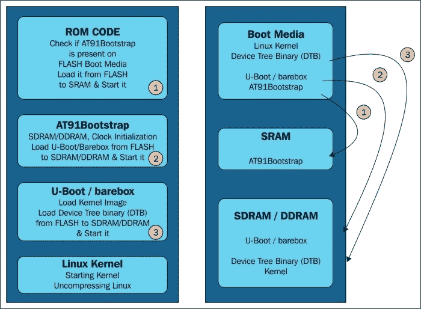
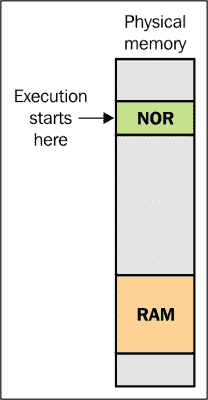
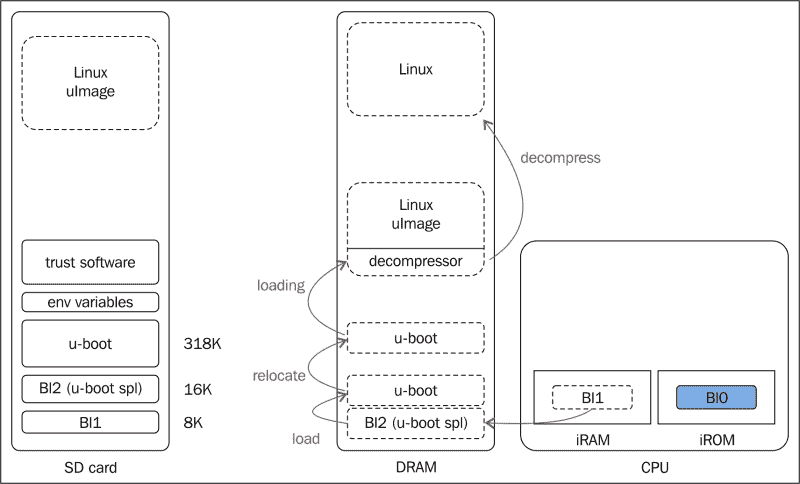
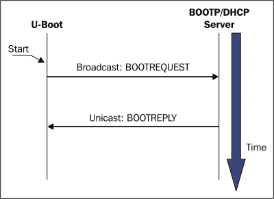
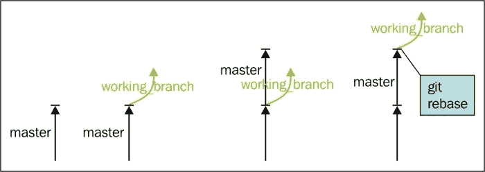
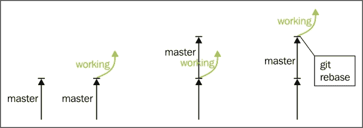
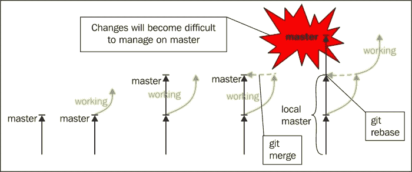

# 第三章。引导加载程序

在本章中，将介绍在嵌入式环境中使用 Linux 系统所必需的最重要的组件之一。我指的是引导加载程序，它是一种软件，可以初始化平台并使其准备好引导 Linux 操作系统。本章将介绍引导加载程序的好处和作用。本章主要关注 U-Boot 引导加载程序，但鼓励读者也了解其他引导加载程序，如 Barebox、RedBoot 等。所有这些引导加载程序都有各自的特点，没有一种特别适合所有需求；因此，在本章中欢迎进行实验和探索。

本章的主要目的是介绍嵌入式引导加载程序和固件的主要属性，它们的引导机制，以及在固件更新或修改时出现的问题。我们还将讨论与安全、安装或容错相关的问题。关于引导加载程序和固件的概念，我们有多个定义可用，其中一些是指传统的桌面系统，而我们对此不感兴趣。

固件通常代表一个固定且小型的程序，用于控制硬件系统。它执行低级操作，通常存储在闪存、只读存储器、可擦写只读存储器等上。它不经常更改。由于有时会有人对这个术语感到困惑，并且有时仅用于定义硬件设备或表示数据及其指令，因此完全避免使用。它代表两者的结合：计算机数据和信息，以及与硬件设备结合在一起的只读软件，可用于设备上。

引导加载程序代表系统初始化时首先执行的软件部分。它用于加载、解压缩和执行一个或多个二进制应用程序，比如 Linux 内核或根文件系统。它的作用是将系统添加到可以执行其主要功能的状态。这是在加载和启动它接收到的或已经保存在内部存储器上的正确二进制应用程序之后完成的。在初始化时，硬件引导加载程序可能需要初始化锁相环（PLL）、设置时钟，或者启用对 RAM 存储器和其他外围设备的访问。然而，这些初始化是在基本级别上完成的；其余的由内核驱动程序和其他应用程序完成。

今天有许多引导加载程序可用。由于本主题的空间有限，而且它们的数量很多，我们只讨论最流行的几种。U-Boot 是 PowerPC、ARM、MIPS 等架构中最流行的引导加载程序之一，它将成为本章的主要焦点。

# 引导加载程序的作用

第一次电流进入开发板处理器时，运行程序之前需要准备大量的硬件组件。对于每种架构、硬件制造商，甚至处理器来说，初始化过程都是不同的。在大多数情况下，它涉及一组配置和操作，对于各种处理器来说都是不同的，并最终从处理器附近的存储设备中获取引导代码。这个存储设备通常是闪存存储器，引导代码是引导加载程序的第一阶段，它初始化处理器和相关硬件外围设备。

大多数可用的处理器在通电时会转到默认地址位置，并在找到二进制数据的第一个字节后开始执行它们。基于这些信息，硬件设计师定义了闪存内存的布局和后续可以用于从可预测地址加载和引导 Linux 操作系统的地址范围。

在初始化的第一阶段，通常使用特定于处理器的汇编语言进行板子初始化，完成后，整个生态系统就准备好进行操作系统引导过程。引导程序负责这一切；它是提供加载、定位和执行操作系统的主要组件的可能性。此外，它还可以包含其他高级功能，比如升级 OS 映像、验证 OS 映像、在几个 OS 映像之间进行选择，甚至升级自身的可能性。传统 PC BIOS 和嵌入式引导程序之间的区别在于，在嵌入式环境中，引导程序在 Linux 内核开始执行后被覆盖。事实上，在它将控制权交给 OS 映像后，它就不复存在了。

在使用外围设备之前，引导程序需要仔细初始化外围设备，比如闪存或 DRAM。这并不是一件容易的事情。例如，DRAM 芯片不能以直接的方式读取或写入 - 每个芯片都有一个需要启用读写操作的控制器。同时，DRAM 需要不断刷新，否则数据将丢失。事实上，刷新操作代表了在硬件制造商规定的时间范围内读取每个 DRAM 位置。所有这些操作都是 DRAM 控制器的责任，它可能会给嵌入式开发人员带来很多挫折，因为它需要对架构设计和 DRAM 芯片有特定的了解。

引导程序没有普通应用程序的基础设施。它没有只能通过名称调用并开始执行的可能性。在获得控制权后，它通过初始化处理器和必要的硬件（如 DRAM）创建自己的上下文，如果需要，将自己移动到 DRAM 中以加快执行速度，最后开始实际的代码执行。

第一个复杂性因素是启动代码与处理器的引导顺序的兼容性。第一个可执行指令需要位于闪存内存中的预定义位置，这取决于处理器甚至硬件架构。此外，有可能有多个处理器根据接收到的硬件信号在几个位置寻找这些第一个可执行指令。

另一种可能性是在许多新的开发板上具有相同的结构，比如 Atmel SAMA5D3-Xplained：



对于 Atmel SAMA5D3-Xplained 板和其他类似的板，引导过程是从 ROM 内存中的集成引导代码 BootROM 开始的，该代码在 AT91 CPU 上加载第一阶段引导程序 AT91Bootstrap 到 SRAM 并启动它。第一阶段引导程序初始化 DRAM 内存并启动第二阶段引导程序，这种情况下是 U-Boot。有关引导序列可能性的更多信息可以在即将介绍的引导序列头部中找到。

缺乏执行上下文代表另一个复杂性。即使在一个没有内存，因此没有堆栈来分配信息的系统中编写一个简单的`"Hello World"`也会与众不同，这就是引导程序初始化 RAM 内存以便有一个可用的堆栈，并能够运行更高级的程序或语言，比如 C 的原因。

# 比较各种引导加载程序

正如前面所读到的，嵌入式系统有许多引导加载程序可用。这里将介绍以下引导加载程序：

+   U-Boot：也称为通用引导加载程序，主要适用于嵌入式 Linux 系统的 PowerPC 和 ARM 架构

+   Barebox：最初被称为 U-Boot v2，于 2007 年开始，旨在解决 U-Boot 的局限性；随着设计目标和社区的变化，它随时间改变了名称

+   RedBoot：这是一个源自 eCos 的 RedHat 引导加载程序，eCos 是一种便携式的开源实时操作系统，专为嵌入式系统设计

+   rrload：这是一个基于嵌入式 Linux 系统的 ARM 引导加载程序

+   PPCBOOT：这是用于 PowerPC 的引导加载程序，基于嵌入式 Linux 系统

+   CLR/OHH：这代表基于 ARM 架构的嵌入式 Linux 系统的闪存引导加载程序

+   Alios：这是一个主要用汇编语言编写的引导加载程序，进行 ROM 和 RAM 初始化，并试图完全消除嵌入式系统上固件的需求

有许多可用的引导加载程序，这是因为存在大量不同的架构和设备，实际上有很多，几乎不可能有一个适用于所有系统的引导加载程序。引导加载程序的种类很多；区分因素包括板类型和结构、SOC 差异甚至 CPU。 

# 深入研究引导加载程序循环

如前所述，引导加载程序是在初始化系统后首先运行的组件，并为操作系统引导过程准备整个生态系统。这个过程因架构而异。例如，对于 x86 架构，处理器可以访问 BIOS，这是一个可用于非易失性存储器的软件，通常是 ROM。它的作用是在系统重置后开始执行并初始化硬件组件，这些组件稍后将被第一阶段引导加载程序使用。它还执行引导加载程序的第一阶段。

第一阶段引导加载程序在尺寸上非常小 - 通常只有 512 字节，并驻留在易失性存储器中。它在第二阶段执行完整的引导加载程序初始化。第二阶段引导加载程序通常驻留在第一阶段引导加载程序旁边，它们包含最多的功能并完成大部分工作。它们还知道如何解释各种文件系统格式，主要是因为内核是从文件系统加载的。

对于 x86 处理器，还有更多可用的引导加载程序解决方案：

+   GRUB：Grand Unified Bootloader 是 Linux 系统中最常用和功能强大的引导加载程序，适用于台式 PC 平台。它是 GNU 项目的一部分，也是 x86 架构系统中最强大的引导加载程序之一。这是因为它能够理解各种文件系统和内核映像格式。它能够在引导时更改引导配置。GRUB 还支持网络引导和命令行界面。它有一个在引导时处理并可修改的配置文件。有关更多信息，请访问[`www.gnu.org/software/grub/`](http://www.gnu.org/software/grub/)。

+   **Lilo**：Linux Loader 是商业 Linux 发行版中经常使用的引导加载程序。与前面的情况类似，它适用于台式 PC 平台。它有多个组件，第一个组件出于历史原因位于磁盘驱动器的第一个扇区上；它是引导组件。出于同样的历史原因，它受限于 512 字节的尺寸，并且加载并提供控制给第二阶段引导加载程序，后者完成大部分引导加载程序的工作。Lilo 有一个配置实用程序，主要用作 Linux 内核引导过程的信息来源。有关更多信息，请访问[`www.tldp.org/HOWTO/LILO.html`](http://www.tldp.org/HOWTO/LILO.html)。

+   **Syslinux**：用于可移动媒体或网络引导。Syslinux 是一个在 MS-DOS 或 Windows FAT 文件系统上运行的 Linux 操作系统引导加载程序，主要用于 Linux 的救援和首次安装。有关更多信息，请访问[`www.kernel.org/pub/linux/utils/boot/syslinux/`](http://www.kernel.org/pub/linux/utils/boot/syslinux/)。

对于大多数嵌入式系统，这种引导过程并不适用，尽管有一些系统会复制这种行为。接下来将介绍两种情况。第一种情况是代码执行从固定地址位置开始，第二种情况是 CPU 在 ROM 存储器中有可调用的代码。



图像的右侧呈现为先前提到的引导机制。在这种情况下，硬件需要一个 NOR 闪存存储器芯片，该芯片位于起始地址，以确保代码执行的开始。

NOR 存储器优于 NAND 存储器，因为它允许随机地址访问。这是第一阶段引导加载程序编程开始执行的地方，这并不使它成为最实用的引导机制。

尽管它并不是用于引导加载程序引导过程的最实用方法，但它仍然可用。然而，它在只适用于不适合更强大引导选项的板卡上才能使用。

# U-Boot 引导加载程序

今天有许多开源引导加载程序可用。几乎所有这些引导加载程序都具有加载和执行程序的功能，通常涉及操作系统，并且它们的功能用于串行接口通信。然而，并非所有引导加载程序都具有通过以太网通信或自我更新的可能性。另一个重要因素是引导加载程序的广泛使用。组织和公司通常会选择一种引导加载程序，以支持它们所支持的多样化的板卡、处理器和架构。类似的情况也发生在 Yocto 项目中，当选择一个引导加载程序来代表官方支持的引导加载程序时。他们和其他类似的公司选择了 U-Boot 引导加载程序，在 Linux 社区中相当知名。

U-Boot 引导加载程序，或其官方名称 Das U-Boot，由 Wolfgang Denx 开发和维护，得到社区的支持。它在 GPLv2 许可下，其源代码在`git`存储库中免费提供，如第一章所示，每两个月发布一次。发布版本名称显示为`U-boot vYYYY.MM`。有关 U-Boot 加载程序的信息可在[`www.denx.de/wiki/U-Boot/ReleaseCycle`](http://www.denx.de/wiki/U-Boot/ReleaseCycle)找到。

U-Boot 源代码具有非常明确定义的目录结构。可以通过以下控制台命令轻松看到这一点：

```
tree -d -L 1
.
├── api
├── arch
├── board
├── common
├── configs
├── disk
├── doc
├── drivers
├── dts
├── examples
├── fs
├── include
├── lib
├── Licenses
├── net
├── post
├── scripts
├── test
└── tools
19 directories

```

`arch`目录包含特定架构文件和每个架构、CPU 或开发板特定目录。`api`包含独立于机器或架构类型的外部应用程序。`board`包含具有特定目录名称的所有特定板卡文件。`common`是`misc`函数的位置。`disk`包含磁盘驱动处理函数，文档可在`doc`目录中找到。驱动程序位于`drivers`目录中。文件系统特定功能位于`fs`目录中。还有一些目录需要在这里提到，比如`include`目录，其中包含头文件；`lib`目录包含对各种实用程序的通用库支持，例如扁平设备树、各种解压缩、`post`（自检）等，但我会让读者的好奇心去发现它们，一个小提示是检查`Directory Hierachy`部分的`README`文件。

在 U-Boot 源代码中，可以找到每个支持的板卡的配置文件，这些文件在前一章节中下载到`./include/configs`文件夹中。这些配置文件是`.h`文件，包含了一些`CONFIG_`文件和有关内存映射、外围设备及其设置、命令行输出等信息，例如用于引导 Linux 系统的默认引导地址等。有关配置文件的更多信息可以在*Configuration Options*部分的`README`文件中或特定板卡配置文件中找到。对于 Atmel SAMA5D3-Xplained，配置文件是`include/configs/sama5d3_xplained.h`。此外，在`configs`目录中为该板卡提供了两种配置，分别是：

+   `configs/sama5d3_xplained_mmc_defconfig`

+   `configs/sama5d3_xplained_nandflash_defconfig`

这些配置用于定义板卡**Secondary Program Loader**（**SPL**）初始化方法。SPL 代表从 U-Boot 源代码构建的一个小型二进制文件，放置在 SRAM 内存中，用于将 U-Boot 加载到 RAM 内存中。通常，它的内存小于 4KB，这就是引导序列的样子：



在实际开始为特定板卡构建 U-Boot 源代码之前，必须指定板卡配置。对于 Atmel SAMA5_Xplained 开发板，如前图所示，有两种可用的配置。配置是通过使用`make ARCH=arm CROSS_COMPILE=${CC} sama5d3_xplained_nandflash_defconfig`命令完成的。在这个命令后面，将创建`include/config.h`文件。这个头文件包含了针对所选板卡、架构、CPU 以及特定板卡头文件的定义。从`include/config.h`文件中读取的`CONFIG_*`变量包括了编译过程的确定。配置完成后，可以开始为 U-Boot 进行构建。

另一个可能非常有用的示例涉及引导嵌入式系统的另一种情况，即需要使用 NOR 存储器。在这种情况下，我们可以看一个特定的示例。这也在 Christopher Hallinan 的《嵌入式 Linux 入门》中有很好的描述，其中讨论了 AMCC PowerPC 405GP 的处理器。该处理器的硬编码地址为 0xFFFFFFFC，并且可以使用`.resetvec`，重置向量位置来查看。还指定了这一部分的其余部分只有值`1`直到 0xFFFFFFFF 堆栈的末尾；这意味着空的闪存存储器数组只包含值`1`。有关此部分的信息可在`resetvec.S`文件中找到，该文件位于`arch/powerpc/cpu/ppc4xx/resetvec.S`。`resetvec.S`文件的内容如下：

```
 /* Copyright MontaVista Software Incorporated, 2000 */
#include <config.h>
  .section .resetvec,"ax"
#if defined(CONFIG_440)
  b _start_440
#else
#if defined(CONFIG_BOOT_PCI) && defined(CONFIG_MIP405)
  b _start_pci
#else
  b _start
#endif
#endif
```

检查此文件的源代码，可以看到在这一部分中只定义了一条指令，而不管可用的配置选项如何。

U-Boot 的配置通过两种类型的配置变量完成。第一种是`CONFIG_*`，它引用了用户可以配置以启用各种操作功能的配置选项。另一个选项称为`CFG_*`，用于配置设置和引用硬件特定的细节。`CFG_*`变量通常需要对硬件平台、外围设备和处理器有很好的了解。SAMA5D3 Xplained 硬件平台的配置文件位于`include/config.h`头文件中，如下所示：

```
/* Automatically generated - do not edit */
#define CONFIG_SAMA5D3  1
#define CONFIG_SYS_USE_NANDFLASH        1
#define CONFIG_SYS_ARCH  "arm"
#define CONFIG_SYS_CPU   "armv7"
#define CONFIG_SYS_BOARD "sama5d3_xplained"
#define CONFIG_SYS_VENDOR "atmel"
#define CONFIG_SYS_SOC    "at91"
#define CONFIG_BOARDDIR board/atmel/sama5d3_xplained
#include <config_cmd_defaults.h>
#include <config_defaults.h>
#include <configs/sama5d3_xplained.h>
#include <asm/config.h>
#include <config_fallbacks.h>
#include <config_uncmd_spl.h>
```

此处提供的配置变量代表 SAMA5D3 Xplained 板的相应配置。这些配置的一部分涉及用户与引导加载程序的交互的一些标准命令。这些命令可以根据需要添加或删除，以扩展或减少可用命令行界面的命令。

有关 U-Boot 可配置命令界面的更多信息，请参阅[`www.denx.de/wiki/view/DULG/UBootCommandLineInterface`](http://www.denx.de/wiki/view/DULG/UBootCommandLineInterface)。

## 引导 U-Boot 选项

在工业环境中，与 U-Boot 的交互主要通过以太网接口完成。以太网接口不仅能够更快地传输操作系统映像，而且比串行连接更不容易出错。

引导加载程序内部的一个最重要的功能与对动态主机控制协议（DHCP）、简单文件传输协议（TFTP）甚至引导协议（BOOTP）的支持有关。BOOTP 和 DHPC 使以太网连接能够自行配置并从专用服务器获取 IP 地址。TFTP 使得通过 TFTP 服务器下载文件成为可能。目标设备与 DHCP/BOOTP 服务器之间传递的消息在下图中以更通用的方式表示。最初，硬件平台发送一个广播消息，到达所有可用的 DHCP/BOOTP 服务器。每个服务器都会发送其提供的 IP 地址，客户端接受最适合其目的的那个，并拒绝其他的。



目标设备与 DHCP/BOOTP 通信完成后，它将保留一个特定于目标的配置，其中包含主机名、目标 IP 和硬件以太网地址（MAC 地址）、子网掩码、tftp 服务器 IP 地址甚至是 TFTP 文件名。这些信息绑定到以太网端口，并在引导过程中后续使用。

对于引导映像，U-Boot 提供了许多与存储子系统支持相关的功能。这些选项包括 RAM 引导、MMC 引导、NAND 引导、NFS 引导等等。对这些选项的支持并不总是容易的，可能涉及硬件和软件的复杂性。

## 移植 U-Boot

我之前提到过，U-Boot 是最常用和知名的引导加载程序之一。这也是因为它的架构使得在新的开发平台和处理器上进行移植变得非常容易。同时，还有大量可用的开发平台可以作为参考。任何有兴趣移植新平台的开发人员首先应该做的事情是检查`board`和`arch`目录，以建立它们的基线，并同时识别它们与其他 CPU 和可用板子的相似之处。

`board.cfg`文件是注册新平台的起点。在这里，应该添加以下信息作为表格行：

+   状态

+   架构

+   CPU

+   SOC

+   供应商

+   板子名称

+   目标

+   选项

+   维护者

要移植类似于 SAMA5D3 Xplained 的机器，可以查阅的目录之一是`arch`目录。它包含了一些文件，比如`board.c`，其中包含了与板子和 SOC 的初始化过程相关的信息。最值得注意的过程是`board_init_r()`，它在 RAM 中重新定位后对板子和外设进行设置和探测，`board_init_f()`，它在 RAM 中重新定位之前识别堆栈大小和保留地址，以及`init_sequence[]`，它在`board_init_f`内部用于外设的设置。在相同位置内的其他重要文件还有`bootm.c`和`interrupts.c`文件。前者主要负责从内存中引导操作系统，后者负责实现通用中断。

`board`目录还有一些有趣的文件和函数需要在这里提到，比如`board/atmel/sama5d3_xplained/sama5d3_xplained.c`文件。它包含了一些函数，比如`board_init()`、`dram_init()`、`board_eth_init()`、`board_mmc_init()`、`spl_board_init()`和`mem_init()`，用于初始化，其中一些被`arch/arm/lib/board.c`文件调用。

以下是一些其他相关的目录：

+   `common`：这包含了用户命令、中间件、用于中间件和用户命令之间的接口的 API，以及所有可用板子使用的其他函数和功能。

+   `drivers`：这包含了各种设备驱动程序和中间件 API 的驱动程序，比如`drivers/mmc/mmc.c`、`drivers/pci/pci.c`、`drivers/watchdog/at91sam9_wdt.c`等。

+   `fs`：各种支持的文件系统，如 USB、SD 卡、Ext2 FAT 等都可以在这里找到。

+   `include`：这代表了大多数板子所需的所有头文件的位置。SOC 和其他软件也可用。在 include/configs 中，可以找到特定于板子的配置，并包括从 Linux 导入的头文件；这些可以用于各种设备驱动程序、移植或其他字节操作。

+   `tools`：这是工具的位置，比如`checkpatch.pl`，这是一个用于发送到邮件列表之前用作编码风格检查的补丁检查工具，或者`mkimage.c`工具。这也用于 U-Boot 通用头文件的生成，以便制作 Linux 二进制文件，并确保它们能够使用 U-Boot 引导。

有关 SAMA5D3 Xplained 板的更多信息可以在相应的 doc 目录和`README`文件中找到，例如`README.at91`、`README.at91-soc`、`README.atmel_mci`、`README.atmel_pmecc`、`README.ARM-memory-map`等。

对于有兴趣提交对 U-Boot 进行新开发板、CPU 或 SOC 移植时所做的更改的人，应遵循一些规则。所有这些都与`git`交互有关，并帮助您确保正确维护您的分支。

开发人员应该做的第一件事是跟踪对应于本地分支的上游分支。另一个建议是忘记`git` `merge`，而是使用`git` `rebase`。使用`git fetch`命令可以与上游存储库保持联系。要使用补丁，需要遵循一些一般规则，并且补丁只能有一个逻辑更改，可以是以下任何一个：

+   更改不应包含无关或不同的修改；每个更改集只有一个补丁可用和可接受

+   提交应尽可能使用`git-bisect`来检测源代码中的错误时进行调试

+   如果一组修改影响了多个文件，则所有这些文件都应在同一个补丁中提交

+   补丁需要进行审查，而且非常彻底

让我们看一下下面的图表，它说明了 git rebase 操作：



如前面和后面的图表所示，**git rebase**操作已将工作从一个分支重新创建到另一个分支。来自一个分支的每个提交都可以在后续的一个分支上使用，就在它的最后一个提交之后。



另一方面，`git merge`操作是一个具有两个父级的新提交：从中进行移植的分支和进行合并的新分支。实际上，它将一系列提交收集到一个具有不同提交 ID 的分支中，这就是为什么它们难以管理。



有关`git`交互的更多信息可以在[`git-scm.com/documentation`](http://git-scm.com/documentation)或[`www.denx.de/wiki/U-Boot/Patches`](http://www.denx.de/wiki/U-Boot/Patches)找到。

几乎总是在 U-Boot 中移植新功能时，都涉及调试。对于 U-Boot 调试器，可能会出现两种不同的情况：

+   第一种情况是`lowlevel_init`未被执行

+   第二种情况是`lowlevel_init`被执行；这是最为人所知的情况。

在接下来的几行中，将考虑第二种情况：为 U-Boot 启用调试会话的基线。为了确保可以进行调试，需要执行`elf`文件。此外，它不能直接操作，因为链接地址将被重定位。为此，应该使用一些技巧：

+   第一步是确保环境干净，旧对象不再可用：`make clean`

+   下一步是确保依赖项已清理：`find ./ | grep depend | xargs rm`

+   清理完成后，目标构建可以开始，并且输出可以重定向到日志文件中：`make sama5d3_xplained 2>&1 > make.log`

+   生成的输出应重命名以避免多个板的调试问题：`mv u-boot.bin u-boot_sama5d3_xplained.bin`

+   在板配置文件中启用 DEBUG 很重要；在`include/configs/ sama5d3_xplained.h`中，添加`#define` DEBUG 行

重定位发生后可以设置早期开发平台，并且应在重定位结束后设置适当的断点。需要重新加载 U-Boot 的符号，因为重定位将移动链接地址。对于所有这些任务，`gdb`脚本被指定为`gdb gdb-script.sh`：

```
#!/bin/sh
${CROSS_COMPILE}-gdb u-boot –command=gdb-command-script.txt

vim gdb-command-script.txt
target remote ${ip}:${port}
load
set symbol-reloading
# break the process before calling board_init_r() function
b start.S:79
c
…
# the symbol-file need to be align to the address available after relocation
add-symbol-file u-boot ${addr}
# break the process at board_init_r() function for single stepping b board.c:494
```

### 注意

有关重定位的更多信息可以在`doc/README.arm-relocation`中找到。

# Yocto 项目

Yocto Project 使用各种配方来定义与每个支持的引导加载程序的交互。由于引导启动有多个阶段，BSP 内也需要多个配方和包。用于各种引导加载程序的配方与 Yocto 世界中的任何其他配方并无不同。然而，它们有一些使它们独特的细节。

我们将在这里关注的板子是`sama5d3_xplained`开发板，它位于`meta-atmel`层内。在这个层内，第一阶段和第二阶段引导加载程序的相应配方可以在`recipes-bsp`目录中找到。在这里，我指的是`at91bootstrap`和`u-boot`配方。关于第一阶段和第二阶段引导加载程序有一些误解。它们可能被称为第二级和第三级引导加载程序，因为在讨论中可能会考虑引导 ROM 代码。在本书中，我们更愿意称它们为第一阶段和第二阶段引导加载程序。

`AT91bootstrap`包代表了 Atmel 公司为其 SOC 提供的第一阶段引导加载程序。它管理硬件初始化，并执行从内存中的引导介质下载第二阶段引导加载程序；它在最后启动它。在`meta-atmel`层中，第二阶段引导加载程序是`u-boot`，它稍后用于 Linux 操作系统的引导。

通常，在 BSP 层内，支持多个开发板，这意味着也提供了多个版本和引导加载程序包。然而，它们之间的区别在于机器配置。对于 SAMA5D3 Xplained 开发板，机器配置可在`conf/machine/sama5d3_xplained`文件中找到。在这个文件中，定义了首选的引导加载程序版本、提供者和配置。如果这些配置不是`MACHINE`特定的，它们也可以在`package`配方中执行。

这是`sama5d3_xplained`开发板可用的配置之一：

```
PREFERRED_PROVIDER_virtual/bootloader = "u-boot-at91"
UBOOT_MACHINE ?= "sama5d3_xplained_nandflash_config"
UBOOT_ENTRYPOINT = "0x20008000"
UBOOT_LOADADDRESS = "0x20008000"

AT91BOOTSTRAP_MACHINE ?= "sama5d3_xplained"
```

# 摘要

在本章中，您将了解引导加载程序的信息，特别关注 U-Boot 引导加载程序。我们还讨论了与 U-Boot 交互、移植、调试、引导加载程序的一般信息、U-Boot 替代方案以及嵌入式环境中的引导序列相关的主题。还有一个与 Yocto Project 相关的部分，介绍了用于支持 BSP 内各种引导加载程序的机制。本章中提出了一些练习，它们为这个主题提供了更多的清晰度。

在下一章中，我们将讨论 Linux 内核，其特性和源代码、模块和驱动程序，以及一般来说，与 Linux 内核交互所需的大部分信息。由于您已经对此有所了解，我们还将集中讨论 Yocto Project 以及它如何能够与多个板子和练习的各种内核版本一起工作。这应该有助于您理解所呈现的信息。
