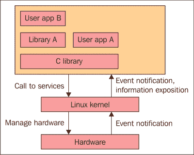
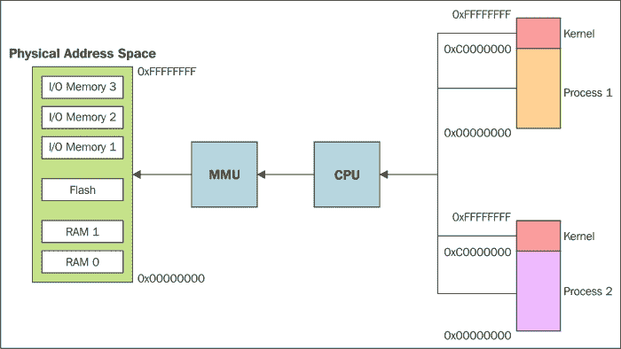
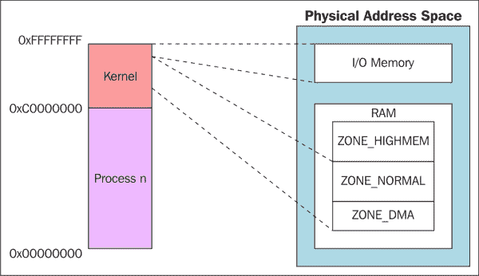
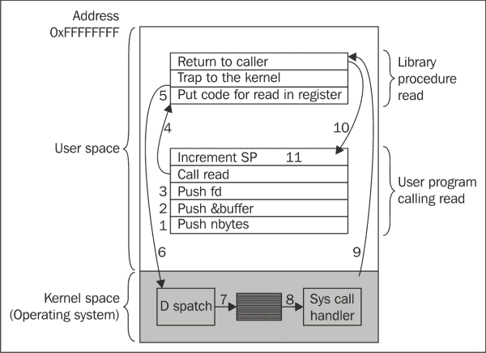
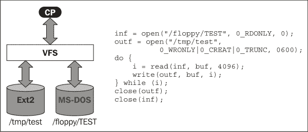
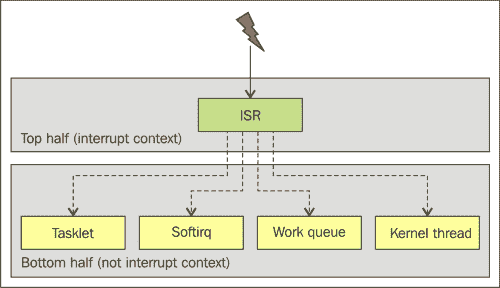
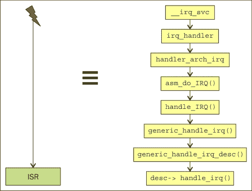
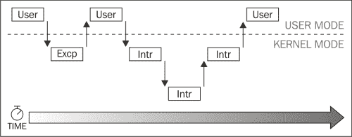
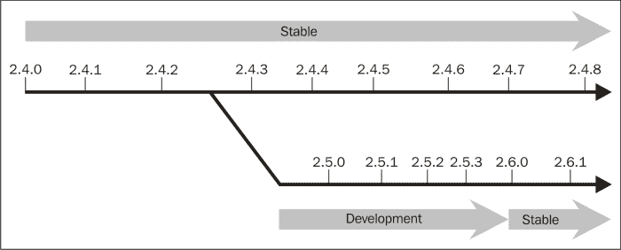
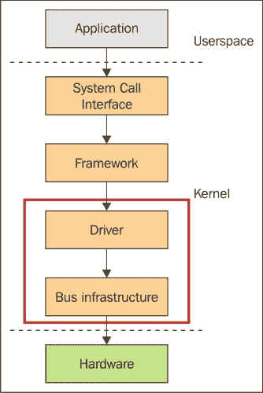

# 第四章：Linux 内核

在本章中，您不仅将了解有关 Linux 内核的一般信息，还将了解有关它的具体信息。本章将从 Linux 的历史和作用的简要介绍开始，然后继续解释其各种特性。不会省略与 Linux 内核源代码交互的步骤。您将了解到获取 Linux 内核映像的步骤，以及新**ARM 机器**的移植意味着什么，以及在一般情况下使用调试各种问题的方法。最后，将切换到 Yocto 项目，展示如何为给定的机器构建 Linux 内核，以及如何集成和稍后从根文件系统映像中使用外部模块。

本章将让您了解 Linux 内核和 Linux 操作系统。没有历史组成部分，这个演示是不可能的。Linux 和 UNIX 通常被放在同一历史背景下，但尽管 Linux 内核出现在 1991 年，Linux 操作系统很快成为 UNIX 操作系统的替代品，但这两个操作系统是同一个家族的成员。考虑到这一点，UNIX 操作系统的历史不能从其他地方开始。这意味着我们需要回到 40 多年前，更准确地说，大约 45 年前的 1969 年，当丹尼斯·里奇和肯·汤普森开始开发 UNIX 时。

UNIX 的前身是**多路信息和计算服务**（**Multics**），这是一个多用户操作系统项目，当时并不是最佳状态。自从 Multics 在 1969 年夏天成为贝尔实验室计算机科学研究中心无法实现的解决方案后，一个文件系统设计诞生了，后来成为今天所知的 UNIX。随着时间的推移，由于其设计和源代码随之分发，它被移植到了多台机器上。UNIX 最多产的贡献者是加州大学伯克利分校。他们还开发了自己的 UNIX 版本，名为**伯克利软件发行**（**BSD**），首次发布于 1977 年。直到 1990 年代，多家公司开发并提供了自己的 UNIX 发行版，它们的主要灵感来自伯克利或 AT&T。所有这些都帮助 UNIX 成为一个稳定、健壮和强大的操作系统。UNIX 作为操作系统强大的特点包括：

+   UNIX 很简单。它使用的系统调用数量减少到只有几百个，它们的设计是基本的

+   在 UNIX 中，一切都被视为文件，这使得数据和设备的操作更简单，并且最小化了用于交互的系统调用。

+   更快的进程创建时间和`fork()`系统调用。

+   UNIX 内核和实用程序都是用 C 语言编写的，这使得它易于移植和访问。

+   简单而健壮的**进程间通信**（**IPC**）原语有助于创建快速和简单的程序，以最佳方式完成一件事。

如今，UNIX 是一个成熟的操作系统，支持虚拟内存、TCP/IP 网络、需求分页、抢占式多任务处理和多线程等功能。其功能覆盖范围广泛，从小型嵌入式设备到拥有数百个处理器的系统。它的发展已经超越了 UNIX 是一个研究项目的想法，它已经成为一个通用的操作系统，几乎适用于任何需求。所有这些都是由于其优雅的设计和经过验证的简单性。它能够在不失去简单性的能力的情况下发展。

Linux 是 UNIX 变体**Minix**的替代解决方案，Minix 是一个为教学目的而创建的操作系统，但它缺乏与系统源代码的简单交互。由于 Minix 的许可证，对源代码的任何更改都不容易集成和分发。Linus Torvalds 最初在终端仿真器上开始工作，以连接到他的大学的其他 UNIX 系统。在同一个学年内，仿真器演变成了一个完整的 UNIX 系统。他在 1991 年发布了供所有人使用的版本。

Linux 最吸引人的特点之一是它是一个开源操作系统，其源代码在 GNU GPL 许可证下可用。在编写 Linux 内核时，Linus Torvalds 从可用的 UNIX 变体中选择了最佳的设计选择和功能作为灵感的来源。它的许可证是推动它成为今天强大力量的原因。它吸引了大量的开发人员，他们帮助改进了代码，修复了错误等等。

今天，Linux 是一个经验丰富的操作系统，能够在多种架构上运行。它能够在比手表还小的设备上运行，也能在超级计算机集群上运行。它是我们这个时代的新感觉，并且正在以越来越多样化的方式被公司和开发人员采用。对 Linux 操作系统的兴趣非常强烈，这不仅意味着多样性，还提供了大量的好处，从安全性、新功能、嵌入式解决方案到服务器解决方案等等。

Linux 已经成为一个真正的由互联网上的庞大社区开发的协作项目。尽管在这个项目内部进行了大量的变化，但 Linus 仍然是它的创造者和维护者。变化是我们周围一切的不断因素，这也适用于 Linux 及其维护者，现在被称为 Greg Kroah-Hartman，已经担任内核维护者两年了。在 Linus 在场的时期，Linux 内核似乎是一个松散的开发者社区。这可能是因为 Linus 全球知名的严厉评论。自从 Greg 被任命为内核维护者以来，这种形象逐渐消失。我期待未来的岁月。

# Linux 内核的作用

具有令人印象深刻的代码行数，Linux 内核是最重要的开源项目之一，同时也是最大的开源项目之一。Linux 内核构成了一个软件部分，帮助硬件接口，是在每个人的 Linux 操作系统中运行的最低级别代码。它被用作其他用户空间应用程序的接口，如下图所示：



Linux 内核的主要作用如下：

+   它提供一组可移植的硬件和架构 API，为用户空间应用程序提供使用必要硬件资源的可能性。

+   它有助于管理硬件资源，如 CPU、输入/输出外设和内存。

+   它用于管理不同应用程序对必要硬件资源的并发访问和使用。

为了确保前述角色被充分理解，一个例子将非常有用。让我们假设在给定的 Linux 操作系统中，一些应用程序需要访问相同的资源，如网络接口或设备。对于这些元素，内核需要复用资源，以确保所有应用程序都可以访问它。

# 深入了解 Linux 内核的特性

本节将介绍 Linux 内核中的一些可用功能。它还将涵盖关于每个功能的信息，它们如何使用，代表什么，以及有关每个特定功能的任何其他相关信息。每个功能的介绍使您熟悉 Linux 内核中一些可用功能的主要作用，以及 Linux 内核和其源代码的一般情况。

更一般地说，Linux 内核具有一些最有价值的功能，如下所示：

+   稳定性和可靠性

+   可扩展性

+   可移植性和硬件支持

+   符合标准

+   各种标准之间的互操作性

+   模块化

+   编程的便利性

+   社区的全面支持

+   安全性

前述功能并不构成实际功能，但它们在项目的开发过程中有所帮助，今天仍在帮助着它。话虽如此，有很多功能已经实现，例如快速用户空间互斥（futex）、netfileters、简化强制访问控制内核（smack）等。完整的列表可以在[`en.wikipedia.org/wiki/Category:Linux_kernel_features`](http://en.wikipedia.org/wiki/Category:Linux_kernel_features)上访问和学习。

## 内存映射和管理

在讨论 Linux 中的内存时，我们可以将其称为物理内存和虚拟内存。RAM 内存的隔间用于包含 Linux 内核变量和数据结构，其余内存用于动态分配，如下所述：



物理内存定义了能够维护内存的算法和数据结构，它是在页面级别相对独立地由虚拟内存完成的。在这里，每个物理页面都有一个与之关联的`struct page`描述符，用于包含有关物理页面的信息。每个页面都有一个定义的`struct page`描述符。该结构的一些字段如下：

+   `_count`：这代表页面计数器。当它达到`0`值时，页面将被添加到空闲页面列表中。

+   `虚拟`：这代表与物理页面关联的虚拟地址。**ZONE_DMA**和**ZONE_NORMAL**页面始终被映射，而**ZONE_HIGHMEN**不总是被映射。

+   `标志`：这代表了描述页面属性的一组标志。

物理内存的区域以前已经被划分。物理内存被分割成多个节点，这些节点具有共同的物理地址空间和快速的本地内存访问。其中最小的是**ZONE_DMA**，介于 0 到 16Mb 之间。接下来是**ZONE_NORMAL**，它是介于 16Mb 到 896Mb 之间的 LowMem 区域，最大的是**ZONE_HIGHMEM**，介于 900Mb 到 4GB/64Gb 之间。这些信息可以在前面和后面的图像中都可见：



虚拟内存既用于用户空间，也用于内核空间。为内存区域分配意味着分配物理页面以及地址空间区域的分配；这既在页表中，也在操作系统内部可用的内部结构中完成。页表的使用因架构类型而异。对于**复杂指令集计算**（CISC）架构，页表由处理器使用，但对于**精简指令集计算**（RISC）架构，页表由核心用于页查找和**转换查找缓冲器**（TLB）添加操作。每个区域描述符用于区域映射。它指定了区域是否被映射以供文件使用，如果区域是只读的，写时复制的等等。地址空间描述符由操作系统用于维护高级信息。

用户空间和内核空间上下文之间的内存分配是不同的，因为内核空间内存分配无法以简单的方式分配内存。这种差异主要是因为内核上下文中的错误管理不容易完成，或者至少不是以与用户空间上下文相同的方式完成。这是本节将介绍的问题之一，以及解决方案，因为它有助于读者了解在 Linux 内核上下文中如何进行内存管理。

内核用于内存处理的方法是本节将讨论的第一个主题。这是为了确保您了解内核用于获取内存的方法。虽然处理器的最小可寻址单元是字节，但负责虚拟到物理转换的**内存管理单元**（**MMU**）的最小可寻址单元是页面。页面的大小因架构而异。它负责维护系统的页表。大多数 32 位架构使用 4KB 页面，而 64 位架构通常使用 8KB 页面。对于 Atmel SAMA5D3-Xplained 板，`struct page`结构的定义如下：

```
struct page {
        unsigned long 	flags;
        atomic_t        _count;
        atomic_t        _mapcount;
        struct address_space *mapping;
        void        *virtual;
        unsigned long 	debug_flags;
        void        *shadow;
        int        _last_nid;

};
```

这是页面结构中最重要的字段之一。例如，`flags`字段表示页面的状态；这包含信息，例如页面是否脏了，是否被锁定，或者处于另一个有效状态。与此标志相关的值在`include/linux/page-flags-layout.h`头文件中定义。`virtual`字段表示与页面关联的虚拟地址，`count`表示页面的计数值，通常可以通过`page_count()`函数间接访问。所有其他字段都可以在`include/linux/mm_types.h`头文件中找到。

内核将硬件划分为各种内存区域，主要是因为物理内存中有一些页面对于一些任务是不可访问的。例如，有些硬件设备可以执行 DMA。这些操作只与物理内存的一个区域进行交互，简称为`ZONE_DMA`。对于 x86 架构，它在 0-16 Mb 之间可访问。

内核源代码中定义了四个主要的内存区域和另外两个不太显著的内存区域，这些定义在`include/linux/mmzone.h`头文件中。区域映射也与 Atmel SAMA5D3-Xplained 板的体系结构有关。我们有以下区域定义：

```
enum zone_type {
#ifdef CONFIG_ZONE_DMA
        /*
         * ZONE_DMA is used when there are devices that are not able
         * to do DMA to all of addressable memory (ZONE_NORMAL). Then we
         * carve out the portion of memory that is needed for these devices.
         * The range is arch specific.
         *
         * Some examples
         *
         * Architecture         Limit
         * ---------------------------
         * parisc, ia64, sparc  <4G
         * s390                 <2G
         * arm                  Various
         * alpha                Unlimited or 0-16MB.
         *
         * i386, x86_64 and multiple other arches
         *                      <16M.
         */
        ZONE_DMA,
#endif
#ifdef CONFIG_ZONE_DMA32
        /*
         * x86_64 needs two ZONE_DMAs because it supports devices that are
         * only able to do DMA to the lower 16M but also 32 bit devices that
         * can only do DMA areas below 4G.
         */
        ZONE_DMA32,
#endif
        /*
         * Normal addressable memory is in ZONE_NORMAL. DMA operations can be
         * performed on pages in ZONE_NORMAL if the DMA devices support
         * transfers to all addressable memory.
         */
        ZONE_NORMAL,
#ifdef CONFIG_HIGHMEM
        /*
         * A memory area that is only addressable by the kernel through
         * mapping portions into its own address space. This is for example
         * used by i386 to allow the kernel to address the memory beyond
         * 900MB. The kernel will set up special mappings (page
         * table entries on i386) for each page that the kernel needs to
         * access.
         */
        ZONE_HIGHMEM,
#endif
        ZONE_MOVABLE,
        __MAX_NR_ZONES
};
```

有一些分配需要与多个区域进行交互。一个例子是普通分配，可以使用`ZONE_DMA`或`ZONE_NORMAL`。`ZONE_NORMAL`更受青睐，因为它不会干扰直接内存访问，尽管当内存使用完全时，内核可能会使用除正常情况下使用的区域之外的其他可用区域。可用的内核是一个**struct zone**结构，定义了每个区域的相关信息。对于 Atmel SAMA5D3-Xplained 板，该结构如下所示：

```
struct zone {
        unsigned long 	watermark[NR_WMARK];
        unsigned long 	percpu_drift_mark;
        unsigned long 	lowmem_reserve[MAX_NR_ZONES];
        unsigned long 	dirty_balance_reserve;
        struct per_cpu_pageset __percpu *pageset;
        spinlock_t        lock;
        int        all_unreclaimable;
        struct free_area        free_area[MAX_ORDER];
        unsigned int            compact_considered;
        unsigned int            compact_defer_shift;
        int                     compact_order_failed;
        spinlock_t              lru_lock;
        struct lruvec           lruvec;
        unsigned long         pages_scanned;
        unsigned long         flags;
        unsigned int        inactive_ratio;
        wait_queue_head_t       * wait_table;
        unsigned long         wait_table_hash_nr_entries;
        unsigned long         wait_table_bits;
        struct pglist_data    *zone_pgdat;
        unsigned long         zone_start_pfn;
        unsigned long         spanned_pages;
        unsigned long         present_pages;
        unsigned long         managed_pages;
        const char              *name;
};
```

如您所见，定义结构的区域是一个令人印象深刻的区域。一些最有趣的字段由`watermark`变量表示，其中包含所定义区域的高、中和低水印。`present_pages`属性表示区域内的可用页面。`name`字段表示区域的名称，还有其他字段，例如`lock`字段，一个用于保护区域结构免受同时访问的自旋锁。所有其他字段都可以在 Atmel SAMA5D3 Xplained 板的相应`include/linux/mmzone.h`头文件中找到。

有了这些信息，我们可以继续并了解内核如何实现内存分配。所有必要的内存分配和内存交互的可用函数都在`linux/gfp.h`头文件中。其中一些函数是：

```
struct page * alloc_pages(gfp_t gfp_mask, unsigned int order)
```

这个函数用于在连续位置分配物理页面。最后，如果分配成功，则返回值由第一个页面结构的指针表示，如果发生错误，则返回`NULL`：

```
void * page_address(struct page *page)
```

这个函数用于获取相应内存页面的逻辑地址：

```
unsigned long __get_free_pages(gfp_t gfp_mask, unsigned int order)
```

这个函数类似于`alloc_pages()`函数，但不同之处在于返回变量是在`struct page * alloc_page(gfp_t gfp_mask)`返回参数中提供的：

```
unsigned long __get_free_page(gfp_t gfp_mask)
struct page * alloc_page(gfp_t gfp_mask)
```

前两个函数是类似的函数的包装器，不同之处在于这个函数只返回一个页面信息。这个函数的顺序具有`zero`值：

```
unsigned long get_zeroed_page(unsigned int gfp_mask)
```

前面的函数就像其名称所示。它返回一个充满`zero`值的页面。这个函数与`__get_free_page()`函数的区别在于，在被释放后，页面被填充为`zero`值：

```
void __free_pages(struct page *page, unsigned int order)
void free_pages(unsigned long addr, unsigned int order)
void free_page(unsigned long addr)
```

前面的函数用于释放给定的分配页面。传递页面时应谨慎，因为内核无法检查所提供的信息。

### 页面缓存和页面写回

通常磁盘比物理内存慢，所以这是内存优于磁盘存储的原因之一。对于处理器的缓存级别也是一样：它离处理器越近，对 I/O 访问就越快。将数据从磁盘移动到物理内存的过程称为**页面缓存**。相反的过程被定义为**页面写回**。这两个概念将在本小节中介绍，但主要是关于内核上下文。

内核第一次调用`read()`系统调用时，会验证数据是否存在于页面缓存中。在 RAM 中找到页面的过程称为**缓存命中**。如果数据不在那里，则需要从磁盘读取数据，这个过程称为**缓存未命中**。

当内核发出**write()**系统调用时，关于这个系统调用的缓存交互有多种可能性。最简单的一种是不缓存写系统调用操作，只将数据保留在磁盘中。这种情况称为**无写缓存**。当写操作同时更新物理内存和磁盘数据时，该操作称为**写透缓存**。第三个选项由**写回缓存**表示，其中页面被标记为脏。它被添加到脏列表中，随着时间的推移，它被放在磁盘上并标记为非脏。脏关键字的最佳同义词由同步关键字表示。

### 进程地址空间

除了自己的物理内存外，内核还负责用户空间进程和内存管理。为每个用户空间进程分配的内存称为**进程地址空间**，它包含给定进程可寻址的虚拟内存地址。它还包含进程在与虚拟内存交互时使用的相关地址。

通常，进程接收一个平面的 32 位或 64 位地址空间，其大小取决于体系结构类型。然而，有些操作系统分配了**分段地址空间**。在线程之间提供了共享地址空间的可能性。虽然进程可以访问大量的内存空间，但通常只有权限访问内存的一部分。这被称为**内存区域**，意味着进程只能访问位于可行内存区域内的内存地址。如果它尝试管理位于其有效内存区域之外的内存地址，内核将使用*段错误*通知终止进程。

内存区域包含以下内容：

+   `text`部分映射源代码

+   `数据`部分映射已初始化的全局变量

+   `bss`部分映射未初始化的全局变量

+   `零页`部分用于处理用户空间堆栈

+   `共享库文本`，`bss`和数据特定部分

+   映射文件

+   匿名内存映射通常与`malloc()`等函数相关联

+   共享内存段

进程地址空间在 Linux 内核源代码中通过**内存描述符**进行定义。这个结构被称为`struct mm_struct`，它在`include/linux/mm_types.h`头文件中定义，并包含与进程地址空间相关的信息，如使用地址空间的进程数量、内存区域列表、最后使用的内存区域、可用的内存区域数量、代码、数据、堆和栈部分的起始和结束地址。

对于内核线程，没有与之关联的进程地址空间；对于内核来说，进程描述符结构被定义为`NULL`。这样，内核表明内核线程没有用户上下文。内核线程只能访问与所有其他进程相同的内存。内核线程没有用户空间中的任何页面或对用户空间内存的访问权限。

由于处理器只能使用物理地址，因此需要进行物理和虚拟内存之间的转换。这些操作由页表完成，页表将虚拟地址分割为较小的组件，并具有用于指向目的的关联索引。在大多数可用的板和体系结构中，页表查找由硬件处理；内核负责设置它。

## 进程管理

进程是 Linux 操作系统中的基本单元，同时也是一种抽象形式。实际上，它是一个正在执行的程序，但程序本身不是一个进程。它需要处于活动状态并具有相关联的资源。通过使用`fork()`函数，进程能够成为父进程，从而生成一个子进程。父进程和子进程都驻留在单独的地址空间中，但它们都具有相同的内容。`exec()`函数族能够执行不同的程序，创建一个地址空间，并将其加载到该地址空间中。

使用`fork()`时，父进程的资源会被复制给子进程。这个函数的实现方式非常有趣；它使用`clone()`系统调用，其基础包含`copy_process()`函数。这个函数执行以下操作：

+   调用`dup_task_struct()`函数创建一个新的内核栈。为新进程创建`task_struct`和`thread_info`结构。

+   检查子进程是否超出内存区域的限制。

+   子进程与父进程有所不同。

+   将其设置为`TASK_UNINTERRUPTIBLE`以确保它不运行。

+   更新标志。

+   `PID`与子进程相关联。

+   检查已设置的标志，并根据它们的值执行适当的操作。

+   在获取子进程指针时执行清理过程。

Linux 中的线程与进程非常相似。它们被视为共享各种资源（如内存地址空间、打开文件等）的进程。线程的创建类似于普通任务，唯一的例外是`clone()`函数，它传递了提到共享资源的标志。例如，clone 函数调用一个线程，即`clone(CLONE_VM | CLONE_FS | CLONE_FILES | CLONE_SIGHAND, 0)`，而对于正常的 fork 看起来类似于`clone(SIGCHLD, 0)`。

内核线程的概念出现是为了解决在内核上下文的后台运行任务所涉及的问题。内核线程没有地址空间，只能在内核上下文中使用。它具有与普通进程相同的属性，但仅用于特殊任务，如`ksoftirqd`、`flush`等。

在执行结束时，需要终止进程以释放资源，并通知执行进程的父进程。最常用于终止进程的方法是调用`exit()`系统调用。此过程需要一些步骤：

1.  设置`PF_EXITING`标志。

1.  调用`del_timer_sync()`函数来删除内核定时器。

1.  在编写会计和日志信息时调用`acct_update_integrals()`函数。

1.  调用`exit_mm()`来释放进程的`mm_struct`结构。

1.  调用`exit_sem()`来从 IPC 信号量中出队进程。

1.  调用`exit_files()`和`exit_fs()`函数来删除与各种文件描述符的链接。

1.  应设置任务退出代码。

1.  调用`exit_notify()`通知父进程，并将任务退出状态设置为`EXIT_ZOMBIE`。

1.  调用`schedule()`切换到新进程。

在执行了前述步骤之后，与该任务关联的对象被释放，并且变得不可运行。它的内存仅作为其父进程的信息存在。在其父进程宣布此信息对其无用后，此内存将被系统释放使用。

## 进程调度

进程调度程序决定为可运行的进程分配哪些资源。它是一种负责多任务处理、资源分配给各种进程，并决定如何最佳设置资源和处理器时间的软件。它还决定哪些进程应该接下来运行。

Linux 调度程序的第一个设计非常简单。当进程数量增加时，它无法很好地扩展，因此从 2.5 内核版本开始，开发了一个新的调度程序。它被称为**O(1)调度程序**，为时间切片计算提供了常数时间算法，并且在每个处理器基础上定义了运行队列。虽然它非常适合大型服务器，但并不是普通桌面系统的最佳解决方案。从 2.6 内核版本开始，对 O(1)调度程序进行了改进，例如公平调度概念，后来从内核版本 2.6.23 实现为**完全公平调度程序**（**CFS**），成为事实上的调度程序。

CFS 背后有一个简单的想法。它表现得好像我们有一个完美的多任务处理器，每个进程都获得处理器时间的`1/n`切片，而这个时间切片非常小。`n`值代表正在运行的进程数。Con Kolivas 是澳大利亚程序员，他为公平调度实现做出了贡献，也被称为**旋转楼梯截止时间调度器**（**RSDL**）。它的实现需要一个红黑树来平衡自身的优先级，还需要在纳秒级别计算的时间切片。与 O(1)调度程序类似，CFS 应用了权重的概念，这意味着一些进程等待的时间比其他进程长。这是基于加权公平排队算法的。

进程调度程序构成了 Linux 内核中最重要的组件之一，因为它定义了用户与操作系统的一般交互。Linux 内核 CFS 是调度程序，吸引开发人员和用户的原因是它以最合理的方式提供了可伸缩性和性能。

## 系统调用

为了使进程与系统交互，应该提供一个接口，使用户空间应用程序能够与硬件和其他进程进行交互。这些被用作硬件和用户空间之间的接口。它们也被用于确保稳定性、安全性和抽象性。这些是构成内核入口点的常见层，以及陷阱和异常，如下所述：



与 Linux 系统内大多数系统调用的交互是通过 C 库完成的。它们能够定义一些参数并返回一个值，以显示它们是否成功。通常，值为`零`表示执行成功，如果出现错误，则`errno`变量中将可用错误代码。进行系统调用时，遵循以下步骤：

1.  切换到内核模式。

1.  对内核空间访问的任何限制都被消除。

1.  用户空间的堆栈被传递到内核空间。

1.  来自用户空间的任何参数都会被检查并复制到内核空间。

1.  识别并运行与系统调用相关的例程。

1.  切换到用户空间并继续执行应用程序。

系统调用有与之关联的`syscall`号码，这是一个唯一的数字，用作系统调用的参考，不能更改（无法实现系统调用）。每个系统调用号码的符号常量都在`<sys/syscall.h>`头文件中可用。要检查系统调用的存在，使用`sys_ni_syscall()`，它对于无效的系统调用返回`ENOSYS`错误。

## 虚拟文件系统

Linux 操作系统能够支持多种文件系统选项。这是由于存在**虚拟文件系统**（**VFS**），它能够为大量文件系统类型提供一个通用接口，并处理与它们相关的系统调用。

VFS 支持的文件系统类型可以分为以下三类：

+   **基于磁盘的文件系统**：这些管理本地磁盘或用于磁盘仿真的设备上的内存。其中一些最著名的是：

+   Linux 文件系统，如第二扩展文件系统（Ext2），第三扩展文件系统（Ext3）和第四扩展文件系统（Ext4）

+   UNIX 文件系统，如 sysv 文件系统，UFS，Minix 文件系统等

+   微软文件系统，如 MS-DOS，NTFS（自 Windows NT 起可用）和 VFAT（自 Windows 95 起可用）

+   ISO966 CD-ROM 文件系统和磁盘格式 DVD 文件系统

+   专有文件系统，如来自苹果、IBM 和其他公司的文件系统

+   **网络文件系统**：它们允许在其他计算机上通过网络访问各种文件系统类型。其中最著名的之一是 NFS。当然，还有其他一些，但它们不那么出名。这些包括**Andrew 文件系统**（**AFS**），**Novel 的 NetWare Core Protocol**（**NCP**），**Constant Data Availability**（**Coda**）等。

+   **特殊文件系统**：`/proc`文件系统是这类文件系统的完美例子。这类文件系统使系统应用程序更容易地访问内核的数据结构并实现各种功能。

虚拟文件系统系统调用的实现在这张图片中得到了很好的总结：



在前面的图像中，可以看到如何轻松地从一种文件系统类型复制到另一种文件系统类型。它只使用基本的`open()`、`close()`、`read()`、`write()`函数，这些函数对所有其他文件系统交互都可用。然而，它们都在所选文件系统下实现了特定的功能。例如，`open()`系统调用`sys_open()`，它接受与`open()`相同的参数并返回相同的结果。`sys_open()`和`open()`之间的区别在于`sys_open()`是一个更宽松的函数。

其他三个系统调用都有相应的`sys_read()`、`sys_write()`和`sys_close()`函数在内部调用。

# 中断

中断是表示改变处理器执行指令顺序的事件的表示。中断意味着硬件生成的电信号，用于表示已发生的事件，例如按键、复位等。根据其参考系统，中断分为更多类别，如下所示：

+   软件中断：这些通常是从外部设备和用户空间程序触发的异常

+   硬件中断：这些是系统发出的信号，通常表示处理器特定的指令

Linux 中断处理层通过全面的 API 函数为各种设备驱动程序提供了中断处理的抽象。它用于请求、启用、禁用和释放中断，确保在多个平台上保证可移植性。它处理所有可用的中断控制器硬件。

通用中断处理使用`__do_IRQ()`处理程序，能够处理所有可用类型的中断逻辑。处理层分为两个组件：

+   顶部组件用于响应中断

+   顶部组件安排底部在稍后运行

它们之间的区别在于所有可用的中断都被允许在底部上下文中执行。这有助于顶部在底部工作时响应另一个中断，这意味着它能够将其数据保存在特定的缓冲区中，并允许底部在安全环境中运行。

对于底部处理，有四种定义好的机制可用：

+   **软中断**

+   **Tasklets**

+   **工作队列**

+   **内核线程**

这里展示了可用的机制：



尽管顶部和底部中断机制的模型看起来很简单，但它具有非常复杂的函数调用机制模型。这个例子展示了 ARM 架构的这一事实：



对于中断的顶部组件，在中断源代码中有三个抽象级别。第一个是高级驱动程序 API，具有函数，如`request_irq()`、`free_irq`、`disable_irq()`、`enable_irq()`等。第二个由高级 IRQ 流处理程序表示，这是一个通用层，具有预定义或特定架构的中断流处理程序，用于在设备初始化或引导时响应各种中断。它定义了一些预定义函数，如`handle_level_irq()`、`handle_simple_irq()`、`handle_percpu_irq()`等。第三个由芯片级硬件封装表示。它定义了`struct irq_chip`结构，其中包含在 IRQ 流实现中使用的与芯片相关的函数。其中一些函数是`irq_ack()`、`irq_mask()`和`irq_unmask()`。

模块需要注册中断通道并在之后释放它。支持的请求总数从`0`值计数到 IRQs 的数量-1。这些信息在`<asm/irq.h>`头文件中可用。注册完成后，将处理程序标志传递给`request_irq()`函数，以指定中断处理程序的类型，如下所示：

+   `SA_SAMPLE_RANDOM`：这表明中断可以为熵池做出贡献，即具有强随机属性的位的池，通过对不可预测事件进行采样，例如鼠标移动、按键间的时间、磁盘中断等

+   `SA_SHIRQ`：这表明中断可以在设备之间共享。

+   `SA_INTERRUPT`：这表示快速中断处理程序，因此在当前处理器上禁用中断-这并不是一个非常理想的情况

## 底半部

关于底半部中断处理的第一个机制是由`softirqs`代表的。它们很少使用，但可以在 Linux 内核源代码中的`kernel/softirq.c`文件中找到。在实现方面，它们在编译步骤时静态分配。当在`include/linux/interrupt.h`头文件中添加条目时，它们被创建，并且它们提供的系统信息可以在`/proc/softirqs`文件中找到。虽然不经常使用，但它们可以在异常、中断、系统调用以及由调度程序运行`ksoftirkd`守护程序后执行。

列表中的下一个是任务 let。虽然它们建立在`softirqs`之上，但它们更常用于底半部中断处理。以下是这样做的一些原因：

+   它们非常快

+   它们可以动态创建和销毁

+   它们具有原子和非阻塞代码

+   它们在软中断上下文中运行

+   它们在被调度的同一处理器上运行

任务 let 有一个**struct tasklet_struct**结构可用。这些也可以在`include/linux/interrupt.h`头文件中找到，与`softirqs`不同，任务 let 是不可重入的。

列表中的第三个是工作队列，它代表了与先前介绍的机制相比进行工作分配的不同形式。主要区别如下：

+   它们能够同时在多个 CPU 上运行

+   它们可以进入睡眠状态

+   它们在进程上下文中运行

+   它们可以被调度或抢占

虽然它们可能具有比任务 let 稍大的延迟，但前述特性确实非常有用。任务 let 是围绕`struct workqueue_struct`结构构建的，该结构位于`kernel/workqueue.c`文件中。

底半部机制选项中的最后一个和最新的添加是由内核线程代表的，它们完全在内核模式下操作，因为它们是由内核创建/销毁的。它们出现在 2.6.30 内核发布中，并且具有与工作队列相同的优势，以及一些额外的功能，例如拥有自己的上下文的可能性。预计内核线程最终将取代工作队列和任务 let，因为它们类似于用户空间线程。驱动程序可能希望请求线程化的中断处理程序。在这种情况下，它只需要类似于`request_irq()`的方式使用`request_threaded_irq()`。`request_threaded_irq()`函数提供了将中断处理代码分成两部分的处理程序和`thread_fn`的可能性。除此之外，还调用`quick_check_handler`来检查中断是否来自设备；如果是这种情况，它将需要调用`IRQ_WAKE_THREAD`来唤醒处理程序线程并执行`thread_fn`。

## 执行内核同步的方法

内核正在处理的请求数量类似于服务器必须接收的请求数量。这种情况可能会导致竞争条件，因此需要一个良好的同步方法。有多种策略可用于定义内核控制路径的方式。以下是一个内核控制路径的示例：



前面的图像清楚地说明了为什么同步是必要的。例如，当多个内核控制路径相互关联时，可能会出现竞争条件。为了保护这些关键区域，应采取一些措施。还应考虑到中断处理程序不能被中断，`softirqs`不应该交错。

已经诞生了许多同步原语：

+   **每 CPU 变量**：这是最简单和有效的同步方法之一。它将数据结构乘以每个 CPU 可用。

+   **原子操作**：这指的是原子读-修改-写指令。

+   **内存屏障**：这保证了在屏障之前完成的操作在开始屏障之后的操作之前全部完成。

+   **自旋锁**：这代表一种实现忙等待的锁类型。

+   **信号量**：这是一种实现休眠或阻塞等待的锁形式。

+   **Seqlocks**：这类似于自旋锁，但基于访问计数器。

+   **本地中断禁用**：这禁止了可以在单个 CPU 上延迟使用的功能。

+   **读-拷贝-更新（RCU）**：这是一种旨在保护用于读取的最常用数据结构的方法。它使用指针为共享数据结构提供无锁访问。

通过上述方法，竞争条件情况试图得到解决。开发人员的工作是识别和解决可能出现的所有同步问题。

# 定时器

在 Linux 内核周围，有许多受时间影响的函数。从调度程序到系统正常运行时间，它们都需要一个时间参考，包括绝对时间和相对时间。例如，需要安排在未来进行的事件代表相对时间，实际上意味着有一种方法用于计算时间。

定时器的实现可以根据事件类型而变化。周期性实现由系统定时器定义，它以固定时间间隔发出中断。系统定时器是一个硬件组件，以给定频率发出定时器中断，以更新系统时间并执行必要的任务。还可以使用实时时钟，它是一个带有电池的芯片，即使在系统关闭后也能继续计时。除了系统时间，内核动态管理的动态定时器也可用于计划在特定时间后运行的事件。

定时器中断具有发生窗口，对于 ARM 来说，每秒发生 100 次。这称为**系统定时器频率**或**滴答率**，其单位是**赫兹**（**Hz**）。滴答率因架构而异。对于大多数架构，我们有 100 Hz 的值，还有其他架构的值为 1024 Hz，例如 Alpha 和 Itanium（IA-64）架构。当然，默认值可以更改和增加，但这种操作有其优点和缺点。

更高频率的一些优点包括：

+   定时器将更准确地执行，并且数量更多。

+   使用超时的系统调用以更精确的方式执行

+   正常运行时间测量和其他类似测量变得更加精确

+   进程抢占更准确

另一方面，更高频率的缺点意味着更高的开销。处理器在定时器中断上花费更多时间；此外，由于进行了更多的计算，将会发生功耗的增加。

Linux 操作系统上的总 ticks 数，从启动开始计时，存储在`include/linux/jiffies.h`头文件中的一个名为**jiffies**的变量中。在启动时，这个变量被初始化为零，并且每次发生中断时都会将其值加一。因此，系统正常运行时间的实际值可以以 jiffies/Hz 的形式计算出来。

# Linux 内核交互

到目前为止，您已经了解了 Linux 内核的一些特性。现在，是时候介绍更多关于开发过程、版本控制方案、社区贡献以及与 Linux 内核的交互的信息了。

## 开发过程

Linux 内核是一个众所周知的开源项目。为了确保开发人员知道如何与其交互，将介绍如何使用`git`与该项目进行交互的信息，同时还将介绍一些关于其开发和发布程序的信息。该项目已经发展，其开发流程和发布程序也随之发展。

在介绍实际的开发过程之前，需要了解一些历史。在 Linux 内核项目的 2.6 版本之前，每两三年发布一次版本，并且每个版本都以偶数中间数字标识，如 1.0.x、2.0.x 和 2.6.x。相反，开发分支使用偶数号来定义，如 1.1.x、2.1.x 和 2.5.x，并且它们用于集成各种功能，直到准备好进行主要发布并准备好进行发布。所有次要发布都有名称，如 2.6.32 和 2.2.23，并且它们是在主要发布周期之间发布的。



这种工作方式一直持续到 2.6.0 版本，当时在每个次要版本发布期间在内核中添加了大量功能，并且所有这些功能都非常好地组合在一起，以免引起需要分支出一个新的开发分支的需求。这意味着发布速度更快，可用功能更多。因此，自 2.6.14 内核发布以来，出现了以下变化：

+   所有新的次要发布版本，如 2.6.x，都包含一个两周的合并窗口，在这个窗口中可以引入下一个发布中的一些功能。

+   这个合并窗口将在一个名为 2.6.(x+1)-rc1 的发布测试版本关闭

+   然后是一个 6-8 周的错误修复期，期间应该修复由新增功能引入的所有错误

+   在错误修复间隔期间，对发布候选版本进行了测试，并发布了 2.6.(x+1)-rcY 测试版本

+   在最终测试完成并且最后一个发布候选版本被认为足够稳定之后，将发布一个名为 2.6.(x+1)的新版本，然后这个过程将再次继续

这个过程运行得很好，但唯一的问题是，错误修复只发布给最新的稳定版本的 Linux 内核。人们需要长期支持版本和旧版本的安全更新，以及关于这些长期支持版本的一般信息等。

这个过程随着时间的推移而改变，在 2011 年 7 月，出现了 3.0 Linux 内核版本。它出现了一些小的变化，旨在改变解决先前提到的请求的交互方式。更改是针对编号方案进行的，如下所示：

+   内核官方版本将被命名为 3.x（3.0, 3.1, 3.2 等）

+   稳定版本将被命名为 3.x.y（3.0.1, 3.1.3 等）

尽管这个变化只是从编号方案中删除了一个数字，但这个变化是必要的，因为它标志着 Linux 内核的 20 周年。

由于 Linux 内核每天包含大量的补丁和功能，很难跟踪所有的变化和整体的大局。随着时间的推移，出现了一些网站，如[`kernelnewbies.org/LinuxChanges`](http://kernelnewbies.org/LinuxChanges)和[`lwn.net/`](http://lwn.net/)，帮助开发人员与 Linux 内核的世界保持联系。

除了这些链接，`git`版本控制系统可以提供非常需要的信息。当然，这需要工作站上存在 Linux 内核源克隆。一些提供大量信息的命令包括：

+   `git log`: 这列出了最新的所有提交

+   `git log –p`: 这列出了所有提交及其相应的`diffs`

+   `git tag –l`: 这列出了所有可用的标签

+   `git checkout <tagname>`: 这从工作库中检出一个分支或标签

+   `git log v2.6.32..master`: 这列出了给定标签和最新版本之间的所有更改

+   `git log –p V2.6.32..master MAINTAINERS`: 这列出了`MAINTAINERS`文件中两个给定分支之间的所有差异

当然，这只是一个有用命令的小列表。所有其他命令都可以在[`git-scm.com/docs/`](http://git-scm.com/docs/)上找到。

## 内核移植

Linux 内核支持多种 CPU 架构。每个架构和单独的板都有自己的维护者，这些信息可以在`MAINTAINERS`文件中找到。此外，板的移植差异主要由架构决定，PowerPC 与 ARM 或 x86 非常不同。由于本书关注的开发板是一款搭载 ARM Cortex-A5 核心的 Atmel，本节将尝试关注 ARM 架构。

在我们的情况下，主要关注的是`arch/arm`目录，其中包含诸如`boot`、`common`、`configs`、`crypto`、`firmware`、`kernel`、`kvm`、`lib`、`mm`、`net`、`nwfpe`、`oprofile`、`tools`、`vfp`和`xen`等子目录。它还包含了许多针对不同 CPU 系列特定的目录，例如`mach-*`目录或`plat-*`目录。第一个`mach-*`类别包含了 CPU 和使用该 CPU 的几个板，第二个`plat-*`类别包含特定于平台的代码。一个例子是`plat-omap`，其中包含了`mach-omap1`和`mach-omap2`的通用代码。

自 2011 年以来，ARM 架构的开发发生了很大变化。如果直到那时 ARM 没有使用设备树，那是因为它需要将大部分代码保留在`mach-*`特定目录中，对于每个在 Linux 内核中有支持的板，都会关联一个唯一的机器 ID，并且一个机器结构与包含特定信息和一组回调的每个板相关联。引导加载程序将这个机器 ID 传递给特定的 ARM 注册表，这样内核就知道了板子。

ARM 架构的流行增加是因为工作重构和**设备树**的引入，这大大减少了`mach-*`目录中可用的代码量。如果 SoC 受到 Linux 内核的支持，那么为板添加支持就像在`/arch/arm/boot/dts`目录中定义一个设备树一样简单，例如，对于`<soc-name>-<board-name>.d`，如果需要，包含相关的`dtsi`文件。确保通过将设备树包含到**arch/arm/boot/dts/Makefile**中并为板添加缺失的设备驱动程序来构建**设备树 blob**（**DTB**）。

如果板上没有在 Linux 内核中的支持，需要在`mach-*`目录中进行适当的添加。在每个`mach-*`目录中，有三种类型的文件可用：

+   **通用代码文件**：这些通常只有一个单词的名称，比如`clock.c`，`led.c`等

+   **特定于 CPU 的代码**：这是用于机器 ID 的，通常采用`<machine-ID>*.c`的形式 - 例如，`at91sam9263.c`，`at91sam9263_devices.c`，`sama5d3.c`等

+   **特定于板子的代码**：这通常被定义为 board-*.c，比如`board-carmeva.c`，`board-pcontrol-g20.c`等

对于给定的板子，应首先在`arch/arm/mach-*/Kconfig`文件中进行适当的配置；为此，应该为板子 CPU 确定机器 ID。配置完成后，可以开始编译，因此应该更新`arch/arm/mach-*/Makefile`以确保板子支持所需的文件。另一步是由定义板子和需要在`board-<machine>.c`文件中定义的机器类型号的机器结构表示。

机器结构使用两个宏：`MACHINE_START`和`MACHINE_END`。它们都在`arch/arm/include/asm/march/arch.h`中定义，并用于定义`machine_desc`结构。机器类型号可在`arch/arm/tools/mach_types`文件中找到。该文件用于为板子生成`include/asm-arm/mach-types.h`文件。

### 注意

机器类型的更新编号列表可在[`www.arm.linux.org.uk/developer/machines/download.php`](http://www.arm.linux.org.uk/developer/machines/download.php)上找到。

在第一种情况下，当启动过程开始时，只需要将`dtb`传递给引导加载程序并加载以初始化 Linux 内核，而在第二种情况下，需要将机器类型号加载到`R1`寄存器中。在早期的启动过程中，`__lookup_machine_type`寻找`machine_desc`结构并加载它以初始化板子。

## 社区互动

在向您呈现了这些信息之后，如果你渴望为 Linux 内核做出贡献，那么接下来应该阅读这一部分。如果你真的想为 Linux 内核项目做出贡献，那么在开始这项工作之前应该执行一些步骤。这主要涉及文档和调查。没有人想要发送重复的补丁或徒劳地复制别人的工作，因此在互联网上搜索你感兴趣的主题可以节省大量时间。另一个有用的建议是，在熟悉了主题之后，避免发送权宜之计。尝试解决问题并提供解决方案。如果不能，报告问题并进行彻底描述。如果找到解决方案，那么在补丁中同时提供问题和解决方案。

在开源社区中最有价值的事情之一是你可以从他人那里得到帮助。分享你的问题和困难，但不要忘记提到解决方案。在适当的邮件列表中提出问题，并尽量避免联系维护者。他们通常非常忙，有数百甚至数千封邮件需要阅读和回复。在寻求帮助之前，尽量研究你想提出的问题，这将有助于表达问题，也可能提供答案。如果可能的话，使用 IRC 来提出较小的问题，最重要的是，尽量不要过度使用。

当你准备好补丁时，确保它是在相应的分支上完成的，并且你首先阅读`Documentation/BUG-HUNTING`文件。如果有的话，识别 bug 报告，并确保将你的补丁链接到它们。在发送之前不要犹豫阅读`Documentation/SubmittingPatches`指南。在发送补丁之前一定要进行适当的测试。始终签署你的补丁，并尽可能使第一行描述具有指导性。在发送补丁时，找到适当的邮件列表和维护者，并等待回复。解决评论并重新提交，直到补丁被认为是可以接受的。

# 内核源码

Linux 内核的官方位置位于[`www.kernel.org`](http://www.kernel.org)，但有许多较小的社区为 Linux 内核贡献其特性，甚至维护自己的版本。

尽管 Linux 核心包含调度程序、内存管理和其他功能，但其大小相当小。大量的设备驱动程序、架构和板支持以及文件系统、网络协议和所有其他组件使得 Linux 内核的大小真正庞大。这可以通过查看 Linux 目录的大小来看出。

Linux 源代码结构包含以下目录：

+   `arch`：这包含了与架构相关的代码

+   `block`：这包含了块层核心

+   `crypto`：这包含了加密库

+   `drivers`：这收集了除声音驱动程序之外的所有设备驱动程序的实现

+   `fs`：这收集了所有可用的文件系统实现

+   `include`：这包含了内核头文件

+   `init`：这包含了 Linux 初始化代码

+   `ipc`：这包含了进程间通信实现代码

+   `kernel`：这是 Linux 内核的核心

+   `lib`：这包含了各种库，如`zlibc`，`crc`等

+   `mm`：这包含了内存管理的源代码

+   `net`：这提供了对 Linux 内部支持的所有网络协议实现的访问

+   `samples`：这提供了许多示例实现，如`kfifo`，`kobject`等

+   `scripts`：这既在内部又在外部使用

+   `security`：这包含了许多安全实现，如`apparmor`，`selinux`，`smack`等

+   `sound`：这包含了声音驱动程序和支持代码

+   `usr`：这是生成源代码的`initramfs cpio`存档

+   `virt`：这包含了虚拟化支持的源代码

+   `COPYING`：这代表了 Linux 许可证和定义复制条件

+   `CREDITS`：这代表了 Linux 的主要贡献者的集合

+   `Documentation`：这包含了内核源代码的相应文档

+   `Kbuild`：这代表了顶层的内核构建系统

+   `Kconfig`：这是配置参数的顶层描述符

+   `MAINTAINERS`：这是每个内核组件的维护者列表

+   `Makefile`：这代表了顶层的 makefile

+   `README`：这个文件描述了 Linux 是什么，是理解项目的起点

+   `REPORTING-BUGS`：这提供了关于错误报告程序的信息

正如所见，Linux 内核的源代码非常庞大，因此需要一个浏览工具。有许多可以使用的工具，如**Cscope**，**Kscope**，或者 Web 浏览器**Linux Cross Reference**（**LXR**）。Cscope 是一个庞大的项目，也可以通过`vim`和`emacs`的扩展来使用。

## 配置内核

在构建 Linux 内核映像之前，需要进行适当的配置。考虑到我们可以访问数百甚至数千个组件，如驱动程序、文件系统和其他项目，这是困难的。在配置阶段内进行选择过程，并且这是可能的依赖关系的帮助下。用户有机会使用和定义一些选项，以便定义将用于为特定板构建 Linux 内核映像的组件。

所有支持板的特定配置都位于一个名为`.config`的配置文件中，它位于先前介绍的文件和目录位置的同一级别。它们的形式通常表示为`configuration_key=value`。当然，这些配置之间存在依赖关系，因此它们在`Kconfig`文件中定义。

以下是一些可用于配置键的变量选项：

+   `bool`：这些选项可以有真或假的值

+   三态：除了真和假选项之外，也可以作为模块选项出现

+   `int`：这些值并不是那么常见，但它们通常具有一个很好的值范围

+   `string`：这些值也不是最常见的，但通常包含一些非常基本的信息。

关于`Kconfig`文件，有两个选项可用。第一个选项只有在启用选项 B 时才会显示选项 A，并被定义为*取决于*，第二个选项提供了启用选项 A 的可能性。当选项被自动启用并被定义为*选择*时，就会执行此操作。

除了手动配置`.config`文件之外，配置对于开发人员来说是最糟糕的选择，主要是因为它可能会忽略一些配置之间的依赖关系。我想建议开发人员使用`menuconfig`命令，它将启动一个文本控制台工具，用于配置内核映像。

## 编译和安装内核

配置完成后，可以开始编译过程。我想给出的建议是，如果主机机器提供了这种可能性，尽可能使用多个线程，因为这将有助于构建过程。构建过程的启动命令示例是`make -j 8`。

在构建过程结束时，将提供一个`vmlinux`映像，以及一些特定于体系结构的映像，可在 ARM 体系结构的特定文件中使用。其结果可在`arch/arm/boot/*Image`中找到。此外，Atmel SAMA5D3-Xplained 板将提供一个特定的设备树文件，可在`arch/arm/boot/dts/*.dtb`中找到。如果`vmlinux`映像文件是带有调试信息的 ELF 文件，除了调试目的外不能用于引导，那么`arch/arm/boot/*Image`文件就是解决此目的的方法。

安装是开发完成后的下一步。对于 Linux 内核也是如此，但在嵌入式环境中，这一步似乎有点不必要。对于 Yocto 爱好者，这一步也是可用的。然而，在这一步中，为内核源代码进行适当的配置，并且要使用由存储部署步骤的依赖项使用的头文件。

内核模块，如交叉编译章节中所述，需要稍后用于编译器构建。可以使用 make `modules_install`命令进行内核模块的安装，这提供了在`/lib/modules/<linux-kernel-version>`目录中安装可用源的可能性，包括所有模块依赖项、符号和别名。

## 交叉编译 Linux 内核

在嵌入式开发中，编译过程意味着交叉编译，与本地编译过程最明显的区别是它具有一个以目标架构为前缀的命名。前缀设置可以使用`ARCH`变量来定义目标板的架构名称，以及`CROSS_COMPILE`变量来定义交叉编译工具链的前缀。它们都在顶层`Makefile`中定义。

最好的选择是将这些变量设置为环境变量，以确保不会为主机机器运行 make 过程。虽然它只在当前终端中有效，但在没有自动化工具可用的情况下，比如 Yocto 项目，这将是最好的解决方案。不过，如果您计划在主机机器上使用多个工具链，不建议更新`.bashrc` shell 变量。

# 设备和模块

如我之前提到的，Linux 内核有许多内核模块和驱动程序，这些模块和驱动程序已经在 Linux 内核的源代码中实现并可用。其中许多模块也可以在 Linux 内核源代码之外找到。将它们放在外面不仅可以减少启动时间，而且可以根据用户的请求和需求进行初始化。唯一的区别是，加载和卸载模块需要 root 访问权限。

加载和与 Linux 内核模块交互需要提供日志信息。对于任何内核模块依赖项也是如此。日志信息可通过`dmesg`命令获得，并且日志级别可以使用`loglevel`参数手动配置，也可以使用`quite`参数禁用。对于内核依赖项，有关它们的信息可在`/lib/modules/<kernel-version>/modules.dep`文件中找到。

对于模块交互，有多个用于多个操作的实用程序可用，例如`modinfo`用于收集有关模块的信息；`insmod`用于在给定内核模块的完整路径时加载模块。类似的实用程序也可用于模块。其中一个称为`modprobe`，`modprobe`的区别在于不需要完整路径，因为它负责在加载自身之前加载所选内核对象的依赖模块。`modprobe`提供的另一个功能是`-r`选项。这是删除功能，它支持删除模块及其所有依赖项。这方面的替代方法是`rmmod`实用程序，它删除不再使用的模块。最后一个可用的实用程序是`lsmod`，它列出加载的模块。

可以编写的最简单的内核模块示例看起来类似于这样：

```
#define MODULE
#define LINUX
#define __KERNEL__

#include <linux/init.h>
#include <linux/module.h>
#include <linux/kernel.h>

static int hello_world_init(void)
{
   printk(KERN_ALERT "Hello world!\n");
   return 0;
}

static void hello_world_exit(void)
{
   printk(KERN_ALERT "Goodbye!\n");
}

module_init(hello_world_init);
module_exit(hello_world_exit);

MODULE_LICENSE("GPL");
```

这是一个简单的“hello world 内核”模块。可以从上面的示例中获得的有用信息是，每个内核模块都需要在上面的示例中定义为`hello_world_init()`的启动函数。当模块被插入时，它被调用，当模块被移除时，被调用的清理函数称为`hello_world_exit()`。

自 Linux 内核版本 2.2 以来，可以以这种方式使用`_init`和`__exit`宏：

```
static int __init hello_world_init (void)
static void __exit hello_world_exit (void)
```

前面的宏被移除，第一个在初始化后被移除，第二个在模块内置在 Linux 内核源代码中时被移除。

### 注意

有关 Linux 内核模块的更多信息可以在 Linux**内核模块编程指南**中找到，网址为[`www.tldp.org/LDP/lkmpg/2.6/html/index.html`](http://www.tldp.org/LDP/lkmpg/2.6/html/index.html)。

如前所述，内核模块不仅可以在 Linux 内核内部使用，还可以在 Linux 内核树之外使用。对于内置的内核模块，编译过程类似于其他可用的内核模块的编译过程，开发人员可以从中汲取灵感。在 Linux 内核驱动程序之外可用的内核模块和构建过程需要访问 Linux 内核源代码或内核头文件。

对于在 Linux 内核源代码之外可用的内核模块，有一个`Makefile`示例，如下：

```
KDIR := <path/to/linux/kernel/sources>
PWD := $(shell pwd)
obj-m := hello_world.o
all:
$(MAKE) ARCH=arm CROSS_COMPILE=<arm-cross-compiler-prefix> -C
$(KDIR) M=$(PWD)

```

对于在 Linux 内核内实现的模块，需要在相应的`Kconfig`文件中提供模块的配置，并进行正确的配置。此外，需要更新`Kconfig`文件附近的`Makefile`，以便让`Makefile`系统知道何时更新模块的配置并构建源代码。我们将在这里看到一个这种类型的内核设备驱动程序的示例。

`Kconfig`文件的示例如下：

```
config HELLO_WORLD_TEST 
 tristate "Hello world module test"
 help
 To compile this driver as a module chose the M option.
 otherwise chose Y option.

```

`Makefile`的示例如下：

```
obj-$(CONFIG_ HELLO_WORLD_TEST)  += hello_world.c

```

在这两个示例中，源代码文件是`hello_world.c`，如果没有内置，生成的内核模块称为`hello_world.ko`。

驱动程序通常用作与公开多种硬件特性的框架的接口，或者与用于检测和与硬件通信的总线接口一起使用。最好的例子在这里展示：



由于使用设备驱动程序的多种情况以及可用的三种设备模式结构：

+   `struct bus_type`：表示总线类型，如 I2C、SPI、USB、PCI、MMC 等

+   `struct device_driver`：这代表了用于处理总线上特定设备的驱动程序

+   `struct device`：用于表示连接到总线的设备

继承机制用于从更通用的结构（例如`struct device_driver`和`struct device`）创建专门的结构，用于每个总线子系统。总线驱动程序负责表示每种类型的总线，并将相应的设备驱动程序与检测到的设备匹配，检测是通过适配器驱动程序完成的。对于不可发现的设备，在设备树或 Linux 内核源代码中进行描述。它们由支持平台驱动程序并处理平台设备的平台总线处理。

# 调试内核

不得不调试 Linux 内核并不是一项容易的任务，但必须完成以确保开发过程向前推进。当然，理解 Linux 内核是其中的先决条件之一。一些可用的错误非常难以解决，并且可能在 Linux 内核中存在很长一段时间。

对于大多数简单的问题，应该采取以下一些步骤。首先，正确地识别错误；这不仅在定义问题时有用，而且在重现问题时也有帮助。第二步涉及找到问题的源头。这里，我指的是首次报告错误的内核版本。对于错误或 Linux 内核源代码的良好了解总是有用的，因此在开始工作之前，请确保您理解代码。

Linux 内核中的错误有着广泛的传播。它们从变量未正确存储到竞争条件或硬件管理问题，表现出各种各样的表现形式和一系列事件。然而，调试它们并不像听起来那么困难。除了一些特定的问题，如竞争条件和时间限制，调试与调试任何大型用户空间应用程序非常相似。

调试内核的第一种、最简单、最方便的方法是使用`printk()`函数。它非常类似于`printf()`C 库函数，虽然有些过时并且不被一些人推荐，但它确实有效。新的首选方法涉及使用`pr_*()`函数，比如`pr_emerg()`、`pr_alert()`、`pr_crit()`、`pr_debug()`等。另一种方法涉及使用`dev_*()`函数，比如`dev_emerg()`、`dev_alert()`、`dev_crit()`、`dev_dbg()`等。它们对应于每个日志级别，并且还有一些额外的函数，用于调试目的，并且在启用`CONFIG_DEBUG`时进行编译。

### 注意

有关`pr_*()`和`dev_*()`函数族的更多信息可以在 Linux 内核源代码的`Documentation/dynamic-debug-howto.txt`中找到。您还可以在`Documentation/kernel-parameters.txt`中找到有关`loglevel`的更多信息。

当内核发生**oops**崩溃时，表示内核犯了一个错误。无法修复或自杀，它提供了一堆信息，如有用的错误消息、寄存器内容和回溯信息。

`Magic SysRq`键是调试中使用的另一种方法。它由`CONFIG_MAGIC_SYSRQ config`启用，并可用于调试和救援内核信息，而不管其活动性。它提供了一系列命令行选项，可用于各种操作，从更改优先级到重新启动系统。此外，可以通过更改`/proc/sys/kernel/sysrq`文件中的值来切换开关。有关系统请求键的更多信息，请参阅`Documentation/sysrq.txt`。

尽管 Linus Torvalds 和 Linux 社区并不认为内核调试器的存在对项目有多大好处，但对代码的更好理解是任何项目的最佳方法。仍然有一些调试器解决方案可供使用。GNU 调试器（`gdb`）是第一个，它可以像其他任何进程一样使用。另一个是`kgdb`，它是`gdb`的一个补丁，允许调试串行连接。

如果前面的方法都无法解决问题，并且您已经尝试了一切但似乎无法得出解决方案，那么您可以联系开源社区寻求帮助。总会有开发人员愿意帮助您。

### 注意

要获取与 Linux 内核相关的更多信息，可以查阅一些书籍。我将在这里列出一些书名：Christopher Hallinan 的*嵌入式 Linux 入门*，Robert Love 的*Linux 内核开发*，Greg Kroah-Hartman 的*Linux 内核要点*，最后但同样重要的是，Daniel P. Bovet 和 Marco Cesati 的*理解 Linux 内核*。

# Yocto 项目参考

转向 Yocto 项目，我们为每个支持的板上的 BSP 支持内核版本提供了配方，并为在 Linux 内核源树之外构建的内核模块提供了配方。

Atmel SAMA5D3-Xplained 板使用`linux-yocto-custom`内核。这是通过`conf/machine/sama5d3-xplained.conf`机器配置文件使用`PREFERRED_PROVIDER_virtual/kernel`变量进行定义的。没有提到`PREFERRED_VERSION`，因此首选最新版本；在这种情况下，我们谈论的是`linux-yocto-custom_3.10.bb`配方。

`linux-yocto-custom_3.10.bb`配方从 Linux Torvalds 的`git`存储库中提取可用的内核源代码。在`do_fetch`任务完成后快速查看源代码后，可以观察到实际上已经提取了 Atmel 存储库。答案可以在`linux-yocto-custom_3.10.bbappend`文件中找到，该文件提供了另一个`SR_URI`位置。您可以从这里收集到的其他有用信息是在 bbappend 文件中可用的，其中非常清楚地说明了 SAMA5D3 Xplained 机器是`COMPATIBLE_MACHINE`：

```
KBRANCH = "linux-3.10-at91"
SRCREV = "35158dd80a94df2b71484b9ffa6e642378209156"
PV = "${LINUX_VERSION}+${SRCPV}"

PR = "r5"

FILESEXTRAPATHS_prepend := "${THISDIR}/files/${MACHINE}:"

SRC_URI = "git://github.com/linux4sam/linux-at91.git;protocol=git;branch=${KBRANCH};nocheckout=1"
SRC_URI += "file://defconfig"

SRCREV_sama5d4-xplained = "46f4253693b0ee8d25214e7ca0dde52e788ffe95"

do_deploy_append() {
  if [ ${UBOOT_FIT_IMAGE} = "xyes" ]; then
    DTB_PATH="${B}/arch/${ARCH}/boot/dts/"
    if [ ! -e "${DTB_PATH}" ]; then
      DTB_PATH="${B}/arch/${ARCH}/boot/"
    fi

    cp ${S}/arch/${ARCH}/boot/dts/${MACHINE}*.its ${DTB_PATH}
    cd ${DTB_PATH}
    mkimage -f ${MACHINE}.its ${MACHINE}.itb
    install -m 0644 ${MACHINE}.itb ${DEPLOYDIR}/${MACHINE}.itb
    cd -
  fi
}

COMPATIBLE_MACHINE = "(sama5d4ek|sama5d4-xplained|sama5d3xek|sama5d3-xplained|at91sam9x5ek|at91sam9rlek|at91sam9m10g45ek)"
```

配方首先定义了与存储库相关的信息。它通过变量（如`SRC_URI`和`SRCREV`）进行定义。它还通过`KBRANCH`变量指示存储库的分支，并且还指示`defconfig`需要放入源代码中以定义`.config`文件的位置。正如在配方中所看到的，对内核配方的`do_deploy`任务进行了更新，以将设备驱动程序添加到`tmp/deploy/image/sama5d3-xplained`目录中，与内核映像和其他二进制文件一起。

内核配方继承了`kernel.bbclass`和`kernel-yocto.bbclass`文件，这些文件定义了大部分任务操作。由于它还生成设备树，因此需要访问`linux-dtb.inc`，该文件位于`meta/recipes-kernel/linux`目录中。`linux-yocto-custom_3.10.bb`配方中提供的信息相当通用，并且被`bbappend`文件覆盖，如下所示：

```
SRC_URI = "git://git.kernel.org/pub/scm/linux/kernel/git/torvalds/linux.git;protocol=git;nocheckout=1"

LINUX_VERSION ?= "3.10"
LINUX_VERSION_EXTENSION ?= "-custom"

inherit kernel
require recipes-kernel/linux/linux-yocto.inc

# Override SRCREV to point to a different commit in a bbappend file to
# build a different release of the Linux kernel.
# tag: v3.10 8bb495e3f02401ee6f76d1b1d77f3ac9f079e376"
SRCREV = "8bb495e3f02401ee6f76d1b1d77f3ac9f079e376"

PR = "r1"
PV = "${LINUX_VERSION}+git${SRCPV}"

# Override COMPATIBLE_MACHINE to include your machine in a bbappend
# file. Leaving it empty here ensures an early explicit build failure.
COMPATIBLE_MACHINE = "(^$)"

# module_autoload is used by the kernel packaging bbclass
module_autoload_atmel_usba_udc = "atmel_usba_udc"
module_autoload_g_serial = "g_serial"
```

通过运行`bitbake virtual/kernel`命令构建内核后，内核映像将在`tmp/deploy/image/sama5d3-xplained`目录下以`zImage-sama5d3-xplained.bin`名称可用，这是一个符号链接到完整名称文件，并具有更大的名称标识符。内核映像是从执行 Linux 内核任务的地方部署到这里的。发现该位置的最简单方法是运行`bitbake –c devshell virtual/kernel`。开发 shell 将可供用户直接与 Linux 内核源代码进行交互，并访问任务脚本。这种方法是首选的，因为开发人员可以访问与`bitbake`相同的环境。

另一方面，如果内核模块不是内置在 Linux 内核源树中，则具有不同类型行为。对于在源树之外构建的模块，需要编写一个新的配方，即继承另一个名为`module.bbclass`的`bitbake`类的配方。一个外部 Linux 内核模块的示例可在`meta-skeleton`层的`recipes-kernel/hello-mod`目录中找到。

```
SUMMARY = "Example of how to build an external Linux kernel module"
LICENSE = "GPLv2"
LIC_FILES_CHKSUM = "file://COPYING;md5=12f884d2ae1ff87c09e5b7ccc2c4ca7e"

inherit module

PR = "r0"
PV = "0.1"

SRC_URI = "file://Makefile \
           file://hello.c \
           file://COPYING \
          "

S = "${WORKDIR}"

# The inherit of module.bbclass will automatically name module packages with
# "kernel-module-" prefix as required by the oe-core build environment.
```

在 Linux 内核外部模块的示例中提到，每个外部或内部内核模块的最后两行都使用`kernel-module-`前缀打包，以确保当`IMAGE_INSTALL`变量可用时，值 kernel-modules 将添加到`/lib/modules/<kernel-version>`目录中所有可用的内核模块。内核模块配方与任何可用配方非常相似，主要区别在于继承的模块形式，如继承模块一行所示。

在 Yocto Project 中，有多个可用命令与内核和内核模块配方进行交互。最简单的命令当然是`bitbake` `<recipe-name>`，但对于 Linux 内核，有许多可用命令可以使交互更容易。最常用的是`bitbake -c menuconfig virtual/kernel`操作，它提供了对内核配置菜单的访问。

除了已知的任务，如`configure`、`compile`和`devshell`，主要用于开发过程，还有其他任务，如`diffconfig`，它使用 Linux 内核`scripts`目录中可用的`diffconfig`脚本。 Yocto Project 的实现与 Linux 内核的可用脚本之间的区别在于前者添加了内核`config`创建阶段。这些`config`片段用于将内核配置添加到`.config`文件中，作为自动化过程的一部分。

# 摘要

在本章中，您了解了 Linux 内核的一般情况，以及与其交互的特性和方法。还有关于调试和移植特性的信息。所有这些都是为了确保在与其交互之前，您能够获得足够的信息。我认为，如果您首先了解整个情况，将更容易专注于更具体的事物。这也是 Yocto Project 参考资料被保留到最后的原因之一。您将了解如何定义 Linux 内核配方和 Linux 内核外部模块，并在稍后由特定机器使用。有关 Linux 内核的更多信息也将在下一章中提供，该章将汇总先前提供的所有信息，并向您展示开发人员如何与 Linux 操作系统映像进行交互。

除了这些信息之外，在下一章中，将会对根文件系统的组织及其背后的原理、内容和设备驱动程序进行解释。Busybox 是另一个有趣的主题，将进行讨论，还有各种可用的文件系统支持。由于它倾向于变得更大，关于最小文件系统应该是什么样子的信息也将被呈现。说到这里，我们将继续下一章。
