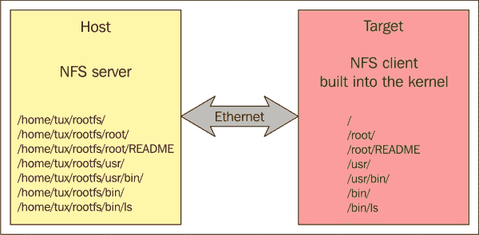
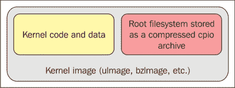

# 第五章。Linux 根文件系统

在本章中，您将了解根文件系统及其结构。您还将获得有关根文件系统内容、各种设备驱动程序以及与 Linux 内核的通信的信息。我们将逐渐过渡到 Yocto 项目以及用于定义 Linux 根文件系统内容的方法。将提供必要的信息，以确保用户能够根据自己的需求定制`rootfs`文件系统。

将介绍根文件系统的特殊要求。您将获得有关其内容、子目录、定义目的、各种文件系统选项、BusyBox 替代方案以及许多有趣功能的信息。

在与嵌入式环境交互时，许多开发人员会从分发提供商（如 Debian）那里获得一个最小的根文件系统，并使用交叉工具链来增强它，添加各种软件包、工具和实用程序。如果要添加的软件包数量很大，这可能会是非常麻烦的工作。从头开始将是一个更大的噩梦。在 Yocto 项目中，这项工作是自动化的，无需手动工作。开发是从头开始的，并且在根文件系统中提供了大量的软件包，使工作变得有趣和有趣。因此，让我们继续前进，看看本章的内容，以更全面地了解根文件系统。

# 与根文件系统交互

根文件系统由目录和文件层次结构组成。在这个文件层次结构中，可以挂载各种文件系统，显示特定存储设备的内容。挂载是使用`mount`命令完成的，在操作完成后，挂载点将被存储设备上可用的内容填充。反向操作称为`umount`，用于清空挂载点的内容。

前面的命令对应用程序与各种可用文件的交互非常有用，无论它们的位置和格式如何。例如，`mount`命令的标准形式是`mount -t type device directory`。这个命令要求内核连接设备上的文件系统，该设备在命令行中指定了`type`格式，同时还要连接命令中提到的目录。在移除设备之前，需要使用`umount`命令来确保内核缓存被写入存储点。

根文件系统位于根目录结构中，也称为`/`。它是第一个可用的文件系统，也是不使用`mount`命令的文件系统，因为它是通过内核直接通过`root=`参数挂载的。以下是加载根文件系统的多个选项：

+   从内存

+   使用 NFS 从网络中

+   从 NAND 芯片

+   从 SD 卡分区

+   从 USB 分区

+   从硬盘分区

这些选项由硬件和系统架构师选择。要使用这些选项，需要相应地配置内核和引导加载程序。

除了需要与板载内存或存储设备进行交互的选项外，加载根文件系统最常用的方法之一是 NFS 选项，这意味着根文件系统在本地机器上可用，并且在目标机器上通过网络进行导出。此选项提供以下优势：

+   由于开发机器上的存储空间比目标机器上的存储空间大得多，根文件系统的大小不会成为问题

+   更新过程更容易，无需重新启动

+   访问网络存储是对于内部或外部存储空间较小甚至不存在的设备的最佳解决方案

通过网络存储的缺点是需要服务器客户端架构。因此，对于 NFS，开发机器上需要提供 NFS 服务器功能。对于 Ubuntu 主机，所需的配置涉及安装`nfs-kernel-server`软件包，`sudo apt-get install nfs-kernel-server`。安装软件包后，需要指定和配置导出目录位置。这是通过`/etc/exports`文件完成的；在这里，类似于`/nfs/rootfs <client-IP-address> (rw,no_root_squash,no_subtree_check)`的配置行出现，其中每行定义了 NFS 客户端的网络共享位置。配置完成后，需要以以下方式重新启动 NFS 服务器：`sudo /etc/init.d/nfs-kernel-server restart`。

对于目标上可用的客户端端，需要相应配置 Linux 内核，以确保启用 NFS 支持，并且在启动时 IP 地址可用。这些配置是`CONFIG_NFS_FS=y`，`CONFIG_IP_PNP=y`和`CONFIG_ROOT_NFS=y`。内核还需要配置`root=/dev/nfs`参数，目标的 IP 地址和 NFS 服务器`nfsroot=192.168.1.110:/nfs/rootfs`信息。以下是两个组件之间通信的示例：



还有一种可能性，即将根文件系统集成到内核映像中，即最小根文件系统，其目的是启动完整功能的根文件系统。这个根文件系统称为`initramfs`。这种类型的文件系统对于对快速启动选项感兴趣的人非常有帮助，因为它只包含一些有用的功能，并且需要在更早的时候启动。它对于在启动时快速加载系统非常有用，但也可以作为启动实际根文件系统之前的中间步骤。根文件系统在内核引导过程之后首先启动，因此它应该与 Linux 内核一起可用，因为它驻留在 RAM 内存上的内核附近。以下图片解释了这一点：



要创建`initramfs`，需要提供配置。这是通过定义根文件系统目录的路径、`cpio`存档的路径，甚至是描述`initramfs`内容的文本文件来完成的，这些都在`CONFIG_INITRAMFS_SOURCE`中。当内核构建开始时，将读取`CONFIG_INITRAMFS_SOURCE`的内容，并将根文件系统集成到内核映像中。

### 注意

有关`initramfs`文件系统选项的更多信息可以在内核文档文件`Documentation/filesystems/ramfs-rootfs-initramfs.txt`和`Documentation/early-userspace/README`中找到。

初始 RAM 磁盘或`initrd`是另一种挂载早期根文件系统的机制。它还需要在 Linux 内核中启用支持，并作为内核的组件加载。它包含一小组可执行文件和目录，并代表了完整功能的根文件系统的临时阶段。它只代表了对于没有能够容纳更大根文件系统的存储设备的嵌入式设备的最终阶段。

在传统系统上，使用`mkinitrd`工具创建`initrd`，实际上是一个自动化创建`initrd`所需步骤的 shell 脚本。以下是其功能的示例：

```
#!/bin/bash

# Housekeeping...
rm -f /tmp/ramdisk.img
rm -f /tmp/ramdisk.img.gz

# Ramdisk Constants
RDSIZE=4000
BLKSIZE=1024

# Create an empty ramdisk image
dd if=/dev/zero of=/tmp/ramdisk.img bs=$BLKSIZE count=$RDSIZE

# Make it an ext2 mountable file system
/sbin/mke2fs -F -m 0 -b $BLKSIZE /tmp/ramdisk.img $RDSIZE

# Mount it so that we can populate
mount /tmp/ramdisk.img /mnt/initrd -t ext2 -o loop=/dev/loop0

# Populate the filesystem (subdirectories)
mkdir /mnt/initrd/bin
mkdir /mnt/initrd/sys
mkdir /mnt/initrd/dev
mkdir /mnt/initrd/proc

# Grab busybox and create the symbolic links
pushd /mnt/initrd/bin
cp /usr/local/src/busybox-1.1.1/busybox .
ln -s busybox ash
ln -s busybox mount
ln -s busybox echo
ln -s busybox ls
ln -s busybox cat
ln -s busybox ps
ln -s busybox dmesg
ln -s busybox sysctl
popd

# Grab the necessary dev files
cp -a /dev/console /mnt/initrd/dev
cp -a /dev/ramdisk /mnt/initrd/dev
cp -a /dev/ram0 /mnt/initrd/dev
cp -a /dev/null /mnt/initrd/dev
cp -a /dev/tty1 /mnt/initrd/dev
cp -a /dev/tty2 /mnt/initrd/dev

# Equate sbin with bin
pushd /mnt/initrd
ln -s bin sbin
popd

# Create the init file
cat >> /mnt/initrd/linuxrc << EOF
#!/bin/ash
echo
echo "Simple initrd is active"
echo
mount -t proc /proc /proc
mount -t sysfs none /sys
/bin/ash --login
EOF

chmod +x /mnt/initrd/linuxrc

# Finish up...
umount /mnt/initrd
gzip -9 /tmp/ramdisk.img
cp /tmp/ramdisk.img.gz /boot/ramdisk.img.gz

```

### 注意

有关`initrd`的更多信息可以在`Documentation/initrd.txt`中找到。

使用`initrd`不像`initramfs`那样简单。在这种情况下，需要以类似于用于内核映像的方式复制一个存档，并且引导加载程序需要将其位置和大小传递给内核，以确保它已经启动。因此，在这种情况下，引导加载程序还需要支持`initrd`。`initrd`的中心点由`linuxrc`文件构成，这是第一个启动的脚本，通常用于提供对系统引导的最后阶段的访问，即真正的根文件系统。在`linuxrc`完成执行后，内核会卸载它并继续执行真正的根文件系统。

## 深入文件系统

无论它们的来源是什么，大多数可用的根文件系统都具有相同的目录组织，由**文件系统层次结构**（**FHS**）定义，通常被称为。这种组织对开发人员和用户都非常有帮助，因为它不仅提到了目录层次结构，还提到了目录的目的和内容。最显著的是：

+   `/bin`：这是大多数程序的位置

+   `/sbin`：这是系统程序的位置

+   `/boot`：这是引导选项的位置，例如`内核映像`、`内核配置`、`initrd`、`系统映射`和其他信息

+   `/home`：这是用户主目录

+   `/root`：这是根用户的主目录位置

+   `/usr`：这是用户特定的程序和库的位置，并模仿了根文件系统的部分内容

+   `/lib`：这是库的位置

+   `/etc`：这是系统范围的配置

+   `/dev`：这是设备文件的位置

+   `/media`：这是可移动设备的挂载点的位置

+   `/mnt`：这是静态媒体的挂载位置点

+   `/proc`：这是`proc`虚拟文件系统的挂载点

+   `/sys`：这是`sysfs`虚拟文件系统的挂载点

+   `/tmp`：这是临时文件的位置

+   `/var`：这是数据文件的位置，例如日志数据、管理信息或瞬态数据的位置

FHS 随时间而变化，但变化不大。大多数先前提到的目录出于各种原因保持不变-最简单的原因是它们需要确保向后兼容性。

### 注意

FHS 的最新信息可在[`refspecs.linuxfoundation.org/FHS_2.3/fhs-2.3.pdf`](http://refspecs.linuxfoundation.org/FHS_2.3/fhs-2.3.pdf)上找到。

根文件系统由内核启动，这是内核在结束引导阶段之前执行的最后一步。以下是执行此操作的确切代码：

```
/*
  * We try each of these until one succeeds.
  *
  * The Bourne shell can be used instead of init if we are
  * trying to recover a really broken machine.
  */
  if (execute_command) {
    ret = run_init_process(execute_command);
    if (!ret)
      return 0;
    pr_err("Failed to execute %s (error %d).  Attempting defaults...\n",execute_command, ret);
  }
  if (!try_to_run_init_process("/sbin/init") ||
    !try_to_run_init_process("/etc/init") ||
    !try_to_run_init_process("/bin/init") ||
    !try_to_run_init_process("/bin/sh"))
      return 0;

  panic("No working init found.  Try passing init= option to kernel." "See Linux Documentation/init.txt for guidance.");
```

在此代码中，可以轻松地识别出用于搜索需要在退出 Linux 内核引导执行之前启动的`init`进程的多个位置。`run_init_process()`函数是`execve()`函数的包装器，如果在调用过程中未遇到错误，则不会返回值。被调用的程序覆盖了执行进程的内存空间，替换了调用线程并继承了它的`PID`。

这个初始化阶段是如此古老，以至于 Linux 1.0 版本中也有类似的结构。这代表了用户空间处理的开始。如果内核无法在预定义的位置执行前述四个函数中的一个，则内核将停止，并且会在控制台上提示恐慌消息，以发出无法启动任何 init 进程的警报。因此，在内核空间处理完成之前，用户空间处理将不会开始。

对于大多数可用的 Linux 系统，`/sbin/init`是内核生成 init 进程的位置；对于 Yocto 项目生成的根文件系统，同样也是如此。它是用户空间中运行的第一个应用程序，但它并不是根文件系统的唯一必要特性。在运行根文件系统中的任何进程之前，需要解决一些依赖关系。有一些用于解决动态链接依赖引用的依赖关系，这些引用之前未解决，还有一些需要外部配置的依赖关系。对于第一类依赖关系，可以使用`ldd`工具来查找动态链接依赖关系，但对于第二类依赖关系，没有通用解决方案。例如，对于`init`进程，配置文件是`inittab`，它位于`/etc`目录中。

对于不希望运行另一个`init`进程的开发人员，可以使用内核命令行中的`init=`参数来访问此选项，其中应提供要执行的二进制文件的路径。这些信息也在前面的代码中提供。定制`init`进程并不是开发人员常用的方法，但这是因为`init`进程非常灵活，可以提供多个启动脚本。

在`init`之后启动的每个进程都使用父子关系，其中`init`充当用户空间中所有进程的父进程，并且还提供环境参数。最初，init 进程根据`/etc/inittab`配置文件中的信息生成进程，该文件定义了运行级别的概念。运行级别表示系统的状态，并定义了已启动的程序和服务。有八个可用的运行级别，编号从`0`到`6`，还有一个特殊的`S`。它们的目的在这里描述：

| 运行级别值 | 运行级别目的 |
| --- | --- |
| `0` | 它指的是整个系统的关闭和关机命令 |
| `1` | 它是带有标准登录访问的单用户管理模式 |
| `2` | 它是没有 TCP/IP 连接的多用户模式 |
| `3` | 它指的是通用多用户 |
| `4` | 它由系统所有者定义 |
| `5` | 它指的是图形界面和 TCP/IP 连接的多用户系统 |
| `6` | 它指的是系统重启 |
| `s` | 它是提供对最小根 shell 的单用户模式访问 |

每个运行级别启动和终止一些服务。启动的服务以`S`开头，终止的服务以`K`开头。每个服务实际上是一个 shell 脚本，定义了它所提供的行为。

`/etc/inittab`配置脚本定义了运行级别和应用于所有运行级别的指令。对于 Yocto 项目，`/etc/inittab`看起来类似于这样：

```
# /etc/inittab: init(8) configuration.
# $Id: inittab,v 1.91 2002/01/25 13:35:21 miquels Exp $

# The default runlevel.
id:5:initdefault:

# Boot-time system configuration/initialization script.
# This is run first except when booting in emergency (-b) mode.
si::sysinit:/etc/init.d/rcS

# What to do in single-user mode.
~~:S:wait:/sbin/sulogin

# /etc/init.d executes the S and K scripts upon change
# of runlevel.
#
# Runlevel 0 is halt.
# Runlevel 1 is single-user.
# Runlevels 2-5 are multi-user.
# Runlevel 6 is reboot.

l0:0:wait:/etc/init.d/rc 0
l1:1:wait:/etc/init.d/rc 1
l2:2:wait:/etc/init.d/rc 2
l3:3:wait:/etc/init.d/rc 3
l4:4:wait:/etc/init.d/rc 4
l5:5:wait:/etc/init.d/rc 5
l6:6:wait:/etc/init.d/rc 6
# Normally not reached, but fallthrough in case of emergency.
z6:6:respawn:/sbin/sulogin
S0:12345:respawn:/sbin/getty 115200 ttyS0
# /sbin/getty invocations for the runlevels.
#
# The "id" field MUST be the same as the last
# characters of the device (after "tty").
#
# Format:
#  <id>:<runlevels>:<action>:<process>
#

1:2345:respawn:/sbin/getty 38400 tty1
```

当`init`解析前面的`inittab`文件时，首先执行的是通过`sysinit`标签标识的`si::sysinit:/etc/init.d/rcS`行。然后，进入`runlevel 5`，并继续处理指令，直到最后一个级别，最终使用`/sbin/getty symlink`生成一个 shell。可以在控制台中运行`man init`或`man inittab`来获取有关`init`或`inittab`的更多信息。

任何 Linux 系统的最后阶段都由关机或关闭命令表示。这非常重要，因为如果不适当地执行，可能会通过损坏数据来影响系统。当然，有多种选项可以实现关闭方案，但最方便的形式仍然是使用诸如`shutdown`、`halt`或`reboot`之类的实用程序。还可以使用`init 0`来关闭系统，但实际上，它们都共同使用`SIGTERM`和`SIGKILL`信号。`SIGTERM`最初用于通知您关于关闭系统的决定，以便系统执行必要的操作。完成后，发送`SIGKILL`信号以终止所有进程。

## 设备驱动程序

Linux 系统面临的最重要挑战之一是允许应用程序访问各种硬件设备。诸如虚拟内存、内核空间和用户空间之类的概念并没有简化事情，而是为这些信息增加了另一层复杂性。

设备驱动程序的唯一目的是将硬件设备和内核数据结构与用户空间应用程序隔离开来。用户不需要知道，要向硬盘写入数据，他或她将需要使用不同大小的扇区。用户只需打开一个文件进行写入，完成后关闭即可。设备驱动程序是执行所有底层工作的程序，比如隔离复杂性。

在用户空间中，所有设备驱动程序都有关联的设备节点，实际上是表示设备的特殊文件。所有设备文件都位于`/dev`目录中，并通过`mknod`实用程序与它们进行交互。设备节点在两个抽象层上可用：

+   **块设备**：这些由固定大小的块组成，通常在与硬盘、SD 卡、USB 存储设备等交互时使用

+   **字符设备**：这些是不具有大小、起始或结束的字符流；它们大多不是块设备的形式，比如终端、串行端口、声卡等

每个设备都有一个提供有关其信息的结构：

+   `Type`标识设备节点是字符设备还是块设备

+   `Major`标识设备的类别

+   `Minor`保存设备节点的标识符

创建设备节点的`mknod`实用程序使用三元组信息，例如`mknod /dev/testdev c 234 0`。执行命令后，将出现一个`new /dev/testdev`文件。它应该绑定到已安装并已定义其属性的设备驱动程序。如果发出`open`命令，内核将寻找与设备节点相同主要编号注册的设备驱动程序。次要编号用于处理多个设备或使用相同设备驱动程序的设备系列。它被传递给设备驱动程序以便使用。没有标准的使用次要编号的方法，但通常它定义了来自共享相同主要编号的设备系列中的特定设备。

使用`mknod`实用程序需要手动交互和 root 权限，并允许开发人员完成识别设备节点及其设备驱动程序对应的属性所需的所有繁重工作。最新的 Linux 系统提供了自动化此过程的可能性，并且还可以在每次检测到设备或设备消失时完成这些操作。具体操作如下：

+   `devfs`：这是一个作为文件系统设计的设备管理器，也可在内核空间和用户空间中访问。

+   `devtmpfs`：这是一个虚拟文件系统，自 2.6.32 内核版本发布以来就可用，是对用于启动时间优化的`devfs`的改进。它只为本地系统上可用的硬件创建设备节点。

+   `udev`：这是指在服务器和桌面 Linux 系统上使用的守护程序。有关此的更多信息可以通过访问[`www.kernel.org/pub/linux/utils/kernel/hotplug/udev/udev.html`](https://www.kernel.org/pub/linux/utils/kernel/hotplug/udev/udev.html)来参考。Yocto 项目也将其用作默认设备管理器。

+   `mdev`：这提供了比`udev`更简单的解决方案；实际上，它是`udev`的一个派生物。

由于系统对象也被表示为文件，这简化了应用程序与它们交互的方法。如果没有使用设备节点，这是不可能的，设备节点实际上是文件，可以对其应用正常的文件交互功能，如`open()`，`read()`，`write()`和`close()`。

## 文件系统选项

根文件系统可以以非常广泛的文件系统类型部署，并且每种文件系统都比其他文件系统更适合执行特定任务。如果某些文件系统针对性能进行了优化，那么其他文件系统则更擅长节省空间甚至恢复数据。这里将介绍一些最常用和有趣的文件系统。

物理设备的逻辑分区，如硬盘或 SD 卡，称为**分区**。物理设备可以有一个或多个分区，覆盖其可用存储空间。它可以被视为具有文件系统供用户使用的逻辑磁盘。在 Linux 中，使用`fdisk`实用程序来管理分区。它可以用于`创建`，`列出`，`销毁`和其他一般交互，有 100 多种分区类型。更准确地说，在我的 Ubuntu 14.04 开发机器上有 128 种分区类型可用。

最常用和知名的文件系统分区格式之一是`ext2`。也称为**第二扩展文件系统**，它是由法国软件开发人员 Rémy Card 于 1993 年引入的。它曾被用作许多 Linux 发行版的默认文件系统，如 Debian 和 Red Hat Linux，直到被其年轻的兄弟`ext3`和`ext4`取代。它继续是许多嵌入式 Linux 发行版和闪存存储设备的选择。

`ext2`文件系统将数据分割为块，并将块排列成块组。每个块组维护超级块的副本和该块组的描述符表。超级块用于存储配置信息，并保存引导过程所需的信息，尽管有多个副本；通常，位于文件系统第一个块中的第一个副本是所使用的。通常将文件的所有数据保存在单个块中，以便可以更快地进行搜索。除了包含的数据外，每个块组还包含有关超级块、块组的描述符表、索引节点位图和表信息以及块位图的信息。超级块是保存引导过程所需信息的地方。它的第一个块用于引导过程。最后一个概念是`inode`，或索引节点，它通过其权限、大小、在磁盘上的位置和所有权来表示文件和目录。

有多个应用程序用于与`ext2`文件系统格式进行交互。其中之一是`mke2fs`，用于在`mke2fs /deb/sdb1 –L`分区（`ext2`标签分区）上创建`ext2`文件系统。还有`e2fsck`命令，用于验证文件系统的完整性。如果未发现错误，这些工具会为您提供有关分区文件系统配置的信息，`e2fsck /dev/sdb1`。此实用程序还能够修复设备不正确使用后出现的一些错误，但不能在所有情况下使用。

Ext3 是另一个强大而广为人知的文件系统。它取代了`ext2`，成为 Linux 发行版中最常用的文件系统之一。实际上，它与`ext2`类似；不同之处在于它具有日志记录信息的可能性。可以使用`tune2fs –j /dev/sdb1`命令将`ext2`文件格式更改为`ext3`文件格式。基本上被视为`ext2`文件系统格式的扩展，它添加了日志记录功能。这是因为它被设计为向前和向后兼容。

日志记录是一种方法，用于记录文件系统上所做的所有更改，从而实现恢复功能。除了已经提到的功能外，`ext3`还添加了其他功能；在这里，我指的是文件系统中不需要检查一致性的可能性，主要是因为日志记录可以被撤消。另一个重要功能是，它可以在不检查关机是否正确执行的情况下挂载。这是因为系统在关机时不需要进行一致性检查。

Ext4 是`ext3`的后继者，旨在改善`ext3`中的性能和存储限制。它还向后兼容`ext3`和`ext2`文件系统，并添加了许多功能：

+   持久性预分配：这定义了`fallocate()`系统调用，可用于预先分配空间，这在大多数情况下是连续的形式；对于数据库和媒体流非常有用

+   延迟分配：这也称为**在刷新时分配**；它用于延迟分配块，从磁盘刷新数据的时刻开始，以减少碎片化并提高性能

+   多块分配：这是延迟分配的副作用，因为它允许数据缓冲，同时分配多个块。

+   增加子目录限制：`ext3`的子目录限制为 32000 个，而`ext4`没有此限制，即子目录的数量是无限的

+   日志的校验和：这用于提高可靠性

**日志闪存文件系统版本 2**（**JFFS2**）是为 NAND 和 NOR 闪存设计的文件系统。它于 2001 年被包含在 Linux 主线内核中，与`ext3`文件系统在同一年发布，尽管在不同的月份。它在 Linux 2.4.15 版本中于 11 月发布，而 JFFS2 文件系统在 2.4.10 内核版本中于 9 月发布。由于它特别用于支持闪存设备，因此考虑了某些因素，例如需要处理小文件以及这些设备具有与之相关的磨损水平，这通过其设计解决和减少。尽管 JFFS2 是闪存的标准，但也有一些替代方案，例如 LogFS、另一个闪存文件系统（YAFFS）和未排序块映像文件系统（UBIFS）。

除了前面提到的文件系统外，还有一些伪文件系统可用，包括`proc`、`sysfs`和`tmpfs`。在下一节中，将描述前两者，留下最后一个让您自己发现。

`proc`文件系统是 Linux 的第一个版本中提供的虚拟文件系统。它被定义为允许内核向用户提供有关正在运行的进程的信息，但随着时间的推移，它已经发展，现在不仅可以提供有关正在运行的进程的统计信息，还可以提供有关内存管理、进程、中断等各种参数的调整。

随着时间的推移，`proc`虚拟文件系统对于 Linux 系统用户来说变得必不可少，因为它汇集了大量的用户空间功能。命令，如`top`、`ps`和`mount`，没有它将无法工作。例如，给出没有参数的`mount`示例将以`proc`挂载在`/proc`上的形式呈现为`proc` on `/proc type proc (rw,noexec,nosuid,nodev)`。这是因为需要将`proc`挂载在`root`文件系统上，与目录`/etc`、`/home`等一起使用作为`/proc`文件系统的目的地。要挂载`proc`文件系统，使用类似于其他可用文件系统的`mount –t proc nodev/proc`挂载命令。有关此更多信息可以在内核源文件的`Documentation/filesystems/proc.txt`中找到。

`proc`文件系统具有以下结构：

+   对于每个运行的进程，`/proc/<pid>`内有一个可用的目录。它包含有关打开的文件、使用的内存、CPU 使用情况和其他特定于进程的信息。

+   一般设备的信息位于`/proc/devices`、`/proc/interrupts`、`/proc/ioports`和`/proc/iomem`内。

+   内核命令行位于`/proc/cmdline`内。

+   用于更改内核参数的文件位于`/proc/sys`内。有关更多信息，也可以在`Documentation/sysctl`中找到。

`sysfs`文件系统用于表示物理设备。自 2.6 版 Linux 内核引入以来，它提供了将物理设备表示为内核对象并将设备驱动程序与相应设备关联的可能性。对于工具，如`udev`和其他设备管理器，它非常有用。

`sysfs`目录结构为每个主要系统设备类都有一个子目录，还有一个系统总线子目录。还有`systool`可以用来浏览`sysfs`目录结构。与 proc 文件系统类似，如果在控制台上提供了`sysfs on /sys type sysfs (rw,noexec,nosuid,nodev)` `mount`命令，`systool`也可以可见。可以使用`mount -t sysfs nodev /sys`命令进行挂载。

### 注意

有关可用文件系统的更多信息，请访问[`en.wikipedia.org/wiki/List_of_file_systems`](http://en.wikipedia.org/wiki/List_of_file_systems)。

# 理解 BusyBox

BusyBox 由 Bruce Perens 于 1999 年开发，旨在将可用的 Linux 工具集成到一个单一的可执行文件中。它已被广泛成功地用作许多 Linux 命令行实用程序的替代品。由于这个原因，以及它能够适应小型嵌入式 Linux 发行版，它在嵌入式环境中获得了很多的流行。它提供了文件交互的实用工具，如`cp`、`mkdir`、`touch`、`ls`和`cat`，以及一般实用工具，如`dmesg`、`kill`、`fdisk`、`mount`、`umount`等。

它不仅非常容易配置和编译，而且非常易于使用。它非常模块化，并提供高度的配置，使其成为理想的选择。它可能不包括主机 PC 上可用的完整 Linux 发行版中的所有命令，但它包含的命令已经足够了。此外，这些命令只是完整命令的简化版本，用于实现级别，并且都集成在一个单一可执行文件中，作为`/bin/busybox`中的符号链接。

开发人员与 BusyBox 源代码包的交互非常简单：只需配置、编译和安装，就可以了。以下是一些详细的步骤来解释以下内容：

+   运行配置工具并选择要提供的功能

+   执行`make dep`来构建依赖树

+   使用`make`命令构建软件包

### 提示

在目标上安装可执行文件和符号链接。对于希望在其工作站上与该工具进行交互的人来说，如果该工具已安装到主机系统，则安装应该在不覆盖主机可用的任何实用程序和启动脚本的位置进行。

BusyBox 包的配置还有一个`menuconfig`选项，类似于内核和 U-Boot 可用的`make menuconfig`。它用于显示一个文本菜单，可用于更快的配置和配置搜索。要使此菜单可用，首先需要在调用`make menuconfig`命令的系统上安装`ncurses`包。

在过程结束时，BusyBox 可执行文件可用。如果没有参数调用它，它将呈现一个与此类似的输出：

```
Usage: busybox [function] [arguments]...
 or: [function] [arguments]...

 BusyBox is a multi-call binary that combines many common Unix
 utilities into a single executable.  Most people will create a
 link to busybox for each function they wish to use and BusyBox
 will act like whatever it was invoked as!

Currently defined functions:
 [, [[, arping, ash, awk, basename, bunzip2, busybox, bzcat, cat,
 chgrp, chmod, chown, chroot, clear, cp, crond, crontab, cut, date,
 dd, df, dirname, dmesg, du, echo, egrep, env, expr, false, fgrep,
 find, free, grep, gunzip, gzip, halt, head, hexdump, hostid, hostname,
 id, ifconfig, init, insmod, ipcalc, ipkg, kill, killall, killall5,
 klogd, length, ln, lock, logger, logread, ls, lsmod, md5sum, mesg,
 mkdir, mkfifo, mktemp, more, mount, mv, nc, "netmsg", netstat,
 nslookup, passwd, pidof, ping, pivot_root, poweroff, printf, ps,
 pwd, rdate, reboot, reset, rm, rmdir, rmmod, route, sed, seq,
 sh, sleep, sort, strings, switch_root, sync, sysctl, syslogd,
 tail, tar, tee, telnet, test, time, top, touch, tr, traceroute,
 true, udhcpc, umount, uname, uniq, uptime, vi, wc, wget, which,
 xargs, yes, zcat

```

它呈现了在配置阶段启用的实用程序列表。调用上述实用程序之一有两种选项。第一种选项需要使用 BusyBox 二进制文件和调用的实用程序数量，表示为`./busybox ls`，而第二种选项涉及使用已经在目录中可用的符号链接，如`/bin、/sbin、/usr/bin`等。

除了已经可用的实用程序之外，BusyBox 还为`init`程序提供了实现替代方案。在这种情况下，`init`不知道运行级别，所有配置都在`/etc/inittab`文件中。另一个与标准`/etc/inittab`文件不同的因素是，它还具有自己的特殊语法。有关更多信息，可以查看 BusyBox 中的`examples/inittab`。BusyBox 包中还实现了其他工具和实用程序，例如`vi`的轻量级版本，但我会让你自己去发现它们。

# 最小`root`文件系统

现在，所有关于`root`文件系统的信息都已经呈现给你，描述最小`root`文件系统的必备组件将是一个很好的练习。这不仅有助于您更好地理解`rootfs`结构及其依赖关系，还有助于满足引导时间和`root`文件系统大小优化的要求。

描述组件的起点是`/sbin/init`；在这里，可以使用`ldd`命令找到运行时依赖关系。对于 Yocto 项目，`ldd /sbin/init`命令返回：

```
linux-gate.so.1 (0xb7785000)
libc.so.6 => /lib/libc.so.6 (0x4273b000)
/lib/ld-linux.so.2 (0x42716000)

```

根据这些信息，定义了`/lib`目录结构。它的最小形式是：

```
lib
|-- ld-2.3.2.so
|-- ld-linux.so.2 -> ld-2.3.2.so
|-- libc-2.3.2.so
'-- libc.so.6 -> libc-2.3.2.so

```

以下是确保库的向后兼容性和版本免疫性的符号链接。在上述代码中，`linux-gate.so.1`文件是一个**虚拟动态链接共享对象**（**vDSO**），由内核在一个已建立的位置公开。它的地址因机器架构而异。

之后，必须定义`init`及其运行级别。这个最小形式在 BusyBox 包中可用，因此也将在`/bin`目录中可用。除此之外，还需要一个用于 shell 交互的符号链接，因此`/bin`目录的最小形式如下：

```
bin
|-- busybox
'-- sh -> busybox

```

接下来，需要定义运行级别。在最小的`root`文件系统中只使用一个，不是因为这是严格要求，而是因为它可以抑制一些 BusyBox 警告。这是`/etc`目录的样子：

```
etc
'-- init.d
 '-- rcS

```

最后，控制台设备需要对用户进行输入和输出操作，因此`root`文件系统的最后一部分位于`/dev`目录中：

```
dev
'-- console

```

提到了所有这些，最小的`root`文件系统似乎只有五个目录和八个文件。其最小尺寸低于 2 MB，大约 80%的尺寸归功于 C 库软件包。还可以通过使用 Library Optimizer Tool 来最小化其大小。您可以在[`libraryopt.sourceforge.net/`](http://libraryopt.sourceforge.net/)找到更多信息。

# Yocto 项目

转到 Yocto 项目，我们可以查看 core-image-minimal 以确定其内容和最低要求，如 Yocto 项目中所定义的。`core-image-minimal.bb`镜像位于`meta/recipes-core/images`目录中，看起来是这样的：

```
SUMMARY = "A small image just capable of allowing a device to boot."

IMAGE_INSTALL = "packagegroup-core-boot ${ROOTFS_PKGMANAGE_BOOTSTRAP} ${CORE_IMAGE_EXTRA_INSTALL} ldd"

IMAGE_LINGUAS = " "

LICENSE = "MIT"

inherit core-image

IMAGE_ROOTFS_SIZE ?= "8192"

```

您可以在这里看到这与任何其他配方都是相似的。该镜像定义了`LICENSE`字段，并继承了一个`bbclass`文件，该文件定义了其任务。使用简短的摘要来描述它，它与普通软件包配方非常不同。它没有`LIC_FILES_CHKSUM`来检查许可证或`SRC_URI`字段，主要是因为它不需要它们。作为回报，该文件定义了应包含在`root`文件系统中的确切软件包，并且其中一些软件包被分组在`packagegroup`中以便更容易处理。此外，`core-image bbclass`文件定义了许多其他任务，例如`do_rootfs`，这仅适用于镜像配方。

构建`root`文件系统对任何人来说都不是一件容易的事情，但 Yocto 做得更成功一些。它从 base-files 配方开始，用于根据**文件系统层次结构标准**（**FHS**）布置目录结构，并且还有一些其他配方。这些信息可在`./meta/recipes-core/packagegroups/packagegroup-core-boot.bb`配方中找到。正如在先前的例子中所看到的，它还继承了不同类型的类，比如`packagegroup.bbclass`，这是所有可用的包组的要求。然而，最重要的因素是它清楚地定义了构成`packagegroup`的软件包。在我们的情况下，核心引导包组包含软件包，如`base-files`，`base-passwd`（其中包含基本系统主密码和组文件），`udev`，`busybox`和`sysvinit`（类似于 System V 的 init）。

正如在先前显示的文件中所看到的，BusyBox 软件包是 Yocto 项目生成的发行版的核心组件。虽然有关 BusyBox 可以提供 init 替代方案的信息是可用的，但默认的 Yocto 生成的发行版并不使用这个功能。相反，它们选择转向类似于 Debian 发行版可用的 System V-like init。然而，通过`meta/recipes-core/busybox`位置内可用的 BusyBox 配方提供了一些 shell 交互工具。对于有兴趣增强或删除`busybox`软件包提供的一些功能的用户，可以使用与 Linux 内核配置相同的概念。`busybox`软件包使用`defconfig`文件，然后应用一些配置片段。这些片段可以添加或删除功能，最终得到最终的配置文件。这标识了`root`文件系统中可用的最终功能。

在 Yocto 项目中，可以通过使用`poky-tiny.conf`发行政策来最小化`root`文件系统的大小，这些政策可以在`meta-yocto/conf/distro`目录中找到。当使用这些政策时，不仅可以减小启动大小，还可以减小启动时间。最简单的示例是使用`qemux86`机器。在这里，变化是可见的，但与“最小根文件系统”部分中已经提到的有些不同。在`qemux86`上进行的最小化工作是围绕`core-image-minimal`镜像进行的。其目标是将结果`rootfs`的大小减小到 4MB 以下，启动时间减小到 2 秒以下。

现在，转向选定的 Atmel SAMA5D3 Xplained 机器，另一个`rootfs`被生成，其内容相当庞大。它不仅包括了`packagegroup-core-boot.bb`软件包组，还包括其他软件包组和单独的软件包。其中一个例子是在`meta-atmel`层的`recipes-core/images`目录中可用的`atmel-xplained-demo-image.bb`镜像：

```
DESCRIPTION = "An image for network and communication."
LICENSE = "MIT"
PR = "r1"

require atmel-demo-image.inc

IMAGE_INSTALL += "\
    packagegroup-base-3g \
    packagegroup-base-usbhost \
    "
```

在这个镜像中，还有另一个更通用的镜像定义被继承。我指的是`atmel-demo-image.inc`文件，打开后可以看到它包含了所有`meta-atmel`层镜像的核心。当然，如果所有可用的软件包都不够，开发人员可以决定添加自己的软件包。开发人员面临两种可能性：创建一个新的镜像，或者向已有的镜像添加软件包。最终结果是使用`bitbake atmel-xplained-demo-image`命令构建的。输出以各种形式可用，并且高度依赖于所定义的机器的要求。在构建过程结束时，输出将用于在实际板上引导根文件系统。

# 摘要

在本章中，您已经了解了 Linux `rootfs`的一般情况，以及与 Linux 内核、Linux `rootfs`的组织、原则、内容和设备驱动程序的通信。由于通信随着时间的推移而变得更加庞大，关于最小文件系统应该如何看待的信息也被呈现给您。

除了这些信息，下一章将为您概述 Yocto 项目的可用组件，因为它们大多数都在 Poky 之外。您还将被介绍并简要介绍每个组件。在本章之后，将向您介绍并详细阐述其中的一些组件。
