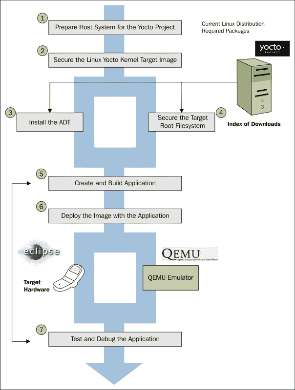

# 第六章：Yocto 项目的组件

在本章中，您将简要介绍 Yocto 项目生态系统中的一些组件。本章的目的是介绍它们，以便在后续章节中更详细地介绍它们。它还试图引导读者进行额外阅读。对于每个工具、功能或有趣的事实，都提供了链接，以帮助感兴趣的读者寻找本书中的问题以及本章未涵盖的问题的答案。

本章充满了有关嵌入式开发过程的指导和相关示例，涉及特定的 Yocto 项目工具。工具的选择是纯主观的。只选择了在开发过程中被认为有帮助的工具。我们还考虑到其中一些工具可能会为嵌入式世界和嵌入式系统的开发提供新的见解。

# Poky

Poky 代表了 Yocto 项目的元数据和工具的参考构建系统，这些工具是任何对与 Yocto 项目进行交互感兴趣的人的起点。它是独立于平台的，并提供了构建和定制最终结果的工具和机制，实际上是一个 Linux 软件堆栈。Poky 被用作与 Yocto 项目进行交互的中心组件。

作为开发人员使用 Yocto 项目时，了解邮件列表和**Internet Relay Chat** (**IRC**)频道的信息非常重要。此外，项目 Bugzilla 也可以作为可用 bug 和功能列表的灵感来源。所有这些元素都需要一个简短的介绍，因此最好的起点是 Yocto 项目 Bugzilla。它代表了 Yocto 项目用户的 bug 跟踪应用程序，并且是问题报告的地方。下一个组件是 IRC 的可用频道。在 freenode 上有两个可用的组件，一个用于 Poky，另一个用于与 Yocto 项目相关的讨论，如**#poky**和**#yocto**。第三个元素是 Yocto 项目邮件列表，用于订阅 Yocto 项目的邮件列表：

+   [`lists.yoctoproject.org/listinfo/yocto`](http://lists.yoctoproject.org/listinfo/yocto)：这是 Yocto 项目讨论的邮件列表。

+   [`lists.yoctoproject.org/listinfo/poky`](http://lists.yoctoproject.org/listinfo/poky)：这是关于 Yocto 项目 Poky 构建的讨论邮件列表。

+   [`lists.yoctoproject.org/listinfo/yocto-announce`](http://lists.yoctoproject.org/listinfo/yocto-announce)：这是官方公告 Yocto 项目的邮件列表，也是 Yocto 项目里程碑的发布地点。

通过[`lists.yoctoproject.org/listinfo`](http://lists.yoctoproject.org/listinfo)，可以获取有关一般和项目特定邮件列表的更多信息。它包含了[`www.yoctoproject.org/tools-resources/community/mailing-lists`](https://www.yoctoproject.org/tools-resources/community/mailing-lists)上所有可用邮件列表的列表。

要开始使用 Yocto 项目，特别是 Poky，不仅应使用先前提到的组件；还应提供有关这些工具的信息。有关 Yocto 项目的非常好的解释可以在他们的文档页面上找到[`www.yoctoproject.org/documentation`](https://www.yoctoproject.org/documentation)。对于那些对阅读更简短介绍感兴趣的人，可以查看*Packt Publishing*出版的*Embedded Linux Development with Yocto Project*，作者是*Otavio Salvador*和*Daiane Angolini*。

要使用 Yocto 项目，需要满足一些特定的要求：

+   主机系统：假设这是一个基于 Linux 的主机系统。但这不仅仅是任何主机系统；Yocto 有特定的要求。支持的操作系统在`poky.conf`文件中可用，该文件位于`meta-yocto/conf/distro`目录中。支持的操作系统在`SANITY_TESTED_DISTROS`变量中定义，其中一些系统如下：

+   Ubuntu-12.04

+   Ubuntu-13.10

+   Ubuntu-14.04

+   Fedora-19

+   Fedora-20

+   CentOS-6.4

+   CentOS-6.5

+   Debian-7.0

+   Debian-7.1

+   Debian-7.2

+   Debian-7.3

+   Debian-7.4

+   Debian-7.5

+   Debian-7.6

+   SUSE-LINUX-12.2

+   openSUSE-project-12.3

+   openSUSE-project-13.1

+   所需软件包：这包含主机系统上可用的软件包的最低要求列表，除了已有的软件包。当然，这与一个主机系统到另一个主机系统是不同的，系统根据其目的而有所不同。但是，对于 Ubuntu 主机，我们需要以下要求：

+   基本要求：这指的是`sudo apt-get install gawk wget git-core diffstat unzip texinfo gcc-multilib build-essential chrpath socat`

+   图形和 Eclipse 插件额外组件：这指的是`sudo apt-get install libsdl1.2-dev xterm`

+   文档：这指的是`sudo apt-get install make xsltproc docbook-utils fop dblatex xmlto`

+   ADT 安装程序额外组件：这指的是`sudo apt-get install autoconf automake libtool libglib2.0-dev`

+   Yocto 项目发布：在开始任何工作之前，应选择一个可用的 Poky 版本。本书基于 dizzy 分支，即 Poky 1.7 版本，但开发人员可以选择最适合自己的版本。当然，由于与项目的交互是使用`git`版本控制系统完成的，用户首先需要克隆 Poky 存储库，并且对项目的任何贡献都应提交为开源社区的补丁。还有可能获取一个 tar 存档，但由于源代码上的任何更改更难追踪，并且还限制了与项目相关社区的交互，因此这种方法存在一些限制。

如果需要特殊要求，还有其他额外的可选要求需要注意，如下所示：

+   自定义 Yocto 项目内核交互：如果开发人员决定 Yocto 项目维护的内核源不适合他们的需求，他们可以获取 Yocto 项目支持的内核版本的本地副本之一，该副本可在[Yocto Linux Kernel](http://git.yoctoproject.org/cgit.cgi)下找到，并根据自己的需求进行修改。当然，这些更改以及其余的内核源都需要驻留在一个单独的存储库中，最好是`git`，并且将通过内核配方引入 Yocto 世界。

+   meta-yocto-kernel-extras git 存储库：在构建和修改内核映像时，此处收集所需的元数据。它包含一堆`bbappend`文件，可以编辑以指示本地源代码已更改，这是在开发 Linux 内核功能时更有效的方法。它在[Yocto Metadata Layers](http://git.yoctoproject.org/cgit.cgi)的**Yocto Metadata Layers**部分提供。

+   **支持的板支持包（BSPs）**：有许多 BSP 层可供 Yocto Project 支持。每个 BSP 层的命名非常简单，`meta-<bsp-name>`，可以在[`git.yoctoproject.org/cgit.cgi`](http://git.yoctoproject.org/cgit.cgi)的**Yocto Metadata Layers**部分找到。实际上，每个 BSP 层都是一组定义 BSP 提供者行为和最低要求的配方集合。有关 BSP 开发的更多信息可以在[`www.yoctoproject.org/docs/1.7/dev-manual/dev-manual.html#developing-a-board-support-package-bsp`](http://www.yoctoproject.org/docs/1.7/dev-manual/dev-manual.html#developing-a-board-support-package-bsp)找到。

+   **Eclipse Yocto 插件**：对于有兴趣编写应用程序的开发人员，Yocto 专用插件的 Eclipse**集成开发环境**（**IDE**）可用。您可以在[`www.yoctoproject.org/docs/1.7/dev-manual/dev-manual.html#setting-up-the-eclipse-ide`](http://www.yoctoproject.org/docs/1.7/dev-manual/dev-manual.html#setting-up-the-eclipse-ide)找到更多信息。

Yocto Project 内的开发过程有许多含义。它可以指的是 Yocto Project Bugzilla 中可用的各种错误和功能。开发人员可以将其中之一分配给自己的帐户并解决它。各种配方可以升级，这也需要开发人员的参与；还可以添加新功能，并且需要开发人员编写各种配方。所有这些任务都需要有一个明确定义的流程，其中也涉及`git`的交互。

要将配方中添加的更改发送回社区，可以使用可用的 create-pull-request 和 send-pull request 脚本。这些脚本位于 poky 存储库的 scripts 目录中。此外，在本节中还有一些其他有趣的脚本可用，如`create-recipe`脚本等，我会让你自己去发现。将更改发送到上游的另一种首选方法是使用手动方法，其中涉及与`git`命令的交互，如`git add`、`git commit –s`、`git format-patch`、`git send-email`等。

在继续描述本章节中呈现的其他组件之前，将对现有的 Yocto Project 开发模型进行审查。这个过程涉及 Yocto Project 提供的这些工具：

+   **系统开发**：这涵盖了 BSP 的开发、内核开发及其配置。Yocto Project 文档中有关于各自开发过程的部分，如[`www.yoctoproject.org/docs/1.7/bsp-guide/bsp-guide.html#creating-a-new-bsp-layer-using-the-yocto-bsp-script`](http://www.yoctoproject.org/docs/1.7/bsp-guide/bsp-guide.html#creating-a-new-bsp-layer-using-the-yocto-bsp-script)和[`www.yoctoproject.org/docs/1.7/kernel-dev/kernel-dev.html`](http://www.yoctoproject.org/docs/1.7/kernel-dev/kernel-dev.html)。

+   **用户应用程序开发**：这涵盖了针对目标硬件设备开发应用程序。有关在主机系统上进行应用程序开发所需设置的信息可在[`www.yoctoproject.org/docs/1.7/adt-manual/adt-manual.html`](http://www.yoctoproject.org/docs/1.7/adt-manual/adt-manual.html)找到。本章节还将讨论*Eclipse ADT 插件*部分。

+   **临时修改源代码**：这涵盖了开发过程中出现的临时修改。这涉及解决项目源代码中可用的各种实现问题的解决方案。问题解决后，更改需要上游可用并相应应用。

+   **Hob 镜像的开发**：Hob 构建系统可用于操作和定制系统镜像。它是一个用 Python 开发的图形界面，作为与 Bitbake 构建系统更高效的接口。

+   **Devshell 开发**：这是一种使用 Bitbake 构建系统任务的确切环境进行开发的方法。这是用于调试或包编辑的最有效方法之一。在编写项目的各个组件时，这也是设置构建环境的最快方法之一。

对于提供的组件过时无法满足 Yocto 项目要求的操作系统，建议使用`buildtools`工具链来提供所需版本的软件。用于安装`buildtools` tarball 的方法有两种。第一种方法涉及使用已经可用的预构建 tarball，第二种方法涉及使用 Bitbake 构建系统进行构建。有关此选项的更多信息可以在 Yocto 文档超级手册的**Required Git, tar, and Python Versions**部分的子部分中找到，网址为[`www.yoctoproject.org/docs/1.7/mega-manual/mega-manual.html#required-git-tar-and-python-versions`](http://www.yoctoproject.org/docs/1.7/mega-manual/mega-manual.html#required-git-tar-and-python-versions)。

# Eclipse ADT 插件

**应用程序开发工具包**，也称为 ADT，提供了一个适用于自定义构建和用户定制应用程序的交叉开发平台。它由以下元素组成：

+   **交叉工具链**：它与`sysroot`相关联，两者都是使用 Bitbake 自动生成的，并且目标特定的元数据由目标硬件供应商提供。

+   **快速仿真器环境（Qemu）**：用于模拟目标硬件。

+   **用户空间工具**：它改善了应用程序开发的整体体验

+   **Eclipse IDE**：它包含 Yocto 项目特定的插件

在本节中，将讨论前述每个元素，我们将从交叉开发工具链开始。它由用于目标应用程序开发的交叉链接器、交叉调试器和交叉编译器组成。它还需要相关的目标`sysroot`，因为在构建将在目标设备上运行的应用程序时需要必要的头文件和库。生成的`sysroot`是从生成`root`文件系统的相同配置中获得的；这指的是*image*配方。

工具链可以使用多种方法生成。最常见的方法是从[`downloads.yoctoproject.org/releases/yocto/yocto-1.7/toolchain/`](http://downloads.yoctoproject.org/releases/yocto/yocto-1.7/toolchain/)下载工具链，并获取适合您的主机和目标的适当工具链安装程序。一个例子是`poky-glibc-x86_64-core-image-sato-armv7a-vfp-neon-toolchain-1.7.sh`脚本，当执行时将在默认位置`/opt/poky/1.7/`目录中安装工具链。如果在执行脚本之前提供适当的参数，则可以更改此位置。

当生成工具链时，我更喜欢使用 Bitbake 构建系统。在这里，我指的是`meta-ide-support`。运行`bitbake meta-ide-support`时，会生成交叉工具链并填充构建目录。完成此任务后，将获得与先前提到的解决方案相同的结果，但在这种情况下，将使用已经可用的构建目录。对于这两种解决方案，唯一剩下的任务是使用包含`environment-setup`字符串的脚本设置环境并开始使用它。

Qemu 仿真器提供了在目标设备不可用时模拟一个硬件设备的可能性。在开发过程中，有多种方法可以使其可用：

+   使用 adt-installer 生成的脚本安装 ADT。在这个脚本中的一个可用步骤提供了在开发过程中启用或禁用 Qemu 的可能性。

+   Yocto 项目发布版被下载并在开发过程中默认设置环境。然后，Qemu 被安装并可供使用。

+   创建 Poky 存储库的`git`克隆并设置环境。在这种情况下，Qemu 也被安装并可供使用。

+   `cross-toolchain` tarball 被下载、安装并设置环境。这也默认启用了 Qemu 并安装了它以供以后使用。

用户空间工具包含在发行版中，并在开发过程中使用。它们在 Linux 平台上非常常见，可以包括以下内容：

+   **Perf**：它是一个 Linux 性能计数器，用于测量特定的硬件和软件事件。有关它的更多信息可在[`perf.wiki.kernel.org/`](https://perf.wiki.kernel.org/)找到，也可以在 Yocto 的性能和跟踪手册中找到一个专门的章节。

+   **PowerTop**：这是一个用于确定软件消耗的功率量的功率测量工具。有关它的更多信息可在[`01.org/powertop/`](https://01.org/powertop/)找到。

+   **LatencyTop**：这是一个类似于 PowerTop 的工具，不同之处在于它专注于从桌面音频跳跃和卡顿到服务器超载的延迟测量；它对这些情景进行测量并提供了延迟问题的解决方案。尽管自 2009 年以来似乎没有在这个项目中进行过提交，但由于它非常有用，至今仍在使用。

+   **OProfile**：它代表 Linux 生态系统的系统范围分析器，开销很低。有关它的更多信息可在[`oprofile.sourceforge.net/about/`](http://oprofile.sourceforge.net/about/)找到。在 Yocto 的性能和跟踪手册中也有一个章节可供参考。

+   **SystemTap**：它提供了关于运行中的 Linux 系统基础设施以及系统性能和功能问题的信息。但它并不作为 Eclipse 扩展，而是作为 Linux 发行版中的一个工具。关于它的更多信息可以在[`sourceware.org/systemtap`](http://sourceware.org/systemtap)找到。在 Yocto 的性能和跟踪手册中也有一个章节定义了它。

+   **Lttng-ust**：它是`lttng`项目的用户空间跟踪器，提供与用户空间活动相关的信息。更多信息可在[`lttng.org/`](http://lttng.org/)找到。

ADT 平台的最后一个元素是 Eclipse IDE。实际上，它是最受欢迎的开发环境，并为 Yocto 项目的开发提供全面支持。通过将 Yocto 项目 Eclipse 插件安装到 Eclipse IDE 中，Yocto 项目的体验就完整了。这些插件提供了跨编译、开发、部署和在 Qemu 模拟环境中执行生成的二进制文件的可能性。还可以进行诸如交叉调试、跟踪、远程性能分析和功耗数据收集等活动。有关与使用 Yocto 项目的 Eclipse 插件相关的活动的更多信息，请参阅[`www.yoctoproject.org/docs/1.7/mega-manual/mega-manual.html#adt-eclipse`](http://www.yoctoproject.org/docs/1.7/mega-manual/mega-manual.html#adt-eclipse)。

为了更好地理解 ADT 工具包平台和 Eclipse 应用开发的工作流程，整个过程的概述在下图中可见：

应用程序开发过程也可以使用与已经介绍的不同的其他工具。然而，所有这些选项都涉及使用 Yocto 项目组件，尤其是 Poby 参考系统。因此，ADT 是开源社区建议、测试和推荐的选项。

# Hob 和 Toaster

项目—**Hob**—代表了 Bitbake 构建系统的图形用户界面。它的目的是简化与 Yocto 项目的交互，并为项目创建一个更简单的学习曲线，使用户能够以更简单的方式执行日常任务。它的主要重点是生成 Linux 操作系统镜像。随着时间的推移，它发展起来，现在可以被认为是一个适合有经验和无经验用户的工具。尽管我更喜欢使用命令行交互，但这个说法并不适用于所有 Yocto 项目的用户。

尽管在 Daisy 1.6 发布后 Hob 开发似乎停止了。开发活动在某种程度上转移到了新项目—**Toaster**—，这将很快解释；Hob 项目仍然在使用中，其功能应该被提及。因此，当前可用的 Hob 版本能够做到以下几点：

+   自定义可用的基础镜像配方

+   创建完全定制的镜像

+   构建任何给定的镜像

+   使用 Qemu 运行镜像

+   在 USB 磁盘上部署镜像，以便在目标上进行现场引导

Hob 项目可以以与执行 Bitbake 相同的方式启动。在环境源和构建目录创建后，可以调用`hob`命令，用户将看到图形界面。这个工具的缺点是它不能替代命令行交互。如果需要创建新的配方，那么这个工具将无法提供任何帮助。

下一个项目叫做 Toaster。它是一个应用程序编程接口，也是 Yocto 项目构建的一个 Web 界面。在当前状态下，它只能通过 Web 浏览器收集和呈现与构建过程相关的信息。以下是它的一些功能：

+   在构建过程中执行和重用任务的可见性

+   构建组件的可见性，如镜像的配方和软件包 - 这与 Hob 类似地完成

+   提供有关配方的信息，如依赖关系、许可证等

+   提供与性能相关的信息，如磁盘 I/O、CPU 使用率等

+   为了调试目的呈现错误、警告和跟踪报告

尽管看起来可能不多，这个项目承诺提供与 Hob 相同的构建和定制构建的可能性，以及许多其他好处。您可以在这个工具的[`wiki.yoctoproject.org/wiki/Toaster`](https://wiki.yoctoproject.org/wiki/Toaster)上找到有用的信息。

# 自动构建器

**自动构建器**是一个项目，它促进了构建测试自动化并进行质量保证。通过这个内部项目，Yocto 社区试图为嵌入式开发人员设定一条路径，使他们能够发布他们的 QA 测试和测试计划，开发新的自动测试工具、持续集成，并开发 QA 程序以展示和展示给所有相关方的利益。

这些点已经被一个使用 Autobuilder 平台发布其当前状态的项目所实现，该平台可在[`autobuilder.yoctoproject.org/`](http://autobuilder.yoctoproject.org/)上找到。这个链接对每个人都是可访问的，测试是针对与 Yocto 项目相关的所有更改进行的，以及所有支持的硬件平台的夜间构建。尽管起源于 Buildbot 项目，从中借用了持续集成的组件，这个项目承诺将继续前进，并提供执行运行时测试和其他必不可少的功能的可能性。

您可以在以下网址找到有关该项目的一些有用信息：[`wiki.yoctoproject.org/wiki/AutoBuilder`](https://wiki.yoctoproject.org/wiki/AutoBuilder) 和 [`wiki.yoctoproject.org/wiki/QA`](https://wiki.yoctoproject.org/wiki/QA)，该网址提供了每个发布版本的 QA 程序的访问权限，以及一些额外的信息。

# Lava

Lava 项目并不是 Yocto 项目的内部工作，而是由 Linaro 开发的项目，旨在测试设备上 Linux 系统的部署的自动化验证架构。尽管其主要关注点是 ARM 架构，但它是开源的，这并不是一个缺点。它的实际名称是**Linaro 自动化和验证架构**（**LAVA**）。

该项目提供了在硬件或虚拟平台上部署操作系统的可能性，定义测试，并在项目上执行测试。测试可以具有各种复杂性，它们可以组合成更大更具有决定性的测试，并且结果会随时间跟踪，之后导出结果数据进行分析。

这是一个不断发展的架构，允许测试执行以及自动化和质量控制。同时，它还为收集的数据提供验证。测试可以是从编译引导测试到对内核调度器的更改，可能会或可能不会降低功耗。

尽管它还很年轻，但这个项目已经吸引了相当多的关注，因此对该项目进行一些调查不会伤害任何人。

### 注意

LAVA 手册可在[`validation.linaro.org/static/docs/`](https://validation.linaro.org/static/docs/)找到。

# Wic

**Wic**更像是一个功能而不是一个项目本身。它是最不被记录的，如果搜索它，你可能找不到结果。我决定在这里提到它，因为在开发过程中可能会出现一些特殊要求，比如从可用软件包（如`.deb`、`.rpm`或`.ipk`）生成自定义的`root`文件系统。这项工作最适合 wic 工具。

这个工具试图解决设备或引导加载程序的一些特殊要求，比如特殊格式化或`root`文件系统的分区。它是一个高度定制的工具，可以扩展其功能。它是从另一个名为**oeic**的工具开发而来，该工具用于为硬件创建特定的专有格式化映像，并被导入到 Yocto 项目中，以为那些不想要触及配方或已经打包好的源代码的开发人员提供更广泛的目的，或者需要为其可交付的 Linux 映像进行特殊格式化。

不幸的是，这个工具没有提供文档，但我可以指导感兴趣的人到 Yocto 项目的位置。它位于 Poky 存储库中的 scripts 目录下的 wic 名称。Wic 可以像任何脚本一样使用，并提供一个帮助界面，您可以在那里寻找更多信息。此外，它的功能将在接下来的章节中进行更详细的介绍。

可以在[`www.yoctoproject.org/tools-resources/projects`](https://www.yoctoproject.org/tools-resources/projects)找到所有围绕 Yocto 项目开发的可用项目的列表。其中一些项目在本章的上下文中没有讨论，但我会让你自己去发现它们。还有其他未列入列表的外部项目。我鼓励你自己去了解和学习它们。

# 总结

在这一章中，你将看到下一章中将要讨论的元素。在接下来的章节中，之前提到的每个部分将在不同的章节中进行详细和更加应用的介绍。

在下一章中，前面提到的过程将从应用开发工具包平台开始。将解释设置平台所需的步骤，并向您介绍一些使用场景。这些涉及跨开发、使用 Qemu 进行调试以及特定工具之间的交互。
