# 第七章。ADT Eclipse 插件

在本章中，您将看到 Yocto 项目中可用工具的新视角。本章标志着对 Yocto 项目生态系统中各种工具的介绍的开始，这些工具非常有用，并且与 Poky 参考系统不同。在本章中，将简要介绍**应用开发环境**（**ADE**）并强调 Eclipse 项目和 Yocto 项目的附加插件。展示了一些插件以及它们的配置和用例。

还将向您展示**应用开发工具包**（**ADT**）的更广泛视图。该项目的主要目标是提供一个能够开发、编译、运行、调试和分析软件应用程序的软件堆栈。它试图在不需要开发者额外学习的情况下实现这一点。它的学习曲线非常低，考虑到 Eclipse 是最常用的**集成开发环境**（**IDE**）之一，而且随着时间的推移，它变得非常用户友好、稳定和可靠。ADT 用户体验与任何使用 Eclipse 或非 Eclipse 用户在使用 Eclipse IDE 时的体验非常相似。可用的插件尝试使这种体验尽可能相似，以便开发类似于任何 Eclipse IDE。唯一的区别在于配置步骤，这定义了一个 Eclipse IDE 版本与另一个版本之间的区别。

ADT 提供了使用独立交叉编译器、调试工具分析器、仿真器甚至是以平台无关的方式与开发板交互的可能性。虽然与硬件交互是嵌入式开发人员的最佳选择，但在大多数情况下，由于各种原因，真实硬件是缺失的。对于这些情况，可以使用 QEMU 仿真器来模拟必要的硬件。

# 应用开发工具包

ADT 是 Yocto 项目的组成部分，提供了一个跨开发平台，非常适合用户特定的应用程序开发。为了使开发过程有序进行，需要一些组件：

+   Eclipse IDE Yocto 插件

+   用于特定硬件模拟的 QEMU 仿真器

+   与特定体系结构相关的交叉工具链以及其特定的`sysroot`，这两者都是使用 Yocto 项目提供的元数据和构建系统生成的

+   用户空间工具以增强开发人员在应用程序开发过程中的体验

当提供对 Eclipse IDE 的完全支持并最大化 Yocto 体验时，Eclipse 插件可用。最终结果是为 Yocto 开发人员的需求定制的环境，具有交叉工具链、在真实硬件上部署或 QEMU 仿真功能，以及一些用于收集数据、跟踪、分析和性能评估的工具。

QEMU 仿真器用于模拟各种硬件。可以通过以下方法获得它：

+   使用 ADT 安装程序脚本，提供安装的可能性

+   克隆一个 Poky 存储库并获取环境，可以访问 QEMU 环境

+   下载 Yocto 发布并获取环境，以获得相同的结果

+   安装交叉工具链并获取环境以使 QEMU 环境可用

工具链包含交叉调试器、交叉编译器和交叉链接器，在应用程序开发过程中被广泛使用。工具链还配备了用于目标设备的匹配 sysroot，因为它需要访问运行在目标架构上所需的各种头文件和库。sysroot 是从根文件系统生成的，并使用相同的元数据配置。

用户空间工具包括在前几章中已经提到的工具，如 SystemTap、PowerTop、LatencyTop、perf、OProfile 和 LTTng-UST。它们用于获取有关系统和开发应用程序的信息；例如功耗、桌面卡顿、事件计数、性能概述以及诊断软件、硬件或功能问题，甚至跟踪软件活动的信息。

## 设置环境

在进一步解释 ADT 项目、其 Eclipse IDE 插件、设置的其他功能之前，需要安装 Eclipse IDE。安装 Eclipse IDE 的第一步涉及设置主机系统。有多种方法可以做到这一点：

+   **使用 ADT 安装脚本**：这是安装 ADT 的推荐方法，主要是因为安装过程是完全自动化的。用户可以控制他们想要的功能。

+   **使用 ADT tarball**：这种方法涉及使用特定架构工具链的适当 tarball 部分，并使用脚本进行设置。该 tarball 可以通过下载和使用 Bitbake 手动构建。由于安装后并非所有功能都可用，此方法也存在限制，除了交叉工具链和 QEMU 模拟器之外。

+   **使用构建目录中的工具链**：这种方法利用了构建目录已经可用的事实，因此交叉工具链的设置非常容易。此外，在这种情况下，它面临与前一点提到的相同的限制。

ADT 安装脚本是安装 ADT 的首选方法。当然，在进行安装步骤之前，需要确保必要的依赖项可用，以确保 ADT 安装脚本顺利运行。

这些软件包已经在前几章中提到过，但在这里将再次解释，以便为您简化事情。我建议您回到这些章节，再次查阅信息作为记忆练习。要查看可能对您感兴趣的软件包，请查看 ADT Installer 软件包，例如`autoconf automake libtool libglib2.0-dev`，Eclipse 插件以及`libsdl1.2-dev xterm`软件包提供的图形支持。

主机系统准备好所有所需的依赖项后，可以从[`downloads.yoctoproject.org/releases/yocto/yocto-1.7/adt-installer/`](http://downloads.yoctoproject.org/releases/yocto/yocto-1.7/adt-installer/)下载 ADT tarball。在这个位置，`adt_installer.tar.bz2`存档可用。需要下载并提取其内容。

这个 tarball 也可以在构建目录中使用 Bitbake 构建系统生成，并且结果将在`tmp/deploy/sdk/adt_installer.tar.bz2`位置可用。要生成它，需要在构建目录中输入下一个命令，即`bitbake adt-installer`。构建目录还需要为目标设备正确配置。

存档使用`tar -xjf adt_installer.tar.bz2`命令解压缩。它可以在任何目录中提取，并在解压缩`adt-installer`目录后，创建并包含名为`adt_installer`的 ADT 安装程序脚本。它还有一个名为`adt_installer.conf`的配置文件，用于在运行脚本之前定义配置。配置文件定义了诸如文件系统、内核、QEMU 支持等信息。

这些是配置文件包含的变量：

+   `YOCTOADT_REPO`：这定义了安装所依赖的软件包和根文件系统。其参考值在[`adtrepo.yoctoproject.org//1.7`](http://adtrepo.yoctoproject.org//1.7)中定义。在这里，定义了目录结构，其结构在发布之间是相同的。

+   `YOCTOADT_TARGETS`：这定义了为其设置交叉开发环境的目标架构。有一些默认值可以与此变量关联，如`arm`，`ppc`，`mips`，`x86`和`x86_64`。也可以关联多个值，并使用空格分隔它们。

+   `YOCTOADT_QEMU`：此变量定义了 QEMU 模拟器的使用。如果设置为`Y`，则安装后将可用模拟器；否则，值设置为`N`，因此模拟器将不可用。

+   `YOCTOADT_NFS_UTIL`：这定义了将安装的 NFS 用户模式。可用的值如前所述为`Y`和`N`。为了使用 Eclipse IDE 插件，必须为`YOCTOADT_QEMU`和`YOCTOADT_NFS_UTIL`同时定义`Y`值。

+   `YOCTOADT_ROOTFS_<arch>`：这指定了要从第一个提到的`YOCTOADT_REPO`变量中定义的存储库中使用哪个架构的根文件系统。对于`arch`变量，默认值是`YOCTOADT_TARGETS`变量中已经提到的值。该变量的有效值由可用的镜像文件表示，如`minimal`，`sato`，`minimal-dev`，`sato-sdk`，`lsb`，`lsb-sdk`等。对于该变量的多个参数，可以使用空格分隔符。

+   `YOCTOADT_TARGET_SYSROOT_IMAGE_<arch>`：这代表了交叉开发工具链的`sysroot`将从中生成的根文件系统。`arch`变量的有效值与之前提到的相同。它的值取决于之前为`YOCTOADT_ROOTFS_<arch>`变量定义的值。因此，如果只有一个变量被定义为`YOCTOADT_ROOTFS_<arch>`变量的值，那么相同的值将可用于`YOCTOADT_TARGET_SYSROOT_IMAGE_<arch>`。此外，如果在`YOCTOADT_ROOTFS_<arch>`变量中定义了多个变量，则其中一个需要定义`YOCTOADT_TARGET_SYSROOT_IMAGE_<arch>`变量。

+   `YOCTOADT_TARGET_MACHINE_<arch>`：这定义了下载镜像的目标机器，因为相同架构的机器之间可能存在编译选项的差异。该变量的有效值可以是：`qemuarm`，`qemuppc`，`ppc1022ds`，`edgerouter`，`beaglebone`等。

+   `YOCTOADT_TARGET_SYSROOT_LOC_<arch>`：这定义了安装过程结束后目标`sysroot`将可用的位置。

配置文件中还定义了一些变量，如`YOCTOADT_BITBAKE`和`YOCTOADT_METADATA`，这些变量是为了未来的工作参考而定义的。开发人员根据需要定义所有变量后，安装过程就可以开始了。这是通过运行`adt_installer`脚本来完成的：

```
cd adt-installer
./adt_installer

```

以下是`adt_installer.conf`文件的示例：

```
# Yocto ADT Installer Configuration File
#
# Copyright 2010-2011 by Intel Corp.
#
# Permission is hereby granted, free of charge, to any person obtaining a copy 
# of this software and associated documentation files (the "Software"), to deal 
# in the Software without restriction, including without limitation the rights 
# to use, copy, modify, merge, publish, distribute, sublicense, and/or sell 
# copies of the Software, and to permit persons to whom the Software is 
# furnished to do so, subject to the following conditions:

# The above copyright notice and this permission notice shall be included in 
# all copies or substantial portions of the Software.

# THE SOFTWARE IS PROVIDED "AS IS", WITHOUT WARRANTY OF ANY KIND, EXPRESS OR 
# IMPLIED, INCLUDING BUT NOT LIMITED TO THE WARRANTIES OF MERCHANTABILITY, 
# FITNESS FOR A PARTICULAR PURPOSE AND NONINFRINGEMENT. IN NO EVENT SHALL THE 
# AUTHORS OR COPYRIGHT HOLDERS BE LIABLE FOR ANY CLAIM, DAMAGES OR OTHER 
# LIABILITY, WHETHER IN AN ACTION OF CONTRACT, TORT OR OTHERWISE, ARISING FROM, 
# OUT OF OR IN CONNECTION WITH THE SOFTWARE OR THE USE OR OTHER DEALINGS IN 
# THE SOFTWARE.

# Your yocto distro repository, this should include IPKG based packages and root filesystem files where the installation is based on

YOCTOADT_REPO="http://adtrepo.yoctoproject.org//1.7"
YOCTOADT_TARGETS="arm x86"
YOCTOADT_QEMU="Y"
YOCTOADT_NFS_UTIL="Y"

#YOCTOADT_BITBAKE="Y"
#YOCTOADT_METADATA="Y"

YOCTOADT_ROOTFS_arm="minimal sato-sdk"
YOCTOADT_TARGET_SYSROOT_IMAGE_arm="sato-sdk"
YOCTOADT_TARGET_MACHINE_arm="qemuarm"
YOCTOADT_TARGET_SYSROOT_LOC_arm="$HOME/test-yocto/$YOCTOADT_TARGET_MACHINE_arm"

#Here's a template for setting up target arch of x86 
YOCTOADT_ROOTFS_x86="sato-sdk"
YOCTOADT_TARGET_SYSROOT_IMAGE_x86="sato-sdk"
YOCTOADT_TARGET_MACHINE_x86="qemux86"
YOCTOADT_TARGET_SYSROOT_LOC_x86="$HOME/test-yocto/$YOCTOADT_TARGET_MACHINE_x86"

#Here's some template of other arches, which you need to change the value in ""
YOCTOADT_ROOTFS_x86_64="sato-sdk"
YOCTOADT_TARGET_SYSROOT_IMAGE_x86_64="sato-sdk"
YOCTOADT_TARGET_MACHINE_x86_64="qemux86-64"
YOCTOADT_TARGET_SYSROOT_LOC_x86_64="$HOME/test-yocto/$YOCTOADT_TARGET_MACHINE_x86_64"

YOCTOADT_ROOTFS_ppc="sato-sdk"
YOCTOADT_TARGET_SYSROOT_IMAGE_ppc="sato-sdk"
YOCTOADT_TARGET_MACHINE_ppc="qemuppc"
YOCTOADT_TARGET_SYSROOT_LOC_ppc="$HOME/test-yocto/$YOCTOADT_TARGET_MACHINE_ppc"

YOCTOADT_ROOTFS_mips="sato-sdk"
YOCTOADT_TARGET_SYSROOT_IMAGE_mips="sato-sdk"
YOCTOADT_TARGET_MACHINE_mips="qemumips"
YOCTOADT_TARGET_SYSROOT_LOC_mips="$HOME/test-yocto/$YOCTOADT_TARGET_MACHINE_mips"

```

安装开始后，用户会被询问交叉工具链的位置。如果没有提供替代方案，则选择默认路径，并将交叉工具链安装在`/opt/poky/<release>`目录中。安装过程可以以静默或交互方式可视化。通过使用`I`选项，可以以交互模式进行安装，而使用`S`选项可以启用静默模式。

安装过程结束时，交叉工具链将在其定义的位置找到。环境设置脚本将可供以后使用，并且镜像 tarball 位于`adt-installer`目录中，`sysroot`目录位于`YOCTOADT_TARGET_SYSROOT_LOC_<arch>`变量的位置。

如前所示，准备 ADT 环境有不止一种方法。第二种方法只涉及安装工具链安装程序，尽管它提供了预构建的交叉工具链、支持文件和脚本的可能性，比如`runqemu`脚本，可以在仿真器中启动类似于内核或 Linux 镜像的东西，但这不提供与第一种选择相同的可能性。此外，这个选项在`sysroot`目录方面有其局限性。尽管已经生成了`sysroot`目录，但可能仍需要将其提取并安装到单独的位置。这可能是由于各种原因，比如需要通过 NFS 引导根文件系统或者使用根文件系统作为目标`sysroot`开发应用程序。

根文件系统可以从已经生成的交叉工具链中提取出来，使用`runqemu-extract-sdk`脚本，这个脚本应该在使用 source 命令设置好交叉开发环境脚本之后才能调用。

有两种方法可以获得为第二个选项安装的工具链。第一种方法涉及使用[`downloads.yoctoproject.org/releases/yocto/yocto-1.7/toolchain/`](http://downloads.yoctoproject.org/releases/yocto/yocto-1.7/toolchain/)上可用的工具链安装程序。打开与您的开发主机机器匹配的文件夹。在此文件夹中，有多个安装脚本可用。每个脚本都与目标架构匹配，因此应为您拥有的目标选择正确的脚本。一个这样的例子可以从[`downloads.yoctoproject.org/releases/yocto/yocto-1.7/toolchain/x86_64/poky-glibc-x86_64-core-image-sato-armv7a-vfp-neon-toolchain-1.7.sh`](http://downloads.yoctoproject.org/releases/yocto/yocto-1.7/toolchain/x86_64/poky-glibc-x86_64-core-image-sato-armv7a-vfp-neon-toolchain-1.7.sh)中看到，实际上是`armv7a`目标和`x86_64`主机机器的安装程序脚本。

如果您的目标机器不是 Yocto 社区提供的机器之一，或者您更喜欢这种方法的替代方法，那么构建工具链安装程序脚本就是适合您的方法。在这种情况下，您将需要一个构建目录，并且将呈现两种同样好的选择：

+   第一种方法涉及使用`bitbake meta-toolchain`命令，最终结果是一个安装程序脚本，需要在单独的位置安装和设置交叉工具链。

+   第二种选择涉及使用`bitbake –c populate_sdk <image-name>`任务，该任务提供了工具链安装程序脚本和与目标匹配的`sysroot`。这里的优势在于二进制文件只与一个`libc`链接，使得工具链是自包含的。当然，每个架构只能创建一个特定的构建，但是目标特定的选项通过`gcc`选项传递。使用变量，如`CC`或`LD`，使得这个过程更容易维护，并且还节省了构建目录中的一些空间。

安装程序下载完成后，确保安装脚本已经正确设置执行权限，并使用`./poky-glibc-x86_64-core-image-sato-armv7a-vfp-neon-toolchain-1.7.sh`命令开始安装。

您需要的一些信息包括安装的位置，默认位置是`/opt/poky/1.7`目录。为了避免这一点，可以使用`–d <install-location>`参数调用脚本，并将安装位置设置为`<install-location>`，如上所述。

### 注意

确保`local.conf`文件中`MACHINE`变量设置正确。此外，如果为不同的主机机器进行构建，则还应设置`SDKMACHINE`。在同一个构建目录中可以生成多个`MACHINE`交叉工具链，但是这些变量需要正确配置。

安装过程完成后，交叉工具链将在所选位置可用，并且在需要时还将可用于源的环境脚本。

第三个选项涉及使用构建目录和执行`bitbake meta-ide-support`命令。在构建目录中，需要使用两个可用的构建环境设置脚本之一来设置适当的环境，其中包括`oe-init-build-env`脚本或`oe-init-build-env-memres`脚本。还需要根据目标架构相应地设置`local.conf`文件中的本地配置。开发人员完成这些步骤后，可以使用`bitbake meta-ide-support`命令开始生成交叉工具链。在过程结束时，将在`<build-dir-path>/tmp`目录中提供一个环境设置脚本，但在这种情况下，工具链紧密地链接到构建目录中。

环境设置完成后，可以开始编写应用程序，但开发人员仍然需要在完成活动之前完成一些步骤，例如在真实的根文件系统上测试应用程序、调试等。对于内核模块和驱动程序的实现，将需要内核源代码，因此活动刚刚开始。

# Eclipse IDE

Yocto 项目为 Eclipse 提供的插件包括 ADT 项目和工具链的功能。它们允许开发人员使用交叉编译器、调试器和 Yocto 项目、Poky 和其他元层生成的所有可用工具。这些组件不仅可以在 Eclipse IDE 中使用，而且还为应用程序开发提供了熟悉的环境。

Eclipse IDE 是开发人员的另一种选择，他们不想与编辑器进行交互，比如`vim`，尽管在我看来，`vim`可以用于各种项目。即使它们的尺寸或复杂性不是问题，使用`vim`的开销可能并不适合所有口味。Eclipse IDE 是所有开发人员可用的最佳选择。它具有许多有用的功能和功能，可以让您的生活变得更轻松，而且很容易掌握。

Yocto 项目支持 Eclipse 的两个版本，Kepler 和 Juno。 Kepler 版本是最新 Poky 版本推荐的版本。我还建议使用 Eclipse 的 Kepler 4.3.2 版本，这是从 Eclipse 官方下载站点[`www.eclipse.org/downloads`](http://www.eclipse.org/downloads)下载的版本。

从这个网站上，应该下载包含**Java 开发工具**（**JDT**）、Eclipse 平台和主机机器的开发环境插件的 Eclipse 标准 4.3.2 版本。下载完成后，应使用 tar 命令提取接收到的存档内容：

```
tar xzf eclipse-standard-kepler-SR2-linux-gtk-x86_64.tar.gzls

```

接下来的步骤是配置。在提取内容后，需要在安装 Yocto 项目特定插件之前配置 Eclipse IDE。配置从初始化 Eclipse IDE 开始：

执行`./eclipse`可执行文件并设置`Workspace`位置后，将启动 Eclipse IDE。这是启动窗口的外观：

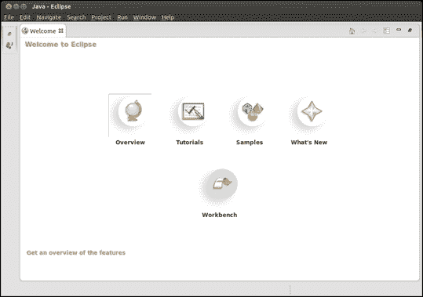

Eclipse 窗口

要初始化 Eclipse IDE，请执行以下步骤：

1.  选择**工作台**，您将进入空的工作台，可以在其中编写项目源代码。

1.  现在，通过**帮助**菜单导航并选择**安装新软件**。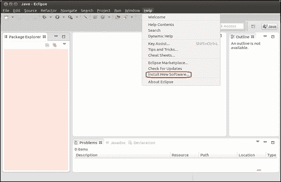

帮助菜单

1.  将打开一个新窗口，在**使用：**下拉菜单中，选择**Kepler - http://download.eclipse.org/releases/kepler**，如下图所示：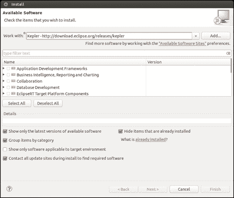

安装窗口

1.  展开**Linux 工具**部分，并选择**LTTng – Linux 跟踪工具包**框，如下截图所示：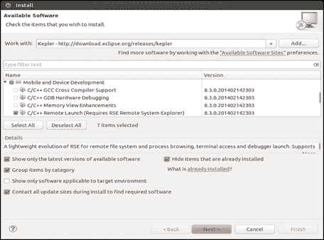

安装—LTTng – Linux 跟踪工具包框

1.  展开**移动和设备开发**部分，并选择以下内容：

+   **C/C++远程启动（需要 RSE 远程系统资源管理器）**

+   远程系统资源管理器终端用户运行时

+   远程系统资源管理器用户操作

+   目标管理终端

+   **TCF 远程系统资源管理器插件**

+   TCF 目标资源管理器

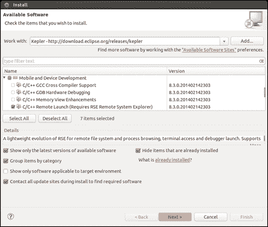

1.  展开**编程语言**部分，并选择以下内容：

+   C/C++ Autotools 支持

+   C/C++开发工具

如下截图所示：

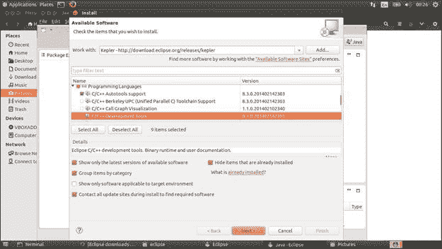

可用软件列表窗口

1.  在快速查看**安装详细信息**菜单并启用许可协议后完成安装：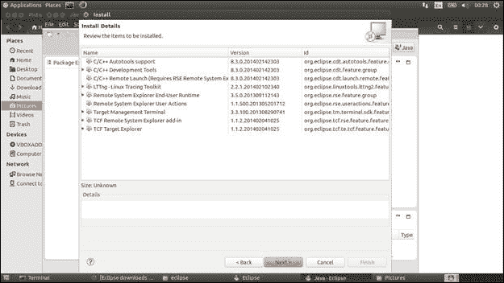

安装详细信息窗口

完成这些步骤后，可以将 Yocto 项目 Eclipse 插件安装到 IDE 中，但在重新启动 Eclipse IDE 之前，不能确保前述更改生效。配置阶段结束后的结果在此可见：

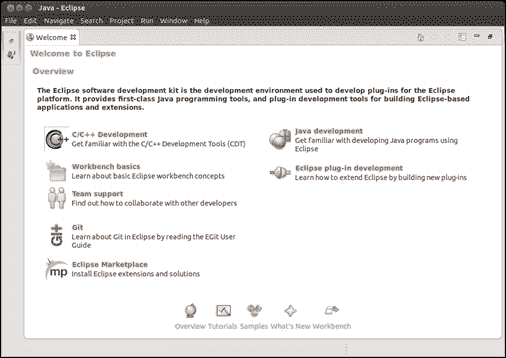

Eclipse—配置阶段结果

要安装 Yocto 项目的 Eclipse 插件，需要执行以下步骤：

1.  按照前面提到的方法启动 Eclipse IDE。

1.  如前面的配置所示，从**帮助**菜单中选择**安装新软件**选项。

1.  单击**添加**按钮，并在 URL 部分插入`downloads.yoctoproject.org/releases/eclipse-plugin/1.7/kepler/`。根据此处的指示为新的**Work with:**站点命名：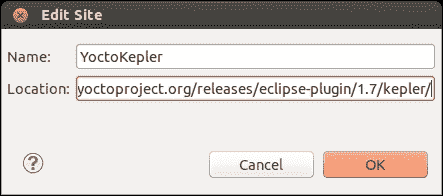

编辑站点窗口

1.  按下**OK**按钮并更新**Work with**站点后，会出现新的框。选择所有这些框，如此图所示，并单击**下一步**按钮：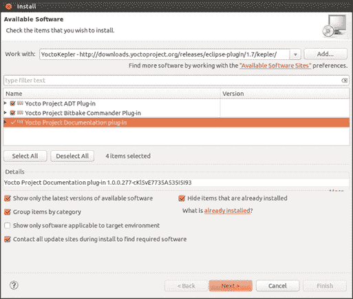

安装详细信息窗口

1.  最后一次查看已安装的组件，安装即将结束。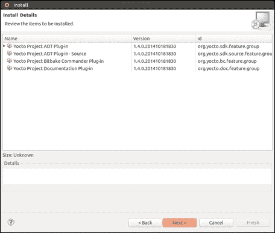

安装详细信息窗口

1.  如果出现此警告消息，请按**确定**并继续。它只是让您知道已安装的软件包具有未签名的内容。

安全警告窗口

只有在重新启动 Eclipse IDE 后更改才会生效，安装才算完成。

安装完成后，Yocto 插件可用并准备好进行配置。配置过程涉及设置特定于目标的选项和交叉编译器。对于每个特定的目标，需要相应地执行前述配置步骤。

通过从**窗口**菜单中选择**首选项**选项来完成配置过程。将打开一个新窗口，从中应选择**Yocto 项目 ADT**选项。更多细节可参见以下截图：

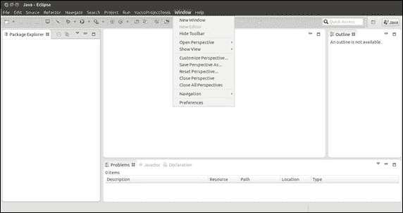

Eclipse IDE—首选项

接下来要做的事情涉及配置交叉编译器的可用选项。第一个选项是工具链类型，有两个选项可用，**独立预构建工具链**和**构建系统派生工具链**，默认选择后者。前者是指特定于已有现有内核和根文件系统的架构的工具链，因此开发的应用程序将手动在镜像中提供。但是，由于所有组件都是分开的，这一步并不是必需的。后者是指在 Yocto 项目构建目录中构建的工具链。

需要配置的下一个元素是工具链位置、`sysroot`位置和目标架构。**工具链根位置**用于定义工具链安装位置。例如，使用`adt_installer`脚本安装时，工具链将位于`/opt/poky/<release>`目录中。第二个参数**Sysroot 位置**表示目标设备根文件系统的位置。它可以在`/opt/poky/<release>`目录中找到，如前面的示例所示，或者如果使用其他方法生成它，则甚至可以在构建目录中找到。这一部分的第三个和最后一个选项由**目标架构**表示，它表示所使用或模拟的硬件类型。正如在窗口中所看到的，它是一个下拉菜单，用户可以选择所需的选项，并找到所有支持的架构列表。在所需架构在下拉菜单中不可用的情况下，将需要构建相应的架构镜像。

最后剩下的部分是目标特定选项。这指的是使用 QEMU 模拟架构或在外部可用的硬件上运行镜像的可能性。对于外部硬件，请使用需要选择的**外部硬件**选项以完成工作，但对于 QEMU 模拟，除了选择**QEMU**选项外，还有其他事情要做。在这种情况下，用户还需要指定**内核**和**自定义选项**。对于内核选择，过程很简单。如果选择了**独立预构建工具链**选项，它将位于预构建镜像位置，或者如果选择了**构建系统派生工具链**选项，则将位于`tmp/deploy/images/<machine-name>`目录中。对于第二个选项**自定义选项**参数，添加它的过程不会像前面的选项那样简单。

**自定义选项**字段需要填写各种选项，例如`kvm`、nographic、`publicvnc`或`serial`，它们表示模拟架构或其参数的主要选项。这些选项被保存在尖括号内，并包括参数，例如使用的内存（`-m 256`）、网络支持（`-net`）和全屏支持（`-full-screen`）。有关可用选项和参数的更多信息可以使用`man qemu`命令找到。在定义项目后，可以使用**更改 Yocto 项目设置**选项从**项目**菜单中覆盖所有前述配置。

要定义一个项目，需要执行以下步骤：

1.  从**文件** | **新建**菜单选项中选择**项目…**选项，如下所示：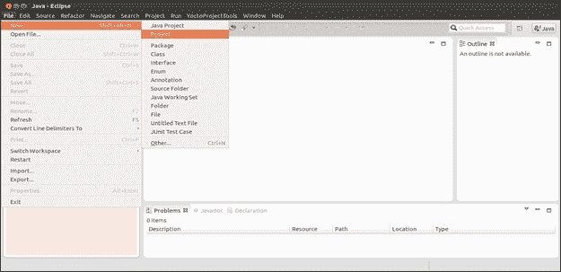

Eclipse IDE—项目

1.  从**C/C++**选项中选择**C 项目**。这将打开一个**C 项目**窗口：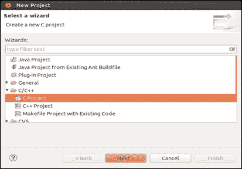

Eclipse IDE—新项目窗口

1.  在**C 项目**窗口中，有多个选项可用。让我们选择**Yocto 项目 ADT Autotools 项目**，然后选择**Hello World ANSI C Autotools 项目**选项。为新项目添加名称，我们准备进行下一步：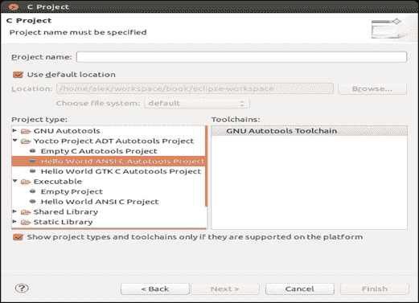

C 项目窗口

1.  在**C 项目**窗口中，您将被提示相应地添加**作者**、**版权声明**、**Hello world 问候**、**源**和**许可**字段的信息：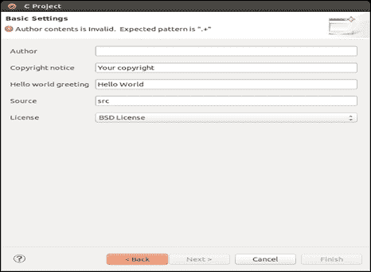

C 项目—基本设置窗口

1.  添加所有信息后，可以单击**完成**按钮。用户将在新的特定于**C/C++**的透视图中得到提示，该透视图特定于打开的项目，并且新创建的项目将出现在菜单的左侧。 

1.  创建项目并编写源代码后，要构建项目，请从**项目…**菜单中选择**构建项目**选项。

## QEMU 模拟器

QEMU 在 Yocto 项目中作为各种目标架构的虚拟化机器和仿真器使用。它非常有用，可以运行和测试各种 Yocto 生成的应用程序和映像，除了完成其他目的。在 Yocto 世界之外，它的主要用途也是 Yocto 项目的卖点，使其成为默认工具来模拟硬件。

### 注意

有关 QEMU 用例的更多信息，请访问[`www.yoctoproject.org/docs/1.7/adt-manual/adt-manual.html#the-qemu-emulator`](http://www.yoctoproject.org/docs/1.7/adt-manual/adt-manual.html#the-qemu-emulator)。

与 QEMU 仿真的交互是在 Eclipse 中完成的，如前所示。为此发生，需要适当的配置，如在前一节中所述。在这里启动 QEMU 仿真是使用“运行”菜单中的“外部工具”选项完成的。将为仿真器打开一个新窗口，并在传递相应的登录信息到提示后，shell 将可供用户交互。应用程序也可以在仿真器上部署和调试。

### 注意

有关 QEMU 交互的更多信息，请访问[`www.yoctoproject.org/docs/1.7/dev-manual/dev-manual.html#dev-manual-qemu`](http://www.yoctoproject.org/docs/1.7/dev-manual/dev-manual.html#dev-manual-qemu)。

## 调试

如果存在，还可以使用 QEMU 仿真器或实际目标硬件来调试应用程序。当项目配置时，将生成一个**C/C+远程应用程序**实例的运行/调试 Eclipse 配置，并且可以根据其名称找到，该名称符合`<project-name>_gdb_-<suffix>`的语法。例如，`TestProject_gdb_armv5te-poky-linux-gnueabi`可能是一个例子。

要连接到 Eclipse GDB 界面并启动远程目标调试过程，用户需要执行一些步骤：

1.  从“运行”|“调试配置”菜单中选择“C/C++远程应用程序”，并从左侧面板中的“C/C++远程应用程序”中选择运行/调试配置。

1.  从下拉列表中选择适当的连接。

1.  选择要部署的二进制应用程序。如果项目中有多个可执行文件，在按下“搜索项目”按钮后，Eclipse 将解析项目并提供所有可用二进制文件的列表。

1.  通过相应地设置“C/C++应用程序的远程绝对文件路径：”字段，输入应用程序将部署的绝对路径。

1.  在“调试器”选项卡中可以选择调试器选项。要调试共享库，需要进行一些额外的步骤：

+   从“源”选项卡中选择“添加”|“路径映射”选项，以确保调试配置中有路径映射可用。

+   从“调试/共享库”选项卡中选择“自动加载共享库符号”，并相应地指示共享库的路径。这个路径高度依赖于处理器的架构，所以非常小心地指定库文件。通常，对于 32 位架构，选择`lib`目录，对于 64 位架构，选择`lib64`目录。

+   在“参数”选项卡上，有可能在执行时向应用程序二进制文件传递各种参数。

1.  完成所有调试配置后，单击“应用”和“调试”按钮。将启动一个新的 GDB 会话，并打开“调试透视”。当调试器正在初始化时，Eclipse 将打开三个控制台：

+   一个名为之前描述的 GDB 二进制文件的 GDB 控制台，用于命令行交互

+   用于运行应用程序显示结果的远程 shell

+   一个名为二进制路径的本地机器控制台，在大多数情况下，不会被使用。它仍然是一个工件。

1.  在调试配置设置完成后，可以使用工具栏中的**调试**图标重新构建和执行应用程序。实际上，如果您只想运行和部署应用程序，可以使用**运行**图标。

## 性能分析和跟踪

在**Yocto 工具**菜单中，您可以看到用于跟踪和分析开发应用程序的支持工具。这些工具用于增强应用程序的各种属性，总的来说，是为了提高开发过程和体验。将介绍的工具包括 LTTng、Perf、LatencyTop、PerfTop、SystemTap 和 KGDB。

我们首先要看的是 LTTng Eclipse 插件，它提供了跟踪目标会话和分析结果的可能性。要开始使用该工具，首先需要进行快速配置，如下所示：

1.  从**窗口**菜单中选择**打开透视图**来开始跟踪透视图。

1.  从**文件** | **新建**菜单中选择**项目**来创建一个新的跟踪项目。

1.  从**窗口** | **显示视图** | **其他...** | **Lttng**菜单中选择**控制视图**。这将使您能够访问所有这些所需的操作：

+   创建一个新的连接

+   创建一个会话

+   开始/停止跟踪

+   启用事件

接下来，我们将介绍一个名为**Perf**的用户空间性能分析工具。它为多个线程和内核提供应用程序代码的统计分析和简单的 CPU 分析。为了做到这一点，它使用了许多性能计数器、动态探针或跟踪点。要使用 Eclipse 插件，需要远程连接到目标。可以通过 Perf 向导或使用**文件** | **新建** | **其他**菜单中的**远程系统资源管理器** | **连接**选项来完成。远程连接设置完成后，与该工具的交互与该工具的命令行支持相同。

**LatencyTop**是一个用于识别内核中可用延迟及其根本原因的应用程序。由于 ARM 内核的限制，此工具不适用于启用了**对称多处理**（**SMP**）支持的 ARM 内核。此应用程序还需要远程连接。远程连接设置完成后，与该工具的命令行支持相同。此应用程序是使用`sudo`从 Eclipse 插件运行的。

**PowerTop**用于测量电力消耗。它分析在 Linux 系统上运行的应用程序、内核选项和设备驱动程序，并估计它们的功耗。它非常有用，可以识别使用最多功率的组件。此应用程序需要远程连接。远程连接设置完成后，与该工具的命令行支持相同。此应用程序是使用-Eclipse 插件运行的，使用-d 选项在 Eclipse 窗口中显示输出。

**SystemTap**是一种工具，它可以使用脚本从运行中的 Linux 系统中获取结果。SystemTap 提供了一个自由软件（GPL）基础设施，用于简化通过跟踪所有内核调用来收集有关运行中 Linux 系统的信息。它与 Solaris 的 dtrace 非常相似，但与 dtrace 不同的是，它仍然不适用于生产系统。它使用类似于`awk`的语言，其脚本具有`.stp`扩展名。监视的数据可以被提取，并且可以对其进行各种过滤和复杂处理。Eclipse 插件使用`crosstap`脚本将`.stp`脚本转换为 C 语言，创建一个`Makefile`，运行 C 编译器以创建一个插入到目标内核的目标架构的内核模块，然后从内核中收集跟踪数据。要在 Eclipse 中启动 SystemTap 插件，需要遵循一些步骤。

1.  从**Yocto 项目工具**菜单中选择**systemtap**选项。

1.  在打开的窗口中，需要传递 crosstap 参数：

+   将**Metadata Location**变量设置为相应的`poky`目录

+   通过输入 root（默认选项）来设置**Remote User ID**，因为它对目标具有`ssh`访问权限-任何其他具有相同权限的用户也是一个不错的选择

+   将**Remote Host**变量设置为目标的相应 IP 地址

+   使用**Systemtap Scripts**变量来获取`.stp`脚本的完整路径

+   使用**Systemtap Args**字段设置额外的交叉选项

`.stp`脚本的输出应该在 Eclipse 的控制台视图中可用。

我们将要看的最后一个工具是**KGDB**。这个工具专门用于调试 Linux 内核，只有在 Eclipse IDE 内进行 Linux 内核源代码开发时才有用。要使用这个工具，需要进行一些必要的配置设置：

+   禁用 C/C++索引：

+   从**Window** | **Preferences**菜单中选择**C/C++ Indexer**选项

+   取消选择**Enable indexer**复选框

+   创建一个可以导入内核源代码的项目：

+   从**File** | **New**菜单中选择**C/C++** | **C Project**选项

+   选择**Makefile project** | **Empty project**选项，并为项目命名

+   取消选择**Use default location**选项

+   单击**Browse**按钮并标识内核源代码本地 git 存储库的位置

+   按下**Finish**按钮，项目应该已创建

在满足先决条件后，实际配置可以开始：

+   从**Run**菜单中选择**Debug Configuration**选项。

+   双击**GDB Hardware Debugging**选项以创建名为**<project name> Default**的默认配置。

+   从**Main**选项卡，浏览到`vmlinux`构建图像的位置，选择**Disable auto build**单选按钮，以及**GDB (DFS) Hardware Debugging Launcher**选项。

+   对于**Debugger**选项卡中可用的**C/C++ Application**选项，浏览工具链内可用的 GDB 二进制文件的位置（如果 ADT 安装程序脚本可用，则其默认位置应为`/opt/poky/1.7/sysroots/x86_64-pokysdk-linux/usr/bin/arm-poky-linux-gnueabi/arm-poky-linux-gnueabi-gdb`）。从**JTAG Device**菜单中选择**Generic serial option**。**Use remote target**选项是必需的。

+   从**Startup**选项卡，选择**Load symbols**选项。确保**Use Project binary**选项指示正确的`vmlinux`图像，并且未选择**Load image**选项。

+   按下**Apply**按钮以确保先前的配置已启用。

+   为串行通信调试准备目标：

+   设置`echo ttyS0,115200` | `/sys/module/kgdboc/parameters/kgdboc`选项以确保适当的设备用于调试

+   在`echo g` | `/proc/sysrq-trigger`目标上启动 KGDB

+   关闭目标终端但保持串行连接

+   从**Run**菜单中选择**Debug Configuration**选项

+   选择先前创建的配置，然后单击**Debug**按钮

按下**Debug**按钮后，调试会话应该开始，并且目标将在`kgdb_breakpoint()`函数中停止。从那里，所有特定于 GDB 的命令都可用并准备好使用。

## Yocto Project bitbake 指挥官

bitbake 指挥官提供了编辑配方和创建元数据项目的可能性，类似于命令行中可用的方式。两者之间的区别在于使用 Eclipse IDE 进行元数据交互。

为了确保用户能够执行这些操作，需要进行一些步骤：

+   从**File** | **New**菜单中选择**Project**选项

+   从打开的窗口中选择**Yocto Project BitBake Commander**向导

+   选择**New Yocto Project**选项，将打开一个新窗口来定义新项目的属性

+   使用**项目位置**，识别`poky`目录的父目录

+   使用**项目名称**选项定义项目名称。其默认值为 poky

+   对于**远程服务提供商**变量，选择**本地**选项，并在**连接名称**下拉列表中使用相同的选项

+   确保对已安装的`poky`源目录未选择**克隆**复选框

通过使用 Eclipse IDE，其功能可供使用。其中最有用的功能之一是快速搜索选项，对一些开发人员可能非常有用。其他好处包括使用模板创建配方的可能性，使用语法高亮、自动完成、实时错误报告等进行编辑，以及许多其他功能。

### 注意

使用 bitbake commander 仅限于本地连接。远程连接会导致 IDE 由于上游可用的错误而冻结。

# 摘要

在本章中，您了解了 Yocto 项目提供的 ADE 功能的信息，以及可用于应用程序开发的众多 Eclipse 插件，这不仅是一种替代方案，也是对连接到他们的 IDE 的开发人员的解决方案。尽管本章以介绍命令行爱好者的应用程序开发选项开始，但很快就变成了关于 IDE 交互的内容。这是因为需要提供替代解决方案，以便开发人员可以选择最适合他们需求的内容。

在下一章中，将介绍一些 Yocto 项目的组件。这一次，它们与应用程序开发无关，而涉及元数据交互、质量保证和持续集成服务。我将尝试展示 Yocto 项目的另一面，我相信这将帮助读者更好地了解 Yocto 项目，并最终与适合他们和他们需求的组件进行交互和贡献。
