# 第八章：Hob，Toaster 和 Autobuilder

在本章中，您将被介绍 Yocto 社区中使用的新工具和组件。正如标题所示，本章专门介绍另一类工具。我将从 Hob 作为图形界面开始，它正在逐渐消失，并将被一个名为 Toaster 的新网络界面所取代。本章还将介绍一个新的讨论点。在这里，我指的是 QA 和测试组件，在大多数情况下，它是缺失或不足的。Yocto 非常重视这个问题，并为其提供了解决方案。这个解决方案将在本章的最后一节中介绍。

您还将获得有关 Hob，Toaster 和 Autobuilder 等组件的更详细的介绍。将分别评估这些组件，并详细查看它们的优势和用例。对于前两个组件（即 Hob 和 Toaster），提供了有关构建过程的信息以及各种设置方案。Hob 类似于 BitBake，并与 Poky 和构建目录紧密集成。另一方面，Toaster 是一个更松散的替代方案，提供多种配置选择和设置，并且性能部分对于任何有兴趣改进构建系统整体性能的开发人员非常有用。本章以 Autobuilder 部分结束。该项目是 Yocto 项目的基石，致力于使嵌入式开发和开源更加用户友好，但也提供了更安全和无错误的项目。希望您喜欢本章；让我们继续到第一节。

# Hob

Hob 项目代表了 BitBake 构建系统的图形界面替代方案。它的目的是以更简单更快的方式执行最常见的任务，但并不会消除命令行交互。这是因为大多数配方和配置的部分仍然需要手动完成。在上一章中，引入了 BitBake Commander 扩展作为编辑配方的替代解决方案，但在这个项目中，它有其局限性。

Hob 的主要目的是使用户更容易地与构建系统进行交互。当然，有些用户不喜欢图形用户界面的替代方案，而更喜欢命令行选项，我有点同意他们，但这是另一个讨论。Hob 也可以是他们的选择；它不仅是为那些喜欢在面前有界面的人提供的选择，也是为那些喜欢他们的命令行交互的人提供的选择。

Hob 除了最常见的任务外，可能无法执行很多任务，例如构建图像，修改现有的配方，通过 QEMU 模拟器运行图像，甚至在目标设备上将其部署到 USB 设备以进行一些现场引导操作。拥有所有这些功能并不多，但非常有趣。您在 Yocto Project 中使用工具的经验在这里并不重要。前面提到的任务可以非常轻松和直观地完成，这是 Hob 最有趣的地方。它以非常简单的方式为用户提供所需的功能。与之交互的人可以从它所提供的教训中学到东西，无论他们是图形界面爱好者还是命令行专家。

在本章中，我将向您展示如何使用 Hob 项目构建 Linux 操作系统图像。为了演示这一点，我将使用 Atmel SAMA5D3 Xplained 机器，这也是我在前几章中进行其他演示时使用的机器。

首先，让我们看看当您第一次启动 Hob 时它是什么样子。结果显示在以下截图中：

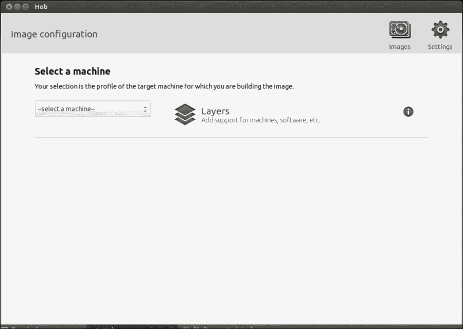

要检索图形界面，用户需要执行 BitBake 命令行交互所需的给定步骤。首先，需要创建一个构建目录，并从该构建目录开始，用户需要使用以下 Hob 命令启动 Hob 图形界面：

```
source poky/oe-init-build-env ../build-test
hob

```

下一步是确定构建所需的层。您可以通过在**层**窗口中选择它们来完成。对于`meta-atmel`层的第一步是将其添加到构建中。尽管您可能在已经存在的构建目录中开始工作，但 Hob 将无法检索现有的配置，并将在`bblayers.conf`和`local.conf`配置文件上创建一个新的配置。它将使用下一个`#added by hob`消息标记添加的行。

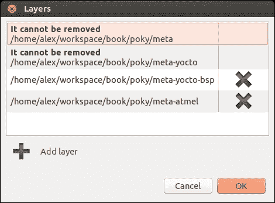

在构建目录中添加了相应的`meta-atmel`层之后，所有支持的机器都可以在**选择机器**下拉菜单中找到，包括`meta-atmel`层添加的机器。从可用选项中，需要选择**sama5d3-xplained**机器：

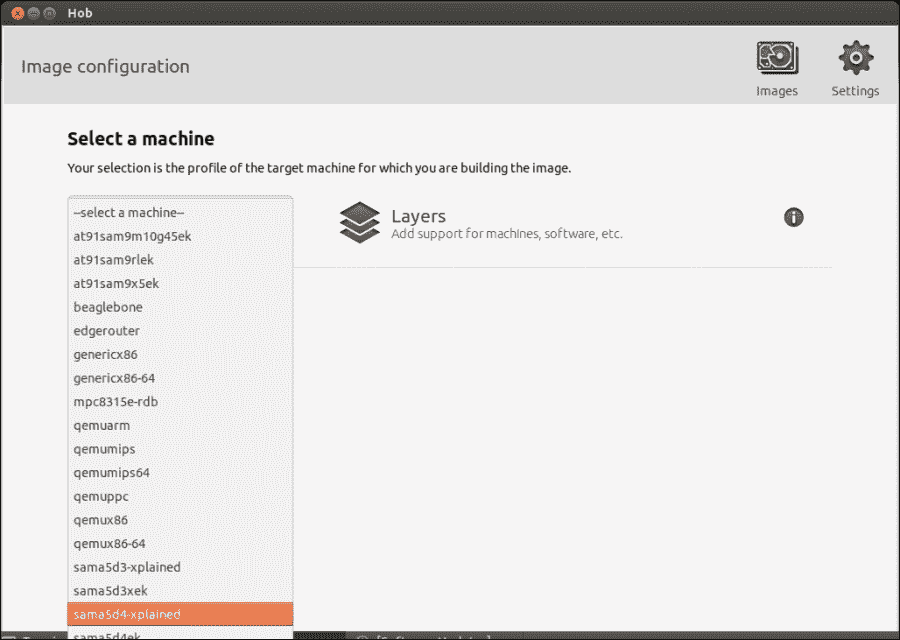

当选择 Atmel **sama5d3-xplained**机器时，会出现如下截图所示的错误：

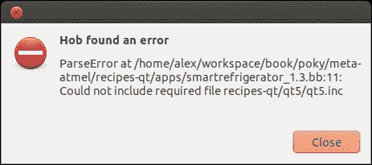

在将`meta-qt5`层添加到层部分后，此错误消失，构建过程可以继续。要检索`meta-qt5`层，需要以下`git`命令：

```
git clone -b dizzy https://github.com/meta-qt5/meta-qt5.git

```

由于所有可用的配置文件和配方都被解析，解析过程需要一段时间，之后您会看到如下截图所示的错误：

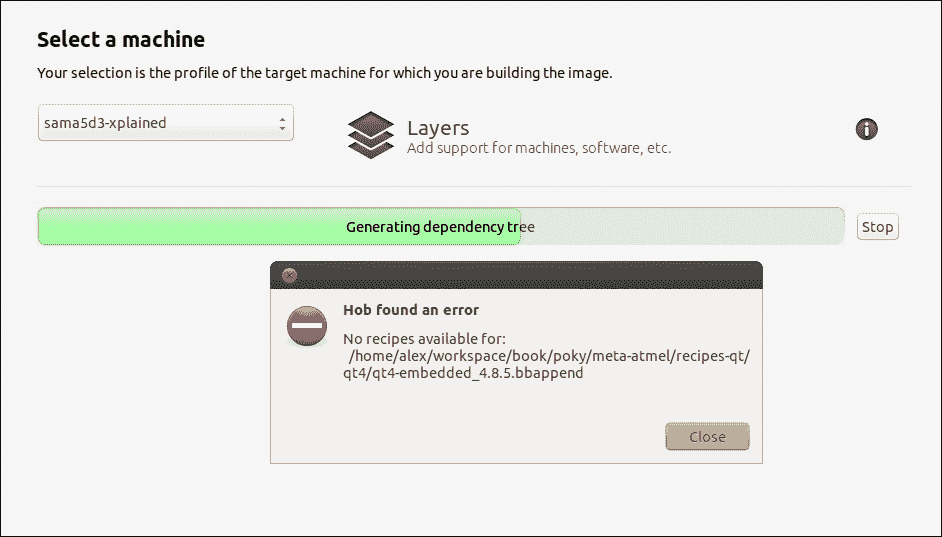

经过快速检查后，您会看到以下代码：

```
find ../ -name "qt4-embedded*"
./meta/recipes-qt/qt4/qt4-embedded_4.8.6.bb
./meta/recipes-qt/qt4/qt4-embedded.inc
./meta-atmel/recipes-qt/qt4/qt4-embedded-4.8.5
./meta-atmel/recipes-qt/qt4/qt4-embedded_4.8.5.bbappend

```

唯一的解释是`meta-atmel`层没有更新其配方，而是附加它们。这可以通过两种方式克服。最简单的方法是更新`.bbappend`文件的配方，并确保新的可用配方被转换为上游社区的补丁。稍后将向您解释在`meta-atmel`层内具有所需更改的补丁，但首先，我将介绍可用的选项和解决构建过程中存在的问题所需的必要更改。

另一个解决方案是包含`meta-atmel`在构建过程中所需的必要配方。最好的地方也将其放在`meta-atmel`中。然而，在这种情况下，`.bbappend`配置文件应与配方合并，因为在同一位置拥有配方及其附加文件并不太合理。

在解决了这个问题之后，用户将可以看到新的选项，如下截图所示：

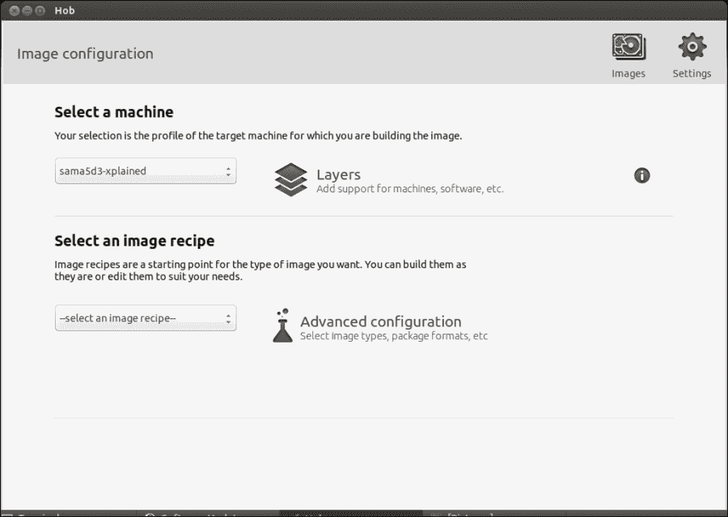

现在，用户有机会选择需要构建的镜像，以及需要添加的额外配置。这些配置包括：

+   选择分发类型

+   选择镜像类型

+   打包格式

+   根文件系统周围的其他小调整

其中一些如下图所示：

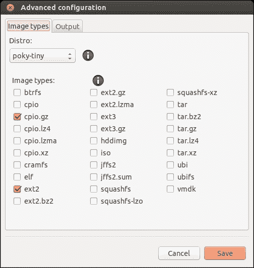

我选择将分发类型从**poky-tiny**更改为**poky**，并且生成的根文件系统输出格式可在下图中看到：

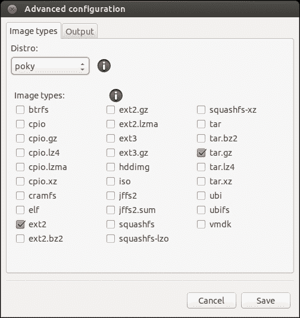

经过调整后，配方被重新解析，当此过程完成后，可以选择生成的镜像，从而开始构建过程。此演示中选择的镜像是**atmel-xplained-demo-image**镜像，与同名的配方相对应。这些信息也显示在下图中：

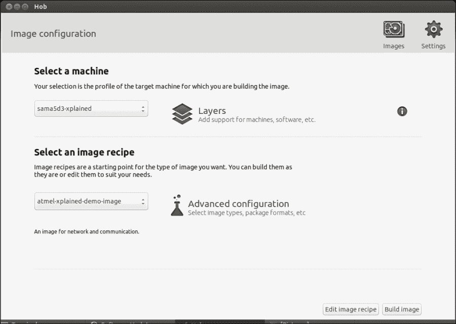

点击**构建镜像**按钮开始构建过程。构建开始后一段时间，将出现一个错误，告诉我们**meta-atmel**BSP 层需要我们定义更多的依赖项：

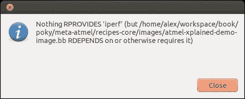

这些信息是从`iperf`配方中收集的，该配方不在包含的层中；它在`meta-openembedded/meta-oe`层内可用。在进行更详细的搜索和更新过程后，有一些发现。`meta-atmel` BSP 层需要的层依赖关系比所需的更多，如下所示：

+   `meta-openembedded/meta-oe`层

+   `meta-openembedded/meta-networking`层

+   `meta-openembedded/meta-ruby`层

+   `meta-openembedded/meta-python`层

+   `meta-qt5`层

最终结果可在`bblayers.conf`文件中找到的`BBLAYERS`变量中找到，如下所示：

```
#added by hob
BBFILES += "${TOPDIR}/recipes/images/custom/*.bb"
#added by hob
BBFILES += "${TOPDIR}/recipes/images/*.bb"

#added by hob
BBLAYERS = "/home/alex/workspace/book/poky/meta /home/alex/workspace/book/poky/meta-yocto /home/alex/workspace/book/poky/meta-yocto-bsp /home/alex/workspace/book/poky/meta-atmel /home/alex/workspace/book/poky/meta-qt5 /home/alex/workspace/book/poky/meta-openembedded/meta-oe /home/alex/workspace/book/poky/meta-openembedded/meta-networking /home/alex/workspace/book/poky/meta-openembedded/meta-ruby /home/alex/workspace/book/poky/meta-openembedded/meta-python"
```

在开始完整构建之前，`meta-atmel`层中需要进行一些必要的更改，如下所示：

+   用`packagegroup-core-full-cmdline`替换`packagegroup-core-basic`，因为最新的 Poky 已更新了`packagegroup`名称。

+   删除`python-setuptools`，因为它在`meta-openembedded/meta-oe`层中不再可用，也不在新的`meta-openembedded/meta-python`层中，后者是所有与 Python 相关的配方的新占位符。`python-setuptools`工具被删除，因为它具有下载、构建、安装、升级和卸载额外 Python 软件包的能力，并且不是 Yocto 的强制要求。这是它的一般目的。

+   关于更新到`qt4-embedded-4.8.6`的前述更改，出现了错误。

`meta-atmel`层的所有更改都包含在以下补丁中：

```
From 35ccf73396da33a641f307f85e6b92d5451dc255 Mon Sep 17 00:00:00 2001
From: "Alexandru.Vaduva" <vaduva.jan.alexandru@gmail.com>
Date: Sat, 31 Jan 2015 23:07:49 +0200
Subject: [meta-atmel][PATCH] Update suppport for atmel-xplained-demo-image
 image.

The latest poky contains updates regarding the qt4 version support
and also the packagegroup naming.
Removed packages which are no longer available.

Signed-off-by: Alexandru.Vaduva <vaduva.jan.alexandru@gmail.com>
---
 recipes-core/images/atmel-demo-image.inc           |  3 +--
 ...qt-embedded-linux-4.8.4-phonon-colors-fix.patch | 26 ----------------------
 ...qt-embedded-linux-4.8.4-phonon-colors-fix.patch | 26 ++++++++++++++++++++++
 recipes-qt/qt4/qt4-embedded_4.8.5.bbappend         |  2 --
 recipes-qt/qt4/qt4-embedded_4.8.6.bbappend         |  2 ++
 5 files changed, 29 insertions(+), 30 deletions(-)
 delete mode 100644 recipes-qt/qt4/qt4-embedded-4.8.5/qt-embedded-linux-4.8.4-phonon-colors-fix.patch
 create mode 100644 recipes-qt/qt4/qt4-embedded-4.8.6/qt-embedded-linux-4.8.4-phonon-colors-fix.patch
 delete mode 100644 recipes-qt/qt4/qt4-embedded_4.8.5.bbappend
 create mode 100644 recipes-qt/qt4/qt4-embedded_4.8.6.bbappend

diff --git a/recipes-core/images/atmel-demo-image.inc b/recipes-core/images/atmel-demo-image.inc
index fe13303..a019586 100644
--- a/recipes-core/images/atmel-demo-image.inc
+++ b/recipes-core/images/atmel-demo-image.inc
@@ -2,7 +2,7 @@ IMAGE_FEATURES += "ssh-server-openssh package-management"

 IMAGE_INSTALL = "\
     packagegroup-core-boot \
-    packagegroup-core-basic \
+    packagegroup-core-full-cmdline \
     packagegroup-base-wifi \
     packagegroup-base-bluetooth \
     packagegroup-base-usbgadget \
@@ -23,7 +23,6 @@ IMAGE_INSTALL = "\
     python-smbus \
     python-ctypes \
     python-pip \
-    python-setuptools \
     python-pycurl \
     gdbserver \
     usbutils \
diff --git a/recipes-qt/qt4/qt4-embedded-4.8.5/qt-embedded-linux-4.8.4-phonon-colors-fix.patch b/recipes-qt/qt4/qt4-embedded-4.8.5/qt-embedded-linux-4.8.4-phonon-colors-fix.patch
deleted file mode 100644
index 0624eef..0000000
--- a/recipes-qt/qt4/qt4-embedded-4.8.5/qt-embedded-linux-4.8.4-phonon-colors-fix.patch
+++ /dev/null
@@ -1,26 +0,0 @@
-diff --git a/src/3rdparty/phonon/gstreamer/qwidgetvideosink.cpp b/src/3rdparty/phonon/gstreamer/qwidgetvideosink.cpp
-index 89d5a9d..8508001 100644
---- a/src/3rdparty/phonon/gstreamer/qwidgetvideosink.cpp
-+++ b/src/3rdparty/phonon/gstreamer/qwidgetvideosink.cpp
-@@ -18,6 +18,7 @@
- #include <QApplication>
- #include "videowidget.h"
- #include "qwidgetvideosink.h"
-+#include <gst/video/video.h>
-
- QT_BEGIN_NAMESPACE
-
-@@ -106,11 +107,7 @@ static GstStaticPadTemplate template_factory_rgb =-     GST_STATIC_PAD_TEMPLATE("sink",- GST_PAD_SINK,
-                             GST_PAD_ALWAYS,
--                            GST_STATIC_CAPS("video/x-raw-rgb, "
--                                            "framerate = (fraction) [ 0, MAX ], "
--                                            "width = (int) [ 1, MAX ], "
--                                            "height = (int) [ 1, MAX ],"
--                                            "bpp = (int) 32"));
-+                            GST_STATIC_CAPS(GST_VIDEO_CAPS_xRGB_HOST_ENDIAN));
-
- template <VideoFormat FMT>
- struct template_factory;
-
diff --git a/recipes-qt/qt4/qt4-embedded-4.8.6/qt-embedded-linux-4.8.4-phonon-colors-fix.patch b/recipes-qt/qt4/qt4-embedded-4.8.6/qt-embedded-linux-4.8.4-phonon-colors-fix.patch
new file mode 100644
index 0000000..0624eef
--- /dev/null
+++ b/recipes-qt/qt4/qt4-embedded-4.8.6/qt-embedded-linux-4.8.4-phonon-colors-fix.patch
@@ -0,0 +1,26 @@
+diff --git a/src/3rdparty/phonon/gstreamer/qwidgetvideosink.cpp b/src/3rdparty/phonon/gstreamer/qwidgetvideosink.cpp
+index 89d5a9d..8508001 100644
+--- a/src/3rdparty/phonon/gstreamer/qwidgetvideosink.cpp
++++ b/src/3rdparty/phonon/gstreamer/qwidgetvideosink.cpp
+@@ -18,6 +18,7 @@
+ #include <QApplication>
+ #include "videowidget.h"
+ #include "qwidgetvideosink.h"
++#include <gst/video/video.h>
+
+ QT_BEGIN_NAMESPACE
+
+@@ -106,11 +107,7 @@ static GstStaticPadTemplate template_factory_rgb =+     GST_STATIC_PAD_TEMPLATE("sink",+ GST_PAD_SINK,+ GST_PAD_ALWAYS,+- GST_STATIC_CAPS("video/x-raw-rgb, "+-                                            "framerate = (fraction) [ 0, MAX ], "
+-                                            "width = (int) [ 1, MAX ], "
+-                                            "height = (int) [ 1, MAX ],"
+-                                            "bpp = (int) 32"));
++                            GST_STATIC_CAPS(GST_VIDEO_CAPS_xRGB_HOST_ENDIAN));
+
+ template <VideoFormat FMT>
+ struct template_factory;
+
diff --git a/recipes-qt/qt4/qt4-embedded_4.8.5.bbappend b/recipes-qt/qt4/qt4-embedded_4.8.5.bbappend
deleted file mode 100644
index bbb4d26..0000000
--- a/recipes-qt/qt4/qt4-embedded_4.8.5.bbappend
+++ /dev/null
@@ -1,2 +0,0 @@
-FILESEXTRAPATHS_prepend := "${THISDIR}/${PN}-${PV}:"
-SRC_URI += "file://qt-embedded-linux-4.8.4-phonon-colors-fix.patch"
diff --git a/recipes-qt/qt4/qt4-embedded_4.8.6.bbappend b/recipes-qt/qt4/qt4-embedded_4.8.6.bbappend
new file mode 100644
index 0000000..bbb4d26
--- /dev/null
+++ b/recipes-qt/qt4/qt4-embedded_4.8.6.bbappend
@@ -0,0 +1,2 @@
+FILESEXTRAPATHS_prepend := "${THISDIR}/${PN}-${PV}:"
+SRC_URI += "file://qt-embedded-linux-4.8.4-phonon-colors-fix.patch"
-- 
1.9.1
```

这个补丁在本章中作为 Git 交互的一个示例，并且在创建需要上游到社区的补丁时是必需的。在撰写本章时，这个补丁尚未发布到上游社区，因此这可能是一个礼物，供有兴趣向 meta-atmel 社区特别是 Yocto 社区添加贡献的人使用。

在更改完成后获得此补丁所需的步骤被简要描述。它定义了生成补丁所需的步骤，如下命令所示，即`0001-Update-suppport-for-atmel-xplained-demo-image-image.patch`。可以通过`README`文件和`git send-email`命令将其上游到社区或直接发送给`meta-atmel`层的维护者：

```
git status 
git add --all .
git commit -s
git fetch -a
git rebase -i origin/master 
git format-patch -s --subject-prefix='meta-atmel]PATCH' origin/master
vim 0001-Update-suppport-for-atmel-xplained-demo-image-image.patch

```

# Toaster

Toaster 是 Hob 的替代品，在某个特定时间点将完全取代它。它还是 BitBake 命令行的基于 Web 的界面。这个工具比 Hob 更有效；它不仅能够以与 Hob 类似的方式执行最常见的任务，而且还包括一个构建分析组件，收集有关构建过程和结果的数据。这些结果以非常易于理解的方式呈现，提供了搜索、浏览和查询信息的机会。

从收集的信息中，我们可以提到以下内容：

+   图像目录的结构

+   可用的构建配置

+   构建的结果以及注册的错误和警告

+   图像配方中存在的软件包

+   构建的配方和软件包

+   执行的任务

+   有关执行任务的性能数据，如 CPU 使用率、时间和磁盘 I/O 使用情况

+   配方的依赖关系和反向依赖关系

Hob 解决方案也存在一些缺点。Toaster 目前还不能配置和启动构建。但是，已经采取了措施将 Hob 内的这些功能包含在 Toaster 中，这将在不久的将来实现。

Toaster 项目的当前状态允许在各种设置和运行模式下执行。每个都将被呈现并相应地定义如下：

+   **交互模式**：这是在 Yocto Project 1.6 版本中提供的模式。它基于`toasterui`构建记录组件和`toastergui`构建检查和统计用户界面。

+   **管理模式**：除了 Yocto Project 1.6 版本之外，这是处理从 Web 界面触发的构建配置、调度和执行的模式。

+   **远程管理模式**：这是托斯特主机模式，用于生产环境，因为它支持多个用户和定制安装。

+   **本地管理模式或** **_ 本地 _ 模式**：这是在 Poky 检出后可用的模式，允许使用本地机器代码和构建目录进行构建。这也是任何第一次与 Toaster 项目交互的人使用的模式。

+   对于**交互模式**，需要与 Yocto Project 构建运行的硬件分开设置，例如使用 AutoBuilder、BuildBot 或 Jenkins 等工具进行构建。在普通的 Toaster 实例后面，有三件事情发生：

+   启动 BitBake 服务器

+   启动 Toaster UI，并连接到 BitBake 服务器以及 SQL 数据库。

+   启动 Web 服务器是为了读取与数据库相关的信息，并在 Web 界面上显示它

有时会出现多个 Toaster 实例在多台远程机器上运行的情况，或者单个 Toaster 实例在多个用户和构建服务器之间共享的情况。所有这些情况都可以通过修改 Toaster 启动的模式以及相应地更改 SQL 数据库和 Web 服务器的位置来解决。通过拥有一个共同的 SQL 数据库、Web 服务器和多个 BitBake 服务器，以及每个单独的构建目录的 Toaster 用户界面，可以解决前面提到的问题。因此，Toaster 实例中的每个组件都可以在不同的机器上运行，只要适当进行通信并且各组件了解彼此。

要在 Ubuntu 机器上设置 SQL 服务器，需要安装一个软件包，使用以下命令：

```
apt-get install mysgl-server

```

拥有必要的软件包还不够，还需要设置它们。因此，需要适当的用户名和密码来访问 Web 服务器，以及 MySQL 帐户的适当管理权限。此外，还需要 Toaster 主分支的克隆用于 Web 服务器，源代码可用后，请确保在`bitbake/lib/toaster/toastermain/settings.py`文件中，`DATABASES`变量指示了先前设置的数据库。确保使用为其定义的用户名和密码。

设置完成后，可以按以下方式开始数据库同步：

```
python bitbake/lib/toaster/manage.py syncdb
python bitbake/lib/toaster/manage.py migrate orm
python bitbake/lib/toaster/manage.py migrate bldcontrol

```

现在，可以使用`python bitbake/lib/toaster/manage.py runserver`命令启动 Web 服务器。对于后台执行，可以使用`nohup python bitbake/lib/toaster/manage.py runserver 2>toaster_web.log >toaster_web.log &`命令。

这可能足够作为起步，但由于构建需要案例日志，因此需要一些额外的设置。在`bitbake/lib/toaster/toastermain/settings.py`文件中，`DATABASES`变量指示用于日志服务器的 SQL 数据库。在构建目录中，调用`source toaster start`命令，并确保`conf/toaster.conf`文件可用。在此文件中，请确保启用了 Toaster 和构建历史`bbclasses`，以记录有关软件包的信息：

```
INHERIT += "toaster"
INHERIT += "buildhistory"
BUILDHISTORY_COMMIT = "1"

```

设置完成后，使用以下命令启动 BitBake 服务器和日志界面：

```
bitbake --postread conf/toaster.conf --server-only -t xmlrpc -B localhost:0 && export BBSERVER=localhost:-1
nohup bitbake --observe-only -u toasterui >toaster_ui.log &

```

完成后，可以启动正常的构建过程，并且在构建在 Web 界面内运行时，日志和数据可供检查。不过，要注意一点：在完成在构建目录内的工作后，不要忘记使用`bitbake –m`命令关闭 BitBake 服务器。

本地与迄今为止介绍的 Yocto Project 构建非常相似。这是个人使用和学习与工具交互的最佳模式。在开始设置过程之前，需要安装一些软件包，使用以下命令行：

```
sudo apt-get install python-pip python-dev build-essential 
sudo pip install --upgrade pip 
sudo pip install --upgrade virtualenv

```

安装了这些软件包后，请确保安装烤面包机所需的组件；在这里，我指的是 Django 和 South 软件包：

```
sudo pip install django==1.6
sudo pip install South==0.8.4

```

与 Web 服务器交互时，需要`8000`和`8200`端口，因此请确保它们没有被其他交互预留。考虑到这一点，我们可以开始与烤面包机交互。使用前几章节中提供的下载中可用的 Poky 构建目录，调用`oe-init-build-env`脚本创建一个新的构建目录。这可以在已经存在的构建目录上完成，但有一个新的构建目录将有助于识别可用于与烤面包机交互的额外配置文件。

根据您的需求设置构建目录后，应调用`source toaster start`命令，如前所述，启动烤面包机。在`http://localhost:8000`上，如果没有执行构建，您将看到以下屏幕截图：

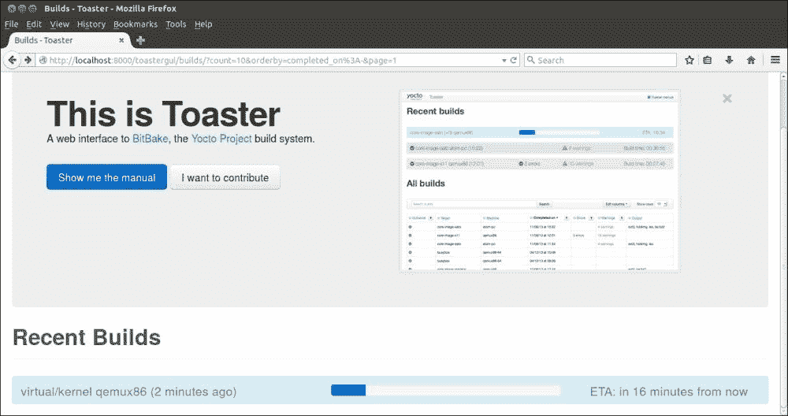

构建完成后，Web 界面将相应地更新。我关闭了标题图像和信息，以确保在 Web 页面中只有构建可见。

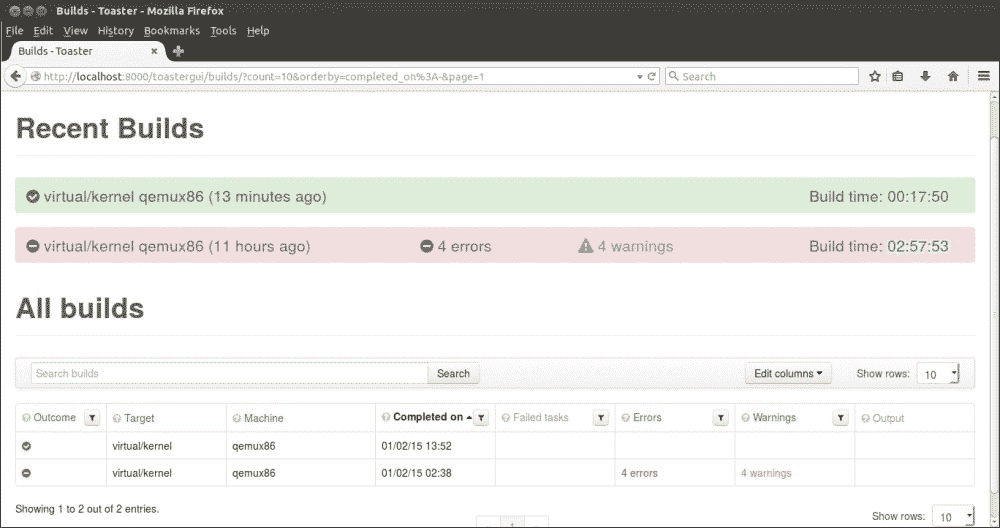

如前面的例子所示，在前面的屏幕截图中有两个已完成的构建。它们都是内核构建。第一个成功完成，而第二个有一些错误和警告。我这样做是为了向用户展示他们构建的替代输出。

由于主机机器上的内存和空间不足，导致构建失败，如下面的屏幕截图所示：

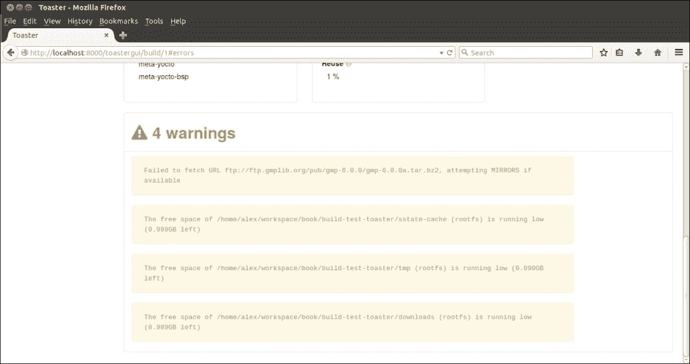

对于失败的构建，有一个详细的失败报告可用，如下面的屏幕截图所示：

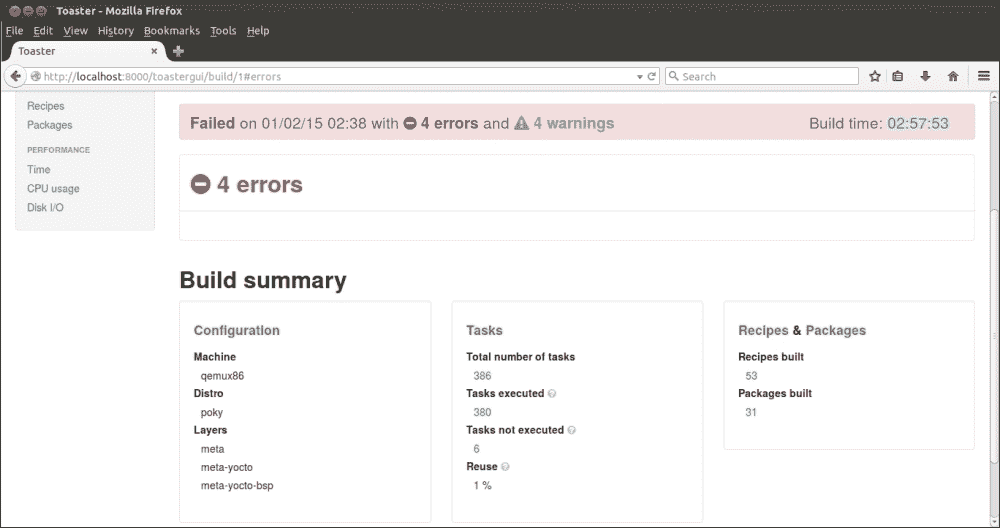

成功完成的构建提供了大量信息的访问。以下屏幕截图显示了构建应该具有的有趣功能。对于内核构建，它显示了使用的所有 BitBake 变量、它们的值、它们的位置和简短描述。这些信息对所有开发人员都非常有用，不仅因为它在一个位置提供了所有这些信息，而且因为它提供了一个减少寻找麻烦变量所需的搜索时间的搜索选项：

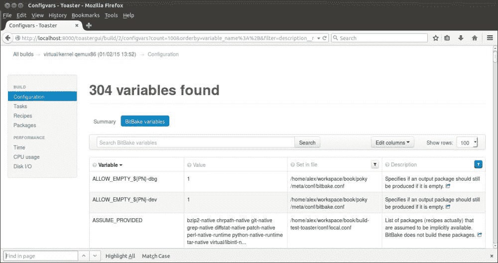

在执行活动完成后，可以使用`source toaster stop`命令停止烤面包机。

在构建目录中，烤面包机创建了许多文件；它们的命名和目的在以下行中介绍：

+   `bitbake-cookerdaemon.log`：这个日志文件对于 BitBake 服务器是必要的

+   `.toastermain.pid`：这是包含 Web 服务器`pid`的文件

+   `.toasterui.pid`：它包含 DSI 数据桥，`pid`

+   `toaster.sqlite`：这是数据库文件

+   `toaster_web.log`：这是 Web 服务器日志文件

+   `toaster_ui.log`：这是用户界面组件使用的日志文件

提到了所有这些因素，让我们转到下一个组件，但在提供有关烤面包机的一些有趣视频链接之前。

### 注意

有关烤面包机手册 1.7 的信息可在[`www.yoctoproject.org/documentation/toaster-manual-17`](https://www.yoctoproject.org/documentation/toaster-manual-17)上访问。

# 自动构建器

Autobuilder 是负责 QA 的项目，在 Yocto Project 内部提供了一个测试构建。它基于 BuildBot 项目。虽然这本书没有涉及这个主题，但对于那些对 BuildBot 项目感兴趣的人，可以在以下信息框中找到更多信息。

### 注意

Buildbot 的起始页面可以在[`trac.buildbot.net/`](http://trac.buildbot.net/)上访问。您可以在[`docs.buildbot.net/0.8.5/tutorial/tour.html`](http://docs.buildbot.net/0.8.5/tutorial/tour.html)找到有关快速启动 BuildBot 的指南，其概念可以在[`docs.buildbot.net/latest/manual/concepts.html`](http://docs.buildbot.net/latest/manual/concepts.html)找到。

我们现在要讨论的是一个在一般开发人员中受到非常糟糕对待的软件领域。我指的是开发过程的测试和质量保证。事实上，这是一个需要我们更多关注的领域，包括我自己在内。Yocto Project 通过 AutoBuilder 倡议试图引起更多对这一领域的关注。此外，在过去几年中，开源项目的 QA 和持续集成（CI）出现了转变，这主要可以在 Linux Foundation 的伞下项目中看到。

Yocto Project 积极参与 AutoBuilder 项目的以下活动：

+   使用 Bugzilla 测试用例和计划发布测试和 QA 计划([`bugzilla.yoctoproject.org`](https://bugzilla.yoctoproject.org))。

+   展示这些计划并使它们对所有人可见。当然，为此，您将需要相应的帐户。

+   为所有人开发工具、测试和 QA 程序。

在上述活动作为基础的基础上，他们提供了对 Poky 主分支当前状态的公共 AutoBuilder 的访问。每晚为所有支持的目标和架构执行构建和测试集，并且所有人都可以在[`autobuilder.yoctoproject.org/`](http://autobuilder.yoctoproject.org/)上找到。

### 注意

如果您没有 Bugzilla 帐户来访问 Yocto Project 内部完成的 QA 活动，请参阅[`wiki.yoctoproject.org/wiki/QA`](https://wiki.yoctoproject.org/wiki/QA)。

与 AutoBuilder 项目互动，设置在`README-QUICKSTART`文件中定义为一个四步程序：

```
cat README-QUICKSTART 
Setting up yocto-autobuilder in four easy steps:
------------------------------------------------
git clone git://git.yoctoproject.org/yocto-autobuilder
cd yocto-autobuilder
. ./yocto-autobuilder-setup
yocto-start-autobuilder both
```

该项目的配置文件位于`config`目录中。`autobuilder.conf`文件用于定义项目的参数，例如`DL_DIR`，`SSTATE_DIR`，以及其他构建工件对于生产设置非常有用，但对于本地设置则不太有用。要检查的下一个配置文件是`yoctoABConfig.py`，它位于`yocto-controller`目录中，用于定义执行构建的属性。

此时，AutoBuilder 应该正在运行。如果它在 Web 界面内启动，结果应该类似于以下截图：

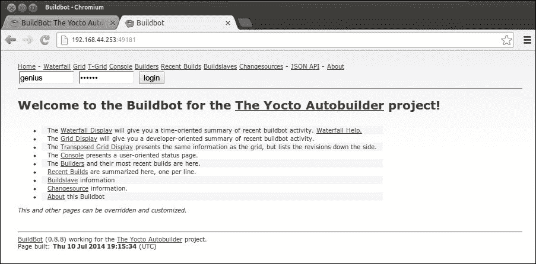

从网页标题中可以看出，不仅可以执行构建，还可以以不同的视图和角度查看它们。以下是其中一种可视化视角：

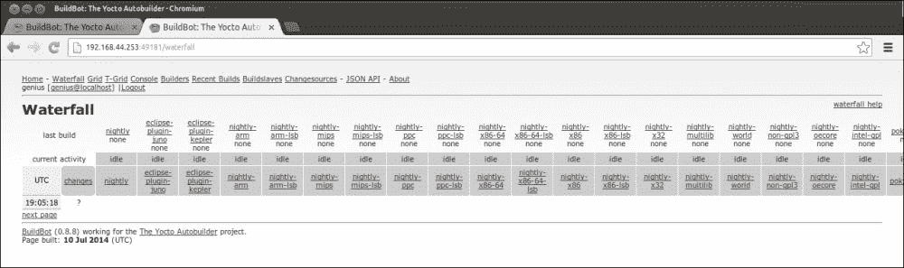

这个项目对其用户有更多的提供，但我会让其余的通过试验和阅读 README 文件来发现。请记住，这个项目是基于 Buildbot 构建的，因此工作流程与它非常相似。

# 总结

在本章中，您将了解到 Yocto Project 中提供的一组新组件。在这里，我指的是 Hob、Toaster 和 AutoBuilder 项目。本章首先介绍了 Hob 作为 BitBake 的替代方案。接着介绍了 Toaster 作为 Hob 的替代方案，它也具有许多有趣的功能，尽管现在还不是最好的，但随着时间的推移，它将成为开发人员的真正解决方案，他们不想学习新技术，而是只需与工具交互，以快速简便的方式获得他们想要的东西。本章最后介绍了 AutoBuilder 项目，为 Yocto Project 社区提供了一个质量保证和测试平台，并可以转变为一个持续集成工具。

在下一章中，将介绍一些其他工具，但这次重点将稍微转向社区以及其小工具的外部。我们还将涵盖项目和工具，例如 Swabber，这是一个不断发展的项目。我们还将看看 Wic，一个性格鲜明的小工具，以及来自 Linaro 的新感觉 LAVA。希望您喜欢学习它们。
