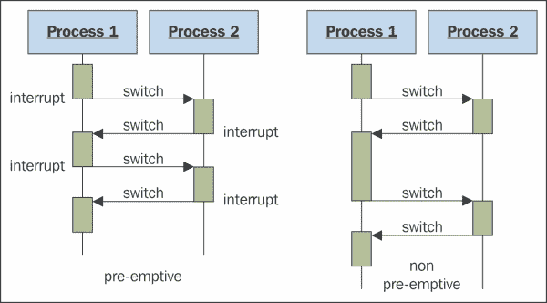
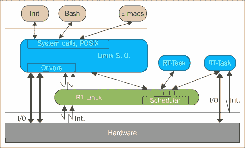
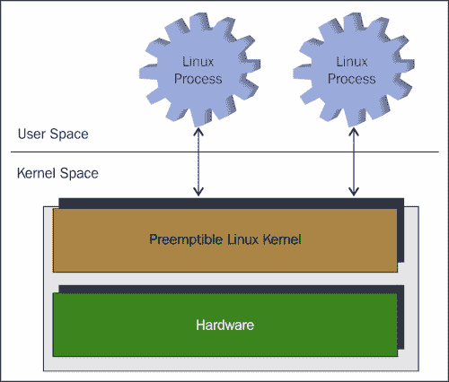
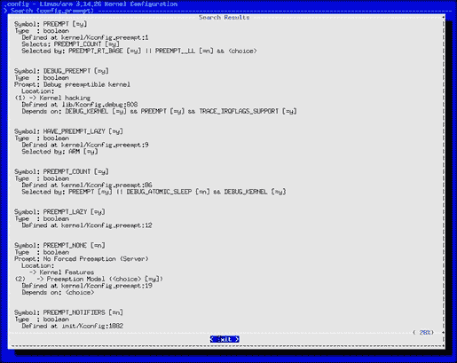
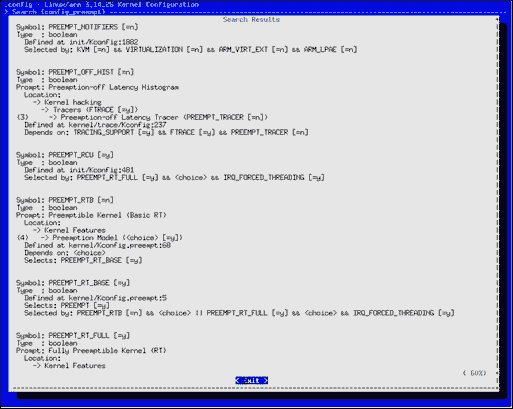
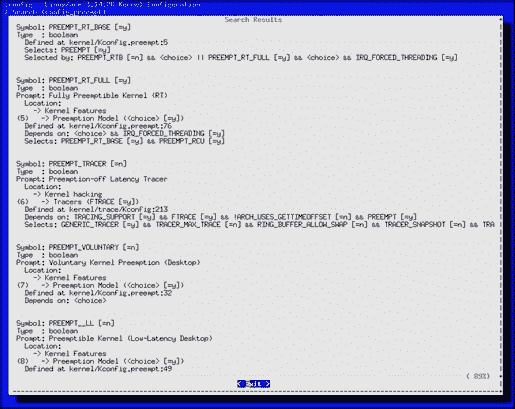
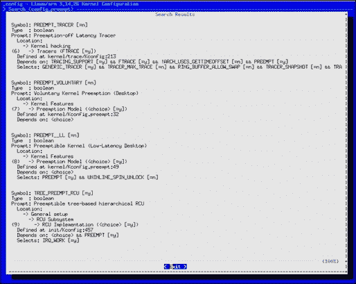
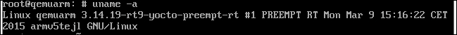

# 第十章。实时

在本章中，您将了解 Yocto 项目的实时组件的信息。此外，在相同的背景下，将解释操作系统和实时操作系统的通用目的的简要讨论。然后我们将转向 PREEMPT_RT 补丁，试图将正常的 Linux 变成一个功能强大的实时操作系统；我们将尝试从更多角度来看待它，并最终总结并得出结论。这还不是全部，任何实时操作都需要其应用程序，因此还将简要介绍适用于实时操作系统背景下的应用程序编写的注意事项。记住所有这些，我相信现在是时候继续本章内容了；希望您喜欢。

您将在本章找到对实时组件的更详细解释。还将向您展示 Linux 与实时的关系。众所周知，Linux 操作系统被设计为一个类似于已有的 UNIX 的通用操作系统。很容易看出，多用户系统（如 Linux）和实时系统在某种程度上存在冲突。这主要是因为对于通用目的，多用户操作系统（如 Linux）被配置为获得最大的平均吞吐量。这牺牲了对实时操作系统来说恰恰相反的延迟要求。

实时的定义相当容易理解。在计算中，其主要思想是计算机或任何嵌入式设备能够及时向其环境提供反馈。这与快速不同；事实上，在系统的上下文中足够快。对于汽车行业或核电厂来说，足够快是不同的。此外，这种系统将提供可靠的响应以做出不影响任何外部系统的决策。例如，在核电厂中，它应该检测并防止任何异常情况，以确保避免灾难发生。

# 理解 GPOS 和 RTOS

当提到 Linux 时，通常会将**通用目的操作系统**（**GPOS**）与之联系起来，但随着时间的推移，对 Linux 具有与**实时操作系统**（**RTOS**）相同的好处的需求变得更为迫切。任何实时系统的挑战在于满足给定的时间约束，尽管存在各种随机的异步事件。这并不是一项简单的任务，对实时系统的理论进行了大量的论文和研究。实时系统的另一个挑战是对延迟设置上限，称为调度截止日期。根据系统如何应对这一挑战，它们可以分为硬实时、稳固实时和软实时：

+   硬实时系统：这代表了一个如果错过截止日期将导致完全系统故障的系统。

+   **稳固实时系统**：这代表了一个截止日期错过是可以接受的，但系统质量可能会降低的系统。此外，在错过截止日期后，所提供的结果将不再有用。

+   **软实时系统**：这代表了一个错过截止日期会降低所收到结果的有用性，从而降低系统的质量的系统。在这种系统中，满足截止日期被视为一个目标而不是严格要求。

有多个原因导致 Linux 不适合作为 RTOS：

+   **分页**：通过虚拟内存的页面交换过程是没有限制的。目前没有方法可以知道从磁盘获取页面需要多长时间，这意味着页面故障可能导致的延迟没有上限。

+   **粗粒度同步**：在这里，Linux 内核的定义是不可抢占的。这意味着一旦一个进程处于内核上下文中，它就不能被抢占，直到退出上下文。在事件发生时，新事件需要等待调度，直到已有的事件退出内核上下文。

+   **批处理**：可以对操作进行批处理，以更有效地利用资源。这种方法的最简单示例是页面释放过程。Linux 能够传递多个页面并尽可能多地进行清理，而不是释放每个单独的页面。

+   **请求重排序**：可以对进程的 I/O 请求进行重新排序，使硬件的使用过程更加高效。

+   **调度公平性**：这是 UNIX 的遗产，指的是调度程序试图对所有运行的进程公平。这个特性提供了等待时间较长的较低优先级进程在较高优先级进程之前被调度的可能性。

所有前述特征构成了任务或进程的延迟不能应用上限的原因，也是 Linux 不能成为硬实时操作系统的原因。让我们看一下下面的图表，它说明了 Linux 操作系统提供实时特性的方法：



任何人可以做的第一件事来改善标准 Linux 操作系统的延迟就是尝试更改调度策略。默认的 Linux 时间共享调度策略称为**SCHED_OTHER**，它使用公平算法，给予所有进程零优先级，即可用的最低优先级。其他类似的调度策略有**SCHED_BATCH**用于进程的批处理调度和**SCHED_IDLE**，适用于极低优先级作业的调度。这些调度策略的替代方案是**SCHED_FIFO**和**SCHED_RR**。它们都是用作实时策略的，适用于需要精确控制进程和它们的延迟的时间关键应用程序。

为了给 Linux 操作系统提供更多的实时特性，还有另外两种方法可以提出。第一种是对 Linux 内核更具抢占性的实现。这种方法可以利用已有的用于 SMP 支持的自旋锁机制，确保多个进程不会同时执行，尽管在单处理器的情况下，自旋锁是无操作的。中断处理也需要修改以进行重新调度，以便在出现另一个更高优先级的进程时进行可能的重新调度；在这种情况下，可能还需要一个新的调度程序。这种方法的优点是不改变用户空间的交互，并且可以使用诸如 POSIX 或其他 API。缺点是内核的更改非常严重，每次内核版本更改时，这些更改都需要相应地进行调整。如果这项工作还不够，最终结果并不是完全的实时操作系统，而是减少了操作系统的延迟。

另一种可用的实现是中断抽象。这种方法基于这样一个事实，即并非所有系统都需要硬实时确定性，大多数系统只需要执行其任务的一部分在实时环境中执行。这种方法的理念是在实时内核下以空闲任务的优先级运行 Linux，并继续执行非实时任务，就像它们通常做的那样。这种实现伪装了实时内核的中断禁用，但实际上是传递给了实时内核。对于这种类型的实现，有三种可用的解决方案：

+   **RTLinux**：它代表中断抽象方法的原始实现，是在新墨西哥矿业技术研究所开发的。尽管它仍有开源实现，但大部分开发现在是由 FSMLabs 工程师完成的，后来被 Wind River System 收购用于其商业版本。对 RTLinux 的商业支持于 2011 年 8 月结束。

+   **RTAI**：这是对在米兰理工大学航空航天工程系开发的 RTLinux 解决方案的增强。该项目非常活跃，有大量开发人员，并且有当前版本可用。

+   **Xenomai**：它代表第三种实现。它的历史有些扭曲：它于 2001 年 8 月出现，只是在 2013 年与 RTAI 合并，以生成适合生产的实时操作系统。然而，这种融合在 2005 年解散，又重新成为一个独立项目。

以下图表展示了基本的 RTLinux 架构。



与前面图表中显示的类似架构适用于另外两种解决方案，因为它们都是从 RTLinux 实现中诞生的。它们之间的区别在于实现级别，每种都提供各种好处。

# PREEMPT_RT

当需要实时解决方案时，PREEMPT_RT 补丁是每个开发人员的首选。对于一些开发人员，PREEMPT_RT 补丁将 Linux 转变为适合其需求的实时解决方案。这个解决方案不能取代实时操作系统，但实际上适用于大量系统。

PREEMPT_RT 相对于 Linux 的其他实时解决方案的最大优势在于，它实际上将 Linux 转变为实时操作系统。所有其他替代方案通常创建一个微内核，作为超级监视器执行，而 Linux 只作为其任务执行，因此实时任务与非实时任务之间的通信是通过这个微内核完成的。对于 PREEMPT_RT 补丁，这个问题不复存在。

标准版的 Linux 内核只能提供基本的软实时要求，如基本的 POSIX 用户空间操作，其中没有保证的截止期。通过添加补丁，如 Ingo Molnar 的 PREEMPT_RT 补丁，以及 Thomas Gheixner 关于提供高分辨率支持的通用时钟事件层的补丁，可以说你有一个提供高实时能力的 Linux 内核。

随着实时抢占补丁在行业中的出现，出现了许多有趣的机会，使其成为工业控制或专业音频等领域的坚实和硬实时应用的选择。这主要是因为 PREEMPT_RT 补丁的设计及其旨在集成到主线内核中。我们将在本章中进一步了解其用法。以下图表显示了可抢占 Linux 内核的工作原理：



PREEMPT_RT 补丁通过以下技巧将 Linux 从通用操作系统转变为可抢占的操作系统：

+   使用可抢占的`rwlock_t preemptible`和`spinlock_t`来保护关键部分。仍然可以使用旧的解决方案，使用`raw_spinlock_t`，它与`spinlock_t`具有相同的 API。

+   使用`rtmutexes`抢占内核锁定机制。

+   为`mutexes`、`spinlocks`和`rw_semaphores`实现了优先级倒置和优先级继承机制。

+   将现有的 Linux 定时器 API 转换为具有高分辨率定时器的 API，从而提供超时的可能性。

+   实现使用内核线程作为中断处理程序。实时抢占补丁将软中断处理程序处理为内核线程上下文，使用`task_struct`结构来处理每个用户空间进程。还可以将 IRQ 注册到内核上下文中。

### 注意

有关优先级反转的更多信息，请参阅[`www.embedded.com/electronics-blogs/beginner-s-corner/4023947/Introduction-to-Priority-Inversion`](http://www.embedded.com/electronics-blogs/beginner-s-corner/4023947/Introduction-to-Priority-Inversion)。

## 应用 PREEMPT_RT 补丁

在移动到实际配置部分之前，您应该下载适合内核的版本。最好的灵感来源是[`www.kernel.org/`](https://www.kernel.org/)，这应该是起点，因为它不包含任何额外的补丁。收到源代码后，可以从[`www.kernel.org/pub/linux/kernel/projects/rt/`](https://www.kernel.org/pub/linux/kernel/projects/rt/)下载相应的`rt`补丁版本。本演示选择的内核版本是 3.12 内核版本，但如果需要其他内核版本，则可以采取类似的步骤，获得类似的结果。实时抢占补丁的开发非常活跃，因此任何缺失的版本支持都会很快得到解决。此外，对于其他子级版本，可以在特定内核版本的`incr`或旧的子目录中找到补丁。以下是子级版本的示例：

```
wget https://www.kernel.org/pub/linux/kernel/v3.x/linux-3.12.38.tar.xz
wget https://www.kernel.org/pub/linux/kernel/projects/rt/3.12/patch-3.12.38-rt52.patch.gz
```

收到源代码后，需要解压源代码并应用补丁：

```
tar xf linux-3.12.38.tar.xz
cd linux-3.12.38/
gzip -cd ../patch-3.12.38-rt52.patch.gz | patch -p1

```

下一步涉及内核源代码的配置。配置因架构而异，但总体思路保持不变。在 Poky 内支持 QEMU ARM 机器需要以下配置。要为机器启用 PREEMPT_RT 支持，有多种选项可用。您可以实现低延迟支持版本，这对于使用类似于这样的内核配置片段的台式计算机最合适：

```
CONFIG_GENERIC_LOCKBREAK=y
CONFIG_TREE_PREEMPT_RCU=y
CONFIG_PREEMPT_RCU=y
CONFIG_UNINLINE_SPIN_UNLOCK=y
CONFIG_PREEMPT=y
CONFIG_PREEMPT__LL=y
CONFIG_PREEMPT_COUNT=y
CONFIG_DEBUG_PREEMPT=y
CONFIG_RCU_CPU_STALL_VERBOSE=y
```

这个选项是最常用的选项之一，也构成了 PREEMPT_RT 补丁的主要使用来源。另一种选择是使用类似于这样的配置启用 PREEMPT_RT 补丁的全抢占支持：

```
CONFIG_PREEMPT_RT_FULL=y
CONFIG_HZ_1000=y
CONFIG_HZ=1000
```

如果您有兴趣手动配置内核，可以使用`menuconfig`选项。以下`CONFIG_PREEMPT*`配置可更轻松地访问所需的选项。第一个图像主要包含`CONFIG_PREEMPT`和`CONFIG_PREEMPT_COUNT`变量，这应该是启用的第一个变量。还有一个名为`CONFIG_PREEMPT_NONE`的配置选项，用于不强制进行抢占操作。



在下一个图像中，`CONFIG_PREEMPT_RCU`和`CONFIG_PREEMPT_RT_FULL`配置可用。有关`RCU`的更多信息，请参阅[`lwn.net/Articles/262464/`](https://lwn.net/Articles/262464/)。



第三个图像包含`CONFIG_PREEMPT__LL`配置。另一个有趣的配置是`CONFIG_PREEMPT_VOLUNTARY`，它与`CONFIG_PREEMPT__LL`配置一起减少延迟，适用于台式计算机。

有关*低延迟台式机*选项的有趣论点可在[`sevencapitalsins.wordpress.com/2007/08/10/low-latency-kernel-wtf/`](https://sevencapitalsins.wordpress.com/2007/08/10/low-latency-kernel-wtf/)找到。



最后一个包含`CONFIG_TREE_PREEMPT_RCU`配置，用于更改`RCU`实现。可以使用相同的过程搜索和启用其他不包含搜索词的配置。



有关 PREEMPT_RT 补丁的更多信息，请参阅[`varun-anand.com/preempt.html`](http://varun-anand.com/preempt.html)和[`www.versalogic.com/mediacenter/whitepapers/wp_linux_rt.asp`](http://www.versalogic.com/mediacenter/whitepapers/wp_linux_rt.asp)。

获得了新应用和配置的实时可抢占内核补丁的内核映像后，需要引导它以确保活动被适当地完成，以便最终结果可以被使用。使用`uname –a`命令，`patch rt*`修订号是可见的，并且应该应用于内核版本。当然，还有其他方法可以用来识别这些信息。`uname –a`命令的替代方法是`dmesg`命令，其输出字符串应该可见实时抢占支持，但只需要一种方法就足够了。以下图像提供了`uname –a`命令输出应该是什么样子的表示：



查看进程列表时，可以看到，如前所述，IRQ 处理程序是使用内核线程处理的。由于它被放置在方括号之间，这些信息在下一个`ps`命令输出中是可见的。单个 IRQ 处理程序由类似于用户空间的`task_struct`结构表示，使它们可以很容易地从用户空间进行控制：

```
ps ax 
PID TTY      STAT   TIME COMMAND 
1 ?        S      0:00 init [2] 
2 ?        S      0:00 [softirq-high/0] 
3 ?        S      0:00 [softirq-timer/0] 
4 ?        S      0:00 [softirq-net-tx/] 
5 ?        S      0:00 [softirq-net-rx/] 
6 ?        S      0:00 [softirq-block/0] 
7 ?        S      0:00 [softirq-tasklet] 
8 ?        S      0:00 [softirq-hrtreal] 
9 ?        S      0:00 [softirq-hrtmono] 
10 ?        S<     0:00 [desched/0] 
11 ?        S<     0:00 [events/0] 
12 ?        S<     0:00 [khelper] 
13 ?        S<     0:00 [kthread] 
15 ?        S<     0:00 [kblockd/0] 
58 ?        S      0:00 [pdflush] 
59 ?        S      0:00 [pdflush] 
61 ?        S<     0:00 [aio/0] 
60 ?        S      0:00 [kswapd0] 
647 ?        S<     0:00 [IRQ 7] 
648 ?        S<     0:00 [kseriod] 
651 ?        S<     0:00 [IRQ 12] 
654 ?        S<     0:00 [IRQ 6] 
675 ?        S<     0:09 [IRQ 14] 
687 ?        S<     0:00 [kpsmoused] 
689 ?        S      0:00 [kjournald] 
691 ?        S<     0:00 [IRQ 1] 
769 ?        S<s    0:00 udevd --daemon 
871 ?        S<     0:00 [khubd] 
882 ?        S<     0:00 [IRQ 10] 
2433 ?        S<     0:00 [IRQ 11] 
[...] 

```

需要收集的下一个信息涉及中断过程条目的格式，这些条目与普通内核使用的条目有些不同。可以通过检查`/proc/interrupts`文件来查看此输出：

```
cat /proc/interrupts 
CPU0 
0:     497464  XT-PIC         [........N/  0]  pit 
2:          0  XT-PIC         [........N/  0]  cascade 
7:          0  XT-PIC         [........N/  0]  lpptest 
10:          0  XT-PIC         [........./  0]  uhci_hcd:usb1 
11:      12069  XT-PIC         [........./  0]  eth0 
14:       4754  XT-PIC         [........./  0]  ide0 
NMI:          0 
LOC:       1701 
ERR:          0 
MIS:          0 

```

然后，第四列中提供的信息提供了 IRQ 线通知，例如：`[........N/ 0]`。在这里，每个点代表一个属性，每个属性都是一个值，如下所述。它们的出现顺序如下：

+   `I (IRQ_INPROGRESS)`: 这指的是活动的 IRQ 处理程序

+   `D (IRQ_DISABLED)`: 这表示 IRQ 被禁用了

+   `P (IRQ_PENDING)`: 这里的 IRQ 被表示为处于挂起状态

+   `R (IRQ_REPLAY)`: 在此状态下，IRQ 已被回复，但尚未收到 ACK

+   `A (IRQ_AUTODETECT)`: 这表示 IRQ 处于自动检测状态

+   `W (IRQ_WAITING)`: 这指的是 IRQ 处于自动检测状态，但尚未被看到

+   `L (IRQ_LEVEL)`: IRQ 处于电平触发状态

+   `M (IRQ_MASKED)`: 这表示 IRQ 不再被视为被屏蔽的状态

+   `N (IRQ_NODELAY)`: 这是 IRQ 必须立即执行的状态

在上面的示例中，可以看到多个 IRQ 被标记为可见和在内核上下文中运行的硬 IRQ。当 IRQ 状态标记为`IRQ_NODELAY`时，它向用户显示 IRQ 的处理程序是一个内核线程，并且将作为一个内核线程执行。IRQ 的描述可以手动更改，但这不是本文将描述的活动。

### 注意

有关如何更改进程的实时属性的更多信息，一个很好的起点是`chrt`工具，可在[`linux.die.net/man/1/chrt`](http://linux.die.net/man/1/chrt)上找到。

## Yocto 项目-rt 内核

在 Yocto 中，应用了带有 PREEMPT_RT 补丁的内核配方。目前，只有两个配方包含了 PREEMPT_RT 补丁；两者都在 meta 层中可用。涉及内核版本 3.10 和 3.14 的配方及其命名为`linux-yocto-rt_3.10.bb`和`linux-yocto-rt_3.14.bb`。命名中的`–rt`表示这些配方获取了 Yocto 社区维护的 Linux 内核版本的 PREEMPT_RT 分支。

这里呈现了 3.14 内核配方的格式：

```
cat ./meta/recipes-kernel/linux/linux-yocto-rt_3.14.bb
KBRANCH ?= "standard/preempt-rt/base"
KBRANCH_qemuppc ?= "standard/preempt-rt/qemuppc"

require recipes-kernel/linux/linux-yocto.inc

SRCREV_machine ?= "0a875ce52aa7a42ddabdb87038074381bb268e77"
SRCREV_machine_qemuppc ?= "b993661d41f08846daa28b14f89c8ae3e94225bd"
SRCREV_meta ?= "fb6271a942b57bdc40c6e49f0203be153699f81c"

SRC_URI = "git://git.yoctoproject.org/linux-yocto-3.14.git;bareclone=1;branch=${KBRANCH},meta;name=machine,meta"

LINUX_VERSION ?= "3.14.19"

PV = "${LINUX_VERSION}+git${SRCPV}"

KMETA = "meta"

LINUX_KERNEL_TYPE = "preempt-rt"

COMPATIBLE_MACHINE = "(qemux86|qemux86-64|qemuarm|qemuppc|qemumips)"

# Functionality flags
KERNEL_EXTRA_FEATURES ?= "features/netfilter/netfilter.scc features/taskstats/taskstats.scc"
KERNEL_FEATURES_append = " ${KERNEL_EXTRA_FEATURES}"
KERNEL_FEATURES_append_qemux86=" cfg/sound.scc cfg/paravirt_kvm.scc"
KERNEL_FEATURES_append_qemux86=" cfg/sound.scc cfg/paravirt_kvm.scc"
KERNEL_FEATURES_append_qemux86-64=" cfg/sound.scc"
```

如图所示，似乎有一个重复的行，需要打补丁来删除它：

```
commit e799588ba389ad3f319afd1a61e14c43fb78a845
Author: Alexandru.Vaduva <Alexandru.Vaduva@enea.com>
Date:   Wed Mar 11 10:47:00 2015 +0100

    linux-yocto-rt: removed duplicated line

    Seemed that the recipe contained redundant information.

    Signed-off-by: Alexandru.Vaduva <Alexandru.Vaduva@enea.com>

diff --git a/meta/recipes-kernel/linux/linux-yocto-rt_3.14.bb b/meta/recipes-kernel/linux/linux-yocto-rt_3.14.bb
index 7dbf82c..bcfd754 100644
--- a/meta/recipes-kernel/linux/linux-yocto-rt_3.14.bb
+++ b/meta/recipes-kernel/linux/linux-yocto-rt_3.14.bb
@@ -23,5 +23,4 @@ COMPATIBLE_MACHINE = "(qemux86|qemux86-64|qemuarm|qemuppc|qemumips)"
 KERNEL_EXTRA_FEATURES ?= "features/netfilter/netfilter.scc features/taskstats/taskstats.scc"
 KERNEL_FEATURES_append = " ${KERNEL_EXTRA_FEATURES}"
 KERNEL_FEATURES_append_qemux86=" cfg/sound.scc cfg/paravirt_kvm.scc"
-KERNEL_FEATURES_append_qemux86=" cfg/sound.scc cfg/paravirt_kvm.scc"
 KERNEL_FEATURES_append_qemux86-64=" cfg/sound.scc"
```

前面的配方与基本配方非常相似。这里，我指的是`linux-yocto_3.14.bb`；它们是应用了 PREEMPT_RT 补丁的配方。它们之间的区别在于每个配方都来自其特定的分支，到目前为止，没有一个带有 PREEMPT_RT 补丁的 Linux 内核版本为`qemumips64`兼容的机器提供支持。

## PREEMPT_RT 补丁的缺点

Linux 是一个针对吞吐量进行优化的通用操作系统，这与实时操作系统的要求完全相反。当然，它通过使用大型、多层缓存提供了高吞吐量，这对于硬实时操作过程来说是一场噩梦。

要实现实时 Linux，有两种可用的选项：

+   第一种方法涉及使用 PREEMPT_RT 补丁，通过最小化延迟并在线程上下文中执行所有活动来提供抢占。

+   第二种解决方案涉及使用实时扩展，这些扩展充当 Linux 和用于管理实时任务的硬件之间的层。这第二种解决方案包括前面提到的 RTLinux、RTAI 和 XENOMAI 解决方案，以及其他商业解决方案和涉及移动层并将其分离为多个组件的变体。

第二个选项的变体意味着各种解决方案，从为实时活动隔离核心到为此类任务分配核心。还有许多解决方案涉及使用虚拟化程序或在 Linux 内核下方提供一定数量的中断服务给 RTOS。这些替代方案的存在不仅为读者提供了其他选项，也是因为 PREEMPT_RT 补丁有其缺点。

一个显著的缺点是通过强制内核在出现更高优先级任务时抢占任务来减少延迟。当然，这会降低系统的吞吐量，因为它不仅在进程中增加了一些上下文切换，而且使较低优先级的任务等待时间比正常的 Linux 内核更长。

`preempt-rt`补丁的另一个缺点是需要将其从一个内核版本移植到另一个内核版本，并从一个架构或软件供应商调整到另一个。这仅意味着特定供应商应该内部具备 Linux 内核的知识，并且应该为其每个可用的内核调整解决方案。这一事实使得它对 BSP 或 Linux 操作系统提供商来说不太受欢迎。

### 注

有关 Linux 抢占的一个有趣演示可在以下链接中找到。可咨询此链接以获取有关 Linux 实时解决方案的更多信息，网址为[`www.slideshare.net/jserv/realtime-linux`](http://www.slideshare.net/jserv/realtime-linux)。

# Linux 实时应用程序

拥有实时操作系统并不总是对每个人都足够。有些人还需要在操作系统上运行经过实时优化的应用程序。为了确保可以设计和与实时应用程序交互，操作系统和硬件上都需要确定性。就硬件配置而言，要求涉及低延迟中断处理。导致 ISR 延迟的机制应该在几十微秒左右。

关于实时应用程序所需的内核配置，需要以下配置：

+   **按需 CPU 缩放**：使用此配置有助于在 CPU 处于低功耗模式时创建长延迟事件。

+   **NOHZ**：此配置禁用 CPU 接收的定时器中断。启用此选项后，CPU 唤醒所花费的延迟将减少。

要编写应用程序，需要注意一些事项，例如确保禁用交换以减少页面错误引起的延迟。全局变量或数组的使用应尽量减少。99 优先级号未配置为运行应用程序，而是使用优先级继承 futexes 而不是其他自旋锁。还要避免输入/输出操作和应用程序之间的数据共享。

对于设备驱动程序，建议有所不同。之前我们提到实时内核的中断处理是在线程上下文中进行的，但硬件中断上下文仍然可以在这里发挥作用。为了从中断处理程序中识别硬件中断上下文，可以使用`IRQF_NODELAY`标志。如果使用`IRQF_NODELAY`上下文，请确保避免使用`wake_up()`、`up()`或`complete()`等函数。

# 基准测试

Linux 操作系统长期以来被视为 GPOS，但在过去几年中，一些项目试图通过修改 Linux 内核成为 RTOS 来改变这一点。其中一个项目是之前提到的 PREEMPT_RT 补丁。

在本章的这一部分，我将讨论一系列测试，这些测试可以针对 Linux OS 的两个版本执行，无论是否应用了 PREEMPT_RT 补丁。我应该提到，对于那些对一些实际结果感兴趣的人，有许多可用的论文试图调查 PREEMPT_RT 的延迟效应或其优缺点。其中一个例子可在[`www.versalogic.com/downloads/whitepapers/real-time_linux_benchmark.pdf`](http://www.versalogic.com/downloads/whitepapers/real-time_linux_benchmark.pdf)找到。

在继续之前，我认为有必要定义一些技术术语，以便正确理解一些信息：

+   **中断延迟**：指中断生成后到中断处理程序中的执行开始之间经过的时间。

+   **调度延迟**：表示事件唤醒信号和调度程序有机会为其安排线程之间的时间。也称为**分派延迟**。

+   **最坏情况延迟**：指发出需求后到接收到该需求的响应之间经过的时间。

+   **上下文切换**：表示 CPU 从一个进程或线程切换到另一个进程或线程。它只发生在内核模式中。

**LPPTest**包含在 PREEMPT_RT 补丁中，它包含一个 Linux 驱动程序，只需更改并行端口上的位值以识别响应时间。另一个驱动程序响应位值的变化，用户空间应用程序测量结果。要执行此测试，需要两台机器：一台用于发送信号，另一台用于接收和发送响应。这一要求很严格，因为使用回环电缆可能会影响测量结果。

**RealFeel**是一个用于中断处理的测试。该程序使用`/dev/rtc`来触发周期性中断，测量一个中断到另一个中断之间的持续时间，并将其与预期值进行比较。最后，它无限期地打印与预期值的偏差，以便将这些变化导出到日志文件中以供以后处理。

Linux 实时基准测试框架（LRTB）代表了一组脚本和驱动程序，用于评估 Linux 内核的各种性能计数器，并添加了实时功能。它测量了实时补丁所施加的负载，以及它们获取更确定性中断响应的能力。

在基准测试阶段，可以使用`hackbench`、`lmbench`或甚至`Ingo Molnar dohell`脚本等程序。当然，还有许多其他工具可用于测试（`cyclictest`、`hourglass`等）或基准测试（`unixbench`、`cache-calibrator`或任何将实时性能推至极限的其他压力测试），但我会让用户测试并应用最适合他们需求的工具。

PREEMPT_RT 补丁提高了 Linux 内核的抢占性，但这并不意味着它是最好的解决方案。如果应用领域的各个方面发生变化，PREEMPT_RT 补丁的有用性可能会有所不同。关于 PREEMPT_RT 补丁，它已经准备好在硬实时系统中使用。不能得出一个结论，但我必须承认，如果它用于维持生命或任务关键系统，它可以被认为是硬实时材料。这是每个人都要做出的决定，因此需要进行测试。支持这一观点的一个意见来自 Steven Rostedt，他是 Linux 内核开发人员，也是红帽公司实时 Linux 内核补丁稳定版本的维护者。该信息可以在[`www.linux.com/news/featured-blogs/200-libby-clark/710319-intro-to-real-time-linux-for-embedded-developers`](http://www.linux.com/news/featured-blogs/200-libby-clark/710319-intro-to-real-time-linux-for-embedded-developers)上找到。

### 注意

关于这个问题的一些有趣信息可以在[`elinux.org/Realtime_Testing_Best_Practices`](http://elinux.org/Realtime_Testing_Best_Practices)上找到。

# 元实时

`meta-realtime`层是由 WindRiver 的 Bruce Ashfield 维护的一个倡议，旨在创建一个与 Linux 内核或系统开发相关的实时活动的场所。它被创建为 PREEMPT_RT、SCHED_DEADLINE、POSIX 实时和通用操作系统和实时操作系统的替代配对的占位符，无论这涉及用户空间 RTOS、虚拟机监视程序还是 AMP 解决方案。此外，这也是系统分区、CPU 隔离和其他相关应用程序的所在地。当然，如果没有为整个 Linux 操作系统提供一些性能分析和基准测试应用程序，这一切都不会被认为是完整的。

虽然这个层描述起初听起来很激动人心，但其内容实际上非常贫乏。它只能整合一些测试工具，更准确地说，其中两个是`schedtool-dl`和`rt-app`，以及额外的脚本，试图在目标机器上远程运行`rt-app`并收集结果数据。

第一个`schedtool-dl`应用是一个用于截止时间调度的调度器测试工具。它出现的原因是需要在 Linux 下更改或查询 CPU 调度策略，甚至是进程级别。它还可以用于在 SMP/NUMA 系统上锁定各种 CPU 上的进程，以避免音频/视频应用程序中的跳过，并且通常可以在高负载下保持高水平的交互和响应能力。

### 注意

有关`schedtool-dl`应用程序的更多信息可以在[`github.com/jlelli/schedtool-dl`](https://github.com/jlelli/schedtool-dl)上找到。

下一个也是最后一个可用的应用是`rt-app`，它用作系统上实时负载的模拟测试应用程序。它通过在给定时间段启动多个线程来实现这一点。它支持 SCHED_FIFO、SCHED_OTHER、SCHED_RR、SCHED_DEADLINE，以及**自适应服务质量架构**（**AQuoSA**）框架，这是一个旨在为 Linux 内核提供自适应**服务质量**（**QoS**）的开源项目。

### 注意

有关`rt-app`应用程序和 AQuoSa 框架的更多信息可以在[`github.com/scheduler-tools/rt-app`](https://github.com/scheduler-tools/rt-app)和[`aquosa.sourceforge.net/`](http://aquosa.sourceforge.net)上找到。

除了包含的软件包外，该层还包含一个集成了它们的镜像，但这远远不足以使该层包含实质性内容。虽然它内部并不包含大量信息，但本章将介绍该层，因为它包含了起点，并提供了迄今为止所呈现的所有信息的发展视角。当然，应该驻留在该层中的一些应用程序已经分布在多个其他层中，比如`meta-linaro`中可用的`idlestat`软件包。然而，这并不构成本解释的核心。我只想指出可以包含任何实时相关活动的最合适的地方，而在我看来，`meta-realtime`就是这个地方。

# 总结

在本章中，您对 PREEMPT_RT 和 Linux 内核实时问题的其他替代解决方案进行了简要介绍。我们还探讨了一些可用于相关实时活动的工具和应用程序。然而，如果不提及 Yocto 项目，不仅涉及到 PREEMPT_RT Linux 内核的配方，还涉及`meta-realtime`层的应用程序，这个介绍就不完整。开发适用于新环境的应用程序也是一个关注点，因此在*Linux 实时应用程序*部分解决了这个问题。最后，我希望通过本章中提供的链接来呈现这个主题的完整画面，以激发读者的好奇心。

在下一章中，将对`meta-security`和`meta-selinux`层进行简要解释，并提供 Linux 生态系统和 Yocto 项目的安全需求的更广泛视角。还将介绍一些旨在保护我们的 Linux 系统的工具和应用程序的信息，但这还不是全部。看看下一章吧；我相信你会喜欢它。
