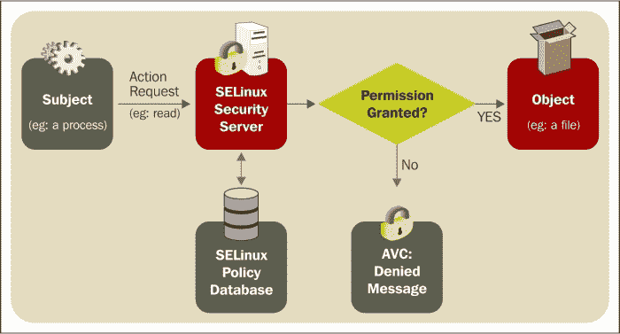
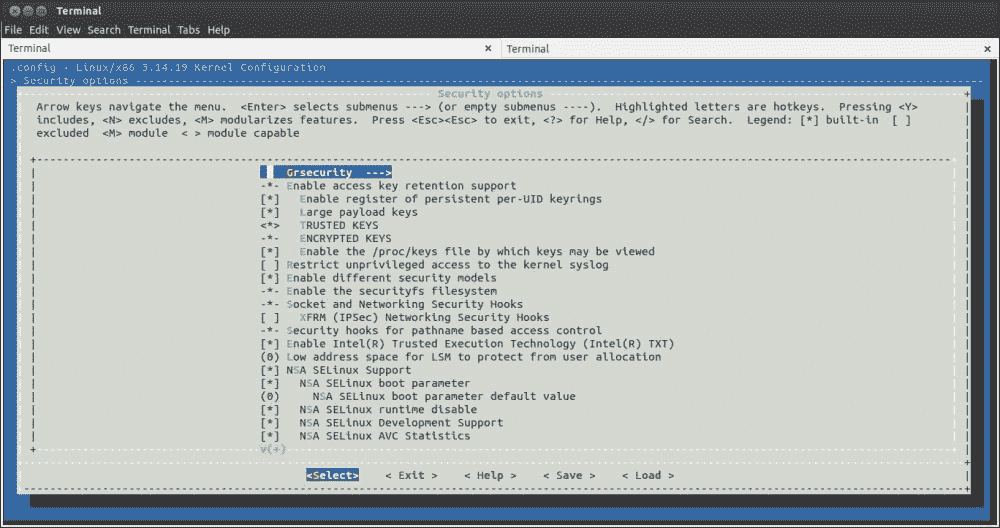
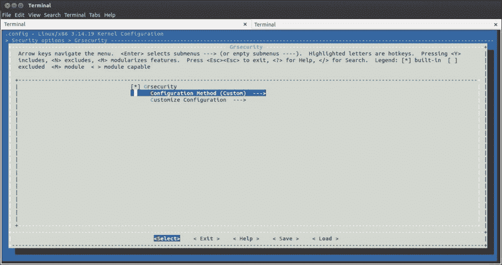
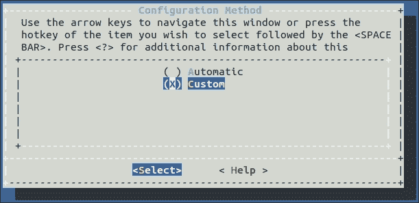
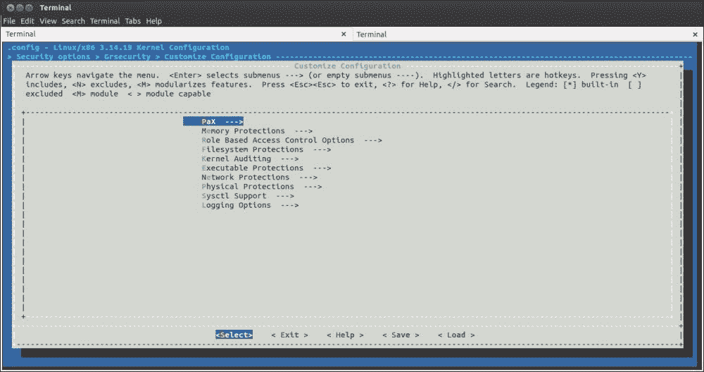

# 第十一章：安全

在本章中，您将了解各种安全增强工具。我们首先来到 Linux 内核，在这里，有两个工具，SELinux 和 grsecurity，这两个工具都非常有趣，也非常必要。接下来，将解释 Yocto 项目的安全特定层。这包括包含大量工具的 meta-security 和 meta-selinux，可用于保护或审计 Linux 系统的各个组件。由于这个主题很广泛，我还会让您检查各种其他解决方案，既在 Linux 内核中实施，也在外部实施。希望您喜欢本章，并且觉得这些信息有趣且有用。

在任何操作系统中，安全性对用户和开发人员都是一个非常重要的关注点。开发人员已经开始以各种方法解决这些安全问题。这导致了许多可用操作系统的安全方法和改进。在本章中，将介绍一些安全增强工具，以及一些旨在确保各种组件（如 Linux 内核或 Yocto 项目）足够安全以供使用的策略和验证例程。我们还将看看在本章进行过程中如何处理各种威胁或问题。

SELinux 和 grsecurity 是对 Linux 内核进行的两项显著的安全改进，试图强制执行 Linux。SELinux 是一种强制访问控制（MAC）机制，提供基于身份和角色的访问控制，以及域类型强制。第二个选择 grsecurity 更类似于 ACL，并且实际上更适合支持远程连接的 Web 服务器和其他系统。关于 Linux 的安全实现以及 Yocto 项目如何处理这个领域，这些方面将在下一节中介绍。我必须承认的一件事是，在撰写本章时，Yocto 项目内部的安全处理仍然是一个年轻的项目，但我怀着热情期待看到迭代次数随着时间的推移而增加。

# Linux 中的安全

在每个 Linux 系统的核心是 Linux 内核。任何能够损害或控制系统的恶意代码也会对影响 Linux 内核产生影响。因此，用户清楚地知道，拥有一个安全的内核也是方程式的重要部分。幸运的是，Linux 内核是安全的，并且具有许多安全功能和程序。所有这些背后的人是 James Morris，Linux 内核安全子系统的维护者。甚至还有一个专门的 Linux 存储库，可以在[`git.kernel.org/?p=linux/kernel/git/jmorris/linux-security.git;a=summary`](http://git.kernel.org/?p=linux/kernel/git/jmorris/linux-security.git;a=summary)上访问。此外，通过检查[`kernsec.org/wiki/index.php/Main_Page`](http://kernsec.org/wiki/index.php/Main_Page)，即 Linux 内核安全子系统的主页，您可以看到在该子系统内部管理的确切项目，并且如果感兴趣，也许可以帮助他们。

还有一个工作组，为 Linux 内核提供安全增强和验证，以确保其安全性，并在 Linux 生态系统的安全性方面保持一定水平的信任。他们的活动包括但不限于对各种漏洞进行验证和测试，或开发辅助安全 Linux 内核的工具。该工作组还包括对安全子系统的指导和维护，或者对各种项目或构建工具添加的安全改进。

所有其他 Linux 软件组件都有自己的安全团队。当然，有些软件组件没有明确定义这些团队，或者有一些与此主题相关的内部规则，但它们仍然意识到围绕其组件发生的安全威胁，并尝试修复这些漏洞。Yocto 项目试图帮助解决这些问题，并在某些方面统一这些软件组件。我希望在这个领域的一些改进会在未来几年内实现。

# SELinux

SELinux 是 Linux 内核的安全增强功能，由国家安全局信息保障办公室开发。它具有基于策略的架构，是建立在**Linux 安全模块**（**LSM**）接口上的 Linux 安全模块之一，旨在实现军事级别的安全性。

目前，它已经随着大量的发行版一起发布，包括最知名和经常使用的发行版，如 Debian、SuSe、Fedora、Red Hat 和 Gentoo。它基于 MAC，管理员可以控制系统用户空间组件的所有交互。它使用最小权限的概念：在这里，默认情况下，用户和应用程序没有权限访问系统资源，因为所有这些权限都是由管理员实体授予的。这构成了系统安全策略的一部分，其重点显示在以下图中：



SELinux 内部的基本功能通过 MAC 的实现进行了隔离。在沙盒中，每个应用程序只允许执行其设计为在安全策略中定义的任务。当需要访问时，当然，标准的 Linux 权限仍然适用于系统，并且在策略之前将进行咨询。如果没有权限可用，SELinux 将无法以任何方式影响系统。但是，如果权限允许访问，则应咨询 SELinux 策略以提供最终的许可或拒绝访问的裁决。

在 SELinux 的上下文中，访问决策是基于主体的安全上下文进行的。这可能是与特定用户上下文相关联的进程，该进程与实际尝试的操作（例如文件读取操作）进行比较，以及可用对象的安全上下文，该对象可以是文件。

在继续之前，我们将看看如何在 Ubuntu 机器上启用 SELinux 支持。我将首先介绍一些与 SELinux 相关的基本概念：

+   **用户**：在 SELinux 上下文中，用户与 UNIX 上下文中的用户不同。它们之间的主要区别在于，在 SELinux 上下文中，用户在用户会话期间不会改变，并且有可能有更多的 UNIX 用户在相同的 SELinux 用户上下文中操作。然而，也有可能进行 1:1 用户映射的操作，例如 Linux 根用户和 SELinux 根用户。通常，SELinux 用户的命名中会添加`_u`后缀。

+   **角色**：SELinux 用户可以拥有一个或多个角色。角色的含义在策略中定义。对象通常具有`object_r`角色，角色通常以`_r`字符串结尾。

+   **类型**：这是应用授权决策的主要方法。它也可以被称为域，通常以`_t`结尾。

+   **上下文**：每个进程和对象都有自己的上下文。实际上，它是一个属性，确定是否应该允许对象和进程之间的访问。SELinux 上下文表示为三个必需字段和一个可选字段，例如`user:role:type:range`。前三个字段代表 SELinux 用户、角色和类型。最后一个代表 MLS 的范围，稍后将介绍。有关 MLS 的更多信息，请参阅[`web.mit.edu/rhel-doc/5/RHEL-5-manual/Deployment_Guide-en-US/sec-mls-ov.html`](http://web.mit.edu/rhel-doc/5/RHEL-5-manual/Deployment_Guide-en-US/sec-mls-ov.html)。

+   **对象类**：一个 SELinux 对象类表示可用对象的类别。类别，如`dir`表示目录，`file`表示文件，还有一组与它们相关的权限。

+   **规则**：这些是 SELinux 的安全机制。它们被用作一种强制执行，并且是使用对象和进程的类型来指定的。规则通常说明了一个类型是否被允许执行各种操作。

如前所述，SELinux 非常出名和受人赞赏，以至于它被包含在大多数可用的 Linux 发行版中。它的成功也通过大量关于这个主题的书籍得到了证明。有关更多信息，请参阅[`www.amazon.com/s/ref=nb_ss_gw/102-2417346-0244921?url=search-alias%3Daps&field-keywords=SELinux&Go.x=12&Go.y=8&Go=Go`](http://www.amazon.com/s/ref=nb_ss_gw/102-2417346-0244921?url=search-alias%3Daps&field-keywords=SELinux&Go.x=12&Go.y=8&Go=Go)。说到这一点，让我们来看看在 Ubuntu 主机上安装 SELinux 所需的步骤。第一步是安装 SELinux 软件包：

```
sudo apt-get install selinux

```

安装软件包后，需要将 SELinux 模式从禁用（不执行或记录 SELinux 策略的模式）更改为其他两个可用选项之一：

+   `强制执行`：这在生产系统中最有用：

```
sudo sed -i 's/SELINUX=.*/SELINUX=enforcing/' /etc/selinux/config 

```

+   `宽容`：在此模式下，策略不会被执行。但是，任何拒绝都会被记录下来，主要用于调试活动和开发新策略时：

```
sudo sed -i 's/SELINUX=.*/SELINUX=permissive/' /etc/selinux/config

```

配置实施后，系统需要重新启动，以确保系统文件被正确标记。

有关 SELinux 的更多信息也可以在 Yocto 项目中找到。有一个专门的层专门支持 SELinux。此外，有关此工具的更多信息，建议阅读专门讨论此问题的书籍之一。如果您不喜欢这种方法，那么还有其他手册提供与 SELinux 相关的信息，可在各种发行版中找到，如 Fedora ([`docs.fedoraproject.org/en-US/Fedora/19/html/Security_Guide/ch09.html`](https://docs.fedoraproject.org/en-US/Fedora/19/html/Security_Guide/ch09.html))，Red Hat ([`access.redhat.com/documentation/en-US/Red_Hat_Enterprise_Linux/4/html/SELinux_Guide/index.html`](https://access.redhat.com/documentation/en-US/Red_Hat_Enterprise_Linux/4/html/SELinux_Guide/index.html))等。

# Grsecurity

Grsecurity 是一个补丁套件，根据 GNU 通用公共许可证发布，适用于 Linux 内核，并将有助于增强 Linux 的安全性。这个补丁套件提供了四个主要的好处：

+   无需配置的操作

+   保护免受各种地址空间更改错误的影响

+   它包括一个访问控制列表系统和一些相当全面的审计系统，以满足各种需求

+   它能够与多个操作系统和处理器架构进行交互

grsecurity 软件是免费的，其开发始于 2001 年，首先从 Openwall 项目移植了一些增强安全性的补丁。它首次发布于 2.4.1 Linux 内核版本，自那时以来，开发一直在进行。随着时间的推移，它包括了一个 PaX 捆绑补丁，提供了保护内存页面的可能性。这是通过使用最小特权方法来完成的，这意味着在执行程序时，应该采取的操作不应超过必要的行动，借助额外或更少的步骤。

### 注意

如果您对了解更多有关 PaX 的信息感兴趣，可以访问[`en.wikipedia.org/wiki/PaX`](http://en.wikipedia.org/wiki/PaX)和[`pax.grsecurity.net/`](https://pax.grsecurity.net/)。

Grsecurity 具有许多功能，主要适用于 Web 服务器或接受来自不受信任用户的 shell 访问的服务器。其中一个主要功能是**基于角色的访问控制**（**RBAC**），它是已有的 UNIX **自主访问控制**（**DAC**）的替代方案，甚至是由 Smack 或 SELinux 提供的强制访问控制（MAC）。RBAC 的目标是提供最少特权系统，其中进程和用户只具有完成任务所需的最低特权。grsecurity 的另一个功能与加固`chroot()`系统调用有关，以确保消除特权升级。除此之外，还有一些其他功能，如审计和`/proc`限制。

我已经将 grsecurity 的功能分组保留在章节中，因为我认为了解其功能将有助于用户和开发人员在需要安全解决方案时做出正确的决定。以下是所有 grsecurity 功能的列表：

+   内存损坏防御：

+   自动响应暴力利用

+   针对喷洒攻击的加固 BPF JIT

+   加固的用户空间内存权限

+   线程堆栈之间的随机填充

+   防止内核直接访问用户空间

+   行业领先的 ASLR

+   内核边界检查复制到/从用户空间

+   文件系统加固：

+   Chroot 加固

+   消除针对管理员终端的侧信道攻击

+   防止用户欺骗 Apache 访问其他用户文件

+   隐藏非特权用户的进程

+   提供可信路径执行

+   其他保护：

+   防止基于 ptrace 的进程窥探

+   防止无法读取的二进制文件转储

+   防止攻击者自动加载易受攻击的内核模块

+   拒绝访问过于宽松的 IPC 对象

+   强制一致的多线程特权

+   RBAC：

+   直观的设计

+   自动完整系统策略学习

+   自动策略分析

+   人类可读的策略和日志

+   与 LSM 堆叠

+   非常规功能

+   GCC 插件：

+   防止大小参数中的整数溢出

+   防止从先前的系统调用中泄漏堆栈数据

+   在早期引导和运行时增加熵

+   随机化内核结构布局

+   使只读敏感内核结构

+   确保所有内核函数指针指向内核

牢记 grsecurity 的功能，我们现在可以进入 grsecurity 的安装阶段和其名为`gradm`的管理员。

需要做的第一件事是获取相应的软件包和补丁。如下所示，启用 grsecurity 的内核版本为`3.14.19`：

```
wget https://www.kernel.org/pub/linux/kernel/v3.x/linux-3.14.19.tar.gz
wget https://www.kernel.org/pub/linux/kernel/v3.x/linux-3.14.19.tar.sign
wget http://grsecurity.net/stable/gradm-3.1-201502222102.tar.gz
wget http://grsecurity.net/stable/gradm-3.1-201502222102.tar.gz.sig
wget http://grsecurity.net/stable/grsecurity-3.1-3.14.36-201503182218.patch
wget http://grsecurity.net/stable/grsecurity-3.1-3.14.36-201503182218.patch.sig

```

软件包可用后，需要检查其签名。Linux 内核的签名检查过程很大，与其他系统不同，如下所示：

```
wget http://grsecurity.net/spender-gpg-key.asc
sudo gpg --import spender-gpg-key.asc
sudo gpg --verify gradm-3.1-201502222102.tar.gz.sig
sudo gpg --verify grsecurity-3.1-3.14.35-201503092203.patch.sig
gzip -d linux-3.14.19.tar.gz
sudo gpg --verify linux-3.14.19.tar.sign

```

第一次调用此命令时，不会验证签名，但 ID 字段将可供以后使用。它用于从 PGP 密钥服务器识别公钥：

```
gpg: Signature made Mi 17 sep 2014 20:20:53 +0300 EEST using RSA key ID 6092693E
sudo gpg --keyserver hkp://keys.gnupg.net --recv-keys 6092693E
sudo gpg --verify linux-3.14.19.tar.sign

```

在所有软件包都可用且经过适当验证后，我们现在可以进入内核配置阶段。第一步是修补过程，使用 grsecurity 补丁完成，但这首先需要访问 Linux 内核源代码：

```
tar xf linux-3.14.19.tar 
cd linux-3.14.19/
patch -p1 < ../grsecurity-3.1-3.14.35-201503092203.patch

```

在修补过程中，源代码中缺少`include/linux/compiler-gcc5.h`，因此需要跳过此部分。然而，在此之后，修补过程顺利完成。完成此步骤后，配置阶段可以继续。有一些通用配置应该可以在不进行任何额外修改的情况下工作，但对于每个发行版，总会有一些特定的配置可用。可以使用以下命令来查看它们，并确保每个配置与您的硬件匹配：

```
make menuconfig

```

如果您是第一次调用它，前面的命令会有一个警告消息，提示您如下：

```
HOSTCC  scripts/basic/fixdep
HOSTCC  scripts/kconfig/conf.o
 *** Unable to find the ncurses libraries or the
 *** required header files.
 *** 'make menuconfig' requires the ncurses libraries.
 *** 
 *** Install ncurses (ncurses-devel) and try again.
 *** 
make[1]: *** [scripts/kconfig/dochecklxdialog] Error 1
make: *** [menuconfig] Error 2

```

可以通过安装`libncurses5-dev`软件包来解决这个问题，使用以下命令：

```
sudo apt-get install libncurses5-dev

```

有了这些问题解决后，配置过程可以继续。`grsecurity`选项位于安全选项子菜单中，如下截图所示：



在`grsecurity`选项中，还有两个子菜单选项。有关此的更多详细信息可以在以下截图中看到：



第一个选项是配置方法，可以是**自定义**或**自动**：



第二个选项是实际可用的配置选项：



### 注意

有关 Grsecurity 和 PaX 配置选项的更多信息可以在[`en.wikibooks.org/wiki/Grsecurity/Appendix/Grsecurity_and_PaX_Configuration_Options`](http://en.wikibooks.org/wiki/Grsecurity/Appendix/Grsecurity_and_PaX_Configuration_Options)找到。

我想提供的一个建议是，首先启用**自动**配置方法，然后再进行自定义配置，以微调 Grsecurity 和 PaX 设置（如果需要）。另一个提示是启用**Grsecurity** | **自定义配置** | **Sysctl 支持**选项，因为它提供了在不重新编译内核的情况下更改 grsecurity 选项的可能性。当然，如果选择了**自动**配置方法，则此选项默认启用。审计选项会产生大量日志，为了防止日志泛滥，请确保**Grsecurity** | **自定义配置** | **日志选项**也已启用。

grsecurity 家族的下一个工具是`gradm`管理员，它是 ACL 的强大解析器，也对其进行优化。为了确保可以安装此实用程序，安装过程要求`gradm`的主机操作机器提供 grsecurity 支持，否则编译过程将失败。在安装`gradm`之前还需要一些其他软件包：`lex`、`flex`、`byacc`、`bison`，甚至`pam`（如果需要）。

一旦满足了所有依赖关系，安装过程就可以开始了。我想给你的最后一点信息是，如果您使用的发行版带有对 grsecurity 补丁的内核支持，那么您可能首先要检查它，因为补丁也可能预先安装了`gradm`实用程序。

### 注意

有关 Grsecurity 管理的更多信息可以在以下链接找到：

[`en.wikibooks.org/wiki/Grsecurity/The_Administration_Utility`](http://en.wikibooks.org/wiki/Grsecurity/The_Administration_Utility)

[`en.wikibooks.org/wiki/Grsecurity/Additional_Utilities`](http://en.wikibooks.org/wiki/Grsecurity/Additional_Utilities)

[`en.wikibooks.org/wiki/Grsecurity/Runtime_Configuration`](http://en.wikibooks.org/wiki/Grsecurity/Runtime_Configuration)

在 Yocto 层中，支持`meta-oe`层内的`gradm`配方。它位于主分支的`recipes-support/gradm/gradm_3.0.bb`。此外，`meta-accel`层的主分支上提供了 grsecurity 内核配置；配置片段的确切位置是`recipes-kernel/linux/linux-yocto-iio/grsec.cfg`。对于任何对 Yocto 中提供的具体 grsecurity 支持感兴趣的人，我相信你可以开始着手做这件事。不过，我建议你首先向 Yocto 项目社区询问是否已经有人开始做这件事。

# Yocto 项目的安全性

在 Yocto 项目中，安全问题仍然很年轻。由于该项目宣布不到五年，讨论安全问题是很正常的，最近一年左右才开始。当然，安全团队有专门的邮件列表，其中包括来自各个公司的大量成员，但他们的工作程序还没有完全完成，因为目前仍处于进行中的状态。

安全团队成员主要开展的活动包括了解最新和最危险的安全威胁，并确保找到修复方法，即使包括自己修复并应用更改到 Yocto 的可用层内。

目前，安全活动中最耗时的是围绕 Poky 参考系统展开的，但也有各个公司采取的倡议，试图向各种 BSP 维护层或其他第三方层推送一系列补丁。对于感兴趣的人，与安全相关的讨论邮件列表是`<yocto-security@yoctoproject.org>`。此外，在团队形成之前，他们可以在`#yocto` IRC 上找到，网址是[`webchat.freenode.net/?channels=#yocto`](http://webchat.freenode.net/?channels=#yocto)，甚至可以参加每两周举行一次的 Yocto 技术团队会议。

### 注意

有关安全团队的更多信息可以在其 Wiki 页面上找到。我鼓励所有对这个主题感兴趣的人至少访问一次[`wiki.yoctoproject.org/wiki/Security`](https://wiki.yoctoproject.org/wiki/Security)。

# Meta-security 和 meta-selinux

在这一部分，介绍了与 Linux 安全工具相关的层倡议。在这一章中，为 Linux 内核及其库提供安全和硬化工具的两个层可供使用。它们的目的是简化嵌入式设备的模式，确保它们是安全的，并可能提供类似桌面的安全级别。

由于嵌入式设备变得越来越强大，与安全相关的问题只能是自然而然的。 Yocto 项目的倡议层，我指的是 meta-security 和 meta-selinux，在简化确保安全、硬化和保护 Linux 系统的过程中迈出了另一步。与检测和修复漏洞系统一起，它们被实施在安全团队内部，并有助于在嵌入式设备上实现与桌面相同级别的安全性，并进一步推动这一理念。话虽如此，让我们继续讲解层的实际内容。

## Meta-security

在 meta-security 层中，有一些工具用于保护、加固和保护嵌入式设备，这些设备可能向各种实体提供外部访问。如果设备连接到互联网或容易受到任何形式的攻击或劫持，那么 meta-security 层可能是您的第一站。通过这一层和 meta-selinux 层，Yocto 项目试图为大多数社区或嵌入式用户设备提供适当的安全级别。当然，增强对各种工具的支持或添加新工具并不是被禁止的，所以如果您感到需要或有冲动，不要犹豫，为增强工具做出您的贡献。欢迎任何新的提交或提交者-我们的社区真的很友好。

正如您已经习惯的那样，提供的工具是适用于嵌入式设备的开源软件包。在 meta-security 层中，有许多可用的软件包，每个软件包都试图提供不仅系统加固，还有安全检查、安全、端口扫描和其他针对各种安全级别的有用功能。包括以下软件包：

+   Bastille

+   Redhat-security

+   Pax-utils

+   Buck-security

+   Libseccomp

+   Ckecksecurity

+   Nikto

+   Nmap

+   Clamav

+   Isic

+   Samhain

+   Suricata

+   Tripwire

除了这些软件包，还有许多库和**TOMOYO**，一个用于 MAC 实现的内核安全模块，也非常有用作为系统分析工具。它于 2003 年 3 月首次发布，并由日本 NTT 数据公司赞助，直到 2012 年 3 月。

TOMOYO 的主要关注点是系统行为。为此，参与系统创建的每个进程都声明了其行为和实现目的所需的必要资源。它由两个组件组成：一个内核组件，linux-ccs，和一个用户空间组件，ccs-tools；两者都需要才能正常运行。TOMOYO 试图提供一个既实用又易于使用的 MAC 实现。最后，它希望让系统对大多数用户可用，非常适合普通用户和系统管理员。它与 SELinux 不同，因为它具有**LEARNING 模式**提供的自动策略配置机制；此外，它的策略语言非常容易理解。

启用保护后，TOMOYO Linux 充当一个看门狗，限制进程使用超出其最初声明的资源。其主要特点包括以下内容：

+   系统分析

+   提供策略生成过程中的辅助工具

+   简单易用的语法

+   易于使用

+   通过 MAC 实现增强系统安全性

+   包含少量依赖项（嵌入式 GNU C 库、libncurses 和 GNU readline 库）

+   不修改根文件系统中已有的二进制文件

+   自 2.6.30 版本以来，Linux 内核与 TOMOYO 内核模块合并，只需要在配置阶段启用模块即可。它起初是一个提供 MAC 支持的补丁，将其移植到主线内核需要使用**LSM**（Linux 安全模块）的钩子，其中还包括 SELinux、AppArmor 和 SMACK。然而，由于需要更多的钩子来集成剩余的 MAC 功能，因此该项目有另外两条并行的开发线：

+   **TOMOYO Linux 1.x**：这是原始代码版本：

+   它使用非标准的特定钩子

+   它提供了所有的 MAC 功能

+   它作为内核的补丁发布，因为它不依赖于 LSM

+   其最新版本为 1.7.1

+   TOMOYO Linux 2.x：这是主线源代码版本：

+   它使用标准的 LSM 钩子

+   它包含了更少的功能子集

+   它是 2.6.30 Linux 内核版本的一个组成部分

+   最新版本是 2.5.0，支持 Linux 内核版本 3.2

+   **AKARI 和 TOMOYO 1.x 分支版本**：

+   它还使用标准的 LSM 钩子

+   它的特点是与 TOMOYO 1.x 相比具有较少的功能，但与 TOMOYO 2.x 不同。

+   它作为 LSM 发布；不需要重新编译内核

### 注意

对于那些对三个版本进行比较感兴趣的人，请参阅[`akari.sourceforge.jp/comparison.html.en`](http://akari.sourceforge.jp/comparison.html.en)。

下一个软件包是`samhain`，这是一个系统完整性监控和报告工具，由系统管理员使用，用于怀疑系统上的更改或活动。它的操作基于客户端/服务器环境，并能够监视多个主机，同时提供集中的维护和日志记录系统。除了已经宣传的功能外，它还能提供端口监控、检测恶意 SUID、rootkit 检测，以及隐藏进程，这使得它支持多个平台；这是一个非常有趣的工具。

这里的下一个元素属于与`samhain`相同的类别，称为`tripwire`。这是另一个完整性工具，但它试图检测文件系统对象的更改，并作为主机入侵检测系统工作。在每次文件扫描后，信息都存储在数据库中，并与已有结果进行比较。任何进行的更改都会向用户报告。

**Bastille**是一个用于保护 Unix 主机环境和系统的加固程序。它使用规则来实现其目标，首先通过调用`bastille -c`命令，让您通过一长串问题。回答完后，将创建并执行一个配置文件，这意味着您的操作系统现在根据您的需求已经加固。如果系统上已经有一个配置文件，可以通过调用`bastille -b`来设置系统加固。

下一个工具是`redhat-security`，它是一组用于与安全扫描相关的各种问题的脚本集合。以下是运行`redhat-security`脚本所需的工具集合，只需在终端中调用一个脚本：

+   `find-chroot.sh`：此工具扫描整个系统以查找调用`chroot`并包括对`chdir`的调用的 ELF 文件。未通过此测试的程序不包含`chroot`内的`cwd`，它们不受保护，不安全。

+   `find-chroot-py.sh`：此工具类似于前面的工具，但仅测试 Python 脚本。

+   `rpm-chksec.sh`：此工具接受一个 rpm 文件，并检查其编译标志。出于安全原因进行此操作。如果结果是绿色，则一切正常，黄色表示可以接受，红色需要用户注意。

+   `find-nodrop-groups.sh`：此工具扫描整个系统，查找在不调用`setgroups`和`initgroups`调用的情况下更改 UID 或 GID 的程序。

+   `rpm-drop-groups.sh`：此工具类似于前一个工具，但这个工具使用可用的 RPM 文件。

+   `find-execstack.sh`：此工具扫描整个系统以查找将堆栈标记为可执行的 ELF 文件。它用于识别易受堆栈缓冲区溢出攻击的程序。

+   `find-sh4errors.sh`：此工具扫描整个系统以查找 shell 脚本，并使用`sh -n`命令检查其正确性。

+   `find-hidden-exec.sh`：此工具扫描系统以查找隐藏的可执行文件，并将结果报告给用户进行调查。

+   `selinux-ls-unconfined.sh`：此工具用于扫描所有运行中的进程，并查找其中的`initrc_t`标签或`inetd`（这意味着它们是运行不受限制的守护进程）。问题应报告为 SELinux 策略问题。

+   `selinux-check-devides.sh`：此工具检查所有可用设备，以查看它们是否正确标记。它也被标记为应该解决的 SELinux 策略问题。

+   `find-elf4tmp.sh`：此工具扫描整个系统，并检查所使用的`tmp`文件是否为众所周知，是否使用`mktemp`创建，或者是否具有某种模糊的格式。

+   `find-sh3tm.sh`：此工具还扫描文件系统，尽管仅在`/tmp`内部查找 ELF 文件。当找到它们时，它会检查是否通过调查符号表对它们中的任何随机名称生成器函数进行了调用。如果结果是肯定的，它将输出字符串值。

+   `lib-bin-check.sh`：此工具检查库的软件包及其包含的软件包。它基于这样一个想法，即系统上可用的二进制文件越少，系统就越安全。

另一个包含的工具是`pax-utils`。它还包括一些用于扫描 ELF 二进制文件的脚本，主要用于一致性检查，但这并非全部。看一下其中一些：

+   `scanelf`：此工具用于查找有关二进制文件的 ELF 结构的预先信息

+   `dumpelf`：此工具是一个用户空间实用程序，用于以等效的 C 结构转储内部 ELF 结构，用于调试或参考目的

+   `pspax`：此工具用于扫描`/proc`并列出各种可用的 ELF 类型及其对应的 PaX 标志、属性和文件名

现在，接下来要介绍的工具是一种与已经介绍的 bastille 不同的安全扫描器。与`redhat-security`命令类似，这个命令也执行一些脚本，并可以根据用户的需求进行配置。它适用于 Debian 和 Ubuntu 用户，在调用 buck-security 可执行文件之前，需要进行一些配置。使用`export GPG_TTY=`tty``来确保启用 buck-security 的所有功能，并在执行该工具之前，检查`conf/buck-security.conf`配置文件，以确保满足您的需求。

**Suricata**是一个用于网络的高性能 IDS/IPS 和安全监控引擎。它由**OISF**（**Open Information Security Foundation**）及其支持者拥有和维护。它使用**HTP**库，这是一个非常强大的 HTTP 解析器和标准化器，并提供一些不错的功能，如协议识别、MD5 校验和文件识别等。

另一方面，**ISIC**正如其名字所示，是一个 IP 堆栈完整性检查器。实际上，它是一套用于 IP 堆栈和其他堆栈（如 TCP、ICMP、UDP 等）的实用程序，用于测试防火墙或协议本身。

对于任何 Web 服务器，**nikto**是在您的设备上执行的工具。它是一个用于运行一系列测试的扫描程序，用于识别危险的 CGI1 或其他文件。它还为超过 1250 个服务器的过时版本和每个版本的各种漏洞提供了列表。

接下来是**libseccomp**库，它提供了一个易于使用的抽象接口到 Linux 内核的`syscall`过滤机制，称为`seccomp`。它通过将 BPF `syscall`过滤语言抽象化，并以更用户友好的格式呈现给应用程序开发人员来实现这一点。

**Checksecurity**是下一行的包，它使用一系列 shell 脚本和其他插件来测试对`setuid`程序的各种更改。使用`/etc/checksecurity.conf`中定义的过滤器，它扫描已挂载的文件系统，并将已有的`setuid`程序列表与新扫描的程序进行比较，并将更改打印给用户查看。它还提供有关这些已挂载不安全文件系统的信息。

**ClamAV**是 Unix 的一种命令行操作的防病毒软件。它是一个非常好的引擎，用于跟踪木马、恶意软件、病毒和其他恶意威胁的检测。它可以做很多事情，从电子邮件扫描到网络扫描和端点安全。它还具有非常多功能和可扩展的守护程序、命令行扫描程序和数据库交互工具。

列表中的最后一个是**网络映射器**（**nmap**）。这是最著名的安全审计工具，也是网络和系统管理员用于网络发现的工具。它用于管理服务升级计划、网络清单、监控各种服务，甚至主机的正常运行时间。

这些是 meta-security 层内支持和提供的工具。我在简洁的方式中介绍了大部分工具，目的是让它们以简单的方式对您可用。我认为对于安全问题，不应该过于复杂，只保留最适合您需求的解决方案。通过提供大量工具和软件组件，我试图做两件事：为公众提供更多的工具，并帮助您在寻求提供甚至维护安全系统的过程中做出决策。当然，鼓励好奇心，所以请确保您查看任何其他可能帮助您了解更多安全信息的工具，以及为什么它们不应该集成到 meta-security 层内。

## Meta-selinux

另一个可用的安全层由 meta-selinux 层表示。这与 meta-security 不同，因为它只支持一个工具，但正如前面的工具所述，它是如此庞大和广泛，以至于它将其翅膀展开到整个系统。

该层的目的是支持 SELinux 并通过 Poky 向 Yocto Project 社区中的任何人提供使用。正如之前提到的，由于它影响整个 Linux 系统，因此该层的大部分工作都是在 bbappend 文件中完成的。我希望您喜欢使用该层内可用的功能，并且如果您认为合适，甚至可以为其做出贡献。

这一层不仅包含许多令人印象深刻的 bbappend 文件，还提供了一系列不仅可以用作 SELinux 扩展的软件包。这些软件包也可以用于其他独立的目的。meta-selinx 层中可用的软件包如下：

+   audit

+   libcap-ng

+   setools

+   swig

+   ustr

我将从**audit**用户空间工具开始介绍这一层，正如其名称所示，这是一个用于审计的工具，更具体地说是用于内核审计。它使用多种实用程序和库来搜索和存储记录的数据。数据是通过 Linux 内核中可用的审计子系统生成的。它被设计为一个独立的组件，但如果没有第二个安全组件可用，它就无法提供**公共标准**（**CC**）或**FIPS 140-2**功能。

列表中的下一个元素是**libcap-ng**，这是一个替代库，具有简化的 POSIX 功能，可以与传统的 libcap 解决方案进行比较。它提供了分析运行应用程序并打印其功能的实用程序，或者如果它们具有开放的边界集。对于缺乏`securebit`的开放边界集，只有使用`execve()`调用才能允许保留`0` UID 的应用程序保留完整的功能。通过使用 libcap-ng 库，这些具有最高权限的应用程序非常容易识别和处理。与其他工具进行交互和检测，如**netcap**、**pscap**或**filecap**。

**SETools**是一个策略分析工具。实际上，它是 SELinux 的扩展，包含一系列库、图形工具和命令行，试图简单地分析 SELinux 策略。这个开源项目的主要工具如下：

+   `apol`：这是一个用于分析 SELinux 策略的工具

+   `sediff`：这是一个用于比较 SELinux 策略的语义差异器

+   `seaudit`：这是一个用于分析 SELinux 审计消息的工具

+   `seaudit-report`：这用于基于可用的审计日志生成高度可定制的审计报告

+   `sechecker`：这是一个用于对 SELinux 策略进行模块化检查的命令行工具

+   `secmds`：这是另一个用于访问和分析 SELinux 策略的命令行工具

接下来是**SWIG**（**简化包装器和接口生成器**），这是一个软件开发工具，用于与各种目标语言一起创建高级编程环境、用户界面和其他必要的内容。它通常用于快速测试或原型设计，因为它生成了目标语言可以在 C 或 C++代码中调用的粘合剂。

最后要介绍的组件是用于 C 语言的微字符串 API，称为**ustr**，它与可用的 API 相比具有更低的开销。它在 C 代码中非常容易使用，因为它只包括一个头文件并且可以立即使用。与`strdup()`相比，对于字符串的开销从 1-9 字节的 85.45 变化到 1-198 字节的 23.85。举个简单的例子，如果一个 8 字节的存储 ustr 使用 2 字节，`strdup()`函数使用 3 字节。

这是其他工具和库与 SELinux 功能一起提供的地方，尽管其中一些可以作为单独的组件或与此处介绍的其他可用软件组件一起使用。这将为 SELinux 产品增加更多价值，因此在同一位置找到它们似乎是公平的。

对于那些有兴趣获得 SELinux 增强发行版的人，您可以选择在 meta-selinux 层中使用两个可用的映像之一：`core-image-selinux-minimal.bb`或`core-image-selinux.bb`。另一种选择是根据开发人员的需求将其中一个可用的 SELinux 特定定义的软件包组，`packagegroup-selinux-minimal`或`packagegroup-core-selinux`，合并到新定义的映像中。在做出这个选择并相应地进行配置之后，唯一剩下的就是为所选择的映像调用`bitbake`，在构建过程结束时，将会显示一个启用了 SELinux 支持的自定义 Linux 发行版，并且如果需要，可以进一步进行调整。

# 总结

在本章中，您将了解有关内核特定安全项目和外部项目的信息。其中大多数以不好的方式呈现。您还将获得有关各种安全子系统和子组如何跟上各种安全威胁和安全项目实施的信息。

在下一章中，我们将继续探讨另一个有趣的主题。在这里，我指的是虚拟化领域。您将在稍后了解更多关于元虚拟化方面的内容，以及各种虚拟化实现，例如 KVM，在过去几年中已经积累了大量经验，并已经确立了自己的标准。我将让下一章中将介绍的其他元素成为一个秘密。现在让我们进一步探索本书的内容。
