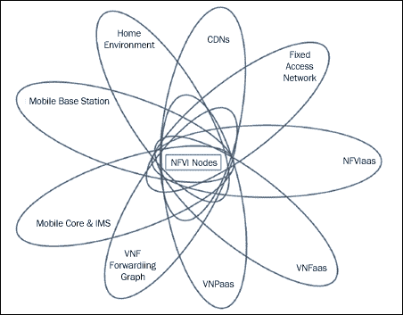
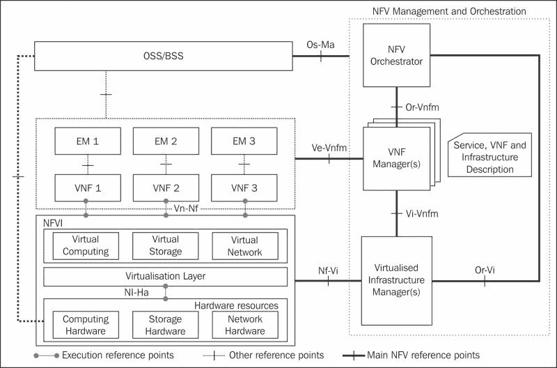
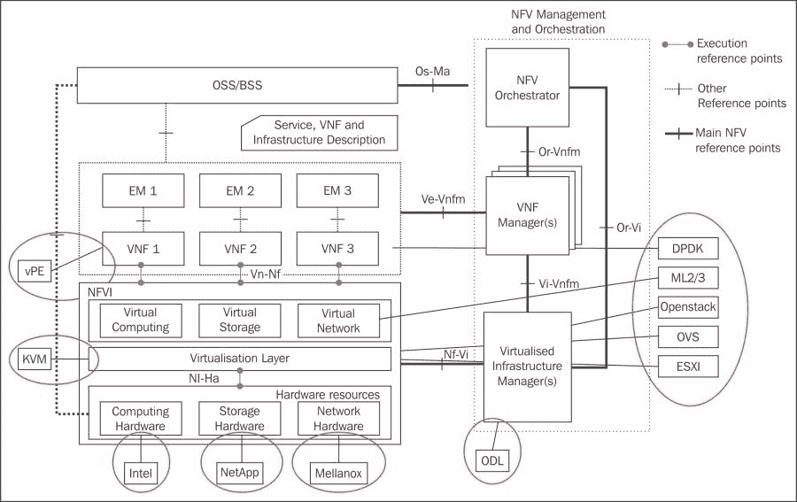
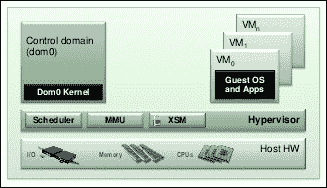
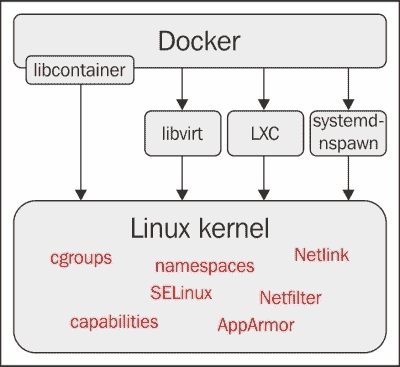
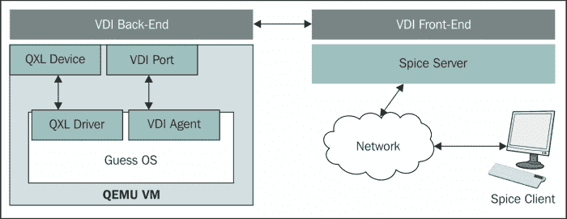
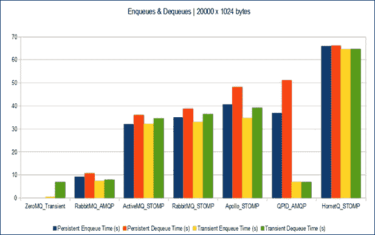
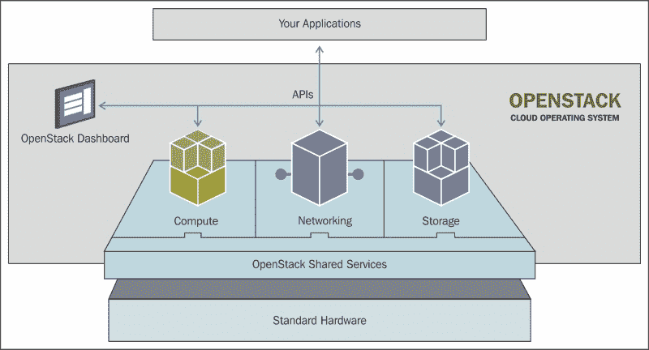
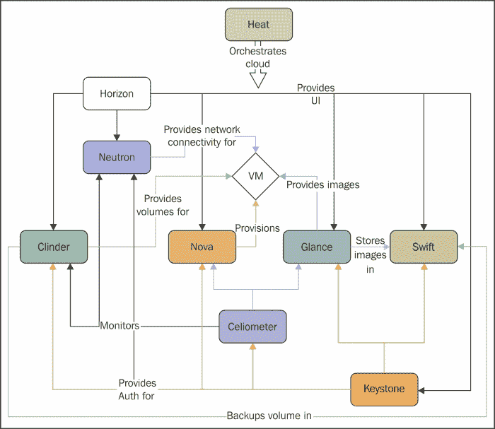

# 第十二章：虚拟化

在本章中，您将了解到 Linux 虚拟化部分出现的各种概念。正如一些人可能知道的那样，这个主题非常广泛，仅选择一些组件进行解释也是一个挑战。我希望我的决定能够让大多数对这个领域感兴趣的人满意。本章提供的信息可能并不适合每个人的需求。因此，我附上了多个链接，以获取更详细的描述和文档。我鼓励您在必要时开始阅读并了解更多。我知道我无法用几句话包含所有必要的信息。

在任何 Linux 环境中，Linux 虚拟化并不是一件新事物。它已经存在了十多年，并且以一种非常迅速和有趣的方式发展。现在的问题不再围绕虚拟化作为解决方案，而更多地是关于部署虚拟化解决方案和虚拟化什么。

当然，也有一些情况下虚拟化并不是解决方案。在嵌入式 Linux 中，有一大类领域不适用虚拟化，主要是因为一些工作负载更适合在硬件上运行。然而，对于那些没有这种要求的领域，使用虚拟化有相当多的优势。本章将讨论有关各种虚拟化策略、云计算和其他相关主题的更多信息，让我们来看看。

# Linux 虚拟化

当人们看到虚拟化时，首先看到的好处是服务器利用率的提高和能源成本的降低。使用虚拟化，服务器上的工作负载得到了最大化，这与硬件只使用计算能力的一小部分的情况截然不同。它可以减少与各种环境的交互复杂性，同时还提供了一个更易于使用的管理系统。如今，由于大多数工具提供的可扩展性，与大量虚拟机一起工作并不像与其中几个交互那样复杂。此外，部署时间真的已经减少了。在几分钟内，您可以取消配置和部署操作系统模板，或者创建一个虚拟环境用于虚拟设备部署。

虚拟化带来的另一个好处是灵活性。当工作负载对分配的资源来说太大时，它可以很容易地复制或移动到另一个更适合其需求的环境中，无论是在相同的硬件上还是在更强大的服务器上。对于基于云的解决方案，这里的可能性是无限的。限制可能是由云类型所施加的，基于是否有可用于主机操作系统的工具。

随着时间的推移，Linux 能够为每一个需求和组织提供许多出色的选择。无论您的任务涉及企业数据中心中的服务器整合，还是改善小型非营利组织的基础设施，Linux 都应该有一个适合您需求的虚拟化平台。您只需要弄清楚在哪里以及应该选择哪个项目。

虚拟化是广泛的，主要是因为它包含了广泛的技术范围，而且大部分术语都没有明确定义。在本章中，您将只了解与 Yocto 项目相关的组件，以及我个人感兴趣的一个新倡议。这个倡议试图使**网络功能虚拟化**（**NFV**）和**软件定义网络**（**SDN**）成为现实，被称为**NFV 开放平台**（**OPNFV**）。这里将对其进行简要介绍。

## SDN 和 NFV

我决定从这个话题开始，因为我相信这个领域的所有研究都开始得到各种领域和行业的开源倡议的支持，这是非常重要的。这两个概念并不新。它们自 20 年前首次被描述以来就存在，但过去几年使它们有可能重新出现为真实而非常可能的实现。本节的重点将放在*NFV*部分，因为它受到了最多的关注，并包含了各种实施提议。

## NFV

NFV 是一种网络架构概念，用于将整个网络节点功能虚拟化为可以相互连接以创建通信服务的块。它不同于已知的虚拟化技术。它使用**虚拟网络功能**（**VNF**），可以包含在一个或多个虚拟机中，执行不同的进程和软件组件，可用于服务器、交换机甚至云基础设施。一些例子包括虚拟化负载均衡器、入侵检测设备、防火墙等。

由于各种标准和协议需要很长时间才能达到一致性和质量，电信行业的产品开发周期非常严格和漫长。这使得快速发展的组织有可能成为竞争对手，并迫使它们改变自己的方法。

2013 年，一个行业规范组发布了一份关于软件定义网络和 OpenFlow 的白皮书。该组是**欧洲电信标准化协会**（**ETSI**）的一部分，被称为网络功能虚拟化。在这份白皮书发布后，还发布了更深入的研究论文，从术语定义到各种使用案例，都有参考供应商可以考虑使用 NFV 实现。

## ETSI NFV

ETSI NFV 工作组对电信行业非常有用，可以创建更灵活的开发周期，并且能够及时响应来自动态和快速变化环境的需求。SDN 和 NFV 是两个互补的概念，在这方面是关键的启用技术，并包含了电信和 IT 行业共同开发的主要技术要素。

NFV 框架包括六个组件：

+   **NFV 基础设施（NFVI）**：它需要支持各种用例和应用。它包括为部署 VNF 创建环境的软件和硬件组件的总体。它是一个多租户基础设施，负责同时利用多种标准虚拟化技术用例。它在以下**NFV 行业规范组**（**NFV ISG**）文件中有描述：

+   NFV 基础设施概述

+   NFV 计算

+   NFV 虚拟化程序域

+   NFV 基础设施网络域

以下图片展示了 NFV 基础设施的各种用例和应用领域的可视化图表。



+   **NFV 管理和编排（MANO）**：它是负责将计算、网络和存储组件与软件实现分离的组件，借助虚拟化层。它需要管理新元素和编排它们之间的新依赖关系，这需要一定的互操作性标准和一定的映射。

+   **NFV 软件架构**：它涉及已实施的网络功能的虚拟化，如专有硬件设备。它意味着从硬件实施到软件实施的理解和过渡。过渡基于可以在过程中使用的各种定义的模式。

+   **NFV 可靠性和可用性**：这些是真正的挑战，这些组件的工作始于各种问题、用例、需求和原则的定义，并且它提出要提供与传统系统相同水平的可用性。它涉及可靠性组件，文档只是为未来的工作奠定基础。它只确定了各种问题，并指出了在设计具有弹性的 NFV 系统中使用的最佳实践。

+   **NFV 性能和可移植性**：总体而言，NFV 的目的是改变未来网络的工作方式。为此，它需要证明自己是行业标准的解决方案。本节解释了如何在一般 VNF 部署中应用与性能和可移植性相关的最佳实践。

+   **NFV 安全性**：由于它是行业的一个重要组成部分，因此它关注并且也依赖于网络和云计算的安全性，这使得确保 NFV 安全性至关重要。安全专家组专注于这些问题。

这些组件的架构如下所示：



在所有文档就位之后，需要执行一些概念验证，以测试这些组件的限制，并相应地调整理论组件。它们还出现鼓励 NFV 生态系统的发展。

### 注意

有关 NFV 可用概念和规范的更多信息，请参考以下链接：[`www.etsi.org/technologies-clusters/technologies/nfv/nfv-poc?tab=2`](http://www.etsi.org/technologies-clusters/technologies/nfv/nfv-poc?tab=2) 和 [`www.etsi.org/technologies-clusters/technologies/nfv`](http://www.etsi.org/technologies-clusters/technologies/nfv)。

## SDN

**软件定义网络**（**SDN**）是一种网络方法，通过将可用功能的抽象提供给管理员，实现了管理各种服务的可能性。这是通过将系统分离为控制平面和数据平面，并根据发送的网络流量做出决策来实现的；这代表了控制平面领域，而数据平面代表了流量的转发位置。当然，控制平面和数据平面之间需要一种通信方法，因此 OpenFlow 机制首先进入了方程式；然而其他组件也可以取代它。

SDN 的目的是提供一种可管理、成本效益高、适应性强、动态的架构，以及适用于当今动态和高带宽场景的解决方案。OpenFlow 组件是 SDN 解决方案的基础。SDN 架构允许以下内容：

+   **直接编程**：控制平面是直接可编程的，因为它完全与数据平面分离。

+   **可编程配置**：SDN 允许通过程序对资源进行管理、配置和优化。这些程序可以由任何人编写，因为它们不依赖于任何专有组件。

+   **灵活性**：两个组件之间的抽象允许根据开发人员的需求调整网络流量。

+   **中央管理**：逻辑组件可以集中在控制平面上，为其他应用程序、引擎等提供了一个网络视图。

+   **开放标准和供应商中立性**：它使用开放标准实施，这简化了 SDN 的设计和操作，因为控制器提供的指令数量较少。这与其他情况相比要小得多，在其他情况下，需要处理多个供应商特定的协议和设备。

此外，考虑到传统解决方案无法满足市场需求，尤其是新兴的移动设备通信、物联网（IoT）、机器对机器（M2M）、工业 4.0 等市场都需要网络支持。考虑到各个 IT 部门进一步发展的可用预算，他们都面临着做出决定的困境。似乎移动设备通信市场都决定朝着开源的方向发展，希望这种投资能够证明其真正的能力，并带来更加光明的未来。

## OPNFV

网络功能虚拟化项目的开放平台试图提供一个开源参考平台，该平台具有运营商级别的紧密集成，以便促进行业同行帮助改进和推动 NFV 概念。其目的是在已经存在的众多模块和项目之间提供一致性、互操作性和性能。该平台还将尝试与各种开源项目密切合作，并不断帮助集成，同时填补它们中任何一个留下的开发空白。

该项目预计将带来性能、可靠性、可维护性、可用性和功耗效率的提高，同时也将提供一个广泛的仪器平台。它将从开发 NFV 基础设施和虚拟化基础设施管理系统开始，其中将结合多个已有项目。其参考系统架构由 x86 架构表示。

该项目的初始重点和拟议实施可以在以下图片中查看。从这张图片中可以很容易地看出，尽管该项目自 2014 年 11 月开始，但已经有了加速的起步，并已经提出了一些实施建议。已经有许多大公司和组织开始着手他们的特定演示。OPNFV 并没有等待他们完成，已经在讨论一些拟议项目和倡议。这些旨在满足其成员的需求，并确保各种组件的可靠性，如持续集成、故障管理、测试基础设施等。以下图描述了 OPNFV 的结构。



该项目一直在利用尽可能多的开源项目。对这些项目所做的所有调整可以在两个地方进行。首先，如果不需要导致与其目的和路线图背道而驰的重大功能更改，可以在项目内部进行。第二个选项是对第一个选项的补充，对于不属于第一类的更改，应该在 OPNFV 项目的代码库中的某个地方包含它们。在 OPNFV 的开发周期内，没有经过适当测试的更改不应该被上游。

还需要提到的另一个重要因素是，OPNFV 不使用任何特定或额外的硬件。只要支持 VI-Ha 参考点，它就可以使用现有的硬件资源。在前面的图片中，可以看到这已经通过提供商实现，例如英特尔提供计算硬件，NetApp 提供存储硬件，Mellanox 提供网络硬件组件。

OPNFV 董事会和技术指导委员会拥有大量的开源项目。它们涵盖从基础设施即服务（IaaS）和虚拟化管理程序到 SDN 控制器等各种项目。这为大量贡献者提供了尝试一些可能没有时间或机会学习的技能的可能性。此外，更多样化的社区提供了对同一主题的更广泛的视角。

OPNFV 项目有各种各样的设备。移动部署的虚拟网络功能多种多样，其中移动网关（如 Serving Gateway（SGW）、Packet Data Network Gateway（PGW）等）和相关功能（Mobility Management Entity（MME）和网关）、防火墙或应用级网关和过滤器（Web 和电子邮件流量过滤器）用于测试诊断设备（服务级别协议（SLA）监控）。这些 VNF 部署需要易于操作、扩展，并且可以独立于部署的 VNF 类型进行演进。OPNFV 旨在创建一个平台，支持以下一系列特性和用例：

+   需要一种常见的机制来管理 VNF 的生命周期，包括部署、实例化、配置、启动和停止、升级/降级以及最终的取消

+   使用一种一致的机制来指定和互连 VNF、VNFC 和 PNF；这些与物理网络基础设施、网络覆盖等无关，即虚拟链路

+   使用一种常见的机制来动态实例化新的 VNF 实例或取消足够的实例以满足当前的性能、规模和网络带宽需求

+   使用一种机制来检测 NFVI、VIM 和基础设施的其他组件中的故障和失败，并从这些故障中恢复

+   使用一种机制从/向虚拟网络功能源/接收流量到/从物理网络功能

+   NFVI 作为服务用于在同一基础设施上托管来自不同供应商的不同 VNF 实例

这里应该提到一些显著且易于理解的用例示例。它们分为四类。让我们从第一类开始：住宅/接入类。它可以用于虚拟化家庭环境，但也提供对 NFV 的固定访问。接下来是数据中心：它具有 CDN 的虚拟化，并提供处理它的用例。移动类别包括移动核心网络和 IMS 的虚拟化，以及移动基站的虚拟化。最后，有云类别，包括 NFVIaaS、VNFaaS、VNF 转发图（服务链）以及 VNPaaS 的用例。

### 注意

有关该项目和各种实施组件的更多信息，请访问[`www.opnfv.org/`](https://www.opnfv.org/)。有关缺失术语的定义，请参阅[`www.etsi.org/deliver/etsi_gs/NFV/001_099/003/01.02.01_60/gs_NFV003v010201p.pdf`](http://www.etsi.org/deliver/etsi_gs/NFV/001_099/003/01.02.01_60/gs_NFV003v010201p.pdf)。

# Yocto Project 的虚拟化支持

`meta-virtualization`层试图创建一个长期和中期的、专门用于嵌入式虚拟化的生产就绪层。它的作用是：

+   简化协作基准测试和研究的方式，使用 KVM/LxC 虚拟化等工具，结合先进的核心隔离和其他技术

+   集成和贡献项目，如 OpenFlow、OpenvSwitch、LxC、dmtcp、CRIU 等，这些项目可以与其他组件一起使用，如 OpenStack 或 Carrier Graded Linux。

简而言之，这一层试图在构建基于 OpenEmbedded 和 Yocto Project 的虚拟化解决方案时提供支持。

我将简要讨论的这一层中可用的软件包如下：

+   `CRIU`

+   `Docker`

+   `LXC`

+   `Irqbalance`

+   `Libvirt`

+   `Xen`

+   `Open vSwitch`

这一层可以与提供各种云解决方案的云代理和 API 支持的`meta-cloud-services`层一起使用。在这一部分，我提到这两个层，因为我认为一起呈现这两个组件是合适的。在`meta-cloud-services`层中，还有一些将被讨论和简要介绍的软件包，如下所示：

+   `openLDAP`

+   `SPICE`

+   `Qpid`

+   `RabbitMQ`

+   风暴

+   `Cyrus-SASL`

+   `Puppet`

+   `oVirt`

+   `OpenStack`

提到了这些组件，我现在将继续解释每个工具。让我们从元虚拟化层的内容开始，更确切地说是`CRIU`软件包，这是一个为 Linux 实现**用户空间中的检查点/恢复**的项目。它可以用于冻结已经运行的应用程序，并将其检查点到硬盘上作为一组文件。这些检查点可以用于从该点恢复和执行应用程序。它可以作为许多用例的一部分使用，如下所示：

+   **容器的实时迁移**：这是该项目的主要用例。容器被检查点，生成的镜像被移动到另一个盒子中并在那里恢复，使整个体验对用户几乎是不可察觉的。

+   **无缝升级内核**：内核替换活动可以在不停止活动的情况下进行。它可以被检查点，通过调用 kexec 替换，并且所有服务可以在之后恢复。

+   **加快启动速度慢的服务**：对于启动过程缓慢的服务，可以在第一次启动完成后进行检查点，并在后续启动时从该点恢复。

+   **网络负载均衡**：它是`TCP_REPAIR`套接字选项的一部分，并将套接字切换到特殊状态。实际上，套接字被放置在操作结束时所期望的状态中。例如，如果调用`connect()`，则套接字将被放置在所请求的`ESTABLISHED`状态中，而不会检查来自另一端的通信确认，因此卸载可以在应用程序级别进行。

+   **桌面环境的挂起/恢复**：它基于这样一个事实，即屏幕会话或`X`应用程序的挂起/恢复操作比关闭/打开操作要快得多。

+   **高性能和计算问题**：它可以用于在集群上平衡任务的负载和保存集群节点状态以防发生崩溃。对应用程序进行多个快照不会对任何人造成伤害。

+   **进程的复制**：类似于远程`fork()`操作。

+   **应用程序的快照**：一系列应用程序状态可以被保存并在必要时恢复。它可以被用作应用程序所需状态的重做，也可以用于调试目的。

+   **在没有此选项的应用程序中保存能力**：这样的应用程序的一个例子可能是游戏，在达到一定级别后，建立检查点是你需要的。

+   **将遗忘的应用程序迁移到屏幕上**：如果您忘记将一个应用程序包含在屏幕上，而您已经在那里，CRIU 可以帮助进行迁移过程。

+   **调试挂起的应用程序**：对于因`git`而被卡住并需要快速重启的服务，可以使用服务的副本进行恢复。也可以使用转储过程，并通过调试找到问题的原因。

+   **在不同机器上分析应用程序行为**：对于那些在不同机器上可能表现不同的应用程序，可以使用该应用程序的快照，并将其转移到另一台机器上。在这里，调试过程也可以是一个选项。

+   **干运行更新**：在系统或内核更新之前，可以将其服务和关键应用程序复制到虚拟机上，系统更新并且所有测试用例通过后，才能进行真正的更新。

+   **容错系统**：它可以成功用于在其他机器上复制进程。

下一个元素是`irqbalance`，这是一个分布式硬件中断系统，可跨多个处理器和多处理器系统使用。实际上，它是一个用于在多个 CPU 之间平衡中断的守护程序，其目的是在 SMP 系统上提供更好的性能以及更好的 IO 操作平衡。它有替代方案，如`smp_affinity`，理论上可以实现最大性能，但缺乏`irqbalance`提供的同样灵活性。

`libvirt`工具包可用于连接到最近的 Linux 内核版本中提供的虚拟化功能，这些功能已根据 GNU Lesser General Public License 许可。它支持大量软件包，如下所示：

+   KVM/QEMU Linux 监督员

+   Xen 监督员

+   LXC Linux 容器系统

+   OpenVZ Linux 容器系统

+   Open Mode Linux 是一个半虚拟化内核

+   包括 VirtualBox、VMware ESX、GSX、Workstation 和 player、IBM PowerVM、Microsoft Hyper-V、Parallels 和 Bhyve 在内的虚拟机监视器

除了这些软件包，它还支持多种文件系统的存储，如 IDE、SCSI 或 USB 磁盘、FiberChannel、LVM 以及 iSCSI 或 NFS，以及虚拟网络的支持。它是其他专注于节点虚拟化的更高级别应用程序和工具的构建块，并以安全的方式实现这一点。它还提供了远程连接的可能性。

### 注意

有关`libvirt`的更多信息，请查看其项目目标和术语[`libvirt.org/goals.html`](http://libvirt.org/goals.html)。

接下来是`Open vSwitch`，一个多层虚拟交换机的生产质量实现。这个软件组件根据 Apache 2.0 许可证授权，并旨在通过各种编程扩展实现大规模网络自动化。`Open vSwitch`软件包，也缩写为**OVS**，提供了硬件虚拟化的两个堆栈层，并支持计算机网络中的大量标准和协议，如 sFlow、NetFlow、SPAN、CLI、RSPAN、802.1ag、LACP 等。

Xen 是一个具有微内核设计的虚拟化程序，提供服务，可以在同一架构上执行多个计算机操作系统。它最初是在 2003 年在剑桥大学开发的，并在 GNU 通用公共许可证第 2 版下开发。这个软件运行在更高特权状态下，并可用于 ARM、IA-32 和 x86-64 指令集。

虚拟机监视器是一种软件，涉及 CPU 调度和各种域的内存管理。它是从**域 0**（**dom0**）执行的，控制所有其他非特权域，称为**domU**；Xen 从引导加载程序引导，并通常加载到 dom0 主机域，一个半虚拟化操作系统。Xen 项目架构的简要介绍在这里：



**Linux 容器**（**LXC**）是 meta-virtualization 层中提供的下一个元素。它是一组著名的工具和库，通过在 Linux 控制主机机器上提供隔离容器，以操作系统级别进行虚拟化。它结合了内核**控制组**（**cgroups**）的功能与对隔离命名空间的支持，以提供一个隔离的环境。它受到了相当多的关注，主要是由于稍后将简要提到的 Docker。此外，它被认为是完整机器虚拟化的轻量级替代方案。

这两个选项，容器和机器虚拟化，都有相当多的优点和缺点。如果选择容器，它们通过共享某些组件来提供低开销，但可能会发现它的隔离效果不好。机器虚拟化恰恰相反，提供了很好的隔离解决方案，但开销更大。这两种解决方案也可以看作是互补的，但这只是我个人对这两种解决方案的看法。实际上，它们每个都有自己特定的一套优点和缺点，有时也可能是互补的。

### 注

有关 Linux 容器的更多信息，请访问[`linuxcontainers.org/`](https://linuxcontainers.org/)。

将讨论的`meta-virtualization`层的最后一个组件是 Docker，这是一款开源软件，试图自动化在 Linux 容器中部署应用程序的方法。它通过在 LXC 上提供一个抽象层来实现这一点。它的架构在这张图片中更好地描述了：



正如您在上图中所看到的，这个软件包能够使用操作系统的资源。我指的是 Linux 内核的功能，并且已经将其他应用程序从操作系统中隔离出来。它可以通过 LXC 或其他替代方案（如`libvirt`和`systemd-nspawn`）来实现，也可以直接通过`libcontainer`库来实现，这个库从 Docker 的 0.9 版本开始就存在了。

Docker 是一个很好的组件，如果您想要为分布式系统（如大规模 Web 部署、面向服务的架构、持续部署系统、数据库集群、私有 PaaS 等）获得自动化。有关其用例的更多信息，请访问[`www.docker.com/resources/usecases/`](https://www.docker.com/resources/usecases/)。确保您查看这个网站；这里经常有有趣的信息。

### 注

有关 Docker 项目的更多信息，请访问他们的网站。在[`www.docker.com/whatisdocker/`](https://www.docker.com/whatisdocker/)上查看**什么是 Docker？**部分。

完成`meta-virtualization`层后，我将转向包含各种元素的`meta-cloud-services`层。我将从**独立计算环境的简单协议**（**Spice**）开始。这可以被翻译成用于虚拟化桌面设备的远程显示系统。

它最初是作为闭源软件开始的，在两年后决定将其开源。然后它成为了与设备交互的开放标准，无论它们是虚拟化的还是非虚拟化的。它建立在客户端-服务器架构上，使其能够处理物理和虚拟化设备。后端和前端之间的交互是通过 VD-Interfaces（VDI）实现的，如下图所示，它目前的重点是远程访问 QEMU/KVM 虚拟机：



接下来是**oVirt**，一个提供 Web 界面的虚拟化平台。它易于使用，并有助于管理虚拟机、虚拟化网络和存储。它的架构由 oVirt Engine 和多个节点组成。引擎是一个配备了用户友好界面的组件，用于管理逻辑和物理资源。它还运行虚拟机，这些虚拟机可以是 oVirt 节点、Fedora 或 CentOS 主机。使用 oVirt 的唯一缺点是它只支持有限数量的主机，如下所示：

+   Fedora 20

+   CentOS 6.6, 7.0

+   Red Hat Enterprise Linux 6.6, 7.0

+   Scientific Linux 6.6, 7.0

作为一个工具，它真的很强大。它与`libvirt`集成，用于**虚拟桌面和服务器管理器**（**VDSM**）与虚拟机的通信，还支持能够实现远程桌面共享的 SPICE 通信协议。这是一个由 Red Hat 发起并主要由其维护的解决方案。它是他们**Red Hat 企业虚拟化**（**RHEV**）的基本元素，但有一件有趣的事情需要注意的是，Red Hat 现在不仅是 oVirt 和 Aeolus 等项目的支持者，自 2012 年以来还是 OpenStack 基金会的白金会员。

### 注意

有关 oVirt、Aeolus 和 RHEV 等项目的更多信息，以下链接对您可能有用：[`www.redhat.com/promo/rhev3/?sc_cid=70160000000Ty5wAAC&offer_id=70160000000Ty5NAAS http://www.aeolusproject.org/`](http://www.redhat.com/promo/rhev3/?sc_cid=70160000000Ty5wAAC&offer_id=70160000000Ty5NAAS%20http://www.aeolusproject.org/)，以及[`www.ovirt.org/Home`](http://www.ovirt.org/Home)。

我现在将转向另一个组件。在这里，我指的是轻量级目录访问协议的开源实现，简称为**OpenLDAP**。尽管它有一个有争议的许可证，称为**OpenLDAP Public License**，在本质上类似于 BSD 许可证，但它没有在 opensource.org 上记录，因此未经**开源倡议**（**OSI**）认证。

这个软件组件是一套元素，如下所示：

+   一个独立的 LDAP 守护程序，扮演服务器的角色，称为**slapd**

+   一些实现 LDAP 协议的库

+   最后但同样重要的是，一系列工具和实用程序，它们之间也有一些客户端示例

还有一些应该提到的附加内容，例如用 C++编写的 ldapc++和库，用 Java 编写的 JLDAP 和库；LMDB，一个内存映射数据库库；Fortress，基于角色的身份管理；也是用 Java 编写的 SDK；以及用 Java 编写的 JDBC-LDAP 桥驱动程序，称为**JDBC-LDAP**。

**Cyrus SASL**是一个用于**简单认证和安全层**（**SASL**）认证的通用客户端-服务器库实现。这是一种用于为基于连接的协议添加认证支持的方法。基于连接的协议添加一个命令，用于标识和认证用户到请求的服务器，如果需要协商，还会在协议和连接之间添加一个额外的安全层，用于安全目的。有关 SASL 的更多信息，请参阅 RFC 2222，网址为[`www.ietf.org/rfc/rfc2222.txt`](http://www.ietf.org/rfc/rfc2222.txt)。

### 注意

有关 Cyrus SASL 的更详细描述，请参阅[`www.sendmail.org/~ca/email/cyrus/sysadmin.html`](http://www.sendmail.org/~ca/email/cyrus/sysadmin.html)。

**Qpid**是 Apache 开发的消息工具，它理解**高级消息队列协议**（**AMQP**），并支持各种语言和平台。AMQP 是一个设计用于在网络上以可靠的方式进行高性能消息传递的开源协议。有关 AMQP 的更多信息，请访问[`www.amqp.org/specification/1.0/amqp-org-download`](http://www.amqp.org/specification/1.0/amqp-org-download)。在这里，您可以找到有关协议规范以及项目的更多信息。

Qpid 项目推动了 AMQP 生态系统的发展，通过提供消息代理和 API，可以在任何开发人员打算在其产品中使用 AMQP 消息传递的应用程序中使用。为此，可以执行以下操作：

+   让源代码开源。

+   使 AMQP 在各种计算环境和编程语言中可用。

+   提供必要的工具来简化应用程序开发过程。

+   创建一个消息基础设施，以确保其他服务可以与 AMQP 网络很好地集成。

+   创建一个消息产品，使得与 AMQP 对于任何编程语言或计算环境来说都是微不足道的集成。确保您查看 Qpid Proton [`qpid.apache.org/proton/overview.html`](http://qpid.apache.org/proton/overview.html)。

### 注意

有关前述功能的更多信息，请访问[`qpid.apache.org/components/index.html#messaging-apis`](http://qpid.apache.org/components/index.html#messaging-apis)。

**RabbitMQ**是另一个实现 AMQP 的消息代理软件组件，也可作为开源软件使用。它有一些组件，如下：

+   RabbitMQ 交换服务器

+   HTTP、**流文本定向消息协议**（**STOMP**）和**消息队列遥测传输**（**MQTT**）的网关

+   各种编程语言的 AMQP 客户端库，尤其是 Java、Erlang 和.Net Framework

+   一种用于许多自定义组件的插件平台，还提供了一系列预定义的组件：

+   **铲子**：这是一个在经纪人之间执行消息复制/移动操作的插件

+   **管理**：它使经纪人和经纪人集群的控制和监视成为可能

+   **联邦**：它使经纪人之间在交换级别共享消息

### 注意

您可以通过参考 RabbitMQ 文档部分[`www.rabbitmq.com/documentation.html`](http://www.rabbitmq.com/documentation.html)了解有关 RabbitMQ 的更多信息。

比较 Qpid 和 RabbitMQ，可以得出 RabbitMQ 更好的结论，而且它有一个很棒的文档。这使得它成为 OpenStack 基金会的首选，也是对于对这些框架感兴趣的读者来说，提供了超过这些框架的基准信息。它也可以在[`blog.x-aeon.com/2013/04/10/a-quick-message-queue-benchmark-activemq-rabbitmq-hornetq-qpid-apollo/`](http://blog.x-aeon.com/2013/04/10/a-quick-message-queue-benchmark-activemq-rabbitmq-hornetq-qpid-apollo/)找到。为了比较目的，这样的结果也可以在这个图像中找到：



下一个元素是**木偶**，这是一个开源的配置管理系统，允许 IT 基础设施定义某些状态，并强制执行这些状态。通过这样做，它为系统管理员提供了一个很好的自动化系统。这个项目由 Puppet Labs 开发，并在 GNU 通用公共许可证下发布，直到 2.7.0 版。之后，它移至 Apache 许可证 2.0，现在有两种风味：

+   **开源木偶版本**：它与前述工具大致相似，能够提供允许定义和自动化状态的配置管理解决方案。它适用于 Linux 和 UNIX 以及 Max OS X 和 Windows。

+   企业版木偶：这是一个商业版本，超出了开源木偶的能力，并允许自动化配置和管理过程。

这是一个工具，为系统配置定义了一个声明性语言，以供以后使用。它可以直接应用于系统，甚至可以编译为目录，并使用客户端-服务器范式部署到目标上，通常是 REST API。另一个组件是一个代理，强制执行清单中可用的资源。资源抽象当然是通过一个抽象层来完成的，该抽象层通过更高级别的术语定义配置，这些术语与操作系统特定的命令非常不同。

### 注意

如果您访问[`docs.puppetlabs.com/`](http://docs.puppetlabs.com/)，您将找到与 Puppet 和其他 Puppet Lab 工具相关的更多文档。

有了这一切，我相信是时候介绍元云服务层的主要组件**OpenStack**了。它是一个基于控制大量组件的云操作系统，共同提供计算、存储和网络资源池。所有这些资源都通过一个仪表板进行管理，当然，这个仪表板是由另一个组件提供的，并提供管理员控制。它为用户提供了通过同一网络界面提供资源的可能性。下面是一个描述开源云操作系统 OpenStack 的图像：



它主要用作 IaaS 解决方案，其组件由 OpenStack 基金会维护，并在 Apache 许可证第 2 版下提供。在基金会中，今天有 200 多家公司为软件的源代码和一般开发和维护做出贡献。在其核心，所有组件都保持着，每个组件都有一个用于简单交互和自动化可能性的 Python 模块：

+   **计算（Nova）**：它用于托管和管理云计算系统。它管理环境中计算实例的生命周期。它负责根据需要生成、退役和调度各种虚拟机。在虚拟化程序方面，KVM 是首选选项，但其他选项如 Xen 和 VMware 也是可行的。

+   **对象存储（Swift）**：它用于通过 RESTful 和 HTTP API 进行存储和数据结构检索。它是一个可伸缩和容错系统，允许对象和文件在多个磁盘驱动器上进行数据复制。它主要由一个名为**SwiftStack**的对象存储软件公司开发。

+   **块存储（Cinder）**：它为 OpenStack 实例提供持久的块存储。它管理块设备的创建以及附加和分离操作。在云中，用户管理自己的设备，因此应支持绝大多数存储平台和场景。为此，它提供了一个可插拔的架构，简化了这个过程。

+   **网络（Neutron）**：它是负责网络相关服务的组件，也被称为**作为服务的网络连接**。它提供了一个用于网络管理的 API，并确保防止某些限制。它还具有基于可插拔模块的架构，以确保尽可能支持尽可能多的网络供应商和技术。

+   **仪表板（Horizon）**：它为管理员和用户提供基于 Web 的图形界面，用于与所有其他组件提供的其他资源进行交互。它还考虑了可扩展性，因为它能够与负责监控和计费的其他组件以及其他管理工具进行交互。它还提供了根据商业供应商的需求重新品牌的可能性。

+   **身份服务（Keystone）**：它是一个身份验证和授权服务。它支持多种形式的身份验证，还支持现有的后端目录服务，如 LDAP。它为用户和他们可以访问的资源提供了目录。

+   **镜像服务（Glance）**：它用于发现、存储、注册和检索虚拟机的镜像。一些已存储的镜像可以用作模板。OpenStack 还提供了一个用于测试目的的操作系统镜像。Glance 是唯一能够在各个服务器和虚拟机之间添加、删除、复制和共享 OpenStack 镜像的模块。所有其他模块都使用 Glance 的可用 API 与镜像进行交互。

+   **遥测（Ceilometer）**：它是一个模块，通过大量计数器的帮助，提供了跨所有当前和未来的 OpenStack 组件的计费、基准测试和统计结果，从而实现了可扩展性。这使得它成为一个非常可扩展的模块。

+   **编排器（Heat）**：它是一个管理多个复合云应用程序的服务，借助各种模板格式，如 Heat 编排模板（HOT）或 AWS CloudFormation。通信既可以在 CloudFormation 兼容的查询 API 上进行，也可以在 Open Stack REST API 上进行。

+   **数据库（Trove）**：它提供可靠且可扩展的云数据库服务功能。它使用关系型和非关系型数据库引擎。

+   **裸金属配置（Ironic）**：它是一个提供虚拟机支持而不是裸金属机支持的组件。它起初是作为 Nova 裸金属驱动程序的一个分支开始的，并发展成为裸金属超级监视器的最佳解决方案。它还提供了一组插件，用于与各种裸金属超级监视器进行交互。它默认与 PXE 和 IPMI 一起使用，但当然，借助可用插件的帮助，它可以为各种特定于供应商的功能提供扩展支持。

+   多租户云消息传递（Zaqar）：正如其名称所示，这是一个面向对**软件即服务**（**SaaS**）感兴趣的 Web 开发人员的多租户云消息传递服务。他们可以使用它通过多种通信模式在各种组件之间发送消息。然而，它也可以与其他组件一起用于向最终用户呈现事件以及在云层进行通信。它以前的名称是**Marconi**，并且还提供可扩展和安全的消息传递的可能性。

+   **弹性 Map Reduce（Sahara）**：它是一个试图自动化提供 Hadoop 集群功能的模块。它只需要定义各种字段，如 Hadoop 版本、各种拓扑节点、硬件细节等。之后，几分钟内，一个 Hadoop 集群就部署好并准备好进行交互。它还提供了部署后的各种配置的可能性。

说了这么多，也许您不介意在下面的图像中呈现一个概念架构，以向您展示上述先前组件的交互方式。为了在生产环境中自动部署这样的环境，可以使用自动化工具，例如前面提到的 Puppet 工具。看一下这个图表：



现在，让我们继续看看如何使用 Yocto 项目的功能部署这样的系统。为了开始这项活动，应将所有所需的元数据层放在一起。除了已经可用的 Poky 存储库外，还需要其他存储库，并且它们在 OpenEmbedded 网站的层索引中定义，因为这次，`README`文件是不完整的：

```
git clone –b dizzy git://git.openembedded.org/meta-openembedded
git clone –b dizzy git://git.yoctoproject.org/meta-virtualization
git clone –b icehouse git://git.yoctoproject.org/meta-cloud-services
source oe-init-build-env ../build-controller
```

创建适当的控制器构建后，需要进行配置。在`conf/layer.conf`文件中，添加相应的机器配置，例如 qemux86-64，在`conf/bblayers.conf`文件中，应相应地定义`BBLAYERS`变量。除了已经可用的层外，还有额外的元数据层。应该在此变量中定义的层是：

+   `meta-cloud-services`

+   `meta-cloud-services/meta-openstack-controller-deploy`

+   `meta-cloud-services/meta-openstack`

+   `meta-cloud-services/meta-openstack-qemu`

+   `meta-openembedded/meta-oe`

+   `meta-openembedded/meta-networking`

+   `meta-openembedded/meta-python`

+   `meta-openembedded/meta-filesystem`

+   `meta-openembedded/meta-webserver`

+   `meta-openembedded/meta-ruby`

使用`bitbake openstack-image-controller`命令完成配置后，将构建控制器镜像。可以使用`runqemu qemux86-64 openstack-image-controller kvm nographic qemuparams="-m 4096"`命令启动控制器。完成这项活动后，可以以这种方式开始计算的部署：

```
source oe-init-build-env ../build-compute

```

有了新的构建目录，由于大部分构建过程的工作已经在控制器上完成，因此可以在它们之间共享构建目录，如`downloads`和`sstate-cache`。这些信息应该通过`DL_DIR`和`SSTATE_DIR`来指示。`conf/bblayers.conf`文件的两个之间的区别在于`build-compute`构建目录的第二个文件用`meta-cloud-services/meta-openstack-controller-deploy`替换了`meta-cloud-services/meta-openstack-compute-deploy`。

这次构建是用`bitbake openstack-image-compute`完成的，应该会更快。完成构建后，可以使用`runqemu qemux86-64 openstack-image-compute kvm nographic qemuparams="-m 4096 –smp 4"`命令启动计算节点。这一步意味着为 OpenStack Cirros 加载镜像，如下所示：

```
wget download.cirros-cloud.net/0.3.2/cirros-0.3.2-x86_64-disk.img 
scp cirros-0.3.2-x86_64-disk.img  root@<compute_ip_address>:~
ssh root@<compute_ip_address>
./etc/nova/openrc
glance image-create –name "TestImage" –is=public true –container-format bare –disk-format qcow2 –file /home/root/cirros-0.3.2-x86_64-disk.img

```

完成所有这些后，用户可以使用`http://<compute_ip_address>:8080/`访问 Horizon 网页浏览器。登录信息是 admin，密码是 password。在这里，您可以玩耍，创建新实例，与它们交互，总之，做任何你想做的事情。如果您对实例做错了什么，不要担心；您可以删除它并重新开始。

`meta-cloud-services`层的最后一个元素是用于 OpenStack 的**Tempest 集成测试套件**。它通过一组测试来执行 OpenStack 主干上的测试，以确保一切都按预期工作。对于任何 OpenStack 部署来说都非常有用。

### 注意

有关 Tempest 的更多信息，请访问[`github.com/openstack/tempest`](https://github.com/openstack/tempest)。

# 总结

在本章中，不仅介绍了一些虚拟化概念，如 NFV、SDN、VNF 等，还介绍了一些贡献于日常虚拟化解决方案的开源组件。我为您提供了示例，甚至进行了一些小练习，以确保信息在您阅读本书后仍然留在您心中。我希望我引起了一些人对某些事情的好奇心。我也希望有些人记录了这里没有介绍的项目，比如**OpenDaylight**（**ODL**）倡议，它只在图像中被提及作为一个实施建议。如果是这样，我可以说我实现了我的目标。如果不是，也许这个总结会让您再次翻阅前面的页面。

在下一章中，我们将访问一个新的真实的载波级产品。这将是本书的最后一章，我将以一个对我个人非常重要的主题作为总结。我将讨论 Yocto 羞涩倡议称为**meta-cgl**及其目的。我将介绍**Carrier Graded Linux**（**CGL**）的各种规范和变化，以及**Linux Standard Base**（**LSB**）的要求。我希望您阅读它时和我写作时一样享受。
