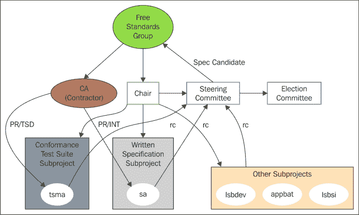
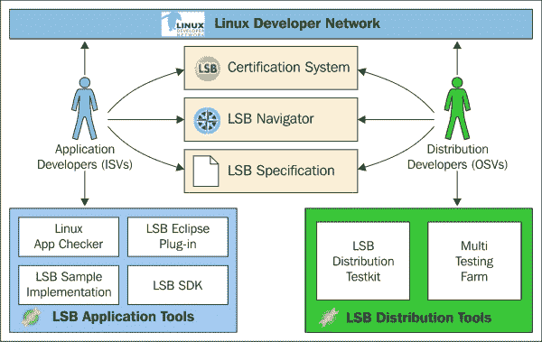
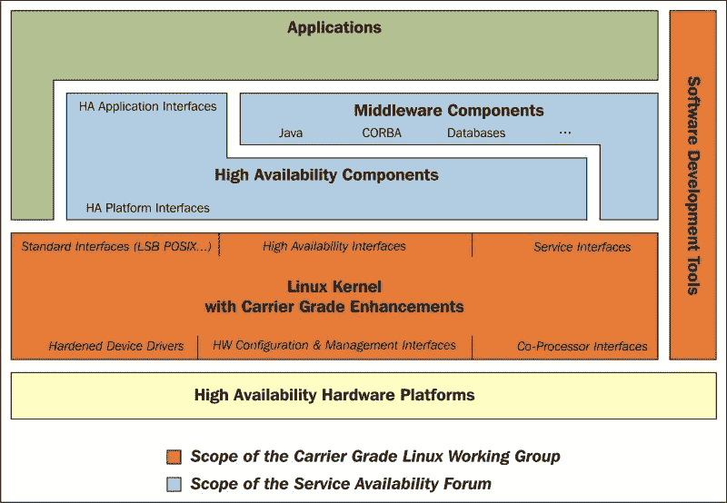

# 第十三章：CGL 和 LSB

在本章中，您将了解本书最后一个主题的信息，即**Carrier Grade Linux**（**CGL**）和**Linux Standard Base**（**LSB**）倡议，当然还有与 Yocto 项目集成和支持相关的内容。这里也会提到这些标准及其规范的一些信息，以及 Yocto 为它们提供的支持水平。我还将介绍一些与 CGL 相关的倡议，如**Automotive Grade Linux**和**Carrier Grade Virtualization**。它们也构成了一系列可行的解决方案，适用于各种应用。

在今天的任何 Linux 环境中，都需要一个可用的 Linux 发行版的通用语言。如果没有定义实际的规范，这种通用语言是无法实现的。这些规范的一部分也由载波级别的替代方案代表。它与本书或其他类似书籍中已经介绍的其他规范共存。查看可用的规范和标准化只会向我们展示 Linux 生态系统随着时间的推移已经发展了多少。

Linux 基金会发布的最新报告显示了 Linux 内核的开发实际情况，工作情况，赞助情况，对其进行的更改以及发展速度。该报告可在[`www.linuxfoundation.org/publications/linux-foundation/who-writes-linux-2015`](https://www.linuxfoundation.org/publications/linux-foundation/who-writes-linux-2015)上找到。

报告中描述，不到 20％的内核开发是由个人开发者完成的。大部分开发是由公司完成的，比如英特尔、红帽、Linaro、三星等。这意味着超过 80％的 Linux 内核开发人员是为他们的工作而获得报酬的。Linaro 和三星是提交次数最多的公司之一，这只是一种对 ARM 处理器和特别是 Android 的有利看法。

另一个有趣的信息是，超过一半的 Linux 内核开发人员是第一次提交。这意味着只有很少一部分开发者在做大部分的工作。Linux 基金会正在尝试通过为学生提供各种项目来减少 Linux 内核开发过程中的这种功能障碍。这是否成功，只有时间才能告诉我们，但我认为他们正在做正确的事情，朝着正确的方向发展。

所有这些信息都是针对 Linux 内核解释的，但其中的一部分也适用于其他开源组件。我想在这里强调的是，Linux 中的 ARM 支持比 PowerPC 或 MIPS 等架构要成熟得多。这不仅已经变得显而易见，而且也表明了英特尔 x86 阶段所采取的方法。到目前为止，这种方法还没有受到任何干扰。

# Linux 标准基础

LSB 似乎降低了 Linux 平台提供的支持成本，通过减少各种可用 Linux 发行版之间的差异。它还有助于应用程序的移植成本。每当开发人员编写应用程序时，他们需要确保在一个 Linux 发行版上产生的源代码也能在其他发行版上执行。他们还希望确保这在多年内仍然可能。

LSB 工作组是 Linux 基金会的一个项目，旨在解决这些确切的问题。为此，LSB 工作组开始制定一个描述 Linux 发行版应支持的一组 API 的标准。随着标准的定义，工作组还进一步开发了一套工具和测试来衡量支持水平。通过这样做，他们能够定义一定的符合性集，并检测各种发行版之间的差异。

LSB 是 Linux 基金会在这个方向上的首次努力，成为了所有试图为 Linux 平台的各个领域提供标准化的工作组的总称。所有这些工作组都有相同的路线图，并提供相应的规范、软件组件（如符合性测试、开发工具）以及其他可用的样本和实现。

由工作组开发的每个软件组件，如果在 Linux 标准基础中可用，都被定义为`lsb`模块。所有这些模块都有一个共同的格式，以便更容易地进行集成。有必需的和可选的模块。必需的模块是符合 LSB 接受标准的模块。可选的模块仍在进行中，在规范定义的时候，还没有写入接受标准，但将包括在未来版本的 LSB 标准中。

当然，也有一些工作组并不生产`lsb`模块。他们也没有制定标准，而是在项目中集成了各种补丁，比如 Linux 内核或其他软件包，甚至是文档。这一节只考虑与 LSB 相关的工作组。

不时地，每当发布新的规范文档时，测试工具包也会提供给供应商，以测试该工具包对特定版本的合规性。供应商可以测试他们的产品的合规性，可以是一个应用程序或一个 Linux 发行版。测试工具包的结果是一个证书，表明他们的产品是 LSB 认证的。对于应用程序，我们当然有一个**LSB 应用程序测试工具包**。也有一个类似的工具包适用于 Linux 发行版，以及适用于各种发行版的其他工具包。

对于对可选模块感兴趣的供应商，这些模块不仅可用于帮助供应商准备未来的 LSB 合规认证，还可以让他们接触到可选模块，以便从他们那里获得更多的评价和贡献。此外，供应商的投票与这些模块在未来 LSB 规范文档中的存在有关，这一发布也很重要。供应商可以确定一个可选模块是否符合未来的纳入条件。

LSB 工作组由指导委员会管理，并由选举产生的主席领导。这两个实体代表了工作组的利益。工作组采用粗略共识模式运作。这表明了工作组对特定问题的解决方案，即由选举产生的主席确定的解决方案。如果贡献者不认同他们的决定，并且不符合达成粗略共识所需的标准，那么就会向指导委员会提出申诉。

LSB 工作组的所有业务都在一个开放的论坛内进行。它可以包括邮件列表、会议、维基页面，甚至是面对面的会议；这些活动对工作组成员都是开放的。此外，成员资格并不受限制，决定也都有明确的记录，因为随时可能会就某个特定主题进行进一步讨论。

工作组中有明确定义的角色：

+   **贡献者**：这指的是积极参与的个人。他们始终有名单可供主席查阅，但任何个人都可以要求被列入贡献者名单。

+   **主席**：这指的是代表项目领导者。一个人被贡献者选举到这个职位，并得到指导委员会和 Linux 基金会董事会的批准。一旦当选，他们可以连任两年。没有限制一个人可以当选的次数。如果指导委员会或 Linux 基金会董事会对其缺乏信任，就会被免职。职位空缺后，将进行新的选举。在空缺期间，指导委员会将指定一名代理主席。

+   **选举委员会**：这指的是由指导委员会为主席选举成立的贡献者委员会。它负责在主席任期到期前至少 30 天或主席职位空缺后 10 天内选择主席候选人。它负责进行选举，通过电子投票进行。每个人只能投一票；投票是秘密的，只有符合条件的成员才能进行投票。投票期为一周，然后结果提交给指导委员会，由其批准并宣布获胜者。

+   **指导委员会**：它由代表工作组利益相关者组成。他们可能是发行商、OEM 厂商、ISV、上游开发人员，以及 LSB 宪章下的 LSB 子工作组的主席。该委员会由主席任命，并根据他们在工作组活动中的参与程度，可以无限期地保持职位。一个成员可以被指导委员会的三个实体之一罢免：主席、其他指导委员会成员，或 Linux 基金会董事会。

这是一张展示 LSB 工作组更详细结构的图片：



LSB 是一个相当复杂的结构，正如前面的图片所示，因此如果需要，工作组可以定义更多的角色。工作组的主要焦点仍然是其使命；为了实现这一目标，需要推广和培育新的工作组。它们需要一定程度的独立性，但也需要对 LSB 主席所做的活动负责。这主要涉及确保满足某些截止日期，并确保项目按照其路线图进行。

与 LSB 可交付成果互动的第一步应该是确定目标系统需要满足的确切 LSB 要求。规范分为两个组成部分：与体系结构相关和与体系结构无关，或者也称为通用组件。与体系结构相关的组件包含三个模块：

+   核心

+   C++

+   桌面

与体系结构无关的组件包含五个模块：

+   核心

+   C++

+   桌面

+   打印

+   语言

当然，还有另一种结构用于对它们进行排序。在这里，我指的是其中一些是强制性的，而另一些处于试验和测试阶段。第一类是为了拥有符合 LSB 标准的发行版，而第二类并不是拥有符合标准的发行版的严格要求，但可能代表未来几个版本 LSB 的候选人。

以下图片代表 LSB 的关键可交付组件。我希望它能指导您了解该项目的组件，并收集您未来与 LSB 工作组各个组件互动所需的信息。



根据用户的兴趣，他们可以选择与发行版开发或应用程序组件开发进行交互。正如前面的图像清楚地显示的那样，这两条道路都有适合工作的工具。在开始工作之前，请确保查看 LSB Navigator 的网站并收集所需的信息。对于对 LSB 导航器感兴趣的用户，可以在以下链接中找到一个演示，其中还涉及与 Yocto 的交互。确保您查看并与之交互，以了解其工作原理。

### 注意

可以在[`www.linuxbase.org/navigator/commons/welcome.php`](http://www.linuxbase.org/navigator/commons/welcome.php)访问 LSB Navigator。

假设交互已经完成，现在您有兴趣参与这个项目。当然，有多种方法可以做到这一点。无论您是开发人员还是软件供应商，您的反馈对任何项目都是有帮助的。此外，对于希望通过代码做出贡献的开发人员，有多个组件和工具可以从您的帮助中受益。这还不是全部。有许多测试框架和测试基础设施始终需要改进，因此某人不仅可以通过代码做出贡献，还可以进行错误修复和工具的开发或测试。还要记住，您的反馈总是受到赞赏的。

在进入下一节之前，我想再介绍一件事。如前图所示，任何由开发人员执行的与 LSB 工作组组件相关的活动，都应在检查 LSB 规范并选择适当版本之后进行。例如，在 CGL 规范中，至少需要 LSB 3.0，并且在相同的要求描述中指出了所需的模块。对于希望了解所需规范及其组件的开发人员，请参阅[`refspecs.linuxfoundation.org/lsb.shtml`](http://refspecs.linuxfoundation.org/lsb.shtml)。确保您还检查了新推出的 LSB 5 规范的进展，该规范已经通过了测试阶段，目前处于 RC1 状态。有关此的更多信息，请访问[`www.linuxfoundation.org/collaborate/workgroups/lsb/lsb-50-rc1`](https://www.linuxfoundation.org/collaborate/workgroups/lsb/lsb-50-rc1)。

### 注意

有关 LSB 的更多信息，请访问[`www.linuxfoundation.org/collaborate/workgroups/lsb`](http://www.linuxfoundation.org/collaborate/workgroups/lsb)。

# 运营商级别选项

本节将讨论多种选项，并且我们将从定义术语*运营商级别*开始。这似乎是一个完美的开始。那么，在电信环境中，这个术语是什么意思呢？它指的是一个真正可靠的系统、软件，甚至硬件组件。在这里，我不仅指的是 CGL 提供的五个九或六个九，因为并非所有行业和场景都需要这种可靠性。我们只会提到在项目范围内可以定义为可靠的东西。要将系统、软件或硬件组件定义为运营商级别，它还应该经过全面测试，并具有各种功能，如高可用性、容错性等。

这些五个九和六个九指的是产品可用时间占 99.999 或 99.9999％。这意味着每年的停机时间约为五个九的 5 分钟和六个九的 30 秒。解释完这一点后，我将继续介绍运营商级别的可用选项。

## 运营商级别 Linux

这是第一个也是最古老的选项。它出现是因为电信行业需要定义一组规范，从而为基于 Linux 的操作系统定义一组标准。实施后，这将使系统具备运营商级别的能力。

CGL 背后的动机是提出一个开放架构作为电信系统中已有的专有和闭源解决方案的可能解决方案或替代方案。开放架构的替代方案不仅因为它避免了单一形式，不难维护、扩展和开发，而且它还提供了速度的优势。拥有一个解耦并使其组件对更多软件或硬件工程师可访问的系统更快、更便宜。所有这些组件最终都能够达到相同的目的。

该工作组最初由**开放源开发实验室**（**OSDL**）发起，后来与自由标准组合并形成了 Linux 基金会。现在所有工作都转移到那里，包括工作组。CGL 的最新可用版本是 5.0，其中包括 Wind River、MontaVista 和 Red Flag 等注册的 Linux 发行版。

OSDL CGL 工作组有三类 CGL 可能适用的应用程序：

+   **信令服务器应用程序**：包括为呼叫和服务提供控制服务的产品，如路由、会话控制和状态。这些产品通常处理大量连接，大约有 1 万到 10 万个同时连接，而且由于它们有需要在毫秒内从进程中获取结果的实时要求。

+   **网关应用程序**：提供技术和管理域的桥接。除了已经提到的特征，这些应用程序在实时环境中处理大量连接，但接口数量并不是很多。它们还要求在通信过程中不丢失帧或数据包。

+   **管理应用程序**：通常提供计费操作、网络管理和其他传统服务。它们对实时操作没有同样强烈的要求，而是集中于快速数据库操作和其他面向通信的请求。

为了确保它能满足前述类别，CGL 工作组专注于两项主要活动。第一项涉及与前述类别的沟通，确定它们的需求，并编写应该由分发供应商实施的规范。第二项涉及收集和帮助满足规范中定义的要求的项目。总之，CGL 试图代表的不仅是电信行业代表和 Linux 发行版，还有最终用户和服务提供商；它还为每个类别提供了运营商级别的选项。

每个希望获得 CGL 认证的发行供应商都会提供其实施作为模板。它填充了软件包的版本、名称和其他额外信息。然而，它在不披露太多有关实施过程的信息的情况下进行，这些软件包可能是专有软件。此外，披露的信息由供应商拥有和维护。CGL 工作组只显示供应商提供的链接。

规范文档现在已经到了 5.0 版本，包含了对于载波级认证的 Linux 发行版中实际上是强制性的或可选的应用程序的要求。强制性的要求由 P1 优先级描述，可选的要求标记为 P2。其他元素与缺口方面有关，表示一个功能，由于没有针对它的开源实现，因此未实现。规范文档中提出了这些要求，以激励发行版开发人员为其做出贡献。

如下图所示，并且在规范文档中强调的信息中所述，CGL 系统应提供大量功能：



由于功能数量的要求很大，工作组决定将它们分成以下各类：

+   **可用性**：对于单节点的可用性和恢复是相关的。

+   **集群**：它描述了在从个体系统构建集群中有用的组件。其背后的关键目标是系统的高可用性和负载平衡，这也可能带来一些性能改进。

+   **可维护性**：它涵盖了系统的维护和维修功能。

+   **性能**：它描述了一些功能，如实时要求等，可以帮助系统实现更好的性能。

+   **标准**：这些作为各种 API、标准和规范的参考。

+   **硬件**：它提供了必要的载波级操作系统的各种硬件特定支持。其中大部分来自参与此过程的硬件供应商，而这一部分的要求在最新的 CGL 规范发布中已大大减少。

+   **安全**：它代表了构建安全系统所需的相关功能。

### 注意

有关 CGL 要求的更多信息，请参考[`www.linuxfoundation.org/sites/main/files/CGL_5.0_Specification.pdf`](https://www.linuxfoundation.org/sites/main/files/CGL_5.0_Specification.pdf)。您还可以参考 CGL 工作组[`www.linuxfoundation.org/collaborate/workgroups/cgl`](https://www.linuxfoundation.org/collaborate/workgroups/cgl)。

## 汽车级 Linux

汽车级 Linux 也是 Linux 基金会的一个工作组。它是新成立的，试图提供一个具有汽车应用的开源解决方案。它的主要重点是车载信息娱乐领域，但它还包括远程信息系统和仪表盘。它的努力基于已经可用的开源组件。这些组件适用于它的目的，并且还试图实现快速开发，这在这个行业中是非常需要的。

工作组的目标是：

+   一个透明、协作和开放的环境，涉及到的元素。

+   一个专注于汽车的 Linux 操作系统堆栈，利用开源社区的支持，如开发人员、学术组件和公司。

+   开源社区的集体声音这次以相反的形式发布，从 AGL 到社区。

+   用于快速原型设计的嵌入式 Linux 发行版。

通过使用项目，如 Tizen，作为参考发行版，并拥有像 Jaguar、Nissan、路虎或丰田这样的项目，这个项目足够有趣，值得密切关注。它刚刚被开发出来，但有改进的潜力。对于那些对此感兴趣的人，请参考[`www.linuxfoundation.org/collaborate/workgroups/automotive-grade-linux`](https://www.linuxfoundation.org/collaborate/workgroups/automotive-grade-linux)。该项目的维基页面是一个有趣的资源，可以在[`wiki.automotivelinux.org/`](https://wiki.automotivelinux.org/)上查阅。

## 运营商级虚拟化

CGL 的最新发展使得虚拟化成为运营商级领域的一个有趣选择，因为它涉及到降低成本以及透明地利用运行单核设计应用程序的多核设备。虚拟化选项也需要满足其他运营商级系统的期望。

运营商级虚拟化一直试图成为集成在已有的运营商级平台中的一个重要组成部分。这是为了保留系统的属性和性能。它还试图扩展设备目标，并允许**原始设备制造商**（OEM）从与 CGL 相同的支持中获益。这些好处以成熟的目标形式存在。

虚拟化的应用更加广泛，可以看到从 x86 架构到基于 ARM 和 DSP 的处理器以及各种领域。从运营商级的角度来看虚拟化的研究是这个解决方案的重点，因为这样可以更清晰地看到需要改进的领域。通过这种方式，可以识别这些领域，并根据需要进行改进。不幸的是，这个倡议并没有像其他一些倡议那样被广泛宣传，但它仍然是一个非常好的文档来源，并且可以从 virtualLogix 的[`www.linuxpundit.com/documents/CGV_WP_Final_FN.pdf`](http://www.linuxpundit.com/documents/CGV_WP_Final_FN.pdf)获取。希望你喜欢它的内容。

# Yocto 项目的特定支持

在 Poky 参考系统中，支持 LSB 和兼容 LSB 应用程序的开发。在 Poky 中，有一个特殊的`poky-lsb.conf`分发策略配置，如果一个发行版有兴趣开发符合 LSB 标准的应用程序，就需要定义这个配置。这在生成一个符合 LSB 标准的 Linux 发行版或者至少准备获得 LSB 认证时是成立的。这里将介绍准备 LSB 认证所需的 Linux 发行版构建步骤。如果你有兴趣开发符合 LSB 标准的应用程序，这个过程会更简单，也会在这里简要介绍；然而，这与前者相反。

第一步很简单：只需要克隆 poky 存储库和`meta-qt3`依赖层，因为 LSB 模块的要求。

```
git clone git://git.yoctoproject.org/poky.git
git clone git://git.yoctoproject.org/meta-qt3

```

接下来，需要创建构建目录：

```
source oe-init-build-env -b ../build_lsb

```

在`conf/bblayers.conf`文件中，只需要添加`meta-qt3`层。在`conf/local.conf`文件中，应选择相应的机器。我建议选择一个性能强大的平台，但如果为这样的演示提供了足够的 CPU 和内存，使用模拟架构，比如`qemuppc`，也应该足够了。还要确保将`DISTRO`变量更改为`poky-lsb`。所有这些准备就绪后，构建过程可以开始。这需要以下命令：

```
bitbake core-image-lsb

```

生成的二进制文件在所选的机器上生成并引导后，用户可以使用`LSB_Test.sh`脚本运行所有测试，该脚本还设置了 LSB 测试框架环境，或者运行特定的测试套件：

```
/usr/bin/LSB_Test.sh

```

你也可以使用以下命令：

```
cd /opt/lsb/test/manager/utils
./dist-checker.pl –update
./dist-checker.pl –D –s 'LSB 4.1' <test_suite>

```

如果各种测试未通过，系统需要重新配置以确保所需的兼容性水平。在`meta/recipes-extended/images`中，除了`core-image-lsb.bb`配方外，还有两个类似的配方：

+   `core-image-lsb-sdk.bb`：它包括一个`meta-toolchain`和生成应用程序开发所需的必要库和开发头文件

+   `core-image-lsb-dev.bb`：适用于目标开发工作，因为它包括`dev-pkgs`，这些包暴露了特定于图像的软件包所需的头文件和库

在 Yocto 项目中，有一个名为`meta-cgl`的层，旨在成为 CGL 倡议的基石。它汇集了 CGL 工作组定义的所有可用和必需的软件包。该层的格式试图为将来支持各种机器上的 CGL 设置舞台。在`meta-cgl`层内，有两个子目录：

+   `meta-cgl-common`：这是活动的焦点位置，也是在 poky 内提供支持的子目录，例如`qemuarm`，`qemuppc`等。

+   `meta-cgl-fsl-ppc`：这是一个定义 BSP 特定支持的子目录。如果需要其他机器的支持，应该提供这样的层。

正如我已经提到的，`meta-cgl`层负责 CGL 支持。正如之前提到的，CGL 的要求之一是具有 LSB 支持，而这种支持在 Poky 内是可用的。它作为一个特定要求集成在这个层内。`meta-cgl`层的另一个建议是将所有可用的软件包分组到定义各种类别的软件包组中。可用的软件包组非常通用，但所有可用的软件包都集成在一个称为`packagegroup-cgl.bb`的核心软件包组中。

该层还公开了一个符合 CGL 的操作系统镜像。该镜像试图首先包含各种 CGL 特定的要求，并打算通过包含 CGL 规范文档中定义的所有要求来增长。除了符合 CGL 要求并准备进行 CGL 认证的结果 Linux 操作系统外，该层还试图定义一个特定于 CGL 的测试框架。这项任务可能看起来类似于 LSB 检查兼容性所需的任务，但我向您保证它并不相同。它不仅需要根据定义的规范制定一个特定于 CGL 的语言定义，还需要一系列与语言定义保持同步的测试定义。此外，有一些要求可以通过一个软件包或软件包的功能来满足，这些要求应该被收集并组合在一起。还有各种其他情景可以被解释和正确回答；这是使 CGL 测试成为一项艰巨任务的条件。

在`meta-cgl`层内，有以下软件包的配方：

+   `cluster-glue`

+   `cluster-resource-agents`

+   `corosync`

+   `heartbeat`

+   `lksctp-tools`

+   `monit`

+   `ocfs2-tools`

+   `openais`

+   `pacemaker`

+   `openipmi`

除了这些配方，还有其他一些对于各种 CGL 要求是必要的。`meta-cgl`倡议所提供的支持正如前面所述的那样。它还将包含这些软件包：

+   `evlog`

+   `mipv6-daemon-umip`

+   `makedumpfile`

所有这些都是必要的，以提供具有 LSB 支持和 CGL 兼容性的基于 Linux 的操作系统。这将在适当的时候完成，也许当这本书到达您手中时，该层将以其最终格式存在，并成为 CGL 兼容性的标准。

我现在将开始解释一些您可能在 CGL 环境中遇到的软件包。我将首先从 Heartbeat 守护程序开始，它为集群服务提供通信和成员资格。将其放置在那里将使客户端能够确定其他机器上可用进程的当前状态，并与它们建立通信。

为了确保 Heartbeat 守护程序是有用的，它需要与**集群资源管理器**（**CRM**）一起使用，后者负责启动和停止各种服务，以获得高可用性的 Linux 系统。这个 CRM 被称为**Pacemaker**，它无法检测资源级别的故障，只能与两个节点进行交互。随着时间的推移，它得到了改进，现在有更好的支持和额外的用户界面可用。其中一些服务如下：

+   **crm shell**：这是由 Dejan Muhamedagic 实现的命令行界面，用于隐藏 XML 配置并帮助进行交互。

+   **高可用性 Web 控制台**：这是一个 AJAX 前端

+   **Heartbeat GUI**：这是一个提供大量相关信息的高级 XML 编辑器

+   **Linux 集群管理控制台（LCMC）**：它最初是**DRBD-管理控制台**（**DRBD-MC**），是一个用于 Pacemaker 管理目的的 Java 平台。

Pacemaker 接受三种类型的资源代理（资源代理代表集群资源之间的标准接口）。资源代理是 Linux-HA 管理的项目，由 ClusterLabs 的人员提供和维护。根据所选择的类型，它能够执行操作，如对给定资源的启动/停止，监视，验证等。支持的资源代理包括：

+   LSB 资源代理

+   OCF 资源代理

+   传统的 Heartbeat 资源代理

**Cluster Glue**是与 Pacemaker/Heartbeat 一起使用的一组库、实用程序和工具。它基本上是将集群资源管理器（我指的是 Pacemaker）和消息传递层（可能是 Heartbeat）之间的一切联系在一起的粘合剂。尽管它最初是 Heartbeat 的一个组件，但现在它作为 Linux-HA 子项目的一个独立组件进行管理。它有一些有趣的组件：

+   **Local Resource Manager (LRM)**：它充当 Pacemaker 和资源代理之间的接口，不具备集群感知能力。其任务包括处理从 CRM 接收的命令，将其传递给资源代理，并报告这些活动。

+   **Shoot The Other Node In The Head (STONITH)**：这是一种机制，用于通过使集群认为已经死亡的节点来进行节点围栏，以便将其从中移除并防止任何交互风险。

+   **hb_report**：这是一个经常用于故障修复和隔离问题的错误报告实用程序。

+   **集群管道库**：这是一个低级别的集群间通信库。

### 注意

有关 Linux-HA 的更多信息，以下链接可能会有所帮助：[`www.linux-ha.org/doc/users-guide/users-guide.html`](http://www.linux-ha.org/doc/users-guide/users-guide.html)

接下来的元素是 Corosync 集群引擎。它是从 OpenAIS 衍生出来的项目，即将介绍。它是一个具有一系列功能和实现的组通信系统，试图提供高可用性支持，并在 BSD 许可下授权。其功能包括以下内容：

+   一个用于在故障发生时重新启动应用程序的可用性管理器。

+   一个关于仲裁状态及其是否已经实现的仲裁系统通知。

+   一个支持同步以复制状态机的封闭进程组通信模型。

+   一个驻留在内存中的配置和统计数据库。它提供了接收、检索、设置和更改各种通知的能力。

接下来，我们将看看 OpenAIS。这是由**Service Availability Forum**（**SA**或**SA Forum**）提供的**Application Interface Specification**（**AIS**）的开放实现。它代表了提供高可用性支持的接口。OpenAIS 中的源代码随着时间的推移在 OpenAIS 中进行了重构，只剩下了 SA Forum 特定的 API 和 Corosync 中的核心基础设施组件。OpenAIS 与 Heartbeat 非常相似；事实上，它是 Heartbeat 的替代品，是行业标准特定的。它也得到了 Pacemaker 的支持。

### 注意

有关 AIS 的更多信息可以在其维基百科页面和 SA 论坛网站上找到[`www.saforum.org/page/16627~217404/Service-Availability-Forum-Application-Interface-Specification`](http://www.saforum.org/page/16627~217404/Service-Availability-Forum-Application-Interface-Specification)。

接下来是`ocfs2-tools`软件包。这是一组实用程序，可以以创建、调试、修复或管理 OCFS2 文件系统的形式进行工作。它包括与 Linux 用户习惯的非常相似的工具，如`mkfs.ocfs2`、`mount.ocfs2 fsck.ocfs2`、`tunefs.ocfs2`和`debugfs.ocfs2`。

**Oracle Cluster File System** (**OCFS**)是由 Oracle 开发的第一个共享磁盘文件系统，并在 GNU 通用公共许可证下发布。它不是一个符合 POSIX 标准的文件系统，但当 OCFS2 出现并集成到 Linux 内核中时，情况发生了变化。随着时间的推移，它成为了一个分布式锁管理器，能够提供高可用性和高性能。现在它被用于各种场合，如虚拟化、数据库集群、中间件和设备。以下是它的一些显著特点：

+   优化的分配

+   REFLINKs

+   元数据校验和

+   索引目录

+   每个 inode 的扩展属性

+   用户和组配额

+   高级安全性，如 SELinux 和 POSIX ACL 支持

+   集群感知工具，如前面提到的工具，包括 mkfs、tunefs、fsck、mount 和 debugfs

+   内置的具有分布式锁管理器的 Clusterstack

+   日志记录

+   可变块和簇大小

+   缓冲，内存映射，拼接，直接，异步 I/O

+   架构和端中立

`lksctp-tools`软件包是一个 Linux 用户空间实用程序，包括一个库和适当的 C 语言头文件，用于与 SCTP 接口进行交互。自 2.6 版本以来，Linux 内核就支持 SCTP，因此用户空间兼容性工具的存在对任何人来说都不足为奇。Lksctp 提供对 SCTP 基于套接字的 API 的访问。该实现是根据 IETF 互联网草案制定的，可在[`tools.ietf.org/html/draft-ietf-tsvwg-sctpsocket-15`](http://tools.ietf.org/html/draft-ietf-tsvwg-sctpsocket-15)上找到。它提供了一种灵活和一致的开发基于套接字的应用程序的方法，利用了**Stream Control Transmission Protocol**（**SCTP**）。

SCTP 是一种面向消息的传输协议。作为传输层协议，它在 IPv4 或 IPv6 实现上运行，并且除了 TCP 的功能外，还提供对这些功能的支持：

+   多流

+   消息帧

+   多宿

+   有序和无序消息传递

+   安全和认证

这些特殊功能对于行业载波级系统是必要的，并且在电话信令等领域中使用。

### 注意

有关 SCTP 的更多信息，请访问[`www.ietf.org/rfc/rfc2960.txt`](http://www.ietf.org/rfc/rfc2960.txt)和[`www.ietf.org/rfc/rfc3286.txt`](http://www.ietf.org/rfc/rfc3286.txt)

现在，我将稍微改变一下节奏，解释一下**monit**，这是一个非常小但功能强大的实用程序，用于监视和管理系统。它在自动维护和修复 Unix 系统方面非常有用，例如 BSD 发行版、各种 Linux 发行版以及可能包括 OS X 在内的其他平台。它可用于各种任务，包括文件监视、文件系统更改以及与事件进程的交互，如果通过各种阈值。

很容易配置和控制 monit，因为所有配置都基于易于理解的基于令牌的语法。此外，它提供了各种日志和关于其活动的通知。它还提供了一个网页浏览器界面，以便更容易访问。因此，拥有一个通用的系统资源管理器，也很容易与之交互，使 monit 成为运营商级 Linux 系统的选择。如果您有兴趣了解更多信息，请访问项目的网站[`mmonit.com/monit/`](http://mmonit.com/monit/)。

**OpenIPMI**是**智能平台管理接口**（**IPMI**）的实现，旨在提供对 IPMI 所有功能的访问，并为更容易使用提供抽象。它由两个组件组成：

+   可插入 Linux 内核的内核驱动程序

+   提供 IPMI 的抽象功能并提供对操作系统使用的各种服务的访问的库

IPMI 代表一组计算机接口规范，旨在通过提供智能和自主的系统来监视和管理主机系统的功能，从而降低总体拥有成本。这里我们不仅指的是操作系统，还包括固件和 CPU 本身。这个智能接口的开发由英特尔领导，现在得到了令人印象深刻的公司的支持。

### 注意

有关 IPMI、OpenIMPI 和其他支持的 IPMI 驱动程序和功能的更多信息，请访问[`openipmi.sourceforge.net/`](http://openipmi.sourceforge.net/)和[`www.intel.com/content/www/us/en/servers/ipmi/ipmi-home.html`](http://www.intel.com/content/www/us/en/servers/ipmi/ipmi-home.html)。

`meta-cgl`层中还应该有一些软件包，但在撰写本章时，它们仍然不可用。我将从`mipv6-daemon-umip`开始，它试图为**移动互联网协议版本 6**（**MIPv6**）守护程序提供数据分发。**UMIP**是一个基于 MIPL2 的开源移动 IPv6 堆栈，维护着最新的内核版本。该软件包是**UniverSAl playGround** **for Ipv6**（**USAGI**）项目对 MIPL2 的一组补丁，该项目试图为 Linux 系统提供 IPsec（IPv6 和 IPv4 选项）和 IPv6 协议栈实现的行业就绪质量。

### 注意

有关 UMIP 的更多信息，请访问[`umip.linux-ipv6.org/index.php?n=Main.Documentation`](http://umip.linux-ipv6.org/index.php?n=Main.Documentation)。

**Makedumfile**是一个工具，可以压缩转储文件的大小，并且还可以排除不需要进行分析的内存页面。对于一些 Linux 发行版，它与一个名为`kexec-tools`的软件包一起提供，可以使用运营商级规范支持的软件包管理器 RPM 在您的发行版中安装。它与`gzip`或`split`等命令非常相似。它只接收来自 ELF 格式文件的输入，这使得它成为`kdumps`的首选。

另一个有趣的项目是`evlog`，这是一个**用于企业级系统的 Linux 事件记录系统**。它也符合 POSIX 标准，并提供了从`printk`到`syslog`以及其他内核和用户空间函数的各种形式的日志记录。输出事件以符合 POSIX 标准的格式提供。它还在选择与特定定义的过滤器匹配的日志或注册特殊事件格式时提供支持。只有在满足注册的事件过滤器时才能通知这些事件。它的功能确实使这个软件包变得有趣，并且可以在[`evlog.sourceforge.net/`](http://evlog.sourceforge.net/)上找到。

还有许多其他软件包可以包含到`meta-cgl`层中。查看注册的 CGL 发行版可以帮助你了解这样一个项目的复杂性。为了更容易地访问这个列表，请参考[`www.linuxfoundation.org/collaborate/workgroups/cgl/registered-distributions`](http://www.linuxfoundation.org/collaborate/workgroups/cgl/registered-distributions)以简化搜索过程。

与`meta-cgl`层互动的第一步是确保所有相互依赖的层都可用。关于如何构建兼容运营级的 Linux 镜像的最新信息始终可以在附加的`README`文件中找到。我在这里也给出了一个示例以进行演示：

```
git clone git://git.yoctoproject.org/poky.git
cd ./poky
git clone git://git.yoctoproject.org /meta-openembedded.git
git clone git://git.enea.com/linux/meta-cgl.git
git clone git://git.yoctoproject.org/meta-qt3
git clone git://git.yoctoproject.org/meta-virtualization
git clone git://git.yoctoproject.org/meta-selinux
git clone git://git.yoctoproject.org/meta-cloud-services
git clone git://git.yoctoproject.org/meta-security
git clone https://github.com/joaohf/meta-openclovis.git

```

接下来，需要创建和配置构建目录：

```
source oe-init-build-env -b ../build_cgl

```

在`conf/bblayers.conf`文件中，需要添加以下层：

```
meta-cgl/meta-cgl-common
meta-qt3
meta-openembedded/meta-networking
meta-openembedded/meta-filesystems
meta-openembedded/meta-oe
meta-openembedded/meta-perl
meta-virtualization
meta-openclovis
meta-selinux
meta-security
meta-cloud-services/meta-openstack
```

在`conf/local.conf`文件中，应选择相应的机器。我建议选择`qemuppc`，以及可以更改为`poky-cgl`的`DISTRO`变量。由于食谱的重复，应该提供`BBMASK`：

```
BBMASK = "meta-openembedded/meta-oe/recipes-support/multipath-tools"
```

有了这些准备，构建过程就可以开始了。这个过程的必要命令是：

```
bitbake core-image-cgl

```

确保你有时间花在这上面，因为构建可能需要一段时间，这取决于你的主机系统的配置。

# 总结

在本章中，你们了解了运营级 Linux 和 Linux 标准基础所需的规范信息。其他选项，如汽车级和运营级虚拟化，也得到了解释，最后，为了完成这个学习过程，我向你们展示了对 Yocto 项目的支持和一些演示。

这是本书的最后一章，我希望你们喜欢这段旅程。同时，我希望我能够把我所学到的一些信息传递给你们。既然我们已经到了这本书的结尾，我必须承认在写书的过程中我也学到了新的信息。我希望你们也能对 Yocto 项目产生兴趣，并且能够为 Yocto 项目和开源社区做出贡献。我相信从现在开始，嵌入式世界对你来说将不再有太多秘密。确保你也向其他人阐明这个话题！
