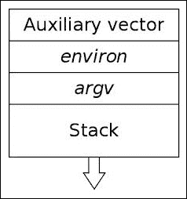

# 第二章：ELF 二进制格式

要逆向工程 Linux 二进制文件，您必须了解二进制格式本身。 ELF 已成为 Unix 和类 Unix 操作系统的标准二进制格式。在 Linux、BSD 变体和其他操作系统中，ELF 格式用于可执行文件、共享库、目标文件、核心转储文件，甚至内核引导映像。这使得学习 ELF 对于那些想要更好地理解逆向工程、二进制黑客和程序执行的人来说非常重要。诸如 ELF 之类的二进制格式通常不是一个快速的学习过程，学习 ELF 需要一定程度的应用，随着学习的进行，需要实际的动手经验才能达到熟练程度。ELF 格式复杂而枯燥，但在逆向工程和编程任务中应用您不断发展的对它的知识时，可以带来一些乐趣。ELF 实际上是计算机科学的一个令人难以置信的组成部分，包括程序加载、动态链接、符号表查找以及许多其他紧密协调的组件。

我认为这一章也许是整本书中最重要的，因为它将使读者对程序实际在磁盘上是如何映射并加载到内存中有更深入的了解。程序执行的内部工作是复杂的，理解它对于有抱负的二进制黑客、逆向工程师或低级程序员来说是宝贵的知识。在 Linux 中，程序执行意味着 ELF 二进制格式。

我的学习 ELF 的方法是通过调查 ELF 规范，就像任何 Linux 逆向工程师应该做的那样，然后以创造性的方式应用我们所学到的每个方面。在本书中，您将了解 ELF 的许多方面，并看到对病毒、进程内存取证、二进制保护、rootkit 等知识的重要性。

在本章中，您将涵盖以下 ELF 主题：

+   ELF 文件类型

+   程序头

+   段头

+   符号

+   重定位

+   动态链接

+   编写 ELF 解析器

# ELF 文件类型

ELF 文件可以标记为以下类型之一：

+   `ET_NONE`：这是一个未知类型。它表示文件类型未知，或者尚未定义。

+   `ET_REL`：这是一个可重定位文件。ELF 类型可重定位意味着文件被标记为可重定位的代码片段，有时也称为目标文件。可重定位目标文件通常是尚未链接到可执行文件中的**位置无关代码**（**PIC**）的片段。您经常会在编译代码库中看到`.o`文件。这些文件保存了适用于创建可执行文件的代码和数据。

+   `ET_EXEC`：这是一个可执行文件。ELF 类型可执行意味着文件被标记为可执行文件。这些类型的文件也被称为程序，并且是进程开始运行的入口点。

+   `ET_DYN`：这是一个共享对象。ELF 类型动态意味着文件被标记为动态可链接的目标文件，也称为共享库。这些共享库在运行时加载和链接到程序的进程映像中。

+   `ET_CORE`：这是一个 ELF 类型的核心文件。核心文件是在程序崩溃时或进程传递了 SIGSEGV 信号（段错误）时，对完整进程映像的转储。GDB 可以读取这些文件，并帮助调试以确定是什么导致程序崩溃。

如果我们使用命令`readelf -h`查看 ELF 文件，我们可以查看初始 ELF 文件头。 ELF 文件头从 ELF 文件的偏移 0 开始，并用作文件的其余部分的映射。主要是，此标头标记了 ELF 类型，体系结构和执行开始的入口点地址，并提供了到其他类型的 ELF 标头（部分标头和程序标头）的偏移量，这将在后面深入解释。一旦我们解释了部分标头和程序标头的含义，就会更多地了解文件标头。查看 Linux 中的 ELF(5) man 页面可以显示 ELF 标头结构：

```
#define EI_NIDENT 16
           typedef struct {
               unsigned char e_ident[EI_NIDENT];
               uint16_t      e_type;
               uint16_t      e_machine;
               uint32_t      e_version;
               ElfN_Addr     e_entry;
               ElfN_Off      e_phoff;
               ElfN_Off      e_shoff;
               uint32_t      e_flags;
               uint16_t      e_ehsize;
               uint16_t      e_phentsize;
               uint16_t      e_phnum;
               uint16_t      e_shentsize;
               uint16_t      e_shnum;
               uint16_t      e_shstrndx;
           } ElfN_Ehdr;
```

在本章后面，我们将看到如何利用此结构中的字段来使用简单的 C 程序映射出 ELF 文件。首先，我们将继续查看其他存在的 ELF 标头类型。

# ELF 程序头

ELF 程序头描述了二进制文件中的段，并且对于程序加载是必要的。在加载时，内核通过段来理解并描述可执行文件在磁盘上的内存布局以及它应该如何转换到内存中。程序头表可以通过引用初始 ELF 标头成员`e_phoff`（程序头表偏移）中找到的偏移量来访问，如显示`1.7`中的`ElfN_Ehdr`结构所示。

这里有五种常见的程序头类型，我们将在这里讨论。程序头描述可执行文件（包括共享库）的段以及它是什么类型的段（即，它为何保留了什么类型的数据或代码）。首先，让我们看看 32 位 ELF 可执行文件的程序头表中组成程序头条目的`Elf32_Phdr`结构。

### 注意

我们有时将程序头称为 Phdrs 在本书的其余部分。

这是`Elf32_Phdr`结构：

```
typedef struct {
    uint32_t   p_type;   (segment type)
    Elf32_Off  p_offset; (segment offset)
    Elf32_Addr p_vaddr;   (segment virtual address)
    Elf32_Addr p_paddr;    (segment physical address)
    uint32_t   p_filesz;   (size of segment in the file)
    uint32_t   p_memsz; (size of segment in memory)
    uint32_t   p_flags; (segment flags, I.E execute|read|read)
    uint32_t   p_align;  (segment alignment in memory)
  } Elf32_Phdr;
```

## PT_LOAD

可执行文件将始终至少有一个`PT_LOAD`类型段。这种类型的程序头描述了一个可加载段，这意味着该段将被加载或映射到内存中。

例如，具有动态链接的 ELF 可执行文件通常包含以下两个可加载段（类型为`PT_LOAD`）：

+   程序代码的文本段

+   以及全局变量和动态链接信息的数据段

前两个段将被映射到内存中，并且将根据`p_align`中存储的值在内存中对齐。我建议在 Linux 中阅读 ELF man 页面，以了解 Phdr 结构中的所有成员，因为它们描述了文件中的段以及内存中的布局。

程序头主要用于描述程序在执行和内存中的布局。我们将在本章后面使用 Phdrs 来演示它们是什么以及如何在逆向工程软件中使用它们。

### 注意

文本段（也称为代码段）通常将段权限设置为`PF_X` | `PF_R`（`读+执行`）。

数据段通常将段权限设置为`PF_W` | `PF_R`（`读+写`）。

受多态病毒感染的文件可能以某种方式更改了这些权限，例如通过将`PF_W`标志添加到程序头的段标志（`p_flags`）中，从而修改文本段为可写。

## PT_DYNAMIC - 动态段的 Phdr

动态段是特定于动态链接的可执行文件，包含动态链接器所需的信息。此段包含标记值和指针，包括但不限于以下内容：

+   要在运行时链接的共享库列表

+   **全局偏移表**（**GOT**）的地址/位置在*ELF 动态链接*部分讨论

+   有关重定位条目的信息

以下是标签名称的完整列表：

| 标签名称 | 描述 |
| --- | --- |
| `DT_HASH` | 符号哈希表的地址 |
| `DT_STRTAB` | 字符串表的地址 |
| `DT_SYMTAB` | 符号表的地址 |
| `DT_RELA` | Rela 重定位表的地址 |
| `DT_RELASZ` | Rela 表的字节大小 |
| `DT_RELAENT` | Rela 表条目的字节大小 |
| `DT_STRSZ` | 字符串表的字节大小 |
| `DT_STRSZ` | 字符串表的字节大小 |
| `DT_STRSZ` | 字符串表的字节大小 |
| `DT_SYMENT` | 符号表条目的字节大小 |
| `DT_INIT` | 初始化函数的地址 |
| `DT_FINI` | 终止函数的地址 |
| `DT_SONAME` | 共享对象名称的字符串表偏移 |
| `DT_RPATH` | 库搜索路径的字符串表偏移 |
| `DT_SYMBOLIC` | 提醒链接器在可执行文件之前搜索此共享对象的符号 |
| `DT_REL` | Rel 重定位表的地址 |
| `DT_RELSZ` | Rel 表的字节大小 |
| `DT_RELENT` | Rel 表条目的字节大小 |
| `DT_PLTREL` | PLT 引用的重定位类型（Rela 或 Rel） |
| `DT_DEBUG` | 调试的未定义用途 |
| `DT_TEXTREL` | 缺少此项表示不可写段不应用任何重定位 |
| `DT_JMPREL` | 仅用于 PLT 的重定位条目的地址 |
| `DT_BIND_NOW` | 指示动态链接器在将控制转移给可执行文件之前处理所有重定位 |
| `DT_RUNPATH` | 库搜索路径的字符串表偏移 |

动态段包含一系列结构，其中包含相关的动态链接信息。`d_tag`成员控制`d_un`的解释。

32 位 ELF 动态结构：

```
typedef struct {
Elf32_Sword    d_tag;
    union {
Elf32_Word d_val;
Elf32_Addr d_ptr;
    } d_un;
} Elf32_Dyn;
extern Elf32_Dyn _DYNAMIC[];
```

我们将在本章后面更多地探讨**动态链接**。

## PT_NOTE

类型为`PT_NOTE`的段可能包含对特定供应商或系统相关的辅助信息。以下是来自正式 ELF 规范的`PT_NOTE`的定义：

有时供应商或系统构建者需要使用特殊信息标记对象文件，其他程序将检查符合性、兼容性等。`SHT_NOTE`类型的节和`PT_NOTE`类型的程序头元素可用于此目的。节和程序头元素中的注释信息包含任意数量的条目，每个条目都是目标处理器格式的 4 字节字数组。下面的标签有助于解释注释信息的组织，但它们不是规范的一部分。

一个值得注意的地方：由于这个段仅用于 OS 规范信息，实际上对于可执行文件的运行并不是必需的（因为系统无论如何都会假定可执行文件是本地的），这个段成为病毒感染的有趣地方，尽管由于大小限制，这并不一定是最实际的方法。关于 NOTE 段感染的一些信息可以在[`vxheavens.com/lib/vhe06.html`](http://vxheavens.com/lib/vhe06.html)找到。

## PT_INTERP

这个小段只包含一个指向空终止字符串的位置和大小，描述了程序解释器的位置；例如，`/lib/linux-ld.so.2`通常是动态链接器的位置，也是程序解释器的位置。

## PT_PHDR

此段包含程序头表本身的位置和大小。Phdr 表包含文件（以及内存映像中）描述段的所有 Phdr。

请参阅 ELF(5)手册页面或 ELF 规范文件，以查看所有可能的 Phdr 类型。我们已经涵盖了最常见的那些对程序执行至关重要的，或者在我们的逆向工程努力中最常见的那些。

我们可以使用`readelf -l <filename>`命令查看文件的 Phdr 表：

```
Elf file type is EXEC (Executable file)
Entry point 0x8049a30
There are 9 program headers, starting at offset 52
Program Headers:
  Type          Offset   VirtAddr   PhysAddr   FileSiz MemSiz  Flg Align
  PHDR          0x000034 0x08048034 0x08048034 0x00120 0x00120 R E 0x4
  INTERP        0x000154 0x08048154 0x08048154 0x00013 0x00013 R   0x1
      [Requesting program interpreter: /lib/ld-linux.so.2]
  LOAD          0x000000 0x08048000 0x08048000 0x1622c 0x1622c R E 0x1000
  LOAD          0x016ef8 0x0805fef8 0x0805fef8 0x003c8 0x00fe8 RW  0x1000
  DYNAMIC       0x016f0c 0x0805ff0c 0x0805ff0c 0x000e0 0x000e0 RW  0x4
  NOTE          0x000168 0x08048168 0x08048168 0x00044 0x00044 R   0x4
  GNU_EH_FRAME  0x016104 0x0805e104 0x0805e104 0x0002c 0x0002c R   0x4
  GNU_STACK     0x000000 0x00000000 0x00000000 0x00000 0x00000 RW  0x4
  GNU_RELRO     0x016ef8 0x0805fef8 0x0805fef8 0x00108 0x00108 R   0x1
```

我们可以看到可执行文件的入口点，以及我们刚刚讨论过的一些不同的段类型。注意两个第一个`PT_LOAD`段的权限标志和对齐标志右侧的偏移量。

文本段是`READ+EXECUTE`，数据段是`READ+WRITE`，两个段的对齐方式都是`0x1000`或 4,096，这是 32 位可执行文件的页面大小，用于程序加载时的对齐。

# ELF 节头

现在我们已经看过程序头是什么，是时候看看节头了。我在这里真的想指出两者之间的区别；我经常听到人们将节称为段，将段称为节等等。节不是段。段对于程序执行是必要的，在每个段内，都有被分成节的代码或数据。节头表存在是为了引用这些节的位置和大小，主要用于链接和调试。节头对于程序执行并不是必要的，一个程序没有节头表也可以正常执行。这是因为节头表并不描述程序的内存布局。这是程序头表的责任。节头实际上只是程序头的补充。`readelf -l`命令将显示哪些节映射到哪些段，这有助于可视化节和段之间的关系。

如果节头被剥离（在二进制文件中缺失），这并不意味着节不存在；这只是意味着它们不能被节头引用，调试器和反汇编程序的信息就会更少。

每个节都包含某种类型的代码或数据。数据可以是程序数据，如全局变量，或者对于链接器而言是必要的动态链接信息。现在，正如之前提到的，每个 ELF 对象都有节，但并非所有 ELF 对象都有**节头**，主要是当有人故意删除了节头表时，这不是默认情况。

通常，这是因为可执行文件已被篡改（例如，节头已被剥离，使得调试更加困难）。GNU 的所有 binutils，如`objcopy`，`objdump`，以及`gdb`等其他工具都依赖于节头来定位存储在包含符号数据的节中的符号信息。没有节头，诸如`gdb`和`objdump`之类的工具几乎是无用的。

节头对于对我们正在查看的 ELF 对象的部分或节进行细粒度检查非常方便。事实上，节头使得逆向工程变得更加容易，因为它们为我们提供了使用某些需要它们的工具的能力。例如，如果节头表被剥离，那么我们就无法访问`.dynsym`这样的节，其中包含描述函数名称和偏移/地址的导入/导出符号。

### 注意

即使一个可执行文件的节头表被剥离，一个中等的逆向工程师实际上可以通过从某些程序头获取信息来重建节头表（甚至部分符号表），因为这些信息总是存在于程序或共享库中。我们之前讨论过动态段和包含有关符号表和重定位条目信息的不同`DT_TAG`。我们可以使用这些信息来重建可执行文件的其他部分，如第八章中所示的*ECFS – 扩展核心文件快照技术*。

以下是 32 位 ELF 节头的样子：

```
typedef struct {
uint32_t   sh_name; // offset into shdr string table for shdr name
    uint32_t   sh_type; // shdr type I.E SHT_PROGBITS
    uint32_t   sh_flags; // shdr flags I.E SHT_WRITE|SHT_ALLOC
    Elf32_Addr sh_addr;  // address of where section begins
    Elf32_Off  sh_offset; // offset of shdr from beginning of file
    uint32_t   sh_size;   // size that section takes up on disk
    uint32_t   sh_link;   // points to another section
    uint32_t   sh_info;   // interpretation depends on section type
uint32_t   sh_addralign; // alignment for address of section
uint32_t   sh_entsize;  // size of each certain entries that may be in section
} Elf32_Shdr;
```

让我们再次看一下一些最重要的节和节类型，同时留出空间来研究 ELF(5)手册页和官方 ELF 规范，以获取有关节的更详细信息。

## .text 节

`.text`部分是包含程序代码指令的代码部分。在可执行程序中，如果还有 Phdr's，此部分将位于文本段的范围内。因为它包含程序代码，所以它是部分类型`SHT_PROGBITS`。

## .rodata 部分

`rodata`部分包含只读数据，例如来自 C 代码行的字符串，例如以下命令存储在此部分中：

```
printf("Hello World!\n");
```

此部分是只读的，因此必须存在于可执行文件的只读段中。因此，您将在文本段的范围内找到`.rodata`（而不是数据段）。因为此部分是只读的，所以它是类型`SHT_PROGBITS`。

## .plt 部分

**过程链接表**（**PLT**）将在本章后面深入讨论，但它包含动态链接器调用从共享库导入的函数所需的代码。它位于文本段中，并包含代码，因此标记为类型`SHT_PROGBITS`。

## .data 部分

`data`部分，不要与数据段混淆，将存在于数据段中，并包含诸如初始化的全局变量之类的数据。它包含程序变量数据，因此标记为`SHT_PROGBITS`。

## .bss 部分

`bss`部分包含未初始化的全局数据作为数据段的一部分，因此除了代表该部分本身的 4 个字节外，在磁盘上不占用任何空间。数据在程序加载时初始化为零，并且数据可以在程序执行期间分配值。`bss`部分标记为`SHT_NOBITS`，因为它不包含实际数据。

## .got.plt 部分

**全局偏移表**（**GOT**）部分包含全局偏移表。这与 PLT 一起工作，以提供对导入的共享库函数的访问，并在运行时由动态链接器修改。这个部分特别经常被攻击者滥用，他们在堆或`.bss`漏洞中获得了指针大小的写入原语。我们将在本章的*ELF 动态链接*部分中讨论这一点。这个部分与程序执行有关，因此标记为`SHT_PROGBITS`。

## .dynsym 部分

`dynsym`部分包含从共享库导入的动态符号信息。它包含在文本段中，并标记为类型`SHT_DYNSYM`。

## .dynstr 部分

`dynstr`部分包含动态符号的字符串表，其中包含一系列以空字符结尾的每个符号的名称。

## .rel.*部分

重定位部分包含有关 ELF 对象或进程映像的部分需要在链接或运行时进行修复或修改的信息。我们将在本章的*ELF 重定位*部分中更多地讨论重定位。重定位部分标记为类型`SHT_REL`，因为它包含重定位数据。

## .hash 部分

`hash`部分，有时称为`.gnu.hash`，包含符号查找的哈希表。在 Linux ELF 中使用以下哈希算法进行符号名称查找：

```
uint32_t
dl_new_hash (const char *s)
{
        uint32_t h = 5381;

        for (unsigned char c = *s; c != '\0'; c = *++s)
                h = h * 33 + c;

        return h;
}
```

### 注意

`h = h * 33 + c`经常编码为`h = ((h << 5) + h) + c`

## .symtab 部分

`symtab`部分包含类型为`ElfN_Sym`的符号信息，我们将在本章的 ELF 符号和重定位部分中更仔细地分析。`symtab`部分标记为类型`SHT_SYMTAB`，因为它包含符号信息。

## .strtab 部分

`.strtab`部分包含由`.symtab`中的`ElfN_Sym`结构的`st_name`条目引用的符号字符串表，并标记为类型`SHT_STRTAB`，因为它包含字符串表。

## .shstrtab 部分

`shstrtab`部分包含节头字符串表，它是一组包含每个节的名称的空字符终止字符串，例如`.text`、`.data`等。这个部分由 ELF 文件头条目`e_shstrndx`指向，该条目保存了`.shstrtab`的偏移量。这个部分标记为`SHT_STRTAB`，因为它包含一个字符串表。

## .ctors 和.dtors 部分

`.ctors`（**构造函数**）和`.dtors`（**析构函数**）部分包含指向初始化和终结代码的函数指针，该代码将在实际`main()`程序代码体之前和之后执行。

### 注意

`__constructor__`函数属性有时被黑客和病毒作者使用，以实现执行反调试技巧的函数，例如调用`PTRACE_TRACEME`，以便进程跟踪自身，没有调试器可以附加到它。这样，反调试代码在程序进入`main()`之前执行。

还有许多其他部分名称和类型，但我们已经涵盖了大多数在动态链接可执行文件中找到的主要部分。现在可以通过`phdrs`和`shdrs`来可视化可执行文件的布局。

文本段将如下：

+   【.text】：这是程序代码

+   【.rodata】：这是只读数据

+   【.hash】：这是符号哈希表

+   【.dynsym】：这是共享对象符号数据

+   【.dynstr】：这是共享对象符号名称

+   【.plt】：这是过程链接表

+   【.rel.got】：这是 G.O.T 重定位数据

数据段将如下：

+   【.data】：这些是全局初始化变量

+   【.dynamic】：这些是动态链接结构和对象

+   【.got.plt】：这是全局偏移表

+   【.bss】：这些是全局未初始化变量

让我们看一下带有`readelf –S`命令的`ET_REL`文件（目标文件）部分头：

```
ryan@alchemy:~$ gcc -c test.c
ryan@alchemy:~$ readelf -S test.o
```

以下是 12 个部分头，从偏移 0x124 开始：

```
  [Nr] Name              Type            Addr           Off
       Size              ES              Flg  Lk   Inf   Al
  [ 0]                   NULL            00000000    000000
       000000            00                   0    0     0
  [ 1] .text             PROGBITS        00000000       000034
       000034            00              AX   0    0     4
  [ 2] .rel.text         REL             00000000       0003d0
       000010            08                   10   1     4
  [ 3] .data             PROGBITS        00000000 000068
       000000            00              WA   0    0     4
  [ 4] .bss              NOBITS          00000000       000068
       000000            00              WA   0    0     4
  [ 5] .comment          PROGBITS        00000000       000068
       00002b            01              MS   0    0     1
  [ 6] .note.GNU-stack   PROGBITS        00000000       000093
       000000            00                   0    0     1
  [ 7] .eh_frame         PROGBITS        00000000       000094
       000038            00              A    0    0     4
  [ 8] .rel.eh_frame     REL             00000000       0003e0
       000008            08                   10   7     4
  [ 9] .shstrtab         STRTAB          00000000       0000cc
       000057            00                   0    0     1
  [10] .symtab           SYMTAB          00000000       000304
       0000b0            10                   11   8     4
  [11] .strtab           STRTAB          00000000       0003b4
       00001a            00                   0    0     1
```

可重定位对象（类型为`ET_REL`的 ELF 文件）中不存在程序头，因为`.o`文件是用来链接到可执行文件的，而不是直接加载到内存中；因此，`readelf -l`在`test.o`上不会产生结果。Linux 可加载内核模块实际上是`ET_REL`对象，并且是一个例外，因为它们确实直接加载到内核内存中，并且在运行时重新定位。

我们可以看到我们讨论过的许多部分都存在，但也有一些不存在。如果我们将`test.o`编译成可执行文件，我们将看到许多新的部分已被添加，包括`.got.plt`、`.plt`、`.dynsym`和其他与动态链接和运行时重定位相关的部分：

```
ryan@alchemy:~$ gcc evil.o -o evil
ryan@alchemy:~$ readelf -S evil
```

以下是 30 个部分头，从偏移 0x1140 开始：

```
  [Nr] Name              Type            Addr           Off
       Size              ES              Flg  Lk  Inf   Al
  [ 0]                   NULL            00000000       000000
       000000            00                   0   0     0
  [ 1] .interp           PROGBITS        08048154       000154
       000013            00              A    0   0     1
  [ 2] .note.ABI-tag     NOTE            08048168       000168
       000020            00              A    0   0     4
  [ 3] .note.gnu.build-i NOTE            08048188       000188
       000024            00              A    0   0     4
  [ 4] .gnu.hash         GNU_HASH        080481ac       0001ac
       000020            04              A    5   0     4
  [ 5] .dynsym           DYNSYM          080481cc       0001cc
       000060            10              A    6   1     4
  [ 6] .dynstr           STRTAB          0804822c       00022c
       000052            00              A    0   0     1
  [ 7] .gnu.version      VERSYM          0804827e       00027e
       00000c            02              A    5   0     2
  [ 8] .gnu.version_r    VERNEED         0804828c       00028c
       000020            00              A    6   1     4
  [ 9] .rel.dyn          REL             080482ac       0002ac
       000008            08              A    5   0     4
  [10] .rel.plt          REL             080482b4       0002b4
       000020            08              A    5   12    4
  [11] .init             PROGBITS        080482d4       0002d4
       00002e            00              AX   0   0     4
  [12] .plt              PROGBITS        08048310       000310
       000050            04              AX   0   0     16
  [13] .text             PROGBITS        08048360       000360
       00019c            00              AX   0   0     16
  [14] .fini             PROGBITS        080484fc       0004fc
       00001a            00              AX   0   0     4
  [15] .rodata           PROGBITS        08048518       000518
       000008            00              A    0   0     4
  [16] .eh_frame_hdr     PROGBITS        08048520       000520
       000034            00              A    0   0     4
  [17] .eh_frame         PROGBITS        08048554       000554
       0000c4            00              A    0   0     4
  [18] .ctors            PROGBITS        08049f14       000f14
       000008            00              WA   0   0     4
  [19] .dtors            PROGBITS        08049f1c       000f1c
       000008            00              WA   0   0     4
  [20] .jcr              PROGBITS        08049f24       000f24
       000004            00              WA   0   0     4
  [21] .dynamic          DYNAMIC         08049f28       000f28
       0000c8            08              WA   6   0     4
  [22] .got              PROGBITS        08049ff0       000ff0
       000004            04              WA   0   0     4
  [23] .got.plt          PROGBITS        08049ff4       000ff4
       00001c            04              WA   0   0     4
  [24] .data             PROGBITS        0804a010       001010
       000008            00              WA   0   0     4
  [25] .bss              NOBITS          0804a018       001018
       000008            00              WA   0   0     4
  [26] .comment          PROGBITS        00000000       001018
       00002a            01              MS   0   0     1
  [27] .shstrtab         STRTAB          00000000       001042
       0000fc            00                   0   0     1
  [28] .symtab           SYMTAB          00000000       0015f0
       000420            10                   29  45    4
  [29] .strtab           STRTAB          00000000       001a10
       00020d            00                   0   0
```

正如观察到的，已经添加了许多部分，其中最重要的是与动态链接和构造函数相关的部分。我强烈建议读者跟随推断哪些部分已更改或添加以及添加部分的目的的练习。请参阅 ELF(5)手册页或 ELF 规范。

# ELF 符号

符号是对某种类型的数据或代码的符号引用，例如全局变量或函数。例如，`printf()`函数将在动态符号表`.dynsym`中有一个指向它的符号条目。在大多数共享库和动态链接的可执行文件中，存在两个符号表。在先前显示的`readelf -S`输出中，您可以看到两个部分：`.dynsym`和`.symtab`。

`.dynsym`包含引用外部源的全局符号，例如`libc`函数如`printf`，而`.symtab`中包含所有`.dynsym`中的符号，以及可执行文件中的本地符号，例如全局变量，或者您在代码中定义的本地函数。因此，`.symtab`包含所有符号，而`.dynsym`只包含动态/全局符号。

所以问题是：如果`.symtab`已经包含了`.dynsym`中的所有内容，为什么还要有两个符号表？如果您查看可执行文件的`readelf -S`输出，您会发现一些部分被标记为**A**（**ALLOC**）或**WA**（**WRITE/ALLOC**）或**AX**（**ALLOC/EXEC**）。如果您查看`.dynsym`，您会发现它被标记为 ALLOC，而`.symtab`没有标志。

ALLOC 表示该部分将在运行时分配并加载到内存中，`.symtab`不会加载到内存中，因为对于运行时来说是不必要的。`.dynsym`包含只能在运行时解析的符号，因此它们是动态链接器在运行时所需的唯一符号。因此，虽然`.dynsym`符号表对于动态链接可执行文件的执行是必要的，但`.symtab`符号表仅用于调试和链接目的，并且通常会从生产二进制文件中剥离以节省空间。

让我们看看 64 位 ELF 文件的 ELF 符号条目是什么样子的：

```
typedef struct {
uint32_t      st_name;
    unsigned char st_info;
    unsigned char st_other;
    uint16_t      st_shndx;
    Elf64_Addr    st_value;
    Uint64_t      st_size;
} Elf64_Sym;
```

符号条目包含在`.symtab`和`.dynsym`部分中，这就是为什么这些部分的`sh_entsize`（部分头条目大小）等于`sizeof(ElfN_Sym)`。

## st_name

`st_name`包含符号表字符串表（位于`.dynstr`或`.strtab`中）中符号名称的偏移量，比如`printf`。

## st_value

`st_value`保存符号的值（地址或位置的偏移量）。

## st_size

`st_size`包含符号的大小，比如全局函数`ptr`的大小，在 32 位系统上为 4 字节。

## st_other

该成员定义了符号的可见性。

## st_shndx

每个符号表条目都与某个部分*定义*相关。该成员保存相关部分头表索引。

## st_info

`st_info`指定符号类型和绑定属性。有关这些类型和属性的完整列表，请参阅**ELF(5) man page**。符号类型以 STT 开头，而符号绑定以 STB 开头。例如，一些常见的如下部分所述。

### 符号类型

我们有以下符号类型：

+   `STT_NOTYPE`：符号类型未定义

+   `STT_FUNC`：符号与函数或其他可执行代码相关联

+   `STT_OBJECT`：符号与数据对象相关联

### 符号绑定

我们有以下符号绑定：

+   `STB_LOCAL`：局部符号对包含其定义的目标文件之外不可见，比如声明为静态的函数。

+   `STB_GLOBAL`：全局符号对于所有被合并的目标文件都是可见的。一个文件对全局符号的定义将满足另一个文件对相同符号的未定义引用。

+   `STB_WEAK`：类似于全局绑定，但优先级较低，意味着绑定是弱的，可能会被另一个未标记为`STB_WEAK`的符号（具有相同名称）覆盖。

有用于打包和解包绑定和类型字段的宏：

+   `ELF32_ST_BIND(info)`或`ELF64_ST_BIND(info)`从`st_info`值中提取绑定

+   `ELF32_ST_TYPE(info)`或`ELF64_ST_TYPE(info)`从`st_info`值中提取类型

+   `ELF32_ST_INFO(bind, type)`或`ELF64_ST_INFO(bind, type)`将绑定和类型转换为`st_info`值

让我们看看以下源代码的符号表：

```
static inline void foochu()
{ /* Do nothing */ }

void func1()
{ /* Do nothing */ }

_start()
{
        func1();
        foochu();
}
```

以下是查看函数`foochu`和`func1`的符号表条目的命令：

```
ryan@alchemy:~$ readelf -s test | egrep 'foochu|func1'
     7: 080480d8     5 FUNC    LOCAL  DEFAULT    2 foochu
     8: 080480dd     5 FUNC    GLOBAL DEFAULT    2 func1
```

我们可以看到`foochu`函数的值为`0x80480da`，是一个函数（`STT_FUNC`），具有局部符号绑定（`STB_LOCAL`）。如果你还记得，我们稍微谈到了`LOCAL`绑定，这意味着该符号在定义它的目标文件之外是不可见的，这就是为什么`foochu`是局部的，因为我们在源代码中使用了**static 关键字**声明它。

符号对每个人都更容易，它们是 ELF 对象的一部分，用于链接、重定位、可读的反汇编和调试。这让我想到了一个我在 2013 年编写的有用工具的话题，名为`ftrace`。类似于`ltrace`和`strace`，`ftrace`将跟踪二进制文件中进行的所有函数调用，并且还可以显示其他分支指令，比如跳转。我最初设计`ftrace`是为了帮助我在工作中没有源代码的情况下对二进制文件进行逆向。`ftrace`被认为是一种动态分析工具。让我们来看一下它的一些功能。我们用以下源代码编译一个二进制文件：

```
#include <stdio.h>

int func1(int a, int b, int c)
{
  printf("%d %d %d\n", a, b ,c);
}

int main(void)
{
  func1(1, 2, 3);
}
```

现在，假设我们没有前面的源代码，我们想知道它编译成的二进制文件的内部工作原理，我们可以在其上运行`ftrace`。首先让我们看一下概要：

```
ftrace [-p <pid>] [-Sstve] <prog>
```

用法如下：

+   `[-p]`：这按 PID 进行跟踪

+   `[-t]`：这是用于函数参数类型检测

+   `[-s]`：这会打印字符串值

+   `[-v]`：这提供详细输出

+   `[-e]`：这提供杂项 ELF 信息（符号、依赖项）

+   `[-S]`：这显示带有剥离符号的函数调用

+   `[-C]`：这完成控制流分析

让我们试一试：

```
ryan@alchemy:~$ ftrace -s test
[+] Function tracing begins here:
PLT_call@0x400420:__libc_start_main()
LOCAL_call@0x4003e0:_init()
(RETURN VALUE) LOCAL_call@0x4003e0: _init() = 0
LOCAL_call@0x40052c:func1(0x1,0x2,0x3)  // notice values passed
PLT_call@0x400410:printf("%d %d %d\n")  // notice we see string value
1 2 3
(RETURN VALUE) PLT_call@0x400410: printf("%d %d %d\n") = 6
(RETURN VALUE) LOCAL_call@0x40052c: func1(0x1,0x2,0x3) = 6
LOCAL_call@0x400470:deregister_tm_clones()
(RETURN VALUE) LOCAL_call@0x400470: deregister_tm_clones() = 7
```

一个聪明的人现在可能会问：如果二进制文件的符号表被剥离了会发生什么？没错，你可以剥离二进制文件的符号表；但是，动态链接的可执行文件将始终保留`.dynsym`，但如果被剥离，将丢弃`.symtab`，因此只有导入的库符号会显示出来。

如果二进制文件是静态编译的（`gcc-static`）或没有`libc`链接（`gcc-nostdlib`），然后用`strip`命令剥离，二进制文件将不再有符号表，因为动态符号表不再是必要的。`ftrace`在使用`-S`标志时的行为与众不同，该标志告诉`ftrace`即使没有符号附加到它，也要显示每个函数调用。使用`-S`标志时，`ftrace`将显示函数名称为`SUB_<address_of_function>`，类似于 IDA pro 将显示没有符号表引用的函数。

让我们看一下以下非常简单的源代码：

```
int foo(void) {
}

_start()
{
  foo();
  __asm__("leave");
}
```

前面的源代码只是调用了`foo()`函数然后退出。我们使用`_start()`而不是`main()`的原因是因为我们用以下方式编译它：

```
gcc -nostdlib test2.c -o test2
```

`gcc`标志`-nostdlib`指示链接器省略标准的`libc`链接约定，只需编译我们拥有的代码，而不多余的东西。默认的入口点是一个名为`_start()`的符号：

```
ryan@alchemy:~$ ftrace ./test2
[+] Function tracing begins here:
LOCAL_call@0x400144:foo()
(RETURN VALUE) LOCAL_call@0x400144: foo() = 0
Now let's strip the symbol table and run ftrace on it again:
ryan@alchemy:~$ strip test2
ryan@alchemy:~$ ftrace -S test2
[+] Function tracing begins here:
LOCAL_call@0x400144:sub_400144()
(RETURN VALUE) LOCAL_call@0x400144: sub_400144() = 0
```

我们现在注意到`foo()`函数已被`sub_400144()`替换，这表明函数调用发生在地址`0x400144`。现在如果我们在剥离符号之前看`test2`二进制文件，我们可以看到`0x400144`确实是`foo()`所在的地方：

```
ryan@alchemy:~$ objdump -d test2
test2:     file format elf64-x86-64
Disassembly of section .text:
0000000000400144<foo>:
  400144:   55                      push   %rbp
  400145:   48 89 e5                mov    %rsp,%rbp
  400148:   5d                      pop    %rbp
  400149:   c3                      retq   

000000000040014a <_start>:
  40014a:   55                      push   %rbp
  40014b:   48 89 e5                mov    %rsp,%rbp
  40014e:   e8 f1 ff ff ff          callq  400144 <foo>
  400153:   c9                      leaveq
  400154:   5d                      pop    %rbp
  400155:   c3                 retq
```

事实上，为了让你真正了解符号对逆向工程师（当我们拥有它们时）有多么有帮助，让我们看看`test2`二进制文件，这次没有符号，以演示它变得稍微不那么容易阅读。这主要是因为分支指令不再附有符号名称，因此分析控制流变得更加繁琐，需要更多的注释，而一些反汇编器如 IDA-pro 允许我们在进行时进行注释：

```
$ objdump -d test2
test2:     file format elf64-x86-64
Disassembly of section .text:
0000000000400144 <.text>:
  400144:   55                      push   %rbp  
  400145:   48 89 e5                mov    %rsp,%rbp
  400148:   5d                      pop    %rbp
  400149:   c3                      retq   
  40014a:   55                      push   %rbp 
  40014b:   48 89 e5                mov    %rsp,%rbp
  40014e:   e8 f1 ff ff ff          callq  0x400144
  400153:   c9                      leaveq
  400154:   5d                      pop    %rbp
  400155:   c3                      retq   
```

唯一能让我们知道新函数从哪里开始的方法是检查**过程序言**，它位于每个函数的开头，除非使用了(`gcc -fomit-frame-pointer`)，在这种情况下，识别起来就不那么明显了。

本书假设读者已经对汇编语言有一些了解，因为教授 x86 汇编不是本书的目标，但请注意前面加粗的过程序言，它有助于标明每个函数的开始。过程序言只是为每个被调用的新函数设置堆栈帧，通过在堆栈上备份基指针并将其值设置为在调整堆栈指针之前的堆栈指针的值。这样变量可以作为基指针寄存器`ebp/rbp`中存储的固定地址的正偏移来引用。

现在我们已经对符号有了一定的了解，下一步是理解重定位。在下一节中，我们将看到符号、重定位和部分如何紧密地联系在一起，并在 ELF 格式中处于相同的抽象层级。

# ELF 重定位

来自 ELF(5)手册页：

> *重定位是将符号引用与符号定义连接起来的过程。可重定位文件必须具有描述如何修改其部分内容的信息，从而允许可执行文件和共享对象文件保存进程的程序映像所需的正确信息。重定位条目就是这些数据。*

重定位的过程依赖于符号和部分，这就是为什么我们首先介绍符号和部分。在重定位中，有*重定位记录*，它们基本上包含了有关如何修补与给定符号相关的代码的信息。重定位实际上是一种用于二进制修补甚至在动态链接器涉及时在内存中进行热修补的机制。链接器程序：`/bin/ld`用于创建可执行文件和共享库，必须具有描述如何修补某些指令的元数据。这些元数据被存储为我们所谓的重定位记录。我将通过一个例子进一步解释重定位。

想象一下，有两个目标文件链接在一起创建可执行文件。我们有`obj1.o`包含调用名为`foo()`的函数的代码，该函数位于`obj2.o`中。链接器程序分析了`obj1.o`和`obj2.o`，并包含了重定位记录，以便它们可以链接在一起创建一个完全可工作的可执行程序。符号引用将被解析为符号定义，但这究竟是什么意思呢？目标文件是可重定位代码，这意味着它是代码，旨在被重定位到可执行段内的给定地址。在重定位过程发生之前，代码具有符号和代码，这些符号和代码在不知道它们在内存中的位置之前将无法正常工作或无法正确引用。这些必须在链接器首先知道它们在可执行段内的位置之后进行修补。

让我们快速看一下 64 位重定位条目：

```
typedef struct {
        Elf64_Addr r_offset;
        Uint64_t   r_info;
} Elf64_Rel;
```

有些重定位条目需要一个加数：

```
typedef struct {
        Elf64_Addr r_offset;
        uint64_t   r_info;
        int64_t    r_addend;
} Elf64_Rela;
```

`r_offset`指向需要进行重定位操作的位置。重定位操作描述了如何修补`r_offset`处包含的代码或数据的详细信息。

`r_info`给出了必须进行重定位的符号表索引以及要应用的重定位类型。

`r_addend`指定了用于计算可重定位字段中存储的值的常数加数。

32 位 ELF 文件的重定位记录与 64 位相同，但使用 32 位整数。以下示例将编译为 32 位的目标文件代码，以便我们可以演示**隐式加数**，这在 64 位中不常用。当重定位记录存储在不包含`r_addend`字段的 ElfN_Rel 类型结构中时，隐式加数就会发生，因此加数存储在重定位目标本身中。64 位可执行文件倾向于使用包含**显式加数**的`ElfN_Rela`结构。我认为值得理解这两种情况，但隐式加数有点更令人困惑，因此有必要对这一领域进行阐明。

让我们来看一下源代码：

```
_start()
{
   foo();
}
```

我们看到它调用了`foo()`函数。但是，`foo()`函数并不直接位于该源代码文件中；因此，在编译时，将创建一个重定位条目，以满足以后对符号引用的需求：

```
$ objdump -d obj1.o
obj1.o:     file format elf32-i386
Disassembly of section .text:
00000000 <func>:
   0:   55                      push   %ebp
   1:   89 e5                   mov    %esp,%ebp
   3:   83 ec 08                sub    $0x8,%esp
   6:   e8 fc ff ff ff          call 7 <func+0x7>
   b:   c9                      leave  
   c:   c3                      ret   
```

正如我们所看到的，对`foo()`的调用被突出显示，并包含值`0xfffffffc`，这是*隐式加数*。还要注意`call 7`。数字`7`是要修补的重定位目标的偏移量。因此，当`obj1.o`（调用位于`obj2.o`中的`foo()`）与`obj2.o`链接以生成可执行文件时，链接器会处理指向偏移量`7`的重定位条目，告诉它需要修改的位置（偏移量 7）。然后，链接器会修补偏移量 7 处的 4 个字节，使其包含`foo()`函数的真实偏移量，`foo()`在可执行文件中的某个位置。

### 注意

调用指令`e8 fc ff ff ff`包含隐式加数，对于这节课很重要；值`0xfffffffc`是`-(4)`或`-(sizeof(uint32_t))`。在 32 位系统上，一个双字是 4 个字节，这是重定位目标的大小。

```
$ readelf -r obj1.o

Relocation section '.rel.text' at offset 0x394 contains 1 entries:
 Offset     Info    Type            Sym.Value  Sym. Name
00000007  00000902 R_386_PC32        00000000   foo
```

正如我们所看到的，偏移量为 7 的重定位字段由重定位条目的`r_offset`字段指定。

+   `R_386_PC32`是重定位类型。要了解所有这些类型，请阅读 ELF 规范。每种重定位类型都需要对被修改的重定位目标进行不同的计算。`R_386_PC32`使用`S + A - P`修改目标。

+   `S`是重定位条目中索引的符号的值。

+   `A`是在重定位条目中找到的加数。

+   `P`是被重定位的存储单元的位置（段偏移量或地址）（使用`r_offset`计算）。

让我们看看在 32 位系统上编译`obj1.o`和`obj2.o`后，我们的可执行文件的最终输出：

```
$ gcc -nostdlib obj1.o obj2.o -o relocated
$ objdump -d relocated

test:     file format elf32-i386

Disassembly of section .text:

080480d8 <func>:
 80480d8:   55                      push   %ebp
 80480d9:   89 e5                   mov    %esp,%ebp
 80480db:   83 ec 08                sub    $0x8,%esp
 80480de:   e8 05 00 00 00          call   80480e8 <foo>
 80480e3:   c9                      leave  
 80480e4:   c3                      ret    
 80480e5:   90                      nop
 80480e6:   90                      nop
 80480e7:   90                      nop

080480e8 <foo>:
 80480e8:   55                      push   %ebp
 80480e9:   89 e5                   mov    %esp,%ebp
 80480eb:   5d                      pop    %ebp
 80480ec:   c3                      ret
```

我们可以看到，调用指令**(重定位目标)在 0x80480de**处已被修改为 32 位偏移值`5`，指向`foo()`。值`5`是`R386_PC_32`重定位操作的结果：

```
S + A – P: 0x80480e8 + 0xfffffffc – 0x80480df = 5
```

`0xfffffffc`与有符号整数中的`-4`相同，因此计算也可以看作：

```
0x80480e8 + (0x80480df + sizeof(uint32_t))
```

要计算虚拟地址的偏移量，请使用以下计算：

```
address_of_call + offset + 5 (Where 5 is the length of the call instruction)
```

在这种情况下是`0x80480de + 5 + 5 = 0x80480e8`。

### 注意

请注意这个计算，因为它很重要并且在频繁计算地址偏移时可以使用。

地址也可以通过以下计算得出偏移量：

```
address – address_of_call – 4 (Where 4 is the length of the immediate operand to the call instruction, which is 32bits).
```

如前所述，ELF 规范详细介绍了 ELF 重定位，并且我们将在下一节中讨论一些在动态链接中使用的类型，例如`R386_JMP_SLOT`重定位条目。

## 基于可重定位代码注入的二进制修补

可重定位代码注入是黑客、病毒作者或任何想要修改二进制代码的人可能利用的一种技术，作为一种在编译和链接为可执行文件之后重新链接二进制文件的方式。也就是说，您可以将一个目标文件注入到可执行文件中，更新可执行文件的符号表以反映新插入的功能，并对注入的目标代码执行必要的重定位，使其成为可执行文件的一部分。

一个复杂的病毒可能会使用这种技术，而不仅仅是附加位置无关代码。这种技术需要在目标可执行文件中腾出空间来注入代码，然后应用重定位。我们将在第四章中更全面地介绍二进制感染和代码注入，*ELF 病毒技术- Linux/Unix 病毒*。

如第一章中所述，*Linux 环境及其工具*，有一个名为*Eresi*（[`www.eresi-project.org`](http://www.eresi-project.org)）的神奇工具，它能够进行可重定位代码注入（又称`ET_REL`注入）。我还设计了一个用于 ELF 的自定义逆向工程工具，名为**Quenya**。它非常古老，但可以在[`www.bitlackeys.org/projects/quenya_32bit.tgz`](http://www.bitlackeys.org/projects/quenya_32bit.tgz)上找到。Quenya 具有许多功能和能力，其中之一就是将目标代码注入到可执行文件中。这对于通过劫持给定函数来修补二进制文件非常有用。Quenya 只是一个原型，从未像*Eresi*项目那样得到发展。我之所以使用它作为示例，是因为我对它更熟悉；然而，我会说，为了更可靠的结果，也许最好使用*Eresi*或编写自己的工具。

让我们假装我们是攻击者，我们想要感染一个调用`puts()`打印`Hello World`的 32 位程序。我们的目标是劫持`puts()`，使其调用`evil_puts()`：

```
#include <sys/syscall.h>
int _write (int fd, void *buf, int count)
{
  long ret;

  __asm__ __volatile__ ("pushl %%ebx\n\t"
"movl %%esi,%%ebx\n\t"
"int $0x80\n\t""popl %%ebx":"=a" (ret)
                        :"0" (SYS_write), "S" ((long) fd),
"c" ((long) buf), "d" ((long) count));
  if (ret >= 0) {
    return (int) ret;
  }
  return -1;
}
int evil_puts(void)
{
        _write(1, "HAHA puts() has been hijacked!\n", 31);
}
```

现在我们将`evil_puts.c`编译成`evil_puts.o`并将其注入到名为`./hello_world`的程序中：

```
$ ./hello_world
Hello World
```

这个程序调用以下内容：

```
puts("Hello World\n");
```

现在我们使用`Quenya`将我们的`evil_puts.o`文件注入和重定位到`hello_world`中：

```
[Quenya v0.1@alchemy] reloc evil_puts.o hello_world
0x08048624  addr: 0x8048612
0x080485c4 _write addr: 0x804861e
0x080485c4  addr: 0x804868f
0x080485c4  addr: 0x80486b7
Injection/Relocation succeeded
```

我们可以看到，来自我们的`evil_puts.o`目标文件的`write()`函数已经被重定位，并在可执行文件`hello_world`中分配了一个地址`0x804861e`。下一个命令劫持并覆盖了`puts()`的全局偏移表条目，将其地址替换为`evil_puts()`的地址：

```
[Quenya v0.1@alchemy] hijack binary hello_world evil_puts puts
Attempting to hijack function: puts
Modifying GOT entry for puts
Successfully hijacked function: puts
Committing changes into executable file
[Quenya v0.1@alchemy] quit
```

然后就成功了！

```
ryan@alchemy:~/quenya$ ./hello_world
HAHA puts() has been hijacked!
```

我们已经成功地将一个目标文件重定位到一个可执行文件中，并修改了可执行文件的控制流，使其执行我们注入的代码。如果我们在`hello_world`上使用`readelf -s`，我们现在实际上可以看到一个`evil_puts()`的符号。

为了您的兴趣，我已经包含了一个包含 Quenya ELF 重定位机制的小代码片段；如果没有看到代码库的其余部分，它可能有点晦涩，但如果您记住了我们学到的关于重定位的知识，它也是相当直接的。

```
switch(obj.shdr[i].sh_type)
{
case SHT_REL: /* Section contains ElfN_Rel records */
rel = (Elf32_Rel *)(obj.mem + obj.shdr[i].sh_offset);
for (j = 0; j < obj.shdr[i].sh_size / sizeof(Elf32_Rel); j++, rel++)
{
/* symbol table */ 
symtab = (Elf32_Sym *)obj.section[obj.shdr[i].sh_link]; 

/* symbol we are applying relocation to */
symbol = &symtab[ELF32_R_SYM(rel->r_info)];

/* section to modify */
TargetSection = &obj.shdr[obj.shdr[i].sh_info];
TargetIndex = obj.shdr[i].sh_info;

/* target location */
TargetAddr = TargetSection->sh_addr + rel->r_offset;

/* pointer to relocation target */
RelocPtr = (Elf32_Addr *)(obj.section[TargetIndex] + rel->r_offset);

/* relocation value */
RelVal = symbol->st_value; 
RelVal += obj.shdr[symbol->st_shndx].sh_addr;

printf("0x%08x %s addr: 0x%x\n",RelVal, &SymStringTable[symbol->st_name], TargetAddr);

switch (ELF32_R_TYPE(rel->r_info)) 
{
/* R_386_PC32      2    word32  S + A - P */ 
case R_386_PC32:
*RelocPtr += RelVal;
*RelocPtr -= TargetAddr;
break;

/* R_386_32        1    word32  S + A */
case R_386_32:
*RelocPtr += RelVal;
     break;
 } 
}
```

如前面的代码所示，`RelocPtr`指向的重定位目标将根据重定位类型（如`R_386_32`）请求的重定位操作进行修改。

虽然可重定位代码二进制注入是重定位背后思想的一个很好的例子，但它并不完美地展示了链接器如何在多个目标文件中实际执行。尽管如此，它仍然保留了重定位操作的一般思想和应用。接下来我们将讨论共享库（`ET_DYN`）注入，这将引出动态链接的话题。

# ELF 动态链接

在过去，一切都是静态链接的。如果程序使用外部库函数，整个库将直接编译到可执行文件中。ELF 支持动态链接，这是一种更高效的处理共享库的方式。

当程序加载到内存中时，动态链接器还会将需要的共享库加载到该进程的地址空间并绑定。动态链接的主题很少被人深入理解，因为它是一个相对复杂的过程，在底层似乎像魔术一样工作。在本节中，我们将揭示一些其复杂性并揭示它的工作原理，以及它如何被攻击者滥用。

共享库被编译为位置无关，因此可以很容易地重定位到进程地址空间中。共享库是一个动态 ELF 对象。如果你查看`readelf -h lib.so`，你会看到`e_type`（**ELF 文件类型**）被称为`ET_DYN`。动态对象与可执行文件非常相似。它们通常没有`PT_INTERP`段，因为它们是由程序解释器加载的，因此不会调用程序解释器。

当一个共享库被加载到进程地址空间时，必须满足引用其他共享库的任何重定位。动态链接器必须修改可执行文件的 GOT（全局偏移表）（位于`.got.plt`部分），这是一个位于数据段中的地址表。它位于数据段中，因为它必须是可写的（至少最初是这样；请参阅只读重定位作为安全功能）。动态链接器使用已解析的共享库地址修补 GOT。我们将很快解释**延迟链接**的过程。

## 辅助向量

当一个程序通过`sys_execve()`系统调用加载到内存时，可执行文件被映射并分配一个堆栈（以及其他内容）。该进程地址空间的堆栈被设置为以非常特定的方式传递信息给动态链接器。这种特定的设置和信息排列被称为**辅助向量**或**auxv**。堆栈的底部（因为堆栈在 x86 架构上向下增长，所以它的最高内存地址）加载了以下信息：



*[argc][argv][envp][auxiliary][.ascii data for argv/envp]*

辅助向量（或 auxv）是一系列 ElfN_auxv_t 结构。

```
typedef struct
{
  uint64_t a_type;              /* Entry type */
  union
    {
      uint64_t a_val;           /* Integer value */
    } a_un;
} Elf64_auxv_t;
```

`a_type`描述了 auxv 条目类型，`a_val`提供了它的值。以下是动态链接器需要的一些最重要的条目类型：

```
#define AT_EXECFD       2       /* File descriptor of program */
#define AT_PHDR         3       /* Program headers for program */
#define AT_PHENT        4       /* Size of program header entry */
#define AT_PHNUM        5       /* Number of program headers */
#define AT_PAGESZ       6       /* System page size */
#define AT_ENTRY        9       /* Entry point of program */
#define AT_UID          11      /* Real uid */
```

动态链接器从堆栈中检索有关正在执行的程序的信息。链接器必须知道程序头的位置，程序的入口点等。我之前列出了一些 auxv 条目类型，取自`/usr/include/elf.h`。

辅助向量是由一个名为`create_elf_tables()`的内核函数设置的，该函数位于 Linux 源代码`/usr/src/linux/fs/binfmt_elf.c`中。

实际上，从内核的执行过程看起来像下面这样：

1.  `sys_execve()` →。

1.  调用`do_execve_common()` →。

1.  调用`search_binary_handler()` →。

1.  调用`load_elf_binary()` →。

1.  调用`create_elf_tables()` →。

以下是`/usr/src/linux/fs/binfmt_elf.c`中`create_elf_tables()`的一些代码，用于添加 auxv 条目：

```
NEW_AUX_ENT(AT_PAGESZ, ELF_EXEC_PAGESIZE);
NEW_AUX_ENT(AT_PHDR, load_addr + exec->e_phoff);
NEW_AUX_ENT(AT_PHENT, sizeof(struct elf_phdr));
NEW_AUX_ENT(AT_PHNUM, exec->e_phnum);
NEW_AUX_ENT(AT_BASE, interp_load_addr);
NEW_AUX_ENT(AT_ENTRY, exec->e_entry);
```

正如你所看到的，ELF 入口点和程序头的地址等数值是使用内核中的`NEW_AUX_ENT()`宏放置到堆栈上的。

一旦程序加载到内存中并且辅助向量已经填充，控制就会传递给动态链接器。动态链接器解析链接到进程地址空间中的共享库的符号和重定位。默认情况下，可执行文件与 GNU C 库`libc.so`动态链接。`ldd`命令将显示给定可执行文件的共享库依赖关系。

## 了解 PLT/GOT

PLT（过程链接表）和 GOT（全局偏移表）可以在可执行文件和共享库中找到。我们将专门关注可执行程序的 PLT/GOT。当程序调用共享库函数，例如`strcpy()`或`printf()`时，这些函数直到运行时才被解析，必须存在一种机制来动态链接共享库并解析共享函数的地址。当动态链接程序被编译时，它以一种特定的方式处理共享库函数调用，与对本地函数的简单`call`指令完全不同。

让我们来看看 32 位编译的 ELF 可执行文件中 libc.so 函数`fgets()`的调用。我们将在示例中使用 32 位可执行文件，因为与 GOT 的关系更容易可视化，因为不使用 IP 相对寻址，就像在 64 位可执行文件中一样。

```
objdump -d test
 ...
 8048481:       e8 da fe ff ff          call   8048360<fgets@plt>
 ...
```

地址`0x8048360`对应于`fgets()`的 PLT 条目。让我们在可执行文件中查看该地址：

```
objdump -d test (grep for 8048360)
...
08048360<fgets@plt>:                    /* A jmp into the GOT */
 8048360:       ff 25 00 a0 04 08       jmp    *0x804a000
 8048366:       68 00 00 00 00          push   $0x0
 804836b:       e9 e0 ff ff ff          jmp    8048350 <_init+0x34>
...
```

因此，对`fgets()`的调用导致 8048360，这是`fgets()`的 PLT 跳转表条目。正如我们所看到的，在上文反汇编代码输出中，有一个间接跳转到存储在`0x804a000`处的地址。这个地址是 GOT（全局偏移表）条目，其中存储了 libc 共享库中实际`fgets()`函数的地址。

然而，第一次调用函数时，如果使用的是默认行为懒惰链接，那么动态链接器尚未解析其地址。懒惰链接意味着动态链接器不应在程序加载时解析每个函数。相反，它将在调用时解析函数，这是通过`.plt`和`.got.plt`部分（分别对应过程链接表和全局偏移表）实现的。可以通过`LD_BIND_NOW`环境变量将此行为更改为所谓的严格链接，以便所有动态链接都发生在程序加载时。懒惰链接增加了加载时间的性能，这就是为什么它是默认行为，但它也可能是不可预测的，因为链接错误可能要等到程序运行一段时间后才会发生。在多年的经验中，我只遇到过一次这种情况。值得注意的是，一些安全功能，即只读重定位，除非启用了严格链接，否则无法应用，因为`.plt.got`部分（以及其他部分）被标记为只读；这只能在动态链接器完成修补后发生，因此必须使用严格链接。

让我们来看看`fgets()`的重定位条目：

```
$ readelf -r test
Offset   Info      Type           SymValue    SymName
...
0804a000  00000107 R_386_JUMP_SLOT   00000000   fgets
...
```

### 注意

`R_386_JUMP_SLOT`是 PLT/GOT 条目的重定位类型。在`x86_64`上，它被称为`R_X86_64_JUMP_SLOT`。

请注意，重定位偏移量是地址 0x804a000，与`fgets()` PLT 跳转到的相同地址。假设`fgets()`是第一次被调用，动态链接器必须解析`fgets()`的地址，并将其值放入`fgets()`的 GOT 条目中。

让我们来看看我们测试程序中的 GOT：

```
08049ff4 <_GLOBAL_OFFSET_TABLE_>:
 8049ff4:       28 9f 04 08 00 00       sub    %bl,0x804(%edi)
 8049ffa:       00 00                   add    %al,(%eax)
 8049ffc:       00 00                   add    %al,(%eax)
 8049ffe:       00 00                   add    %al,(%eax)
 804a000:       66 83 04 08 76          addw   $0x76,(%eax,%ecx,1)
 804a005:       83 04 08 86             addl   $0xffffff86,(%eax,%ecx,1)
 804a009:       83 04 08 96             addl   $0xffffff96,(%eax,%ecx,1)
 804a00d:       83                      .byte 0x83
 804a00e:       04 08                   add    $0x8,%al
```

地址`0x08048366`在上文中被突出显示，并且在 GOT 中的`0x804a000`处找到。请记住，小端序颠倒了字节顺序，因此它显示为`66 83 04 08`。这个地址不是`fgets()`函数的地址，因为它尚未被链接器解析，而是指向`fgets()`的 PLT 条目。让我们再次看一下`fgets()`的 PLT 条目：

```
08048360 <fgets@plt>:
 8048360:       ff 25 00 a0 04 08       jmp    *0x804a000
 8048366:       68 00 00 00 00          push   $0x0
 804836b:       e9 e0 ff ff ff          jmp    8048350 <_init+0x34>
```

因此，`jmp *0x804a000` 跳转到`0x8048366`中包含的地址，这是`push $0x0`指令。该 push 指令有一个目的，即将`fgets()`的 GOT 条目推送到堆栈上。`fgets()`的 GOT 条目偏移为 0x0，对应于保留给共享库符号值的第一个 GOT 条目，实际上是第四个 GOT 条目，即 GOT[3]。换句话说，共享库地址不是从 GOT[0]开始插入的，而是从 GOT[3]开始（第四个条目），因为前三个条目是为其他目的保留的。

### 注意

请注意以下 GOT 偏移：

+   GOT[0]包含一个地址，指向可执行文件的动态段，动态链接器用于提取与动态链接相关的信息

+   GOT[1]包含了动态链接器用于解析符号的`link_map`结构的地址。

+   GOT[2]包含动态链接器`_dl_runtime_resolve()`函数的地址，用于解析共享库函数的实际符号地址。

`fgets()` PLT 存根中的最后一条指令是 jmp 8048350。该地址指向每个可执行文件中的第一个 PLT 条目，称为 PLT-0。

**PLT-0** 中包含我们可执行文件的以下代码：

```
 8048350:       ff 35 f8 9f 04 08       pushl  0x8049ff8
 8048356:       ff 25 fc 9f 04 08       jmp    *0x8049ffc
 804835c:       00 00                   add    %al,(%eax)
```

第一个`pushl`指令将第二个 GOT 条目 GOT[1]的地址推送到堆栈上，正如前面所述，其中包含`link_map`结构的地址。

`jmp *0x8049ffc` 执行对第三个 GOT 条目 GOT[2]的间接跳转，其中包含动态链接器`_dl_runtime_resolve()`函数的地址，因此将控制权转移到动态链接器并解析`fgets()`的地址。一旦`fgets()`被解析，对`forfgets()`的所有未来调用都将导致跳转到`fgets()`代码本身，而不是指向 PLT 并再次进行延迟链接过程。

以下是我们刚刚讨论的内容的总结：

1.  调用`fgets@PLT`（调用`fgets`函数）。

1.  PLT 代码执行对 GOT 中地址的间接`jmp`。

1.  GOT 条目包含指向 PLT 中`push`指令的地址。

1.  `push $0x0`指令将`fgets()`的 GOT 条目的偏移推送到堆栈上。

1.  最终的`fgets()` PLT 指令是跳转到 PLT-0 代码。

1.  PLT-0 的第一条指令将 GOT[1]的地址推送到堆栈上，其中包含`fgets()`的`link_map`结构的偏移。

1.  PLT-0 的第二条指令是跳转到 GOT[2]中的地址，该地址指向动态链接器的`_dl_runtime_resolve()`，然后通过将`fgets()`的符号值（内存地址）添加到`.got.plt`部分中相应的 GOT 条目来处理`R_386_JUMP_SLOT`重定位。

下一次调用`fgets()`时，PLT 条目将直接跳转到函数本身，而不必再执行重定位过程。

## 重新访问动态段

我之前提到动态段被命名为`.dynamic`。动态段有一个引用它的段头，但它也有一个引用它的程序头，因为动态链接器必须在运行时找到它；由于段头不会被加载到内存中，因此必须有一个相关的程序头。

动态段包含了类型为`ElfN_Dyn`的结构数组：

```
typedef struct {
    Elf32_Sword    d_tag;
    union {
      Elf32_Word d_val;
      Elf32_Addr d_ptr;
    } d_un;
} Elf32_Dyn;
```

`d_tag`字段包含一个标签，与 ELF(5)手册中可以找到的众多定义之一匹配。我列出了动态链接器使用的一些最重要的定义。

### DT_NEEDED

这包含了所需共享库的名称的字符串表偏移。

### DT_SYMTAB

这包含了动态符号表的地址，也被称为`.dynsym`部分。

### DT_HASH

这包含了符号哈希表的地址，也被称为`.hash`部分（有时也被命名为`.gnu.hash`）。

### DT_STRTAB

这包含了符号字符串表的地址，也被称为`.dynstr`部分。

### DT_PLTGOT

这保存了全局偏移表的地址。

### 注意

前面的动态标签演示了如何通过动态段找到某些部分的位置，这些部分可以帮助在取证重建任务中重建段头表。如果段头表已被剥离，一个聪明的人可以通过从动态段（即.dynstr、.dynsym 和.hash 等）获取信息来重建部分内容。

其他段，如文本和数据，也可以提供所需的信息（例如`.text`和`.data`部分）。

`ElfN_Dyn`的`d_val`成员保存一个整数值，有各种解释，比如作为重定位条目的大小。

`d_ptr`成员保存一个虚拟内存地址，可以指向链接器需要的各种位置；一个很好的例子是`d_tag` `DT_SYMTAB`的符号表地址。

动态链接器利用`ElfN_Dyn`的`d_tags`来定位动态段的不同部分，这些部分通过`d_tag`（例如`DT_SYMTAB`）指向可执行文件的某个部分，其中`d_ptr`给出了符号表的虚拟地址。

当动态链接器映射到内存中时，如果有必要，它首先处理自己的任何重定位；请记住，链接器本身也是一个共享库。然后，它查看可执行程序的动态段，并搜索包含指向所需共享库的字符串或路径名的`DT_NEEDED`标签。当它将所需的共享库映射到内存时，它访问库的动态段（是的，它们也有动态段），并将库的符号表添加到存在的用于保存每个映射库的符号表的链中。

链接器为每个共享库创建一个`link_map`结构条目，并将其存储在一个链表中：

```
struct link_map
  {
    ElfW(Addr) l_addr; /* Base address shared object is loaded at.  */
    char *l_name;      /* Absolute file name object was found in.  */
    ElfW(Dyn) *l_ld;   /* Dynamic section of the shared object.  */
    struct link_map *l_next, *l_prev; /* Chain of loaded objects.  */
  };
```

一旦链接器完成了构建其依赖项列表，它会处理每个库的重定位，类似于本章前面讨论的重定位，以及修复每个共享库的 GOT。**懒惰链接**仍然适用于共享库的 PLT/GOT，因此 GOT 重定位（类型为`R_386_JMP_SLOT`）直到实际调用函数时才会发生。

有关 ELF 和动态链接的更详细信息，请阅读在线的 ELF 规范，或查看一些有趣的 glibc 源代码。希望到这一点，动态链接已经不再是一个神秘，而是一个引人入胜的东西。在第七章*进程内存取证*中，我们将介绍 PLT/GOT 中毒技术，以重定向共享库函数调用。一个非常有趣的技术是颠覆动态链接。

# 编写 ELF 解析器

为了帮助总结我们所学到的一些知识，我包含了一些简单的代码，将打印出一个 32 位 ELF 可执行文件的程序头和段名称。本书中将展示更多与 ELF 相关的代码示例（以及更有趣的示例）：

```
/* elfparse.c – gcc elfparse.c -o elfparse */
#include <stdio.h>
#include <string.h>
#include <errno.h>
#include <elf.h>
#include <unistd.h>
#include <stdlib.h>
#include <sys/mman.h>
#include <stdint.h>
#include <sys/stat.h>
#include <fcntl.h>

int main(int argc, char **argv)
{
   int fd, i;
   uint8_t *mem;
   struct stat st;
   char *StringTable, *interp;

   Elf32_Ehdr *ehdr;
   Elf32_Phdr *phdr;
   Elf32_Shdr *shdr;

   if (argc < 2) {
      printf("Usage: %s <executable>\n", argv[0]);
      exit(0);
   }

   if ((fd = open(argv[1], O_RDONLY)) < 0) {
      perror("open");
      exit(-1);
   }

   if (fstat(fd, &st) < 0) {
      perror("fstat");
      exit(-1);
   }

   /* Map the executable into memory */
   mem = mmap(NULL, st.st_size, PROT_READ, MAP_PRIVATE, fd, 0);
   if (mem == MAP_FAILED) {
      perror("mmap");
      exit(-1);
   }

   /*
    * The initial ELF Header starts at offset 0
    * of our mapped memory.
    */
   ehdr = (Elf32_Ehdr *)mem;

   /*
    * The shdr table and phdr table offsets are
    * given by e_shoff and e_phoff members of the
    * Elf32_Ehdr.
    */
   phdr = (Elf32_Phdr *)&mem[ehdr->e_phoff];
   shdr = (Elf32_Shdr *)&mem[ehdr->e_shoff];

   /*
    * Check to see if the ELF magic (The first 4 bytes)
    * match up as 0x7f E L F
    */
   if (mem[0] != 0x7f && strcmp(&mem[1], "ELF")) {
      fprintf(stderr, "%s is not an ELF file\n", argv[1]);
      exit(-1);
   }

   /* We are only parsing executables with this code.
    * so ET_EXEC marks an executable.
    */
   if (ehdr->e_type != ET_EXEC) {
      fprintf(stderr, "%s is not an executable\n", argv[1]);
      exit(-1);
   }

   printf("Program Entry point: 0x%x\n", ehdr->e_entry);

   /*
    * We find the string table for the section header
    * names with e_shstrndx which gives the index of
    * which section holds the string table.
    */
   StringTable = &mem[shdr[ehdr->e_shstrndx].sh_offset];

   /*
    * Print each section header name and address.
    * Notice we get the index into the string table
    * that contains each section header name with
    * the shdr.sh_name member.
    */
   printf("Section header list:\n\n");
   for (i = 1; i < ehdr->e_shnum; i++)
      printf("%s: 0x%x\n", &StringTable[shdr[i].sh_name], shdr[i].sh_addr);

   /*
    * Print out each segment name, and address.
    * Except for PT_INTERP we print the path to
    * the dynamic linker (Interpreter).
    */
   printf("\nProgram header list\n\n");
   for (i = 0; i < ehdr->e_phnum; i++) {   
      switch(phdr[i].p_type) {
         case PT_LOAD:
            /*
             * We know that text segment starts
             * at offset 0\. And only one other
             * possible loadable segment exists
             * which is the data segment.
             */
            if (phdr[i].p_offset == 0)
               printf("Text segment: 0x%x\n", phdr[i].p_vaddr);
            else
               printf("Data segment: 0x%x\n", phdr[i].p_vaddr);
         break;
         case PT_INTERP:
            interp = strdup((char *)&mem[phdr[i].p_offset]);
            printf("Interpreter: %s\n", interp);
            break;
         case PT_NOTE:
            printf("Note segment: 0x%x\n", phdr[i].p_vaddr);
            break;
         case PT_DYNAMIC:
            printf("Dynamic segment: 0x%x\n", phdr[i].p_vaddr);
            break;
         case PT_PHDR:
            printf("Phdr segment: 0x%x\n", phdr[i].p_vaddr);
            break;
      }
   }

   exit(0);
}
```

### 提示

**下载示例代码**

您可以从[`www.packtpub.com`](http://www.packtpub.com)的帐户中下载您购买的所有 Packt Publishing 图书的示例代码文件。如果您在其他地方购买了本书，您可以访问[`www.packtpub.com/support`](http://www.packtpub.com/support)并注册，文件将直接通过电子邮件发送给您。

# 总结

现在我们已经探索了 ELF，我敦促读者继续探索这种格式。在本书中，您将遇到许多项目，希望能激发您的兴趣。学习这些知识需要多年的热情和探索，我很感激能够分享我所学到的知识，并以一种有趣和创造性的方式呈现给读者，帮助他们学习这些困难的材料。
