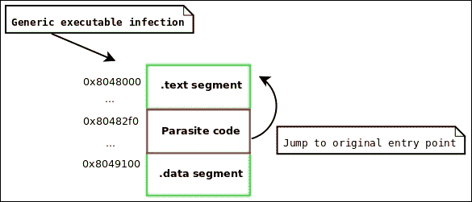
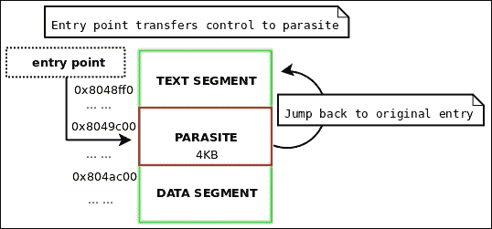
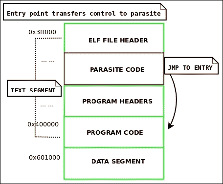
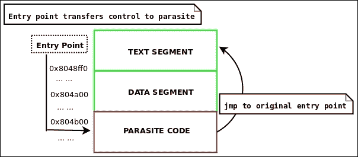
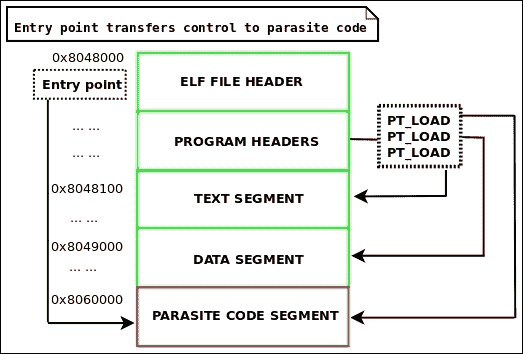
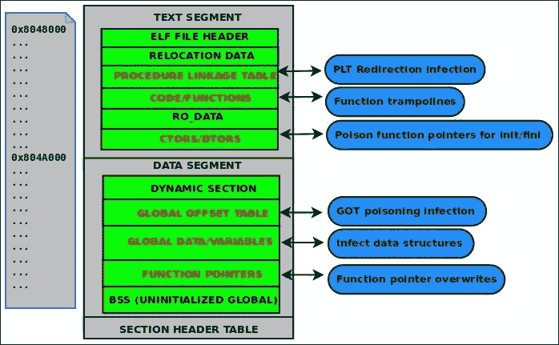

# 第四章 ELF 病毒技术- Linux/Unix 病毒

病毒编写的艺术已经存在了几十年。事实上，它可以追溯到 1981 年通过软盘视频游戏成功在野外发布的 Elk Cloner 苹果病毒。自 80 年代中期到 90 年代，有各种秘密团体和黑客利用他们的神秘知识设计、发布和发表病毒在病毒和黑客电子杂志中（见[`vxheaven.org/lib/static/vdat/ezines1.htm`](http://vxheaven.org/lib/static/vdat/ezines1.htm)）。

病毒编写的艺术通常会给黑客和地下技术爱好者带来很大的启发，不是因为它们能够造成的破坏，而是因为设计它们和需要成功编程的非常规编码技术所带来的挑战，这些病毒可以通过隐藏在其他可执行文件和进程中保持其驻留的寄生虫。此外，保持寄生虫隐蔽的技术和解决方案，如多态和变形代码，对程序员来说是一种独特的挑战。

UNIX 病毒自 90 年代初就存在了，但我认为许多人会同意说 UNIX 病毒的真正创始人是 Silvio Cesare ([`vxheaven.org/lib/vsc02.html`](http://vxheaven.org/lib/vsc02.html))，他在 90 年代末发表了许多关于 ELF 病毒感染方法的论文。这些方法在今天仍在以不同的变体使用。

Silvio 是第一个发布一些令人惊叹的技术的人，比如 PLT/GOT 重定向，文本段填充感染，数据段感染，可重定位代码注入，`/dev/kmem`修补和内核函数劫持。不仅如此，他个人在我接触 ELF 二进制黑客技术方面起到了很大的作用，我会永远感激他的影响。

在本章中，我们将讨论为什么重要理解 ELF 病毒技术以及如何设计它们。ELF 病毒背后的技术可以用于除了编写病毒之外的许多其他事情，比如一般的二进制修补和热修补，这可以在安全、软件工程和逆向工程中使用。为了逆向工程一个病毒，了解其中许多病毒是如何工作的对你是有好处的。值得注意的是，我最近逆向工程并为一个名为**Retaliation**的独特和杰出的 ELF 病毒编写了一个概要。这项工作可以在[`www.bitlackeys.org/#retaliation`](http://www.bitlackeys.org/#retaliation)找到。

# ELF 病毒技术

ELF 病毒技术的世界将为你作为黑客和工程师打开许多大门。首先，让我们讨论一下什么是 ELF 病毒。每个可执行程序都有一个控制流，也称为执行路径。ELF 病毒的第一个目标是劫持控制流，以便临时改变执行路径以执行寄生代码。寄生代码通常负责设置钩子来劫持函数，还负责将自身（寄生代码的主体）复制到尚未被病毒感染的另一个程序中。一旦寄生代码运行完毕，它通常会跳转到原始入口点或正常的执行路径。这样，病毒就不会被注意到，因为宿主程序看起来是正常执行的。



图 4.1：对可执行文件的通用感染

# ELF 病毒工程挑战

ELF 病毒的设计阶段可能被认为是一种艺术创作，需要创造性思维和巧妙的构造；许多热情的编码人员会同意这一点。与此同时，这是一个超出常规编程约定的伟大工程挑战，需要开发人员超越常规范式思维，操纵代码、数据和环境以某种方式行为。曾经，我曾对一家大型**杀毒软件**（**AV**）公司的一款产品进行了安全评估。在与杀毒软件的开发人员交谈时，我惊讶地发现他们几乎没有任何真正的想法如何设计病毒，更不用说设计任何真正的启发式来识别它们（除了签名）。事实上，编写病毒是困难的，需要严肃的技能。在工程化时，会出现许多挑战，让我们在讨论工程化组件之前，先看看其中一些挑战是什么。

## 寄生体代码必须是自包含的

寄生体必须能够实际存在于另一个程序中。这意味着它不能通过动态链接器链接到外部库。寄生体必须是自包含的，这意味着它不依赖于外部链接，是位置无关的，并且能够在自身内部动态计算内存地址；这是因为地址将在每次感染之间改变，因为寄生体将被注入到现有的二进制文件中，其位置将每次改变。这意味着如果寄生体代码通过其地址引用函数或字符串，硬编码的地址将改变，代码将失败；而是使用相对于 IP 的代码，使用一个函数通过指令指针的偏移量计算代码/数据的地址。

### 注意

在一些更复杂的内存病毒中，比如我的*Saruman*病毒，我允许寄生体编译为一个带有动态链接的可执行程序，但是将其启动到进程地址空间的代码非常复杂，因为它必须手动处理重定位和动态链接。还有一些可重定位代码注入器，比如 Quenya，允许寄生体编译为可重定位对象，但感染者必须能够在感染阶段支持处理重定位。

### 解决方案

使用`gcc`选项`-nostdlib`编译初始病毒可执行文件。您还可以使用`-fpic -pie`编译它，使可执行文件成为**位置无关代码**（**PIC**）。x86_64 机器上可用的 IP 相对寻址实际上是病毒编写者的一个很好的功能。创建自己的常用函数，比如`strcpy()`和`memcmp()`。当您需要`malloc()`的高级功能时，您可以使用`sys_brk()`或`sys_mmap()`创建自己的分配例程。创建自己的系统调用包装器，例如，这里使用 C 和内联汇编展示了`mmap`系统调用的包装器：

```
#define __NR_MMAP 9
void *_mmap(unsigned long addr, unsigned long len, unsigned long prot, unsigned long flags, long fd, unsigned long off)
{
        long mmap_fd = fd;
        unsigned long mmap_off = off;
        unsigned long mmap_flags = flags;
        unsigned long ret;

        __asm__ volatile(
                         "mov %0, %%rdi\n"
                         "mov %1, %%rsi\n"
                         "mov %2, %%rdx\n"
                         "mov %3, %%r10\n"
                         "mov %4, %%r8\n"
                         "mov %5, %%r9\n"
                         "mov $__NR_MMAP, %%rax\n"
                         "syscall\n" : : "g"(addr), "g"(len), "g"(prot),                "g"(flags), "g"(mmap_fd), "g"(mmap_off));
        __asm__ volatile ("mov %%rax, %0" : "=r"(ret));
        return (void *)ret;
}
```

一旦您有一个调用`mmap()`系统调用的包装器，您就可以创建一个简单的`malloc`例程。

`malloc`函数用于在堆上分配内存。我们的小`malloc`函数为每个分配使用了一个内存映射段，这是低效的，但对于简单的用例足够了。

```
void * _malloc(size_t len)
{
        void *mem = _mmap(NULL, len, PROT_READ|PROT_WRITE,MAP_PRIVATE|MAP_ANONYMOUS, -1, 0);
        if (mem == (void *)-1)
                return NULL;
        return mem;
}
```

## 字符串存储的复杂性

这个挑战与上一节关于自包含代码的最后一节相融合。在处理病毒代码中的字符串时，您可能会有：

```
const char *name = "elfmaster";
```

您将希望避免使用类似上述的代码。这是因为编译器可能会将`elfmaster`数据存储在`.rodata`部分，然后通过其地址引用该字符串。一旦病毒可执行文件被注入到另一个程序中，该地址将不再有效。这个问题实际上与我们之前讨论的硬编码地址的问题紧密相连。

### 解决方案

使用堆栈存储字符串，以便它们在运行时动态分配：

```
char name[10] = {'e', 'l', 'f', 'm', 'a', 's', 't', 'e', 'r', '\0'};
```

我最近在为 64 位 Linux 构建 Skeksi 病毒时发现的另一个巧妙技巧是通过使用`gcc`的`-N`选项将文本和数据段合并为单个段，即**读+写+执行**（**RWX**）。这非常好，因为全局数据和只读数据，例如`.data`和`.rodata`部分，都合并到单个段中。这允许病毒在感染阶段简单地注入整个段，其中将包括来自`.rodata`的字符串文字。这种技术结合 IP 相对寻址允许病毒作者使用传统的字符串文字：

```
char *name = "elfmaster";
```

现在可以在病毒代码中使用这种类型的字符串，并且可以完全避免在堆栈上存储字符串的方法。然而，需要注意的是，将所有字符串存储在全局数据中会导致病毒寄生体的整体大小增加，这有时是不可取的。Skeksi 病毒最近发布，并可在[`www.bitlackeys.org/#skeksi`](http://www.bitlackeys.org/#skeksi)上获得。

## 查找合法空间存储寄生虫代码

这是编写病毒时需要回答的一个重要问题之一：病毒的载荷（病毒的主体）将被注入到哪里？换句话说，在主机二进制文件的哪里将寄生虫存活？可能性因二进制格式而异。在`ELF`格式中，有相当多的地方可以注入代码，但它们都需要正确调整各种不同的`ELF`头值。

挑战并不一定是找到空间，而是调整`ELF`二进制文件以允许您使用该空间，同时使可执行文件看起来相当正常，并且足够接近`ELF`规范，以便它仍然能够正确执行。在修补二进制文件和修改其布局时，必须考虑许多事项，例如页面对齐、偏移调整和地址调整。

### 解决方案

在创建新的二进制修补方法时，仔细阅读`ELF`规范，并确保您在程序执行所需的边界内。在下一节中，我们将讨论一些病毒感染技术。

## 将执行控制流传递给寄生虫

这里还有另一个常见的挑战，那就是如何将主机可执行文件的控制流传递给寄生虫。在许多情况下，调整`ELF`文件头中的入口点以指向寄生虫代码就足够了。这是可靠的，但也非常明显。如果入口点已经修改为指向寄生虫，那么我们可以使用`readelf -h`来查看入口点，并立即知道寄生虫代码的位置。

### 解决方案

如果您不想修改入口点地址，那么考虑找到一个可以插入/修改分支到寄生虫代码的地方，例如插入`jmp`或覆盖函数指针。其中一个很好的地方是`.ctors`或`.init_array`部分，其中包含函数指针。如果您不介意寄生虫在常规程序代码之后（而不是之前）执行，那么`.dtors`或`.fini_array`部分也可以起作用。

# ELF 病毒寄生体感染方法

二进制文件中只有有限的空间可以容纳代码，对于任何复杂的病毒，寄生虫至少会有几千字节，并且需要扩大主机可执行文件的大小。在`ELF`可执行文件中，没有太多的代码洞（例如 PE 格式），因此您不太可能能够将更多的 shellcode 塞入现有的代码槽中（例如具有 0 或`NOPS`用于函数填充的区域）。

## Silvio 填充感染方法

这种感染方法是由 Silvio Cesare 在 90 年代后期构思的，并且此后出现在各种 Linux 病毒中，例如*Brundle Fly*和 Silvio 本人制作的 POC。这种方法很有创意，但它将感染负载限制在一页大小。在 32 位 Linux 系统上，这是 4096 字节，但在 64 位系统上，可执行文件使用 0x200000 字节的大页，这允许大约 2MB 的感染。这种感染的工作原理是利用内存中文本段和数据段之间会有一页填充的事实，而在磁盘上，文本段和数据段是紧挨着的，但是某人可以利用预期的段之间的空间，并将其用作负载的区域。



图 4.2：Silvio 填充感染布局

Silvio 在他的 VX Heaven 论文*Unix ELF 寄生体和病毒*中对文本填充感染进行了详细的描述和记录（[`vxheaven.org/lib/vsc01.html`](http://vxheaven.org/lib/vsc01.html)），因此，如果想要深入阅读，请务必查看。

### Silvio .text 感染方法的算法

1.  在 ELF 文件头中，将`ehdr->e_shoff`的值增加`PAGE_SIZE`。

1.  定位文本段`phdr`：

1.  修改寄生体位置的入口点：

```
ehdr->e_entry = phdr[TEXT].p_vaddr + phdr[TEXT].p_filesz
```

1.  增加`phdr[TEXT].p_filesz`的值，使其等于寄生体的长度。

1.  增加`phdr[TEXT].p_memsz`的值，使其等于寄生体的长度。

1.  对于每个`phdr`，其段在寄生体之后，增加`phdr[x].p_offset`的值`PAGE_SIZE`字节。

1.  找到文本段中的最后一个`shdr`，并将`shdr[x].sh_size`的值增加寄生体的长度（因为这是寄生体存在的部分）。

1.  对于每个寄生体插入后存在的`shdr`，增加`shdr[x].sh_offset`的值`PAGE_SIZE`。

1.  将实际寄生体代码插入文本段的位置为（`file_base + phdr[TEXT].p_filesz`）。

### 注意

原始的`p_filesz`值用于计算。

### 提示

创建一个反映所有更改的新二进制文件，然后将其复制到旧二进制文件上更有意义。这就是我所说的插入寄生体代码：重写一个包含寄生体的新二进制文件。

一个实现了这种感染技术的 ELF 病毒的很好的例子是我的*lpv*病毒，它是在 2008 年编写的。为了高效，我不会在这里粘贴代码，但可以在[`www.bitlackeys.org/projects/lpv.c`](http://www.bitlackeys.org/projects/lpv.c)找到。

### 文本段填充感染的示例

文本段填充感染（也称为 Silvio 感染）可以通过一些示例代码最好地进行演示，我们可以看到如何在插入实际寄生体代码之前正确调整 ELF 头文件。

#### 调整 ELF 头文件

```
#define JMP_PATCH_OFFSET 1 // how many bytes into the shellcode do we patch
/* movl $addr, %eax; jmp *eax; */
char parasite_shellcode[] =
        "\xb8\x00\x00\x00\x00"      
        "\xff\xe0"                  
;

int silvio_text_infect(char *host, void *base, void *payload, size_t host_len, size_t parasite_len)
{
        Elf64_Addr o_entry;
        Elf64_Addr o_text_filesz;
        Elf64_Addr parasite_vaddr;
        uint64_t end_of_text;
        int found_text;

        uint8_t *mem = (uint8_t *)base;
        uint8_t *parasite = (uint8_t *)payload;

        Elf64_Ehdr *ehdr = (Elf64_Ehdr *)mem;
        Elf64_Phdr *phdr = (Elf64_Phdr *)&mem[ehdr->e_phoff];
        Elf64_Shdr *shdr = (Elf64_Shdr *)&mem[ehdr->e_shoff];

        /*
         * Adjust program headers
         */
        for (found_text = 0, i = 0; i < ehdr->e_phnum; i++) {
                if (phdr[i].p_type == PT_LOAD) {
                        if (phdr[i].p_offset == 0) {

                                o_text_filesz = phdr[i].p_filesz;
                                end_of_text = phdr[i].p_offset + phdr[i].p_filesz;
                                parasite_vaddr = phdr[i].p_vaddr + o_text_filesz;

                                phdr[i].p_filesz += parasite_len;
                                phdr[i].p_memsz += parasite_len;

                                for (j = i + 1; j < ehdr->e_phnum; j++)
                                        if (phdr[j].p_offset > phdr[i].p_offset + o_text_filesz)
                                                phdr[j].p_offset += PAGE_SIZE;

                                }
                                break;
                        }
        }
        for (i = 0; i < ehdr->e_shnum; i++) {
                if (shdr[i].sh_addr > parasite_vaddr)
                        shdr[i].sh_offset += PAGE_SIZE;
                else
                if (shdr[i].sh_addr + shdr[i].sh_size == parasite_vaddr)
                        shdr[i].sh_size += parasite_len;
        }

    /*
      * NOTE: Read insert_parasite() src code next
         */
        insert_parasite(host, parasite_len, host_len,
                        base, end_of_text, parasite, JMP_PATCH_OFFSET);
        return 0;
}
```

#### 插入寄生代码

```
#define TMP "/tmp/.infected"

void insert_parasite(char *hosts_name, size_t psize, size_t hsize, uint8_t *mem, size_t end_of_text, uint8_t *parasite, uint32_t jmp_code_offset)
{
/* note: jmp_code_offset contains the
* offset into the payload shellcode that
* has the branch instruction to patch
* with the original offset so control
* flow can be transferred back to the
* host.
*/
        int ofd;
        unsigned int c;
        int i, t = 0;
        open (TMP, O_CREAT | O_WRONLY | O_TRUNC, S_IRUSR|S_IXUSR|S_IWUSR);  
        write (ofd, mem, end_of_text);
        *(uint32_t *) &parasite[jmp_code_offset] = old_e_entry;
        write (ofd, parasite, psize);
        lseek (ofd, PAGE_SIZE - psize, SEEK_CUR);
        mem += end_of_text;
        unsigned int sum = end_of_text + PAGE_SIZE;
        unsigned int last_chunk = hsize - end_of_text;
        write (ofd, mem, last_chunk);
        rename (TMP, hosts_name);
        close (ofd);
}
```

### 上述函数的使用示例

```
uint8_t *mem = mmap_host_executable("./some_prog");
silvio_text_infect("./some_prog", mem, parasite_shellcode, parasite_len);
```

### LPV 病毒

LPV 病毒使用 Silvio 填充感染，并且专为 32 位 Linux 系统设计。可在[`www.bitlackeys.org/#lpv`](http://www.bitlackeys.org/#lpv)下载。

### Silvio 填充感染的用例

讨论的 Silvio 填充感染方法非常流行，并且已经被广泛使用。在 32 位 UNIX 系统上，此方法的实现仅限于 4096 字节的寄生体，如前所述。在使用大页的新系统上，这种感染方法具有更大的潜力，并允许更大的感染（最多 0x200000 字节）。我个人使用了这种方法进行寄生体感染和可重定位代码注入，尽管我已经放弃了它，转而使用我们接下来将讨论的反向文本感染方法。

## 反向文本感染

这种感染的理念最初是由 Silvio 在他的 UNIX 病毒论文中构思和记录的，但它没有提供一个可工作的 POC。我后来将其扩展为一种算法，我用于各种 ELF 黑客项目，包括我的软件保护产品*Mayas Veil*，该产品在[`www.bitlackeys.org/#maya`](http://www.bitlackeys.org/#maya)中有讨论。

这种方法的前提是以反向方式扩展文本段。通过这样做，文本的虚拟地址将减少`PAGE_ALIGN`(`parasite_size`)。由于现代 Linux 系统上允许的最小虚拟映射地址（根据`/proc/sys/vm/mmap_min_addr`）是 0x1000，文本虚拟地址只能向后扩展到那里。幸运的是，由于 64 位系统上默认的文本虚拟地址通常是 0x400000，这留下了 0x3ff000 字节的寄生空间（减去`sizeof(ElfN_Ehdr)`字节，确切地说）。

计算主机可执行文件的最大寄生大小的完整公式将是这样的：

```
max_parasite_length = orig_text_vaddr - (0x1000 + sizeof(ElfN_Ehdr))
```

### 注意

在 32 位系统上，默认的文本虚拟地址是 0x08048000，这比 64 位系统上的寄生空间更大：

```
(0x8048000 - (0x1000 + sizeof(ElfN_Ehdr)) = (parasite len)134508492
```



图 4.3：反向文本感染布局

这种`.text`感染有几个吸引人的特点：它不仅允许非常大的代码注入，而且还允许入口点保持指向`.text`部分。虽然我们必须修改入口点，但它仍然指向实际的`.text`部分，而不是其他部分，比如`.jcr`或`.eh_frame`，这会立即显得可疑。插入点在文本中，因此它是可执行的（就像 Silvio 填充感染一样）。这打败了数据段感染，它允许无限的插入空间，但需要在启用 NX 位的系统上修改段权限。

### 反向文本感染算法

### 注意

这是对`PAGE_ROUND(x)`宏的引用，它将整数舍入到下一个页面对齐的值。

1.  通过`PAGE_ROUND(parasite_len)`增加`ehdr->e_shoff`。

1.  找到文本段、`phdr`，并保存原始的`p_vaddr`：

1.  通过`PAGE_ROUND(parasite_len)`减少`p_vaddr`。

1.  通过`PAGE_ROUND(parasite_len)`减少`p_paddr`。

1.  通过`PAGE_ROUND(parasite_len)`增加`p_filesz`。

1.  通过`PAGE_ROUND(parasite_len)`增加`p_memsz`。

1.  找到每个`phdr`，其`p_offset`大于文本的`p_offset`，并通过`PAGE_ROUND(parasite_len)`增加`p_offset`；这将使它们全部向前移动，为反向文本扩展腾出空间。

1.  将`ehdr->e_entry`设置为这个值：

```
orig_text_vaddr – PAGE_ROUND(parasite_len) + sizeof(ElfN_Ehdr)
```

1.  通过`PAGE_ROUND(parasite_len)`增加`ehdr->e_phoff`。

1.  通过创建一个新的二进制文件来插入实际的寄生代码，以反映所有这些变化，并将新的二进制文件复制到旧的位置。

反向文本感染方法的完整示例可以在我的网站上找到：[`www.bitlackeys.org/projects/text-infector.tgz`](http://www.bitlackeys.org/projects/text-infector.tgz)。

反向文本感染的更好示例是 Skeksi 病毒，可以从本章前面提供的链接中下载。这种感染类型的完整消毒程序也可以在这里找到：

[`www.bitlackeys.org/projects/skeksi_disinfect.c`](http://www.bitlackeys.org/projects/skeksi_disinfect.c)。

## 数据段感染

在没有设置 NX 位的系统上，例如 32 位 Linux 系统，可以在数据段中执行代码（即使其权限是 R+W），而无需更改段权限。这可以是感染文件的一种非常好的方式，因为它为寄生虫留下了无限的空间。可以简单地通过寄生代码附加到数据段。唯一的注意事项是，您必须为`.bss`部分留出空间。`.bss`部分在磁盘上不占用空间，但在运行时为未初始化的变量在数据段末尾分配空间。您可以通过将数据段的`phdr->p_filesz`从`phdr->p_memsz`中减去来获得`.bss`部分在内存中的大小。



图 4.4：数据段感染

### 数据段感染算法

1.  通过寄生大小增加`ehdr->e_shoff`。

1.  定位数据段`phdr`：

1.  修改`ehdr->e_entry`，指向寄生代码的位置：

```
phdr->p_vaddr + phdr->p_filesz
```

1.  通过寄生大小增加`phdr->p_filesz`。

1.  通过寄生大小增加`phdr->p_memsz`。

1.  调整`.bss`段头，使其偏移和地址反映寄生结束的位置。

1.  在数据段上设置可执行权限：

```
phdr[DATA].p_flags |= PF_X;
```

### 注意

步骤 4 仅适用于具有 NX（不可执行页面）位设置的系统。在 32 位 Linux 上，数据段不需要标记为可执行以执行代码，除非内核中安装了类似 PaX（[`pax.grsecurity.net/`](https://pax.grsecurity.net/)）的东西。

1.  可选地，添加一个带有虚假名称的段头，以便考虑寄生代码。否则，如果有人运行`/usr/bin/strip <infected_program>`，它将完全删除寄生代码，如果没有被一个部分考虑到。

1.  通过创建一个反映更改并包含寄生代码的新二进制文件来插入寄生虫。

数据段感染对于并非特定于病毒的情况非常有用。例如，在编写打包程序时，通常有用的是将加密的可执行文件存储在存根可执行文件的数据段中。

# PT_NOTE 到 PT_LOAD 转换感染方法

这种方法非常强大，尽管很容易被检测到，但实现起来也相对容易，并提供可靠的代码插入。其思想是将`PT_NOTE`段转换为`PT_LOAD`类型，并将其位置移动到所有其他段之后。当然，您也可以通过创建一个`PT_LOAD phdr`条目来创建一个全新的段，但由于程序仍然可以在没有`PT_NOTE`段的情况下执行，您可能会将其转换为`PT_LOAD`。我个人没有为病毒实现过这种技术，但我在 Quenya v0.1 中设计了一个允许您添加新段的功能。我还对 Jpanic 编写的 Retaliation Linux 病毒进行了分析，该病毒使用了这种感染方法：

[`www.bitlackeys.org/#retaliation`](http://www.bitlackeys.org/#retaliation)。



图 4.5：PT_LOAD 感染

关于`PT_LOAD`感染没有严格的规则。如此处所述，您可以将`PT_NOTE`转换为`PT_LOAD`，也可以创建一个全新的`PT_LOAD phdr`和段。

## PT_NOTE 到 PT_LOAD 转换感染算法

1.  定位数据段`phdr`：

1.  找到数据段结束的地址：

```
    ds_end_addr = phdr->p_vaddr + p_memsz
```

1.  找到数据段结束的文件偏移量：

```
    ds_end_off = phdr->p_offset + p_filesz
```

1.  获取用于可加载段的对齐大小：

```
    align_size = phdr->p_align
```

1.  定位`PT_NOTE` phdr：

1.  将 phdr 转换为 PT_LOAD：

```
    phdr->p_type = PT_LOAD;
```

1.  将其分配给这个起始地址：

```
    ds_end_addr + align_size
```

1.  分配一个大小以反映寄生代码的大小：

```
    phdr->p_filesz += parasite_size
    phdr->p_memsz += parasite_size
```

1.  使用`ehdr->e_shoff += parasite_size`来考虑新段。

1.  通过编写一个新的二进制文件来插入寄生代码，以反映 ELF 头更改和新段。

### 注意

记住，段头表在寄生段之后，因此`ehdr->e_shoff += parasite_size`。

# 感染控制流

在前一节中，我们研究了将寄生代码引入二进制文件并通过修改感染程序的入口点执行的方法。就引入新代码到二进制文件中而言，这些方法非常有效；实际上，它们非常适合二进制修补，无论是出于合法的工程原因还是出于病毒的目的。修改入口点在许多情况下也是相当合适的，但远非隐秘，而且在某些情况下，您可能不希望寄生代码在入口时执行。也许您的寄生代码是一个您感染了二进制文件的单个函数，您只希望这个函数作为替换其感染的二进制文件中的另一个函数被调用；这被称为函数劫持。当打算追求更复杂的感染策略时，我们必须意识到 ELF 程序中所有可能的感染点。这就是事情开始变得真正有趣的地方。让我们看看许多常见的 ELF 二进制感染点：



图 4.6：ELF 感染点

如前图所示，ELF 程序中还有其他六个主要区域可以被操纵以在某种程度上修改行为。

## 直接 PLT 感染

不要将其与 PLT/GOT（有时称为 PLT 挂钩）混淆。 PLT（过程链接表）和 GOT（全局偏移表）在动态链接和共享库函数调用期间密切配合工作。它们是两个单独的部分。我们在第二章*ELF 二进制格式*的*动态链接*部分学习了它们。简单地说，PLT 包含每个共享库函数的条目。每个条目包含执行间接`jmp`到存储在 GOT 中的目标地址的代码。一旦动态链接过程完成，这些地址最终指向其关联的共享库函数。通常，攻击者可以覆盖包含指向其代码的地址的 GOT 条目。这是可行的，因为它最容易；GOT 是可写的，只需修改其地址表即可改变控制流。当讨论直接 PLT 感染时，我们并不是指修改 GOT。我们谈论的是实际修改 PLT 代码，使其包含不同的指令以改变控制流。

以下是`libc fopen()`函数的 PLT 条目的代码：

```
0000000000402350 <fopen@plt>:
  402350:       ff 25 9a 7d 21 00       jmpq   *0x217d9a(%rip)        # 61a0f0
  402356:       68 1b 00 00 00          pushq  $0x1b
  40235b:       e9 30 fe ff ff          jmpq   402190 <_init+0x28>
```

请注意，第一条指令是一个间接跳转。该指令长度为六个字节：这很容易被另一个五/六字节的指令替换，以改变控制流到寄生代码。考虑以下指令：

```
push $0x000000 ; push the address of parasite code onto stack
ret       ; return to parasite code
```

这些指令被编码为`\x68\x00\x00\x00\x00\xc3`，可以被注入到 PLT 条目中，以劫持所有`fopen()`调用并使用寄生函数（无论是什么）。由于`.plt`部分位于文本段中，它是只读的，因此这种方法不适用于利用漏洞（如`.got`覆盖）的技术，但绝对可以用病毒或内存感染来实现。

## 函数跳板

这种类型的感染显然属于直接 PLT 感染的最后一类，但为了明确我们的术语，让我描述一下传统函数跳板通常指的是什么，即用某种分支指令覆盖函数代码的前五到七个字节，以改变控制流：

```
movl $<addr>, %eax  --- encoded as \xb8\x00\x00\x00\x00\xff\xe0
jmp *%eax
push $<addr>      --- encoded as \x68\x00\x00\x00\xc3
ret
```

寄生函数被调用，而不是预期的函数。如果寄生函数需要调用原始函数，这通常是情况，那么寄生函数的工作就是用原始指令替换原始函数中的五到七个字节，调用它，然后将跳板代码复制回原位。这种方法既可以应用于实际的二进制文件本身，也可以应用于内存中。这种技术通常用于劫持内核函数，尽管在多线程环境中并不是很安全。

## 覆盖.ctors/.dtors 函数指针

这种方法实际上在本章早些时候提到过，当讨论将执行控制流引导到寄生代码时。为了完整起见，我将对其进行回顾：大多数可执行文件都是通过链接到`libc`来编译的，因此`gcc`在编译的可执行文件和共享库中包含了`glibc`初始化代码。`.ctors`和`.dtors`部分（有时称为`.init_array`和`.fini_array`）包含初始化或终结代码的函数指针。`.ctors/.init_array`函数指针在调用`main()`之前触发。这意味着可以通过覆盖其中一个函数指针的正确地址来将控制转移到病毒或寄生代码。`.dtors/.fini_array`函数指针直到`main()`之后才触发，在某些情况下可能是可取的。例如，某些堆溢出漏洞（例如，*一旦释放*：[`phrack.org/issues/57/9.html`](http://phrack.org/issues/57/9.html)）会导致攻击者可以向任何位置写入四个字节，并且通常会覆盖一个指向 shellcode 的`.dtors`函数指针的地址。对于大多数病毒或恶意软件作者来说，`.ctors/.init_array`函数指针更常见，因为通常希望在程序的其余部分运行之前运行寄生代码。

## GOT - 全局偏移表中毒或 PLT/GOT 重定向

GOT 中毒，也称为 PLT/GOT 感染，可能是劫持共享库函数的最佳方法。这相对容易，并允许攻击者充分利用 GOT，这是一个指针表。由于我们在第二章中深入讨论了 GOT，*ELF 二进制格式*，我不会再详细说明它的目的。这种技术可以通过直接感染二进制文件的 GOT 或在内存中进行。有一篇关于我在 2009 年写的关于在内存中进行这种操作的论文，名为*现代 ELF 运行时感染通过 GOT 中毒*，网址为[`vxheaven.org/lib/vrn00.html`](http://vxheaven.org/lib/vrn00.html)，其中解释了如何在运行时进程感染中进行这种操作，并提供了一种可以用来绕过 PaX 强加的安全限制的技术。

## 感染数据结构

可执行文件的数据段包含全局变量、函数指针和结构。这打开了一个攻击向量，只针对特定的可执行文件，因为每个程序在数据段中有不同的布局：不同的变量、结构、函数指针等。尽管如此，如果攻击者了解布局，就可以通过覆盖函数指针和其他数据来改变可执行文件的行为。一个很好的例子是数据/`.bss`缓冲区溢出利用。正如我们在第二章中学到的，`.bss`在运行时分配（在数据段的末尾），包含未初始化的全局变量。如果有人能够溢出一个包含要执行的可执行文件路径的缓冲区，那么就可以控制要运行的可执行文件。

## 函数指针覆盖

这种技术实际上属于最后一种（感染数据结构），也属于与`.ctors/.dtors`函数指针覆写相关的技术。为了完整起见，我将其列为自己的技术，但基本上，这些指针将位于数据段和`.bss`（初始化/未初始化的静态数据）中。正如我们已经讨论过的，可以覆盖函数指针以改变控制流，使其指向寄生体。

# 进程内存病毒和 rootkit - 远程代码注入技术

到目前为止，我们已经涵盖了用寄生代码感染 ELF 二进制文件的基础知识，这足以让你忙碌至少几个月的编码和实验。然而，本章将不完整，如果没有对感染进程内存进行彻底讨论。正如我们所了解的，内存中的程序与磁盘上的程序并没有太大的区别，我们可以通过`ptrace`系统调用来访问和操作运行中的程序，就像第三章 *Linux 进程跟踪*中所示的那样。进程感染比二进制感染更加隐蔽，因为它们不会修改磁盘上的任何内容。因此，进程内存感染通常是为了对抗取证分析。我们刚刚讨论的所有 ELF 感染点都与进程感染相关，尽管注入实际的寄生代码与 ELF 二进制文件的方式不同。由于它在内存中，我们必须将寄生代码注入内存，可以通过使用`PTRACE_POKETEXT`（覆盖现有代码）直接注入，或者更好地，通过注入创建新内存映射以存储代码的 shellcode。这就是共享库注入等技术发挥作用的地方。在本章的其余部分，我们将讨论一些远程代码注入的方法。

## 共享库注入 - .so 注入/ET_DYN 注入

这种技术可以用来将共享库（无论是恶意的还是不恶意的）注入到现有进程的地址空间中。一旦库被注入，你可以使用前面描述的感染点之一，通过 PLT/GOT 重定向、函数跳板等方式将控制流重定向到共享库。挑战在于将共享库注入到进程中，这可以通过多种方式来实现。

## .so 注入与 LD_PRELOAD

关于将共享库注入进程的方法是否可以称为注入，存在争议，因为它不适用于现有进程，而是在程序执行时加载共享库。这是通过设置`LD_PRELOAD`环境变量，以便所需的共享库在任何其他库之前加载。这可能是一个快速测试后续技术（如 PLT/GOT 重定向）的好方法，但不够隐蔽，也不适用于现有进程。

### 图 4.7 - 使用 LD_PRELOAD 注入 wicked.so.1

```
$ export LD_PRELOAD=/tmp/wicked.so.1

$ /usr/local/some_daemon

$ cp /lib/x86_64-linux-gnu/libm-2.19.so /tmp/wicked.so.1

$ export LD_PRELOAD=/tmp/wicked.so.1

$ /usr/local/some_daemon &

$ pmap `pidof some_daemon` | grep 'wicked'

00007ffaa731e000   1044K r-x-- wicked.so.1

00007ffaa7423000   2044K ----- wicked.so.1

00007ffaa7622000      4K r---- wicked.so.1

00007ffaa7623000      4K rw--- wicked.so.1
```

正如你所看到的，我们的共享库`wicked.so.1`被映射到进程地址空间中。业余爱好者倾向于使用这种技术来创建小型用户空间 rootkit，劫持`glibc`函数。这是因为预加载的库将优先于任何其他共享库，因此，如果你将函数命名为`glibc`函数的名称，比如`open()`或`write()`（它们是系统调用的包装器），那么你预加载的库的版本的函数将被执行，而不是真正的`open()`和`write()`。这是一种廉价而肮脏的劫持`glibc`函数的方法，如果攻击者希望保持隐蔽，就不应该使用这种方法。

## .so 注入与 open()/mmap() shellcode

这是一种通过将 shellcode（使用`ptrace`）注入到现有进程的文本段中并执行它来将任何文件（包括共享库）加载到进程地址空间的方法。我们在第三章，“Linux 进程跟踪”中演示了这一点，我们的`code_inject.c`示例加载了一个非常简单的可执行文件到进程中。同样的代码也可以用来加载共享库。这种技术的问题是，大多数您想要注入的共享库都需要重定位。`open()/mmap()`函数只会将文件加载到内存中，但不会处理代码重定位，因此大多数您想要加载的共享库除非是完全位置无关的代码，否则不会正确执行。在这一点上，您可以选择通过解析共享库的重定位并使用`ptrace()`在内存中应用它们来手动处理重定位。幸运的是，还有一个更简单的解决方案，我们将在下面讨论。

## .so 注入与 dlopen() shellcode

`dlopen()`函数用于动态加载可执行文件最初未链接的共享库。开发人员经常使用这种方式为其应用程序创建插件形式的共享库。程序可以调用`dlopen()`来动态加载共享库，并实际上调用动态链接器为您执行所有重定位。不过，存在一个问题：大多数进程没有`dlopen()`可用，因为它存在于`libdl.so.2`中，程序必须显式链接到`libdl.so.2`才能调用`dlopen()`。幸运的是，也有解决方案：几乎每个程序默认在进程地址空间中映射了`libc.so`（除非显式编译为其他方式），而`libc.so`具有与`dlopen()`相当的`__libc_dlopen_mode()`。这个函数几乎以完全相同的方式使用，但需要设置一个特殊的标志：

```
#define DLOPEN_MODE_FLAG 0x80000000
```

这不是什么大问题。但在使用`__libc_dlopen_mode()`之前，您必须首先通过获取要感染的进程中`libc.so`的基址，解析`__libc_dlopen_mode()`的符号，然后将符号值`st_value`（参见第二章，“ELF 二进制格式”）添加到`libc`的基址，以获取`__libc_dlopen_mode()`的最终地址。然后，您可以设计一些以 C 或汇编调用`__libc_dlopen_mode()`的 shellcode，将您的共享库加载到进程中，具有完整的重定位并准备执行。然后可以使用`__libc_dlsym()`函数来解析共享库中的符号。有关使用`dlopen()`和`dlsym()`的更多详细信息，请参阅`dlopen`手册页。

### 图 4.8 - 调用 __libc_dlopen_mode()的 C 代码

```
/* Taken from Saruman's launcher.c */
#define __RTLD_DLOPEN 0x80000000 //glibc internal dlopen flag
#define __BREAKPOINT__ __asm__ __volatile__("int3");
#define __RETURN_VALUE__(x) __asm__ __volatile__("mov %0, %%rax\n" :: "g"(x))

__PAYLOAD_KEYWORDS__ void * dlopen_load_exec(const char *path, void *dlopen_addr)
{
        void * (*libc_dlopen_mode)(const char *, int) = dlopen_addr;
        void *handle;        handle = libc_dlopen_mode(path, __RTLD_DLOPEN|RTLD_NOW|RTLD_GLOBAL);
        __RETURN_VALUE__(handle);
        __BREAKPOINT__;
}
```

非常值得注意的是，`dlopen()`也会加载 PIE 可执行文件。这意味着您可以将完整的程序注入到进程中并运行它。实际上，您可以在单个进程中运行尽可能多的程序。这是一种令人难以置信的反取证技术，当使用线程注入时，您可以同时运行它们，以便它们同时执行。Saruman 是我设计的一个 PoC 软件，用于执行此操作。它使用两种可能的注入方法：具有手动重定位的`open()/mmap()`方法或`__libc_dlopen_mode()`方法。这在我的网站[`www.bitlackeys.org/#saruman`](http://www.bitlackeys.org/#saruman)上可用。

## .so 注入与 VDSO 操作

这是我在[`vxheaven.org/lib/vrn00.html`](http://vxheaven.org/lib/vrn00.html)中论文中讨论的一种技术。这个想法是操纵**虚拟动态共享对象**（**VDSO**），它自 Linux 内核版本 2.6.x 以来被映射到每个进程的地址空间中。VDSO 包含用于加速系统调用的代码，并且可以直接从 VDSO 中调用。技巧是通过使用`PTRACE_SYSCALL`来定位调用系统调用的代码，一旦它落在这段代码上就会中断。攻击者可以加载`%eax/%rax`以获取所需的系统调用号，并将参数存储在其他寄存器中，遵循 Linux x86 系统调用的适当调用约定。这是令人惊讶地简单，可以用来调用`open()/mmap()`方法，而无需注入任何 shellcode。这对于绕过防止用户将代码注入文本段的 PaX 非常有用。我建议阅读我的论文，以获得关于这种技术的完整论述。

## 文本段代码注入

这是一种简单的技术，除了注入 shellcode 之外，对于其他用途并不是很有用，一旦 shellcode 执行完毕，应该迅速替换为原始代码。您希望直接修改文本段的另一个原因是创建函数跳板，我们在本章前面讨论过，或者直接修改`.plt`代码。但就代码注入而言，最好的方法是将代码加载到进程中或创建一个新的内存映射，可以在其中存储代码：否则，文本段很容易被检测到被修改。

## 可执行文件注入

如前所述，`dlopen()`能够将 PIE 可执行文件加载到进程中，我甚至还包含了一个链接到 Saruman 的链接，Saruman 是一个巧妙的软件，允许您在现有进程中运行程序以进行反取证措施。但是，如何注入`ET_EXEC`类型的可执行文件呢？这种类型的可执行文件除了动态链接的`R_X86_64_JUMP_SLOT/R_386_JUMP_SLOT`重定位类型之外，不提供任何重定位信息。这意味着将常规可执行文件注入到现有进程中最终将是不可靠的，特别是在注入更复杂的程序时。尽管如此，我创建了一个名为**elfdemon**的这种技术的 PoC，它将可执行文件映射到一些新的映射中，这些映射不会与主机进程的可执行文件映射发生冲突。然后它接管控制（与 Saruman 不同，Saruman 允许并发执行），并在运行结束后将控制权传回给主机进程。这方面的示例可以在[`www.bitlackeys.org/projects/elfdemon.tgz`](http://www.bitlackeys.org/projects/elfdemon.tgz)中找到。

## 可重定位代码注入 - ET_REL 注入

这种方法与共享库注入非常相似，但与`dlopen()`不兼容。ET_REL（.o 文件）是可重定位代码，与 ET_DYN（.so 文件）非常相似，但它们不是作为单个文件执行的；它们是用来链接到可执行文件或共享库中的，正如第二章中所讨论的，*ELF 二进制格式*。然而，这并不意味着我们不能注入它们，重定位它们并执行它们的代码。这可以通过使用之前描述的任何技术来完成，除了`dlopen()`。因此，`open/mmap`是足够的，但需要手动处理重定位，可以使用`ptrace`来完成。在第二章中，*ELF 二进制格式*，我们给出了我设计的软件**Quenya**中的重定位代码的示例。这演示了如何在将对象文件注入可执行文件时处理重定位。当将其注入到进程中时，可以使用相同的原则。

# ELF 反调试和打包技术

在下一章《ELF 软件保护的突破》中，我们将讨论使用 ELF 可执行文件进行软件加密和打包的细节。病毒和恶意软件通常会使用某种类型的保护机制进行加密或打包，这也可能包括反调试技术，使得分析二进制文件变得非常困难。在不对这个主题进行完整的解释的情况下，以下是一些常见的 ELF 二进制保护程序采取的反调试措施，这些措施通常用于包装恶意软件。

## PTRACE_TRACEME 技术

这种技术利用了一个程序一次只能被一个进程跟踪的事实。几乎所有调试器都使用`ptrace`，包括 GDB。这个想法是一个程序可以跟踪自己，以便没有其他调试器可以附加。

### 图 4.9 - 使用 PTRACE_TRACEME 的反调试示例

```
void anti_debug_check(void)
{
  if (ptrace(PTRACE_TRACEME, 0, 0, 0) < 0) {
    printf("A debugger is attached, but not for long!\n");
    kill(getpid());
    exit(0);
  }
}
```

*图 4.9*中的函数将会在调试器附加时终止程序（自身）；它会知道因为它无法跟踪自己。否则，它将成功地跟踪自己，并且不允许其他跟踪器，以防止调试器。

## SIGTRAP 处理程序技术

在调试时，我们经常设置断点，当断点被触发时，会生成一个 SIGTRAP 信号，被我们的调试器信号处理程序捕获；程序会停止，我们可以检查它。通过这种技术，程序设置了一个信号处理程序来捕获 SIGTRAP 信号，然后故意发出一个断点指令。当程序的 SIGTRAP 处理程序捕获到它时，它会将一个全局变量从`0`增加到`1`。

程序可以检查全局变量是否设置为`1`，如果是，那意味着我们的程序捕获了断点，没有调试器存在；否则，如果是`0`，那就是被调试器捕获了。在这一点上，程序可以选择终止自身或退出以防止调试：

```
static int caught = 0;
int sighandle(int sig)
{
     caught++;
}
int detect_debugger(void)
{
    __asm__ volatile("int3");
    if (!caught) {
        printf("There is a debugger attached!\n");
        return 1;
    }
}
```

## /proc/self/status 技术

这个动态文件存在于每个进程中，包括很多信息，包括进程当前是否正在被跟踪。

一个`/proc/self/status`布局的示例，可以解析以检测跟踪器/调试器，如下所示：

```
ryan@elfmaster:~$ head /proc/self/status
Name:  head
State:  R (running)
Tgid:  19813
Ngid:  0
Pid:  19813
PPid:  17364
TracerPid:  0
Uid:  1000  1000  1000  1000
Gid:  31337  31337  31337  31337
FDSize:  256

```

如前面的输出所示，`tracerPid: 0`表示该进程没有被跟踪。一个程序必须做的就是打开`/proc/self/status`，并检查值是否为 0，以确定自己是否被跟踪。如果不是，则它知道自己正在被跟踪，可以选择终止自身或退出。

## 代码混淆技术

代码混淆（也称为代码转换）是一种技术，其中汇编级别的代码被修改以包括不透明的分支指令或不对齐的指令，使得反汇编器无法正确读取字节码。考虑以下示例：

```
jmp antidebug + 1
antidebug:
.short 0xe9 ;first byte of a jmp instruction
mov $0x31337, %eax
```

当前面的代码被编译并用`objdump`反汇编器查看时，它看起来是这样的：

```
   4:   eb 01                   jmp    7 <antidebug+0x1>
   <antidebug:>
   6:   e9 00 b8 37 13          jmpq   1337b80b
   b:   03 00                 add    (%rax),%eax
```

这段代码实际上执行了`mov $0x31337, %eax`操作，从功能上讲，它执行得很正确，但因为之前有一个`0xe9`，所以反汇编器将其视为`jmp`指令（因为`0xe9`是`jmp`的前缀）。

因此，代码转换不会改变代码的功能，只会改变它的外观。像 IDA 这样的智能反汇编器不会被前面的代码片段所欺骗，因为它在生成反汇编时使用控制流分析。

## 字符串表转换技术

这是我在 2008 年构思的一种技术，我还没有看到广泛使用，但如果它没有在某处使用，我会感到惊讶。这个想法是利用我们对 ELF 字符串表和符号名称以及段头的知识。诸如 `objdump` 和 `gdb`（经常用于逆向工程）的工具依赖于字符串表来了解 ELF 文件中函数和段的名称。这种技术会打乱每个符号和段的名称的顺序。结果是段头将被全部混合（或看起来是这样），函数和符号的名称也是如此。

这种技术可能会让逆向工程师产生误导；例如，他们可能会认为自己正在查看一个名为 `check_serial_number()` 的函数，而实际上他们正在查看 `safe_strcpy()`。我已经在一个名为 `elfscure` 的工具中实现了这一点，可以在 [`www.bitlackeys.org/projects/elfscure.c`](http://www.bitlackeys.org/projects/elfscure.c) 上找到。

# ELF 病毒检测和消毒

检测病毒可能非常复杂，更不用说消毒了。我们现代的杀毒软件实际上相当荒谬且效果不佳。标准的杀毒软件使用扫描字符串，即签名，来检测病毒。换句话说，如果一个已知的病毒在二进制文件的给定偏移处始终有字符串 `h4h4.infect.1+`，那么杀毒软件会看到它存在于数据库中并标记为感染。从长远来看，这非常低效，特别是因为病毒不断变异成新的品系。

一些杀毒产品已知使用模拟进行动态分析，可以向启发式分析器提供关于可执行文件在运行时的行为的信息。动态分析可能很强大，但已知速度很慢。Silvio Cesare 在动态恶意软件解包和分类方面取得了一些突破，但我不确定这项技术是否被用于主流。

目前，存在着非常有限的软件用于检测和消毒 ELF 二进制感染。这可能是因为更主流的市场并不存在，而且很多这些攻击仍然处于地下状态。然而毫无疑问，黑客们正在使用这些技术来隐藏后门，并在受损系统上保持隐秘的存在。目前，我正在进行一个名为 Arcana 的项目，它可以检测和消毒许多类型的 ELF 二进制感染，包括可执行文件、共享库和内核驱动程序，并且还能够使用 ECFS 快照（在第八章中描述，*ECFS – 扩展核心文件快照技术*），这大大改进了进程内存取证。与此同时，您可以阅读或下载我多年前设计的以下项目中的一个原型：

+   VMA Voodoo ([`www.bitlackeys.org/#vmavudu`](http://www.bitlackeys.org/#vmavudu))

+   **AVU** (**Anti Virus Unix**) 在 [`www.bitlackeys.org/projects/avu32.tgz`](http://www.bitlackeys.org/projects/avu32.tgz) 上

Unix 环境中的大多数病毒是在系统受损后植入的，并用于通过记录有用信息（如用户名/密码）或通过挂钩守护进程与后门来维持系统上的驻留。我在这个领域设计的软件很可能被用作主机入侵检测软件或用于对二进制文件和进程内存进行自动取证分析。继续关注 [`bitlackeys.org/`](http://bitlackeys.org/) 网站，以查看有关 *Arcana* 发布的任何更新，这是我最新的 ELF 二进制分析软件，将是第一个真正配备完整分析和消毒 ELF 二进制感染能力的生产软件。

我决定不在本章中写一整节关于启发式和病毒检测，因为我们将在第六章中讨论大部分这些技术，*Linux 中的 ELF 二进制取证*，我们将检查用于检测二进制感染的方法和启发式。

# 总结

在本章中，我们涵盖了有关 ELF 二进制病毒工程的“必须知道”信息。这些知识并不常见，因此本章有望作为计算机科学地下世界中这种神秘病毒艺术的独特介绍。在这一点上，您应该了解病毒感染、反调试的最常见技术，以及创建和分析 ELF 病毒所面临的挑战。这些知识在逆向工程病毒或进行恶意软件分析时非常有用。值得注意的是，可以在[`vxheaven.org`](http://vxheaven.org)上找到许多优秀的论文，以帮助进一步了解 Unix 病毒技术。
