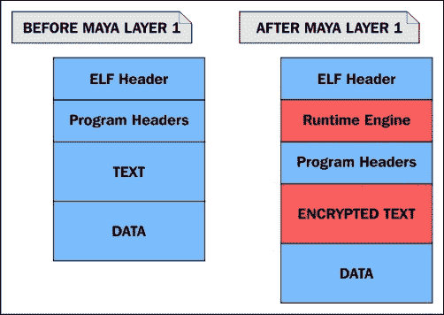

# 第五章。Linux 二进制保护

在本章中，我们将探讨 Linux 程序混淆的基本技术和动机。混淆或加密二进制文件或使其难以篡改的技术称为软件保护方案。通过“软件保护”，我们指的是二进制保护或二进制加固技术。二进制加固不仅适用于 Linux；事实上，在这个技术类型中，Windows OS 有更多的产品，也有更多的例子可供讨论。

许多人没有意识到 Linux 也有市场需求，尽管主要用于政府使用的反篡改产品。在黑客社区中，过去十年中也发布了许多 ELF 二进制保护程序，其中有几个为今天使用的许多技术铺平了道路。

整本书都可以专门讨论软件保护的艺术，作为一些最新的 ELF 二进制保护技术的作者，我很容易在这一章中陷入其中。相反，我将坚持解释基本原理和一些有趣的技术，然后深入了解我自己的二进制保护程序——**玛雅的面纱**。二进制保护所涉及的复杂工程和技能使其成为一个具有挑战性的话题，但我会尽力而为。

# ELF 二进制打包程序-愚蠢的保护程序

**打包程序**是一种常用于恶意软件作者和黑客的软件类型，用于压缩或加密可执行文件以混淆其代码和数据。一个非常常见的打包程序名为 UPX（[`upx.sourceforge.net`](http://upx.sourceforge.net)），并且在大多数 Linux 发行版中都作为一个软件包提供。这种类型的打包程序的最初目的是压缩可执行文件并使其更小。

由于代码被压缩，必须有一种方法在内存中执行之前对其进行解压缩——这就是事情变得有趣的地方，我们将在*存根机制和用户空间执行*部分讨论这是如何工作的。无论如何，恶意软件作者已经意识到，压缩其恶意软件感染文件将由于混淆而逃避 AV 检测。这导致恶意软件/杀毒软件研究人员开发了自动解包程序，现在几乎所有现代 AV 产品都在使用。

如今，“打包二进制”一词不仅指压缩的二进制文件，还指加密的二进制文件或者任何形式的混淆层保护的二进制文件。自 21 世纪初以来，已经出现了几种显著的 ELF 二进制文件保护程序，塑造了 Linux 中二进制保护的未来。我们将探讨每一种保护程序，并使用它们来模拟保护 ELF 二进制文件所使用的不同技术。然而，在此之前，让我们看看存根是如何工作的，以加载和执行压缩或加密的二进制文件。

# 存根机制和用户空间执行

首先，有必要了解软件保护实际上由两个程序组成：

+   **保护阶段代码**：将保护应用于目标二进制文件的程序

+   **运行时引擎或存根**：与目标二进制文件合并的程序，负责在运行时进行反混淆和反调试

保护程序的类型可以因应用于目标二进制文件的保护类型而有很大不同。无论应用于目标二进制文件的保护类型是什么，运行时代码必须能够理解。运行时代码（或存根）必须知道如何解密或反混淆与其合并的二进制文件。在大多数软件保护的情况下，受保护的二进制文件与一个相对简单的运行时引擎合并；它的唯一目的是解密二进制文件并将控制权传递给内存中的解密二进制文件。

这种类型的运行时引擎并不是一个引擎，我们称之为存根。存根通常是编译而成的，没有任何 libc 链接（例如，`gcc -nostdlib`），或者是静态编译的。这种存根虽然比真正的运行时引擎简单，但实际上仍然相当复杂，因为它必须能够从内存中`exec()`一个程序，这就是**用户空间执行**发挥作用的地方。我们应该感谢 grugq 在这里的贡献。

通常使用`glibc`包装器（例如`execve`，`execv`，`execle`和`execl`）的`SYS_execve`系统调用将加载并运行可执行文件。在软件保护程序的情况下，可执行文件是加密的，必须在执行之前解密。只有一个经验不足的黑客才会编写他们的存根来解密可执行文件，然后以解密形式将其写入磁盘，然后再使用`SYS_exec`执行它，尽管原始的 UPX 打包程序确实是这样工作的。

实现这一点的熟练方法是通过在原地（在内存中）解密可执行文件，然后从内存中加载和执行它，而不是从文件中。这可以从用户空间代码中完成，因此我们称这种技术为用户空间执行。许多软件保护程序实现了一个这样做的存根。实现存根用户空间执行的一个挑战是，它必须将段加载到它们指定的地址范围中，这通常是为存根可执行文件本身指定的相同地址。

这只是 ET_EXEC 类型可执行文件的问题（因为它们不是位置无关的），通常可以通过使用自定义链接器脚本来克服，该脚本告诉存根可执行文件段加载到除默认地址之外的地址。这样的链接器脚本示例在第一章的链接器脚本部分中显示，*Linux 环境及其工具*。

### 注意

在 x86_32 上，默认基址是 0x8048000，在 x86_64 上是 0x400000。存根应该具有不与默认地址范围冲突的加载地址。例如，我最近编写的一个链接，文本段加载在 0xa000000 处。



图 5.1：二进制保护程序存根的模型

*图 5.1*以可视方式显示了加密的可执行文件嵌入在存根可执行文件的数据段中，包装在其中，这就是为什么存根也被称为包装器。

### 注意

我们将在第六章的*识别受保护的二进制文件*部分中展示，如何在许多情况下剥离包装实际上可能是一个微不足道的任务，也可能是一个使用软件或脚本自动化的任务。

典型的存根执行以下任务：

+   解密其有效负载（即原始可执行文件）

+   将可执行文件的可加载段映射到内存中

+   将动态链接器映射到内存中

+   创建一个堆栈（即使用 mmap）

+   设置堆栈（argv，envp 和辅助向量）

+   将控制权传递给程序的入口点

### 注意

如果受保护的程序是动态链接的，那么控制权将传递给动态链接器的入口点，随后将其传递给可执行文件。

这种性质的存根本质上只是一个用户空间执行的实现，它加载和执行嵌入在其自身程序体内的程序，而不是一个单独的文件。

### 注意

原始的用户空间执行研究和算法可以在 grugq 的名为*用户空间执行的设计与实现*的论文中找到，网址为[`grugq.github.io/docs/ul_exec.txt`](https://grugq.github.io/docs/ul_exec.txt)。

## 一个保护程序的例子

让我们来看看一个在我写的简单保护程序保护之前和之后的可执行文件。使用`readelf`查看程序头，我们可以看到二进制文件具有我们期望在动态链接的 Linux 可执行文件中看到的所有段：

```
$ readelf -l test

Elf file type is EXEC (Executable file)
Entry point 0x400520
There are 9 program headers, starting at offset 64

Program Headers:
  Type           Offset             VirtAddr           PhysAddr
                 FileSiz            MemSiz              Flags  Align
  PHDR           0x0000000000000040 0x0000000000400040 0x0000000000400040
                 0x00000000000001f8 0x00000000000001f8  R E    8
  INTERP         0x0000000000000238 0x0000000000400238 0x0000000000400238
                 0x000000000000001c 0x000000000000001c  R      1
      [Requesting program interpreter: /lib64/ld-linux-x86-64.so.2]
  LOAD           0x0000000000000000 0x0000000000400000 0x0000000000400000
                 0x00000000000008e4 0x00000000000008e4  R E    200000
  LOAD           0x0000000000000e10 0x0000000000600e10 0x0000000000600e10
                 0x0000000000000248 0x0000000000000250  RW     200000
  DYNAMIC        0x0000000000000e28 0x0000000000600e28 0x0000000000600e28
                 0x00000000000001d0 0x00000000000001d0  RW     8
  NOTE           0x0000000000000254 0x0000000000400254 0x0000000000400254
                 0x0000000000000044 0x0000000000000044  R      4
  GNU_EH_FRAME   0x0000000000000744 0x0000000000400744 0x0000000000400744
                 0x000000000000004c 0x000000000000004c  R      4
  GNU_STACK      0x0000000000000000 0x0000000000000000 0x0000000000000000
                 0x0000000000000000 0x0000000000000000  RW     10
  GNU_RELRO      0x0000000000000e10 0x0000000000600e10 0x0000000000600e10
                 0x00000000000001f0 0x00000000000001f0  R      1
```

现在，让我们在二进制文件上运行我们的保护程序，然后查看程序头：

```
$ ./elfpack test
$ readelf -l test
Elf file type is EXEC (Executable file)
Entry point 0xa01136
There are 5 program headers, starting at offset 64

Program Headers:
  Type           Offset             VirtAddr           PhysAddr
                 FileSiz            MemSiz              Flags  Align
  LOAD           0x0000000000000000 0x0000000000a00000 0x0000000000a00000
                 0x0000000000002470 0x0000000000002470  R E    1000
  LOAD           0x0000000000003000 0x0000000000c03000 0x0000000000c03000
                 0x000000000003a23f 0x000000000003b4df  RW     1000
```

有许多不同之处。入口点是`0xa01136`，只有两个可加载段，即文本和数据段。这两者的加载地址与以前完全不同。

这当然是因为存根的加载地址不能与其中包含的加密可执行文件的加载地址冲突，必须加载和内存映射。原始可执行文件的文本段地址为`0x400000`。存根负责解密嵌入其中的可执行文件，然后将其映射到`PT_LOAD`程序头中指定的加载地址。

如果地址与存根的加载地址冲突，那么它将无法工作。这意味着存根程序必须使用自定义链接器脚本进行编译。通常的做法是修改由`ld`使用的现有链接器脚本。对于本例中使用的保护程序，我修改了链接器脚本中的一行：

+   这是原始行：

```
PROVIDE (__executable_start = SEGMENT_START("text-segment", 0x400000)); . = SEGMENT_START("text-segment", 0x400000) + SIZEOF_HEADERS;
```

+   以下是修改后的行：

```
PROVIDE (__executable_start = SEGMENT_START("text-segment", 0xa00000)); . = SEGMENT_START("text-segment", 0xa00000) + SIZEOF_HEADERS;
```

从受保护的可执行文件的程序头中可以注意到的另一件事是没有`PT_INTERP`段或`PT_DYNAMIC`段。对于未经训练的人来说，这似乎是一个静态链接的可执行文件，因为它似乎没有使用动态链接。这是因为您没有查看原始可执行文件的程序头。

### 注意

请记住，原始可执行文件是加密的，并嵌入在存根可执行文件中，因此您实际上是从存根而不是从它所保护的可执行文件中查看程序头。在许多情况下，存根本身是使用非常少的选项编译和链接的，并且不需要动态链接本身。良好的用户空间执行实现的主要特征之一是能够将动态链接器加载到内存中。

正如我所提到的，存根是一个用户空间执行程序，它将在解密并将嵌入式可执行文件映射到内存后，将动态链接器映射到内存。动态链接器将在将控制权传递给现在解密的程序之前处理符号解析和运行时重定位。

# 保护程序存根执行的其他任务

除了解密和将嵌入式可执行文件加载到内存中（即用户空间执行组件），存根还可能执行其他任务。存根通常会启动反调试和反仿真例程，旨在进一步保护二进制文件，使其更难以进行调试或仿真。

在第四章中，*ELF 病毒技术-Linux/Unix 病毒*，我们讨论了一些用于防止基于`ptrace`的调试的反调试技术。这可以防止大多数调试器，包括 GDB，轻松跟踪二进制文件。在本章的后面，我们将总结用于 Linux 二进制保护的最常见反调试技术。

# 现有 ELF 二进制保护程序

多年来，已经发布了一些值得注意的二进制保护程序，既公开发布的，也来自地下场景。我将讨论一些用于 Linux 的保护程序，并概述各种功能。

## Grugq 的 DacryFile–2001

DacryFile 是我所知道的最早的 Linux 二进制保护程序（[`github.com/packz/binary-encryption/tree/master/binary-encryption/dacryfile`](https://github.com/packz/binary-encryption/tree/master/binary-encryption/dacryfile)）。这个保护程序很简单，但仍然很聪明，工作方式与病毒的 ELF 寄生感染非常相似。在许多保护程序中，存根包裹在加密的二进制文件周围，但在 DacryFile 的情况下，存根只是一个简单的解密例程，被注入到要受保护的二进制文件中。

DacryFile 使用 RC4 加密从`.text`部分的开头到文本段的结尾加密二进制文件。解密存根是一个简单的用汇编和 C 编写的程序，它没有用户空间 exec 功能；它只是解密代码的加密主体。这个存根被插入到数据段的末尾，这非常像病毒插入寄生虫的方式。可执行文件的入口点被修改为指向存根，当二进制文件执行时，存根解密程序的文本段。然后将控制权传递给原始入口点。

### 注意

在支持 NX 位的系统上，数据段除非显式标记为可执行权限位，否则不能用于保存代码，即`'p_flags |= PF_X'`。

## Scut 的 Burneye - 2002

许多人认为 Burneye 是 Linux 中第一个体面的二进制加密示例。按照今天的标准，它可能被认为是薄弱的，但它仍然为这个领域带来了一些创新的功能。其中包括三层加密，第三层是受密码保护的层。

密码被转换成一种哈希和校验和，然后用于解密最外层。这意味着除非二进制文件得到正确的密码，否则它将永远无法解密。另一层，称为指纹层，可以用来代替密码层。这个功能通过算法为二进制文件在其上受到保护的系统创建一个密钥，并阻止二进制文件在受保护的系统之外的任何其他系统上解密。

还有一个自毁功能；在运行一次后删除二进制文件。Burneye 与其他保护程序的主要区别之一是它是第一个使用用户空间 exec 技术来包装二进制文件的程序。从技术上讲，这首先是由 John Resier 为 UPX 打包程序完成的，但 UPX 被认为更像是一个二进制压缩器而不是一个保护程序。据称，John 将用户空间 exec 的知识传授给了 Scut，正如 Scut 和 Grugq 在[`phrack.org/issues/58/5.html`](http://phrack.org/issues/58/5.html)上写的 ELF 二进制保护文章中提到的那样。这篇文章记录了 Burneye 的内部工作原理，强烈推荐阅读。

### 注意

一个名为`objobf`的工具，代表**对象混淆器**，也是由 Scut 设计的。这个工具混淆了一个 ELF32 ET_REL（目标文件），使得代码非常难以反汇编，但在功能上是等效的。通过使用不透明分支和不对齐的汇编等技术，这在阻止静态分析方面可能非常有效。

## Neil Mehta 和 Shawn Clowes 的 Shiva - 2003

Shiva 可能是 Linux 二进制保护的最好的公开示例。源代码从未发布过 - 只有保护程序 - 但作者在各种会议上发表了几次演讲，比如 Blackhat USA。这些演讲揭示了它的许多技术。

Shiva 适用于 32 位 ELF 可执行文件，并提供一个完整的运行时引擎（不仅仅是解密存根），在保护过程中始终协助解密和反调试功能。Shiva 提供三层加密，其中最内层永远不会完全解密整个可执行文件。它每次解密 1024 字节的块，然后重新加密。

对于一个足够大的程序，任何时候最多只有程序的三分之一会被解密。另一个强大的功能是固有的反调试功能——Shiva 保护程序使用一种技术，其中运行时引擎使用`clone()`生成一个线程，然后跟踪父线程，而父线程反过来跟踪子线程。这使得基于`ptrace`的动态分析变得不可能，因为单个进程（或线程）可能不会有多个跟踪器。而且，由于两个进程互相跟踪，其他调试器也无法附加。

### 注意

一位著名的逆向工程师 Chris Eagle 成功使用 IDA 的 x86 模拟器插件解包了一个受 Shiva 保护的二进制文件，并在 Blackhat 上就此成就做了一个演讲。据说这个 Shiva 的逆向工程是在 3 周内完成的。

+   作者的演讲：

[`www.blackhat.com/presentations/bh-usa-03/bh-us-03-mehta/bh-us-03-mehta.pdf`](https://www.blackhat.com/presentations/bh-usa-03/bh-us-03-mehta/bh-us-03-mehta.pdf)

+   Chris Eagle 的演讲（破解 Shiva）：

[`www.blackhat.com/presentations/bh-federal-03/bh-federal-03-eagle/bh-fed-03-eagle.pdf`](http://www.blackhat.com/presentations/bh-federal-03/bh-federal-03-eagle/bh-fed-03-eagle.pdf)

## Maya's Veil by Ryan O'Neill – 2014

Maya's Veil 是我在 2014 年设计的，适用于 ELF64 二进制文件。到目前为止，该保护程序处于原型阶段，尚未公开发布，但已经出现了一些分支版本，演变成了 Maya 项目的变种。其中一个是[`github.com/elfmaster/`](https://github.com/elfmaster/)，这是 Maya 的一个版本，只包括控制流完整性等反利用技术。作为 Maya 保护程序的发明者和设计者，我有权详细说明其内部工作的一些细节，主要是为了激发对这类事物感兴趣的读者的兴趣和创造力。除了是本书的作者外，我也是一个很平易近人的人，所以如果您对 Maya's Veil 有更多问题，可以随时联系我。

首先，这个保护程序被设计为仅在用户空间中解决方案（这意味着没有来自聪明的内核模块的帮助），同时仍然能够保护具有足够反篡改特性的二进制文件，甚至更令人印象深刻的是，还具有额外的反利用功能。迄今为止，Maya 拥有的许多功能只能通过编译器插件实现，而 Maya 直接在已编译的可执行二进制文件上运行。

Maya 非常复杂，记录其所有内部工作将是关于二进制保护主题的完整解释，但我将总结一些其最重要的特性。Maya 可用于创建第 1 层、第 2 层或第 3 层受保护的二进制文件。在第一层，它使用智能运行时引擎；这个引擎被编译为一个名为`runtime.o`的目标文件。

这个文件使用反向文本填充扩展（参见第四章，*ELF 病毒技术- Linux/Unix 病毒*），结合可重定位代码注入重链接技术。基本上，运行时引擎的目标文件链接到它所保护的可执行文件。这个目标文件非常重要，因为它包含了反调试、反利用、带有加密堆的自定义`malloc`、关于它所保护的二进制文件的元数据等代码。这个目标文件大约 90%是 C 代码，10%是 x86 汇编代码。

### Maya 的保护层

玛雅具有多层保护和加密。每个额外的层都通过增加攻击者剥离的工作量来增强安全级别。最外层的层对于防止静态分析是最有用的，而最内层的层（图层 1）只会在当前调用堆栈内解密函数，并在完成后重新加密它们。以下是对每个图层的更详细解释。

#### 图层 1

受保护的二进制的图层 1 由二进制的每个单独加密的函数组成。每个函数在调用和返回时都会动态解密和重新加密。这是因为`runtime.o`包含了智能和自主的自我调试能力，使其能够密切监视进程的执行，并确定何时受到攻击或分析。

运行时引擎本身已经使用代码混淆技术进行了混淆，例如 Scut 的对象混淆器工具中发现的那些技术。用于解密和重新加密函数的密钥存储和元数据存储在运行时引擎生成的加密堆中的自定义`malloc()`实现中。这使得定位密钥变得困难。由于它为动态解密、反调试和反利用能力提供了智能和自主的自我跟踪能力，因此图层 1 保护是第一个也是最复杂的保护级别。

图层 1

一个过于简化的图表，显示了一个受保护的二进制图层 1 与原始二进制的布局

#### 图层 2

受保护的二进制的图层 2 与原始二进制并无二致，只是不仅函数，而且二进制中的每个其他部分都被加密以防止静态分析。这些部分在运行时解密，如果有人能够转储进程，那么某些数据将会暴露出来，这必须通过内存驱动程序完成，因为`prctl()`用于保护进程免受通过`/proc/$pid/mem`进行的普通用户空间转储（并且还阻止进程转储任何核心文件）。

#### 图层 3

受保护的二进制的图层 3 与图层 2 相同，只是它通过将图层 2 二进制嵌入到图层 3 存根的数据段中，增加了一层完整的保护。图层 3 存根的工作方式类似于传统的用户空间执行。

### 玛雅的纳米机器

玛雅的面纱有许多其他功能，使得它难以逆向工程。其中一个功能称为**纳米机器**。这是原始二进制中的某些指令被完全删除并替换为垃圾指令或断点的地方。

当玛雅的运行时引擎看到这些垃圾指令或断点之一时，它会检查其纳米机器记录，看看原始指令是什么。记录存储在运行时引擎的加密堆段中，因此对于逆向工程师来说，访问这些信息并不容易。一旦玛雅知道原始指令的作用，它就会使用`ptrace`系统调用来模拟该指令。

### 玛雅的反利用

玛雅的反利用功能是使其与其他保护程序相比独特的原因。大多数保护程序的目标仅仅是使逆向工程变得困难，而玛雅能够加强二进制，使其许多固有的漏洞（如缓冲区溢出）无法被利用。具体来说，玛雅通过在运行时引擎中嵌入特殊的控制流完整性技术来防止**ROP**（即**Return-Oriented Programming**）。

受保护的二进制中的每个函数都在入口点和每个返回指令处插入了一个断点（`int3`）。`int3`断点会触发运行时引擎产生 SIGTRAP；然后运行时引擎会执行以下几种操作之一：

+   解密函数（仅在遇到入口`int3`断点时）

+   加密函数（仅在遇到返回`int3`断点时）

+   检查返回地址是否被覆盖

+   检查`int3`断点是否是 nanomite；如果是，它将进行模拟

第三个要点是反 ROP 功能。运行时引擎检查包含程序内各个点的有效返回地址的哈希映射。如果返回地址无效，Maya 将退出，利用尝试将失败。

以下是一个特制的易受攻击的软件代码示例，用于测试和展示 Maya 的反 ROP 功能：

#### vuln.c 的源代码

```
#include <stdio.h>
#include <string.h>
#include <stdlib.h>
#include <unistd.h>
#include <sys/mman.h>

/*
 * This shellcode does execve("/bin/sh", …)
 /
char shellcode[] = "\xeb\x1d\x5b\x31\xc0\x67\x89\x43\x07\x67\x89\x5b\x08\x67\x89\x43\"
"x0c\x31\xc0\xb0\x0b\x67\x8d\x4b\x08\x67\x8d\x53\x0c\xcd\x80\xe8"
"\xde\xff"\xff\xff\x2f\x62\x69\x6e\x2f\x73\x68\x4e\x41\x41\x41\x41"
"\x42\x42";

/*
 * This function is vulnerable to a buffer overflow. Our goal is to
 * overwrite the return address with 0x41414141 which is the addresses
 * that we mmap() and store our shellcode in.
 */
int vuln(char *s)
{
        char buf[32];
        int i;

        for (i = 0; i < strlen(s); i++) {
                buf[i] = *s;
                s++;
        }
}

int main(int argc, char **argv)
{
        if (argc < 2)
        {
                printf("Please supply a string\n");
                exit(0);
        }
        int i;
        char *mem = mmap((void *)(0x41414141 & ~4095),
                                 4096,
                                 PROT_READ|PROT_WRITE|PROT_EXEC,
                                 MAP_PRIVATE|MAP_ANONYMOUS|MAP_FIXED,
                                -1,
                                 0);

        memcpy((char *)(mem + 0x141), (void *)&shellcode, 46);
        vuln(argv[1]);
        exit(0);

}
```

#### 利用 vuln.c 的示例

让我们看看如何利用`vuln.c`：

```
$ gcc -fno-stack-protector vuln.c -o vuln
$ sudo chmod u+s vuln
$ ./vuln AAAAAAAAAAAAAAAAAAAAAAAAAAAAAAAAAAAAAAAAAAAAAAAAAAAAAAAAAAAAAAAAAAAAAAAAAAAAAAAAAAAAAAAAAAAAAAAAAAAAAAAAAAAAAAAAAAAAAAAAAAAAAAAAAA
# whoami
root
#
```

现在让我们使用 Maya 的`-c`选项来保护 vuln，这意味着控制流完整性。然后我们将尝试利用受保护的二进制文件：

```
 $ ./maya -l2 -cse vuln

[MODE] Layer 2: Anti-debugging/anti-code-injection, runtime function level protection, and outter layer of encryption on code/data
[MODE] CFLOW ROP protection, and anti-exploitation
[+] Extracting information for RO Relocations
[+] Generating control flow data
[+] Function level decryption layer knowledge information:
[+] Applying function level code encryption:simple stream cipher S
[+] Applying host executable/data sections: SALSA20 streamcipher (2nd layer protection)
[+] Maya's Mind-- injection address: 0x3c9000
[+] Encrypting knowledge: 111892 bytes
[+] Extracting information for RO Relocations
[+] Successfully protected binary, output file is named vuln.maya

$ ./vuln.maya AAAAAAAAAAAAAAAAAAAAAAAAAAAAAAAAAAAAAAAAAAAAAAAAAAAAAAAAAAAAAAAAAAAAAAAAAAAAAAAAAAAAAAAAAAAAAAAAAAAAAAAAAAAAAAAAAAAAAAAAAAAAAAAAAA
[MAYA CONTROL FLOW] Detected an illegal return to 0x41414141, possible exploitation attempt!
Segmentation fault
$
```

这表明 Maya 已经检测到一个无效的返回地址`0x41414141`，在返回指令实际成功之前。Maya 的运行时引擎通过安全地崩溃程序来干扰（而不是利用）。

Maya 强制执行的另一个反利用功能是**relro**（**只读重定位**）。大多数现代 Linux 系统都启用了此功能，但如果未启用，Maya 将通过使用`mprotect()`创建一个包含`the.jcr`、`.dynamic`、`.got`、`.ctors`（`.init_array`）和`.dtors`（`.fini_array`）部分的只读页面来强制执行。其他反利用功能（如函数指针完整性）正在计划中，尚未纳入代码库。

# 下载 Maya 保护的二进制文件

对于那些有兴趣逆向工程一些使用 Maya 的 Veil 保护的简单程序的人，可以随意下载一些样本，这些样本可以在[`www.bitlackeys.org/maya_crackmes.tgz`](http://www.bitlackeys.org/maya_crackmes.tgz)上找到。此链接包含三个文件：`crackme.elf_hardest`、`crackme.elf_medium`和`test.maya`。

# 二进制保护的反调试

由于二进制保护程序通常加密或混淆程序的物理主体，静态分析可能非常困难，并且在许多情况下将被证明是徒劳的。大多数试图解包或破解受保护二进制文件的逆向工程师都会同意，必须使用动态分析和静态分析的组合来访问二进制文件的解密主体。

受保护的二进制文件必须解密自身，或者至少解密在运行时执行的部分。没有任何反调试技术，逆向工程师可以简单地附加到受保护程序的进程，并在存根的最后一条指令上设置断点（假设存根解密整个可执行文件）。

一旦触发断点，攻击者可以查看受保护二进制文件所在的代码段，并找到其解密后的主体。这将非常简单，因此对于良好的二进制保护来说，使用尽可能多的技术使逆向工程师难以进行调试和动态分析非常重要。像 Maya 这样的保护程序会竭尽全力保护二进制免受静态和动态分析的影响。

动态分析并不局限于`ptrace`系统调用，尽管大多数调试器仅限于此目的来访问和操作进程。因此，二进制保护程序不应仅限于保护`ptrace`；理想情况下，它还应该对其他形式的动态分析具有抵抗力，比如模拟和动态插装（例如**Pin**和**DynamoRIO**）。我们在前几章中介绍了许多针对`ptrace`分析的反调试技术，但对于模拟的抵抗力呢？

# 对模拟的抵抗力

通常，仿真器用于对可执行文件执行动态分析和逆向工程任务。这样做的一个非常好的原因是它们允许逆向工程师轻松地操纵执行的控制，并且它们也绕过了许多典型的反调试技术。有许多仿真器被广泛使用——QEMU、BOCHS 和 Chris Eagles 的 IDA X86 仿真器插件，只是其中一些。因此，存在无数的反仿真技术，但其中一些是特定于每个仿真器的特定实现。

这个话题可以扩展到一些非常深入的讨论，并且可以朝多个方向发展，但我将把它限制在我自己的经验范围内。在我自己对 Maya 保护程序中的仿真和反仿真的实验中，我学到了一些通用的技术，应该对至少一些仿真器有效。我们的二进制保护程序的反仿真目标是能够检测是否在仿真器中运行，并且如果是真的，它应该停止执行并退出。

## 通过系统调用测试检测仿真

这种技术在应用级仿真器中特别有用，这些仿真器在某种程度上与操作系统无关，并且不太可能实现超出基本系统调用（`read`、`write`、`open`、`mmap`等）的功能。如果仿真器不支持系统调用，并且也不将不支持的系统调用委托给内核，那么很可能会得到错误的返回值。

因此，二进制保护程序可以调用少量不太常见的系统调用，并检查返回值是否与预期值匹配。非常类似的技术是调用某些中断处理程序，看它们是否表现正常。无论哪种情况，我们都在寻找仿真器没有正确实现的操作系统特性。

## 检测仿真 CPU 的不一致性

仿真器完美仿真 CPU 架构的可能性几乎为零。因此，通常会寻找仿真器行为与 CPU 应该行为之间的某些不一致之处。其中一种技术是尝试写入特权指令，例如调试寄存器（例如`db0`到`db7`）或控制寄存器（例如`cr0`到`cr4`）。仿真检测代码可能有一个尝试写入`cr0`并查看是否成功的 ASM 代码存根。

## 检查某些指令之间的时间延迟

另一种有时可能会导致仿真器本身不稳定的技术是检查某些指令之间的时间戳，并查看执行所需的时间。真实的 CPU 应该比仿真器快几个数量级地执行一系列指令。

# 混淆方法

二进制可以以许多创造性的方式进行混淆或加密。大多数二进制保护程序只是用一层或多层保护来保护整个二进制文件。在运行时，二进制文件被解密，并且可以从内存中转储以获取解压后的二进制文件的副本。在更高级的保护程序中，例如 Maya，每个函数都是单独加密的，并且一次只允许解密一个函数。

一旦二进制文件被加密，它当然必须将加密密钥存储在某个地方。在 Maya（前面讨论过）的情况下，设计了一个自定义堆实现，它本身使用加密来存储加密密钥。在某个时候，似乎必须暴露一个密钥（例如用于解密另一个密钥的密钥），但可以使用特殊技术，如白盒密码术，使这些最终密钥极其模糊。如果在保护程序中使用内核的帮助，那么可以将密钥存储在二进制和处理内存之外。

代码混淆技术（例如虚假反汇编，在第四章中描述，*ELF 病毒技术- Linux/Unix 病毒*）也常用于二进制保护，以使对已解密或从未加密的代码进行静态分析更加困难。二进制保护程序通常还会从二进制文件中剥离段头表，并删除其中的任何不需要的字符串和字符串表，比如那些提供符号名称的字符串。

# 保护控制流完整性

受保护的二进制文件应该在运行时（进程本身）保护程序，就像在磁盘上静止的二进制文件一样多，甚至更多。运行时攻击通常可以分为两种类型：

+   基于`ptrace`的攻击

+   基于漏洞的攻击

## 基于 ptrace 的攻击

第一种类型，基于`ptrace`的攻击，也属于调试进程的范畴。正如前面讨论的，二进制保护程序希望使基于`ptrace`的调试对逆向工程师非常困难。然而，除了调试之外，还有许多其他攻击可能有助于破坏受保护的二进制文件，了解并理解其中一些是很重要的，以便进一步阐明为什么二进制保护程序希望保护运行中的进程免受`ptrace`的攻击。

如果一个保护程序已经走得很远，能够检测断点指令（因此使调试更加困难），但无法保护自己免受`ptrace`跟踪，那么它可能仍然非常容易受到基于`ptrace`的攻击，比如函数劫持和共享库注入。攻击者可能不只是想解包一个受保护的二进制文件，而是可能只想改变二进制文件的行为。一个良好的二进制保护程序应该努力保护其控制流的完整性。

想象一下，一个攻击者知道一个受保护的二进制文件正在调用`dlopen()`函数来加载一个特定的共享库，而攻击者希望该进程加载一个木马共享库。以下步骤可能导致攻击者通过改变其控制流来破坏受保护的二进制文件：

1.  使用`ptrace`附加到进程。

1.  修改全局偏移表条目以使`dlopen()`指向`libc.so`中的`__libc_dlopen_mode`。

1.  调整`%rdi`寄存器，使其指向这个路径：`/tmp/evil_lib.so`。

1.  继续执行。

此时，攻击者刚刚强制一个受保护的二进制文件加载了一个恶意的共享库，因此完全破坏了受保护二进制文件的安全性。

正如前面讨论的，Maya 保护程序通过运行时引擎作为主动调试器来防范此类漏洞，防止其他进程附加。如果保护程序能够禁用`ptrace`附加到受保护进程，那么该进程在很大程度上就不太容易受到这种类型的运行时攻击。

## 基于安全漏洞的攻击

基于漏洞的攻击是一种攻击类型，攻击者可能能够利用受保护程序中固有的弱点，比如基于堆栈的缓冲区溢出，并随后改变执行流程为他们选择的内容。

这种类型的攻击通常更难对受保护的程序进行，因为它提供的关于自身的信息要少得多，并且使用调试器来缩小利用中内存中使用的位置的范围可能更难获得洞察。尽管如此，这种类型的攻击是非常可能的，这就是为什么 Maya 保护程序强制执行控制流完整性和只读重定位，以特别防范漏洞利用攻击。

我不知道现在是否有其他保护程序正在使用类似的反利用技术，但我只能推测它们存在。

# 其他资源

在二进制保护上只写一章是远远不够全面的，无法教会你关于这个主题的所有知识。本书的其他章节相互补充，当结合在一起时，它们将帮助你深入理解。关于这个主题有许多好资源，其中一些已经提到过。

特别推荐一份由 Andrew Griffith 撰写的资源供阅读。这篇论文是十多年前写的，但描述了许多今天仍然与二进制保护相关的技术和实践：

[`www.bitlackeys.org/resources/binary_protection_schemes.pdf`](http://www.bitlackeys.org/resources/binary_protection_schemes.pdf)

这篇论文后来还有一个演讲，幻灯片可以在这里找到：

[`2005.recon.cx/recon2005/papers/Andrew_Griffiths/protecting_binaries.pdf`](http://2005.recon.cx/recon2005/papers/Andrew_Griffiths/protecting_binaries.pdf)

# 摘要

在本章中，我们揭示了 Linux 二进制保护方案的内部工作原理，并讨论了过去十年中为 Linux 发布的各种二进制保护程序的各种特性。

在下一章中，我们将从相反的角度探讨问题，并开始研究 Linux 中的 ELF 二进制取证。
