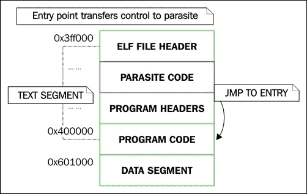
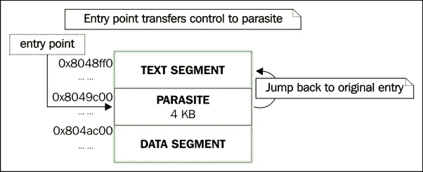

# 第六章：Linux 中的 ELF 二进制取证

计算机取证领域广泛，包括许多调查方面。其中一个方面是对可执行代码的分析。对于黑客来说，安装某种恶意功能的最阴险的地方之一就是在某种可执行文件中。在 Linux 中，当然是 ELF 文件类型。我们已经探讨了一些感染技术，这些技术正在使用第四章，*ELF 病毒技术- Linux/Unix 病毒*，但几乎没有讨论分析阶段。调查人员应该如何探索二进制文件中的异常或代码感染？这正是本章的主题。

攻击者感染可执行文件的动机各不相同，可能是病毒、僵尸网络或后门。当然，还有许多情况下，个人想要修补或修改二进制文件以达到完全不同的目的，比如二进制保护、代码修补或其他实验。无论是恶意还是不恶意，二进制修改方法都是一样的。插入的代码决定了二进制文件是否具有恶意意图。

无论哪种情况，本章都将为读者提供必要的洞察力，以确定二进制文件是否已被修改，以及它究竟是如何被修改的。在接下来的页面中，我们将研究几种不同类型的感染，甚至讨论在对由世界上最有技术的病毒作者之一 JPanic 设计的 Linux 报复病毒进行实际分析时的一些发现。本章的目的是训练您的眼睛能够在 ELF 二进制文件中发现异常，通过一些实践，这是完全可能的。

# 检测入口点修改的科学

当二进制文件以某种方式被修改时，通常是为了向二进制文件添加代码，然后将执行流重定向到该代码。执行流的重定向可以发生在二进制文件的许多位置。在这种特殊情况下，我们将研究一种在修补二进制文件时经常使用的非常常见的技术，特别是对于病毒。这种技术就是简单地修改入口点，即 ELF 文件头的`e_entry`成员。

目标是确定`e_entry`是否保存了指向表示二进制文件异常修改的位置的地址。

### 注意

异常意味着任何不是由链接器本身`/usr/bin/ld`创建的修改，链接器的工作是将 ELF 对象链接在一起。链接器将创建一个代表正常状态的二进制文件，而不自然的修改通常会引起受过训练的眼睛的怀疑。

能够快速检测异常的最快途径是首先了解什么是正常的。让我们来看看两个正常的二进制文件：一个是动态链接的，另一个是静态链接的。两者都是使用`gcc`编译的，没有经过任何修改：

```
$ readelf -h bin1 | grep Entry
  Entry point address:               0x400520
$
```

因此，我们可以看到入口点是`0x400520`。如果我们查看部分头，我们可以看到这个地址属于哪个部分：

```
readelf -S bin1 | grep 4005
  [13] .text             PROGBITS         0000000000400520  00000520
```

### 注意

在我们的例子中，入口点从`.text`部分的开头开始。这并不总是这样，因此像之前那样搜索第一个重要的十六进制数字并不是一种一致的方法。建议您检查每个部分头的地址和大小，直到找到包含入口点的地址范围的部分。

正如我们所看到的，它指向了`.text`段的开头，这是常见的，但根据二进制文件的编译和链接方式，每个二进制文件可能会有所不同。这个二进制文件是被编译成与 libc 链接的，就像你遇到的 99%的二进制文件一样。这意味着入口点包含一些特殊的初始化代码，在每个 libc 链接的二进制文件中几乎是相同的，所以让我们来看看它，这样我们就知道在分析二进制文件的入口点代码时可以期待什么：

```
$ objdump -d --section=.text bin1

 0000000000400520 <_start>:
  400520:       31 ed                 xor    %ebp,%ebp
  400522:       49 89 d1              mov    %rdx,%r9
  400525:       5e                    pop    %rsi
  400526:       48 89 e2              mov    %rsp,%rdx
  400529:       48 83 e4 f0           and    $0xfffffffffffffff0,%rsp
  40052d:       50                    push   %rax
  40052e:       54                    push   %rsp
  40052f:       49 c7 c0 20 07 40 00   mov    $0x400720,%r8 // __libc_csu_fini
  400536:       48 c7 c1 b0 06 40 00  mov    $0x4006b0,%rcx // __libc_csu_init
  40053d:       48 c7 c7 0d 06 40 00  mov    $0x40060d,%rdi // main()
  400544:       e8 87 ff ff ff         callq  4004d0  // call libc_start_main()
...
```

前面的汇编代码是由 ELF 头部的`e_entry`指向的标准 glibc 初始化代码。这段代码总是在`main()`之前执行，其目的是调用初始化例程`libc_start_main()`：

```
libc_start_main((void *)&main, &__libc_csu_init, &libc_csu_fini);
```

此函数设置进程堆段，注册构造函数和析构函数，并初始化与线程相关的数据。然后调用`main()`。

现在你知道了 libc 链接二进制文件的入口点代码是什么样子，你应该能够轻松地确定入口点地址是否可疑，当它指向不像这样的代码，或者根本不在`.text`段中时！

### 注意

与 libc 静态链接的二进制文件将在 _start 中具有与前面代码几乎相同的初始化代码，因此对于静态链接的二进制文件也适用相同的规则。

现在让我们来看看另一个被 Retaliation 病毒感染的二进制文件，并看看入口点存在什么样的奇怪之处：

```
$ readelf -h retal_virus_sample | grep Entry
  Entry point address:        0x80f56f
```

通过`readelf -S`快速检查段头部，将证明这个地址没有被任何段头部记录，这是非常可疑的。如果一个可执行文件有段头部，并且有一个未被段记录的可执行区域，那几乎肯定是感染或二进制文件被篡改的迹象。要执行代码，段头部是不必要的，因为我们已经学过，但程序头部是必要的。

让我们来看看通过使用`readelf -l`查看程序头部，这个地址属于哪个段：

```
Elf file type is EXEC (Executable file)
Entry point 0x80f56f
There are 9 program headers, starting at offset 64

Program Headers:
  Type       Offset             VirtAddr           PhysAddr
             FileSiz            MemSiz              Flags  Align
  PHDR       0x0000000000000040 0x0000000000400040 0x0000000000400040
             0x00000000000001f8 0x00000000000001f8  R E    8
  INTERP     0x0000000000000238 0x0000000000400238 0x0000000000400238
             0x000000000000001c 0x000000000000001c  R      1
      [Requesting program interpreter: /lib64/ld-linux-x86-64.so.2]
  LOAD       0x0000000000000000 0x0000000000400000 0x0000000000400000
             0x0000000000001244 0x0000000000001244  R E    200000
  LOAD       0x0000000000001e28 0x0000000000601e28 0x0000000000601e28
             0x0000000000000208 0x0000000000000218  RW     200000
  DYNAMIC    0x0000000000001e50 0x0000000000601e50 0x0000000000601e50
             0x0000000000000190 0x0000000000000190  RW     8
  LOAD       0x0000000000003129 0x0000000000803129 0x0000000000803129
 0x000000000000d9a3 0x000000000000f4b3  RWE    200000

```

这个输出有几个非常可疑的原因。通常，我们只会在一个 ELF 可执行文件中看到两个 LOAD 段——一个用于文本，一个用于数据——尽管这不是一个严格的规则。然而，这是正常情况，而这个二进制文件显示了三个段。

此外，这个段可疑地标记为 RWE（读+写+执行），这表明存在自修改代码，通常与具有多态引擎的病毒一起使用。入口点指向这第三个段内部，而它应该指向第一个段（文本段），我们可以看到，文本段的虚拟地址为`0x400000`，这是 Linux x86_64 可执行文件的典型文本段地址。我们甚至不需要查看代码就可以相当有信心地认为这个二进制文件已经被篡改。

但是为了验证，特别是如果你正在设计执行二进制文件自动分析的代码，你可以检查入口点的代码，看它是否与预期的样子相匹配，这就是我们之前看到的 libc 初始化代码。

以下`gdb`命令显示了在`retal_virus_sample`可执行文件的入口点处找到的反汇编指令：

```
(gdb) x/12i 0x80f56f
   0x80f56f:  push   %r11
   0x80f571:  movswl %r15w,%r11d
   0x80f575:  movzwq -0x20d547(%rip),%r11        # 0x602036
   0x80f57d:  bt     $0xd,%r11w
   0x80f583:  movabs $0x5ebe954fa,%r11
   0x80f58d:  sbb    %dx,-0x20d563(%rip)        # 0x602031
   0x80f594:  push   %rsi
   0x80f595:  sete   %sil
   0x80f599:  btr    %rbp,%r11
   0x80f59d:  imul   -0x20d582(%rip),%esi        # 0x602022
   0x80f5a4:  negw   -0x20d57b(%rip)        # 0x602030 <completed.6458>
   0x80f5ab:  bswap  %rsi
```

我认为我们可以很快地达成一致，前面的代码看起来不像我们期望在未篡改的可执行文件的入口点代码中看到的 libc 初始化代码。你可以简单地将它与我们从`bin1`中查看的预期 libc 初始化代码进行比较来找出这一点。

修改入口点的其他迹象是地址指向`.text`部分之外的任何部分，特别是如果它是文本段内最后一个部分（有时是`.eh_frame`部分）。另一个确定的迹象是，如果地址指向数据段内通常标记为可执行的位置（使用`readelf -l`可见），以便执行寄生代码。

### 注意

通常，数据段标记为 RW，因为不应该在该段中执行任何代码。如果您看到数据标记为 RWX，那么请将其视为一个警告信号，因为这是极其可疑的。

修改入口点并不是创建插入代码的唯一方法。这是一种常见的方法，能够检测到这一点是一种重要的启发式方法，特别是在恶意软件中，因为它可以揭示寄生代码的起始点。在下一节中，我们将讨论用于劫持控制流的其他方法，这并不总是在执行的开始，而是在中间甚至在结束时。

# 检测其他形式的控制流劫持

有许多原因可以修改二进制文件，根据所需的功能，二进制控制流将以不同的方式进行修补。在前面关于报复病毒的示例中，修改了 ELF 文件头中的入口点。还有许多其他方法可以将执行转移到插入的代码，我们将讨论一些更常见的方法。

## 修补.ctors/.init_array 部分

在 ELF 可执行文件和共享库中，您会注意到通常存在一个名为`.ctors`（通常也称为`.init_array`）的部分。该部分包含一个地址数组，这些地址是由`.init`部分的初始化代码调用的函数指针。函数指针指向使用构造函数属性创建的函数，在`main()`之前执行。这意味着`.ctors`函数指针表可以使用指向已注入到二进制文件中的代码的地址进行修补，我们称之为寄生代码。

检查`.ctors`部分中的地址是否有效相对容易。构造函数例程应始终存储在文本段的`.text`部分中。请记住来自第二章，《ELF 二进制格式》，`.text`部分不是文本段，而是驻留在文本段范围内的部分。如果`.ctors`部分包含任何指向`.text`部分之外位置的函数指针，那么可能是时候产生怀疑了。

### 注意

**关于.ctors 用于反反调试的一点说明**

一些包含反调试技术的二进制文件实际上会创建一个合法的构造函数，调用`ptrace(PTRACE_TRACEME, 0);`。

如第四章，《ELF 病毒技术- Linux/Unix 病毒》中所讨论的，这种技术可以防止调试器附加到进程，因为一次只能附加一个跟踪器。如果发现二进制文件具有执行此反调试技巧的函数，并且在`.ctors`中具有函数指针，则建议简单地使用`0x00000000`或`0xffffffff`对该函数指针进行修补，这将使`__libc_start_main()`函数忽略它，从而有效地禁用反调试技术。在 GDB 中可以轻松完成此任务，例如，`set {long}address = 0xffffffff`，假设 address 是要修改的.ctors 条目的位置。

## 检测 PLT/GOT 挂钩

这种技术早在 1998 年就已经被使用，当时由 Silvio Cesare 在[`phrack.org/issues/56/7.html`](http://phrack.org/issues/56/7.html)上发表，其中讨论了共享库重定向的技术。

在第二章中，*ELF 二进制格式*，我们仔细研究了动态链接，并解释了**PLT**（过程链接表）和**GOT**（全局偏移表）的内部工作原理。具体来说，我们研究了延迟链接以及 PLT 包含的代码存根，这些代码存根将控制转移到存储在 GOT 中的地址。如果共享库函数（如`printf`）以前从未被调用过，则存储在 GOT 中的地址将指向 PLT，然后调用动态链接器，随后填充 GOT，使其指向映射到进程地址空间中的 libc 共享库中的`printf`函数的地址。

静态（静止）和热修补（内存中）通常会修改一个或多个 GOT 条目，以便调用一个经过修补的函数而不是原始函数。我们将检查一个已注入包含一个简单将字符串写入`stdout`的函数的目标文件的二进制文件。`puts(char *);`的 GOT 条目已被修补，指向注入函数的地址。

前三个 GOT 条目是保留的，通常不会被修补，因为这可能会阻止可执行文件正确运行（请参阅第二章，*ELF 二进制格式*，动态链接部分）。因此，作为分析人员，我们对观察从 GOT[3]开始的条目感兴趣。每个 GOT 值应该是一个地址。该地址可以有两个被认为是有效的值：

+   指向 PLT 的地址指针

+   指向有效共享库函数的地址指针

当二进制文件在磁盘上被感染（而不是运行时感染）时，GOT 条目将被修补，指向二进制文件中已注入代码的某个地方。请回顾第四章中讨论的内容，*ELF 病毒技术- Linux/Unix 病毒*，其中介绍了将代码注入可执行文件的多种方法。在我们将在这里查看的二进制文件示例中，使用了可重定位目标文件（`ET_REL`），该文件被插入到文本段的末尾，使用了第四章中讨论的 Silvio 填充感染。

分析已感染的二进制文件的`.got.plt`部分时，我们必须仔细验证从 GOT[4]到 GOT[N]的每个地址。这仍然比查看内存中的二进制文件要容易，因为在执行二进制文件之前，GOT 条目应该始终只指向 PLT，因为尚未解析共享库函数。

使用`readelf -S`实用程序并查找`.plt`部分，我们可以推断出 PLT 地址范围。在我现在查看的 32 位二进制文件中，它是`0x8048300` - `0x8048350`。在查看以下`.got.plt`部分之前，请记住这个范围。

### 从 readelf -S 命令的截断输出

```
[12] .plt     PROGBITS        08048300 000300 000050 04  AX  0   0 16
```

现在让我们看看 32 位二进制文件的`.got.plt`部分，看看是否有任何相关地址指向`0x8048300`–`0x8048350`之外的地方：

```
Contents of section .got.plt:
…
0x804a00c: 28860408 26830408 36830408 …
```

所以让我们把这些地址从它们的小端字节顺序中取出，并验证每个地址是否按预期指向`.plt`部分内：

+   `08048628`：这不指向 PLT！

+   `08048326`：这是有效的

+   `08048336`：这是有效的

+   `08048346`：这是有效的

GOT 位置`0x804a00c`包含地址`0x8048628`，它并不指向有效的位置。我们可以通过使用`readelf -r`命令查看重定位条目来查看`0x804a00c`对应的共享库函数，这会显示感染的 GOT 条目对应于 libc 函数`puts()`：

```
Relocation section '.rel.plt' at offset 0x2b0 contains 4 entries:
 Offset     Info    Type            Sym.Value  Sym. Name
0804a00c  00000107 R_386_JUMP_SLOT   00000000   puts
0804a010  00000207 R_386_JUMP_SLOT   00000000   __gmon_start__
0804a014  00000307 R_386_JUMP_SLOT   00000000   exit
0804a018  00000407 R_386_JUMP_SLOT   00000000   __libc_start_main
```

因此，GOT 位置`0x804a00c`是`puts()`函数的重定位单元。通常情况下，它应该包含一个指向 GOT 偏移的 PLT 存根的地址，以便动态链接器被调用并解析该符号的运行时值。在这种情况下，GOT 条目包含地址`0x8048628`，它指向文本段末尾的可疑代码：

```
 8048628:       55                      push   %ebp
 8048629:       89 e5                   mov    %esp,%ebp
 804862b:       83 ec 0c                sub    $0xc,%esp
 804862e:       c7 44 24 08 25 00 00    movl   $0x25,0x8(%esp)
 8048635:       00
 8048636:       c7 44 24 04 4c 86 04    movl   $0x804864c,0x4(%esp)
 804863d:       08
 804863e:       c7 04 24 01 00 00 00    movl   $0x1,(%esp)
 8048645:       e8 a6 ff ff ff          call   80485f0 <_write>
 804864a:       c9                      leave  
 804864b:       c3                      ret  
```

从技术上讲，我们甚至不需要知道这段代码的功能，就可以知道 GOT 被劫持了，因为 GOT 应该只包含指向 PLT 的地址，而这显然不是 PLT 地址：

```
$ ./host
HAHA puts() has been hijacked!
$
```

进一步的练习将是手动清除这个二进制文件，这是我定期提供的 ELF 研讨会培训中的一部分。清除这个二进制文件主要涉及对包含指向寄生体的`.got.plt`条目进行修补，并用指向适当 PLT 存根的指针替换它。

## 检测函数跳板

术语跳板的使用比较宽泛，但最初是指内联代码修补，其中在函数的过程序言的前 5 到 7 个字节上放置了一个`jmp`等分支指令。通常情况下，如果需要以原始方式调用被修补的函数，那么这个跳板会被临时替换为原始代码字节，然后迅速放回跳板指令。检测这类内联代码钩子非常容易，甚至可以通过某种程度的程序或脚本来自动化。

以下是两个跳板代码的示例（32 位 x86 汇编语言）：

+   类型 1：

```
movl $target, %eax
jmp *%eax
```

+   类型 2：

```
push $target
ret
```

1999 年 Silvio 撰写了一篇关于在内核空间中使用函数跳板进行函数劫持的经典论文。相同的概念可以应用于用户空间和内核；对于内核，您需要禁用 cr0 寄存器中的写保护位，使文本段可写，或者直接修改 PTE 以将给定页面标记为可写。我个人更喜欢前一种方法。关于内核函数跳板的原始论文可以在[`vxheaven.org/lib/vsc08.html`](http://vxheaven.org/lib/vsc08.html)找到。

检测函数跳板的最快方法是找到每个函数的入口点，并验证代码的前 5 到 7 个字节是否不是某种分支指令。编写一个可以做到这一点的 GDB 的 Python 脚本将非常容易。我以前很容易就写了 C 代码来做到这一点。

# 识别寄生代码特征

我们刚刚回顾了一些劫持执行流的常见方法。如果您可以确定执行流指向的位置，通常可以识别一些或所有的寄生代码。在*检测 PLT/GOT 钩子*部分，我们通过简单地定位已修改的 PLT/GOT 条目并查看该地址指向的位置来确定劫持`puts()`函数的寄生代码的位置，而在这种情况下，它指向了一个包含寄生代码的附加页面。

寄生代码可以被定义为不自然地插入二进制文件的代码；换句话说，它不是由实际的 ELF 对象链接器链接进来的。话虽如此，根据使用的技术，有几个特征有时可以归因于注入的代码。

**位置无关代码**（**PIC**）经常用于寄生体，以便它可以被注入到二进制或内存的任何位置，并且无论其在内存中的位置如何，都可以正常执行。PIC 寄生体更容易注入到可执行文件中，因为代码可以插入到二进制文件中，而无需考虑处理重定位。在某些情况下，比如我的 Linux 填充病毒[`www.bitlackeys.org/projects/lpv.c`](http://www.bitlackeys.org/projects/lpv.c)，寄生体被编译为一个带有 gcc-nostdlib 标志的可执行文件。它没有被编译为位置无关，但它没有 libc 链接，并且在寄生体代码本身中特别注意动态解析内存地址与指令指针相关的计算。

在许多情况下，寄生代码纯粹是用汇编语言编写的，因此在某种意义上更容易识别为潜在的寄生体，因为它看起来与编译器生成的代码不同。用汇编语言编写的寄生代码的一个特征是系统调用的处理方式。在 C 代码中，通常通过 libc 函数调用系统调用，这些函数将调用实际的系统调用。因此，系统调用看起来就像常规的动态链接函数。在手写的汇编代码中，系统调用通常是直接使用 Intel sysenter 或 syscall 指令调用的，有时甚至使用`int 0x80`（现在被认为是遗留的）。如果存在系统调用指令，我们可能会认为这是一个警告信号。

另一个警告信号，特别是在分析可能被感染的远程进程时，是看到`int3`指令，它可以用于许多目的，比如将控制权传递回执行感染的跟踪进程，甚至更令人不安的是，触发恶意软件或二进制保护程序中的某种反调试机制的能力。

以下 32 位代码将一个共享库映射到进程中，然后使用`int3`将控制权传递回跟踪器。请注意，`int 0x80`被用于调用系统调用。这个 shellcode 实际上很老了；我是在 2008 年写的。通常，现在我们希望在 Linux 中使用 sysenter 或 syscall 指令来调用系统调用，但`int 0x80`仍然有效；只是速度较慢，因此被认为是过时的。

```
_start:
        jmp B
A:

        # fd = open("libtest.so.1.0", O_RDONLY);

        xorl %ecx, %ecx
        movb $5, %al
        popl %ebx
        xorl %ecx, %ecx
        int $0x80

        subl $24, %esp

        # mmap(0, 8192, PROT_READ|PROT_WRITE|PROT_EXEC, MAP_SHARED, fd, 0);

        xorl %edx, %edx
        movl %edx, (%esp)
        movl $8192,4(%esp)
        movl $7, 8(%esp)
        movl $2, 12(%esp)
        movl %eax,16(%esp)
        movl %edx, 20(%esp)
        movl $90, %eax
        movl %esp, %ebx
        int $0x80

        int3
B:
        call A
        .string "/lib/libtest.so.1.0"
```

如果你在磁盘上或内存中看到这段代码，你应该很快就会得出结论，它看起来不像是编译后的代码。一个明显的特征是使用**call/pop 技术**来动态检索`/lib/libtest.so.1.0`的地址。该字符串存储在`call A`指令之后，因此它的地址被推送到堆栈上，然后你可以看到它被弹出到`ebx`中，这不是常规的编译器代码。

### 注意

```
For runtime analysis, the infection vectors are many, and we will cover more about parasite identification in memory when we get into Chapter 7, *Process Memory Forensics*.
```

# 检查动态段以查找 DLL 注入痕迹

回想一下第二章，*ELF 二进制格式*，动态段可以在程序头表中找到，类型为`PT_DYNAMIC`。还有一个`.dynamic`部分，也指向动态段。

动态段是一个包含`d_tag`和相应值的 ElfN_Dyn 结构数组，该值存在于一个联合体中：

```
     typedef struct {
               ElfN_Sxword    d_tag;
               union {
                   ElfN_Xword d_val;
                   ElfN_Addr  d_ptr;
               } d_un;
           } ElfN_Dyn;
```

使用`readelf`我们可以轻松查看文件的动态段。

以下是一个合法的动态段的示例：

```
$ readelf -d ./test

Dynamic section at offset 0xe28 contains 24 entries:
  Tag        Type                         Name/Value
 0x0000000000000001 (NEEDED)             Shared library: [libc.so.6]
 0x000000000000000c (INIT)               0x4004c8
 0x000000000000000d (FINI)               0x400754
 0x0000000000000019 (INIT_ARRAY)         0x600e10
 0x000000000000001b (INIT_ARRAYSZ)       8 (bytes)
 0x000000000000001a (FINI_ARRAY)         0x600e18
 0x000000000000001c (FINI_ARRAYSZ)       8 (bytes)
 0x000000006ffffef5 (GNU_HASH)           0x400298
 0x0000000000000005 (STRTAB)             0x400380
 0x0000000000000006 (SYMTAB)             0x4002c0
 0x000000000000000a (STRSZ)              87 (bytes)
 0x000000000000000b (SYMENT)             24 (bytes)
 0x0000000000000015 (DEBUG)              0x0
 0x0000000000000003 (PLTGOT)             0x601000
 0x0000000000000002 (PLTRELSZ)           144 (bytes)
 0x0000000000000014 (PLTREL)             RELA
 0x0000000000000017 (JMPREL)             0x400438
 0x0000000000000007 (RELA)               0x400408
 0x0000000000000008 (RELASZ)             48 (bytes)
 0x0000000000000009 (RELAENT)            24 (bytes)
 0x000000006ffffffe (VERNEED)            0x4003e8
 0x000000006fffffff (VERNEEDNUM)         1
 0x000000006ffffff0 (VERSYM)             0x4003d8
 0x0000000000000000 (NULL)               0x0
```

这里有许多重要的标签类型，这些标签类型对于动态链接器在运行时导航二进制文件以便解析重定位和加载库是必要的。请注意，前面的代码中突出显示了称为`NEEDED`的标签类型。这是告诉动态链接器需要加载到内存中的共享库的动态条目。动态链接器将在由$`LD_LIBRARY_PATH`环境变量指定的路径中搜索指定的共享库。

很明显，攻击者可以向二进制文件中添加一个指定要加载的共享库的`NEEDED`条目。在我的经验中，这不是一种非常常见的技术，但这是一种可以用来告诉动态链接器加载任何你想要的库的技术。分析人员面临的问题是，如果操作正确，这种技术很难检测，也就是说，插入的`NEEDED`条目直接放在最后一个合法的`NEEDED`条目之后。这可能很困难，因为你必须将所有其他动态条目向前移动，为你的插入腾出空间。

在许多情况下，攻击者可能会以经验不足的方式进行操作，其中`NEEDED`条目位于所有其他条目的最末尾，而对象链接器永远不会这样做，因此，如果你看到一个动态段看起来像下面这样，你就知道出了问题。

以下是一个感染的动态段的示例：

```
$ readelf -d ./test

Dynamic section at offset 0xe28 contains 24 entries:
  Tag        Type                         Name/Value
 0x0000000000000001 (NEEDED)             Shared library: [libc.so.6]
 0x000000000000000c (INIT)               0x4004c8
 0x000000000000000d (FINI)               0x400754
 0x0000000000000019 (INIT_ARRAY)         0x600e10
 0x000000000000001b (INIT_ARRAYSZ)       8 (bytes)
 0x000000000000001a (FINI_ARRAY)         0x600e18
 0x000000000000001c (FINI_ARRAYSZ)       8 (bytes)
 0x000000006ffffef5 (GNU_HASH)           0x400298
 0x0000000000000005 (STRTAB)             0x400380
 0x0000000000000006 (SYMTAB)             0x4002c0
 0x000000000000000a (STRSZ)              87 (bytes)
 0x000000000000000b (SYMENT)             24 (bytes)
 0x0000000000000015 (DEBUG)              0x0
 0x0000000000000003 (PLTGOT)             0x601000
 0x0000000000000002 (PLTRELSZ)           144 (bytes)
 0x0000000000000014 (PLTREL)             RELA
 0x0000000000000017 (JMPREL)             0x400438
 0x0000000000000007 (RELA)               0x400408
 0x0000000000000008 (RELASZ)             48 (bytes)
 0x0000000000000009 (RELAENT)            24 (bytes)
 0x000000006ffffffe (VERNEED)            0x4003e8
 0x000000006fffffff (VERNEEDNUM)         1
 0x000000006ffffff0 (VERSYM)             0x4003d8
 0x0000000000000001 (NEEDED)             Shared library: [evil.so]
 0x0000000000000000 (NULL)               0x0
```

# 识别反向文本填充感染

这是一种我们在第四章中讨论过的病毒感染技术，*ELF 病毒技术- Linux/Unix 病毒*。其思想是病毒或寄生体可以通过向后扩展文本段来为其代码腾出空间。如果你知道在找什么，文本段的程序头将会看起来很奇怪。

让我们看一个已感染病毒并使用这种寄生体感染方法的 ELF 64 位二进制文件：

```
readelf -l ./infected_host1

Elf file type is EXEC (Executable file)
Entry point 0x3c9040
There are 9 program headers, starting at offset 225344

Program Headers:
 Type         Offset             VirtAddr           PhysAddr
              FileSiz            MemSiz              Flags  Align
 PHDR         0x0000000000037040 0x0000000000400040 0x0000000000400040
              0x00000000000001f8 0x00000000000001f8  R E    8
 INTERP       0x0000000000037238 0x0000000000400238 0x0000000000400238
              0x000000000000001c 0x000000000000001c  R      1
      [Requesting program interpreter: /lib64/ld-linux-x86-64.so.2]
 LOAD         0x0000000000000000 0x00000000003ff000 0x00000000003ff000
              0x00000000000378e4 0x00000000000378e4  RWE    1000
 LOAD         0x0000000000037e10 0x0000000000600e10 0x0000000000600e10
              0x0000000000000248 0x0000000000000250  RW     1000
 DYNAMIC      0x0000000000037e28 0x0000000000600e28 0x0000000000600e28
              0x00000000000001d0 0x00000000000001d0  RW     8
 NOTE         0x0000000000037254 0x0000000000400254 0x0000000000400254
              0x0000000000000044 0x0000000000000044  R      4
 GNU_EH_FRAME 0x0000000000037744 0x0000000000400744 0x0000000000400744
              0x000000000000004c 0x000000000000004c  R      4
  GNU_STACK   0x0000000000037000 0x0000000000000000 0x0000000000000000
              0x0000000000000000 0x0000000000000000  RW     10
  GNU_RELRO   0x0000000000037e10 0x0000000000600e10 0x0000000000600e10
              0x00000000000001f0 0x00000000000001f0  R      1
```

在 Linux x86_64 上，文本段的默认虚拟地址是`0x400000`。这是因为链接器使用的默认链接脚本规定了这样做。程序头表（在前面标有 PHDR）在文件中的偏移为 64 字节，因此其虚拟地址为`0x400040`。从前面的输出中查看程序头，我们可以看到文本段（第一行 LOAD）没有预期的地址；相反，它是`0x3ff000`。然而，PHDR 虚拟地址仍然是`0x400040`，这告诉你，原始文本段地址曾经也是这样，这里发生了一些奇怪的事情。这是因为文本段基本上是向后扩展的，正如我们在第四章中讨论的那样，*ELF 病毒技术- Linux/Unix 病毒*。



图示-显示反向文本填充感染的可执行文件

以下是反向文本感染可执行文件的 ELF 文件头：

```
$ readelf -h ./infected_host1
ELF Header:
  Magic:   7f 45 4c 46 02 01 01 00 00 00 00 00 00 00 00 00
  Class:                             ELF64
  Data:                              2's complement, little endian
  Version:                           1 (current)
  OS/ABI:                            UNIX - System V
  ABI Version:                       0
  Type:                              EXEC (Executable file)
  Machine:                           Advanced Micro Devices X86-64
  Version:                           0x1
 Entry point address:               0x3ff040
 Start of program headers:          225344 (bytes into file)
 Start of section headers:          0 (bytes into file)
  Flags:                             0x0
  Size of this header:               64 (bytes)
  Size of program headers:           56 (bytes)
  Number of program headers:         9
  Size of section headers:           64 (bytes)
  Number of section headers:         0
  Section header string table index: 0
```

我已经突出显示了 ELF 头中所有可疑的内容：

+   入口点指向寄生体区域

+   程序头的开始应该只有 64 字节

+   段头表偏移为 0，就像被剥离的那样

# 识别文本段填充感染

这种类型的感染相对容易检测。这种类型的感染也在第四章中讨论过，*ELF 病毒技术- Linux/Unix 病毒*。这种技术依赖于文本段和数据段之间始终会有至少 4096 字节的事实，因为它们作为两个单独的内存段加载到内存中，并且内存映射始终是页面对齐的。

在 64 位系统上，通常由于**PSE**（**页面大小扩展**）页面，会有`0x200000`（2MB）的空闲空间。这意味着 64 位 ELF 二进制文件可以插入一个 2MB 的寄生体，这比通常需要的注入空间要大得多。像任何其他类型的感染一样，通过检查控制流，通常可以确定寄生体的位置。

例如，我在 2008 年编写的`lpv`病毒，入口点被修改为从使用文本段填充感染插入的寄生体开始执行。如果被感染的可执行文件有一个段头表，你会看到入口点地址位于文本段内最后一个部分的范围内。让我们来看一个使用这种技术被感染的 32 位 ELF 可执行文件。



插图 - 显示文本段填充感染的图表

以下是`lpv`感染文件的 ELF 文件头：

```
$ readelf -h infected.lpv
ELF Header:
  Magic:   7f 45 4c 46 01 01 01 00 00 00 00 00 00 00 00 00
  Class:                             ELF32
  Data:                              2's complement, little endian
  Version:                           1 (current)
  OS/ABI:                            UNIX - System V
  ABI Version:                       0
  Type:                              EXEC (Executable file)
  Machine:                           Intel 80386
  Version:                           0x1
 Entry point address:               0x80485b8
  Start of program headers:          52 (bytes into file)
  Start of section headers:          8524 (bytes into file)
  Flags:                             0x0
  Size of this header:               52 (bytes)
  Size of program headers:           32 (bytes)
  Number of program headers:         9
  Size of section headers:           40 (bytes)
  Number of section headers:         30
  Section header string table index: 27
```

注意入口地址`0x80485b8`。这个地址是否指向`.text`段的内部？让我们来看一下段头表，找出答案。

以下是`lpv`感染文件的 ELF 段头：

```
$ readelf -S infected.lpv
There are 30 section headers, starting at offset 0x214c:

Section Headers:
  [Nr] Name              Type         Addr        Off
       Size              ES           Flg Lk Inf Al
  [ 0]                   NULL         00000000    000000
       000000            00           0   0  0
  [ 1] .interp           PROGBITS     08048154    000154
       000013            00           A   0  0   1
  [ 2] .note.ABI-tag     NOTE         08048168    000168
       000020            00           A   0  0   4
  [ 3] .note.gnu.build-i NOTE         08048188    000188
       000024            00           A   0  0   4
  [ 4] .gnu.hash         GNU_HASH     080481ac    0001ac
       000020            04           A   5  0   4
  [ 5] .dynsym           DYNSYM       080481cc    0001cc
       000050            10           A   6  1   4
  [ 6] .dynstr           STRTAB       0804821c    00021c
       00004a            00           A   0  0   1
  [ 7] .gnu.version      VERSYM       08048266    000266
       00000a            02           A   5  0   2
  [ 8] .gnu.version_r    VERNEED      08048270    000270
       000020            00           A   6  1   4
  [ 9] .rel.dyn          REL          08048290    000290
       000008            08           A   5  0   4
  [10] .rel.plt          REL          08048298    000298
       000018            08           A   5  12  4
  [11] .init             PROGBITS     080482b0    0002b0
       000023            00           AX  0  0   4
  [12] .plt              PROGBITS     080482e0    0002e0
       000040            04           AX  0  0   16

  [13] .text             PROGBITS     08048320    000320
       000192            00           AX  0  0   16
  [14] .fini             PROGBITS     080484b4    0004b4
       000014            00           AX  0  0   4
  [15] .rodata           PROGBITS     080484c8    0004c8
       000014            00           A   0  0   4
  [16] .eh_frame_hdr     PROGBITS     080484dc    0004dc
       00002c            00           A   0  0   4
 [17] .eh_frame         PROGBITS     08048508    000508
 00083b            00           A   0  0   4
  [18] .init_array       INIT_ARRAY   08049f08    001f08
       000004            00           WA   0  0   4
  [19] .fini_array       FINI_ARRAY   08049f0c    001f0c
       000004            00           WA   0  0   4
  [20] .jcr              PROGBITS     08049f10    001f10
       000004            00           WA   0  0   4
  [21] .dynamic          DYNAMIC      08049f14    001f14
       0000e8            08           WA   6  0   4
  [22] .got              PROGBITS     08049ffc    001ffc
       000004            04           WA   0  0   4
  [23] .got.plt          PROGBITS     0804a000    002000
       000018            04           WA   0  0   4
  [24] .data             PROGBITS     0804a018    002018
       000008            00           WA   0  0   4
  [25] .bss              NOBITS       0804a020    002020
       000004            00           WA   0  0   1
  [26] .comment          PROGBITS     00000000    002020
       000024            01           MS   0  0   1
  [27] .shstrtab         STRTAB       00000000    002044
       000106            00           0   0  1
  [28] .symtab           SYMTAB       00000000    0025fc
       000430            10           29  45 4
  [29] .strtab           STRTAB       00000000    002a2c
       00024f            00           0   0  1
```

入口地址位于`.eh_frame`部分内，这是文本段中的最后一个部分。这显然不是`.text`部分，这足以立即引起怀疑，因为`.eh_frame`部分是文本段中的最后一个部分（你可以通过使用`readelf -l`来验证），我们能够推断出这种病毒感染可能是使用文本段填充感染。以下是`lpv`感染文件的 ELF 程序头：

```
$ readelf -l infected.lpv

Elf file type is EXEC (Executable file)
Entry point 0x80485b8
There are 9 program headers, starting at offset 52

Program Headers:
  Type          Offset   VirtAddr   PhysAddr   FileSiz MemSiz  Flg Align
  PHDR          0x000034 0x08048034 0x08048034 0x00120 0x00120 R E 0x4
  INTERP        0x000154 0x08048154 0x08048154 0x00013 0x00013 R   0x1
      [Requesting program interpreter: /lib/ld-linux.so.2]
 LOAD          0x000000 0x08048000 0x08048000 0x00d43 0x00d43 R E 0x1000
  LOAD          0x001f08 0x08049f08 0x08049f08 0x00118 0x0011c RW  0x1000
  DYNAMIC       0x001f14 0x08049f14 0x08049f14 0x000e8 0x000e8 RW  0x4
  NOTE          0x001168 0x08048168 0x08048168 0x00044 0x00044 R   0x4
  GNU_EH_FRAME  0x0014dc 0x080484dc 0x080484dc 0x0002c 0x0002c R   0x4
  GNU_STACK     0x001000 0x00000000 0x00000000 0x00000 0x00000 RW  0x10
  GNU_RELRO     0x001f08 0x08049f08 0x08049f08 0x000f8 0x000f8 R   0x1

 Section to Segment mapping:
  Segment Sections...
   00     
   01     .interp
   02     .interp .note.ABI-tag .note.gnu.build-id .gnu.hash .dynsym .dynstr .gnu.version .gnu.version_r .rel.dyn .rel.plt .init .plt .text .fini .rodata .eh_frame_hdr .eh_frame
   03     .init_array .fini_array .jcr .dynamic .got .got.plt .data .bss
   04     .dynamic
   05     
   06     
   07     
   08     .init_array .fini_array .jcr .dynamic .got
```

根据前面的程序头输出中突出显示的一切，你可以看到程序入口点、文本段（第一个`LOAD`程序头）以及事实上`.eh_frame`是文本段中的最后一个部分。

# 识别受保护的二进制文件

识别受保护的二进制文件是逆向工程的第一步。我们在第五章中讨论了受保护的 ELF 可执行文件的常见解剖结构，*Linux 二进制保护*。根据我们所学到的，受保护的二进制实际上是两个合并在一起的可执行文件：你有存根可执行文件（解密程序），然后是目标可执行文件。

一个程序负责解密另一个程序，通常这个程序会包含一个加密的二进制文件，作为一种有效载荷。识别这个外部程序，我们称之为存根，通常是相当容易的，因为你会在程序头表中看到明显的奇怪之处。

让我们来看一个使用我在 2009 年编写的`elfcrypt`保护的 64 位 ELF 二进制文件：

```
$ readelf -l test.elfcrypt

Elf file type is EXEC (Executable file)
Entry point 0xa01136
There are 2 program headers, starting at offset 64

Program Headers:
  Type           Offset             VirtAddr           PhysAddr
                 FileSiz            MemSiz              Flags  Align
  LOAD           0x0000000000000000 0x0000000000a00000 0x0000000000a00000
                 0x0000000000002470 0x0000000000002470  R E    1000
  LOAD           0x0000000000003000 0x0000000000c03000 0x0000000000c03000
                 0x000000000003a23f 0x000000000003b4df  RW     1000
```

那么我们在这里看到了什么？或者更确切地说，我们没有看到什么？

这几乎看起来像是一个静态编译的可执行文件，因为没有`PT_DYNAMIC`段，也没有`PT_INTERP`段。然而，如果我们运行这个二进制文件并检查`/proc/$pid/maps`，我们会发现这不是一个静态编译的二进制文件，而是动态链接的。

以下是受保护二进制文件中`/proc/$pid/maps`的输出：

```
7fa7e5d44000-7fa7e9d43000 rwxp 00000000 00:00 0
7fa7e9d43000-7fa7ea146000 rw-p 00000000 00:00 0
7fa7ea146000-7fa7ea301000 r-xp 00000000 08:01 11406096  /lib/x86_64-linux-gnu/libc-2.19.so7fa7ea301000-7fa7ea500000 ---p 001bb000 08:01 11406096  /lib/x86_64-linux-gnu/libc-2.19.so
7fa7ea500000-7fa7ea504000 r--p 001ba000 08:01 11406096  /lib/x86_64-linux-gnu/libc-2.19.so
7fa7ea504000-7fa7ea506000 rw-p 001be000 08:01 11406096  /lib/x86_64-linux-gnu/libc-2.19.so
7fa7ea506000-7fa7ea50b000 rw-p 00000000 00:00 0
7fa7ea530000-7fa7ea534000 rw-p 00000000 00:00 0
7fa7ea535000-7fa7ea634000 rwxp 00000000 00:00 0                          [stack:8176]
7fa7ea634000-7fa7ea657000 rwxp 00000000 00:00 0
7fa7ea657000-7fa7ea6a1000 r--p 00000000 08:01 11406093  /lib/x86_64-linux-gnu/ld-2.19.so
7fa7ea6a1000-7fa7ea6a5000 rw-p 00000000 00:00 0
7fa7ea856000-7fa7ea857000 r--p 00000000 00:00 0
```

我们可以清楚地看到动态链接器被映射到进程地址空间中，libc 也是如此。正如在第五章中讨论的那样，这是因为保护存根负责加载动态链接器并设置辅助向量。

从程序头输出中，我们还可以看到文本段地址是`0xa00000`，这是不寻常的。在 x86_64 Linux 中用于编译可执行文件的默认链接器脚本将文本地址定义为`0x400000`，在 32 位系统上是`0x8048000`。文本地址与默认值不同并不意味着有任何恶意行为，但应立即引起怀疑。在二进制保护程序的情况下，存根必须具有不与其保护的自嵌入可执行文件的虚拟地址冲突的虚拟地址。

## 分析受保护的二进制文件

真正有效的二进制保护方案不太容易被绕过，但在大多数情况下，您可以使用一些中间的逆向工程方法来突破加密层。存根负责解密其中的自嵌可执行文件，因此可以从内存中提取。诀窍是允许存根运行足够长的时间，以将加密的可执行文件映射到内存并解密它。

可以使用一个非常通用的算法，它倾向于在简单的保护程序上起作用，特别是如果它们不包含任何反调试技术。

1.  确定存根文本段中的近似指令数，表示为 N。

1.  跟踪 N 条指令的程序。

1.  从文本段的预期位置（例如`0x400000`）转储内存，并使用新发现的文本段的程序头找到其数据段。

这种简单技术的一个很好的例子可以用我在 2008 年编写的 32 位 ELF 操作软件 Quenya 来演示。

### 注意

UPX 不使用任何反调试技术，因此相对来说解包相对简单。

以下是一个打包可执行文件的程序头：

```
$ readelf -l test.packed

Elf file type is EXEC (Executable file)
Entry point 0xc0c500
There are 2 program headers, starting at offset 52

Program Headers:
  Type          Offset   VirtAddr   PhysAddr   FileSiz MemSiz  Flg Align
  LOAD          0x000000 0x00c01000 0x00c01000 0x0bd03 0x0bd03 R E 0x1000
  LOAD          0x000f94 0x08063f94 0x08063f94 0x00000 0x00000 RW  0x1000
```

我们可以看到存根从`0xc01000`开始，并且 Quenya 将假定真正的文本段位于 32 位 ELF 可执行文件的预期地址：`0x8048000`。

这里是 Quenya 使用其解包功能来解压`test.packed`：

```
$ quenya

Welcome to Quenya v0.1 -- the ELF modification and analysis tool
Designed and maintained by ElfMaster

Type 'help' for a list of commands
[Quenya v0.1@workshop] unpack test.packed test.unpacked
Text segment size: 48387 bytes
[+] Beginning analysis for executable reconstruction of process image (pid: 2751)
[+] Getting Loadable segment info...
[+] Found loadable segments: text segment, data segment
[+] text_vaddr: 0x8048000 text_offset: 0x0
[+] data_vaddr: 0x8062ef8 data_offset: 0x19ef8
[+] Dynamic segment location successful
[+] PLT/GOT Location: Failed
[+] Could not locate PLT/GOT within dynamic segment; attempting to skip PLT patches...
Opening output file: test.unpacked
Successfully created executable
```

正如我们所看到的，Quenya 解包功能据称已解包了 UPX 打包的可执行文件。我们可以通过简单查看解包后的可执行文件的程序头来验证这一点。

```
readelf -l test.unpacked

Elf file type is EXEC (Executable file)
Entry point 0x804c041
There are 9 program headers, starting at offset 52

Program Headers:
  Type          Offset   VirtAddr   PhysAddr   FileSiz MemSiz  Flg Align
  PHDR          0x000034 0x08048034 0x08048034 0x00120 0x00120 R E 0x4
  INTERP        0x000154 0x08048154 0x08048154 0x00013 0x00013 R   0x1
      [Requesting program interpreter: /lib/ld-linux.so.2]
  LOAD          0x000000 0x08048000 0x08048000 0x19b80 0x19b80 R E 0x1000
  LOAD          0x019ef8 0x08062ef8 0x08062ef8 0x00448 0x0109c RW  0x1000
  DYNAMIC       0x019f04 0x08062f04 0x08062f04 0x000f8 0x000f8 RW  0x4
  NOTE          0x000168 0x08048168 0x08048168 0x00044 0x00044 R   0x4
  GNU_EH_FRAME  0x016508 0x0805e508 0x0805e508 0x00744 0x00744 R   0x4
  GNU_STACK     0x000000 0x00000000 0x00000000 0x00000 0x00000 RW  0x10
  GNU_RELRO     0x019ef8 0x08062ef8 0x08062ef8 0x00108 0x00108 R   0x1
```

请注意，程序头与我们之前查看的程序头完全不同，当可执行文件仍然被打包时。这是因为我们不再查看存根可执行文件。我们正在查看存根内部压缩的可执行文件。我们使用的解包技术非常通用，对于更复杂的保护方案效果不是很好，但有助于初学者了解保护二进制的逆向过程。

# IDA Pro

由于本书试图专注于 ELF 格式的解剖和分析修补技术背后的概念，我们不太关注使用哪些花哨的工具。非常著名的 IDA Pro 软件享有当之无愧的声誉。它是公开可用的最好的反汇编器和反编译器。它虽然昂贵，但除非您能负担得起许可证，否则您可能需要接受一些效果稍逊的东西，比如 Hopper。IDA Pro 相当复杂，需要一本专门的书来介绍，但为了正确理解和使用 IDA Pro 来逆向工程软件，最好先理解本书教授的概念，然后在使用 IDA Pro 时应用这些概念。

# 摘要

在本章中，您学习了 ELF 二进制分析的基础知识。您研究了识别各种类型的病毒感染、函数劫持和二进制保护所涉及的程序。本章将在 ELF 二进制分析的初学者到中级阶段为您提供帮助：要寻找什么以及如何识别它。在接下来的章节中，您将涵盖类似的概念，例如分析进程内存以识别后门和驻留内存病毒等异常。

对于那些想了解本章描述的方法如何在反病毒或检测软件开发中使用的人，我设计了一些工具，这些工具使用了类似于本章描述的启发式方法来检测 ELF 感染。其中一个工具叫做 AVU，在第四章中提到过，并附有下载链接。另一个工具叫做 Arcana，目前还是私有的。我个人还没有看到市面上有任何使用这些启发式方法来检测 ELF 二进制文件的公开产品，尽管这样的工具在 Linux 二进制取证方面是非常需要的。在第八章中，我们将探讨 ECFS，这是我一直在努力改进的技术，特别是在涉及进程内存取证方面的能力不足的领域。
