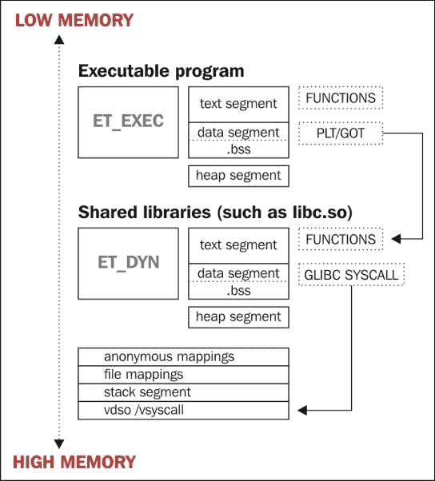

# 第七章：进程内存取证

在上一章中，我们检查了在 Linux 中分析 ELF 二进制文件时的关键方法和方法，特别是在涉及恶意软件时，以及检测可执行代码中寄生体存在的方法。

正如攻击者可能会在磁盘上对二进制文件进行打补丁一样，他们也可能会在内存中对运行的程序进行打补丁，以实现类似的目标，同时避免被寻找文件修改的程序检测到，比如 tripwire。这种对进程映像的热打补丁可以用于劫持函数、注入共享库、执行寄生壳代码等。这些类型的感染通常是内存驻留后门、病毒、键盘记录器和隐藏进程所需的组件。

### 注意

攻击者可以运行复杂的程序，这些程序将在现有进程地址空间内运行。这已经在 Saruman v0.1 中得到证明，可以在[`www.bitlackeys.org/#saruman`](http://www.bitlackeys.org/#saruman)找到。

在进行取证或运行时分析时，对进程映像的检查与查看常规 ELF 二进制文件非常相似。在进程地址空间中有更多的段和整体移动部分，ELF 可执行文件将经历一些变化，例如运行时重定位、段对齐和.bss 扩展。

然而，实际上，对 ELF 可执行文件和实际运行的程序进行调查步骤非常相似。运行的程序最初是由加载到地址空间的 ELF 映像创建的。因此，了解 ELF 格式将有助于理解进程在内存中的外观。

# 进程的外观是什么样的？

在任何 Linux 系统上，一个重要的文件是`/proc/$pid/maps`文件。这个文件显示了运行程序的整个进程地址空间，我经常解析它以确定某些文件或内存映射在进程中的位置。

在具有 Grsecurity 补丁的 Linux 内核上，有一个名为 GRKERNSEC_PROC_MEMMAP 的内核选项，如果启用，将清零`/proc/$pid/maps`文件，以便您无法看到地址空间的值。这使得从外部解析进程变得更加困难，您必须依赖其他技术，如解析 ELF 头文件并从那里开始。

### 注意

在下一章中，我们将讨论**ECFS**（扩展核心文件快照）格式，这是一种新的 ELF 文件格式，它扩展了常规核心文件，并包含大量取证相关的数据。

以下是`hello_world`程序的进程内存布局示例：

```
$ cat /proc/`pidof hello_world`/maps
00400000-00401000 r-xp 00000000 00:1b 8126525    /home/ryan/hello_world
00600000-00601000 r--p 00000000 00:1b 8126525    /home/ryan/hello_world
00601000-00602000 rw-p 00001000 00:1b 8126525    /home/ryan/hello_world
0174e000-0176f000 rw-p 00000000 00:00 0          [heap]
7fed9c5a7000-7fed9c762000 r-xp 00000000 08:01 11406096   /lib/x86_64-linux-gnu/libc-2.19.so
7fed9c762000-7fed9c961000 ---p 001bb000 08:01 11406096   /lib/x86_64-linux-gnu/libc-2.19.so
7fed9c961000-7fed9c965000 r--p 001ba000 08:01 11406096   /lib/x86_64-linux-gnu/libc-2.19.so
7fed9c965000-7fed9c967000 rw-p 001be000 08:01 11406096   /lib/x86_64-linux-gnu/libc-2.19.so
7fed9c967000-7fed9c96c000 rw-p 00000000 00:00 0
7fed9c96c000-7fed9c98f000 r-xp 00000000 08:01 11406093   /lib/x86_64-linux-gnu/ld-2.19.so
7fed9cb62000-7fed9cb65000 rw-p 00000000 00:00 0
7fed9cb8c000-7fed9cb8e000 rw-p 00000000 00:00 0
7fed9cb8e000-7fed9cb8f000 r--p 00022000 08:01 11406093   /lib/x86_64-linux-gnu/ld-2.19.so
7fed9cb8f000-7fed9cb90000 rw-p 00023000 08:01 11406093   /lib/x86_64-linux-gnu/ld-2.19.so
7fed9cb90000-7fed9cb91000 rw-p 00000000 00:00 0
7fff0975f000-7fff09780000 rw-p 00000000 00:00 0          [stack]
7fff097b2000-7fff097b4000 r-xp 00000000 00:00 0          [vdso]
ffffffffff600000-ffffffffff601000 r-xp 00000000 00:00 0  [vsyscall]
```

前面的 maps 文件输出显示了一个非常简单的`Hello World`程序的进程地址空间。让我们分几块来解释每个部分。

## 可执行内存映射

前三行是可执行文件本身的内存映射。这是相当明显的，因为它显示了文件映射的末尾处的可执行路径：

```
00400000-00401000 r-xp 00000000 00:1b 8126525  /home/ryan/hello_world
00600000-00601000 r--p 00000000 00:1b 8126525  /home/ryan/hello_world
00601000-00602000 rw-p 00001000 00:1b 8126525  /home/ryan/hello_world
```

我们可以看到：

+   第一行是文本段，很容易识别，因为权限是读取加执行

+   第二行是数据段的第一部分，由于 RELRO（只读重定位）安全保护而被标记为只读

+   第三个映射是仍然可写的数据段的剩余部分

## 程序堆

堆通常在数据段之后增长。在 ASLR 存在之前，它是从数据段地址的末尾扩展的。如今，堆段是随机内存映射的，但可以在*maps*文件中在数据段结束后找到：

```
0174e000-0176f000 rw-p 00000000 00:00 0          [heap]
```

当调用`malloc()`请求一个超过`MMAP_THRESHOLD`大小的内存块时，还可能创建匿名内存映射。这些类型的匿名内存段不会被标记为`[heap]`。

## 共享库映射

接下来的四行是共享库`libc-2.19.so`的内存映射。请注意，在文本和数据段之间有一个标记为无权限的内存映射。这只是为了占据该区域的空间，以便不会创建其他任意内存映射来使用文本和数据段之间的空间：

```
7fed9c5a7000-7fed9c762000 r-xp 00000000 08:01 11406096   /lib/x86_64-linux-gnu/libc-2.19.so
7fed9c762000-7fed9c961000 ---p 001bb000 08:01 11406096   /lib/x86_64-linux-gnu/libc-2.19.so
7fed9c961000-7fed9c965000 r--p 001ba000 08:01 11406096   /lib/x86_64-linux-gnu/libc-2.19.so
7fed9c965000-7fed9c967000 rw-p 001be000 08:01 11406096   /lib/x86_64-linux-gnu/libc-2.19.so
```

除了常规的共享库之外，还有动态链接器，从技术上讲也是一个共享库。我们可以看到它通过查看`libc`映射后的文件映射来映射到地址空间：

```
7fed9c96c000-7fed9c98f000 r-xp 00000000 08:01 11406093   /lib/x86_64-linux-gnu/ld-2.19.so
7fed9cb62000-7fed9cb65000 rw-p 00000000 00:00 0
7fed9cb8c000-7fed9cb8e000 rw-p 00000000 00:00 0
7fed9cb8e000-7fed9cb8f000 r--p 00022000 08:01 11406093   /lib/x86_64-linux-gnu/ld-2.19.so
7fed9cb8f000-7fed9cb90000 rw-p 00023000 08:01 11406093   /lib/x86_64-linux-gnu/ld-2.19.so
7fed9cb90000-7fed9cb91000 rw-p 00000000 00:00 0
```

## 栈、vdso 和 vsyscall

在映射文件的末尾，您将看到栈段，接着是**VDSO**（**虚拟动态共享对象**）和 vsyscall：

```
7fff0975f000-7fff09780000 rw-p 00000000 00:00 0          [stack]
7fff097b2000-7fff097b4000 r-xp 00000000 00:00 0          [vdso]
ffffffffff600000-ffffffffff601000 r-xp 00000000 00:00 0  [vsyscall]
```

VDSO 是`glibc`用来调用频繁调用的系统调用的，否则会导致性能问题。VDSO 通过在用户空间执行某些 syscalls 来加快速度。在 x86_64 上，vsyscall 页面已被弃用，但在 32 位上，它实现了与 VDSO 相同的功能。



进程是什么样子的

# 进程内存感染

有许多 rootkits、病毒、后门和其他工具可以用来感染系统的用户空间内存。我们现在将命名并描述其中的一些。

## 进程感染工具

+   **Azazel**：这是一个简单但有效的 Linux 用户空间 rootkit，基于其前身 rootkit Jynx。`LD_PRELOAD` rootkits 将预加载一个共享对象到您想要感染的程序中。通常，这样的 rootkit 将劫持函数，如 open、read、write 等。这些被劫持的函数将显示为 PLT 钩子（修改的 GOT）。有关更多信息，请访问[`github.com/chokepoint/azazel`](https://github.com/chokepoint/azazel)。

+   **Saruman**：这是一种相对较新的反取证感染技术，允许用户将完整的动态链接可执行文件注入到现有进程中。注入者和被注入者将在相同的地址空间内同时运行。这允许隐秘和高级的远程进程感染。有关更多信息，请访问[`github.com/elfmaster/saruman`](https://github.com/elfmaster/saruman)。

+   **sshd_fucker（phrack .so 注入论文）**：`sshd_fucker`是随 Phrack 59 论文*Runtime process infection*一起提供的软件。该软件感染 sshd 进程并劫持 PAM 函数，用户名和密码通过这些函数传递。有关更多信息，请访问[`phrack.org/issues/59/8.html`](http://phrack.org/issues/59/8.html)

## 进程感染技术

进程感染是什么意思？对于我们的目的，这意味着描述将代码注入进程、劫持函数、劫持控制流和反取证技巧，以使分析更加困难。这些技术中的许多在第四章中已经涵盖，*ELF 病毒技术- Linux/Unix 病毒*，但我们将在这里重述其中的一些。

### 注入方法

+   **ET_DYN（共享对象）注入**：这是使用`ptrace()`系统调用和使用`mmap()`或`__libc_dlopen_mode()`函数加载共享库文件的 shellcode 来实现的。共享对象可能根本不是共享对象；它可能是一个 PIE 可执行文件，就像 Saruman 感染技术一样，这是一种允许程序在现有进程地址空间内运行的反取证形式。这种技术就是我所说的**进程伪装**。

### 注意

`LD_PRELOAD`是另一个常见的技巧，用于将恶意共享库加载到进程地址空间中，以劫持共享库函数。这可以通过验证 PLT/GOT 来检测。还可以分析栈上的环境变量，以找出是否已设置`LD_PRELOAD`。

+   ET_REL（可重定位对象）注入：这里的想法是将可重定位对象文件注入到进程中，用于高级热修补技术。 ptrace 系统调用（或使用`ptrace()`的程序，如 GDB）可用于将 shellcode 注入到进程中，进而将对象文件内存映射到内存中。

+   PIC 代码（shellcode）注入：将 shellcode 注入到进程通常使用 ptrace 完成。通常，shellcode 是向进程注入更复杂代码（如`ET_DYN`和`ET_REL`文件）的第一阶段。

### 劫持执行的技术

+   PLT/GOT 重定向：劫持共享库函数最常见的方法是修改给定共享库的 GOT 条目，以便地址反映攻击者注入代码的位置。这本质上与覆盖函数指针相同。我们将在本章后面讨论检测这一点的方法。

+   内联函数挂钩：这种方法，也称为**函数跳板**，在磁盘和内存中都很常见。攻击者可以用`jmp`指令替换函数中的前 5 到 7 个字节的代码，将控制转移到恶意函数。这可以通过扫描每个函数的初始字节代码来轻松检测到。

+   修补.ctors 和.dtors：二进制文件中的.ctors 和.dtors 部分（可以位于内存中）包含初始化和终结函数的函数指针数组。攻击者可以在磁盘和内存中对其进行修补，使其指向寄生代码。

+   利用 VDSO 进行系统调用拦截：映射到进程地址空间的 VDSO 页面包含用于调用系统调用的代码。攻击者可以使用`ptrace(PTRACE_SYSCALL, ...)`来定位这段代码，然后用所需调用的系统调用号替换**%rax**寄存器。这允许聪明的攻击者在进程中调用任何他们想要的系统调用，而无需注入 shellcode。查看我 2009 年写的这篇论文；它详细描述了这一技术：[`vxheaven.org/lib/vrn00.html`](http://vxheaven.org/lib/vrn00.html)。

# 检测 ET_DYN 注入

我认为最普遍的进程感染类型是 DLL 注入，也称为`.so`注入。这是一种干净有效的解决方案，适合大多数攻击者和运行时恶意软件的需求。让我们看看一个被感染的进程，我将强调我们可以识别寄生代码的方法。

### 注意

术语**共享对象**，**共享库**，**DLL**和**ET_DYN**在本书中都是同义词，特别是在本节中。

## Azazel 用户态 rootkit 检测

我们的感染进程是一个名为`./host`的简单测试程序，它被 Azazel 用户态 rootkit 感染。 Azazel 是流行的 Jynx rootkit 的新版本。这两个 rootkit 都依赖于`LD_PRELOAD`来加载恶意共享库，劫持各种`glibc`共享库函数。我们将使用各种 GNU 工具和 Linux 环境，如`/proc`文件系统，来检查被感染的进程。

## 映射进程地址空间

分析进程时的第一步是映射地址空间。最直接的方法是查看`/proc/<pid>/maps`文件。我们要注意任何奇怪的文件映射和具有奇怪权限的段。在我们的情况下，我们可能需要检查环境变量的堆栈，因此我们需要注意其在内存中的位置。

### 注意

`pmap <pid>`命令也可以用来代替`cat /proc/<pid>/maps`。我更喜欢直接查看映射文件，因为它显示了每个内存段的整个地址范围以及任何文件映射的完整文件路径，如共享库。

这是一个被感染进程`./host`的内存映射的示例：

```
$ cat /proc/`pidof host`/maps
00400000-00401000 r-xp 00000000 00:24 5553671       /home/user/git/azazel/host
00600000-00601000 r--p 00000000 00:24 5553671       /home/user/git/azazel/host
00601000-00602000 rw-p 00001000 00:24 5553671       /home/user/git/azazel/host
0066c000-0068d000 rw-p 00000000 00:00 0              [heap]
3001000000-3001019000 r-xp 00000000 08:01 11406078  /lib/x86_64-linux-gnu/libaudit.so.1.0.0
3001019000-3001218000 ---p 00019000 08:01 11406078  /lib/x86_64-linux-gnu/libaudit.so.1.0.0
3001218000-3001219000 r--p 00018000 08:01 11406078  /lib/x86_64-linux-gnu/libaudit.so.1.0.0
3001219000-300121a000 rw-p 00019000 08:01 11406078  /lib/x86_64-linux-gnu/libaudit.so.1.0.0
300121a000-3001224000 rw-p 00000000 00:00 0
3003400000-300340d000 r-xp 00000000 08:01 11406085    /lib/x86_64-linux-gnu/libpam.so.0.83.1
300340d000-300360c000 ---p 0000d000 08:01 11406085    /lib/x86_64-linux-gnu/libpam.so.0.83.1
300360c000-300360d000 r--p 0000c000 08:01 11406085    /lib/x86_64-linux-gnu/libpam.so.0.83.1
300360d000-300360e000 rw-p 0000d000 08:01 11406085    /lib/x86_64-linux-gnu/libpam.so.0.83.1
7fc30ac7f000-7fc30ac81000 r-xp 00000000 08:01 11406070 /lib/x86_64-linux-gnu/libutil-2.19.so
7fc30ac81000-7fc30ae80000 ---p 00002000 08:01 11406070 /lib/x86_64-linux-gnu/libutil-2.19.so
7fc30ae80000-7fc30ae81000 r--p 00001000 08:01 11406070 /lib/x86_64-linux-gnu/libutil-2.19.so
7fc30ae81000-7fc30ae82000 rw-p 00002000 08:01 11406070 /lib/x86_64-linux-gnu/libutil-2.19.so
7fc30ae82000-7fc30ae85000 r-xp 00000000 08:01 11406068 /lib/x86_64-linux-gnu/libdl-2.19.so
7fc30ae85000-7fc30b084000 ---p 00003000 08:01 11406068 /lib/x86_64-linux-gnu/libdl-2.19.so
7fc30b084000-7fc30b085000 r--p 00002000 08:01 11406068 /lib/x86_64-linux-gnu/libdl-2.19.so
7fc30b085000-7fc30b086000 rw-p 00003000 08:01 11406068 /lib/x86_64-linux-gnu/libdl-2.19.so
7fc30b086000-7fc30b241000 r-xp 00000000 08:01 11406096 /lib/x86_64-linux-gnu/libc-2.19.so
7fc30b241000-7fc30b440000 ---p 001bb000 08:01 11406096 /lib/x86_64-linux-gnu/libc-2.19.so
7fc30b440000-7fc30b444000 r--p 001ba000 08:01 11406096 /lib/x86_64-linux-gnu/libc-2.19.so
7fc30b444000-7fc30b446000 rw-p 001be000 08:01 11406096 /lib/x86_64-linux-gnu/libc-2.19.so
7fc30b446000-7fc30b44b000 rw-p 00000000 00:00 0
7fc30b44b000-7fc30b453000 r-xp 00000000 00:24 5553672   /home/user/git/azazel/libselinux.so
7fc30b453000-7fc30b652000 ---p 00008000 00:24 5553672   /home/user/git/azazel/libselinux.so
7fc30b652000-7fc30b653000 r--p 00007000 00:24 5553672   /home/user/git/azazel/libselinux.so
7fc30b653000-7fc30b654000 rw-p 00008000 00:24 5553672   /home/user/git/azazel/libselinux.so
7fc30b654000-7fc30b677000 r-xp 00000000 08:01 11406093    /lib/x86_64-linux-gnu/ld-2.19.so
7fc30b847000-7fc30b84c000 rw-p 00000000 00:00 0
7fc30b873000-7fc30b876000 rw-p 00000000 00:00 0
7fc30b876000-7fc30b877000 r--p 00022000 08:01 11406093   /lib/x86_64-linux-gnu/ld-2.19.so
7fc30b877000-7fc30b878000 rw-p 00023000 08:01 11406093   /lib/x86_64-linux-gnu/ld-2.19.so
7fc30b878000-7fc30b879000 rw-p 00000000 00:00 0
7fff82fae000-7fff82fcf000 rw-p 00000000 00:00 0          [stack]
7fff82ffb000-7fff82ffd000 r-xp 00000000 00:00 0          [vdso]
ffffffffff600000-ffffffffff601000 r-xp 00000000 00:00 0  [vsyscall]
```

*./host*进程的 maps 文件的前述输出中突出显示了感兴趣和关注的区域。特别注意具有`/home/user/git/azazel/libselinux.so`路径的共享库。这应立即引起您的注意，因为该路径不是标准的共享库路径，并且它的名称是`libselinux.so`，传统上存储在所有其他共享库中（即`/usr/lib`）。

这可能表明可能存在共享库注入（也称为`ET_DYN`注入），这意味着这不是真正的`libselinux.so`库。在这种情况下，我们可能首先检查`LD_PRELOAD`环境变量，看它是否被用于**预加载**`libselinux.so`库。

## 在堆栈上查找 LD_PRELOAD

程序的环境变量在运行时存储在堆栈的底部附近。堆栈的底部实际上是最高地址（堆栈的开始），因为堆栈在 x86 架构上向较小的地址增长。根据`/proc/<pid>/maps`的输出，我们可以获得堆栈的位置：

```
STACK_TOP           STACK_BOTTOM
7fff82fae000   -    7fff82fcf000
```

因此，我们想要从`0x7fff82fcf000`开始检查堆栈。使用 GDB，我们可以附加到进程并通过使用`x/s <address>`命令快速定位堆栈上的环境变量，该命令告诉 GDB 以 ASCII 格式查看内存。`x/4096s <address>`命令执行相同的操作，但从 4,096 字节的数据中读取。

我们可以合理推测环境变量将位于堆栈的前 4,096 字节内，但由于堆栈向较小地址增长，我们必须从`<stack_bottom> - 4096`开始读取。

### 注意

argv 和 envp 指针分别指向命令行参数和环境变量。我们不是在寻找实际的指针，而是这些指针引用的字符串。

以下是使用 GDB 读取堆栈上环境变量的示例：

```
$ gdb -q attach `pidof host`
$ x/4096s (0x7fff82fcf000 – 4096)

… scroll down a few pages …

0x7fff82fce359:  "./host"
0x7fff82fce360:  "LD_PRELOAD=./libselinux.so"
0x7fff82fce37b:  "XDG_VTNR=7"
---Type <return> to continue, or q <return> to quit---
0x7fff82fce386:  "XDG_SESSION_ID=c2"
0x7fff82fce398:  "CLUTTER_IM_MODULE=xim"
0x7fff82fce3ae:  "SELINUX_INIT=YES"
0x7fff82fce3bf:  "SESSION=ubuntu"
0x7fff82fce3ce:  "GPG_AGENT_INFO=/run/user/1000/keyring-jIVrX2/gpg:0:1"
0x7fff82fce403:  "TERM=xterm"
0x7fff82fce40e:  "SHELL=/bin/bash"

… truncated …
```

从前述输出中，我们已经验证了`LD_PRELOAD`被用于预加载`libselinux.so`到进程中。这意味着程序中任何与预加载共享库中的函数同名的 glibc 函数将被覆盖，并有效地被`libselinux.so`中的函数劫持。

换句话说，如果`./host`程序调用 glibc 的`fopen`函数，而`libselinux.so`包含自己版本的`fopen`，那么 PLT/GOT（`.got.plt`部分）中将存储`fopen`函数，并且会使用`libselinux.so`版本而不是 glibc 版本。这将引导我们到下一个指示的项目——检测 PLT/GOT（PLT 的全局偏移表）中的函数劫持。

## 检测 PLT/GOT 挂钩

在检查 ELF 部分中名为`.got.plt`的 PLT/GOT（位于可执行文件的数据段中）之前，让我们看看`./host`程序中哪些函数对 PLT/GOT 有重定位。从 ELF 内部章节中记得，全局偏移表的重定位条目是`<ARCH>_JUMP_SLOT`类型的。详细信息请参考 ELF(5)手册。

### 注意

PLT/GOT 的重定位类型称为`<ARCH>_JUMP_SLOT`，因为它们就是那样——跳转槽。它们包含函数指针，PLT 使用 jmp 指令将控制传输到目标函数。实际的重定位类型根据架构命名为`X86_64_JUMP_SLOT, i386_JUMP_SLOT`等等。

以下是识别共享库函数的示例：

```
$ readelf -r host
Relocation section '.rela.plt' at offset 0x418 contains 7 entries:
000000601018  000100000007 R_X86_64_JUMP_SLO 0000000000000000 unlink + 0
000000601020  000200000007 R_X86_64_JUMP_SLO 0000000000000000 puts + 0
000000601028  000300000007 R_X86_64_JUMP_SLO 0000000000000000 opendir + 0
000000601030  000400000007 R_X86_64_JUMP_SLO 0000000000000000 __libc_start_main+0
000000601038  000500000007 R_X86_64_JUMP_SLO 0000000000000000 __gmon_start__+0
000000601040  000600000007 R_X86_64_JUMP_SLO 0000000000000000 pause + 0
000000601048  000700000007 R_X86_64_JUMP_SLO 0000000000000000 fopen + 0
```

我们可以看到有几个调用的知名 glibc 函数。可能其中一些或全部被冒牌共享库`libselinux.so`劫持。

### 识别不正确的 GOT 地址

从`readelf`输出中显示`./host`可执行文件中的 PLT/GOT 条目，我们可以看到每个符号的地址。让我们来看看内存中全局偏移表中以下符号的地址：`fopen`，`opendir`和`unlink`。这些可能已经被劫持，不再指向`libc.so`库。

以下是 GDB 输出显示 GOT 值的示例：

```
(gdb) x/gx 0x601048
0x601048 <fopen@got.plt>:  0x00007fc30b44e609
(gdb) x/gx 0x601018
0x601018 <unlink@got.plt>:  0x00007fc30b44ec81
(gdb) x/gx 0x601028
0x601028 <opendir@got.plt>:  0x00007fc30b44ed77
```

快速查看`selinux.so`共享库的可执行内存区域，我们可以看到 GDB 中 GOT 中显示的地址指向`selinux.so`内部的函数，而不是`libc.so`。

```
7fc30b44b000-7fc30b453000 r-xp  /home/user/git/azazel/libselinux.so

```

对于这种特定的恶意软件（Azazel），恶意共享库是使用`LD_PRELOAD`预加载的，这使得验证库是否可疑变得非常简单。但情况并非总是如此，因为许多形式的恶意软件将通过`ptrace()`或使用`mmap()`或`__libc_dlopen_mode()`的 shellcode 注入共享库。确定共享库是否已被注入的启发式方法将在下一节详细介绍。

### 注意

正如我们将在下一章中看到的那样，用于进程内存取证的 ECFS 技术具有一些功能，使得识别注入的 DLL 和其他类型的 ELF 对象几乎变得简单。

## ET_DYN 注入内部

正如我们刚刚演示的，检测已使用`LD_PRELOAD`预加载的共享库是相当简单的。那么注入到远程进程中的共享库呢？换句话说，已插入到现有进程中的共享对象呢？如果我们想要能够迈出下一步并检测 PLT/GOT 钩子，那么知道共享库是否被恶意注入是很重要的。首先，我们必须确定共享库可以被注入到远程进程的所有方式，正如我们在第 7.2.2 节中简要讨论的那样。

让我们看一个具体的例子，说明这可能是如何实现的。这是 Saruman 的一些示例代码，它将 PIE 可执行文件注入到进程中。

### 注意

PIE 可执行文件与共享库的格式相同，因此相同的代码将适用于将任一类型注入到进程中。

使用`readelf`实用程序，我们可以看到在标准 C 库（`libc.so.6`）中存在一个名为`__libc_dlopen_mode`的函数。这个函数实际上实现了与`dlopen`函数相同的功能，而`dlopen`函数并不驻留在`libc`中。这意味着对于任何使用`libc`的进程，我们都可以让动态链接器加载我们想要的任何`ET_DYN`对象，同时还自动处理所有的重定位补丁。

### 示例 - 查找 __libc_dlopen_mode 符号

攻击者通常使用这个函数将`ET_DYN`对象加载到进程中：

```
$ readelf -s /lib/x86_64-linux-gnu/libc.so.6 | grep dlopen
  2128: 0000000000136160   146 FUNC    GLOBAL DEFAULT   12 __libc_dlopen_mode@@GLIBC_PRIVATE
```

### 代码示例 - __libc_dlopen_mode shellcode

以下代码是用 C 编写的，但编译成机器代码后，可以作为我们使用`ptrace`注入到进程中的 shellcode：

```
#define __RTLD_DLOPEN 0x80000000 //glibc internal dlopen flag emulates dlopen behaviour
__PAYLOAD_KEYWORDS__ void * dlopen_load_exec(const char *path, void *dlopen_addr)
{
        void * (*libc_dlopen_mode)(const char *, int) = dlopen_addr;
        void *handle = (void *)0xfff; //initialized for debugging
        handle = libc_dlopen_mode(path, __RTLD_DLOPEN|RTLD_NOW|RTLD_GLOBAL);
        __RETURN_VALUE__(handle);
        __BREAKPOINT__;
}
```

注意其中一个参数是`void *dlopen_addr`。Saruman 定位了`__libc_dlopen_mode()`函数的地址，该函数驻留在`libc.so`中。这是通过一个解析`libc`库中符号的函数来实现的。

### 代码示例 - libc 符号解析

以下代码还有许多细节，我强烈建议您查看 Saruman。它专门用于注入编译为`ET_DYN`对象的可执行程序，但正如之前提到的，注入方法也适用于共享库，因为它们也编译为`ET_DYN`对象：

```
Elf64_Addr get_sym_from_libc(handle_t *h, const char *name)
{
        int fd, i;
        struct stat st;
        Elf64_Addr libc_base_addr = get_libc_addr(h->tasks.pid);
        Elf64_Addr symaddr;

        if ((fd = open(globals.libc_path, O_RDONLY)) < 0) {
                perror("open libc");
                exit(-1);
        }

        if (fstat(fd, &st) < 0) {
                perror("fstat libc");
                exit(-1);
        }

        uint8_t *libcp = mmap(NULL, st.st_size, PROT_READ, MAP_PRIVATE, fd, 0);
        if (libcp == MAP_FAILED) {
                perror("mmap libc");
                exit(-1);
        }

        symaddr = resolve_symbol((char *)name, libcp);
        if (symaddr == 0) {
                printf("[!] resolve_symbol failed for symbol '%s'\n", name);
                printf("Try using --manual-elf-loading option\n");
                exit(-1);
        }
        symaddr = symaddr + globals.libc_addr;

        DBG_MSG("[DEBUG]-> get_sym_from_libc() addr of __libc_dl_*: %lx\n", symaddr);
        return symaddr;

}
```

为了进一步揭开共享库注入的神秘面纱，让我向您展示一种更简单的技术，即使用`ptrace`注入的 shellcode 来将共享库`open()/mmap()`到进程地址空间中。这种技术可以使用，但需要恶意软件手动处理所有的热补丁重定位。`__libc_dlopen_mode()`函数通过动态链接器本身透明地处理所有这些，因此从长远来看实际上更容易。

### 代码示例-用于 mmap() ET_DYN 对象的 x86_32 shellcode

以下 shellcode 可以注入到给定进程中的可执行段中，然后使用`ptrace`执行。

请注意，这是我在本书中第二次使用这个手写的 shellcode 作为示例。我在 2008 年为 32 位 Linux 系统编写了它，并且方便在示例中使用。否则，我肯定会写一些新的内容来演示 x86_64 Linux 中更现代的方法：

```
_start:
        jmp B
A:

        # fd = open("libtest.so.1.0", O_RDONLY);

        xorl %ecx, %ecx
        movb $5, %al
        popl %ebx
        xorl %ecx, %ecx
        int $0x80

        subl $24, %esp

        # mmap(0, 8192, PROT_READ|PROT_WRITE|PROT_EXEC, MAP_SHARED, fd, 0);

        xorl %edx, %edx
        movl %edx, (%esp)
        movl $8192,4(%esp)
        movl $7, 8(%esp)
        movl $2, 12(%esp)
        movl %eax,16(%esp)
        movl %edx, 20(%esp)
        movl $90, %eax
        movl %esp, %ebx
        int $0x80

        # the int3 will pass control back the tracer
        int3
B:
        call A
        .string "/lib/libtest.so.1.0"
```

使用`PTRACE_POKETEXT`注入它，并使用`PTRACE_SETREGS`将`%eip`设置为 shellcode 的入口点，一旦 shellcode 触发`int3`指令，它将有效地将控制权传递回执行感染的程序。然后，它可以简单地从现在感染了共享库(`/lib/libtest.so.1.0`)的主机进程中分离出来。

在某些情况下，例如启用了 PaX mprotect 限制的二进制文件（[`pax.grsecurity.net/docs/mprotect.txt`](https://pax.grsecurity.net/docs/mprotect.txt)），`ptrace`系统调用无法用于将 shellcode 注入到文本段中。这是因为它是只读的，并且限制还将阻止将文本段标记为可写，因此您不能简单地绕过这一点。但是，可以通过几种方式来规避这一限制，例如将指令指针设置为`__libc_dlopen_mode`并将函数的参数存储在寄存器中（如`%rdi`、`%rsi`等）。或者，在 32 位架构的情况下，参数可以存储在堆栈上。

另一种方法是操纵大多数进程中存在的 VDSO 代码。

## 操纵 VDSO 执行脏工作

这种技术是在[`vxheaven.org/lib/vrn00.html`](http://vxheaven.org/lib/vrn00.html)上演示的，但是基本思想很简单。VDSO 代码映射到进程地址空间，如本章前面的`/proc/<pid>/maps`输出所示，其中包含通过*syscall*（64 位）和*sysenter*（32 位）指令调用系统调用的代码。在 Linux 中，系统调用的调用约定总是将系统调用号放在`%eax/%rax`寄存器中。

如果攻击者使用`ptrace(PTRACE_SYSCALL, …)`，他们可以快速定位 VDSO 代码中的 syscall 指令，并替换寄存器值以调用所需的系统调用。如果这样做得当，并且在恢复原始正在执行的系统调用时进行，那么它不会导致应用程序崩溃。`open`和`mmap`系统调用可用于将可执行对象（如`ET_DYN`或`ET_REL`）加载到进程地址空间中。或者，它们可以用于简单地创建一个可以存储 shellcode 的匿名内存映射。

这是一个代码示例，攻击者利用这个代码在 32 位系统上：

```
fffe420 <__kernel_vsyscall>:
ffffe420:       51                      push   %ecx
ffffe421:       52                      push   %edx
ffffe422:       55                      push   %ebp
ffffe423:       89 e5                   mov    %esp,%ebp
ffffe425:       0f 34                   sysenter
```

### 注意

在 64 位系统上，VDSO 包含至少两个使用 syscall 指令的位置。攻击者可以操纵其中任何一个。

以下是一个代码示例，攻击者利用这个代码在 64 位系统上：

```
ffffffffff700db8:       b0 60                   mov    $0x60,%al
ffffffffff700dba:       0f 05                   syscall
```

## 共享对象加载-合法与否？

动态链接器是将共享库引入进程的唯一合法方式。但是，请记住，攻击者可以使用`__libc_dlopen_mode`函数，该函数调用动态链接器来加载对象。那么我们如何知道动态链接器是否在进行合法工作呢？有三种合法的方式，动态链接器将共享对象映射到进程中。

### 合法的共享对象加载

让我们看看我们认为是合法的共享对象加载的方式：

+   可执行程序中有一个有效的`DT_NEEDED`条目，对应于共享库文件。

+   动态链接器有效加载的共享库可能会有自己的`DT_NEEDED`条目，以便加载其他共享库。这可以称为传递式共享库加载。

+   如果程序链接了`libdl.so`，那么它可以使用动态加载函数来动态加载库。加载共享对象的函数名为`dlopen`，解析符号的函数名为`dlsym`。

### 注意

正如我们之前讨论过的，`LD_PRELOAD`环境变量也会调用动态链接器，但这种方法处于灰色地带，因为它通常用于合法和非法两种目的。因此，它没有包括在*合法的共享对象加载*列表中。

### 非法的共享对象加载

现在，让我们看看共享对象可以被加载到进程中的非法方式，也就是说，由攻击者或恶意软件实例：

+   `__libc_dlopen_mode`函数存在于`libc.so`（而不是`libdl.so`）中，并且不打算由程序调用。它实际上被标记为`GLIBC PRIVATE`函数。大多数进程都有`libc.so`，因此这是攻击者或恶意软件常用的函数，用于加载任意共享对象。

+   `VDSO`操纵。正如我们已经展示的，这种技术可以用于执行任意系统调用，因此可以简单地使用这种方法内存映射共享对象。

+   直接调用`open`和`mmap`系统调用的 Shellcode。

+   攻击者可以通过覆盖可执行文件或共享库的动态段中的`DT_NULL`标签来添加`DT_NEEDED`条目，从而能够告诉动态链接器加载他们希望加载的任何共享对象。这种特定方法在第六章中已经讨论过，更多地属于那一章的主题，但在检查可疑进程时可能也是必要的。

### 注意

确保检查可疑进程的二进制，并验证动态段是否看起来可疑。参考第六章中的*检查动态段以查找 DLL 注入痕迹*部分。

现在我们已经清楚地定义了合法与非法加载共享对象的标准，我们可以开始讨论检测共享库是否合法的启发式方法。

值得注意的是，`LD_PRELOAD`通常用于好坏两种目的，唯一确定的方法是检查预加载的共享对象中实际的代码。因此，在这里的启发式讨论中，我们将不讨论`LD_PRELOAD`。

## .so 注入检测的启发式方法

在这一部分，我将描述检测共享库是否合法的一般原则。在第八章中，我们将讨论 ECFS 技术，该技术实际上将这些启发式方法纳入了其功能集中。

现在，让我们只看原则。我们想要获取映射到进程的共享库列表，然后查看哪些符合动态链接器的合法加载条件：

1.  从`/proc/<pid>/maps`文件中获取共享对象路径列表。

### 注意

一些恶意注入的共享库不会出现为文件映射，因为攻击者创建了匿名内存映射，然后将共享对象代码复制到这些内存区域中。在下一章中，我们将看到 ECFS 也可以清除这些更隐秘的实体。可以扫描每个匿名映射到可执行内存区域，以查看是否存在 ELF 头，特别是具有`ET_DYN`文件类型的头。

1.  确定可执行文件中是否存在与您所看到的共享库对应的有效`DT_NEEDED`条目。如果存在，则它是合法的共享库。在验证了给定的共享库是合法的之后，检查该共享库的动态段，并枚举其中的`DT_NEEDED`条目。这些对应的共享库也可以标记为合法的。这回到了传递共享对象加载的概念。

1.  查看进程的实际可执行程序的`PLT/GOT`。如果使用了任何`dlopen`调用，则分析代码以查找任何`dlopen`调用。`dlopen`调用可能会传递静态检查的参数，例如：

```
void *handle = dlopen("somelib.so", RTLD_NOW);
```

在这种情况下，字符串将被存储为静态常量，因此将位于二进制文件的`.rodata`部分。因此，检查`.rodata`部分（或者存储字符串的任何地方）是否包含任何包含您要验证的共享库路径的字符串。

1.  如果在 maps 文件中找到的任何共享对象路径找不到或者不能由`DT_NEEDED`部分解释，并且也不能由任何`dlopen`调用解释，那么这意味着它要么是由`LD_PRELOAD`预加载，要么是由其他方式注入的。在这一点上，您应该将共享对象标记为可疑。

## 用于检测 PLT/GOT 挂钩的工具

目前，在 Linux 中没有太多专门用于进程内存分析的好工具。这就是我设计 ECFS 的原因（在第八章中讨论，“ECFS – 扩展核心文件快照技术”）。我知道的只有几个工具可以检测 PLT/GOT 覆盖，它们每一个基本上都使用我们刚刚讨论的相同的启发式方法：

+   Linux VMA Voodoo：这个工具是我在 2011 年通过 DARPA CFT 计划设计的原型。它能够检测许多类型的进程内存感染，但目前只能在 32 位系统上运行，而且不对公众开放。然而，新的 ECFS 实用程序是开源的，受到 VMA Voodoo 的启发。您可以在[`www.bitlackeys.org/#vmavudu`](http://www.bitlackeys.org/#vmavudu)了解 VMA Voodoo。

+   ECFS（扩展核心文件快照）技术：这项技术最初是为了在 Linux 中作为本机快照格式用于进程内存取证工具而设计的。它已经发展成为更多的东西，并且有一个专门的章节介绍它（第八章，“ECFS – 扩展核心文件快照技术”）。它可以在[`github.com/elfmaster/ecfs`](https://github.com/elfmaster/ecfs)找到。

+   Volatility plt_hook：Volatility 软件主要用于全系统内存分析，但 Georg Wicherski 在 2013 年设计了一个插件，专门用于检测进程内的 PLT/GOT 感染。这个插件使用了我们之前讨论的类似的启发式方法。这个功能现在已经与 Volatility 源代码合并在一起，可以在[`github.com/volatilityfoundation/volatility`](https://github.com/volatilityfoundation/volatility)找到。

# Linux ELF 核心文件

在大多数 UNIX 风格的操作系统中，可以向进程发送信号，以便它转储核心文件。核心文件本质上是进程及其状态在核心（崩溃或转储）之前的快照。核心文件是一种 ELF 文件，主要由程序头和内存段组成。它们还包含大量的注释，描述文件映射、共享库路径和其他信息。

核心文件本身对于进程内存取证并不特别有用，但对于更敏锐的分析师可能会产生一些结果。

### 注意

这实际上是 ECFS 介入的地方；它是常规 Linux ELF 核心格式的扩展，并提供了专门用于取证分析的功能。

## 核心文件的分析- Azazel rootkit

在这里，我们将使用`LD_PRELOAD`环境变量感染一个进程，然后向该进程发送中止信号，以便我们可以捕获用于分析的核心转储。

### 启动 Azazel 感染的进程并获取核心转储

```
$ LD_PRELOAD=./libselinux.so ./host &
[1] 9325
$ kill -ABRT `pidof host`
[1]+  Segmentation fault      (core dumped) LD_PRELOAD=./libselinux.so ./host
```

### 核心文件程序头

在核心文件中，有许多程序头。除了一个之外，所有程序头都是`PT_LOAD`类型。对于进程中的每个内存段，都有一个`PT_LOAD`程序头，特殊设备（即`/dev/mem`）除外。从共享库和匿名映射到堆栈、堆、文本和数据段，所有内容都由程序头表示。

然后，有一个`PT_NOTE`类型的程序头；它包含了整个核心文件中最有用和描述性的信息。

### PT_NOTE 段

接下来显示的`eu-readelf -n`输出显示了核心文件注释段的解析。我们之所以在这里使用`eu-readelf`而不是常用的`readelf`，是因为 eu-readelf（ELF Utils 版本）需要时间来解析注释段中的每个条目，而更常用的`readelf`（binutils 版本）只显示`NT_FILE`条目：

```
$ eu-readelf -n core

Note segment of 4200 bytes at offset 0x900:
  Owner          Data size  Type
  CORE                 336  PRSTATUS
    info.si_signo: 11, info.si_code: 0, info.si_errno: 0, cursig: 11
    sigpend: <>
    sighold: <>
    pid: 9875, ppid: 7669, pgrp: 9875, sid: 5781
    utime: 5.292000, stime: 0.004000, cutime: 0.000000, cstime: 0.000000
    orig_rax: -1, fpvalid: 1
    r15:                       0  r14:                       0
    r13:         140736185205120  r12:                 4195616
    rbp:      0x00007fffb25380a0  rbx:                       0
    r11:                     582  r10:         140736185204304
    r9:                 15699984  r8:               1886848000
    rax:                      -1  rcx:                    -160
    rdx:         140674792738928  rsi:              4294967295
    rdi:                 4196093  rip:      0x000000000040064f
    rflags:   0x0000000000000286  rsp:      0x00007fffb2538090
    fs.base:   0x00007ff1677a1740  gs.base:   0x0000000000000000
    cs: 0x0033  ss: 0x002b  ds: 0x0000  es: 0x0000  fs: 0x0000  gs: 0x0000
  CORE                 136  PRPSINFO
    state: 0, sname: R, zomb: 0, nice: 0, flag: 0x0000000000406600
    uid: 0, gid: 0, pid: 9875, ppid: 7669, pgrp: 9875, sid: 5781
    fname: host, psargs: ./host
  CORE                 128  SIGINFO
    si_signo: 11, si_errno: 0, si_code: 0
    sender PID: 7669, sender UID: 0
  CORE                 304  AUXV
    SYSINFO_EHDR: 0x7fffb254a000
    HWCAP: 0xbfebfbff  <fpu vme de pse tsc msr pae mce cx8 apic sep mtrr pge mca cmov pat pse36 clflush dts acpi mmx fxsr sse sse2 ss ht tm pbe>
    PAGESZ: 4096
    CLKTCK: 100
    PHDR: 0x400040
    PHENT: 56
    PHNUM: 9
    BASE: 0x7ff1675ae000
    FLAGS: 0
    ENTRY: 0x400520
    UID: 0
    EUID: 0
    GID: 0
    EGID: 0
    SECURE: 0
    RANDOM: 0x7fffb2538399
    EXECFN: 0x7fffb2538ff1
    PLATFORM: 0x7fffb25383a9
    NULL
  CORE                1812  FILE
    30 files:
   00400000-00401000 00000000 4096        /home/user/git/azazel/host
   00600000-00601000 00000000 4096        /home/user/git/azazel/host
   00601000-00602000 00001000 4096        /home/user/git/azazel/host
   3001000000-3001019000 00000000 102400  /lib/x86_64-linux-gnu/libaudit.so.1.0.0
   3001019000-3001218000 00019000 2093056 /lib/x86_64-linux-gnu/libaudit.so.1.0.0
   3001218000-3001219000 00018000 4096    /lib/x86_64-linux-gnu/libaudit.so.1.0.0
   3001219000-300121a000 00019000 4096    /lib/x86_64-linux-gnu/libaudit.so.1.0.0
   3003400000-300340d000 00000000 53248   /lib/x86_64-linux-gnu/libpam.so.0.83.1
   300340d000-300360c000 0000d000 2093056 /lib/x86_64-linux-gnu/libpam.so.0.83.1
   300360c000-300360d000 0000c000 4096    /lib/x86_64-linux-gnu/libpam.so.0.83.1
   300360d000-300360e000 0000d000 4096    /lib/x86_64-linux-gnu/libpam.so.0.83.1
  7ff166bd9000-7ff166bdb000 00000000 8192    /lib/x86_64-linux-gnu/libutil-2.19.so
  7ff166bdb000-7ff166dda000 00002000 2093056 /lib/x86_64-linux-gnu/libutil-2.19.so
  7ff166dda000-7ff166ddb000 00001000 4096    /lib/x86_64-linux-gnu/libutil-2.19.so
  7ff166ddb000-7ff166ddc000 00002000 4096    /lib/x86_64-linux-gnu/libutil-2.19.so
  7ff166ddc000-7ff166ddf000 00000000 12288   /lib/x86_64-linux-gnu/libdl-2.19.so
  7ff166ddf000-7ff166fde000 00003000 2093056 /lib/x86_64-linux-gnu/libdl-2.19.so
  7ff166fde000-7ff166fdf000 00002000 4096    /lib/x86_64-linux-gnu/libdl-2.19.so
  7ff166fdf000-7ff166fe0000 00003000 4096    /lib/x86_64-linux-gnu/libdl-2.19.so
  7ff166fe0000-7ff16719b000 00000000 1814528 /lib/x86_64-linux-gnu/libc-2.19.so
  7ff16719b000-7ff16739a000 001bb000 2093056 /lib/x86_64-linux-gnu/libc-2.19.so
  7ff16739a000-7ff16739e000 001ba000 16384   /lib/x86_64-linux-gnu/libc-2.19.so
  7ff16739e000-7ff1673a0000 001be000 8192    /lib/x86_64-linux-gnu/libc-2.19.so
  7ff1673a5000-7ff1673ad000 00000000 32768   /home/user/git/azazel/libselinux.so
  7ff1673ad000-7ff1675ac000 00008000 2093056 /home/user/git/azazel/libselinux.so
  7ff1675ac000-7ff1675ad000 00007000 4096    /home/user/git/azazel/libselinux.so
  7ff1675ad000-7ff1675ae000 00008000 4096    /home/user/git/azazel/libselinux.so
  7ff1675ae000-7ff1675d1000 00000000 143360 /lib/x86_64-linux-gnu/ld-2.19.so
  7ff1677d0000-7ff1677d1000 00022000 4096   /lib/x86_64-linux-gnu/ld-2.19.so
  7ff1677d1000-7ff1677d2000 00023000 4096   /lib/x86_64-linux-gnu/ld-2.19.so
```

能够查看寄存器状态、辅助向量、信号信息和文件映射并不是坏消息，但它们本身还不足以分析进程的恶意软件感染。

### PT_LOAD 段和核心文件在取证目的上的缺陷

每个内存段都包含一个程序头，描述了它所代表的段的偏移量、地址和大小。这几乎表明你可以通过程序段访问进程镜像的每个部分，但这只是部分正确的。可执行文件的文本镜像和映射到进程的每个共享库只有自己的前 4,096 字节被转储到一个段中。

这是为了节省空间，因为 Linux 内核开发人员认为文本段不会在内存中被修改。因此，在访问文本区域时，只需引用原始可执行文件和共享库即可满足调试器的需求。如果核心文件要为每个共享库转储完整的文本段，那么对于诸如 Wireshark 或 Firefox 之类的大型程序，输出的核心转储文件将是巨大的。

因此，出于调试目的，通常可以假设文本段在内存中没有发生变化，并且只需引用可执行文件和共享库文件本身来获取文本。但是对于运行时恶意软件分析和进程内存取证呢？在许多情况下，文本段已被标记为可写，并包含用于代码变异的多态引擎，在这些情况下，核心文件可能无法用于查看代码段。

此外，如果核心文件是唯一可用于分析的工件，原始可执行文件和共享库已不再可访问呢？这进一步证明了为什么核心文件并不特别适合进程内存取证；也从未打算如此。

### 注意

在下一章中，我们将看到 ECFS 如何解决许多使核心文件成为取证目的无用工件的弱点。

### 使用 GDB 进行取证的核心文件

结合原始可执行文件，并假设没有对代码进行修改（对文本段），我们仍然可以在一定程度上使用核心文件进行恶意软件分析。在这种特殊情况下，我们正在查看 Azazel rootkit 的核心文件，正如我们在本章前面所演示的那样，它具有 PLT/GOT 钩子：

```
$ readelf -S host | grep got.plt
  [23] .got.plt          PROGBITS         0000000000601000  00001000
$ readelf -r host
Relocation section '.rela.plt' at offset 0x3f8 contains 6 entries:
  Offset          Info           Type           Sym. Value    Sym. Name + Addend
000000601018  000100000007 R_X86_64_JUMP_SLO 0000000000000000 unlink + 0
000000601020  000200000007 R_X86_64_JUMP_SLO 0000000000000000 puts + 0
000000601028  000300000007 R_X86_64_JUMP_SLO 0000000000000000 opendir + 0
000000601030  000400000007 R_X86_64_JUMP_SLO 0000000000000000 __libc_start_main+0
000000601038  000500000007 R_X86_64_JUMP_SLO 0000000000000000 __gmon_start__ + 0
000000601040  000600000007 R_X86_64_JUMP_SLO 0000000000000000 fopen + 0

```

因此，让我们来看一下我们已经知道被 Azazel 劫持的函数。`fopen`函数是受感染程序中的四个共享库函数之一，正如我们从前面的输出中可以看到的，它在`0x601040`处有一个 GOT 条目：

```
$ gdb -q ./host core
Reading symbols from ./host...(no debugging symbols found)...done.
[New LWP 9875]
Core was generated by `./host'.
Program terminated with signal SIGSEGV, Segmentation fault.
#0  0x000000000040064f in main ()
(gdb) x/gx 0x601040
0x601040 <fopen@got.plt>:  0x00007ff1673a8609
(gdb)
```

如果我们再次查看`PT_NOTE`段中的`NT_FILE`条目（`readelf -n core`），我们可以看到`libc-2.19.so`文件在内存中映射到的地址范围，并检查`fopen`的 GOT 条目是否指向了`libc-2.19.so`，正如它应该的那样：

```
$ readelf -n core
<snippet>
 0x00007ff166fe0000  0x00007ff16719b000  0x0000000000000000
        /lib/x86_64-linux-gnu/libc-2.19.so
</snippet>
```

`fopen@got.plt`指向`0x7ff1673a8609`。这超出了之前显示的`libc-2.19.so`文本段范围，即`0x7ff166fe0000`到`0x7ff16719b000`。使用 GDB 检查核心文件与使用 GDB 检查实时进程非常相似，您可以使用下面显示的相同方法来定位环境变量并检查`LD_PRELOAD`是否已设置。

以下是在核心文件中定位环境变量的示例：

```
(gdb) x/4096s $rsp

… scroll down a few pages …

0x7fffb25388db:  "./host"
0x7fffb25388e2:  "LD_PRELOAD=./libselinux.so"
0x7fffb25388fd:  "SHELL=/bin/bash"
0x7fffb253890d:  "TERM=xterm"
0x7fffb2538918:  "OLDPWD=/home/ryan"
0x7fffb253892a:  "USER=root"
```

# 总结

进程内存取证的艺术是法证工作的一个非常特定的方面。它主要关注与进程图像相关的内存，这本身就相当复杂，因为它需要对 CPU 寄存器、堆栈、动态链接和 ELF 有复杂的了解。

因此，熟练地检查进程中的异常确实是一种通过经验不断积累的艺术和技能。本章作为该主题的入门指南，让初学者能够了解如何开始。在下一章中，我们将讨论进程取证，您将了解 ECFS 技术如何使其变得更加容易。

在完成本章和下一章之后，我建议您使用本章中引用的一些工具在您的系统上感染一些进程，并尝试检测它们的方法。
