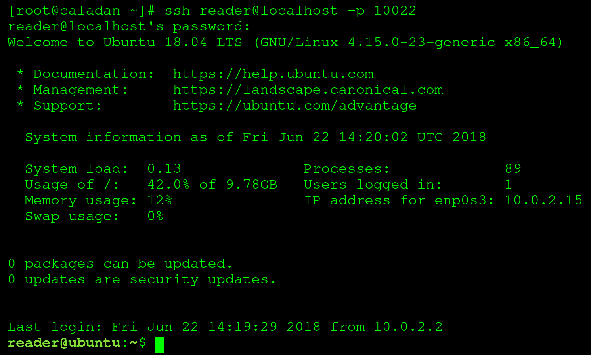

# 第一章：介绍

在我们开始编写 shell 脚本之前，我们需要了解一些关于我们最相关的两个组件的背景：**Linux**和**Bash**。我们将解释 Linux 和 Bash，探讨这两种技术背后的历史，并讨论它们的当前状态。

本章将涵盖以下主题：

+   什么是 Linux？

+   什么是 Bash？

# 什么是 Linux？

Linux 是一个通用术语，指的是基于 Linux 内核的不同开源操作系统。Linux 内核最初由 Linus Torvalds 于 1991 年创建，并于 1996 年开源。内核是一种设计用于在低级硬件（如处理器、内存和输入/输出设备）与高级软件（如操作系统）之间充当中间层的软件。除了 Linux 内核外，大多数 Linux 操作系统在很大程度上依赖 GNU 项目实用工具；例如，Bash shell 是一个 GNU 程序。因此，一些人将 Linux 操作系统称为 GNU/Linux。GNU 项目，其中 GNU 代表***G**NU's **N**ot **U**nix!*（一个递归缩写），是一个自由软件集合，其中大部分在大多数 Linux 发行版中都可以找到。这个集合包括许多工具，还有一个名为 GNU HURD 的替代内核（并不像 Linux 内核那样广泛使用）。

为什么我们需要一个内核？由于内核位于硬件和操作系统之间，它提供了与硬件交互的抽象。这就是为什么 Linux 生态系统变得如此庞大：内核可以自由使用，并且它处理了许多类型硬件的低级操作。因此，操作系统的创建者可以花时间为用户制作易于使用、美观的体验，而不必担心用户的图片将如何被写入连接到系统的物理磁盘。

Linux 内核是所谓的**类 Unix**软件。正如你可能猜到的那样，这意味着它类似于最初由 Ken Thompson 和 Dennis Ritchie 在贝尔实验室于 1971 年至 1973 年间创建的原始 Unix 内核。然而，Linux 内核只是*基于*Unix 原则，并不与 Unix 系统*共享代码*。著名的 Unix 系统包括 BSD（FreeBSD、OpenBSD 等）和 macOS。

Linux 操作系统广泛用于两个目的之一：作为桌面或作为服务器。作为桌面，Linux 可以替代更常用的 Microsoft Windows 或 macOS。然而，大多数 Linux 使用是用于服务器领域。据估计，目前约 70%的互联网服务器使用 Unix 或类 Unix 操作系统。下次当你浏览新闻、阅读邮件或在你最喜欢的社交媒体网站上滚动时，请记住，你所看到的页面很有可能是由一个或多个 Linux 服务器处理的。

Linux 有许多发行版或版本。大多数 Linux 操作系统属于发行版家族。发行版家族基于一个共同的祖先，并且通常使用相同的软件包管理工具。其中一个较为知名的 Linux 发行版**Ubuntu**基于**Debian**发行版家族。另一个著名的 Linux 发行版**Fedora**基于**Red Hat**家族。其他值得注意的发行版家族包括**SUSE**、**Gentoo**和**Arch**。

很多人并不意识到有多少设备在运行 Linux 内核。例如，如今使用最普遍的智能手机操作系统 Android（市场份额约为 85%）使用了修改版的 Linux 内核。许多智能电视、路由器、调制解调器和其他各种嵌入式设备也是如此。如果我们将 Unix 和其他类 Unix 软件包括在内，我们可以肯定地说世界上大多数设备都在运行这些内核！

# 什么是 Bash？

Linux 系统中最常用的 shell 是**B**ourne-**a**gain **sh**ell，或者称为 Bash。Bash shell 基于**Bourne shell**，也就是**sh**。但 shell 到底是什么呢？

shell 本质上是一个用户界面。最常见的是指文本界面，也称为**命令行界面**（**CLI**）。但它被称为*shell*，是因为它可以被看作是*内核周围的外壳*；这意味着它不仅适用于 CLI，同样也适用于**图形用户界面**（**GUI**）。当我们在本书中提到 shell 时，我们指的是 CLI，除非另有说明，我们指的是 Bash shell。

shell 的目的，无论是 CLI 还是 GUI，都是允许用户与系统进行交互。毕竟，一个没有交互功能的系统很难被证明存在的，更不用说难以使用了！在这种情况下，交互意味着许多事情：在键盘上输入会在屏幕上显示字母，移动鼠标会改变屏幕上光标的位置，给出删除文件的命令（无论是使用 CLI 还是 GUI）都会从磁盘中删除字节，等等。

在 Unix 和计算机的早期，没有 GUI 可用，因此所有工作都是通过 CLI 执行的。要连接到运行中的机器上的 shell，通常会使用**视频终端**：通常这是一个非常简单的监视器，配合键盘使用，通过 RS-232 串行电缆连接。在这个视频终端上输入的命令由运行在 Unix 机器上的 shell 处理。

幸运的是，自第一台计算机以来，事情发生了很大的变化。今天，我们不再使用专用硬件连接到 shell。一个运行在 GUI 中的软件，即**终端仿真器**，用于与 shell 进行交互。让我们快速看一下通过终端仿真器连接到 Bash shell 的样子：

在前面的屏幕截图中，我们通过**安全外壳**（**SSH**）协议，使用终端仿真器（GNOME Terminal）连接到了 Linux 虚拟机（我们将在下一章中设置这个），收到了一些有趣的信息：

+   我们处于 CLI 界面；我们既无法访问鼠标，也不需要鼠标

+   我们连接到了一个 Ubuntu 机器，但是我们是在另一个操作系统（本例中是 Arch Linux）中运行的

+   我们在 Ubuntu 18.04 中收到了一条欢迎消息，显示了关于系统的一些常规信息

除了直接使用 Bash shell 与系统进行交互，它还提供了另一个重要的功能：按特定目标顺序执行多个命令，无论是否需要用户交互。这听起来可能很复杂，但实际上非常简单：我们谈论的是**Bash 脚本**，也就是本书的主题！

# 总结

在这一章中，您已经了解了 GNU/Linux 操作系统和 Linux 内核，了解了内核的真正含义，以及 Linux 发行版对日常生活产生的巨大影响。您还了解了 shell 是什么，以及最常见的 Linux shell——Bash，既可以用于与 Linux 系统交互，也可以用于编写 shell 脚本。

在下一章中，我们将设置一个本地环境，这将在本书的其余部分中使用，包括示例和练习。
