# 第二章：设置您的本地环境

在上一章中，我们探讨了 Linux 和 Bash 的美妙世界的一些背景知识。由于这是一本实践驱动的书，我们将利用本章来设置一台机器，您可以在其中跟随示例并完成每章末尾的练习。这可以是虚拟机，也可以是物理安装；这取决于您。我们将在本章的第一部分讨论这个问题，然后继续安装 VirtualBox，最后创建一个 Ubuntu 虚拟机。

本章将介绍以下命令：`ssh`和`exit`。

本章将涵盖以下主题：

+   在虚拟机和物理安装之间进行选择

+   设置 VirtualBox

+   创建 Ubuntu 虚拟机

# 技术要求

要完成本章（以及以下章节）中的练习，您需要一台至少拥有 2 GHz CPU 功率、10 GB 硬盘空间和大约 1 GB 可用内存的 PC 或笔记本电脑。在过去 5 年中制造的几乎所有硬件都应该足够。

# 在虚拟机和物理安装之间进行选择

虚拟机是物理机的仿真。这意味着它在物理机内部运行，而不是直接在硬件上运行。物理机可以直接访问所有硬件，如 CPU、RAM 和其他设备，如鼠标、键盘和显示器。然而，无法在多个物理机之间共享 CPU 或 RAM。虚拟机不能直接访问硬件，而是通过仿真层访问，这意味着资源可以在多个虚拟机之间共享。

因为我们正在讨论 Bash shell 脚本编程，理论上进行何种安装并不重要。只要该安装运行兼容的 Linux 操作系统，并且具有 Bash 4.4 或更高版本，所有练习都应该可以运行。然而，使用虚拟机而不是物理安装有许多优势：

+   无需删除您当前首选的操作系统，或设置复杂的双启动配置

+   虚拟机可以进行快照，这允许从关键故障中恢复

+   您可以在一台机器上运行（许多）不同的操作系统

不幸的是，虚拟机使用也有一些缺点：

+   因为您在已经运行的操作系统中运行虚拟操作系统，所以与运行裸机安装相比，虚拟化会带来一些开销

+   由于同时运行多个操作系统，您将需要比裸机安装更多的资源

在我们看来，现代计算机的速度足够快，使得缺点几乎可以忽略不计，而在虚拟机中运行 Linux 所提供的优势非常有帮助。因此，我们将在本章的其余部分中只解释虚拟机设置。如果您对将 Linux 作为物理安装感到足够自信（或者您可能已经在某个地方运行了 Linux！），请随时使用该机器探索本书的其余部分。

您可能在家里有一个树莓派或另一个运行 Linux 的单板计算机，来自以前的项目。虽然这些机器确实运行着 Linux 发行版（Raspbian），但它们可能是在不同的架构上运行的：ARM 而不是 x86。因为这可能会导致意想不到的结果，我们建议本书只使用 x86 设备。

如果您想确保所有示例和练习都能像本书中所示那样工作，请在 VirtualBox 中运行一个 Ubuntu 18.04 LTS 虚拟机，建议的规格为 1 个 CPU、1GB RAM 和 10GB 硬盘：这个设置在本章的其余部分中有描述。即使许多其他类型的部署也应该可以工作，但当练习不起作用时，您可能不希望在发现是由于您的设置引起的之前，花费数小时撞墙。

# 设置 VirtualBox

要使用虚拟机，我们需要一种称为**虚拟化软件**的软件。虚拟化软件在主机机器和虚拟机之间管理资源，提供对磁盘的访问，并具有管理所有这些的接口。有两种不同类型的虚拟化软件：类型 1 和类型 2。类型 1 虚拟化软件是所谓的裸机虚拟化软件。这些软件是安装在硬件上而不是像 Linux、macOS 或 Windows 等常规操作系统上的。这些类型的虚拟化软件用于企业服务器、云服务等。在本书中，我们将使用类型 2 虚拟化软件（也称为托管虚拟化软件）：这些软件安装在另一个操作系统中，就像一个浏览器一样。

有许多类型 2 的虚拟化软件。在撰写本文时，最受欢迎的选择是 VirtualBox、VMware 工作站播放器，或者 OS 特定的变体，如 Linux 上的 QEMU/KVM，macOS 上的 Parallels Desktop，以及 Windows 上的 Hyper-V。因为我们将在整本书中使用虚拟机，我们不假设主机机器的任何情况：您应该可以舒适地使用您喜欢的任何操作系统。因此，我们选择使用 VirtualBox 作为我们的虚拟化软件，因为它可以在 Linux、macOS 和 Windows 上运行（甚至其他系统！）。此外，VirtualBox 是免费和开源软件，这意味着您可以只需下载并使用它。

目前，VirtualBox 由 Oracle 公司拥有。您可以从[`www.virtualbox.org/`](https://www.virtualbox.org/)下载 VirtualBox 的安装程序。安装不应该很难；按照安装程序的说明进行操作。

安装类型 2 的虚拟化软件（如 VirtualBox）后，请务必重新启动计算机。虚拟化软件通常需要加载一些内核模块，最简单的方法是通过重新启动实现。

# 创建 Ubuntu 虚拟机

在本书中，我们使用 Bash 进行脚本编写，这意味着我们的 Linux 安装不需要 GUI。我们选择使用**Ubuntu Server 18.04 LTS**作为虚拟机操作系统，原因有很多：

+   Ubuntu 被认为是一种适合初学者的 Linux 发行版。

+   18.04 是一个**长期支持**（**LTS**）版本，这意味着它将在 2023 年 4 月之前接收更新

+   因为 Ubuntu 服务器提供了仅 CLI 安装，它对系统资源消耗较小，并且代表了真实服务器的情况。

在撰写本文时，Ubuntu 由 Canonical 公司维护。您可以从[`www.ubuntu.com/download/server`](https://www.ubuntu.com/download/server)下载 ISO 镜像。现在下载文件，并记住您保存此文件的位置，因为您很快就会需要它。

如果前面的下载链接不再有效，您可以转到您喜欢的搜索引擎，搜索“Ubuntu Server 18.04 ISO 下载”。您应该会找到 Ubuntu 存档的参考，其中将包含所需的 ISO。

# 在 VirtualBox 中创建虚拟机

首先，我们将开始创建虚拟机来托管我们的 Ubuntu 安装：

1.  打开 VirtualBox，选择菜单工具栏中的 Machine | New。

1.  作为参考，在下面的截图中给出了菜单工具栏中的 Machine 条目。为虚拟机选择一个名称（这可以是与服务器名称不同的名称，但出于简单起见，我们喜欢保持相同），将类型设置为 Linux，版本设置为 Ubuntu（64 位）。然后点击下一步：

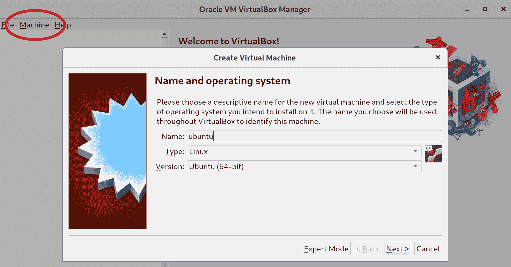

1.  在这个屏幕上，我们确定内存设置。对于大多数服务器来说，1024 MB 的 RAM 是一个很好的起点（也是 VirtualBox 为虚拟机推荐的）。如果你有强大的硬件，可以设置为 2048 MB，但 1024 MB 应该也可以。做出你的选择，然后按下一步：

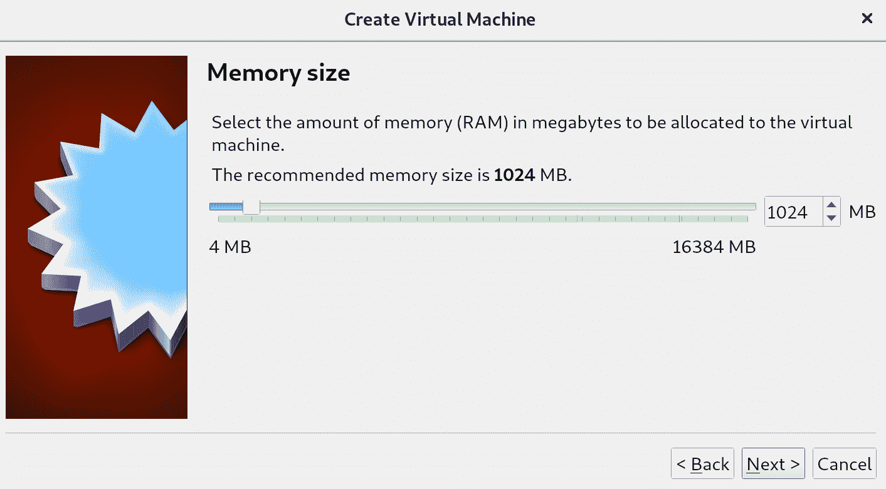

1.  再次，VirtualBox 推荐的值对我们的需求非常完美。按下“创建”开始创建虚拟硬盘：

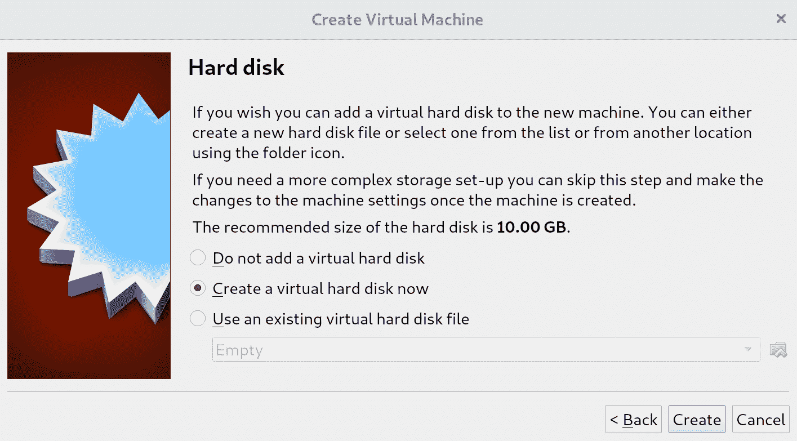

1.  虚拟硬盘可以是许多不同的类型。VirtualBox 默认使用自己的格式**VDI**，而不是 VMware 使用的**VMDK**格式（另一个流行的虚拟化提供商）。最后一个选项是**VHD（虚拟硬盘）**，这是一个更通用的格式，可以被多个虚拟化提供商使用。由于我们在本书中将专门使用 VirtualBox，所以保持选择**VDI**（VirtualBox 磁盘映像）并按下“下一步”： 

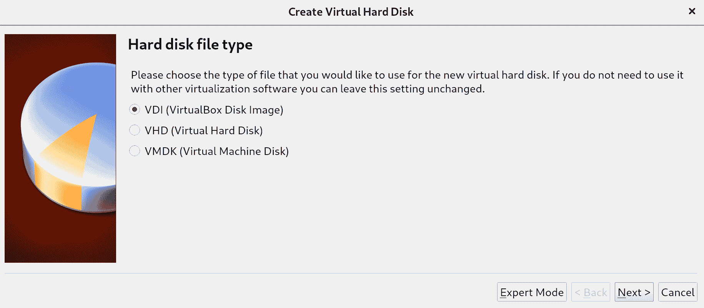

1.  在这个屏幕上，我们有两个选项：我们可以立即在物理硬盘上为虚拟硬盘分配全部空间，或者我们可以使用动态分配，它不会保留虚拟磁盘的全部大小，而只保留已使用的部分。

这些选项之间的区别通常在许多虚拟机运行在单个主机上的情况下最相关。创建的磁盘总量大于物理可用的情况，但假设并非所有磁盘都会被充分使用，允许我们在单台机器上放置更多的虚拟机。这被称为过度配置，只有在并非所有磁盘都被填满的情况下才能工作（因为我们*永远*不能拥有比物理磁盘空间更多的虚拟磁盘空间）。对我们来说，这个区别并不重要，因为我们将只运行一个虚拟机；我们保持默认的动态分配并进入下一个屏幕：

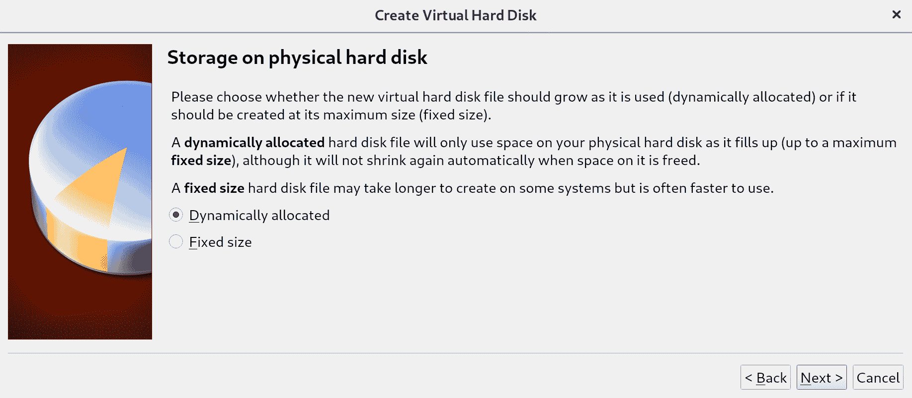

1.  在这个屏幕上，我们可以做三件事：命名虚拟磁盘文件，选择位置，并指定大小。如果你关心位置（默认为你的`home`/`user`目录中的某个位置），你可以按下下面截图中圈出的图标。对于名称，我们喜欢保持与虚拟机名称相同。最后，10GB 的大小对本书中的练习已经足够了。设置好这三个值后，按下“创建”。恭喜，你刚刚创建了你的第一个虚拟机，如下面的截图所示：

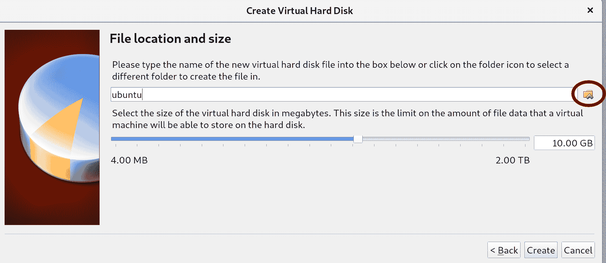

1.  然而，在我们可以在虚拟机上安装 Ubuntu 之前，我们还需要做两件事：将虚拟机指向安装 ISO，并设置网络。选择新创建的虚拟机，点击“设置”。导航到存储部分：

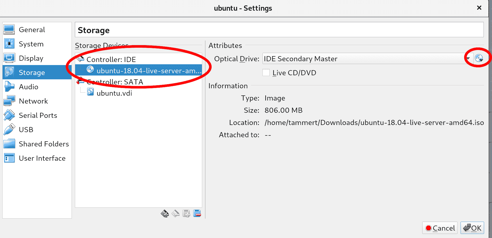

你应该在磁盘图标上看到一个带有“Empty”字样的图标（在前面截图左侧圈出的位置）。选择它并通过点击选择磁盘图标（在右侧圈出的位置）挂载一个 ISO 文件，选择虚拟光盘文件，然后选择你之前下载的 Ubuntu ISO。如果你做对了，你的屏幕应该和前面的截图一样：你不再看到磁盘图标旁边的“Empty”字样，信息部分应该也填写了。

1.  一旦你验证了这一点，就去到网络部分。

1.  配置应该默认为 NAT 类型。如果不是，请现在设置为 NAT。NAT 代表网络地址转换。在这种模式下，主机机器充当虚拟机的路由器。最后，我们将设置一些端口转发，以便稍后使用 SSH 工具。点击“端口转发”按钮：

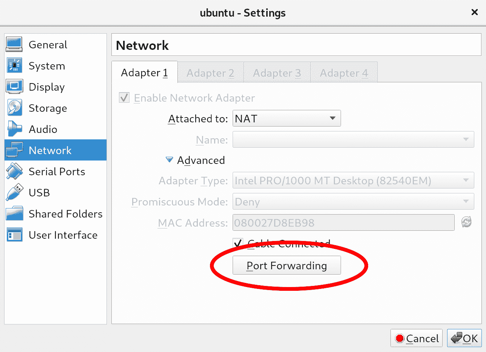

1.  设置 SSH 规则就像我们所做的那样。这意味着在虚拟机上的端口`22`被暴露为主机上的端口`2222`。我们选择端口`2222`有两个原因：低于 1024 的端口需要 root/administrator 权限，我们可能没有。其次，有可能主机上已经有一个 SSH 进程在监听，这意味着 VirtualBox 将无法使用该端口：

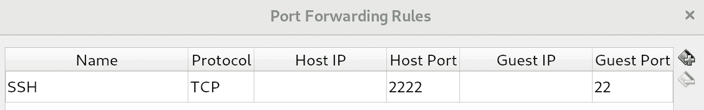

通过这一步，我们已经完成了虚拟机的设置！

# 在虚拟机上安装 Ubuntu

现在您可以从 VirtualBox 主屏幕启动虚拟机。右键单击该虚拟机，选择**启动**，然后选择**正常启动**。如果一切顺利，一个新窗口将弹出，显示虚拟机控制台。过一会儿，您应该在该窗口中看到 Ubuntu 服务器安装屏幕：

1.  在下一个截图中显示的屏幕上，使用箭头键选择您喜欢的语言（我们使用英语，所以如果您不确定，英语是一个不错的选择），然后按*Enter*键：

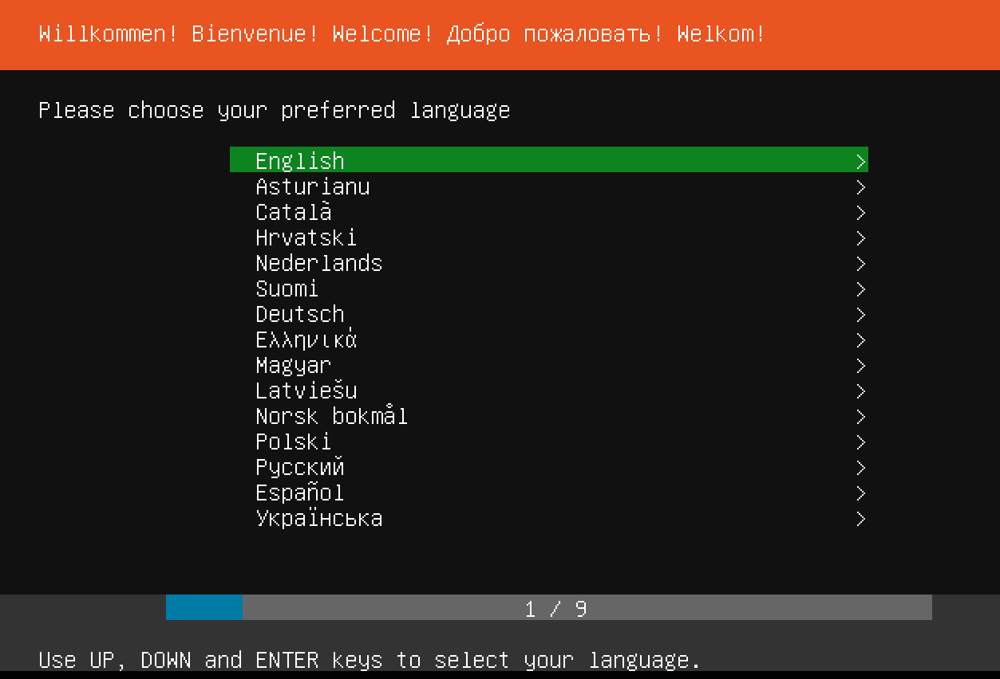

1.  选择您正在使用的键盘布局。如果不确定，可以使用交互式识别键盘选项来确定哪种布局最适合您。设置正确的布局后，将焦点移动到“完成”然后按*Enter*键：

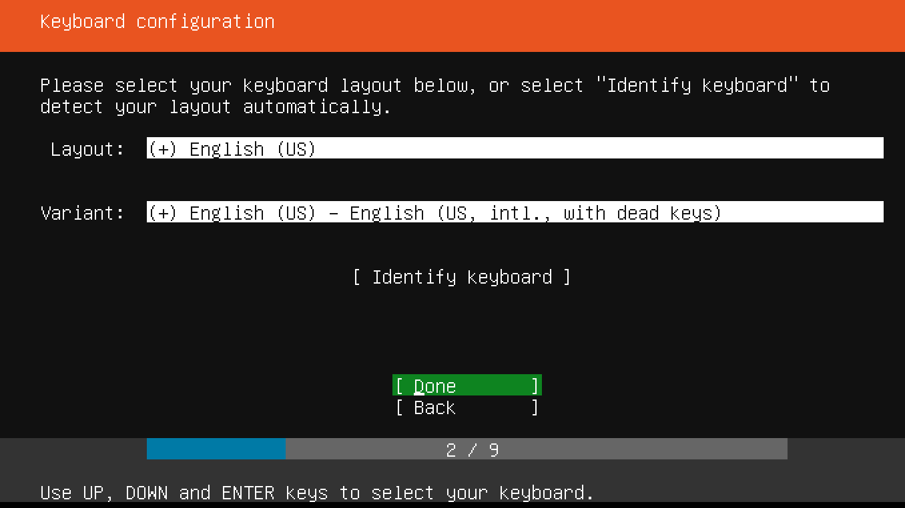

1.  现在我们选择安装类型。因为我们使用的是服务器 ISO，所以我们看不到与 GUI 相关的任何选项。在前面的截图中，选择安装 Ubuntu（其他两个选项都使用 Canonical 的**Metal-As-A-Server**（**MAAS**）云服务，这对我们不相关），然后按*Enter*键：

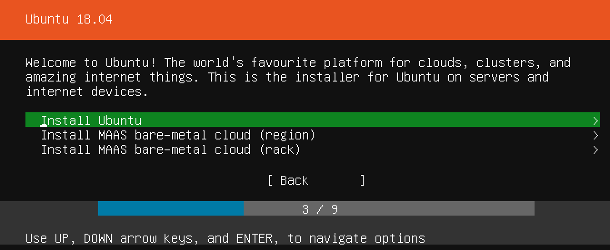

1.  您将看到网络连接屏幕。安装程序应默认使用虚拟机创建的默认网络接口上的 DHCP。验证该接口是否已分配 IP，然后按*Enter*键：

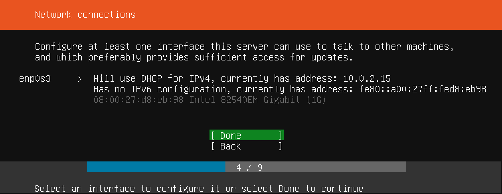

1.  配置代理屏幕对我们不相关（除非您正在使用代理设置，但在这种情况下，您很可能不需要我们的安装帮助！）。将代理地址留空，然后按*Enter*键：

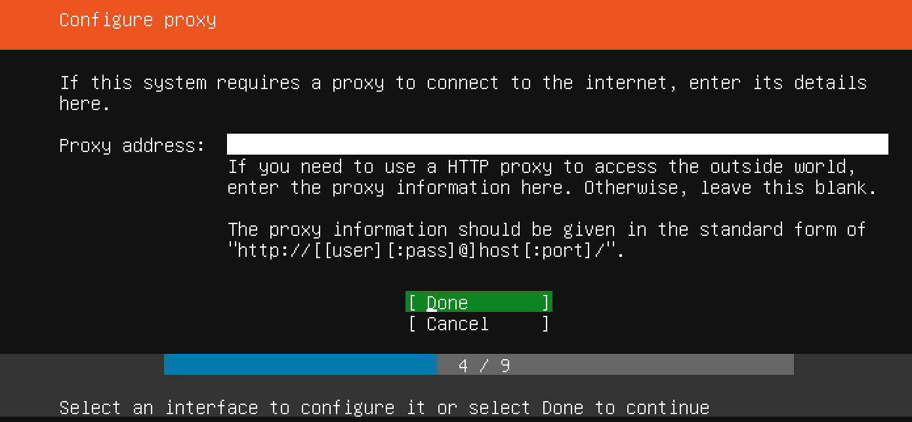

1.  有时手动分区 Linux 磁盘以满足特定需求是有帮助的。在我们的情况下，使用整个磁盘的默认值非常合适，所以按*Enter*键：

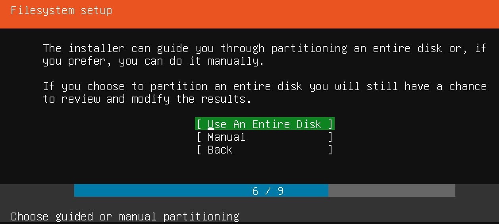

1.  在选择了使用整个磁盘之后，我们需要指定要使用的磁盘。由于我们在配置虚拟机时只创建了一个磁盘，选择它然后按*Enter*键。

1.  现在您将遇到有关执行破坏性操作的警告。因为我们使用的是整个（虚拟！）磁盘，该磁盘上的所有信息都将被删除。我们在创建虚拟机时创建了这个磁盘，因此它不包含任何数据。我们可以安全地执行此操作，所以选择继续然后按*Enter*键：

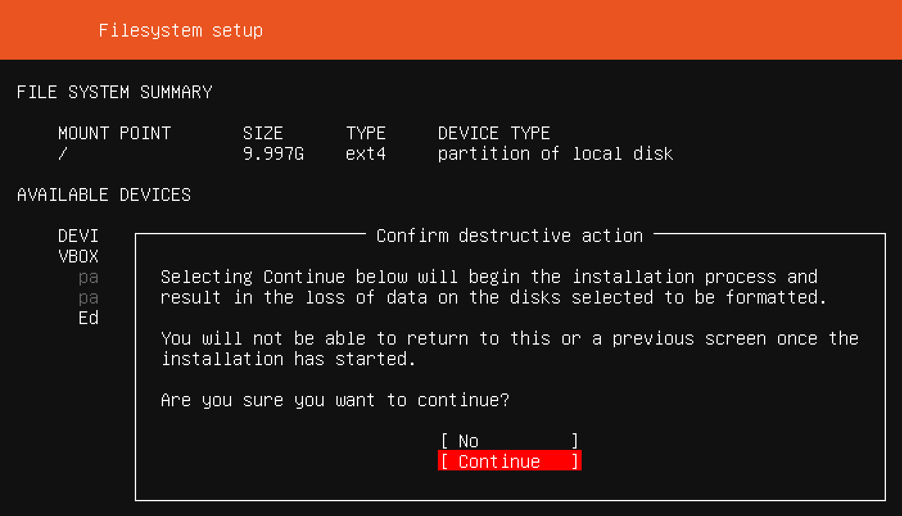

1.  文件系统设置，再次默认值非常适合我们的需求。验证我们至少有 10GB 的硬盘空间（可能会少一点，比如在下面的示例中是 9.997GB：这没问题），然后按*Enter*键：

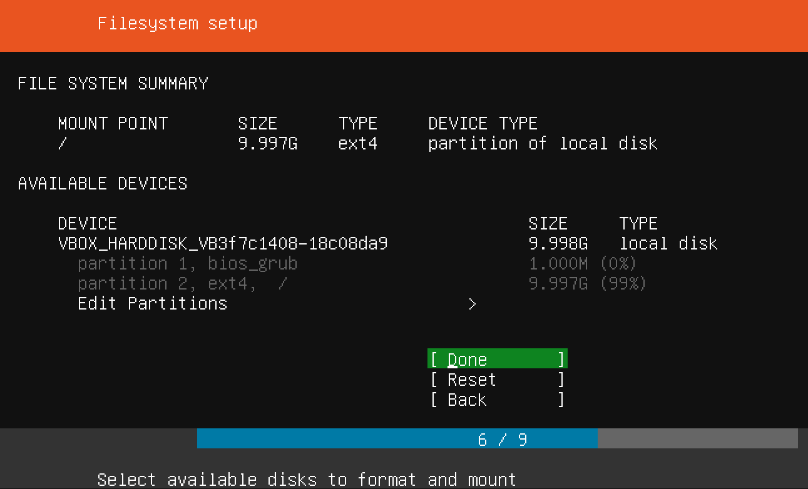

1.  Ubuntu 服务器现在应该开始安装到虚拟磁盘。在这一步中，我们将设置服务器名称并创建一个管理用户。我们选择了服务器名称`ubuntu`，用户名`reader`和密码`password`。请注意，这是一个*非常弱*的密码，我们只会在这台服务器上使用它以简化操作。这是可以接受的，因为服务器只能从我们的主机访问。在配置接受来自互联网的流量的服务器时，永远不要使用这么弱的密码！选择任何您喜欢的内容，只要您能记住它。如果您不确定，我们建议使用`ubuntu`，`reader`和`password`相同的值：

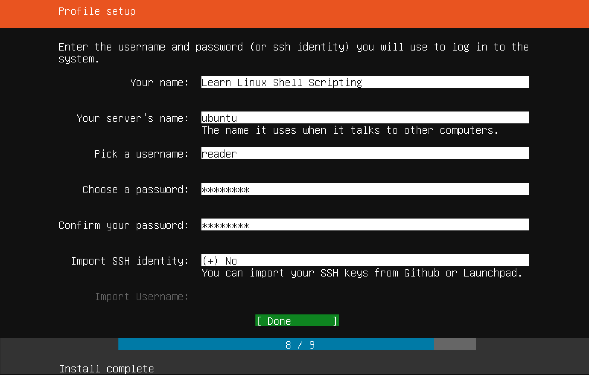

现在，您已经选择了服务器名称并配置了一个管理用户，请按*Enter*完成安装。

1.  根据上一个屏幕完成所花费的时间以及主机的速度，Ubuntu 要么仍在安装中，要么已经完成。如果您仍然看到屏幕上的文本在移动，那么安装仍在进行。一旦安装完全完成，您将看到“立即重启”按钮出现。按*Enter*：

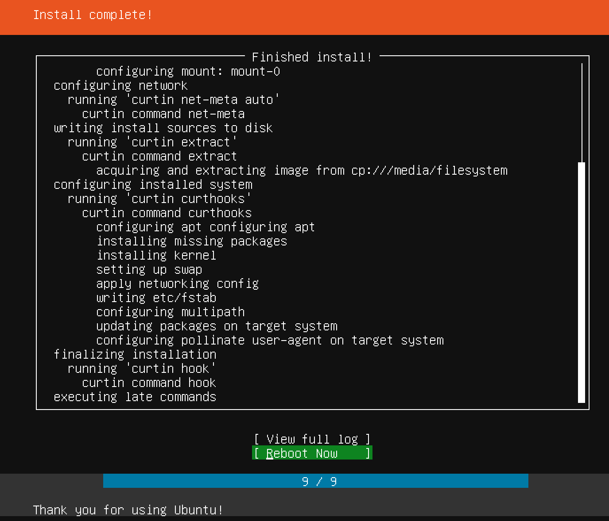

1.  几秒钟后，应该会出现一条消息，指出“请移除安装介质，然后按 Enter”。按照说明操作，如果一切顺利，您应该会看到一个终端登录提示：

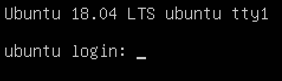

通常，VirtualBox 足够智能，会尝试从硬盘而不是 ISO 进行第二次引导。如果在之前的步骤之后，重新启动将您送回安装菜单，则从 VirtualBox 主屏幕关闭虚拟机。右键单击该机器，选择**关闭**，然后选择**关机**。在完全关闭电源后，编辑该机器并删除 ISO。这应该强制 VirtualBox 从包含 Ubuntu Server 18.04 LTS 安装的磁盘引导。

1.  现在是真相的时刻：尝试使用您创建的用户名和密码登录。如果成功，您应该会看到一个类似于以下的屏幕：

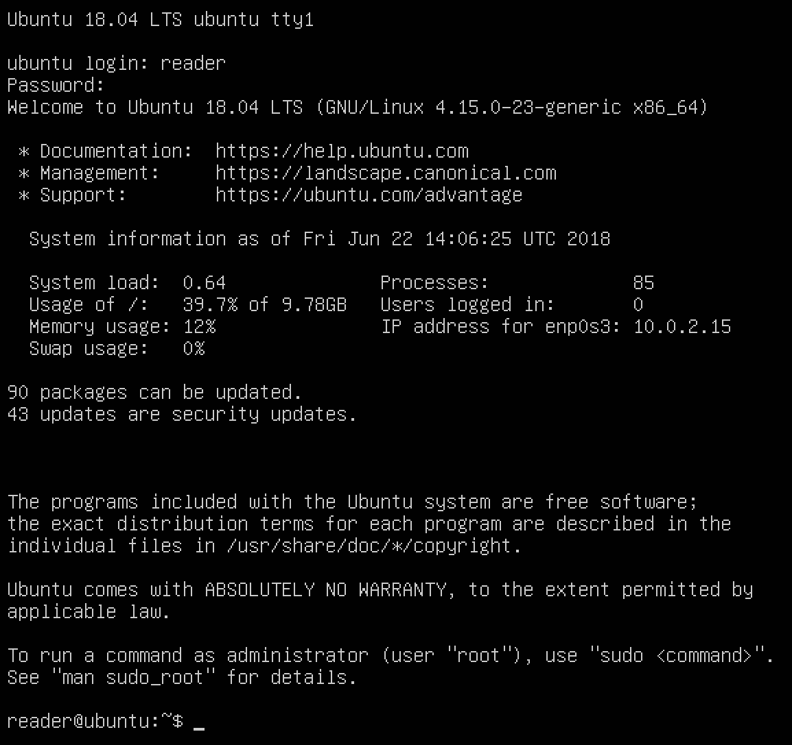

给自己一个鼓励：您刚刚创建了一个虚拟机，安装了 Ubuntu Server 18.04 LTS，并通过终端控制台登录。干得好！要退出，请输入`exit`或`logout`，然后按*Enter*。

# 通过 SSH 访问虚拟机

我们已成功连接到 VirtualBox 提供给我们的终端控制台。但是，这个终端连接实际上非常基本：例如，我们无法向上滚动，无法粘贴复制的文本，也没有彩色的语法高亮。幸运的是，我们有一个不错的替代方案：**安全外壳**（**SSH**）协议。 SSH 用于连接到虚拟机上运行的 shell。通常，这是通过网络完成的：这就是企业维护其 Linux 服务器的方式。在我们的设置中，我们实际上可以在主机机器上使用 SSH，使用我们之前设置的电源转发。

如果您遵循了安装指南，主机上的端口`2222`应该被重定向到虚拟机上的端口`22`，这是 SSH 进程运行的端口。从 Linux 或 macOS 主机，我们可以使用以下命令进行连接（根据需要替换用户名或端口号）：

```
$ ssh reader@localhost -p 2222
```

然而，有很大的可能性您正在运行 Windows。在这种情况下，您可能无法在命令提示符中访问本机 SSH 客户端应用程序。幸运的是，有许多好的（而且免费的！）SSH 客户端。最简单和最知名的客户端是**PuTTY**。 PuTTY 是在 1999 年创建的，虽然它绝对是一个非常稳定的客户端，但它的年龄开始显现。我们建议一些更新的 SSH 客户端软件，比如**MobaXterm**。这为您提供了更多的会话管理，更好的图形用户界面，甚至本地命令提示符！

无论您决定使用哪种软件，请确保使用以下值（再次更改端口或用户名，如果您偏离了安装指南）：

+   主机名：`localhost`

+   端口：`2222`

+   用户名：`reader`

如果您使用 SSH 连接到虚拟机，可以以**无头**模式启动它。这样做时，VirtualBox 不会为您创建一个带有终端控制台的新窗口，而是在后台运行虚拟机，您仍然可以通过 SSH 连接（就像在实际的 Linux 服务器上发生的情况）。这个**无头启动**选项，在右键单击虚拟机并选择**启动**时，位于早期的**正常启动**下方。

# 摘要

在本章中，我们已经开始准备我们的本地机器，以便进行本书的其余部分。我们现在知道虚拟机和物理机之间的区别，以及为什么我们更喜欢在本书的其余部分使用虚拟机。我们已经了解了两种不同类型的 hypervisors。我们已经安装和配置了 VirtualBox，并在其中安装了 Ubuntu 18.04 操作系统的虚拟机。最后，我们已经使用 SSH 连接到正在运行的虚拟机，而不是使用 VirtualBox 终端，这样可以获得更好的可用性和选项。

在本章中引入了以下命令：`ssh`和`exit`。

在下一章中，我们将通过查看一些不同的工具来完成设置我们的本地机器，这些工具将帮助我们在 GUI 和虚拟机 CLI 上进行 bash 脚本编写。

# 问题

1.  运行虚拟机比裸机安装更可取的原因是什么？

1.  与裸机安装相比，运行虚拟机的一些缺点是什么？

1.  类型 1 和类型 2 hypervisor 之间有什么区别？

1.  在 VirtualBox 上有哪两种方式可以启动虚拟机？

1.  Ubuntu LTS 版本有什么特别之处？

1.  如果在 Ubuntu 安装后，虚拟机再次引导到 Ubuntu 安装屏幕，我们应该怎么办？

1.  如果在安装过程中意外重启，最终没有进入 Ubuntu 安装界面（而是看到错误），我们应该怎么办？

1.  为什么我们为虚拟机设置了 NAT 转发？

# 进一步阅读

如果您想更深入地了解本章的主题，以下资源可能会有所帮助：

+   *通过 Pradyumna Dash 的《使用 Oracle VM VirtualBox 入门》，Packt：[`www.packtpub.com/virtualization-and-cloud/getting-started-oracle-vm-virtualbox`](https://www.packtpub.com/virtualization-and-cloud/getting-started-oracle-vm-virtualbox)*

+   *通过 Jay LaCroix 的《精通 Ubuntu 服务器-第二版》，Packt：[`www.packtpub.com/networking-and-servers/mastering-ubuntu-server-second-edition`](https://www.packtpub.com/networking-and-servers/mastering-ubuntu-server-second-edition)*
