# 第三章：选择合适的工具

本章将介绍一些在编写 Bash 脚本时会帮助我们的工具。我们将专注于两种类型的工具：基于 GUI 的编辑器（Atom 和 Notepad++）和基于终端的编辑器（Vim 和 nano）。我们将描述这些工具以及如何使用它们，它们的优势和劣势，以及如何同时使用基于 GUI 和基于终端的编辑器以获得最佳结果。

本章将介绍以下命令：`vim`，`nano`和`ls`。

本章将涵盖以下主题：

+   使用图形编辑器进行 shell 脚本编写

+   使用命令行编辑器进行 shell 脚本编写

+   在编写 shell 脚本时将图形编辑器与命令行编辑器结合使用

# 技术要求

在使用 Vim 或 nano 时，您将需要我们在上一章中创建的虚拟机。如果要使用 Notepad++，您将需要 Windows 主机。对于 Atom，主机可以运行 Linux、macOS 或 Windows。

# 使用图形编辑器进行 shell 脚本编写

自 Unix 和类 Unix 发行版问世以来，工具已经发展了很长一段路。在早期，编写 shell 脚本比今天要困难得多：shell 功能较弱，文本编辑器仅限于命令行，诸如语法高亮和自动补全之类的功能都是不存在的。今天，我们有非常强大的图形用户界面编辑器，可以帮助我们进行脚本编写。为什么我们要等到运行脚本才发现错误，当图形用户界面编辑器可以提前显示错误？今天，使用高级编辑器进行 shell 脚本编写几乎是一种必需品，我们不想离开。

在接下来的页面中，我们将描述两个文本编辑器：Atom 和 Notepad++。两者都是基于 GUI 的，我们可以用它们进行高效的 shell 脚本编写。如果您已经对其中一个有偏好，请选择那个。如果不确定，我们建议使用 Atom。

# Atom

我们将首先考虑的图形编辑器是由 GitHub 制作的 Atom。它被描述为“21 世纪可修改的文本编辑器”。在这里，“可修改”意味着虽然 Atom 的默认安装与任何文本编辑器一样完整，但这个应用程序真正闪耀的地方在于它非常可配置和可扩展。任何 GitHub 未集成的功能都可以作为扩展包编写。通过使用这些扩展，您可以使 Atom 安装完全成为您自己的；如果您不喜欢某些东西，就改变它。如果不能直接改变，就找一个可以做到的扩展包。即使没有符合您期望的扩展包，您仍然可以选择创建自己的扩展包！

Atom 的另一个很好的功能是与 Git 和 GitHub 的默认集成。Git 目前是最流行的版本控制系统。版本控制系统在编写代码或脚本时使用。它们确保文件的历史记录被保留，并使多个甚至许多贡献者能够同时在同一文件上工作，而不会因冲突管理而负担过重。GitHub，顾名思义，目前是最重要的面向开源软件的基于 Web 的 Git 提供者。

关于 Atom 的最后一件伟大的事情是，它默认支持许多脚本和编程语言。当我们说“支持”时，我们是指它可以通过文件扩展名识别文件类型，并提供语法高亮（这样编写脚本就更容易了！）。这种功能是通过核心包提供的，它们的工作方式与普通包相同，但从一开始就包含在内。对于我们的目的，核心包**language-shellscript**将帮助我们进行 shell 脚本编写。

# Atom 安装和配置

让我们继续安装 Atom。 只要您运行 Linux、macOS 或 Windows，您可以转到[`atom.io/`](https://atom.io/)并获取安装程序。 运行安装程序，如果需要，可以跟随提示直到 Atom 安装完成。 现在，启动 Atom，您将会看到欢迎屏幕，写作时看起来像下面这样：

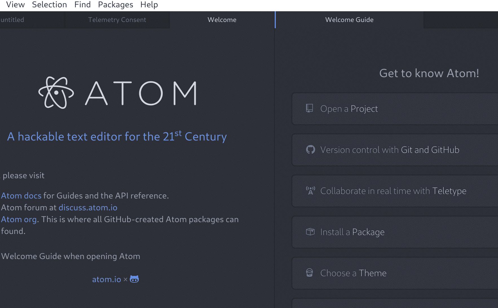

一定要查看 Atom 提供的所有屏幕。 当您觉得已经足够探索时，让我们向 Atom 添加一个可以补充我们的 shell 脚本的软件包。 如果您仍然打开欢迎指南屏幕，请从中选择安装软件包。 否则，您可以使用键盘快捷键*Ctrl* + *,*来打开设置屏幕。 您将在那里看到一个安装选项，它将带您到安装软件包屏幕。 搜索`bash`，您应该会看到以下软件包：

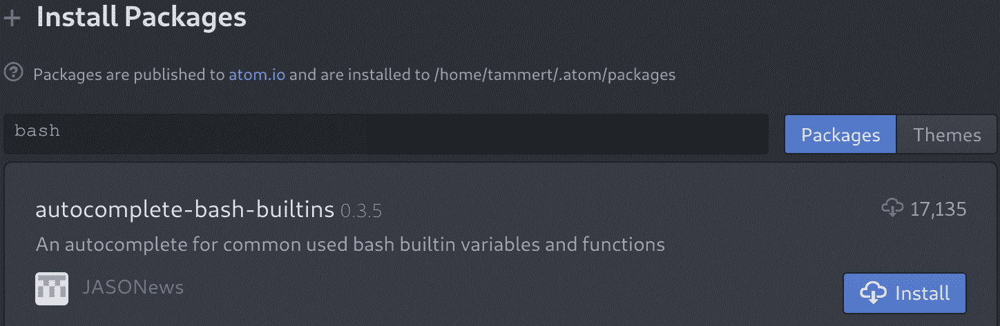

单击安装按钮并观看安装过程。 安装后可能会提示您重新启动 Atom；一定要这样做。 如果没有提示但看到任何错误，重新启动 Atom 绝对不是一个坏主意。 安装软件包后，您现在在编写 shell 脚本时将具有自动完成功能。 这意味着您可以开始输入，Atom 将尝试预测您想要的内容，方式如下：

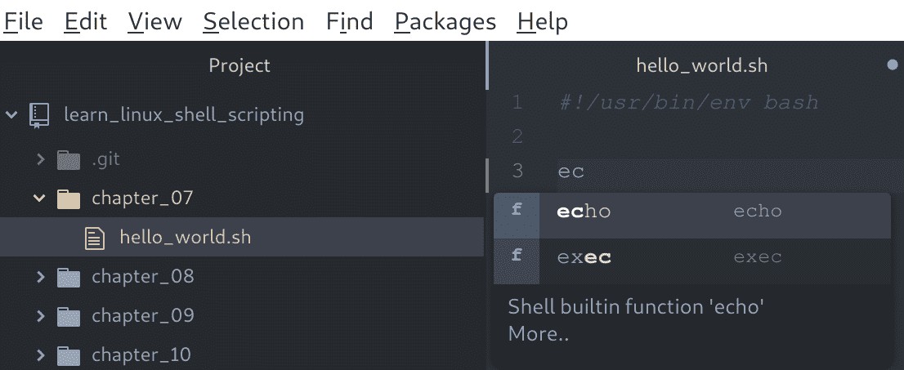

在右侧，您可以看到我们开始输入`echo` shell 命令，前两个字母后，Atom 给出了包含这两个字母的两个选项。 一旦它提出建议，我们可以按*Enter*，命令就完全插入了。 虽然在这种情况下节省的时间不会太多，但有两个主要原因可以很好地使用它：

+   如果您不确定命令的确切名称，您可能可以通过自动完成找到它。

+   一旦您开始编写条件和循环（在本书的第二部分），自动完成将跨越多行，为您节省了输入许多单词和记住所有语法的时间。

最后，让我们看看当您打开一个 Git 项目并且正在处理文件时，Atom 的外观是什么样的：

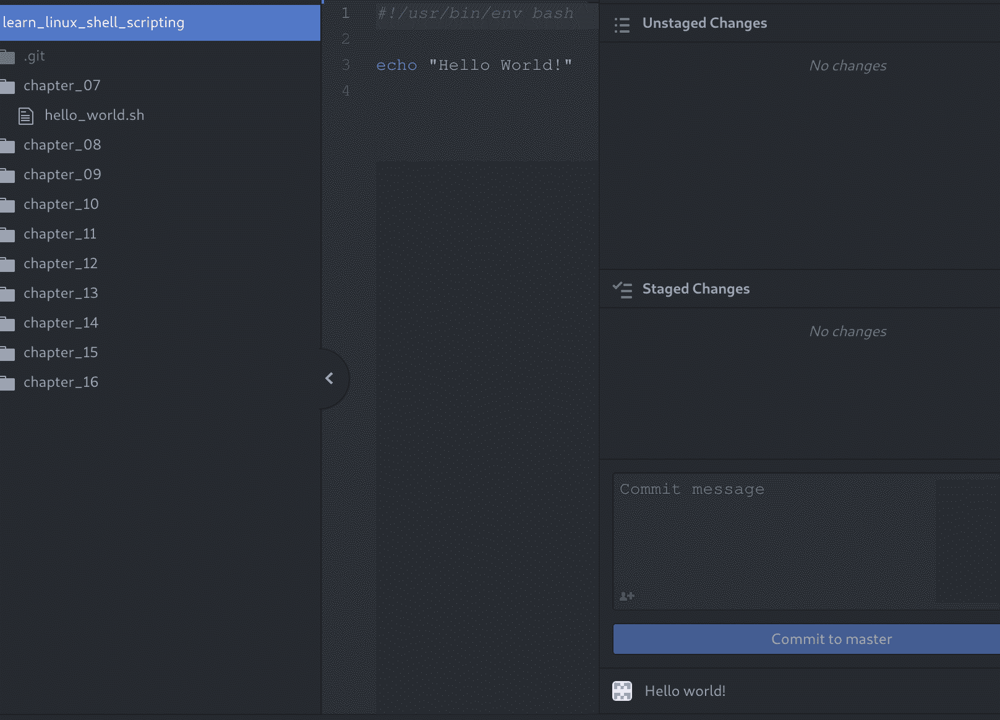

在 Atom 中工作时，屏幕大部分时间看起来会像这样。 在左侧，您将看到**树视图**，您可以通过按*Ctrl* + *\*来切换其开/关。 树视图包含当前项目中的所有文件（即您打开的目录）。 双击这些文件可以将它们打开，它们将出现在中间：**编辑器视图**。 这是您将花费大部分时间在其中编写 shell 脚本的地方。 即使当前没有打开文件，编辑器视图也将始终可见。

默认情况下，还有一个最后的视图，**Git 视图**，位于右侧。 您可以通过按*Ctrl *+*Shift *+ *9*来切换此视图。 本书的代码托管在 GitHub 上，您将下载（或者，正如 Git 所称的那样，*克隆*）一次，而无需在远程服务器上进行编辑。 因此，在本书中不需要 Git 视图，但我们提到它，因为您可能会在其他项目中使用它。

# Notepad++

Atom 更接近于**集成开发环境**（**IDE**）而不是文本编辑器，Notepad++基本上就是其名字的含义：带有一些附加功能的老式记事本。 其中一些附加功能包括能够同时打开多个文件，语法高亮显示和有限的自动完成。 它最初是在 2003 年发布的，只能在 Windows 上运行。

Notepad++以其简单性而闻名。如果您熟悉任何一种记事本软件（谁不熟悉？），那么 Notepad++应该是立即可识别的。虽然我们建议在本书中使用 Atom，但使用诸如 Notepad++之类的简单解决方案绝对不会让您退步。但是，在商业环境中，您几乎总是会在已存在的版本控制存储库中创建脚本，这就是 Atom 的附加功能真正发挥作用的地方。

如果您想尝试 Notepad++，请从[`notepad-plus-plus.org/download`](https://notepad-plus-plus.org/download)下载并运行安装程序（请记住，仅当您使用 Windows 时！）。保持默认选项并在安装后运行 Notepad++。您应该会看到以下屏幕：

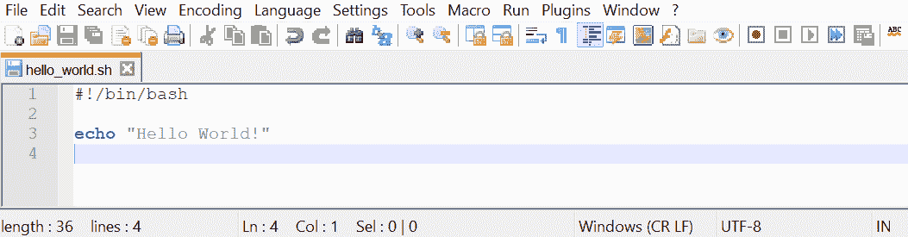

正如您所看到的，当您打开以`.sh`结尾的文件时，您将看到语法高亮显示。这是因为`.sh`扩展名保留用于 shell 脚本文件。在编写脚本时，这可以帮助您很多。缺少引号导致脚本出错的示例将通过基于颜色的语法高亮显示变得非常明显，可能为您节省了很多故障排除时间。

Notepad++还有许多其他功能，使其成为一个出色的增强记事本。您可以使用宏执行脚本化任务，可以安装插件以扩展功能，并且还有许多其他独特功能，使 Notepad++成为一个吸引人的选择。

# 使用命令行编辑器

能够使用命令行编辑器是任何与 Linux 一起工作的人迟早都应该学会的技能。对于带有图形用户界面（GUI）的 Linux 安装，这可能会被替换为诸如 Atom 或分发内置的 Notepad 变体之类的 GUI 工具。但是，服务器安装几乎永远不会有 GUI，您将不得不依赖命令行文本编辑器。虽然这可能听起来令人生畏，但实际上并非如此！为了给您一个关于命令行编辑器的简要介绍，我们将介绍大多数 Linux 发行版上都存在的两个最受欢迎的应用程序：**Vim**和**GNU nano**。

# Vim

我们将讨论的第一个命令行文本编辑器可能是 Linux 中最受欢迎的：**Vim**。Vim 源自术语**Vi Improved**，因为它是 Unix 编辑器 Vi 的更新克隆。它由 Bram Moolenaar 创建，并仍在维护，他于 1991 年首次公开发布了 Vim。Vim（或者在*非常*老的系统上是 Vi）应该存在于您遇到的所有 Unix 或类 Unix 机器上。

Vim 被认为是一种难以学习的工具。这主要是因为它的工作方式与大多数人习惯的文本编辑器非常不同。但是，一旦初始学习曲线结束，许多人同意在 Vim 中可以更快地完成许多操作，而不是在*普通*文本编辑器（如 Microsoft 的 Notepad++）中。

让我们开始吧！登录到您的虚拟机：

```
$ ssh reader@localhost -p 2222
```

登录后，打开 Vim 到一个空文件：

```
$ vim
```

您应该会看到大致如下的东西：

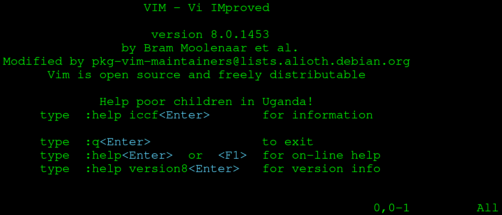

Vim 启动一个使用整个终端的新进程（不用担心，一旦退出 Vim，一切都还会在您离开的地方！）。当您启动 Vim 时，您将进入**normal**模式。Vim 有许多模式，其中正常和**insert**是最有趣的探索。在正常模式下，您不能像在记事本或 Word 中那样开始输入。由于 Vim 设计为无需鼠标即可使用，因此它需要一种方式来操作文本。一些应用程序决定使用修改器（例如在记事本中按住*Shift*键），而 Vim 决定使用模式。让我们首先进入插入模式，以便我们可以开始输入一些文本。按*I*键，您的屏幕应该切换到插入模式：

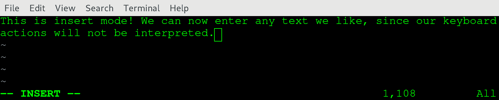

我们已经在插入模式下输入了一些文本。确保您也这样做，完成后按*Esc*返回到正常模式：

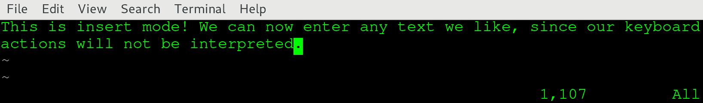

如果你比较两个屏幕截图，你应该会看到一个很大的区别：在左下角，文本`-- INSERT --`消失了！当你处于正常模式以外的模式时，那个模式会清晰地显示在那里。如果你什么都看不到，你可以安全地假设你处于正常模式。在正常模式下，我们可以使用箭头键进行导航。我们还可以使用几个按键来操作字符、单词，甚至（多个）行！例如，按下`dd`，注意到你整行都被删除了。如果你想要恢复它，按`u`进行撤销。

还有一个挑战：退出 Vim。通常，你可能会想要使用*Esc*按钮退出程序。如果你对 Linux 有一些了解，你可能甚至知道一个不错的*Ctrl + C*也可以退出大多数程序。然而，这两种方法对 Vim 都不起作用：*Esc*只会让你进入正常模式，而*Ctrl* + *C* 则不会有任何作用。要退出 Vim，请确保你处于正常模式，并输入以下内容：

```
:q!
```

这将退出你当前的文档，而不保存任何内容。如果你想*保存并退出*，请使用以下命令：

```
:x filename.txt
```

这将保存你当前的文档为`filename.txt`并返回到你的终端。请注意，通常你会使用以下命令在已经存在的文件上启动 Vim：

```
$ vim filename.txt
```

在这种情况下，当保存和退出时，你不需要输入文件名；在这种情况下，使用`:x`就足够了。`:x`实际上是`:wq`的缩写。`:w`是*写*操作，用于保存文件，`:q`用于*退出*。结合起来，它们用于*保存并退出*。如果你在编辑过程中想随时保存文件，你可以使用`:w`来完成这个操作。

# Vim 摘要

Vim 有许多命令，受力用户欣赏。现在，记住有两个重要的模式，正常和插入。你可以通过按*I*从正常模式切换到插入模式，你可以通过按*Esc*返回到正常模式。在插入模式下，Vim 的行为就像记事本或 Word 一样，但在正常模式下，你可以进行简单的文本操作，例如删除当前选择的整行。如果你想退出 Vim，进入正常模式，然后输入`:q!`或`:x`，取决于你是否想保存更改。

不要害怕开始使用 Vim。虽然一开始可能会让人望而生畏，但一旦你掌握了它，你就可以更快地在服务器上执行与文件相关的任务。如果你想提前了解，花 30 分钟的时间通过**vimtutor**。这个命令行工具会让你迅速掌握 Vim 的基本用法！要开始，只需导航到你的虚拟机，输入`vimtutor`，然后按*Enter*。

# .vimrc

`.vimrc`文件可用于为 Vim 设置一些持久选项。使用这个文件，你可以自定义你的 Vim 体验。有许多定制的可能性：常见的例子包括设置颜色方案，转换制表符和空格，以及设置搜索选项。

要创建一个在启动 Vim 时使用的`.vimrc`文件，请执行以下操作：

```
$ cd
$ vim .vimrc
```

第一个命令将你放在你的`home`目录中（不用担心，这将在本书的后面更详细地解释）。第二个命令为`.vimrc`文件启动了一个 Vim 编辑器。不要忘记前面的点，因为这是 Linux 处理隐藏文件的方式（同样，稍后会更详细地介绍）。我们在`.vimrc`文件中使用以下配置：

```
set expandtab
set tabstop=2
syntax on
colo peachpuff
set ignorecase
set smartcase
set number
```

按顺序，通过这个配置实现了以下几件事：

+   `set expandtab`：将制表符转换为空格。

+   `set tabstop=2`：每个制表符转换为两个空格。

+   `syntax on`：打开语法高亮（使用不同的颜色）。

+   `colorscheme peachpuff`：使用 peachpuff 颜色方案。

+   `set ignorecase`：在搜索时忽略大小写。

+   `set smartcase`：在搜索时不忽略一个或多个大写字母的大小写。

+   `set number`：显示行号。

# Vim 速查表

为了让您熟悉一些 Vim 的常用命令，我们提供了一个速查表。通过**vimtutor**学习后，有了这个速查表，几乎可以保证您能够正确地使用 Vim！

按键直接输入。请注意，按键区分大小写，因此*a*与*A*不同。您可以按住*Shift*键输入大写字母，或使用*大写锁定*键。然而，最实用的方法是使用*Shift*：

| **按键** | **效果** |
| --- | --- |
| Esc | 退出插入模式，返回命令模式。 |
| i | 在光标当前位置之前进入插入模式。 |
| a | 在光标当前位置之后进入插入模式。 |
| I | 在当前行的开头进入插入模式。 |
| A | 在当前行的末尾进入插入模式。 |
| o | 在当前行下方插入新行进入插入模式。 |
| O | 在当前行上方插入新行进入插入模式。 |
| dd | 删除当前行。 |
| u | 撤消上一个插入模式中所做的更改。 |
| Ctrl + r | 重做撤消。 |
| yy | '复制'当前行。 |
| p | 在当前行下方粘贴最后复制的行。 |
| P | 在当前行上方粘贴最后复制的行。 |
| H | 导航到文件开头。 |
| M | 导航到文件中间。 |
| G | 导航到文件末尾。 |
| dH | 删除直到文件开头的所有行（包括当前行）。 |
| dG | 删除直到文件末尾的所有行（包括当前行）。 |

# nano

GNU nano，通常简称为 nano，是另一个默认存在于大多数 Linux 安装中的命令行编辑器。正如名称所示，它是 GNU 项目的一部分，与构成 Linux 发行版的许多其他部分并无不同（请记住，Bash 也是 GNU 项目软件）。Nano 于 1999 年首次发布，旨在取代 Pico 文本编辑器，Pico 是为 Unix 系统创建的简单文本编辑器。

与 Vim 相比，Nano 远不止是一个所见即所得（WYSIWYG）工具。类似于记事本和 Word，nano 不使用不同的模式；它总是准备好开始输入您的文档或脚本。

在您的虚拟机上，打开一个 nano 编辑器屏幕：

```
$ nano
```

应该出现类似以下的屏幕：

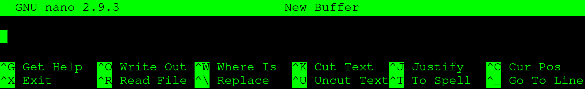

随意开始输入一些内容。它应该看起来像以下内容：

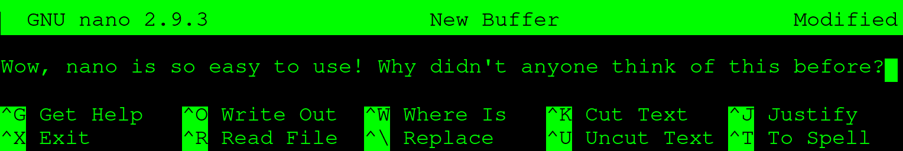

正如您所看到的，屏幕底部保留用于显示 nano 所称的**控制键**。虽然一开始可能不太明显，但`^`是*Ctrl*的简写。如果您想退出，您可以按住*Ctrl*并按*X*：

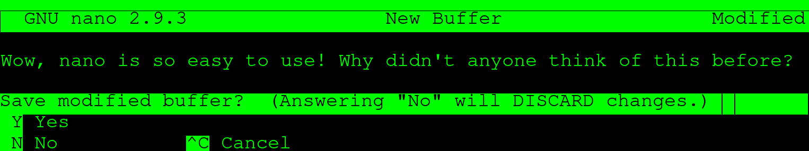

您将被提示是否要保存或不保存文件并退出。在这种情况下，我们按*Y*表示是。如果我们使用文件名启动 nano，保存和退出将立即完成，但因为我们没有使用文件名启动 nano，另一个选择将被呈现给我们：

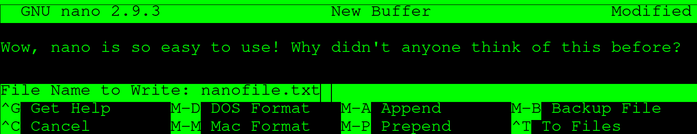

输入文件名并按*Enter*。您将回到之前的终端屏幕，在您启动 nano 的目录中。如果一切顺利，您可以使用以下命令查看文件：

```
$ ls -l
```

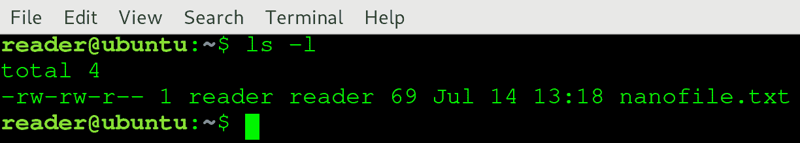

尽管 nano 具有更多高级功能，但对于基本用法，我们已经讨论了最重要的功能。虽然最初使用比 Vim 更容易，但它也没有那么强大。简而言之，nano 很简单，Vim 很强大。

如果您没有任何经验和/或偏好，我们建议您花点时间学习 Vim 并坚持使用它。在花费更多时间学习 Linux 和 Bash 脚本之后，Vim 的高级功能变得不可或缺。但是，如果您无法习惯 Vim，不要害羞地使用 nano：这是一个很好的编辑器，可以在不太麻烦的情况下完成大部分工作！

# 在编写 shell 脚本时，将图形编辑器与命令行编辑器相结合

为了让您了解我们喜欢如何将 GUI 工具与命令行编辑器结合使用，我们给出了以下示例工作流程。不要担心现在不理解所有步骤；在本书结束时，您应该回到这个示例并准确理解我们在谈论什么。

在编写 shell 脚本时，通常会经历几个阶段：

1.  收集 shell 脚本的要求。

1.  设计 shell 脚本。

1.  编写 shell 脚本。

1.  测试和调整 shell 脚本。

1.  （可选）将工作的 shell 脚本提交到您的版本控制系统。

阶段 1 和 2 通常在不编写实际代码的情况下完成。您会思考脚本的目的，它如何实现，以及创建脚本会带来什么好处。这些步骤通常涉及研究和寻找最佳实践。当您觉得对为什么、什么以及如何编写 shell 脚本有了很好的想法时，就可以进入第 3 阶段：编写脚本。在这一点上，您会打开您最喜欢的基于 GUI 的编辑器并开始输入。由于 GUI 编辑器具有自动完成、语法高亮和其他内置的生产力功能，您可以高效地编写大部分 shell 脚本代码。在您觉得脚本准备好进行测试之后，您需要离开 GUI：脚本必须在其设计的系统上进行测试。

第 4 阶段开始。您可以使用 Vim 或 nano 将脚本复制并粘贴到服务器上。一旦脚本在服务器上，您就可以运行它。大多数情况下，它实际上不会做您期望它做的一切。小错误很容易犯错，也很容易修复，但是如果要回到 GUI 编辑器更改、保存、传输到服务器并再次运行，这将是一个小麻烦！幸运的是，我们可以使用 Vim 或 nano 在服务器上进行微小更改以修复脚本，并再次尝试。一个丢失的`;`或`"`将使 shell 脚本无法使用，但可以快速修复（尽管 GUI 编辑器通常会突出显示这样的错误，因此这些错误不太可能出现在服务器上，即使是第一个版本）。

最后，在经过多次迭代后，您的脚本将按预期工作。现在，您必须确保完整且正确的脚本已上传到您的版本控制系统。建议将脚本从 GUI 传输到服务器最后一次，以查看您是否已将服务器上所做的所有更改应用到您的 GUI 会话中。完成后，提交它，您就完成了！

# 总结

在本章中，我们讨论了四种文本编辑工具，分为两种类型：基于 GUI 的编辑器（Atom 和 Notepad++）和命令行编辑器（Vim 和 GNU nano），然后展示了如何将这些工具结合使用。

Atom 是一个功能强大的文本编辑器，可以按照您的要求进行配置。默认情况下，它支持许多不同的编程语言，包括 shell。它还具有 Git 和 GitHub 集成。我们还简要讨论了 Notepad++。虽然不如 Atom 强大，但它也适用于我们的目的，因为它基本上是一个增强版的记事本，具有所有 shell 脚本的重要功能。

Vim 和 nano 是两种最流行的 Linux 命令行文本编辑器。我们已经了解到，虽然 Vim 非常强大，但比 nano 更难学习。然而，学会如何正确使用 Vim 将加快您在 Linux 系统上的许多操作，并且是一项非常有价值的技能。要了解 Vim 的实际操作，请通过 vimtutor 进行实践性的介绍。Nano 更容易使用，因为它更接近所见即所得的编辑风格，这种风格也在 Microsoft Word 和记事本中找到。

我们以一个 shell 脚本编写的示例结束了本章。我们简要概述了如何在命令行编辑器中使用基于 GUI 的编辑器。

本章介绍了以下命令：`vim`、`nano`和`ls`。

# 问题

1.  为什么语法高亮是文本编辑器的重要特性？

1.  我们如何扩展 Atom 已提供的功能？

1.  编写 shell 脚本时，自动补全有什么好处？

1.  Vim 和 GNU nano 之间的区别如何描述？

1.  Vim 中最有趣的两种模式是哪两种？

1.  什么是`.vimrc`文件？

1.  当我们称 nano 为所见即所得的编辑器时，我们是什么意思？

1.  为什么我们希望将图形界面编辑器与命令行编辑器结合使用？

# 进一步阅读

如果您想更深入地了解本章的主题，以下资源可能会很有趣：

+   Kim Schulz 的*Hacking Vim 7.2*，Packt Publishing：[`www.packtpub.com/application-development/hacking-vim-72`](https://www.packtpub.com/application-development/hacking-vim-72)
