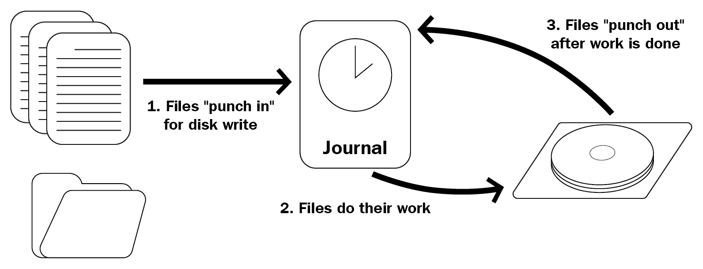

# 第四章：Linux 文件系统

在本章中，我们将花一些时间探索 Linux 文件系统。我们将解释文件系统是什么，以及什么使 Linux 文件系统独特。我们将描述 Linux 文件系统的结构以及在 Linux 下（几乎）一切都是文件。我们将以交互方式进行，让您首次近距离了解一些常见的 Linux 命令，这些命令将在后面的脚本中使用。

本章将介绍以下命令：`pwd`、`cd`、`df`、`echo`、`type`、`cat`和`less`。

本章将涵盖以下主题：

+   Linux 文件系统解释

+   Linux 文件系统的结构

+   一切都是文件

# 技术要求

我们将使用在第二章中创建的虚拟机来探索 Linux 文件系统，*设置本地环境*。

如果在连接到虚拟机时遇到问题，请确保 VirtualBox 正在运行，并且虚拟机已启动。虽然有许多可能导致问题的原因，但确保虚拟机监控程序和虚拟机正在运行应始终是故障排除的第一步。

# Linux 文件系统解释

本章将介绍 Linux 文件系统的基础知识。由于文件系统很复杂，我们不会深入探讨技术的细节；相反，我们将提供足够相关的信息，以便进行 shell 脚本编写。

# 什么是文件系统？

文件系统本质上是数据在物理介质上存储和检索的方式（可以是硬盘、固态硬盘，甚至是 RAM）。它是一个软件实现，管理位的写入和再次找到的位置和方式，并可能包括各种增强可靠性、性能和功能的高级功能。

文件系统的概念是抽象的：有许多文件系统*实现*，令人困惑的是它们经常被称为文件系统。我们发现最容易理解的方法是按照家族对文件系统进行排序，就像 Linux 发行版一样：有 Linux 文件系统、Windows 文件系统、macOS 文件系统以及许多其他文件系统。Windows 文件系统家族从最早的**FAT**文件系统一直延伸到最新的**ReFS**，目前最广泛使用的是**NTFS**。

在撰写本文时，Linux 家族中最重要的文件系统实现如下：

+   **ext4**

+   **XFS**

+   **Btrfs**

目前最常用的 Linux 文件系统实现是 ext4。它是 Linux 文件系统**扩展文件系统**（**ext**）系列的第四个版本。它于 2008 年发布，被认为非常稳定，但并非最先进；可靠性是最重要的考虑因素。

XFS 最著名的用途是在 Red Hat 发行版（Red Hat Enterprise Linux、CentOS 和 Fedora）中。它包含一些比 ext4 更先进的功能，如并行 I/O、更大的文件大小支持和更好地处理大文件。

最后是 Btrfs。这个文件系统实现最初是在 Oracle 设计的，截至 2014 年被认为是稳定的。Btrfs 具有许多先进的功能，这使得它可能比 ext4 和 XFS 更可取；甚至 ext4 的主要开发人员表示，ext4 最终应该被 Btrfs 取代。Btrfs 最有趣的特性是它使用**写时复制**（**COW**）原则：复制的文件实际上并没有完全写入物理介质，而只是创建了指向相同数据的新指针。只有在复制或原始文件被修改时才会写入新数据。

正如你可能已经猜到的那样，文件系统实现只不过是软件而已。对于 Linux，前面描述的三种实现都存在于所有更新的 Linux 内核中。这意味着只要在操作系统中安装了正确的驱动程序，这些都可以使用。更好的是，所有这些甚至可以*同时*使用！我们将在本章的后面进一步讨论这一点。

另一个有趣的事情是，虽然 ext4 是 Linux 原生的文件系统，但在驱动程序的帮助下，它也可以在 Windows 下使用。你不会将 ext4 用作 Windows 下的主要驱动器文件系统，但你可以在 Windows 下*挂载*一个 Linux 格式的 ext4 文件系统并与其中的内容交互。反过来，在 Linux 下挂载 Windows 文件系统也是大多数实现所支持的。虽然我们在这里使用 ext4 作为例子，但 XFS 和 Btrfs 也是一样的。

# Linux 文件系统的独特之处是什么？

现在应该清楚的是，实际上并不存在*the* Linux 文件系统。然而，这些文件系统共享某些特征，使它们成为可行的 Linux 文件系统。

Linux 文件系统遵循**文件系统层次结构标准**（**FHS**）。这个 FHS 由 Linux 基金会维护，目前已经更新到 3.0 版。与 Linux 生态系统中的许多其他事物一样，它是基于 Unix 的前身：**Unix 文件系统标准**（**UFS**）。它指定了**目录结构**及其内容。我们将在本章的下一部分一起探讨这个结构。

由于 Linux 最常用于服务器，Linux 文件系统实现（通常）在文件完整性和灾难恢复方面具有非常先进的功能。这种灾难的一个例子是，当系统在写入一个业务关键文件时遇到停电。如果写入操作存储在内存中并在中途中止，文件将处于不一致的状态。当系统再次启动时，操作系统不再在内存中有写入操作（因为内存在每次重启时都会被清除），只有部分文件会被写入。显然，这是不希望发生的行为，可能会导致问题。由于 COW 的特性，Btrfs 不会出现这个问题。然而，ext4 和 XFS 不是 COW 文件系统。它们以另一种方式处理这个问题：通过**日志记录**：



如前图所示，文件被写入磁盘分为三个步骤：

1.  文件系统请求从日志中写入磁盘

1.  日志写入磁盘

1.  文件写入后，更新日志

如果服务器在步骤 2 和 3 之间崩溃，那么在上电后将再次进行写入，因为日志仍然包含该条目。日志只包含有关操作的一些元数据，而不是整个文件。由于日志包含对磁盘上*实际*位置（驱动器扇区）的引用，它将覆盖先前写入的内容，即文件的一部分。如果这次成功完成，日志条目将被删除，文件/磁盘的状态得到保证。如果服务器在步骤 1 和 2 之间失败，那么实际的写入磁盘指令从未被给出，给出指令的软件应该考虑到这种可能性。

**免责声明**：关于日志记录的部分有点过于简化，但是文件系统很复杂，我们想要专注于与 shell 脚本相关的内容。如果你对文件系统在更低层次上的工作原理感兴趣，一定要找一本其他的书来看，因为这确实是一个非常有趣的主题！

# Linux 文件系统的结构

虽然还有许多更高级的文件系统功能非常有趣，但我们想要专注于使 Linux 文件系统与众不同的东西：文件系统结构。如果您习惯于 Windows，这可能是两个操作系统之间最令人困惑的区别。如果您来自 macOS，差异仍然明显，但要小得多：这是 macOS 作为 Unix 操作系统的结果，它与类 Unix 的 Linux 结构有明显的相似之处。

从这一点开始，我们将交互式地探索 Linux 文件系统。我们建议您跟随后面的代码示例，因为这会显著增加信息的保留。此外，如果您选择不使用 Ubuntu 18.04 LTS 进行本书学习，您的系统可能与我们使用的系统有所不同。无论如何，启动虚拟机并与我们一起开始探索吧！

# 树结构

让我们首先通过 SSH 登录到我们的虚拟机：

```
ssh -p 2222 reader@localhost
```

在提示处输入密码，然后您应该到达默认的 Ubuntu 18.04 登录横幅，应该看起来类似于以下内容：

```
reader@localhost's password: 
Welcome to Ubuntu 18.04.1 LTS (GNU/Linux 4.15.0-29-generic x86_64)
<SNIPPED>
  System information as of Sat Jul 28 14:15:19 UTC 2018

  System load:  0.09              Processes:             87
  Usage of /:   45.6% of 9.78GB   Users logged in:       0
  Memory usage: 15%               IP address for enp0s3: 10.0.2.15
  Swap usage:   0%
<SNIPPED>
Last login: Sat Jul 28 14:13:42 2018 from 10.0.2.2
reader@ubuntu:~$
```

登录时（无论是通过 SSH 还是终端控制台），您将最终进入用户的`home`目录。您可以始终使用`pwd`命令来确定您的确切位置。`pwd`代表**p**rint **w**orking **d**irectory：

```
reader@ubuntu:~$ pwd
/home/reader
```

所以，我们最终进入了`/home/reader/`目录。这是大多数 Linux 发行版的默认设置：`/home/$USERNAME/`。由于我们创建了主用户`reader`，这就是我们期望的位置。对于那些来自 Windows 的人来说，这可能看起来非常陌生：驱动器名称（`C:`、`D:`等）在哪里？为什么我们使用（正斜杠）而不是反斜杠？

Linux 以及 Unix 和其他类 Unix 系统使用**树结构**。它被称为树，因为它从单个起始点`root`（位于`/`）开始。目录从那里嵌套（就像树的**分支**一样），与其他操作系统并没有太大不同。最后，树结构以被视为树的**叶子**的文件结束。这可能听起来仍然非常复杂，但实际上相对简单。让我们继续探索，以确保我们完全理解这个结构！在 Linux 下，我们使用`cd`命令来更改目录。它通过输入`cd`，后跟我们想要去的文件系统位置作为*命令的参数*来工作。导航到文件系统根目录：

```
reader@ubuntu:~$ cd /    
reader@ubuntu:/$
```

如您所见，似乎没有发生太多事情。但是，您的终端提示中有一个微小的区别：`~`字符已被`/`替换。在 Ubuntu 下，默认配置显示文件系统的位置，无需使用`pwd`命令。提示构建如下：`<username>@<hostname>**:**<location>**$**`。那么为什么是`~`呢？简单：波浪符号是用户主目录的简写！如果简写不存在，登录时的提示将是`reader@ubuntu:/home/reader$`。

由于我们已经导航到了文件系统的根目录，让我们看看我们可以在那里找到什么。要列出当前目录的内容，我们使用`ls`命令：

```
reader@ubuntu:/$ ls
bin dev home initrd.img.old lib64 media opt root sbin srv sys usr vmlinuz
boot etc initrd.img lib lost+found mnt proc run snap swap.img tmp var vmlinuz.old
```

如果您使用 SSH，您很可能会看到一些颜色来区分文件和目录（甚至可以看到目录权限的颜色，如果您以不同方式看到`tmp`；这将在下一章中讨论）。然而，即使有颜色的帮助，这仍然感觉不清晰。让我们通过在`ls`命令上使用一个**选项**来清理一下：

```
reader@ubuntu:/$ ls -l
total 2017372
drwxr-xr-x  2 root root       4096 Jul 28 10:31 bin
drwxr-xr-x  3 root root       4096 Jul 28 10:32 boot
drwxr-xr-x 19 root root       3900 Jul 28 10:31 dev
drwxr-xr-x 90 root root       4096 Jul 28 10:32 etc
drwxr-xr-x  3 root root       4096 Jun 30 18:20 home
lrwxrwxrwx  1 root root         33 Jul 27 11:39 initrd.img -> boot/initrd.img-4.15.0-29-generic
lrwxrwxrwx  1 root root         33 Jul 27 11:39 initrd.img.old -> boot/initrd.img-4.15.0-23-generic
drwxr-xr-x 22 root root       4096 Apr 26 19:09 lib
drwxr-xr-x  2 root root       4096 Apr 26 19:07 lib64
drwx------  2 root root      16384 Jun 30 17:58 lost+found
drwxr-xr-x  2 root root       4096 Apr 26 19:07 media
drwxr-xr-x  2 root root       4096 Apr 26 19:07 mnt
drwxr-xr-x  2 root root       4096 Apr 26 19:07 opt
dr-xr-xr-x 97 root root          0 Jul 28 10:30 proc
drwx------  3 root root       4096 Jul  1 09:40 root
drwxr-xr-x 26 root root        920 Jul 28 14:15 run
drwxr-xr-x  2 root root      12288 Jul 28 10:31 sbin
drwxr-xr-x  4 root root       4096 Jun 30 18:20 snap
drwxr-xr-x  2 root root       4096 Apr 26 19:07 srv
-rw-------  1 root root 2065694720 Jun 30 18:00 swap.img
dr-xr-xr-x 13 root root          0 Jul 28 10:30 sys
drwxrwxrwt  9 root root       4096 Jul 28 14:32 tmp
drwxr-xr-x 10 root root       4096 Apr 26 19:07 usr
drwxr-xr-x 13 root root       4096 Apr 26 19:10 var
lrwxrwxrwx  1 root root         30 Jul 27 11:39 vmlinuz -> boot/vmlinuz-4.15.0-29-generic
lrwxrwxrwx  1 root root         30 Jul 27 11:39 vmlinuz.old -> boot/vmlinuz-4.15.0-23-generic
```

`ls`命令的选项`-l`（连字符小写 l，如*long*）提供了**长列表格式**。除其他外，这会打印权限、文件/目录的所有者、文件类型和大小。请记住，权限和所有权将在下一章中讨论，所以现在不需要担心这些。从中最重要的是，每个文件/目录都会单独打印在自己的一行上，该行的第一个字符表示文件类型：`d`表示目录，`-`表示普通文件，`l`表示符号链接（在 Linux 下是快捷方式）。

让我们深入树结构，回到我们的`home`目录。此时，你有两个选择。你可以使用**相对路径**（即：相对于当前位置）或**全路径**（*不*相对于当前目录）。让我们都试一下：

```
reader@ubuntu:/$ cd home
reader@ubuntu:/home$
```

上述是进入相对目录的示例。我们位于根目录`/`，然后从那里导航到 home，最终到达`/home`。我们可以使用全路径从任何地方导航到那里：

```
reader@ubuntu:/$ cd /home
reader@ubuntu:/home$
```

你注意到了区别吗？在全路径示例中，`cd`的参数以斜杠开头，但在相对示例中没有。让我们看看如果你使用这两种类型时会发生什么错误：

```
reader@ubuntu:/home$ ls
reader
reader@ubuntu:/home$ cd /reader
-bash: cd: /reader: No such file or directory
```

我们使用`ls`列出了`/home`目录的内容。如预期的那样，我们看到（至少）当前用户的主目录`reader`。然而，当我们尝试使用`cd /reader`导航到它时，我们得到了臭名昭著的错误`No such file or directory`。尽管这并不令人意外：实际上并没有一个目录`/reader`。我们要找的目录是`/home/reader`，可以使用命令`cd /home/reader`全路径到达：

```
reader@ubuntu:/home$ cd home
-bash: cd: home: No such file or directory
reader@ubuntu:/home$
```

如果我们尝试使用不正确的相对路径，也会出现相同的错误。在上面的示例中，我们当前位于`/home`目录，然后使用`cd home`命令。实际上，这会把我们放在`/home/home`，就像我们在`/home`目录中使用`ls`时看到的那样，这个目录并不存在！

在 Linux 中安全地导航的最佳方式是全路径：只要你有正确的目录，它总是有效的，无论你当前位于文件系统的何处。然而，特别是当你深入文件系统时，你需要输入更多。我们始终建议初学者从全路径导航开始，一旦他们熟悉了`cd`、`ls`和`pwd`命令，就可以切换到相对路径。

尽管全路径更安全，但比起相对路径效率要低得多。你看到了我们如何可以深入树结构的分支，但如果你需要向下一级，回到根呢？幸运的是，这并不强迫我们使用全路径。我们可以使用`..`符号，这意味着向上一级，朝着`/`：

```
reader@ubuntu:/home$ cd ..
reader@ubuntu:/$
```

这里需要注意一下术语。虽然我们将文件系统构想为一棵树，但在谈到根目录时，我们将其视为文件系统中的*最高点*。因此，从`/`移动到`/home`时，我们是在*向下*移动。如果我们使用`cd ..`命令移回`/`，我们是在*向上*移动。虽然我们认为这实际上与树的图像不太匹配（根实际上是*最低*点），但请记住这个约定！

使用`cd ..`向上移动会使我们回到文件系统的根目录。此时，你可能会想*如果我在文件系统的最高级别再次这样做，会发生什么？*试一试：

```
reader@ubuntu:/$ cd ..
reader@ubuntu:/$
```

对我们来说幸运的是，我们没有收到错误，也没有崩溃的机器；相反，我们只是最终到达（或者，取决于你的看法，停留在）文件系统的根目录。

Linux 新用户经常困惑的一个术语是**root**。它可以代表以下三种情况之一：

1.  文件系统中的最低点，在`/`

1.  默认的超级用户，名为`root`

1.  默认超级用户的主目录，在`/root/`

通常，读者需要根据上下文来确定指的是这三者中的哪一个。当谈论文件系统的上下文时，可能是：

1.  如果它似乎是在提到*用户*，你可以期望它指的是 root 用户

1.  只有在谈论根用户的主目录或`/root/`时，你应该考虑

1.  最常见的是，你会发现 root 指的是 1 或 2！

# 顶级目录概述

现在我们已经掌握了使用`cd`移动和使用`ls`列出目录内容的基础知识，让我们开始探索文件系统的其他部分。让我们从根文件系统下直接的每个目录的概述开始，如 FHS 所指定的：

| **位置** | **目的** |
| --- | --- |
| `/bin/` | 包含普通用户使用的基本**工具**（=工具） |
| `/boot/` | 包含**启动**过程中使用的文件：`kernel`，`initramfs`，`bootloader` |
| `/dev/` | 包含用于访问**设备**的特殊文件 |
| `/etc/` | 软件配置文件的默认位置 |
| `/home/` | 包含普通用户的**主目录** |
| `/lib/` | 包含系统**库** |
| `/lib64/` | 包含**64**位系统**库** |
| `/media/` | 可移动设备，如 USB 和 DVD，可以在这里找到 |
| `/mnt/` | 默认为空，可以用来**挂载**其他文件系统 |
| `/opt/` | 可以安装**可选**软件的目录 |
| `/proc/` | 存储有关**进程**的信息的目录 |
| `/root/` | **root**用户的主目录 |
| `/run/` | 包含关于**运行**时数据的可变数据，每次启动都不同 |
| `/sbin/` | 包含管理员用户使用的基本**系统**工具（=工具） |
| `/srv/` | 放置服务器**服务**的数据的目录 |
| `/sys/` | 包含有关**系统**的信息，如驱动程序和内核功能 |
| `/tmp/` | 用于**临时**文件的目录，通常在重新启动时清除（因为它存储在 RAM 中，而不是在磁盘上） |
| `/usr/` | 包含只读**用户**数据的非必要文件和二进制文件 |
| `/var/` | 包含**变量**文件，如日志 |

虽然每个**顶级目录**都有重要的功能，但有一些我们将更仔细地检查，因为我们肯定会在我们的 shell 脚本中遇到它们。这些是`/bin/`，`/sbin/`，`/usr/`，`/etc/`，`/opt/`，`/tmp/`和`/var/`。

# 多个分区呢？

但首先，我们想简要解释一些可能让你感到困惑的事情，特别是如果你来自 Windows 背景，习惯于`C:\`，`D:\`，`E:\`等形式的多个磁盘/分区。有了前面的目录结构和最高点在`/`的信息，Linux 如何处理多个磁盘/分区？

答案实际上相当简单。Linux 在树结构中的某个位置*挂载*文件系统。第一个挂载点位于我们已经介绍过的主分区上：它被挂载在`/`上！让我们看看在我们检查新的`df`工具时它是什么样子：

```
reader@ubuntu:~$ df -hT
Filesystem     Type      Size  Used Avail Use% Mounted on
udev           devtmpfs  464M     0  464M   0% /dev
tmpfs          tmpfs      99M  920K   98M   1% /run
/dev/sda2      ext4      9.8G  4.4G  5.0G  47% /
tmpfs          tmpfs     493M     0  493M   0% /dev/shm
tmpfs          tmpfs     5.0M     0  5.0M   0% /run/lock
tmpfs          tmpfs     493M     0  493M   0% /sys/fs/cgroup
/dev/loop0     squashfs   87M   87M     0 100% /snap/core/4917
/dev/loop1     squashfs   87M   87M     0 100% /snap/core/4486
/dev/loop2     squashfs   87M   87M     0 100% /snap/core/4830
tmpfs          tmpfs      99M     0   99M   0% /run/user/1000
```

虽然这是`df`（*报告文件系统磁盘空间使用情况*）的大量输出，但最有趣的是之前突出显示的：类型为`ext4`（记得吗？）的分区`/dev/sda2`被挂载在`/`上。你将在本章后面看到*一切都是文件*的预览：`/dev/sda2`被处理为文件，但实际上是对磁盘上的分区的引用（在这种情况下是虚拟磁盘）。我们的 Arch Linux 主机的另一个示例提供了更多信息（如果你没有 Linux 主机，不用担心，我们以后会解释）：

```
[root@caladan ~]# df -hT
Filesystem                          Type      Size  Used Avail Use% Mounted on
dev                                 devtmpfs  7.8G     0  7.8G   0% /dev
run                                 tmpfs     7.8G  1.5M  7.8G   1% /run
/dev/mapper/vg_caladan-lv_arch_root ext4       50G   29G   19G  60% /
tmpfs                               tmpfs     7.8G  287M  7.5G   4% /dev/shm
tmpfs                               tmpfs     7.8G     0  7.8G   0% /sys/fs/cgroup
tmpfs                               tmpfs     7.8G  212K  7.8G   1% /tmp
/dev/sda1                           vfat      550M   97M  453M  18% /boot
tmpfs                               tmpfs     1.6G   16K  1.6G   1% /run/user/120
tmpfs                               tmpfs     1.6G   14M  1.6G   1% /run/user/1000
/dev/sdc1   vfat       15G  552M   14G   4% /run/media/tammert/ARCH_201803
/dev/mapper/vg_caladan-lv_data      btrfs      10G   17M  9.8G   1% /data
```

你可以看到我有一个`ext4`文件系统挂载在我的根目录。然而，我还有一个额外的`btrfs`分区挂载在`/data/`上，以及一个`vfat`引导分区（在裸机安装时需要，但在虚拟机上不需要）挂载在`/boot/`上。最后，还有一个连接着 Arch Linux 安装程序的`vfat` USB 设备，它被自动挂载在`/run/media/`下。因此，Linux 不仅可以优雅地处理多个分区或磁盘，甚至不同类型的文件系统也可以在同一树结构下并存！

# /bin/、/sbin/和/usr/

让我们回到顶级目录。我们将首先讨论`/bin/`、`/sbin/`和`/usr/`，因为它们非常相似。正如概述中所述，所有这些目录都包含了系统的普通用户和管理员使用的二进制文件。让我们看看这些二进制文件在哪里，以及我们的用户会话如何在进程中找到它们。我们将使用`echo`命令来管理这个过程。它的简短描述只是显示一行文本。让我们看看它是如何工作的：

```
reader@ubuntu:~$ echo

reader@ubuntu:~$ echo 'Hello'
Hello
reader@ubuntu:~$
```

如果我们使用`echo`而没有传递参数，将显示一行空白文本（基本上就像简短描述所承诺的那样！）。如果我们传递文本，将其用单引号括起来，那么该文本将被打印出来。在这种情况下，包含字母、数字或其他字符的文本被称为**字符串**。因此，我们传递给`echo`的任何字符串都将在我们的终端中打印出来。虽然这可能看起来不那么有趣，但当你开始考虑**变量**时，它就变得有趣了。变量是一个值会随时间变化的字符串，正如其名称所暗示的那样。让我们使用`echo`来打印变量`BASH_VERSION`的当前值：

```
reader@ubuntu:~$ echo BASH_VERSION
BASH_VERSION
reader@ubuntu:~$ echo $BASH_VERSION
4.4.19(1)-release
reader@ubuntu:~$
```

你应该注意到我们没有使用`echo BASH_VERSION`命令，因为那样会打印出文字`BASH_VERSION`，而是我们用`$`符号开始了变量名。在 Bash 中，`$`表示我们正在使用一个变量（我们将在第八章中进一步解释*变量*和*变量插值*）。为什么我们告诉你这个？因为我们可以从我们的终端使用的二进制文件是通过使用一个变量找到的，具体来说是`PATH`变量：

```
reader@ubuntu:~$ echo $PATH
/usr/local/sbin:/usr/local/bin:/usr/sbin:/usr/bin:/sbin:/bin <SNIPPED>
reader@ubuntu:~$
```

如你所见，二进制文件需要在`/usr/local/sbin/`、`/usr/local/bin/`、`/usr/sbin/`、`/usr/bin/`、`/sbin/`或`/bin/`目录中才能使用（使用当前值的`PATH`，我们可以更改，但这暂时超出了范围）。这意味着我们到目前为止使用的二进制文件（`cd`、`ls`、`pwd`和`echo`）需要在这些目录中的一个中才能使用，对吗？不幸的是，这就是事情变得稍微复杂的地方。在 Linux 上，我们基本上使用两种类型的二进制文件：在磁盘上找到的（在`PATH`变量指定的目录中），或者它们可以内置到我们正在使用的 shell 中，然后称为*shell 内置*。一个很好的例子实际上是我们刚学到的`echo`命令，它两者都是！我们可以使用`type`来查看我们正在处理的命令的类型：

```
reader@ubuntu:~$ type -a echo
echo is a shell builtin
echo is /bin/echo
reader@ubuntu:~$ type -a cd
cd is a shell builtin
reader@ubuntu:~$
```

如果一个命令既是内置命令又是`PATH`中的二进制文件，则使用二进制文件。如果它只存在于内置命令中，比如`cd`，则使用内置命令。一般来说，你使用的大多数命令都是磁盘上的二进制文件，在你的`PATH`中找到。此外，这些命令中大多数都存在于`/usr/bin/`目录中（在我们的 Ubuntu 虚拟机上，超过一半的二进制文件都存在于`/usr/bin/`中！）。

因此，二进制目录的总体目标应该是清楚的：为我们提供执行工作所需的工具。问题仍然存在，为什么有（至少）六个不同的目录，它们为什么分为`bin`和`sbin`？对于问题的最后一部分的答案很容易：`bin`包含用户使用的常规实用程序，而`sbin`包含系统管理员使用的实用程序。在最后一类中，可以找到与磁盘维护、网络配置和防火墙等相关的工具。`bin`目录包含用于文件系统操作（例如创建和删除文件/目录）、存档和列出系统信息等的实用程序。

顶级目录`/(s)bin/`和`/usr/(s)bin/`之间的区别有点模糊。一般来说，基本工具可以在`/(s)bin`中找到，而系统特定的二进制文件则放在`/usr/(s)bin`目录中。因此，如果你安装了一个用于运行 Web 服务器的软件包，它将被放置在`/usr/bin/`或`/usr/sbin/`中，因为它是系统特定的。最后，根据我们的经验，`/usr/local/(s)bin/`目录最常用于手动安装的二进制文件，而不是从软件包管理器中安装。但你可以将它们放在`PATH`的任一目录中工作；这主要是一种惯例问题。

最后，`/usr/`包含的不仅仅是二进制文件。其中包括一些库（与`/lib/`和`/lib64/`顶级目录具有相同关系）和一些杂项文件。如果你感兴趣，我们绝对建议使用`cd`和`ls`来查看`/usr/`目录的其余部分，但最重要的是要记住**二进制文件**和**库**可以在这里找到。

# /etc/

接下来是 Linux 文件系统中另一个有趣的顶级目录：`/etc/`目录。发音为*et-c*，用于存储系统软件和用户软件的配置文件。让我们看看它包含了什么：

```
reader@ubuntu:/etc# ls
acpi console-setup ethertypes inputrc logrotate.conf network python3 shadow ucf.conf
...<SNIPPED>:
```

我们剪掉了前面的输出，只保留了我们系统的顶行。如果你跟着这个例子（你应该这样做！）你会看到超过 150 个文件和目录。我们将使用`cat`命令打印一个特别有趣的文件：

```
reader@ubuntu:/etc$ cat fstab 
UUID=376cd784-7c8f-11e8-a415-080027a7d0ea / ext4 defaults 0 0
/swap.img    none    swap    sw    0    0
reader@ubuntu:/etc$
```

我们在这里看到的是**文件系统表**，或者`fstab`文件。它包含了 Linux 在每次启动时挂载文件系统的指令。正如我们在这里看到的，我们通过**通用唯一标识符**（**UUID**）引用一个分区，并将其挂载在`/`上，作为根文件系统。它的类型是`ext4`，使用`defaults`选项挂载。最后的两个零处理系统启动时的备份和检查。在第二行，我们看到我们正在使用一个文件作为交换空间。交换空间用于在系统没有足够的内存可用时使用，可以通过将其写入磁盘来补偿（但会导致严重的性能损失，因为磁盘比 RAM 慢得多）。

`/etc/`目录中的另一个有趣的配置文件是`passwd`文件。虽然听起来像*密码*，但别担心，密码并没有存储在那里。让我们使用`less`命令查看内容：

```
reader@ubuntu:/etc$ less passwd
```

这将以只读模式在所谓的分页器中打开文件。`less`使用 Vim 命令，所以你可以通过在键盘上按*Q*来退出。如果文件比你的屏幕大，你可以使用 Vim 的按键：箭头键或使用*J*和*K*来上下导航。在`less`中，屏幕应该看起来像下面这样：

```
root:x:0:0:root:/root:/bin/bash
daemon:x:1:1:daemon:/usr/sbin:/usr/sbin/nologin
...<SNIPPED>:
sshd:x:110:65534::/run/sshd:/usr/sbin/nologin
reader:x:1000:1004:Learn Linux Shell Scripting:/home/reader:/bin/bash
```

这个文件包含了系统上所有用户的信息。按顺序，由`:`分隔的字段表示以下内容：

| 用户名 | 密码 | 用户 ID（UID） | 组 ID（GID） | 用户真实姓名 | 主目录 | 用户默认 shell |
| --- | --- | --- | --- | --- | --- | --- |

尽管这里有一个密码字段，但这是出于传统原因；（哈希！）密码已经移动到`/etc/shadow`文件中，只有 root 超级用户才能读取。我们将在下一章中讨论 UID 和 GID；其他字段现在应该是清楚的。

这些只是在`/etc/`目录中找到的配置文件的两个例子（尽管很重要！）。

# `/opt/`，`/tmp/`和`/var/`

在 Ubuntu 的新安装中，`/opt/`目录是空的。虽然这又是一个惯例问题，但根据我们的经验，这个目录最常用于安装来自发行版软件包管理器之外的软件。但是，一些使用软件包管理器安装的应用程序确实使用`/opt/`来存储它们的文件；这完全取决于软件包维护者的偏好。在我们的情况下，我们将使用这个目录*来保存我们将要创建的 shell 脚本*，因为这些绝对属于可选软件。

`/tmp/`目录用于临时文件（谁会猜到呢？）。在一些 Linux 发行版中，`/tmp/`不是根分区的一部分，而是作为单独的**tmpfs**文件系统挂载的。这种类型的文件系统是在 RAM 中分配的，这意味着`/tmp/`的内容在重新启动后不会存活。由于我们处理临时文件，这有时不仅是一个很好的功能，而且是特定用途的先决条件。例如，对于桌面 Linux 用户，可以用来保存只在活动会话期间需要的笔记，而无需担心在完成后清理它。

最后，`/var/`目录稍微复杂一些。让我们来看看：

```
reader@ubuntu:~$ cd /var/
reader@ubuntu:/var$ ls -l
total 48
drwxr-xr-x  2 root root   4096 Jul 29 10:14 backups
drwxr-xr-x 10 root root   4096 Jul 29 12:31 cache
drwxrwxrwt  2 root root   4096 Jul 28 10:30 crash
drwxr-xr-x 35 root root   4096 Jul 29 12:30 lib
drwxrwsr-x  2 root staff  4096 Apr 24 08:34 local
lrwxrwxrwx  1 root root      9 Apr 26 19:07 lock -> /run/lock
drwxrwxr-x 10 root syslog 4096 Jul 29 12:30 log
drwxrwsr-x  2 root mail   4096 Apr 26 19:07 mail
drwxr-xr-x  2 root root   4096 Apr 26 19:07 opt
lrwxrwxrwx  1 root root      4 Apr 26 19:07 run -> /run
drwxr-xr-x  3 root root   4096 Jun 30 18:20 snap
drwxr-xr-x  4 root root   4096 Apr 26 19:08 spool
drwxrwxrwt  4 root root   4096 Jul 29 15:04 tmp
drwxr-xr-x  3 root root   4096 Jul 29 12:30 www
reader@ubuntu:/var$
```

正如您所看到的，`/var/`包含许多子目录和一些符号链接（由`->`字符表示）。在这种情况下，`/var/run/`实际上是指向顶级目录`/run`的快捷方式。`/var/`中最有趣的子目录（目前）是`log/`和`mail/`。

`/var/log/`通常用于保存大多数系统和用户进程的日志文件。根据我们的经验，在 Linux 系统上安装的大多数第三方软件都会遵守这个惯例，并将日志文件输出到`/var/log/`目录，或者在`/var/log/`中创建一个子目录。让我们看一个使用`less`的完全限定路径的日志文件的例子：

```
reader@ubuntu:~$ less /var/log/kern.log
```

在`less`分页器中，您将遇到类似以下内容的东西：

```
Jun 30 18:20:32 ubuntu kernel: [    0.000000] Linux version 4.15.0-23-generic (buildd@lgw01-amd64-055) (gcc version 7.3.0 (Ubuntu 7.3.0-16ubuntu3)) #25-Ubuntu SMP Wed May 23 18:02:16 UTC 2018 (Ubuntu 4.15.0-23.25-generic 4.15.18)
Jun 30 18:20:32 ubuntu kernel: [    0.000000] Command line: BOOT_IMAGE=/boot/vmlinuz-4.15.0-23-generic root=UUID=376cd784-7c8f-11e8-a415-080027a7d0ea ro maybe-ubiquity
Jun 30 18:20:32 ubuntu kernel: [    0.000000] KERNEL supported cpus:
Jun 30 18:20:32 ubuntu kernel: [    0.000000]   Intel GenuineIntel
Jun 30 18:20:32 ubuntu kernel: [    0.000000]   AMD AuthenticAMD
...<SNIPPED>:
```

这个日志文件包含有关内核引导过程的信息。您可以看到对磁盘上实际内核的引用，`/boot/vmlinuz-4.15.0-23-generic`，以及挂载在根目录的文件系统的 UUID，`UUID=376cd784-7c8f-11e8-a415-080027a7d0ea`。如果您的系统在启动时出现问题或某些功能似乎无法正常工作，您将检查此文件！

在 Unix 和 Linux 的早期，发送邮件不仅仅是在互联网上使用（当时互联网还处于萌芽阶段），还用于在服务器或同一服务器上的用户之间中继消息。在您的新 Ubuntu 虚拟机上，`/var/mail/`目录及其符号链接`/var/spool/mail/`将是空的。但是，一旦我们开始讨论调度和日志记录，我们将看到该目录将用于存储消息。

这就是关于默认 Linux 文件系统中顶级目录的简要描述。我们讨论了我们认为与 shell 脚本相关的最重要的目录。然而，随着时间的推移，您将对所有目录有所了解，并且在 Linux 文件系统中找到任何东西肯定会变得更容易，尽管现在可能听起来很困难。

# 一切都是文件

在 Linux 下，有一个众所周知的表达：

在 Linux 系统中，一切都是文件；如果某物不是文件，那就是一个进程。

虽然这并不是严格意义上的 100%真实，但至少对于您在 Linux 上遇到的 90%的事情来说是真实的，特别是如果您还不是很高级的话。尽管一般来说，这个规则是成立的，但它还有一些额外的注意事项。尽管 Linux 上的大部分东西都是文件，但有不同的文件类型，确切地说是七种。我们将在接下来的页面上讨论它们。您可能不会使用所有七种；但是，对它们都有基本的了解可以让您更好地理解 Linux，这绝对是一件好事！

# 不同类型的文件

这七种文件类型如下，用 Linux 用来表示它们的字符：

| **类型** | **解释** |
| --- | --- |
| `-`: 常规文件 | 一个包含文本或字节的常规文件 |
| `d`: 目录 | 一个目录，可以包含其他目录和常规文件 |
| `l`: 符号链接 | 用作快捷方式 |
| `s`: 套接字 | 用于通信的通道 |
| `c`: 特殊文件 | 主要用于设备处理程序 |
| `b`: 块设备 | 表示存储硬件的类型，如磁盘分区 |
| `p`: 命名管道 | 用于进程之间进行通信 |

在这七种文件类型中，您首先会遇到常规文件（`-`）和目录（`d`）。接下来，您可能会更多地与符号链接（`l`）、块设备（`b`）和特殊文件（`c`）进行交互。很少会使用最后两种：套接字（`s`）和命名管道（`p`）。

在 `/dev/` 中遇到最常见的文件类型是一个不错的地方。让我们使用 `ls` 命令来查看它包含了什么：

```
reader@ubuntu:/dev$ ls -l /dev/
total 0
crw-r--r-- 1 root root     10, 235 Jul 29 15:04 autofs
drwxr-xr-x 2 root root         280 Jul 29 15:04 block
drwxr-xr-x 2 root root          80 Jul 29 15:04 bsg
crw-rw---- 1 root disk     10, 234 Jul 29 15:04 btrfs-control
drwxr-xr-x 3 root root          60 Jul 29 15:04 bus
lrwxrwxrwx 1 root root           3 Jul 29 15:04 cdrom -> sr0
drwxr-xr-x 2 root root        3500 Jul 29 15:04 char
crw------- 1 root root      5,   1 Jul 29 15:04 console
lrwxrwxrwx 1 root root          11 Jul 29 15:04 core -> /proc/kcore
...<SNIPPED>:
brw-rw---- 1 root disk      8,   0 Jul 29 15:04 sda
brw-rw---- 1 root disk      8,   1 Jul 29 15:04 sda1
brw-rw---- 1 root disk      8,   2 Jul 29 15:04 sda2
crw-rw---- 1 root cdrom    21,   0 Jul 29 15:04 sg0
crw-rw---- 1 root disk     21,   1 Jul 29 15:04 sg1
drwxrwxrwt 2 root root          40 Jul 29 15:04 shm
crw------- 1 root root     10, 231 Jul 29 15:04 snapshot
drwxr-xr-x 3 root root         180 Jul 29 15:04 snd
brw-rw---- 1 root cdrom    11,   0 Jul 29 15:04 sr0
lrwxrwxrwx 1 root root          15 Jul 29 15:04 stderr -> /proc/self/fd/2
lrwxrwxrwx 1 root root          15 Jul 29 15:04 stdin -> /proc/self/fd/0
lrwxrwxrwx 1 root root          15 Jul 29 15:04 stdout -> /proc/self/fd/1
crw-rw-rw- 1 root tty       5,   0 Jul 29 17:58 tty
crw--w---- 1 root tty       4,   0 Jul 29 15:04 tty0
crw--w---- 1 root tty       4,   1 Jul 29 15:04 tty1
...<SNIPPED>:
reader@ubuntu:/dev$
```

正如您从输出中看到的那样，`/dev/` 包含了大量文件，其中大多数类型如上所述。具有讽刺意味的是，它不包含最常见的文件类型：常规文件。但是，因为我们一直在与常规文件交互，所以您应该对它们有所了解（否则本书的其余部分肯定会给您一个概念）。

因此，让我们看看除了常规文件之外的任何东西。让我们从最熟悉的开始：目录。任何以 `d` 开头的行都是一个目录，如果您使用 SSH，它很可能也会以不同的颜色表示。不要低估这种视觉辅助的重要性，因为当您在 Linux 机器上导航时，它会为您节省大量时间。记住，您可以使用相对路径或绝对路径（始终从文件系统的根目录开始）来进入目录，其中相对路径使用 `cd` 命令。

接下来，您将看到以 `b` 开头的文件。这些文件用于表示 `块` 设备，最常见的用途是磁盘设备或分区。在大多数 Linux 发行版中，磁盘通常被称为 `/dev/sda`、`/dev/sdb` 等。这些磁盘上的分区用数字表示：`/dev/sda1`、`/dev/sda2` 等。正如您在前面的输出中所看到的，我们的系统只有一个磁盘（只有 `/dev/sda`）。但是该磁盘有两个分区：`/dev/sda1` 和 `/dev/sda2`。再次尝试使用 `df -hT` 命令，您会注意到 `/dev/sda2` 被挂载为根文件系统（除非您的虚拟机配置不同，否则可能是 `/dev/sda1` 或甚至 `/dev/sda3`）。

在 Linux 上经常使用符号链接。在前面的输出中查找条目 `cdrom`，您会看到它以 `l` 开头。术语 `cdrom` 具有上下文意义：它指的是 CD（或更可能是在新系统中，DVD）驱动器。但是，它链接到处理交互的实际块设备 `/dev/sr0`，它以 `b` 开头表示块设备。使用符号链接可以轻松找到您需要的项目（磁盘驱动器），同时仍然保留 Linux 配置，调用设备处理程序 `sr0`。 

最后，您应该看到一个名为`tty`的文件的长列表。这些文件的开头标有`c`，表示特殊文件。为了简单起见，您应该将`tty`视为连接到 Linux 服务器的终端。这些是 Linux 用来允许用户与系统进行交互的一种虚拟设备。许多虚拟和物理设备在它们出现在 Linux 文件系统上时使用特殊文件处理程序。

本章向您介绍了许多命令。也许您已经厌倦了一切都要手动输入，也许没有。无论如何，我们有一些好消息：Bash 有一个叫做自动完成的功能。我们不想过早介绍它以避免混淆，但在使用 Linux 系统时，它被广泛使用，如果我们不解释它，我们就会欺骗您。

实际上很简单：如果在命令的第一部分（如`cd`或`ls`）后按下*Tab*键，如果只有一个选择，它将完成您的命令，或者如果再次按下*Tab*，它将向您呈现一个选项列表。转到`/`，输入`cd`，然后按两次*Tab*键，看看它是如何工作的。进入`/home/`目录并在输入`cd`后按一次*Tab*键将使其自动完成，只有一个目录，节省时间！

# 摘要

在本章中，我们介绍了 Linux 文件系统的概述。我们首先简要介绍了一般文件系统，然后解释了 Linux 文件系统的独特之处。讨论了 Ext4、XFS 和 Btrfs 文件系统实现，以及这些文件系统的日志记录功能。接下来，解释了 Linux 遵循的 FHS，然后详细介绍了 Linux 文件系统的更重要部分。这是通过探索构成 Linux 文件系统的树结构的部分来完成的。我们解释了可以在树的某个地方挂载不同的文件系统。最后，我们解释了在 Linux 上（几乎）一切都被处理为文件，并讨论了使用的不同文件类型。

本章介绍了以下命令：`pwd`、`cd`、`df`、`echo`、`type`、`cat`和`less`。作为提示，解释了 Bash 自动完成功能。

# 问题

1.  什么是文件系统？

1.  哪些 Linux 特定的文件系统最常见？

1.  真或假：Linux 上可以同时使用多个文件系统实现？

1.  大多数 Linux 文件系统实现中存在的日志记录功能是什么？

1.  根文件系统挂载在树的哪个位置？

1.  `PATH`变量用于什么？

1.  根据 FHS，配置文件存储在哪个顶级目录中？

1.  进程日志通常保存在哪里？

1.  Linux 有多少种文件类型？

1.  Bash 自动完成功能是如何工作的？

# 进一步阅读

如果您想更深入地了解本章的主题，可以参考以下资源：

+   **Linux 文件系统的概述**：[`www.tldp.org/LDP/intro-linux/html/sect_03_01.html`](https://www.tldp.org/LDP/intro-linux/html/sect_03_01.html)
