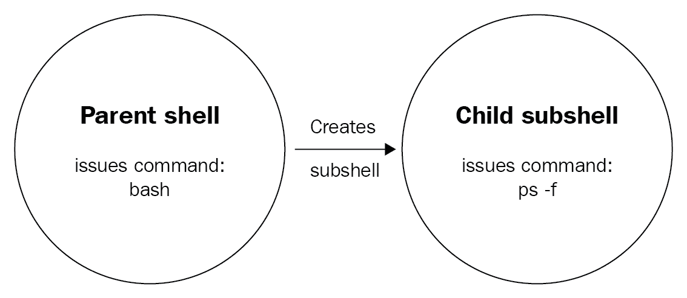

# 第九章：错误检查和处理

在本章中，我们将描述如何检查错误并优雅地处理它们。我们将首先解释退出状态的概念，然后进行一些使用`test`命令的功能检查。之后，我们将开始使用`test`命令的简写表示法。本章的下一部分专门讨论错误处理：我们将使用`if-then-exit`和`if-then-else`来处理简单的错误。在本章的最后部分，我们将介绍一些可以防止错误发生的方法，因为预防胜于治疗。

本章将介绍以下命令：`mktemp`，`true`和`false`。

本章将涵盖以下主题：

+   错误检查

+   错误处理

+   错误预防

# 技术要求

本章只需要 Ubuntu 虚拟机。如果您从未更新过您的机器，现在可能是一个好时机！`sudo apt update && sudo apt upgrade -y`命令会完全升级您的机器上的所有工具。如果您选择这样做，请确保重新启动您的机器，以加载升级后的内核。在 Ubuntu 上，如果存在`/var/log/reboot-required`文件，您可以确定需要重新启动。

本章的所有脚本都可以在 GitHub 上找到：[`github.com/PacktPublishing/Learn-Linux-Shell-Scripting-Fundamentals-of-Bash-4.4/tree/master/Chapter09`](https://github.com/PacktPublishing/Learn-Linux-Shell-Scripting-Fundamentals-of-Bash-4.4/tree/master/Chapter09)。

# 错误检查

在上一章中，我们花了一些时间解释了如何在脚本中捕获和使用*用户输入*。虽然这使得我们的脚本更加动态，从而更加实用，但我们也引入了一个新概念：**人为错误**。假设您正在编写一个脚本，您希望向用户提出一个是/否问题。您可能期望一个合理的用户使用以下任何一个作为答案：

+   y

+   n

+   是

+   否

+   是

+   否

+   是

+   不

+   YES

+   否

虽然 Bash 允许我们检查我们能想到的所有值，但有时用户仍然可以通过提供您不希望的输入来*破坏*脚本。例如，用户用他们的母语回答是/否问题：`ja`，`si`，`nei`，或者其他无数的可能性。实际上，您会发现您*永远*无法考虑到用户提供的每种可能的输入。鉴于事实如此，最好的解决方案是处理最常见的预期输入，并用通用错误消息捕获所有其他输入，告诉用户*如何正确提供答案*。我们将在本章后面看到如何做到这一点，但首先，我们将开始查看如何甚至确定是否发生了错误，通过检查命令的**退出状态**。

# 退出状态

退出状态，通常也称为*退出代码*或*返回代码*，是 Bash 向其父进程通信进程成功或不成功终止的方式。在 Bash 中，所有进程都是从调用它们的 shell 中*fork*出来的。以下图解释了这一点：



当命令运行时，例如前面图中的`ps -f`，当前 shell 被复制（包括环境变量！），命令在副本中运行，称为*fork*。命令/进程完成后，它终止 fork 并将退出状态返回给最初从中 fork 出来的 shell（在交互会话的情况下，将是您的用户会话）。在那时，您可以通过查看退出代码来确定进程是否成功执行。如前一章所述，退出代码为 0 被认为是 OK，而所有其他代码应被视为 NOT OK。由于 fork 被终止，我们需要返回代码，否则我们将无法将状态传递回我们的会话！

因为我们已经在上一章的交互式会话中看到了如何获取退出状态（提示：我们查看了`$?`变量的内容！），让我们看看如何在脚本中做同样的事情：

```
reader@ubuntu:~/scripts/chapter_09$ vim return-code.sh
reader@ubuntu:~/scripts/chapter_09$ cat return-code.sh 
#!/bin/bash

#####################################
# Author: Sebastiaan Tammer
# Version: v1.0.0
# Date: 2018-09-29
# Description: Teaches us how to grab a return code.
# Usage: ./return-code.sh
#####################################

# Run a command that should always work:
mktemp
mktemp_rc=$?

# Run a command that should always fail:
mkdir /home/
mkdir_rc=$?

echo "mktemp returned ${mktemp_rc}, while mkdir returned ${mkdir_rc}!"

reader@ubuntu:~/scripts/chapter_09$ bash return-code.sh 
/tmp/tmp.DbxKK1s4aV
mkdir: cannot create directory ‘/home’: File exists
mktemp returned 0, while mkdir returned 1!
```

通过脚本，我们从 shebang 和 header 开始。由于在此脚本中我们不使用用户输入，因此用法只是脚本名称。我们运行的第一个命令是`mktemp`。这个命令用于创建一个具有随机名称的临时*文件*，如果我们需要在磁盘上有一个临时数据的地方，这可能会很有用。或者，如果我们向`mktemp`提供了`-d`标志，我们将创建一个具有随机名称的临时*目录*。因为随机名称足够长，并且我们应该始终在`/tmp/`中有写权限，我们期望`mktemp`命令几乎总是成功的，因此返回退出状态为 0。我们通过在命令**直接完成后**运行变量赋值来将返回代码保存到`mktemp_rc`变量中。这就是返回代码的最大弱点所在：我们只能在命令完成后直接使用它们。如果我们在之后做任何其他事情，返回代码将被设置为该操作，覆盖先前的退出状态！

接下来，我们运行一个我们期望总是失败的命令：`mkdir /home/`。我们期望它失败的原因是因为在我们的系统上（以及几乎每个 Linux 系统上），`/home/`目录已经存在。在这种情况下，它无法再次创建，这就是为什么该命令以退出状态 1 失败。同样，在`mkdir`命令之后，我们将退出状态保存到`mkdir_rc`变量中。

最后，我们需要检查我们的假设是否正确。使用`echo`，我们打印两个变量的值以及一些文本，以便知道我们在哪里打印了哪个值。这里还有一件事要注意：我们在包含变量的句子中使用了*双引号*。如果我们使用*单引号*，变量将不会被*展开*（Bash 术语是用变量的值替换变量名）。或者，我们可以完全省略引号，`echo`也会按预期执行，但是当我们开始使用重定向时，这可能会开始出现问题，这就是为什么我们认为在处理包含变量的字符串时始终使用双引号是一个好习惯。

# 功能检查

现在，我们知道如何检查进程的退出状态以确定它是否成功。然而，这并不是我们验证命令成功/失败的唯一方法。对于我们运行的大多数命令，我们还可以执行功能检查以查看我们是否成功。在上一个脚本中，我们尝试创建`/home/`目录。但是，如果我们更关心`/home/`目录的存在，而不是进程的退出状态呢？

以下脚本显示了我们如何对系统状态执行*功能检查*：

```
reader@ubuntu:~/scripts/chapter_09$ vim functional-check.sh
reader@ubuntu:~/scripts/chapter_09$ cat functional-check.sh 
#!/bin/bash

#####################################
# Author: Sebastiaan Tammer
# Version: v1.0.0
# Date: 2018-09-29
# Description: Introduces functional checks.
# Usage: ./functional-check.sh
#####################################

# Create a directory.
mkdir /tmp/temp_dir
mkdir_rc=$?

# Use test to check if the directory was created.
test -d /tmp/temp_dir
test_rc=$?

# Check out the return codes:
echo "mkdir resulted in ${mkdir_rc}, test resulted in ${test_rc}."

reader@ubuntu:~/scripts/chapter_09$ bash functional-check.sh 
mkdir resulted in 0, test resulted in 0.
reader@ubuntu:~/scripts/chapter_09$ bash functional-check.sh 
mkdir: cannot create directory ‘/tmp/temp_dir’: File exists
mkdir resulted in 1, test resulted in 0.
```

我们从通常的管道开始前面的脚本。接下来，我们想用`mkdir`创建一个目录。我们获取退出状态并将其存储在一个变量中。接下来，我们使用`test`命令（我们在上一章中简要探讨过）来验证`/tmp/temp_dir/`是否是一个目录（因此，如果它被创建了**某个时间**）。然后，我们用`echo`打印返回代码，方式与我们在 return-code.sh 中做的一样。

接下来，我们运行脚本两次。这里发生了一些有趣的事情。第一次运行脚本时，文件系统上不存在`/tmp/temp_dir/`目录，因此被创建。因此，`mkdir`命令的退出代码为 0。由于它成功创建了，`test -d`也成功，并像预期的那样给我们返回了退出状态 0。

现在，在脚本的第二次运行中，`mkdir`命令并没有成功完成。这是预期的，因为脚本的第一次运行已经创建了该目录。由于我们没有在两次运行之间删除它，`mkdir`的第二次运行是不成功的。然而，`test -d`仍然可以正常运行：**目录存在**，即使它并没有在脚本的那次运行中创建。

在创建脚本时，请确保仔细考虑如何检查错误。有时，返回代码是你需要的：当你需要确保命令已成功运行时就是这种情况。然而，有时功能性检查可能更合适。当最终结果很重要时（例如，目录必须存在），但造成所需状态的原因并不那么重要时，这通常是情况。

# 测试简写

`test`命令是我们 shell 脚本工具中最重要的命令之一。因为 shell 脚本经常很脆弱，特别是涉及用户输入时，我们希望尽可能使其健壮。虽然解释`test`命令的每个方面需要一整章，但以下是`test`可以做的事情：

+   检查文件是否存在

+   检查目录是否存在

+   检查变量是否不为空

+   检查两个变量是否具有相同的值

+   检查 FILE1 是否比 FILE2 旧

+   检查 INTEGER1 是否大于 INTEGER2

等等等等——这应该至少让你对可以用`test`检查的事情有所印象。在*进一步阅读*部分，我们包含了有关测试的广泛来源。确保看一看，因为它肯定会帮助你进行 shell 脚本编写冒险！

对于大多数脚本和编程语言，没有`test`命令这样的东西。显然，在这些语言中测试同样重要，但与 Bash 不同的是，测试通常直接与`if-then-else`逻辑集成在一起（我们将在本章的下一部分讨论）。幸运的是，Bash 有一个`test`命令的简写，这使它与其他语言的语法更接近：`[`和`[[`。

看一下以下代码，以更好地了解我们如何用这种简写替换`test`命令：

```
reader@ubuntu:~/scripts/chapter_09$ vim test-shorthand.sh
reader@ubuntu:~/scripts/chapter_09$ cat test-shorthand.sh 
#!/bin/bash

#####################################
# Author: Sebastiaan Tammer
# Version: v1.0.0
# Date: 2018-09-29
# Description: Write faster tests with the shorthand!
# Usage: ./test-shorthand.sh
#####################################

# Test if the /tmp/ directory exists using the full command:
test -d /tmp/
test_rc=$?

# Test if the /tmp/ directory exists using the simple shorthand:
[ -d /tmp/ ]
simple_rc=$?

# Test if the /tmp/ directory exists using the extended shorthand:
[[ -d /tmp/ ]]
extended_rc=$?

# Print the results.
echo "The return codes are: ${test_rc}, ${simple_rc}, ${extended_rc}."

reader@ubuntu:~/scripts/chapter_09$ bash test-shorthand.sh 
The return codes are: 0, 0, 0.
```

正如你所看到的，在我们介绍的`test`语法之后，我们开始进行管道操作。接下来，我们用`[`替换了 test 这个词，并以`]`结束了这一行。这是 Bash 与其他脚本/编程语言共有的部分。请注意，与大多数语言不同，Bash 要求在`[`之后和`]`之前有**空格**！最后，我们使用了扩展的简写语法，以`[[`开头，以`]]`结尾。当我们打印返回代码时，它们都返回`0`，这意味着所有测试都成功了，即使使用了不同的语法。

[ ]和[[ ]]之间的区别很小，但可能非常重要。简单地说，[ ]的简写语法在变量或路径中包含空格时可能会引入问题。在这种情况下，测试会将空格视为分隔符，这意味着字符串`hello there`变成了两个参数而不是一个（`hello + there`）。还有其他区别，但最终我们的建议非常简单：**使用[[ ]]的扩展简写语法**。有关更多信息，请参阅测试部分的*进一步阅读*。

# 变量复习

作为一个小小的奖励，我们对`test-shorthand.sh`脚本进行了轻微改进。在上一章中，我们解释了，如果我们在脚本中多次使用相同的值，最好将其作为变量。如果变量的值在脚本执行过程中不会改变，并且不受用户输入的影响，我们使用一个常量。看看我们如何在之前的脚本中加入这个：

```
reader@ubuntu:~/scripts/chapter_09$ cp test-shorthand.sh test-shorthand-variable.sh
reader@ubuntu:~/scripts/chapter_09$ vim test-shorthand-variable.sh 
reader@ubuntu:~/scripts/chapter_09$ cat test-shorthand-variable.sh 
#!/bin/bash

#####################################
# Author: Sebastiaan Tammer
# Version: v1.0.0
# Date: 2018-09-29
# Description: Write faster tests with the shorthand, now even better 
# with a CONSTANT!
# Usage: ./test-shorthand-variable.sh
#####################################

DIRECTORY=/tmp/

# Test if the /tmp/ directory exists using the full command:
test -d ${DIRECTORY}
test_rc=$?

# Test if the /tmp/ directory exists using the simple shorthand:
[ -d ${DIRECTORY} ]
simple_rc=$?

# Test if the /tmp/ directory exists using the extended shorthand:
[[ -d ${DIRECTORY} ]]
extended_rc=$?

# Print the results.
echo "The return codes are: ${test_rc}, ${simple_rc}, ${extended_rc}."

reader@ubuntu:~/scripts/chapter_09$ bash test-shorthand-variable.sh 
The return codes are: 0, 0, 0.
```

虽然最终结果是相同的，但如果我们想要更改它，这个脚本更加健壮。此外，它向我们展示了我们可以在`test`简写中使用变量，这些变量将自动被 Bash 展开。

# Bash 调试

我们还有一个更聪明的方法来证明值是否被正确展开：使用 Bash 脚本**带有调试日志**运行。看一下以下执行：

```
reader@ubuntu:~/scripts/chapter_09$ bash -x test-shorthand-variable.sh 
+ DIRECTORY=/tmp/
+ test -d /tmp/
+ test_rc=0
+ '[' -d /tmp/ ']'
+ simple_rc=0
+ [[ -d /tmp/ ]]
+ extended_rc=0
+ echo 'The return codes are: 0, 0, 0.'
The return codes are: 0, 0, 0.
```

如果您将此与实际脚本进行比较，您将看到脚本文本`test -d ${DIRECTORY}`在运行时解析为`test -d /tmp/`。这是因为我们没有运行`bash test-shorthand-variable.sh`，而是运行`bash -x test-shorthand-variable.sh`。在这种情况下，`-x`标志告诉 Bash*打印命令及其参数在执行时*——这是一个非常方便的事情，如果您曾经编写脚本并不确定为什么脚本没有按照您的期望执行！

# 错误处理

到目前为止，我们已经看到了如何检查错误。然而，除了检查错误之外，还有一个同样重要的方面：处理错误。我们将首先结合我们以前的`if`和`test`的经验来处理错误，然后介绍更智能的处理错误的方法！

# if-then-exit

正如您可能还记得的，Bash 使用的`if-then`结构对（几乎）所有编程语言都是通用的。在其基本形式中，想法是您测试一个条件（IF），如果该条件为真，则执行某些操作（THEN）。

这是一个非常基本的例子：如果`name`的长度大于或等于 2 个字符，则`echo "hello ${name}"`。在这种情况下，我们假设一个名字至少要有 2 个字符。如果不是，输入是无效的，我们不会给它一个“hello”。

在下面的脚本`if-then-exit.sh`中，我们将看到我们的目标是使用`cat`打印文件的内容。然而，在这之前，我们检查文件是否存在，如果不存在，我们将退出脚本，并向调用者显示指定出了什么问题的消息：

```
reader@ubuntu:~/scripts/chapter_09$ vim if-then-exit.sh 
reader@ubuntu:~/scripts/chapter_09$ cat if-then-exit.sh 
#!/bin/bash

#####################################
# Author: Sebastiaan Tammer
# Version: v1.0.0
# Date: 2018-09-30
# Description: Use the if-then-exit construct.
# Usage: ./if-then-exit.sh
#####################################

FILE=/tmp/random_file.txt

# Check if the file exists.
if [[ ! -f ${FILE} ]]; then 
  echo "File does not exist, stopping the script!"
  exit 1
fi

# Print the file content.
cat ${FILE}

reader@ubuntu:~/scripts/chapter_09$ bash -x if-then-exit.sh
+ FILE=/tmp/random_file.txt
+ [[ ! -f /tmp/random_file.txt ]]
+ echo 'File does not exist, stopping the script!'
File does not exist, stopping the script!
+ exit 1
```

到目前为止，这个脚本应该是清楚的。我们使用了测试的*扩展简写语法*，就像我们在本书的其余部分中所做的那样。`-f`标志在`test`的 man 页面中被描述为*文件存在且是一个常规文件*。然而，在这里我们遇到了一个小问题：我们想要打印文件（使用`cat`），但只有在文件存在时才这样做；否则，我们想要使用`echo`打印消息。在本章后面，当我们介绍`if-then-else`时，我们将看到如何使用正测试来实现这一点。不过，目前我们希望测试在我们检查的文件**不是**一个现有文件时给我们一个 TRUE。在这种情况下，从语义上讲，我们正在做以下事情：如果文件不存在，则打印一条消息并退出。Bash 中的测试语法没有一个标志可以做到这一点。幸运的是，我们可以使用一个强大的构造：感叹号，！，它可以对测试进行否定/反转！

这些示例如下：

+   if [[-f /tmp/file]]; then *做某事* -> 如果文件/tmp/file 存在，则执行*做某事*

+   if [[！-f /tmp/file]]; then *做某事* -> 如果文件/tmp/file 不存在，则执行*做某事*

+   if [[-n ${variable}]]; then *做某事* -> 如果变量${variable}不为空，则执行*做某事*

+   if [[！-n ${variable}]]; then *做某事* -> 如果变量${variable}**不**为空，则执行*做某事*（因此，双重否定意味着只有在变量实际为空时才执行 do-something）

+   if [[-z ${variable}]]; then *做某事* -> 如果变量${variable}为空，则执行*做某事*

+   if [[！-z ${variable}]]; then *做某事* -> 如果变量${variable}**不**为空，则执行*做某事*

正如你应该知道的那样，最后四个例子是重叠的。这是因为标志`-n`（非零）和`-z`（零）已经是彼此的对立面。由于我们可以用!否定测试，这意味着`-z`等于`! -n`，而`! -z`与`-n`相同。在这种情况下，使用`-n`或!`-z`都无关紧要。我们建议您在使用另一个标志的否定之前，先使用特定的标志。

让我们回到我们的脚本。当我们使用否定的文件存在测试发现文件不存在时，我们向调用者打印了有用的消息并退出了脚本。在这种情况下，我们从未达到`cat`命令，但由于文件根本不存在，`cat`永远不会成功。如果我们让执行继续到那一点，我们将收到`cat`的错误消息。对于`cat`来说，这条消息并不比我们自己的消息更糟糕，但对于其他一些命令来说，错误消息绝对不总是像我们希望的那样清晰；在这种情况下，我们自己的检查并附上清晰的消息并不是一件坏事！

这里有另一个例子，我们在其中使用 if 和 test 来查看我们将在变量中捕获的状态代码：

```
reader@ubuntu:~/scripts/chapter_09$ vim if-then-exit-rc.sh
reader@ubuntu:~/scripts/chapter_09$ cat if-then-exit-rc.sh 
#!/bin/bash

#####################################
# Author: Sebastiaan Tammer
# Version: v1.0.0
# Date: 2018-09-30
# Description: Use return codes to stop script flow.
# Usage: ./if-then-exit-rc.sh
#####################################

# Create a new top-level directory.
mkdir /temporary_dir
mkdir_rc=$?

# Test if the directory was created successfully.
if [[ ${mkdir_rc} -ne 0 ]]; then
  echo "mkdir did not successfully complete, stop script execution!"
  exit 1
fi

# Create a new file in our temporary directory.
touch /temporary_dir/tempfile.txt

reader@ubuntu:~/scripts/chapter_09$ bash if-then-exit-rc.sh
mkdir: cannot create directory ‘/temporary_dir’: Permission denied
mkdir did not successfully complete, stop script execution!
```

在脚本的第一个功能部分中，我们试图创建顶层目录`/temporary_dir/`。由于只有 root 用户拥有这些特权，而我们既不是以 root 用户身份运行，也没有使用`sudo`，所以`mkdir`失败了。当我们在`mkdir_rc`变量中捕获退出状态时，我们不知道确切的值（如果需要，我们可以打印它），但我们知道一件事：它不是`0`，这个值是保留用于成功执行的。因此，我们有两个选择：我们可以检查退出状态是否**不等于 0**，或者状态代码是否**等于 1**（这实际上是`mkdir`在这种情况下向父 shell 报告的）。我们通常更喜欢**检查成功的缺席**，而不是检查特定类型的失败（如不同的返回代码，如 1、113、127、255 等）。如果我们只在退出代码为 1 时停止，那么我们将在所有不得到 1 的情况下继续脚本：这有希望是 0，但我们不能确定。总的来说，任何不成功的事情都需要停止脚本！

对于这种情况，检查返回代码是否不是`0`，我们使用整数（记住，*数字*的一个花哨的词）比较。如果我们检查`man test`，我们可以看到`-ne`标志被描述为`INTEGER1 -ne INTEGER2：INTEGER1 不等于 INTEGER2`。因此，对于我们的逻辑，这意味着，如果在变量中捕获的返回代码**不等于**`0`，命令就没有成功执行，我们应该停止。记住，我们也可以使用`-eq`（**等于**）标志，并用`!`否定它以达到相同的效果。

在当前形式中，脚本比严格需要的要长一点。我们首先将返回代码存储在一个变量中，然后再比较该变量。我们还可以直接在`if-test`结构中使用退出状态，就像这样：

```
reader@ubuntu:~/scripts/chapter_09$ cp if-then-exit-rc.sh if-then-exit-rc-improved.sh
reader@ubuntu:~/scripts/chapter_09$ vim if-then-exit-rc-improved.sh
reader@ubuntu:~/scripts/chapter_09$ cat if-then-exit-rc-improved.sh 
#!/bin/bash

#####################################
# Author: Sebastiaan Tammer
# Version: v1.0.0
# Date: 2018-09-30
# Description: Use return codes to stop script flow.
# Usage: ./if-then-exit-rc-improved.sh
#####################################

# Create a new top-level directory.
mkdir /temporary_dir

# Test if the directory was created successfully.
if [[ $? -ne 0 ]]; then
  echo "mkdir did not successfully complete, stop script execution!"
  exit 1
fi

# Create a new file in our temporary directory.
touch /temporary_dir/tempfile.txt

reader@ubuntu:~/scripts/chapter_09$ bash if-then-exit-rc-improved.sh 
mkdir: cannot create directory ‘/temporary_dir’: Permission denied
mkdir did not successfully complete, stop script execution!
```

虽然这*只*节省了一行（变量赋值），但也节省了一个不必要的变量。你可以看到我们将测试改为比较 0 和$?。我们知道无论如何我们都想检查执行，所以我们也可以立即这样做。如果以后需要再做，我们仍然需要将其保存在一个变量中，因为记住：退出状态只在运行命令后直接可用。在那之后，它已经被后续命令的退出状态覆盖了。

# if-then-else

到目前为止，你应该已经对`if-then`逻辑有了一些了解。然而，你可能觉得还缺少了一些东西。如果是这样，你是对的！一个`if-then`结构没有 ELSE 语句是不完整的。`if-then-else`结构允许我们指定如果 if 子句中的测试**不**为真时应该发生什么。从语义上讲，它可以被翻译为：

如果条件，那么做某事，否则（其他情况）做其他事情

我们可以通过拿我们之前的一个脚本`if-then-exit.sh`来很容易地说明这一点，并优化脚本的流程和代码：

```
reader@ubuntu:~/scripts/chapter_09$ cp if-then-exit.sh if-then-else.sh
reader@ubuntu:~/scripts/chapter_09$ vim if-then-else.sh 
reader@ubuntu:~/scripts/chapter_09$ cat if-then-else.sh 
#!/bin/bash

#####################################
# Author: Sebastiaan Tammer
# Version: v1.0.0
# Date: 2018-09-30
# Description: Use the if-then-else construct.
# Usage: ./if-then-else.sh
#####################################

FILE=/tmp/random_file.txt

# Check if the file exists.
if [[ ! -f ${FILE} ]]; then 
  echo "File does not exist, stopping the script!"
  exit 1
else
  cat ${FILE} # Print the file content.
fi

reader@ubuntu:~/scripts/chapter_09$ bash if-then-else.sh 
File does not exist, stopping the script!
reader@ubuntu:~/scripts/chapter_09$ touch /tmp/random_file.txt
reader@ubuntu:~/scripts/chapter_09$ bash -x if-then-else.sh 
+ FILE=/tmp/random_file.txt
+ [[ ! -f /tmp/random_file.txt ]]
+ cat /tmp/random_file.txt
```

现在，这开始看起来像是一些东西！我们将`cat`命令移到了`if-then-else`逻辑块中。现在，它感觉（而且确实是！）像一个单一的命令：如果文件不存在，则打印错误消息并退出，否则打印其内容。不过，我们在错误情况下使用了 then 块有点奇怪；按照惯例，then 块是为成功条件保留的。我们可以通过交换 then 和 else 块来使我们的脚本更加直观；但是，我们还需要反转我们的测试条件。让我们来看一下：

```
reader@ubuntu:~/scripts/chapter_09$ cp if-then-else.sh if-then-else-proper.sh
reader@ubuntu:~/scripts/chapter_09$ vim if-then-else-proper.sh 
reader@ubuntu:~/scripts/chapter_09$ cat if-then-else-proper.sh 
#!/bin/bash

#####################################
# Author: Sebastiaan Tammer
# Version: v1.0.0
# Date: 2018-09-30
# Description: Use the if-then-else construct, now properly.
# Usage: ./if-then-else-proper.sh file-name
#####################################

file_name=$1

# Check if the file exists.
if [[ -f ${file_name} ]]; then 
  cat ${file_name} # Print the file content.
else
  echo "File does not exist, stopping the script!"
  exit 1
fi

reader@ubuntu:~/scripts/chapter_09$ bash -x if-then-else-proper.sh /home/reader/textfile.txt 
+ FILE=/home/reader/textfile.txt
+ [[ -f /home/reader/textfile.txt ]]
+ cat /home/reader/textfile.txt
Hi, this is some text.
```

我们在这个脚本中所做的更改如下：

+   我们用用户输入变量`file_name`替换了硬编码的 FILE 常量

+   我们去掉了`test`的!反转

+   我们交换了 then 和 else 执行块

现在，脚本首先检查文件是否存在，如果存在，则打印其内容（成功场景）。如果文件不存在，脚本将打印错误消息并以退出代码 1 退出（失败场景）。在实践中，`else`通常用于失败场景，`then`用于成功场景。但这并不是铁律，可能会有所不同，根据您可用的测试类型。如果您正在编写脚本，并且希望使用 else 块来处理成功场景，那就尽管去做：只要您确定这是您情况下的正确选择，绝对没有什么可耻的！

您可能已经注意到，在`if-then-else`块中，我们在 then 或 else 中执行的命令之前始终有两个空格。在脚本/编程中，这称为缩进。在 Bash 中，它只有一个功能：提高可读性。通过用两个空格缩进这些命令，我们知道它们是 then-else 逻辑的一部分。同样，很容易看到`then`在哪里结束，`else`在哪里开始。请注意，在某些语言中，特别是 Python，空白是编程语言语法的一部分，不能省略！

到目前为止，我们只使用`if-then-else`逻辑来检测错误，然后退出`1`。然而，在某些情况下，*then*和*else*都可以用来实现脚本的目标，而不是其中一个用于错误处理。看一下以下脚本：

```
reader@ubuntu:~/scripts/chapter_09$ vim empty-file.sh 
reader@ubuntu:~/scripts/chapter_09$ cat empty-file.sh 
#!/bin/bash

#####################################
# Author: Sebastiaan Tammer
# Version: v1.0.0
# Date: 2018-10-02
# Description: Make sure the file given as an argument is empty.
# Usage: ./empty-file.sh <file-name>
#####################################

# Grab the first argument.
file_name=$1

# If the file exists, overwrite it with the always empty file 
# /dev/null; otherwise, touch it.
if [[ -f ${file_name} ]]; then
  cp /dev/null ${file_name}
else
  touch ${file_name}
fi

# Check if either the cp or touch worked correctly.
if [[ $? -ne 0 ]]; then
  echo "Something went wrong, please check ${file_name}!"
  exit 1
else
  echo "Succes, file ${file_name} is now empty."
fi

reader@ubuntu:~/scripts/chapter_09$ bash -x empty-file.sh /tmp/emptyfile
+ file_name=/tmp/emptyfile
+ [[ -f /tmp/emptyfile ]]
+ touch /tmp/emptyfile
+ [[ 0 -ne 0 ]]
+ echo 'Succes, file /tmp/emptyfile is now empty.'
Succes, file /tmp/emptyfile is now empty.
reader@ubuntu:~/scripts/chapter_09$ bash -x empty-file.sh /tmp/emptyfile
+ file_name=/tmp/emptyfile
+ [[ -f /tmp/emptyfile ]]
+ cp /dev/null /tmp/emptyfile
+ [[ 0 -ne 0 ]]
+ echo 'Succes, file /tmp/emptyfile is now empty.'
Succes, file /tmp/emptyfile is now empty.
```

我们使用此脚本来确保文件存在且为空。基本上，有两种情况：文件存在（*可能*不为空）或不存在。在我们的**if**测试中，我们检查文件是否存在。如果存在，我们通过将`/dev/null`（始终为空）复制到用户给定的位置来用空文件替换它。否则，如果文件不存在，我们只需使用`touch`创建它。

正如您在脚本执行中所看到的，第一次运行此脚本时，文件不存在，并且使用`touch`创建。在直接之后的脚本运行中，文件存在（因为它是在第一次运行中创建的）。这次，我们可以看到`cp`被使用。因为我们想确保这些操作中的任何一个是否成功，我们包含了额外的**if**块，用于处理退出状态检查，就像我们以前看到的那样。

# 简写语法

到目前为止，我们已经看到了使用 if 块来查看我们之前的命令是否成功运行的一些用法。虽然功能很棒，但在每个可能发生错误的命令之后使用 5-7 行真的会增加脚本的总长度！更大的问题将是可读性：如果一半的脚本是错误检查，可能很难找到代码的底部。幸运的是，我们可以在命令之后直接检查错误的方法。我们可以使用 || 命令来实现这一点，这是逻辑 OR 的 Bash 版本。它的对应物 && 是逻辑 AND 的实现。为了说明这一点，我们将介绍两个新命令：`true` 和 `false`。如果您查看各自的 man 页面，您将找到可能得到的最清晰的答案：

+   true：不执行任何操作，成功

+   false：不执行任何操作，不成功

以下脚本说明了我们如何使用 || 和 && 来创建逻辑应用程序流。如果逻辑运算符是陌生的领域，请先查看 *进一步阅读* 部分下的 *逻辑运算符* 链接：

```
reader@ubuntu:~/scripts/chapter_09$ vim true-false.sh 
reader@ubuntu:~/scripts/chapter_09$ cat true-false.sh 
#!/bin/bash

#####################################
# Author: Sebastiaan Tammer
# Version: v1.0.0
# Date: 2018-10-02
# Description: Shows the logical AND and OR (&& and ||).
# Usage: ./true-false.sh
#####################################

# Check out how an exit status of 0 affects the logical operators:
true && echo "We get here because the first part is true!"
true || echo "We never see this because the first part is true :("

# Check out how an exit status of 1 affects the logical operators:
false && echo "Since we only continue after && with an exit status of 0, this is never printed."
false || echo "Because we only continue after || with a return code that is not 0, we see this!"

reader@ubuntu:~/scripts/chapter_09$ bash -x true-false.sh 
+ true
+ echo 'We get here because the first part is true!'
We get here because the first part is true!
+ true
+ false
+ false
+ echo 'Because we only continue after || with a return code that is not 0, we see this!'
Because we only continue after || with a return code that is not 0, we see this!
```

正如我们所预期的，只有在前一个命令返回退出代码 0 时，才会执行 && 之后的代码，而只有在退出代码 **不是** 0 时（通常是 1）才会执行 || 之后的代码。如果您仔细观察，您实际上可以在脚本的调试中看到这种情况发生。您可以看到 `true` 被执行了两次，以及 `false`。然而，我们实际上看到的第一个 `echo` 是在第一个 true 之后，而我们看到的第二个 `echo` 是在第二个 false 之后！我们已经在前面的代码中突出显示了这一点，以方便您查看。

现在，我们如何使用这个来处理错误呢？错误将给出一个不为 0 的退出状态，因此这与 `false` 命令是可比的。在我们的例子中，逻辑运算符 || 后面的代码在 false 之后被打印出来。这是有道理的，因为 `false` 或 `echo` 应该成功。在这种情况下，由于 `false`（默认）失败，`echo` 被执行。在下面的简单示例中，我们将向您展示如何在脚本中使用 || 运算符：

```
reader@ubuntu:~/scripts/chapter_09$ vim logical-or.sh
reader@ubuntu:~/scripts/chapter_09$ cat logical-or.sh 
#!/bin/bash

#####################################
# Author: Sebastiaan Tammer
# Version: v1.0.0
# Date: 2018-10-02
# Description: Use the logical OR for error handling.
# Usage: ./logical-or.sh
#####################################

# This command will surely fail because we don't have the permissions needed:
cat /etc/shadow || exit 123

reader@ubuntu:~/scripts/chapter_09$ cat /etc/shadow
cat: /etc/shadow: Permission denied
reader@ubuntu:~/scripts/chapter_09$ echo $?
1
reader@ubuntu:~/scripts/chapter_09$ bash logical-or.sh 
cat: /etc/shadow: Permission denied
reader@ubuntu:~/scripts/chapter_09$ echo $?
123
```

我们尝试 `cat` 一个我们没有权限的文件（这是一件好事，因为 `/etc/shadow` 包含系统上所有用户的哈希密码）。当我们正常执行此操作时，我们会收到 1 的退出状态，就像我们的手动 `cat` 中所看到的那样。但是，在我们的脚本中，我们使用 `exit 123`。如果我们的逻辑运算符起作用，我们将不会以默认的 `1` 退出，而是以退出状态 `123`。当我们调用脚本时，我们会收到相同的 `Permission denied` 错误，但是这次当我们打印返回代码时，我们会看到预期的 `123`。

如果您真的想要确认，只有在第一部分失败时才会执行 || 后面的代码，请使用 `sudo` 运行脚本。在这种情况下，您将看到 `/etc/shadow` 的内容，因为 root 具有这些权限，退出代码将是 0，而不是之前的 1 和 123。

同样，如果您只想在完全确定第一个命令已成功完成时执行代码，也可以使用 &&。要以非常优雅的方式处理潜在错误，最好在 || 之后结合使用 `echo` 和 `exit`。在接下来的示例中，您将在接下来的几页中看到如何实现这一点！我们将在本书的其余部分中使用处理错误的方式，所以现在不要担心语法 - 在本书结束之前，您将遇到它很多次。

# 错误预防

到目前为止，您应该已经牢固掌握了我们如何处理（用户输入）错误。显然，这里的上下文是一切：根据情况，一些错误以不同的方式处理。本章中还有一个更重要的主题，那就是 *错误预防*。虽然知道如何处理错误是一回事，但如果我们能在脚本执行过程中完全避免错误，那就更好了。

# 检查参数

正如我们在上一章中指出的，当处理传递给脚本的位置参数时，有一些非常重要的事情。其中之一是空格，它表示参数之间的边界。如果我们需要向脚本传递包含空格的参数，我们需要将该参数用单引号或双引号括起来，否则它将被解释为多个参数。位置参数的另一个重要方面是确切地获得正确数量的参数：既不要太少，也绝对不要太多。

通过在使用位置参数的脚本中以检查传递的参数数量开始，我们可以验证用户是否正确调用了脚本。否则，我们可以指导用户如何正确调用它！以下示例向您展示了我们如何做到这一点：

```
reader@ubuntu:~/scripts/chapter_09$ vim file-create.sh 
reader@ubuntu:~/scripts/chapter_09$ cat file-create.sh 
#!/bin/bash

#####################################
# Author: Sebastiaan Tammer
# Version: v1.0.0
# Date: 2018-10-01
# Description: Create a file with contents with this script.
# Usage: ./file-create.sh <directory_name> <file_name> <file_content>
#####################################

# We need exactly three arguments, check how many have been passed to 
# the script.
if [[ $# -ne 3 ]]; then
  echo "Incorrect usage!"
  echo "Usage: $0 <directory_name> <file_name> <file_content>"
  exit 1
fi
# Arguments are correct, lets continue.

# Save the arguments into variables.
directory_name=$1
file_name=$2
file_content=$3

# Create the absolute path for the file.
absolute_file_path=${directory_name}/${file_name}

# Check if the directory exists; otherwise, try to create it.
if [[ ! -d ${directory_name} ]]; then
  mkdir ${directory_name} || { echo "Cannot create directory, exiting script!"; exit 1; }
fi

# Try to create the file, if it does not exist.
if [[ ! -f ${absolute_file_path} ]]; then
  touch ${absolute_file_path} || { echo "Cannot create file, exiting script!"; exit 1; }
fi

# File has been created, echo the content to it.
echo ${file_content} > ${absolute_file_path}

reader@ubuntu:~/scripts/chapter_09$ bash -x file-create.sh /tmp/directory/ newfile "Hello this is my file"
+ [[ 3 -ne 3 ]]
+ directory_name=/tmp/directory/
+ file_name=newfile
+ file_content='Hello this is my file'
+ absolute_file_path=/tmp/directory//newfile
+ [[ ! -d /tmp/directory/ ]]
+ mkdir /tmp/directory/
+ [[ ! -f /tmp/directory//newfile ]]
+ touch /tmp/directory//newfile
+ echo Hello this is my file
reader@ubuntu:~/scripts/chapter_09$ cat /tmp/directory/newfile 
Hello this is my file
```

为了正确说明这个原则和我们之前看到的一些其他原则，我们创建了一个相当大而复杂的脚本（与您之前看到的相比）。为了更容易理解这一点，我们将它分成几部分，并依次讨论每一部分。我们将从头部开始：

```
#!/bin/bash

#####################################
# Author: Sebastiaan Tammer
# Version: v1.0.0
# Date: 2018-10-01
# Description: Create a file with contents with this script.
# Usage: ./file-create.sh <directory_name> <file_name> <file_content>
#####################################
...
```

现在，shebang 和大多数字段应该感觉很自然。然而，在指定位置参数时，我们喜欢在**<>**中将它们括起来，如果它们是**必需的**，则在**[]**中将它们括起来，如果它们是**可选的**（例如，如果它们有默认值，我们将在本章末尾看到）。这是脚本编写中的常见模式，您最好遵循它！脚本的下一部分是实际检查参数数量的部分：

```
...
# We need exactly three arguments, check how many have been passed to the script.
if [[ $# -ne 3 ]]; then
  echo "Incorrect usage!"
  echo "Usage: $0 <directory_name> <file_name> <file_content>"
  exit 1
fi
# Arguments are correct, lets continue.
...
```

这一部分的魔力来自$#的组合。类似于$?退出状态构造，$#解析为传递给脚本的参数数量。因为这是一个整数，我们可以使用`test`的`-ne`和`-eq`标志将其与我们需要的参数数量进行比较：三个。任何*不是三个*的都不适用于这个脚本，这就是为什么我们以这种方式构建检查。如果*测试结果为正*（这意味着负结果！），我们执行`then-logic`，告诉用户他们错误地调用了脚本。为了防止再次发生这种情况，还传递了使用脚本的正确方法。我们在这里使用了另一个技巧，即$0 符号。这解析为脚本名称，这就是为什么在错误调用的情况下，脚本名称会很好地打印在实际预期参数旁边，就像这样：

```
reader@ubuntu:~/scripts/chapter_09$ bash file-create.sh 1 2 3 4 5
Incorrect usage!
Usage: file-create.sh <directory_name> <file_name> <file_content>
```

由于这个检查和对用户的提示，我们预期用户只会错误地调用此脚本一次。因为我们还没有开始处理脚本的功能，所以我们不会出现脚本中一半的任务已经完成的情况，即使我们在脚本开始时就知道它永远不会完成，因为缺少脚本需要的信息。让我们继续下一部分脚本：

```
...
# Save the arguments into variables.
directory_name=$1
file_name=$2
file_content=$3

# Create the absolute path for the file.
absolute_file_path=${directory_name}/${file_name}
...
```

作为回顾，我们可以看到我们将位置用户输入分配给一个我们选择的变量名，以表示它所保存的内容。因为我们需要多次使用最终文件的绝对路径，我们根据用户输入结合两个变量来形成文件的绝对路径。脚本的下一部分包含实际功能：

```
...
# Check if the directory exists; otherwise, try to create it.
if [[ ! -d ${directory_name} ]]; then
  mkdir ${directory_name} || { echo "Cannot create directory, exiting script!"; exit 1; }
fi

# Try to create the file, if it does not exist.
if [[ ! -f ${absolute_file_path} ]]; then
  touch ${absolute_file_path} || { echo "Cannot create file, exiting script!"; exit 1; }
fi

# File has been created, echo the content to it.
echo ${file_content} > ${absolute_file_path}
```

对于文件和目录，我们进行类似的检查：我们检查目录/文件是否已经存在，或者我们是否需要创建它。通过使用`echo`和`exit`的||简写，我们检查`mkdir`和`touch`是否返回退出状态 0。请记住，如果它们返回*除 0 以外的任何值*，则||之后和花括号内的所有内容都将被执行，这种情况下会退出脚本！

最后一部分包含了将回显重定向到文件的操作。简单地说，echo 的输出被重定向到一个文件中。重定向将在第十二章中深入讨论，“在脚本中使用管道和重定向”。现在，接受我们用于`${file_content}`的文本将被写入文件中（您可以自行检查）。

# 管理绝对路径和相对路径

我们还没有讨论的一个问题是：使用绝对路径和相对路径运行脚本。这可能看起来像是一个微不足道的差异，但实际上并非如此。大多数你运行的命令，无论是直接交互还是从你调用的脚本中运行，都使用你的当前工作目录作为它们的当前工作目录。你可能期望脚本中的命令默认为脚本所在的目录，但由于脚本只是你当前 shell 的一个分支（正如本章开头所解释的那样），它也继承了当前工作目录。我们可以通过创建一个复制文件到相对路径的脚本来最好地说明这一点：

```
reader@ubuntu:~/scripts/chapter_09$ vim log-copy.sh 
reader@ubuntu:~/scripts/chapter_09$ cat log-copy.sh 
#!/bin/bash

#####################################
# Author: Sebastiaan Tammer
# Version: v1.0.0
# Date: 2018-10-02
# Description: Copy dpkg.log to a local directory.
# Usage: ./log-copy.sh
#####################################

# Create the directory in which we'll store the file.
if [[ ! -d dpkg ]]; then
  mkdir dpkg || { echo "Cannot create the directory, stopping script."; exit 1; }
fi

# Copy the log file to our new directory.
cp /var/log/dpkg.log dpkg || { echo "Cannot copy dpkg.log to the new directory."; exit 1; }

reader@ubuntu:~/scripts/chapter_09$ ls -l dpkg
ls: cannot access 'dpkg': No such file or directory
reader@ubuntu:~/scripts/chapter_09$ bash log-copy.sh 
reader@ubuntu:~/scripts/chapter_09$ ls -l dpkg
total 632
-rw-r--r-- 1 reader reader 643245 Oct  2 19:39 dpkg.log
reader@ubuntu:~/scripts/chapter_09$ cd /tmp
reader@ubuntu:/tmp$ ls -l dpkg
ls: cannot access 'dpkg': No such file or directory
reader@ubuntu:/tmp$ bash /home/reader/scripts/chapter_09/log-copy.sh 
reader@ubuntu:/tmp$ ls -l dpkg
total 632
-rw-r--r-- 1 reader reader 643245 Oct  2 19:39 dpkg.log
```

脚本本身非常简单——检查目录是否存在，否则创建它。您可以使用我们的简写错误处理来检查`mkdir`的错误。接下来，将一个已知文件（`/var/log/dpkg.log`）复制到`dpkg`目录中。第一次运行时，我们与脚本位于同一目录。我们可以看到在那里创建了`dpkg`目录，并且文件被复制到其中。然后，我们将当前工作目录移动到`/tmp/`，并再次运行脚本，这次使用绝对路径而不是第一次调用的相对路径。现在，我们可以看到`dpkg`目录被创建在`/tmp/dpkg/`下！这并不是非常意外的，但我们如何可以“避免”这种情况呢？脚本开头的一行代码就可以解决这个问题：

```
reader@ubuntu:~/scripts/chapter_09$ cp log-copy.sh log-copy-improved.sh
reader@ubuntu:~/scripts/chapter_09$ vim log-copy-improved.sh 
reader@ubuntu:~/scripts/chapter_09$ cat log-copy-improved.sh 
#!/bin/bash

#####################################
# Author: Sebastiaan Tammer
# Version: v1.0.0
# Date: 2018-10-02
# Description: Copy dpkg.log to a local directory.
# Usage: ./log-copy-improved.sh
#####################################

# Change directory to the script location.
cd $(dirname $0)

# Create the directory in which we'll store the file.
if [[ ! -d dpkg ]]; then
  mkdir dpkg || { echo "Cannot create the directory, stopping script."; exit 1; }
fi

# Copy the log file to our new directory.
cp /var/log/dpkg.log dpkg || { echo "Cannot copy dpkg.log to the new directory."; exit 1; }

reader@ubuntu:~/scripts/chapter_09$ cd /tmp/
reader@ubuntu:/tmp$ rm -rf /tmp/dpkg/
reader@ubuntu:/tmp$ rm -rf /home/reader/scripts/chapter_09/dpkg/
reader@ubuntu:/tmp$ bash -x /home/reader/scripts/chapter_09/log-copy-improved.sh 
++ dirname /home/reader/scripts/chapter_09/log-copy-improved.sh
+ cd /home/reader/scripts/chapter_09
+ [[ ! -d dpkg ]]
+ mkdir dpkg
+ cp /var/log/dpkg.log dpkg
reader@ubuntu:/tmp$ ls -l dpkg
ls: cannot access 'dpkg': No such file or directory
```

正如代码执行所示，现在我们可以相对于脚本位置执行所有操作。这是通过一点点 Bash 魔法和`dirname`命令实现的。这个命令也很简单：它从我们传递的任何内容中打印目录名，这里是`$0`。你可能记得，$0 解析为脚本名称，因为它被调用。从`/tmp/`，这是绝对路径；如果我们从另一个目录调用它，它可能是一个相对路径。如果我们在与脚本相同的目录中，`dirname`，$0 将结果为`.`，这意味着我们`cd`到当前目录。这并不是真正需要的，但它也不会造成任何伤害。这似乎是一个小小的代价，换来了一个更加健壮的脚本，现在我们可以从任何地方调用它！

现在，我们不会详细讨论`$(...)`语法。我们将在第十二章中进一步讨论这个问题，“在脚本中使用管道和重定向”。在这一点上，记住这使我们能够在一行中获取一个值，然后将其传递给`cd`。

# 处理 y/n

在本章的开始，我们向您提出了一个思考的问题：通过陈述是或否来要求用户同意或不同意某事。正如我们讨论过的，有许多可能的答案可以期待用户给出。实际上，用户可以以五种方式给出“是”的答案：y、Y、yes、YES 和 Yes。

对于“否”也是一样。让我们看看如何在不使用任何技巧的情况下进行检查：

```
reader@ubuntu:~/scripts/chapter_09$ vim yes-no.sh 
reader@ubuntu:~/scripts/chapter_09$ cat yes-no.sh 
#!/bin/bash

#####################################
# Author: Sebastiaan Tammer
# Version: v1.0.0
# Date: 2018-10-01
# Description: Dealing with yes/no answers.
# Usage: ./yes-no.sh
#####################################

read -p "Do you like this question? " reply_variable

# See if the user responded positively.
if [[ ${reply_variable} = 'y' || ${reply_variable} = 'Y' || ${reply_variable} = 'yes' || ${reply_variable} = 'YES' || ${reply_variable} = 'Yes' ]]; then
  echo "Great, I worked really hard on it!"
  exit 0
fi

# Maybe the user responded negatively?
if [[ ${reply_variable} = 'n' || ${reply_variable} = 'N' || ${reply_variable} = 'no' || ${reply_variable} = 'NO' || ${reply_variable} = 'No' ]]; then
  echo "You did not? But I worked so hard on it!"
  exit 0
fi

# If we get here, the user did not give a proper response.
echo "Please use yes/no!"
exit 1

reader@ubuntu:~/scripts/chapter_09$ bash yes-no.sh 
Do you like this question? Yes
Great, I worked really hard on it!
reader@ubuntu:~/scripts/chapter_09$ bash yes-no.sh 
Do you like this question? n
You did not? But I worked so hard on it!
reader@ubuntu:~/scripts/chapter_09$ bash yes-no.sh 
Do you like this question? maybe 
Please use yes/no!
```

虽然这样做是有效的，但并不是一个非常可行的解决方案。更糟糕的是，如果用户在尝试输入“是”时碰巧开启了大写锁定键，我们最终会得到“yES”！我们需要包括这种情况吗？答案当然是否定的。Bash 有一个称为**参数扩展**的巧妙功能。我们将在第十六章中更深入地解释这一点，“Bash 参数替换和扩展”，但现在，我们可以给你一个它能做什么的预览：

```
reader@ubuntu:~/scripts/chapter_09$ cp yes-no.sh yes-no-optimized.sh
reader@ubuntu:~/scripts/chapter_09$ vim yes-no-optimized.sh 
reader@ubuntu:~/scripts/chapter_09$ cat yes-no-optimized.sh 
#!/bin/bash

#####################################
# Author: Sebastiaan Tammer
# Version: v1.0.0
# Date: 2018-10-01
# Description: Dealing with yes/no answers, smarter this time!
# Usage: ./yes-no-optimized.sh
#####################################

read -p "Do you like this question? " reply_variable

# See if the user responded positively.
if [[ ${reply_variable,,} = 'y' || ${reply_variable,,} = 'yes' ]]; then
  echo "Great, I worked really hard on it!"
  exit 0
fi

# Maybe the user responded negatively?
if [[ ${reply_variable^^} = 'N' || ${reply_variable^^} = 'NO' ]]; then
  echo "You did not? But I worked so hard on it!"
  exit 0
fi

# If we get here, the user did not give a proper response.
echo "Please use yes/no!"
exit 1

reader@ubuntu:~/scripts/chapter_09$ bash yes-no-optimized.sh 
Do you like this question? YES
Great, I worked really hard on it!
reader@ubuntu:~/scripts/chapter_09$ bash yes-no-optimized.sh 
Do you like this question? no
You did not? But I worked so hard on it!
```

现在，我们不再对每个答案进行五次检查，而是只使用两次：一个用于完整单词（是/否），一个用于简短的单字母答案（y/n）。但是，当我们只指定了*yes*时，答案*YES*是如何工作的呢？这个问题的解决方案在于我们在变量内部包含的,,和^^。因此，我们使用了${reply_variable,,}和${reply_variable^^}，而不是${reply_variable}。在,,,的情况下，变量首先解析为其值，然后转换为*所有小写字母*。因此，所有三个答案——*YES, Yes 和 yes*——都可以与*yes*进行比较，因为 Bash 会将它们扩展为这样。你可能猜到^^的作用是什么：它将字符串的内容转换为大写，这就是为什么我们可以将其与 NO 进行比较，即使我们给出的答案是 no。

始终试图站在用户的角度。他们正在处理许多不同的工具和命令。在这些情况下，处理不同方式的是/否写法的逻辑已经被整合。这甚至可以让最友好的系统管理员有点懒惰，并训练他们选择单字母答案。但你也不想惩罚那些真正听你话的系统管理员！因此，要点是以友好的方式处理最*合理*的答案。

# 摘要

在本章中，我们讨论了 Bash 脚本中错误的许多方面。首先描述了错误**检查**。首先，我们解释了退出状态是命令用来传达其执行是否被视为成功或失败的一种方式。介绍了`test`命令及其简写`[[...]]`符号。该命令允许我们在脚本中执行功能性检查。其中的示例包括比较字符串和整数，以及检查文件或目录是否被创建和可访问/可写。我们对变量进行了快速复习，然后简要介绍了使用调试标志`-x`运行脚本。

本章的第二部分涉及错误**处理**。我们描述了（非官方的）`if-then-exit`结构，我们用它来检查命令执行并在失败时退出。在随后的示例中，我们看到当我们想要检查它们时，我们并不总是需要将返回码写入变量中；我们可以直接在测试用例中使用$?。接着，我们预览了如何使用`if-then-else`逻辑更好地处理错误。我们通过介绍了错误处理的简写语法来结束本章的第二部分，这将在本书的其余部分中继续使用。

在本章的第三部分和最后一部分中，我们解释了错误**预防**。我们学习了如何检查参数是否正确，以及在调用脚本时如何避免绝对路径和相对路径的问题。在本章的最后部分，我们回答了一开始提出的问题：我们如何最好地处理用户的是/否输入？通过使用一些简单的 Bash 参数扩展（这将在本书的最后一章中进一步解释），我们能够简单地为我们的脚本的用户提供多种回答方式。

本章介绍了以下命令：`mktemp`、`true`和`false`。

# 问题

1.  我们为什么需要退出状态？

1.  退出状态、退出码和返回码之间有什么区别？

1.  我们在 test 中使用哪个标志来测试以下内容？

+   现有的目录

+   可写文件

+   现有的符号链接

1.  `test -d /tmp/`的首选简写语法是什么？

1.  如何在 Bash 会话中打印调试信息？

1.  我们如何检查变量是否有内容？

1.  抓取返回码的 Bash 格式是什么？

1.  `||`和`&&`中，哪个是逻辑与，哪个是逻辑或？

1.  抓取参数数量的 Bash 格式是什么？

1.  我们如何确保用户从任何工作目录调用脚本都没有关系？

1.  在处理用户输入时，Bash 参数扩展如何帮助我们？

# 进一步阅读

如果您想深入了解本章主题，以下资源可能会很有趣：

+   测试命令：[`wiki.bash-hackers.org/commands/classictest`](http://wiki.bash-hackers.org/commands/classictest)

+   Bash 调试：[`tldp.org/LDP/Bash-Beginners-Guide/html/sect_02_03.html`](http://tldp.org/LDP/Bash-Beginners-Guide/html/sect_02_03.html)

+   逻辑运算符：[`secure.php.net/manual/en/language.operators.logical.php`](https://secure.php.net/manual/en/language.operators.logical.php)
