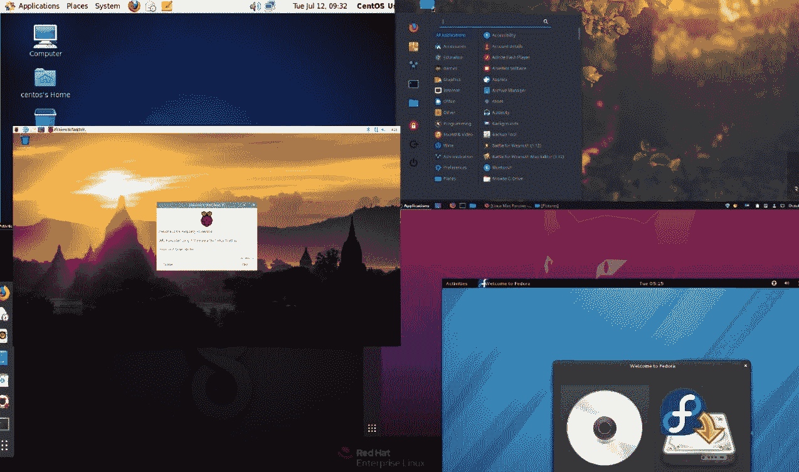
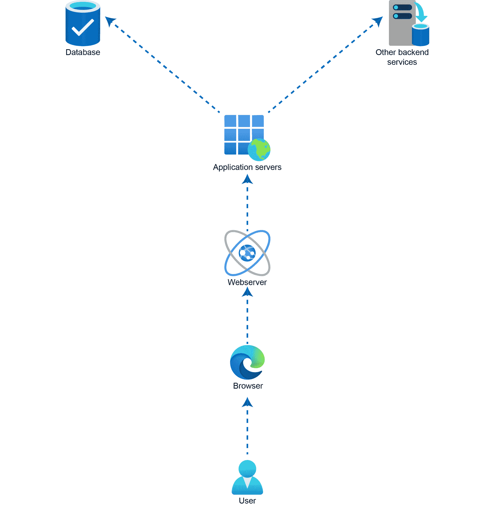
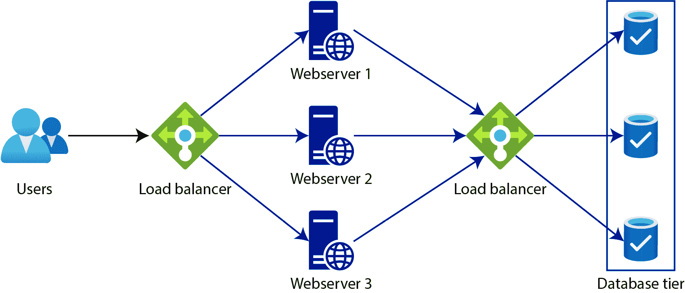
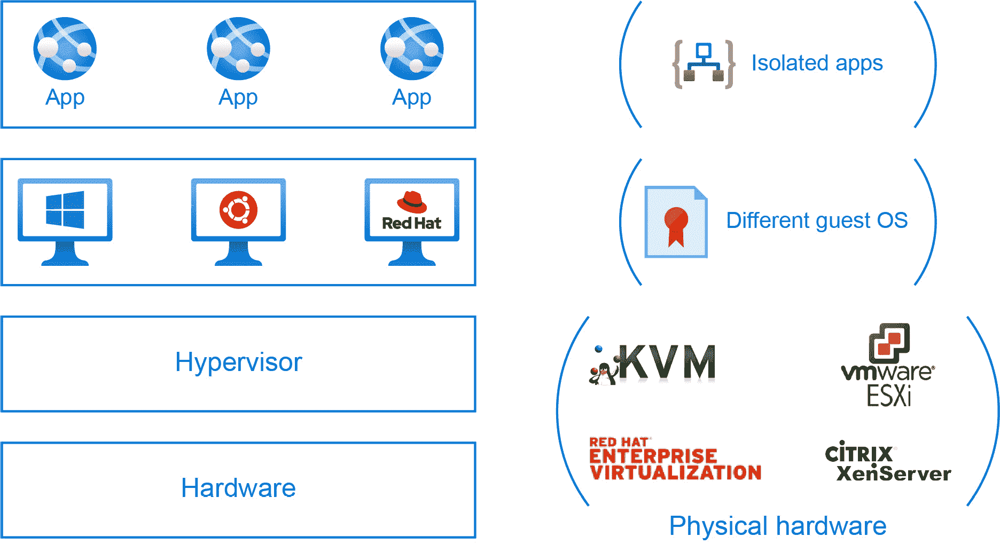
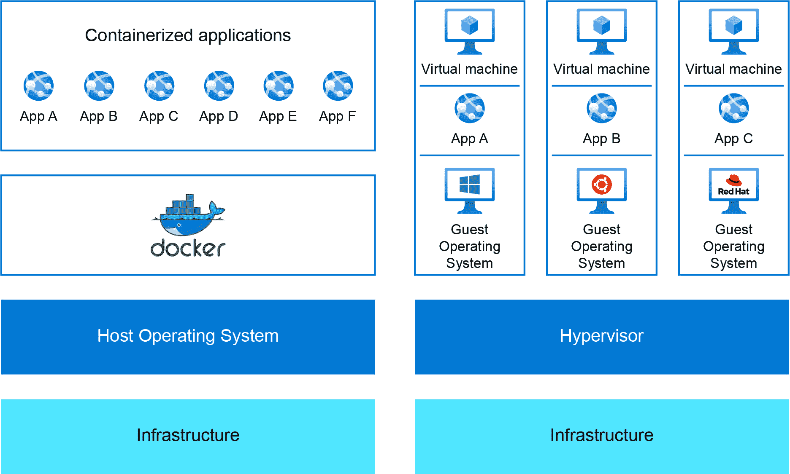
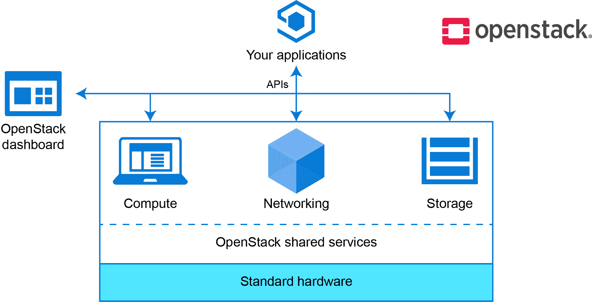
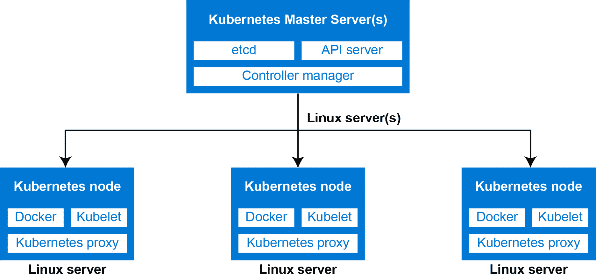
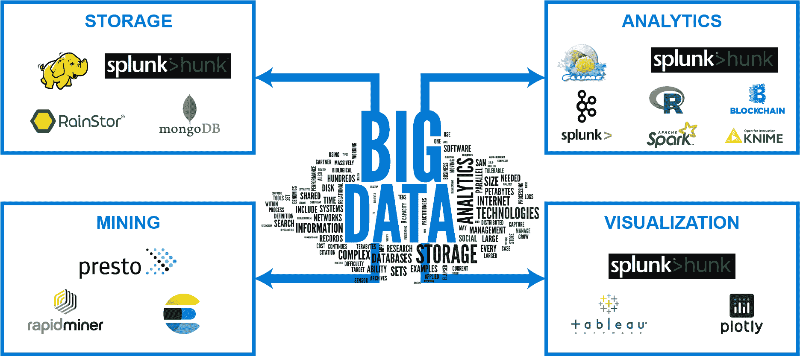
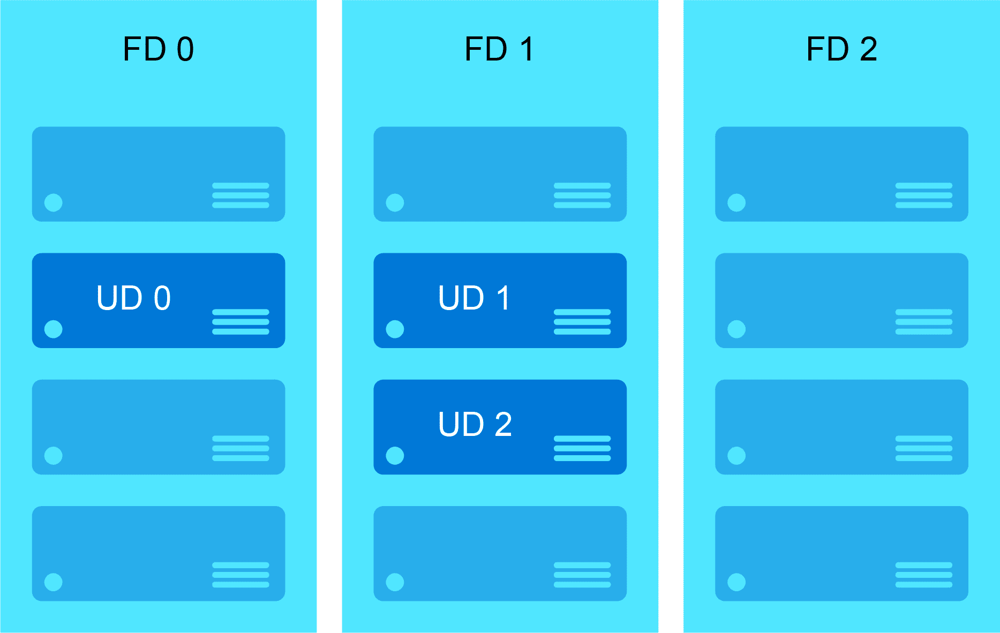

# 第一章：1. Linux：云中的历史和未来

2015 年，微软首席执行官萨提亚·纳德拉在一次演讲的结束幻灯片上写着"Microsoft ♡ Linux"。这宣布了即将发生的一系列变化，萨提亚·纳德拉希望表明微软对 Linux 和开源软件技术的兴趣。每个人都觉得这里有一些矛盾，想知道为什么微软要与开源软件技术合作。《连线》杂志报道说，纳德拉对抗争旧战斗不感兴趣，尤其是当 Linux 不管喜欢与否，已经成为当今商业技术的重要组成部分时。纳德拉告诉《连线》说："如果你不跟上新的，你就无法生存。"

在撰写本文时，超过 50%的 Microsoft Azure 由 Linux 支配。关于将现有的 Linux 工作负载迁移到 Microsoft Azure 存在许多误解，本书将帮助您了解复杂性，简化迁移过程。

我们将从 Linux 的简要历史和导致其发展的事件开始。除此之外，我们还将讨论一些 Linux 的竞争对手以及 Linux 和这些竞争对手的用例。我们将涵盖 Linux 服务器在 IT 基础设施中扮演的一些关键角色，涉及为什么云比本地解决方案更适合运行这些工作负载。由于大多数组织都采用云转型战略，对虚拟机、容器、容器编排解决方案、大数据等的需求正在增加，而微软 Azure 提供了一个运行所有这些关键工作负载的平台。

为了理解将 Linux 工作负载迁移到 Azure 的复杂性，您需要了解 IT、操作系统、Unix、Linux 和 Windows 的历史，以及云和虚拟化。本章将提供一些重要的关于 Linux 的背景信息，以便那些对它不太熟悉的人学习相关术语。

公共云比自托管环境有许多优势。我们将讨论它们，特别是 Azure 如何设计来支持 Linux 工作负载。

尽管我们将简要提及 Linux 系统的一些通常困难的方面，但您也将了解到 Azure 正在迅速发展。Azure 现在具有开箱即用的功能，将使 Linux 系统管理员的生活变得更加轻松。

本章涵盖以下关键主题：

+   Linux 的简要历史和发展

+   Linux 在 IT 基础设施中的用例

+   本地基础设施中的挑战

+   云经济学

+   迁移到 Azure 的优势

+   简化与迁移相关的复杂性

让我们从 Linux 的简要历史开始。

## Linux 的简要历史

在谈论 Linux 的历史之前，从导致其发展的事件开始是一个好主意。您可能已经看过旧计算机的图片，它们像汽车或房子一样大。现在我们生活在一个手持设备和薄客户端的世界，很难想象处理这么大的系统会有多麻烦。不仅是巨大的尺寸；过去在这些设备上运行的不同操作系统使事情变得更加复杂。每个软件都是为了服务一个单一目的而设计的，不可能在另一台计算机上运行。简而言之，我们有兼容性问题。除了这些问题，购买这些计算机的成本也是巨大的。购买计算机并不是普通人的梦想成真。

### Unix

上述缺点导致了一个名为 Unix 的项目的开发，该项目始于 20 世纪 70 年代中期，由贝尔实验室的一群开发人员发起。该项目的主要目的是为所有计算机制作一个通用软件，而不是为每台计算机制作单独的软件。该项目使用了 C 语言而不是汇编语言；它确实变得更加精致和简单。

Unix 操作系统被政府组织、大学和学校广泛采用。它存在于许多系统中，从个人计算机一直到超级计算机。尽管 Unix 的出现解决了一些问题，但它并没有解决定价问题；这些系统仍然很昂贵。

在 20 世纪 80 年代初，组织开始开发他们自己的 Unix 版本。由于多个开发分支，我们最终得到了许多不同的版本或方言。每个开发者和组织都希望创建一个类似 Unix 的自由操作系统，1983 年在麻省理工学院，理查德·斯托曼开发了 GNU 项目。该项目的目标是创建一个自由的操作系统（在许可方面，而不一定是成本）。这个项目并没有像预期的那样受到很多欢迎；然而，当 Linux 出现时，GNU 工具被采用了。

### Linux

1991 年，Linus Torvalds 在芬兰赫尔辛基大学时开发了 Linux 作为一个可自由分发的 Unix。Linus 受到安德鲁·塔能鲍姆的 Minix 操作系统的启发，这是另一个免费的个人计算机 Unix。Linus 想要编写一个可在基于 Intel 386 的个人计算机上运行的 Unix 的学术版本，以满足想要充分利用计算机的 Minix 用户。该项目最初被命名为“Freax”，这个有趣的项目最终成为了计算机历史上最大的革命之一，名为“Linux”。在 Linux 最初的日子里，Linus 在一个公共论坛（comp.os.minix）上将他的工作称为“比 Minix 更好的 Minix”。引用他自己的话：

“之后就一帆风顺了：仍然是头发乱糟糟的编码，但我有了一些设备，调试也更容易了。在这个阶段我开始使用 C 语言，它确实加快了开发速度。这也是我开始认真考虑我的狂妄的想法，要做一个‘比 Minix 更好的 Minix’。我希望有一天能在 Linux 下重新编译 gcc…”

“基本设置需要两个月的时间，但直到我有了一个磁盘驱动器（严重有 bug，但碰巧在我的机器上运行）和一个小型文件系统，才花了更长的时间。大约在 1991 年 8 月底左右，我发布了 0.01 版：它并不美观，没有软盘驱动器，也不能做太多事情。我不认为有人编译过那个版本。但那时我已经上瘾了，不想停下来，直到我能抛弃 Minix。”

如果他当时猜到 Linux 在 30 年后会被广泛采用就好了。

### Linux 版本历史

对于 Linux 的第一个版本（v0.01），没有可执行文件。要玩这个版本，你需要一个 Minix 机器来编译，因为意图是让 Minix 系统更好。1991 年，v0.02 发布，现在被称为 Linux 的第一个官方版本。我们现在看到的当前 Linux 系统为各种事情提供了巨大的支持，如用户支持、文档和软件存储库。然而，在 Linux 的早期阶段并非如此。在 v0.02 中，Bash（GNU Bourne Again Shell）和 gcc（GNU 编译器）是唯一运行的东西，主要关注点是内核开发。

在 v0.02 之后，v0.03 等等；直到 1992 年 Linux 达到 v0.95，目标是一个无 bug 的 v1.0。经过两年，中间有几次修订，v1.0 在 1994 年 3 月发布。在 v1.0 发布 25 年后，我们目前处于 v5.x，在撰写本文时，最后发布的版本是 v5.9。我们期待着很快会有 v5.10。

正如前面提到的，Linux 采用了 GNU 工具，这些工具在 Linux 的制作过程中发挥了不可避免的作用。没有这些工具，Linux 可能不会产生我们今天看到的影响。除了 GNU，伯克利软件发行版（BSD）也在使 Linux 受欢迎方面发挥了作用。尽管 BSD 最初并未在 Linux 的早期阶段被采用，但后来的版本中有一些工具是从 BSD 移植过来的。网络守护程序和其他一些实用工具都是 BSD 对 Linux 的贡献的完美例子，使得 Linux 成为了人们仰慕的对象。

### Linux 的发展和发行版

Linux 在这些年里发生了变化，由 Linus Torvalds 发起的有趣项目现在被全球数百万台计算机、智能手机、服务器甚至超级计算机使用。今天，Linux 能够运行 Web、邮件、emacs、X Windows 系统等等。Linux 不仅在本地占据主导地位，而且在 Azure 的工作负载中也占有很大的份额。目前，我们有很多专为企业使用和个人使用量身定制的 Linux 版本。

正如前面所述，Linux 并不是由单个组织开发的。它是由不同的部分或模块组合而成，如内核、GNU shell 工具、X 服务器、桌面环境、系统服务、守护进程和终端命令，所有这些都来自不同的开发人员，它们是独立开发的。如果你愿意，你可以获取内核、shell 和其他组件的源代码并进行组装。有一些项目，如 Linux from Scratch（LFS）和 Beyond Linux from Scratch（BLFS），用户可以下载这些在开源软件许可下的软件组件，进行编译，并制作自己的 Linux 版本。

尽管令人兴奋，但这需要大量的工作量，你必须投入大量时间才能使这些组件正常工作。Linux 发行版（通常称为发行版）使这项繁重的任务变得更加容易。发行版将从存储库中获取所有的代码并进行编译，最终创建一个可以在计算机上启动的单一操作系统。发行版的例子包括 Ubuntu、Fedora、CentOS、RHEL、Mint 和 SUSE Linux。一些发行版，如 RHEL、SUSE 和 Ubuntu，还有企业服务器级版本，被组织用来托管其关键任务的工作负载。

企业级 Linux 是一个全新的领域。它始于红帽公司，曾经垄断市场。然而，很快就出现了更多的竞争对手，包括 Canonical 和 SUSE，以及非商业的 CentOS。Azure 支持所有上述企业级 Linux 操作系统，因此每个组织都可以将其 Linux 工作负载迁移到 Azure。

在我们讨论将工作负载迁移到 Azure 的好处之前，让我们了解一下这些 Linux 服务器在 IT 基础设施中的常见使用案例场景，以及与本地方法相关的一些挑战。

## IT 基础设施中典型的 Linux 使用案例

如前一节所述，《Linux 的简要历史》，Linux 操作系统的客户群对于本地环境和云环境都非常庞大。在本节中，我们将讨论 Linux 在 IT 基础设施中的一些使用案例。一些事情自 Linux 采用以来就一直很重要（文件、网络、数据库等），而另一些则是随着新技术的引入而最近才被采用（例如容器化和容器编排）。这些使用案例将随着时间的推移而不断增加和发展。

### 工作站

有很多消费者更喜欢在个人电脑上将 Linux 作为日常通勤工具。这个领域主要被 Windows 和 macOS 垄断，但当 Linux 登上舞台时，情况发生了很大变化。传统上，Linux 一直是程序员和开发人员的最爱，为一般消费者提供了比 Windows 或 macOS 更多的自定义选项。因此，Linux 成为全球数百万人的首选：

图 1.1：不同的工作站发行版和图形用户界面

目前，我们有 Ubuntu、Fedora Workstation、Linux Mint、Elementary OS、CentOS 和 Arch Linux 等版本。*图 1.1*显示了不同工作站发行版中**图形用户界面**（**GUI**）的外观。

### 应用程序服务器

应用程序服务器是捆绑在一起以促进业务逻辑的计算机软件。如果我们采用三层应用程序，应用程序服务器是包括 GUI、业务逻辑和数据库服务器的组件。大多数应用程序服务器支持 Java 平台，例如 JBoss、Jetty、JOnAS、Apache Geronimo 和 Glassfish：

图 1.2：将应用程序服务器与其他服务耦合以提供端到端解决方案

在*图 1.2*中，您可以看到应用程序服务器如何与其他服务耦合，包括前端和后端服务。应用程序服务器处理来自前端和后端服务（如数据库和其他逻辑）的用户请求之间的连接。

### 数据库服务器

Linux 长期以来一直是数据库的家园。根据我们的数据需求，我们可以在 Linux 上安装关系型和非关系型数据库。术语**数据库服务器**指的是数据库应用程序和为数据存储分配的内存的组合。这些数据库可以用于记录交易，类似于 SQL Server 在 Microsoft Windows 上的工作方式：

图 1.3：负载均衡器后面的两层应用程序模型

一些常用的数据库服务包括 MariaDB、PostgreSQL、MySQL 和 MongoDB。在大多数情况下，托管在 Linux 服务器上的数据库被保留在负载均衡解决方案后面，以提供高可用性。*图 1.3*就是一个例子。

### 虚拟化

虚拟化的目的是使用称为**hypervisors**的专门软件创建虚拟机。您中的大多数人可能熟悉**虚拟机**（**VMs**）这个术语，因为这在本地环境和云中都很常见。将 Linux 作为虚拟化主机的目的与安装具有 Hyper-V 角色的 Windows Server 实例相同。VM 通常用于隔离工作负载和测试目的。流行的 Linux 虚拟化解决方案包括 KVM、RHEV、Xen、QEMU、VirtualBox 和 VMware：

图 1.4：虚拟化级别

如*图 1.4*所示，hypervisor 安装在硬件上，并使用 hypervisor 创建不同的 VM。这些 VM 中的每一个都与操作系统隔离开来，可以托管不同的应用程序。

### 容器

我们刚刚讨论了 VM 和它们在我们的 Linux 服务器上使用的 hypervisors 创建。这些服务器的占用空间将很大，并且通常会包含一些我们不需要的库和二进制文件。这导致计算资源的浪费；随着所有 VM 的部署，您的主机容量很快就会耗尽。随着容器的引入，情况发生了变化，我们不需要部署整个 VM 来托管专用服务。

容器只是一个包含特定任务所需的代码、二进制文件和库的软件包。例如，要运行 Web 服务器，我们可以部署一个虚拟机并在其上安装 NGINX。虚拟机的资源消耗会很高，并包含许多我们不需要的服务。我们可以使用容器，因此镜像只包含运行 NGINX 服务器的代码，而不包含其他内容。这意味着轻量级镜像和快速部署。

在虚拟机的情况下，我们使用 hypervisors 来运行它们；在容器的情况下，我们使用容器运行时引擎。两者的比较如*图 1.5*所示。一些常见的例子包括 Docker（最常用的），Runc，Rkt（已不再开发），以及 Mesos：

图 1.5：容器与虚拟机的比较

目前，我们为每项服务都提供了容器镜像，包括 NGINX、MySQL 和 Apache。所有主要的软件包都已移植。

### 云计算

Linux 可以用于托管诸如 OpenStack 之类的云操作系统解决方案。我们可以在 Linux 服务器上安装 OpenStack，以托管一个云环境（私有和公共），以管理包括计算、存储和网络在内的大量底层资源。可以将其视为 Azure Stack，在其中您可以在自己的数据中心中运行 Azure。类似地，您可以在自己的数据中心中托管一个云环境，供用户使用 OpenStack 部署服务：

图 1.6：OpenStack 在 Linux 上运行

OpenStack 使用许多 API，用户可以使用这些 API 跟踪、管理和监控其部署。*图 1.6*显示了 OpenStack 在 Linux 上运行的基本架构，作为部署的平台。

### 容器编排

随着容器的引入，许多组织正在从单块架构转向微服务架构。随着容器数量的增加，要在大规模上管理它们并不容易。这就是容器编排工具如 Kubernetes 出现的原因。我们可以在 Linux 机器上安装 Kubernetes 服务，并将 Linux 和 Windows 工作节点添加到其中。主节点将在 Linux 服务器上运行，并作为集群的管理平面。*图 1.7*显示了 Linux 节点如何添加到 Kubernetes 主节点的高级表示。类似地，我们也可以创建一组 Windows 节点，并将其添加到 Kubernetes 集群中：

图 1.7：Kubernetes 集群中的 Linux 工作节点

Kubernetes 的另一个发行版是由 Red Hat 开发的 OpenShift。不同供应商发布了许多 Kubernetes 发行版，都旨在进行容器编排。事实上，已经开发了专门考虑 Kubernetes 的 Linux 发行版，例如 Rancher 的 k3OS。容器编排是一个蓬勃发展且不断增长的领域，我们甚至可以单独就这个主题写一本书。

### 大数据

我们从简单的例子开始，扩展到复杂的场景，比如在 Linux 上进行大数据处理。您可以在 Linux 上安装诸如 Apache Hadoop 之类的工具，然后进行大数据分析。由于 Azure Synapse Analytics 或 Azure HDInsight 等托管云服务的可用性和支持不同，我们并不是在每个组织中都能看到这种情况。尽管如此，如果您想在 Linux 上实现大数据分析，是可以做到的。*图 1.8*显示了数据科学家和大数据分析师使用的大量工具列表，所有这些工具都可以在 Linux 上安装：

图 1.8：用于大数据分析的工具

如前所述，使用 Linux 进行大数据分析是一个很少见的场景，但是一些客户确实喜欢在 Linux 上安装某些分析工具，如 Splunk。

在本节中，我们已经讨论了一些常见的情景，但这并不意味着用例仅限于这些。随着几乎每天都有新技术的引入，潜在的用例将不断扩展。我们探讨了这些特定的用例，以证明 Linux 可以处理各种各样的情况，从基本功能，如工作站，到容器编排和大数据。

尽管本地基础设施也可以支持所有这些场景，但这种方法也存在一些缺点。这是每个组织云之旅的推动力。让我们看看这些挑战是什么，以及云是如何缓解它们的。

## 本地基础设施中的挑战

在本地托管基础设施是非常具有挑战性的，因为需要合格的人员和复杂的网络。传统方法已经持续了很长时间。随着云计算的引入，组织开始意识到他们几十年来面临的挑战如何可以通过云计算来解决。在我们看云计算的好处之前，让我们了解一下本地托管挑战的根本原因：

+   **扩展**：这是主要的挑战之一。很难实现一个可以根据不同的流量进行扩展和收缩的解决方案。每当需要更多资源时，您可以添加更多服务器（物理或虚拟），并在不再需要时终止它们。然而，在这种情况下资源利用并不是最优化的。随着云的引入，扩展变得非常容易；您只需指定扩展条件（CPU％，内存％等），云提供商将负责扩展本身。您永远不知道明年您的业务会走向何方，而 Microsoft Azure 可以帮助您随着业务的发展扩展您的基础设施。

+   **敏捷性**：敏捷性是快速反应的能力。在 Microsoft Azure 中，您可以快速分配和取消分配资源，以响应业务需求的变化。所有服务都是按需自助提供的，这意味着如果您需要一个新服务器，它可以在几秒钟内部署。在本地托管中，如果我们需要一个新的物理服务器，获取一个的过程非常复杂。您可能需要要求您的硬件提供商发货硬件，对其进行许可，打补丁，然后安装所有必需的软件，使其适合运行您的工作负载。因此，我们至少需要 2-3 周的时间表，这与 Microsoft Azure 提供的敏捷性形成对比。即使在本地部署新的虚拟机，您也需要确保您的主机机器有足够的资源来运行新的虚拟机，否则您可能需要购买一个新的服务器。

+   **技能**：管理自己的数据中心所需的技能非常苛刻，很难找到专业人士来照顾它。除了基础设施管理，您还需要考虑数据中心的安全方面。为此，您可能需要雇佣更多的安全专业人员，使您的数据中心更加安全。员工人数的增加是组织的另一项成本。

+   **安全性**：在前面的观点中，我们注意到雇佣更多专业人员会增加组织的成本。即使成功雇佣了人才，由于威胁不断变化和不断发展，很难训练员工应对每一种可能的安全威胁。在本地环境中管理安全性以及如何应对新威胁仍然是一个挑战。大多数组织只有在受到威胁后才实施预防措施。事发后，你将需要雇佣网络取证专业人员进行调查，这又是对组织的额外开支。

这些是在本地工作可能具有挑战性的主要原因之一。随着云的引入，组织可以更多地专注于实现业务目标，而不是浪费时间在机架堆叠、软件打补丁和其他耗时的 IT 管理工作上。

在接下来的部分，我们将涵盖云经济学，深入探讨云的优势以及如何解决前述和其他未提及的挑战。

## 云经济学

拥有数据中心并不是典型公司的核心业务。虽然 IT 部门可能会想要拥有他们自己可以设置和物理互动的服务器，但这可能不是你的首席财务官想要做的事情。拥有服务器不仅会显示在资产负债表上作为资本支出，而且设施、电力、保险等成本也会在总运营成本方面累积起来。如果你问任何 IT 经理在他们自己的数据中心为一个应用程序购买、设置、运行和处理基础设施的成本是多少，他们很可能不知道，甚至不敢猜测。

在意识到自己运营数据中心的成本有多高之后，将基础设施外包给托管提供商听起来是个好主意。多客户数据中心肯定比单客户数据中心更具成本效益。通过扩大规模，可以更容易地通过在所有或许多客户之间共享基础设施的部分来节省成本。到 2020 年底，全球有成千上万个专业运营的共享托管数据中心——我们如何知道选择哪一个，哪一个将在明年倒闭？

业务软件的规模和复杂性增加了，应用程序收集和处理的数据量也增加了。这导致对计算能力和存储的需求越来越大，自然也增加了基础设施成本。不断增加托管环境的成本并不是你的首席财务官会在较长时期内容忍的事情。

### 规模带来了好处

许多托管数据中心提供商正在部分将自己的基础设施迁移到公共云，部分原因与他们的客户相同：公共云基础设施在区域、数据中心和服务器数量方面已经变得如此庞大，以至于在优化成本方面的规模和功能真的很难与之竞争。对于传统数据中心和托管提供商，通常不可能仅在实际需要容量的时候支付费用，例如在办公时间内。

公共云由于其庞大的规模可以提供基于消费的定价。他们可以与所有客户共享区域和全球资源。此外，他们能够对基础设施进行大规模投资并使用定制组件。在许多情况下，他们还可以通过选择有利条件的地点来优化运营成本，比如寒冷的气候有助于冷却数据中心；而且，数据中心产生的热量可以用来供暖附近的住宅。

公共云的另一个值得一提的好处是安全性方面。让我们来看看 Azure：它使用微软的全球网络进行 Azure 内部和外部的所有连接。微软还运营各种其他基于云的服务，如 Microsoft 365 和 Xbox，这些服务会收到来自互联网的大量不必要的流量。这有其好处；例如，一些行为不端的 Xbox 用户试图对另一个 Xbox 用户进行 DDoS 攻击，微软会注意到并全球化地进行应对，确保 Azure 不受影响。

通过使用公共云，您可以节省时间和金钱，无需雇佣自己的数据中心团队，也无需支付托管提供商来做这些工作。它还可以让您在不必承诺长期合同的情况下实现几乎无限的可伸缩性。

迁移到公共云并不意味着您需要一次性完成所有工作。您可以选择混合方法，留下一些应用程序和数据，并在环境之间建立连接。

### 许多可用的服务

为了更好地理解迁移策略，了解各种可用的云服务是有用的。

像 Outlook 和 Gmail，或者 OneDrive 和 Google Drive 这样的云服务，都是**软件即服务**（**SaaS**）的很好的例子。大多数面向消费者的云服务，如 Facebook、Instagram 和 WhatsApp，也属于这一类别。

从用户的角度来看，这些解决方案只是“存在”，可以在没有太多初始努力的情况下使用。对于典型的业务解决方案，如 Salesforce CRM 或 Microsoft 365，也是如此。即使您想要，您也无法自行安装这些服务；它们始终作为即插即用的服务提供，并且您无法看到底层基础设施。

**平台即服务**（**PaaS**）解决方案与 SaaS 有几点不同；它们需要一些安装工作和一个可以安装它们的基础设施。虽然安装是自动的，但您可能需要自己管理基础设施的一些部分。此类服务的示例包括**Azure Kubernetes Service**（**AKS**）和**Azure Red Hat OpenShift**（**ARO**）。

在迁移 Linux 服务器到 Azure 的背景下，我们专注于**基础设施即服务**（**IaaS**），这意味着您只能获得较低级别的基础设施组件作为服务。其他一切都是您自己的责任，包括配置存储和网络以及自行操作操作系统。这种类型的云服务类似于托管公司提供的典型 VM 托管服务。

## 迁移到 Azure 的好处

Typical Linux deployments in on-premises environments are based on VMs, and migrating them to Azure falls into the realm of IaaS, so they will still be VMs after the migration. For sysadmins, this means the same skills they already have and the same familiar management tools are still useful on Azure.

在 Azure 早期，一些服务并不是为 Linux 使用而设计的，用户有时会因在 Azure 上使用 Linux 的复杂性而感到沮丧。最初被命名为 Microsoft Azure 可以暗示它设计用途。自那时起，Azure 已经发展并且已经被开发得越来越友好于 Linux。

#### 注意

Linux 在 Azure 中迅速赢得了人气。2015 年，Azure 的 CTO Mark Russinovich 表示，Azure 中四分之一的 VM 实例运行 Linux。2018 年，微软云 EVP Scott Guthrie 在 ZDnet 的一次采访中透露，大约一半的 Azure VM 运行 Linux。

（[`www.zdnet.com/article/mark-russinovich-the-microsoft-azure-cloud-and-open-source/`](https://www.zdnet.com/article/mark-russinovich-the-microsoft-azure-cloud-and-open-source/) 和 [`www.zdnet.com/article/linux-now-dominates-azure/`](https://www.zdnet.com/article/linux-now-dominates-azure/)）

截至 2021 年，微软已经因其对 Linux 和开源的热爱而广为人知。微软支持许多开源项目、倡议和基金会，如 Linux 基金会。根据他们的网站（https://opensource.microsoft.com/program/）显示，微软在构建其产品和服务时已经使用了超过 15 万个开源组件。

如前所述，如今越来越多的客户正在将其现有工作负载迁移到 Azure。正如前面提到的，其中许多工作负载都是基于 Linux 的。为了促进这些迁移，微软已经为 Linux 用户开发了许多工具和服务。我们将在本书的后面更详细地介绍这些内容。

微软已经与所有主要的 Linux 供应商合作，帮助他们的客户将工作负载迁移到 Azure。这些合作的目的是开发新功能，并确保现有功能更好地集成，更不要忘记提供金钱上的好处，比如能够继续在 Azure 中使用现有的商业本地合同。

企业 Linux 公司，如红帽和 SUSE，在本地 IT 基础设施领域非常受欢迎，它们都与微软合作，创建了统一的全球支持服务，以确保他们的客户可以无忧地迁移到 Azure。

在 Azure 中，像 CentOS 和 Ubuntu 这样的社区 Linux 发行版非常受欢迎，许多公司提供商业 Linux 支持，包括 Canonical 的 Ubuntu Pro。

## 从 Linux 到 Azure 的旅程

在本节中，我们将涵盖一些典型 Linux 环境的方面，当我们考虑迁移到 Azure 时，我们应该了解这些方面。我们将介绍一些关键特性，并讨论 Azure 上可用的解决方案。我们还将在本节中提供相关的 Azure 文档链接，以使您的学习曲线变得更加平缓——文档非常全面地涵盖了 Azure 上的 Linux。

在深入技术细节之前，了解您不一定需要自己实施一切是很好的。Azure Marketplace 拥有许多基于 Linux 的解决方案，可以以一揽子方式解决您的问题。

在撰写本文时，Azure Marketplace 拥有超过 2,000 个基于 Linux VM 的镜像，而 Windows 镜像约为 800 个。Linux 显然在市场上占据主导地位。在这些镜像中，只有 14 个来自微软；其余都是由第三方 ISV 公司创建和发布的。例如，如果您想在 Linux VM 上安装 WordPress，您需要安装 Apache、PHP 和 MySQL 作为数据库。另一方面，如果您使用市场镜像，您将能够找到定制的 WordPress 镜像。这些镜像可以直接从市场部署到您的 Azure 订阅，无需手动安装 Apache、PHP 和 MySQL 服务。

您可以在这里找到 Azure Marketplace：https://azuremarketplace.microsoft.com/marketplace/。市场镜像也可以通过 Azure 命令行界面获得。镜像数量正在不断增加，同时也可以将自己的镜像发布到 Azure Marketplace，并使其对大量客户可用。

我们将从讨论集群开始，这是一个存在许多灰色地带的场景。

### 集群

简单来说，"集群"一词意味着组、群或组装。当我们在 IT 世界中谈到集群时，我们表达的是一组计算机（在这种情况下是 Linux 计算机）、多个存储组件和冗余网络连接共同形成一个高可用系统的想法。集群避免了单点故障，并提供了负载平衡和高可用性。集群乍看起来可能很复杂，因为我们必须管理多个计算资源，但本节旨在揭示集群的复杂性。

典型的 Linux 集群场景可以分为四种类型：

+   存储

+   高可用性

+   负载均衡

+   高性能

每个都使用不同的软件实现，并需要自己的架构和配置。在接下来的几节中，我们将看到 Azure 如何解决这四种情况。

### 用于存储的 Azure 共享磁盘

本地系统中的存储集群通常被认为是多个节点之间一致的集群文件系统。在使用软件解决方案时，文件系统集群通常使用 GlusterFS、GFS2 或 OCFS2 技术。对于块级存储共享，非常常见的是使用 DRBD。在 Azure 上使用这些解决方案并不简单——即使在本地系统上正确设置它们也需要高技能的系统管理员。

对于共享块存储，您可以使用 Azure 共享磁盘。这是一个相当新的功能，允许您同时将托管磁盘附加到多个 VM。这解决了与存储集群相关的许多问题。SCSI Persistent Reservations（SCSI PR）是一个行业标准，以前在运行在存储区域网络（SAN）上的本地环境中的应用程序中使用。相同的 SCSI PR 促进了将被 VM 用于读取或写入其附加磁盘的预留。共享托管磁盘需要使用群集管理器工具，如 Pacemaker，它将处理群集节点通信和写锁定。由于共享托管磁盘不提供可以通过 SMB/NFS 访问的完全托管的文件系统，因此在集群中需要 Pacemaker。

这里的一个缺点是，并非所有类型的磁盘层都可以用作共享磁盘。目前，Ultra SSD 和 Premium SSD 得到支持。如果您的 VM 使用标准 HDD 或标准 SSD，为了满足集群的先决条件或克服当前的限制，您可能需要将磁盘类型升级为 Ultra 或 Premium SSD。

有关共享磁盘的文档可在此处找到：[`docs.microsoft.com/azure/virtual-machines/disks-shared`](https://docs.microsoft.com/azure/virtual-machines/disks-shared)。我们应该注意，Azure 共享磁盘不支持所有 Linux 发行版。

### Azure Files 和 Azure NetApp Files

用于共享文件系统的解决方案是一个名为 Azure Files 的服务。这是一个易于使用的云文件系统，允许使用 Server Message Block（SMB）或 Network File System（NFS）协议挂载 Azure 文件共享。NFS 在 Linux 服务器上非常受欢迎，SMB 通常与 Windows 服务器一起使用。在“IT 基础设施中的典型 Linux 用例”部分，我们讨论了文件服务器在 IT 基础设施中发挥着至关重要的作用；Azure Files 是这一企业级云版本。这些文件共享可以在 Linux、Windows 和 macOS 系统上挂载。Azure Files 提供了一个可以与本地工作站和 VM 共享的共享空间。作为 Azure 存储的一部分，Azure Files 具有 Azure 存储支持的所有功能。在 NFS 共享方面，它的功能比 SMB 共享少。

Azure Files 可以完全替代我们在本地服务器上拥有的文件服务器角色。由于我们有能力连接到本地服务器，因此我们还可以使用 Azure Files 将数据从本地服务器移动到云服务器，并在两端都挂载相同的文件共享。相关文档可在此处找到：[`docs.microsoft.com/azure/storage/files/storage-files-introduction`](https://docs.microsoft.com/azure/storage/files/storage-files-introduction)。

Azure NetApp Files（ANF）是共享 NFS 文件系统的另一种解决方案。这是一个企业级高性能文件系统服务。NetApp 是一个非常受欢迎的存储解决方案，通常用于本地系统，现在也可以在 Azure 上使用。您可以在这里阅读更多关于该解决方案的信息：[`docs.microsoft.com/azure/azure-netapp-files`](https://docs.microsoft.com/azure/azure-netapp-files)。

ANF 支持各种性能层，根据您的应用程序的 IOPS 需求而定。由于它与 Azure 平台深度集成，因此可以用作集群解决方案的共享文件解决方案。此外，ANF 具有领先的行业认证，非常适合 SAP HANA LOB 应用程序、HPFS、VDI 和 HPC。请注意，ANF 的最小存储容量大小目前为 4 TB。

### 用于高可用性的可用性集

Azure 提供了非常简单的可用性集功能，可用于创建简单且易于使用的 HA 环境。可用性集由**故障域**（FDs）和**更新域**（UDs）组成。

FD 是 Azure 数据中心中共享公共电源、冷却和网络连接的硬件组。当我们将 VM 部署到可用性集时，Azure 会确保它们分布在三个 FD 中，因此即使 FD 1 的电源中断，FD 2 或 FD 3 中的 VM 也可以为客户提供服务。

类似地，我们有 UDs，其中 VM 以使底层硬件可以同时重新启动的方式进行分组。当 Azure 数据中心发生计划维护事件时，一次只有一个 UD 会被重新启动。默认情况下，如果部署到可用性集，VM 将分布在五个 FD 中。但是，如果您愿意，可以将此增加到最多 20 个 UD。*图 1.9*显示了 UD 和 FD 在数据中心中的映射：

图 1.9：FD 和 UD

可用性集使您可以在 Azure 上以分布式方式部署 VM，跨隔离的硬件集群。有关此功能的有用教程可在此处找到：[`docs.microsoft.com/azure/virtual-machines/linux/tutorial-availability-sets`](https://docs.microsoft.com/azure/virtual-machines/linux/tutorial-availability-sets)。

近距离放置组功能使您可以在可用性集内将选定的 VM 保持在彼此附近的距离上。这减少了可能影响您的应用程序的网络延迟。有关此功能的更多信息，请参见：[`docs.microsoft.com/azure/virtual-machines/co-location#proximity-placement-groups`](https://docs.microsoft.com/azure/virtual-machines/co-location#proximity-placement-groups)。

Pacemaker 是典型本地设置中用于集群的软件，在 Azure 上通常不需要。但是，一些迁移到 Azure 的传统解决方案基于 Pacemaker 和 DRBD，例如经过认证的 SAP on Azure 架构。

### Azure 第 4 层负载平衡

Azure 配备了非常有用的第 4 层负载平衡功能，通常可用于替代典型的本地解决方案。负载平衡是必需的，用于在多个 VM 之间分发请求和负载。本教程将指导您在 Azure 上创建和操作 Linux 负载平衡：[`docs.microsoft.com/azure/virtual-machines/linux/tutorial-load-balancer`](https://docs.microsoft.com/azure/virtual-machines/linux/tutorial-load-balancer)。

许多本地负载均衡解决方案并不适合直接迁移到云端，因此值得调查一下 Azure 负载均衡是否能满足相同的需求。特别是，如果在迁移过程中要修改应用架构，那么当前的负载均衡架构可能没有你需要的功能，或者在 Azure 上使用时可能会过于昂贵。

### Azure 上的高性能计算

最后一种集群类型，高性能计算或 HPC，非常适合在 Azure 上使用。典型的本地 HPC 解决方案非常昂贵，特别是当你不使用它们时，因为你需要全天候支付硬件费用。

Azure 提供了传统基于 CPU 的 HPC 解决方案，还有一个非常强大的基于 GPU 的高度可扩展模型。你可以使用各种存储选项在运行工作负载的节点之间共享数据。你可能还想利用基于 RDMA 的高吞吐量后端网络的好处。相关文档在这里：[`docs.microsoft.com/azure/architecture/topics/high-performance-computing`](https://docs.microsoft.com/azure/architecture/topics/high-performance-computing)。

此外，在 Azure Marketplace 上还有各种第三方 HPC 解决方案可用。

### 订阅可移植性

对于 Linux 在 Azure 上的迁移，最大的挑战往往出人意料地不是技术上的。让我们在这里停下来，思考一下你的 Linux 许可和订阅，特别是如果你使用商业 Linux 发行版，如 Red Hat Enterprise Linux 或 SUSE Linux Enterprise Server。

你知道你是否只是简单地将现有的虚拟机迁移到了公共云吗？你是否需要与 IT 采购部门或律师讨论 Red Hat 或 SUSE 的合同条款？你现在心里可能有任何问题的正确答案是：*是的，但先与 IT 采购部门核实一下*。

Red Hat 和 SUSE 都允许客户将其现有的企业订阅迁移到公共云，但你需要采取一些步骤以确保合规，并继续直接从他们那里获得支持。在 Azure 上，使用这些迁移订阅创建的 Linux 虚拟机是**自带订阅**（**BYOS**）。Red Hat 称相关计划为**Red Hat Cloud Access**，SUSE 的计划称为**SUSE Public Cloud Program**。

请注意，将现有的 Linux 订阅迁移到 Azure 意味着你将继续与 Red Hat 或 SUSE 建立虚拟机的计费关系。你可以使用微软的**按使用付费**（**PAYG**）计费在 Azure 上创建新的 Linux 虚拟机。

最后，了解 Azure 混合权益是很有用的，它允许你在自带订阅和按使用付费之间切换。这个功能正在积极开发中，截至撰写本文时，仅支持从本地迁移到 Azure 的虚拟机。在这里可以查看更多详细信息：[`docs.microsoft.com/azure/virtual-machines/linux/azure-hybrid-benefit-linux`](https://docs.microsoft.com/azure/virtual-machines/linux/azure-hybrid-benefit-linux)。

如果你使用的是 CentOS 和 Ubuntu 等社区发行版，那么前面提到的内容对你来说都不重要，因为这些发行版完全免费，但至少你今天学到了一些新知识。

## 总结

本章以 Linux 的历史开始。Linux 从一个有趣的项目跃升为企业级操作系统的飞跃令人惊讶。如今，Linux 随处可见，从高端服务器到智能手机再到智能灯泡。由于自定义的自由，有许多 Linux 的变体，称为口味或发行版；每种用例都有相应的发行版可用。如果没有一种发行版符合您的确切要求，并且您想添加更多功能，可以随意自定义和构建自己的 Linux。我们探讨了一些 Linux 的用例场景，并研究了传统 IT 在本地环境中面临的基础设施管理挑战。

每个组织都是以数字运行的。在云经济学部分，我们研究了在云中运行工作负载如何在进行资本支出与运营支出比较时获利。云的优势不仅来自成本的降低；它是我们在本地环境中遇到的所有挑战的解决方案。我们讨论了几个优势，包括容错性、高可用性、灵活性、弹性和扩展性。

可以肯定地说，你在本地环境中所做的一切都可以以某种方式迁移到 Azure。有大量高质量的文档可用，第三方 ISV 解决方案可以缩短您的实施周期。微软合作伙伴公司、微软的客户账户团队以及致力于帮助客户转移到 Azure 的微软快速跟踪团队也提供了额外的帮助。

下一章是我们深入研究这些发行版的地方，从许可部分开始，讨论一些广泛采用的发行版，最终是在 Azure 上的 Linux 体验。
