# 第二章：理解 Linux 发行版

*好东西有很多种，Linux 发行版也是如此。*

要创建一个成功的云迁移计划，您需要对您想要迁移到云中的系统的组件和变量有一个良好的理解。

在本章中，您将学习有关各种 Linux 发行版的相关术语和技术细节，以帮助您计划成功迁移到 Azure。尽管所有的发行版都是基于同一个操作系统，但每个发行版都有自己的一些小技术细节，需要详细的了解才能成功地为迁移做准备。除了介绍发行版，我们还将研究许可选项，以及免费和商业开源软件之间的区别。商业 Linux 发行版具有各种附加功能和支持选项。我们还将涵盖不同发行版的一些典型用例。

本章的最后一部分是*Linux 在 Azure 上*，它从微软认可的发行版和微软提供的支持范围开始讨论。支持由微软和 Linux 供应商共同提供。我们还将介绍 Azure 上 Linux 虚拟机的许可模型，以及每个模型对客户的潜在节省。我们将以使用 Azure CLI 进行演示来结束本章；如果您想查看 Azure 上可用镜像的列表，这将非常有用。

本章将涵盖以下主题：

+   Linux 许可和开源商业模型

+   流行的 Linux 发行版

+   Azure 上的 Linux：好处、许可模型、支持

通过本章的学习，您将学会将 Linux 订阅迁移到云的必要技巧和窍门。让我们从探讨 Linux 许可证开始我们的讨论。

## Linux 许可和开源商业模型

本节重点介绍商业 Linux 发行版。如果您只使用免费的 Linux 社区版本，如 CentOS 或 Debian，一些内容可能不适用于您。

### 开源许可证

如何从免费的东西中赚钱？要回答这个问题，我们必须回顾一下当我们说某样东西是开源时意味着什么。

Linux 发行版和 Linux 内核是开源的，但同时也受版权法保护。要使事情变得非常复杂，有许多开源许可证涵盖 Linux 发行版的不同部分。一些组件可能受到**GNU 通用公共许可证**（**GPL**）的保护，一些可能受到**Apache 许可证**（**APL**）的保护，还有一些可能受到 MIT 许可证的保护。更复杂的是，重要的是要意识到同一许可证可能有多个版本，它们可能彼此之间或与任何其他许可证都不兼容。

在这一点上，了解所有 Linux 发行版都受开源许可证保护就足够了。这意味着您有权下载 Linux 发行版中包含的所有软件的源代码。您可以对源代码做什么超出了本书的范围，因为我们不是在创建自己的 Linux 发行版。在本书中，我们不必深入研究各种开源许可证和版权法的细节。

### 企业协议

在谈论商业开源，特别是商业 Linux 发行版时，**企业协议**是您在考虑将 Linux 服务器迁移到 Azure 之前需要熟悉的术语。我们可能经常在接受这些协议之前跳过阅读条款和条件，只是简单地点击鼠标，但是重要的是要阅读它们。

商业 Linux 供应商的企业协议通常规定您同意根据他们的最新价格表支付使用他们软件的费用，并遵守您可以使用软件的地点和方式的规定。当然，它还说了很多其他事情，但由于这不是一本软件采购书籍，我们不会深入讨论这些细节。但是，与您的软件采购团队交谈以核对他们是否了解合同细节可能是有意义的。

### Linux 订阅

专有软件供应商所谓的“许可证”在 Linux 世界中可以宽泛地称为“订阅”。从技术上讲，它们当然是两回事，但在典型的销售对话中，您可能会听到有人谈论 Linux 许可证——正如我们之前所了解的那样，这些并不是您要寻找的许可证。

**订阅**实际上意味着有权下载、使用和更新商业 Linux 发行版。通常还附带有各种服务级别协议的技术支持服务。为了订阅这样的服务，您需要代表您的雇主与商业 Linux 供应商签订合同。这份合同通常被称为企业协议，通常还附带一些额外的义务。其中之一就是遵守服务订阅协议的规定。

例如，Red Hat Enterprise Linux 的订阅规则规定您只能在自己的基础设施上使用该软件。实际上，这也包括托管环境，这被视为租用的基础设施。公共云不被视为您自己的基础设施，如果您想将 Linux 服务器迁移到公共云，您需要通知 Red Hat。

SUSE 的订阅规则非常相似。正如前面提到的，最好与软件采购部门核对合同，以确保您遵守规定。

对于 Ubuntu 来说，订阅的概念有些不同；您根本不需要订阅就可以使用它。在这种情况下，订阅是指来自 Ubuntu 背后的公司 Canonical 的专业支持服务合同。除了免费的 Ubuntu Linux，Canonical 还提供了 Ubuntu Pro，他们在 Azure 上的商业 Ubuntu 镜像。

图 2.1 展示了商业和社区 Linux 发行版的许可证、订阅和支持合同之间的区别：

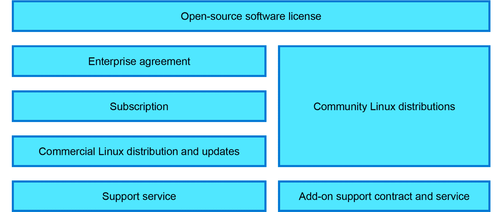

图 2.1：许可证、订阅和合同之间的区别

许可证和订阅就说到这里。让我们来看看实际的 Linux 发行版。

## 流行的 Linux 发行版

多种 Linux 服务器发行版多年来已经获得了相当稳定的市场份额。企业用户通常会根据他们使用的业务应用程序来标准化一到两种发行版。Red Hat 和 SUSE 是两家最著名的企业级 Linux 开发公司和供应商，它们在 Linux 操作系统领域都提供类似的产品。如今，第三家商业 Linux 供应商 Canonical 也在同一领域竞争。他们的 Ubuntu Linux 曾经以开发者工作站发行版而闻名，但它很快也以生产服务器操作系统的身份迅速赢得了人气。结合 Canonical 的商业支持服务，Ubuntu Linux 是两家领先的企业级 Linux 发行版的一个很好的替代品。

Red Hat 成立于 1993 年，当时 Bob Young 和 Marc Ewing 联手创建了*Red Hat Software*。1999 年，Red Hat 在**纽约证券交易所**（**NYSE**）上市。在 2019 年被 IBM 收购之前，Red Hat 收购了数十家小型开源公司，如 Cygnus（跨平台工具）、JBoss（Java 中间件）、Qumranet（KVM 虚拟化技术的创造者）、Makara（PaaS 平台，OpenShift 的第一个版本）、ManageIQ（混合云编排器，CloudForms 的第一个版本）、InkTank（Ceph 存储技术的创造者）、Ansible（一种流行的自动化工具包）和 CoreOS（用于容器的小型 Linux 发行版）。

完整的收购清单包括 30 多家公司，你们大多数可能都没有听说过，因为这些品牌已经与 Red Hat 的其他产品线合并。**Red Hat Enterprise Linux**（**RHEL**）是目前非常受欢迎的平台，特别是对于 Java 中间件 JBoss 产品，以及商业 Kubernetes 打包 OpenShift，因为它们都是由 Red Hat 发布的。

SUSE 成立于 1992 年，比 Red Hat 早一年，并成为第一家向企业客户推广 Linux 的公司。Rolard Dyroff、Burchard Steinbild、Hubert Mantel 和 Thomas Fehr 最初将公司命名为*Gesellschaft für Software und Systementwicklung mbH*，并使用了缩写 SuSE，这源自德语短语*Software- und System-Entwicklung*，意思是*软件和系统开发*。他们的产品的第一个版本是当时流行的 Slackware Linux 发行版的扩展。1996 年，他们发布了基于已经被遗忘的 Linux 发行版 Jurix 的第一个 Linux 发行版，并偏离了 Slackware。

多年来，SUSE 已经被收购并多次更名，最著名的是 2003 年被 Novell 收购和 2018 年被 EQT Partners 收购。SUSE 本身在 2017 年收购了**惠普企业**（**HPE**）的 OpenStack 和 CloudFoundry 资产，以及 Rancher Labs——一家以其 Kubernetes 管理平台而闻名的公司——在 2020 年。如今，**SUSE Linux Enterprise Server**（**SLES**）是 SAP 系统部署的非常常见的平台。

对于非商业用途来说，Ubuntu 似乎是明显的赢家，如果您看一下部署数量的话。Ubuntu 基于 Debian，曾经是非常受欢迎的用于服务器工作负载的 Linux 发行版。

CentOS 也很受欢迎，因为它与 RHEL 完全兼容，通常由 RHEL 专业人员在他们的业余项目和其他没有企业级预算的工作中使用。

多年来，有许多受欢迎的 Linux 发行版用于桌面使用，但它们在服务器使用情况下并没有获得流行。在本书的范围内，我们不会涵盖这些内容，因为 Azure 上的 Linux 通常指的是使用服务器操作系统。

在接下来的部分中，我们将详细介绍在 Azure 上使用免费和商业 Linux 发行版的细节，特别关注 RHEL、SLES 和 Ubuntu Pro。然而，大部分内容也适用于它们的免费版本 CentOS、openSUSE 和 Ubuntu。

## Azure 上的 Linux

在*第一章* *Linux：云中的历史和未来*中，我们提到 Microsoft 提出了“Microsoft ♡ Linux”的口号。在 Azure 上，Linux 主要指的是在 Azure 上受支持的不同 Linux 发行版。Microsoft Azure 支持常见的 Linux 服务器发行版，包括 RHEL、CentOS、Ubuntu、Debian、SLES、openSUSE、Oracle Linux 和 Flatcar Container Linux。您可以在此着陆页上找到最新的列表以及有关 Azure 上 Linux 的更多信息：[`azure.com/linux`](https://azure.com/linux)。

如果您正在寻找的操作系统不在列表中，或者您需要定制或预配置的映像，欢迎访问 Azure Marketplace，在那里您可以浏览数百个可能符合您需求的映像。

如果 Azure 市场的映像不符合您组织的标准或要求，您可以创建并上传自己的映像到 Azure：

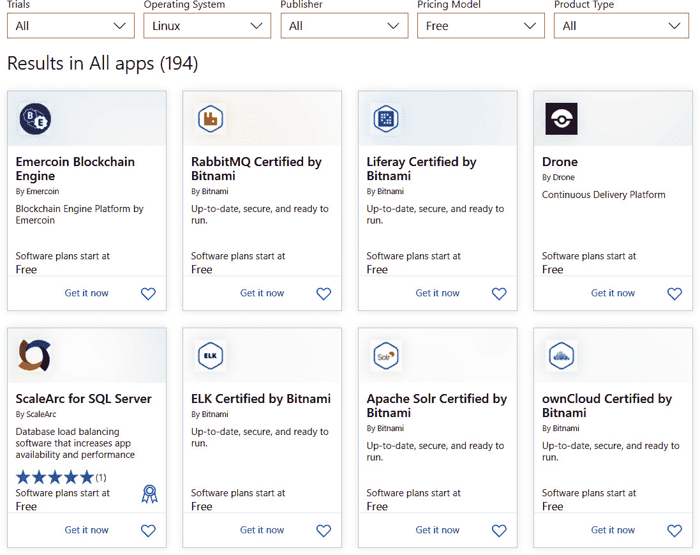

图 2.2：Azure 市场

*图 2.2*是 Azure 市场的视图，显示了一些不同类型的预配置映像。

### 在 Azure 上 Linux 的好处

在云中部署与您在本地部署的方式没有区别；您将能够以与本地服务器相同的方式在云中使用 Linux 操作系统。您可以使用您已经熟悉的命令和工具，并根据需要添加更多软件包。

您可以使用云初始化、Azure 自动化 Runbooks 和 Azure 资源管理器模板的 Azure 自定义脚本扩展等开箱即用的功能来自动化部署阶段的配置管理。通过使用这些工具，管理员将能够节省在冗长和重复的配置管理任务上所花费的时间。

由于环境已经设置好并准备好登录，您无需像在本地虚拟化程序中创建虚拟机时那样经历冗长的安装过程。在 Azure 虚拟机创建过程中将提供凭据，一旦部署了虚拟机，您就可以登录并开始使用虚拟机。

由于所有部署都与 Azure 监视器集成，您可以监视与虚拟机相关的所有指标，如 CPU 使用率、磁盘写入、磁盘读取、网络出站、网络入站等。Azure 公开了指标 API，因此您可以进一步利用开发的仪表板来监视您的关键工作负载的指标。除了指标，Azure 还提供了一个可以安装在您的 Linux 虚拟机上的代理，称为**OMS 代理**。使用此代理，您可以将 syslog、auth 日志和自定义日志（如 Apache 日志）传送到 Azure 日志分析工作区。一旦数据被传送，您可以使用**Kusto 查询语言**（**KQL**）来分析日志。

从安全的角度来看，您可以使用 Azure 安全中心改善基础架构的安全姿态。Azure 安全中心可以检测威胁，并为您的部署提供策略洞察和建议。

此外，我们现在可以利用 Azure Active Directory 登录 Linux 虚拟机。这消除了在每台 Linux 机器上管理本地用户帐户的管理开销和安全风险；用户可以使用其企业凭据登录 Linux 虚拟机。

从这个非详尽的优势清单中，我们可以看到在 Azure 上的 Linux 提供了最佳的两全其美；您既可以获得 Linux 的所有定制功能，同时也可以获得 Microsoft Azure 提供的所有功能和好处。

Azure 上的 Linux 非常通用；“在 Azure 上”后缀可以分别应用于每个发行版。例如，您应该将“Red Hat on Azure”理解为在 Azure 上支持的所有 Red Hat 产品。您可能认为 RHEL 是 Red Hat 在 Azure 上唯一提供的产品，但您也可以找到其他产品，如 Azure Red Hat OpenShift、Red Hat JBoss Enterprise Application Platform、Red Hat Gluster Storage、Red Hat OpenShift Container Platform、Red Hat CloudForms 和 Red Hat Ansible Automation。您可以看到 Red Hat 的所有主要产品线都可以在 Azure 上使用；这清楚地说明了大型组织如何将其产品推广到 Microsoft Azure。您将看到其他供应商采用类似的方法，比如“SUSE on Azure”和“Ubuntu on Azure”，它们代表了在 Azure 上由各自供应商支持的产品。

#### 注意

查看 Azure 上以下供应商提供的产品线：

+   在 Azure 上可用的 Red Hat 产品线：[`Azure.com/RedHat`](https://Azure.com/RedHat)

+   在 Azure 上可用的 SUSE 产品线：[`Azure.com/SUSE`](https://Azure.com/SUSE)

+   Azure 上的 Ubuntu：[`Azure.com/Ubuntu`](https://Azure.com/Ubuntu)

Microsoft 建议在 Azure 中使用认可的 Linux 发行版来托管生产工作负载。这样做的理由是，所有认可的图像都由全球最知名的 Linux 供应商维护，如 Red Hat、Canonical、SUSE 等；基本上，认可的图像是由这些供应商发布的图像。完整的 Linux 支持矩阵可以在[`docs.microsoft.com/troubleshoot/azure/cloud-services/support-linux-open-source-technology#linux-support-matrix`](https://docs.microsoft.com/troubleshoot/azure/cloud-services/support-linux-open-source-technology#linux-support-matrix)上查看。

您还可以将自己的图像带到 Azure，如果您不想使用认可的图像。您甚至可以使用基于 Hashicorp Packer 的 Azure Image Builder 工具来定制 Azure 图像：[`docs.microsoft.com/azure/virtual-machines/image-builder-overview`](https://docs.microsoft.com/azure/virtual-machines/image-builder-overview)。

这里需要注意的一点是，Microsoft 仅为认可的发行版提供支持。话虽如此，让我们来看看 Azure 上 Linux 的技术支持是如何安排的。

### Linux 支持范围

Microsoft 为 Azure 上认可的 Linux 发行版提供支持，如果需要与供应商合作，根据情况将代表您与供应商合作。例如，如果 Ubuntu 18.04 LTS 的图像出现问题，微软无法解决，他们将联系 Canonical（Ubuntu 的发布者）来检查情况。在与 Microsoft 支持合作时，以下是一些关键点需要牢记。

Microsoft 的技术支持团队主要可以帮助您解决 Linux 故障排除方案，例如，如果您无法通过 SSH 连接到 Linux VM，或者无法安装软件包。与 Linux 供应商相关的问题可能需要与 Linux 供应商合作解决。为此，微软与 Red Hat、SUSE 和 Canonical 等 Linux 供应商签订了联合支持和工程协议。

在与 Microsoft 支持合作时，始终让您的 Linux 管理员参与其中。在大多数故障排除方案中，您可能需要超级用户（通常称为**sudo**）权限，只有管理员才有这些权限。

Linux 提供了比其他任何操作系统更多的定制空间。一些组织使用无法得到 Microsoft 支持的自定义 Linux 内核或模块。尽管内核相关的问题是通过与 Linux 供应商合作解决的，但在这种情况下，即使供应商也可能无法提供帮助，因为他们通常只能支持自己发布的官方内核版本。

Azure Advisor 和 Azure Security Center 为我们的工作负载提供了不同的安全、成本、高可用性和性能相关的建议。遵循这些建议是在 Azure 上有效运行工作负载的最佳实践之一。然而，对于性能调优和优化，客户可能需要联系供应商解决问题。

正如前面提到的，Microsoft 支持帮助您解决问题。这适用于免费的 Azure 支持，官方称为“基本支持”，适用于所有 Azure 客户。如果您需要帮助设计、创建架构或在 Azure 上部署应用程序，您可以选择购买额外的支持，范围从开发支持到业务关键企业支持计划。付费计划包括各种级别的设计和架构支持，您可以在这里了解更多信息：[`azure.microsoft.com/support/plans/`](https://azure.microsoft.com/support/plans/)。

获取有关 Azure 设计、架构和其他技术问题的帮助的另一种选择是与微软的销售和合作伙伴团队进行交流，即**客户成功单位**（**CSU**）和**一个商业合作伙伴**（**OCP**）。这些团队能够为指定的商业客户和合作伙伴提供帮助。需要记住的是，这些组织并不是微软支持的替代品，而是微软全球销售和营销组织的一部分。要与 CSU 和 OCP 团队的技术人员联系，您应该联系您指定的微软客户经理。

第三种非常受欢迎的选择是与微软合作伙伴的大型网络进行交流。他们能够为 Azure 总体以及 Azure 上的 Linux 提供广泛的咨询、咨询、实施和运营支持。这些合作伙伴中的许多也与本章提到的一些 Linux 供应商合作。查找微软合作伙伴的最简单方法是使用微软解决方案提供商搜索工具：[`www.microsoft.com/solution-providers/home`](https://www.microsoft.com/solution-providers/home)。

#### 注

除了认可的 Linux 发行版支持外，微软还为某些开源技术提供生产支持，如 PHP、Java、Python、Node.js、MySQL、Apache、Tomcat 和 WordPress。此列表可能会有所变化，可用的技术支持可能非常有限。

现在我们已经熟悉了 Azure 技术支持的范围，让我们来看看 Azure 的定价是如何工作的。

### Azure 上的许可证

在 Azure 中，有三种许可模型：**按使用量付费**（**PAYG**）、Azure 混合权益和预付费。我们将看看这些模型的差异以及其优势，首先从 PAYG 模型开始。

### 按使用量付费模型

顾名思义，在 PAYG 模型中，客户会根据他们使用资源的时间来收取许可费用。例如，如果您运行一个 VM 12 小时，您将会看到以下费用：

+   12 小时的计算（包括 vCPU、RAM 等）。

+   12 小时的 Linux“许可证”或“订阅”使用（如果您使用需要付费订阅的发行版，如 RHEL 或 SLES）。

+   公共 IP 地址的成本（如果需要）。

+   出口网络流量的成本。

+   存储成本。

通常，在 Azure 定价计算器（[`azure.microsoft.com/pricing/calculator/`](https://azure.microsoft.com/pricing/calculator/)）中，当您选择运行 RHEL 或 SLES 的 Linux VM 时，您将能够看到许可成本。如果您使用 Ubuntu/CentOS，则不会有许可成本。在*图 2.3*中，您可以看到对于 RHEL VM，在 PAYG 下有计算和许可成本。计算是针对 730 小时的消耗：

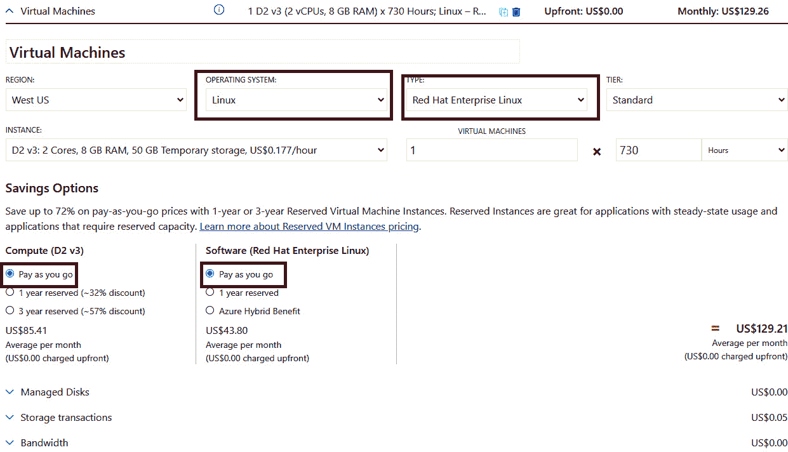

图 2.3：来自 Azure 定价计算器的 RHEL 许可成本

另一方面，如果我们选择 Ubuntu/CentOS，许可成本将不复存在，如*图 2.4*所示：

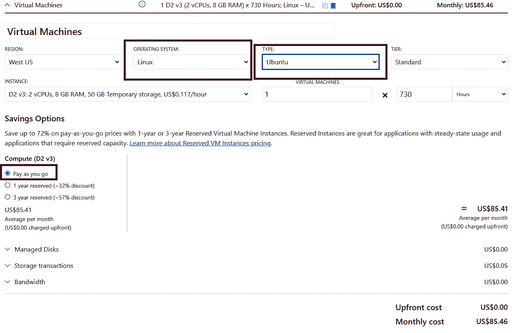

图 2.4：Ubuntu 不适用许可成本

总之，在 PAYG 中，客户根据 VM 运行的时间付费。当 VM 被取消分配时，计算核心不被利用，这意味着不会因计算核心或许可证而产生费用。这种模型非常适合部署用于测试并且将在短时间内运行的 VM，但如果您的 VM 全年无休地运行，这可能不是理想的模型，因为许可成本将根据使用的小时数不断累积。在这些情况下，最好选择 Azure 混合权益或预付费计划以节省成本。

### Azure 混合权益

如果您重新查看*图 2.3*中的定价计算器的截图，您会发现在**软件（Red Hat Enterprise Linux）**下有另一个选项，即**Azure Hybrid Benefit**。以前，Azure Hybrid Benefit 是指 Windows Server 和 SQL VM 的许可优惠，客户可以将自己的 Windows Server 和 SQL 许可证带到 Azure 中。使用这种方法，许可成本被抵消，客户可以利用他们已经从软件保障或大量许可购买的许可证。2020 年 11 月，Azure Hybrid Benefit 正式适用于 Linux。

使用 Azure Hybrid Benefit，您可以将现有的 RHEL 和 SLES 服务器迁移到 Azure，并使用**自带订阅**（**BYOS**）计费。通常，在 PAYG 模式下，您需要支付基础设施（计算+存储+网络）成本和软件（许可证）成本。但是，在这里，由于您自带订阅，软件成本被抵消，您只需支付基础设施成本，这大大降低了在 Azure 中托管的成本。您可以在不中断服务的情况下将现有的 VM 转换为 BYOS 计费模式，这也意味着根本不需要重新部署这些服务。当您的 BYOS 到期时，您可以根据需要将这些 VM 转换回 PAYG 模式。

Azure Marketplace 上的所有 RHEL 和 SLES PAYG 映像都有资格享受 Azure Hybrid Benefit。但是，如果您选择自定义映像或来自 Azure Marketplace 的任何 RHEL/SLES BYOS 映像，则这些映像不符合该优惠。

Red Hat 客户可以按照以下说明开始使用 Azure Hybrid Benefit。在开始之前，有一些先决条件：

+   您应该拥有适用于 Azure 使用的活跃或未使用的 RHEL 订阅。

+   您应该已经启用了一个或多个适用于 Azure 使用的活跃或未使用的订阅，使用了 Red Hat Cloud Access 计划。Red Hat Cloud Access 是 Red Hat 提供的一个计划。使用此计划，您可以在诸如 Microsoft Azure、Amazon Web Services 和 Google Cloud 等 Red Hat 认证的云提供商上运行符合条件的 Red Hat 产品订阅。

如果您符合先决条件，下一步就是开始使用 Azure Hybrid Benefit。以下是您需要遵循的步骤：

1.  选择一个活跃或未使用的 RHEL 订阅，并在 Azure 中启用它。这是通过 Red Hat Cloud Access 客户界面完成的。Red Hat 客户可以通过登录[`www.redhat.com/technologies/cloud-computing/cloud-access`](https://www.redhat.com/technologies/cloud-computing/cloud-access)来访问此界面。只有我们在此处注册的订阅才有资格使用 Azure Hybrid Benefit。

1.  链接订阅是主要步骤；我们可以在创建阶段指定 VM 使用 RHEL 订阅，或者可以转换现有的 VM。

1.  在创建 VM 时，您可以选择使用现有的 RHEL 订阅，如*图 2.5*所示：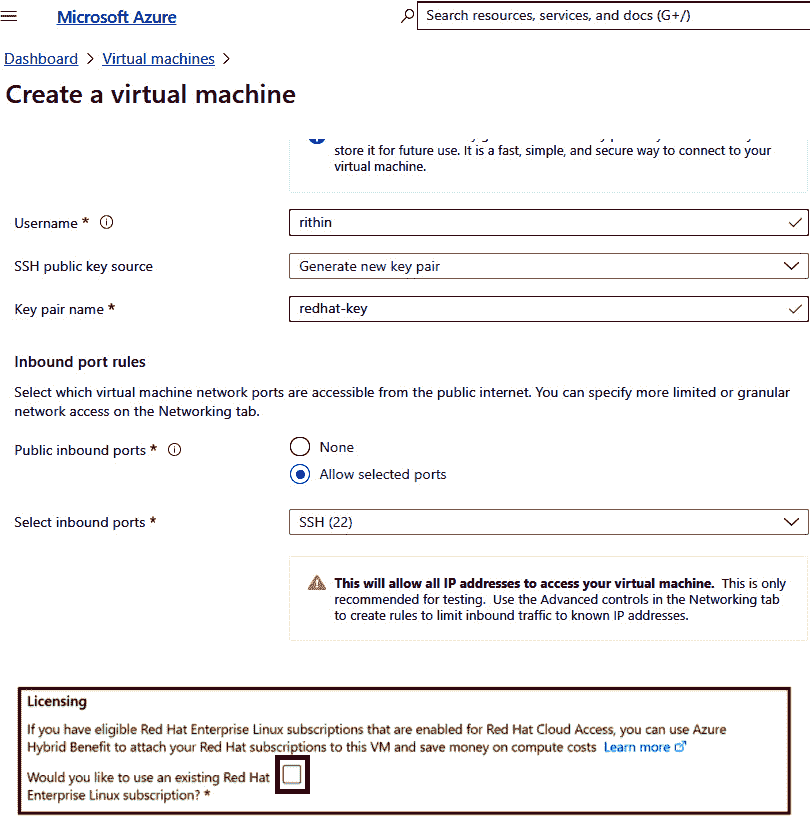

图 2.5：在 VM 创建期间启用 Azure Hybrid Benefit

1.  我们还可以将现有的 VM 转换为 Azure Hybrid Benefit，而无需重新部署。这可以通过 VM 的**配置**窗格来实现，如*图 2.6*所示：

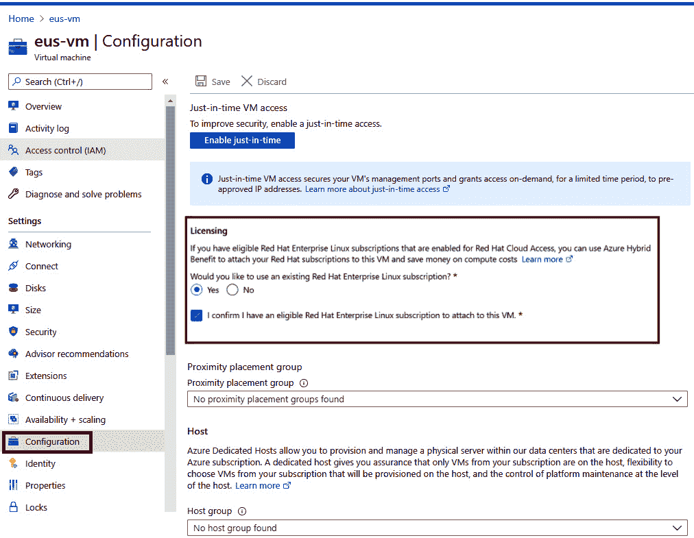

图 2.6：将现有 VM 转换为 Azure Hybrid Benefit

完成此过程后，在您的 Azure 使用中，您会发现 VM 的成本已经大幅下降。如果您希望以编程方式执行此操作，可以使用 CLI 和 ARM 模板将 RHEL 订阅附加到 Azure VM 中。

如前所述，客户可以在其 RHEL 订阅到期时自由切换回 PAYG 模式。切换回 PAYG 模式也是通过 VM 的配置窗格完成的。

对于 SUSE 客户，附加的过程基本相同；然而，使用 SUSE 订阅的注册是通过 SUSE 公共云计划完成的。

这个模型非常适合那些拥有来自各自供应商购买的活跃或未使用的 RHEL 或 SUSE 订阅，并希望在云中利用这些订阅以节省 PAYG 模型的客户。

在这个模型中，我们使用了从 Red Hat 或 SUSE 购买的订阅，并将其附加到我们的 Azure 订阅中使用。然而，在预付模型中，我们将直接从微软购买 Red Hat 或 SUSE 软件计划。

### 预付 Azure 软件计划

Azure 定价计算器的节省选项部分中“软件（Red Hat 企业 Linux）”下的最终选项是 1 年预留。*图 2.7*展示了选择 Red Hat 的 1 年软件计划：

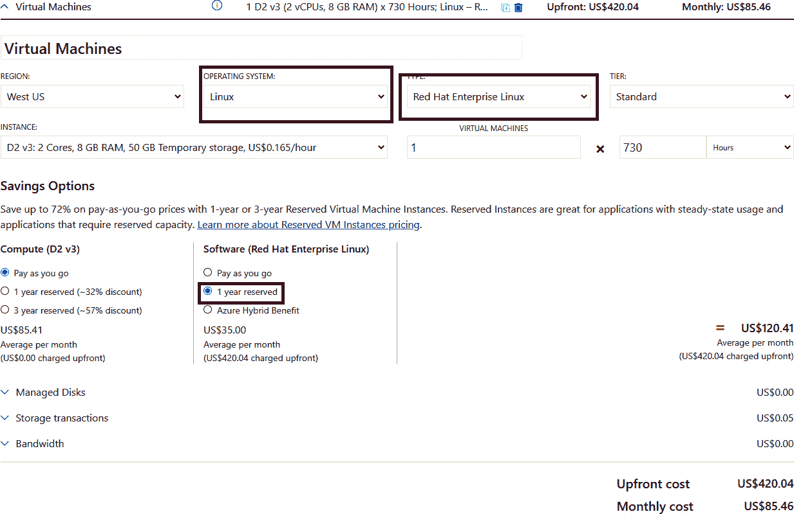

图 2.7：从 Azure 定价计算器计算软件计划成本

在这个模型中，客户可以直接从微软购买 1 年期的软件计划，如果需要，还可以续订。这里的一个注意事项是计划金额应该提前支付。在*图 2.7*中，您可以看到这已经在成本中提到；一旦客户从 Azure 购买了软件计划，该费用将被添加到下一张发票中，作为下一年的预付费用。

在这里要牢记的另一个关键点是，不允许取消或交换这些计划。这意味着您应该为您的工作负载购买正确的计划。例如，如果您的产品是适用于 2-4 个 vCPU 的 SLES Priority，您应该购买适用于 2-4 个 vCPU 的 SLES Priority。如果您错误地购买了适用于 1-2 个 vCPU 的 SLES for HPC 而不是适用于 2-4 个 vCPU 的 SLES Priority，那么您将无法获得好处，也无法退货或交换此计划。在这里的建议是了解您的工作负载并相应购买。

软件计划可以从 Azure 的预留窗格中购买，这正是我们购买 Azure VM、数据库等预留实例的地方。好处将自动应用于匹配的工作负载，无需映射。

例如，如果您有三个具有 4 个 vCPU 的 SLES Priority 实例，那么适合您的计划是适用于 2-4 个 vCPU 的 SLES Priority。根据您购买的数量，折扣将自动应用于实例。假设我们购买了两个适用于 2-4 个 vCPU 的 SLES Priority 计划；那么三个 VM 中的两个将获得好处，剩下的一个将保持 PAYG 模型。如果您需要第三个的成本也由计划覆盖，那么您需要购买另一个相同类型的计划。这个新计划将自动附加到剩下的 VM。

与 Azure 预留实例一样，软件计划是“使用或失去”好处。这意味着如果您取消分配所有 VM，并且计划无法找到适合的 VM 进行附加，那么这个好处将是徒劳的。您无法结转未使用的小时数。

#### 注意

在迁移的情况下，您可以通过在 Azure 门户上开启计费支持案例来避免失去好处。

在购买软件计划之前，您应该始终对工作负载进行适当的规划，以确保选择了最具成本效益的计划。重申一些我们应该牢记的考虑因素：

1.  该计划非常适合 24/7/365 的工作负载；其他服务器需要进行计费支持更改请求。如果计划无法发现适当的 SKU，计划的利用率将为零，您将失去好处。

1.  不允许退货或交换。根据您的 VM 的产品和 vCores 购买正确的计划；购买错误的计划或错误数量的 CPU 将导致损失。

1.  对于 SUSE 计划，只支持某些 SLES 版本。确保您使用`cat/etc/os-release`命令检查您正在运行的版本，并与此处提供的文档进行匹配：[`docs.microsoft.com/azure/cost-management-billing/reservations/understand-suse-reservation-charges#discount-applies-to-different-vm-sizes-for-suse-plans`](https://docs.microsoft.com/azure/cost-management-billing/reservations/understand-suse-reservation-charges#discount-applies-to-different-vm-sizes-for-suse-plans)。

1.  计划的成本是预付的，并将出现在您的下一个发票上。

在下一节中，我们将以有益的比较结束本章的许可部分，比较这些许可模型及其优势。

### 许可模型的节省比较

在前一节中，我们看到了在 Azure 中为 Linux 工作负载提供的不同类型的许可模型（参见*第一章*，*Linux：云中的历史和未来*）。在这里，我们将从客户的角度进行比较，并查看每种模型的节省百分比。

为了演示目的，我们将使用在美国东部运行的 RHEL D2v3 VM 在美国东部运行 730 小时的成本（以美元计）。在撰写本文时，软件的成本分别为 PAYG 和预付软件计划模型分别为 43.80 美元和 35.00 美元/月。我们没有考虑 Azure 混合权益月度费用，因为此订阅是从相应的模型购买的。如果您已经与 Red Hat 或 SUSE 合作，您可以在这些订阅上获得一些折扣。现在让我们来做数学运算；*表 2.1*显示了每种模型的每月成本：

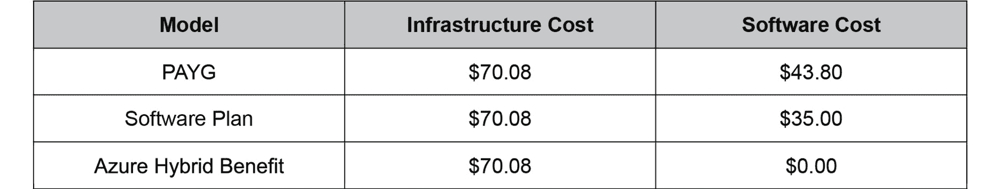

表 2.1：Azure 许可模型比较

如果我们将这些值绘制在图表上，并计算一年的节省百分比，我们将得到一个类似于*图 2.8*所示的图表：

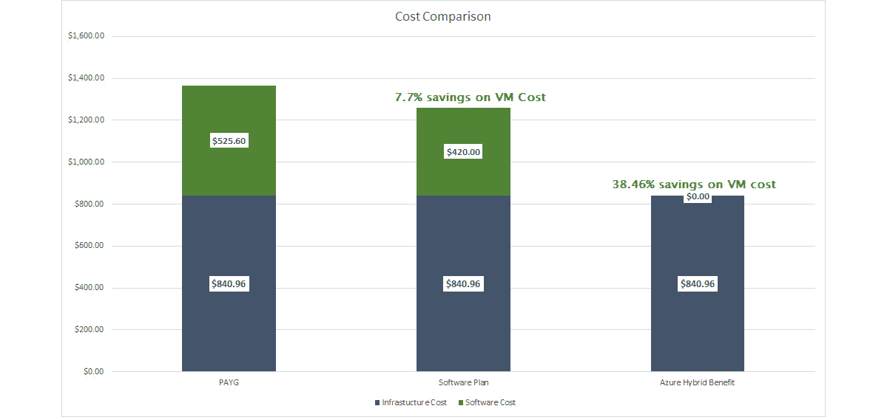

图 2.8：计算许可模型的节省

这个价值看起来很小，但这只是一个单独的 VM；在将有成千上万个 VM 的企业环境中，潜在的节省非常高。

每种模型都有自己的用例场景：

+   PAYG 非常适合测试或开发，您不打算让 VM 全天候运行。

+   如果您拥有来自 Red Hat 或 SUSE 的许可订阅，并希望在云中使用它们，Azure 混合权益是合适的。

+   预付软件计划非常适合没有 RHEL 或 SUSE 订阅并希望在软件成本上获得一些折扣的客户。但是，这是与微软的长期承诺。

使用 Azure 预留实例，客户还可以获得计算成本的折扣。简而言之，如果您将 Azure 混合权益或预付软件计划与 Azure 预留实例结合使用，整体节省百分比将提高到 50-70%。您可以在此处阅读有关 VM 的 Azure 预留实例的更多信息：[`docs.microsoft.com/azure/cost-management-billing/reservations/save-compute-costs-reservations`](https://docs.microsoft.com/azure/cost-management-billing/reservations/save-compute-costs-reservations)。由于这不是一个许可模型，而更多是一种成本优化技术，我们将不在本章涵盖此主题。但是，当我们在*第三章*，*评估和迁移规划*中讨论评估和迁移时，我们将讨论如何优化云成本。

现在我们熟悉了许可模型，让我们看看如何使用 Azure**命令行界面（CLI）**来查找可用发行版的版本。

### 可用的发行版

在*Linux on Azure*部分的介绍中，我们看到 Microsoft Azure 支持常见的 Linux 发行版，如 Red Hat、Ubuntu、SUSE、CentOS、Debian、Oracle Linux 和 CoreOS。我们还看到了如何利用 Azure Marketplace 根据组织的需求找到合适的映像。*表 2.2*显示了认可的发行版和提供这些映像的供应商/发布者：

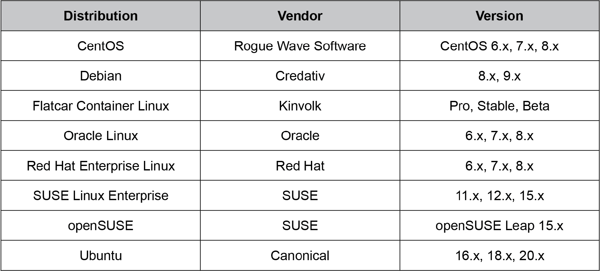

表 2.2：Azure 上认可的 Linux 发行版

尽管在上表中给出了通用版本号，但使用**Azure CLI**可以非常容易地从发布者那里找到图像名称和版本。为了使用 Azure CLI，我们需要在我们的工作站上安装它。Azure CLI 可以安装在 Linux、Mac 或 Windows 系统上。如果您在 Azure 门户中使用 Cloud Shell，默认情况下会为您安装 Azure CLI。

假设我们正在使用本地计算机（例如 Ubuntu 计算机），我们需要安装 Azure CLI。您可以根据您的操作系统在这里找到具体的安装步骤：[`docs.microsoft.com/cli/azure/install-azure-cli`](https://docs.microsoft.com/cli/azure/install-azure-cli)。为了简单起见，我们将在 Ubuntu 实例上安装 Azure CLI：

1.  微软已经开发了一个脚本，可以一次性运行安装，这对于初学者来说非常方便。如果您更喜欢逐步执行此步骤，微软文档也有相应的说明。对于 Ubuntu，可以使用以下命令进行安装：

```
curl -sL https://aka.ms/InstallAzureCLIDeb | sudo bash
```

输出显示在*图 2.9*中：

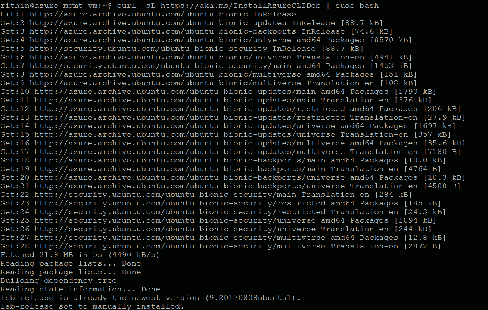

图 2.9：Ubuntu 上的 Azure CLI 安装

1.  下一步是从 Azure CLI 登录到我们的帐户，以便将我们的 Azure 帐户连接到 Azure CLI。这可以通过运行`az login`命令来实现。控制台将提示您打开一个浏览器窗口，并提供一个代码来完成身份验证过程，如*图 2.10*所示：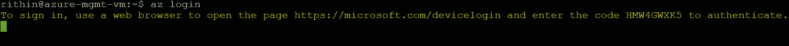

图 2.10：使用 Azure CLI 登录到 Azure

1.  在浏览器窗口中，您必须输入终端中显示的代码（如*图 2.10*所示），并使用您的凭据登录。登录后，终端将显示您可以访问的所有订阅，如*图 2.11*所示。如果您不想使用代码进行身份验证，可以使用服务主体进行登录，其中您将使用客户端 ID 和客户端密钥分别作为用户名和密码。此外，如果需要，您还可以使用托管标识：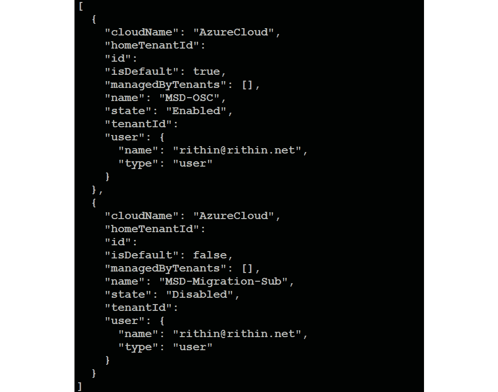

图 2.11：登录到 Azure

现在我们将看到如何获取有关可用 VM 映像的信息。这里使用的主要命令是`az vm image`。

1.  要列出在 Azure Marketplace 上可用的 VM/VMSS 的映像（离线），您可以使用`az vm image list`。响应将以 JSON 格式显示，我们可以通过在命令后附加`-o table`参数来将其格式化为表格。这将列出离线缓存的映像，如*图 2.12*所示：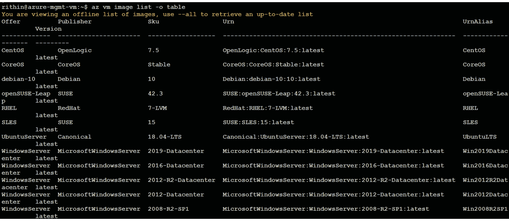

图 2.12：列出可用的 VM 映像

要更新列表并显示所有映像，可以在命令后附加`–all`参数并再次调用该命令。

前面的命令可能需要一两分钟来刷新所有可用映像的列表。通常，当我们查询映像列表时，建议使用发布者、SKU 或提供商参数，以便将搜索限制在一组映像上，并且可以非常容易地检索结果。

在接下来的步骤中，我们将看到如何找到图像的发布者、提供商或 SKU，并在我们的`az vm image list`中使用它来缩小搜索范围。

1.  为了找到所有发布者的列表，我们可以使用`az vm image list-publishers`命令。在这里，位置是一个必需的参数，因为一些发布者只发布到特定的区域，所以建议检查发布者是否已经发布到您计划部署的区域。以下是输出：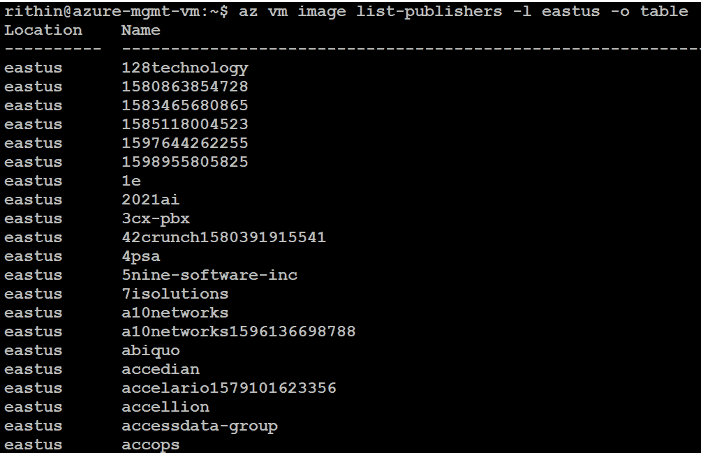

图 2.13：列出区域的发布者

1.  例如，Ubuntu 的发布者是 Canonical。如果我们想列出该发布者提供的所有产品，我们可以使用以下命令：

```
az vm image list-offers -p Canonical -l eastus -o table
```

在这里，位置是一个必需的参数，因为产品可能会根据位置而变化。输出将类似于*图 2.14*所示的内容：

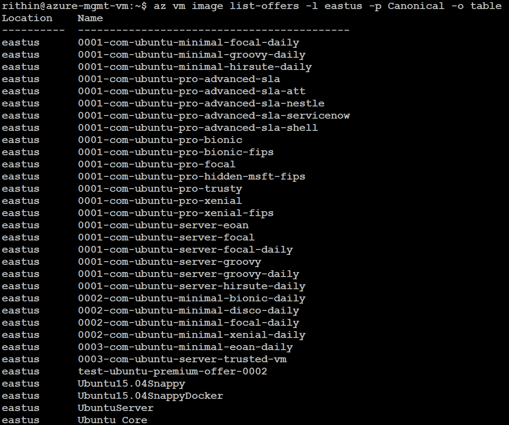

图 2.14：列出在 East US 的 Canonical 发布者的图像

1.  让我们选择一个产品；例如，`UbuntuServer`。现在我们需要列出 SKU 以找到图像的可用 SKU。我们需要传递发布者、产品和位置到`az vm image list-skus`命令，以列出 SKU。上述参数对于此命令是强制的，因此最终命令将如下所示：

```
az vm image list-skus -l eastus -p Canonical -f UbuntuServer -o table
```

输出如*图 2.15*所示：

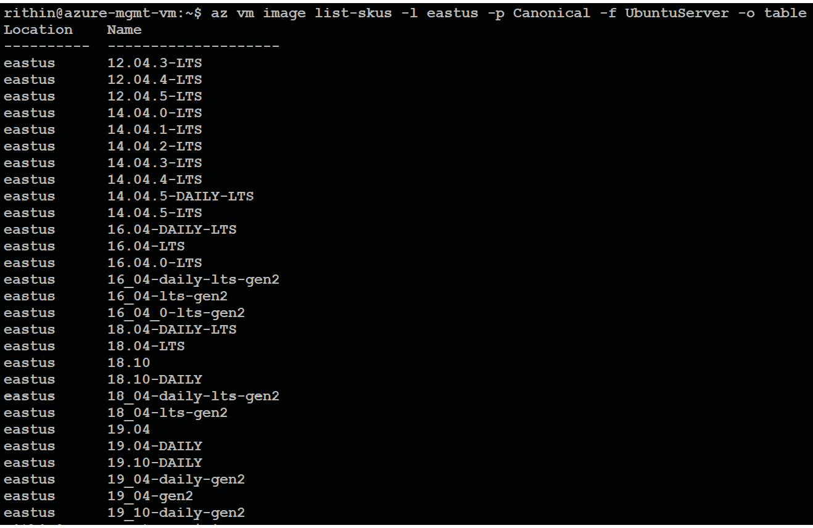

图 2.15：列出在 East US 可用的 Canonical UbuntuServer 产品的 SKU

1.  现在我们知道了发布者、产品和 SKU。让我们在`az vm image list`命令中使用这些值，以查看图像的可用版本。在这里，我们将使用`Canonical`作为发布者（`-p`），`UbuntuServer`作为产品（`-f`），`19_04-gen2`作为 SKU（`-s`）。组合这些并调用以下命令：

```
az vm image list -p Canonical -f UbuntuServer -s 19_04-gen2 --all -o table
```

这将列出指定发布者、产品和 SKU 组合的图像版本。以下是示例输出：

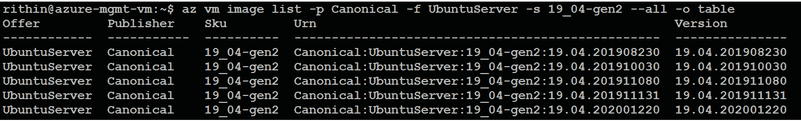

图 2.16：列出特定发布者、产品和 SKU 组合的图像版本

1.  我们可以使用输出中的`urn`在`az vm image show`命令中获取 VM 图像的详细信息，如*图 2.17*所示：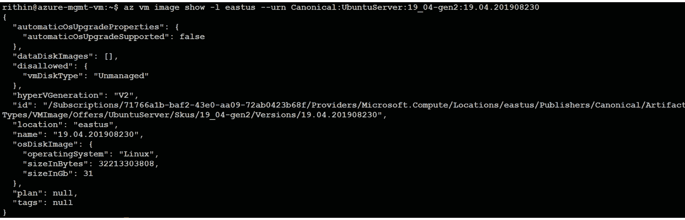

图 2.17：查找 VM 图像的详细信息

1.  相同的`urn`可以在我们的`az vm create`命令中使用，以创建具有特定图像版本的 VM。*图 2.18*中给出了一个快速示例：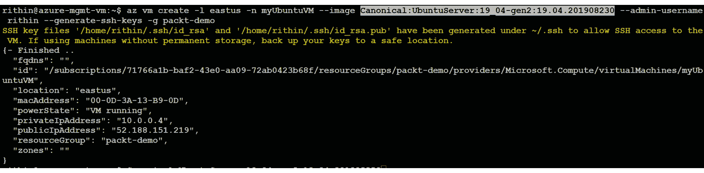

图 2.18：使用 URN 创建 VM

在我们结束之前，请查看*表 2.3*，其中列出了我们在前面步骤中使用的所有命令，以供快速参考：

| 命令 | 目的 | 必需参数 | 文档 |
| --- | --- | --- | --- |
| az vm image list | 列出 VM/VMSS 图像（离线/缓存）。 | 无 | [`docs.microsoft.com/cli/azure/vm/image?view=azure-cli-latest`](https://docs.microsoft.com/cli/azure/vm/image?view=azure-cli-latest) |
| az vm image list --all | 列出来自 Azure Marketplace 的所有图像。由于数据集较大，这通常需要时间。建议使用发布者、产品和 SKU 进行筛选，以获得更快的响应。 | 无 |
| az vm image list-publishers | 列出可用的发布者。 | 位置（`-l`） |
| az vm image list-offers | 列出可用的 VM 图像产品。 | 位置（`-l`），发布者（`-p`） |
| az vm image list-skus | 列出发布者的产品的可用 SKU。 | 位置（`-l`），发布者（`-p`），产品（`-f`） |
| az vm image show | 显示给定 URN 的详细信息。 | 位置（`-l`），URN（`-u`） |
| az vm create | 创建 VM。 | 名称（`-n`），资源组（`-g`） | [`docs.microsoft.com/cli/azure/vm?view=azure-cli-latest#az_vm_create`](https://docs.microsoft.com/cli/azure/vm?view=azure-cli-latest#az_vm_create) |

表 2.3：用于实践的命令

在这个实践操作中，我们查询了镜像列表以找到可用的镜像，并创建了一个 VM。我们学会了如何使用发布者、提供和 SKU 等参数来缩小搜索范围。

尽管我们使用 Azure CLI 来完成这项任务，但如果您使用 PSCore 或 PowerShell，您可以利用 Azure Powershell 模块执行相同的操作。此文档可在此处找到：[`docs.microsoft.com/powershell/module/az.compute/get-azvmimage?view=azps-5.2.0`](https://docs.microsoft.com/powershell/module/az.compute/get-azvmimage?view=azps-5.2.0)。

就到这里，我们已经到达了本章的结尾，现在我们将总结我们迄今为止讨论的主题。

## 总结

在第一章中，我们了解到根据用户需求，有不同的 Linux 发行版或口味可用。本章更多地是对流行的 Linux 发行版和 Linux 在 Azure 上的工作方式进行概述。我们还讨论了商业和免费开源软件。

使用商业发行版的 Linux 有几个优势。由于我们为这些订阅付费，预期它们提供了在免费发行版中找不到的额外功能。这些附加组件包括支持、额外模块和扩展定制选项。本章也对这些领域进行了阐明。

我们仔细研究了 Azure 上的 Linux。我们从 Azure Marketplace 开始，介绍了它拥有的大量镜像。之后，我们介绍了“认可的发行版”这个术语；这是微软与不同的供应商合作，如红帽、Canonical 和 SUSE，将它们的 Linux 镜像带入云端。微软建议在生产部署中使用认可的镜像。我们还讨论了技术支持矩阵和微软支持提供的支持范围。我们看到了一些场景，供应商需要参与解决问题。

在涵盖了 Azure 上的 Linux 发行版之后，我们讨论了 Linux 可用的许可模型，以及根据部署类型选择哪种模型最适合您。我们还绘制了一张图表，展示了每种模型中潜在的节省。章节的最后部分更多地是实践操作，我们看到了如何使用 Azure CLI 在 Azure 上找到不同的 VM 镜像。然而，选择的范围并不止于此；如果您找不到您要找的镜像，Azure 允许您自由地带入自己的镜像。

在 Azure 上的 Linux 是一个广泛的话题，有许多书籍清楚地讨论了如何在 Azure 上进行 Linux 管理。这本书更侧重于 Linux 工作负载的迁移和评估。许可模型和发行版被解释，以帮助您了解在 Azure 领域中的操作方式。

在下一章中，我们将开始讨论迁移。许多组织开始向云端迁移而没有进行适当的评估或规划。规划和评估是迁移的基石，在向云端迁移之前必须做好。规划阶段更多地是了解容量和检查先决条件，而评估是使用评估工具来验证您的工作负载是否准备好进入 Azure，或者是否需要进行任何形式的重构。说到这里，我们将在下一章中更多地讨论这些策略和步骤。继续阅读！
