# 第三章：3. 评估和迁移规划

本章将重点讨论评估现有工作负载在本地或托管环境中的有用方法，并提供一些关于规划迁移项目的指导。

我们将深入讨论一些流行的 Linux 工作负载的技术细节，并解释为什么这些特定的工作负载在迁移前需要额外谨慎的规划。此外，我们还将讨论各种迁移方法和工具，并展示如何使用 Azure Migrate 等工具来评估当前工作负载的一些实际示例。

到目前为止，我们一直在谈论 Linux 的历史和各种可用的 Linux 发行版。我们还没有谈论迁移或之前发生的事情。在本章中，我们将涵盖与迁移前步骤相关的概念。您可能想知道为什么我们需要迁移前步骤，为什么不能直接将我们的工作负载迁移到云中。答案很简单，迁移到云需要大量的规划和评估。我们需要确保我们的工作负载准备好迁移到云中，否则在迁移中投入的时间和金钱将白白浪费。

在本章中，您还将了解到迁移前主要包括评估和容量规划。评估是创建当前环境中工作负载清单的过程。使用此清单，我们将能够了解当前基础架构拓扑，这可以用于生成迁移到云的费用，并验证工作负载是否经过云优化。

我们还将介绍一个名为 Azure Migrate 的服务，它可以处理我们的 Linux 工作负载的评估和迁移。随着我们的进展，我们将带领您完成评估过程，并介绍其与迁移的相关性。

本章的一些关键要点如下：

+   学习一些在 Linux 上流行的工作负载

+   为迁移项目做准备

+   评估当前环境

+   评估工具简介

此外，我们为您创建了一个实践实验，您可以通过自己动手来学习如何评估环境。

现在让我们开始学习一些在 Linux 上运行的流行工作负载。

## Linux 上流行的工作负载

在现实世界的场景中，我们只迁移运行负载的服务器，因为将没有运行服务的虚拟机迁移到云中是没有意义的。您可以直接在 Azure 中部署新服务器并开始在其上进行开发。让我们快速回顾一下 Linux 上流行的工作负载。其中一些在第一章“Linux：云中的历史和未来”中已经解释过。让我们回顾一下各种工作负载，包括应用程序托管（如 Java 和 LAMP）、搜索和大数据，并看看 Azure 如何支持这些工作负载。

### LAMP

LAMP 是 Linux，Apache，MySQL，PHP/Perl/Python 的缩写。通常，这是任何 Linux 管理员都会设置的第一个服务堆栈，通常用于托管动态和数据库驱动的网站。在 LAMP 中：

+   Linux（L）指的是任何 Linux 发行版；您可以使用 Ubuntu 或 Fedora 或 CentOS 或任何其他发行版。

+   Apache（A）是向用户呈现数据或网页的 Web 服务器。简而言之，这是用户将要与之交互的前端。

+   MySQL（M）是将用于保存数据的数据存储。

+   PHP/Perl/Python（P）是用于开发动态网站的编程语言。

尽管我们称之为 LAMP 服务器安装，但这些是您需要单独安装的独立软件包，并不像在计算机上安装 CentOS 那样简单。在某些情况下，LAMP 可能不是正确的选择；换句话说，您可能不需要 LAMP 的所有组件。这完全取决于您的应用程序是什么。如果您有一个使用 HTML、CSS 和 JS 创建的静态网站，那么您的系统不需要 MySQL 或 PHP 功能。您只需要 Linux 服务器和在其上运行的 Apache Web 服务器，它可以向客户端提供静态网站。

根据您使用的 LAMP 服务器的组件，迁移需要相应地进行规划。在本章的实验室中，我们将使用 LAMP 服务器进行评估和依赖分析。*图 3.1*显示了服务器的架构。这种架构可以部署在 Hypervisor 上，如 Hyper-V、VMWare ESXi，或者物理服务器上。在我们的实验室中，我们将使用 Hyper-V 作为虚拟化平台：

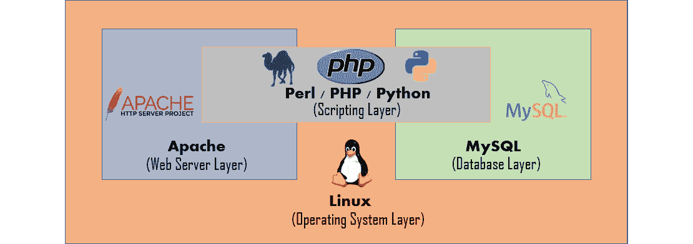

图 3.1：LAMP 服务器

*图 3.1*显示了实验室中要使用的架构。

### 数据库服务器

在 LAMP 中，我们看到 Linux 服务器托管了 MySQL 数据库，它可以作为动态网站的数据存储。MySQL 并不是唯一可以部署在 Linux 服务器上的数据库。有大量的关系型和非关系型数据库可以安装在 Linux 服务器上。下面列出了一些可以在 Linux 上部署的开源关系型数据库。其中一些非常流行和知名；其他可能是你以前没有听说过的：

+   MySQL

+   MariaDB

+   PostgreSQL

+   SQLite

+   LucidDB

+   H2

+   HSQLDB

+   Firebird

+   Derby

+   CUBRID

还有许多其他不开源的关系型数据库产品，如 Microsoft SQL Server、Oracle Database 18c、MaxDB 和 IBM 的 DB2。

除了关系型数据库，Linux 也是 NoSQL 数据库的流行平台。MongoDB、Couchbase、CouchDB、RavenDB 和 OrientDB 是 NoSQL 数据库的例子。

Azure 提供了数据库迁移服务，可将数据从本地迁移到托管的**平台即服务**（**PaaS**）解决方案。尽管 PaaS 服务提供了所有这些好处，但仍有一部分客户更喜欢在**基础设施即服务**（**IaaS**）服务器上部署这些服务并完全管理管理。迁移过程和技术细节取决于所选择的技术。

除了 IaaS，Azure 还提供一系列开源数据库作为 PaaS 解决方案。使用 PaaS 的优势在于，大多数基础设施相关的任务，如更新和打补丁，将由 Microsoft Azure 负责。这些 PaaS 解决方案包括 Azure Database for PostgreSQL、Azure Database for MySQL、Azure Database for MariaDB 和 Azure Cache for Redis。

### HPC、集群和 SAP

在*第一章*，*Linux：云中的历史和未来*中，我们看到了 Linux 中的 SAP、集群和 HPC 场景。回顾一下，**高性能计算**（**HPC**）是数百甚至数千台服务器组成的集合，它们通过网络连接在一起。集群中的每台服务器称为**节点**，它们相互并行工作，以提供更高的处理速度。高组合处理速度有助于提高性能。

微软 Azure 提供了多种专为 HPC 设计的 VM 系列，可用于执行计算密集型任务。这些系列包括 VM 系列、H 系列、HC 系列、HB 系列和 HBv2 系列。

客户将 HPC 迁移到云的主要原因是更大的资源需求。由于这些工作负载执行计算密集型任务，所需的计算能力很大，基础设施应能够在必要时提供更多的服务器。本地基础设施无法像云那样提供这种可扩展性。事实上，本地基础设施只能处理 HPC 集群。在这个安全区域之外进行扩展是不可能实现的。这就是 Azure 的用武之地。您所需做的就是设置扩展策略，Azure 会处理其余的事情。

有趣的是，您还可以实现混合 HPC 集群，其中头节点放置在本地，计算节点放置在 Azure。由于计算节点在 Azure 中，可以根据需求执行扩展。

### 共享存储

通过回顾*第一章*，*Linux：云中的历史和未来*，让我们再次审视共享存储用例。Linux 通常用作存储服务器，客户端通过 SMB 或 NFS 协议连接到服务器。这些服务器可用于存储共享文件，并且客户端可以出于多种目的访问它们。例如，您可以拥有一个共享文件服务器，用于存储所有内部应用程序的必要安装包。您的客户将能够从共享存储中下载这些文件并使用它们。

此外，共享存储可用于存储需要协作的文件。上传到这些驱动器的文件可以根据协作者的权限级别使用。

在 Microsoft Azure 中，Azure 文件可以用作共享存储，这里的优势在于这是一个完全托管的服务。如果您计划部署虚拟机并在其上托管共享存储，作为客户，您必须管理许多事情，从操作系统管理、更新、补丁等等开始。然而，在 Azure 文件的情况下，该服务由微软管理，由于 Azure 存储提供的各种冗余级别，您无需担心自己实现高可用性。

本地数据可以使用命令行工具（如 AzCopy 和 robocopy）进行迁移。AzCopy 经过优化，可实现最佳的复制吞吐量，并且可以直接在存储账户之间复制数据。另一方面，如果您想要从本地存储迁移到已经挂载在同一服务器上的 Azure 文件存储，那么 robocopy 就非常有用。

上述是常见的情景；然而，这并不意味着用例场景或工作负载类型局限于这些。即使对于相同的工作负载类型，不同的客户也会使用不同的组件。例如，如果我们考虑数据库服务器，一些客户将使用 MySQL，而其他客户将使用 PostgreSQL。

微软拥有一系列文件、最佳实践、实施指南和工具，旨在加速您的云采用过程。这个框架被称为微软 Azure 的**云采用框架**（**CAF**）。建议组织采用这个框架，以便他们可以从云旅程的一开始就融入最佳实践和工具。完整的框架可以在这里查看：[`docs.microsoft.com/azure/cloud-adoption-framework/`](https://docs.microsoft.com/azure/cloud-adoption-framework/)。

我们将在本书中遵循 CAF 的*Migrate*部分中的行动计划。在本书中，我们将重点关注将 Linux 工作负载迁移到 Azure 的主要步骤。这个路线图包括四个主要步骤，如*图 3.2*所示：

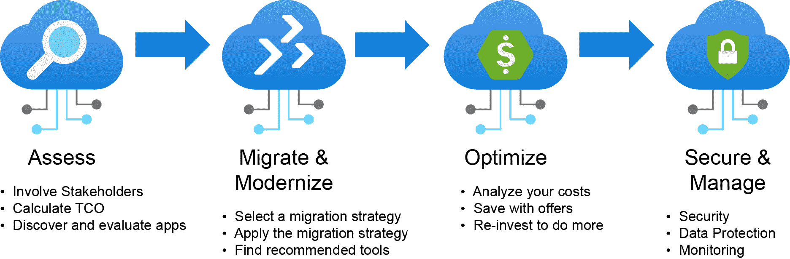

图 3.2：Linux 迁移路线图

如前图所示，我们将从第一阶段—*评估*开始我们的迁移之旅。

## 项目前的准备工作

所有项目都应该从适当的规划开始，云迁移也是如此。在这一点上，我们已经收集了所有必要的技术信息，但我们如何知道需要什么样的项目团队？让我们仔细看看。

### 确定相关角色和责任

很多时候，基于本地应用程序的责任被分配给许多不同团队内的内部利益相关者，有时甚至是不同部门或公司。

例如，任何业务应用的典型生产环境需要多个不同的角色才能正常运行：

+   硬件管理员

+   虚拟化管理员

+   存储管理员

+   网络管理员

+   Linux 管理员

+   数据库管理员

+   备份管理员

当您添加内部和外部用户时，列表会变得更长：

+   身份管理管理员

+   连接管理员

+   应用程序所有者

+   业务所有者

+   应用程序用户

现在，让我们想象一下，您计划将此系统迁移到 Azure：为了确保业务用户进行的工作不会受到干扰，您需要与这些人中的哪些人交谈？让我们看看一些关键角色以及为什么他们在云迁移项目中非常重要。

### 网络管理员

仅在一个数据中心运行并为单个国家的用户提供服务的应用程序相对于分布式应用程序和全球用户来说，迁移到云端相对容易。

让我们举个例子（参见*图 3.3*），一家公司在两个洲和四个国家有四个办公室。巴黎和伦敦的欧洲团队使用伦敦的数据中心，新加坡和曼谷的团队使用新加坡的数据中心：

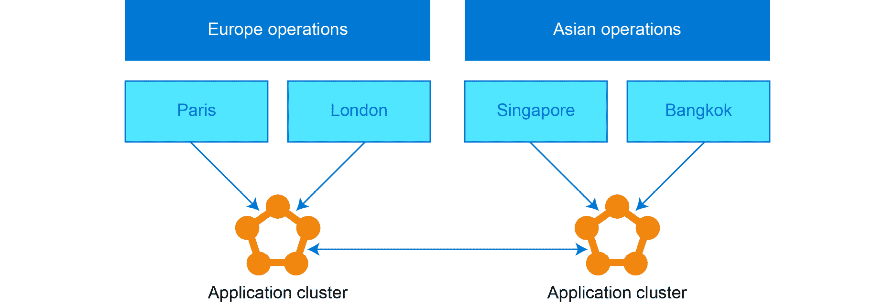

图 3.3：跨洲集群应用

这种情况给整体架构增加了一个明显的复杂性方面：全球网络连接。从项目规划的角度来看，这意味着您将需要至少添加一家国际网络提供商公司到参与项目的角色列表中。

通常，这种网络结构可以在不做出重大改变的情况下迁移到云端，但有一类特殊的应用程序需要大量的规划：金融应用程序。传统上，金融行业依赖于系统中的专用互联网连接和私人链接。这本身并不是问题，因为 Azure 有各种 VPN 和其他私人连接的选项。这里的棘手之处在于金融行业使用的许多交易应用程序中使用了“多播”协议。另一个经常使用“多播”协议的行业是医疗保健，特别是医院。

#### 注意

如果您想了解企业环境中多播用例的更多信息，您可以查看由 Cisco Press 出版的《多播设计解决方案》一书：[`www.ciscopress.com/articles/article.asp?p=2928192&seqNum=5`](https://www.ciscopress.com/articles/article.asp?p=2928192&seqNum=5)。

多播在这一部分值得一提的原因是公共云不支持多播网络。这使得直接迁移到 Azure 依赖多播路由的应用程序变得非常具有挑战性。幸运的是，有办法解决这个问题，例如使用多播到单播网关，但这种方法将需要重新设计您的网络设计，可能还需要重新设计应用程序。

需要仔细规划的另一个网络细节是 VPN 和 ExpressRoute 连接。需要记住的是，不能保证您可以轻松地将您当前位置的连接移动到公共云。因为这些现有连接可能由第三方公司拥有或运营，您需要确保在网络规划会议中涉及到他们。

这里需要理解的一点是，诸如网络之类的事情可能听起来很容易和直接，但它是公共云迁移中最困难的技术领域之一，不仅从技术角度来看，而且从人员配备和规划的角度来看，因为有很多利益相关者参与其中。

如果您的迁移团队中只能增加一名网络人员，那么选择一个有与电信提供商和传统网络技术合作经验的人。这个人比任何云网络专家都更有价值。

现在让我们转向下一个关键角色。

### Linux 管理员

在早些章节中，我们谈到了 Linux 订阅管理的业务方面。在计划迁移到公共云时，还有一些需要考虑的技术细节。其中之一是更新管理：在 Azure 上使用 Linux 时，您将从何处获取安全补丁和软件包更新？

在这里，您的 Linux 管理员是一个关键人物，因为他们已经了解当前系统中各种软件包管理器和订阅系统的工作方式。通过一些培训，他们很容易就能理解在将系统迁移到 Azure 时需要实施的变化。

在您的迁移项目团队中有一名 Linux 管理员听起来很明显吗？在现实生活中，我们曾见过一些迁移项目，项目经理认为这并不必要，让一名 Windows 管理员试图弄清楚如何将 Linux 迁移到 Azure。你可能可以猜到这些项目是否成功。

在这种情况下，Linux 管理员指的是那些了解文件系统、磁盘性能、SELinux 和订阅管理等内容的人，如果您使用商业 Linux 发行版。

幸运的话，您计划迁移的系统是良好维护的，所有安全补丁和更新都已应用，并且一切都有很好的文档记录。然而，在现实生活中，情况很少这样。在团队中有一位具有丰富的与各种 Linux 服务和应用程序堆栈合作经验的人员会非常有帮助，因为他们经常可以找到您的文档中缺失的信息。

让我们举一个例子，假设有一台 RHEL 服务器，SELinux 已关闭。您的应用程序文档中没有提到 SELinux 的任何内容，您的安全团队表示，在公共云中，您需要启用 SELinux，否则他们将不批准迁移。可能会出现什么问题？一切都可能出错，尤其是如果安全团队在未事先检查应用程序行为的情况下，将 SELinux 的**强制模式**打开。

我们建议您熟悉与您计划迁移到 Azure 的系统相关的所有相关角色和人物，并且非常仔细地调查，按照这里介绍的模式，找出您需要在项目团队中涉及的人员。

### 云治理和运营

微软已经开发了一个 CAF，这是一套文档、实施指南、最佳实践和工具，帮助客户以最佳方式开始使用 Azure。

#### 注意

CAF 对所有人免费开放，网址为[`docs.microsoft.com/azure/cloud-adoption-framework/`](https://docs.microsoft.com/azure/cloud-adoption-framework/)。

从 CAF 中学习云迁移时，有几个部分非常重要。例如，*着陆区*是一个术语，您今后应该非常熟悉。在 Azure 中，着陆区指的是一组预先设计的架构或服务，您可以在其中部署新的或迁移的资源，例如虚拟机。在软件开发领域中的类比是**最小可行产品**（**MVP**）。

#### 注意

在这里阅读有关 Azure 着陆区的更多信息：[`docs.microsoft.com/azure/cloud-adoption-framework/ready/landing-zone/`](https://docs.microsoft.com/azure/cloud-adoption-framework/ready/landing-zone/)。

在这一点上另一个非常重要的话题值得一提，就是云运营，或者**CloudOps**。在大多数情况下，开发软件解决方案的团队不会是部署解决方案后操作云基础设施 - 或者着陆区域 - 的同一个团队。通常，云运营由公司的 IT 部门管理，或者这项工作被外包给专门的云管理服务提供商。

最糟糕的事情就是在部署后没有人来照顾应用程序或基础设施。有人需要监控应用程序和基础设施的性能，对系统警报做出反应，确保安全补丁被应用，并且很可能还要定期运行成本优化流程。

Microsoft CAF 也涵盖了这些云管理方面，不仅从技术角度，还从组织和业务对齐的角度。在 CAF 中了解更多关于云管理的信息：[`docs.microsoft.com/azure/cloud-adoption-framework/manage/`](https://docs.microsoft.com/azure/cloud-adoption-framework/manage/)。

为了应用我们迄今为止学到的所有关于发现和评估的理论，让我们进行一个实际评估实验室。在这个实验室中，您将看到如何在 Azure 中发现和评估 Hyper-V VMs。

## 迁移评估

迁移旅程继续，了解您当前的基础设施。评估是迁移的第一步，在这个阶段，我们将创建我们源的清单。当我们说*源*时，这不一定总是在本地。它也可能是其他云供应商或平台。Azure 中可用的评估工具可用于评估 AWS、GCP、虚拟化平台和本地物理服务器的基础设施。我们需要进行评估的原因是因为我们需要确保迁移后我们的工作负载将会是什么样子。

评估包括四个步骤以及一套工具。让我们继续学习这些步骤。

### 准备云迁移计划

正如本杰明·富兰克林所说，“未能准备，就是准备失败。”乍一看，迁移可能看起来并不复杂；然而，如果我们开始没有计划并且缺乏适当的策略，那么迁移将失败。失败的迁移将是时间、精力和生产力的彻底浪费。您应该通过设定目标和优先级来开始您的规划。并非所有迁移都一次性完成；它将分阶段完成。通常，属于同一个解决方案的服务器会一起迁移，而不是随机迁移服务器。假设您的环境中有注册应用程序、工资应用程序、售票应用程序等。在这种情况下，您需要设定一些优先级和项目截止日期，比如工资应用程序是优先级，并且应该在第一季度结束前处理。这种方法确保您一次只走一步，并遵循纪律，从而确保成功的迁移。

一般的经验法则是优先考虑具有较少依赖关系的应用程序；这将作为迁移的催化剂。一旦这些完成，您可以专注于具有大量依赖关系的应用程序。移动这些将为您提供更多时间来专注，因为其他应用程序已经迁移。这也将确保更有效地利用您的时间。如果您从具有大量依赖关系的应用程序开始，您可能需要更长时间来优化和计划它们。这将意味着其他工作负载的截止日期将进一步延长。因此，最好在处理复杂的应用程序之前完成简单的应用程序。

下一步是*发现和评估*，这是完整评估发生的地方。

### 发现和评估

现在我们有了一个计划，我们需要开始对环境进行全面评估。这些步骤的结果是确定在迁移范围内的服务器、应用程序和服务。

接下来，我们将制作一个完整的服务器和服务清单和依赖关系图，这些都在迁移范围内。清单和图帮助我们了解这些依赖服务如何相互通信。强烈建议您彻底调查每个应用程序及其依赖关系。未能评估或考虑其中一个依赖关系将导致迁移后出现重大问题。

您的一些应用程序可能不适合搬迁和迁移，因此您还需要考虑其他选项。对于每个应用程序，您需要评估以下迁移选项：

+   **重新托管**：这通常被称为“搬迁和迁移”。基本上，您正在在 Azure 中重新创建您的基础设施。这对您的应用程序需要进行最少的更改，因此影响最小。一个例子是将虚拟机复制到云端，然后在 Azure 中使用复制的磁盘重新创建它们。

+   **重构**：当您将 IaaS 服务器迁移到 PaaS 解决方案时，例如，从 VM 迁移到 Azure App Service 等 PaaS 解决方案。正如我们已经知道的那样，迁移到 PaaS 解决方案可以减少管理任务，同时帮助降低成本。

+   **重新架构**：在某些情况下，您可能需要重新架构一些系统，以便它们能够成功迁移。这种架构主要是为了使系统成为云原生，或者利用容器化和微服务等较新的路径。

+   **重建**：如果重新架构应用程序所需的成本、时间和人力资源高于从头开始，那么您可以重建应用程序。这种方法有助于软件开发团队开发能够充分利用云的应用程序。

+   **替换**：有时，当您审查重建或重新架构解决方案的整体支出时，可能会高于购买第三方软件。假设您有自己的 CRM 解决方案，重新架构或重建的成本高于购买类似的 SaaS 产品，如 Dynamics 365 的许可证。

一旦我们发现了整个基础设施，管道中的下一步是让关键利益相关者参与进来。

### 让关键利益相关者参与进来

在发现阶段，我们将对基础设施有一个完整的了解；然而，应用程序的所有者和超级用户也将对应用程序的架构有一个完整的了解。在本章前面提到的这些所有者和其他关键利益相关者将能够分享有关应用程序架构的宝贵建议和信息，并在迁移的早期阶段纳入这些建议将增强成功迁移的可能性。

在填补任何知识空白时最好让 IT 和业务所有者参与进来。此外，这些个人在提供有关应用程序架构的任何指导方面将非常有用。

在迁移方面，CEO、CTO 和 CIO 等 CxO 利益相关者总是对了解数字感兴趣，比如如果我们从本地迁移到 Azure，潜在的节省可能是多少。让我们看看如何估算成本。

### 估算节省

许多组织采用迁移路径来节省基础设施成本。云的灵活性和可伸缩性是主要的驱动因素。例如，如果你购买了一台新服务器，而这台服务器没有像预期那样被利用，那么这对公司来说就构成了损失。然而，在云中情况就不同了；如果你不需要它，你可以在几秒钟内取消分配服务器。一旦取消分配，你就不必再担心服务器，也不再为它付费。

在转移到云端之前，所有组织都会进行计算，并验证他们是否因此迁移而获得任何利润或节省。完成初始范围确定后，您可以使用 Azure TCO 计算器估算在本地与 Azure 中运行工作负载的成本。

从评估到节省计算，整个过程涉及不同的工具。让我们识别一下评估阶段可用的工具。

### 识别工具

工具在迁移评估中扮演着至关重要的角色。没有工具，要去到您在本地拥有的每台服务器并创建清单将是一项繁琐的任务。因此，工具可以提高生产力并加速迁移。表 3.1 显示了可以在评估阶段利用的工具列表：

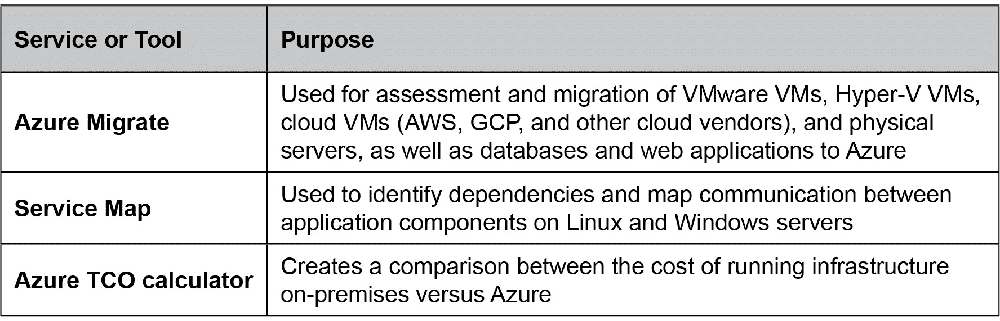

表 3.1：评估工具

上述是评估阶段使用的工具。同样，在采用计划的每个阶段（迁移、优化和安全管理）中都会使用其他工具。一旦我们到达这些阶段，您将熟悉每个阶段使用的工具。

还有其他第三方工具可用于执行评估。这些工具在 Azure 迁移中可用，并且可以在项目创建期间进行选择。

现在我们已经熟悉了评估阶段的步骤，让我们试着更多地了解每个工具及其使用情况。

## 评估工具

在前面的“识别工具”部分中已经解释了这些工具所扮演的不可避免的角色，这使得评估、映射和节省计算变得更加容易。现在我们将评估每个工具，看看它们是如何使用的，以及使用案例场景是什么。我们将从 Azure 迁移开始。

### Azure 迁移

Azure 迁移的目的已经在“表 3.1”中显而易见。借助 Azure 迁移，我们可以在服务器上不安装任何代理程序的情况下运行环境发现。如果我们安装代理程序，还可以执行依赖性分析，用于生成服务映射。评估的最佳部分是所有这些都是内置到 Azure 门户中的，您不必依赖于任何其他门户。

在评估之后，Azure 迁移会生成一份评估报告，其中包括估算成本、建议以及您需要配置以匹配本地配置的 VM 的大小。Azure 迁移可以发现和评估部署在 Hyper-V 和 VMWare 虚拟化环境上的 VM，以及物理机器，同时还可以扩展到其他云供应商的列表。

要使用 Azure 迁移，我们需要在 Azure 门户中创建一个 Azure 迁移项目。该项目将用于存储我们执行的评估。同样，当我们将工作负载迁移到 Azure 时，可以使用同一个项目。由于我们处于迁移计划的评估阶段，本章将重点介绍项目中可用的评估工具。一旦我们到达“第四章”中的迁移阶段，“执行迁移到 Azure”，我们将讨论 Azure 迁移项目中的迁移工具。

现在让我们熟悉下一个工具“Service Map”。

### Service Map

Service Map 是 Azure 监视器的另一个很棒的工具，用于服务器评估，它为我们执行依赖性分析。利用依赖性分析有几个优势，这提高了整体迁移的信心和成功率。其中一些优势如下：

如果您有大量要迁移的服务器，可以根据解决方案对它们进行分组，因为我们知道哪个服务器托管了哪些依赖关系：

+   它有助于识别解决方案中的正确机器，并将它们一起迁移。

+   它有助于了解环境的拓扑结构。

确保您迁移所有内容，不要因人为错误或疏忽而排除任何服务器。有两种类型的依赖分析：

+   无代理分析

+   基于代理的分析

让我们更仔细地看看这些。

### 无代理分析

正如其名称所示，VM 上没有安装代理来执行依赖分析。发现或分析是通过使用来自计算机的 TCP 连接数据捕获来完成的。然而，这里需要注意的一点是，无代理分析在撰写本书时处于预览状态，仅适用于 VMWare VM。数据的轮询和收集是通过 vSphere API 完成的。

如果我们在 Linux 或 Windows 计算机上运行`netstat`命令，我们将能够看到从我们的计算机发出的所有网络连接的连接、连接状态、源、目的地和端口。如前所述，这些 TCP 指标用于对服务器进行逻辑分组。

一旦它们被分组，您可以可视化服务映射以了解依赖关系，或者您可以将其导出为 CSV 以供参考。评估工具包括 Azure 迁移设备，这是一个您需要在您的环境中部署以进行发现的 VM。该设备将不断收集数据并将其推送到 Azure 进行评估。

### 基于代理的分析

正如其名称所示，在基于代理的分析中，我们需要一个代理来执行依赖分析。这种分析方法利用了 Azure Monitor 的 Service Map 功能。我们需要安装 Microsoft Monitoring Agent（MMA），这主要用于 Windows 机器，或 OMS Agent（对于 Linux 机器），以及依赖代理。这些代理发送的数据将用于创建服务映射。

我们需要一个 Log Analytics 工作区来摄取这些代理推送的日志和数据。这里需要注意的一点是，工作区应该部署在支持 Service Map 的区域。

与无代理分析不同，由于我们已将数据摄入到工作区，我们可以使用 Kusto 查询语言（KQL）来分析这些数据。

当我们在本章末尾进行实际操作时，我们将看到这些代理是如何安装并用于依赖分析的。依赖分析在具有复杂架构的应用程序的情况下非常有用。接下来，我们将讨论 Azure TCO 计算器。

### Azure TCO 计算器

总拥有成本（TCO）是每个希望开始云采用的组织都应该考虑的事情。投资回报（ROI）是使用 TCO 评估的，Azure TCO 计算器有助于计算迁移到 Azure 的预计成本，并预测与当前成本相比的潜在节省。

建议在迁移到云之前进行 TCO 计算，并且在估算总拥有成本时应考虑一些费用。这些费用包括：

+   迁移成本：迁移是昂贵的，需要最大的注意力。迁移中的失败可能导致潜在损失。因此，您应该考虑 TCO 中迁移所需的资源、技术人员和其他硬件的成本。

+   基础设施成本：您需要保持本地基础设施正常运行，直到迁移完成。在迁移的某个阶段，您将同时支付云中的资源和本地数据中心的费用。只有在迁移完成后才会发生转变。

+   **风险因素**：迁移不是一项简单的任务，总是存在风险。如果你的应用程序没有针对云进行优化，或者在迁移到云之前没有正确评估你的应用程序，这可能会导致潜在的失败。例如，功能和性能问题与本地应用程序相比。一旦资源部署在云中，你将被收费；如果出现问题，你应该有预算来回滚更改并执行故障转移回本地应用程序。由于这是一个经过计算的风险，我们应该将其包括在我们的 TCO 中。

Azure TCO 计算器可以通过任何浏览器访问，导航到以下链接：[`azure.microsoft.com/pricing/tco/calculator/`](https://azure.microsoft.com/pricing/tco/calculator/)。

TCO 计算涉及一个三步过程，从定义你的工作负载开始。在这第一步中，你将输入你的本地工作负载的详细信息，并将其与云成本对比以了解节省情况。这些工作负载被分类为服务器、数据库、存储和网络组件。对于每个类别，你需要传递一组信息给 TCO 计算器。例如，如果我们以服务器为例，我们将被要求输入操作系统类型、操作系统、许可证、处理器、核心和 RAM，如*图 3.4*所示：

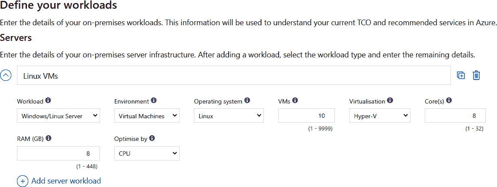

图 3.4：定义服务器工作负载

在定义了你的工作负载之后，你将进入调整假设的步骤。在这里，我们将分享关于你是否已经拥有这些机器的许可证的细节，接着是存储成本、IT 劳动力成本、电费成本等。你需要根据你的本地数据调整这些假设。

一旦你陈述了假设，TCO 计算器将根据你分享的数据给出潜在的节省。例如，基于工作负载和假设，我们得到了一年内约为 18,472 美元的预估成本节省。*图 3.5*显示了 TCO 计算器的一个示例输出：

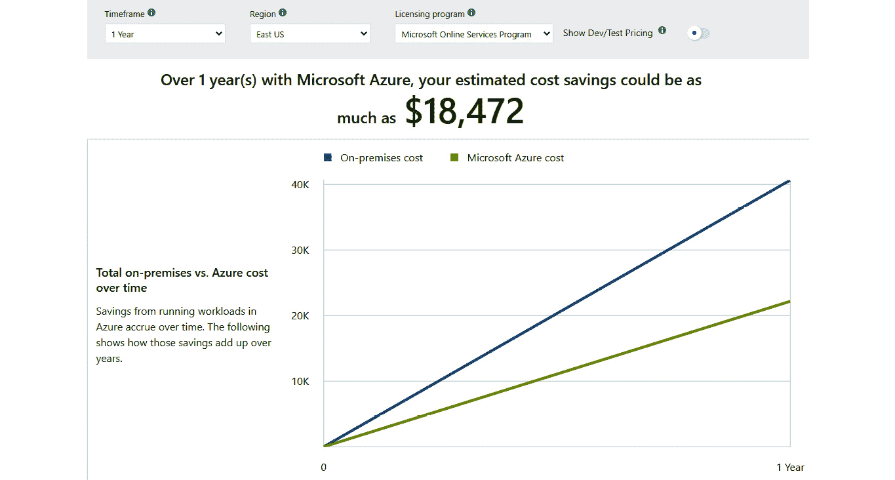

图 3.5：使用 Azure TCO 计算器计算的节省

TCO 计算器中还有其他图表（按类别分解），最好的部分是你可以下载这份报告，并与利益相关者共享以供审阅。

有了这些，我们已经涵盖了在*表 3.1*中显示的**评估**阶段中使用的主要工具。如前所述，在采用计划的其他阶段中使用了其他工具。我们将在*第四章*中涵盖**迁移和现代化**阶段，*执行迁移到 Azure*，以及在*第五章*中涵盖**优化**和**安全和管理**阶段，*在 Azure 上操作 Linux*。

现在我们已经收集了我们的应用程序和基础设施的所有必要细节，我们准备创建迁移项目计划。

## 实践评估实验

到目前为止，我们已经讨论了不同的规划策略和评估方法。在这个实践实验中，我们将评估在 Hyper-V 环境中运行的服务器。这是我们将要评估的环境的架构：

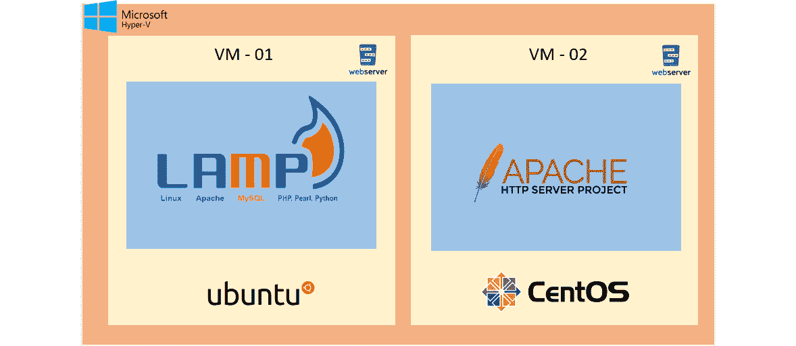

图 3.6：评估环境

在*图 3.6*中，我们可以有一个 Hyper-V 主机，并且在其上部署了两个 VM。一个 VM（VM-01）运行 Ubuntu，并在其上设置了 LAMP 服务器。第二个 VM（VM-02）是一个运行静态网站使用 Apache Web 服务器的 CentOS VM。

我们的目标是评估这个环境，并创建一个评估报告以及一个依赖分析。

如前面在*评估工具*部分提到的，我们需要创建一个 Azure 迁移项目来启动评估过程。

### 先决条件

这个实践实验的一些先决条件如下：

+   您应该至少在 Azure 订阅上拥有贡献者权限。

+   用户应具有注册 Azure AD 应用程序的权限，否则应在 Azure AD 中具有应用程序开发人员角色。

### 设置 Azure 迁移项目

使用 Azure 迁移的第一步是创建 Azure 迁移项目。该服务用于存储在评估和迁移阶段捕获的元数据。Azure 迁移项目提供了一个集中的平台，用于跟踪所有您的评估和迁移到 Azure 的情况。让我们导航到 Azure 门户并创建一个 Azure 迁移项目：

1.  要创建 Azure 迁移项目，请导航到 Azure 门户中的所有服务，并搜索 Azure 迁移，如*图 3.7*所示：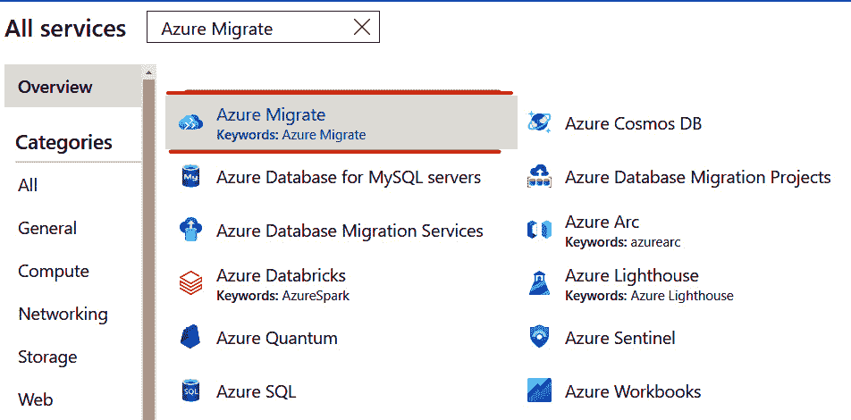

图 3.7：搜索 Azure 迁移

一旦进入 Azure 迁移刀片，您将看到不同的服务器、数据库等迁移选项。

1.  由于我们正在评估服务器，您需要选择评估和迁移服务器，或者您可以从 Azure 迁移刀片上单击服务器，如*图 3.8*所示：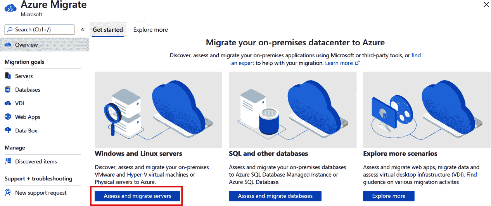

图 3.8：启动 Azure 迁移项目

1.  在下一个窗口中，您将获得创建项目选项，一旦选择，您需要输入基本详细信息，如订阅、资源组、迁移项目和地理位置，如*图 3.9*所示：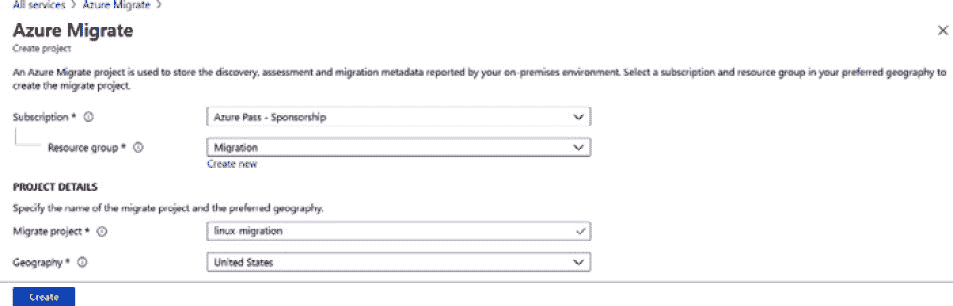

图 3.9：创建 Azure 迁移项目

1.  创建项目后，我们将为服务器提供评估工具和迁移工具选项。由于我们目前处于评估阶段，我们将探索评估工具，如*图 3.10*所示：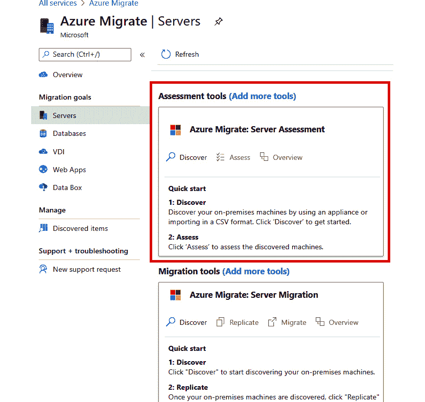

图 3.10：服务器评估工具

1.  下一步是启动我们的 Hyper-V 环境中服务器的发现，以便我们可以创建评估。我们将使用*图 3.10*中显示的发现选项来启动发现过程。

现在，我们必须选择我们的服务器当前部署的平台。您将有选择从 VMWare vSphere Hypervisor、Hyper-V 和物理或其他（AWS、GCP 等）中选择的选项。由于我们的 VM 部署在 Hyper-V 上，让我们选择此选项，如*图 3.11*所示。

要对我们的本地基础架构运行发现，我们需要在本地环境部署一个新的 VM。这个 VM 被称为 Azure 迁移设备，它将发现服务器并将信息发送到 Azure 迁移。

1.  我们需要为迁移设备命名并生成一个密钥，如*图 3.11*所示。稍后将使用此密钥在我们的 Hyper-V 主机上设置迁移设备。您需要复制此密钥并保持方便：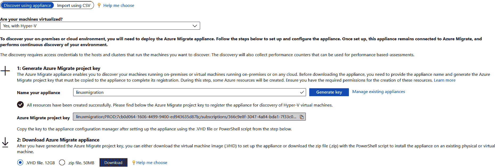

图 3.11：生成 Azure 迁移项目密钥

创建密钥后，我们需要下载 Azure 迁移设备。基本上，有两种部署设备的方式，如*图 3.11*所示。

您可以下载 VHD 文件并将其部署为 Hyper-V 环境中的新 VM，或者您可以下载一个包含 PowerShell 脚本的 zip 文件，该脚本可以将现有 VM 转换为 Azure 迁移设备。如果您希望使用现有服务器作为迁移设备，Microsoft 建议使用至少 8 个 vCPU 和 16GB RAM 的 Windows Server 2016。

在这个实验中，我们将直接在我们的 Hyper-V 主机上下载 VHD 并创建一个新的 VM。使用 VHD 文件，我们需要在我们的 Hyper-V 服务器上创建一个新的 VM，具体步骤如下：

1.  打开 Hyper-V 管理器，在右侧。从操作中，选择导入虚拟机。

1.  您将获得开始之前页面和一系列说明。点击下一步。

1.  使用“定位文件夹”，浏览您提取 VHD 的文件夹，并点击下一步。

1.  选择虚拟机，然后点击下一步。

1.  选择复制虚拟机（创建新的唯一 ID）作为导入类型，然后点击下一步。

1.  将目的地和存储保留为默认设置，然后点击下一步。

1.  选择 VM 将用于连接到网络的适当虚拟交换机，然后点击下一步。

1.  最后，在摘要页面中，审查我们选择的配置，并点击完成以启动 VM 导入。

1.  一段时间后，您将能够在 Hyper-V 管理器中看到新的 VM。

现在我们的 VM 已经部署到我们的环境中。现在是时候开始发现并将信息发送到 Azure 迁移项目了。让我们设置设备将数据推送到 Azure。

### 设置和注册 Azure 迁移设备

VM 部署到 Hyper-V 环境，现在必须配置它并连接到我们的 Azure 迁移项目。我们需要为 Windows Server 提供密码，然后我们需要登录，就像我们为任何 Windows 服务器做的那样。

您可以通过转到`https://appliance name`或`IP address:44368`来连接到迁移设备。如果您在桌面上打开 Edge 浏览器，您将被重定向到设备配置管理器页面。下一步是根据以下步骤注册设备到项目中：

1.  我们必须同意条款和条件才能开始使用 Azure 迁移设备。

1.  先决条件检查将自动完成，如果有任何新更新，系统将自动安装，如*图 3.12*所示：

图 3.12：迁移设备中的先决条件检查

1.  下一步是输入我们从 Azure 门户生成的迁移设备密钥，当我们启动发现过程时(*图 3.11*)。

密钥需要输入到文本框中，以便系统验证密钥并注册设备。验证完成后，您将收到一个设备代码，用于登录到 Azure。我们需要使用“复制代码和登录”来与 Azure 进行身份验证，如*图 3.13*所示：

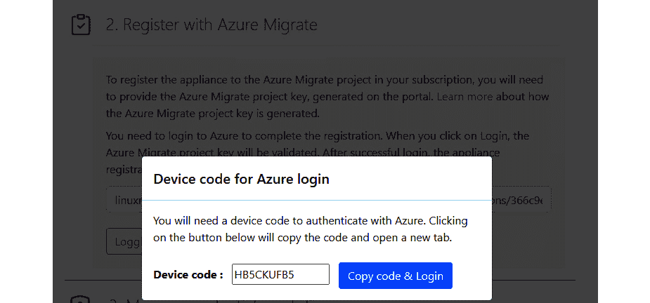

图 3.13：注册 Azure 迁移设备

1.  在新标签页中，您可以使用登录到 Azure 门户的凭据登录，如果验证成功，您将被要求关闭新打开的标签页。此外，如*图 3.14*所示，您将能够从 Azure 迁移设备屏幕上确认设备是否注册成功：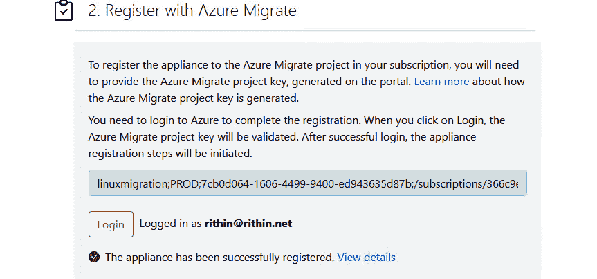

图 3.14：注册成功

1.  下一步是向 Azure 迁移设备提供 Hyper-V 集群的凭据，以便它可以运行 Discovery。您可以使用“添加凭据”并输入您的 Hyper-V 主机的凭据，如*图 3.15*所示，并保存它：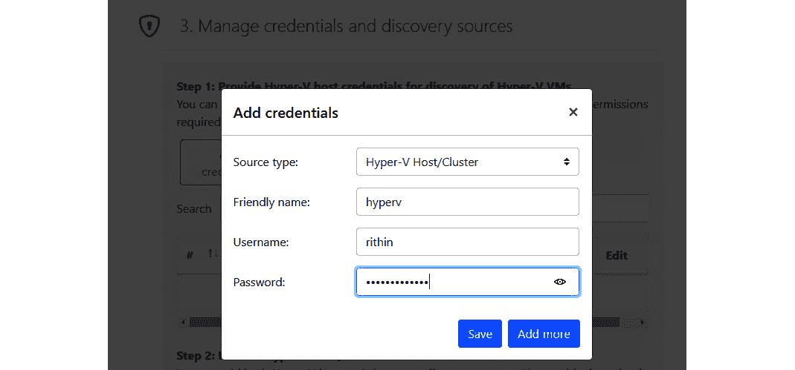

图 3.15：添加 Hyper-V 凭据

1.  由于我们已经存储了凭据，我们将使用这些凭据连接到我们的 Hyper-V 主机。您可以一次添加多个 Hyper-V 集群，或者您可以将列表导入为 CSV。在我们的情况下，我们有一个单独的服务器，我们需要为该服务器提供 IP 地址，并选择*步骤 5*中创建的凭据，如*图 3.16*所示：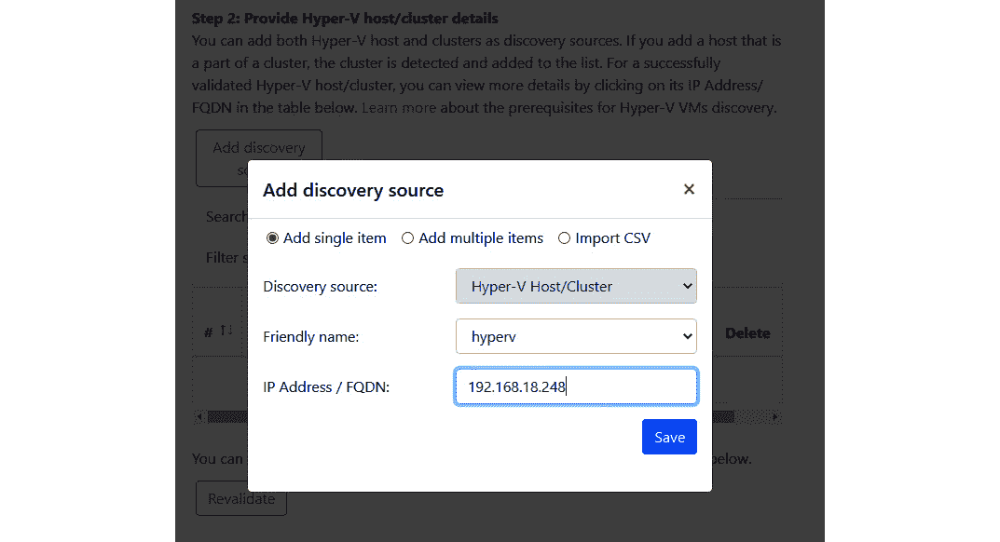

图 3.16：添加 Hyper-V 集群详细信息

1.  迁移设备将使用我们输入的凭据针对 IP 地址执行验证。如果凭据正确，您将能够看到成功消息，如*图 3.17*所示：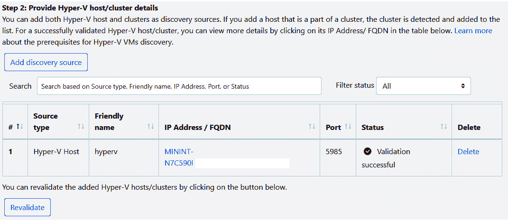

图 3.17：成功连接到主机

1.  现在我们已经完成了设备的配置，可以使用“开始发现”选项开始发现过程。发现过程可能需要一些时间，发现的数量将在 Azure 门户上反映出来。

#### 注意

由于设备使用 FQDN 进行连接，如果主机名无法通过 DNS 解析，您将无法发现任何虚拟机，并且重新验证将失败。解决方法是修改主机文件并添加 FQDN 和 IP 地址。

我们流程中的下一步是从 Azure 门户验证发现是否成功，设备是否能够发现所有虚拟机。在接下来的部分中，我们将看到如何从门户中验证发现过程。

### 在门户中验证已发现的虚拟机

发现过程完成后，您将能够从迁移设备中看到确认信息。现在，是时候在门户中检查设备是否能够将信息推送到我们的 Azure 迁移项目了。您可以使用以下步骤进行验证：

1.  打开 Azure 迁移仪表板。

1.  在 Azure 迁移 | 服务器 | Azure 迁移：服务器评估页面中，单击显示已发现服务器数量的图标。

在图 3.18 中，您可以看到发现成功，并且 Azure 门户指示已发现三个虚拟机：

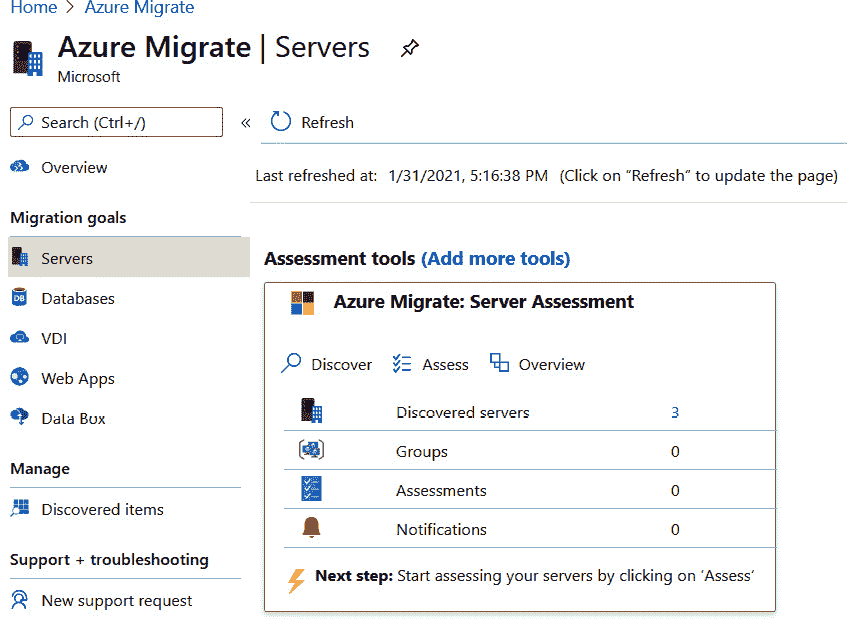

图 3.18：验证已发现的服务器

这里我们看到三个虚拟机，因为发现过程也包括了迁移设备。下一个步骤是对已发现的服务器运行评估，可以通过单击“发现”旁边的“评估”选项来完成。

### 运行评估

如“迁移评估”部分所述，评估会创建您的本地服务器清单。按照以下步骤运行评估：

1.  从 Azure 迁移：服务器评估中选择“评估”选项，如图 3.19 所示：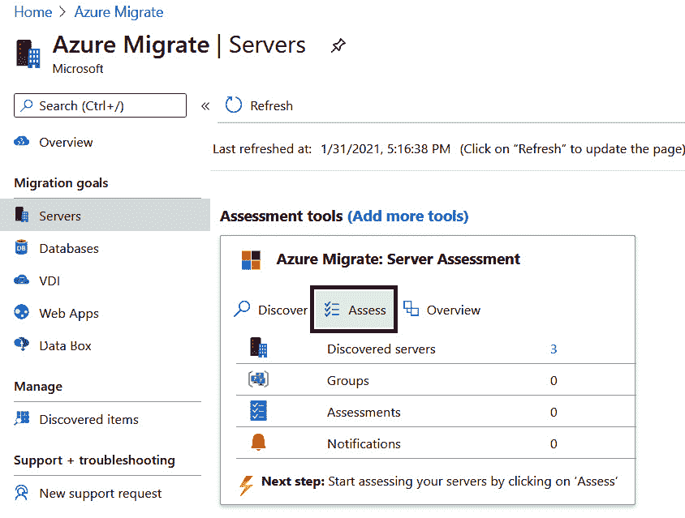

图 3.19：开始评估

1.  在评估服务器 | 评估类型中，选择类型为`Azure VM`，在发现源中，选择“从 Azure 迁移设备发现的机器”。您还可以选择上传您的清单作为 CSV 文件，并对其进行评估。评估属性部分将自动填充，并且您可以使用“编辑”按钮进行编辑（如果需要），如图 3.20 所示：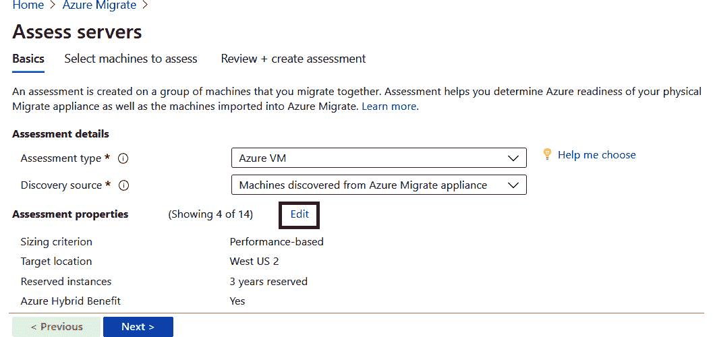

图 3.20：设置基本信息

1.  在评估属性编辑窗口中，您可以自定义目标属性、虚拟机大小和定价。这些因素用于运行评估和生成报告。此外，您可以在计算中包含 Azure 混合权益，以排除许可证成本（如果您已经购买了许可证）。您可以根据自己的需求更新这些因素。图 3.21 中显示了一个示例配置：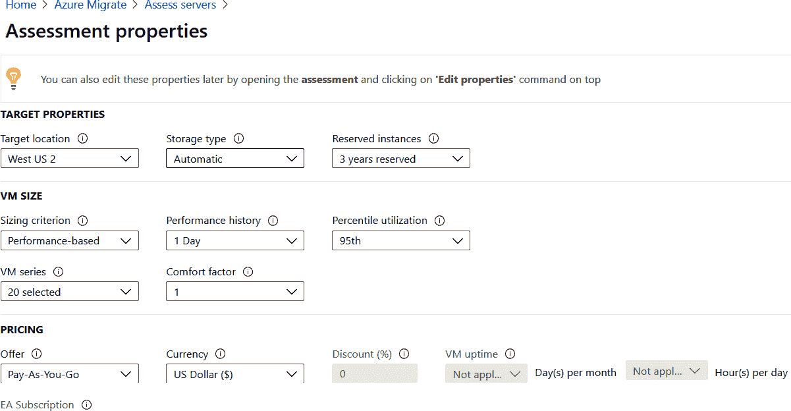

图 3.21：评估属性

1.  接下来，您可以为评估和服务器组提供名称。分组可以帮助您一起评估一组服务器。最后，我们将选择需要分配的服务器并将它们添加到组中，如图 3.22 所示：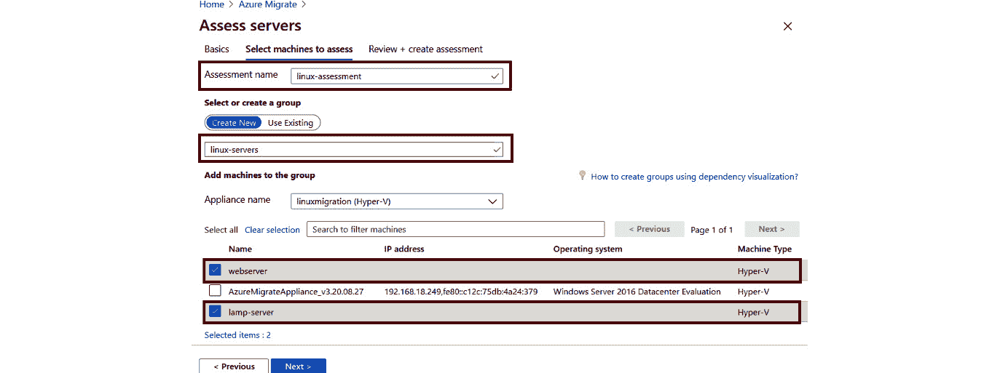

图 3.22：选择要评估的服务器

1.  最后一步是创建评估，这将创建组并对分组的服务器运行评估。

如果刷新评估工具，您会看到组和评估的值为 1，如图 3.23 中所示：

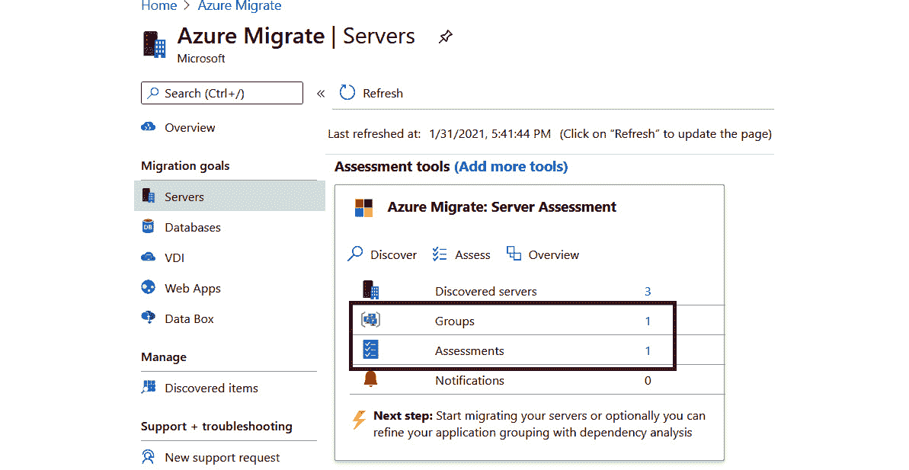

图 3.23：从 Azure 门户验证评估

#### 注意

如果数据不可见，请尝试使用“刷新”按钮，并等待系统刷新。

现在我们已经有了评估，是时候进行审核了。

### 审核评估

评估主要涉及三个主要因素：

+   **Azure 准备就绪**：发现的机器是否适合在 Azure 上运行 - 换句话说，它们是否准备好在 Azure 上运行？

+   **月度成本估算**：提供了在这些 VM 在 Azure 上迁移后运行所需的估算成本。成本细分也以计算成本和存储成本的形式提供。

+   **存储 - 月度成本估算**：迁移后的磁盘存储成本估算。

以下是查看评估所涉及的步骤：

1.  在服务器 | Azure 迁移：服务器评估中，单击 *图 3.23* 中可见的评估旁边的数字。

1.  在评估中，选择一个评估以打开它。您将能够看到评估报告，如 *图 3.24* 中所示：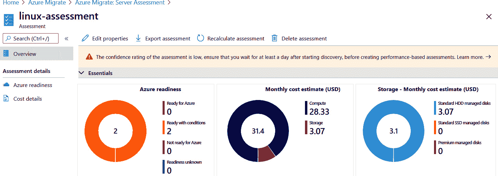

图 3.24：审查评估

1.  如果您想根据其他目标区域或任何其他属性重新计算，可以编辑属性（使用 *图 3.24* 中所示的编辑属性选项）并重新运行评估。

在这里，我们只发现了 VM；但是，我们尚未执行依赖性分析。此评估报告可以导出到 Excel 表中，并与利益相关者共享。

在下一节中，我们将看到如何使用代理设置 Azure 迁移中的依赖性分析。

### 依赖性分析

依赖性分析仅支持 VMWare VM 和 Hyper V VM。从其他平台（如 Xen）或甚至来自其他云提供商（如 AWS 和 GCP）发现的 VM 不支持依赖性分析。

如“服务映射”部分所述，我们只能在 Hyper V 环境中运行基于代理的依赖性分析。对于 VMWare VM，它支持基于代理和无代理的依赖性分析。

要开始分析，我们需要将日志分析工作区与我们的 Azure 迁移项目关联起来。可以执行以下步骤将工作区与 Azure 迁移：服务器评估关联起来：

1.  一旦您发现了要评估的机器，在服务器 | Azure 迁移：服务器评估中，单击概述。

1.  在 Azure 迁移：服务器评估中，单击基本信息。

1.  在 OMS 工作区中，单击需要配置，如 *图 3.25* 中所示：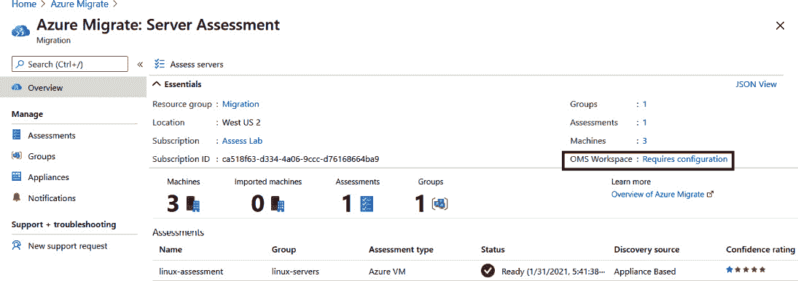

图 3.25：设置 OMS 配置

1.  一旦您选择了需要配置，如 *图 3.25* 中所示，您将被提示在 Azure 订阅中创建新的日志分析工作区或关联现有的工作区。

1.  如果您没有现有的工作区，请按 *图 3.26* 中所示创建一个新的工作区：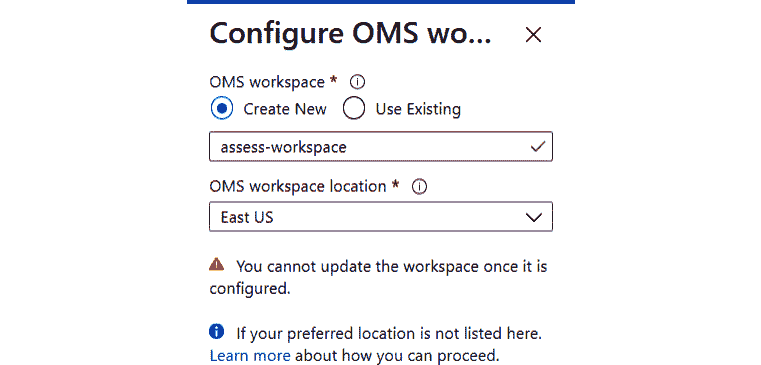

图 3.26：创建日志分析工作区

1.  下一步是下载并安装用于依赖性可视化的代理。为此，我们需要导航到发现的服务器并检查依赖性（基于代理）列。有时，此列将被隐藏，您可以使用“列”选项启用它。

1.  我们将选择 *图 3.27* 中所示的需要安装代理的发现的 VM，以安装代理。为了方便演示，让我们在 LAMP 服务器上安装代理：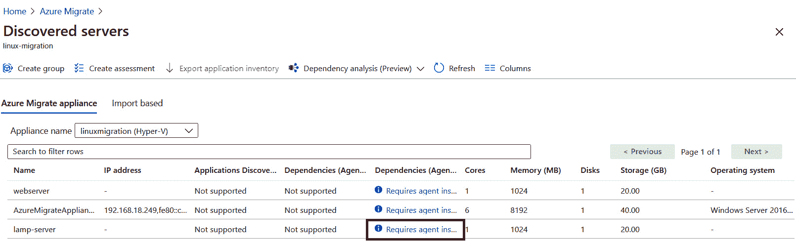

图 3.27：选择代理安装

1.  门户将向您提供在 Windows 和 Linux 服务器上安装代理的步骤。我们对 Linux 服务器感兴趣，因此将遵循该过程。此外，我们需要记下 *图 3.28* 中显示的工作区 ID 和工作区密钥。这是配置代理所需的：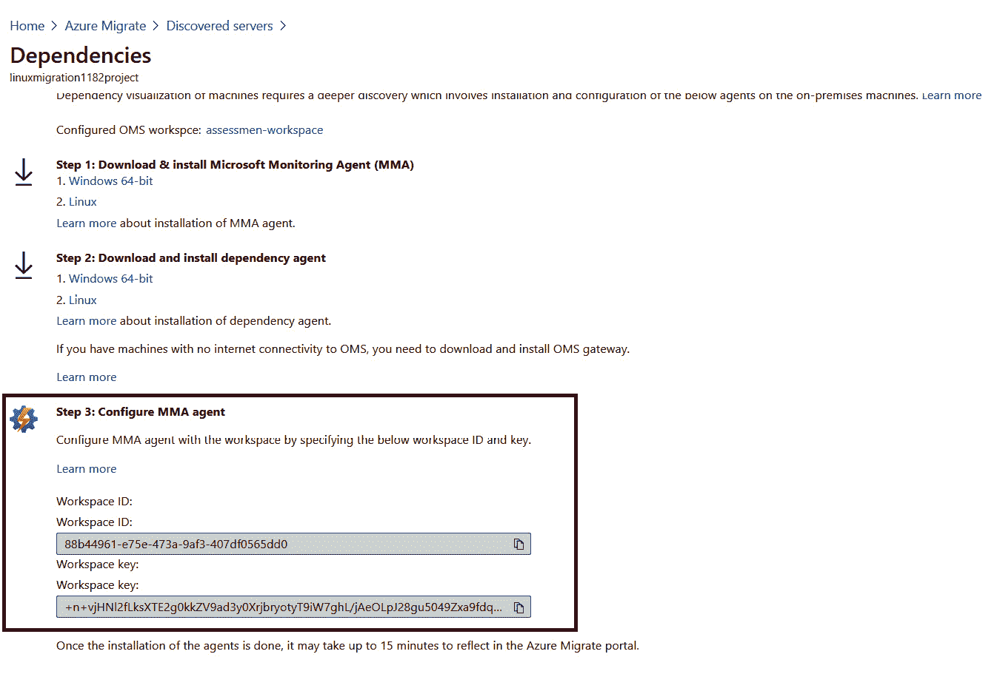

图 3.28：工作区信息

1.  您可以在 Linux 中使用 `wget` 命令下载它，也可以将其下载到计算机上，然后使用 `SFTP/SCP` 将其传输到 Linux 机器上。让我们使用 `wget` 下载它，并在 Linux 服务器上配置代理。

1.  您可以从门户复制代理的链接并将其传递给 `wget` 以下载文件，如 *图 3.29* 所示：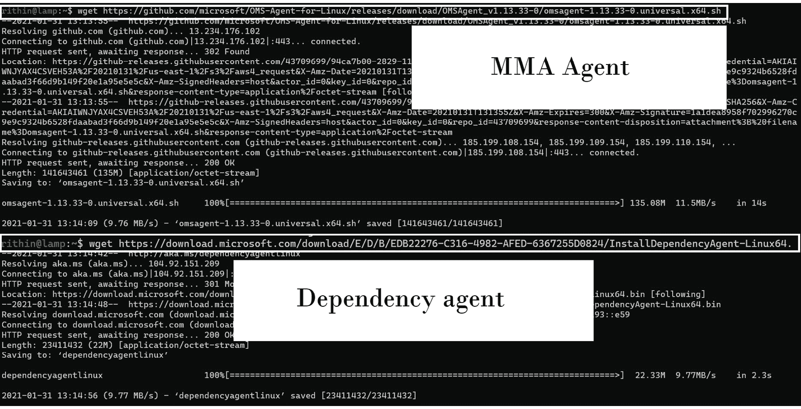

图 3.29: 下载代理

1.  MMA 代理可以使用以下命令安装：

```
sudo wget https://raw.githubusercontent.com/Microsoft/OMS-Agent-for-Linux/master/installer/scripts/onboard_agent.sh && sh onboard_agent.sh -w <YOUR WORKSPACE ID> -s <YOUR WORKSPACE PRIMARY KEY>
```

`workspace id` 和 `workspace key` 可以从 Azure 门户获取，如 *图 3.28* 所示。在撰写本书时，MMA 代理的最新版本为 `1.13.33-0`，我们将按照 *图 3.30* 所示进行安装：

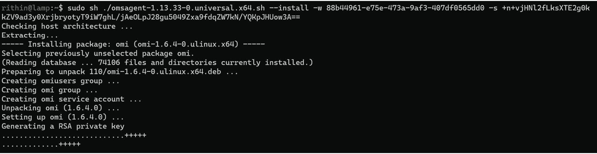

图 3.30: 安装 MMA 代理

1.  现在，我们必须下载并安装依赖代理，使用以下命令：

```
wget --content-disposition https://aka.ms/dependencyagentlinux -O InstallDependencyAgent-Linux64.bin
sh InstallDependencyAgent-Linux64.bin
```

1.  安装依赖代理后，我们将能够从 Azure 迁移中看到依赖关系：服务器评估。单击“已发现的服务器”。在“依赖性”列中，单击“查看依赖性”以查看服务器的依赖关系。加载依赖性预计需要一些时间。

您还可以对 Log Analytics 工作区运行 Kusto 查询，以查看连接并验证数据。

通过这样，我们已成功评估了部署在 Hyper-V 主机中的工作负载并设置了依赖性分析。我们在演示中使用了 Hyper-V。但是，在您的环境中，您可能正在使用 VMWare，因此 *表 3.2* 显示了可以用于评估其他环境的链接列表，以及 Hyper-V 文档：

| **平台** | **发现** | **评估** |
| --- | --- | --- |
| **Hyper-V** | [`docs.microsoft.com/azure/migrate/tutorial-discover-hyper-v`](https://docs.microsoft.com/azure/migrate/tutorial-discover-hyper-v) | [`docs.microsoft.com/azure/migrate/tutorial-assess-hyper-v`](https://docs.microsoft.com/azure/migrate/tutorial-assess-hyper-v) |
| **VMWare** | [`docs.microsoft.com/azure/migrate/tutorial-discover-vmware`](https://docs.microsoft.com/azure/migrate/tutorial-discover-vmware) | [`docs.microsoft.com/azure/migrate/tutorial-assess-vmware-azure-vm`](https://docs.microsoft.com/azure/migrate/tutorial-assess-vmware-azure-vm) |
| **物理服务器** | [`docs.microsoft.com/azure/migrate/tutorial-discover-physical`](https://docs.microsoft.com/azure/migrate/tutorial-discover-physical) | [`docs.microsoft.com/azure/migrate/tutorial-assess-physical`](https://docs.microsoft.com/azure/migrate/tutorial-assess-physical) |
| **AWS** | [`docs.microsoft.com/azure/migrate/tutorial-discover-aws`](https://docs.microsoft.com/azure/migrate/tutorial-discover-aws) | [`docs.microsoft.com/azure/migrate/tutorial-assess-aws`](https://docs.microsoft.com/azure/migrate/tutorial-assess-aws) |
| **GCP** | [`docs.microsoft.com/azure/migrate/tutorial-discover-gcp`](https://docs.microsoft.com/azure/migrate/tutorial-discover-gcp) | [`docs.microsoft.com/azure/migrate/tutorial-assess-gcp`](https://docs.microsoft.com/azure/migrate/tutorial-assess-gcp) |
| **导入 CSV** | N/A | [`docs.microsoft.com/azure/migrate/tutorial-discover-import`](https://docs.microsoft.com/azure/migrate/tutorial-discover-import) |

表 3.2: 其他平台的评估文档

这个实验室的目的是让你了解步骤并熟悉这个过程。在我们结束本章之前，让我们快速浏览一下我们到目前为止讨论过的主题的简要总结。

## 总结

评估当前架构和工作负载是迁移项目的一个非常重要的部分，正如我们在本章中所学到的。为此，我们使用 Azure 迁移创建了一个扎实的评估报告。我们还讨论了在 Azure 上计算成本节省的工具，并进行了迁移评估的实验室操作。

在本章中，我们还讨论了一些流行的 Linux 工作负载，包括 LAMP 栈和数据库服务器。我们还涵盖了一些更具技术难度的场景，包括高性能计算、集群、共享存储和 SAP 应用程序。

在“项目前准备”部分，还涵盖了涉及正确的项目团队成员的重要性，这可以确保您拥有所有必要的技能，包括网络和 Linux 管理，用于您的迁移项目。

下一章将专注于实际迁移，您将有机会在实验室中运用到目前为止学到的一切。
