# 第四章：迁移到 Azure

本章概述了如何根据前一章中完成的工作负载评估执行真实的迁移项目。我们创建了两个实践实验室，向您展示现实生活中的迁移如何实施。

第一个实践实验室为您提供了如何使用 Azure Migrate 将 Linux 服务器从 Hyper-V 主机迁移到 Azure 的实际示例。第二个实验室将指导您如何使用 Azure 数据库迁移服务（DMS）将 MySQL 服务器迁移到 Azure。

在现实生活中执行迁移并不总是像听起来那么容易。我们见过的大多数问题幸运地并不实际上与技术相关，而更多地涉及规划和项目管理。如果您将本书的教训应用到您的项目中，您将能够避免相同的陷阱。

例如，我们知道的一个具体的迁移项目最初计划需要几个月的时间，大约有 500 台虚拟服务器需要迁移到 Azure。项目的复杂程度比最初计划的要高。项目开始后不久就出现了一些问题。负责迁移的团队严重低估了项目所需的资源和技能。最终，项目范围被缩小，并邀请外部云专家就项目中一些最困难的部分提供建议。毫不奇怪，其中一些部分与 Linux 补丁管理、订阅管理和安全性有关。你还记得我们在本书中早些时候谈到过这些话题吗？现在你知道为什么了。

项目进度表得到了相当多的延期，项目花费的时间比最初计划的要长得多。在项目进行过程中，客户还决定不迁移一些较旧的应用程序，而是决定开始开发这些应用程序的新的云原生版本。从迁移项目的角度来看，这给项目进度安排带来了一些重大挑战。在前一章中，我们谈到了评估和高质量项目规划的重要性，有充分的理由。

为什么项目失败了？项目团队没有使用任何迁移评估工具，他们也缺乏适当的迁移执行工具。此外，他们在管理这样的项目方面经验不足，也缺乏云迁移和一些待迁移工作负载的专业知识。

即使成功迁移到 Azure，由于错误的配置或人为错误，仍可能出现意外问题。在出现虚拟机引导问题、远程 SSH 访问不起作用等问题时，您可以联系 Microsoft Azure 支持。在第六章《故障排除和问题解决》中，我们将更多地讨论可能出现的问题和故障排除场景，以及如何解决这些问题。

我们在本书中已经多次提到过，但由于这是如此重要的建议，让我们再说一遍：确保您的客户——无论是内部还是外部客户——对项目有承诺是成功迁移项目的关键因素。我们想要重复的第二条建议是使用正确的工具来帮助您进行迁移。在前一章中，我们介绍了 Azure Migrate 用于进行成功评估，因此我们可以相当肯定项目团队对待迁移的工作负载有正确的了解。

在本章中，我们将涵盖以下主题：

+   实践迁移实验室

+   迁移服务器到 Azure

+   迁移数据库

在本章结束时，您将学会如何正确使用正确的工具。

## 实践迁移实验室

在第三章的“实践评估实验室”部分，“评估和迁移规划”中，我们看到了工作负载的评估和依赖分析是如何进行的。这些是迁移框架中至关重要的步骤，我们目前处于“迁移”阶段。本实验室有两个部分。第一部分涉及服务器的迁移，我们将把我们的 LAMP 服务器之一迁移到云端，并验证该站点是否按预期工作。在第二种情况下，我们正在将 Linux 上的 MySQL 数据库迁移到 Azure MySQL 托管数据库。在第一种情况下，我们正在从 IaaS 迁移到 IaaS，而在第二种情况下，我们正在从 IaaS 迁移到 PaaS 解决方案。让我们开始服务器的迁移。

### 将服务器迁移到 Azure

正如前面所解释的，Azure Migrate 服务既是“评估”阶段的工具，也是“迁移”阶段的工具。在“评估”阶段，我们依赖于服务器评估工具，在“迁移”阶段，我们专注于服务器迁移工具。如果您在跟随，您可以使用来自“第三章”“评估和迁移规划”的评估实践实验室中的相同迁移项目。否则，您可以创建一个新的项目。

在这个阶段，您的**虚拟机**（**VM**）将被复制到云端，稍后这个复制的磁盘将用于启动一个 VM。这与我们在 Azure Site Recovery 中设置跨区域故障转移的方式非常相似。Azure Migrate 在后台使用站点恢复来完成迁移过程，其中您的服务器不断地被复制到站点恢复保险库。

*图 4.1*显示了我们要迁移到 Azure 的服务器：

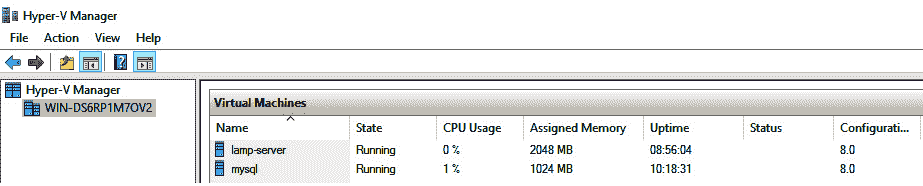

图 4.1：Hyper-V 中的虚拟机

LAMP 服务器将用于演示使用 Azure Migrate 进行服务器迁移，而 MySQL VM 将使用 DMS 进行迁移。您可以从 GitHub 部署一个 LAMP 应用程序——有许多存储库包含简单 LAMP 服务器的文件。演示中使用的存储库是从[`github.com/Anirban2404/phpMySQLapp`](https://github.com/Anirban2404/phpMySQLapp)克隆的。LAMP 安装在 GitHub 存储库中有所涵盖。

我们将把过程分解为各个阶段，从安装提供商开始，一直到切换。

### 安装提供商

在评估的情况下，我们在本地 Hyper-V 服务器上部署了 Azure Migrate 应用程序，以将发现的数据发送到云端。同样，在“迁移”阶段，我们将在我们的 Hyper-V 服务器上安装一些软件提供商，即站点恢复提供商和 Microsoft Azure 恢复服务代理。在评估阶段部署的迁移应用程序在服务器迁移中没有任何作用——该服务器的目的是发现本地虚拟机并创建清单。以下步骤可用于安装提供商：

1.  导航到 Azure Migrate 项目|服务器，在 Azure Migrate:服务器迁移下点击“发现”，如图 4.2 所示：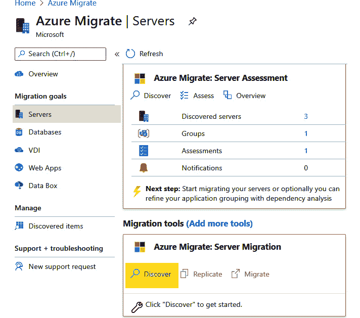

图 4.2：导航到迁移工具

在*图 4.2*中，您可以看到服务器评估工具，上一个实验室的结果以及我们将在本实验室中使用的迁移工具。

1.  点击“发现”后，我们将被要求确认我们的服务器部署在哪个平台上。我们将选择是，使用 Hyper-V，如图 4.3 所示。除此之外，我们还将设置目标区域。这是迁移后您的服务器将部署的区域。在这里要记住的一件事是，一旦确认了目标区域，就不能为该项目更改。Azure 将显示一个带有相同内容的横幅，并且您必须通过选中复选框同意此条件。之后，我们可以点击“创建资源”，站点恢复保险库将在后台创建：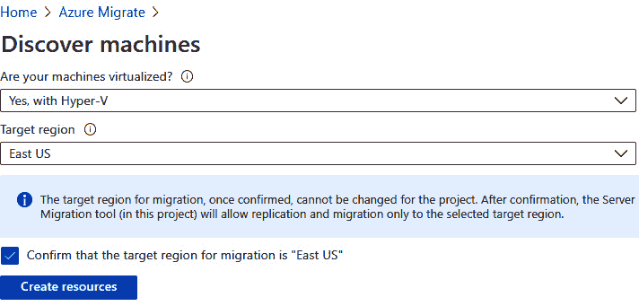

图 4.3：确认目标区域并创建资源

1.  Azure 提供了非常直观的步骤来完成复制，从在我们的 Hyper-V 服务器上安装复制提供程序软件开始。步骤将如*图 4.4*所示提示给您：

图 4.4：审查迁移步骤

1.  我们将按照*图 4.4*中的步骤。让我们下载站点恢复提供程序软件并安装在我们的 Hyper-V 服务器上，并下载注册密钥。您可以通过**远程桌面协议**（**RDP**）将安装文件和注册密钥复制到 Hyper-V 服务器，或者您可以使用文件共享。安装是一个两步过程，需要一些时间来安装。安装完成后，您将收到一个类似下面的窗口，您可以使用“注册”按钮继续，而不是“完成”按钮：

图 4.5：安装站点恢复提供程序

1.  现在是时候使用之前复制的注册密钥了。点击*图 4.5*中显示的“注册”按钮。在下一个屏幕上，您将被要求选择注册密钥，其余的细节将自动填充，如*图 4.6*所示。点击“下一步”继续：

图 4.6：选择注册密钥

1.  您不必配置使用代理进行连接——让服务器直接连接到站点恢复而不使用代理服务器。点击下一步并继续注册过程。

1.  最后阶段是注册，这将需要一些时间。一旦注册完成，窗口将提示如*图 4.7*所示：

图 4.7：完成注册

1.  现在我们需要回到 Azure 门户并重新打开项目以完成注册。如果连接成功，您将在 2\.完成注册下看到注册的 Hyper-V 主机。点击*图 4.8*中显示的“完成注册”按钮。如果您看不到已注册的主机，请按照 Azure 在同一页面上提供的故障排除指南进行操作：

图 4.8：完成注册

1.  您将在屏幕上收到一条消息，说注册可能需要大约 15 分钟才能完成。在我们将机器复制到 Azure 之前，我们需要等待此过程完成。一旦过程完成，您将收到一个注册完成的消息，如*图 4.9*所示：

图 4.9：注册完成

让我们看看如何发现可迁移的服务器。

### 发现服务器

我们的 Hyper-V 服务器已配置了提供程序，我们需要确保我们的 Azure 迁移项目发现了虚拟机。让我们返回 Azure 迁移登陆页面并刷新工具集。如*图 4.10*所示，您将看到迁移工具发现了两个虚拟机：

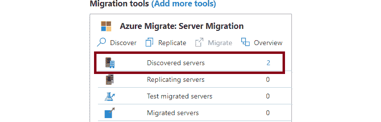

图 4.10：发现的服务器

我们可以看到我们的虚拟机被 Azure 迁移项目发现了，我们已经准备好复制这些发现的服务器。

### 复制服务器

如*图 4.10*所示，下一步是将我们的服务器复制到 Azure。为此，您需要点击“发现”旁边的“复制”选项。值得一提的是，在复制之前，您需要创建某些资源，否则您可能需要重新启动复制过程。因此，在开始复制之前最好先创建资源组、虚拟网络和复制存储帐户：

1.  复制是一个五步过程，我们将从源设置开始。在这里，您将选择虚拟化平台或您的源为 Hyper-V。

1.  在第二步中，您必须选择要迁移到云端的虚拟机。您可以使用评估结果并迁移，或者您可以手动指定迁移设置。为了演示目的和解释步骤，让我们选择手动选项。选择虚拟机，然后点击“下一步”，如*图 4.11*所示：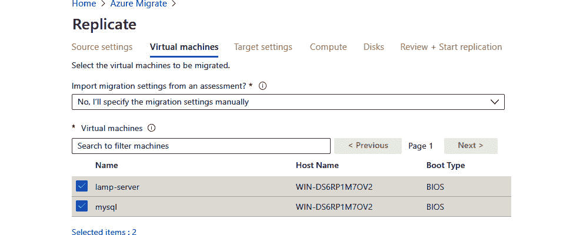

图 4.11：选择虚拟机

1.  现在是配置目标设置的时候，就像在 Azure 端的配置一样。您必须设置订阅、资源组、复制存储帐户（这是数据将被复制的地方）、虚拟网络、子网和可用性选项。目标位置无法更改。如前所述，如果您还没有创建这些资源，请随时在所选的目标区域创建这些资源，然后从*步骤 2*重新开始。如果您已经有了目标资源，配置将如下所示：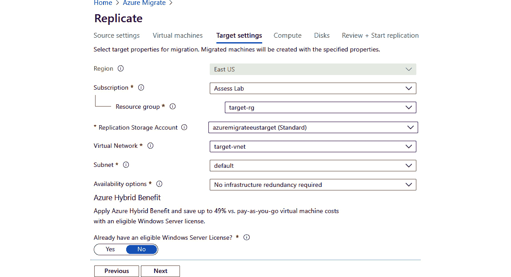

图 4.12：选择目标资源

1.  在目标设置选项卡中点击“下一步”将带您到计算选项卡，在那里您可以设置 Azure VM 大小、操作系统类型和您要迁移的操作系统磁盘名称。您可以将 Azure VM 大小设置为“自动选择匹配的配置”，如*图 4.13*所示，Azure 将选择与您的本地配置匹配的大小：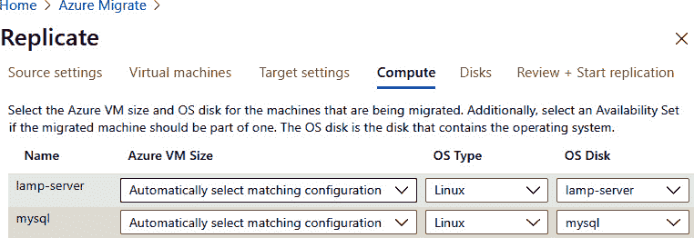

图 4.13：选择计算大小

1.  选择计算配置后，您可以点击“下一步”，向导将带您到磁盘选项卡。在这里，您将有机会选择要从本地复制的磁盘。如果需要，您还可以复制数据磁盘；但在我们的情况下，我们只有操作系统磁盘。配置将如*图 4.14*所示：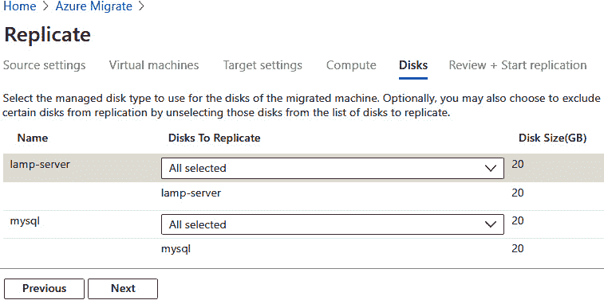

图 4.14：选择要复制的磁盘

1.  一旦您选择了磁盘，您可以点击“下一步”，然后您将到达最后一步。在这一步中，我们将审查目标配置，并点击“复制”将服务器复制到 Azure。

1.  我们可以从首页确认复制是否已经开始。如*图 4.15*所示，正在复制的服务器部分应该显示为两个，因为我们选择了两台服务器进行复制：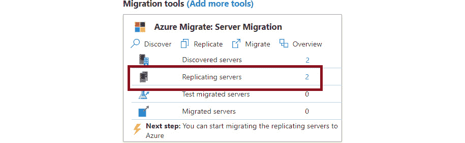

图 4.15：验证复制

1.  我们还可以点击 2，它有一个超链接显示复制的状态。这是一个漫长的过程，您可以像*图 4.16*所示跟踪它：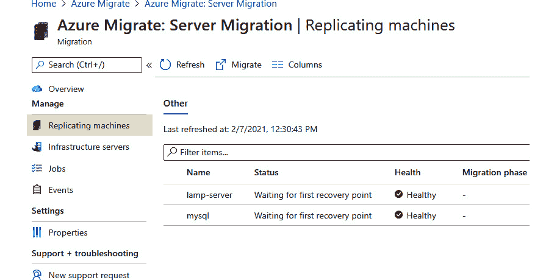

图 4.16：验证复制过程

1.  复制完成后，您将能够看到两个服务器的状态都变为“受保护”，如*图 4.17*所示：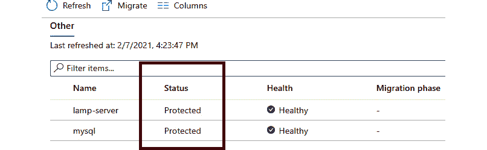

图 4.17：复制完成

我们的服务器已成功复制到 Azure。在迁移到生产环境之前，我们可以执行测试故障转移。测试故障转移有助于了解应用程序在我们进行生产切换之前是否正常工作。让我们执行测试故障转移，完成迁移过程。

### 迁移到 Azure

由于服务器已经复制，我们可以随时执行测试故障转移。执行测试故障转移不会中断任何服务——这个阶段是为了确认应用程序是否按预期运行。如果不是，我们可以采取措施进行纠正，并在没有生产停机的情况下重新尝试迁移。

让我们看看我们在本地 LAMP 应用程序中的应用程序是什么样子，这是一个从[`github.com/Anirban2404/phpMySQLapp`](https://github.com/Anirban2404/phpMySQLapp)创建的演示 LAMP 应用程序：


图 4.18：本地应用程序索引页面

正如本节开头所述，我们可以执行测试故障转移，看看我们的应用程序是否正常工作。为了执行测试故障转移，请按照以下步骤操作：

1.  导航到 Azure 迁移|服务器，并选择从迁移工具中复制，如*图 4.19*所示：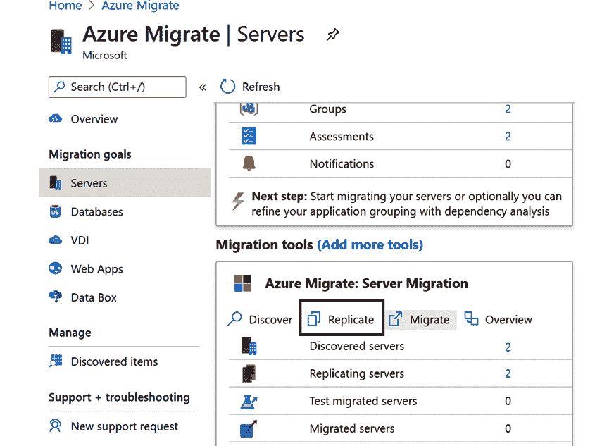

图 4.19：查看复制的服务器

1.  从下一个屏幕中，选择要进行测试故障转移的虚拟机，并单击最右侧的三个点。您将看到一个测试迁移选项，如*图 4.20*所示：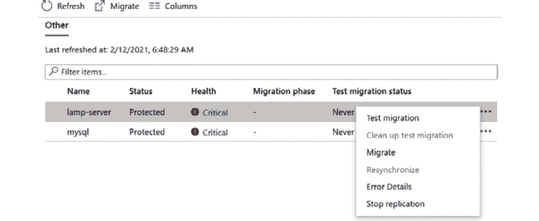

图 4.20 选择测试迁移

1.  选择要部署资源的虚拟网络，并选择*图 4.21*中所示的测试迁移：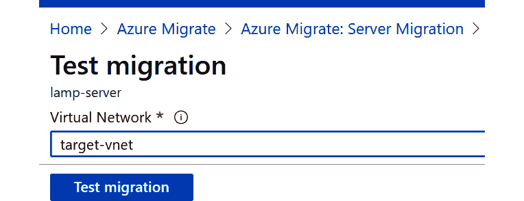

图 4.21：开始测试迁移

1.  一段时间后，您会看到资源已经创建。这里需要注意的一点是，在测试迁移期间创建的资源不会附加公共 IP 或 NSG。为了通过互联网检查它们，我们需要添加带有 SSH 和 HTTP 规则的公共 IP 和 NSG。如果您不确定如何进行更改，请参考[`docs.microsoft.com/azure/virtual-network/manage-network-security-group`](https://docs.microsoft.com/azure/virtual-network/manage-network-security-group)和[`docs.microsoft.com/azure/virtual-network/associate-public-ip-address-vm`](https://docs.microsoft.com/azure/virtual-network/associate-public-ip-address-vm)。

1.  一旦测试迁移状态显示为完成，您可以导航到在初始配置期间在 Azure 迁移项目中选择的目标资源组。资源将被部署，并在资源名称后面添加测试关键字作为后缀，如*图 4.22*所示：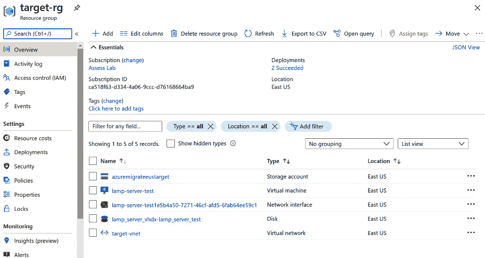

图 4.22：探索测试迁移资源

1.  您可以按照上述文档中提到的方法附加 NSG 和公共 IP 地址，然后可以通过在浏览器中打开显示的 IP 地址来测试迁移，如*图 4.23*所示：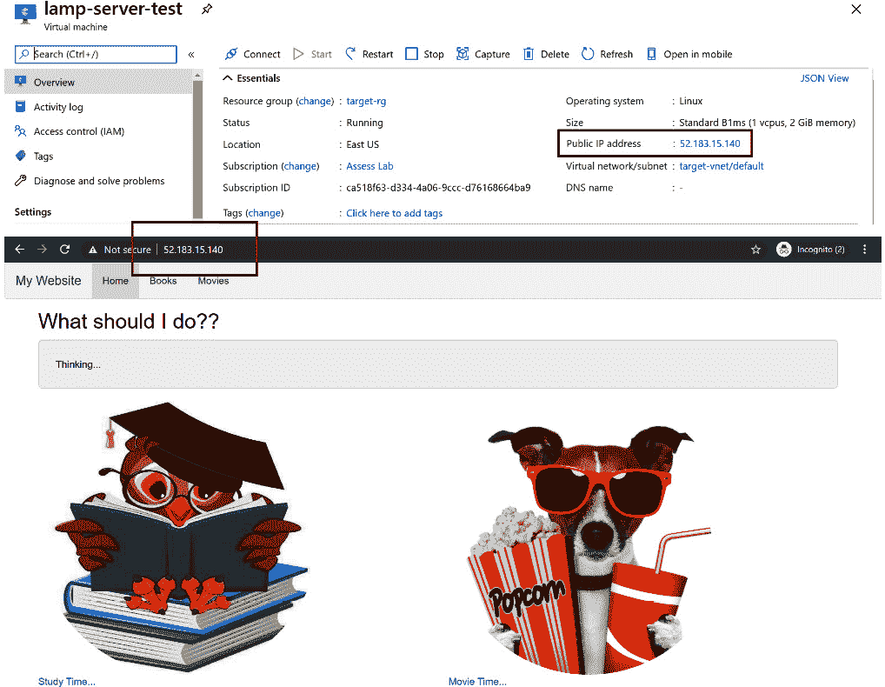

图 4.23：从浏览器验证应用程序

1.  一旦测试迁移完成，您需要清理测试迁移，然后执行实际迁移。可以使用清理测试迁移选项来完成此操作，如*图 4.20*所示。您将被要求添加您的备注并确认删除测试资源。

1.  清理测试资源后，我们可以执行实际资源的迁移。要开始迁移，请导航到 Azure 迁移|服务器，并选择从迁移工具中迁移，如*图 4.24*所示：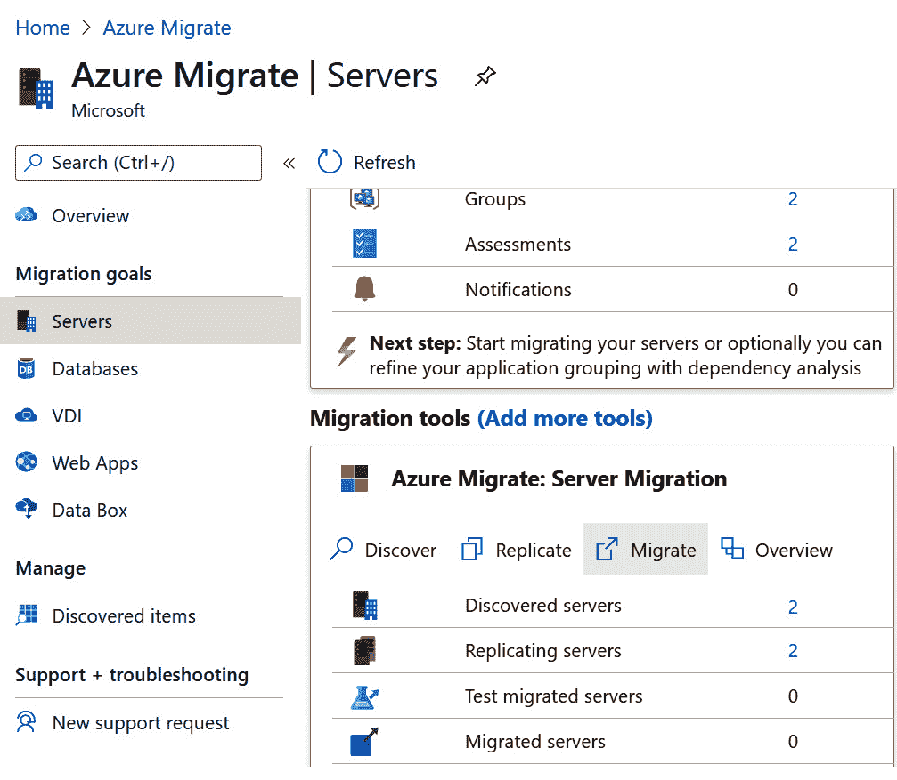

图 4.24：迁移服务器

1.  您将被询问是否要关闭机器以最小化数据丢失。选择是以关闭机器并执行计划迁移，数据不会丢失。如果选择不关闭虚拟机，将在迁移之前执行最终同步，但在最终同步开始后发生的任何更改都不会被复制。让我们选择否，并选择要迁移的机器，如*图 4.25*所示：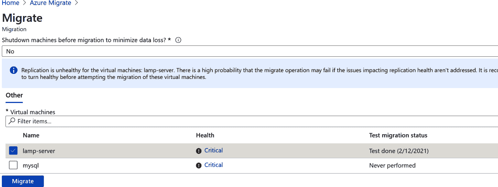

图 4.25：完成迁移

1.  正如我们在测试迁移中看到的那样，这个过程需要一些时间，资源将被创建在目标资源组中。服务器将没有公共 IP 或 NSG 附加到它们。您需要按照我们在测试迁移中遵循的文档中概述的过程来附加 NSG 和公共 IP。如果您还没有删除它们，您可以重用测试迁移中的 NSG 和公共 IP。

1.  看，我们在目标资源组中有我们的资源：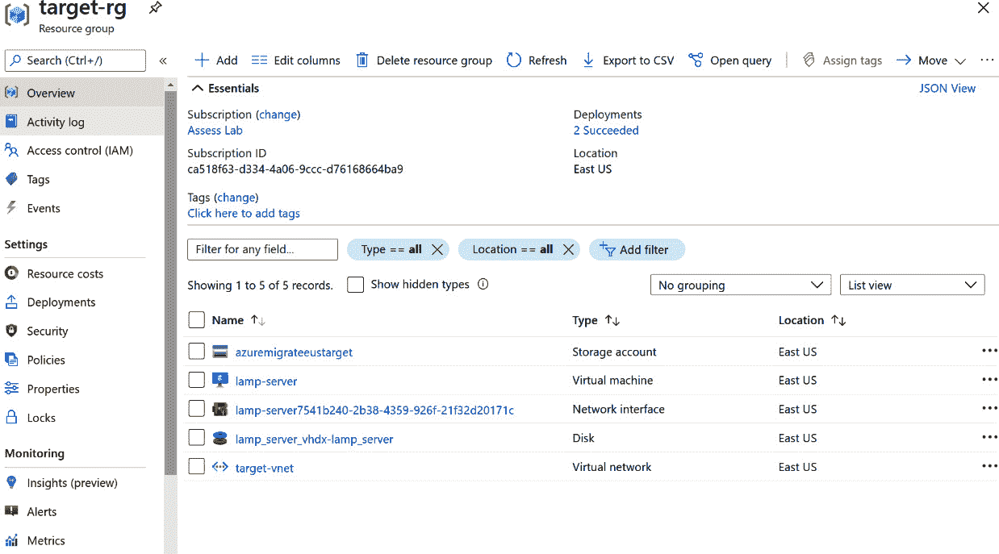

图 4.26：审查迁移后的资源

1.  如果我们返回到 Azure Migrate | 服务器并刷新项目，我们将得到我们所做迁移的摘要，如*图 4.27*所示：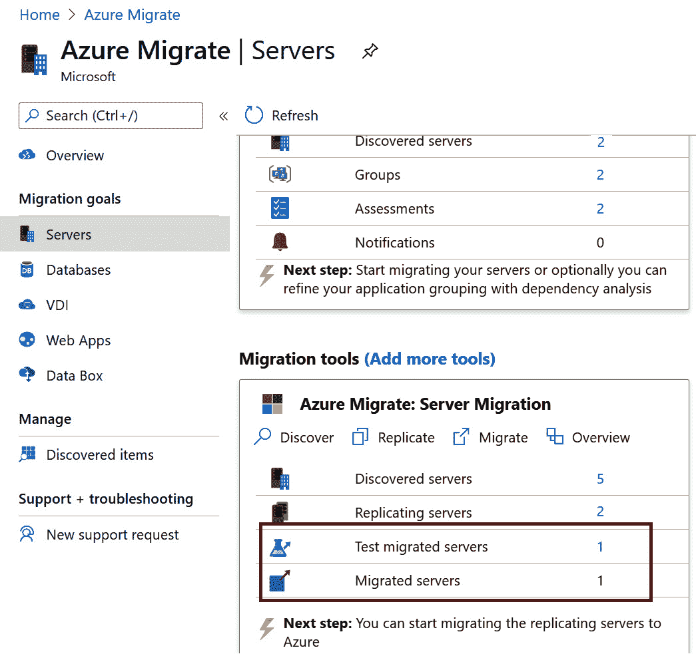

图 4.27：项目摘要

通过这样，我们已经看到了从本地 Hyper-V 主机到 Azure 的服务器迁移的端到端过程。正如本节介绍中提到的，接下来我们将看到如何将数据库迁移到 PaaS 解决方案。

### 迁移数据库

在*Migrating servers to Azure*部分，我们看到了如何借助 Azure Migrate 将服务器迁移到 Azure。我们可以像在 LAMP 服务器的情况下那样直接从 IaaS 迁移到 IaaS。然而，在本节中，我们将把数据库迁移到 PaaS 解决方案。您可以使用任何可以公开访问的本地 MySQL 服务器。如果没有，为了演示目的，您可以在 Azure 中创建一个虚拟机并安装 MySQL。为了使用这些实验数据，您需要在 MySQL 服务器中运行以下 SQL 脚本：

```
CREATE DATABASE MOVIES;
USE MOVIES;
CREATE TABLE horror_tbl (movie_id int NOT NULL PRIMARY KEY auto_increment, movie_title varchar(100) NOT NULL, movie_year int NOT NULL);
INSERT INTO horror_tbl(movie_title, movie_year) VALUES ('Exorcist',1973), ('Hereditary',2018), ('The Conjuring',2013), ('The Shining',1980), ('Texas Chainsaw Massacre',1980), ('The Ring',2002), ('Halloween',1978), ('Sinister',2012), ('Insidious',2010), ('IT',2017);
```

尽管 IaaS 在控制和管理方面提供了很多灵活性，但 PaaS 帮助开发人员或管理员轻松部署并提高生产率，因为大部分管理任务都由 Microsoft 执行。PaaS 提供了很多时间节省，因为底层硬件、操作系统补丁和更新以及维护任务都由 Azure 负责。

为了将数据库迁移到 PaaS，我们将使用一个名为 Azure DMS 的服务。DMS 使客户能够从众多数据库源执行在线和离线迁移到 Azure 数据平台，最小化服务中断或停机时间。

DMS 提供两种不同的方法来迁移数据库：离线迁移或在线迁移。离线迁移要求在迁移开始时关闭服务器，因此这种方法涉及停机时间。另一方面，在线迁移遵循实时数据的持续复制，还允许在任何时间切换到 Azure，最小化停机时间。

Azure DMS 提供两种定价层：

+   **标准**：仅支持离线迁移。此层不收费。

+   **高级**：支持离线和在线迁移。前六个月不收费—之后，此层将产生费用。

现在我们对 DMS 有了一些了解，让我们继续创建一个实例。

### 创建数据库迁移服务实例

这个过程包括多个步骤：

1.  在所有服务窗格中找到 Azure 数据库迁移服务，或者直接搜索它。您可以通过点击 New 或 Create azure database migration service 来启动创建过程，如*图 4.28*所示：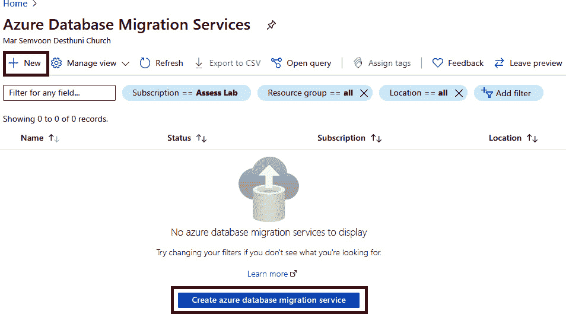

图 4.28：创建数据库迁移服务实例

1.  创建过程非常简单 - 您需要为订阅、资源组、迁移服务名称和位置输入值。此外，还有选择定价层和服务模式的选项。如前所述，此服务有两个定价层：标准（仅支持离线迁移）和高级（支持离线和在线迁移）。此外，还有两种服务模式：Azure，在这里我们将选择上述定价层之一，以及混合，其中工作程序托管在本地。在撰写本书时，混合模式处于预览状态。创建过程如*图 4.29*所示：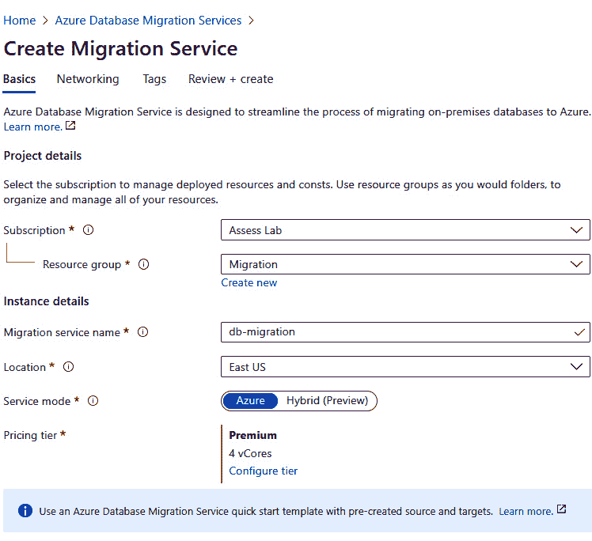

图 4.29：配置基本信息

1.  我们需要的下一个配置是网络配置，我们将在其中创建一个虚拟网络。您可以选择现有的虚拟网络或创建一个新的虚拟网络。此虚拟网络将被服务用于通过互联网与源数据库通信。配置如*图 4.30*所示：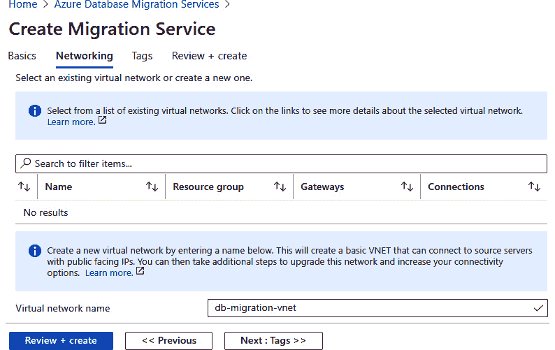

图 4.30：创建新的虚拟网络

1.  单击“审阅+创建”将启动验证过程，并将创建服务。

现在我们已经创建了 DMS 实例，下一步是配置迁移项目。在此之前，我们需要在 Azure 中创建目标数据库。由于我们正在迁移 MySQL，因此需要为 MySQL 服务器创建 Azure 数据库。

### 创建和配置目标资源

如前所述，我们要创建的服务是 Azure Database for MySQL 服务器。这是 Microsoft Azure 提供的托管服务，利用了 MySQL Community Edition 版本 5.6、5.7 和 8.0。让我们创建目标资源以迁移数据：

1.  在搜索栏中搜索 MySQL，您将能够在 Azure 门户中看到 Azure Database for MySQL。通过单击“新建”按钮开始创建新数据库。

1.  我们将选择单服务器模型，因为它已经准备好投入生产，成本优化，并且具有内置的高可用性。您可以选择灵活服务器，该服务器提供高级定制，并且在撰写本书时处于预览状态。

1.  向导将带您完成创建过程。您需要填写详细信息，并根据您的要求配置服务器的计算、存储和定价层。由于我们处理的是一个非常小的数据库，在实际情况下，您应该将 Azure 服务器的计算和存储与本地配置匹配，以避免性能问题。配置如*图 4.31*所示：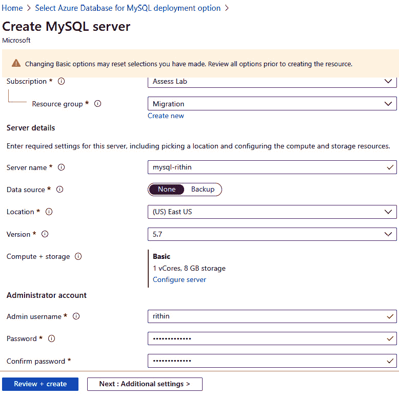

图 4.31：创建 Azure Database for MySQL 服务器

1.  有了这个，我们可以选择“审阅+创建”选项，然后选择“创建”选项，数据库将被配置。

1.  在配置完数据库后，我们需要创建一个目标表，将来自本地数据库表的数据迁移到其中。我们将创建一个空表，并在创建迁移项目时将其映射到我们的本地数据库。

1.  服务器管理员登录名可以从我们在*步骤 3*中创建的数据库的概述窗格中获得。

1.  您可以使用安装了 MySQL 工具的任何 Linux 或 Windows 计算机或 Azure Cloud Shell 来使用我们在 Azure 中部署的服务器。在这里，让我们像*图 4.32*中所示那样从 Bash shell 连接：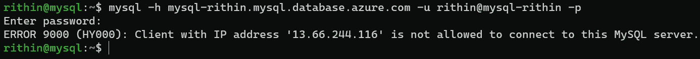

图 4.32：使用 Bash 连接到 Azure MySQL

在这里，连接将失败，因为我们连接的计算机的 IP 地址不在允许的 IP 地址列表中，防火墙将阻止我们连接。

1.  要将您的 IP 地址添加到允许的 IP 地址列表中，您可以转到我们创建的服务器并单击“连接安全性”。如果您使用 Azure Cloud Shell，您必须启用“允许访问 Azure 服务”。由于我们使用的是本地机器，我们将像*图 4.33*中所示添加我们的 IP 地址并保存配置：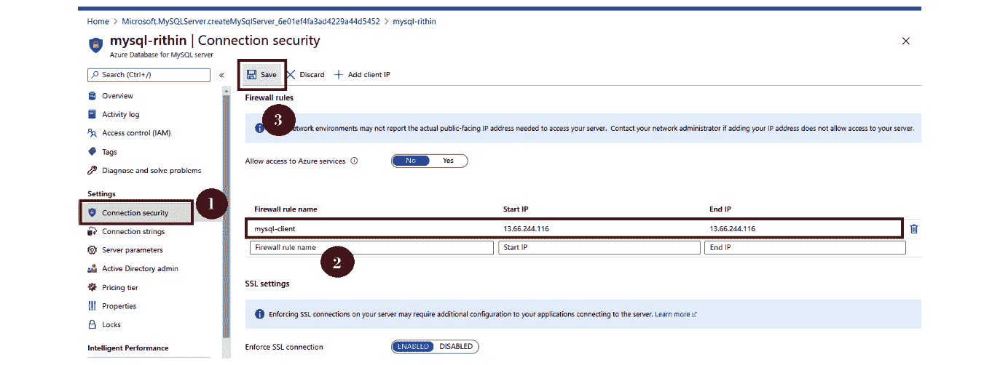

图 4.33：配置防火墙

1.  现在我们已经将我们的 IP 地址添加到防火墙中，让我们尝试从 Bash 重新连接并查看连接是否成功。您可以在*图 4.34*中看到登录成功：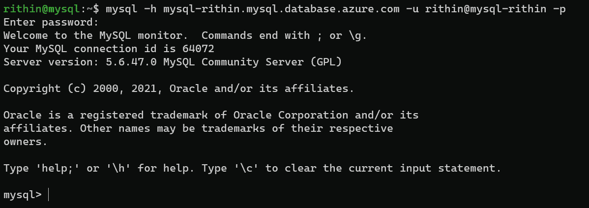

图 4.34：登录到 MySQL

1.  我们的本地服务器包含一个名为`horror_tbl`的数据库和一个表。基本上，这个表存储了恐怖电影的名称和它们上映的年份。我们需要在 MySQL 服务器中创建一个类似的表，以便数据可以迁移。使用以下命令创建一个新的数据库和表：

```
CREATE DATABASE movies;
USE movies;
CREATE TABLE horror_tbl( 
        movie_id INT NOT NULL AUTO_INCREMENT, 
        movie_title varchar(150) NOT NULL, 
        movie_year int NOT NULL, 
        PRIMARY KEY ( movie_id ) );
```

1.  这是在本地基础设施和 Azure 中数据库的外观：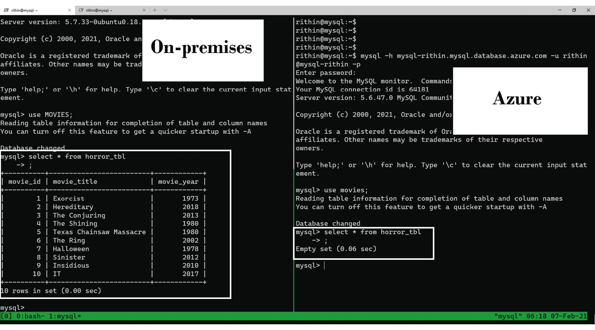

图 4.35：比较本地和 Azure 中的数据集

从前面的图中可以看出，本地数据库包含数据，而 Azure 数据库为空。现在我们需要从源数据库提取模式并将其应用到目标数据库。

### 迁移示例模式

为了提取模式，您可以使用带有`--no-data`参数的`mysqldump`命令。语法如下：

```
mysqldump -h {servername} -u {username} -p --databases {database name} \
  --nodata > /path/to/file
```

在我们的场景中，我们需要提取`MOVIES`数据库的模式。由于我们是从 MySQL 服务器本身执行命令，所以不需要使用`-h`参数。但是，如果您在远程服务器上执行此操作，请考虑使用`-h`参数。在我们的情况下，以下命令就足够了：

```
mysqldump  -u root -p --databases MOVIES --no-data > schema.sql
```

如果您有多个数据库并希望一次提取所有数据库的模式，还可以使用`--all-databases`参数。如果查看模式文件，它将类似于以下 SQL 脚本：

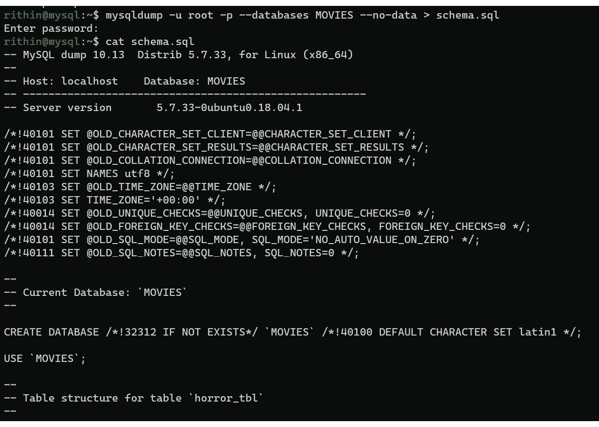

图 4.36：检查模式文件

现在我们需要使用以下语法将这些数据导入到 Azure 数据库的 MySQL 中。如果网络允许连接，可以直接从托管本地数据库的 VM 运行此命令。否则，需要在可以连接到 Azure 数据库或直接进入 Cloud Shell 的机器上导入模式。

```
mysql -h {servername} -u {username} -p {database name} < /path/to/schema
```

在我们的情况下，您需要使用您的 Azure 数据库的 MySQL 凭据替换服务器名称和登录名：

```
mysql -h mysql-rithin.mysql.database.azure.com -u rithin@mysql-rithin \
-p movies < schema.sql 
```

导入过程后，我们需要切换回 DMS 并创建迁移项目。

### 创建迁移项目并迁移数据库

要为数据库创建迁移项目，我们需要返回到 DMS。可以使用以下步骤创建项目：

1.  转到 Azure 数据库迁移服务，并选择“新迁移项目”，如*图 4.37*所示：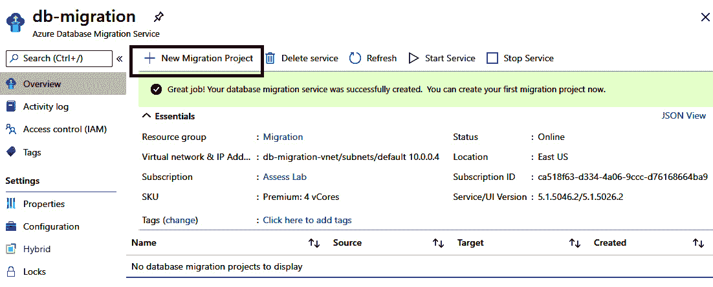

图 4.37：创建迁移项目

1.  创建是一个非常简单的过程。我们需要为项目输入一个名称，设置源服务器类型（在我们的情况下是 MySQL），设置目标服务器类型，即 Azure 数据库的 MySQL。最后，将活动类型设置为在线数据迁移，因为我们计划在没有任何停机时间的情况下进行迁移。目前 MySQL 不支持离线选项。配置如*图 4.38*所示：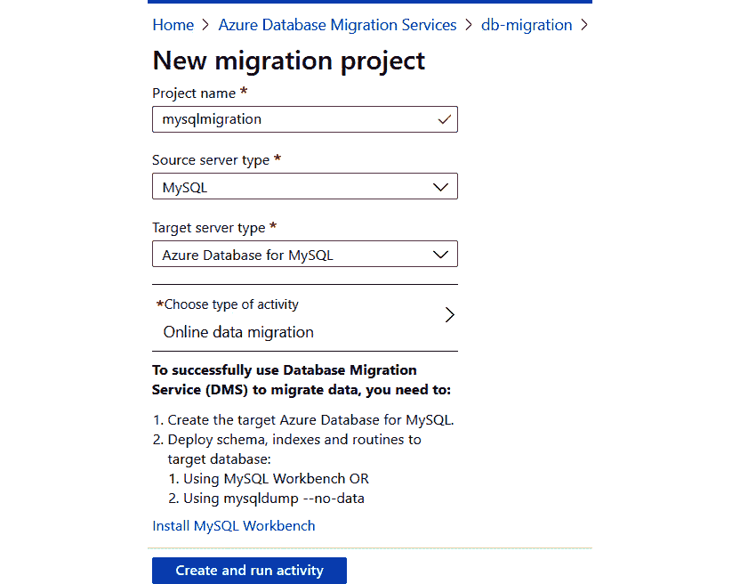

图 4.38：配置项目

1.  项目配置完成后，点击“创建并运行活动”。这将带您到 MySQL 到 Azure 数据库的 MySQL 在线迁移向导。

1.  向导中的第一步是配置源。在这里，我们需要为我们的公共可用本地服务器设置源服务器名称、服务器端口、用户名和密码，如*图 4.39*所示：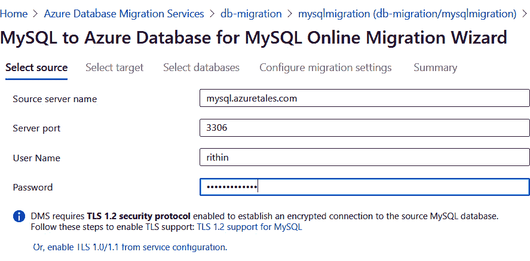

图 4.39：连接到源数据库

#### 注意

如果 MySQL 服务器没有正确配置，您可能会遇到错误。可能需要在`mysqld.cnf`中配置 bind-address、bin-logs，并创建一个具有管理员权限的新用户才能成功连接。请参阅[`docs.microsoft.com/azure/dms/tutorial-mysql-azure-mysql-online#prerequisites`](https://docs.microsoft.com/azure/dms/tutorial-mysql-azure-mysql-online#prerequisites)。

1.  现在我们需要配置目标，包括设置目标服务器名称、用户名和密码。目标服务器名称和用户名可以从 Azure 中我们的 MySQL 服务器的概述窗格中找到。密码是您在服务创建时输入的密码，如果忘记了，可以使用重置密码选项。目标服务器的详细信息应配置如下：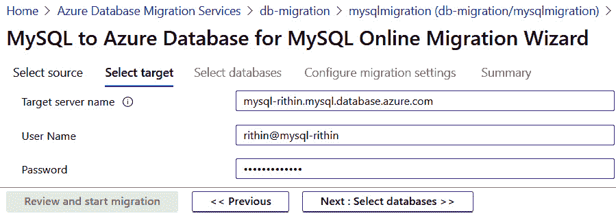

图 4.40：配置目标服务器

#### 注意

您可能会收到一个错误消息，指出 IP 地址不允许连接到 MySQL 服务器。从错误消息中，您可以获取 DMS 的公共 IP 并将此 IP 添加到 MySQL 的连接安全窗格以实现成功连接，或者启用允许 Azure 服务访问。但是，这将允许订阅中的所有 Azure 服务访问数据库。

1.  下一步是选择需要迁移到云端的源数据库。该工具将显示本地服务器上可用的数据库。选择源数据库和相应的目标数据库。在我们的情况下，我们将`MOVIES`数据库（位于本地）映射到我们之前创建的`movies`数据库。*图 4.41*显示了如何从源到目标进行映射：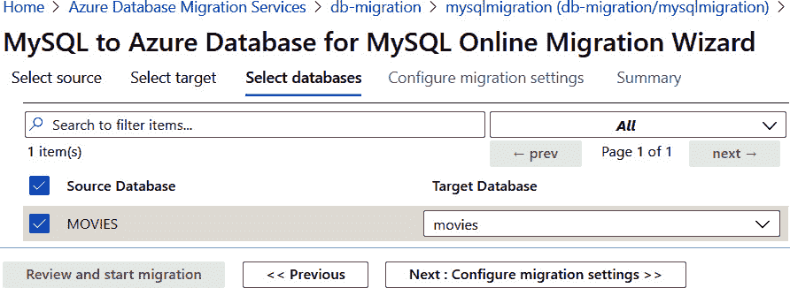

图 4.41：映射数据库

1.  我们正在接近最后一步，可以在那里配置迁移设置。在这个阶段，您可以指定需要迁移的表以及已选择`horror_tbl`表的设置：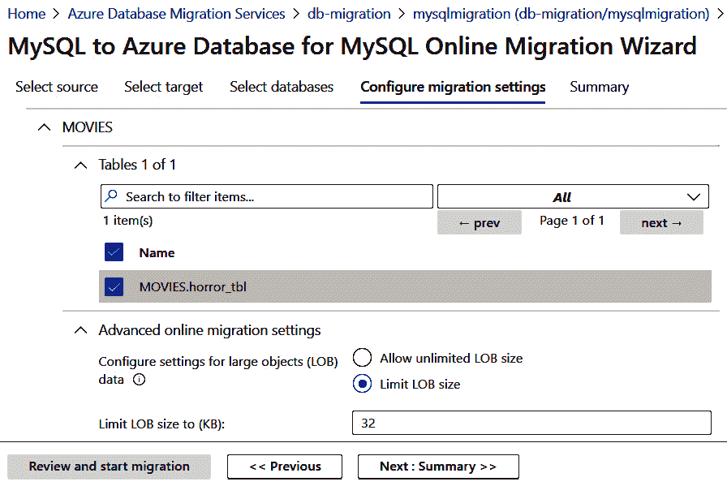

图 4.42：配置数据库迁移设置

1.  然后，我们继续到摘要选项卡，在那里我们需要为此活动添加一个名称并审查我们迄今为止所做的配置。点击开始迁移将启动从本地服务器到 Azure 服务器的迁移。

1.  很快我们将被重定向到一个页面，显示迁移状态和源服务器和目标服务器的详细信息，如*图 4.43*所示：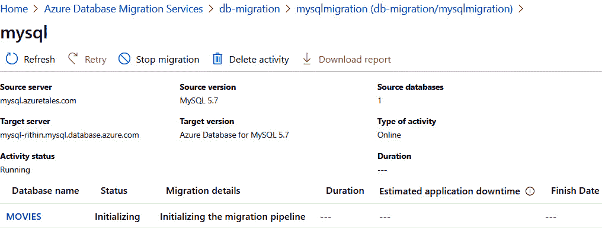

图 4.43：检查迁移状态

1.  由于我们的数据集有 10 行，完成迁移并通知我们准备切换的时间不到 5 秒。如果选择开始切换，Azure 将提供提交任何未决事务的步骤，如*图 4.44*所示，之后您就可以将应用程序指向这个数据库：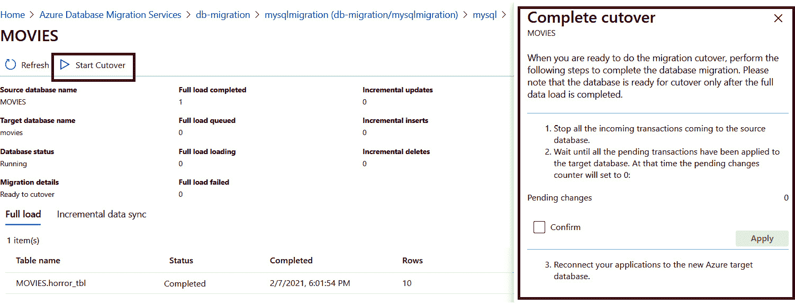

图 4.44：开始切换

1.  即使没有启动切换，您也可以检查 Azure MySQL 实例并验证我们的记录是否存在。以下是使用 Bash 连接到实例进行的验证：

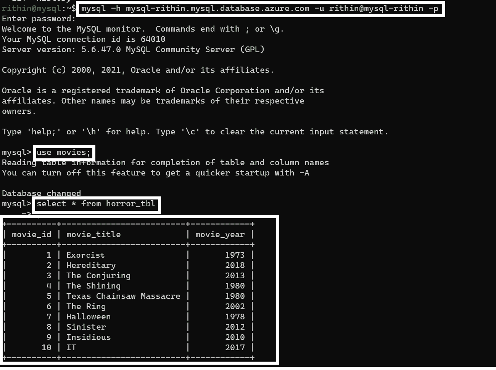

图 4.45：在迁移后验证 Azure Database for MySQL 服务器中的数据

从*图 4.45*可以明显看出，我们确实连接到了 Azure MySQL 实例。

尽管我们进行了来自 Hyper-V 的迁移以进行演示，但 Azure 迁移支持其他平台，DMS 也支持其他数据库类型。*表 4.1*显示了包括 Hyper-V 在内的其他平台的官方 Microsoft 内容的链接：

| **平台** | **链接** |
| --- | --- |
| **VMware** | [`docs.microsoft.com/azure/migrate/server-migrate-overview`](https://docs.microsoft.com/azure/migrate/server-migrate-overview) |
| 物理服务器 | [`docs.microsoft.com/azure/migrate/tutorial-migrate-physical-virtual-machines`](https://docs.microsoft.com/azure/migrate/tutorial-migrate-physical-virtual-machines) |
| **AWS 实例** | [`docs.microsoft.com/azure/migrate/tutorial-migrate-aws-virtual-machines`](https://docs.microsoft.com/azure/migrate/tutorial-migrate-aws-virtual-machines) |
| **GCP 实例** | [`docs.microsoft.com/azure/migrate/tutorial-migrate-gcp-virtual-machines`](https://docs.microsoft.com/azure/migrate/tutorial-migrate-gcp-virtual-machines) |
| **Hyper-V** | [`docs.microsoft.com/azure/migrate/tutorial-migrate-hyper-v`](https://docs.microsoft.com/azure/migrate/tutorial-migrate-hyper-v) |
| **数据库迁移** | [`datamigration.microsoft.com/`](https://datamigration.microsoft.com/) |

表 4.1：其他平台的迁移文档

到此，我们已经完成了实践实验。总之，这个实践实验分为几个部分，您将使用 Azure 迁移迁移服务器，并使用 DMS 迁移数据库。

## 总结

本章重点是通过实践实验进行实际学习。首先，我们学习了如何在虚拟机中安装提供程序，然后运行了发现和复制过程。第一个实践实验以使用 Azure 迁移将虚拟机迁移到 Azure 为结论。

我们的第二个实践实验重点是使用 DMS 将 MySQL 数据库迁移到 Azure 数据库的 MySQL 服务。在这个实验中，我们首先创建了迁移服务，并将其配置为目标资源。然后我们迁移了一个示例架构。最后，我们创建了一个迁移项目，并将数据库迁移到 Azure。

将操作系统和数据库迁移到 Azure 只是我们云旅程的一步。自然而然的，下一步是在 Azure 上操作迁移的 Linux 工作负载。*第五章*，*在 Azure 上操作 Linux*，将为您提供有关此主题的一些实际指导。
