# 第五章：5\. 在 Azure 上操作 Linux

如果您回忆一下我们之前分享的迁移路线图，它是一个四阶段的过程。在前两章中，我们涵盖了*评估*和*迁移*的里程碑。在*第三章*，*评估和迁移规划*中，我们讨论了对迁移的正确评估和彻底规划的必要性，因为它们是过程中不可避免的一部分。我们还讨论了在我们的迁移旅程中完成这些里程碑所使用的工具，在*第四章*，*执行迁移到 Azure*中，我们将两台 Linux 服务器从 Hyper-V 迁移到 Azure。第一台服务器是 Ubuntu LTS，第二台是一个 MySQL 服务器，它被转换成了 Azure Database for MySQL 服务。

要记住的一件事是旅程并不止步于此。在本章中，我们将主要关注剩余阶段：*优化*和*管理与安全*。我们需要确保工作负载得到优化，并且安全性是一流的。在本地环境中，安全性通常完全由您处理。然而，在云的情况下，您正在将工作负载部署到云提供商的数据中心。在这里，安全性将是一个主要关注点，但您不必担心。Azure 提供了许多服务，可以改变您的云部署的安全格局。

*优化*阶段主要关注于分析您的成本，使用建议改进基础设施，并进行再投资以实现更多。另一方面，*管理与安全*阶段更多地涉及安全、数据保护和最终监控。

本章的一些关键要点包括：

+   在 Azure 上优化成本

+   使用 Azure Linux 代理和扩展

+   Azure 上的 Linux 打补丁

+   基础设施监控

让我们继续我们的迁移旅程，转向下一个里程碑*优化*，在那里我们将学习 Azure 中的许多成本优化技术。

## 优化

在这个阶段，您可能已经成功将您的服务迁移到 Azure 云。然而，正如本章介绍中所提到的，旅程并不会在此结束。如果您记得，在我们的迁移过程中，我们有选择在 Azure 中创建虚拟机的大小。为了演示目的，我们让 Azure 决定目标虚拟机的大小。在这一点上，会出现一些问题，例如：*大小决策是否正确？迁移的工作负载是否运行高效？*

这些问题的答案在*优化*阶段中得到解答。在这个阶段，我们确保迁移的工作负载从成本和性能的角度高效运行。让我们继续讨论一些主要从成本角度优化工作负载的工具。

在之前的章节中，我们讨论了各个阶段中使用的相关工具。同样，*优化*阶段也有一套工具，客户可以利用这些工具来优化工作负载。让我们看看这些工具。

### Azure 成本管理

**Azure 成本管理**（**ACM**）是一个令人惊叹的工具，可用于分析不同管理范围的运行成本，如计费帐户、管理组、订阅、资源组，甚至在资源级别。例如，您可以从 Azure 门户中选择任何订阅，单击成本分析刀片将为您提供有关订阅中所有资源相关成本的完整分解。*图 5.1*显示了 ACM 中使用不同图表可视化成本的方式：

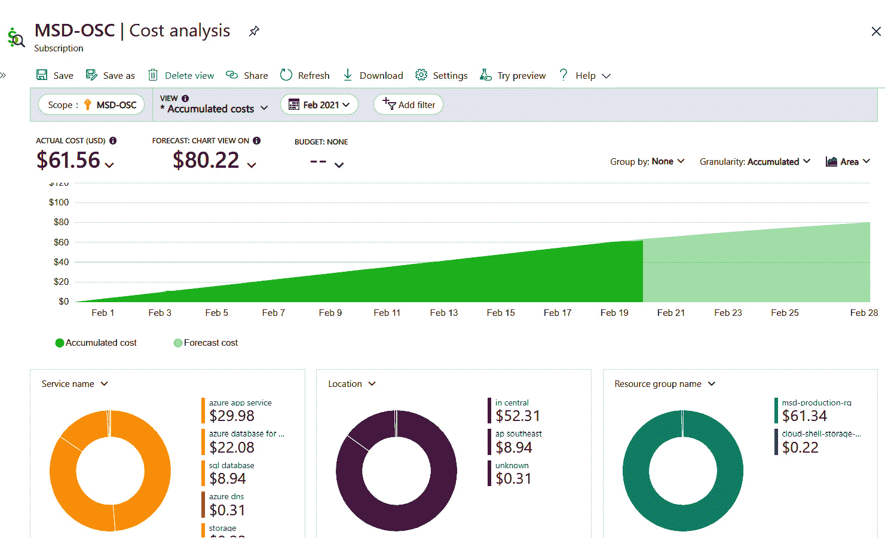

图 5.1：ACM 视图

如果您仔细观察*图 5.1*，在实际成本（美元）旁边，您可以看到在“预测：图表视图”下的预测成本。预测是使用当前部署的资源进行的。除此之外，ACM 提供预算和警报功能，这样当您超过预算阈值时，您将收到通知。此外，您可以将预算与操作组集成，并调用 Azure Functions 或 Azure Logic Apps，在您超过阈值时自动关闭工作负载。

除了上述功能之外，ACM 还提供以下优势：

+   您可以使用 AWS 连接器从 ACM 监视您的 AWS 成本。

+   ACM 提供更丰富的 API，可用于在您喜欢的可视化工具中构建仪表板。

ACM 还有一个 Power BI 连接器，您可以利用它将成本管理的数据带入 Power BI。在撰写本书时，Power BI 连接器仅支持**企业协议**（**EA**）和**微软客户协议**（**MCA**）客户。**按使用量付费**（**PAYG**）客户必须使用 API 在 Power BI 中创建仪表板。

总之，ACM 在提供的功能和在云支出方面提供的可见性方面非常强大。您可以分析您迁移的服务或服务器的成本，并验证它们是否在您预期的预算范围内。如果不在，您可以考虑调整服务器的大小，前提是不会影响应用程序的性能。

有了这个，我们将继续介绍*优化*阶段中使用的下一个工具—Azure Advisor。

### Azure Advisor

Azure Advisor 可以为您提供建议，以审查和改进工作负载的优化和效率。Azure Advisor 现在已集成到 ACM 刀片中，以提供有关成本削减的建议。从成本削减的角度来看，建议包括调整未充分利用的 Azure 虚拟机的大小，利用额外的折扣，并将 PAYG 虚拟机转换为 Azure 保留实例，以获得运行 24x7 的工作负载的重大折扣。

对于未充分利用的资源，Azure Advisor 建议根据评估关闭或调整实例。评估指标可以在这里找到：[`docs.microsoft.com/azure/advisor/advisor-cost-recommendations`](https://docs.microsoft.com/azure/advisor/advisor-cost-recommendations)。

Advisor 的建议并不总是涉及成本—您将能够看到有关成本、安全性、可靠性、运营卓越和性能的建议。*图 5.2*显示了 Advisor blade 的视图，显示了不同的建议。在这种情况下，大部分建议已经完成，除了可靠性建议：

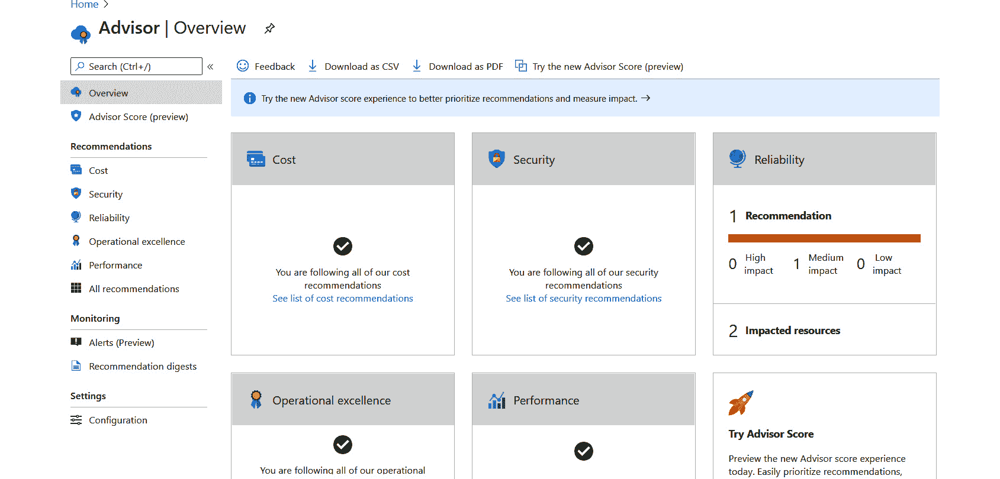

图 5.2：Azure Advisor 建议

这些建议可以下载为 CSV 或 PDF，您可以与在业务决策中发挥重要作用的其他利益相关者分享。

使用 ACM 分析成本并审查 Azure Advisor 提出的建议将帮助您优化 Azure 中的工作负载。现在，让我们继续我们的旅程的下一个阶段，称为*管理和安全*。

## 管理和安全

在这个阶段，我们将确保我们迁移的资源是安全的，并且它们被正确管理。这个阶段关乎安全和数据保护，我们将看一些用于实现这些目标的工具。

在 Azure 中，Linux 管理中最重要的部分之一是一个名为**Linux Agent**的小组件。

### Azure 的 Linux Agent

Azure `waagent`或`WaLinuxAgent`之间的 Linux 配置和交互。

Azure Linux Agent 管理 Azure 部署上 Linux 的以下功能：

+   镜像配置

+   网络路由和接口命名

+   内核配置

+   诊断配置

+   Microsoft **System Center Virtual Machine Manager** (**SCVMM**) 部署

+   虚拟机扩展

代理通过两个渠道与 Azure Service Fabric 进行通信。在虚拟机部署期间，代理会挂载一个符合**开放虚拟化格式**（**OVF**）的配置文件，该文件包含所需的配置细节。在运行时，通信是通过代理提供的 REST API 进行的，允许 Azure Fabric 向虚拟机推送信息和命令。

在创建自己的 Linux 镜像或修改现有镜像时，要记住代理不是完全单片的——它需要来自底层 Linux 系统的以下组件：

+   Python 2.6+

+   OpenSSL 1.0+

+   OpenSSH 5.3+

+   文件系统工具：`sfdisk`，`fdisk`，`mkfs`，`parted`

+   密码工具：`chpasswd`，`sudo`

+   文本处理工具：`sed`，`grep`

+   网络工具：`ip-route`

即使在技术上可以在 Azure 上运行没有代理的 Linux，也强烈建议始终在虚拟机中安装并激活代理。没有代理，您无法通过 Azure Fabric 运行任何远程命令到虚拟机。此外，Azure 也无法获取有关虚拟机的状态信息，也无法知道系统是否健康。

Azure 上所有认可的 Linux 发行版都预装了代理。对于您自己的镜像，您可以从 DEB 和 RPM 软件包安装代理，也可以使用基于 Python 的安装脚本。

#### 注意

您应该始终使用由 Linux 发行版供应商提供的虚拟机镜像版本的代理。只有在您的 Linux 版本没有官方软件包可用时才手动安装它。

以下是一些有用的命令，用于检查 Azure Linux 代理是否已安装并更新到最新版本：

+   要检查 Ubuntu 上是否已安装并显示当前版本号：

```
apt list –installed | grep walinuxagent
```

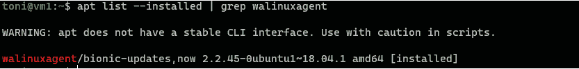

图 5.3：检查 Ubuntu 上 Azure Linux 代理版本号

或者，您可以运行`waagent --version`，这可以在任何发行版上使用，而无需运行任何与包管理器相关的命令。

+   要更新代理或在缺失时安装它，请运行以下命令：

```
sudo apt-get install walinuxagent
```

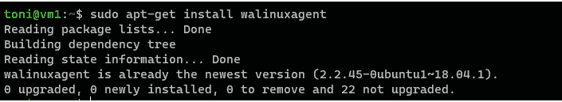

图 5.4：更新 Ubuntu 上的 Linux 代理

在我们的示例中，代理已经安装并且也是最新版本。

Azure Linux 代理具有内置机制来更新自身。编辑其配置文件`/etc/waagent.conf`以确保其已启用是很好的做法：

#### 注意

您可以从 GitHub 了解有关代理的技术细节，因为代理是作为开源发布的：[`github.com/Azure/WALinuxAgent`](https://github.com/Azure/WALinuxAgent)。

有关使用代理的文档可以在这里找到：[`docs.microsoft.com/azure/virtual-machines/extensions/agent-linux`](https://docs.microsoft.com/azure/virtual-machines/extensions/agent-linux)。

熟悉`cloud-init`也是很好的，它是一个非常流行的工具，用于在 Linux 虚拟机首次启动时进行自定义。它可以被视为 Azure Linux 代理的替代品。您可以在这里阅读更多信息：[`docs.microsoft.com/azure/virtual-machines/linux/using-cloud-init`](https://docs.microsoft.com/azure/virtual-machines/linux/using-cloud-init)。`cloud-init`适用于各种 Linux 发行版，并且不依赖于包管理器。

### 扩展

Azure 扩展是提供 Azure 虚拟机配置和自动化功能的小型辅助应用程序。这些扩展可以在虚拟机和操作系统部署并启动后使用。也可以在使用 Azure 资源管理器模板部署虚拟机时使用它们。

扩展是 Azure Linux 代理功能集的一部分，但每个扩展都有自己的功能和用例。

要列出 Azure 上 Linux 的所有可用扩展，可以运行以下 Azure CLI 命令：

```
az vm extension image list --location southeastasia --output table
```

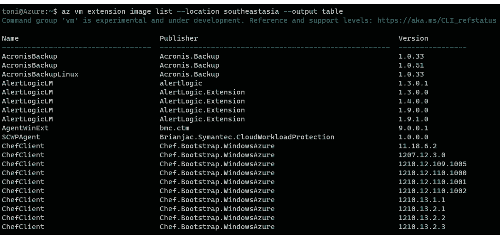

图 5.5：列出 Azure 上 Linux 的所有可用扩展

列表非常长，包含来自 Microsoft 和第三方发布商的扩展。在此示例中，我们使用了东南亚作为位置。除非您正在使用特定的远程位置，否则应选择最近的区域。

#### 注意

您可以在这里探索扩展图像模块的所有选项：[`docs.microsoft.com/cli/azure/vm/extension/image?view=azure-cli-latest#az-vm-extension-image-list`](https://docs.microsoft.com/cli/azure/vm/extension/image?view=azure-cli-latest#az-vm-extension-image-list)。

虚拟机扩展也可以在 Azure 门户中找到（参见*图 5.6*）。您可以在虚拟机属性下选择扩展，并使用安装向导添加它们：

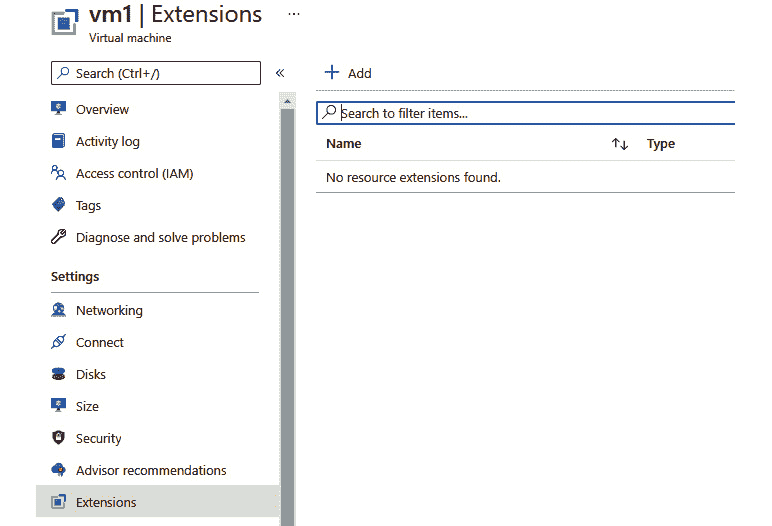

图 5.6：Azure 门户中的扩展设置

扩展不仅在部署工作负载和其配置时非常有用，而且在故障排除和调试过程中也非常有用。

### 数据保护

在 Azure 中，您的数据可以以多种方式和多个层次进行保护。Azure 支持的加密模型如下：

+   客户端和服务器端加密

+   Azure 磁盘和 Azure 存储服务加密

+   Azure Blob 的客户端加密

+   数据库和数据库服务的各种加密方法

+   数据传输加密

+   使用密钥保管库进行密钥管理

根据您的迁移工作负载及其架构，您可能希望在项目中利用一个或多个这些加密功能。

例如，如果您的源虚拟机使用加密文件系统，您可以将其迁移到 Azure。但出于性能原因，关闭文件系统加密并在 Azure 存储或托管磁盘上启用加密可能是有意义的。

如果您的整个本地存储系统都加密了，最合乎逻辑的选择就是在 Azure 存储级别进行加密。

#### 注意

您可以在加密概述文档中阅读更多关于各种加密功能的信息：[`docs.microsoft.com/azure/security/fundamentals/encryption-overview`](https://docs.microsoft.com/azure/security/fundamentals/encryption-overview)。

让我们更仔细地看看下一个功能。

### Azure 磁盘加密

用于 Linux 虚拟机的 Azure 磁盘加密使用*DM-Crypt*提供操作系统和数据磁盘的卷加密。它与*Azure Key Vault*集成，用于管理和控制您的加密密钥和机密。还与 Azure 安全中心集成，能够在您未加密虚拟机磁盘时发出警报：

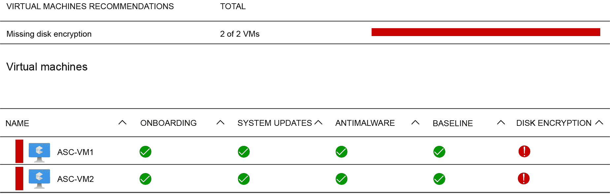

图 5.7：Azure 安全中心

在使用 Linux 虚拟机的 Azure 磁盘加密时，存在某些建议和限制，目前还没有直接的方法可以从 Linux 虚拟机的操作系统磁盘中移除加密，这使得在 ADE 操作系统加密的虚拟机出现“无启动/无 ssh”情况时，故障排除过程相当耗时。目前，*表 5.1*中显示的内存要求适用：

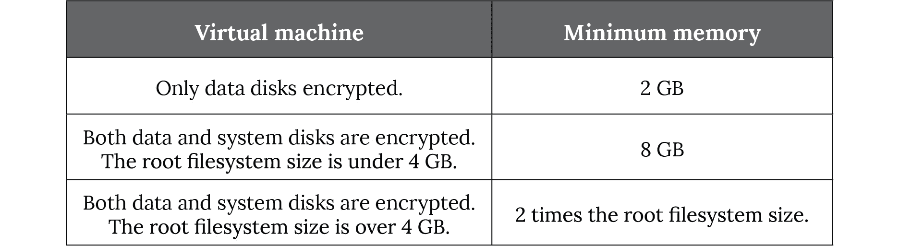

表 5.1：具有内存要求的虚拟机

#### 注意

一旦加密完成，您可以减少虚拟机的内存大小。

请记住，为了使用 Azure 磁盘加密，必须启用临时磁盘。在实际操作中，这使得 Dv4、Dsv4、Ev4 和 Esv4 类型的虚拟机无法使用磁盘加密。

另一个限制是目前不支持第 2 代虚拟机和 Lsv2 系列虚拟机。您可以在这里找到所有不受支持的场景的文档：[`docs.microsoft.com/azure/virtual-machines/linux/disk-encryption-linux#unsupported-scenarios`](https://docs.microsoft.com/azure/virtual-machines/linux/disk-encryption-linux#unsupported-scenarios)。

Azure 磁盘加密支持的 Linux 发行版列表非常广泛，但只涵盖了所有认可发行版的一个子集。由于列表经常更新，我们不会在这里包含它，但您可以在 Azure 文档中找到最新的列表：[`docs.microsoft.com/azure/virtual-machines/linux/disk-encryption-overview#supported-operating-systems`](https://docs.microsoft.com/azure/virtual-machines/linux/disk-encryption-overview#supported-operating-systems)。

接下来，让我们看看如何跟上 Azure 上 Linux 的更新和安全补丁。

### 在 Azure 上更新 Linux

Azure 提供了更新所有支持的 Linux 发行版的机制。对于一些发行版，微软有自己的更新存储库，从官方上游存储库镜像而来，而对于其他发行版，更新直接来自第三方供应商的存储库。

**Red Hat Enterprise Linux** (**RHEL**) 更新可以直接从 Azure 运行的 Red Hat Update Infrastructure 获取。这个更新存储库适用于 RHEL 的 PAYG 部署。对于使用**Bring-Your-Own-Subscription** (**BYOS**)方法部署的虚拟机，您需要使用 Red Hat 自己的更新服务器或您自己公司的 Red Hat Satellite 服务器来下载更新。

阅读有关 Azure 上 RHEL 更新和 Azure RHUI 的更多信息：[`docs.microsoft.com/azure/virtual-machines/workloads/redhat/redhat-rhui`](https://docs.microsoft.com/azure/virtual-machines/workloads/redhat/redhat-rhui)。

#### 注意

如果您有 Red Hat Satellite 服务器，您可以继续在 Azure 上使用它来管理已从本地迁移到 Azure 的 RHEL 虚拟机。Satellite 也可以与 BYOS 安装一起使用。

您不应该在 PAYG 镜像中使用 Satellite，因为这样会消耗您的 RHEL 客户端证书，实际上为 RHEL 安装支付两次。

**SUSE Linux Enterprise Server** (**SLES**) 的更新服务器架构略有不同：您的 SLES 虚拟机将直接从官方 SUSE 运营的存储库获取更新。您可以在 SUSE 文档中找到有关 SLES 和 Azure 更新的更多详细信息：[`www.suse.com/c/?s=cloud-regionsrv-client`](https://www.suse.com/c/?s=cloud-regionsrv-client)。

要在 Azure 上更新您的 Linux 服务器，您可以通过 SSH 登录服务器并调用`apt-get update`或`yum update`来以传统方式进行。Azure 上的 Ubuntu 也可以从托管在 Azure 上的镜像获取更新。在 Azure 上的 Ubuntu 镜像上默认配置的存储库服务器别名是`azure.archive.ubuntu.com`。这个主机名将解析为您资源组所在地区的实际服务器：

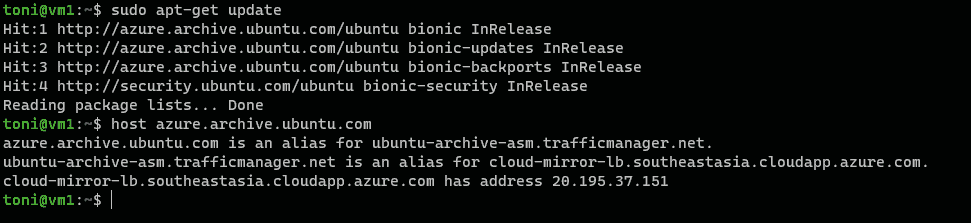

图 5.8：查找更新服务器地址

在这个例子中，您可以看到对我来说最近的 Ubuntu 更新服务器位于东南亚地区，其 IP 地址为`20.195.37.151`。

微软还提供了 Azure Update Management，这是一个辅助您管理 Linux 服务器更新的附加机制。

### Azure Update Management

为了避免手动重复的工作，您可以使用 Azure 更新管理服务同时更新一个或多个服务器。该服务是 Azure 自动化的一部分，支持 Linux 和 Windows 操作系统。

Azure 更新管理不是 Azure 中用于更新管理的唯一工具。如果您已经在 Azure 上使用 Ansible 进行更新管理和自动化，那么 Ansible Automation 也可用于 Azure。

目前，只有一些 Linux 发行版受到 Azure 更新管理的支持。请参考文档以获取最新列表：[`docs.microsoft.com/azure/automation/update-management/overview`](https://docs.microsoft.com/azure/automation/update-management/overview)。

您可以使用 Azure 更新管理服务列出所有可用的更新，并管理安装服务器所需更新的过程。该服务使用 Azure Linux 代理与虚拟机通信，如本章前面描述的那样。

*图 5.9*说明了 Azure 更新管理服务的架构：

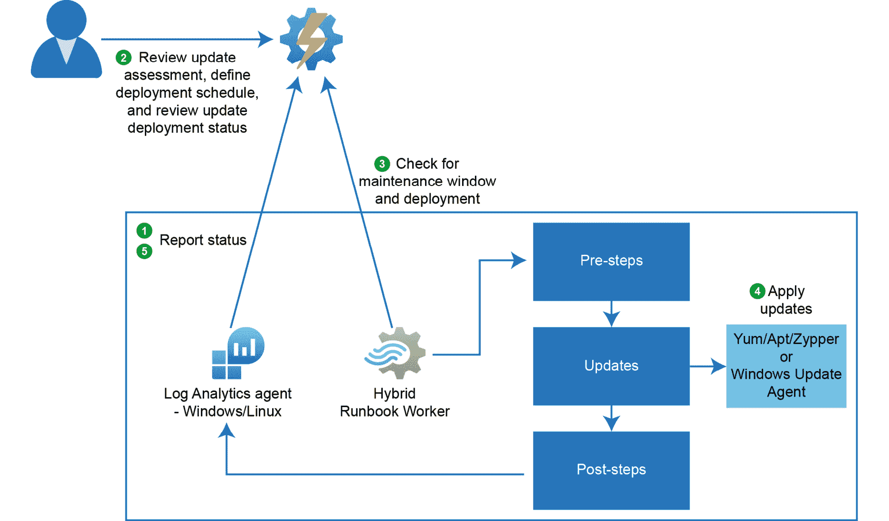

图 5.9：Azure 更新管理架构

Azure 更新管理不会取代 Linux 发行版的正常更新机制或软件包管理器，但它会向这些发出请求以执行所需的维护任务。实际上，这意味着，例如，Ubuntu 更新仍然由`apt`工具安装，例如，在 RHEL 中，更新由`yum`管理。更新是从 Linux 安装中配置的存储库中获取的。

在 Linux 上，可用的更新每小时由 Azure 更新管理自动轮询一次。

现在，让我们看一下下一个在 Azure 上管理 Linux 的实践，以指导您在云旅程中更进一步。

## 在 Azure 上管理 Linux 的实践

Linux 日志可以被摄入到日志分析工作区。在这个实践中，我们将看到如何将我们迁移的 Linux 机器的 syslog 摄入到日志分析工作区，并使用**Kusto 查询语言**（**KQL**）进行分析。

Syslog 是广泛用于 Linux 的事件日志记录协议。应用程序发送的消息可能会存储在本地机器上或传递到 syslog 收集器。使用 Linux 日志分析代理，我们将配置 syslog 守护进程将这些 syslog 条目转发到代理，并代理将消息发送到作为 Azure Monitor 一部分的日志分析工作区。在这里，我们使用日志分析代理将数据推送到日志分析工作区。

*图 5.10*是数据从 Linux 机器发送到 Azure Monitor 的图形表示：

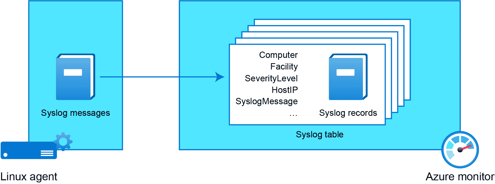

图 5.10：将 syslog 消息发送到 Azure Monitor

syslog 收集器支持以下设施：

+   `kern`

+   `user`

+   `mail`

+   守护进程

+   身份验证

+   `syslog`

+   `lpr`

+   `news`

+   `uucp`

+   `cron`

+   `authpriv`

+   `ftp`

+   `local0-local7`

如果您想收集列表之外的任何设施，那么您可能需要在 Azure Monitor 中配置自定义数据源。在我们的实践中，我们将接入 LAMP 服务器，该服务器在*第四章*，*执行迁移到 Azure*中迁移，到日志分析工作区，然后我们将配置它来收集 syslog。

第一步将是接入虚拟机以将日志发送到日志分析工作区。

### 创建日志分析工作区

这个过程非常简单 - 我们需要创建一个日志分析工作区，并将我们的虚拟机连接到工作区。您可以按照这里概述的步骤来接入您的虚拟机：

1.  导航到 Azure 门户并搜索日志分析工作区，然后单击它。一旦您进入日志分析工作区刀片，单击*图 5.11*中显示的“新建”按钮来创建一个工作区：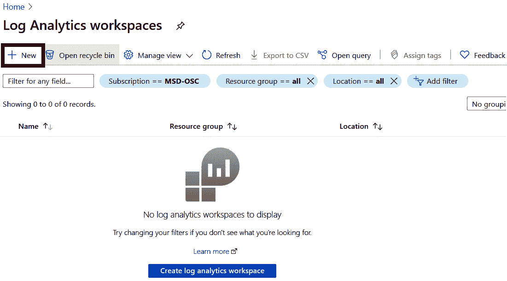

图 5.11：添加新的工作区

1.  单击“新建”将重定向您到创建工作区的向导，基本选项卡需要基本信息，如订阅、资源组、名称和区域。您可以按照*图 5.12*中显示的方式填写这些细节，然后转到定价层：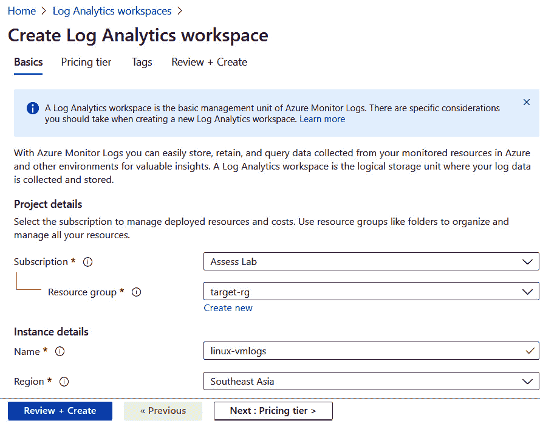

图 5.12：创建日志分析工作区

1.  对于定价层，您可以保持默认值：“按使用量付费（每 GB 2018）”。如果需要，您还可以预留容量；但是，对于这个实践，这是不需要的。

最后，您可以单击“查看+创建”，工作区将被创建。

### 登记 Azure 虚拟机

现在您已经创建了日志将被摄入的工作区，下一个阶段是虚拟机的登记。您需要打开我们创建的工作区来登记虚拟机。您可以在顶部搜索栏中搜索日志分析工作区，然后找到工作区的名称。单击它并打开工作区。登记步骤如下：

1.  导航到工作区数据源下的虚拟机，您将能够看到我们从本地迁移的虚拟机。日志分析连接将显示为未连接，如*图 5.13*中所示：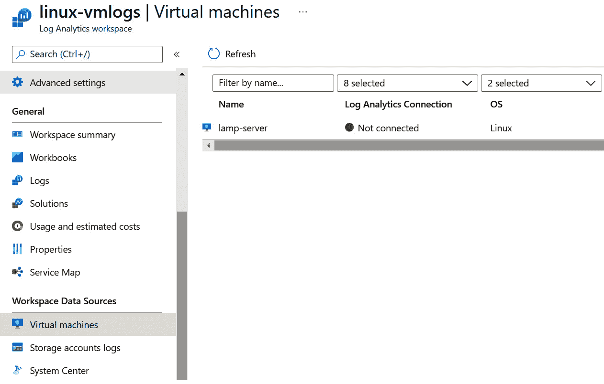

图 5.13：向工作区添加数据源

1.  单击虚拟机名称，您将进入一个新页面，在那里您将能够看到“连接”选项，如*图 5.14*所示。请注意，为了使连接操作成功，虚拟机应该处于运行状态，否则将失败。还要确保`walinuxagent`已安装，如*管理和安全*部分中已建议的，并且代理在虚拟机的属性刀片下列为“就绪”。单击“连接”，之后将在虚拟机上配置扩展：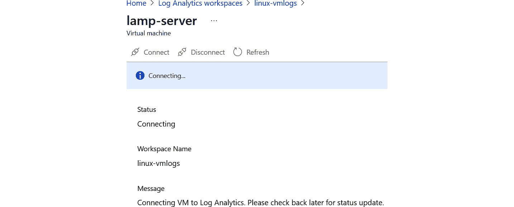

图 5.14：连接到日志分析

1.  如果您导航回到之前的虚拟机刀片，您将看到状态已更改为“连接”，如*图 5.15*中所示。这个过程需要一些时间，并且日志分析扩展将在所选的虚拟机上配置：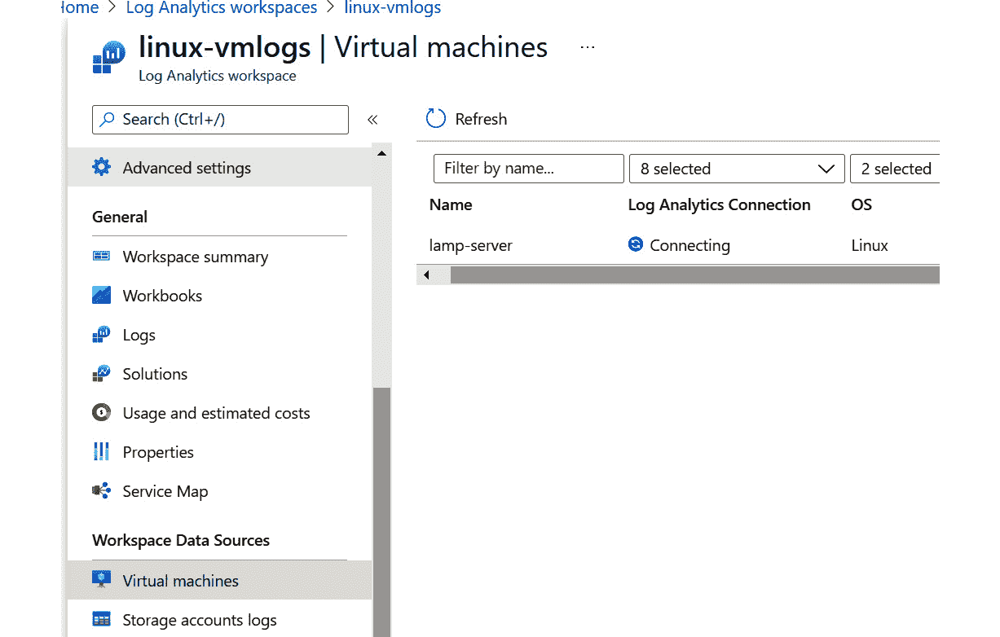

图 5.15：验证连接状态

1.  一旦扩展安装完成，虚拟机就已经登记到了日志分析工作区。您可以通过验证连接状态为已连接来确认这一点。

登记已完成；但是，我们还没有配置日志分析工作区，指定应从虚拟机中提取什么类型的事件数据的说明。在下一节中，我们将配置数据收集。

### 数据收集

我们已经登记了我们的虚拟机，并且日志分析扩展已准备好收集数据并将其摄入到日志分析工作区。但是，我们需要设置数据收集，也就是说，我们需要指定我们需要从虚拟机中提取哪些数据集。我们可以按照以下方式配置收集：

1.  返回到我们创建的日志分析工作区，并选择代理配置，如*图 5.16*所示：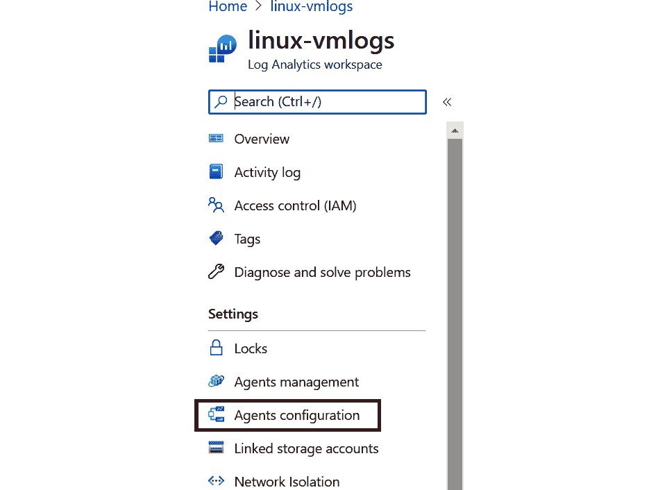

图 5.16：导航到数据收集配置

1.  导航到 Linux 性能计数器并添加推荐的计数器。Azure 将向您显示推荐的性能计数器名称列表，如*图 5.17*所示。如果您需要额外的计数器，可以单击“添加性能计数器”并添加。完成后，单击“应用”以保存配置：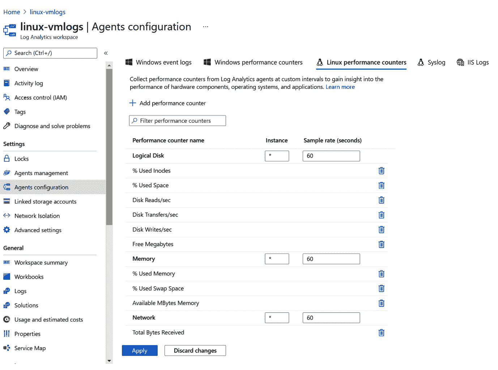

图 5.17：配置性能计数器

1.  配置性能计数器后，您可以单击“Syslog”选项卡。单击“添加设施”将列出所有可用的设施，包括 auth、authpriv 和 cron。此外，您可以为每个设施指定日志级别。您可以添加如下设施，如*图 5.18*所示。添加后，单击“应用”以保存配置：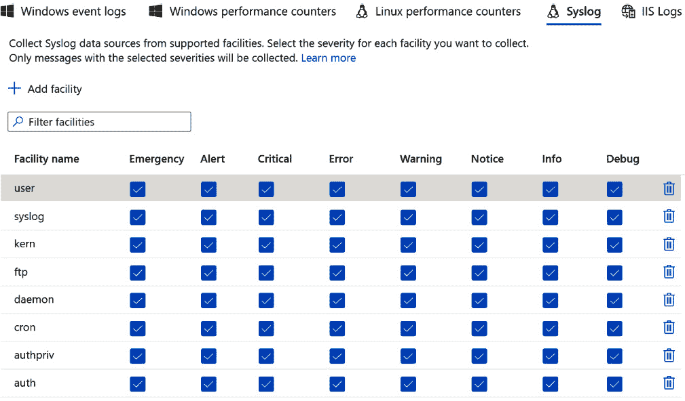

图 5.18：配置系统日志设施

有了这个，我们已经配置了数据收集。现在我们需要验证数据是否被摄入到日志分析工作区中，并且在完成登记后，摄入需要一些时间。在下一节中，我们将运行一些示例查询，看看我们是否获得了结果。

### 查询数据

在上一节中，我们配置了几个性能计数器和需要被摄入到我们的日志分析工作区中的系统日志设施。现在，我们将使用 KQL 查询这些日志，并验证是否从虚拟机中摄入了数据。

将性能、系统日志和其他数据存储在不同的表中。您可以通过将查询范围限定到特定的虚拟机来查询虚拟机的日志。如果您从工作区级别运行查询，将返回所有已登记的虚拟机的日志。不过，您也可以从这里更改范围。在我们的情况下，只有一个虚拟机登记到工作区，因此从“虚拟机”刀片或“日志分析”刀片查询将是相同的。不过，让我们从“虚拟机”刀片查询，以确保我们正在查看正确的范围：

1.  导航到虚拟机，并打开我们在*第四章*“执行迁移到 Azure”中从本地迁移的虚拟机。从“监视”中，选择“日志”，如*图 5.19*所示：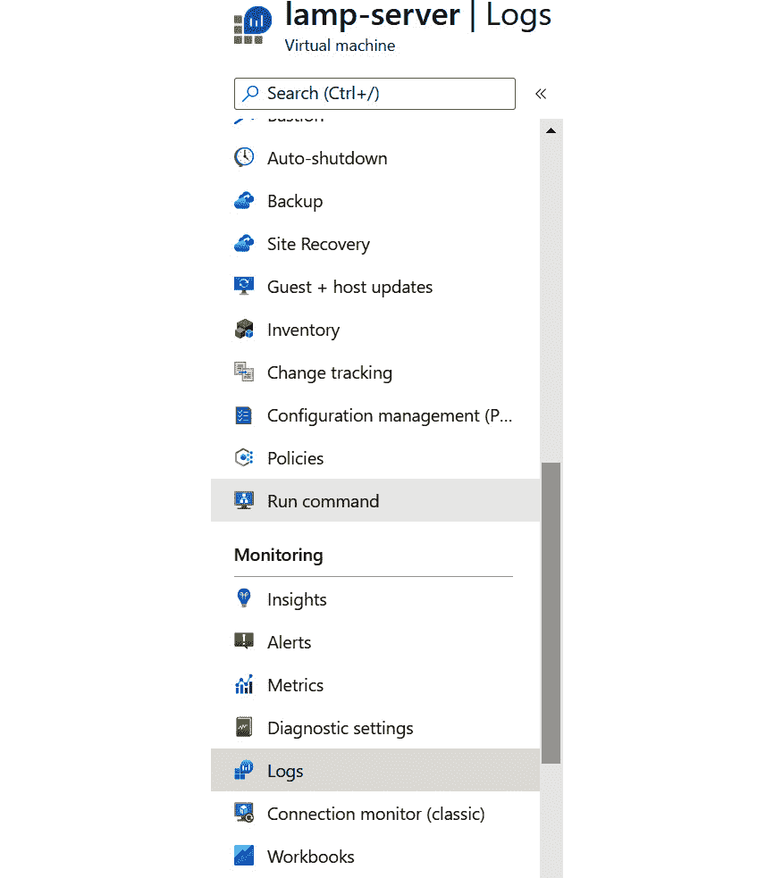

图 5.19：从虚拟机刀片导航到日志

1.  要列出工作区中的所有表，可以在查询窗口中运行`search` `* | distinct $table`，并在结果窗口中查看结果。示例显示在*图 5.20*中：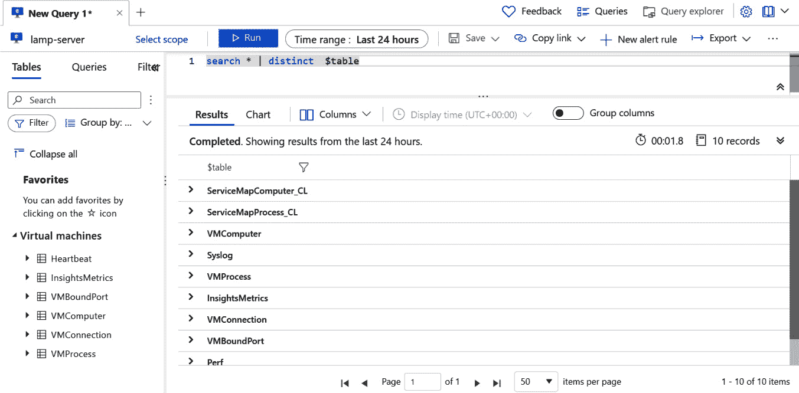

图 5.20：列出日志分析工作区中的所有表

1.  在结果中，您可以看到多个表，如`Syslog`、`VMProcess`、`VMBoundPort`、`VMConnection`和`Perf`。让我们查询一些表并检查结果。所有以下脚本都需要在查询窗口中运行。

1.  返回包含`rsyslog`消息的所有信息日志：

```
Syslog | where SeverityLevel == "info" and SyslogMessage contains "rsyslog"
```

1.  为`% Used Memory`性能计数器呈现时间图表：

```
Perf | where CounterName == "% Used Memory"
| project TimeGenerated, CounterValue
| render timechart 
```

1.  返回由进程进行的所有外部连接，包括目标 IP 和端口号：

```
VMConnection
| where DestinationIp !startswith "127.0.0" 
| distinct ProcessName, DestinationIp, DestinationPort
```

您可以使用可用的数据集运行任何类型的查询。KQL 非常强大，可以在数据集上发挥奇迹。通过这个练习，我们已经到达了实验的最后。在这个实验中，我们将迁移到了*第四章*“执行迁移到 Azure”中迁移到的本地虚拟机登记到了日志分析工作区，并将性能和系统日志摄入到了工作区。此外，我们使用 KQL 查询摄入的数据以获得一些结果和时间图表。

## 摘要

本章涵盖了如何有效地在 Azure 上操作 Linux 的各种细节。首先，我们经历了“优化”阶段，包括 ACM 和 Azure Advisor 工具。然后，我们进入了“管理和安全”阶段，在那里我们花了一些时间了解数据保护功能以及 Azure Linux 代理。

就在动手实验之前，您还了解了 Azure 更新管理如何与各种 Linux 发行版的更新机制配合工作。

我们现在已经涵盖了关于在 Azure 上评估、迁移和操作 Linux 的所有主题。当某些事情不如你所期望的那样工作时会发生什么？让我们在下一章中找出答案，我们将指导您如何在 Azure 上排除 Linux 的故障。
