# 第六章：故障排除和问题解决

我们的迁移之旅始于*第三章*，*评估和迁移规划*，在那里我们看到了评估的重要性及其对整个迁移之旅的贡献。

在*第四章*中，*执行迁移到 Azure*，我们见证了将 Linux 工作负载实际迁移到 Microsoft Azure 虚拟机以及托管服务。*第五章*，*在 Azure 上操作 Linux*，更多地关于迁移后的策略和工具，用于优化和保护 Azure 中的工作负载。

此时，我们已成功将**虚拟机**（**VM**）迁移到 Azure。是时候收拾行李，考虑工作完成得很好了。然而，有时事情并不像应该的那样运行。您可能会在日志文件中收到奇怪的错误，或者您的客户可能会抱怨迁移的应用程序行为不正确。您甚至可能发现您的 VM 根本无法启动。

能够分析问题并自行调试受影响的系统非常重要。您不希望因为不知道为什么某些事情不起作用而在迁移项目的中途陷入困境。

本章将帮助您学习和了解如何评估、调试和修复 Linux 到 Azure 迁移项目中最常见的问题。这些主题对于在 Azure 上新创建的 Linux VM 也很有用。

在本章中，您将了解以下内容：

+   远程连接和 VM 启动问题

+   常见的 Linux 运行时挑战

+   Azure 诊断工具-摘要

+   开放支持请求

要充分利用本章，您应该熟悉本地或托管 Linux 服务器的典型调试方法。在 Azure 上，与本地环境相比，一些调试方面的工作有些不同。

让我们首先讨论最不希望出现的问题——无法连接的 VM。

## 远程连接和 VM 启动问题

在本节中，我们将讨论一些常见问题，这些问题可能导致您无法通过网络访问 VM，并提供一些解决这些问题的方法。

我们见过的最常见问题是无法使用`ssh`连接到 VM，如*图 6.1*所示：

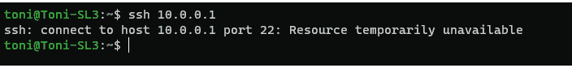

图 6.1：SSH 连接失败

在这种情况下，用户尝试直接从其笔记本电脑连接到 Azure VM 的私有 IP 地址`10.0.0.1`。这会失败，因为 Azure 上的私有 IP 地址始终在私有 IP 范围内，不能通过公共互联网直接访问。这与您典型的本地环境不同，在本地环境中，您可能有能力直接连接到数据中心中的任何 VM。实际的错误消息可能会因操作系统和连接失败的实际原因而有所不同。

Azure VM 通常具有两个 IP 地址：私有内部 IP 和公共外部 IP。您可以从 Azure 门户或命令行获取 VM 的所有 IP 地址列表。使用 Azure CLI，您可以使用`az vm list-ip-addresses`命令，如*图 6.2*所示：

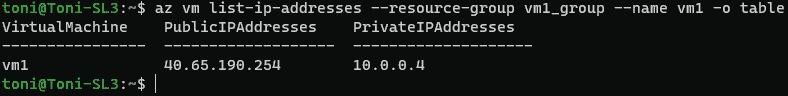

图 6.2：VM IP 地址列表

如果使用公共 IP 地址仍然无法连接，则原因可能是以下之一：

+   Azure 网络安全组正在阻止连接。

+   VM 上未运行 SSH 服务。

+   Linux 防火墙正在阻止连接。

这些是我们见过的最常见问题。如果您的问题不是这些问题之一，您将在本章后面的*Azure 诊断工具-摘要*部分找到更多分析指导。

可以使用 Azure 门户上找到的 Azure 连接故障排除工具来分析网络连接问题，如*图 6.3*所示：

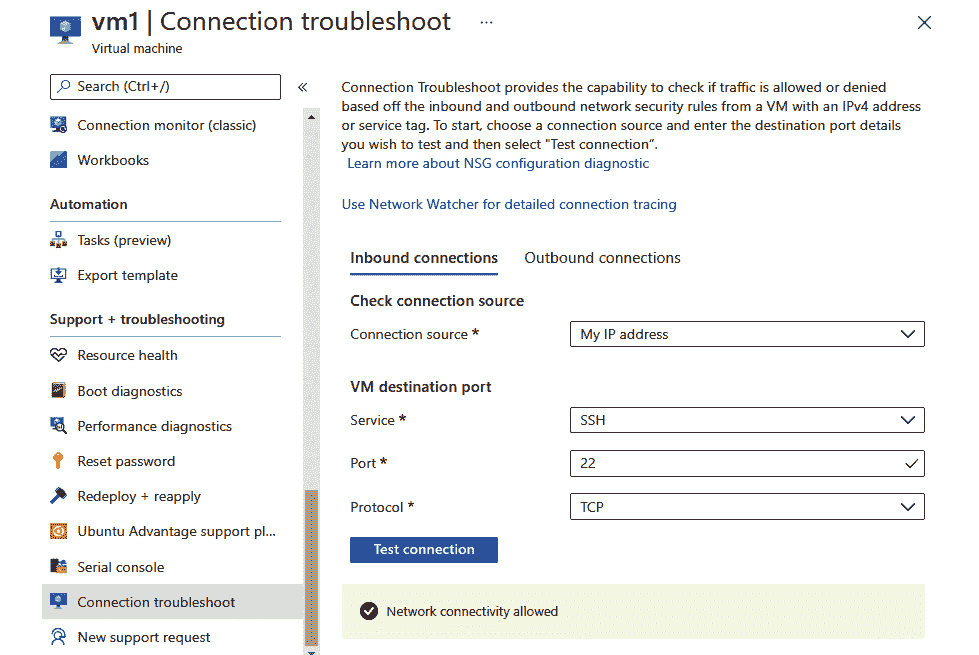

图 6.3：连接故障排除实用程序

在这个例子中，我们可以看到 Azure 网络连接正常工作，问题不在网络安全组设置中。

### 无网络连接时运行命令

为了解决 Linux 虚拟机内部的问题，你可以使用 Azure 扩展。要以这种方式启动`sshd`，你首先需要创建一个名为`custom.json`的本地文件，内容如下：

```
{
 "commandToExecute": "sudo systemctl start sshd"
}
```

然后使用以下命令调用自定义扩展：

```
az vm extension set --resource-group vm1_group --vm-name vm1 \ 
 --name customScript --publisher Microsoft.Azure.Extensions \
 --settings ./custom.json
```

结果应该是成功的，如*图 6.4*所示：

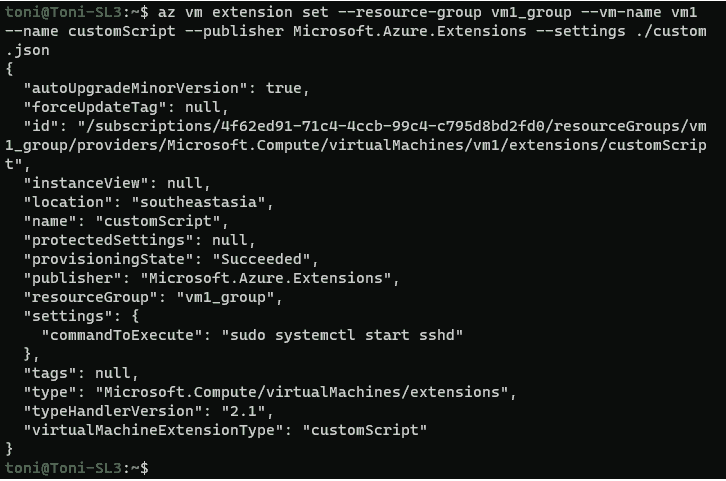

图 6.4：运行自定义扩展

你可以使用相同的方法远程运行任何命令，例如，如果怀疑 Linux 防火墙可能会阻止 SSH 连接，可以使用这种方法关闭它。

Azure 门户还提供了一个简单的用户界面，可以远程运行命令和简单脚本，如*图 6.5*所示：

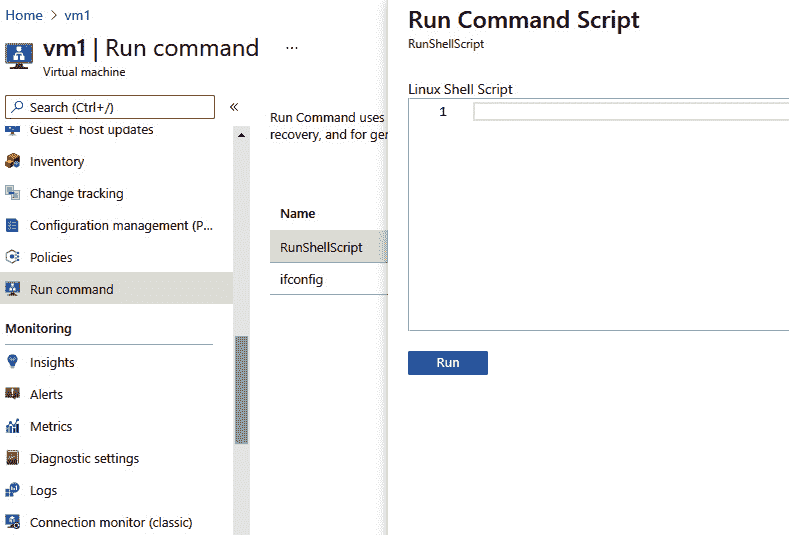

图 6.5：Azure 门户中的运行命令功能

要使扩展工作，你需要在虚拟机上安装并运行 Azure Linux 代理，因为 Azure 扩展使用它在虚拟机上执行命令。

如果远程 SSH 连接仍然无法工作，原因可能更严重：你的虚拟机实际上可能无法正确启动，无法使用脚本工具修复。

### 启动诊断和串行控制台访问

如果你怀疑虚拟机无法正确启动，你可以通过在 Azure 门户中使用启动诊断工具查看启动日志来轻松确认，如*图 6.6*所示：

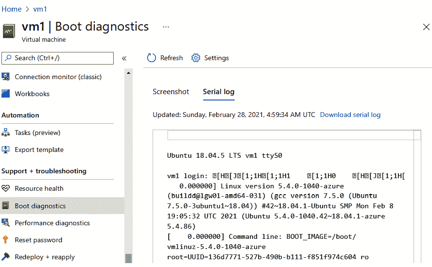

图 6.6：启动诊断实用程序

系统日志是从虚拟串行终端捕获的，是只读的。你可以使用启动日志来了解和诊断问题。

如果你需要登录系统来解决问题，你可以使用 Azure 串行控制台功能，也可以在 Azure 门户的 VM 支持+故障排除部分找到，如*图 6.7*所示：

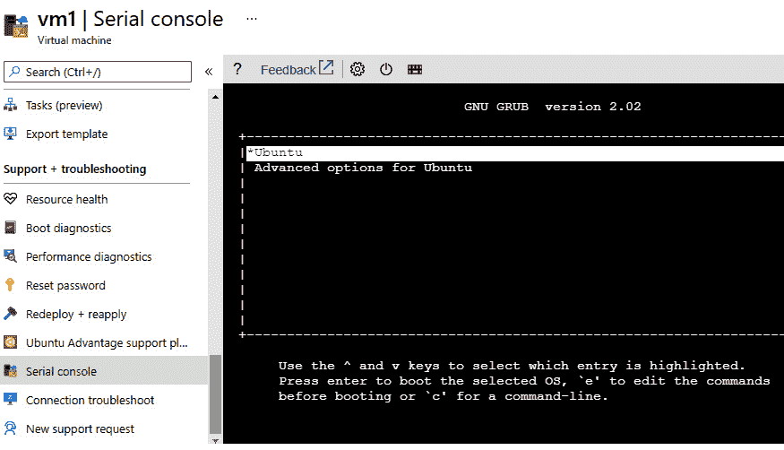

图 6.7：使用串行控制台访问

在这个例子中，我们可以看到 Ubuntu 服务器卡在 GRUB 引导加载程序屏幕上，等待用户交互。在这一点上，你可以像在本地物理或虚拟 Linux 服务器上一样解决问题。我们不会详细讨论解决这个特定问题，因为它可能由多种问题引起，从内核升级失败到错误的分区配置。相反，让我们来看一下典型启动失败原因的概述。

### 常见的启动问题

有时你的 Linux 虚拟机在 Azure 上根本无法启动。这对于从 Azure Linux 映像创建的虚拟机来说是相当罕见的问题，但如果你将虚拟机从本地迁移到 Azure，则可能会很常见。

虚拟机无法启动可能有各种原因。微软已经发布了关于 Azure 上 Linux 的以下注意事项：

+   不支持 Hyper-V 虚拟硬盘（VHDX）格式。请改用固定 VHD。

+   不支持动态分配的 VirtualBox 磁盘。请改用固定大小。

+   最大 VHD 大小为 1,023 GB。

+   在系统磁盘上使用逻辑卷管理器（LVM）可能会导致名称冲突。建议在系统磁盘上使用标准分区，只在数据磁盘上使用 LVM。

+   UDF 文件系统支持是强制性的，所以不要禁用它。它被 Azure Linux 代理使用。

+   内核版本在 2.6.37 之前和 Red Hat 内核版本在 2.6.32-504 之前不支持`grub.conf`中的`numa=off`参数。

+   不要使用系统磁盘作为交换文件。让 Azure Linux 代理在临时资源磁盘上设置交换文件。

在 Azure 上启动 Linux 时，有一些非常常见的问题，当从`hv_vmbus`和`hv_storvsc`内核模块迁移时，Linux 需要这些模块才能在 Azure 上启动。

如果遇到此问题，正确的修复方法是在将 VM 迁移到 Azure 之前在 Linux 上运行这些命令：

```
sudo mkinitrd --preload=hv_storvsc --preload=hv_vmbus -v \
-f initrd-'uname -r'.img 'uname -r'
```

请注意，在 Azure 上无法直接使用此 VM 来解决此问题。通常，最好修复源映像并将其再次移至 Azure。但是，在 Azure 端修复此情况的方法是在工作 VM 上挂载磁盘并应用修复方法。

有时，您可能会因虚拟磁盘大小而遇到引导问题，特别是如果您在源系统上手动创建了磁盘并将原始磁盘转换为 VHD。Azure 上的所有虚拟驱动器都必须使用 1MB 大小的对齐。例如，可以在上传映像到 Azure 之前通过使用`qemu-img`来转换映像来修复此问题：

```
rawdisk="MyLinuxVM.raw"
vhddisk="MyLinuxVM.vhd"
MB=$((1024*1024))
size=$(qemu-img info -f raw --output json "$rawdisk" | \
 gawk 'match($0, /"virtual-size": ([0-9]+),/, val) {print val[1]}')
rounded_size=$(((($size+$MB-1)/$MB)*$MB))
echo "Rounded Size = $rounded_size"
qemu-img resize MyLinuxVM.raw $rounded_size
qemu-img convert -f raw -o subformat=fixed,force_size \
 -O vpc MyLinuxVM.raw MyLinuxVM.vhd
```

在正确转换映像后，您可以再次将其上传到 Azure 并启动。一旦服务器正确启动，我们可以专注于可能的运行时问题。

## 常见的 Linux 运行时挑战

在本节中，我们将演示如何分析和修复一些常见的运行时问题。Linux 上应用程序的最常见问题之一是与 SELinux 设置的不兼容性，特别是如果您将应用程序从一个 VM 迁移到另一个 VM。

此外，磁盘空间耗尽或与迁移相关的其他存储问题，如存储加密，可能会带来麻烦。最后，将工作负载从本地迁移到 Azure 时可能会出现一些意外的性能问题。让我们首先看看在 Azure 中如何使用 SELinux。

### SELinux

安全增强型 Linux——更常被称为 SELinux——是 Linux 内核的安全模块，为操作系统提供了支持各种访问控制策略的机制。有一些替代方案，如 AppArmor，但目前并不常用。SELinux 可以被认为是保护 Linux 安装的标准方式。

要检查 Linux VM 上 SELinux 的状态，可以运行`sestatus`命令。它会打印出许多变量，如*图 6.8*所示：

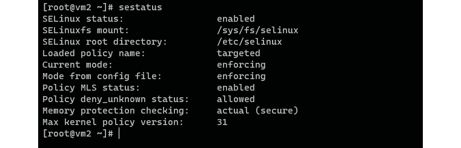

图 6.8：sestatus 命令的输出

在此示例中，您可以看到 SELinux 状态为`启用`，操作模式为`强制执行`。*图 6.8*取自从 Azure Marketplace 安装的 CentOS 8.2.2004 VM。

SELinux 适用于所有常见的 Linux 发行版。但是，它可能不会默认`启用`，或者可能默认配置为宽松模式。SELinux 的三种操作模式是：

+   `强制执行`：SELinux 安全策略已经生效。

+   `宽松`：SELinux 会打印警告而不是强制执行策略。

+   `禁用`：没有加载任何 SELinux 策略。

与 SELinux 相关的最常见问题之一是：*如何禁用 SELinux？*正确答案应该始终是：*不要禁用*。出于实际原因，推荐的操作模式是`宽松`。在强制执行模式下，许多应用程序可能会出现问题，因此自然的建议是使用`强制执行`模式。

通过在`宽松`模式下运行 SELinux，您可以确保您的应用程序可以运行，并且可以通过审核安全日志来发现可能的安全问题。在开发新应用程序时，建议使用`强制执行`模式。这样您可以确保您的应用程序可以在任何生产系统中运行。

您可以通过阅读*Dan Walsh*撰写、*Máirín Duffy*绘制的精彩 SELinux 着色书来了解更多关于 SELinux 以及为什么不应该禁用它的原因：[`github.com/mairin/selinux-coloring-book`](https://github.com/mairin/selinux-coloring-book)。

在 Azure 上，您可以在`强制执行`或`宽松`模式下使用 SELinux 而大多数情况下不会出现问题。唯一需要完全关闭 SELinux 的时候是当您想要在 Azure 上启动加密 Linux OS 磁盘时。加密完成后，可以再次启用 SELinux。

如果您首先完全`禁用`或以`宽容`模式运行 SELinux，然后决定切换到`强制`模式，您可能需要修复文件安全标签。最简单的方法是告诉 SELinux 在下次重启时重新标记文件系统，然后按以下方式重新启动服务器：

```
sudo touch /.autorelabel; sudo reboot
```

服务器再次启动后，SELinux 将对整个文件系统进行标记，并且文件的安全上下文应该再次是最新的。

#### 注意

如果系统安装时没有安装`selinux-policy`软件包，则需要确保在系统启动时初始化 SELinux。必须运行 dracut 实用程序来为`initramfs`文件系统设置 SELinux 意识。

不这样做将导致 SELinux 在系统启动时无法启动。

有关与 SELinux 相关的问题的有用参考资料可以在 Red Hat 的网站上找到：[`access.redhat.com/documentation/red_hat_enterprise_linux/6/html/security-enhanced_linux/sect-security-enhanced_linux-working_with_selinux-changing_selinux_modes`](https://access.redhat.com/documentation/red_hat_enterprise_linux/6/html/security-enhanced_linux/sect-security-enhanced_linux-working_with_selinux-changing_selinux_modes)。

接下来，让我们看一下典型的存储问题以及如何解决它们。

### 存储配置问题

在本节中，我们将涵盖添加磁盘时可能出现的一些问题。存储问题很敏感，因为它们可能导致无法启动的情况——这些错误主要是由`/etc/fstab`文件中的配置问题引起的。Linux 管理员知道这个文件的重要性，纠正这个文件的配置错误可以解决与磁盘和存储相关的无法启动的情况。

以下是一些常见情况以及与`fstab`相关的串行控制台中可能看到的相应日志。如果您在控制台中看到这些日志中的任何一个，您可以轻松确定根本原因：

+   **使用 SCSI ID 而不是 UUID 挂载的磁盘**

```
Timed out waiting for device dev-incorrect.device.
Dependency failed for /data.
Dependency failed for Local File Systems.
```

+   **未附加的设备丢失**

```
Checking file systems…
fsck from util-linux 2.19.1
Checking all file systems.
/dev/sdc1: nonexistent device ("nofail" fstab option may be used to skip this device)
```

+   **Fstab 配置错误或磁盘不再附加**

```
The disk drive for /var/lib/mysql is not ready yet or not present.
Continue to wait, or Press S to skip mounting or M for manual recovery
```

+   **串行日志条目显示不正确的 UUID**

```
[/sbin/fsck.ext4 (1) — /datadrive] fsck.ext4 -a UUID="<UUID>"
fsck.ext4: Unable to resolve UUID="<UUID>"
[FAILED
```

其他常见原因包括：

+   系统崩溃

+   硬件或软件故障

+   错误的驱动程序

+   NFS 写入错误

+   文件系统未正确关闭

这些其他常见原因有时可以通过重新启动来修复，或者经常可以通过手动修复文件系统来修复。为此，您可以使用本章前面描述的串行控制台访问，或者将损坏的虚拟 OS 磁盘附加到另一个 VM，就像在任何本地系统中一样。 

Azure CLI 提供了一个名为**vm-repair**的扩展，可以轻松创建一个修复 VM 并将损坏的 VM 磁盘附加到它上。您可以从这里找到有关此扩展的更多信息：[`docs.microsoft.com/cli/azure/ext/vm-repair/vm/repair`](https://docs.microsoft.com/cli/azure/ext/vm-repair/vm/repair)。请注意，此扩展需要 Azure CLI 版本 2.0.67 或更高版本。

### 磁盘加密问题

在 Linux 上遇到磁盘加密问题并不罕见。这些问题也可能在 Azure 上出现。以下是一些您可能会遇到的典型问题，如果您使用自定义的 VM 映像：

+   文件系统或分区与自定义 VM 映像不匹配。

+   某些第三方软件，如 SAP、MongoDB、Apache Cassandra 和 Docker，如果在加密磁盘之前安装，可能不受支持或无法正常工作。在安装之前，请仔细检查设置说明！

+   在磁盘进行加密初始化的过程中，Azure 资源管理器启动的一些脚本可能无法正常工作。对加密和磁盘加密进行串行化将有助于解决这些问题。

+   在开始加密磁盘之前，需要禁用 SELinux，否则文件系统卸载可能会失败。记得之后再次启用它！

+   使用 LVM 的系统磁盘无法加密。始终使用普通分区进行系统磁盘，并且仅对数据磁盘使用 LVM。

+   磁盘加密会消耗大量内存。如果启用加密，您应该有超过 7GB 的 RAM。

#### 注意

Linux 系统磁盘加密过程会尝试在运行磁盘加密过程之前卸载系统驱动器。如果无法卸载驱动器，则很可能会出现“无法在...后卸载”的错误消息。

### 调整磁盘大小

如果您的 VM 系统或数据磁盘的存储空间不足，Azure 允许您轻松地扩展和缩小 VM，但是在 Linux 操作系统中还有一些任务需要完成，以确保 VM 能够适应这些变化。

#### 注意

为了测试这些命令，我们建议您在 Azure 上创建一个新的 Linux VM。在以下截图中，我们使用了基于 CentOS 7.9 的 VM 镜像。

首先，我们需要找出当前的 VM 磁盘大小。`az`命令是一个非常强大的工具，可以查询 VM 的各个方面：

```
az vm show -g vm1_group -n vm3 \
 --query "[storageProfile.osDisk.diskSizeGb, \
 storageProfile.osDisk.name, hardwareProfile.vmSize]"
```

该命令列出了操作系统磁盘大小、唯一名称和 VM 大小参数，如*图 6.9*所示：

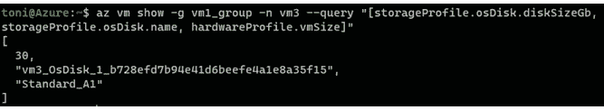

图 6.9：az vm show 命令的输出

如果出现错误，很可能是 VM 未运行。启动它并重试。

在我们的示例中，磁盘大小为 30GB，VM 类型为`Standard_A1`。磁盘名称为`vm3_OsDisk_1_b728efd7b94e41d6beefe4a1e8a35f15`。

要修改磁盘，需要将 VM 取消分配-仅仅停止不足够。在 VM 取消分配后，我们可以继续增加系统磁盘大小。

#### 注意

目前，您无法在 Azure 中缩小磁盘。增加磁盘大小时，只需添加所需的空间。

要将新大小设置为 50GB，请执行以下操作：

```
az disk update -g  vm1_group \ 
 -n vm3_OsDisk_1_b728efd7b94e41d6beefe4a1e8a35f15 --size-gb 50
```

这应该在成功修改后输出磁盘的新参数，如*图 6.10*所示：

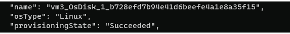

图 6.10：磁盘调整大小成功

如果您想要验证更改是否已实施，可以按以下方式显示实际磁盘大小，即使 VM 未运行：

```
az disk show -g vm1_group \
 -n vm3_OsDisk_1_b728efd7b94e41d6beefe4a1e8a35f15 \
 --query "diskSizeGb"
```

这将以千兆字节为单位打印出大小，并且在这种情况下应该显示`50`。现在我们已成功调整了存储系统端的磁盘大小，但此时 Linux 认为磁盘大小为`30`千兆字节。

接下来，您需要启动 VM 并使用 SSH 登录 Linux。现在，在 Linux 终端中，您可以继续检查是否需要手动增加卷大小和文件系统大小，就像在任何其他 Linux 服务器上一样。

由于有许多不同的方法来执行这些任务，我们将不会涵盖所有方法。Azure 不会对您在 Linux 操作系统中管理磁盘的方式设置任何限制。

在我们的测试系统 CentOS 7.9 中，似乎在引导时操作系统会自动识别`sda2`设备上的虚拟磁盘大小更改，如*图 6.11*所示。

您可以运行`lsblk`命令来查看 VM 上的块设备大小：

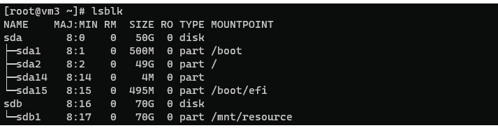

图 6.11：块设备列表

要查看文件系统是否也注意到了块设备大小的增加，您可以运行`df -hT`命令。我们的系统表明`sda2`磁盘上的 XFS 文件系统已自动调整大小：

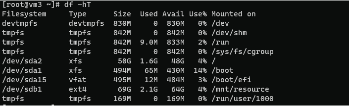

图 6.12：文件系统列表

多年来，Linux 管理员必须在物理或虚拟存储大小更改后手动调整块设备和文件系统的大小。如今，一些 Linux 发行版可以在引导时或甚至在运行时自动为您调整系统磁盘的大小。数据磁盘仍然需要您手动扩展分区或卷大小，以及扩展文件系统大小。

对于数据磁盘，该过程非常类似。最大的区别是您可以在 VM 运行时执行。要做到这一点，您实际上需要卸载磁盘并在修改虚拟磁盘大小之前将其从 VM 中分离。在手动修改分区、卷或文件系统之前，请考虑备份——如果在过程中出现即使是小错误，可能会导致数据丢失。

### 性能问题和分析

Linux 中的性能计数器对于提供有关硬件组件、操作系统和应用程序性能的见解非常有用。使用 Azure Monitor，您可以从 Log Analytics 代理定期收集性能计数器，进行**准实时**（**NRT**）分析。您还可以获得聚合的性能数据，用于长期分析和报告。

要设置性能计数器，您可以使用 Azure Log Analytics 工作区用户界面或命令行。

由于我们可以从 Linux VM 收集大量指标，所以我们在这一点上不会详细介绍。然而，值得一提的是典型的数据来源是：

+   `Syslog`

+   `CollectD`

+   性能计数器

+   自定义日志

您可以在这里找到 Log Analytics 代理支持的数据收集的详细信息：[`docs.microsoft.com/azure/azure-monitor/agents/agent-data-sources`](https://docs.microsoft.com/azure/azure-monitor/agents/agent-data-sources)。

本文档将为您提供一组很好的工具，可用于分析 VM 的性能。

在本地环境中，使用`dd`等工具来查看存储性能是一种常见做法。然而，在 Azure 中，您不应依赖于此命令的结果。相反，您应该使用一个名为**fio**的工具，它可以从大多数 Linux 发行版的存储库中获得。在分析实际磁盘性能时，它提供可靠的结果，以**每秒输入/输出操作**（**IOPS**）来衡量。

要使用 fio，您首先需要创建一个名为`fiowrite.ini`的新文件，其中包含以下内容：

```
[global]
size=30g
direct=1
iodepth=256
ioengine=libaio
bs=4k
numjobs=1
[writer1]
rw=randwrite
directory=/
```

最后一个参数告诉我们我们想要用于测试的目录或挂载点。在这种情况下，我们使用的是系统磁盘，它挂载在根目录上。

要开始测试，请运行以下命令，该命令启动一个持续 30 秒的测试：

```
sudo fio --runtime 30 fiowrite.ini
```

您应该得到类似*图 6.13*中的输出：

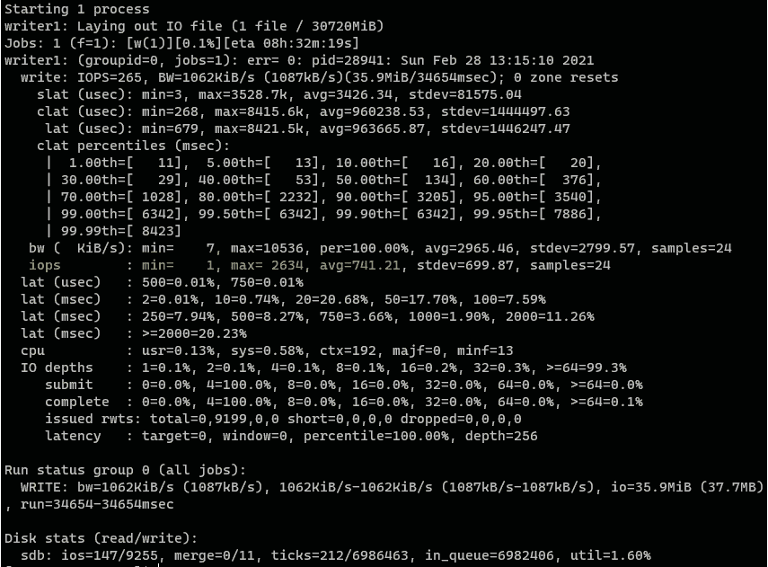

图 6.13：磁盘性能输出

我们已经用黄色突出显示了 IOPS 行。在这种情况下，平均 IOPS 数字为 741.21。我们使用了标准 SSD 磁盘和带有 1 个 vCPU 和 1.72 GiB 内存的`Standard A1` VM 类型。系统磁盘为 30 GB，名义最大 IOPS 为 500。

该服务器上的存储加密使用平台管理密钥的服务器端加密。

对于 Azure 用户优化 Linux 存储性能，有各种指南可用。一个非常好的（尽管有点老旧）指南是这篇博客文章：[`docs.microsoft.com/archive/blogs/igorpag/azure-storage-secrets-and-linux-io-optimizations`](https://docs.microsoft.com/archive/blogs/igorpag/azure-storage-secrets-and-linux-io-optimizations)。

该博客文章涵盖了许多关于性能调优的细节，即使您目前没有性能问题，也值得一读。优化性能总是值得的。

接下来，让我们看看 Azure 提供了哪些工具来分析和调试 VM 问题。

## Azure 诊断工具-摘要

在 Azure 门户中，在 VM 的诊断和解决问题屏幕上，您可以找到所有官方指南和工具，以了解更多有关解决各种 VM 相关问题的信息。*图 6.14*显示了部分常见场景的列表：

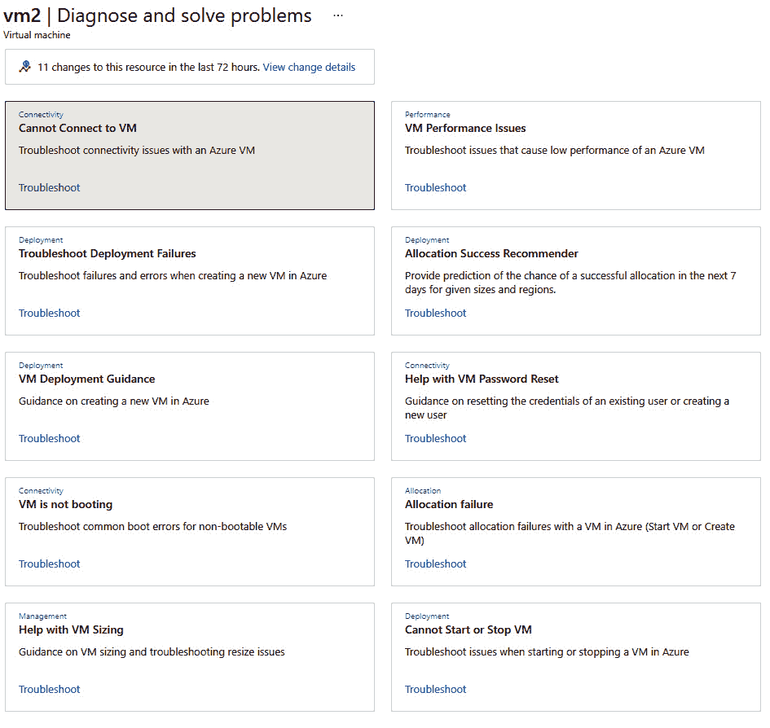

图 6.14：常见场景列表

这些指南应该为您提供足够的工具来分析和解决您在将 Linux VM 迁移到 Azure 后可能遇到的大多数问题情况。这些也适用于直接在 Azure 上创建的所有 VM。

让我们不要忘记，如果您在 Azure 上遇到问题，还有各种向 Microsoft 寻求帮助的方式。

## 打开支持请求

与 Azure 的任何其他问题一样，您也可以为 Azure 上的 Linux 打开支持请求。尝试自行分析或解决问题只有到一定程度才有意义。最好的部分是 Red Hat 和 SUSE 都提供集成的共同支持。这使客户受益，因为他们不必打开多个案例 - 只需打开一个支持案例即可。事实上，Red Hat 和 SUSE 的支持工程师坐在与 Microsoft 支持团队相同的办公室，这确保了更快的解决方案。

Azure 门户上的新支持请求功能（如*图 6.15*所示）易于使用，并且可以指导您通过提供所有相关信息来打开请求。这有助于支持人员从一开始就清楚地了解问题。

您可以在左侧菜单中找到请求工具，用于您遇到问题的 VM，如下所示：

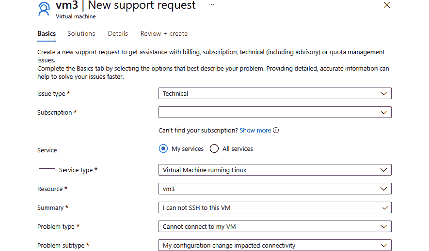

图 6.15：新支持请求

在本例中，我们的问题描述为无法 SSH 到此 VM，并且新的支持请求工具能够建议一些可能的问题类型。我们选择了“无法连接到我的 VM”作为问题类型选项，以及“我的配置更改影响了连接性”作为问题子类型选项。

在解决方案选项卡中，我们将找到问题的可能解决方案：

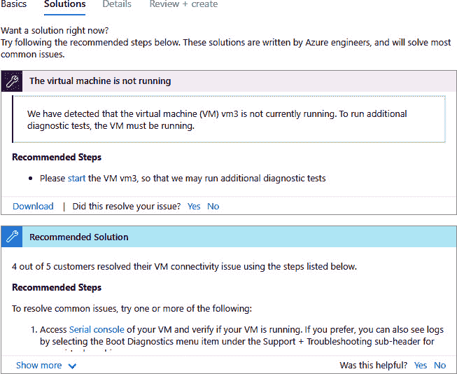

图 6.16：可能解决方案列表

在许多情况下，这些自动建议可以指导您解决问题。正如您在本例中所看到的，似乎 VM 没有运行 - 可能是因为 Azure Linux 代理无法访问。系统建议您使用先前提到的串行控制台方法连接到服务器。

有时您可能需要来自 Microsoft 技术支持的帮助，或者您可能已经发现了 Azure 或受支持的 Linux 发行版中的实际错误。在这种情况下，您将有选择打开支持票或从 Azure 社区寻求帮助的选项。

Microsoft 技术支持的可用性取决于您与 Microsoft 的合同：

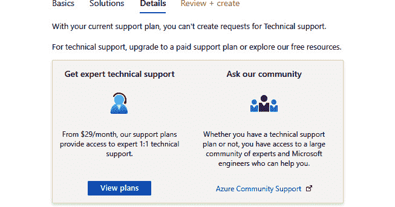

图 6.17：支持选项

在我们的示例中，我们使用的订阅不包括技术支持。通过单击“查看计划”（如*图 6.17*所示），我们可以看到各种技术支持计划：

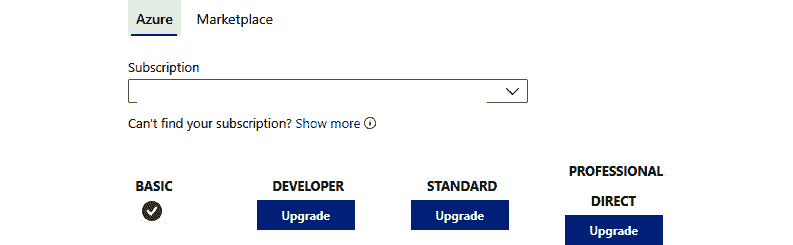

图 6.18：Microsoft 技术支持计划

哪种计划最适合您取决于许多因素。如果您对选择计划感到不确定，Microsoft 的销售代表可以为您提供进一步的指导。

此外，还可以通过 Azure Marketplace 获得来自 Linux 供应商的支持。如*图 6.19*所示，通过单击市场选项卡，您可以看到适用于此特定 VM 的所有可用 Linux 支持计划：

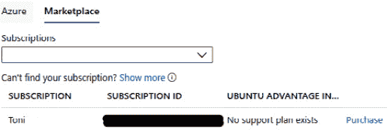

图 6.19：市场支持计划

在本例中，安装在此 VM 上的 Linux 发行版是 Ubuntu。发布 Ubuntu 的公司 Canonical 提供了一个名为**Ubuntu Advantage Infrastructure Support**的支持计划，如*图 6.19*所示。正如您在本例中所看到的，我们并没有购买该计划。

所有商业 Linux 供应商都有自己的支持包可供购买，或者已经捆绑在企业订阅中提供。

## 总结

完成本章后，您应该能够调试和解决 Linux 在 Azure 上的一些最常见问题。在本章中，我们讨论了远程连接问题以及如何解决这些问题，如果您的虚拟机不让您登录。我们还讨论了典型的启动问题，并发现了可以帮助解决这些情况的 Azure 工具。与 SELinux 和存储相关的问题是相当常见的运行时问题，在本章中也有涵盖。我们还讨论了 Linux 在 Azure 的性能分析。最后，我们解释了如何从微软技术支持和 Azure 市场合作伙伴处找到 Linux 在 Azure 的支持。

这本书采用了一种全面的方法，将 Linux 工作负载从本地基础架构迁移到 Azure。从规划、评估、服务依赖构建、复制和测试迁移，到从本地到 Azure 的完全切换，我们为您开发的实践实验室应该为您的第一个真正的迁移项目提供了一个快速启动。我们分享了一些迁移 Linux 工作负载到 Azure 时需要纳入的最佳实践和重要要点。考虑这些建议，并在您的迁移项目中采纳它们。这将加速项目并有助于迁移的成功，同时节省大量时间。

在这一点上，我们想要祝贺你学到了许多新的有用技能。我们花了很长一段时间与 Azure、Linux 和许多其他开源技术一起工作，其中许多已经在本书的页面上讨论过。我们希望你享受阅读这本书的过程，就像我们写作时一样。有些东西你无法通过阅读书籍或文档，甚至通过跟随官方培训课程来学习。这些东西只能通过尝试和亲自做事情来学习。

我们建议进一步阅读关于微软**Azure 的云采用框架**（**CAF**）：[`docs.microsoft.com/azure/cloud-adoption-framework/`](https://docs.microsoft.com/azure/cloud-adoption-framework/)。这是微软设计的一套最佳实践、工具、文档和其他有用的指导，旨在加速您的云采用之旅。

现在轮到你做好事了——教别人你所学到的东西。从这本书中获取信息，在你的 Linux 到 Azure 迁移项目中取得成功，并不要忘记与他人分享你的知识！

## Linux 在 Azure 中的新视野

在这本书中，我们从微软 CEO Satya Nadella 宣布的标语“Microsoft ♡ Linux”开始。这确实是微软历史上的一个里程碑。在早期，微软 Azure 被称为 Windows Azure，这给人留下了 Azure 是为 Windows 工作负载而不是为运行 Linux 工作负载而优化的印象。在 Satya Nadella 的领导下，微软开始拥抱 Linux 并为其他开源项目做出贡献，2016 年，他们加入了 Linux 基金会。

这一变化不仅仅是关于 Linux。微软还发布了 Edge 浏览器、Visual Studio Code 和 Microsoft Teams for Linux，这些行动表明他们愿意欢迎并完全拥抱 Linux。2018 年，微软开发了他们自己的 Linux 版本**Azure Sphere**，用于物联网设备。随着 Windows 10 的最新更新，微软发布了一个完整的 Linux 内核，为在 Linux 开发以及跨平台工作的开发人员打开了大门。很快，Linux 的使用量增加，并在微软 Azure 中超过了 Windows 的使用量。在 Linux 用户中存在的反微软意识早已消失。从所有的进展来看，很明显微软真的热爱 Linux。微软对社区的所有开源贡献都可以在[`opensource.microsoft.com/`](https://opensource.microsoft.com/)找到。

许多组织现在使用 Linux 来运行各种工作负载，从工作站到 SAP 集群各种不同，Linux 在 Azure 上提供的功能和支持使他们受益于云计算。管理员可以像管理自有 Linux 计算机一样管理他们的 Linux 工作负载。Azure 现在提供了诸如 Azure Migrate、Azure Site Recovery 和 Azure Database Migration Service 之类的工具，加速了工作负载向 Azure 的迁移。

最初认为云计算昂贵的组织现在已经开始探索 Azure 云的好处、节省和功能。由于这些组织拥有来自 RedHat 和 SUSE 等知名供应商的许可订阅，因此他们可以在 Azure 中重复使用相同的许可订阅，而无需额外花费用于云端许可。除了成本方面，扩展和高可用性要比组织在自己的基础设施上能够实现的要好得多。此外，值得一提的是 Azure 为运行 Linux 工作负载提供的安全性和治理功能。如果您由于合规原因而将工作负载托管在 Azure 之外的自有基础设施上，那么 Azure Arc 启用的服务器将使您能够在 Azure 门户中本地管理这些工作负载。

就在我们说话的时候，微软正在开发新的 Azure 功能，推送更新到预览版，并将更新推广到普遍可用性。如果您查看 Azure 更新页面（[`azure.microsoft.com/updates/?query=Linux`](https://azure.microsoft.com/updates/?query=Linux)），您将能够看到所有即将推出的与 Linux 相关的新更新。更新按时间顺序排列，看到即将推出的更新数量，您将意识到 Linux 在 Microsoft Azure 上的主导地位。现在是 2021 年，即使对一些人来说可能听起来有点荒谬，事实是微软确实是一个开源组织。
