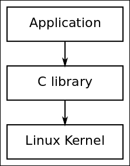
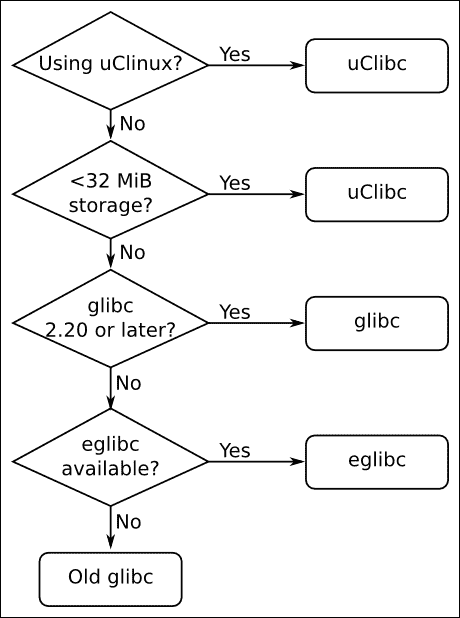

# 第二章。了解工具链

工具链是嵌入式 Linux 的第一个元素，也是项目的起点。在这个早期阶段做出的选择将对最终结果产生深远影响。您的工具链应能够有效地利用硬件，使用处理器的最佳指令集，使用浮点单元（如果有的话）等。它应该支持您需要的语言，并且具有对 POSIX 和其他系统接口的稳固实现。此外，发现安全漏洞或错误时，应及时更新。最后，它应该在整个项目中保持不变。换句话说，一旦选择了工具链，坚持使用它是很重要的。在项目进行过程中以不一致的方式更改编译器和开发库将导致隐蔽的错误。

获得工具链就像下载和安装一个软件包一样简单。但是，工具链本身是一个复杂的东西，我将在本章中向您展示。

# 什么是工具链？

工具链是将源代码编译成可在目标设备上运行的可执行文件的一组工具，包括编译器、链接器和运行时库。最初，您需要一个工具链来构建嵌入式 Linux 系统的另外三个元素：引导加载程序、内核和根文件系统。它必须能够编译用汇编、C 和 C++编写的代码，因为这些是基本开源软件包中使用的语言。

通常，Linux 的工具链是基于 GNU 项目（[`www.gnu.org`](http://www.gnu.org)）的组件构建的，这在撰写本文时仍然是大多数情况下的情况。然而，在过去的几年里，Clang 编译器和相关的 LLVM 项目（[`llvm.org`](http://llvm.org)）已经发展到了可以成为 GNU 工具链的可行替代品的地步。LLVM 和基于 GNU 的工具链之间的一个主要区别在于许可证；LLVM 采用 BSD 许可证，而 GNU 采用 GPL。Clang 也有一些技术优势，比如更快的编译速度和更好的诊断，但 GNU GCC 具有与现有代码库的兼容性和对各种体系结构和操作系统的支持。事实上，仍然有一些领域 Clang 无法取代 GNU C 编译器，特别是在编译主流 Linux 内核时。很可能，在未来一年左右的时间里，Clang 将能够编译嵌入式 Linux 所需的所有组件，因此将成为 GNU 的替代品。在[`clang.llvm.org/docs/CrossCompilation.html`](http://clang.llvm.org/docs/CrossCompilation.html)上有一个关于如何使用 Clang 进行交叉编译的很好的描述。如果您想将其作为嵌入式 Linux 构建系统的一部分使用，EmbToolkit（[`www.embtoolkit.org`](https://www.embtoolkit.org)）完全支持 GNU 和 LLVM/Clang 工具链，并且有许多人正在努力使用 Clang 与 Buildroot 和 Yocto Project。我将在第六章中介绍嵌入式构建系统，*选择构建系统*。与此同时，本章将重点介绍 GNU 工具链，因为这是目前唯一的完整选项。

标准的 GNU 工具链由三个主要组件组成：

+   **Binutils**：一组二进制实用程序，包括汇编器和链接器 ld。它可以在[`www.gnu.org/software/binutils/`](http://www.gnu.org/software/binutils/)上获得。

+   **GNU 编译器集合（GCC）**：这些是 C 和其他语言的编译器，根据 GCC 的版本，包括 C++、Objective-C、Objective-C++、Java、Fortran、Ada 和 Go。它们都使用一个通用的后端，生成汇编代码，然后传递给 GNU 汇编器。它可以在[`gcc.gnu.org/`](http://gcc.gnu.org/)上获得。

+   C 库：基于 POSIX 规范的标准化 API，是应用程序与操作系统内核之间的主要接口。有几个 C 库需要考虑，见下一节。

除此之外，您还需要一份 Linux 内核头文件的副本，其中包含在直接访问内核时所需的定义和常量。现在，您需要它们来编译 C 库，但以后在编写程序或编译与特定 Linux 设备交互的库时也会需要它们，例如通过 Linux 帧缓冲驱动程序显示图形。这不仅仅是将头文件复制到内核源代码的 include 目录中的问题。这些头文件仅供内核使用，并包含原始状态下用于编译常规 Linux 应用程序会导致冲突的定义。

相反，您需要生成一组经过清理的内核头文件，我在第五章 *构建根文件系统*中进行了说明。

通常并不重要内核头文件是否是从您将要使用的 Linux 的确切版本生成的。由于内核接口始终向后兼容，只需要头文件来自于与目标上使用的内核相同或更旧的内核即可。

大多数人认为 GNU 调试器 GDB 也是工具链的一部分，并且通常在这一点上构建它。我将在第十二章 *使用 GDB 进行调试*中讨论 GDB。

# 工具链类型 - 本地与交叉工具链

对于我们的目的，有两种类型的工具链：

+   本地：这个工具链在与生成的程序相同类型的系统上运行，有时甚至是同一台实际系统。这是桌面和服务器的常见情况，并且在某些嵌入式设备类别上变得流行。例如，运行 Debian for ARM 的树莓派具有自托管的本地编译器。

+   交叉：这个工具链在与目标不同类型的系统上运行，允许在快速桌面 PC 上进行开发，然后加载到嵌入式目标进行测试。

几乎所有嵌入式 Linux 开发都是使用交叉开发工具链完成的，部分原因是大多数嵌入式设备不适合程序开发，因为它们缺乏计算能力、内存和存储空间，另一部分原因是它保持了主机和目标环境的分离。当主机和目标使用相同的架构，例如 X86_64 时，后一点尤为重要。在这种情况下，诱人的是在主机上进行本地编译，然后简单地将二进制文件复制到目标上。这在一定程度上是有效的，但很可能主机发行版会比目标更频繁地接收更新，为目标构建代码的不同工程师将具有略有不同版本的主机开发库，因此您将违反工具链在项目生命周期内保持恒定的原则。如果确保主机和目标构建环境保持同步，您可以使这种方法奏效，但更好的方法是保持主机和目标分开，交叉工具链是实现这一点的一种方式。

然而，有一个支持本地开发的反对意见。跨平台开发需要跨编译所有你需要的库和工具到你的目标平台上。我们将在本章后面看到，跨编译并不总是简单的，因为大多数开源软件包并不是设计成这种方式构建的。集成构建工具，包括 Buildroot 和 Yocto 项目，通过封装交叉编译一系列 typical 嵌入式系统中需要的软件包的规则来帮助，但是，如果你想编译大量额外的软件包，最好是本地编译它们。例如，使用交叉编译器为树莓派或 BeagleBone 提供 Debian 发行版是不可能的，它们必须本地编译。从头开始创建本地构建环境并不容易，需要首先创建一个交叉编译器来引导目标上的本地构建环境，并使用它来构建软件包。你需要一个充分配置的目标板的构建农场，或者你可以使用 QEMU 来模拟目标。如果你想进一步了解这一点，你可能想看看 Scratchbox 项目，现在已经发展到了第二代 Scratchbox2。它是由诺基亚开发的，用于构建他们的 Maemo Linux 操作系统，今天被 Mer 项目和 Tizen 项目等使用。

与此同时，在本章中，我将专注于更主流的交叉编译器环境，这相对容易设置和管理。

## CPU 架构

工具链必须根据目标 CPU 的能力进行构建，其中包括：

+   **CPU 架构**：arm、mips、x86_64 等

+   **大端或小端操作**：一些 CPU 可以在两种模式下运行，但每种模式的机器码是不同的。

+   **浮点支持**：并非所有版本的嵌入式处理器都实现了硬件浮点单元，如果是这样，工具链可以配置为调用软件浮点库。

+   **应用二进制接口（ABI）**：用于在函数调用之间传递参数的调用约定

对于许多体系结构，ABI 在处理器系列中是恒定的。一个值得注意的例外是 ARM。ARM 架构在 2000 年代后期过渡到了扩展应用二进制接口（EABI），导致以前的 ABI 被命名为旧应用二进制接口（OABI）。虽然 OABI 现在已经过时，但你仍然会看到有关 EABI 的引用。从那时起，EABI 分为两个，基于传递浮点参数的方式。原始的 EABI 使用通用寄存器（整数）寄存器，而新的 EABIHF 使用浮点寄存器。EABIHF 在浮点运算方面显着更快，因为它消除了整数和浮点寄存器之间的复制需求，但它与没有浮点单元的 CPU 不兼容。因此，选择是在两种不兼容的 ABI 之间：你不能混合使用这两种，因此你必须在这个阶段做出决定。

GNU 使用前缀来标识可以生成的各种组合，由三到四个由破折号分隔的组件元组组成，如下所述：

+   **CPU**：CPU 架构，如 arm、mips 或 x86_64。如果 CPU 有两种字节序模式，可以通过添加 el 表示小端，或者 eb 表示大端来区分。很好的例子是小端 MIPS，mipsel 和大端 ARM，armeb。

+   **供应商**：这标识了工具链的提供者。例如 buildroot、poky 或者 unknown。有时会完全省略。

+   **内核**：对于我们的目的，它总是'linux'。

+   **操作系统**：用户空间组件的名称，可能是`gnu`或`uclibcgnu`。ABI 也可以附加在这里，因此对于 ARM 工具链，您可能会看到`gnueabi`，`gnueabihf`，`uclibcgnueabi`或`uclibcgnueabihf`。

您可以使用`gcc`的`-dumpmachine`选项找到构建工具链时使用的元组。例如，您可能会在主机计算机上看到以下内容：

```
$ gcc -dumpmachine
x86_64-linux-gnu

```

### 注意

当在机器上安装本地编译器时，通常会创建到工具链中每个工具的链接，没有前缀，这样你就可以使用命令`gcc`调用编译器。

以下是使用交叉编译器的示例：

```
$ mipsel-unknown-linux-gnu-gcc -dumpmachine
mipsel-unknown-linux-gnu

```

# 选择 C 库

Unix 操作系统的编程接口是用 C 语言定义的，现在由 POSIX 标准定义。C 库是该接口的实现；它是 Linux 程序与内核之间的网关，如下图所示。即使您使用其他语言编写程序，例如 Java 或 Python，相应的运行时支持库最终也必须调用 C 库：



C 库是应用程序与内核之间的网关

每当 C 库需要内核的服务时，它将使用内核`系统调用`接口在用户空间和内核空间之间进行转换。可以通过直接进行内核系统调用来绕过 C 库，但这是很麻烦的，几乎从不需要。

有几个 C 库可供选择。主要选项如下：

+   **glibc**：可在[`www.gnu.org/software/libc`](http://www.gnu.org/software/libc)找到。这是标准的 GNU C 库。它很大，并且直到最近都不太可配置，但它是 POSIX API 的最完整实现。

+   **eglibc**：可在[`www.eglibc.org/home`](http://www.eglibc.org/home)找到。这是嵌入式 GLIBC。它是对 glibc 的一系列补丁，添加了配置选项和对 glibc 未覆盖的架构的支持（特别是 PowerPC e500）。eglibc 和 glibc 之间的分裂总是相当人为的，幸运的是，从版本 2.20 开始，eglibc 的代码库已经合并回 glibc，留下了一个改进的库。eglibc 不再维护。

+   **uClibc**：可在[`www.uclibc.org`](http://www.uclibc.org)找到。 'u'实际上是希腊字母'μ'，表示这是微控制器 C 库。它最初是为了与 uClinux（没有内存管理单元的 CPU 的 Linux）一起工作而开发的，但后来已经适应用于完整的 Linux。有一个配置实用程序，允许您根据需要微调其功能。即使完整配置也比 glibc 小，但它不是 POSIX 标准的完整实现。

+   **musl libc**：可在[`www.musl-libc.org`](http://www.musl-libc.org)找到。这是一个为嵌入式系统设计的新 C 库。

那么，应该选择哪个？我的建议是，如果您使用 uClinux 或存储空间或 RAM 非常有限，因此小尺寸将是一个优势，那么只使用 uClibc。否则，我更喜欢使用最新的 glibc 或 eglibc。我没有 musl libc 的经验，但如果您发现 glibc/eglibc 不合适，尽管尝试一下。这个过程总结在下图中：



选择 C 库

# 查找工具链

对于交叉开发工具链，您有三种选择：您可以找到与您的需求匹配的现成工具链，可以使用嵌入式构建工具生成的工具链，该工具链在第六章中有介绍，或者您可以按照本章后面描述的方式自己创建一个。

预先构建的交叉工具链是一个吸引人的选择，因为你只需要下载和安装它，但你受限于特定工具链的配置，并且依赖于你获取它的个人或组织。最有可能的是以下之一：

+   SoC 或板卡供应商。大多数供应商提供 Linux 工具链。

+   致力于为特定架构提供系统级支持的联盟。例如，Linaro ([`www.linaro.org`](https://www.linaro.org))为 ARM 架构提供了预构建的工具链。

+   第三方 Linux 工具供应商，如 Mentor Graphics、TimeSys 或 MontaVista。

+   桌面 Linux 发行版的交叉工具包，例如，基于 Debian 的发行版有用于 ARM、MIPS 和 PowerPC 目标的交叉编译软件包。

+   由集成嵌入式构建工具之一生成的二进制 SDK，Yocto 项目在[`autobuilder.yoctoproject.org/pub/releases/CURRENT/toolchain`](http://autobuilder.yoctoproject.org/pub/releases/CURRENT/toolchain)上有一些示例，还有 Denx 嵌入式 Linux 开发工具包在 ftp://ftp.denx.de/pub/eldk/上。

+   一个你找不到的论坛链接。

在所有这些情况下，你必须决定提供的预构建工具链是否满足你的要求。它是否使用你喜欢的 C 库？提供商是否会为你提供安全修复和错误修复的更新，考虑到我在第一章中对支持和更新的评论，*起步*。如果你对任何一个问题的答案是否定的，那么你应该考虑创建你自己的工具链。

不幸的是，构建工具链并不是一件容易的事。如果你真的想自己完成所有工作，请看*Cross Linux From Scratch* ([`trac.clfs.org`](http://trac.clfs.org))。在那里，你会找到如何创建每个组件的逐步说明。

一个更简单的选择是使用 crosstool-NG，它将这个过程封装成一组脚本，并有一个菜单驱动的前端。不过，你仍然需要相当多的知识，才能做出正确的选择。

使用构建系统如 Buildroot 或 Yocto 项目更简单，因为它们在构建过程中生成工具链。这是我偏好的解决方案，正如我在第六章中所展示的，*选择构建系统*。

## 使用 crosstool-NG 构建工具链

我将从 crosstool-NG 开始，因为它允许你看到创建工具链的过程，并创建几种不同的工具链。

几年前，Dan Kegel 编写了一组脚本和 makefile 用于生成交叉开发工具链，并称之为 crosstool ([kegel.com/crosstool](http://kegel.com/crosstool))。2007 年，Yann E. Morin 基于这个基础创建了下一代 crosstool，即 crosstool-NG ([crosstool-ng.org](http://crosstool-ng.org))。今天，这无疑是从源代码创建独立交叉工具链的最方便的方法。

## 安装 crosstool-NG

在开始之前，你需要在主机 PC 上安装一个可用的本地工具链和构建工具。要在 Ubuntu 主机上使用 crosstool-NG，你需要使用以下命令安装软件包：

```
$ sudo apt-get install automake bison chrpath flex g++ git gperf gawk libexpat1-dev libncurses5-dev libsdl1.2-dev libtool python2.7-dev texinfo

```

接下来，从 crosstool-NG 下载部分获取当前版本，[`crosstool-ng.org/download/crosstool-ng`](http://crosstool-ng.org/download/crosstool-ng)。在我的示例中，我使用了 1.20.0。解压并创建前端菜单系统 ct-ng，如下所示的命令：

```
$ tar xf crosstool-ng-1.20.0.tar.bz2
$ cd crosstool-ng-1.20.0
$ ./configure --enable-local
$ make
$ make install

```

`--enable-local`选项意味着程序将安装到当前目录，这样可以避免需要 root 权限，如果你要安装到默认位置`/usr/local/bin`，则需要 root 权限。从当前目录输入`./ct-ng`启动 crosstool 菜单。

## 选择工具链

Crosstool-NG 可以构建许多不同的工具链组合。为了使初始配置更容易，它附带了一组样本，涵盖了许多常见用例。使用`./ct-ng list-samples`来生成列表。

例如，假设你的目标是 BeagleBone Black，它有一个 ARM Cortex A8 核心和一个 VFPv3 浮点单元，并且你想使用一个当前版本的 glibc。最接近的样本是`arm-cortex_a8-linux-gnueabi`。你可以通过在名称前加上`show-`来查看默认配置：

```
$ ./ct-ng show-arm-cortex_a8-linux-gnueabi
[L..] arm-cortex_a8-linux-gnueabi
OS             : linux-3.15.4
Companion libs : gmp-5.1.3 mpfr-3.1.2 cloog-ppl-0.18.1 mpc-1.0.2 libelf-0.8.13
binutils       : binutils-2.22
C compiler     : gcc-4.9.1 (C,C++)
C library      : glibc-2.19 (threads: nptl)
Tools          : dmalloc-5.5.2 duma-2_5_15 gdb-7.8 ltrace-0.7.3 strace-4.8

```

要将其选择为目标配置，你需要输入：

```
$ ./ct-ng  arm-cortex_a8-linux-gnueabi

```

在这一点上，你可以通过使用配置菜单命令`menuconfig`来审查配置并进行更改：

```
$ ./ct-ng menuconfig

```

菜单系统基于 Linux 内核的`menuconfig`，所以对于任何配置过内核的人来说，用户界面的导航都是熟悉的。如果不熟悉，请参考第四章，*移植和配置内核*，了解`menuconfig`的描述。

在这一点上，有一些配置更改是我建议你做的：

+   在**路径和杂项**选项中，禁用**使工具链只读** (`CT_INSTALL_DIR_RO`)

+   在**目标选项** | **浮点数**中，选择**硬件 (FPU)** (`CT_ARCH_FLOAT_HW`)

+   在**C 库** | **额外配置**中，添加**--enable-obsolete-rpc** (`CT_LIBC_GLIBC_EXTRA_CONFIG_ARRAY`)

第一个是必要的，如果你想在安装后向工具链添加库，我将在本章后面描述。接下来是为具有硬件浮点单元的处理器选择最佳浮点实现。最后是强制生成一个过时的头文件`rpc.h`的工具链，这个头文件仍然被许多软件包使用（请注意，只有在选择 glibc 时才会出现这个问题）。括号中的名称是存储在配置文件中的配置标签。当你做出更改后，退出`menuconfig`，并在这样做时保存配置。

配置数据保存在一个名为`.config`的文件中。查看文件时，你会看到文本的第一行是*Automatically generated make config: don't edit*，这通常是一个很好的建议，但我建议你在这种情况下忽略它。你还记得关于工具链 ABI 的讨论吗？ARM 有两个变体，一个是将浮点参数传递到整数寄存器中，另一个是使用 VFP 寄存器。你刚刚选择的浮点配置是后者，所以元组的 ABI 部分应该是`eabihf`。有一个配置参数恰好符合你的要求，但它不是默认启用的，也不会出现在菜单中，至少在这个版本的 crosstool 中不会。因此，你需要编辑`.config`并添加如下粗体显示的行：

```
[…]
#
# arm other options
#
CT_ARCH_ARM_MODE="arm"
CT_ARCH_ARM_MODE_ARM=y
# CT_ARCH_ARM_MODE_THUMB is not set
# CT_ARCH_ARM_INTERWORKING is not set
CT_ARCH_ARM_EABI_FORCE=y
CT_ARCH_ARM_EABI=y
CT_ARCH_ARM_TUPLE_USE_EABIHF=y
[...]

```

现在你可以使用 crosstool-NG 来获取、配置和构建组件，根据你的规格输入以下命令：

```
$ ./ct-ng build

```

构建大约需要半个小时，之后你会发现你的工具链出现在`~/x-tools/arm-cortex_a8-linux-gnueabihf/`中。

# 工具链的解剖

为了了解典型工具链中有什么，我想要检查一下你刚刚创建的 crosstool-NG 工具链。

工具链位于目录`~/x-tools/arm-cortex_a8-linux-gnueabihf/bin`中。在那里你会找到交叉编译器`arm-cortex_a8-linux-gnueabihf-gcc`。要使用它，你需要使用以下命令将该目录添加到你的路径中：

```
$ PATH=~/x-tools/arm-cortex_a8-linux-gnueabihf/bin:$PATH

```

现在你可以使用一个简单的`hello world`程序，看起来像这样：

```
#include <stdio.h>
#include <stdlib.h>
int main (int argc, char *argv[])
{
  printf ("Hello, world!\n");
  return 0;
}
```

然后像这样编译它：

```
$ arm-cortex_a8-linux-gnueabihf-gcc helloworld.c -o helloworld

```

你可以使用`file`命令来确认它已经被交叉编译，以打印文件的类型：

```
$ file helloworld
helloworld: ELF 32-bit LSB executable, ARM, version 1 (SYSV), dynamically linked (uses shared libs), for GNU/Linux 3.15.4, not stripped

```

## 了解你的交叉编译器

想象一下，你刚刚收到了一个工具链，你想了解更多关于它是如何配置的。你可以通过查询 gcc 来了解很多信息。例如，要找到版本，你可以使用`--version`：

```
$ arm-cortex_a8-linux-gnueabi-gcc --version
arm-cortex_a8-linux-gnueabi-gcc (crosstool-NG 1.20.0) 4.9.1
Copyright (C) 2014 Free Software Foundation, Inc.
This is free software; see the source for copying conditions. There is NO warranty; not even for MERCHANTABILITY or FITNESS FOR A PARTICULAR PURPOSE.

```

要查找它是如何配置的，请使用`-v`：

```
$ arm-cortex_a8-linux-gnueabi-gcc -v
Using built-in specs.
COLLECT_GCC=arm-cortex_a8-linux-gnueabihf-gcc
COLLECT_LTO_WRAPPER=/home/chris/x-tools/arm-cortex_a8-linux-gnueabihf/libexec/gcc/arm-cortex_a8-linux-gnueabihf/4.9.1/lto-wrapper
Target: arm-cortex_a8-linux-gnueabihf
Configured with: /home/chris/hd/home/chris/build/MELP/build/crosstool-ng-1.20.0/.build/src/gcc-4.9.1/configure --build=x86_64-build_unknown-linux-gnu --host=x86_64-build_unknown-linux-gnu --target=arm-cortex_a8-linux-gnueabihf --prefix=/home/chris/x-tools/arm-cortex_a8-linux-gnueabihf --with-sysroot=/home/chris/x-tools/arm-cortex_a8-linux-gnueabihf/arm-cortex_a8-linux-gnueabihf/sysroot --enable-languages=c,c++ --with-arch=armv7-a --with-cpu=cortex-a8 --with-tune=cortex-a8 --with-float=hard --with-pkgversion='crosstool-NG 1.20.0' --enable-__cxa_atexit --disable-libmudflap --disable-libgomp --disable-libssp --disable-libquadmath --disable-libquadmath-support --disable-libsanitizer --with-gmp=/home/chris/hd/home/chris/build/MELP/build/crosstool-ng-1.20.0/.build/arm-cortex_a8-linux-gnueabihf/buildtools --with-mpfr=/home/chris/hd/home/chris/build/MELP/build/crosstool-ng-1.20.0/.build/arm-cortex_a8-linux-gnueabihf/buildtools --with-mpc=/home/chris/hd/home/chris/build/MELP/build/crosstool-ng-1.20.0/.build/arm-cortex_a8-linux-gnueabihf/buildtools --with-isl=/home/chris/hd/home/chris/build/MELP/build/crosstool-ng-1.20.0/.build/arm-cortex_a8-linux-gnueabihf/buildtools --with-cloog=/home/chris/hd/home/chris/build/MELP/build/crosstool-ng-1.20.0/.build/arm-cortex_a8-linux-gnueabihf/buildtools --with-libelf=/home/chris/hd/home/chris/build/MELP/build/crosstool-ng-1.20.0/.build/arm-cortex_a8-linux-gnueabihf/buildtools --with-host-libstdcxx='-static-libgcc -Wl,-Bstatic,-lstdc++,-Bdynamic -lm' --enable-threads=posix --enable-target-optspace --enable-plugin --enable-gold --disable-nls --disable-multilib --with-local-prefix=/home/chris/x-tools/arm-cortex_a8-linux-gnueabihf/arm-cortex_a8-linux-gnueabihf/sysroot --enable-c99 --enable-long-long
Thread model: posix
gcc version 4.9.1 (crosstool-NG 1.20.0)

```

那里有很多输出，但值得注意的有：

+   `--with-sysroot=/home/chris/x-tools/arm-cortex_a8-linux-gnueabihf/arm-cortex_a8-linux-gnueabihf/sysroot`：这是默认的 sysroot 目录，请参阅以下部分以获取解释

+   `--enable-languages=c,c++`：使用此选项，我们启用了 C 和 C++语言

+   `--with-arch=armv7-a`：使用 ARM v7a 指令集生成代码

+   `--with-cpu=cortex-a8 and --with-tune=cortex-a8`：进一步调整代码以适应 Cortex A8 核心

+   `--with-float=hard`：生成浮点单元的操作码，并使用 VFP 寄存器作为参数

+   `--enable-threads=posix`：启用 POSIX 线程

这些是编译器的默认设置。您可以在 gcc 命令行上覆盖大多数设置，因此，例如，如果要为不同的 CPU 编译，可以通过在命令行中添加`-mcpu`来覆盖配置的设置`--with-cpu`，如下所示：

```
$ arm-cortex_a8-linux-gnueabihf-gcc -mcpu=cortex-a5 helloworld.c -o helloworld

```

您可以使用`--target-help`打印出可用的特定于体系结构的选项范围，如下所示：

```
$ arm-cortex_a8-linux-gnueabihf-gcc --target-help

```

你可能会想知道在生成工具链时是否很重要是否得到了精确的配置，如果以后可以更改，答案取决于您预期使用它的方式。如果您计划为每个目标创建一个新的工具链，那么最好在开始时设置所有内容，因为这将减少以后出错的风险。稍微提前到第六章，*选择构建系统*，我称之为 Buildroot 哲学。另一方面，如果您想构建一个通用的工具链，并且准备在为特定目标构建时提供正确的设置，那么您应该使基本工具链通用，这是 Yocto 项目处理事务的方式。前面的例子遵循 Buildroot 哲学。

## sysroot、库和头文件

工具链 sysroot 是一个包含库、头文件和其他配置文件子目录的目录。它可以在配置工具链时通过`--with-sysroot=`设置，也可以在命令行上使用`--sysroot=`设置。您可以使用`-print-sysroot`来查看默认 sysroot 的位置：

```
$ arm-cortex_a8-linux-gnueabi-gcc -print-sysroot
/home/chris/x-tools/arm-cortex_a8-linux-gnueabihf/arm-cortex_a8-linux-gnueabihf/sysroot

```

您将在 sysroot 中找到以下内容：

+   `lib`：包含 C 库和动态链接器/加载器`ld-linux`的共享对象

+   `usr/lib`：C 库的静态库存档以及随后可能安装的任何其他库

+   `usr/include`：包含所有库的头文件

+   `usr/bin`：包含在目标上运行的实用程序，例如`ldd`命令

+   `/usr/share`：用于本地化和国际化

+   `sbin`：提供了 ldconfig 实用程序，用于优化库加载路径

明显地，其中一些需要在开发主机上用于编译程序，而其他一些，例如共享库和`ld-linux`，需要在目标运行时使用。

# 工具链中的其他工具

以下表格显示了工具链中的各种其他命令以及简要描述：

| 命令 | 描述 |
| --- | --- |
| `addr2line` | 通过读取可执行文件中的调试符号表，将程序地址转换为文件名和数字。在解码系统崩溃报告中打印的地址时非常有用。 |
| `ar` | 存档实用程序用于创建静态库。 |
| `as` | 这是 GNU 汇编器。 |
| `c++filt` | 用于解开 C++和 Java 符号。 |
| `cpp` | 这是 C 预处理器，用于扩展`#define`、`#include`和其他类似的指令。您很少需要单独使用它。 |
| `elfedit` | 用于更新 ELF 文件的 ELF 头。 |
| `g++` | 这是 GNU C++前端，假设源文件包含 C++代码。 |
| `gcc` | 这是 GNU C 前端，假设源文件包含 C 代码。 |
| `gcov` | 这是一个代码覆盖工具。 |
| `gdb` | 这是 GNU 调试器。 |
| `gprof` | 这是一个程序性能分析工具。 |
| `ld` | 这是 GNU 链接器。 |
| `nm` | 这列出了目标文件中的符号。 |
| `objcopy` | 用于复制和转换目标文件。 |
| `objdump` | 用于显示目标文件的信息。 |
| `ranlib` | 这在静态库中创建或修改索引，使链接阶段更快。 |
| `readelf` | 这显示有关 ELF 对象格式文件的信息。 |
| `size` | 这列出了各个部分的大小和总大小。 |
| `strings` | 这在文件中显示可打印字符的字符串。 |
| `strip` | 用于剥离对象文件的调试符号表，从而使其更小。通常，您会剥离放入目标的所有可执行代码。 |

# 查看 C 库的组件

C 库不是单个库文件。它由四个主要部分组成，共同实现 POSIX 函数 API：

+   `libc`：包含诸如`printf`、`open`、`close`、`read`、`write`等众所周知的 POSIX 函数的主 C 库

+   `libm`：数学函数，如`cos`、`exp`和`log`

+   `libpthread`：所有以`pthread_`开头的 POSIX 线程函数

+   `librt`：POSIX 的实时扩展，包括共享内存和异步 I/O

第一个`libc`总是被链接，但其他的必须使用`-l`选项显式链接。`-l`的参数是去掉`lib`的库名称。因此，例如，通过调用`sin()`计算正弦函数的程序将使用`-lm`链接`libm`：

```
arm-cortex_a8-linux-gnueabihf-gcc myprog.c -o myprog -lm

```

您可以使用`readelf`命令验证已链接到此程序或任何其他程序的库：

```
$ arm-cortex_a8-linux-gnueabihf-readelf -a myprog | grep "Shared library"
0x00000001 (NEEDED)         Shared library: [libm.so.6]
0x00000001 (NEEDED)         Shared library: [libc.so.6]

```

共享库需要运行时链接器，您可以使用以下命令公开它：

```
$ arm-cortex_a8-linux-gnueabihf-readelf -a myprog | grep "program interpreter"
 [Requesting program interpreter: /lib/ld-linux-armhf.so.3]

```

这是如此有用，以至于我有一个包含这些命令的脚本文件：

```
#!/bin/sh
${CROSS_COMPILE}readelf -a $1 | grep "program interpreter"
${CROSS_COMPILE}readelf -a $1 | grep "Shared library"

```

# 链接库：静态和动态链接

您为 Linux 编写的任何应用程序，无论是 C 还是 C++，都将与 C 库 libc 链接。这是如此基本，以至于您甚至不必告诉`gcc`或`g++`去做，因为它总是链接 libc。您可能想要链接的其他库必须通过`-l`选项显式命名。

图书馆代码可以以两种不同的方式链接：静态链接，意味着应用程序调用的所有库函数及其依赖项都从库存档中提取并绑定到可执行文件中；动态链接，意味着代码中生成对库文件和这些文件中的函数的引用，但实际的链接是在运行时动态完成的。

## 静态库

静态链接在一些情况下很有用。例如，如果您正在构建一个仅包含 BusyBox 和一些脚本文件的小型系统，将 BusyBox 静态链接并避免复制运行时库文件和链接器会更简单。它还会更小，因为您只链接应用程序使用的代码，而不是提供整个 C 库。如果您需要在运行时库可用之前运行程序，静态链接也很有用。

通过在命令行中添加`-static`，您可以告诉 gcc 将所有库静态链接起来：

```
$ arm-cortex_a8-linux-gnueabihf-gcc -static helloworld.c -o helloworld-static

```

您会注意到二进制文件的大小大幅增加：

```
$ ls -l
-rwxrwxr-x 1 chris chris   5323 Oct  9 09:01 helloworld
-rwxrwxr-x 1 chris chris 625704 Oct  9 09:01 helloworld-static

```

静态链接从库存档中提取代码，通常命名为`lib[name].a`。在前面的情况下，它是`libc.a`，位于`[sysroot]/usr/lib`中：

```
$ ls -l $(arm-cortex_a8-linux-gnueabihf-gcc -print-sysroot)/usr/lib/libc.a
-r--r--r-- 1 chris chris 3434778 Oct  8 14:00 /home/chris/x-tools/arm-cortex_a8-linux-gnueabihf/arm-cortex_a8-linux-gnueabihf/sysroot/usr/lib/libc.a

```

请注意，语法`$(arm-cortex_a8-linux-gnueabihf-gcc -print-sysroot)`将程序的输出放在命令行上。我正在使用它作为一种通用方式来引用 sysroot 中的文件。

创建静态库就像使用`ar`命令创建对象文件的存档一样简单。如果我有两个名为`test1.c`和`test2.c`的源文件，并且我想创建一个名为`libtest.a`的静态库，那么我会这样做：

```
$ arm-cortex_a8-linux-gnueabihf-gcc -c test1.c
$ arm-cortex_a8-linux-gnueabihf-gcc -c test2.c
$ arm-cortex_a8-linux-gnueabihf-ar rc libtest.a test1.o test2.o
$ ls -l
total 24
-rw-rw-r-- 1 chris chris 2392 Oct  9 09:28 libtest.a
-rw-rw-r-- 1 chris chris  116 Oct  9 09:26 test1.c
-rw-rw-r-- 1 chris chris 1080 Oct  9 09:27 test1.o
-rw-rw-r-- 1 chris chris  121 Oct  9 09:26 test2.c
-rw-rw-r-- 1 chris chris 1088 Oct  9 09:27 test2.o

```

然后我可以使用以下命令将`libtest`链接到我的`helloworld`程序中：

```
$ arm-cortex_a8-linux-gnueabihf-gcc helloworld.c -ltest -L../libs -I../libs -o helloworld

```

## 共享库

部署库的更常见方式是作为在运行时链接的共享对象，这样可以更有效地使用存储和系统内存，因为只需要加载一份代码副本。这也使得可以轻松更新库文件，而无需重新链接所有使用它们的程序。

共享库的目标代码必须是位置无关的，以便运行时链接器可以自由地将其定位在内存中的下一个空闲地址。为此，使用 gcc 添加`-fPIC`参数，然后使用`-shared`选项进行链接：

```
$ arm-cortex_a8-linux-gnueabihf-gcc -fPIC -c test1.c
$ arm-cortex_a8-linux-gnueabihf-gcc -fPIC -c test2.c
$ arm-cortex_a8-linux-gnueabihf-gcc -shared -o libtest.so test1.o test2.o

```

要将应用程序与此库链接，您需要添加`-ltest`，与前面段落中提到的静态情况完全相同，但是这次代码不包含在可执行文件中，而是有一个对运行时链接器必须解析的库的引用：

```
$ arm-cortex_a8-linux-gnueabihf-gcc helloworld.c -ltest -L../libs -I../libs -o helloworld
$ list-libs helloworld
[Requesting program interpreter: /lib/ld-linux-armhf.so.3]
0x00000001 (NEEDED)                     Shared library: [libtest.so]
0x00000001 (NEEDED)                     Shared library: [libc.so.6]

```

这个程序的运行时链接器是`/lib/ld-linux-armhf.so.3`，必须存在于目标文件系统中。链接器将在默认搜索路径`/lib`和`/usr/lib`中查找`libtest.so`。如果您希望它也在其他目录中查找库，可以在 shell 变量`LD_LIBRARY_PATH`中放置一个以冒号分隔的路径列表：

```
# export LD_LIBRARY_PATH=/opt/lib:/opt/usr/lib

```

### 理解共享库版本号

共享库的一个好处是它们可以独立于使用它们的程序进行更新。库更新有两种类型：修复错误或以向后兼容的方式添加新功能的更新，以及破坏现有应用程序兼容性的更新。GNU/Linux 有一个版本控制方案来处理这两种情况。

每个库都有一个发布版本和一个接口号。发布版本只是一个附加到库名称的字符串，例如 JPEG 图像库 libjpeg 当前发布版本为 8.0.2，因此库的名称为`libjpeg.so.8.0.2`。有一个名为`libjpeg.so`的符号链接指向`libjpeg.so.8.0.2`，因此当您使用`-ljpeg`编译程序时，您将链接到当前版本。如果安装了版本 8.0.3，链接将被更新，您将链接到新版本。

现在，假设出现了版本 9.0.0，并且它破坏了向后兼容性。`libjpeg.so`现在指向`libjpeg.so.9.0.0`，因此任何新程序都将链接到新版本，可能在 libjpeg 接口发生更改时引发编译错误，开发人员可以修复。目标上未重新编译的任何程序都将以某种方式失败，因为它们仍在使用旧接口。这就是`soname`的作用。`soname`在构建库时编码接口号，并在运行时链接器加载库时使用。它的格式为`<库名称>.so.<接口号>`。对于`libjpeg.so.8.0.2`，`soname`是`libjpeg.so.8`：

```
$ readelf -a /usr/lib/libjpeg.so.8.0.2 | grep SONAME
0x000000000000000e (SONAME)             Library soname: [libjpeg.so.8]

```

使用它编译的任何程序都将在运行时请求`libjpeg.so.8`，这将是目标上的一个指向`libjpeg.so.8.0.2`的符号链接。安装 libjpeg 的 9.0.0 版本时，它将具有`soname`为`libjpeg.so.9`，因此可以在同一系统上安装两个不兼容版本的相同库。使用`libjpeg.so.8.*.*`链接的程序将加载`libjpeg.so.8`，而使用`libjpeg.so.9.*.*`链接的程序将加载`libjpeg.so.9`。

这就是为什么当您查看`<sysroot>/usr/lib/libjpeg*`目录列表时，会找到这四个文件：

+   `libjpeg.a`：这是用于静态链接的库存档

+   `libjpeg.so -> libjpeg.so.8.0.2`：这是一个符号链接，用于动态链接

+   `libjpeg.so.8 -> libjpeg.so.8.0.2`：这是在运行时加载库时使用的符号链接

+   `libjpeg.so.8.0.2`：这是实际的共享库，用于编译时和运行时

前两个仅在主机计算机上用于构建，后两个在目标上运行时需要。

# 交叉编译的艺术

拥有可用的交叉工具链只是旅程的起点，而不是终点。在某些时候，您将希望开始交叉编译各种工具、应用程序和库，这些都是您在目标设备上需要的。其中许多是开源软件包，每个软件包都有自己的编译方法和特点。其中一些常见的构建系统包括：

+   纯 makefile，其中工具链由`make`变量`CROSS_COMPILE`控制

+   被称为 Autotools 的 GNU 构建系统

+   CMake ([`cmake.org`](https://cmake.org))

我这里只会涵盖前两个，因为这些是甚至基本嵌入式 Linux 系统所需的。对于 CMake，在前面一点引用的 CMake 网站上有一些很好的资源。

## 简单的 makefile

一些重要的软件包非常容易进行交叉编译，包括 Linux 内核、U-Boot 引导加载程序和 Busybox。对于这些软件包，您只需要将工具链前缀放在`make`变量`CROSS_COMPILE`中，例如`arm-cortex_a8-linux-gnueabi-`。注意末尾的破折号`-`。

因此，要编译 Busybox，您需要键入：

```
$ make CROSS_COMPILE=arm-cortex_a8-linux-gnueabi-

```

或者，您可以将其设置为 shell 变量：

```
$ export CROSS_COMPILE=arm-cortex_a8-linux-gnueabi-
$ make

```

在 U-Boot 和 Linux 的情况下，您还必须将`make`变量`ARCH`设置为它们支持的机器架构之一，我将在第三章和第四章中介绍，*关于引导加载程序*和*移植和配置内核*。

## Autotools

名称 Autotools 指的是一组工具，它们被用作许多开源项目中的构建系统。这些组件以及相应的项目页面是：

+   GNU Autoconf ([`www.gnu.org/software/autoconf/autoconf.html`](http://www.gnu.org/software/autoconf/autoconf.html))

+   GNU Automake ([`www.gnu.org/savannah-checkouts/gnu/automake`](http://www.gnu.org/savannah-checkouts/gnu/automake))

+   GNU Libtool ([`www.gnu.org/software/libtool/libtool.html`](http://www.gnu.org/software/libtool/libtool.html))

+   Gnulib ([`www.gnu.org/software/gnulib`](https://www.gnu.org/software/gnulib))

Autotools 的作用是消除软件包可能编译的许多不同类型系统之间的差异，考虑到不同版本的编译器、不同版本的库、头文件的不同位置以及与其他软件包的依赖关系。使用 Autotools 的软件包附带一个名为`configure`的脚本，该脚本检查依赖关系并根据其发现生成 makefile。配置脚本还可以让您有机会启用或禁用某些功能。您可以通过运行`./configure --help`来查看提供的选项。

要为本机操作系统配置、构建和安装软件包，通常会运行以下三个命令：

```
$ ./configure
$ make
$ sudo make install

```

Autotools 也能够处理交叉开发。您可以通过设置这些 shell 变量来影响配置脚本的行为：

+   `CC`：C 编译器命令

+   `CFLAGS`：额外的 C 编译器标志

+   `LDFLAGS`：额外的链接器标志，例如，如果您在非标准目录`<lib dir>`中有库，则可以通过添加`-L<lib dir>`将其添加到库搜索路径

+   `LIBS`：包含要传递给链接器的额外库的列表，例如数学库`-lm`

+   `CPPFLAGS`：包含 C/C++预处理器标志，例如，您可以添加`-I<include dir>`来在非标准目录`<include dir>`中搜索头文件

+   `CPP`：要使用的 C 预处理器

有时只需设置`CC`变量即可，如下所示：

```
$ CC=arm-cortex_a8-linux-gnueabihf-gcc ./configure

```

在其他时候，这将导致如下错误：

```
[...]
checking whether we are cross compiling... configure: error: in '/home/chris/MELP/build/sqlite-autoconf-3081101':
configure: error: cannot run C compiled programs.
If you meant to cross compile, use '--host'.
See 'config.log' for more details

```

失败的原因是`configure`经常尝试通过编译代码片段并运行它们来发现工具链的功能，以查看发生了什么，如果程序已经进行了交叉编译，这种方法是行不通的。然而，错误消息中有解决问题的提示。Autotools 理解编译软件包时可能涉及的三种不同类型的机器：

+   **构建**：这是用于构建软件包的计算机，默认为当前计算机。

+   **主机**：这是程序将在其上运行的计算机：对于本地编译，这将保持为空白，并且默认为与构建相同的计算机。对于交叉编译，您需要将其设置为您的工具链的元组。

+   **目标**：这是程序将为其生成代码的计算机：例如，构建交叉编译器时会设置这个。

因此，要进行交叉编译，您只需要覆盖主机，如下所示：

```
$ CC=arm-cortex_a8-linux-gnueabihf-gcc \
./configure --host=arm-cortex_a8-linux-gnueabihf

```

最后要注意的一件事是默认安装目录是`<sysroot>/usr/local/*`。通常会将其安装在`<sysroot>/usr/*`中，以便从默认位置获取头文件和库文件。配置典型的 Autotools 软件包的完整命令是：

```
$ CC=arm-cortex_a8-linux-gnueabihf-gcc \
./configure --host=arm-cortex_a8-linux-gnueabihf --prefix=/usr

```

### 例如：SQLite

SQLite 库实现了一个简单的关系型数据库，在嵌入式设备上非常受欢迎。您可以通过获取 SQLite 的副本来开始：

```
$ wget http://www.sqlite.org/2015/sqlite-autoconf-3081101.tar.gz
$ tar xf sqlite-autoconf-3081101.tar.gz
$ cd sqlite-autoconf-3081101

```

接下来，运行配置脚本：

```
$ CC=arm-cortex_a8-linux-gnueabihf-gcc \
./configure --host=arm-cortex_a8-linux-gnueabihf --prefix=/usr

```

看起来好像可以了！如果失败，终端会打印错误消息，并记录在`config.log`中。请注意，已创建了几个 makefile，现在您可以构建它：

```
$ make

```

最后，通过设置`make`变量`DESTDIR`将其安装到工具链目录中。如果不这样做，它将尝试将其安装到主机计算机的`/usr`目录中，这不是您想要的。

```
$ make DESTDIR=$(arm-cortex_a8-linux-gnueabihf-gcc -print-sysroot) install

```

您可能会发现最终的命令失败并出现文件权限错误。crosstool-NG 工具链默认为只读，因此在构建时将`CT_INSTALL_DIR_RO`设置为`y`是很有用的。另一个常见问题是工具链安装在系统目录（例如`/opt`或`/usr/local`）中，这种情况下在运行安装时需要 root 权限。

安装后，您应该会发现各种文件已添加到您的工具链中：

+   `<sysroot>/usr/bin`：sqlite3。这是 SQLite 的命令行界面，您可以在目标设备上安装和运行。

+   <`sysroot>/usr/lib`：libsqlite3.so.0.8.6，libsqlite3.so.0，libsqlite3.so，libsqlite3.la，libsqlite3.a。这些是共享和静态库。

+   `<sysroot>/usr/lib/pkgconfig`：`sqlite3.pc`：这是软件包配置文件，如下一节所述。

+   `<sysroot>/usr/lib/include`：`sqlite3.h`，`sqlite3ext.h`：这些是头文件。

+   <`sysroot>/usr/share/man/man1`：sqlite3.1。这是手册页。

现在，您可以在链接阶段添加`-lsqlite3`来编译使用 sqlite3 的程序：

```
$ arm-cortex_a8-linux-gnueabihf-gcc -lsqlite3 sqlite-test.c -o sqlite-test

```

其中，`sqlite-test.c`是一个调用 SQLite 函数的假设程序。由于 sqlite3 已安装到 sysroot 中，编译器将无需任何问题地找到头文件和库文件。如果它们已安装在其他位置，您将需要添加`-L<lib dir>`和`-I<include dir>`。 

当然，还会有运行时依赖关系，您需要将适当的文件安装到目标目录中，如第五章中所述，*构建根文件系统*。

## 软件包配置

跟踪软件包依赖关系非常复杂。软件包配置实用程序`pkg-config`（[`www.freedesktop.org/wiki/Software/pkg-config`](http://www.freedesktop.org/wiki/Software/pkg-config)）通过在`[sysroot]/usr/lib/pkgconfig`中保持 Autotools 软件包的数据库来帮助跟踪已安装的软件包以及每个软件包需要的编译标志。例如，SQLite3 的软件包配置名为`sqlite3.pc`，包含其他需要使用它的软件包所需的基本信息：

```
$ cat $(arm-cortex_a8-linux-gnueabihf-gcc -print-sysroot)/usr/lib/pkgconfig/sqlite3.pc
# Package Information for pkg-config
prefix=/usr
exec_prefix=${prefix}
libdir=${exec_prefix}/lib
includedir=${prefix}/include
Name: SQLite
Description: SQL database engine
Version: 3.8.11.1
Libs: -L${libdir} -lsqlite3
Libs.private: -ldl -lpthread
Cflags: -I${includedir}

```

你可以使用`pkg-config`工具来提取信息，以便直接传递给 gcc。对于像 libsqlite3 这样的库，你想要知道库名称(`--libs`)和任何特殊的 C 标志(`--cflags`)：

```
$ pkg-config sqlite3 --libs --cflags
Package sqlite3 was not found in the pkg-config search path.
Perhaps you should add the directory containing `sqlite3.pc'
to the PKG_CONFIG_PATH environment variable
No package 'sqlite3' found

```

哎呀！失败了，因为它在主机的 sysroot 中查找，而主机上没有安装 libsqlite3 的开发包。你需要通过设置 shell 变量`PKG_CONFIG_LIBDIR`将其指向目标工具链的 sysroot：

```
$ PKG_CONFIG_LIBDIR=$(arm-cortex_a8-linux-gnueabihf-gcc -print-sysroot)/usr/lib/pkgconfig \
pkg-config sqlite3 --libs --cflags
 -lsqlite3

```

现在输出是`-lsqlite3`。在这种情况下，你已经知道了，但通常情况下你不会知道，所以这是一种有价值的技术。最终的编译命令将是：

```
$ PKG_CONFIG_LIBDIR=$(arm-cortex_a8-linux-gnueabihf-gcc -print-sysroot)/usr/lib/pkgconfig \
arm-cortex_a8-linux-gnueabihf-gcc $(pkg-config sqlite3 --cflags --libs) sqlite-test.c -o sqlite-

```

# 交叉编译的问题

Sqlite3 是一个行为良好的软件包，可以很好地进行交叉编译，但并非所有软件包都如此温顺。典型的痛点包括：

+   自制构建系统，例如 zlib，有一个配置脚本，但它的行为不像前一节中描述的 Autotools 配置。

+   读取`pkg-config`信息、头文件和其他文件的配置脚本，忽略`--host`覆盖

+   坚持尝试运行交叉编译代码的脚本

每种情况都需要仔细分析错误，并向配置脚本提供正确的信息或修补代码以完全避免问题。请记住，一个软件包可能有很多依赖项，特别是对于使用 GTK 或 QT 的图形界面或处理多媒体内容的程序。例如，mplayer 是一个用于播放多媒体内容的流行工具，它依赖于 100 多个库。构建它们将需要数周的努力。

因此，我不建议以这种方式手动交叉编译目标的组件，除非没有其他选择，或者要构建的软件包数量很少。一个更好的方法是使用 Buildroot 或 Yocto Project 等构建工具，或者通过为目标架构设置本地构建环境来完全避免这个问题。现在你可以看到为什么像 Debian 这样的发行版总是本地编译的了。

# 总结

工具链始终是你的起点：从那里开始的一切都依赖于拥有一个工作的、可靠的工具链。

大多数嵌入式构建环境都是基于交叉开发工具链的，它在强大的主机计算机上构建代码，并在运行代码的目标计算机上创建了明确的分离。工具链本身由 GNU binutils、GNU 编译器集合中的 C 编译器，很可能还有 C++编译器，以及我描述过的 C 库之一组成。通常在这一点上会生成 GNU 调试器 gdb，我在第十二章中描述了它，*使用 GDB 进行调试*。此外，要密切关注 Clang 编译器，因为它将在未来几年内发展。

你可能从零开始，只有一个工具链，也许是使用 crosstool-NG 构建的，或者从 Linaro 下载的，并使用它来编译你在目标上需要的所有软件包，接受这将需要大量的辛苦工作。或者，你可以作为一个分发的一部分获得工具链，该分发包括一系列软件包。一个分发可以使用 Buildroot 或 Yocto Project 等构建系统从源代码生成，也可以是来自第三方的二进制分发，也许是像 Mentor Graphics 这样的商业企业，或者是像 Denx ELDK 这样的开源项目。要注意的是，作为硬件包的一部分免费提供给你的工具链或分发通常配置不良且未得到维护。无论如何，你应该根据自己的情况做出选择，然后在整个项目中保持一致。

一旦你有了一个工具链，你就可以用它来构建嵌入式 Linux 系统的其他组件。在下一章中，你将学习关于引导加载程序的知识，它可以让你的设备启动并开始引导过程。
