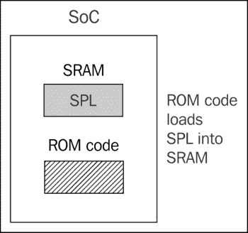

# 第三章：关于引导加载程序的一切

引导加载程序是嵌入式 Linux 的第二个元素。它是启动系统并加载操作系统内核的部分。在本章中，我将研究引导加载程序的作用，特别是它如何使用称为设备树的数据结构将控制权从自身传递给内核，也称为**扁平设备树**或**FDT**。我将介绍设备树的基础知识，以便您能够跟随设备树中描述的连接，并将其与实际硬件联系起来。

我将研究流行的开源引导加载程序 U-Boot，并看看如何使用它来引导目标设备，以及如何定制它以适应新设备。最后，我将简要介绍 Barebox，这是一个与 U-Boot 共享历史的引导加载程序，但可以说它具有更清晰的设计。

# 引导加载程序的作用是什么？

在嵌入式 Linux 系统中，引导加载程序有两个主要任务：基本系统初始化和内核加载。实际上，第一个任务在某种程度上是第二个任务的附属，因为只有在加载内核所需的系统工作正常时才需要。

当执行引导加载程序代码的第一行时，随着通电或复位，系统处于非常基本的状态。DRAM 控制器尚未设置，因此主存储器不可访问，同样，其他接口也尚未配置，因此通过 NAND 闪存控制器、MMC 控制器等访问的存储器也不可用。通常，在开始时仅有一个 CPU 核心和一些芯片上的静态存储器是可操作的。因此，系统引导包括几个代码阶段，每个阶段都将系统的更多部分带入运行。

早期引导阶段在加载内核所需的接口正常工作后停止。这包括主存储器和用于访问内核和其他映像的外围设备，无论是大容量存储还是网络。引导加载程序的最后一步是将内核加载到 RAM 中，并为其创建执行环境。引导加载程序与内核之间的接口细节是特定于体系结构的，但在所有情况下，这意味着传递有关引导加载程序已知的硬件信息的指针，并传递一个内核命令行，这是一个包含 Linux 必要信息的 ASCII 字符串。一旦内核开始执行，引导加载程序就不再需要，并且可以回收它使用的所有内存。

引导加载程序的附属任务是提供维护模式，用于更新引导配置，将新的引导映像加载到内存中，可能运行诊断。这通常由一个简单的命令行用户界面控制，通常通过串行接口。

# 引导序列

在更简单的时代，几年前，只需要将引导加载程序放在处理器的复位向量处的非易失性存储器中。当时 NOR 闪存存储器很常见，由于它可以直接映射到地址空间中，因此是存储的理想方法。以下图表显示了这样的配置，复位向量位于闪存存储器区域的顶端 0xfffffffc 处。引导加载程序被链接，以便在该位置有一个跳转指令，指向引导加载程序代码的开始位置：


旧日的引导

从那时起，它可以初始化内存控制器，使主存储器 DRAM 可用，并将自身复制到 DRAM 中。一旦完全运行，引导加载程序可以将内核从闪存加载到 DRAM 中，并将控制权转移给它。

然而，一旦远离像 NOR 闪存这样的简单线性可寻址存储介质，引导序列就变成了一个复杂的多阶段过程。细节对于每个 SoC 都非常具体，但它们通常遵循以下各个阶段。

## 阶段 1：ROM 代码

在没有可靠的外部存储器的情况下，立即在重置或上电后运行的代码必须存储在 SoC 芯片上；这就是所谓的 ROM 代码。它在制造芯片时被编程，因此 ROM 代码是专有的，不能被开源等效物替换。ROM 代码对不在芯片上的任何硬件都可以做出非常少的假设，因为它将与另一个设计不同。这甚至适用于用于主系统内存的 DRAM 芯片。因此，ROM 代码只能访问大多数 SoC 设计中找到的少量静态 RAM（SRAM）。SRAM 的大小从 4 KiB 到几百 KiB 不等：



第 1 阶段引导加载程序

ROM 代码能够从几个预编程位置之一加载一小块代码到 SRAM 中。例如，TI OMAP 和 Sitara 芯片将尝试从 NAND 闪存的前几页，或通过 SPI（串行外围接口）连接的闪存，或 MMC 设备的前几个扇区（可能是 eMMC 芯片或 SD 卡），或 MMC 设备的第一个分区上名为`MLO`的文件中加载代码。如果从所有这些存储设备读取失败，那么它将尝试从以太网、USB 或 UART 读取字节流；后者主要用作在生产过程中将代码加载到闪存中，而不是用于正常操作。大多数嵌入式 SoC 都有类似的 ROM 代码工作方式。在 SRAM 不足以加载像 U-Boot 这样的完整引导加载程序的 SoC 中，必须有一个称为二级程序加载器或 SPL 的中间加载器。

在这个阶段结束时，下一阶段的引导加载程序存在于芯片内存中，ROM 代码跳转到该代码的开头。

## 第 2 阶段：SPL

SPL 必须设置内存控制器和系统的其他必要部分，以准备将第三阶段程序加载器（TPL）加载到主内存 DRAM 中。SPL 的功能受其大小限制。它可以从存储设备列表中读取程序，就像 ROM 代码一样，再次使用从闪存设备开始的预编程偏移量，或者像`u-boot.bin`这样的众所周知的文件名。SPL 通常不允许用户交互，但它可以打印版本信息和进度消息，这些消息将显示在控制台上。以下图解释了第 2 阶段的架构：


第二阶段引导

SPL 可能是开源的，就像 TI x-loader 和 Atmel AT91Bootstrap 一样，但它通常包含供应商提供的专有代码，以二进制块的形式提供。

在第二阶段结束时，DRAM 中存在第三阶段加载器，并且 SPL 可以跳转到该区域。

## 第 3 阶段：TPL

现在，最后，我们正在运行像 U-Boot 或 Barebox 这样的完整引导加载程序。通常，有一个简单的命令行用户界面，让您执行维护任务，如将新的引导和内核映像加载到闪存中，加载和引导内核，并且有一种方法可以在没有用户干预的情况下自动加载内核。以下图解释了第 3 阶段的架构：


第三阶段引导

在第三阶段结束时，内存中存在一个等待启动的内核。嵌入式引导加载程序通常在内核运行后从内存中消失，并且在系统操作中不再起任何作用。

# 使用 UEFI 固件引导

大多数嵌入式 PC 设计和一些 ARM 设计都基于通用可扩展固件接口（UEFI）标准的固件，有关更多信息，请参阅官方网站[`www.uefi.org`](http://www.uefi.org)。引导顺序基本上与前一节中描述的相同：

**第一阶段**：处理器从闪存加载 UEFI 引导管理器固件。在某些设计中，它直接从 NOR 闪存加载，而在其他设计中，芯片上有 ROM 代码，它从 SPI 闪存加载引导管理器。引导管理器大致相当于 SPL，但可能允许用户通过基于文本或图形界面进行交互。

**第二阶段**：引导管理器从**EFI 系统分区**（**ESP**）或硬盘或固态硬盘加载引导固件，或通过 PXE 引导从网络服务器加载。如果从本地磁盘驱动器加载，则 EXP 由已知的 GUID 值 C12A7328-F81F-11D2-BA4B-00A0C93EC93B 标识。分区应使用 FAT32 格式进行格式化。第三阶段引导加载程序应该位于名为`<efi_system_partition>/boot/boot<machine_type_short_name>.efi`的文件中。

例如，在 x86_64 系统上加载器的文件路径是：`/efi/boot/bootx64.efi`

**第三阶段**：在这种情况下，TPL 必须是一个能够将 Linux 内核和可选的 RAM 磁盘加载到内存中的引导加载程序。常见选择包括：

+   **GRUB 2**：这是 GNU 统一引导加载程序，第 2 版，是 PC 平台上最常用的 Linux 加载程序。然而，有一个争议，即它根据 GPL v3 许可，这可能使其与安全引导不兼容，因为许可要求提供代码的引导密钥。网站是[`www.gnu.org/software/grub/`](https://www.gnu.org/software/grub/)。

+   **gummiboot**：这是一个简单的与 UEFI 兼容的引导加载程序，已经集成到 systemd 中，并且根据 LGPL v2.1 许可。网站是[`wiki.archlinux.org/index.php/Systemd-boot`](https://wiki.archlinux.org/index.php/Systemd-boot)。

# 从引导加载程序到内核的转移

当引导加载程序将控制权传递给内核时，它必须向内核传递一些基本信息，其中可能包括以下一些内容：

+   在 PowerPC 和 ARM 架构上：一种与 SoC 类型相关的数字

+   迄今为止检测到的硬件的基本细节，包括至少物理 RAM 的大小和位置，以及 CPU 时钟速度

+   内核命令行

+   可选的设备树二进制文件的位置和大小

+   可选的初始 RAM 磁盘的位置和大小

内核命令行是一个纯 ASCII 字符串，用于控制 Linux 的行为，例如设置包含根文件系统的设备。我将在下一章中详细介绍这一点。通常会将根文件系统提供为 RAM 磁盘，在这种情况下，引导加载程序有责任将 RAM 磁盘映像加载到内存中。我将在第五章中介绍创建初始 RAM 磁盘的方法，*构建根文件系统*。

传递这些信息的方式取决于架构，并且近年来发生了变化。例如，对于 PowerPC，引导加载程序过去只是传递一个指向板信息结构的指针，而对于 ARM，它传递了一个指向“A 标签”列表的指针。在`Documentation/arm/Booting`中有关内核源代码格式的良好描述。

在这两种情况下，传递的信息量非常有限，大部分信息需要在运行时发现或硬编码到内核中作为“平台数据”。广泛使用平台数据意味着每个设备都必须有为该平台配置和修改的内核。需要一种更好的方法，这种方法就是设备树。在 ARM 世界中，从 2013 年 2 月发布 Linux 3.8 开始，逐渐摆脱了 A 标签，但仍然有相当多的设备在现场使用，甚至在开发中，仍在使用 A 标签。

# 介绍设备树

你几乎肯定会在某个时候遇到设备树。本节旨在为您快速概述它们是什么以及它们是如何工作的，但有许多细节没有讨论。

设备树是定义计算机系统的硬件组件的灵活方式。通常，设备树由引导加载程序加载并传递给内核，尽管也可以将设备树与内核映像捆绑在一起，以适应不能单独处理它们的引导加载程序。

该格式源自 Sun Microsystems 引导加载程序 OpenBoot，它被正式规范为 Open Firmware 规范，IEEE 标准 IEEE1275-1994。它曾在基于 PowerPC 的 Macintosh 计算机上使用，因此是 PowerPC Linux 端口的一个合乎逻辑的选择。从那时起，它已被许多 ARM Linux 实现大规模采用，并在较小程度上被 MIPS、MicroBlaze、ARC 和其他架构所采用。

我建议访问[`devicetree.org`](http://devicetree.org)获取更多信息。

## 设备树基础

Linux 内核包含大量设备树源文件，位于`arch/$ARCH/boot/dts`，这是学习设备树的良好起点。U-boot 源代码中也有较少数量的源文件，位于`arch/$ARCH/dts`。如果您从第三方获取硬件，则`dts`文件是板支持包的一部分，您应该期望收到其他源文件以及它。

设备树将计算机系统表示为一个层次结构中连接在一起的组件的集合，就像一棵树。设备树以根节点开始，由正斜杠`/`表示，其中包含代表系统硬件的后续节点。每个节点都有一个名称，并包含一些形式为`name = "value"`的属性。这是一个简单的例子：

```
/dts-v1/;
/{
  model = "TI AM335x BeagleBone";
  compatible = "ti,am33xx";
  #address-cells = <1>;
  #size-cells = <1>;
  cpus {
    #address-cells = <1>;
    #size-cells = <0>;
    cpu@0 {
      compatible = "arm,cortex-a8";
      device_type = "cpu";
      reg = <0>;
    };
  };
  memory@0x80000000 {
    device_type = "memory";
    reg = <0x80000000 0x20000000>; /* 512 MB */
  };
};
```

在这里，我们有一个包含`cpus`节点和内存节点的根节点。`cpus`节点包含一个名为`cpu@0`的单个 CPU 节点。通常约定节点的名称包括一个`@`后跟一个地址，用于将其与其他节点区分开。

根节点和 CPU 节点都有一个兼容属性。Linux 内核使用这个属性来将此名称与设备驱动程序中的`struct of_device_id`导出的字符串进行匹配（有关更多信息，请参见第八章，“介绍设备驱动程序”）。这是一个惯例，该值由制造商名称和组件名称组成，以减少不同制造商制造的类似设备之间的混淆，因此`ti,am33xx`和`arm,cortex-a8`。`compatible`通常有多个值，其中有多个驱动程序可以处理此设备。它们按最合适的顺序列出。

CPU 节点和内存节点都有一个`device_type`属性，描述设备的类别。节点名称通常是从`device_type`派生的。

## reg 属性

内存和 CPU 节点都有一个`reg`属性，它指的是寄存器空间中的一系列单元。`reg`属性由两个值组成，表示范围的起始地址和大小（长度）。两者都以零个或多个 32 位整数（称为单元）写下。因此，内存节点指的是从 0x80000000 开始，长度为 0x20000000 字节的单个内存银行。

当地址或大小值无法用 32 位表示时，理解`reg`属性变得更加复杂。例如，在具有 64 位寻址的设备上，每个需要两个单元：

```
/ {
  #address-cells = <2>;
  #size-cells = <2>;
  memory@80000000 {
    device_type = "memory";
    reg = <0x00000000 0x80000000 0 0x80000000>;
  };
}
```

有关所需单元数的信息存储在祖先节点中的`#address-cells`和`#size_cells`声明中。换句话说，要理解`reg`属性，您必须向下查找节点层次结构，直到找到`#address-cells`和`#size_cells`。如果没有，则默认值为每个都是`1` - 但是依赖后备是设备树编写者的不良做法。

现在，让我们回到 cpu 和 cpus 节点。 CPU 也有地址：在四核设备中，它们可能被标记为 0、1、2 和 3。这可以被看作是一个没有深度的一维数组，因此大小为零。因此，你可以看到在 cpus 节点中我们有`#address-cells = <1>`和`#size-cells = <0>`，在子节点`cpu@0`中，我们为`reg`属性分配了一个单一值：节点`reg = <0>`。

## Phandles 和中断

到目前为止，设备树的结构假设存在一个组件的单一层次结构，而实际上存在多个层次结构。除了组件与系统其他部分之间的明显数据连接之外，它还可能连接到中断控制器、时钟源和电压调节器。为了表达这些连接，我们有 phandles。

以一个包含可以生成中断并且中断控制器的串行端口的系统为例：

```
/dts-v1/;
{
  intc: interrupt-controller@48200000 {
    compatible = "ti,am33xx-intc";
    interrupt-controller;
    #interrupt-cells = <1>;
    reg = <0x48200000 0x1000>;
  };
  serial@44e09000 {
    compatible = "ti,omap3-uart";
    ti,hwmods = "uart1";
    clock-frequency = <48000000>;
    reg = <0x44e09000 0x2000>;
    interrupt-parent = <&intc>;
    interrupts = <72>;
  };
};
```

我们有一个中断控制器节点，它有特殊属性`#interrupt-cells`，告诉我们需要多少个 4 字节值来表示一个中断线。在这种情况下，只需要一个给出 IRQ 号码，但通常使用额外的值来描述中断，例如`1 = 低到高边沿触发`，`2 = 高到低边沿触发`，等等。

查看`serial`节点，它有一个`interrupt-parent`属性，引用了它连接到的中断控制器的标签。这就是 phandle。实际的 IRQ 线由`interrupts`属性给出，在这种情况下是`72`。

`serial`节点有其他我们之前没有见过的属性：`clock-frequency`和`ti,hwmods`。这些是特定类型设备的绑定的一部分，换句话说，内核设备驱动程序将读取这些属性来管理设备。这些绑定可以在 Linux 内核源代码的`Documentation/devicetree/bindings/`目录中找到。

## 设备树包含文件

许多硬件在同一系列 SoC 和使用相同 SoC 的板之间是共同的。这在设备树中通过将共同部分拆分为`include`文件来反映，通常使用扩展名`.dtsi`。开放固件标准将`/include/`定义为要使用的机制，就像在`vexpress-v2p-ca9.dts`的这个片段中一样：

```
/include/ "vexpress-v2m.dtsi"
```

在内核的`.dts`文件中查找，你会发现一个借用自 C 的替代`include`语句，例如在`am335x-boneblack.dts`中：

```
#include "am33xx.dtsi"
#include "am335x-bone-common.dtsi"
```

这里是`am33xx.dtsi`的另一个例子：

```
#include <dt-bindings/gpio/gpio.h>
#include <dt-bindings/pinctrl/am33xx.h>
```

最后，`include/dt-bindings/pinctrl/am33xx.h`包含普通的 C 宏：

```
#define PULL_DISABLE (1 << 3)
#define INPUT_EN (1 << 5)
#define SLEWCTRL_SLOW (1 << 6)
#define SLEWCTRL_FAST 0
```

如果设备树源文件使用内核 kbuild 构建，所有这些问题都会得到解决，因为它首先通过 C 预处理器`cpp`运行它们，其中`#include`和`#define`语句被处理成适合设备树编译器的纯文本。先前的示例中显示了这一动机：这意味着设备树源可以使用与内核代码相同的常量定义。

当我们以这种方式包含文件时，节点会叠加在一起，以创建一个复合树，其中外层扩展或修改内层。例如，`am33xx.dtsi`，它适用于所有 am33xx SoC，像这样定义了第一个 MMC 控制器接口：

```
mmc1: mmc@48060000 {
  compatible = "ti,omap4-hsmmc";
  ti,hwmods = "mmc1";
  ti,dual-volt;
  ti,needs-special-reset;
  ti,needs-special-hs-handling;
  dmas = <&edma 24  &edma 25>;
  dma-names = "tx", "rx";
  interrupts = <64>;
  interrupt-parent = <&intc>;
  reg = <0x48060000 0x1000>;
  status = "disabled";
};
```

### 注意

注意，状态是`disabled`，意味着没有设备驱动程序应该绑定到它，而且它有标签`mmc1`。

在`am335x-bone-common.dtsi`中，它被 BeagleBone 和 BeagleBone Black 都包含，相同的节点通过它的 phandle 被引用：

```
&mmc1 {
  status = "okay";
  bus-width = <0x4>;
  pinctrl-names = "default";
  pinctrl-0 = <&mmc1_pins>;
  cd-gpios = <&gpio0 6 GPIO_ACTIVE_HIGH>;
  cd-inverted;
};
```

在这里，`mmc1`被启用（`status="okay"`）因为两个变体都有物理 MMC1 设备，并且`pinctrl`已经建立。然后，在`am335x-boneblack.dts`中，你会看到另一个对`mmc1`的引用，它将其与电压调节器关联起来：

```
&mmc1 {
  vmmc-supply = <&vmmcsd_fixed>;
};
```

因此，像这样分层源文件可以提供灵活性，并减少重复代码的需求。

## 编译设备树

引导加载程序和内核需要设备树的二进制表示，因此必须使用设备树编译器`dtc`进行编译。结果是一个以`.dtb`结尾的文件，称为设备树二进制或设备树 blob。

Linux 源代码中有一个`dtc`的副本，在`scripts/dtc/dtc`中，它也可以作为许多 Linux 发行版的软件包使用。您可以使用它来编译一个简单的设备树（不使用`#include`的设备树）如下：

```
$ dtc simpledts-1.dts -o simpledts-1.dtb
DTC: dts->dts on file "simpledts-1.dts"
```

要注意的是，`dtc`不提供有用的错误消息，它只对语言的基本语法进行检查，这意味着在源文件中调试打字错误可能是一个漫长的过程。

要构建更复杂的示例，您将需要使用内核`kbuild`，如下一章所示。

# 选择引导加载程序

引导加载程序有各种形状和大小。您希望从引导加载程序中获得的特征是它们简单且可定制，并且有许多常见开发板和设备的示例配置。以下表格显示了一些通常使用的引导加载程序：

| 名称 | 架构 |
| --- | --- |
| Das U-Boot | ARM, Blackfin, MIPS, PowerPC, SH |
| Barebox | ARM, Blackfin, MIPS, PowerPC |
| GRUB 2 | X86, X86_64 |
| RedBoot | ARM, MIPS, PowerPC, SH |
| CFE | Broadcom MIPS |
| YAMON | MIPS |

我们将专注于 U-Boot，因为它支持许多处理器架构和大量的个别板和设备。它已经存在很长时间，并且有一个良好的社区支持。

也许您收到了一个与您的 SoC 或板一起的引导加载程序。像往常一样，仔细看看您拥有的东西，并询问您可以从哪里获取源代码，更新政策是什么，如果您想进行更改他们将如何支持您等等。您可能要考虑放弃供应商提供的加载程序，改用开源引导加载程序的当前版本。

# U-Boot

U-Boot，或者以其全名 Das U-Boot，最初是嵌入式 PowerPC 板的开源引导加载程序。然后，它被移植到基于 ARM 的板上，后来又移植到其他架构，包括 MIPS、SH 和 x86。它由 Denx 软件工程托管和维护。有大量的信息可用，一个很好的起点是[www.denx.de/wiki/U-Boot](http://www.denx.de/wiki/U-Boot)。还有一个邮件列表在`<u-boot@lists.denx.de>`。

## 构建 U-Boot

首先要获取源代码。与大多数项目一样，推荐的方法是克隆 git 存档并检出您打算使用的标签，本例中是写作时的当前版本：

```
$ git clone git://git.denx.de/u-boot.git
$ cd u-boot
$ git checkout v2015.07

```

或者，您可以从 ftp://ftp.denx.de/pub/u-boot/获取一个 tarball。

在`configs/`目录中有超过 1,000 个常见开发板和设备的配置文件。在大多数情况下，您可以根据文件名猜出要使用哪个，但您可以通过查看`board/`目录中每个板的`README`文件来获取更详细的信息，或者您可以在适当的网络教程或论坛中找到信息。不过要注意，自 2014.10 版本以来，U-Boot 的配置方式发生了很多变化。请仔细检查您正在遵循的说明是否合适。

以 BeagleBone Black 为例，我们发现在`configs/`中有一个名为`am335x_boneblack_defconfig`的可能配置文件，并且在 am335x 芯片的板`README`文件`board/ti/am335x/README`中找到了文本**该板生成的二进制文件支持...Beaglebone Black**。有了这些知识，为 BeagleBone Black 构建 U-Boot 就很简单了。您需要通过设置`make`变量`CROSS_COMPILE`来告知 U-Boot 交叉编译器的前缀，然后使用`make [board]_defconfig`类型的命令选择配置文件，如下所示：

```
$ make CROSS_COMPILE=arm-cortex_a8-linux-gnueabihf- am335x_boneblack_defconfig
$ make CROSS_COMPILE=arm-cortex_a8-linux-gnueabihf-

```

编译的结果是：

+   `u-boot`：这是以 ELF 对象格式的 U-Boot，适合与调试器一起使用

+   `u-boot.map`：这是符号表

+   `u-boot.bin`：这是 U-Boot 的原始二进制格式，适合在设备上运行

+   `u-boot.img`：这是`u-boot.bin`添加了 U-Boot 头的版本，适合上传到正在运行的 U-Boot 副本

+   `u-boot.srec`：这是以 Motorola `srec`格式的 U-Boot，适合通过串行连接传输

BeagleBone Black 还需要一个**Secondary Program Loader**（**SPL**），如前所述。这是同时构建的，命名为`MLO`。

```
$ ls -l MLO u-boot*
-rw-rw-r-- 1 chris chris 76100 Dec 20 11:22 MLO
-rwxrwxr-x 1 chris chris 2548778 Dec 20 11:22 u-boot
-rw-rw-r-- 1 chris chris 449104 Dec 20 11:22 u-boot.bin
-rw-rw-r-- 1 chris chris 449168 Dec 20 11:22 u-boot.img
-rw-rw-r-- 1 chris chris 434276 Dec 20 11:22 u-boot.map
-rw-rw-r-- 1 chris chris 1347442 Dec 20 11:22 u-boot.srec

```

其他目标的过程类似。

## 安装 U-Boot

首次在板上安装引导加载程序需要一些外部帮助。如果板上有硬件调试接口，比如 JTAG，通常可以直接将 U-Boot 的副本加载到 RAM 中并运行。从那时起，您可以使用 U-Boot 命令将其复制到闪存中。这些细节非常依赖于板子，并且超出了本书的范围。

一些 SoC 设计内置了引导 ROM，可以用于从各种外部来源（如 SD 卡、串行接口或 USB）读取引导代码，BeagleBone Black 中的 AM335x 芯片就是这种情况。以下是如何通过 micro-SD 卡加载 U-Boot。

首先，格式化 micro-SD 卡，使第一个分区为 FAT32 格式，并标记为可引导。如果有直接的 SD 卡插槽可用，卡片将显示为`/dev/mmcblk0`，否则，如果使用内存卡读卡器，它将显示为`/dev/sdb`，或`/dev/sdc`等。现在，假设卡片显示为`/dev/mmcblk0`，输入以下命令对 micro-SD 卡进行分区：

```
$ sudo sfdisk -D -H 255 -S 63 /dev/mmcblk0 << EOF 
,9,0x0C,*
,,,-
EOF

```

将第一个分区格式化为`FAT16`：

```
$ sudo mkfs.vfat -F 16 -n boot /dev/mmcblk0p1

```

现在，挂载您刚刚格式化的分区：在某些系统上，只需简单地拔出 micro-SD 卡，然后再插入即可，而在其他系统上，您可能需要单击一个图标。在当前版本的 Ubuntu 上，它应该被挂载为`/media/[user]/boot`，所以我会像这样将 U-Boot 和 SPL 复制到它：

```
cp MLO u-boot.img /media/chris/boot

```

最后，卸载它。

在 BeagleBone 板上没有电源的情况下，插入 micro-SD 卡。

插入串行电缆。串行端口应该出现在您的 PC 上，如`/dev/ttyUSB0`或类似。

启动适当的终端程序，如`gtkterm`、`minicom`或`picocom`，并以 115,200 bps 的速度，无流控制连接到端口：

```
$ gtkterm -p /dev/ttyUSB0 -s 115200

```

按住 Beaglebone 上的**Boot Switch**按钮，使用外部 5V 电源连接器启动板，大约 5 秒后释放按钮。您应该在串行控制台上看到一个 U-Boot 提示：

```
U-Boot#

```

## 使用 U-Boot

在本节中，我将描述一些您可以使用 U-Boot 执行的常见任务。

通常，U-Boot 通过串行端口提供命令行界面。它提供一个为每个板定制的命令提示符。在示例中，我将使用`U-Boot#`。输入`help`会打印出此版本 U-Boot 中配置的所有命令；输入`help <command>`会打印出有关特定命令的更多信息。

默认的命令解释器非常简单。按左右光标键没有命令行编辑；按*Tab*键没有命令完成；按上光标键没有命令历史。按下这些键会中断您当前尝试输入的命令，您将不得不输入`Ctrl`+`C`并重新开始。您唯一可以安全使用的行编辑键是退格键。作为一个选项，您可以配置一个名为 Hush 的不同命令外壳，它具有更复杂的交互式支持。

默认的数字格式是十六进制。例如，如下命令所示：

```
nand read 82000000 400000 200000

```

此命令将从 NAND 闪存的偏移 0x400000 处读取 0x200000 字节，加载到 RAM 地址 0x82000000 处。

### 环境变量

U-Boot 广泛使用环境变量来存储和传递信息，甚至创建脚本。环境变量是简单的`name=value`对，存储在内存的一个区域中。变量的初始填充可以在板配置头文件中编码，如下所示：

```
#define CONFIG_EXTRA_ENV_SETTINGS \
"myvar1=value1\0" \
"myvar2=value2\0"
```

您可以使用`setenv`从 U-Boot 命令行创建和修改变量。例如，`setenv foo bar`会创建变量`foo`，其值为`bar`。请注意，变量名称和值之间没有`=`号。您可以通过将其设置为空字符串`setenv foo`来删除变量。您可以使用`printenv`将所有变量打印到控制台，或者使用`printenv foo`打印单个变量。

通常，可以使用`saveenv`命令将整个环境保存到某种永久存储中。如果有原始 NAND 或 NOR 闪存，则会保留一个擦除块，通常还有另一个用于冗余副本，以防止损坏。如果有 eMMC 或 SD 卡存储，它可以存储在磁盘分区中的文件中。其他选项包括存储在通过 I2C 或 SPI 接口连接的串行 EEPROM 中，或者存储在非易失性 RAM 中。

### 引导映像格式

U-Boot 没有文件系统。相反，它使用 64 字节的标头标记信息块，以便跟踪内容。您可以使用`mkimage`命令为 U-Boot 准备文件。以下是其用法的简要总结：

```
$ mkimage
Usage: mkimage -l image
-l ==> list image header information
mkimage [-x] -A arch -O os -T type -C comp -a addr -e ep -n name -d data_file[:data_file...] image
-A ==> set architecture to 'arch'
-O ==> set operating system to 'os'
-T ==> set image type to 'type'
-C ==> set compression type 'comp'
-a ==> set load address to 'addr' (hex)
-e ==> set entry point to 'ep' (hex)
-n ==> set image name to 'name'
-d ==> use image data from 'datafile'
-x ==> set XIP (execute in place)
mkimage [-D dtc_options] -f fit-image.its fit-image
mkimage -V ==> print version information and exit

```

例如，为 ARM 处理器准备内核映像的命令是：

```
$ mkimage -A arm -O linux -T kernel -C gzip -a 0x80008000 \
-e 0x80008000 -n 'Linux' -d zImage uImage

```

### 加载映像

通常，您将从可移动存储介质（如 SD 卡或网络）加载映像。SD 卡在 U-Boot 中由`mmc`驱动程序处理。将映像加载到内存的典型序列如下：

```
U-Boot# mmc rescan
U-Boot# fatload mmc 0:1 82000000 uimage
reading uimage
4605000 bytes read in 254 ms (17.3 MiB/s)
U-Boot# iminfo 82000000

## Checking Image at 82000000 ...
Legacy image found
Image Name: Linux-3.18.0
Created: 2014-12-23 21:08:07 UTC
Image Type: ARM Linux Kernel Image (uncompressed)
Data Size: 4604936 Bytes = 4.4 MiB
Load Address: 80008000
Entry Point: 80008000
Verifying Checksum ... OK

```

`mmc rescan`命令重新初始化`mmc`驱动程序，也许是为了检测最近插入的 SD 卡。接下来，使用`fatload`从 SD 卡上的 FAT 格式分区中读取文件。格式如下：

`fatload <interface> [<dev[:part]> [<addr> [<filename> [bytes [pos]]]]]`

如果`<interface>`是`mmc`，如我们的情况，`<dev:part>`是从零开始计数的`mmc`接口的设备号，以及从一开始计数的分区号。因此，`<0:1>`是第一个设备上的第一个分区。选择的内存位置`0x82000000`是为了在此时未被使用的 RAM 区域中。如果我们打算引导此内核，我们必须确保在解压缩内核映像并将其定位到运行时位置`0x80008000`时，不会覆盖此 RAM 区域。

要通过网络加载映像文件，您可以使用**Trivial File Transfer Protocol**（**TFTP**）。这需要您在开发系统上安装 TFTP 守护程序 tftpd，并启动它运行。您还必须配置 PC 和目标板之间的任何防火墙，以允许 UDP 端口 69 上的 TFTP 协议通过。tftpd 的默认配置仅允许访问目录`/var/lib/tftpboot`。下一步是将要传输的文件复制到该目录中。然后，假设您使用一对静态 IP 地址，这样就无需进行进一步的网络管理，加载一组内核映像文件的命令序列应如下所示：

```
U-Boot# setenv ipaddr 192.168.159.42
U-Boot# setenv serverip 192.168.159.99
U-Boot# tftp 82000000 uImage
link up on port 0, speed 100, full duplex
Using cpsw device
TFTP from server 192.168.159.99; our IP address is 192.168.159.42
Filename 'uImage'.
Load address: 0x82000000
Loading:
#################################################################
#################################################################
#################################################################
######################################################
3 MiB/s
done
Bytes transferred = 4605000 (464448 hex)

```

最后，让我们看看如何将映像编程到 NAND 闪存中并读取它们，这由`nand`命令处理。此示例通过 TFTP 加载内核映像并将其编程到闪存：

```
U-Boot# fatload mmc 0:1 82000000 uimage
reading uimage
4605000 bytes read in 254 ms (17.3 MiB/s)

U-Boot# nandecc hw
U-Boot# nand erase 280000 400000

NAND erase: device 0 offset 0x280000, size 0x400000
Erasing at 0x660000 -- 100% complete.
OK
U-Boot# nand write 82000000 280000 400000

NAND write: device 0 offset 0x280000, size 0x400000
4194304 bytes written: OK

```

现在您可以使用`nand read`从闪存中加载内核：

```
U-Boot# nand read 82000000 280000 400000

```

## 引导 Linux

`bootm`命令启动内核映像。语法是：

`bootm [内核地址] [ramdisk 地址] [dtb 地址]`。

内核映像的地址是必需的，但如果内核配置不需要 ramdisk 和 dtb，则可以省略 ramdisk 和 dtb 的地址。如果有 dtb 但没有 ramdisk，则第二个地址可以替换为破折号（`-`）。看起来像这样：

```
U-Boot# bootm 82000000 - 83000000

```

### 使用 U-Boot 脚本自动引导

显然，每次打开电源时键入一长串命令来引导板是不可接受的。为了自动化这个过程，U-Boot 将一系列命令存储在环境变量中。如果特殊变量`bootcmd`包含一个脚本，它将在`bootdelay`秒的延迟后在上电时运行。如果你在串行控制台上观看，你会看到延迟倒计时到零。在这段时间内，你可以按任意键终止倒计时，并进入与 U-Boot 的交互会话。

创建脚本的方式很简单，尽管不容易阅读。你只需附加由分号分隔的命令，分号前必须有一个反斜杠转义字符。因此，例如，要从闪存中的偏移加载内核镜像并引导它，你可以使用以下命令：

```
setenv bootcmd nand read 82000000 400000 200000\;bootm 82000000

```

## 将 U-Boot 移植到新板

假设你的硬件部门创建了一个基于 BeagleBone Black 的名为“Nova”的新板，你需要将 U-Boot 移植到它上面。你需要了解 U-Boot 代码的布局以及板配置机制的工作原理。在 2014.10 版本中，U-Boot 采用了与 Linux 内核相同的配置机制，`Kconfig`。在接下来的几个版本中，现有的配置设置将从`include/configs`中的当前位置移动到`Kconfig`文件中。截至 2014.10 版本，每个板都有一个`Kconfig`文件，其中包含从旧的`boards.cfg`文件中提取的最小信息。

你将要处理的主要目录是：

+   `arch`：包含特定于每个支持的架构的代码，位于 arm、mips、powerpc 等目录中。在每个架构中，都有一个家族成员的子目录，例如在`arch/arm/cpu`中，有包括 amt926ejs、armv7 和 armv8 在内的架构变体的目录。

+   `板`: 包含特定于板的代码。如果同一个供应商有多个板，它们可以被收集到一个子目录中，因此基于 BeagelBone 的 am335x evm 板的支持在`board/ti/am335x`中。

+   `公共`: 包含核心功能，包括命令行和可以从中调用的命令，每个命令都在一个名为`cmd_[命令名称].c`的文件中。

+   `doc`：包含几个描述 U-Boot 各个方面的`README`文件。如果你想知道如何进行 U-Boot 移植，这是一个很好的起点。

+   `包括`：除了许多共享的头文件外，这还包括非常重要的子目录`include/configs`，在这里你会找到大部分的板配置设置。随着向`Kconfig`的转变，信息将被移出到`Kconfig`文件中，但在撰写本文时，这个过程才刚刚开始。

## Kconfig 和 U-Boot

`Kconfig`从`Kconfig`文件中提取配置信息，并将总系统配置存储在一个名为`.config`的文件中的方式在第四章中有详细描述，*移植和配置内核*。U-Boot 采用了 kconfig 和 kbuild，并进行了一些更改。一个 U-Boot 构建可以产生最多三个二进制文件：一个`普通的 u-boot.bin`，一个**二级程序加载器**（**SPL**），和一个**三级程序加载器**（**TPL**），每个可能有不同的配置选项。因此，`.config`文件和默认配置文件中的行可以用下表中显示的代码前缀来表示它们适用于哪个目标：

| 无 | 仅普通镜像 |
| --- | --- |
| `S:` | 仅 SPL 镜像 |
| `T:` | 仅 TPL 镜像 |
| `ST:` | SPL 和 TPL 镜像 |
| `+S:` | 普通和 SPL 镜像 |
| `+T:` | 普通和 TPL 镜像 |
| `+ST:` | 普通、SPL 和 TPL 镜像 |

每个板都有一个存储在`configs/[板名称]_defconfig`中的默认配置。对于你的 Nova 板，你需要创建一个名为`nova_defonfig`的文件，并在其中添加这些行：

```
CONFIG_SPL=y
CONFIG_SYS_EXTRA_OPTIONS="SERIAL1,CONS_INDEX=1,EMMC_BOOT"
+S:CONFIG_ARM=y
+S:CONFIG_TARGET_NOVA=y
```

在第一行，`CONFIG_SPL=y`会导致生成 SPL 二进制文件 MLO，`CONFIG_ARM=y`会导致在第三行包含`arch/arm/Kconfig`的内容。在第四行，`CONFIG_TARGET_NOVA=y`选择您的板。请注意，第三行和第四行都以`+S：`为前缀，以便它们适用于 SPL 和普通二进制文件。

您还应该在 ARM 架构的`Kconfig`中添加一个菜单选项，允许人们选择 Nova 作为目标：

```
CONFIG_SPL=y
config TARGET_NOVA
bool "Support Nova!"
```

### 特定于板的文件

每个板都有一个名为`board/[board name]`或`board/[vendor]/[board name]`的子目录，其中应包含：

+   `Kconfig`：包含板的配置选项

+   `MAINTAINERS`：包含有关板当前是否被维护以及如果是的话由谁维护的记录

+   `Makefile`：用于构建特定于板的代码

+   `README`：包含有关 U-Boot 端口的任何有用信息，例如，涵盖了哪些硬件变体

此外，可能还有特定于板的功能的源文件。

您的 Nova 板基于 BeagleBone，而 BeagleBone 又基于 TI AM335x EVM，因此，您可以首先复制 am335x 板文件：

```
$ mkdir board/nova
$ cp -a board/ti/am335x board/nova

```

接下来，更改`Kconfig`文件以反映 Nova 板：

```
if TARGET_NOVA

config SYS_CPU
default "armv7"

config SYS_BOARD
default "nova"

config SYS_SOC
default "am33xx"

config SYS_CONFIG_NAME
default "nova"
endif
```

将`SYS_CPU`设置为`armv7`会导致`arch/arm/cpu/armv7`中的代码被编译和链接。将`SYS_SOC`设置为`am33xx`会导致`arch/arm/cpu/armv7/am33xx`中的代码被包含，将`SYS_BOARD`设置为`nova`会引入`board/nova`，将`SYS_CONFIG_NAME`设置为`nova`意味着头文件`include/configs/nova.h`用于进一步的配置选项。

`board/nova`中还有另一个文件需要更改，即放置在`board/nova/u-boot.lds`的链接器脚本，其中硬编码引用了`board/ti/am335x/built-in.o`。将其更改为使用`nova`本地的副本：

```
diff --git a/board/nova/u-boot.lds b/board/nova/u-boot.lds
index 78f294a..6689b3d 100644
--- a/board/nova/u-boot.lds
+++ b/board/nova/u-boot.lds
@@ -36,7 +36,7 @@ SECTIONS
*(.__image_copy_start)
*(.vectors)
CPUDIR/start.o (.text*)
- board/ti/am335x/built-in.o (.text*)
+ board/nova/built-in.o (.text*)
*(.text*)
}
```

### 配置头文件

每个板在`include/configs`中都有一个头文件，其中包含大部分配置。该文件由板的`Kconfig`中的`SYS_CONFIG_NAME`标识符命名。该文件的格式在 U-Boot 源树顶层的`README`文件中有详细描述。

对于您的 Nova 板，只需将`am335x_evm.h`复制到`nova.h`并进行少量更改：

```
diff --git a/include/configs/nova.h b/include/configs/nova.h
index a3d8a25..8ea1410 100644
--- a/include/configs/nova.h
+++ b/include/configs/nova.h
@@ -1,5 +1,5 @@
/*
- * am335x_evm.h
+ * nova.h, based on am335x_evm.h
*
* Copyright (C) 2011 Texas Instruments Incorporated - http://www.ti.com/
*
@@ -13,8 +13,8 @@
* GNU General Public License for more details.
*/
-#ifndef __CONFIG_AM335X_EVM_H
-#define __CONFIG_AM335X_EVM_H
+#ifndef __CONFIG_NOVA
+#define __CONFIG_NOVA
#include <configs/ti_am335x_common.h>
@@ -39,7 +39,7 @@
#define V_SCLK (V_OSCK)
/* Custom script for NOR */
-#define CONFIG_SYS_LDSCRIPT "board/ti/am335x/u-boot.lds"
+#define CONFIG_SYS_LDSCRIPT "board/nova/u-boot.lds"
/* Always 128 KiB env size */
#define CONFIG_ENV_SIZE (128 << 10)
@@ -50,6 +50,9 @@
#define CONFIG_PARTITION_UUIDS
#define CONFIG_CMD_PART
+#undef CONFIG_SYS_PROMPT
+#define CONFIG_SYS_PROMPT "nova!> "
+
#ifdef CONFIG_NAND
#define NANDARGS \
"mtdids=" MTDIDS_DEFAULT "\0" \
```

## 构建和测试

要为 Nova 板构建，请选择您刚刚创建的配置：

```
$ make CROSS_COMPILE=arm-cortex_a8-linux-gnueabi- nova_defconfig
$ make CROSS_COMPILE=arm-cortex_a8-linux-gnueabi-

```

将`MLO`和`u-boot.img`复制到您之前创建的 micro-SD 卡的 FAT 分区，并启动板。

## 猎鹰模式

我们习惯于现代嵌入式处理器的引导涉及 CPU 引导 ROM 加载 SPL，SPL 加载`u-boot.bin`，然后加载 Linux 内核。您可能想知道是否有办法减少步骤数量，从而简化和加快引导过程。答案是 U-Boot“猎鹰模式”，以游隼命名，据称是所有鸟类中最快的。

这个想法很简单：让 SPL 直接加载内核映像，跳过`u-boot.bin`。没有用户交互，也没有脚本。它只是从 flash 或 eMMC 中的已知位置加载内核到内存中，传递给它一个预先准备好的参数块并启动它运行。配置猎鹰模式的详细信息超出了本书的范围。如果您想了解更多信息，请查看`doc/README.falcon`。

# Barebox

我将以另一个引导加载程序结束这一章，它与 U-Boot 有相同的根源，但对引导加载程序采取了新的方法。它源自 U-Boot，在早期实际上被称为 U-Boot v2。Barebox 的开发人员旨在结合 U-Boot 和 Linux 的最佳部分，包括类似 POSIX 的 API 和可挂载的文件系统。

Barebox 项目网站是[www.barebox.org](http://www.barebox.org)，开发者邮件列表是`<barebox@lists.infradead.org>`。

## 获取 Barebox

要获取 Barebox，克隆 git 存储库并检出您想要使用的版本：

```
$ git clone git://git.pengutronix.de/git/barebox.git
$ cd barebox
$ git checkout v2014.12.0

```

代码的布局类似于 U-Boot：

+   `arch`：包含每个支持的架构的特定代码，其中包括所有主要的嵌入式架构。SoC 支持在`arch/[architecture]/mach-[SoC]`中。对于单独的板支持在`arch/[architecture]/boards`中。

+   `common`：包含核心功能，包括 shell。

+   `commands`：包含可以从 shell 中调用的命令。

+   `Documentation`：包含文档文件的模板。要构建它，输入"`make docs`"。结果放在`Documentation/html`中。

+   `drivers`：包含设备驱动程序的代码。

+   `include`：包含头文件。

## 构建 Barebox

Barebox 长期以来一直使用`kconfig/kbuild`。在`arch/[architecture]/configs`中有默认的配置文件。举个例子，假设你想为 BeagleBoard C4 构建 Barebox。你需要两个配置，一个是 SPL，一个是主二进制文件。首先，构建 MLO：

```
$ make ARCH=arm CROSS_COMPILE=arm-cortex_a8-linux-gnueabi- omap3530_beagle_xload_defconfig
$ make ARCH=arm CROSS_COMPILE=arm-cortex_a8-linux-gnueabi-

```

结果是次级程序加载器 MLO。

接下来，构建 Barebox：

```
$ make ARCH=arm CROSS_COMPILE=arm-cortex_a8-linux-gnueabi- omap3530_beagle_defconfig
$ make ARCH=arm CROSS_COMPILE=arm-cortex_a8-linux-gnueabi-

```

将两者都复制到 SD 卡上：

```
$ cp MLO /media/boot/
$ cp barebox-flash-image /media/boot/barebox.bin

```

然后，启动板子，你应该在控制台上看到这样的消息：

```
barebox 2014.12.0 #1 Wed Dec 31 11:04:39 GMT 2014

Board: Texas Instruments beagle
nand: Trying ONFI probe in 16 bits mode, aborting !
nand: NAND device: Manufacturer ID: 0x2c, Chip ID: 0xba (Micron ), 256MiB, page
size: 2048, OOB size: 64
omap-hsmmc omap3-hsmmc0: registered as omap3-hsmmc0
mci0: detected SD card version 2.0
mci0: registered disk0
malloc space: 0x87bff400 -> 0x87fff3ff (size 4 MiB)
booting from MMC

barebox 2014.12.0 #2 Wed Dec 31 11:08:59 GMT 2014

Board: Texas Instruments beagle
netconsole: registered as netconsole-1
i2c-omap i2c-omap30: bus 0 rev3.3 at 100 kHz
ehci ehci0: USB EHCI 1.00
nand: Trying ONFI probe in 16 bits mode, aborting !
nand: NAND device: Manufacturer ID: 0x2c, Chip ID: 0xba (Micron NAND 256MiB 1,8V
16-bit), 256MiB, page size: 2048, OOB size: 64
omap-hsmmc omap3-hsmmc0: registered as omap3-hsmmc0
mci0: detected SD card version 2.0
mci0: registered disk0
malloc space: 0x85e00000 -> 0x87dfffff (size 32 MiB)
environment load /boot/barebox.env: No such file or directory
Maybe you have to create the partition.
no valid environment found on /boot/barebox.env. Using default environment
running /env/bin/init...

Hit any key to stop autoboot: 0

```

Barebox 正在不断发展。在撰写本文时，它缺乏 U-Boot 所具有的广泛硬件支持，但对于新项目来说是值得考虑的。

# 总结

每个系统都需要一个引导加载程序来启动硬件并加载内核。U-Boot 受到许多开发人员的青睐，因为它支持一系列有用的硬件，并且相对容易移植到新设备上。在过去几年中，嵌入式硬件的复杂性和不断增加的种类导致了设备树的引入，作为描述硬件的一种方式。设备树只是系统的文本表示，编译成**设备树二进制**（**dtb**），并在内核加载时传递给内核。内核需要解释设备树，并加载和初始化设备驱动程序。

在使用中，U-Boot 非常灵活，允许从大容量存储、闪存或网络加载和引导镜像。同样，Barebox 也可以实现相同的功能，但硬件支持的基础较小。尽管其更清晰的设计和受 POSIX 启发的内部 API，但在撰写本文时，它似乎还没有被接受到自己的小而专注的社区之外。

在介绍了一些 Linux 引导的复杂性之后，下一章中你将看到嵌入式项目的第三个元素，内核，进入到过程的下一个阶段。
