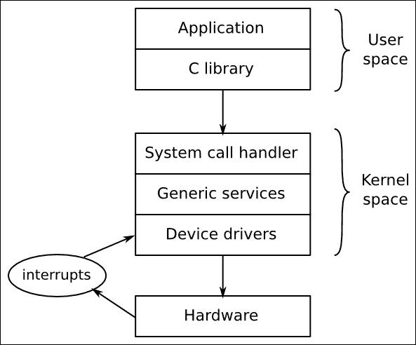
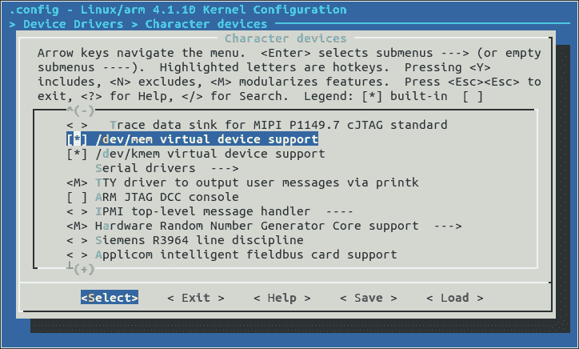

# 第四章。移植和配置内核

内核是嵌入式 Linux 的第三个元素。它是负责管理资源和与硬件接口的组件，因此几乎影响到最终软件构建的每个方面。它通常根据您的特定硬件配置进行定制，尽管正如我们在第三章中看到的，设备树允许您通过设备树的内容创建一个通用内核，以适应特定硬件。

在本章中，我们将看看如何为板载获取内核，以及如何配置和编译它。我们将再次看看引导加载程序，这次重点放在内核所扮演的角色上。我们还将看看设备驱动程序以及它们如何从设备树中获取信息。

# 内核的主要作用是什么？

Linux 始于 1991 年，当时 Linus Torvalds 开始为基于 Intel 386 和 486 的个人计算机编写操作系统。他受到了四年前 Andrew S. Tanenbaum 编写的 Minix 操作系统的启发。Linux 在许多方面与 Minix 不同，主要区别在于它是一个 32 位虚拟内存内核，代码是开源的，后来发布在 GPL 2 许可下。

1991 年 8 月 25 日，他在*comp.os.minix*新闻组上宣布了这一消息，这是一篇著名的帖子，开头是*大家好，所有使用 minix 的人 - 我正在为 386(486) AT 克隆机做一个(免费)操作系统(只是一项爱好，不会像 gnu 那样大而专业)。这个想法从四月份开始酝酿，现在已经开始准备。我想听听大家对 minix 中喜欢/不喜欢的东西的反馈，因为我的操作系统在某种程度上类似(minix)（由于实际原因，文件系统的物理布局相同，等等）*。

严格来说，Linus 并没有编写操作系统，而是编写了一个内核，这是操作系统的一个组成部分。为了创建一个工作系统，他使用了 GNU 项目的组件，特别是工具链、C 库和基本命令行工具。这种区别至今仍然存在，并且使 Linux 在使用方式上具有很大的灵活性。它可以与 GNU 用户空间结合，创建一个在台式机和服务器上运行的完整 Linux 发行版，有时被称为 GNU/Linux；它可以与 Android 用户空间结合，创建著名的移动操作系统；或者它可以与基于 Busybox 的小型用户空间结合，创建一个紧凑的嵌入式系统。与 BSD 操作系统（FreeBSD、OpenBSD 和 NetBSD）形成对比，其中内核、工具链和用户空间组合成一个单一的代码库。

内核有三个主要任务：管理资源、与硬件接口和提供 API，为用户空间程序提供有用的抽象级别，如下图所示：



在用户空间运行的应用程序以较低的 CPU 特权级别运行。除了进行库调用之外，它们几乎无法做任何事情。用户空间和内核空间之间的主要接口是 C 库，它将用户级函数（如 POSIX 定义的函数）转换为内核系统调用。系统调用接口使用特定于体系结构的方法，如陷阱或软件中断，将 CPU 从低特权用户模式切换到高特权内核模式，从而允许访问所有内存地址和 CPU 寄存器。

系统调用处理程序将调用分派到适当的内核子系统：调度调用调度程序，文件系统调用文件系统代码等。其中一些调用需要来自底层硬件的输入，并将被传递给设备驱动程序。在某些情况下，硬件本身通过引发中断来调用内核函数。中断只能由设备驱动程序处理，而不能由用户空间应用程序处理。

换句话说，您的应用程序执行的所有有用的功能都是通过内核完成的。因此，内核是系统中最重要的元素之一。

# 选择内核

下一步是选择适合您项目的内核，平衡了始终使用最新软件版本的愿望和对特定供应商添加的需求。

## 内核开发周期

Linux 已经以快速的速度发展，每 8 到 12 周发布一个新版本。近年来，版本号的构造方式有所改变。2011 年 7 月之前，版本号采用了三位数的版本方案，版本号看起来像 2.6.39。中间的数字表示它是开发人员还是稳定版本，奇数（2.1.x、2.3.x、2.5.x）是给开发人员的，偶数是给最终用户的。从 2.6 版本开始，长期的开发分支（奇数）的概念被放弃了，因为它减缓了新功能向用户提供的速度。从 2.6.39 到 2011 年 7 月的 3.0 的编号变化纯粹是因为 Linus 觉得数字变得太大了：在这两个版本之间，Linux 的功能或架构没有发生巨大的飞跃。他还趁机去掉了中间的数字。从那时起，2015 年 4 月，他将主要版本从 3 提升到 4，也纯粹是为了整洁，而不是因为有任何重大的架构变化。

Linus 管理开发内核树。您可以通过克隆他的 git 树来关注他：

```
$ git clone \ git://git.kernel.org/pub/scm/linux/kernel/git/torvalds/linux.git

```

这将检出到子目录`linux`。您可以通过在该目录中不时运行`git pull`命令来保持最新。

目前，内核开发的完整周期始于两周的合并窗口期，在此期间 Linus 将接受新功能的补丁。合并窗口结束后，稳定化阶段开始，Linus 将发布版本号以-rc1、-rc2 等结尾的候选版本，通常会发布到-rc7 或-rc8。在此期间，人们测试候选版本并提交错误报告和修复。当所有重要的错误都被修复后，内核就会发布。

合并窗口期间合并的代码必须已经相当成熟。通常，它是从内核的许多子系统和架构维护者的存储库中提取的。通过保持短的开发周期，可以在功能准备就绪时合并功能。如果内核维护人员认为某个功能不够稳定或发展不够完善，它可以简单地延迟到下一个发布版本。

跟踪每个版本之间的变化并不容易。您可以阅读 Linus 的 git 存储库中的提交日志，但是每个发布版本大约有 10,000 个或更多的条目，很难得到一个概述。幸运的是，有*Linux Kernel Newbies*网站，[`kernelnewbies.org`](http://kernelnewbies.org)，您可以在[`kernelnewbies.org/LinuxVersions`](http://kernelnewbies.org/LinuxVersions)找到每个版本的简要概述。

## 稳定和长期支持版本

Linux 的快速变化速度是一件好事，因为它将新功能引入了主线代码库，但它并不太适合嵌入式项目的较长生命周期。内核开发人员以两种方式解决了这个问题。首先，他们承认一个发布版本可能包含需要在下一个内核发布版本之前修复的错误。这就是由 Greg Kroah-Hartman 维护的稳定 Linux 内核的作用。发布后，内核从“主线”（由 Linus 维护）转变为“稳定”（由 Greg 维护）。稳定内核的错误修复版本由第三个数字标记，如 3.18.1、3.18.2 等。在 3 版本之前，有四个发布数字，如 2.6.29.1、2.6.39.2 等。

您可以使用以下命令获取稳定树：

```
$ git clone \
git://git.kernel.org/pub/scm/linux/kernel/git/stable/linux-stable.git

```

您可以使用`git chckout`获取特定版本，例如版本 4.1.10：

```
$ cd linux-stable
$ git checkout v4.1.10

```

通常，稳定的内核只维护到下一个主线发布，通常是 8 到 12 周后，因此您会发现在[kernel.org](http://kernel.org)上只有一个或两个稳定的内核。为了满足那些希望在更长时间内获得更新并确保任何错误都将被发现和修复的用户，一些内核被标记为**长期**，并维护两年或更长时间。每年至少有一个长期内核。在撰写本文时，[kernel.org](http://kernel.org)上总共有八个长期内核：4.1、3.18、3.14、3.12、3.10、3.4、3.2 和 2.6.32。后者已经维护了五年，目前版本为 2.6.32.68。如果您正在构建一个需要维护这么长时间的产品，最新的长期内核可能是一个不错的选择。

## 供应商支持

在理想的世界中，您可以从[kernel.org](http://kernel.org)下载内核，并为任何声称支持 Linux 的设备进行配置。然而，这并不总是可能的：事实上，主线 Linux 只对可以运行 Linux 的许多设备中的一小部分具有坚实的支持。您可能会从独立的开源项目、Linaro 或 Yocto 项目等地方找到对您的板子或 SoC 的支持，或者从提供嵌入式 Linux 第三方支持的公司那里找到支持，但在许多情况下，您将被迫寻求您的 SoC 或板子的供应商提供一个可用的内核。正如我们所知，有些供应商比其他供应商更好。

### 提示

我在这一点上唯一的建议是选择给予良好支持的供应商，或者更好的是，让他们的内核更改进入主线。

## 许可

Linux 源代码根据 GPL v2 许可，这意味着您必须以许可中指定的一种方式提供内核的源代码。

内核许可的实际文本在`COPYING`文件中。它以 Linus 撰写的附录开头，附录指出通过系统调用接口从用户空间调用内核的代码不被视为内核的衍生作品，因此不受许可的约束。因此，在 Linux 上运行专有应用程序没有问题。

然而，有一个 Linux 许可的领域引起了无休止的混乱和争论：内核模块。内核模块只是在运行时与内核动态链接的一段代码，从而扩展了内核的功能。GPL 对静态链接和动态链接没有区别，因此内核模块的源代码似乎受到 GPL 的约束。但是，在 Linux 的早期，关于这一规则的例外情况进行了辩论，例如与 Andrew 文件系统有关。这段代码早于 Linux，因此（有人认为）不是衍生作品，因此许可不适用。多年来，关于其他代码的类似讨论也进行了讨论，结果是现在普遍认为 GPL 不一定适用于内核模块。这由内核`MODULE_LICENSE`宏所规定，该宏可以取值`Proprietary`，表示它不是根据 GPL 发布的。如果您打算自己使用相同的论点，您可能需要阅读一篇经常引用的电子邮件主题，标题为*Linux GPL 和二进制模块例外条款？*（[`yarchive.net/comp/linux/gpl_modules.html`](http://yarchive.net/comp/linux/gpl_modules.html)）。

GPL 应该被视为一件好事，因为它保证了当你和我在嵌入式项目上工作时，我们总是可以获得内核的源代码。没有它，嵌入式 Linux 将会更难使用，更加分散。

# 构建内核

在决定基于哪个内核构建您的构建之后，下一步是构建它。

## 获取源代码

假设您有一个在主线上受支持的板子。您可以通过 git 获取源代码，也可以通过下载 tarball 获取。使用 git 更好，因为您可以查看提交历史，轻松查看您可能进行的任何更改，并且可以在分支和版本之间切换。在此示例中，我们正在克隆稳定树并检出版本标签 4.1.10：

```
$ git clone git://git.kernel.org/pub/scm/linux/kernel/git/stable/linux-stable.git linux
$ cd linux
$ git checkout v4.1.10

```

或者，您可以从[`cdn.kernel.org/pub/linux/kernel/v4.x/linux-4.1.10.tar.xz`](https://cdn.kernel.org/pub/linux/kernel/v4.x/linux-4.1.10.tar.xz)下载 tarball。

这里有很多代码。在 4.1 内核中有超过 38,000 个文件，包含 C 源代码、头文件和汇编代码，总共超过 1250 万行代码（由 cloc 实用程序测量）。尽管如此，了解代码的基本布局并大致知道在哪里寻找特定组件是值得的。感兴趣的主要目录有：

+   `arch`: 这包含特定于体系结构的文件。每个体系结构都有一个子目录。

+   `Documentation`: 这包含内核文档。如果您想要找到有关 Linux 某个方面的更多信息，首先请查看这里。

+   `drivers`: 这包含设备驱动程序，成千上万个。每种类型的驱动程序都有一个子目录。

+   `fs`: 这包含文件系统代码。

+   `include`: 这包含内核头文件，包括构建工具链时所需的头文件。

+   `init`: 这包含内核启动代码。

+   `kernel`: 这包含核心功能，包括调度、锁定、定时器、电源管理和调试/跟踪代码。

+   `mm`: 这包含内存管理。

+   `net`: 这包含网络协议。

+   `scripts`: 这包含许多有用的脚本，包括设备树编译器 dtc，我在第三章中描述了*关于引导加载程序的一切*。

+   `工具`: 这包含许多有用的工具，包括 Linux 性能计数器工具 perf，在第十三章中我会描述*性能分析和跟踪*。

随着时间的推移，您将熟悉这种结构，并意识到，如果您正在寻找特定 SoC 的串行端口代码，您将在`drivers/tty/serial`中找到它，而不是在`arch/$ARCH/mach-foo`中找到，因为它是设备驱动程序，而不是 Linux 在该 SoC 上运行的核心部分。

## 了解内核配置

Linux 的一个优点是您可以根据不同的工作需求配置内核，从小型专用设备（如智能恒温器）到复杂的移动手持设备。在当前版本中有成千上万的配置选项。正确配置配置本身就是一项任务，但在此之前，我想向您展示它是如何工作的，以便您更好地理解正在发生的事情。

配置机制称为`Kconfig`，与之集成的构建系统称为`Kbuild`。两者都在`Documentation/kbuild/`中有文档。`Kconfig/Kbuild`在内核以及其他项目中都有使用，包括 crosstool-NG、U-Boot、Barebox 和 BusyBox。

配置选项在名为`Kconfig`的文件层次结构中声明，使用`Documentation/kbuild/kconfig-language.txt`中描述的语法。在 Linux 中，顶层`Kconfig`看起来像这样：

```
mainmenu "Linux/$ARCH $KERNELVERSION Kernel Configuration"
config SRCARCH
  string
  option env="SRCARCH"
  source "arch/$SRCARCH/Kconfig"
```

最后一行包括与体系结构相关的配置文件，该文件根据启用的选项源自其他`Kconfig`文件。体系结构发挥如此重要的作用有两个含义：首先，在配置 Linux 时必须通过设置`ARCH=[architecture]`指定体系结构，否则它将默认为本地机器体系结构；其次，每个体系结构的顶级菜单布局都不同。

您放入`ARCH`的值是您在`arch`目录中找到的子目录之一，其中有一个奇怪之处，即`ARCH=i386`和`ARCH=x86_64`都具有源`arch/x86/Kconfig`。

`Kconfig`文件主要由菜单组成，由`menu`、`menu title`和`endmenu`关键字界定，菜单项由`config`标记。以下是一个例子，取自`drivers/char/Kconfig`：

```
menu "Character devices"
[...]
config DEVMEM
  bool "/dev/mem virtual device support"
  default y
    help
    Say Y here if you want to support the /dev/mem device.
    The /dev/mem device is used to access areas of physical
    memory.
    When in doubt, say "Y".
```

`config`后面的参数命名了一个变量，在这种情况下是`DEVMEM`。由于这个选项是一个布尔值，它只能有两个值：如果启用了，它被赋值为`y`，如果没有，这个变量根本就没有定义。在屏幕上显示的菜单项的名称是在`bool`关键字后面的字符串。

这个配置项，以及所有其他配置项，都存储在一个名为`.config`的文件中（注意，前导点'`.`'表示它是一个隐藏文件，不会被`ls`命令显示，除非你输入`ls -a`来显示所有文件）。存储在`.config`中的变量名都以`CONFIG_`为前缀，所以如果`DEVMEM`被启用，那么这一行就是：

```
CONFIG_DEVMEM=y
```

除了`bool`之外，还有几种其他数据类型。以下是列表：

+   `bool`: 这要么是`y`，要么未定义。

+   `tristate`: 这用于一个功能可以作为内核模块构建，也可以构建到主内核映像中。值为`m`表示模块，`y`表示构建，如果未启用该功能，则未定义。

+   `int`: 这是使用十进制表示的整数值。

+   `hex`: 这是使用十六进制表示的无符号整数值。

+   `string`: 这是一个字符串值。

项目之间可能存在依赖关系，通过`depends on`短语表示，如下所示：

```
config MTD_CMDLINE_PARTS
  tristate "Command line partition table parsing"
  depends on MTD
```

如果`CONFIG_MTD`在其他地方没有被启用，这个菜单选项就不会显示，因此也无法选择。

还有反向依赖关系：`select`关键字如果启用了其他选项，则启用了这个选项。`arch/$ARCH`中的`Kconfig`文件有大量的`select`语句，启用了特定于架构的功能，如 arm 中所示：

```
config ARM
  bool
default y
  select ARCH_HAS_ATOMIC64_DEC_IF_POSITIVE
  select ARCH_HAS_ELF_RANDOMIZE
[...]
```

有几个配置实用程序可以读取`Kconfig`文件并生成一个`.config`文件。其中一些在屏幕上显示菜单，并允许你进行交互式选择。`Menuconfig`可能是大多数人熟悉的一个，但还有`xconfig`和`gconfig`。

你可以通过`make`启动每一个，记住，在内核的情况下，你必须提供一个架构，就像这里所示的那样：

```
$ make ARCH=arm menuconfig

```

在这里，你可以看到在前一段中突出显示了`DEVMEM` `config`选项的`menuconfig`：



使用 menuconfig 进行内核配置

星号(`*`)在项目的左侧表示它被选中(`="y"`)，或者如果是`M`，表示它已被选中以构建为内核模块。

### 提示

通常你会看到像`enable CONFIG_BLK_DEV_INITRD,`这样的指令，但是要浏览这么多菜单，找到设置这个配置的地方可能需要一段时间。所有的配置编辑器都有一个`search`功能。你可以在`menuconfig`中按下斜杠键`/`来访问它。在 xconfig 中，它在编辑菜单中，但是在这种情况下，确保你省略了你要搜索的变量的`CONFIG_`部分。

有这么多东西要配置，每次构建内核时都从零开始是不合理的，所以在`arch/$ARCH/configs`中有一组已知的工作配置文件，每个文件包含了单个 SoC 或一组 SoC 的合适配置值。你可以用`make [配置文件名]`来选择其中一个。例如，要配置 Linux 在使用 armv7-a 架构的各种 SoC 上运行，其中包括 BeagleBone Black AM335x，你可以输入：

```
$ make ARCH=arm multi_v7_defconfig

```

这是一个通用的内核，可以在不同的板上运行。对于更专业的应用，例如使用供应商提供的内核时，默认的配置文件是板支持包的一部分；在构建内核之前，你需要找出要使用哪一个。

还有另一个有用的配置目标名为`oldconfig`。这需要一个现有的`.config`文件，并要求您为任何没有配置值的选项提供配置值。当将配置移动到更新的内核版本时，您将使用它：将`.config`从旧内核复制到新的源目录，并运行`make ARCH=arm oldconfig`来使其保持最新。它还可以用于验证您手动编辑的`.config`文件（忽略顶部出现的文本`自动生成的文件；请勿编辑`：有时可以忽略警告）。

如果您对配置进行更改，修改后的`.config`文件将成为设备的一部分，并需要放置在源代码控制下。

当您启动内核构建时，将生成一个头文件`include/generated/autoconf.h`，其中包含每个配置值的`#define`，以便它可以像 U-Boot 一样包含在内核源中。

## 使用 LOCALVERSION 标识您的内核

您可以使用`make kernelversion`目标来查找您构建的内核版本：

```
$ make kernelversion
4.1.10

```

这在运行时通过`uname`命令报告，并且还用于命名存储内核模块的目录。

如果您从默认配置更改，建议附加您自己的版本信息，您可以通过设置`CONFIG_LOCALVERSION`来配置，您将在**常规设置配置**菜单中找到它。也可以（但不建议）通过编辑顶层 makefile 并将其附加到以`EXTRAVERSION`开头的行来执行相同的操作。例如，如果我想要使用标识符`melp`和版本 1.0 标记我正在构建的内核，我会在`.config`文件中定义本地版本如下：

```
CONFIG_LOCALVERSION="-melp-v1.0"

```

运行`make kernelversion`会产生与以前相同的输出，但现在，如果我运行`make kernelrelease`，我会看到：

```
$ make kernelrelease
4.1.10-melp-v1.0

```

它还会在内核日志的开头打印：

```
Starting kernel ...
[    0.000000] Booting Linux on physical CPU 0x0
[    0.000000] Linux version 4.1.10-melp-v1.0 (chris@builder) (gcc version 4.9.1 (crosstool-NG 1.20.0) ) #3 SMP Thu Oct 15 21:29:35 BST 2015

```

现在我可以识别和跟踪我的自定义内核。

## 内核模块

我已经多次提到内核模块。桌面 Linux 发行版广泛使用它们，以便根据检测到的硬件和所需的功能在运行时加载正确的设备和内核功能。没有它们，每个驱动程序和功能都必须静态链接到内核中，使其变得不可行大。

另一方面，对于嵌入式设备来说，硬件和内核配置通常在构建内核时就已知，因此模块并不那么有用。实际上，它们会造成问题，因为它们在内核和根文件系统之间创建了版本依赖关系，如果一个更新了而另一个没有更新，可能会导致启动失败。因此，嵌入式内核通常会构建为完全没有任何模块。以下是一些适合使用内核模块的情况：

+   当您有专有模块时，出于前一节中给出的许可原因。

+   通过推迟加载非必要驱动程序来减少启动时间。

+   当有多个驱动程序可以加载并且将占用太多内存以静态编译它们时。例如，您有一个 USB 接口来支持一系列设备。这与桌面发行版中使用的论点基本相同。

# 编译

内核构建系统`kbuild`是一组`make`脚本，它从`.config`文件中获取配置信息，计算出依赖关系，并编译所有必要的内容，以生成包含所有静态链接组件的内核映像，可能还包括设备树二进制文件和一个或多个内核模块。这些依赖关系在每个可构建组件的目录中的 makefile 中表示。例如，以下两行摘自`drivers/char/Makefile`：

```
obj-y                    += mem.o random.o
obj-$(CONFIG_TTY_PRINTK) += ttyprintk.o
```

`obj-y`规则无条件地编译文件以生成目标，因此`mem.c`和`random.c`始终是内核的一部分。在第二行中，`ttyprintk.c`取决于配置参数。如果`CONFIG_TTY_PRINTK`是`y`，它将被编译为内置模块，如果是`m`，它将作为模块构建，如果参数未定义，则根本不会被编译。

对于大多数目标，只需键入`make`（带有适当的`ARCH`和`CROSS_COMPILE`）即可完成工作，但逐步进行也是有益的。

## 编译内核映像

要构建内核映像，您需要知道您的引导加载程序期望什么。这是一个粗略的指南：

+   **U-Boot**：传统上，U-Boot 需要一个 uImage，但较新版本可以使用`bootz`命令加载`zImage`文件

+   x86 目标：它需要一个`bzImage`文件

+   **大多数其他引导加载程序**：它需要一个`zImage`文件

以下是构建`zImage`文件的示例：

```
$ make -j 4 ARCH=arm CROSS_COMPILE=arm-cortex_a8-linux-gnueabihf- zImage

```

### 提示

`-j 4`选项告诉`make`并行运行多少个作业，从而减少构建所需的时间。一个粗略的指南是运行与 CPU 核心数量相同的作业。

构建`bzImage`和`uImage`目标时也是一样的。

构建具有多平台支持的 ARM 的`uImage`文件存在一个小问题，这是当前一代 ARM SoC 内核的常态。 ARM 的多平台支持是在 Linux 3.7 中引入的。它允许单个内核二进制文件在多个平台上运行，并且是朝着为所有 ARM 设备拥有少量内核的道路上的一步。内核通过读取引导加载程序传递给它的机器号或设备树来选择正确的平台。问题出在因为每个平台的物理内存位置可能不同，因此内核的重定位地址（通常是从物理 RAM 的起始位置偏移 0x8000 字节）也可能不同。当内核构建时，重定位地址由`mkimage`命令编码到`uImage`头中，但如果有多个重定位地址可供选择，则会失败。换句话说，`uImage`格式与多平台映像不兼容。您仍然可以从多平台构建创建一个 uImage 二进制文件，只要您为希望在其上引导此内核的特定 SoC 提供`LOADADDR`。您可以通过查看`mach-[your SoC]/Makefile.boot`并注意`zreladdr-y`的值来找到加载地址。

对于 BeagleBone Black，完整的命令如下：

```
$ make -j 4 ARCH=arm CROSS_COMPILE=arm-cortex_a8-linux-gnueabihf- LOADADDR=0x80008000 uImage

```

内核构建在顶层目录中生成两个文件：`vmlinux`和`System.map`。第一个`vmlinux`是内核的 ELF 二进制文件。如果您已启用调试编译内核（`CONFIG_DEBUG_INFO=y`），它将包含可用于像`kgdb`这样的调试器的调试符号。您还可以使用其他 ELF 二进制工具，如`size`：

```
$ arm-cortex_a8-linux-gnueabihf-size vmlinux
 text     data      bss        dec       hex    filename
8812564   790692   8423536   18026792   1131128   vmlinux

```

`System.map`以人类可读的形式包含符号表。

大多数引导加载程序不能直接处理 ELF 代码。还有一个进一步的处理阶段，它将`vmlinux`放置在`arch/$ARCH/boot`中，这些二进制文件适用于各种引导加载程序：

+   `Image`：将`vmlinux`转换为原始二进制文件。

+   `zImage`：对于 PowerPC 架构，这只是`Image`的压缩版本，这意味着引导加载程序必须进行解压缩。对于所有其他架构，压缩的`Image`被附加到一个解压缩和重定位它的代码存根上。

+   `uImage`：`zImage`加上 64 字节的 U-Boot 头。

在构建过程中，您将看到正在执行的命令的摘要：

```
$ make -j 4 ARCH=arm CROSS_COMPILE=arm-cortex_a8-linux-gnueabihf-zImage
CC     init/main.o
CHK    include/generated/compile.h
CC     init/version.o
CC     init/do_mounts.o
CC     init/do_mounts_rd.o
CC     init/do_mounts_initrd.o
LD     init/mounts.o
[...]
```

有时，当内核构建失败时，查看实际执行的命令很有用。要做到这一点，请在命令行中添加`V=1`：

```
$ make ARCH=arm CROSS_COMPILE=arm-cortex_a8-linux-gnueabihf- V=1 zImage
[...]
arm-cortex_a8-linux-gnueabihf-gcc -Wp,-MD,init/.do_mounts_initrd.o.d  -nostdinc -isystem /home/chris/x-tools/arm-cortex_a8-linux-gnueabihf/lib/gcc/arm-cortex_a8-linux-gnueabihf/4.9.1/include -I./arch/arm/include -Iarch/arm/include/generated/uapi -Iarch/arm/include/generated  -Iinclude -I./arch/arm/include/uapi -Iarch/arm/include/generated/uapi -I./include/uapi -Iinclude/generated/uapi -include ./include/linux/kconfig.h -D__KERNEL__ -mlittle-endian -Wall -Wundef -Wstrict-prototypes -Wno-trigraphs -fno-strict-aliasing -fno-common -Werror-implicit-function-declaration -Wno-format-security -std=gnu89 -fno-dwarf2-cfi-asm -mabi=aapcs-linux -mno-thumb-interwork -mfpu=vfp -funwind-tables -marm -D__LINUX_ARM_ARCH__=7 -march=armv7-a -msoft-float -Uarm -fno-delete-null-pointer-checks -O2 --param=allow-store-data-races=0 -Wframe-larger-than=1024 -fno-stack-protector -Wno-unused-but-set-variable -fomit-frame-pointer -fno-var-tracking-assignments -Wdeclaration-after-statement -Wno-pointer-sign -fno-strict-overflow -fconserve-stack -Werror=implicit-int -Werror=strict-prototypes -Werror=date-time -DCC_HAVE_ASM_GOTO    -D"KBUILD_STR(s)=#s" -D"KBUILD_BASENAME=KBUILD_STR(do_mounts_initrd)"  -D"KBUILD_MODNAME=KBUILD_STR(mounts)" -c -o init/do_mounts_initrd.o init/do_mounts_initrd.c
[...]
```

## 编译设备树

下一步是构建设备树，或者如果您有多平台构建，则构建多个设备树。dtbs 目标根据`arch/$ARCH/boot/dts/Makefile`中的规则使用该目录中的设备树源文件构建设备树：

```
$ make ARCH=arm dtbs
...
DTC     arch/arm/boot/dts/omap2420-h4.dtb
DTC     arch/arm/boot/dts/omap2420-n800.dtb
DTC     arch/arm/boot/dts/omap2420-n810.dtb
DTC     arch/arm/boot/dts/omap2420-n810-wimax.dtb
DTC     arch/arm/boot/dts/omap2430-sdp.dtb
...

```

`.dtb`文件生成在与源文件相同的目录中。

## 编译模块

如果您已经配置了一些功能作为模块构建，可以使用`modules`目标单独构建它们：

```
$ make -j 4 ARCH=arm CROSS_COMPILE=arm-cortex_a8-linux-gnueabihf- modules

```

编译的模块具有`.ko`后缀，并且生成在与源代码相同的目录中，这意味着它们散布在整个内核源代码树中。找到它们有点棘手，但您可以使用`modules_install` make 目标将它们安装到正确的位置。默认位置是开发系统中的`/lib/modules`，这几乎肯定不是您想要的位置。要将它们安装到根文件系统的暂存区域（我们将在下一章讨论根文件系统），请使用`INSTALL_MOD_PATH`提供路径：

```
$ make -j4 ARCH=arm CROSS_COMPILE=arm-cortex_a8-linux-gnueabihf- INSTALL_MOD_PATH=$HOME/rootfs modules_install

```

内核模块被放置在相对于文件系统根目录的目录`/lib/modules/[kernel version]`中。

# 清理内核源代码

有三个用于清理内核源代码树的 make 目标：

+   清理：删除对象文件和大部分中间文件。

+   `mrproper`：删除所有中间文件，包括`.config`文件。使用此目标将源树恢复到克隆或提取源代码后的状态。如果您对名称感到好奇，Mr Proper 是一种在世界某些地区常见的清洁产品。`make mrproper`的含义是给内核源代码进行彻底的清洁。

+   `distclean`：这与 mrproper 相同，但还会删除编辑器备份文件、补丁剩余文件和软件开发的其他工件。

# 引导您的内核

引导高度依赖于设备，但以下是在 BeagleBone Black 和 QEMU 上使用 U-Boot 的一个示例：。

## BeagleBone Black

以下 U-Boot 命令显示了如何在 BeagleBone Black 上启动 Linux：

```
U-Boot# fatload mmc 0:1 0x80200000 zImage
reading zImage
4606360 bytes read in 254 ms (17.3 MiB/s)
U-Boot# fatload mmc 0:1 0x80f00000 am335x-boneblack.dtb
reading am335x-boneblack.dtb
29478 bytes read in 9 ms (3.1 MiB/s)
U-Boot# setenv bootargs console=ttyO0,115200
U-Boot# bootz 0x80200000 - 0x80f00000
Kernel image @ 0x80200000 [ 0x000000 - 0x464998 ]
## Flattened Device Tree blob at 80f00000
   Booting using the fdt blob at 0x80f00000
   Loading Device Tree to 8fff5000, end 8ffff325 ... OK
Starting kernel ...
[   0.000000] Booting Linux on physical CPU 0x0
...
```

请注意，我们将内核命令行设置为`console=ttyO0,115200`。这告诉 Linux 要使用哪个设备进行控制台输出，在本例中是板上的第一个 UART 设备`ttyO0`，速度为每秒 115,200 位。如果没有这个设置，我们将在`Starting the kernel ...`后看不到任何消息，因此将不知道它是否工作。

## QEMU

假设您已经安装了`qemu-system-arm`，您可以使用 multi_v7 内核和 ARM Versatile Express 的`.dtb`文件启动它，如下所示：

```
$ QEMU_AUDIO_DRV=none \
qemu-system-arm -m 256M -nographic -M vexpress-a9 -kernel zImage -dtb vexpress-v2p-ca9.dtb -append "console=ttyAMA0"

```

请注意，将`QEMU_AUDIO_DRV`设置为`none`只是为了抑制关于音频驱动程序缺少配置的 QEMU 的错误消息，我们不使用音频驱动程序。

要退出 QEMU，请键入`Ctrl-A`，然后键入`x`（两个单独的按键）。

## 内核恐慌

虽然一切开始得很顺利，但最终却以失败告终：

```
[    1.886379] Kernel panic - not syncing: VFS: Unable to mount root fs on unknown-block(0,0)
[    1.895105] ---[ end Kernel panic - not syncing: VFS: Unable to mount root fs on unknown-block(0, 0)
```

这是内核恐慌的一个很好的例子。当内核遇到不可恢复的错误时，就会发生恐慌。默认情况下，它会在控制台上打印一条消息，然后停止。您可以设置`panic`命令行参数，以允许在恐慌后重新启动之前等待几秒钟。

在这种情况下，不可恢复的错误是因为没有根文件系统，说明内核没有用户空间来控制它是无用的。您可以通过提供根文件系统作为 ramdisk 或可挂载的大容量存储设备来提供用户空间。我们将在下一章讨论如何创建根文件系统，但是为了让事情正常运行，假设我们有一个名为`uRamdisk`的 ramdisk 文件，然后您可以通过在 U-Boot 中输入以下命令来引导到 shell 提示符：

```
fatload mmc 0:1 0x80200000 zImage
fatload mmc 0:1 0x80f00000 am335x-boneblack.dtb
fatload mmc 0:1 0x81000000 uRamdisk
setenv bootargs console=ttyO0,115200 rdinit=/bin/sh
bootz 0x80200000 0x81000000 0x80f00000

```

在这里，我已经在命令行中添加了`rdinit=/bin/sh`，这样内核将运行一个 shell 并给我们一个 shell 提示符。现在，控制台上的输出看起来像这样：

```
...
[    1.930923] sr_init: No PMIC hook to init smartreflex
[    1.936424] sr_init: platform driver register failed for SR
[    1.964858] Freeing unused kernel memory: 408K (c0824000 - c088a000)
/ # uname -a
Linux (none) 3.18.3 #1 SMP Wed Jan 21 08:34:58 GMT 2015 armv7l GNU/Linux
/ #

```

最后，我们有了一个提示符，可以与我们的设备交互。

## 早期用户空间

为了从内核初始化到用户空间的过渡，内核必须挂载一个根文件系统并在该根文件系统中执行一个程序。这可以通过 ramdisk 来实现，就像前一节中所示的那样，也可以通过在块设备上挂载一个真实的文件系统来实现。所有这些代码都在`init/main.c`中，从`rest_init()`函数开始，该函数创建了 PID 为 1 的第一个线程，并运行`kernel_init()`中的代码。如果有一个 ramdisk，它将尝试执行`program /init`，这将承担设置用户空间的任务。

如果找不到并运行`/init`，它将尝试通过在`init/do_mounts.c`中调用`prepare_namespace()`函数来挂载文件系统。这需要一个`root=`命令行来指定用于挂载的块设备的名称，通常的形式是：

+   `root=/dev/<disk name><partition number>`

+   `root=/dev/<disk name>p<partition number>`

例如，对于 SD 卡上的第一个分区，应该是`root=/dev/mmcblk0p1`。如果挂载成功，它将尝试执行`/sbin/init`，然后是`/etc/init`，`/bin/init`，然后是`/bin/sh`，在第一个有效的停止。

`init`程序可以在命令行上被覆盖。对于 ramdisk，使用`rdinit=`（我之前使用`rdinit=/bin/sh`来执行 shell），对于文件系统，使用`init=`。

## 内核消息

内核开发人员喜欢通过大量使用`printk()`和类似的函数来打印有用的信息。消息根据重要性进行分类，0 是最高级别：

| Level | Value | 含义 |
| --- | --- | --- |
| `KERN_EMERG` | 0 | 系统无法使用 |
| `KERN_ALERT` | 1 | 必须立即采取行动 |
| `KERN_CRIT` | 2 | 临界条件 |
| `KERN_ERR` | 3 | 错误条件 |
| `KERN_WARNING` | 4 | 警告条件 |
| `KERN_NOTICE` | 5 | 正常但重要的条件 |
| `KERN_INFO` | 6 | 信息 |
| `KERN_DEBUG` | 7 | 调试级别的消息 |

它们首先被写入一个缓冲区`__log_buf`，其大小为`CONFIG_LOG_BUF_SHIFT`的 2 次幂。例如，如果是 16，那么`__log_buf`就是 64 KiB。您可以使用命令`dmesg`来转储整个缓冲区。

如果消息的级别低于控制台日志级别，则会在控制台上显示该消息，并放置在`__log_buf`中。默认控制台日志级别为 7，这意味着级别为 6 及以下的消息会被显示，过滤掉级别为 7 的`KERN_DEBUG`。您可以通过多种方式更改控制台日志级别，包括使用内核参数`loglevel=<level>`或命令`dmesg -n <level>`。

## 内核命令行

内核命令行是一个字符串，由引导加载程序通过`bootargs`变量传递给内核，在 U-Boot 的情况下；它也可以在设备树中定义，或作为内核配置的一部分在`CONFIG_CMDLINE`中设置。

我们已经看到了一些内核命令行的示例，但还有许多其他的。在`Documentation/kernel-parameters.txt`中有一个完整的列表。这里是一个更小的最有用的列表：

| 名称 | 描述 |
| --- | --- |
| `debug` | 将控制台日志级别设置为最高级别 8，以确保您在控制台上看到所有内核消息。 |
| `init=` | 从挂载的根文件系统中运行的`init`程序，默认为`/sbin/init`。 |
| `lpj=` | 将`loops_per_jiffy`设置为给定的常数，参见下一段。 |
| `panic=` | 内核发生 panic 时的行为：如果大于零，则在重新启动之前等待的秒数；如果为零，则永远等待（这是默认值）；如果小于零，则立即重新启动。 |
| `quiet` | 将控制台日志级别设置为 1，抑制除紧急消息之外的所有消息。由于大多数设备都有串行控制台，输出所有这些字符串需要时间。因此，使用此选项减少消息数量可以减少启动时间。 |
| `rdinit=` | 从 ramdisk 运行的`init`程序，默认为`/init`。 |
| `ro` | 将根设备挂载为只读。对于始终是读/写的 ramdisk 没有影响。 |
| `root=` | 要挂载根文件系统的设备。 |
| `rootdelay=` | 在尝试挂载根设备之前等待的秒数，默认为零。如果设备需要时间来探测硬件，则此参数很有用，但也请参阅`rootwait`。 |
| `rootfstype=` | 根设备的文件系统类型。在许多情况下，在挂载期间会自动检测到，但对于`jffs2`文件系统是必需的。 |
| `rootwait` | 无限期等待根设备被检测到。通常在使用`mmc`设备时是必需的。 |
| `rw` | 将根设备挂载为读/写（默认）。 |

`lpj`参数经常在减少内核启动时间方面提到。在初始化期间，内核循环大约 250 毫秒来校准延迟循环。该值存储在变量`loops_per_jiffy`中，并且报告如下：

```
Calibrating delay loop... 996.14 BogoMIPS (lpj=4980736)

```

如果内核始终在相同的硬件上运行，它将始终计算相同的值。通过在命令行中添加`lpj=4980736`，可以缩短 250 毫秒的启动时间。

# 将 Linux 移植到新板子

任务的范围取决于您的板子与现有开发板有多相似。在第三章中，*关于引导加载程序*，我们将 U-Boot 移植到了一个名为 Nova 的新板子上，该板子基于 BeagleBone Black（实际上就是基于它），因此在这种情况下，需要对内核代码进行的更改很少。如果要移植到全新和创新的硬件上，则需要做更多工作。我只会考虑简单的情况。

`arch/$ARCH`中的特定于体系结构的代码组织因系统而异。x86 体系结构非常干净，因为硬件细节在运行时被检测到。PowerPC 体系结构将 SoC 和特定于板子的文件放在子目录平台中。ARM 体系结构具有所有 ARM 板子和 SoC 中最多的特定于板子和 SoC 的文件。特定于平台的代码位于`arch/arm`中名为`mach-*`的目录中，大约每个 SoC 一个。还有其他名为`plat-*`的目录，其中包含适用于某个 SoC 的几个版本的通用代码。在 Nova 板的情况下，相关目录是`mach-omap2`。不过，不要被名称所迷惑，它包含对 OMAP2、3 和 4 芯片的支持。

在接下来的章节中，我将以两种不同的方式对 Nova 板进行移植。首先，我将向您展示如何使用设备树进行移植，然后再进行移植，因为现场有很多符合此类别的设备。您会发现，当您有设备树时，这将更加简单。

## 有设备树

首先要做的是为板子创建一个设备树，并修改它以描述板子上的附加或更改的硬件。在这种简单情况下，我们将只是将`am335x-boneblack.dts`复制到`nova.dts`，并更改板子名称：

```
/dts-v1/;
#include "am33xx.dtsi"
#include "am335x-bone-common.dtsi"
/ {
     model = "Nova";
     compatible = "ti,am335x-bone-black", "ti,am335x-bone", "ti,am33xx";
  };
...
```

我们可以显式构建`nova.dtb`：

```
$ make  ARCH=arm nova.dtb

```

或者，如果我们希望`nova.dtb`在 OMAP2 平台上默认生成，可以使用`make ARCH=arm dtbs`，然后我们可以将以下行添加到`arch/arm/boot/dts/Makefile`中：

```
dtb-$(CONFIG_SOC_AM33XX) += \
[...]
nova.dtb \
[...]
```

现在我们可以像以前一样启动相同的`zImage`文件，使用`multi_v7_defconfig`进行配置，但是加载`nova.dtb`，如下所示：

```
Starting kernel ...

[    0.000000] Booting Linux on physical CPU 0x0
[    0.000000] Initializing cgroup subsys cpuset
[    0.000000] Initializing cgroup subsys cpu
[    0.000000] Initializing cgroup subsys cpuacct
[    0.000000] Linux version 3.18.3-dirty (chris@builder) (gcc version 4.9.1 (crosstool-N
G 1.20.0) ) #1 SMP Wed Jan 28 07:50:50 GMT 2015
[    0.000000] CPU: ARMv7 Processor [413fc082] revision 2 (ARMv7), cr=10c5387d
[    0.000000] CPU: PIPT / VIPT nonaliasing data cache, VIPT aliasing instruction cache
[    0.000000] Machine model: Nova
...
```

我们可以通过复制`multi_v7_defconfig`来创建自定义配置，并添加我们需要的功能，并通过留出不需要的功能来减小代码大小。

## 没有设备树

首先，我们需要为板子创建一个配置名称，本例中为`NOVABOARD`。我们需要将其添加到您的 SoC 的`mach-`目录的`Kconfig`文件中，并且需要为 SoC 支持本身添加一个依赖项，即`OMAPAM33XX`。

这些行添加到`arch/arm/mach-omap2/Kconfig`中：

```
config MACH_NOVA BOARD
bool "Nova board"
depends on SOC_OMAPAM33XX
default n
```

对于每个板卡都有一个名为`board-*.c`的源文件，其中包含特定于目标的代码和配置。在我们的情况下，它是基于`board-am335xevm.c`的`board-nova.c`。必须有一个规则来编译它，条件是`CONFIG_MACH_NOVABOARD`，这个添加到`arch/arm/mach-omap2/Makefile`中的内容会处理：

```
obj-$(CONFIG_MACH_NOVABOARD) += board-nova.o
```

由于我们不使用设备树来识别板卡，我们将不得不使用较旧的机器编号机制。这是由引导加载程序传递给寄存器 r1 的每个板卡的唯一编号，ARM 启动代码将使用它来选择正确的板卡支持。ARM 机器编号的权威列表保存在：[www.arm.linux.org.uk/developer/machines/download.php](http://www.arm.linux.org.uk/developer/machines/download.php)。您可以从[www.arm.linux.org.uk/developer/machines/?action=new#](http://www.arm.linux.org.uk/developer/machines/?action=new#)请求一个新的机器编号。

如果我们劫持机器编号`4242`，我们可以将其添加到`arch/arm/tools/mach-types`中，如下所示：

```
machine_is_xxx   CONFIG_xxxx        MACH_TYPE_xxx      number
...
nova_board       MACH_NOVABOARD     NOVABOARD          4242
```

当我们构建内核时，它将用于创建`include/generated/`中存在的`mach-types.h`头文件。

机器编号和板卡支持是通过一个结构绑定在一起的，该结构定义如下：

```
MACHINE_START(NOVABOARD, "nova_board")
/* Maintainer: Chris Simmonds */
.atag_offset    = 0x100,
.map_io         = am335x_evm_map_io,
.init_early     = am33xx_init_early,
.init_irq       = ti81xx_init_irq,
.handle_irq     = omap3_intc_handle_irq,
.timer          = &omap3_am33xx_timer,
.init_machine   = am335x_evm_init,
MACHINE_END
```

请注意，一个板卡文件中可能有多个机器结构，允许我们创建一个可以在多个不同板卡上运行的内核。引导加载程序传递的机器编号将选择正确的机器结构。

最后，我们需要为我们的板卡选择一个新的默认配置，该配置选择`CONFIG_MACH_NOVABOARD`和其他特定于它的配置选项。在下面的示例中，它将位于`arch/arm/configs/novaboard_defconfig`。现在您可以像往常一样构建内核映像：

```
$ make ARCH=arm novaboard_defconfig
$ make -j 4 ARCH=arm CROSS_COMPILE=arm-cortex_a8-linux-gnueabi- zImage

```

工作完成之前还有一步。引导加载程序需要修改以传递正确的机器编号。假设您正在使用 U-Boot，您需要将 Linux 生成的机器编号复制到 U-Boot 文件`arch/arm/include/asm/mach-types.h`中。然后，您需要更新 Nova 的配置头文件`include/configs/nova.h`，并添加以下行：

```
#define CONFIG_MACH_TYPE          MACH_TYPE_NOVABOARD
```

现在，最后，您可以构建 U-Boot 并使用它来引导 Nova 板上的新内核：

```
Starting kernel ...

[    0.000000] Linux version 3.2.0-00246-g0c74d7a-dirty (chris@builder) (gcc version 4.9.
1 (crosstool-NG 1.20.0) ) #3 Wed Jan 28 11:45:10 GMT 2015
[    0.000000] CPU: ARMv7 Processor [413fc082] revision 2 (ARMv7), cr=10c53c7d
[    0.000000] CPU: PIPT / VIPT nonaliasing data cache, VIPT aliasing instruction cache
[    0.000000] Machine: nova_board
```

# 额外阅读

以下资源提供了有关本章介绍的主题的更多信息：

+   *Linux 内核新手*，[kernelnewbies.org](http://kernelnewbies.org)

+   *Linux 每周新闻*，[www.lwn.net](http://www.lwn.net)

# 总结

Linux 是一个非常强大和复杂的操作系统内核，可以与各种类型的用户空间结合，从简单的嵌入式设备到使用 Android 的日益复杂的移动设备，再到完整的服务器操作系统。其优势之一是可配置性。获取源代码的权威位置是[www.kerenl.org](http://www.kerenl.org)，但您可能需要从该设备的供应商或支持该设备的第三方获取特定 SoC 或板卡的源代码。为特定目标定制内核可能包括对核心内核代码的更改，为不在主线 Linux 中的设备添加额外的驱动程序，一个默认的内核配置文件和一个设备树源文件。

通常情况下，您会从目标板的默认配置开始，然后通过运行诸如`menuconfig`之类的配置工具进行调整。在这一点上，您应该考虑的一件事是内核功能和驱动程序是否应该编译为模块或内置。内核模块通常对嵌入式系统没有太大优势，因为功能集和硬件通常是明确定义的。然而，模块通常被用作将专有代码导入内核的一种方式，还可以通过在引导后加载非必要驱动程序来减少启动时间。构建内核会生成一个压缩的内核映像文件，根据您将要使用的引导加载程序和目标架构的不同，它的名称可能是`zImage`、`bzImage`或`uImage`。内核构建还会生成您配置的任何内核模块（作为`.ko`文件），以及设备树二进制文件（作为`.dtb`文件），如果您的目标需要的话。

将 Linux 移植到新的目标板可能非常简单，也可能非常困难，这取决于硬件与主线或供应商提供的内核有多大不同。如果您的硬件是基于一个众所周知的参考设计，那么可能只需要对设备树或平台数据进行更改。您可能需要添加设备驱动程序，这在第八章中有讨论，*介绍设备驱动程序*。然而，如果硬件与参考设计有根本的不同，您可能需要额外的核心支持，这超出了本书的范围。

内核是基于 Linux 的系统的核心，但它不能单独工作。它需要一个包含用户空间的根文件系统。根文件系统可以是一个 ramdisk 或通过块设备访问的文件系统，这将是下一章的主题。正如我们所看到的，没有根文件系统启动内核会导致内核恐慌。
