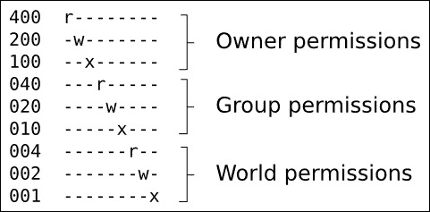

# 第五章。构建根文件系统

根文件系统是嵌入式 Linux 的第四个也是最后一个元素。阅读完本章后，您将能够构建、引导和运行一个简单的嵌入式 Linux 系统。

本章探讨了通过从头开始构建根文件系统来探索根文件系统背后的基本概念。主要目的是提供您理解和充分利用 Buildroot 和 Yocto Project 等构建系统所需的背景信息，我将在第六章*选择构建系统*中进行介绍。

我将在这里描述的技术通常被称为**自定义**或**RYO**。在嵌入式 Linux 的早期，这是创建根文件系统的唯一方法。仍然有一些用例适用于 RYO 根文件系统，例如当 RAM 或存储量非常有限时，用于快速演示，或者用于任何标准构建系统工具（容易）无法满足您的要求的情况。然而，这些情况非常罕见。让我强调一下，本章的目的是教育性的，而不是为了构建日常嵌入式系统的配方：请使用下一章中描述的工具。

第一个目标是创建一个最小的根文件系统，以便给我们一个 shell 提示符。然后，以此为基础，我们将添加脚本来启动其他程序，并配置网络接口和用户权限。了解如何从头开始构建根文件系统是一项有用的技能，它将帮助您理解我们在后面章节中看到的更复杂的示例时发生了什么。

# 根文件系统中应该包含什么？

内核将获得一个根文件系统，可以是 ramdisk，从引导加载程序传递的指针，或者通过`root=`参数在内核命令行上挂载的块设备。一旦有了根文件系统，内核将执行第一个程序，默认情况下命名为`init`，如第四章*移植和配置内核*中的*早期用户空间*部分所述。然后，就内核而言，它的工作就完成了。由`init`程序开始处理脚本，启动其他程序等，调用 C 库中的系统函数，这些函数转换为内核系统调用。

要创建一个有用的系统，您至少需要以下组件：

+   **init**:通常通过运行一系列脚本来启动一切的程序。

+   **shell**:需要为您提供命令提示符，但更重要的是运行`init`和其他程序调用的 shell 脚本。

+   **守护进程**:由`init`启动的各种服务器程序。

+   **库**:通常，到目前为止提到的程序都链接到必须存在于根文件系统中的共享库。

+   **配置文件**: `init`和其他守护程序的配置存储在一系列 ASCII 文本文件中，通常位于`/etc`目录中。

+   **设备节点**:特殊文件，提供对各种设备驱动程序的访问。

+   **/proc 和/sys**:代表内核数据结构的两个伪文件系统，以目录和文件的层次结构表示。许多程序和库函数读取这些文件。

+   **内核模块**:如果您已经配置了内核的某些部分为模块，它们通常会在`/lib/modules/[kernel version]`中。

此外，还有系统应用程序或应用程序，使设备能够完成其预期工作，并收集它们所收集的运行时最终用户数据。

另外，也有可能将上述所有内容压缩成一个单独的程序。您可以创建一个静态链接的程序，它会在`init`之外启动并且不运行其他程序。我只遇到过这样的配置一次。例如，如果您的程序命名为`/myprog`，您可以将以下命令放在内核命令行中：

```
init=/myprog

```

或者，如果根文件系统被加载为 ramdisk，你可以输入以下命令：

```
rdinit=/myprog

```

这种方法的缺点是你无法使用通常用于嵌入式系统的许多工具；你必须自己做一切。

## 目录布局

有趣的是，Linux 并不关心文件和目录的布局，只要存在由`init=`或`rdinit=`命名的程序，你可以自由地将东西放在任何你喜欢的地方。例如，比较运行安卓的设备的文件布局和桌面 Linux 发行版的文件布局：它们几乎完全不同。

然而，许多程序希望某些文件在特定位置，如果设备使用类似的布局，对开发人员有所帮助，除了安卓。Linux 系统的基本布局在**文件系统层次结构标准**（**FHS**）中定义，参见本章末尾的参考资料。FHS 涵盖了从最大到最小的所有 Linux 操作系统的实现。嵌入式设备根据需要有一个子集，但通常包括以下内容：

+   `/bin`：所有用户必需的程序

+   `/dev`：设备节点和其他特殊文件

+   `/etc`：系统配置

+   `/lib`：必需的共享库，例如组成 C 库的那些库

+   `/proc`：`proc`文件系统

+   `/sbin`：对系统管理员至关重要的程序

+   `/sys`：`sysfs`文件系统

+   `/tmp`：放置临时或易失性文件的地方

+   `/usr`：至少应包含目录`/usr/bin`、`/usr/lib`和`/usr/sbin`，其中包含额外的程序、库和系统管理员实用程序

+   `/var`：可能在运行时被修改的文件和目录的层次结构，例如日志消息，其中一些必须在引导后保留

这里有一些微妙的区别。`/bin`和`/sbin`之间的区别仅仅是`/sbin`不需要包含在非 root 用户的搜索路径中。使用 Red Hat 衍生的发行版的用户会熟悉这一点。`/usr`的重要性在于它可能在与根文件系统不同的分区中，因此它不能包含任何引导系统所需的内容。这就是前面描述中所说的“必需”的含义：它包含了在引导时需要的文件，因此必须是根文件系统的一部分。

### 提示

虽然似乎在四个目录中存储程序有些多余，但反驳的观点是这并没有什么坏处，甚至可能有些好处，因为它允许你将`/usr`存储在不同的文件系统中。

## 暂存目录

你应该首先在主机计算机上创建一个暂存目录，在那里你可以组装最终将传输到目标设备的文件。在下面的示例中，我使用了`~/rootfs`。你需要在其中创建一个骨架目录结构，例如：

```
$ mkdir ~/rootfs
$ cd ~/rootfs
$ mkdir bin dev etc home lib proc sbin sys tmp usr var
$ mkdir usr/bin usr/lib usr/sbin
$ mkdir var/log

```

为了更清晰地看到目录层次结构，你可以使用方便的`tree`命令，下面的示例中使用了`-d`选项只显示目录：

```
$ tree -d

├── bin
├── dev
├── etc
├── home
├── lib
├── proc
├── sbin
├── sys
├── tmp
├── usr
│   ├── bin
│   ├── lib
│   └── sbin
└── var
 └── log

```

### POSIX 文件访问权限

在这里讨论的上下文中，每个进程，也就是每个正在运行的程序，都属于一个用户和一个或多个组。用户由一个称为**用户 ID**或**UID**的 32 位数字表示。关于用户的信息，包括从 UID 到名称的映射，保存在`/etc/passwd`中。同样，组由**组 ID**或**GID**表示，信息保存在`/etc/group`中。始终存在一个 UID 为 0 的 root 用户和一个 GID 为 0 的 root 组。root 用户也被称为超级用户，因为在默认配置中，它可以绕过大多数权限检查，并且可以访问系统中的所有资源。基于 Linux 的系统中的安全性主要是关于限制对 root 账户的访问。

每个文件和目录也都有一个所有者，并且属于一个组。进程对文件或目录的访问级别由一组访问权限标志控制，称为文件的模式。有三组三个位：第一组适用于文件的所有者，第二组适用于与文件相同组的成员，最后一组适用于其他人，即世界其他地方的人。位用于文件的读取（r）、写入（w）和执行（x）权限。由于三个位恰好适合八进制数字，它们通常以八进制表示，如下图所示：



还有一组特殊含义的三个位：

+   **SUID (4)**：如果文件是可执行文件，则将进程的有效 UID 更改为文件的所有者的 UID。

+   **SGID (2)**：如果文件是可执行文件，则将进程的有效 GID 更改为文件的组的 GID。

+   **Sticky (1)**：在目录中，限制删除，以便一个用户不能删除属于另一个用户的文件。这通常设置在`/tmp`和`/var/tmp`上。

SUID 位可能是最常用的。它为非 root 用户提供了临时特权升级到超级用户以执行任务。一个很好的例子是`ping`程序：`ping`打开一个原始套接字，这是一个特权操作。为了让普通用户使用`ping`，通常由 root 拥有并设置了 SUID 位，这样当您运行`ping`时，它将以 UID 0 执行，而不管您的 UID 是多少。

要设置这些位，请使用八进制数字 4、2、1 和`chmod`命令。例如，要在您的暂存根目录中设置`/bin/ping`的 SUID，您可以使用以下命令：

```
$ cd ~/rootfs
$ ls -l bin/ping
-rwxr-xr-x 1 root root 35712 Feb  6 09:15 bin/ping
$ sudo chmod 4755 bin/ping
$ ls -l bin/ping
-rwsr-xr-x 1 root root 35712 Feb  6 09:15 bin/ping

```

### 注意

请注意最后一个文件列表中的`s`：这表明设置了 SUID。

### 暂存目录中的文件所有权权限

出于安全和稳定性原因，非常重要的是要注意将要放置在目标设备上的文件的所有权和权限。一般来说，您希望将敏感资源限制为只能由 root 访问，并尽可能多地使用非 root 用户运行程序，以便如果它们受到外部攻击，它们尽可能少地向攻击者提供系统资源。例如，设备节点`/dev/mem`提供对系统内存的访问，这在某些程序中是必要的。但是，如果它可以被所有人读取和写入，那么就没有安全性，因为每个人都可以访问一切。因此，`/dev/mem`应该由 root 拥有，属于 root 组，并且具有 600 的模式，这样除了所有者之外，其他人都无法读取和写入。

然而，暂存目录存在问题。您在那里创建的文件将归您所有，但是，当它们安装到设备上时，它们应该属于特定的所有者和组，主要是 root 用户。一个明显的修复方法是使用以下命令在此阶段更改所有权：

```
$ cd ~/rootfs
$ sudo chown -R root:root *

```

问题是您需要 root 权限来运行该命令，并且从那时起，您将需要 root 权限来修改暂存目录中的任何文件。在您知道之前，您将以 root 身份进行所有开发，这不是一个好主意。这是我们稍后将回头解决的问题。

# 根文件系统的程序

现在，是时候开始用必要的程序和支持库、配置和数据文件填充根文件系统了，首先概述您将需要的程序类型。

## init 程序

您在上一章中已经看到`init`是第一个要运行的程序，因此具有 PID 1。它以 root 用户身份运行，因此对系统资源具有最大访问权限。通常，它运行启动守护程序的 shell 脚本：守护程序是在后台运行且与终端没有连接的程序，在其他地方可能被称为服务器程序。

## Shell

我们需要一个 shell 来运行脚本，并给我们一个命令行提示符，以便我们可以与系统交互。在生产设备中可能不需要交互式 shell，但它对开发、调试和维护非常有用。嵌入式系统中常用的各种 shell 有：

+   `bash`：是我们从桌面 Linux 中熟悉和喜爱的大型工具。它是 Unix Bourne shell 的超集，具有许多扩展或*bashisms*。

+   `ash`：也基于 Bourne shell，并且在 Unix 的 BSD 变体中有着悠久的历史。Busybox 有一个 ash 的版本，已经扩展以使其与`bash`更兼容。它比`bash`小得多，因此是嵌入式系统的非常受欢迎的选择。

+   `hush`：是一个非常小的 shell，在引导加载程序章节中我们简要介绍过。它在内存非常少的设备上非常有用。BusyBox 中有一个版本。

### 提示

如果您在目标上使用`ash`或`hush`作为 shell，请确保在目标上测试您的 shell 脚本。很容易只在主机上测试它们，使用`bash`，然后当您将它们复制到目标时发现它们无法工作。

## 实用程序

shell 只是启动其他程序的一种方式，shell 脚本只不过是要运行的程序列表，带有一些流程控制和在程序之间传递信息的手段。要使 shell 有用，您需要基于 Unix 命令行的实用程序。即使对于基本的根文件系统，也有大约 50 个实用程序，这带来了两个问题。首先，追踪每个程序的源代码并进行交叉编译将是一项相当大的工作。其次，由此产生的程序集将占用数十兆字节的空间，在嵌入式 Linux 的早期阶段，几兆字节就是一个真正的问题。为了解决这个问题，BusyBox 诞生了。

## BusyBox 来拯救！

BusyBox 的起源与嵌入式 Linux 无关。该项目是由 Bruce Perens 于 1996 年发起的，用于 Debian 安装程序，以便他可以从 1.44 MB 软盘启动 Linux。巧合的是，当时的设备存储容量大约是这个大小，因此嵌入式 Linux 社区迅速接受了它。从那时起，BusyBox 一直是嵌入式 Linux 的核心。

BusyBox 是从头开始编写的，以执行这些基本 Linux 实用程序的基本功能。开发人员利用了 80:20 规则：程序最有用的 80%在代码的 20%中实现。因此，BusyBox 工具实现了桌面等效工具功能的子集，但它们足够在大多数情况下使用。

BusyBox 采用的另一个技巧是将所有工具合并到一个单一的二进制文件中，这样可以很容易地在它们之间共享代码。它的工作原理是这样的：BusyBox 是一组小工具，每个小工具都以`[applet]_main`的形式导出其主要函数。例如，`cat`命令是在`coreutils/cat.c`中实现的，并导出`cat_main`。BusyBox 本身的主函数根据命令行参数将调用分派到正确的小工具。

因此，要读取文件，您可以启动`busybox`，后面跟上您想要运行的小工具的名称，以及小工具期望的任何参数，如下所示：

```
$ busybox cat my_file.txt

```

您还可以运行`busybox`而不带任何参数，以获取已编译的所有小工具的列表。

以这种方式使用 BusyBox 相当笨拙。让 BusyBox 运行`cat`小工具的更好方法是创建一个从`/bin/cat`到`/bin/busybox`的符号链接。

```
$ ls -l bin/cat bin/busybox
-rwxr-xr-x 1 chris chris 892868 Feb  2 11:01 bin/busybox
lrwxrwxrwx 1 chris chris      7 Feb  2 11:01 bin/cat -> busybox

```

当您在命令行输入`cat`时，实际运行的程序是`busybox`。BusyBox 只需要检查传递给`argv[0]`的命令尾部，它将是`/bin/cat`，提取应用程序名称`cat`，并进行表查找以匹配`cat`与`cat_main`。所有这些都在`libbb/appletlib.c`中的这段代码中（稍微简化）：

```
applet_name = argv[0];
applet_name = bb_basename(applet_name);
run_applet_and_exit(applet_name, argv);
```

BusyBox 有 300 多个小程序，包括一个`init`程序，几个不同复杂级别的 shell，以及大多数管理任务的实用程序。甚至还有一个简化版的`vi`编辑器，这样你就可以在设备上更改文本文件。

总之，BusyBox 的典型安装包括一个程序和每个小程序的符号链接，但它的行为就像是一个独立应用程序的集合。

### 构建 BusyBox

BusyBox 使用与内核相同的`Kconfig`和`Kbuild`系统，因此交叉编译很简单。你可以通过克隆 git 存档并检出你想要的版本（写作时最新的是 1_24_1）来获取源代码，就像这样：

```
$ git clone git://busybox.net/busybox.git
$ cd busybox
$ git checkout 1_24_1

```

你也可以从[`busybox.net/downloads`](http://busybox.net/downloads)下载相应的`tarball`文件。然后，配置 BusyBox，从默认配置开始，这样可以启用几乎所有 BusyBox 的功能：

```
$ make distclean
$ make defconfig

```

在这一点上，你可能想要运行`make menuconfig`来微调配置。你几乎肯定想要在**Busybox Settings** | **Installation Options** (`CONFIG_PREFIX`)中设置安装路径，指向暂存目录。然后，你可以像通常一样进行交叉编译：

```
$ make -j 4 ARCH=arm CROSS_COMPILE=arm-cortex_a8-linux-gnueabihf-

```

结果是可执行文件`busybox`。对于 ARM v7a 的`defconfig`构建，它的大小约为 900 KiB。如果这对你来说太大了，你可以通过配置掉你不需要的实用程序来减小它。

要安装 BusyBox，请使用以下命令：

```
$ make install

```

这将把二进制文件复制到`CONFIG_PREFIX`配置的目录，并创建所有的符号链接。

## ToyBox - BusyBox 的替代品

BusyBox 并不是唯一的选择。例如，Android 有一个名为 Toolbox 的等效工具，但它更适合 Android 的需求，对于一般嵌入式环境没有用。一个更有用的选择是 ToyBox，这是一个由 Rob Landley 发起和维护的项目，他以前是 BusyBox 的维护者。ToyBox 的目标与 BusyBox 相同，但更注重遵守标准，特别是 POSIX-2008 和 LSB 4.1，而不是与 GNU 对这些标准的扩展的兼容性。ToyBox 比 BusyBox 小，部分原因是它实现的小程序更少。

然而，主要的区别是许可证，是 BSD 而不是 GPL v2，这使它与具有 BSD 许可的用户空间的操作系统兼容，比如 Android 本身。

# 根文件系统的库

程序与库链接。你可以将它们全部静态链接，这样目标设备上就不会有库了。但是，如果你有两三个以上的程序，这将占用不必要的大量存储空间。所以，你需要将共享库从工具链复制到暂存目录。你怎么知道哪些库？

一个选择是将它们全部复制，因为它们肯定有些用处，否则它们就不会存在！这当然是合乎逻辑的，如果你正在为他人用于各种应用程序的平台创建一个平台，那么这将是正确的方法。但要注意，一个完整的`glibc`相当大。在 CrossTool-NG 构建的`glibc` 2.19 的情况下，`/lib`和`/usr/lib`占用的空间为 33 MiB。当然，你可以通过使用 uClibc 或 Musel `libc`库大大减少这个空间。

另一个选择是只挑选你需要的那些库，为此你需要一种发现库依赖关系的方法。使用我们从第二章中的一些知识，*了解工具链*库，你可以使用`readelf`来完成这个任务：

```
$ cd ~/rootfs
$ arm-cortex_a8-linux-gnueabihf-readelf -a bin/busybox | grep "program interpreter"
 [Requesting program interpreter: /lib/ld-linux-armhf.so.3]
$ arm-cortex_a8-linux-gnueabihf-readelf -a bin/busybox | grep "Shared library"
0x00000001 (NEEDED)              Shared library: [libm.so.6]
0x00000001 (NEEDED)              Shared library: [libc.so.6]

```

现在你需要在工具链中找到这些文件，并将它们复制到暂存目录。记住你可以这样找到`sysroot`：

```
$ arm-cortex_a8-linux-gnueabihf-gcc -print-sysroot
/home/chris/x-tools/arm-cortex_a8-linux-gnueabihf/arm-cortex_a8-linux-gnueabihf/sysroot

```

为了减少输入量，我将把它保存在一个 shell 变量中：

```
$ export SYSROOT=`arm-cortex_a8-linux-gnueabihf-gcc -print-sysroot`

```

如果你在`sysroot`中查看`/lib/ld-linux-armhf.so.3`，你会发现，它实际上是一个符号链接：

```
$ ls -l $SYSROOT/lib/ld-linux-armhf.so.3
[...]/sysroot/lib/ld-linux-armhf.so.3 -> ld-2.19.so

```

对`libc.so.6`和`libm.so.6`重复此操作，您将得到三个文件和三个符号链接的列表。使用`cp -a`进行复制，这将保留符号链接：

```
$ cd ~/rootfs
$ cp -a $SYSROOT/lib/ld-linux-armhf.so.3 lib
$ cp -a $SYSROOT/lib/ld-2.19.so lib
$ cp -a $SYSROOT/lib/libc.so.6 lib
$ cp -a $SYSROOT/lib/libc-2.19.so lib
$ cp -a $SYSROOT/lib/libm.so.6 lib
$ cp -a $SYSROOT/lib/libm-2.19.so lib

```

对每个程序重复此过程。

### 提示

这样做只有在获取最小的嵌入式占用空间时才值得。有可能会错过通过`dlopen(3)`调用加载的库，主要是插件。我们将在本章后面配置网络接口时，通过 NSS 库的示例来说明。

## 通过剥离来减小尺寸

通常情况下，库和程序都会编译时内置符号表信息，如果使用了调试开关`-g`，则更多。您很少需要这些信息。节省空间的一种快速简单的方法是剥离它们。此示例显示了剥离前后的`libc`：

```
$ file rootfs/lib/libc-2.19.so
rootfs/lib/libc-2.19.so: ELF 32-bit LSB shared object, ARM, version 1 (SYSV), dynamically linked (uses shared libs), for GNU/Linux 3.15.4, not stripped
$ ls -og rootfs/lib/libc-2.19.so
-rwxrwxr-x 1 1547371 Feb  5 10:18 rootfs/lib/libc-2.19.so
$ arm-cortex_a8-linux-gnueabi-strip rootfs/lib/libc-2.19.so
$ file rootfs/lib/libc-2.19.so
rootfs/lib/libc-2.19.so: ELF 32-bit LSB shared object, ARM, version 1 (SYSV), dynamically linked (uses shared libs), for GNU/Linux 3.15.4, stripped
$ ls -l rootfs/lib/libc-2.19.so
-rwxrwxr-x 1 chris chris 1226024 Feb  5 10:19 rootfs/lib/libc-2.19.so
$ ls -og rootfs/lib/libc-2.19.so
-rwxrwxr-x 1 1226024 Feb  5 10:19 rootfs/lib/libc-2.19.so

```

在这种情况下，我们节省了 321,347 字节，大约为 20%。

在剥离内核模块时，使用以下命令：

```
strip --strip-unneeded <module name>

```

否则，您将剥离重定位模块代码所需的符号，导致加载失败。

# 设备节点

Linux 中的大多数设备都由设备节点表示，符合 Unix 哲学的*一切皆文件*（除了网络接口，它们是套接字）。设备节点可能是块设备或字符设备。块设备是诸如 SD 卡或硬盘等大容量存储设备。字符设备基本上是其他任何东西，再次除了网络接口。设备节点的传统位置是目录`/dev`。例如，串行端口可以由设备节点`/dev/ttyS0`表示。

使用程序`mknod`（缩写为 make node）创建设备节点：

```
mknod <name> <type> <major> <minor>
```

`name`是您要创建的设备节点的名称，`type`可以是`c`表示字符设备，`b`表示块设备。它们各自有一个主要号和次要号，内核使用这些号码将文件请求路由到适当的设备驱动程序代码。内核源代码中有一个标准主要和次要号的列表，位于`Documentation/devices.txt`中。

您需要为系统上要访问的所有设备创建设备节点。您可以手动使用`mknod`命令来执行此操作，就像我在这里所示的那样，或者您可以使用稍后提到的设备管理器之一来在运行时自动创建它们。

使用 BusyBox 启动只需要两个节点：`console`和`null`。控制台只需要对 root 可访问，设备节点的所有者，因此访问权限为 600。空设备应该对所有人可读可写，因此模式为 666。您可以使用`mknod`的`-m`选项在创建节点时设置模式。您需要是 root 才能创建设备节点：

```
$ cd ~/rootfs
$ sudo mknod -m 666 dev/null c 1 3
$ sudo mknod -m 600 dev/console c 5 1
$ ls -l dev
total 0
crw------- 1 root root 5, 1 Oct 28 11:37 console
crw-rw-rw- 1 root root 1, 3 Oct 28 11:37 null

```

您可以使用标准的`rm`命令删除设备节点：没有`rmnod`命令，因为一旦创建，它们就是普通文件。

# proc 和 sysfs 文件系统

`proc`和`sysfs`是两个伪文件系统，它们提供了内核内部工作的窗口。它们都将内核数据表示为目录层次结构中的文件：当您读取其中一个文件时，您看到的内容并不来自磁盘存储，而是由内核中的一个函数即时格式化的。一些文件也是可写的，这意味着将调用内核函数并使用您写入的新数据，如果格式正确且您有足够的权限，它将修改内核内存中存储的值。换句话说，`proc`和`sysfs`提供了另一种与设备驱动程序和其他内核代码交互的方式。

`proc`和`sysfs`应该挂载在目录`/proc`和`/sys`上：

```
mount -t proc proc /proc
mount -t sysfs sysfs /sys

```

尽管它们在概念上非常相似，但它们执行不同的功能。`proc`从 Linux 的早期就存在。它的最初目的是向用户空间公开有关进程的信息，因此得名。为此，有一个名为`/proc/<PID>`的目录，其中包含有关其状态的信息。进程列表命令`ps`读取这些文件以生成其输出。此外，还有一些文件提供有关内核其他部分的信息，例如`/proc/cpuinfo`告诉您有关 CPU 的信息，`/proc/interrupts`包含有关中断的信息，等等。最后，在`/proc/sys`中，有一些文件显示和控制内核子系统的状态和行为，特别是调度、内存管理和网络。有关您将在`proc`中找到的文件的最佳参考是`proc(5)`手册页。

实际上，随着时间的推移，`proc`中的文件数量及其布局变得相当混乱。在 Linux 2.6 中，`sysfs`被引入以有序方式导出数据的子集。

相比之下，`sysfs`导出了一个与设备及其相互连接方式相关的文件的有序层次结构。

## 挂载文件系统

`mount`命令允许我们将一个文件系统附加到另一个文件系统中的目录，形成文件系统的层次结构。在顶部被内核挂载时，称为根文件系统。`mount`命令的格式如下：

```
mount [-t vfstype] [-o options] device directory

```

您需要指定文件系统的类型`vfstype`，它所在的块设备节点，以及您要将其挂载到的目录。在`-o`之后，您可以给出各种选项，更多信息请参阅手册。例如，如果您想要将包含`ext4`文件系统的 SD 卡的第一个分区挂载到目录`/mnt`，您可以输入以下内容：

```
mount -t ext4 /dev/mmcblk0p1 /mnt

```

假设挂载成功，您将能够在目录`/mnt`中看到存储在 SD 卡上的文件。在某些情况下，您可以省略文件系统类型，让内核探测设备以找出存储的内容。

看看挂载`proc`文件系统的例子，有一些奇怪的地方：没有设备节点`/dev/proc`，因为它是一个伪文件系统，而不是一个真正的文件系统。但`mount`命令需要一个设备作为参数。因此，我们必须提供一个字符串来代替设备，但这个字符串是什么并不重要。这两个命令实现了完全相同的结果：

```
mount -t proc proc /proc
mount -t proc nodevice /proc

```

在挂载伪文件系统时，通常在设备的位置使用文件系统类型。

# 内核模块

如果您有内核模块，它们需要安装到根文件系统中，使用内核`make modules_install`目标，就像我们在上一章中看到的那样。这将把它们复制到目录`/lib/modules/<kernel version>`中，以及`modprobe`命令所需的配置文件。

请注意，您刚刚在内核和根文件系统之间创建了一个依赖关系。如果您更新其中一个，您将不得不更新另一个。

# 将根文件系统传输到目标位置

在暂存目录中创建了一个骨架根文件系统后，下一个任务是将其传输到目标位置。在接下来的章节中，我将描述三种可能性：

+   **ramdisk**：由引导加载到 RAM 中的文件系统映像。Ramdisks 易于创建，并且不依赖于大容量存储驱动程序。当主根文件系统需要更新时，它们可以用于后备维护模式。它们甚至可以用作小型嵌入式设备的主根文件系统，当然也可以用作主流 Linux 发行版中的早期用户空间。压缩的 ramdisk 使用最少的存储空间，但仍然消耗 RAM。内容是易失性的，因此您需要另一种存储类型来存储永久数据，例如配置参数。

+   **磁盘映像**：根文件系统的副本，格式化并准备好加载到目标设备的大容量存储设备上。例如，它可以是一个`ext4`格式的映像，准备好复制到 SD 卡上，或者它可以是一个`jffs2`格式的映像，准备好通过引导加载到闪存中。创建磁盘映像可能是最常见的选项。有关不同类型的大容量存储的更多信息，请参阅第七章，“创建存储策略”。

+   **网络文件系统**：暂存目录可以通过 NFS 服务器导出到网络，并在启动时由目标设备挂载。在开发阶段通常会这样做，而不是重复创建磁盘映像并重新加载到大容量存储设备上，这是一个相当慢的过程。

我将从 ramdisk 开始，并用它来说明对根文件系统的一些改进，比如添加用户名和设备管理器以自动创建设备节点。然后，我将向您展示如何创建磁盘映像，最后，如何使用 NFS 在网络上挂载根文件系统。

# 创建引导 ramdisk

Linux 引导 ramdisk，严格来说，是一个**初始 RAM 文件系统**或**initramfs**，是一个压缩的`cpio`存档。`cpio`是一个古老的 Unix 存档格式，类似于 TAR 和 ZIP，但更容易解码，因此在内核中需要更少的代码。您需要配置内核以支持`initramfs`的`CONFIG_BLK_DEV_INITRD`。

实际上，有三种不同的方法可以创建引导 ramdisk：作为一个独立的`cpio`存档，作为嵌入在内核映像中的`cpio`存档，以及作为内核构建系统在构建过程中处理的设备表。第一种选项提供了最大的灵活性，因为我们可以随心所欲地混合和匹配内核和 ramdisk。但是，这意味着您需要处理两个文件而不是一个，并且并非所有的引导加载程序都具有加载单独 ramdisk 的功能。稍后我将向您展示如何将其构建到内核中。

## 独立的 ramdisk

以下一系列指令创建存档，对其进行压缩，并添加一个 U-Boot 标头，以便加载到目标设备上：

```
$ cd ~/rootfs
$ find . | cpio -H newc -ov --owner root:root > ../initramfs.cpio
$ cd ..
$ gzip initramfs.cpio
$ mkimage -A arm -O linux -T ramdisk -d initramfs.cpio.gz uRamdisk

```

请注意，我们使用了`cpio`选项`--owner root:root`。这是对前面提到的文件所有权问题的一个快速修复，使`cpio`文件中的所有内容的 UID 和 GID 都为 0。

`uRamdisk`文件的最终大小约为 2.9 MiB，没有内核模块。再加上内核`zImage`文件的 4.4 MiB，以及 U-Boot 的 440 KiB，总共需要 7.7 MiB 的存储空间来引导此板。我们离最初的 1.44 MiB 软盘还有一段距离。如果大小是一个真正的问题，您可以使用以下选项之一：

+   通过留出您不需要的驱动程序和功能，使内核变得更小

+   通过留出您不需要的实用程序，使 BusyBox 变得更小

+   使用 uClibc 或 musl libc 代替 glibc

+   静态编译 BusyBox

## 引导 ramdisk

我们可以做的最简单的事情是在控制台上运行一个 shell，以便与设备进行交互。我们可以通过将`rdinit=/bin/sh`添加到内核命令行来实现这一点。现在，您可以引导设备。

### 使用 QEMU 引导

QEMU 有`-initrd`选项，可以将`initframfs`加载到内存中，因此完整的命令现在如下所示：

```
$ cd ~/rootfs
$ QEMU_AUDIO_DRV=none \
qemu-system-arm -m 256M -nographic -M vexpress-a9 -kernel zImage -append "console=ttyAMA0 rdinit=/bin/sh" -dtb vexpress-v2p-ca9.dtb -initrd initramfs.cpio.gz

```

### 引导 BeagleBone Black

要启动 BeagleBone Black，请引导到 U-Boot 提示符，并输入以下命令：

```
fatload mmc 0:1 0x80200000 zImage
fatload mmc 0:1 0x80f00000 am335x-boneblack.dtb
fatload mmc 0:1 0x81000000 uRamdisk
setenv bootargs console=ttyO0,115200 rdinit=/bin/sh
bootz 0x80200000 0x81000000 0x80f00000

```

如果一切顺利，您将在控制台上获得一个根 shell 提示符。

### 挂载 proc

请注意，`ps`命令不起作用：这是因为`proc`文件系统尚未被挂载。尝试挂载它，然后再次运行`ps`。

对此设置的一个改进是编写一个包含需要在启动时执行的内容的 shell 脚本，并将其作为`rdinit=`的参数。脚本将类似于以下代码片段：

```
#!/bin/sh
/bin/mount -t proc proc /proc
/bin/sh

```

以这种方式使用 shell 作为`init`对于快速修补非常方便，例如，当您想要修复带有损坏`init`程序的系统时。但是，在大多数情况下，您将使用一个`init`程序，我们将在后面进一步介绍。

## 将 ramdisk cpio 构建到内核映像中

在某些情况下，最好将 ramdisk 构建到内核映像中，例如，如果引导加载程序无法处理 ramdisk 文件。要做到这一点，更改内核配置并将`CONFIG_INITRAMFS_SOURCE`设置为您之前创建的`cpio`存档的完整路径。如果您使用`menuconfig`，它在**常规设置** | **Initramfs 源文件**中。请注意，它必须是以`.cpio`结尾的未压缩`cpio`文件；而不是经过 gzip 压缩的版本。然后，构建内核。您应该看到它比以前大。

引导与以前相同，只是没有 ramdisk 文件。对于 QEMU，命令如下：

```
$ cd ~/rootfs
$ QEMU_AUDIO_DRV=none \
qemu-system-arm -m 256M -nographic -M vexpress-a9 -kernel zImage -append "console=ttyAMA0 rdinit=/bin/sh" -dtb vexpress-v2p-ca9.dtb

```

对于 BeagleBone Black，将这些命令输入 U-Boot：

```
fatload mmc 0:1 0x80200000 zImage
fatload mmc 0:1 0x80f00000 am335x-boneblack.dtb
setenv bootargs console=ttyO0,115200 rdinit=/bin/sh
bootz 0x80200000 – 0x80f00000

```

当然，您必须记住每次更改 ramdisk 的内容并重新生成`.cpio`文件时都要重新构建内核。

### 另一种构建带有 ramdisk 的内核的方法

将 ramdisk 构建到内核映像中的一个有趣的方法是使用**设备表**生成`cpio`存档。`设备表`是一个文本文件，列出了存档中包含的文件、目录、设备节点和链接。压倒性的优势在于，您可以在`cpio`文件中创建属于 root 或任何其他 UID 的条目，而无需自己拥有 root 权限。您甚至可以创建设备节点。所有这些都是可能的，因为存档只是一个数据文件。只有在 Linux 在引导时扩展它时，才会使用您指定的属性创建真实的文件和目录。

这是我们简单的`rootfs`的设备表，但缺少大部分到`busybox`的符号链接，以便更易管理：

```
dir /proc 0755 0 0
dir /sys 0755 0 0
dir /dev 0755 0 0
nod /dev/console 0600 0 0 c 5 1
nod /dev/null 0666 0 0 c 1 3
nod /dev/ttyO0 0600 0 0 c 252 0
dir /bin 0755 0 0
file /bin/busybox /home/chris/rootfs/bin/busybox 0755 0 0
slink /bin/sh /bin/busybox 0777 0 0
dir /lib 0755 0 0
file /lib/ld-2.19.so /home/chris/rootfs/lib/ld-2.19.so 0755 0 0
slink /lib/ld-linux.so.3 /lib/ld-2.19.so 0777 0 0
file /lib/libc-2.19.so /home/chris/rootfs/lib/libc-2.19.so 0755 0 0
slink /lib/libc.so.6 /lib/libc-2.19.so 0777 0 0
file /lib/libm-2.19.so /home/chris/rootfs/lib/libm-2.19.so 0755 0 0
slink /lib/libm.so.6 /lib/libm-2.19.so 0777 0 0

```

语法相当明显：

+   `dir <name> <mode> <uid> <gid>`

+   `file <name> <location> <mode> <uid> <gid>`

+   `nod <name> <mode> <uid> <gid> <dev_type> <maj> <min>`

+   `slink <name> <target> <mode> <uid> <gid>`

内核提供了一个工具，读取此文件并创建`cpio`存档。源代码在`usr/gen_init_cpio.c`中。`scripts/gen_initramfs_list.sh`中有一个方便的脚本，它从给定目录创建设备表，这样可以节省很多输入。

要完成任务，您需要将`CONFIG_INITRAMFS_SOURCE`设置为指向设备表文件，然后构建内核。其他一切都和以前一样。

## 旧的 initrd 格式

Linux ramdisk 的旧格式称为`initrd`。在 Linux 2.6 之前，这是唯一可用的格式，并且如果您使用 Linux 的无 mmu 变体 uCLinux，则仍然需要它。它相当晦涩，我在这里不会涉及。内核源代码中有更多信息，在`Documentation/initrd.txt`中。

# init 程序

在引导时运行 shell，甚至是 shell 脚本，对于简单情况来说是可以的，但实际上您需要更灵活的东西。通常，Unix 系统运行一个名为`init`的程序，它启动并监视其他程序。多年来，已经有许多`init`程序，其中一些我将在第九章中描述，*启动 - init 程序*。现在，我将简要介绍 BusyBox 中的`init`。

`init`开始读取配置文件`/etc/inittab`。这是一个对我们的需求足够简单的示例：

```
::sysinit:/etc/init.d/rcS
::askfirst:-/bin/ash
```

第一行在启动`init`时运行一个 shell 脚本`rcS`。第二行将消息**请按 Enter 键激活此控制台**打印到控制台，并在按下*Enter*时启动一个 shell。`/bin/ash`前面的`-`表示它将是一个登录 shell，在给出 shell 提示之前会源自`/etc/profile`和`$HOME/.profile`。以这种方式启动 shell 的一个优点是启用了作业控制。最直接的影响是您可以使用*Ctrl* + *C*来终止当前程序。也许您之前没有注意到，但是等到您运行`ping`程序并发现无法停止它时！

BusyBox `init`在根文件系统中没有`inittab`时提供默认的`inittab`。它比前面的更加广泛。

脚本`/etc/init.d/rcS`是放置需要在启动时执行的初始化命令的地方，例如挂载`proc`和`sysfs`文件系统：

```
#!/bin/sh
mount -t proc proc /proc
mount -t sysfs sysfs /sys
```

确保使`rcS`可执行，就像这样：

```
$ cd ~/rootfs
$ chmod +x etc/init.d/rcS

```

您可以通过更改`-append`参数在 QEMU 上尝试它，就像这样：

```
-append "console=ttyAMA0 rdinit=/sbin/init"
```

要在 BeagelBone Black 上实现相同的效果，需要更改 U-Boot 中的`bootargs`变量，如下所示：

```
setenv bootargs console=ttyO0,115200 rdinit=/sbin/init
```

# 配置用户帐户

正如我已经暗示的，以 root 身份运行所有程序并不是一个好的做法，因为如果一个程序受到外部攻击，那么整个系统都处于风险之中，而且如果作为 root 运行的程序行为不端，它可能会造成更大的破坏。最好创建非特权用户帐户，并在不需要完全 root 权限的地方使用它们。

用户名称配置在`/etc/passwd`中。每个用户一行，由冒号分隔的七个信息字段：

+   登录名

+   用于验证密码的哈希码，或者更通常地是一个`x`，表示密码存储在`/etc/shadow`中

+   UID

+   GID

+   一个注释字段，通常留空

+   用户的主目录

+   （可选）此用户将使用的 shell

例如，这将创建用户`root`，UID 为 0，和`daemon`，UID 为 1：

```
root:x:0:0:root:/root:/bin/sh
daemon:x:1:1:daemon:/usr/sbin:/bin/false
```

将用户 daemon 的 shell 设置为`/bin/false`可以确保使用该名称登录的任何尝试都会失败。

### 注意

各种程序必须读取`/etc/passwd`以便能够查找 UID 和名称，因此它必须是可读的。如果密码哈希存储在其中，那就是一个问题，因为恶意程序将能够复制并使用各种破解程序发现实际密码。因此，为了减少这些敏感信息的暴露，密码存储在`/etc/shadow`中，并在密码字段中放置一个`x`以指示这种情况。`/etc/shadow`只能由`root`访问，只要`root`用户受限，密码就是安全的。

影子密码文件由每个用户的一个条目组成，由九个字段组成。这是一个与前一段中显示的`passwd`文件相似的例子：

```
root::10933:0:99999:7:::
daemon:*:10933:0:99999:7:::
```

前两个字段是用户名和密码哈希。剩下的七个与密码老化有关，这在嵌入式设备上通常不是问题。如果您对完整的细节感兴趣，请参阅手册页*shadow(5)*。

在这个例子中，`root`的密码是空的，这意味着`root`可以在不输入密码的情况下登录，这在开发过程中很有用，但在生产中不适用！您可以使用`mkpasswd`命令生成密码哈希，或者在目标上运行`passwd`命令，并将目标上的`/etc/shadow`中的哈希字段复制并粘贴到分段目录中的默认 shadow 文件中。

daemon 的密码是`*`，这不会匹配任何登录密码，再次确保 daemon 不能用作常规用户帐户。

组名以类似的方式存储在`/etc/group`中。格式如下：

+   组的名称

+   组密码，通常是一个`x`字符，表示没有组密码

+   GID

+   属于该组的用户的可选列表，用逗号分隔。

这是一个例子：

```
root:x:0:
daemon:x:1:
```

## 向根文件系统添加用户帐户

首先，你必须向你的暂存目录添加`etc/passwd`、`etc/shadow`和`etc/group`，就像前面的部分所示的那样。确保`shadow`的权限为 0600。

登录过程由一个名为`getty`的程序启动，它是 BusyBox 的一部分。你可以使用`inittab`中的`respawn`关键字启动它，当登录 shell 终止时，`getty`将被重新启动，因此`inittab`应该如下所示：

```
::sysinit:/etc/init.d/rcS
::respawn:/sbin/getty 115200 console
```

然后重新构建 ramdisk，并像之前一样使用 QEMU 或 BeagelBone Black 进行尝试。

# 启动守护进程

通常，你会希望在启动时运行某些后台进程。让我们以日志守护程序`syslogd`为例。`syslogd`的目的是积累来自其他程序（大多数是其他守护程序）的日志消息。当然，BusyBox 有一个适用于此的小工具！

启动守护进程就像在`etc/inittab`中添加这样一行那样简单：

```
::respawn:syslogd -n
```

`respawn`表示，如果程序终止，它将自动重新启动；`-n`表示它应该作为前台进程运行。日志将被写入`/var/log/messages`。

### 提示

你可能也想以同样的方式启动`klogd`：`klogd`将内核日志消息发送到`syslogd`，以便将其记录到永久存储中。

顺便提一下，在典型的嵌入式 Linux 系统中，将日志文件写入闪存并不是一个好主意，因为这样会使其磨损。我将在第七章中介绍日志记录的选项，*创建存储策略*。

# 更好地管理设备节点

使用`mknod`静态创建设备节点非常费力且不灵活。还有其他方法可以根据需要自动创建设备节点：

+   `devtmpfs`：这是一个伪文件系统，在引导时挂载到`/dev`上。内核会为内核当前已知的所有设备填充它，并在运行时检测到新设备时创建节点。这些节点由`root`拥有，并具有默认权限 0600。一些众所周知的设备节点，如`/dev/null`和`/dev/random`，覆盖默认值为 0666（请参阅`drivers/char/mem.c`中的`struct` `memdev`）。

+   `mdev`：这是一个 BusyBox 小工具，用于向目录填充设备节点，并根据需要创建新节点。有一个配置文件`/etc/mdev.conf`，其中包含节点所有权和模式的规则。

+   `udev`：现在是`systemd`的一部分，是桌面 Linux 和一些嵌入式设备上的解决方案。它非常灵活，是高端嵌入式设备的不错选择。

### 提示

虽然`mdev`和`udev`都可以自行创建设备节点，但更常见的做法是让`devtmpfs`来完成这项工作，并使用`mdev/udev`作为实施设置所有权和权限策略的一层。

## 使用 devtmpfs 的示例

如果你已经启动了之前的 ramdisk 示例之一，尝试`devtmpfs`就像输入这个命令一样简单：

```
# mount -t devtmpfs devtmpfs /dev

```

你应该看到`/dev`里面充满了设备节点。要进行永久修复，将这个添加到`/etc/init.d/rcS`中：

```
#!/bin/sh
mount -t proc proc /proc
mount -t sysfs sysfs /sys
mount -t devtmpfs devtmpfs /dev

```

事实上，内核初始化会自动执行这一操作，除非你提供了`initramfs` ramdisk，就像我们所做的那样！要查看代码，请查看`init/do_mounts.c`，函数`prepare_namespace()`。

## 使用 mdev 的示例

虽然设置`mdev`有点复杂，但它允许你在创建设备节点时修改权限。首先，有一个启动阶段，通过`-s`选项选择，当`mdev`扫描`/sys`目录查找有关当前设备的信息并用相应的节点填充`/dev`目录。

如果你想跟踪新设备的上线并为它们创建节点，你需要将`mdev`作为热插拔客户端写入`/proc/sys/kernel/hotplug`。将这些添加到`/etc/init.d/rcS`将实现所有这些：

```
#!/bin/sh
mount -t proc proc /proc
mount -t sysfs sysfs /sys
mount -t devtmpfs devtmpfs /dev
echo /sbin/mdev > /proc/sys/kernel/hotplug
mdev -s

```

默认模式为 660，所有权为`root:root`。您可以通过在`/etc/mdev.conf`中添加规则来更改。例如，要为`null`，`random`和`urandom`设备提供正确的模式，您需要将其添加到`/etc/mdev.conf`中：

```
null     root:root 666
random   root:root 444
urandom  root:root 444

```

该格式在 BusyBox 源代码中的`docs/mdev.txt`中有记录，并且在名为`examples`的目录中有更多示例。

## 静态设备节点到底有多糟糕？

静态创建的设备节点确实有一个优点：它们在引导过程中不需要花费任何时间来创建，而其他方法则需要。如果最小化引导时间是一个优先考虑的问题，使用静态创建的设备节点将节省可测量的时间。

# 配置网络

接下来，让我们看一些基本的网络配置，以便我们可以与外部世界通信。我假设有一个以太网接口`eth0`，我们只需要一个简单的 IP v4 配置。

这些示例使用了 BusyBox 的网络实用程序，并且对于简单的用例来说足够了，使用`old-but-reliable ifup`和`ifdown`程序。您可以阅读这两者的 man 页面以获取更多细节。主要的网络配置存储在`/etc/network/interfaces`中。您需要在暂存目录中创建这些目录：

```
etc/network
etc/network/if-pre-up.d
etc/network/if-up.d
var/run
```

对于静态 IP 地址，`etc/network/interfaces`看起来像这样：

```
auto lo
iface lo inet loopback
auto eth0
iface eth0 inet static
  address 10.0.0.42
  netmask 255.255.255.0
  network 10.0.0.0
```

对于使用 DHCP 分配的动态 IP 地址，`etc/network/interfaces`看起来像这样：

```
auto lo
iface lo inet loopback
auto eth0
iface eth0 inet dhcp
```

您还需要配置一个 DHCP 客户端程序。BusyBox 有一个名为`udchpcd`的程序。它需要一个应该放在`/usr/share/udhcpc/default.script`中的 shell 脚本。在 BusyBox 源代码的`examples//udhcp/simple.script`目录中有一个合适的默认值。

## glibc 的网络组件

`glibc`使用一种称为**名称服务开关**（**NSS**）的机制来控制名称解析为网络和用户的数字的方式。例如，用户名可以通过文件`/etc/passwd`解析为 UID；网络服务（如 HTTP）可以通过`/etc/services`解析为服务端口号，等等。所有这些都由`/etc/nsswitch.conf`配置，有关详细信息，请参阅手册页*nss(5)*。以下是一个对大多数嵌入式 Linux 实现足够的简单示例：

```
passwd:      files
group:       files
shadow:      files
hosts:       files dns
networks:    files
protocols:   files
services:    files
```

一切都由`/etc`中同名的文件解决，除了主机名，它可能还会通过 DNS 查找来解决。

要使其工作，您需要使用这些文件填充`/etc`。网络、协议和服务在所有 Linux 系统中都是相同的，因此可以从开发 PC 中的`/etc`中复制。`/etc/hosts`至少应包含环回地址：

```
127.0.0.1 localhost
```

我们将在稍后讨论其他的`passwd`，`group`和`shadow`。

拼图的最后一块是执行名称解析的库。它们是根据`nsswitch.conf`的内容按需加载的插件，这意味着如果您使用`readelf`或类似工具，它们不会显示为依赖项。您只需从工具链的`sysroot`中复制它们：

```
$ cd ~/rootfs
$ cp -a $TOOLCHAIN_SYSROOT/lib/libnss* lib
$ cp -a $TOOLCHAIN_SYSROOT/lib/libresolv* lib

```

# 使用设备表创建文件系统映像

内核有一个实用程序`gen_init_cpio`，它根据文本文件中设置的格式指令创建一个`cpio`文件，称为`设备表`，允许非根用户创建设备节点，并为任何文件或目录分配任意 UID 和 GID 值。

相同的概念已应用于创建其他文件系统映像格式的工具：

+   `jffs2`：`mkfs.jffs2`

+   `ubifs`：`mkfs.ubifs`

+   `ext2`：`genext2fs`

我们将在第七章中讨论`jffs2`和`ubifs`，*创建存储策略*，当我们研究用于闪存的文件系统时。第三个`ext2`是一个相当古老的硬盘格式。

它们都需要一个设备表文件，格式为`<name> <type> <mode> <uid> <gid> <major> <minor> <start> <inc> <count>`，其中以下内容适用：

+   `name`：文件名

+   `type`：以下之一：

+   `f`：一个常规文件

+   `d`：一个目录

+   `c`：字符特殊设备文件

+   `b`：块特殊设备文件

+   `p`：FIFO（命名管道）

+   `uid`：文件的 UID

+   `gid`：文件的 GID

+   `major`和`minor`：设备号（仅设备节点）

+   `start`，`inc`和`count`：（仅设备节点）允许您从`start`中的`minor`号开始创建一组设备节点

您不必像使用`gen_init_cpio`那样指定每个文件：您只需将它们指向一个目录-暂存目录-并列出您需要在最终文件系统映像中进行的更改和异常。

一个简单的示例，为我们填充静态设备节点如下：

```
/dev         d  755  0    0  -    -    -    -    -
/dev/null    c  666  0    0    1    3    0    0  -
/dev/console c  600  0    0    5    1    0    0  -
/dev/ttyO0   c  600  0    0   252   0    0    0  -
```

然后，使用`genext2fs`生成一个 4 MiB（即默认大小的 4,096 个块，每个块 1,024 字节）的文件系统映像：

```
$ genext2fs -b 4096 -d rootfs -D device-table.txt -U rootfs.ext2

```

现在，您可以将生成的映像`rootfs.ext`复制到 SD 卡或类似的设备。

## 将根文件系统放入 SD 卡中

这是一个从普通块设备（如 SD 卡）挂载文件系统的示例。相同的原则适用于其他文件系统类型，我们将在第七章*创建存储策略*中更详细地讨论它们。

假设您有一个带有 SD 卡的设备，并且第一个分区用于引导文件，`MLO`和`u-boot.img`-就像 BeagleBone Black 上一样。还假设您已经使用`genext2fs`创建了一个文件系统映像。要将其复制到 SD 卡，请插入卡并识别其被分配的块设备：通常为`/dev/sd`或`/dev/mmcblk0`。如果是后者，请将文件系统映像复制到第二个分区：

```
$ sudo dd if=rootfs.ext2 of=/dev/mmcblk0p2

```

然后，将 SD 卡插入设备，并将内核命令行设置为`root=/dev/mmcblk0p2`。完整的引导顺序如下：

```
fatload mmc 0:1 0x80200000 zImage
fatload mmc 0:1 0x80f00000 am335x-boneblack.dtb
setenv bootargs console=ttyO0,115200 root=/dev/mmcblk0p2
bootz 0x80200000 – 0x80f00000
```

# 使用 NFS 挂载根文件系统

如果您的设备有网络接口，最好在开发过程中通过网络挂载根文件系统。这样可以访问几乎无限的存储空间，因此您可以添加具有大型符号表的调试工具和可执行文件。作为额外的奖励，对于开发机上托管的根文件系统所做的更新将立即在目标上生效。您还有日志文件的副本。

为了使其工作，您的内核必须配置为`CONFIG_ROOT_NFS`。然后，您可以通过将以下内容添加到内核命令行来配置 Linux 在引导时进行挂载：

```
root=/dev/nfs

```

给出 NFS 导出的详细信息如下：

```
nfsroot=<host-ip>:<root-dir>

```

配置连接到 NFS 服务器的网络接口，以便在引导时，在`init`程序运行之前使用此命令：

```
ip=<target-ip>

```

有关 NFS 根挂载的更多信息，请参阅内核源中的`Documentation/filesystems/nfs/nfsroot.txt`。

您还需要在主机上安装和配置 NFS 服务器，对于 Ubuntu，您可以使用以下命令完成：

```
$ sudo apt-get install nfs-kernel-server

```

NFS 服务器需要告知哪些目录正在导出到网络，这由`/etc/exports`控制。向该文件添加类似以下行：

```
/<path to staging> *(rw,sync,no_subtree_check,no_root_squash)
```

然后，重新启动服务器以应用更改，对于 Ubuntu 来说是：

```
$ sudo /etc/init.d/nfs-kernel-server restart

```

## 使用 QEMU 进行测试

以下脚本创建了一个虚拟网络，将主机上的网络设备`tap0`与目标上的`eth0`使用一对静态 IPv4 地址连接起来，然后使用参数启动 QEMU，以使用`tap0`作为模拟接口。您需要更改根文件系统的路径为您的暂存目录的完整路径，如果它们与您的网络配置冲突，可能还需要更改 IP 地址：

```
#!/bin/bash

KERNEL=zImage
DTB=vexpress-v2p-ca9.dtb
ROOTDIR=/home/chris/rootfs

HOST_IP=192.168.1.1
TARGET_IP=192.168.1.101
NET_NUMBER=192.168.1.0
NET_MASK=255.255.255.0

sudo tunctl -u $(whoami) -t tap0
sudo ifconfig tap0 ${HOST_IP}
sudo route add -net ${NET_NUMBER} netmask ${NET_MASK} dev tap0
sudo sh -c "echo  1 > /proc/sys/net/ipv4/ip_forward"

QEMU_AUDIO_DRV=none \
qemu-system-arm -m 256M -nographic -M vexpress-a9 -kernel $KERNEL -append "console=ttyAMA0 root=/dev/nfs rw nfsroot=${HOST_IP}:${ROOTDIR} ip=${TARGET_IP}" -dtb ${DTB} -net nic -net tap,ifname=tap0,script=no
```

该脚本可用作`run-qemu-nfs.sh`。

它应该像以前一样启动，但现在直接通过 NFS 导出使用暂存目录。您在该目录中创建的任何文件将立即对目标设备可见，而在设备上创建的文件将对开发 PC 可见。

## 使用 BeagleBone Black 进行测试

类似地，您可以在 BeagleBone Black 的 U-Boot 提示符下输入这些命令：

```
setenv serverip 192.168.1.1
setenv ipaddr 192.168.1.101
setenv npath [path to staging directory]
setenv bootargs console=ttyO0,115200 root=/dev/nfs rw nfsroot=${serverip}:${npath} ip=${ipaddr}

```

然后，要引导它，从`sdcard`中加载内核和`dtb`，就像以前一样：

```
fatload mmc 0:1 0x80200000 zImage
fatload mmc 0:1 0x80f00000 am335x-boneblack.dtb
bootz 0x80200000 - 0x80f00000

```

## 文件权限问题

已经在暂存目录中的文件由您拥有，并且在运行`ls -l`时会显示在目标上，无论您的 UID 是什么，通常为 1,000。由目标设备创建的任何文件都将由 root 拥有。整个情况一团糟。

不幸的是，没有简单的方法。最好的建议是复制暂存目录并将所有权更改为`root:root`（使用`sudo chown -R 0:0 *`），并将此目录导出为 NFS 挂载。这样可以减少在开发和目标系统之间共享根文件系统的不便。

# 使用 TFTP 加载内核

当使用诸如 BeagleBone Black 之类的真实硬件时，最好通过网络加载内核，特别是当根文件系统通过 NFS 挂载时。这样，您就不会使用设备上的任何本地存储。如果不必一直重新刷新内存，可以节省时间，并且意味着您可以在闪存存储驱动程序仍在开发中时完成工作（这种情况经常发生）。

U-Boot 多年来一直支持**简单文件传输协议**（**TFTP**）。首先，您需要在开发机器上安装`tftp`守护程序。在 Ubuntu 上，您将安装`tftpd-hpa`软件包，该软件包授予`/var/lib/tftpboot`目录中的文件对`U-Boot`等`tftp`客户端的读取访问权限。

假设您已将`zImage`和`am335x-boneblack.dtb`复制到`/var/lib/tftpboot`，请在 U-Boot 中输入以下命令以加载和启动：

```
setenv serverip 192.168.1.1
setenv ipaddr 192.168.1.101
tftpboot 0x80200000 zImage
tftpboot 0x80f00000 am335x-boneblack.dtb
setenv npath [path to staging]
setenv bootargs console=ttyO0,115200 root=/dev/nfs rw nfsroot=${serverip}:${npath} ip=${ipaddr}
bootz 0x80200000 - 0x80f00000

```

对于`tftpboot`的响应通常是这样的：

```
setenv ipaddr 192.168.1.101
nova!> setenv serverip 192.168.1.1
nova!> tftpboot 0x80200000 zImage
link up on port 0, speed 100, full duplex
Using cpsw device
TFTP from server 192.168.1.1; our IP address is 192.168.1.101
Filename 'zImage'.
Load address: 0x80200000
Loading: T T T T

```

最后一行的`T`字符行表示有些问题，TFTP 请求超时。最常见的原因如下：

+   服务器的 IP 地址不正确。

+   服务器上没有运行 TFTP 守护程序。

+   服务器上的防火墙阻止了 TFTP 协议。大多数防火墙默认确实会阻止 TFTP 端口 69。

在这种情况下，tftp 守护程序没有运行，所以我用以下命令启动了它：

```
$ sudo service tftpd-hpa restart

```

# 额外阅读

+   *文件系统层次结构标准*，目前版本为 3.0，可在[`refspecs.linuxfoundation.org/fhs.shtml`](http://refspecs.linuxfoundation.org/fhs.shtml)上找到。

+   *ramfs, rootfs and initramfs , Rob Landley*，2005 年 10 月 17 日，这是 Linux 源代码中的一部分，可在`Documentation/filesystems/ramfs-rootfs-initramfs.txt`上找到。

# 总结

Linux 的一个优点是它可以支持各种根文件系统，从而使其能够满足各种需求。我们已经看到可以手动使用少量组件构建简单的根文件系统，并且 BusyBox 在这方面特别有用。通过一步一步地进行这个过程，我们对 Linux 系统的一些基本工作原理有了了解，包括网络配置和用户帐户。然而，随着设备变得更加复杂，任务很快变得难以管理。而且，我们始终担心可能存在我们没有注意到的实现中的安全漏洞。在下一章中，我们将研究使用嵌入式构建系统来帮助我们。
