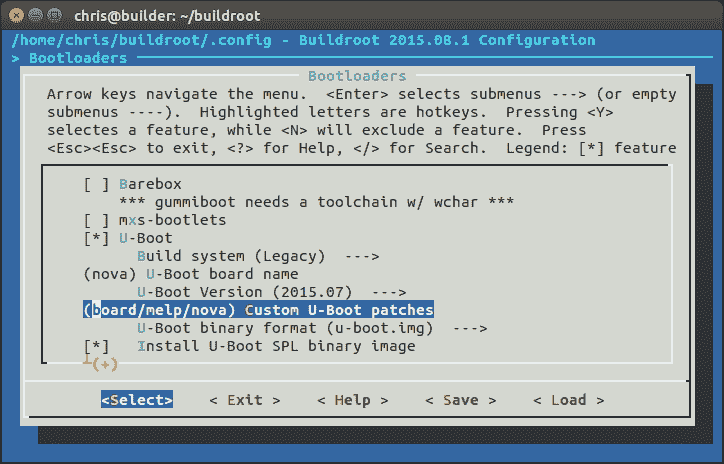
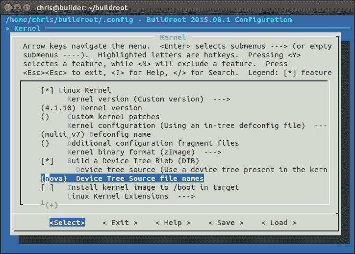
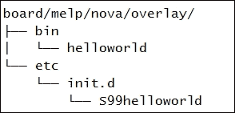
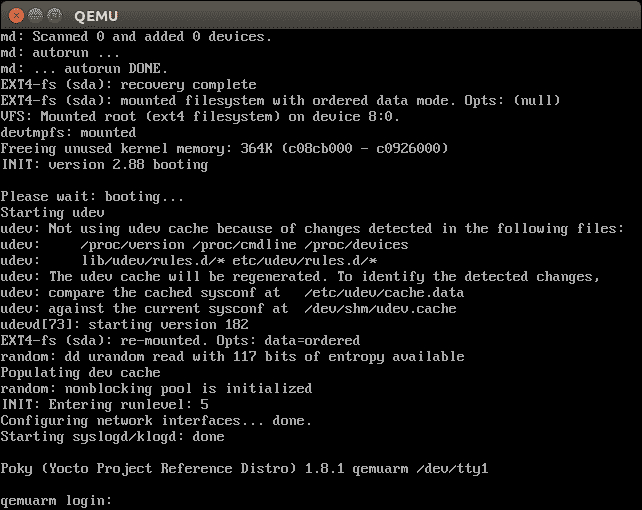

# 第六章：选择构建系统

前几章涵盖了嵌入式 Linux 的四个元素，并逐步向您展示了如何构建工具链、引导加载程序、内核和根文件系统，然后将它们组合成基本的嵌入式 Linux 系统。而且有很多步骤！现在是时候看看如何通过尽可能自动化来简化这个过程。我将介绍嵌入式构建系统如何帮助，并特别介绍两种构建系统：Buildroot 和 Yocto Project。这两种都是复杂而灵活的工具，需要整本书来充分描述它们的工作原理。在本章中，我只想向您展示构建系统背后的一般思想。我将向您展示如何构建一个简单的设备镜像，以便对系统有一个整体感觉，然后如何进行一些有用的更改，使用前几章中的 Nova 板示例。

# 不再自己制作嵌入式 Linux

手动创建系统的过程，如第五章中所述的*构建根文件系统*，称为**roll your own**（**RYO**）过程。它的优点是您完全控制软件，可以根据自己的喜好进行定制。如果您希望它执行一些非常奇特但创新的操作，或者如果您希望将内存占用减少到最小，RYO 是一种方法。但是，在绝大多数情况下，手动构建是浪费时间并产生质量较差、难以维护的系统。

它们通常在几个月的时间内逐步构建，通常没有记录，很少从头开始重新创建，因为没有人知道每个部分来自哪里。

# 构建系统

构建系统的理念是自动化我到目前为止描述的所有步骤。构建系统应该能够从上游源代码构建一些或所有以下内容：

+   工具链

+   引导加载程序

+   内核

+   根文件系统

从上游源代码构建对于许多原因都很重要。这意味着您可以放心，随时可以重新构建，而无需外部依赖。这还意味着您拥有用于调试的源代码，并且可以满足分发给用户的许可要求。

因此，为了完成其工作，构建系统必须能够执行以下操作：

+   从上游下载源代码，可以直接从源代码控制系统或作为存档文件，并将其缓存在本地

+   应用补丁以启用交叉编译，修复与体系结构相关的错误，应用本地配置策略等

+   构建各种组件

+   创建一个暂存区并组装一个根文件系统

+   创建各种格式的镜像文件，准备加载到目标设备上

其他有用的东西如下：

+   添加您自己的软件包，例如应用程序或内核更改

+   选择各种根文件系统配置文件：大或小，带有或不带有图形或其他功能

+   创建一个独立的 SDK，您可以将其分发给其他开发人员，以便他们不必安装完整的构建系统

+   跟踪所选软件包使用的各种开源许可证

+   允许您为现场更新创建更新

+   具有用户友好的用户界面

在所有情况下，它们将系统的组件封装成包，一些用于主机，一些用于目标。每个软件包由一组规则定义，以获取源代码，构建它，并将结果安装在正确的位置。软件包之间存在依赖关系和构建机制来解决依赖关系并构建所需的软件包集。

开源构建系统在过去几年中已经显著成熟。有许多构建系统，包括：

+   **Buildroot**：使用 GNU `make`和`Kconfig`的易于使用的系统（[`buildroot.org`](http://buildroot.org)）

+   **EmbToolkit**：用于生成根文件系统的简单系统；在撰写本文时，是唯一支持 LLVM/Clang 的系统（[`www.embtoolkit.org`](https://www.embtoolkit.org)）

+   **OpenEmbedded**：一个强大的系统，也是 Yocto 项目和其他项目的核心组件（[`openembedded.org`](http://openembedded.org)）

+   **OpenWrt**：一个面向无线路由器固件构建的构建工具（[`openwrt.org`](https://openwrt.org)）

+   **PTXdist**：由 Pengutronix 赞助的开源构建系统（[`www.pengutronix.de/software/ptxdist/index_en.html`](http://www.pengutronix.de/software/ptxdist/index_en.html)）

+   **Tizen**：一个全面的系统，重点放在移动、媒体和车载设备上（[`www.tizen.org`](https://www.tizen.org)）

+   **Yocto 项目**：这扩展了 OpenEmbedded 核心的配置、层、工具和文档：可能是最受欢迎的系统（[`www.yoctoproject.org`](http://www.yoctoproject.org)）

我将专注于其中两个：Buildroot 和 Yocto 项目。它们以不同的方式和不同的目标解决问题。

Buildroot 的主要目标是构建根文件系统映像，因此得名，尽管它也可以构建引导加载程序和内核映像。它易于安装和配置，并且可以快速生成目标映像。

另一方面，Yocto 项目在定义目标系统的方式上更加通用，因此可以构建相当复杂的嵌入式设备。每个组件都以 RPM、`.dpkg`或`.ipk`格式的软件包生成（见下一节），然后将这些软件包组合在一起以制作文件系统映像。此外，您可以在文件系统映像中安装软件包管理器，这允许您在运行时更新软件包。换句话说，当您使用 Yocto 项目构建时，实际上是在创建自己的定制 Linux 发行版。

# 软件包格式和软件包管理器

主流 Linux 发行版在大多数情况下是由 RPM 或 deb 格式的二进制（预编译）软件包集合构建而成。**RPM**代表**Red Hat 软件包管理器**，在 Red Hat、Suse、Fedora 和其他基于它们的发行版中使用。基于 Debian 的发行版，包括 Ubuntu 和 Mint，使用 Debian 软件包管理器格式`deb`。此外，还有一种轻量级格式专门用于嵌入式设备，称为**Itsy PacKage**格式，或**ipk**，它基于`deb`。

在设备上包含软件包管理器的能力是构建系统之间的重要区别之一。一旦在目标设备上安装了软件包管理器，您就可以轻松地部署新软件包并更新现有软件包。我将在下一章讨论这一点的影响。

# Buildroot

Buildroot 项目网站位于[`buildroot.org`](http://buildroot.org)。

当前版本的 Buildroot 能够构建工具链、引导加载程序（U-Boot、Barebox、GRUB2 或 Gummiboot）、内核和根文件系统。它使用 GNU `make`作为主要构建工具。

[`buildroot.org/docs.html`](http://buildroot.org/docs.html)上有很好的在线文档，包括*Buildroot 用户手册*。

## 背景

Buildroot 是最早的构建系统之一。它始于 uClinux 和 uClibc 项目的一部分，作为生成用于测试的小型根文件系统的一种方式。它于 2001 年末成为一个独立项目，并持续发展到 2006 年，之后进入了一个相当休眠的阶段。然而，自 2009 年 Peter Korsgaard 接管以来，它一直在快速发展，增加了对基于`glibc`的工具链的支持以及构建引导加载程序和内核的能力。

Buildroot 也是另一个流行的构建系统 OpenWrt（[`wiki.openwrt.org`](http://wiki.openwrt.org)）的基础，它在 2004 年左右从 Buildroot 分叉出来。OpenWrt 的主要重点是为无线路由器生产软件，因此软件包混合物是面向网络基础设施的。它还具有使用`.ipk`格式的运行时软件包管理器，因此可以在不完全重新刷写镜像的情况下更新或升级设备。

## 稳定版本和支持

Buildroot 开发人员每年发布四次稳定版本，分别在 2 月、5 月、8 月和 11 月。它们以`git`标签的形式标记为`<year>.02`、`<year>.05`、`<year>.08`和`<year>.11`。通常，当您启动项目时，您将使用最新的稳定版本。但是，稳定版本发布后很少更新。要获得安全修复和其他错误修复，您将不得不在可用时不断更新到下一个稳定版本，或者将修复程序回溯到您的版本中。

## 安装

通常情况下，您可以通过克隆存储库或下载存档来安装 Buildroot。以下是获取 2015.08.1 版本的示例，这是我写作时的最新稳定版本：

```
$ git clone git://git.buildroot.net/buildroot
$ cd buildroot
$ git checkout 2015.08.1

```

等效的 TAR 存档可从[`buildroot.org/downloads`](http://buildroot.org/downloads)获取。

接下来，您应该阅读*Buildroot 用户手册*中的*系统要求*部分，网址为[`buildroot.org/downloads/manual/manual.html`](http://buildroot.org/downloads/manual/manual.html)，并确保您已安装了那里列出的所有软件包。

## 配置

Buildroot 使用`Kconfig`和`Kbuild`机制，就像内核一样，我在第四章的*理解内核配置*部分中描述的那样，*移植和配置内核*。您可以直接使用`make menuconfig`（或`xconfig`或`gconfig`）从头开始配置它，或者您可以选择存储在`configs/`目录中的大约 90 个各种开发板和 QEMU 模拟器的配置之一。键入`make help`列出所有目标，包括默认配置。

让我们从构建一个默认配置开始，您可以在 ARM QEMU 模拟器上运行：

```
$ cd buildroot
$ make qemu_arm_versatile_defconfig
$ make

```

### 提示

请注意，您不需要使用`-j`选项告诉`make`要运行多少个并行作业：Buildroot 将自行充分利用您的 CPU。如果您想限制作业的数量，可以运行`make menuconfig`并查看**Build**选项下的内容。

构建将花费半小时到一小时的时间，这取决于您的主机系统的能力和与互联网的连接速度。完成后，您会发现已创建了两个新目录：

+   `dl/`：这包含了 Buildroot 构建的上游项目的存档

+   `output/`：这包含了所有中间和最终编译的资源

您将在`output/`中看到以下内容：

+   `build/`：这是每个组件的构建目录。

+   `host/`：这包含 Buildroot 所需的在主机上运行的各种工具，包括工具链的可执行文件（在`output/host/usr/bin`中）。

+   `images/`：这是最重要的，包含构建的结果。根据您的配置选择，您将找到引导加载程序、内核和一个或多个根文件系统镜像。

+   `staging/`：这是指向工具链的`sysroot`的符号链接。链接的名称有点令人困惑，因为它并不指向我在第五章中定义的暂存区。

+   `target/`：这是根目录的暂存区。请注意，您不能将其作为根文件系统使用，因为文件所有权和权限未正确设置。Buildroot 在创建文件系统映像时使用设备表来设置所有权和权限，如前一章所述。

## 运行

一些示例配置在`boards/`目录中有相应的条目，其中包含自定义配置文件和有关在目标上安装结果的信息。对于您刚刚构建的系统，相关文件是`board/qemu/arm-vexpress/readme.txt`，其中告诉您如何使用此目标启动 QEMU。

假设您已经按照第一章中描述的方式安装了`qemu-system-arm`，*起步*，您可以使用以下命令运行它：

```
$ qemu-system-arm -M vexpress-a9 -m 256 \
-kernel output/images/zImage \
-dtb output/images/vexpress-v2p-ca9.dtb \
-drive file=output/images/rootfs.ext2,if=sd \
-append "console=ttyAMA0,115200 root=/dev/mmcblk0" \
-serial stdio -net nic,model=lan9118 -net user

```

您应该在启动 QEMU 的同一终端窗口中看到内核引导消息，然后是登录提示符：

```
Booting Linux on physical CPU 0x0
Initializing cgroup subsys cpuset

Linux version 4.1.0 (chris@builder) (gcc version 4.9.3 (Buildroot 2015.08) ) #1 SMP Fri Oct 30 13:55:50 GMT 2015

CPU: ARMv7 Processor [410fc090] revision 0 (ARMv7), cr=10c5387d

CPU: PIPT / VIPT nonaliasing data cache, VIPT aliasing instruction cache
Machine model: V2P-CA9
[...]
VFS: Mounted root (ext2 filesystem) readonly on device 179:0.
devtmpfs: mounted
Freeing unused kernel memory: 264K (8061e000 - 80660000)
random: nonblocking pool is initialized
Starting logging: OK
Starting mdev...
Initializing random number generator... done.
Starting network...

Welcome to Buildroot
buildroot login:

```

以`root`身份登录，无需密码。

您会看到 QEMU 启动一个黑色窗口，除了具有内核引导消息的窗口。它用于显示目标的图形帧缓冲区。在这种情况下，目标从不写入`framebuffer`，这就是为什么它是黑色的原因。要关闭 QEMU，可以在 root 提示符处键入`poweroff`，或者只需关闭`framebuffer`窗口。这适用于 QEMU 2.0（Ubuntu 14.04 上的默认版本），但在包括 QEMU 1.0.50（Ubuntu 12.04 上的默认版本）在内的早期版本中失败，因为存在 SCSI 仿真问题。

## 创建自定义 BSP

接下来，让我们使用 Buildroot 为我们的 Nova 板创建 BSP，使用前几章中相同版本的 U-Boot 和 Linux。建议存储更改的位置是：

+   `board/<organization>/<device>`：包含 Linux、U-Boot 和其他组件的补丁、二进制文件、额外的构建步骤、配置文件

+   `configs/<device>_defconfig`：包含板的默认配置

+   `packages/<organization>/<package_name>`：是放置此板的任何额外软件包的位置

我们可以使用 BeagleBone 配置文件作为基础，因为 Nova 是近亲：

```
$ make clean  #  Always do a clean when changing targets
$ make beaglebone_defconfig

```

现在`.config`文件已设置为 BeagleBone。接下来，为板配置创建一个目录：

```
$ mkdir -p board/melp/nova

```

### U-Boot

在第三章中，*引导程序全解*，我们为 Nova 创建了一个基于 U-Boot 2015.07 版本的自定义引导程序，并为其创建了一个补丁文件。我们可以配置 Buildroot 选择相同的版本，并应用我们的补丁。首先将补丁文件复制到`board/melp/nova`，然后使用`make menuconfig`将 U-Boot 版本设置为 2015.07，补丁目录设置为`board/melp/nova`，并将板名称设置为 nova，如此屏幕截图所示：



### Linux

在第四章中，*移植和配置内核*，我们基于 Linux 4.1.10 构建了内核，并提供了一个名为`nova.dts`的新设备树。将设备树复制到`board/melp/nova`，并更改 Buildroot 内核配置以使用此版本和 nova 设备树，如此屏幕截图所示：



### 构建

现在，您可以通过键入`make`为 Nova 板构建系统，这将在目录`output/images`中生成这些文件：

```
MLO  nova.dtb  rootfs.ext2  u-boot.img  uEnv.txt  zImage

```

最后一步是保存配置的副本，以便您和其他人可以再次使用它：

```
$ make savedefconfig BR2_DEFCONFIG=configs/nova_defconfig

```

现在，您已经为 Nova 板创建了 Buildroot 配置。

## 添加您自己的代码

假设您开发了一些程序，并希望将其包含在构建中。您有两个选择：首先，使用它们自己的构建系统单独构建它们，然后将二进制文件作为叠加卷入最终构建中。其次，您可以创建一个 Buildroot 软件包，可以从菜单中选择并像其他软件包一样构建。

### 叠加

覆盖只是在构建过程的后期阶段复制到 Buildroot 根文件系统顶部的目录结构。它可以包含可执行文件、库和任何您想要包含的其他内容。请注意，任何编译的代码必须与运行时部署的库兼容，这意味着它必须使用 Buildroot 使用的相同工具链进行编译。使用 Buildroot 工具链非常容易：只需将其添加到路径中：

```
$ PATH=<path_to_buildroot>/output/host/usr/bin:$PATH

```

工具的前缀是`<ARCH>-linux-`。

覆盖目录由`BR2_ROOTFS_OVERLAY`设置，其中包含一个由空格分隔的目录列表，您应该在 Buildroot 根文件系统上覆盖它。它可以在`menuconfig`中配置，选项为**系统配置** | **根文件系统覆盖目录**。

例如，如果将`helloworld`程序添加到`bin`目录，并在启动时添加一个脚本，您将创建一个包含以下内容的覆盖目录：



然后，您将`board/melp/nova/overlay`添加到覆盖选项中。

根文件系统的布局由`system/skeleton`目录控制，权限在`device_table_dev.txt`和`device_table.txt`中设置。

### 添加软件包

Buildroot 软件包存储在`package`目录中，有 1000 多个软件包，每个软件包都有自己的子目录。软件包至少包含两个文件：`Config.in`，其中包含使软件包在**配置**菜单中可见所需的`Kconfig`代码片段，以及名为`<package_name>.mk`的`makefile`。请注意，软件包不包含代码，只包含获取代码的指令，如下载 tarball、执行 git pull 等。

`makefile`以 Buildroot 期望的格式编写，并包含指令，允许 Buildroot 下载、配置、编译和安装程序。编写新软件包`makefile`是一个复杂的操作，在*Buildroot 用户手册*中有详细介绍。以下是一个示例，演示了如何为存储在本地的简单程序（如我们的`helloworld`程序）创建软件包。

首先创建子目录`package/helloworld`，其中包含一个名为`Config.in`的配置文件，内容如下：

```
config BR2_PACKAGE_HELLOWORLD
bool "helloworld"
help
  A friendly program that prints Hello World! every 10s
```

第一行必须是`BR2_PACKAGE_<大写软件包名称>`的格式。然后是一个布尔值和软件包名称，它将出现在**配置**菜单中，并允许用户选择此软件包。*帮助*部分是可选的（但希望有用）。

接下来，通过编辑`package/Config.in`并在前面的部分提到的源配置文件，将新软件包链接到**目标软件包**菜单中。您可以将其附加到现有子菜单中，但在这种情况下，创建一个仅包含我们软件包的新子菜单似乎更整洁：

```
menu "My programs"
  source "package/helloworld/Config.in"
endmenu
```

然后，创建一个 makefile，`package/helloworld/helloworld.mk`，以提供 Buildroot 所需的数据：

```
HELLOWORLD_VERSION:= 1.0.0
HELLOWORLD_SITE:= /home/chris/MELP/helloworld/
HELLOWORLD_SITE_METHOD:=local
HELLOWORLD_INSTALL_TARGET:=YES

define HELLOWORLD_BUILD_CMDS
  $(MAKE) CC="$(TARGET_CC)" LD="$(TARGET_LD)" -C $(@D) all
endef

define HELLOWORLD_INSTALL_TARGET_CMDS
  $(INSTALL) -D -m 0755 $(@D)/helloworld $(TARGET_DIR)/bin
endef

$(eval $(generic-package))
```

代码的位置被硬编码为本地路径名。在更现实的情况下，您将从源代码系统或某种中央服务器获取代码：*Buildroot 用户指南*中有如何执行此操作的详细信息，其他软件包中也有大量示例。

## 许可合规性

Buildroot 基于开源软件，它编译的软件包也是开源的。在项目的某个阶段，您应该检查许可证，可以通过运行以下命令来执行：

```
$ make legal-info

```

信息被收集到`output/legal-info`中。在`host-manifest.csv`中有用于编译主机工具的许可证摘要，在目标中有`manifest.csv`。在*Buildroot 用户手册*和`README`文件中有更多信息。

# Yocto 项目

Yocto 项目比 Buildroot 更复杂。它不仅可以像 Buildroot 一样构建工具链、引导加载程序、内核和根文件系统，还可以为您生成整个 Linux 发行版，其中包含可以在运行时安装的二进制软件包。

Yocto 项目主要是一组类似于 Buildroot 包的配方，但是使用 Python 和 shell 脚本的组合编写，并使用名为 BitBake 的任务调度程序生成你配置的任何内容。

在 [`www.yoctoproject.org/`](https://www.yoctoproject.org/) 有大量在线文档。

## 背景

Yocto 项目的结构如果你先看一下背景会更有意义。它的根源在于 OpenEmbedded，[`openembedded.org/`](http://openembedded.org/)，而 OpenEmbedded 又源自于一些项目，用于将 Linux 移植到各种手持计算机上，包括 Sharp Zaurus 和 Compaq iPaq。OpenEmbedded 于 2003 年诞生，作为这些手持计算机的构建系统，但很快扩展到包括其他嵌入式板。它是由一群热情的程序员开发并继续开发的。

OpenEmbedded 项目旨在使用紧凑的 `.ipk` 格式创建一组二进制软件包，然后可以以各种方式组合这些软件包，创建目标系统，并在运行时安装在目标上。它通过为每个软件创建配方并使用 BitBake 作为任务调度程序来实现这一点。它非常灵活。通过提供正确的元数据，你可以根据自己的规格创建整个 Linux 发行版。一个相当知名的是 *The Ångström Distribution*，[`www.angstrom-distribution.org`](http://www.angstrom-distribution.org)，但还有许多其他发行版。

在 2005 年的某个时候，当时是 OpenedHand 的开发人员 Richard Purdie 创建了 OpenEmbedded 的一个分支，选择了更保守的软件包，并创建了一段时间稳定的发布。他将其命名为 Poky，以日本小吃命名（如果你担心这些事情，Poky 的发音与 hockey 押韵）。尽管 Poky 是一个分支，但 OpenEmbedded 和 Poky 仍然并行运行，共享更新，并保持体系结构大致同步。英特尔在 2008 年收购了 OpenedHand，并在 2010 年他们成立 Yocto 项目时将 Poky Linux 转移到了 Linux 基金会。

自 2010 年以来，OpenEmbedded 和 Poky 的共同组件已经合并为一个名为 OpenEmbedded core 的独立项目，或者简称 oe-core。

因此，Yocto 项目汇集了几个组件，其中最重要的是以下内容：

+   **Poky**：参考发行版

+   **oe-core**：与 OpenEmbedded 共享的核心元数据

+   **BitBake**：任务调度程序，与 OpenEmbedded 和其他项目共享

+   **文档**：每个组件的用户手册和开发人员指南

+   **Hob**：OpenEmbedded 和 BitBake 的图形用户界面

+   **Toaster**：OpenEmbedded 和 BitBake 的基于 Web 的界面

+   **ADT Eclipse**：Eclipse 的插件，使使用 Yocto 项目 SDK 更容易构建项目

严格来说，Yocto 项目是这些子项目的总称。它使用 OpenEmbedded 作为其构建系统，并使用 Poky 作为其默认配置和参考环境。然而，人们经常使用术语“Yocto 项目”来指代仅构建系统。我觉得现在已经为时已晚，所以为了简洁起见，我也会这样做。我提前向 OpenEmbedded 的开发人员道歉。

Yocto 项目提供了一个稳定的基础，可以直接使用，也可以使用元层进行扩展，我将在本章后面讨论。许多 SoC 供应商以这种方式为其设备提供了板支持包。元层也可以用于创建扩展的或不同的构建系统。有些是开源的，比如 Angstrom 项目，另一些是商业的，比如 MontaVista Carrier Grade Edition、Mentor Embedded Linux 和 Wind River Linux。Yocto 项目有一个品牌和兼容性测试方案，以确保组件之间的互操作性。您会在各种网页上看到类似“Yocto 项目兼容 1.7”的声明。

因此，您应该将 Yocto 项目视为嵌入式 Linux 整个领域的基础，同时也是一个完整的构建系统。您可能会对*yocto*这个名字感到好奇。Yocto 是 10-24 的国际单位制前缀，就像微是 10-6 一样。为什么要给项目取名为 yocto 呢？部分原因是为了表明它可以构建非常小的 Linux 系统（尽管公平地说，其他构建系统也可以），但也可能是为了在基于 OpenEmbedded 的Ångström 发行版上取得优势。Ångström 是 10-10。与 yocto 相比，那太大了！

## 稳定版本和支持

通常，Yocto 项目每六个月发布一次，分别在 4 月和 10 月。它们主要以代号而闻名，但了解 Yocto 项目和 Poky 的版本号也是有用的。以下是我写作时最近的四个版本的表格：

| 代号 | 发布日期 | Yocto 版本 | Poky 版本 |
| --- | --- | --- | --- |
| `Fido` | 2015 年 4 月 | 1.8 | 13 |
| `Dizzy` | 2014 年 10 月 | 1.7 | 12 |
| `Daisy` | 2014 年 4 月 | 1.6 | 11 |
| `Dora` | 2013 年 10 月 | 1.5 | 10 |

稳定版本在当前发布周期和下一个周期内受到安全和关键错误修复的支持，即发布后大约 12 个月。这些更新不允许进行工具链或内核版本更改。与 Buildroot 一样，如果您希望获得持续支持，可以升级到下一个稳定版本，或者可以将更改移植到您的版本。您还可以选择从操作系统供应商（如 Mentor Graphics、Wind River 等）获得长达数年的商业支持。

## 安装 Yocto 项目

要获取 Yocto 项目的副本，您可以克隆存储库，选择代码名称作为分支，本例中为`fido`：

```
$ git clone -b fido git://git.yoctoproject.org/poky.git

```

您还可以从[`downloads.yoctoproject.org/releases/yocto/yocto-1.8/poky-fido-13.0.0.tar.bz2`](http://downloads.yoctoproject.org/releases/yocto/yocto-1.8/poky-fido-13.0.0.tar.bz2)下载存档。

在第一种情况下，您会在`poky`目录中找到所有内容，在第二种情况下，是`poky-fido-13.0.0/`。

此外，您应该阅读《Yocto 项目参考手册》（[`www.yoctoproject.org/docs/current/ref-manual/ref-manual.html#detailed-supported-distros`](http://www.yoctoproject.org/docs/current/ref-manual/ref-manual.html#detailed-supported-distros)）中标题为“系统要求”的部分，并特别确保其中列出的软件包已安装在您的主机计算机上。

## 配置

与 Buildroot 一样，让我们从 ARM QEMU 模拟器的构建开始。首先要源化一个脚本来设置环境：

```
$ cd poky
$ source oe-init-build-env

```

这将为您创建一个名为`build`的工作目录，并将其设置为当前目录。所有的配置、中间和可部署文件都将放在这个目录中。每次您想要处理这个项目时，都必须源化这个脚本。

您可以通过将其作为参数添加到`oe-init-build-env`来选择不同的工作目录，例如：

```
$ source oe-init-build-env build-qemuarm

```

这将使您进入`build-qemuarm`目录。然后，您可以同时进行几个项目：通过`oe-init-build-env`的参数选择要使用的项目。

最初，`build`目录只包含一个名为`conf`的子目录，其中包含此项目的配置文件：

+   `local.conf`：包含要构建的设备和构建环境的规范。

+   `bblayers.conf`：包含要使用的层的目录列表。稍后将会有更多关于层的内容。

+   `templateconf.cfg`：包含一个包含各种`conf`文件的目录的名称。默认情况下，它指向`meta-yocto/conf`。

现在，我们只需要在`local.conf`中将`MACHINE`变量设置为`qemuarm`，方法是删除此行开头的注释字符：

```
MACHINE ?= "qemuarm"
```

## 构建

要实际执行构建，需要运行`bitbake`，告诉它要创建哪个根文件系统镜像。一些常见的图像如下：

+   核心图像-最小：一个小型的基于控制台的系统，对于测试和作为自定义图像的基础很有用。

+   核心图像-最小 initramfs：类似于核心图像-最小，但构建为 ramdisk。

+   核心图像-x11：通过 X11 服务器和 xterminal 终端应用程序支持图形的基本图像。

+   核心图像-sato：基于 Sato 的完整图形系统，Sato 是基于 X11 和 GNOME 构建的移动图形环境。图像包括几个应用程序，包括终端、编辑器和文件管理器。

通过给 BitBake 最终目标，它将向后工作，并首先构建所有依赖项，从工具链开始。现在，我们只想创建一个最小的图像来查看它是否有效：

```
$ bitbake core-image-minimal

```

构建可能需要一些时间，可能超过一个小时。完成后，您将在构建目录中找到几个新目录，包括`build/downloads`，其中包含构建所需的所有源文件，以及`build/tmp`，其中包含大部分构建产物。您应该在`tmp`中看到以下内容：

+   `work`：包含构建目录和所有组件的分段区域，包括根文件系统

+   `deploy`：包含要部署到目标上的最终二进制文件：

+   `deploy/images/[机器名称]`：包含引导加载程序、内核和根文件系统镜像，准备在目标上运行

+   `deploy/rpm`：包含组成图像的 RPM 软件包

+   `deploy/licenses`：包含从每个软件包中提取的许可文件

## 运行

当构建 QEMU 目标时，将生成一个内部版本的 QEMU，从而无需安装 QEMU 软件包以避免版本依赖。有一个名为`runqemu`的包装脚本用于这个内部 QEMU。

要运行 QEMU 仿真，请确保已经源自`oe-init-build-env`，然后只需键入：

```
$ runqemu qemuarm

```

在这种情况下，QEMU 已配置为具有图形控制台，因此启动消息和登录提示将显示在黑色帧缓冲屏幕上：



您可以以`root`身份登录，无需密码。您可以通过关闭帧缓冲窗口关闭 QEMU。您可以通过在命令行中添加`nographic`来启动不带图形窗口的 QEMU：

```
$ runqemu qemuarm nographic

```

在这种情况下，使用键序*Ctrl* + *A* + *X*关闭 QEMU。

`runqemu`脚本有许多其他选项，键入`runqemu help`以获取更多信息。

## 层

Yocto 项目的元数据按层结构化，按照惯例，每个层的名称都以`meta`开头。Yocto 项目的核心层如下：

+   元：这是 OpenEmbedded 核心

+   meta-yocto：特定于 Yocto 项目的元数据，包括 Poky 发行版

+   meta-yocto-bsp：包含 Yocto 项目支持的参考机器的板支持软件包

BitBake 搜索配方的层列表存储在`<your build directory>/conf/bblayers.conf`中，并且默认情况下包括前面列表中提到的所有三个层。

通过以这种方式构建配方和其他配置数据，很容易通过添加新的层来扩展 Yocto 项目。额外的层可以从 SoC 制造商、Yocto 项目本身以及希望为 Yocto 项目和 OpenEmbedded 增加价值的广泛人员那里获得。在[`layers.openembedded.org`](http://layers.openembedded.org)上有一个有用的层列表。以下是一些示例：

+   **meta-angstrom**：Ångström 发行版

+   **meta-qt5**：Qt5 库和实用程序

+   **meta-fsl-arm**：Freescale 基于 ARM 的 SoC 的 BSP

+   **meta-fsl-ppc**：Freescale 基于 PowerPC 的 SoC 的 BSP

+   **meta-intel**：Intel CPU 和 SoC 的 BSP

+   **meta-ti**：TI 基于 ARM 的 SoC 的 BSP

添加一个层就像将 meta 目录复制到合适的位置一样简单，通常是在默认的 meta 层旁边，并将其添加到`bblayers.conf`中。只需确保它与您正在使用的 Yocto 项目版本兼容即可。

为了说明层的工作原理，让我们为我们的 Nova 板创建一个层，我们可以在本章的其余部分中使用它来添加功能。每个元层必须至少有一个配置文件`conf/layer.conf`，还应该有一个`README`文件和一个许可证。有一个方便的辅助脚本可以为我们完成基本工作：

```
$ cd poky
$ scripts/yocto-layer create nova

```

脚本会要求设置优先级，以及是否要创建示例配方。在这个示例中，我只接受了默认值：

```
Please enter the layer priority you'd like to use for the layer: [default: 6]
Would you like to have an example recipe created? (y/n) [default: n]
Would you like to have an example bbappend file created? (y/n) [default: n]
New layer created in meta-nova.
Don't forget to add it to your BBLAYERS (for details see meta-nova\README).

```

这将创建一个名为`meta-nova`的层，其中包含`conf/layer.conf`、概要`README`和`COPYING.MIT`中的 MIT 许可证。`layer.conf`文件如下所示：

```
# We have a conf and classes directory, add to BBPATH
BBPATH .= ":${LAYERDIR}"

# We have recipes-* directories, add to BBFILES
BBFILES += "${LAYERDIR}/recipes-*/*/*.bb \
${LAYERDIR}/recipes-*/*/*.bbappend"

BBFILE_COLLECTIONS += "nova"
BBFILE_PATTERN_nova = "^${LAYERDIR}/"
BBFILE_PRIORITY_nova = "6"
```

它将自己添加到`BBPATH`，并将其包含的配方添加到`BBFILES`。通过查看代码，您可以看到配方位于以`recipes-`开头的目录中，并且文件名以`.bb`结尾（用于普通 BitBake 配方），或以`.bbappend`结尾（用于通过添加和覆盖指令扩展现有普通配方的配方）。此层的名称为`nova`，它被添加到`BBFILE_COLLECTIONS`中的层列表中，并且具有优先级`6`。如果相同的配方出现在几个层中，则具有最高优先级的层中的配方获胜。

由于您即将构建一个新的配置，最好从创建一个名为`build-nova`的新构建目录开始：

```
$ cd ~/poky
$ . oe-init-build-env build-nova

```

现在，您需要将此层添加到您的构建配置中，`conf/bblayers.conf`：

```
LCONF_VERSION = "6"

BBPATH = "${TOPDIR}"
BBFILES ?= ""

BBLAYERS ?= " \
  /home/chris/poky/meta \
  /home/chris/poky/meta-yocto \
  /home/chris/poky/meta-yocto-bsp \
 /home/chris/poky/meta-nova \
  "
BBLAYERS_NON_REMOVABLE ?= " \
  /home/chris/poky/meta \
  /home/chris/poky/meta-yocto \"
```

您可以使用另一个辅助脚本确认它是否设置正确：

```
$ bitbake-layers show-layers
layer                 path                     priority
==========================================================
meta              /home/chris/poky/meta            5
meta-yocto        /home/chris/poky/meta-yocto      5
meta-yocto-bsp    /home/chris/poky/meta-yocto-bsp  5
meta-nova         /home/chris/poky/meta-nova       6

```

在那里，您可以看到新的层。它的优先级为`6`，这意味着我们可以覆盖具有较低优先级的其他层中的配方。

此时运行一个构建，使用这个空层是一个好主意。最终目标将是 Nova 板，但是现在，通过在`conf/local.conf`中的`MACHINE ?= "beaglebone"`之前去掉注释，为 BeagelBone Black 构建一个小型镜像。然后，使用`bitbake core-image-minimal`构建一个小型镜像。

除了配方，层还可以包含 BitBake 类、机器的配置文件、发行版等。接下来我将看一下配方，并向您展示如何创建自定义镜像以及如何创建软件包。

### BitBake 和配方

BitBake 处理几种不同类型的元数据，包括以下内容：

+   **recipes**：以`.bb`结尾的文件。这些文件包含有关构建软件单元的信息，包括如何获取源代码副本、对其他组件的依赖关系以及如何构建和安装它。

+   **append**：以`.bbappend`结尾的文件。这些文件允许覆盖或扩展配方的一些细节。`A.bbappend`文件只是将其指令附加到具有相同根名称的配方（`.bb`）文件的末尾。

+   **包括**：以`.inc`结尾的文件。这些文件包含多个食谱共有的信息，允许信息在它们之间共享。可以使用`include`或`require`关键字来包含这些文件。不同之处在于，如果文件不存在，`require`会产生错误，而`include`不会。

+   **类**：以`.bbclass`结尾的文件。这些文件包含常见的构建信息，例如如何构建内核或如何构建`autotools`项目。这些类在食谱和其他类中使用`inherit`关键字进行继承和扩展。`classes/base.bbclass`类在每个食谱中都会被隐式继承。

+   **配置**：以`.conf`结尾的文件。它们定义了管理项目构建过程的各种配置变量。

食谱是一组以 Python 和 shell 代码的组合编写的任务。任务的名称如`do_fetch`、`do_unpack`、`do_patch`、`do_configure`、`do_compile`、`do_install`等。您可以使用 BitBake 来执行这些任务。

默认任务是`do_build`，因此您正在运行该食谱的构建任务。您可以通过像这样运行`bitbake core-image-minimal`来列出食谱中可用的任务：

```
$ bitbake -c listtasks core-image-minimal

```

`-c`选项允许您指定任务，省略`do_`部分。一个常见的用法是`-c fetch`来获取一个食谱所需的代码：

```
$ bitbake -c fetch busybox

```

您还可以使用`fetchall`来获取目标代码和所有依赖项的代码：

```
$ bitbake -c fetchall core-image-minimal

```

食谱文件通常被命名为`<package-name>_version.bb`。它们可能依赖于其他食谱，这将允许 BitBake 计算出需要执行的所有子任务，以完成顶层作业。不幸的是，我在这本书中没有空间来描述依赖机制，但您将在 Yocto Project 文档中找到完整的描述。

例如，要在`meta-nova`中为我们的`helloworld`程序创建一个食谱，您可以创建以下目录结构：

```
meta-nova/recipes-local/helloworld
├── files
│   └── helloworld.c
└── helloworld_1.0.bb
```

食谱是`helloworld_1.0.bb`，源代码是食谱目录中子目录文件的本地文件。食谱包含这些说明：

```
DESCRIPTION = "A friendly program that prints Hello World!"
PRIORITY = "optional"
SECTION = "examples"

LICENSE = "GPLv2"
LIC_FILES_CHKSUM = "file://${COMMON_LICENSE_DIR}/GPL-2.0;md5=801f80980d171dd6425610833a22dbe6"

SRC_URI = "file://helloworld.c"
S = "${WORKDIR}"

do_compile() {
  ${CC} ${CFLAGS} -o helloworld helloworld.c
}

do_install() {
  install -d ${D}${bindir}
  install -m 0755 helloworld ${D}${bindir}
}
```

源代码的位置由`SRC_URI`设置：在这种情况下，它将在食谱目录中搜索目录、文件、`helloworld`和`helloworld-1.0`。唯一需要定义的任务是`do_compile`和`do_install`，它们简单地编译一个源文件并将其安装到目标根文件系统中：`${D}`扩展到目标设备的分段区域，`${bindir}`扩展到默认的二进制目录`/usr/bin`。

每个食谱都有一个许可证，由`LICENSE`定义，这里设置为`GPLv2`。包含许可证文本和校验和的文件由`LIC_FILES_CHKSUM`定义。如果校验和不匹配，BitBake 将终止构建，表示许可证以某种方式发生了变化。许可证文件可能是软件包的一部分，也可能指向`meta/files/common-licenses`中的标准许可证文本之一，就像这里一样。

默认情况下，商业许可证是不允许的，但很容易启用它们。您需要在食谱中指定许可证，如下所示：

```
LICENSE_FLAGS = "commercial"
```

然后，在您的`conf/local.conf`中，您可以明确允许此许可证，如下所示：

```
LICENSE_FLAGS_WHITELIST = "commercial"
```

为了确保它编译正确，您可以要求 BitBake 构建它，如下所示：

```
$ bitbake  helloworld

```

如果一切顺利，您应该看到它已经在`tmp/work/cortexa8hf-vfp-neon-poky-linux-gnueabi/helloworld/`中为其创建了一个工作目录。

您还应该看到`tmp/deploy/rpm/cortexa8hf_vfp_neon/helloworld-1.0-r0.cortexa8hf_vfp_neon.rpm`中有一个 RPM 软件包。

尽管如此，它还不是目标镜像的一部分。要安装的软件包列表保存在名为`IMAGE_INSTALL`的变量中。您可以通过将此行添加到您的`conf/local.conf`中的列表末尾来追加到该列表：

```
IMAGE_INSTALL_append = " helloworld"
```

请注意，第一个双引号和第一个软件包名称之间必须有一个空格。现在，该软件包将被添加到您 bitbake 的任何镜像中：

```
$ bitbake core-image-minimal

```

如果您查看`tmp/deploy/images/beaglebone/core-image-minimal-beaglebone.tar.bz2`，您将看到确实已安装`/usr/bin/helloworld`。

## 通过 local.conf 自定义图像

您可能经常希望在开发过程中向图像添加软件包或以其他方式进行微调。如前所示，您可以通过添加类似以下语句来简单地追加要安装的软件包列表：

```
IMAGE_INSTALL_append = " strace helloworld"
```

毫无疑问，您也可以做相反的事情：可以使用以下语法删除软件包：

```
IMAGE_INSTALL_remove = "someapp"
```

您可以通过`EXTRA_IMAGE_FEATURES`进行更广泛的更改。这里列不完，我建议您查看*Yocto Project 参考手册*的*图像功能*部分和`meta/classes/core-image.bbclass`中的代码。以下是一个简短的列表，应该可以让您了解可以启用的功能：

+   `dbg-pkgs`：为图像中安装的所有软件包安装调试符号包。

+   `debug-tweaks`：允许无密码进行 root 登录和其他使开发更容易的更改。

+   `package-management`：安装软件包管理工具并保留软件包管理器数据库。

+   `read-only-rootfs`：使根文件系统只读。我们将在第七章中详细介绍这一点，*创建存储策略*。

+   `x11`：安装 X 服务器。

+   `x11-base`：安装带有最小环境的 X 服务器。

+   `x11-sato`：安装 OpenedHand Sato 环境。

## 编写图像配方

对`local.conf`进行更改的问题在于它们是本地的。如果您想创建一个要与其他开发人员共享或加载到生产系统的图像，那么您应该将更改放入图像配方中。

图像配方包含有关如何为目标创建图像文件的指令，包括引导加载程序、内核和根文件系统映像。您可以使用此命令获取可用图像的列表：

```
$ ls meta*/recipes*/images/*.bb

```

`core-image-minimal`的配方位于`meta/recipes-core/images/core-image-minimal.bb`中。

一个简单的方法是使用类似于在`local.conf`中使用的语句来获取现有的图像配方并进行修改。

例如，假设您想要一个与`core-image-minimal`相同的图像，但包括您的`helloworld`程序和`strace`实用程序。您可以使用一个两行的配方文件来实现这一点，该文件包括（使用`require`关键字）基本图像并添加您想要的软件包。将图像放在名为`images`的目录中是传统的做法，因此在`meta-nova/recipes-local/images`中添加具有以下内容的配方`nova-image.bb`：

```
require recipes-core/images/core-image-minimal.bb
IMAGE_INSTALL += "helloworld strace"
```

现在，您可以从`local.conf`中删除`IMAGE_INSTALL_append`行，并使用以下命令构建它：

```
$ bitbake nova-image

```

如果您想进一步控制根文件系统的内容，可以从空的`IMAGE_INSTALL`变量开始，并像这样填充它：

```
SUMMARY = "A small image with helloworld and strace packages" IMAGE_INSTALL = "packagegroup-core-boot helloworld strace"
IMAGE_LINGUAS = " "
LICENSE = "MIT"
IMAGE_ROOTFS_SIZE ?= "8192"
inherit core-image
```

`IMAGE_LINGUAS`包含要在目标图像中安装的`glibc`区域设置的列表。它们可能占用大量空间，因此在这种情况下，我们将列表设置为空，只要我们不需要区域设置相关的库函数就可以了。`IMAGE_ROOTFS_SIZE`是生成的磁盘映像的大小，以 KiB 为单位。大部分工作由我们在最后继承的`core-image`类完成。

## 创建 SDK

能够创建一个其他开发人员可以安装的独立工具链非常有用，避免了团队中每个人都需要完整安装 Yocto Project 的需求。理想情况下，您希望工具链包括目标上安装的所有库的开发库和头文件。您可以使用`populate_sdk`任务为任何图像执行此操作，如下所示：

```
$ bitbake nova-image -c populate_sdk

```

结果是一个名为`tmp/deploy/sdk`中的自安装 shell 脚本：

```
poky-<c_library>-<host_machine>-<target_image><target_machine>-toolchain-<version>.sh
```

这是一个例子：

```
poky-glibc-x86_64-nova-image-cortexa8hf-vfp-neon-toolchain-1.8.1.sh
```

请注意，默认情况下，工具链不包括静态库。您可以通过向`local.conf`或图像配方添加类似以下行来单独启用它们：

```
TOOLCHAIN_TARGET_TASK_append = " glibc-staticdev"
```

您也可以像下面这样全局启用它们：

```
SDKIMAGE_FEATURES_append = " staticdev-pkgs"
```

如果您只想要一个基本的工具链，只需 C 和 C++交叉编译器，C 库和头文件，您可以运行：

```
$ bitbake meta-toolchain

```

要安装 SDK，只需运行 shell 脚本。默认安装目录是`/opt/poky`，但安装脚本允许您更改：

```
$ tmp/deploy/sdk/poky-glibc-x86_64-nova-image-cortexa8hf-vfp-neon-toolchain-1.8.1.sh

Enter target directory for SDK (default: /opt/poky/1.8.1):

You are about to install the SDK to "/opt/poky/1.8.1". Proceed[Y/n]?

[sudo] password for chris:

Extracting SDK...done

Setting it up...done

SDK has been successfully set up and is ready to be used.

```

要使用工具链，首先要源环境设置脚本：

```
. /opt/poky/1.8.1/environment-setup-cortexa8hf-vfp-neon-poky-linux-gnueabi

```

以这种方式生成的工具链未配置有效的`sysroot`：

```
$ arm-poky-linux-gnueabi-gcc -print-sysroot

/not/exist

```

因此，如果您尝试像我在之前的章节中所示的那样进行交叉编译，它将失败，如下所示：

```
$ arm-poky-linux-gnueabi-gcc helloworld.c -o helloworld

helloworld.c:1:19: fatal error: stdio.h: No such file or directory

#include <stdio.h>

 ^

compilation terminated.

```

这是因为编译器已配置为通用于广泛范围的 ARM 处理器，当您使用正确的一组`gcc`标志启动它时，微调就完成了。只要使用`$CC`进行编译，一切都应该正常工作：

```
$ $CC helloworld.c -o helloworld

```

## 许可审计

Yocto Project 要求每个软件包都有许可证。每个软件包构建时，许可证的副本位于`tmp/deploy/licenses/[packagenam.e]`中。此外，图像中使用的软件包和许可证的摘要位于`<image name>-<machine name>-<date stamp>`目录中。如下所示：

```
$ ls tmp/deploy/licenses/nova-image-beaglebone-20151104150124
license.manifest  package.manifest

```

第一个文件列出了每个软件包使用的许可证，第二个文件只列出了软件包名称。

# 进一步阅读

您可以查看以下文档以获取更多信息：

+   《Buildroot 用户手册》，[`buildroot.org/downloads/manual/manual.html`](http://buildroot.org/downloads/manual/manual.html)

+   Yocto Project 文档：有九个参考指南，还有一个由其他指南组合而成的第十个（所谓的“Mega-manual”），网址为[`www.yoctoproject.org/documentation`](https://www.yoctoproject.org/documentation)

+   《即时 Buildroot》，作者 Daniel Manchón Vizuete，Packt Publishing，2013

+   《使用 Yocto Project 进行嵌入式 Linux 开发》，作者 Otavio Salvador 和 Daianne Angolini，Packt Publishing，2014

# 摘要

使用构建系统可以减轻创建嵌入式 Linux 系统的工作量，通常比手工打造自己的系统要好得多。如今有一系列开源构建系统可用：Buildroot 和 Yocto Project 代表了两种不同的方法。Buildroot 简单快速，适用于相当简单的单用途设备：我喜欢称之为传统嵌入式 Linux。

Yocto Project 更加复杂和灵活。它是基于软件包的，这意味着您可以选择安装软件包管理器，并在现场对单个软件包进行更新。元层结构使得扩展元数据变得容易，社区和行业对 Yocto Project 的支持非常好。缺点是学习曲线非常陡峭：您应该期望需要几个月的时间才能熟练掌握它，即使那样，它有时也会做出您意想不到的事情，至少这是我的经验。

不要忘记，使用这些工具创建的任何设备都需要在现场维护一段时间，通常是多年。Yocto Project 将在发布后约一年提供点发布，Buildroot 通常不提供任何点发布。在任何情况下，您都会发现自己必须自行维护您的发布，否则需要支付商业支持费用。第三种可能性，忽视这个问题，不应被视为一个选择！

在下一章中，我将讨论文件存储和文件系统，以及您在那里做出的选择将如何影响嵌入式 Linux 的稳定性和可维护性。
