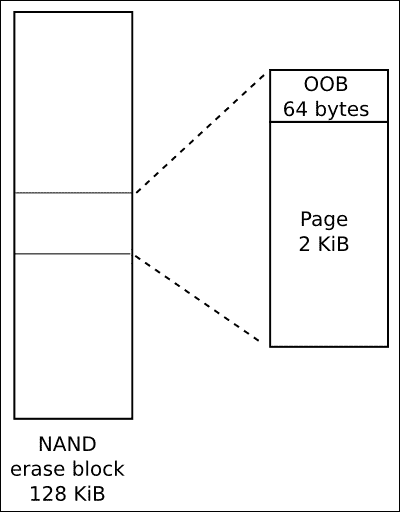
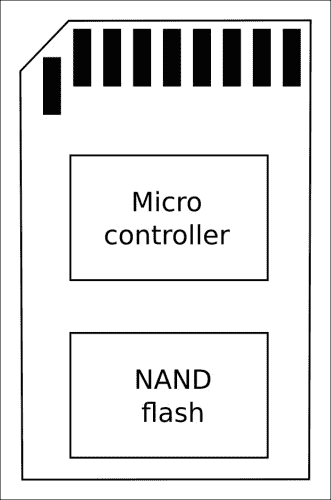
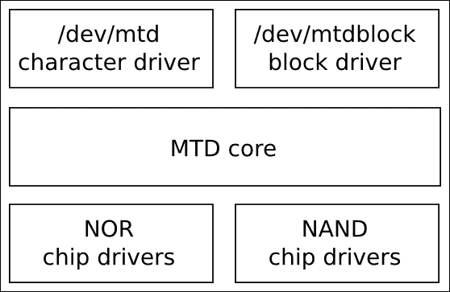
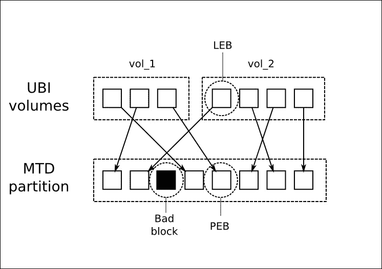
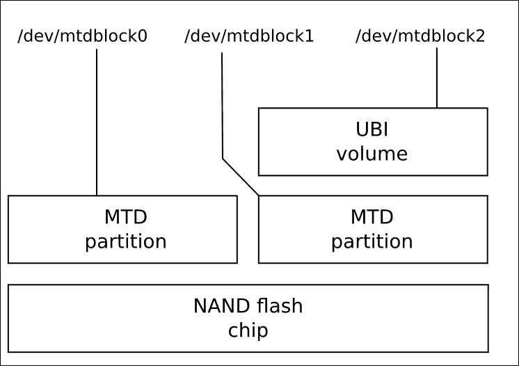
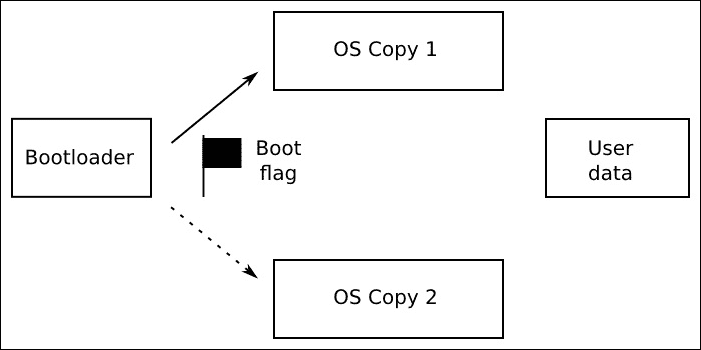
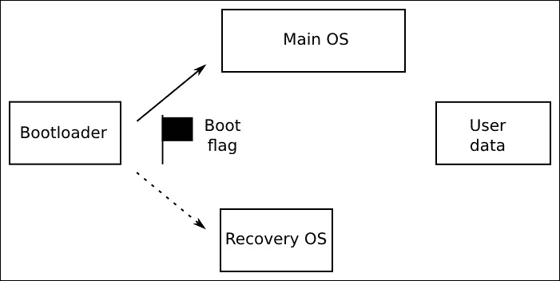

# 第七章：创建存储策略

嵌入式设备的大容量存储选项对系统的其余部分在稳健性、速度和现场更新方法方面产生了巨大影响。

大多数设备以某种形式使用闪存存储器。随着存储容量从几十兆字节增加到几十吉字节，闪存存储器在过去几年中变得更加廉价。

在本章中，我将详细介绍闪存存储器背后的技术，以及不同的存储器组织如何影响必须管理它的低级驱动程序软件，包括 Linux 内存技术设备层 MTD。

对于每种闪存技术，都有不同的文件系统选择。我将描述在嵌入式设备上最常见的文件系统，并在一节中总结每种闪存类型的选择。

最后几节考虑了利用闪存存储器的最佳技术，研究了如何在现场更新设备，并将所有内容整合成一种连贯的存储策略。

# 存储选项

嵌入式设备需要存储器，它需要耗电少、物理上紧凑、稳固，并且在长达数十年的寿命内可靠。在几乎所有情况下，这意味着固态存储器，它在许多年前就已经引入了只读存储器（ROM），但在过去 20 年中一直是各种闪存存储器。在这段时间里，闪存存储器经历了几代，从 NOR 到 NAND 再到 eMMC 等托管闪存。

NOR 闪存价格昂贵，但可靠，并且可以映射到 CPU 地址空间，这使得可以直接从闪存中执行代码。NOR 闪存芯片容量较低，从几兆字节到大约一吉字节不等。

NAND 闪存存储器比 NOR 便宜得多，容量更大，范围从几十兆字节到几十吉字节。然而，它需要大量的硬件和软件支持，才能将其转化为有用的存储介质。

托管闪存存储器由一个或多个 NAND 闪存芯片与控制器组成，控制器处理闪存存储器的复杂性，并提供类似硬盘的硬件接口。吸引人的地方在于它可以减少驱动程序软件的复杂性，并使系统设计人员免受闪存技术的频繁变化的影响。SD 卡、eMMC 芯片和 USB 闪存驱动器属于这一类。几乎所有当前的智能手机和平板电脑都使用 eMMC 存储，这一趋势可能会在其他类别的嵌入式设备中继续发展。

在嵌入式系统中很少使用硬盘驱动器。一个例外是机顶盒和智能电视中的数字视频录制，这需要大量的存储空间和快速的写入时间。

在所有情况下，稳健性是最重要的：您希望设备在断电和意外重置的情况下能够引导并达到功能状态。您应该选择在这种情况下表现良好的文件系统。

## NOR 闪存

NOR 闪存芯片中的存储单元被排列成擦除块，例如 128 KiB。擦除块会将所有位设置为 1。它可以一次编程一个字（8、16 或 32 位，取决于数据总线宽度）。每次擦除循环都会轻微损坏存储单元，经过多次循环后，擦除块变得不可靠，无法再使用。芯片的最大擦除循环次数应该在数据表中给出，但通常在 10 万到 100 万次之间。

数据可以逐字读取。芯片通常被映射到 CPU 地址空间中，这意味着可以直接从 NOR 闪存中执行代码。这使得它成为放置引导加载程序代码的便利位置，因为它不需要除了硬连地址映射之外的任何初始化。支持 NOR 闪存的 SoC 具有配置，可以给出默认的内存映射，使其包含 CPU 的复位向量。

内核，甚至根文件系统，也可以位于闪存中，避免将它们复制到 RAM 中，从而创建具有小内存占用的设备。这种技术称为**原地执行**，或**XIP**。这是非常专业的，我在这里不会进一步讨论。本章末尾有一些参考资料。

NOR 闪存芯片有一个称为**通用闪存接口**或**CFI**的标准寄存器级接口，所有现代芯片都支持。

## NAND 闪存

NAND 闪存比 NOR 闪存便宜得多，并且容量更大。第一代 NAND 芯片以每个存储单元存储一个位，即现在所称的**SLC**或**单级单元**组织。后来的几代转向每个存储单元存储两位，即**多级单元**（**MLC**）芯片，现在转向每个存储单元存储三位，即**三级单元**（**TLC**）芯片。随着每个存储单元的位数增加，存储的可靠性降低，需要更复杂的控制器硬件和软件来进行补偿。

与 NOR 闪存一样，NAND 闪存被组织成擦除块，大小从 16 KiB 到 512 KiB 不等，再次擦除块会将所有位设置为 1。然而，块变得不可靠之前的擦除循环次数较低，对于 TLC 芯片通常只有 1K 次，而对于 SLC 则高达 100K 次。NAND 闪存只能以页面的形式读取和写入，通常为 2 或 4 KiB。由于它们无法逐字节访问，因此无法映射到地址空间，因此代码和数据必须在访问之前复制到 RAM 中。

与芯片之间的数据传输容易发生位翻转，可以使用纠错码进行检测和纠正。SLC 芯片通常使用简单的海明码，可以在软件中高效实现，并可以纠正页面读取中的单个位错误。MLC 和 TLC 芯片需要更复杂的编码，例如**BCH**（**Bose-Chaudhuri-Hocquenghem**），可以纠正每页高达 8 位的错误。这些需要硬件支持。

纠错码必须存储在某个地方，因此每页都有一个额外的内存区域，称为**带外**（**OOB**）区域，也称为备用区域。MLC 设计通常每 32 个字节的主存储空间有 1 个字节的 OOB，因此对于 2 KiB 页面设备，每页的 OOB 为 64 字节，对于 4 KiB 页面，则为 128 字节。MLC 和 TLC 芯片具有比例更大的 OOB 区域，以容纳更复杂的纠错码。下图显示了具有 128 KiB 擦除块和 2 KiB 页面的芯片的组织结构：



在生产过程中，制造商测试所有块，并标记任何失败的块，通过在每个块中的每个页面的 OOB 区域设置标志来实现。发现全新芯片以这种方式标记为坏的块高达 2%并不罕见。此外，在擦除循环限制达到之前，类似比例的块出现擦除错误是在规范内的。NAND 闪存驱动程序应该检测到这一点，并将其标记为坏块。

在 OOB 区域为坏块标志和 ECC 字节留出空间后，仍然有一些字节剩下。一些闪存文件系统利用这些空闲字节来存储文件系统元数据。因此，许多人对 OOB 区域的布局感兴趣：SoC ROM 引导代码、引导加载程序、内核 MTD 驱动程序、文件系统代码以及创建文件系统映像的工具。标准化程度不高，因此很容易出现这样的情况：引导加载程序使用无法被内核 MTD 驱动程序读取的 OOB 格式写入数据。您需要确保它们都达成一致。

访问 NAND 闪存芯片需要一个 NAND 闪存控制器，通常是 SoC 的一部分。您需要引导加载程序和内核中相应的驱动程序。NAND 闪存控制器处理与芯片的硬件接口，传输数据到和从页面，并可能包括用于纠错的硬件。

NAND 闪存芯片有一个称为**开放 NAND 闪存接口**（**ONFi**）的标准寄存器级接口，大多数现代芯片都遵循这一标准。请参阅[`www.onfi.org`](http://www.onfi.org)。

## 管理闪存

在操作系统中支持闪存存储的负担，尤其是 NAND 存储器，如果有一个明确定义的硬件接口和一个隐藏存储器复杂性的标准闪存控制器，那么负担就会减轻。这就是管理闪存存储器，它变得越来越普遍。实质上，它意味着将一个或多个闪存芯片与一个微控制器结合起来，提供一个与传统文件系统兼容的小扇区大小的理想存储设备。嵌入式系统中最重要的管理闪存类型是**安全数字**（**SD**）卡和嵌入式变体称为**eMMC**。

### 多媒体卡和安全数字卡

**多媒体卡**（**MMC**）于 1997 年由 SanDisk 和西门子推出，作为一种使用闪存存储的封装形式。不久之后，1999 年，SanDisk、松下和东芝创建了基于 MMC 的 SD 卡，增加了加密和数字版权管理（即安全部分）。两者都是为数码相机、音乐播放器和类似设备而设计的消费类电子产品。目前，SD 卡是消费类和嵌入式电子产品中主要的管理闪存形式，尽管加密功能很少被使用。SD 规范的更新版本允许更小的封装（mini SD 和 micro SD，通常写作 uSD）和更大的容量：高容量 SDHC，最高达 32GB，扩展容量 SDXC，最高达 2TB。

MMC 和 SD 卡的硬件接口非常相似，可以在全尺寸 SD 卡槽中使用全尺寸 MMC（但反之则不行）。早期版本使用 1 位**串行外围接口**（**SPI**）；更近期的卡使用 4 位接口。有一个用于读写 512 字节扇区内存的命令集。在封装内部有一个微控制器和一个或多个 NAND 闪存芯片，如下图所示：



微控制器实现命令集并管理闪存，执行闪存转换层的功能，如本章后面所述。它们预先格式化为 FAT 文件系统：SDSC 卡上为 FAT16，SDHC 上为 FAT32，SDXC 上为 exFAT。NAND 闪存芯片的质量和微控制器上的软件在卡片之间差异很大。有人质疑它们是否足够可靠，尤其是对于容易发生文件损坏的 FAT 文件系统。请记住，MMC 和 SD 卡的主要用途是相机、平板电脑和手机上的可移动存储。

### eMMC

**eMMC**或**嵌入式 MMC**只是 MMC 存储器的封装，可以焊接到主板上，使用 4 位或 8 位接口进行数据传输。但是，它们旨在用作操作系统的存储，因此组件能够执行该任务。芯片通常没有预先格式化任何文件系统。

### 其他类型的管理闪存

最早的管理闪存技术之一是**CompactFlash**（**CF**），使用**个人计算机存储卡国际协会**（**PCMCIA**）接口的子集。CF 通过并行 ATA 接口公开存储器，并在操作系统中显示为标准硬盘。它们在基于 x86 的单板计算机和专业视频和摄像设备中很常见。

我们每天使用的另一种格式是 USB 闪存驱动器。在这种情况下，通过 USB 接口访问内存，并且控制器实现 USB 大容量存储规范以及闪存转换层和与闪存芯片的接口。USB 大容量存储协议又基于 SCSI 磁盘命令集。与 MMC 和 SD 卡一样，它们通常预先格式化为 FAT 文件系统。它们在嵌入式系统中的主要用途是与个人电脑交换数据。

### 注意

对于受管理的闪存存储的选项列表的最新添加是**通用闪存存储**（**UFS**）。与 eMMC 一样，它被封装在安装在主板上的芯片中。它具有高速串行接口，可以实现比 eMMC 更高的数据速率。它支持 SCSI 磁盘命令集。

# 从引导加载程序访问闪存

在第三章中，*关于引导加载程序的一切*，我提到了引导加载程序需要从各种闪存设备加载内核二进制文件和其他映像，并且能够执行系统维护任务，如擦除和重新编程闪存。因此，引导加载程序必须具有支持您拥有的内存类型的读取、擦除和写入操作的驱动程序和基础设施，无论是 NOR、NAND 还是受管理的内存。我将在以下示例中使用 U-Boot；其他引导加载程序遵循类似的模式。

## U-Boot 和 NOR 闪存

U-Boot 在`drivers/mtd`中具有 NOR CFI 芯片的驱动程序，并具有`erase`命令来擦除内存和`cp.b`命令来逐字节复制数据，编程闪存。假设您有从 0x40000000 到 0x48000000 映射的 NOR 闪存，其中从 0x40040000 开始的 4MiB 是内核映像，那么您将使用这些 U-Boot 命令将新内核加载到闪存中：

```
U-Boot# tftpboot 100000 uImage
U-Boot# erase 40040000 403fffff
U-Boot# cp.b 100000 40040000 $(filesize)
```

前面示例中的变量`filesize`是由`tftpboot`命令设置为刚刚下载的文件的大小。

## U-Boot 和 NAND 闪存

对于 NAND 闪存，您需要一个针对 SoC 上的 NAND 闪存控制器的驱动程序，您可以在`drivers/mtd/nand`中找到。您可以使用`nand`命令来使用子命令`erase`、`write`和`read`来管理内存。此示例显示内核映像被加载到 RAM 的 0x82000000 处，然后从偏移 0x280000 开始放入闪存：

```
U-Boot# tftpboot 82000000 uImage
U-Boot# nand erase 280000 400000
U-Boot# nand write 82000000 280000 $(filesize)
```

U-Boot 还可以读取存储在 JFFS2、YAFFS2 和 UBIFS 文件系统中的文件。

## U-Boot 和 MMC、SD 和 eMMC

U-Boot 在`drivers/mmc`中具有几个 MMC 控制器的驱动程序。您可以在用户界面级别使用`mmc read`和`mmc write`来访问原始数据，这允许您处理原始内核和文件系统映像。

U-Boot 还可以从 MMC 存储器上的 FAT32 和 ext4 文件系统中读取文件。

# 从 Linux 访问闪存内存

原始 NOR 和 NAND 闪存由内存技术设备子系统（MTD）处理，该子系统提供了读取、擦除和写入闪存块的基本接口。对于 NAND 闪存，有处理 OOB 区域和识别坏块的功能。

对于受管理的闪存，您需要驱动程序来处理特定的硬件接口。MMC/SD 卡和 eMMC 使用 mmcblk 驱动程序；CompactFlash 和硬盘使用 SCSI 磁盘驱动程序 sd。USB 闪存驱动器使用 usb_storage 驱动程序以及 sd 驱动程序。

## 内存技术设备

**内存技术** **设备**（**MTD**）子系统由 David Woodhouse 于 1999 年创建，并在随后的几年中得到了广泛的发展。在本节中，我将集中讨论它处理的两种主要技术，NOR 和 NAND 闪存。

MTD 由三层组成：一组核心功能、一组各种类型芯片的驱动程序以及将闪存内存呈现为字符设备或块设备的用户级驱动程序，如下图所示：



芯片驱动程序位于最低级别，并与闪存芯片进行接口。对于 NOR 闪存芯片，只需要少量驱动程序，足以覆盖 CFI 标准和变体，以及一些现在大多已经过时的不符合标准的芯片。对于 NAND 闪存，您将需要一个用于所使用的 NAND 闪存控制器的驱动程序；这通常作为板支持包的一部分提供。在当前主线内核中的`drivers/mtd/nand`目录中有大约 40 个这样的驱动程序。

### MTD 分区

在大多数情况下，您会希望将闪存内存分成多个区域，例如为引导加载程序、内核映像或根文件系统提供空间。在 MTD 中，有几种指定分区大小和位置的方法，主要包括：

+   通过内核命令行使用`CONFIG_MTD_CMDLINE_PARTS`

+   通过设备树使用`CONFIG_MTD_OF_PARTS`

+   使用平台映射驱动程序

在第一种选项的情况下，要使用的内核命令行选项是`mtdparts`，在 Linux 源代码中在`drivers/mtd/cmdlinepart.c`中定义如下：

```
mtdparts=<mtddef>[;<mtddef]
<mtddef>  := <mtd-id>:<partdef>[,<partdef>]
<mtd-id>  := unique name for the chip
<partdef> := <size>[@<offset>][<name>][ro][lk]
<size>    := size of partition OR "-" to denote all remaining
             space
<offset>  := offset to the start of the partition; leave blank
             to follow the previous partition without any gap
<name>    := '(' NAME ')'
```

也许一个例子会有所帮助。假设您有一个 128MB 的闪存芯片，要分成五个分区。一个典型的命令行将是：

```
mtdparts=:512k(SPL)ro,780k(U-Boot)ro,128k(U-BootEnv),
4m(Kernel),-(Filesystem)
```

冒号`:`之前的第一个元素是`mtd-id`，它通过编号或者由板支持包分配的名称来标识闪存芯片。如果只有一个芯片，可以留空。如果有多个芯片，每个芯片的信息用分号`；`分隔。然后，对于每个芯片，有一个逗号分隔的分区列表，每个分区都有以字节、千字节`k`或兆字节`m`为单位的大小和括号中的名称。`ro`后缀使得分区对 MTD 是只读的，通常用于防止意外覆盖引导加载程序。对于芯片的最后一个分区，大小可以用破折号`-`替换，表示它应该占用所有剩余的空间。

您可以通过读取`/proc/mtd`来查看运行时的配置摘要：

```
# cat /proc/mtd
dev:    size   erasesize   name
mtd0: 00080000 00020000  "SPL"
mtd1: 000C3000 00020000  "U-Boot"
mtd2: 00020000 00020000  "U-BootEnv"
mtd3: 00400000 00020000  "Kernel"
mtd4: 07A9D000 00020000  "Filesystem"
```

在`/sys/class/mtd`中有关每个分区的更详细信息，包括擦除块大小和页面大小，并且可以使用`mtdinfo`进行很好地总结：

```
# mtdinfo /dev/mtd0
mtd0
Name:                           SPL
Type:                           nand
Eraseblock size:                131072 bytes, 128.0 KiB
Amount of eraseblocks:          4 (524288 bytes, 512.0 KiB)
Minimum input/output unit size: 2048 bytes
Sub-page size:                  512 bytes
OOB size:                       64 bytes
Character device major/minor:   90:0
Bad blocks are allowed:         true
Device is writable:             false
```

等效的分区信息可以在设备树的一部分中编写，如下所示：

```
nand@0,0 {
  #address-cells = <1>;
  #size-cells = <1>;
  partition@0 {
    label = "SPL";
    reg = <0 0x80000>;
  };
  partition@80000 {
    label = "U-Boot";
    reg = <0x80000 0xc3000>;
  };
  partition@143000 {
    label = "U-BootEnv";
    reg = <0x143000 0x20000>;
  };
  partition@163000 {
    label = "Kernel";
    reg = <0x163000 0x400000>;
  };
  partition@563000 {
    label = "Filesystem";
    reg = <0x563000 0x7a9d000>;
  };
};
```

第三种选择是将分区信息编码为`mtd_partition`结构中的平台数据，如从`arch/arm/mach-omap2/board-omap3beagle.c`中取出的此示例所示（NAND_BLOCK_SIZE 在其他地方定义为 128K）：

```
static struct mtd_partition omap3beagle_nand_partitions[] = {
  {
    .name           = "X-Loader",
    .offset         = 0,
    .size           = 4 * NAND_BLOCK_SIZE,
    .mask_flags     = MTD_WRITEABLE,    /* force read-only */
  },
  {
    .name           = "U-Boot",
    .offset         = 0x80000;
    .size           = 15 * NAND_BLOCK_SIZE,
    .mask_flags     = MTD_WRITEABLE,    /* force read-only */
  },
  {
    .name           = "U-Boot Env",
    .offset         = 0x260000;
    .size           = 1 * NAND_BLOCK_SIZE,
  },
  {
    .name           = "Kernel",
    .offset         = 0x280000;
    .size           = 32 * NAND_BLOCK_SIZE,
  },
  {
    .name           = "File System",
    .offset         = 0x680000;
    .size           = MTDPART_SIZ_FULL,
  },
};
```

### MTD 设备驱动程序

MTD 子系统的上层是一对设备驱动程序：

+   一个字符设备，主编号为 90。每个 MTD 分区号有两个设备节点，`N: /dev/mtdN`（*次编号=N*2*）和`/dev/mtdNro`（*次编号=(N*2 + 1)*）。后者只是前者的只读版本。

+   一个块设备，主编号为 31，次编号为 N。设备节点的形式为`/dev/mtdblockN`。

### MTD 字符设备，mtd

字符设备是最重要的：它们允许您将底层闪存内存作为字节数组进行访问，以便您可以读取和写入（编程）闪存。它还实现了一些`ioctl`函数，允许您擦除块并管理 NAND 芯片上的 OOB 区域。以下列表在`include/uapi/mtd/mtd-abi.h`中：

| IOCTL | 描述 |
| --- | --- |
| `MEMGETINFO` | 获取基本的 MTD 特性信息 |
| `MEMERASE` | 擦除 MTD 分区中的块 |
| `MEMWRITEOOB` | 写出页面的带外数据 |
| `MEMREADOOB` | 读取页面的带外数据 |
| `MEMLOCK` | 锁定芯片（如果支持） |
| `MEMUNLOCK` | 解锁芯片（如果支持） |
| `MEMGETREGIONCOUNT` | 获取擦除区域的数量：如果分区中有不同大小的擦除块，则为非零，这在 NOR 闪存中很常见，在 NAND 中很少见 |
| `MEMGETREGIONINFO` | 如果 `MEMGETREGIONCOUNT` 非零，可以用来获取每个区域的偏移量、大小和块数 |
| `MEMGETOOBSEL` | 已弃用 |
| `MEMGETBADBLOCK` | 获取坏块标志 |
| `MEMSETBADBLOCK` | 设置坏块标志 |
| `OTPSELECT` | 如果芯片支持，设置 OTP（一次可编程）模式 |
| `OTPGETREGIONCOUNT` | 获取 OTP 区域的数量 |
| `OTPGETREGIONINFO` | 获取有关 OTP 区域的信息 |
| `ECCGETLAYOUT` | 已弃用 |

有一组称为 `mtd-utils` 的实用程序，用于操作闪存内存，利用了这些 `ioctl` 函数。源代码可从 [`git.infradead.org/mtd-utils.git`](http://git.infradead.org/mtd-utils.git) 获取，并作为 Yocto 项目和 Buildroot 中的软件包提供。以下是基本工具。该软件包还包含了稍后将介绍的 JFFS2 和 UBI/UBIFS 文件系统的实用程序。对于这些工具中的每一个，MTD 字符设备是其中的一个参数：

+   **flash_erase**：擦除一系列块。

+   **flash_lock**：锁定一系列块。

+   **flash_unlock**：解锁一系列块。

+   **nanddump**：从 NAND 闪存中转储内存，可选择包括 OOB 区域。跳过坏块。

+   **nandtest**：用于 NAND 闪存的测试和诊断。

+   **nandwrite**：从数据文件向 NAND 闪存写入（编程），跳过坏块。

### 提示

在写入新内容之前，您必须始终擦除闪存内存：`flash_erase` 就是执行此操作的命令。

要编程 NOR 闪存，只需使用 `cp` 命令或类似命令将字节复制到 MTD 设备节点。

不幸的是，这在 NAND 存储器上不起作用，因为在第一个坏块处复制将失败。相反，应该使用 `nandwrite`，它会跳过任何坏块。要读取 NAND 存储器，应该使用 `nanddump`，它也会跳过坏块。

### MTD 块设备，mtdblock

mtdblock 驱动程序很少使用。它的目的是将闪存内存呈现为块设备，您可以使用它来格式化并挂载为文件系统。但是，它有严重的限制，因为它不处理 NAND 闪存中的坏块，不进行磨损平衡，也不处理文件系统块和闪存擦除块之间的大小不匹配。换句话说，它没有闪存转换层，这对于可靠的文件存储至关重要。 mtdblock 设备有用的唯一情况是在可靠的闪存内存（如 NOR）上挂载只读文件系统，例如 Squashfs。

### 提示

如果要在 NAND 闪存上使用只读文件系统，应该使用 UBI 驱动程序，如本章后面所述。

### 将内核 oops 记录到 MTD

内核错误，或者 oopsies，通常通过 `klogd` 和 `syslogd` 守护进程记录到循环内存缓冲区或文件中。重启后，如果是环形缓冲区，日志将会丢失，即使是文件，系统崩溃前可能也没有正确写入。

### 提示

更可靠的方法是将 oops 和内核恐慌写入 MTD 分区作为循环日志缓冲区。您可以通过 `CONFIG_MTD_OOPS` 启用它，并在内核命令行中添加 `console=ttyMTDN`，其中 `N` 是要将消息写入的 MTD 设备编号。

### 模拟 NAND 存储器

NAND 模拟器使用系统 RAM 模拟 NAND 芯片。主要用途是测试必须了解 NAND 的代码，而无法访问物理 NAND 存储器。特别是，模拟坏块、位翻转和其他错误的能力允许您测试难以使用真实闪存内存进行练习的代码路径。有关更多信息，最好的地方是查看代码本身，其中详细描述了您可以配置驱动程序的方式。代码位于 `drivers/mtd/nand/nandsim.c`。使用内核配置 `CONFIG_MTD_NAND_NANDSIM` 启用它。

## MMC 块驱动程序

MMC/SD 卡和 eMMC 芯片使用 mmcblk 块驱动程序进行访问。您需要一个与您使用的 MMC 适配器匹配的主机控制器，这是板支持包的一部分。驱动程序位于 Linux 源代码中的`drivers/mmc/host`中。

MMC 存储使用分区表进行分区，方式与硬盘完全相同，使用 fdisk 或类似的实用程序。

# 闪存内存的文件系统

在有效利用闪存内存进行大容量存储时存在几个挑战：擦除块和磁盘扇区大小不匹配，每个擦除块的擦除周期有限，以及 NAND 芯片上需要坏块处理。这些差异通过**全局闪存转换层**或**FTL**来解决。

## 闪存转换层

闪存转换层具有以下特点：

+   **子分配**：文件系统最适合使用小的分配单元，传统上是 512 字节扇区。这比 128 KiB 或更大的闪存擦除块要小得多。因此，必须将擦除块细分为更小的单元，以避免浪费大量空间。

+   **垃圾收集**：子分配的一个结果是，文件系统在使用一段时间后，擦除块将包含好数据和陈旧数据的混合。由于我们只能释放整个擦除块，因此重新获取空闲空间的唯一方法是将好数据合并到一个位置并将现在空的擦除块返回到空闲列表中：这就是垃圾收集，通常作为后台线程实现。

+   **磨损平衡**：每个块的擦除周期都有限制。为了最大限度地延长芯片的寿命，重要的是移动数据，使每个块大致相同次数地擦除。

+   **坏块处理**：在 NAND 闪存芯片上，您必须避免使用任何标记为坏的块，并且如果无法擦除，则将好块标记为坏。

+   **稳健性**：嵌入式设备可能会突然断电或重置，因此任何文件系统都应该能够在没有损坏的情况下应对，通常是通过包含事务日志或日志来实现。

部署闪存转换层有几种方法：

+   **在文件系统中**：与 JFFS2、YAFFS2 和 UBIFS 一样

+   **在块设备驱动程序中**：UBI 驱动程序实现了闪存转换层的一些方面，UBIFS 依赖于它

+   **在设备控制器中**：与托管闪存设备一样

当闪存转换层位于文件系统或块驱动程序中时，代码是内核的一部分，因此是开源的，这意味着我们可以看到它的工作方式，并且我们可以期望它会随着时间的推移而得到改进。另一方面，FTL 位于托管闪存设备中；它被隐藏起来，我们无法验证它是否按照我们的期望工作。不仅如此，将 FTL 放入磁盘控制器意味着它错过了文件系统层保存的信息，比如哪些扇区属于已删除且不再包含有用数据的文件。后一个问题通过在文件系统和设备之间添加传递此信息的命令来解决，我将在后面的`TRIM`命令部分中描述，但代码可见性的问题仍然存在。如果您使用托管闪存，您只需选择一个您可以信任的制造商。

# NOR 和 NAND 闪存内的文件系统

要将原始闪存芯片用于大容量存储，您必须使用了解底层技术特性的文件系统。有三种这样的文件系统：

+   **日志闪存文件系统 2，JFFS2**：这是 Linux 的第一个闪存文件系统，至今仍在使用。它适用于 NOR 和 NAND 存储器，但在挂载时速度慢。

+   **另一种闪存文件系统 2，YAFFS2**：这类似于 JFFS2，但专门用于 NAND 闪存。它被 Google 采用为 Android 设备上首选的原始闪存文件系统。

+   **未排序块映像文件系统，UBIFS**: 这是最新的适用于 NOR 和 NAND 存储器的闪存感知文件系统，它与 UBI 块驱动程序一起使用。它通常比 JFFS2 或 YAFFS2 提供更好的性能，因此应该是新设计的首选解决方案。

所有这些都使用 MTD 作为闪存内存的通用接口。

## JFFS2

日志闪存文件系统始于 1999 年 Axis 2100 网络摄像机的软件。多年来，它是 Linux 上唯一的闪存文件系统，并已部署在成千上万种不同类型的设备上。今天，它并不是最佳选择，但我会首先介绍它，因为它展示了进化路径的开始。

JFFS2 是一种使用 MTD 访问闪存内存的日志结构文件系统。在日志结构文件系统中，更改被顺序写入闪存内存作为节点。一个节点可能包含对目录的更改，例如创建和删除的文件名，或者它可能包含对文件数据的更改。一段时间后，一个节点可能被后续节点中包含的信息取代，并成为过时的节点。

擦除块分为三种类型：

+   **空闲**: 它根本不包含任何节点

+   **干净**: 它只包含有效节点

+   **脏**: 它至少包含一个过时的节点

在任何时候，都有一个正在接收更新的块，称为打开块。如果断电或系统重置，唯一可能丢失的数据就是对打开块的最后一次写入。此外，节点在写入时会被压缩，增加了闪存芯片的有效存储容量，这对于使用昂贵的 NOR 闪存存储器非常重要。

当空闲块的数量低于阈值时，将启动一个垃圾收集器内核线程，扫描脏块并将有效节点复制到打开块，然后释放脏块。

同时，垃圾收集器提供了一种粗糙的磨损平衡，因为它将有效数据从一个块循环到另一个块。选择打开块的方式意味着只要它包含不时更改的数据，每个块被擦除的次数大致相同。有时会选择一个干净的块进行垃圾收集，以确保包含很少写入的静态数据的块也得到磨损平衡。

JFFS2 文件系统具有写穿缓存，这意味着写入的数据会同步写入闪存内存，就好像已经使用`-o sync`选项挂载一样。虽然提高了可靠性，但会增加写入数据的时间。小写入还存在另一个问题：如果写入的长度与节点头部的大小（40 字节）相当，开销就会很高。一个众所周知的特例是由 syslogd 产生的日志文件。

### 摘要节点

JFFS2 有一个主要的缺点：由于没有芯片上的索引，目录结构必须在挂载时通过从头到尾读取日志来推导。在扫描结束时，您可以得到有效节点的目录结构的完整图像，但所花费的时间与分区的大小成正比。挂载时间通常为每兆字节一秒左右，导致总挂载时间为几十秒或几百秒。

为了减少挂载时的扫描时间，摘要节点在 Linux 2.6.15 中成为一个选项。摘要节点是在关闭之前的打开擦除块的末尾写入的。摘要节点包含挂载时扫描所需的所有信息，从而减少了扫描期间需要处理的数据量。摘要节点可以将挂载时间缩短两到五倍，但会增加大约 5%的存储空间开销。它们可以通过内核配置`CONFIG_JFFS2_SUMMARY`启用。

### 干净标记

所有位设置为 1 的擦除块与已写入 1 的块无法区分，但后者尚未刷新其存储单元，直到擦除后才能再次编程。JFFS2 使用称为清洁标记的机制来区分这两种情况。成功擦除块后，将写入一个清洁标记，可以写入到块的开头或块的第一页的 OOB 区域。如果存在清洁标记，则必须是一个干净的块。

### 创建 JFFS2 文件系统

在运行时创建空的 JFFS2 文件系统就像擦除带有清洁标记的 MTD 分区然后挂载它一样简单。因为空白的 JFFS2 文件系统完全由空闲块组成，所以没有格式化步骤。例如，要格式化 MTD 分区 6，您可以在设备上输入以下命令：

```
# flash_erase -j /dev/mtd6 0 0
# mount -t jffs2 mtd6 /mnt
```

`-j`选项`flash_erase`添加清洁标记，并使用类型`jffs2`挂载分区作为空文件系统。请注意，要挂载的设备是给定为`mtd6`，而不是`/dev/mtd6`。或者，您可以提供块设备节点`/dev/mtdblock6`。这只是 JFFS2 的一个特殊之处。一旦挂载，您可以像任何文件系统一样处理它，并且在下次启动和挂载时，所有文件仍将存在。

您可以直接从开发系统的暂存区使用`mkfs.jffs2`以 JFFS2 格式写出文件系统图像，并使用`sumtool`添加摘要节点。这两者都是`mtd-utils`软件包的一部分。

例如，要为擦除块大小为 128 KB（0x20000）且具有摘要节点的 NAND 闪存设备创建`rootfs`中的文件的图像，您将使用以下两个命令：

```
$ mkfs.jffs2 -n -e 0x20000 -p -d ~/rootfs -o ~/rootfs.jffs2
$ sumtool -n -e 0x20000 -p -i ~/rootfs.jffs2 -o ~/rootfs-sum.jffs2

```

`-p`选项在图像文件末尾添加填充，使其成为整数倍的擦除块。`-n`选项抑制在图像中创建清洁标记，这对于 NAND 设备是正常的，因为清洁标记在 OOB 区域中。对于 NOR 设备，您可以省略`-n`选项。您可以使用`mkfs.jffs2`的设备表通过添加`-D`[设备表]来设置文件的权限和所有权。当然，Buildroot 和 Yocto Project 将为您完成所有这些工作。

您可以从引导加载程序将图像编程到闪存中。例如，如果您已将文件系统图像加载到 RAM 的地址 0x82000000，并且希望将其加载到从闪存芯片开始的 0x163000 字节处的闪存分区，并且长度为 0x7a9d000 字节，则 U-Boot 命令将是：

```
nand erase clean 163000 7a9d000
nand write 82000000 163000 7a9d000
```

您可以使用 mtd 驱动程序从 Linux 执行相同的操作：

```
# flash_erase -j /dev/mtd6 0 0
# nandwrite /dev/mtd6 rootfs-sum.jffs2
```

要使用 JFFS2 根文件系统进行引导，您需要在内核命令行上传递`mtdblock`设备用于分区和根`fstype`，因为 JFFS2 无法自动检测：

```
root=/dev/mtdblock6 rootfstype=jffs2
```

## YAFFS2

YAFFS 文件系统是由 Charles Manning 于 2001 年开始编写的，专门用于处理当时 JFFS2 无法处理的 NAND 闪存芯片。后来的更改以处理更大（2 KiB）的页面大小导致了 YAFFS2。YAFFS 的网站是[`www.yaffs.net`](http://www.yaffs.net)。

YAFFS 也是一个遵循与 JFFS2 相同设计原则的日志结构文件系统。不同的设计决策意味着它具有更快的挂载时间扫描，更简单和更快的垃圾收集，并且没有压缩，这加快了读写速度，但以存储的效率较低为代价。

YAFFS 不仅限于 Linux；它已被移植到各种操作系统。它具有双重许可证：GPLv2 与 Linux 兼容，以及其他操作系统的商业许可证。不幸的是，YAFFS 代码从未合并到主线 Linux 中，因此您将不得不像下面的代码所示一样对内核进行补丁。

要获取 YAFFS2 并对内核进行补丁，您可以：

```
$ git clone git://www.aleph1.co.uk/yaffs2
$ cd yaffs2
$ ./patch-ker.sh c m <path to your link source>

```

然后，使用`CONFIG_YAFFS_YAFFS2`配置内核。

### 创建 YAFFS2 文件系统

与 JFFS2 一样，要在运行时创建 YAFFS2 文件系统，您只需要擦除分区并挂载它，但请注意，在这种情况下，不要启用清除标记：

```
# flash_erase /dev/mtd/mtd6 0 0
# mount -t yaffs2 /dev/mtdblock6 /mnt
```

要创建文件系统映像，最简单的方法是使用[`code.google.com/p/yaffs2utils`](https://code.google.com/p/yaffs2utils)中的`mkyaffs2`工具，使用以下命令：

```
$ mkyaffs2 -c 2048 -s 64 rootfs rootfs.yaffs2

```

这里`-c`是页面大小，`-s`是 OOB 大小。有一个名为`mkyaffs2image`的工具，它是 YAFFS 代码的一部分，但它有一些缺点。首先，页面和 OOB 大小在源代码中是硬编码的：如果内存与默认值 2,048 和 64 不匹配，则必须编辑并重新编译。其次，OOB 布局与 MTD 不兼容，MTD 使用前两个字节作为坏块标记，而`mkyaffs2image`使用这些字节来存储部分 YAFFS 元数据。

在 Linux shell 提示符下将图像复制到 MTD 分区，请按照以下步骤操作：

```
# flash_erase /dev/mtd6 0 0
# nandwrite -a /dev/mtd6 rootfs.yaffs2
```

要使用 YAFFS2 根文件系统启动，请将以下内容添加到内核命令行：

```
root=/dev/mtdblock6 rootfstype=yaffs2

```

## UBI 和 UBIFS

**未排序的块图像**（**UBI**）驱动程序是闪存的卷管理器，负责处理坏块处理和磨损平衡。它是由 Artem Bityutskiy 实现的，并首次出现在 Linux 2.6.22 中。与此同时，诺基亚的工程师们正在开发一种可以利用 UBI 功能的文件系统，他们称之为 UBIFS；它出现在 Linux 2.6.27 中。以这种方式拆分闪存转换层使代码更加模块化，并且还允许其他文件系统利用 UBI 驱动程序，我们稍后将看到。

### UBI

UBI 通过将**物理擦除块**（**PEB**）映射到**逻辑擦除块**（**LEB**）来为闪存芯片提供理想化的可靠视图。坏块不会映射到 LEB，因此不会被使用。如果块无法擦除，则将其标记为坏块并从映射中删除。UBI 在 LEB 的标头中保留了每个 PEB 被擦除的次数，并更改映射以确保每个 PEB 被擦除相同次数。

UBI 通过 MTD 层访问闪存。作为额外功能，它可以将 MTD 分区划分为多个 UBI 卷，从而以以下方式改善磨损平衡。想象一下，您有两个文件系统，一个包含相当静态的数据，例如根文件系统，另一个包含不断变化的数据。如果它们存储在单独的 MTD 分区中，磨损平衡只对第二个产生影响，而如果您选择将它们存储在单个 MTD 分区中的两个 UBI 卷中，磨损平衡将在存储的两个区域上进行，并且闪存的寿命将增加。以下图表说明了这种情况：



通过这种方式，UBI 满足了闪存转换层的两个要求：磨损平衡和坏块处理。

要为 UBI 准备 MTD 分区，不要像 JFFS2 和 YAFFS2 一样使用`flash_erase`，而是使用`ubiformat`实用程序，它保留存储在 PED 标头中的擦除计数。 `ubiformat`需要知道 IO 的最小单位，对于大多数 NAND 闪存芯片来说，这是页面大小，但是一些芯片允许以半页或四分之一页的子页进行读写。有关详细信息，请参阅芯片数据表，如果有疑问，请使用页面大小。此示例使用 2,048 字节的页面大小准备`mtd6`：

```
# ubiformat /dev/mtd6 -s 2048
```

您可以使用`ubiattach`命令在已准备好的 MTD 分区上加载 UBI 驱动程序：

```
# ubiattach -p /dev/mtd6 -O 2048
```

这将创建设备节点`/dev/ubi0`，通过它可以访问 UBI 卷。您可以多次使用`ubiattach`来处理其他 MTD 分区，在这种情况下，它们可以通过`/dev/ubi1`，`/dev/ubi2`等进行访问。

PEB 到 LEB 的映射在附加阶段加载到内存中，这个过程需要的时间与 PEB 的数量成正比，通常需要几秒钟。在 Linux 3.7 中添加了一个名为 UBI fastmap 的新功能，它会定期将映射检查点到闪存中，从而减少了附加时间。内核配置选项是`CONFIG_MTD_UBI_FASTMAP`。

在`ubiformat`后第一次附加到 MTD 分区时，不会有卷。您可以使用`ubimkvol`创建卷。例如，假设您有一个 128MB 的 MTD 分区，并且您想要使用具有 128 KB 擦除块和 2 KB 页面的芯片将其分成 32 MB 和 96 MB 两个卷：

```
# ubimkvol /dev/ubi0 -N vol_1 -s 32MiB
# ubimkvol /dev/ubi0 -N vol_2 -s 96MiB
```

现在，您有设备节点`/dev/ubi0_0`和`/dev/ubi0_1`。您可以使用`ubinfo`确认情况：

```
# ubinfo -a /dev/ubi0
ubi0
Volumes count:                           2
Logical eraseblock size:                 15360 bytes, 15.0 KiB
Total amount of logical eraseblocks:     8192 (125829120 bytes, 120.0 MiB)
Amount of available logical eraseblocks: 0 (0 bytes)
Maximum count of volumes                 89
Count of bad physical eraseblocks:       0
Count of reserved physical eraseblocks:  160
Current maximum erase counter value:     1
Minimum input/output unit size:          512 bytes
Character device major/minor:            250:0
Present volumes:                         0, 1
Volume ID:   0 (on ubi0)
Type:        dynamic
Alignment:   1
Size:        2185 LEBs (33561600 bytes, 32.0 MiB)
State:       OK
Name:        vol_1
Character device major/minor: 250:1
-----------------------------------
Volume ID:   1 (on ubi0)
Type:        dynamic
Alignment:   1
Size:        5843 LEBs (89748480 bytes, 85.6 MiB)
State:       OK
Name:        vol_2
Character device major/minor: 250:2
```

请注意，由于每个 LEB 都有一个头部来包含 UBI 使用的元信息，因此 LEB 比 PEB 小一个页面。例如，一个 PEB 大小为 128 KB，页面大小为 2 KB 的芯片将具有 126 KB 的 LEB。这是您在创建 UBIFS 映像时需要的重要信息。

### UBIFS

UBIFS 使用 UBI 卷创建一个稳健的文件系统。它添加了子分配和垃圾收集以创建一个完整的闪存转换层。与 JFFS2 和 YAFFS2 不同，它将索引信息存储在芯片上，因此挂载速度很快，尽管不要忘记预先附加 UBI 卷可能需要相当长的时间。它还允许像普通磁盘文件系统一样进行写回缓存，这意味着写入速度更快，但通常的问题是在断电事件中，未从缓存刷新到闪存内存的数据可能会丢失。您可以通过谨慎使用`fsync(2)`和`fdatasync(2)`函数来解决这个问题，在关键点强制刷新文件数据。

UBIFS 具有用于断电快速恢复的日志。日志占用一些空间，通常为 4 MiB 或更多，因此 UBIFS 不适用于非常小的闪存设备。

创建 UBI 卷后，您可以使用卷的设备节点`/dev/ubi0_0`进行挂载，或者使用整个分区的设备节点加上卷名称进行挂载，如下所示：

```
# mount -t ubifs ubi0:vol_1 /mnt
```

为 UBIFS 创建文件系统映像是一个两阶段的过程：首先使用`mkfs.ubifs`创建一个 UBIFS 映像，然后使用`ubinize`将其嵌入到 UBI 卷中。

对于第一阶段，`mkfs.ubifs`需要使用`-m`指定页面大小，使用`-e`指定 UBI LEB 的大小，记住 LEB 通常比 PEB 短一个页面，使用`-c`指定卷中擦除块的最大数量。如果第一个卷是 32 MiB，擦除块是 128 KiB，那么擦除块的数量是 256。因此，要获取目录 rootfs 的内容并创建一个名为`rootfs.ubi`的 UBIFS 映像，您需要输入以下内容：

```
$ mkfs.ubifs -r rootfs -m 2048 -e 126KiB -c 256 -o rootfs.ubi

```

第二阶段需要您为`ubinize`创建一个配置文件，描述映像中每个卷的特性。帮助页面（`ubinize -h`）提供了格式的详细信息。此示例创建了两个卷，`vol_1`和`vol_2`：

```
[ubifsi_vol_1]
mode=ubi
image=rootfs.ubi
vol_id=0
vol_name=vol_1
vol_size=32MiB
vol_type=dynamic

[ubifsi_vol_2]
mode=ubi
image=data.ubi
vol_id=1
vol_name=vol_2
vol_type=dynamic
vol_flags=autoresize
```

第二卷有一个自动调整大小的标志，因此会扩展以填满 MTD 分区上的剩余空间。只有一个卷可以有这个标志。根据这些信息，`ubinize`将创建一个由`-o`参数命名的映像文件，其 PEB 大小为`-p`，页面大小为`-m`，子页面大小为`-s`：

```
$ ubinize -o ~/ubi.img -p 128KiB -m 2048 -s 512 ubinize.cfg

```

要在目标上安装此映像，您需要在目标上输入以下命令：

```
# ubiformat /dev/mtd6 -s 2048
# nandwrite /dev/mtd6 /ubi.img
# ubiattach -p /dev/mtd6 -O 2048
```

如果要使用 UBIFS 根文件系统进行引导，您需要提供以下内核命令行参数：

```
ubi.mtd=6 root=ubi0:vol_1 rootfstype=ubifs
```

# 受管理的闪存文件系统

随着受管理的闪存技术的发展，特别是 eMMC，我们需要考虑如何有效地使用它。虽然它们看起来具有与硬盘驱动器相同的特性，但一些 NAND 闪存芯片具有大擦除块的限制，擦除周期有限，并且坏块处理能力有限。当然，在断电事件中我们需要稳健性。

可以使用任何正常的磁盘文件系统，但我们应该尽量选择一个减少磁盘写入并在非计划关闭后快速重启的文件系统，通常由日志提供。

## Flashbench

为了最佳利用底层闪存，您需要了解擦除块大小和页大小。通常制造商不会公布这些数字，但可以通过观察芯片或卡的行为来推断出它们。

Flashbench 就是这样一个工具。最初是由 Arnd Bergman 编写的，可以在[LWN 文章](http://lwn.net/Articles/428584)中找到。您可以从[`github.com/bradfa/flashbench`](https://github.com/bradfa/flashbench)获取代码。

这是一个典型的 SanDisk GiB SDHC 卡上的运行：

```
$ sudo ./flashbench -a  /dev/mmcblk0 --blocksize=1024
align 536870912 pre 4.38ms  on 4.48ms   post 3.92ms  diff 332µs
align 268435456 pre 4.86ms  on 4.9ms    post 4.48ms  diff 227µs
align 134217728 pre 4.57ms  on 5.99ms   post 5.12ms  diff 1.15ms
align 67108864  pre 4.95ms  on 5.03ms   post 4.54ms  diff 292µs
align 33554432  pre 5.46ms  on 5.48ms   post 4.58ms  diff 462µs
align 16777216  pre 3.16ms  on 3.28ms   post 2.52ms  diff 446µs
align 8388608   pre 3.89ms  on 4.1ms    post 3.07ms  diff 622µs
align 4194304   pre 4.01ms  on 4.89ms   post 3.9ms   diff 940µs
align 2097152   pre 3.55ms  on 4.42ms   post 3.46ms  diff 917µs
align 1048576   pre 4.19ms  on 5.02ms   post 4.09ms  diff 876µs
align 524288    pre 3.83ms  on 4.55ms   post 3.65ms  diff 805µs
align 262144    pre 3.95ms  on 4.25ms   post 3.57ms  diff 485µs
align 131072    pre 4.2ms   on 4.25ms   post 3.58ms  diff 362µs
align 65536     pre 3.89ms  on 4.24ms   post 3.57ms  diff 511µs
align 32768     pre 3.94ms  on 4.28ms   post 3.6ms   diff 502µs
align 16384     pre 4.82ms  on 4.86ms   post 4.17ms  diff 372µs
align 8192      pre 4.81ms  on 4.83ms   post 4.16ms  diff 349µs
align 4096      pre 4.16ms  on 4.21ms   post 4.16ms  diff 52.4µs
align 2048      pre 4.16ms  on 4.16ms   post 4.17ms  diff 9ns

```

Flashbench 在各种 2 的幂边界之前和之后读取块，本例中为 1,024 字节。当您跨越页或擦除块边界时，边界后的读取时间会变长。最右边的列显示了差异，这是最有趣的部分。从底部开始阅读，4 KiB 处有一个很大的跳跃，这很可能是一个页的大小。在 8 KiB 处，从 52.4µs 跳到 349µs 有第二个跳跃。这是相当常见的，表明卡可以使用多平面访问同时读取两个 4 KiB 页。除此之外，差异不太明显，但在 512 KiB 处有一个明显的跳跃，从 485µs 跳到 805µs，这可能是擦除块的大小。考虑到被测试的卡相当古老，这些是您可以预期的数字。

## 丢弃和 TRIM

通常，当您删除文件时，只有修改后的目录节点被写入存储，而包含文件内容的扇区保持不变。当闪存转换层位于磁盘控制器中时，例如受管理的闪存，它不知道这组磁盘扇区不再包含有用数据，因此最终会复制过时的数据。

在过去几年中，传递有关已删除扇区的事务的添加已改善了情况。SCSI 和 SATA 规范有一个`TRIM`命令，MMC 有一个类似的命令称为`ERASE`。在 Linux 中，此功能称为`discard`。

要使用`discard`，您需要一个支持它的存储设备 - 大多数当前的 eMMC 芯片都支持 - 以及与之匹配的 Linux 设备驱动程序。您可以通过查看`/sys/block/<block device>/queue/`中的块系统队列参数来检查。感兴趣的是以下内容：

+   `discard_granularity`：设备内部分配单元的大小

+   `discard_max_bytes`：一次可以丢弃的最大字节数

+   `discard_zeroes_data`：如果为`1`，丢弃的数据将被设置为零

如果设备或设备驱动程序不支持`discard`，这些值都将设置为零。以下是您将从 BeagleBone Black 上的 eMMC 芯片看到的参数：

```
# grep -s "" /sys/block/mmcblk0/queue/discard_*
/sys/block/mmcblk0/queue/discard_granularity:2097152
/sys/block/mmcblk0/queue/discard_max_bytes:2199023255040
/sys/block/mmcblk0/queue/discard_zeroes_data:1
```

在内核文档文件`Documentation/block/queue-sysfs.txt`中有更多信息。

您可以通过在`mount`命令中添加选项`-o discard`来在挂载文件系统时启用`discard`。ext4 和 F2FS 都支持它。

### 提示

在使用`-o discard mount`选项之前，请确保存储设备支持`discard`，否则可能会发生数据丢失。

还可以独立于分区的挂载方式从命令行强制执行`discard`，使用的是`util-linux`软件包的`fstrim`命令。通常，您可以定期运行此命令，例如每周运行一次，以释放未使用的空间。`fstrim`在挂载的文件系统上操作，因此要修剪根文件系统`/`，您需要输入以下内容：

```
# fstrim -v /
/: 2061000704 bytes were trimmed
```

上面的例子使用了冗长选项`-v`，因此打印出了潜在释放的字节数。在这种情况下，2,061,000,704 是文件系统中的大约可用空间，因此这是可能被释放的最大存储量。

## Ext4

扩展文件系统 ext 自 1992 年以来一直是 Linux 桌面的主要文件系统。当前版本 ext4 非常稳定，经过了充分测试，并且具有使从意外关机中恢复变得快速且基本无痛的日志。它是受控闪存设备的不错选择，您会发现它是 Android 设备的首选文件系统，这些设备具有 eMMC 存储。如果设备支持`discard`，您应该使用选项`-o discard`进行挂载。

要在运行时格式化和创建 ext4 文件系统，您需要输入以下命令：

```
# mkfs.ext4 /dev/mmcblk0p2
# mount -t ext4 -o discard /dev/mmcblk0p1 /mnt
```

要创建文件系统镜像，可以使用`genext2fs`实用程序，可从[`genext2fs.sourceforge.net`](http://genext2fs.sourceforge.net)获取。在这个例子中，我已经用`-B`指定了块大小，并用`-b`指定了镜像中的块数：

```
$ genext2fs -B 1024 -b 10000 -d rootfs rootfs.ext4

```

`genext2fs`可以利用设备表来设置文件权限和所有权，如第五章中所述，*构建根文件系统*，使用`-D [文件表]`。

顾名思义，这实际上会生成一个`.ext2`格式的镜像。您可以使用`tune2fs`进行升级，具体命令选项的详细信息在`tune2fs`的主页面中。

```
$ tune2fs -j -J size=1 -O filetype,extents,uninit_bg,dir_index rootfs.ext4
$ e2fsck -pDf rootfs.ext4

```

Yocto 项目和 Buildroot 在创建`.ext4`格式的镜像时使用完全相同的步骤。

虽然日志对于可能在没有警告的情况下断电的设备是一种资产，但它确实会给每个写事务增加额外的写周期，从而耗尽闪存。如果设备是由电池供电的，特别是如果电池无法移除，那么意外断电的可能性很小，因此您可能希望不使用日志。

## F2FS

**Flash-Friendly File System**，**F2FS**，是为受控闪存设备设计的日志结构文件系统，特别适用于 eMMC 和 SD。它由三星编写，并在 3.8 版中合并到主线 Linux。它被标记为实验性，表明它尚未被广泛部署，但似乎一些 Android 设备正在使用它。

F2FS 考虑了页面和擦除块大小，并尝试在这些边界上对齐数据。日志格式在断电时具有弹性，并且具有良好的写入性能，在某些测试中显示出比 ext4 的两倍改进。在内核文档中有 F2FS 设计的良好描述，位于`Documentation/filesystems/f2fs.txt`，并且在本章末尾有参考资料。

`mfs2.fs2`实用程序使用标签`-l`创建一个空的 F2FS 文件系统：

```
# mkfs.f2fs -l rootfs /dev/mmcblock0p1
# mount -t f2fs /dev/mmcblock0p1 /mnt
```

目前还没有工具可以离线创建 F2FS 文件系统镜像。

## FAT16/32

老的 Microsoft 文件系统，FAT16 和 FAT32，作为大多数操作系统理解的常见格式，仍然很重要。当你购买 SD 卡或 USB 闪存驱动器时，它几乎肯定是以 FAT32 格式格式化的，并且在某些情况下，卡上的微控制器被优化为 FAT32 访问模式。此外，一些引导 ROM 需要 FAT 分区用于第二阶段引导加载程序，例如 TI OMAP 芯片。然而，FAT 格式绝对不适合存储关键文件，因为它们容易损坏并且对存储空间利用不佳。

Linux 通过`msdos`文件系统支持 FAT16，通过`vfat`文件系统支持 FAT32 和 FAT16。在大多数情况下，您需要包括`vfat`驱动程序。然后，要挂载设备，比如第二个`mmc`硬件适配器上的 SD 卡，您需要输入以下命令：

```
# mount -t vfat /dev/mmcblock1p1 /mnt
```

过去，`vfat`驱动程序曾存在许可问题，可能侵犯了 Microsoft 持有的专利。

FAT32 对设备大小有 32 GiB 的限制。容量更大的设备可以使用 Microsoft exFAT 格式进行格式化，并且这是 SDXC 卡的要求。没有 exFAT 的内核驱动程序，但可以通过用户空间 FUSE 驱动程序来支持。由于 exFAT 是 Microsoft 专有的，如果您在设备上支持这种格式，肯定会有许可证方面的影响。

# 只读压缩文件系统

如果存储空间不够，压缩数据是有用的。JFFS2 和 UBIFS 默认情况下都进行即时数据压缩。但是，如果文件永远不会被写入，通常情况下是根文件系统，您可以通过使用只读的压缩文件系统来实现更好的压缩比。Linux 支持几种这样的文件系统：`romfs`、`cramfs`和`squashfs`。前两者现在已经过时，因此我只描述`squashfs`。

## squashfs

`squashfs`是由 Phillip Lougher 于 2002 年编写的，作为`cramfs`的替代品。它作为一个内核补丁存在了很长时间，最终在 2009 年的 Linux 主线版本 2.6.29 中合并。它非常容易使用：您可以使用`mksquashfs`创建一个文件系统映像，并将其安装到闪存存储器中：

```
$ mksquashfs rootfs rootfs.squashfs

```

由于生成的文件系统是只读的，因此没有机制可以在运行时修改任何文件。更新`squashfs`文件系统的唯一方法是擦除整个分区并编程一个新的映像。

`squashfs`不具备坏块感知功能，因此必须与可靠的闪存存储器一起使用，例如 NOR 闪存。它可以在 NAND 闪存上使用，只要您使用 UBI 在其上创建一个模拟的、可靠的 MTD 卷。您必须启用内核配置`CONFIG_MTD_UBI_BLOCK`，这将为每个 UBI 卷创建一个只读的 MTD 块设备。下图显示了两个 MTD 分区，每个分区都有相应的`mtdblock`设备。第二个分区还用于创建一个 UBI 卷，该卷作为第三个可靠的`mtdblock`设备公开，您可以将其用于任何不具备坏块感知功能的只读文件系统：



# 临时文件系统

总是有一些文件的生命周期很短，或者在重新启动后就不再重要。许多这样的文件被放在`/tmp`中，因此将这些文件保存在永久存储中是有意义的。

临时文件系统`tmpfs`非常适合这个目的。您可以通过简单地挂载`tmpfs`来创建一个临时的基于 RAM 的文件系统：

```
# mount -t tmpfs tmp_files /tmp
```

与`procfs`和`sysfs`一样，`tmpfs`没有与设备节点相关联，因此您必须在前面的示例中提供一个占位符字符串`tmp_files`。

使用的内存量会随着文件的创建和删除而增长和缩小。默认的最大大小是物理 RAM 的一半。在大多数情况下，如果`tmpfs`增长到那么大，那将是一场灾难，因此最好使用`-o size`参数对其进行限制。该参数可以以字节、KiB（`k`）、MiB（`m`）或 GiB（`g`）的形式给出，例如：

```
mount -t tmpfs -o size=1m tmp_files /tmp
```

除了`/tmp`之外，`/var`的一些子目录包含易失性数据，最好也使用`tmpfs`为它们创建一个单独的文件系统，或者更经济地使用符号链接。Buildroot 就是这样做的：

```
/var/cache -> /tmp
/var/lock ->  /tmp
/var/log ->   /tmp
/var/run ->   /tmp
/var/spool -> /tmp
/var/tmp ->   /tmp
```

在 Yocto 项目中，`/run`和`/var/volatile`是`tmpfs`挂载点，具有指向它们的符号链接，如下所示：

```
/tmp ->       /var/tmp
/var/lock ->  /run/lock
/var/log ->   /var/volatile/log
/var/run ->   /run
/var/tmp ->   /var/volatile/tmp
```

# 使根文件系统只读

您需要使目标设备能够在发生意外事件时存活，包括文件损坏，并且仍然能够引导并实现至少最低级别的功能。使根文件系统只读是实现这一目标的关键部分，因为它消除了意外覆盖。将其设置为只读很容易：在内核命令行中用`ro`替换`rw`，或者使用固有的只读文件系统，如`squashfs`。但是，您会发现有一些传统上是可写的文件和目录：

+   `/etc/resolv.conf`：此文件由网络配置脚本编写，用于记录 DNS 名称服务器的地址。这些信息是易失性的，因此您只需将其设置为指向临时目录的符号链接，例如`/etc/resolv.conf -> /var/run/resolv.conf`。

+   `/etc/passwd`：此文件与`/etc/group`、`/etc/shadow`和`/etc/gshadow`一起存储用户和组名称以及密码。它们需要像`resolv.conf`一样被符号链接到持久存储区域。

+   `/var/lib`：许多应用程序希望能够写入此目录并在此处保留永久数据。一种解决方案是在启动时将一组基本文件复制到`tmpfs`文件系统，然后通过将一系列命令绑定到新位置的`/var/lib`来将`/var/lib`绑定到新位置，将这些命令放入其中一个启动脚本中：

```
mkdir -p /var/volatile/lib
cp -a /var/lib/* /var/volatile/lib
mount --bind /var/volatile/lib /var/lib

```

+   `/var/log`：这是 syslog 和其他守护程序保存其日志的地方。通常，由于产生许多小的写入周期，将日志记录到闪存内存中是不可取的。一个简单的解决方案是使用`tmpfs`挂载`/var/log`，使所有日志消息都是易失性的。在`syslogd`的情况下，BusyBox 有一个版本，可以记录到循环环形缓冲区。

如果您正在使用 Yocto 项目，可以通过将`IMAGE_FEATURES = "read-only-rootfs"`添加到`conf/local.conf`或您的镜像配方来创建只读根文件系统。

# 文件系统选择

到目前为止，我们已经看过固态存储器背后的技术以及许多类型的文件系统。现在是总结选项的时候了。

在大多数情况下，您将能够将存储需求分为这三类：

+   **永久的、可读写的数据**：运行时配置、网络参数、密码、数据日志和用户数据

+   **永久的只读数据**：程序、库和配置文件是恒定的，例如根文件系统

+   **易失性数据**：临时存储，例如`/tmp`

读写存储的选择如下：

+   **NOR**：UBIFS 或 JFFS2

+   **NAND**：UBIFS、JFFS2 或 YAFFS2

+   **eMMC**：ext4 或 F2FS

### 注意

对于只读存储，您可以使用上述所有内容，并带有`ro`属性进行挂载。此外，如果要节省空间，可以在 NAND 闪存的情况下使用`squashfs`，使用 UBI `mtdblock`设备仿真来处理坏块。

最后，对于易失性存储，只有一种选择，即`tmpfs`。

# 现场更新

已经有几个广为人知的安全漏洞，包括 Heartbleed（OpenSSL 库中的一个错误）和 Shellshock（bash shell 中的一个错误），这两者都可能对当前部署的嵌入式 Linux 设备造成严重后果。光是出于这个原因，就非常希望有一种机制来更新现场设备，以便在出现安全问题时进行修复。还有其他很好的原因：部署其他错误修复和功能更新。

更新机制的指导原则是不应该造成任何伤害，要记住墨菲定律：如果有可能出错，迟早会出错。任何更新机制必须是：

+   **健壮**：它不能使设备无法操作。我将谈论原子更新；系统要么成功更新，要么根本不更新，并继续像以前一样运行。

+   **故障安全**：它必须能够优雅地处理中断的更新。

+   **安全**：它不能允许未经授权的更新，否则它将成为一种攻击机制。

通过复制要更新的内容的副本并在安全时切换到新副本来实现原子性。

故障安全性要求必须有一种机制来检测失败的更新，例如硬件看门狗，并且有一个已知的良好软件副本可以回退。

安全性可以通过本地和经过密码或 PIN 码认证的更新来实现。但是，如果更新是远程和自动的，就需要通过网络进行一定级别的认证。最终，您可能希望添加安全的引导加载程序和签名的更新二进制文件。

有些组件比其他组件更容易更新。引导加载程序非常难以更新，因为通常存在硬件约束，意味着只能有一个引导加载程序，因此如果更新失败就无法备份。另一方面，引导加载程序通常不是运行时错误的原因。最好的建议是避免在现场更新引导加载程序。

## 粒度：文件、软件包或镜像？

这是一个重要的问题，取决于您的整体系统设计和所需的健壮性水平。

文件更新可以是原子的：技术是将新内容写入同一文件系统中的临时文件，然后使用 POSIX `rename(2)`函数将其移动到旧文件上。它有效是因为重命名是保证原子性的。然而，这只是问题的一部分，因为文件之间会有依赖关系需要考虑。

在软件包（`RPM`，`dpkg`或`ipk`）级别进行更新是一个更好的选择，假设您有一个运行时软件包管理器。毕竟，这就是桌面发行版多年来一直在做的事情。软件包管理器有一个更新数据库，并可以跟踪已更新和未更新的内容。每个软件包都有一个更新脚本，旨在确保软件包更新是原子的。最大的优势是您可以轻松更新现有软件包，安装新软件包，并删除过时的软件包。如果您使用的是以只读方式挂载的根文件系统，则在更新时必须暂时重新挂载为读写，这会打开一个小的损坏窗口。

软件包管理器也有缺点。它们无法更新原始闪存中的内核或其他镜像。在设备部署并多次更新后，您可能会得到大量软件包和软件包版本的组合，这将使每个新的更新周期的质量保证变得更加复杂。在更新期间发生断电时，软件包管理器也无法保证安全。

第三个选项是更新整个系统镜像：内核、根文件系统、用户应用程序等。

## 原子镜像更新

为了使更新是原子的，我们需要两样东西：一个可以在更新期间使用的操作系统的第二个副本，以及引导加载程序中选择要加载的操作系统副本的机制。第二个副本可能与第一个完全相同，从而实现操作系统的完全冗余，或者它可能是一个专门用于更新主操作系统的小型操作系统。

在第一种方案中，有两份操作系统副本，每个副本由 Linux 内核、根文件系统和系统应用程序组成，如下图所示：



最初，引导标志未设置，因此引导加载副本 1。要安装更新，操作系统的更新程序将覆盖副本 2。完成后，它设置引导标志并重新启动。现在，引导加载新的操作系统。安装进一步更新时，副本 2 中的更新程序将覆盖副本 1，并清除引导标志，因此您在两个副本之间来回移动。

如果更新失败，引导标志不会更改，并且将使用上一个良好的操作系统。即使更新由多个组件组成，如内核镜像、DTB、根文件系统和系统应用程序文件系统，整个更新也是原子的，因为只有在所有更新完成时才会更新引导标志。

这种方案的主要缺点是需要存储两份操作系统的副本。

您可以通过保留一个纯粹用于更新主操作系统的最小操作系统来减少存储需求，如下图所示：



当您想要安装更新时，设置引导标志并重新启动。一旦恢复操作系统运行，它启动更新程序，覆盖主操作系统镜像。完成后，清除引导标志并再次重新启动，这次加载新的主操作系统。

恢复操作系统通常比主操作系统小得多，可能只有几兆字节，因此存储开销并不大。事实上，这是 Android 采用的方案。主操作系统有几百兆字节，但恢复模式操作系统只是一个简单的几兆字节的 ramdisk。

# 进一步阅读

以下资源提供了有关本章介绍的主题的更多信息：

+   *XIP：过去，现在...未来？*，*Vitaly Wool*，在 FOSDEM 2007 年的演示：[`archive.fosdem.org/2007/slides/devrooms/embedded/Vitaly_Wool_XIP.pdf`](https://archive.fosdem.org/2007/slides/devrooms/embedded/Vitaly_Wool_XIP.pdf)

+   *MTD 文档*：[`www.linux-mtd.infradead.org/doc/general.html`](http://www.linux-mtd.infradead.org/doc/general.html)

+   *使用廉价闪存驱动器优化 Linux*，*Arnd Bergmann*：[`lwn.net/Articles/428584/`](http://lwn.net/Articles/428584/)

+   *闪存存储卡设计*：[`wiki.linaro.org/WorkingGroups/KernelArchived/Projects/FlashCardSurvey`](https://wiki.linaro.org/WorkingGroups/KernelArchived/Projects/FlashCardSurvey)

+   *eMMC/SSD 文件系统调优方法*：[`elinux.org/images/b/b6/EMMC-SSD_File_System_Tuning_Methodology_v1.0.pdf`](http://elinux.org/images/b/b6/EMMC-SSD_File_System_Tuning_Methodology_v1.0.pdf)

+   *闪存友好的文件系统（F2FS）*：[`elinux.org/images/1/12/Elc2013_Hwang.pdf`](http://elinux.org/images/1/12/Elc2013_Hwang.pdf)

+   *f2fS 拆解*：[`lwn.net/Articles/518988/`](http://lwn.net/Articles/518988/)

+   *构建兼容 Murphy 的嵌入式 Linux 系统*，*Gilad Ben-Yossef*：[`www.kernel.org/doc/ols/2005/ols2005v1-pages-21-36.pdf`](https://www.kernel.org/doc/ols/2005/ols2005v1-pages-21-36.pdf)

# 总结

从一开始，闪存存储技术一直是嵌入式 Linux 的首选技术，多年来 Linux 已经获得了非常好的支持，从低级驱动程序到支持闪存的文件系统，最新的是 UBIFS。

然而，随着新的闪存技术推出的速度加快，要跟上高端变化变得更加困难。系统设计师越来越倾向于使用 eMMC 形式的托管闪存，以提供稳定的硬件和软件接口，独立于内部存储芯片。嵌入式 Linux 开发人员开始逐渐掌握这些新芯片。对于 ext4 和 F2FS 中的 TRIM 的支持已经很成熟，并且它正在慢慢地进入芯片本身。此外，出现了新的针对管理闪存优化的文件系统，比如 F2FS，这是一个值得欢迎的进步。

然而，事实仍然是，闪存存储技术与硬盘驱动器不同。你必须小心减少文件系统写入的次数 - 尤其是高密度 TLC 芯片可能只支持 1000 次擦除循环。

最后，在现场更新设备上存储的文件和图像时，有一个更新策略是至关重要的。其中一个关键部分是决定是否使用软件包管理器。软件包管理器可以给你灵活性，但不能提供完全可靠的更新解决方案。你的选择取决于方便性和稳健性之间的平衡。

下一章描述了如何通过设备驱动程序控制系统的硬件组件，包括内核中的驱动程序以及用户空间中控制硬件的程度。
