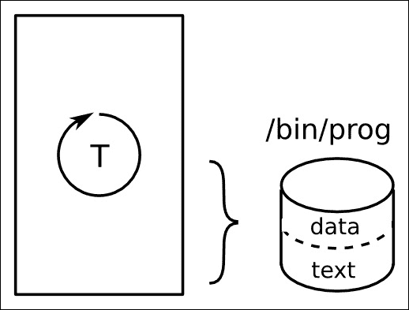
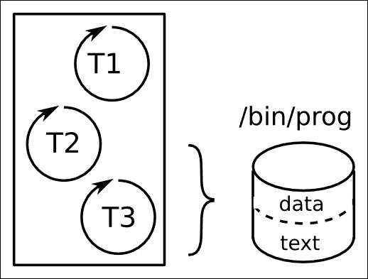
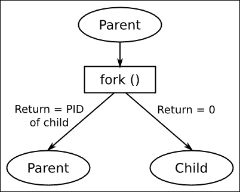
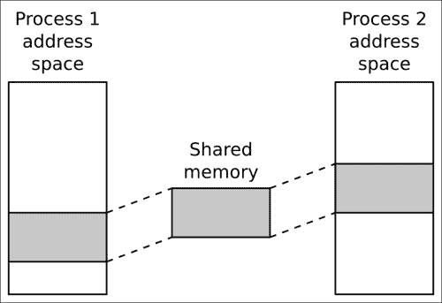

# 第十章。了解进程和线程

在前面的章节中，我们考虑了创建嵌入式 Linux 平台的各个方面。现在是时候开始了解如何使用该平台创建工作设备了。在本章中，我将讨论 Linux 进程模型的含义以及它如何包含多线程程序。我将探讨使用单线程和多线程进程的利弊。我还将研究调度，并区分时间共享和实时调度策略。

虽然这些主题与嵌入式计算无关，但对于嵌入式设备的设计者来说，了解这些主题非常重要。关于这个主题有很多好的参考书籍，其中一些我在本章末尾引用，但一般来说，它们并不考虑嵌入式用例。因此，我将集中讨论概念和设计决策，而不是函数调用和代码。

# 进程还是线程？

许多熟悉**实时操作系统**（RTOS）的嵌入式开发人员认为 Unix 进程模型很繁琐。另一方面，他们认为 RTOS 任务和 Linux 线程之间存在相似性，并倾向于使用一对一的映射将现有设计转移到线程。我曾多次看到整个应用程序都是使用包含 40 个或更多线程的一个进程来实现的设计。我想花一些时间考虑这是否是一个好主意。让我们从一些定义开始。

进程是一个内存地址空间和一个执行线程，如下图所示。地址空间对进程是私有的，因此在不同进程中运行的线程无法访问它。这种内存分离是由内核中的内存管理子系统创建的，该子系统为每个进程保留一个内存页映射，并在每次上下文切换时重新编程内存管理单元。我将在第十一章*管理内存*中详细描述这是如何工作的。地址空间的一部分映射到一个文件，其中包含程序正在运行的代码和静态数据：



随着程序的运行，它将分配资源，如堆栈空间，堆内存，文件引用等。当进程终止时，系统将回收这些资源：所有内存都被释放，所有文件描述符都被关闭。

进程可以使用**进程间通信**（IPC）（如本地套接字）相互通信。我将在后面谈论 IPC。

线程是进程内的执行线程。所有进程都从运行`main()`函数的一个线程开始，称为主线程。您可以使用 POSIX 线程函数`pthread_create(3)`创建额外的线程，导致额外的线程在相同的地址空间中执行，如下图所示。由于它们在同一个进程中，它们共享资源。它们可以读写相同的内存并使用相同的文件描述符，因此线程之间的通信很容易，只要您注意同步和锁定问题：



因此，基于这些简要细节，您可以想象一个假设系统的两种极端设计，该系统有 40 个 RTOS 任务被移植到 Linux。

您可以将任务映射到进程，并通过 IPC 进行通信，例如通过套接字发送消息，有 40 个单独的程序。这样做可以大大减少内存损坏问题，因为每个进程中运行的主线程都受到其他线程的保护，还可以减少资源泄漏，因为每个进程在退出后都会被清理。然而，进程之间的消息接口非常复杂，当一组进程之间有紧密的合作时，消息的数量可能会很大，因此成为系统性能的限制因素。此外，40 个进程中的任何一个可能会终止，也许是因为出现错误导致崩溃，剩下的 39 个继续运行。每个进程都必须处理其邻居不再运行并优雅地恢复的情况。

在另一个极端，您可以将任务映射到线程，并将系统实现为包含 40 个线程的单个进程。合作变得更容易，因为它们共享相同的地址空间和文件描述符。发送消息的开销减少或消除，线程之间的上下文切换比进程之间的快。缺点是引入了一个任务破坏另一个任务的堆栈的可能性。如果任何一个线程遇到致命错误，整个进程将终止，带走所有的线程。最后，调试复杂的多线程进程可能是一场噩梦。

您应该得出的结论是，这两种设计都不是理想的，有更好的方法。但在我们达到这一点之前，我将更深入地探讨进程和线程的 API 和行为。

# 进程

进程保存了线程可以运行的环境：它保存了内存映射、文件描述符、用户和组 ID 等。第一个进程是`init`进程，它是由内核在启动期间创建的，PID 为 1。此后，进程是通过复制创建的，这个操作称为 forking。

## 创建一个新进程

创建进程的`POSIX`函数是`fork(2)`。这是一个奇怪的函数，因为对于每次成功调用，都有两个返回值：一个在进行调用的进程中，称为父进程，另一个在新创建的进程中，称为子进程，如下图所示：



在调用之后，子进程是父进程的精确副本，它有相同的堆栈、相同的堆、相同的文件描述符，并执行与`fork(2)`后面的相同代码行。程序员唯一能够区分它们的方法是查看 fork 的返回值：对于子进程，返回值为零，对于父进程，返回值大于零。实际上，在父进程中返回的值是新创建的子进程的 PID。还有第三种可能性，即返回值为负，意味着 fork 调用失败，仍然只有一个进程。

尽管这两个进程最初是相同的，但它们处于单独的地址空间中。一个进程对变量的更改不会被另一个进程看到。在底层，内核不会对父进程的内存进行物理复制，这将是一个相当缓慢的操作，并且会不必要地消耗内存。相反，内存是共享的，但标记有**写时复制**（**CoW**）标志。如果父进程或子进程修改了这个内存，内核首先会进行复制，然后写入复制。这样做既有了高效的 fork 函数，又保留了进程地址空间的逻辑分离。我将在第十一章*管理内存*中讨论 CoW。

## 终止进程

进程可以通过调用`exit(3)`函数自愿停止，或者通过接收未处理的信号而被迫停止。特别是，一个信号`SIGKILL`无法被处理，因此将总是杀死一个进程。在所有情况下，终止进程将停止所有线程，关闭所有文件描述符，并释放所有内存。系统会向父进程发送一个`SIGCHLD`信号，以便它知道发生了这种情况。

进程有一个返回值，由`exit(3)`的参数组成，如果它正常终止，或者如果它被杀死，则由信号编号组成。这主要用于 shell 脚本：它允许您测试程序的返回值。按照惯例，`0`表示成功，其他值表示某种失败。

父进程可以使用`wait(2)`或`waitpid(2)`函数收集返回值。这会导致一个问题：子进程终止和其父进程收集返回值之间会有延迟。在这段时间内，返回值必须存储在某个地方，现在已经死掉的进程的 PID 号码不能被重用。处于这种状态的进程是`僵尸`，在 ps 或 top 中是 Z 状态。只要父进程调用`wait(2)`或`waitpid(2)`，每当它被通知子进程的终止（通过`SIGCHLD`信号，参见*Linux 系统编程*，由*Robert Love*，*O'Reilly Media*或*The Linux Programming Interface*，由*Michael Kerrisk*，*No Starch Press*有关处理信号的详细信息），僵尸存在的时间太短，无法在进程列表中显示出来。如果父进程未能收集返回值，它们将成为一个问题，因为您将无法创建更多进程。

这是一个简单的示例，显示了进程的创建和终止：

```
#include <stdio.h>
#include <stdlib.h>
#include <unistd.h>
#include <sys/types.h>
#include <sys/wait.h>
int main(void)
{
  int pid;
  int status;
  pid = fork();
  if (pid == 0) {
    printf("I am the child, PID %d\n", getpid());
    sleep(10);
    exit(42);
  } else if (pid > 0) {
    printf("I am the parent, PID %d\n", getpid());
    wait(&status);
    printf("Child terminated, status %d\n",
    WEXITSTATUS(status));
  } else
    perror("fork:");
  return 0;
}
```

`wait(2)`函数会阻塞，直到子进程退出并存储退出状态。当您运行它时，会看到类似这样的东西：

```
I am the parent, PID 13851
I am the child, PID 13852
Child terminated with status 42
```

子进程继承了父进程的大部分属性，包括用户和组 ID（UID 和 GID），所有打开的文件描述符，信号处理和调度特性。

## 运行不同的程序

`fork`函数创建一个正在运行程序的副本，但它不运行不同的程序。为此，您需要其中一个`exec`函数：

```
int execl(const char *path, const char *arg, ...);
int execlp(const char *file, const char *arg, ...);
int execle(const char *path, const char *arg,
           ..., char * const envp[]);
int execv(const char *path, char *const argv[]);
int execvp(const char *file, char *const argv[]);
int execvpe(const char *file, char *const argv[],
           char *const envp[]);
```

每个都需要一个要加载和运行的程序文件的路径。如果函数成功，内核将丢弃当前进程的所有资源，包括内存和文件描述符，并为正在加载的新程序分配内存。当调用`exec*`的线程返回时，它不会返回到调用后的代码行，而是返回到新程序的`main()`函数。这是一个命令启动器的示例：它提示输入一个命令，例如`/bin/ls`，然后分叉和执行您输入的字符串：

```
#include <stdio.h>
#include <stdlib.h>
#include <string.h>
#include <unistd.h>
#include <sys/types.h>
#include <sys/wait.h>
int main(int argc, char *argv[])
{
  char command_str[128];
  int pid;
  int child_status;
  int wait_for = 1;
  while (1) {
    printf("sh> ");
    scanf("%s", command_str);
    pid = fork();
    if (pid == 0) {
      /* child */
      printf("cmd '%s'\n", command_str);
      execl(command_str, command_str, (char *)NULL);
      /* We should not return from execl, so only get to this line if it failed */
      perror("exec");
      exit(1);
    }
    if (wait_for) {
      waitpid(pid, &child_status, 0);
      printf("Done, status %d\n", child_status);
    }
  }
  return 0;
}
```

有一个函数复制现有进程，另一个丢弃其资源并将不同的程序加载到内存中，这可能看起来有点奇怪，特别是因为`fork`后几乎立即跟随`exec`。大多数操作系统将这两个操作合并为一个单独的调用。

然而，这确实有明显的优势。例如，它使得在 shell 中实现重定向和管道非常容易。想象一下，您想要获取目录列表，这是事件的顺序：

1.  在 shell 提示符处键入`ls`。

1.  shell 分叉一个自身的副本。

1.  子进程执行`/bin/ls`。

1.  `ls`程序将目录列表打印到`stdout`（文件描述符 1），该文件描述符连接到终端。您会看到目录列表。

1.  `ls`程序终止，shell 重新获得控制。

现在，想象一下，您希望通过重定向输出使用`>`字符将目录列表写入文件。现在的顺序如下：

1.  您键入`ls > listing.txt`。

1.  shell 分叉一个自身的副本。

1.  子进程打开并截断文件`listing.txt`，并使用`dup2(2)`将文件的文件描述符复制到文件描述符 1（`stdout`）。

1.  子进程执行`/bin/ls`。

1.  程序像以前一样打印列表，但这次是写入到`listing.txt`。

1.  `ls`程序终止，shell 重新获得控制。

请注意，在第三步有机会修改子进程执行程序之前的环境。`ls`程序不需要知道它正在写入文件而不是终端。`stdout`可以连接到管道，因此`ls`程序仍然不变，可以将输出发送到另一个程序。这是 Unix 哲学的一部分，即将许多小组件组合在一起，每个组件都能很好地完成一项工作，如*The Art of Unix Programming*，作者*Eric Steven Raymond, Addison Wesley*中所述；（2003 年 9 月 23 日）ISBN 978-0131429017，特别是在*Pipes, Redirection, and Filters*部分。

## 守护进程

我们已经在几个地方遇到了守护进程。守护进程是在后台运行的进程，由`init`进程，`PID1`拥有，并且不连接到控制终端。创建守护进程的步骤如下：

1.  调用`fork()`创建一个新进程，之后父进程应该退出，从而创建一个孤儿进程，将被重新分配给`init`。

1.  子进程调用`setsid(2)`，创建一个新的会话和进程组，它是唯一的成员。这里确切的细节并不重要，你可以简单地将其视为一种将进程与任何控制终端隔离的方法。

1.  将工作目录更改为根目录。

1.  关闭所有文件描述符，并将`stdin`、`stdout`和`sterr`（描述符 0、1 和 2）重定向到`/dev/null`，以便没有输入，所有输出都被隐藏。

值得庆幸的是，所有前面的步骤都可以通过一个函数调用`daemon(3)`来实现。

## 进程间通信

每个进程都是一个内存岛。你可以通过两种方式将信息从一个进程传递到另一个进程。首先，你可以将它从一个地址空间复制到另一个地址空间。其次，你可以创建一个两者都可以访问的内存区域，从而共享数据。

通常第一种方法与队列或缓冲区结合在一起，以便进程之间有一系列消息传递。这意味着消息需要复制两次：首先到一个临时区域，然后到目的地。一些例子包括套接字、管道和 POSIX 消息队列。

第二种方法不仅需要一种将内存映射到两个（或更多）地址空间的方法，还需要一种同步访问该内存的方法，例如使用信号量或互斥体。POSIX 有所有这些功能的函数。

还有一组较旧的 API 称为 System V IPC，它提供消息队列、共享内存和信号量，但它不像 POSIX 等效果那样灵活，所以我不会在这里描述它。`svipc(7)`的 man 页面概述了这些设施，*The Linux Programming Interface*，作者*Michael Kerrisk*，*No Starch Press*和*Unix Network Programming, Volume 2*，作者*W. Richard Stevens*中有更多细节。

基于消息的协议通常比共享内存更容易编程和调试，但如果消息很大，则速度会慢。

### 基于消息的 IPC

有几种选项，我将总结如下。区分它们的属性是：

+   消息流是单向还是双向。

+   数据流是否是字节流，没有消息边界，或者是保留边界的离散消息。在后一种情况下，消息的最大大小很重要。

+   消息是否带有优先级标记。

以下表格总结了 FIFO、套接字和消息队列的这些属性：

| 属性 | FIFO | Unix 套接字：流 | Unix 套接字：数据报 | POSIX 消息队列 |
| --- | --- | --- | --- | --- |
| 消息边界 | 字节流 | 字节流 | 离散 | 离散 |
| 单/双向 | 单向 | 双向 | 单向 | 单向 |
| 最大消息大小 | 无限制 | 无限制 | 在 100 KiB 到 250 KiB 范围内 | 默认：8 KiB，绝对最大：1 MiB |
| 优先级级别 | 无 | 无 | 无 | 0 到 32767 |

#### Unix（或本地）套接字

Unix 套接字满足大多数要求，并且与套接字 API 的熟悉度结合在一起，它们是迄今为止最常见的机制。

Unix 套接字使用地址族`AF_UNIX`创建，并绑定到路径名。对套接字的访问取决于套接字文件的访问权限。与 Internet 套接字一样，套接字类型可以是`SOCK_STREAM`或`SOCK_DGRAM`，前者提供双向字节流，后者提供保留边界的离散消息。Unix 套接字数据报是可靠的，这意味着它们不会被丢弃或重新排序。数据报的最大大小取决于系统，并且可以通过`/proc/sys/net/core/wmem_max`获得。通常为 100 KiB 或更大。

Unix 套接字没有指示消息优先级的机制。

#### FIFO 和命名管道

FIFO 和命名管道只是相同事物的不同术语。它们是匿名管道的扩展，用于在父进程和子进程之间通信，并用于在 shell 中实现管道。

FIFO 是一种特殊类型的文件，由命令`mkfifo(1)`创建。与 Unix 套接字一样，文件访问权限决定了谁可以读和写。它们是单向的，意味着有一个读取者和通常一个写入者，尽管可能有几个。数据是纯字节流，但保证了小于管道关联缓冲区的消息的原子性。换句话说，小于此大小的写入将不会分成几个较小的写入，因此读取者将一次性读取整个消息，只要读取端的缓冲区大小足够大。现代内核的 FIFO 缓冲区的默认大小为 64 KiB，并且可以使用`fcntl(2)`和`F_SETPIPE_SZ`增加到`/proc/sys/fs/pipe-max-size`中的值，通常为 1 MiB。

没有优先级的概念。

#### POSIX 消息队列

消息队列由名称标识，名称必须以斜杠`/`开头，并且只能包含一个`/`字符：消息队列实际上保存在类型为`mqueue`的伪文件系统中。您可以通过`mq_open(3)`创建队列并获取对现有队列的引用，该函数返回一个文件。每条消息都有一个优先级，并且消息按优先级和年龄顺序从队列中读取。消息的最大长度可以达到`/proc/sys/kernel/msgmax`字节。默认值为 8 KiB，但您可以将其设置为范围为 128 字节到 1 MiB 的任何大小，方法是将该值写入`/proc/sys/kernel/msgmax`字节。每条消息都有一个优先级。它们按优先级和年龄顺序从队列中读取。由于引用是文件描述符，因此您可以使用`select(2)`、`poll(2)`和其他类似的函数等待队列上的活动。

参见 Linux man 页面*mq_overview(7)*。

### 基于消息的 IPC 的总结

Unix 套接字最常用，因为它们提供了除消息优先级之外的所有所需功能。它们在大多数操作系统上都有实现，因此具有最大的可移植性。

FIFO 很少使用，主要是因为它们缺乏数据报的等效功能。另一方面，API 非常简单，使用常规的`open(2)`、`close(2)`、`read(2)`和`write(2)`文件调用。

消息队列是这组中最不常用的。内核中的代码路径没有像套接字（网络）和 FIFO（文件系统）调用那样进行优化。

还有更高级的抽象，特别是 dbus，它正在从主流 Linux 转移到嵌入式设备。DBus 在表面下使用 Unix 套接字和共享内存。

### 基于共享内存的 IPC

共享内存消除了在地址空间之间复制数据的需要，但引入了对其进行同步访问的问题。进程之间的同步通常使用信号量来实现。

#### POSIX 共享内存

要在进程之间共享内存，首先必须创建一个新的内存区域，然后将其映射到每个希望访问它的进程的地址空间中，如下图所示：



POSIX 共享内存遵循我们在消息队列中遇到的模式。段的标识以`/`字符开头，并且正好有一个这样的字符。函数`shm_open(3)`接受名称并返回其文件描述符。如果它不存在并且设置了`O_CREAT`标志，那么将创建一个新段。最初它的大小为零。使用（名字有点误导的）`ftruncate(2)`将其扩展到所需的大小。

一旦你有了共享内存的描述符，你可以使用`mmap(2)`将其映射到进程的地址空间中，因此不同进程中的线程可以访问该内存。

这是一个例子：

```
#include <stdio.h>
#include <stdlib.h>
#include <string.h>
#include <unistd.h>
#include <sys/mman.h>
#include <sys/stat.h>  /* For mode constants */
#include <fcntl.h>
#include <sys/types.h>
#include <errno.h>
#include <semaphore.h>
#define SHM_SEGMENT_SIZE 65536
#define SHM_SEGMENT_NAME "/demo-shm"
#define SEMA_NAME "/demo-sem"

static sem_t *demo_sem;
/*
 * If the shared memory segment does not exist already, create it
 * Returns a pointer to the segment or NULL if there is an error
 */

static void *get_shared_memory(void)
{
  int shm_fd;
  struct shared_data *shm_p;
  /* Attempt to create the shared memory segment */
  shm_fd = shm_open(SHM_SEGMENT_NAME, O_CREAT | O_EXCL | O_RDWR, 0666);

  if (shm_fd > 0) {
    /* succeeded: expand it to the desired size (Note: dont't do "this every time because ftruncate fills it with zeros) */
    printf ("Creating shared memory and setting size=%d\n",
    SHM_SEGMENT_SIZE);

    if (ftruncate(shm_fd, SHM_SEGMENT_SIZE) < 0) {
      perror("ftruncate");
      exit(1);
    }
    /* Create a semaphore as well */
    demo_sem = sem_open(SEMA_NAME, O_RDWR | O_CREAT, 0666, 1);

    if (demo_sem == SEM_FAILED)
      perror("sem_open failed\n");
  }
  else if (shm_fd == -1 && errno == EEXIST) {
    /* Already exists: open again without O_CREAT */
    shm_fd = shm_open(SHM_SEGMENT_NAME, O_RDWR, 0);
    demo_sem = sem_open(SEMA_NAME, O_RDWR);

    if (demo_sem == SEM_FAILED)
      perror("sem_open failed\n");
  }

  if (shm_fd == -1) {
    perror("shm_open " SHM_SEGMENT_NAME);
    exit(1);
  }
  /* Map the shared memory */
  shm_p = mmap(NULL, SHM_SEGMENT_SIZE, PROT_READ | PROT_WRITE,
    MAP_SHARED, shm_fd, 0);

  if (shm_p == NULL) {
    perror("mmap");
    exit(1);
  }
  return shm_p;
}
int main(int argc, char *argv[])
{
  char *shm_p;
  printf("%s PID=%d\n", argv[0], getpid());
  shm_p = get_shared_memory();

  while (1) {
    printf("Press enter to see the current contents of shm\n");
    getchar();
    sem_wait(demo_sem);
    printf("%s\n", shm_p);
    /* Write our signature to the shared memory */
    sprintf(shm_p, "Hello from process %d\n", getpid());
    sem_post(demo_sem);
  }
  return 0;
}
```

Linux 中的内存来自于`tmpfs`文件系统，挂载在`/dev/shm`或`/run/shm`中。

# 线程

现在是时候看看多线程进程了。线程的编程接口是 POSIX 线程 API，最初在 IEEE POSIX 1003.1c 标准（1995 年）中定义，通常称为 Pthreads。它作为 C 库的附加部分实现，`libpthread.so`。在过去 15 年左右，已经有两个版本的 Pthreads，Linux Threads 和**本地 POSIX 线程库**（**NPTL**）。后者更符合规范，特别是在处理信号和进程 ID 方面。它现在相当占主导地位，但你可能会遇到一些使用 Linux Threads 的旧版本 uClibc。

## 创建新线程

创建线程的函数是`pthread_create(3)`：

```
int pthread_create(pthread_t *thread, const pthread_attr_t *attr, void *(*start_routine) (void *), void *arg);
```

它创建一个从`start_routine`函数开始的新执行线程，并将一个描述符放在`pthread_t`指向的`thread`中。它继承调用线程的调度参数，但这些参数可以通过在`attr`中传递指向线程属性的指针来覆盖。线程将立即开始执行。

`pthread_t`是程序内引用线程的主要方式，但是线程也可以通过像`ps -eLf`这样的命令从外部看到：

```
UID    PID  PPID   LWP  C  NLWP  STIME        TTY           TIME CMD
...
chris  6072  5648  6072  0   3    21:18  pts/0 00:00:00 ./thread-demo
chris  6072  5648  6073  0   3    21:18  pts/0 00:00:00 ./thread-demo

```

程序`thread-demo`有两个线程。`PID`和`PPID`列显示它们都属于同一个进程，并且有相同的父进程，这是你所期望的。不过，标记为`LWP`的列很有趣。`LWP`代表轻量级进程，在这个上下文中，是线程的另一个名称。该列中的数字也被称为**线程 ID**或**TID**。在主线程中，TID 与 PID 相同，但对于其他线程，它是一个不同（更高）的值。一些函数将在文档规定必须给出 PID 的地方接受 TID，但请注意，这种行为是特定于 Linux 的，不具有可移植性。以下是`thread-demo`的代码：

```
#include <stdio.h>
#include <unistd.h>
#include <pthread.h>
#include <sys/syscall.h>

static void *thread_fn(void *arg)
{
  printf("New thread started, PID %d TID %d\n",
  getpid(), (pid_t)syscall(SYS_gettid));
  sleep(10);
  printf("New thread terminating\n");
  return NULL;
}

int main(int argc, char *argv[])
{
  pthread_t t;
  printf("Main thread, PID %d TID %d\n",
  getpid(), (pid_t)syscall(SYS_gettid));
  pthread_create(&t, NULL, thread_fn, NULL);
  pthread_join(t, NULL);
  return 0;
}
```

有一个`getttid(2)`的 man 页面解释说你必须直接进行 Linux `syscall`，因为没有 C 库包装器，如所示。

给定内核可以调度的线程总数是有限的。该限制根据系统的大小而变化，从小型设备上的大约 1,000 个到较大嵌入式设备上的数万个。实际数量可以在`/proc/sys/kernel/threads-max`中找到。一旦达到这个限制，`fork()`和`pthread_create()`将失败。

## 终止线程

线程在以下情况下终止：

+   它到达其`start_routine`的末尾

+   它调用`pthread_exit(3)`

+   它被另一个线程调用`pthread_cancel(3)`取消

+   包含线程的进程终止，例如，因为一个线程调用`exit(3)`，或者进程接收到一个未处理、屏蔽或忽略的信号

请注意，如果一个多线程程序调用`fork(2)`，只有发出调用的线程会存在于新的子进程中。`fork`不会复制所有线程。

线程有一个返回值，是一个 void 指针。一个线程可以通过调用`pthread_join(2)`等待另一个线程终止并收集其返回值。在前面部分提到的`thread-demo`代码中有一个例子。这会产生一个与进程中的僵尸问题非常相似的问题：线程的资源，例如堆栈，在另一个线程加入之前无法被释放。如果线程保持未加入状态，程序中就会出现资源泄漏。

## 使用线程编译程序

对 POSIX 线程的支持是 C 库的一部分，在库`libpthread.so`中。然而，构建带有线程的程序不仅仅是链接库：必须对编译器生成的代码进行更改，以确保某些全局变量，例如`errno`，每个线程都有一个实例，而不是整个进程共享一个。

### 提示

构建一个多线程程序时，您必须在编译和链接阶段添加开关`-pthread`。

## 线程间通信

线程的一个巨大优势是它们共享地址空间，因此可以共享内存变量。这也是一个巨大的缺点，因为它需要同步以保持数据一致性，类似于进程之间共享的内存段，但需要注意的是，对于线程，所有内存都是共享的。线程可以使用**线程本地存储**（**TLS**）创建私有内存。

`pthreads`接口提供了实现同步所需的基本功能：互斥锁和条件变量。如果您需要更复杂的结构，您将不得不自己构建它们。

值得注意的是，之前描述的所有 IPC 方法在同一进程中的线程之间同样有效。

## 互斥排除

为了编写健壮的程序，您需要用互斥锁保护每个共享资源，并确保每个读取或写入资源的代码路径都先锁定了互斥锁。如果您始终遵循这个规则，大部分问题应该可以解决。剩下的问题与互斥锁的基本行为有关。我会在这里简要列出它们，但不会详细介绍：

+   **死锁**：当互斥锁永久锁定时会发生。一个经典的情况是致命的拥抱，其中两个线程分别需要两个互斥锁，并且已经锁定了其中一个，但没有锁定另一个。每个块都在等待另一个已经锁定的锁，因此它们保持原样。避免致命拥抱问题的一个简单规则是确保互斥锁总是以相同的顺序锁定。其他解决方案涉及超时和退避期。

+   **优先级反转**：由于等待互斥锁造成的延迟，实时线程可能会错过截止日期。优先级反转的特定情况发生在高优先级线程因等待被低优先级线程锁定的互斥锁而被阻塞。如果低优先级线程被中间优先级的其他线程抢占，高优先级线程将被迫等待无限长的时间。有互斥锁协议称为优先级继承和优先级上限，它们以每次锁定和解锁调用在内核中产生更大的处理开销来解决问题。

+   **性能差**：互斥锁会给代码引入最小的开销，只要线程大部分时间不必在其上阻塞。然而，如果您的设计有一个被许多线程需要的资源，争用比变得显著。这通常是一个设计问题，可以通过使用更细粒度的锁定或不同的算法来解决。

## 改变条件

合作线程需要一种方法来通知彼此发生了变化并需要关注。这个东西称为条件，警报通过条件变量`condvar`发送。

条件只是一个可以测试以给出`true`或`false`结果的东西。一个简单的例子是一个包含零个或一些项目的缓冲区。一个线程从缓冲区中取出项目，并在空时休眠。另一个线程将项目放入缓冲区，并通知另一个线程已经这样做了，因为另一个线程正在等待的条件已经改变。如果它正在休眠，它需要醒来并做一些事情。唯一的复杂性在于条件是一个共享资源，因此必须受到互斥锁的保护。以下是一个简单的例子，遵循了前一节描述的生产者-消费者关系：

```
pthread_cond_t cv = PTHREAD_COND_INITIALIZER;
pthread_mutex_t mutx = PTHREAD_MUTEX_INITIALIZER;

void *consumer(void *arg)
{
  while (1) {
    pthread_mutex_lock(&mutx);
    while (buffer_empty(data))
      pthread_cond_wait(&cv, &mutx);
    /* Got data: take from buffer */
    pthread_mutex_unlock(&mutx);
    /* Process data item */
  }
  return NULL;
}

void *producer(void *arg)
{
  while (1) {
    /* Produce an item of data */
    pthread_mutex_lock(&mutx);
    add_data(data);
    pthread_mutex_unlock(&mutx);
    pthread_cond_signal(&cv);
  }
  return NULL;
}
```

请注意，当消费者线程在`condvar`上阻塞时，它是在持有锁定的互斥锁的情况下这样做的，这似乎是下一次生产者线程尝试更新条件时产生死锁的原因。为了避免这种情况，`pthread_condwait(3)`在线程被阻塞后解锁互斥锁，并在唤醒它并从等待中返回时再次锁定它。

## 问题的分区

现在我们已经介绍了进程和线程的基础知识以及它们之间的通信方式，是时候看看我们可以用它们做些什么了。

以下是我在构建系统时使用的一些规则：

+   **规则 1**：保持具有大量交互的任务。

通过将紧密相互操作的线程放在一个进程中，最小化开销。

+   **规则 2**：不要把所有的线程放在一个篮子里。

另一方面，为了提高韧性和模块化，尽量将交互有限的组件放在单独的进程中。

+   **规则 3**：不要在同一个进程中混合关键和非关键线程。

这是对规则 2 的进一步阐释：系统的关键部分，可能是机器控制程序，应尽可能简单，并以比其他部分更严格的方式编写。它必须能够在其他进程失败时继续运行。如果有实时线程，它们必须是关键的，并且应该单独放入一个进程中。

+   **规则 4**：线程不应该过于亲密。

编写多线程程序时的一个诱惑是在线程之间交织代码和变量，因为它们都在一个程序中，很容易做到。不要让线程之间的交互模块化。

+   **规则 5**：不要认为线程是免费的。

创建额外的线程非常容易，但成本很高，尤其是在协调它们的活动所需的额外同步方面。

+   **规则 6**：线程可以并行工作。

线程可以在多核处理器上同时运行，从而提高吞吐量。如果有一个庞大的计算任务，可以为每个核心创建一个线程，并充分利用硬件。有一些库可以帮助你做到这一点，比如 OpenMP。你可能不应该从头开始编写并行编程算法。

Android 设计是一个很好的例子。每个应用程序都是一个单独的 Linux 进程，这有助于模块化内存管理，尤其是确保一个应用程序崩溃不会影响整个系统。进程模型也用于访问控制：一个进程只能访问其 UID 和 GID 允许的文件和资源。每个进程中都有一组线程。有一个用于管理和更新用户界面的线程，一个用于处理来自操作系统的信号，几个用于管理动态内存分配和释放 Java 对象，以及至少两个线程的工作池，用于使用 Binder 协议从系统的其他部分接收消息。

总之，进程提供了韧性，因为每个进程都有受保护的内存空间，当进程终止时，包括内存和文件描述符在内的所有资源都被释放，减少了资源泄漏。另一方面，线程共享资源，因此可以通过共享变量轻松通信，并且可以通过共享对文件和其他资源的访问来合作。线程通过工作池和其他抽象提供并行性，在多核处理器上非常有用。

# 调度

我想在本章中要讨论的第二个重要主题是调度。Linux 调度器有一个准备运行的线程队列，其工作是在 CPU 上安排它们。每个线程都有一个调度策略，可以是时间共享或实时。时间共享线程有一个 niceness 值，它增加或减少它们对 CPU 时间的权利。实时线程有一个优先级，较高优先级的线程将抢占较低优先级的线程。调度器与线程一起工作，而不是进程。每个线程都会被安排，不管它运行在哪个进程中。

调度器在以下情况下运行：

+   线程通过调用`sleep()`或阻塞 I/O 调用来阻塞

+   时间共享线程耗尽了其时间片

+   中断会导致线程解除阻塞，例如，因为 I/O 完成。

关于 Linux 调度器的背景信息，我建议阅读*Linux Kernel Development*中关于进程调度的章节，作者是 Robert Love，Addison-Wesley Professional 出版社，ISBN-10: 0672329468。

## 公平性与确定性

我将调度策略分为时间共享和实时两类。时间共享策略基于公平原则。它们旨在确保每个线程获得公平的处理器时间，并且没有线程可以独占系统。如果一个线程运行时间过长，它将被放到队列的末尾，以便其他线程有机会运行。同时，公平策略需要调整到正在执行大量工作的线程，并为它们提供资源以完成工作。时间共享调度很好，因为它可以自动调整到各种工作负载。

另一方面，如果你有一个实时程序，公平性是没有帮助的。相反，你需要一个确定性的策略，它至少会给你最小的保证，即你的实时线程将在正确的时间被调度，以便它们不会错过截止日期。这意味着实时线程必须抢占时间共享线程。实时线程还有一个静态优先级，调度器可以用它来在多个实时线程同时运行时进行选择。Linux 实时调度器实现了一个相当标准的算法，它运行最高优先级的实时线程。大多数 RTOS 调度器也是以这种方式编写的。

两种类型的线程可以共存。需要确定性调度的线程首先被调度，剩下的时间被分配给时间共享线程。

## 时间共享策略

时间共享策略是为了公平而设计的。从 Linux 2.6.23 开始，使用的调度器是**Completely Fair Scheduler**（**CFS**）。它不像通常意义上的时间片。相反，它计算了一个线程如果拥有其公平份额的 CPU 时间的运行总数，并将其与实际运行时间进行平衡。如果它超过了它的权利，并且有其他时间共享线程在等待运行，调度器将暂停该线程并运行等待线程。

时间共享策略有：

+   `SCHED_NORMAL`（也称为`SCHED_OTHER`）：这是默认策略。绝大多数 Linux 线程使用此策略。

+   `SCHED_BATCH`：这类似于 `SCHED_NORMAL`，只是线程以更大的粒度进行调度；也就是说它们运行的时间更长，但必须等待更长时间才能再次调度。其目的是减少后台处理（批处理作业）的上下文切换次数，从而减少 CPU 缓存的使用。

+   `SCHED_IDLE`：这些线程只有在没有其他策略的线程准备运行时才运行。这是最低优先级。

有两对函数用于获取和设置线程的策略和优先级。第一对以 PID 作为参数，并影响进程中的主线程：

```
struct sched_param {
  ...
  int sched_priority;
  ...
};
int sched_setscheduler(pid_t pid, int policy, const struct sched_param *param);
int sched_getscheduler(pid_t pid);
```

第二对函数操作 `pthread_t`，因此可以更改进程中其他线程的参数：

```
pthread_setschedparam(pthread_t thread, int policy, const struct sched_param *param);
pthread_getschedparam(pthread_t thread, int *policy, struct sched_param *param);
```

### Niceness

有些时间共享线程比其他线程更重要。您可以使用 `nice` 值来指示这一点，它将线程的 CPU 权利乘以一个缩放因子。这个名字来自于 Unix 早期的函数调用 `nice(2)`。通过减少系统上的负载，线程变得`nice`，或者通过增加负载来朝相反方向移动。值的范围是从 19（非常 nice）到 -20（非常不 nice）。默认值是 0，即平均 nice 或一般般。

`nice` 值可以更改 `SCHED_NORMAL` 和 `SCHED_BATCH` 线程的值。要减少 niceness，增加 CPU 负载，您需要 `CAP_SYS_NICE` 权限，这仅适用于 root 用户。

几乎所有更改 `nice` 值的函数和命令的文档（`nice(2)` 和 `nice` 以及 `renice` 命令）都是关于进程的。但实际上它与线程有关。正如前一节中提到的，您可以使用 TID 替换 PID 来更改单个线程的 `nice` 值。标准描述中 `nice` 的另一个不一致之处：`nice` 值被称为线程的优先级（有时甚至错误地称为进程的优先级）。我认为这是误导性的，并且将概念与实时优先级混淆了，这是完全不同的东西。

## 实时策略

实时策略旨在实现确定性。实时调度程序将始终运行准备运行的最高优先级实时线程。实时线程总是抢占时间共享线程。实质上，通过选择实时策略而不是时间共享策略，您是在说您对该线程的预期调度有内部知识，并希望覆盖调度程序的内置假设。

有两种实时策略：

+   `SCHED_FIFO`：这是一个运行到完成的算法，这意味着一旦线程开始运行，它将一直运行，直到被更高优先级的实时线程抢占或在系统调用中阻塞或终止（完成）。

+   `SCHED_RR`：这是一个循环调度算法，如果线程超过其时间片（默认为 100 毫秒），它将在相同优先级的线程之间循环。自 Linux 3.9 以来，可以通过 `/proc/sys/kernel/sched_rr_timeslice_ms` 控制 `timeslice` 值。除此之外，它的行为方式与 `SCHED_FIFO` 相同。

每个实时线程的优先级范围为 1 到 99，99 是最高的。

要给线程一个实时策略，您需要 `CAP_SYS_NICE` 权限，默认情况下只有 root 用户拥有该权限。

实时调度的一个问题，无论是在 Linux 还是其他地方，是线程变得计算密集，通常是因为错误导致其无限循环，这会阻止优先级较低的实时线程以及所有时间共享线程运行。系统变得不稳定，甚至可能完全锁死。有几种方法可以防范这种可能性。

首先，自 Linux 2.6.25 以来，默认情况下调度程序保留了 5% 的 CPU 时间用于非实时线程，因此即使是失控的实时线程也不能完全停止系统。它通过两个内核控制进行配置：

+   `/proc/sys/kernel/sched_rt_period_us`

+   `/proc/sys/kernel/sched_rt_runtime_us`

它们的默认值分别为 1,000,000（1 秒）和 950,000（950 毫秒），这意味着每秒钟有 50 毫秒用于非实时处理。如果要使实时线程能够占用 100％，则将`sched_rt_runtime_us`设置为`-1`。

第二个选择是使用看门狗，无论是硬件还是软件，来监视关键线程的执行，并在它们开始错过截止日期时采取行动。

## 选择策略

实际上，时间共享策略满足了大多数计算工作负载。I/O 绑定的线程花费大量时间被阻塞，因此总是有一些剩余的权利。当它们解除阻塞时，它们几乎立即被调度。与此同时，CPU 绑定的线程将自然地占用剩余的任何 CPU 周期。可以将积极的优先级值应用于不太重要的线程，将负值应用于重要的线程。

当然，这只是平均行为，不能保证这种情况总是存在。如果需要更确定的行为，则需要实时策略。标记线程为实时的因素包括：

+   它有一个必须生成输出的截止日期

+   错过截止日期将损害系统的有效性

+   它是事件驱动的

+   它不是计算绑定的

实时任务的示例包括经典的机器人臂伺服控制器，多媒体处理和通信处理。

## 选择实时优先级

选择适用于所有预期工作负载的实时优先级是一个棘手的问题，也是避免首先使用实时策略的一个很好的理由。

选择优先级的最常用程序称为**速率单调分析**（**RMA**），根据 1973 年 Liu 和 Layland 的论文。它适用于具有周期性线程的实时系统，这是一个非常重要的类别。每个线程都有一个周期和一个利用率，即其执行期的比例。目标是平衡负载，以便所有线程都能在下一个周期之前完成其执行阶段。RMA 规定，如果：

+   最高优先级给予具有最短周期的线程

+   总利用率低于 69％

总利用率是所有个体利用率的总和。它还假设线程之间的交互或在互斥锁上阻塞的时间是可以忽略不计的。

# 进一步阅读

以下资源提供了有关本章介绍的主题的更多信息：

+   《Unix 编程艺术》，作者*Eric Steven Raymond*，*Addison Wesley*；（2003 年 9 月 23 日）ISBN 978-0131429017

+   《Linux 系统编程，第二版》，作者*Robert Love*，*O'Reilly Media*；（2013 年 6 月 8 日）ISBN-10：1449339530

+   《Linux 内核开发》，*Robert Love*，*Addison-Wesley Professional*；（2010 年 7 月 2 日）ISBN-10：0672329468

+   《Linux 编程接口》，作者*Michael Kerrisk*，*No Starch Press*；（2010 年 10 月）ISBN 978-1-59327-220-3

+   《UNIX 网络编程：卷 2：进程间通信，第二版》，作者*W. Richard Stevens*，*Prentice Hall*；（1998 年 8 月 25 日）ISBN-10：0132974290

+   《使用 POSIX 线程编程》，作者*Butenhof*，*David R*，*Addison-Wesley*，*Professional*

+   《硬实时环境中的多道程序调度算法》，作者*C. L. Liu*和*James W. Layland*，*ACM 杂志*，1973 年，第 20 卷，第 1 期，第 46-61 页

# 总结

内置在 Linux 和附带的 C 库中的长期 Unix 传统几乎提供了编写稳定和弹性嵌入式应用程序所需的一切。问题在于，对于每项工作，至少有两种方法可以实现您所期望的结果。

在本章中，我专注于系统设计的两个方面：将其分成单独的进程，每个进程都有一个或多个线程来完成工作，以及对这些线程进行调度。我希望我已经为您解开了一些疑惑，并为您进一步研究所有这些内容提供了基础。

在下一章中，我将研究系统设计的另一个重要方面，即内存管理。
