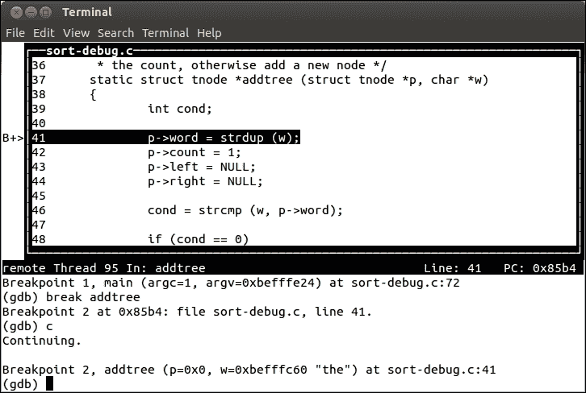
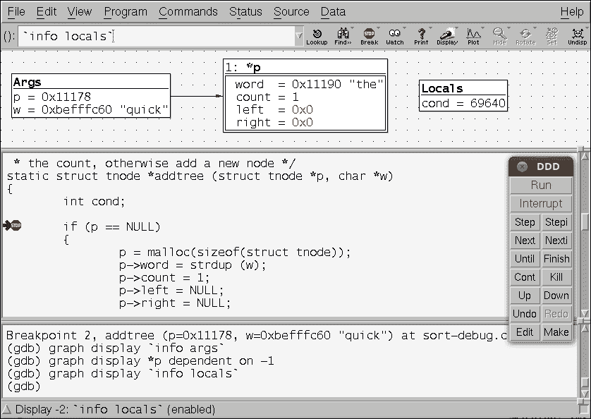
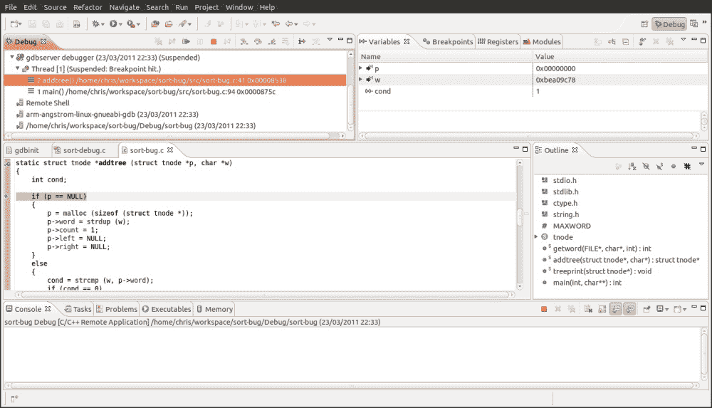

# 第十二章：使用 GDB 进行调试

错误是难免的。识别和修复它们是开发过程的一部分。有许多不同的技术用于查找和表征程序缺陷，包括静态和动态分析，代码审查，跟踪，性能分析和交互式调试。我将在下一章中介绍跟踪器和性能分析器，但在这里，我想集中讨论通过调试器观察代码执行的传统方法，也就是我们的情况下的 GNU 调试器 GDB。GDB 是一个强大而灵活的工具。您可以使用它来调试应用程序，检查程序崩溃后生成的后期文件（`core`文件），甚至逐步执行内核代码。

在本章中，我将向您展示如何使用 GDB 调试应用程序，如何查看核心文件以及如何调试内核代码，重点是与嵌入式 Linux 相关的方面。

# GNU 调试器

GDB 是用于编译语言的源级调试器，主要用于 C 和 C++，尽管也支持各种其他语言，如 Go 和 Objective。您应该阅读您正在使用的 GDB 版本的说明，以了解对各种语言的支持的当前状态。项目网站是[`www.gnu.org/software/gdb`](http://www.gnu.org/software/gdb)，其中包含了许多有用的信息，包括 GDB 手册。

GDB 默认具有命令行用户界面，有些人可能会觉得这个界面令人望而却步，但实际上，只要稍加练习，就会发现它很容易使用。如果您不喜欢命令行界面，那么有很多 GDB 的前端用户界面可供选择，我稍后会描述其中的三个。

# 准备调试

您需要使用调试符号编译要调试的代码。GCC 提供了两个选项：`-g`和`-ggdb`。后者添加了特定于 GDB 的调试信息，而前者生成了适合您使用的目标操作系统的适当格式的信息，使其更具可移植性。在我们的特定情况下，目标操作系统始终是 Linux，无论您使用`-g`还是`-ggdb`都没有太大区别。更有趣的是，这两个选项都允许您指定调试信息的级别，从 0 到 3：

+   0：这根本不生成调试信息，等同于省略`-g`或`-ggdb`开关

+   1：这产生的信息很少，但包括函数名称和外部变量，足以生成回溯

+   2：这是默认设置，包括有关局部变量和行号的信息，以便您可以进行源级调试并逐步执行代码

+   3：这包括额外的信息，其中包括 GDB 正确处理宏扩展

在大多数情况下，`-g`足够了，但如果您在通过代码时遇到问题，特别是如果它包含宏，那么请保留`-g3`或`-ggdb3`。

要考虑的下一个问题是代码优化级别。编译器优化往往会破坏源代码和机器代码之间的关系，这使得通过源代码进行步进变得不可预测。如果您遇到这样的问题，您很可能需要在不进行优化的情况下进行编译，省略`-O`编译开关，或者至少将其降低到级别 1，使用编译开关`-O1`。

一个相关的问题是堆栈帧指针，GDB 需要它们来生成当前函数调用的回溯。在某些架构上，GCC 不会在更高级别的优化（`-O2`）中生成堆栈帧指针。如果您发现自己确实需要使用`-O2`进行编译，但仍然希望进行回溯，您可以使用`-fno-omit-frame-pointer`来覆盖默认行为。还要注意一下手动优化的代码，通过添加`-fomit-frame-pointer`来省略帧指针：您可能需要暂时将它们移除。

# 使用 GDB 调试应用程序

您可以使用 GDB 以两种方式调试应用程序。如果您正在开发要在台式机和服务器上运行的代码，或者在任何编译和运行代码在同一台机器上的环境中运行代码，那么自然会本地运行 GDB。然而，大多数嵌入式开发都是使用交叉工具链进行的，因此您希望调试在设备上运行的代码，但是要从具有源代码和工具的交叉开发环境中控制它。我将专注于后一种情况，因为它没有得到很好的记录，但它是嵌入式开发人员最有可能遇到的情况。我不打算在这里描述使用 GDB 的基础知识，因为已经有许多关于该主题的良好参考资料，包括 GDB 手册和本章末尾建议的进一步阅读。

我将从一些关于使用 gdbserver 的细节开始，然后向您展示如何配置 Yocto 项目和 Buildroot 进行远程调试。

# 使用 gdbserver 进行远程调试

远程调试的关键组件是调试代理 gdbserver，它在目标上运行并控制正在调试的程序的执行。Gdbserver 通过网络连接或 RS-232 串行接口连接到在主机上运行的 GDB 的副本。

通过 gdbserver 进行调试几乎与本地调试相同，但并非完全相同。区别主要集中在涉及两台计算机并且它们必须处于正确状态以进行调试。以下是一些需要注意的事项：

+   在调试会话开始时，您需要使用 gdbserver 在目标上加载要调试的程序，然后在主机上使用交叉工具链中的 GDB 单独加载 GDB。

+   GDB 和 gdbserver 需要在调试会话开始之前相互连接。

+   在主机上运行的 GDB 需要告诉它在哪里查找调试符号和源代码，特别是对于共享库。

+   GDB 的`run`命令无法按预期工作。

+   gdbserver 在调试会话结束时将终止，如果您想要另一个调试会话，您需要重新启动它。

+   您需要在主机上为要调试的二进制文件获取调试符号和源代码，但不一定需要在目标上。通常目标上没有足够的存储空间，因此在部署到目标之前需要对它们进行剥离。

+   GDB/gdbserver 组合不具有本地运行的 GDB 的所有功能：例如，gdbserver 无法在`fork()`后跟随子进程，而本地 GDB 可以。

+   如果 GDB 和 gdbserver 是不同版本或者是相同版本但配置不同，可能会发生一些奇怪的事情。理想情况下，它们应该使用您喜欢的构建工具从相同的源构建。

调试符号会显著增加可执行文件的大小，有时会增加 10 倍。如第五章中所述，*构建根文件系统*，可以在不重新编译所有内容的情况下删除调试符号。这项工作的工具是您交叉工具链中的 strip。您可以使用以下开关来控制 strip 的侵略性：

+   `--strip-all`：（默认）删除所有符号

+   `--strip-unneeded`：删除不需要进行重定位处理的符号

+   `--strip-debug`：仅删除调试符号

### 提示

对于应用程序和共享库，`--strip-all`（默认）是可以的，但是对于内核模块，您会发现它会阻止模块加载。改用`--strip-unneeded`。我仍在研究`–strip-debug`的用例。

考虑到这一点，让我们看看在 Yocto 项目和 Buildroot 中进行调试涉及的具体内容。

## 设置 Yocto 项目

Yocto 项目在 SDK 的一部分中为主机构建了交叉 GDB，但是您需要对目标配置进行更改以在目标映像中包含 gdbserver。您可以显式添加该软件包，例如通过将以下内容添加到`conf/local.conf`，再次注意这个字符串的开头必须有一个空格：

```
IMAGE_INSTALL_append = " gdbserver"
```

或者，您可以将`tools-debug`添加到`EXTRA_IMAGE_FEATURES`中，这将同时将 gdbserver 和 strace 添加到目标映像中（我将在下一章中讨论`strace`）：

```
EXTRA_IMAGE_FEATURES = "debug-tweaks tools-debug"
```

## 设置 Buildroot

使用 Buildroot，您需要同时启用选项来为主机构建交叉 GDB（假设您正在使用 Buildroot 内部工具链），并为目标构建 gdbserver。具体来说，您需要启用：

+   `BR2_PACKAGE_HOST_GDB`，在菜单**工具链** | **为主机构建交叉 gdb**

+   `BR2_PACKAGE_GDB`，在菜单**目标软件包** | **调试、性能分析和基准测试** | **gdb**

+   `BR2_PACKAGE_GDB_SERVER`，在菜单**目标软件包** | **调试、性能分析和基准测试** | **gdbserver**

# 开始调试

现在，您在目标上安装了 gdbserver，并且在主机上安装了交叉 GDB，您可以开始调试会话了。

## 连接 GDB 和 gdbserver

GDB 和 gdbserver 之间的连接可以通过网络或串行接口进行。在网络连接的情况下，您可以使用 TCP 端口号启动 gdbserver 进行监听，并且可以选择接受连接的 IP 地址。在大多数情况下，您不需要关心将连接到哪个 IP 地址，因此只需提供端口号即可。在此示例中，gdbserver 等待来自任何主机的端口`10000`的连接：

```
# gdbserver :10000 ./hello-world
Process hello-world created; pid = 103
Listening on port 10000

```

接下来，从您的工具链启动 GDB，将相同的程序作为参数传递，以便 GDB 可以加载符号表：

```
$ arm-poky-linux-gnueabi-gdb hello-world

```

在 GDB 中，您使用`target remote`命令进行连接，指定目标的 IP 地址或主机名以及它正在等待的端口：

```
(gdb) target remote 192.168.1.101:10000

```

当 gdbserver 看到来自主机的连接时，它会打印以下内容：

```
Remote debugging from host 192.168.1.1

```

串行连接的过程类似。在目标上，您告诉 gdbserver 要使用哪个串行端口：

```
# gdbserver /dev/ttyO0 ./hello-world

```

您可能需要使用`stty`或类似的程序预先配置端口波特率。一个简单的示例如下：

```
# stty -F /dev/ttyO1 115200

```

`stty`还有许多其他选项，请阅读手册以获取更多详细信息。值得注意的是，该端口不能用于其他用途，例如，您不能使用作为系统控制台使用的端口。在主机上，您可以使用`target remote`加上电缆末端的串行设备来连接到 gdbserver。在大多数情况下，您将希望使用 GDB 命令`set remotebaud`设置主机串行端口的波特率：

```
(gdb) set remotebaud 115200
(gdb) target remote /dev/ttyUSB0

```

## 设置 sysroot

GDB 需要知道共享库的调试符号和源代码的位置。在本地调试时，路径是众所周知的，并内置到 GDB 中，但是在使用交叉工具链时，GDB 无法猜测目标文件系统的根目录在哪里。您可以通过设置 sysroot 来实现。Yocto 项目和 Buildroot 处理库符号的方式不同，因此 sysroot 的位置也大不相同。

Yocto 项目在目标文件系统映像中包含调试信息，因此您需要解压在`build/tmp/deploy/images`中生成的目标映像 tar 文件，例如：

```
$ mkdir ~/rootfs
$ cd ~/rootfs
$ sudo tar xf ~/poky/build/tmp/deploy/images/beaglebone/core-image-minimal-beaglebone.tar.bz2Then you can point sysroot to the root of the unpacked files:
(gdb) set sysroot /home/chris/MELP/rootfs

```

Buildroot 根据`BR2_ENABLE_DEBUG`编译具有最小或完整调试符号的库，将它们放入分段目录，然后在将它们复制到目标映像时剥离它们。因此，对于 Buildroot 来说，sysroot 始终是分段区域，而不管根文件系统从何处提取。

## GDB 命令文件

每次运行 GDB 时，您需要做一些事情，例如设置 sysroot。将这些命令放入命令文件中，并在每次启动 GDB 时运行它们非常方便。GDB 从`$HOME/.gdbinit`读取命令，然后从当前目录中的`.gdbinit`读取命令，然后从使用`-x`参数在命令行上指定的文件中读取命令。然而，出于安全原因，最近的 GDB 版本将拒绝从当前目录加载`.gdbinit`。您可以通过向`$HOME/.gdbinit`添加以下行来覆盖该行为，以便为单个目录禁用检查：

```
add-auto-load-safe-path /home/chris/myprog/.gdbinit

```

您还可以通过添加以下内容全局禁用检查：

```
set auto-load safe-path /

```

我个人偏好使用`-x`参数指向命令文件，这样可以暴露文件的位置，以免忘记它。

为了帮助您设置 GDB，Buildroot 创建一个包含正确 sysroot 命令的 GDB 命令文件，位于`output/staging/usr/share/buildroot/gdbinit`中。它将包含类似于这样的命令：

```
set sysroot /home/chris/buildroot/output/host/usr/arm-buildroot-linux-gnueabi/sysroot

```

## GDB 命令概述

GDB 有很多命令，这些命令在在线手册和*进一步阅读*部分提到的资源中有描述。为了帮助您尽快上手，这里列出了最常用的命令。在大多数情况下，命令都有一个缩写形式，该缩写形式在完整命令下面列出。

### 断点

以下表格显示了断点的命令：

| 命令 | 用途 |
| --- | --- |
| `break <location>``b <location>` | 在函数名、行号或行上设置断点。例如："main"、"5"和"sortbug.c:42" |
| `info break``i b` | 列出断点 |
| `delete break <N>``d b <N>` | 删除断点`N` |

### 运行和步进

以下表格显示了运行和步进的命令：

| 命令 | 用途 |
| --- | --- |
| `run``r` | 将程序的新副本加载到内存中并开始运行。这对使用 gdbserver 进行远程调试是无效的 |
| `continue`c | 从断点继续执行 |
| `Ctrl-C` | 停止正在调试的程序 |
| `step``s` | 执行一行代码，进入调用的任何函数 |
| `next``n` | 执行一行代码，跳过函数调用 |
| `finish` | 运行直到当前函数返回 |

### 信息命令

以下表格显示了获取信息的命令：

| 命令 | 用途 |
| --- | --- |
| `backtrace``bt` | 列出调用堆栈 |
| `info threads` | 从断点继续执行 |
| `Info libs` | 停止程序 |
| `print <variable>``p <variable>` | 打印变量的值，例如`print foo` |
| `list` | 列出当前程序计数器周围的代码行 |

## 运行到断点

Gdbserver 将程序加载到内存中，并在第一条指令处设置断点，然后等待来自 GDB 的连接。当连接建立时，您将进入调试会话。但是，您会发现如果立即尝试单步执行，您将收到此消息：

```
Cannot find bounds of current function

```

这是因为程序在汇编语言中编写的代码中停止了，该代码为 C 和 C++程序创建了运行时环境。C 或 C++代码的第一行是`main()`函数。假设您想在`main()`处停止，您可以在那里设置断点，然后使用`continue`命令（缩写为`c`）告诉 gdbserver 从程序开始处的断点继续执行并停在 main 处：

```
(gdb) break main
Breakpoint 1, main (argc=1, argv=0xbefffe24) at helloworld.c:8
8 printf("Hello, world!\n");

```

如果此时您看到以下内容：

```
warning: Could not load shared library symbols for 2 libraries, e.g. /lib/libc.so.6.

```

这意味着您忘记了设置 sysroot！

这与本地启动程序非常不同，您只需键入`run`。实际上，如果您在远程调试会话中尝试键入`run`，您要么会看到一条消息，说明远程目标不支持`run`，要么在较旧版本的 GDB 中，它将在没有任何解释的情况下挂起。

# 调试共享库

要调试由构建工具构建的库，您需要对构建配置进行一些更改。对于在构建环境之外构建的库，您需要做一些额外的工作。

## Yocto 项目

Yocto 项目构建二进制包的调试变体，并将它们放入`build/tmp/deploy/<package manager>/<target architecture>`中。以下是此示例的调试包，这里是 C 库的示例：

```
build/tmp/deploy/rpm/armv5e/libc6-dbg-2.21-r0.armv5e.rpm

```

您可以通过将`<package name-dbg>`添加到目标配方来有选择地将这些调试包添加到目标映像中。对于`glibc`，该包的名称为`glibc-dbg`。或者，您可以简单地告诉 Yocto 项目通过将`dbg-pkgs`添加到`EXTRA_IMAGE_FEATURES`来安装所有调试包。请注意，这将大大增加目标映像的大小，可能会增加数百兆字节。

Yocto 项目将调试符号放在名为`.debug`的隐藏目录中，分别位于`lib`和`usr/lib`目录中。GDB 知道在 sysroot 中的这些位置查找符号信息。

调试软件包还包含安装在目标镜像中的源代码副本，位于目录`usr/src/debug/<package name>`中，这也是尺寸增加的原因之一。您可以通过向您的配方添加以下内容来阻止它发生：

```
PACKAGE_DEBUG_SPLIT_STYLE = "debug-without-src"

```

不过，请记住，当您使用 gdbserver 进行远程调试时，您只需要在主机上具有调试符号和源代码，而不需要在目标上具有。没有什么能阻止您从已安装在目标上的镜像的副本中删除`lib/.debug`、`usr/lib/.debug`和`usr/src`目录。

## Buildroot

Buildroot 通常是直截了当的。您只需要重新构建带有行级调试符号的软件包，为此您需要启用以下内容：

+   在菜单**构建选项** | **使用调试符号构建软件包**

这将在`output/host/usr/<arch>/sysroot`中创建带有调试符号的库，但目标镜像中的副本仍然被剥离。如果您需要在目标上使用调试符号，也许是为了本地运行 GDB，您可以通过将**构建选项** | **目标上的二进制文件剥离命令**设置为`none`来禁用剥离。

## 其他库

除了使用调试符号进行构建之外，您还需要告诉 GDB 在哪里找到源代码。GDB 有一个用于源文件的搜索路径，您可以使用`show directories`命令查看：

```
(gdb) show directories
Source directories searched: $cdir:$cwd

```

这些是默认搜索路径：`$cdir`是编译目录，即源代码编译的目录；`$cwd`是 GDB 的当前工作目录。

通常这些就足够了，但如果源代码已经移动，您将需要使用如下所示的 directory 命令：

```
(gdb) dir /home/chris/MELP/src/lib_mylib
Source directories searched: /home/chris/MELP/src/lib_mylib:$cdir:$cwd

```

# 即时调试

有时，程序在运行一段时间后会开始表现异常，您可能想知道它在做什么。GDB 的`attach`功能正是这样。我称它为即时调试。它在本地和远程调试会话中都可用。

在远程调试的情况下，您需要找到要调试的进程的 PID，并使用`--attach`选项将其传递给 gdbserver。例如，如果 PID 为 109，您将输入：

```
# gdbserver --attach :10000 109
Attached; pid = 109
Listening on port 10000

```

这将强制进程停止，就像它处于断点处一样，这样您就可以以正常方式启动交叉 GDB，并连接到 gdbserver。

完成后，您可以分离，允许程序在没有调试器的情况下继续运行：

```
(gdb) detach
Detaching from program: /home/chris/MELP/helloworld/helloworld, process 109
Ending remote debugging.

```

# 调试分支和线程

当您调试的程序进行分支时会发生什么？调试会跟随父进程还是子进程？这种行为由`follow-fork-mode`控制，可能是`parent`或`child`，默认为 parent。不幸的是，当前版本的 gdbserver 不支持此选项，因此它仅适用于本地调试。如果您确实需要在使用 gdbserver 时调试子进程，一种解决方法是修改代码，使得子进程在分支后立即循环一个变量，这样您就有机会附加一个新的 gdbserver 会话，并设置变量以使其退出循环。

当多线程进程中的线程命中断点时，默认行为是所有线程都会停止。在大多数情况下，这是最好的做法，因为它允许您查看静态变量，而不会被其他线程更改。当您恢复线程的执行时，所有已停止的线程都会启动，即使您是单步执行，尤其是最后一种情况可能会导致问题。有一种方法可以修改 GDB 处理已停止线程的方式，通过称为`scheduler-locking`的参数。通常它是`off`，但如果将其设置为`on`，则只有在断点处停止的线程会恢复，其他线程将保持停止状态，这样您就有机会查看线程在没有干扰的情况下的操作。直到您关闭`scheduler-locking`为止，这种情况将继续存在。Gdbserver 支持此功能。

# 核心文件

核心文件捕获了程序在终止时的状态。当错误发生时，您甚至不必在调试器旁边。因此，当您看到`Segmentation fault (core dumped)`时，请不要耸肩；调查核心文件并提取其中的信息宝库。

首先要注意的是，默认情况下不会创建核心文件，而只有在进程的核心文件资源限制为非零时才会创建。您可以使用`ulimit -c`更改当前 shell 的限制。要删除核心文件大小的所有限制，请键入以下内容：

```
$ ulimit -c unlimited

```

默认情况下，核心文件命名为`core`，并放置在进程的当前工作目录中，该目录由`/proc/<PID>/cwd`指向。这种方案存在一些问题。首先，在查看具有多个名为`core`的文件的设备时，不明显知道每个文件是由哪个程序生成的。其次，进程的当前工作目录很可能位于只读文件系统中，或者可能没有足够的空间来存储`core`文件，或者进程可能没有权限写入当前工作目录。

有两个文件控制着`core`文件的命名和放置。第一个是`/proc/sys/kernel/core_uses_pid`。向其写入`1`会导致将正在死亡的进程的 PID 号附加到文件名中，只要您可以从日志文件中将 PID 号与程序名称关联起来，这就有些有用。

更有用的是`/proc/sys/kernel/core_pattern`，它可以让您对`core`文件有更多的控制。默认模式是`core`，但您可以将其更改为由这些元字符组成的模式：

+   `％p`：PID

+   `％u`：转储进程的真实 UID

+   `％g`：转储进程的真实 GID

+   `％s`：导致转储的信号编号

+   `％t`：转储时间，表示自 1970-01-01 00:00:00 +0000（UTC）以来的秒数。

+   `％h`：主机名

+   `％e`：可执行文件名

+   `％E`：可执行文件的路径名，斜杠（`/`）替换为感叹号（`!`）

+   `％c`：转储进程的核心文件大小软资源限制

您还可以使用以绝对目录名开头的模式，以便将所有`core`文件收集到一个地方。例如，以下模式将所有核心文件放入`/corefiles`目录，并使用程序名称和崩溃时间命名它们：

```
# echo /corefiles/core.%e.%t > /proc/sys/kernel/core_pattern

```

核心转储后，您会发现类似以下内容：

```
$ ls /corefiles/
core.sort-debug.1431425613

```

有关更多信息，请参阅 man 页面*core(5)*。

对于核心文件的更复杂处理，您可以将它们传输到进行一些后处理的程序。核心模式以管道符号`|`开头，后跟程序名称和参数。例如，我的 Ubuntu 14.04 有这个核心模式：

```
|/usr/share/apport/apport %p %s %c %P

```

Apport 是 Canonical 使用的崩溃报告工具。这种方式运行的崩溃报告工具在进程仍在内存中运行时运行，并且内核将核心镜像数据传递给它的标准输入。因此，该程序可以处理图像，可能会剥离其中的部分以减小文件系统中的大小，或者仅在核心转储时扫描它以获取特定信息。该程序可以查看各种系统数据，例如，读取程序的`/proc`文件系统条目，并且可以使用 ptrace 系统调用来操作程序并从中读取数据。但是，一旦核心镜像数据从标准输入中读取，内核就会进行各种清理，使有关该进程的信息不再可用。

## 使用 GDB 查看核心文件

以下是查看核心文件的 GDB 会话示例：

```
$ arm-poky-linux-gnueabi-gdb sort-debug /home/chris/MELP/rootdirs/rootfs/corefiles/core.sort-debug.1431425613
[...]
Core was generated by `./sort-debug'.
Program terminated with signal SIGSEGV, Segmentation fault.
#0  0x000085c8 in addtree (p=0x0, w=0xbeac4c60 "the") at sort-debug.c:41
41     p->word = strdup (w);

```

这显示程序在第 43 行停止。`list`命令显示附近的代码：

```
(gdb) list
37    static struct tnode *addtree (struct tnode *p, char *w)
38    {
39        int cond;
40
41        p->word = strdup (w);
42        p->count = 1;
43        p->left = NULL;
44        p->right = NULL;
45

```

`backtrace`命令（缩写为`bt`）显示了我们到达这一点的路径：

```
(gdb) bt
#0  0x000085c8 in addtree (p=0x0, w=0xbeac4c60 "the") at sort-debug.c:41
#1  0x00008798 in main (argc=1, argv=0xbeac4e24) at sort-debug.c:89

```

一个明显的错误：`addtree()`被空指针调用。

# GDB 用户界面

GDB 是通过 GDB 机器接口 GDB/MI 进行低级控制的，该接口用于将 GDB 包装在用户界面中或作为更大程序的一部分，并且大大扩展了可用的选项范围。

我只提到了那些在嵌入式开发中有用的功能。

## 终端用户界面

**终端用户界面**（**TUI**）是标准 GDB 软件包的可选部分。其主要特点是代码窗口，显示即将执行的代码行以及任何断点。它绝对改进了命令行模式 GDB 中的`list`命令。

TUI 的吸引力在于它只需要工作，不需要任何额外的设置，并且由于它是文本模式，因此在运行`gdb`时可以通过 ssh 终端会话在目标上使用。大多数交叉工具链都使用 TUI 配置 GDB。只需在命令行中添加`-tui`，您将看到以下内容：



## 数据显示调试器

**数据显示调试器**（**DDD**）是一个简单的独立程序，可以让您以最小的麻烦获得 GDB 的图形用户界面，尽管 UI 控件看起来有些过时，但它确实做到了必要的一切。

`--debugger`选项告诉 DDD 使用您的工具链中的 GDB，并且您可以使用 GDB 命令文件的`-x`参数：

```
$ ddd --debugger arm-poky-linux-gnueabi-gdb -x gdbinit sort-debug

```

以下屏幕截图展示了其中一个最好的功能：数据窗口，其中包含以您希望的方式重新排列的项目。如果双击指针，它会展开为一个新的数据项，并且链接会显示为箭头：



## Eclipse

Eclipse，配备了**C 开发工具包**（**CDT**）插件，支持使用 GDB 进行调试，包括远程调试。如果您在 Eclipse 中进行所有的代码开发，这是显而易见的工具，但是，如果您不是经常使用 Eclipse，那么可能不值得为了这个任务而设置它。我需要整整一章的篇幅来充分解释如何配置 CDT 以使用交叉工具链并连接到远程设备，因此我将在本章末尾的参考资料中为您提供更多信息。接下来的屏幕截图显示了 CDT 的调试视图。在右上窗口中，您可以看到进程中每个线程的堆栈帧，右上方是显示变量的监视窗口。中间是代码窗口，显示了调试器停止程序的代码行。



# 调试内核代码

调试应用程序代码有助于了解代码的工作方式以及在代码发生故障时发生了什么，并且您可以对内核进行相同的操作，但有一些限制。

您可以使用`kgdb`进行源级调试，类似于使用`gdbserver`进行远程调试。还有一个自托管的内核调试器`kdb`，对于轻量级任务非常方便，例如查看指令是否执行并获取回溯以找出它是如何到达那里的。最后，还有内核 oops 消息和紧急情况，它们告诉您有关内核异常原因的很多信息。

## 使用 kgdb 调试内核代码

在使用源代码调试器查看内核代码时，您必须记住内核是一个复杂的系统，具有实时行为。不要期望调试像应用程序一样容易。逐步执行更改内存映射或切换上下文的代码可能会产生奇怪的结果。

`kgdb`是多年来一直是 Linux 主线的内核 GDB 存根的名称。内核 DocBook 中有用户手册，您可以在[`www.kernel.org/doc/htmldocs/kgdb/index.html`](https://www.kernel.org/doc/htmldocs/kgdb/index.html)找到在线版本。

连接到 kgdb 的广泛支持方式是通过串行接口，通常与串行控制台共享，因此此实现称为`kgdboc`，意思是控制台上的 kgdb。为了工作，它需要支持 I/O 轮询而不是中断的平台 tty 驱动程序，因为 kgdb 在与 GDB 通信时必须禁用中断。一些平台支持通过 USB 进行 kgdb，还有一些可以通过以太网工作的版本，但不幸的是，这些都没有进入主线 Linux。

内核的优化和堆栈帧也适用于内核，但内核的限制是，内核被写成至少为`-O1`的优化级别。您可以通过在运行`make`之前设置`KCGLAGS`来覆盖内核编译标志。

然后，这些是您需要进行内核调试的内核配置选项：

+   `CONFIG_DEBUG_INFO`在**内核调试** | **编译时检查和编译器选项** | **使用调试信息编译内核菜单**中

+   `CONFIG_FRAME_POINTER`可能是您的架构的一个选项，并且在**内核调试** | **编译时检查和编译器选项** | **使用帧指针编译内核菜单**中

+   `CONFIG_KGDB`在**内核调试** | **KGDB：内核调试器菜单**中

+   `CONFIG_KGDB_SERIAL_CONSOLE`在**内核调试** | **KGDB：内核调试器** | **KGDB：使用串行控制台菜单**中

除了`uImage`或`zImage`压缩内核映像，您还需要以 ELF 对象格式的内核映像，以便 GDB 可以将符号加载到内存中。这个文件称为在构建 Linux 的目录中生成的`vmlinux`。在 Yocto 项目中，您可以请求在目标映像中包含一个副本，这对于这个和其他调试任务非常方便。它构建为一个名为`kernel-vmlinux`的软件包，您可以像其他软件包一样安装，例如将其添加到`IMAGE_INSTALL_append`列表中。该文件放入引导目录，名称如下：

```
boot/vmlinux-3.14.26ltsi-yocto-standard

```

在 Buildroot 中，您将在构建内核的目录中找到`vmlinux`，该目录位于`output/build/linux-<version string>/vmlinux`中。

## 一个示例调试会话

展示它的最佳方法是通过一个简单的例子。

您需要告诉`kgdb`要使用哪个串行端口，可以通过内核命令行或通过`sysfs`在运行时进行设置。对于第一种选项，请将`kgdboc=<tty>,<波特率>`添加到命令行，如下所示：

```
kgdboc=ttyO0,115200

```

对于第二个选项，启动设备并将终端名称写入`/sys/module/kgdboc/parameters/kgdboc`文件，如下所示：

```
# echo ttyO0 > /sys/module/kgdboc/parameters/kgdboc

```

请注意，您不能以这种方式设置波特率。如果它与控制台相同的`tty`，则已经设置，如果不是，请使用`stty`或类似的程序。

现在您可以在主机上启动 GDB，选择与正在运行的内核匹配的`vmlinux`文件：

```
$ arm-poky-linux-gnueabi-gdb ~/linux/vmlinux

```

GDB 从`vmlinux`加载符号表，并等待进一步的输入。

接下来，关闭连接到控制台的任何终端仿真器：您将要在 GDB 中使用它，如果两者同时活动，一些调试字符串可能会损坏。

现在，您可以返回到 GDB 并尝试连接到`kgdb`。但是，您会发现此时从`target remote`得到的响应是无用的：

```
(gdb) set remotebaud 115200
(gdb) target remote /dev/ttyUSB0
Remote debugging using /dev/ttyUSB0
Bogus trace status reply from target: qTStatus

```

问题在于此时`kgdb`没有在监听连接。您需要在可以与之进行交互的 GDB 会话之前中断内核。不幸的是，就像您在应用程序中一样，仅在 GDB 中键入*Ctrl* + *C*是无效的。您需要通过例如通过 ssh 在目标板上启动另一个 shell，并向目标板的`/proc/sysrq-trigger`写入`g`来强制内核陷入：

```
# echo g > /proc/sysrq-trigger

```

目标在这一点上停止。现在，您可以通过电缆主机端的串行设备连接到`kgdb`：

```
(gdb) set remotebaud 115200
(gdb) target remote /dev/ttyUSB0
Remote debugging using /dev/ttyUSB0
0xc009a59c in arch_kgdb_breakpoint ()

```

最后，GDB 掌控了。您可以设置断点，检查变量，查看回溯等。例如，设置一个在`sys_sync`上的断点，如下所示：

```
(gdb) break sys_sync
Breakpoint 1 at 0xc0128a88: file fs/sync.c, line 103.
(gdb) c
Continuing.

```

现在目标恢复了。在目标上输入`sync`调用`sys_sync`并触发断点。

```
[New Thread 87]
[Switching to Thread 87]

Breakpoint 1, sys_sync () at fs/sync.c:103

```

如果您已经完成了调试会话并想要禁用`kgdboc`，只需将`kgdboc`终端设置为 null：

```
# echo "" >  /sys/module/kgdboc/parameters/kgdboc

```

## 调试早期代码

在系统完全引导时执行您感兴趣的代码的情况下，前面的示例适用。如果您需要尽早进入系统，可以通过在`kgdboc`选项之后添加`kgdbwait`到命令行来告诉内核在引导期间等待：

```
kgdboc=ttyO0,115200 kgdbwait

```

现在，当您引导时，您将在控制台上看到这个：

```
 1.103415] console [ttyO0] enabled
[    1.108216] kgdb: Registered I/O driver kgdboc.
[    1.113071] kgdb: Waiting for connection from remote gdb...

```

此时，您可以关闭控制台，并以通常的方式从 GDB 连接。

## 调试模块

调试内核模块会带来额外的挑战，因为代码在运行时被重定位，所以您需要找出它所在的地址。这些信息通过`sysfs`呈现。模块的每个部分的重定位地址存储在`/sys/module/<module name>/sections`中。请注意，由于 ELF 部分以点'.'开头，它们显示为隐藏文件，如果要列出它们，您将需要使用`ls -a`。重要的是`.text`、`.data`和`.bss`。

以模块名为`mbx`为例：

```
# cat /sys/module/mbx/sections/.text
0xbf000000
# cat /sys/module/mbx/sections/.data
0xbf0003e8
# cat /sys/module/mbx/sections/.bss
0xbf0005c0

```

现在，您可以在 GDB 中使用这些数字来加载模块的符号表：

```
(gdb) add-symbol-file /home/chris/mbx-driver/mbx.ko 0xbf000000 \
-s .data 0xbf0003e8 -s .bss 0xbf0005c0
add symbol table from file "/home/chris/mbx-driver/mbx.ko" at
 .text_addr = 0xbf000000
 .data_addr = 0xbf0003e8
 .bss_addr = 0xbf0005c0

```

现在一切应该正常工作：您可以设置断点并检查模块中的全局和局部变量，就像在`vmlinux`中一样：

```
(gdb) break mbx_write

Breakpoint 1 at 0xbf00009c: file /home/chris/mbx-driver/mbx.c, line 93.

(gdb) c
Continuing.

```

然后，强制设备驱动程序调用`mbx_write`，它将触发断点：

```
Breakpoint 1, mbx_write (file=0xde7a71c0, buffer=0xadf40 "hello\n\n",
 length=6, offset=0xde73df80)
 at /home/chris/mbx-driver/mbx.c:93

```

## 使用 kdb 调试内核代码

尽管`kdb`没有`kgdb`和 GDB 的功能，但它确实有其用途，并且作为自托管的工具，没有外部依赖需要担心。`kdb`具有一个简单的命令行界面，您可以在串行控制台上使用它。您可以使用它来检查内存、寄存器、进程列表、`dmesg`，甚至设置断点以在特定位置停止。

要配置通过串行控制台访问`kgd`，请启用`kgdb`，如前所示，然后启用此附加选项：

+   `CONFIG_KGDB_KDB`，位于**KGDB:** **内核调试** | **内核调试器** | **KGDB_KDB: 包括 kgdb 的 kdb 前端**菜单中

现在，当您强制内核陷入陷阱时，您将在控制台上看到`kdb` shell，而不是进入 GDB 会话：

```
# echo g > /proc/sysrq-trigger
[   42.971126] SysRq : DEBUG

Entering kdb (current=0xdf36c080, pid 83) due to Keyboard Entry
kdb>

```

在`kdb` shell 中有很多事情可以做。`help`命令将打印所有选项。这是一个概述。

获取信息：

+   `ps`：显示活动进程

+   `ps A`：显示所有进程

+   `lsmod`：列出模块

+   `dmesg`：显示内核日志缓冲区

断点：

+   `bp`：设置断点

+   `bl`：列出断点

+   `bc`：清除断点

+   `bt`：打印回溯

+   `go`：继续执行

检查内存和寄存器：

+   `md`：显示内存

+   `rd`：显示寄存器

这是设置断点的一个快速示例：

```
kdb> bp sys_sync
Instruction(i) BP #0 at 0xc01304ec (sys_sync)
 is enabled  addr at 00000000c01304ec, hardtype=0 installed=0

kdb> go

```

内核恢复正常，控制台显示正常的 bash 提示符。如果键入`sync`，它会触发断点并再次进入`kdb`：

```
Entering kdb (current=0xdf388a80, pid 88) due to Breakpoint @ 0xc01304ec

```

`kdb`不是源代码调试器，因此您无法查看源代码或单步执行。但是，您可以使用`bt`命令显示回溯，这对于了解程序流程和调用层次结构很有用。

当内核执行无效的内存访问或执行非法指令时，内核 oops 消息将被写入内核日志。其中最有用的部分是回溯，我想向您展示如何使用其中的信息来定位导致故障的代码行。我还将解决如果 oops 消息导致系统崩溃时如何保留 oops 消息的问题。

## 查看 oops

oops 消息看起来像这样：

```
[   56.225868] Unable to handle kernel NULL pointer dereference at virtual address 00000400[   56.229038] pgd = cb624000[   56.229454] [00000400] *pgd=6b715831, *pte=00000000, *ppte=00000000[   56.231768] Internal error: Oops: 817 [#1] SMP ARM[   56.232443] Modules linked in: mbx(O)[   56.233556] CPU: 0 PID: 98 Comm: sh Tainted: G   O  4.1.10 #1[   56.234234] Hardware name: ARM-Versatile Express[   56.234810] task: cb709c80 ti: cb71a000 task.ti: cb71a000[   56.236801] PC is at mbx_write+0x14/0x98 [mbx][   56.237303] LR is at __vfs_write+0x20/0xd8[   56.237559] pc : [<bf0000a0>]    lr : [<c0307154>]  psr: 800f0013[   56.237559] sp : cb71bef8  ip : bf00008c  fp : 00000000[   56.238183] r10: 00000000  r9 : cb71a000  r8 : c02107c4[   56.238485] r7 : cb71bf88  r6 : 000afb98  r5 : 00000006  r4 : 00000000[   56.238857] r3 : cb71bf88  r2 : 00000006  r1 : 000afb98  r0 : cb61d600
[   56.239276] Flags: Nzcv  IRQs on  FIQs on  Mode SVC_32  ISA ARM  Segment user[   56.239685] Control: 10c5387d  Table: 6b624059  DAC: 00000015[   56.240019] Process sh (pid: 98, stack limit = 0xcb71a220)

```

`PC is at mbx_write+0x14/0x98 [mbx]`告诉您大部分您想知道的内容：最后一条指令在名为`mbx`的内核模块中的`mbx_write`函数中。此外，它是从函数开始的偏移量`0x14`字节，该函数的长度为`0x98`字节。

接下来，看一下回溯：

```
[   56.240363] Stack: (0xcb71bef8 to 0xcb71c000)[   56.240745] bee0:                                                       cb71bf88 cb61d600[   56.241331] bf00: 00000006 c0307154 00000000 c020a308 cb619d88 00000301 00000000 00000042[   56.241775] bf20: 00000000 cb61d608 cb709c80 cb709c78 cb71bf60 c0250a54 00000000 cb709ee0[   56.242190] bf40: 00000003 bef4f658 00000000 cb61d600 cb61d600 00000006 000afb98 cb71bf88[   56.242605] bf60: c02107c4 c030794c 00000000 00000000 cb61d600 cb61d600 00000006 000afb98[   56.243025] bf80: c02107c4 c0308174 00000000 00000000 00000000 000ada10 00000001 000afb98[   56.243493] bfa0: 00000004 c0210640 000ada10 00000001 00000001 000afb98 00000006 00000000[   56.243952] bfc0: 000ada10 00000001 000afb98 00000004 00000001 00000020 000ae274 00000000[   56.244420] bfe0: 00000000 bef4f49c 0000fcdc b6f1aedc 600f0010 00000001 00000000 00000000[   56.245653] [<bf0000a0>] (mbx_write [mbx]) from [<c0307154>] (__vfs_write+0x20/0xd8)[   56.246368] [<c0307154>] (__vfs_write) from [<c030794c>] (vfs_write+0x90/0x164)[   56.246843] [<c030794c>] (vfs_write) from [<c0308174>] (SyS_write+0x44/0x9c)[   56.247265] [<c0308174>] (SyS_write) from [<c0210640>] (ret_fast_syscall+0x0/0x3c)[   56.247737] Code: e5904090 e3520b01 23a02b01 e1a05002 (e5842400)[   56.248372] ---[ end trace 999c378e4df13d74 ]---

```

在这种情况下，我们并没有学到更多，只是`mbx_write`是从虚拟文件系统代码中调用的。

找到与`mbx_write+0x14`相关的代码行将非常好，我们可以使用`objdump`。我们可以从`objdump -S`中看到`mbx_write`在`mbx.ko`中的偏移量为`0x8c`，因此最后执行的指令位于`0x8c + 0x14 = 0xa0`。现在，我们只需要查看该偏移量并查看其中的内容：

```
$ arm-poky-linux-gnueabi-objdump -S mbx.kostatic ssize_t mbx_write(struct file *file,const char *buffer, size_t length, loff_t * offset){  8c:   e92d4038        push    {r3, r4, r5, lr}  struct mbx_data *m = (struct mbx_data *)file->private_data;  90:   e5904090        ldr     r4, [r0, #144]  ; 0x90  94:   e3520b01        cmp     r2, #1024       ; 0x400  98:   23a02b01        movcs   r2, #1024       ; 0x400  if (length > MBX_LEN)    length = MBX_LEN;    m->mbx_len = length;  9c:   e1a05002        mov     r5, r2  a0:   e5842400        str     r2, [r4, #1024] ; 0x400

```

这显示了它停止的指令。代码的最后一行显示在这里：

```
m->mbx_len = length;

```

您可以看到`m`的类型是`struct mbx_data *`。这是定义该结构的地方：

```
#define MBX_LEN 1024 struct mbx_data {  char mbx[MBX_LEN];  int mbx_len;};
```

因此，看起来`m`变量是一个空指针，这导致了 oops。

## 保存 oops

解码 oops 只有在首次捕获它时才可能。如果系统在启动期间在启用控制台之前或在挂起后崩溃，则不会看到它。有机制可以将内核 oops 和消息记录到 MTD 分区或持久内存中，但这里有一种在许多情况下都有效且需要很少事先考虑的简单技术。

只要在重置期间内存内容未被损坏（通常情况下不会），您可以重新启动到引导加载程序并使用它来显示内存。您需要知道内核日志缓冲区的位置，记住它是文本消息的简单环形缓冲区。符号是`__log_buf`。在内核的`System.map`中查找此内容：

```
$ grep __log_buf System.mapc0f72428 b __log_buf

```

然后，通过减去`PAGE_OFFSET`，`0xc0000000`，并在 BeagleBone 上加上 RAM 的物理起始地址`0x80000000`，将内核逻辑地址映射到 U-Boot 可以理解的物理地址，因此`c0f72428 - 0xc0000000 + 0x80000000 = 80f72428`。

然后使用 U-Boot 的`md`命令显示日志：

```
U-Boot# md 80f7242880f72428: 00000000 00000000 00210034 c6000000    ........4.!.....80f72438: 746f6f42 20676e69 756e694c 6e6f2078    Booting Linux on80f72448: 79687020 61636973 5043206c 78302055     physical CPU 0x80f72458: 00000030 00000000 00000000 00730084    0.............s.80f72468: a6000000 756e694c 65762078 6f697372    ....Linux versio80f72478: 2e34206e 30312e31 68632820 40736972    n 4.1.10 (chris@80f72488: 6c697562 29726564 63672820 65762063    builder) (gcc ve80f72498: 6f697372 2e34206e 20312e39 6f726328    rsion 4.9.1 (cro80f724a8: 6f747373 4e2d6c6f 2e312047 302e3032    sstool-NG 1.20.080f724b8: 20292029 53203123 5720504d 4f206465    ) ) #1 SMP Wed O
80f724c8: 32207463 37312038 3a31353a 47203335    ct 28 17:51:53 G

```

### 注意

从 Linux 3.5 开始，内核日志缓冲区中的每行都有一个 16 字节的二进制头，其中编码了时间戳、日志级别和其他内容。在 Linux Weekly News 的一篇名为*走向更可靠的日志记录*的文章中有关于此的讨论，网址为[`lwn.net/Articles/492125/`](https://lwn.net/Articles/492125/)。

# 额外阅读

以下资源提供了有关本章介绍的主题的更多信息：

+   *使用 GDB、DDD 和 Eclipse 进行调试的艺术*，作者*Norman Matloff*和*Peter Jay Salzman*，*No Starch Press*；第 1 版（2008 年 9 月 28 日），ISBN 978-1593271749

+   *GDB 口袋参考*，作者*Arnold Robbins*，*O'Reilly Media*；第 1 版（2005 年 5 月 12 日），ISBN 978-0596100278

+   *熟悉 Eclipse：交叉编译*，[`2net.co.uk/tutorial/eclipse-cross-compile`](http://2net.co.uk/tutorial/eclipse-cross-compile)

+   *熟悉 Eclipse：远程访问和调试*，[`2net.co.uk/tutorial/eclipse-rse`](http://2net.co.uk/tutorial/eclipse-rse)

# 总结

用于交互式调试的 GDB 是嵌入式开发人员工具箱中的一个有用工具。它是一个稳定的、有文档支持的、众所周知的实体。它有能力通过在目标上放置代理来远程调试，无论是用于应用程序的 `gdbserver` 还是用于内核代码的 `kgdb`，尽管默认的命令行用户界面需要一段时间才能习惯，但有许多替代的前端。我提到的三个是 TUI、DDD 和 Eclipse，这应该涵盖了大多数情况，但还有其他前端可以尝试。

调试的第二种同样重要的方法是收集崩溃报告并离线分析它们。在这个类别中，我已经查看了应用程序的核心转储和内核 oops 消息。

然而，这只是识别程序中缺陷的一种方式。在下一章中，我将讨论分析和优化程序的方法，即性能分析和跟踪。
