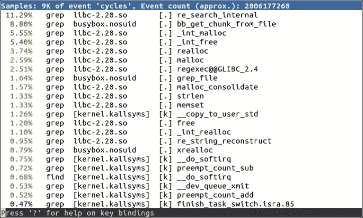
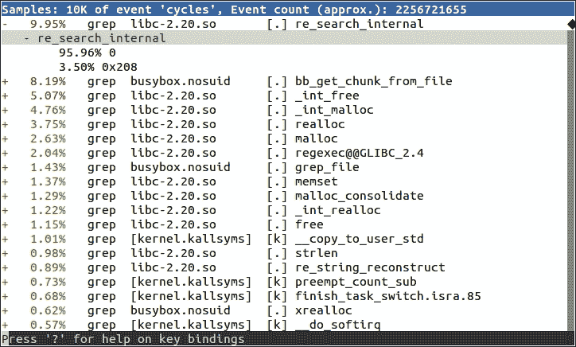
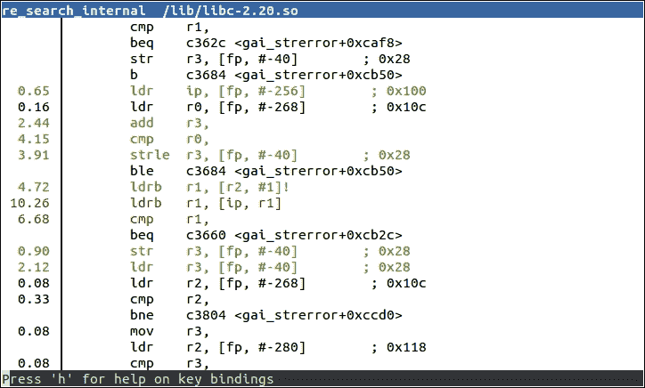
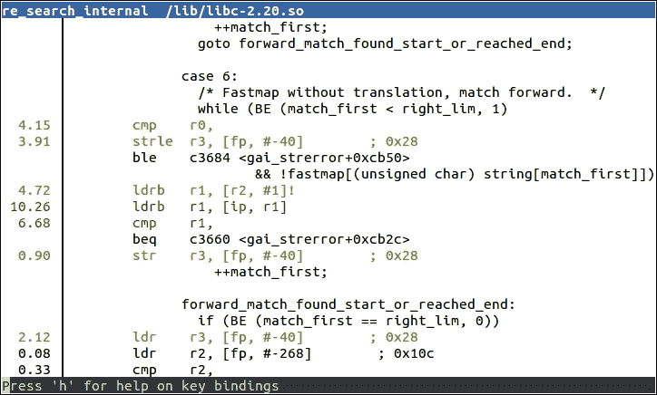
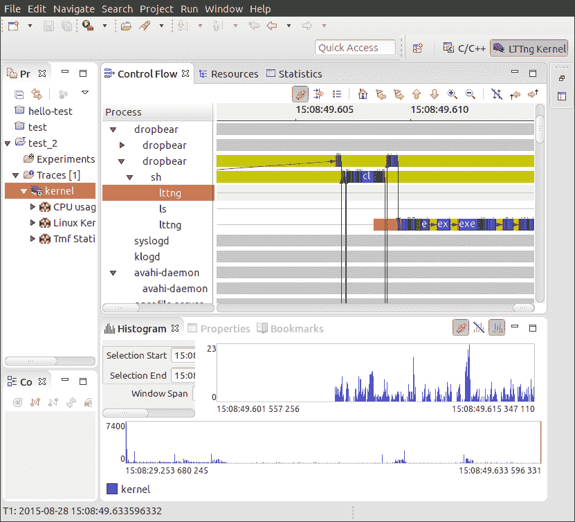

# 第十三章：性能分析和跟踪

使用源级调试器进行交互式调试，如前一章所述，可以让您深入了解程序的工作方式，但它将您的视野限制在一小部分代码上。在本章中，我将着眼于更大的图片，以查看系统是否按预期运行。

程序员和系统设计师在猜测瓶颈位置时通常表现得很糟糕。因此，如果您的系统存在性能问题，最好从整个系统开始查看，然后逐步使用更复杂的工具。在本章中，我首先介绍了众所周知的`top`命令，作为获取概述的手段。问题通常可以局限在单个程序上，您可以使用 Linux 分析器`perf`进行分析。如果问题不是如此局限，而您想获得更广泛的图片，`perf`也可以做到。为了诊断与内核相关的问题，我将描述跟踪工具`Ftrace`和`LTTng`，作为收集详细信息的手段。

我还将介绍 Valgrind，由于其沙箱执行环境，可以监视程序并在其运行时报告代码。我将以描述一个简单的跟踪工具`strace`来完成本章，它通过跟踪程序所做的系统调用来揭示程序的执行。

# 观察者效应

在深入了解工具之前，让我们谈谈工具将向您展示什么。就像在许多领域一样，测量某个属性会影响观察本身。测量线路中的电流需要测量一个小电阻上的电压降。然而，电阻本身会影响电流。性能分析也是如此：每个系统观察都会消耗 CPU 周期，这些资源将不再用于应用程序。测量工具还会影响缓存行为，占用内存空间，并写入磁盘，这些都会使情况变得更糟。没有不带开销的测量。

我经常听到工程师说，性能分析的结果完全是误导性的。这通常是因为他们在接近真实情况下进行测量。始终尝试在目标上进行测量，使用软件的发布版本构建，使用有效的数据集，尽可能少地使用额外服务。

## 符号表和编译标志

我们将立即遇到一个问题。虽然观察系统处于其自然状态很重要，但工具通常需要额外的信息来理解事件。

一些工具需要特殊的内核选项，特别是在介绍中列出的那些，如`perf`，`Ftrace`和`LTTng`。因此，您可能需要为这些测试构建和部署新的内核。

调试符号对将原始程序地址转换为函数名称和代码行非常有帮助。部署带有调试符号的可执行文件不会改变代码的执行，但这确实需要您拥有使用`debug`编译的二进制文件和内核的副本，至少对于您想要进行性能分析的组件。例如，一些工具在目标系统上安装这些组件效果最佳，比如`perf`。这些技术与一般调试相同，正如我在第十二章中所讨论的那样，*使用 GDB 进行调试*。

如果您想要一个工具生成调用图，您可能需要启用堆栈帧进行编译。如果您希望工具准确地将地址与代码行对应起来，您可能需要以较低级别的优化进行编译。

最后，一些工具需要将插装仪器插入程序中以捕获样本，因此您将不得不重新编译这些组件。这适用于应用程序的`gprof`，以及内核的`Ftrace`和`LTTng`。

请注意，您观察的系统发生的变化越大，您所做的测量与生产系统之间的关系就越难以建立。

### 提示

最好采取等待和观察的方法，只有在需要明确时才进行更改，并且要注意，每次这样做时，都会改变您正在测量的内容。

# 开始进行分析

在查看整个系统时，一个很好的起点是使用`top`这样的简单工具，它可以让您快速地获得概览。它会显示正在使用多少内存，哪些进程正在占用 CPU 周期，以及这些情况如何分布在不同的核心和时间上。

如果`top`显示单个应用程序在用户空间中使用了所有的 CPU 周期，那么您可以使用`perf`对该应用程序进行分析。

如果两个或更多进程的 CPU 使用率很高，那么它们之间可能存在某种耦合，也许是数据通信。如果大量的周期花费在系统调用或处理中断上，那么可能存在内核配置或设备驱动程序的问题。在任何一种情况下，您需要从整个系统开始进行分析，再次使用`perf`。

如果您想了解更多关于内核和事件顺序的信息，可以使用`Ftrace`或`LTTng`。

`top`可能无法帮助您解决其他问题。如果您有多线程代码，并且存在死锁问题，或者存在随机数据损坏问题，那么 Valgrind 加上 Helgrind 插件可能会有所帮助。内存泄漏也属于这一类问题：我在第十一章中介绍了与内存相关的诊断，*管理内存*。

# 使用 top 进行分析

`top`是一个简单的工具，不需要任何特殊的内核选项或符号表。BusyBox 中有一个基本版本，`procps`包中有一个更功能齐全的版本，该包在 Yocto Project 和 Buildroot 中可用。您还可以考虑使用`htop`，它在功能上类似于`top`，但具有更好的用户界面（有些人这样认为）。

首先，关注`top`的摘要行，如果您使用的是 BusyBox，则是第二行，如果使用`procps` `top`则是第三行。以下是一个使用 BusyBox `top`的示例：

```
Mem: 57044K used, 446172K free, 40K shrd, 3352K buff, 34452K cached
CPU:  58% usr   4% sys   0% nic   0% idle  37% io   0% irq   0% sirq
Load average: 0.24 0.06 0.02 2/51 105
 PID  PPID USER     STAT   VSZ %VSZ %CPU COMMAND
 105   104 root     R    27912   6%  61% ffmpeg -i track2.wav
 [...]

```

摘要行显示了在各种状态下运行的时间百分比，如下表所示：

| procps | Busybox |   |
| --- | --- | --- |
| `us` | `usr` | 默认优先级值的用户空间程序 |
| `sy` | `sys` | 内核代码 |
| `ni` | `nic` | 非默认优先级值的用户空间程序 |
| `id` | `idle` | 空闲 |
| `wa` | `io` | I/O 等待 |
| `hi` | `irq` | 硬件中断 |
| `si` | `sirq` | 软件中断 |
| `st` | `--` | 窃取时间：仅在虚拟化环境中相关 |

在前面的例子中，几乎所有的时间（58%）都花在用户模式下，只有一小部分时间（4%）花在系统模式下，因此这是一个在用户空间中 CPU 绑定的系统。摘要后的第一行显示只有一个应用程序负责：`ffmpeg`。任何减少 CPU 使用率的努力都应该集中在那里。

这里是另一个例子：

```
Mem: 13128K used, 490088K free, 40K shrd, 0K buff, 2788K cached
CPU:   0% usr  99% sys   0% nic   0% idle   0% io   0% irq   0% sirq
Load average: 0.41 0.11 0.04 2/46 97
 PID  PPID USER     STAT   VSZ %VSZ %CPU COMMAND
 92    82 root     R     2152   0% 100% cat /dev/urandom
 [...]

```

这个系统几乎所有的时间都花在内核空间，因为`cat`正在从`/dev/urandom`读取。在这种人为的情况下，仅对`cat`进行分析是没有帮助的，但对`cat`调用的内核函数进行分析可能会有所帮助。

`top`的默认视图只显示进程，因此 CPU 使用率是进程中所有线程的总和。按*H*键查看每个线程的信息。同样，它会汇总所有 CPU 上的时间。如果您使用的是`procps top`，可以通过按*1*键查看每个 CPU 的摘要。

想象一下，有一个单独的用户空间进程占用了大部分时间，看看如何对其进行分析。

## 穷人的分析器

您可以通过使用 GDB 在任意间隔停止应用程序并查看其正在执行的操作来对应用程序进行分析。这就是*穷人的分析器*。它很容易设置，也是收集分析数据的一种方法。

该过程很简单，这里进行了解释：

1.  使用`gdbserver`（用于远程调试）或 gbd（用于本地调试）附加到进程。进程停止。

1.  观察它停在哪个功能上。您可以使用`backtrace GDB`命令查看调用堆栈。

1.  输入`continue`以使程序恢复。

1.  过一会儿，输入*Ctrl* + *C*再次停止它，然后回到步骤 2。

如果您多次重复步骤 2 到 4，您将很快了解它是在循环还是在进行，如果您重复这些步骤足够多次，您将了解代码中的热点在哪里。

有一个专门的网页致力于这个想法，网址为[`poormansprofiler.org`](http://poormansprofiler.org)，还有一些脚本可以使它变得更容易。多年来，我已经在各种操作系统和调试器中多次使用了这种技术。

这是统计分析的一个例子，您可以在间隔时间内对程序状态进行采样。经过一些样本后，您开始了解执行函数的统计可能性。您真正需要的样本数量是令人惊讶的少。其他统计分析器包括`perf record`、`OProfile`和`gprof`。

使用调试器进行采样是具有侵入性的，因为在收集样本时程序会停止一段时间。其他工具可以以更低的开销做到这一点。

我现在将考虑如何使用`perf`进行统计分析。

# 介绍 perf

`perf`是**Linux 性能事件计数子系统**`perf_events`的缩写，也是与`perf_events`进行交互的命令行工具的名称。自 Linux 2.6.31 以来，它们一直是内核的一部分。在`tools/perf/Documentation`目录中的 Linux 源树中有大量有用的信息，还可以在[`perf.wiki.kernel.org`](https://perf.wiki.kernel.org)找到。

开发`perf`的最初动力是提供一种统一的方式来访问大多数现代处理器核心中的**性能测量单元**（**PMU**）的寄存器。一旦 API 被定义并集成到 Linux 中，将其扩展到涵盖其他类型的性能计数器就变得合乎逻辑。

在本质上，`perf`是一组事件计数器，具有关于何时主动收集数据的规则。通过设置规则，您可以从整个系统中捕获数据，或者只是内核，或者只是一个进程及其子进程，并且可以跨所有 CPU 或只是一个 CPU 进行。它非常灵活。使用这个工具，您可以从查看整个系统开始，然后关注似乎导致问题的设备驱动程序，或者运行缓慢的应用程序，或者似乎执行时间比您想象的长的库函数。

`perf`命令行工具的代码是内核的一部分，位于`tools/perf`目录中。该工具和内核子系统是手牵手开发的，这意味着它们必须来自相同版本的内核。`perf`可以做很多事情。在本章中，我将仅将其作为分析器进行检查。有关其其他功能的描述，请阅读`perf`手册页并参考前一段提到的文档。

## 为 perf 配置内核

您需要一个配置为`perf_events`的内核，并且需要交叉编译的`perf`命令才能在目标上运行。相关的内核配置是`CONFIG_PERF_EVENTS`，位于菜单**General setup** | **Kernel Performance Events And Counters**中。

如果您想使用 tracepoints 进行分析（稍后会详细介绍），还要启用有关`Ftrace`部分中描述的选项。当您在那里时，也值得启用`CONFIG_DEBUG_INFO`。

`perf`命令有许多依赖项，这使得交叉编译变得非常混乱。然而，Yocto Project 和 Buildroot 都有针对它的目标软件包。

您还需要在目标上为您感兴趣的二进制文件安装调试符号，否则`perf`将无法将地址解析为有意义的符号。理想情况下，您希望为整个系统包括内核安装调试符号。对于后者，请记住内核的调试符号位于`vmlinux`文件中。

## 使用 Yocto Project 构建 perf

如果您正在使用标准的 linux-yocto 内核，`perf_events` 已经启用，因此无需进行其他操作。

要构建`perf`工具，您可以将其明确添加到目标镜像的依赖项中，或者您可以添加 tools-profile 功能，该功能还会引入`gprof`。如前所述，您可能希望在目标镜像上有调试符号，以及内核`vmlinux`镜像。总之，这是您在`conf/local.conf`中需要的内容：

```
EXTRA_IMAGE_FEATURES = "debug-tweaks dbg-pkgs tools-profile"
IMAGE_INSTALL_append = " kernel-vmlinux"
```

## 使用 Buildroot 构建 perf

许多 Buildroot 内核配置不包括`perf_events`，因此您应该首先检查您的内核是否包括前面部分提到的选项。

要交叉编译 perf，请运行 Buildroot 的`menuconfig`并选择以下内容：

+   `BR2_LINUX_KERNEL_TOOL_PERF` 在**Kernel** | **Linux Kernel Tools**中。要构建带有调试符号的软件包并在目标上安装未剥离的软件包，请选择这两个设置。

+   `BR2_ENABLE_DEBUG` 在**Build options** | **build packages with debugging symbols**菜单中。

+   `BR2_STRIP = none` 在**Build options** | **strip command for binaries on target**菜单中。

然后，运行`make clean`，然后运行`make`。

构建完所有内容后，您将需要手动将`vmlinux`复制到目标镜像中。

## 使用 perf 进行性能分析

您可以使用`perf`来使用事件计数器之一对程序的状态进行采样，并在一段时间内累积样本以创建一个性能分析。这是统计分析的另一个例子。默认事件计数器称为循环，这是一个通用的硬件计数器，映射到表示核心时钟频率的 PMU 寄存器的循环计数。

使用`perf`创建性能分析是一个两阶段过程：`perf record`命令捕获样本并将其写入一个名为`perf.data`的文件（默认情况下），然后`perf report`分析结果。这两个命令都在目标上运行。正在收集的样本已经被过滤，以用于您指定的进程及其子进程，以及您指定的命令。以下是一个示例，对搜索字符串`linux`的 shell 脚本进行性能分析：

```
# perf record sh -c "find /usr/share | xargs grep linux > /dev/null"
[ perf record: Woken up 2 times to write data ]
[ perf record: Captured and wrote 0.368 MB perf.data (~16057 samples) ]
# ls -l perf.data
-rw-------    1 root     root      387360 Aug 25  2015 perf.data

```

现在，您可以使用命令`perf report`显示来自`perf.data`的结果。您可以在命令行上选择三种用户界面：

+   `--stdio`：这是一个纯文本界面，没有用户交互。您将需要启动`perf report`并为跟踪的每个视图进行注释。

+   `--tui`：这是一个简单的基于文本的菜单界面，可以在屏幕之间进行遍历。

+   `--gtk`：这是一个图形界面，其行为与`--tui`相同。

默认为 TUI，如此示例所示：



`perf`能够记录代表进程执行的内核函数，因为它在内核空间中收集样本。

列表按最活跃的函数首先排序。在此示例中，除了一个函数在运行`grep`时捕获之外，其他所有函数都被捕获。有些在库`libc-2.20`中，有些在程序`busybox.nosuid`中，有些在内核中。我们对程序和库函数有符号名称，因为所有二进制文件都已安装在目标上，并带有调试信息，并且内核符号是从`/boot/vmlinux`中读取的。如果您的`vmlinux`位于不同的位置，请在`perf report`命令中添加`-k <path>`。您可以使用`perf record -o <file name>`将样本保存到不同的文件中，而不是将样本存储在`perf.data`中，并使用`perf report -i <file name>`进行分析。

默认情况下，`perf record` 使用循环计数器以 1000Hz 的频率进行采样。

### 提示

1000Hz 的采样频率可能比您实际需要的要高，并且可能是观察效应的原因。尝试较低的频率：根据我的经验，100Hz 对大多数情况已经足够了。您可以使用`-F`选项设置采样频率。

## 调用图

这仍然并不是真的让生活变得容易；列表顶部的函数大多是低级内存操作，你可以相当肯定它们已经被优化过了。很高兴能够退后一步，看看这些函数是从哪里被调用的。您可以通过在每个样本中捕获回溯来做到这一点，可以使用`perf record`的`-g`选项来实现。

现在，`perf report`在函数是调用链的一部分时显示加号（**+**）。您可以展开跟踪以查看链中较低的函数：



### 注意

生成调用图依赖于从堆栈中提取调用帧的能力，就像在 GDB 中需要回溯一样。解开堆栈所需的信息被编码在可执行文件的调试信息中，但并非所有架构和工具链的组合都能够做到这一点。

## perf annotate

现在您知道要查看哪些函数，很高兴能够深入了解并查看代码，并对每条指令进行计数。这就是`perf annotate`的作用，它调用了安装在目标上的`objdump`的副本。您只需要使用`perf annotate`来代替`perf report`。

`perf annotate`需要可执行文件和 vmlinux 的符号表。这是一个带注释的函数的示例：



如果您想看到与汇编程序交错的源代码，可以将相关部分复制到目标设备。如果您正在使用 Yocto Project 并使用额外的镜像功能`dbg-pkgs`构建，或者已安装了单独的`-dbg`软件包，则源代码将已经安装在`/usr/src/debug`中。否则，您可以检查调试信息以查看源代码的位置：

```
$ arm-buildroot-linux-gnueabi-objdump --dwarf lib/libc-2.19.so  | grep DW_AT_comp_dir
 <3f>   DW_AT_comp_dir : /home/chris/buildroot/output/build/host-gcc-initial-4.8.3/build/arm-buildroot-linux-gnueabi/libgcc

```

目标上的路径应该与`DW_AT_comp_dir`中看到的路径完全相同。

这是带有源代码和汇编代码的注释示例：



# 其他分析器：OProfile 和 gprof

这两个统计分析器早于`perf`。它们都是`perf`功能的子集，但仍然非常受欢迎。我只会简要提到它们。

OProfile 是一个内核分析器，始于 2002 年。最初，它有自己的内核采样代码，但最近的版本使用`perf_events`基础设施来实现这一目的。有关更多信息，请访问[`oprofile.sourceforge.net`](http://oprofile.sourceforge.net)。OProfile 由内核空间组件和用户空间守护程序和分析命令组成。

OProfile 需要启用这两个内核选项：

+   **常规设置** | **分析支持**中的`CONFIG_PROFILING`

+   **常规设置** | **OProfile 系统分析**中的`CONFIG_OPROFILE`

如果您正在使用 Yocto Project，则用户空间组件将作为`tools-profile`镜像功能的一部分安装。如果您正在使用 Buildroot，则该软件包将通过`BR2_PACKAGE_OPROFILE`启用。

您可以使用以下命令收集样本：

```
# operf <program>

```

等待应用程序完成，或按下*Ctrl* + *C*停止分析。分析数据存储在`<cur-dir>/oprofile_data/samples/current`中。

使用`opreport`生成概要文件。OProfile 手册中记录了各种选项。

`gprof`是 GNU 工具链的一部分，是最早的开源代码分析工具之一。它结合了编译时的插装和采样技术，使用 100 Hz 的采样率。它的优点是不需要内核支持。

要准备使用`gprof`进行分析的程序，您需要在编译和链接标志中添加`-pg`，这会注入收集有关调用树信息的代码到函数前言中。运行程序时，会收集样本并将其存储在一个缓冲区中，当程序终止时，会将其写入名为`gmon.out`的文件中。

您可以使用`gprof`命令从`gmon.out`中读取样本和程序的副本中的调试信息。

例如，如果您想要对 BusyBox 的`grep` applet 进行分析。您需要使用`-pg`选项重新构建 BusyBox，运行命令，并查看结果：

```
# busybox grep "linux" *
# ls -l gmon.out
-rw-r--r-- 1 root root   473 Nov 24 14:07 gmon.out

```

然后，您可以在目标机或主机上分析捕获的样本，使用以下内容：

```
# gprof busybox
Flat profile:

Each sample counts as 0.01 seconds.
 no time accumulated

 %   cumulative   self              self     total
 time   seconds   seconds    calls  Ts/call  Ts/call  name
 0.00     0.00     0.00      688     0.00     0.00  xrealloc
 0.00     0.00     0.00      345     0.00     0.00  bb_get_chunk_from_file
 0.00     0.00     0.00      345     0.00     0.00  xmalloc_fgetline
 0.00     0.00     0.00       6      0.00     0.00  fclose_if_not_stdin
 0.00     0.00     0.00       6      0.00     0.00  fopen_for_read
 0.00     0.00     0.00       6      0.00     0.00  grep_file
[...]
 Call graph

granularity: each sample hit covers 2 byte(s) no time propagated

index  % time    self  children    called     name
 0.00    0.00      688/688  bb_get_chunk_from_file [2]
[1]      0.0     0.00    0.00      688         xrealloc [1]
----------------------------------------------------------
 0.00    0.00      345/345  xmalloc_fgetline [3]
[2]      0.0     0.00    0.00      345      bb_get_chunk_from_file [2]
 0.00    0.00      688/688  xrealloc [1]
---------------------------------------------------------
 0.00    0.00      345/345  grep_file [6]
[3]      0.0     0.00    0.00     345       xmalloc_fgetline [3]
 0.00    0.00     345/345   bb_get_chunk_from_file [2]
--------------------------------------------------------
 0.00    0.00       6/6     grep_main [12]
[4]      0.0     0.00    0.00       6       fclose_if_not_stdin [4]
[...]

```

请注意，执行时间都显示为零，因为大部分时间都花在系统调用上，而`gprof`不会对系统调用进行跟踪。

### 提示

`gprof`不会捕获多线程进程的主线程以外的线程的样本，并且不会对内核空间进行采样，这些限制了它的实用性。

# 跟踪事件

到目前为止，我们所见过的所有工具都使用统计采样。通常您希望了解事件的顺序，以便能够看到它们并将它们与彼此关联起来。函数跟踪涉及使用跟踪点对代码进行仪器化，以捕获有关事件的信息，并可能包括以下一些或全部内容：

+   时间戳

+   上下文，例如当前 PID

+   函数参数和返回值

+   调用堆栈

它比统计分析更具侵入性，并且可能会生成大量数据。通过在捕获样本时应用过滤器，以及在查看跟踪时稍后应用过滤器，可以减轻后者。

我将在这里介绍两个跟踪工具：内核函数跟踪器`Ftrace`和`LTTng`。

# 介绍 Ftrace

内核函数跟踪器`Ftrace`是由 Steven Rostedt 等人进行的工作发展而来，他们一直在追踪高延迟的原因。`Ftrace`出现在 Linux 2.6.27 中，并自那时以来一直在积极开发。在内核源代码的`Documentation/trace`中有许多描述内核跟踪的文档。

`Ftrace`由许多跟踪器组成，可以记录内核中各种类型的活动。在这里，我将讨论`function`和`function_graph`跟踪器，以及事件 tracepoints。在第十四章中，*实时编程*，我将重新讨论 Ftrace，并使用它来显示实时延迟。

`function`跟踪器对每个内核函数进行仪器化，以便可以记录和时间戳调用。值得一提的是，它使用`-pg`开关编译内核以注入仪器化，但与 gprof 的相似之处就到此为止了。`function_graph`跟踪器进一步记录函数的进入和退出，以便可以创建调用图。事件 tracepoints 功能还记录与调用相关的参数。

`Ftrace`具有非常适合嵌入式的用户界面，完全通过`debugfs`文件系统中的虚拟文件实现，这意味着您无需在目标机上安装任何工具即可使其工作。尽管如此，如果您愿意，还有其他用户界面可供选择：`trace-cmd`是一个命令行工具，可记录和查看跟踪，并且在 Buildroot（`BR2_PACKAGE_TRACE_CMD`）和 Yocto Project（`trace-cmd`）中可用。还有一个名为 KernelShark 的图形跟踪查看器，可作为 Yocto Project 的一个软件包使用。

## 准备使用 Ftrace

`Ftrace`及其各种选项在内核配置菜单中进行配置。您至少需要以下内容：

+   在菜单**内核调试** | **跟踪器** | **内核函数跟踪器**中的`CONFIG_FUNCTION_TRACER`

出于以后会变得清晰的原因，您最好也打开这些选项：

+   在菜单**内核调试** | **跟踪器** | **内核函数图跟踪器**中的`CONFIG_FUNCTION_GRAPH_TRACER`

+   在菜单**内核调试** | **跟踪器** | **启用/禁用动态函数跟踪**中的`CONFIG_DYNAMIC_FTRACE`

由于整个系统托管在内核中，因此不需要进行用户空间配置。

在使用`Ftrace`之前，您必须挂载`debugfs`文件系统，按照惯例，它位于`/sys/kernel/debug`目录中：

```
# mount –t debugfs none /sys/kernel/debug

```

所有`Ftrace`的控件都在`/sys/kernel/debug/tracing`目录中；甚至在`README`文件中有一个迷你的`HOWTO`。

这是内核中可用的跟踪器列表：

```
# cat /sys/kernel/debug/tracing/available_tracers
blk function_graph function nop

```

`current_tracer`显示的是活动跟踪器，最初将是空跟踪器`nop`。

要捕获跟踪，请通过将`available_tracers`中的一个名称写入`current_tracer`来选择跟踪器，然后启用跟踪一小段时间，如下所示：

```
# echo function > /sys/kernel/debug/tracing/current_tracer
# echo 1 > /sys/kernel/debug/tracing/tracing_on
# sleep 1
# echo 0 > /sys/kernel/debug/tracing/tracing_on

```

在一秒钟内，跟踪缓冲区将被填满内核调用的每个函数的详细信息。跟踪缓冲区的格式是纯文本，如`Documentation/trace/ftrace.txt`中所述。您可以从`trace`文件中读取跟踪缓冲区：

```
# cat /sys/kernel/debug/tracing/trace
# tracer: function
#
# entries-in-buffer/entries-written: 40051/40051   #P:1
#
#                              _-----=> irqs-off
#                             / _----=> need-resched
#                            | / _---=> hardirq/softirq
#                            || / _--=> preempt-depth
#                            ||| /     delay
#           TASK-PID   CPU#  ||||    TIMESTAMP  FUNCTION
#              | |       |   ||||       |         |
 sh-361   [000] ...1   992.990646: mutex_unlock <-rb_simple_write
 sh-361   [000] ...1   992.990658: __fsnotify_parent <-vfs_write
 sh-361   [000] ...1   992.990661: fsnotify <-vfs_write
 sh-361   [000] ...1   992.990663: __srcu_read_lock <-fsnotify
 sh-361   [000] ...1   992.990666: preempt_count_add <-__srcu_read_lock
 sh-361   [000] ...2   992.990668: preempt_count_sub <-__srcu_read_lock
 sh-361   [000] ...1   992.990670: __srcu_read_unlock <-fsnotify
 sh-361   [000] ...1   992.990672: __sb_end_write <-vfs_write
 sh-361   [000] ...1   992.990674: preempt_count_add <-__sb_end_write
[...]

```

您可以在短短一秒钟内捕获大量数据点。

与分析器一样，很难理解这样的平面函数列表。如果选择`function_graph`跟踪器，Ftrace 会捕获如下的调用图：

```
# tracer: function_graph
#
# CPU  DURATION            FUNCTION CALLS
#|     |   |               |   |   |   |
 0) + 63.167 us   |              } /* cpdma_ctlr_int_ctrl */
 0) + 73.417 us   |            } /* cpsw_intr_disable */
 0)               |            disable_irq_nosync() {
 0)               |              __disable_irq_nosync() {
 0)               |                __irq_get_desc_lock() {
 0)   0.541 us    |                  irq_to_desc();
 0)   0.500 us    |                  preempt_count_add();
 0) + 16.000 us   |                }
 0)               |                __disable_irq() {
 0)   0.500 us    |                  irq_disable();
 0)   8.208 us    |                }
 0)               |                __irq_put_desc_unlock() {
 0)   0.459 us    |                  preempt_count_sub();
 0)   8.000 us    |                }
 0) + 55.625 us   |              }
 0) + 63.375 us   |            }

```

现在您可以看到函数调用的嵌套，由括号`{`和`}`分隔。在终止括号处，有一个函数中所花费的时间的测量，如果花费的时间超过`10 µs`，则用加号`+`进行注释，如果花费的时间超过`100 µs`，则用感叹号`!`进行注释。

通常您只对由单个进程或线程引起的内核活动感兴趣，这种情况下，您可以通过将线程 ID 写入`set_ftrace_pid`来限制跟踪到一个线程。

## 动态 Ftrace 和跟踪过滤器

启用`CONFIG_DYNAMIC_FTRACE`允许 Ftrace 在运行时修改函数`trace`站点，这有一些好处。首先，它触发了跟踪函数探针的额外构建时间处理，使 Ftrace 子系统能够在引导时定位它们并用 NOP 指令覆盖它们，从而将函数跟踪代码的开销几乎降为零。然后，您可以在生产或接近生产的内核中启用 Ftrace 而不会影响性能。

第二个优点是您可以有选择地启用函数`trace sites`而不是跟踪所有内容。函数列表放入`available_filter_functions`中；有数万个函数。您可以通过将名称从`available_filter_functions`复制到`set_ftrace_filter`来根据需要有选择地启用函数跟踪，然后通过将名称写入`set_ftrace_notrace`来停止跟踪该函数。您还可以使用通配符并将名称附加到列表中。例如，假设您对`tcp`处理感兴趣：

```
# cd /sys/kernel/debug/tracing
# echo "tcp*" > set_ftrace_filter
# echo function > current_tracer
# echo 1 > tracing_on

```

运行一些测试，然后查看跟踪：

```
# cat trace
# tracer: function
#
# entries-in-buffer/entries-written: 590/590   #P:1
#
#                              _-----=> irqs-off
#                             / _----=> need-resched
#                            | / _---=> hardirq/softirq
#                            || / _--=> preempt-depth
#                            ||| /     delay
#           TASK-PID   CPU#  ||||    TIMESTAMP  FUNCTION
#              | |       |   ||||       |         |
 dropbear-375   [000] ...1 48545.022235: tcp_poll <-sock_poll
 dropbear-375   [000] ...1 48545.022372: tcp_poll <-sock_poll
 dropbear-375   [000] ...1 48545.022393: tcp_sendmsg <-inet_sendmsg
 dropbear-375   [000] ...1 48545.022398: tcp_send_mss <-tcp_sendmsg
 dropbear-375   [000] ...1 48545.022400: tcp_current_mss <-tcp_send_mss
[...]

```

`set_ftrace_filter`也可以包含命令，例如在执行某些函数时启动和停止跟踪。这里没有空间来详细介绍这些内容，但如果您想了解更多，请阅读`Documentation/trace/ftrace.txt`中的**Filter commands**部分。

## 跟踪事件

在前面的部分中描述的函数和`function_graph`跟踪器仅记录执行函数的时间。跟踪事件功能还记录与调用相关的参数，使跟踪更易读和信息丰富。例如，跟踪事件将记录请求的字节数和返回的指针，而不仅仅是记录调用了函数`kmalloc`。跟踪事件在 perf 和 LTTng 以及 Ftrace 中使用，但跟踪事件子系统的开发是由 LTTng 项目促成的。

创建跟踪事件需要内核开发人员的努力，因为每个事件都是不同的。它们在源代码中使用`TRACE_EVENT`宏进行定义：现在有一千多个。您可以在`/sys/kernel/debug/tracing/available_events`中看到运行时可用的事件列表。它们的名称是`subsystem:function`，例如，`kmem:kmalloc`。每个事件还由`tracing/events/[subsystem]/[function]`中的子目录表示，如下所示：

```
# ls events/kmem/kmalloc
enable   filter   format   id   trigger

```

文件如下：

+   `enable`：您可以将`1`写入此文件以启用事件。

+   `filter`：这是一个必须对事件进行跟踪的表达式。

+   `格式`：这是事件和参数的格式。

+   `id`：这是一个数字标识符。

+   `触发器`：这是在事件发生时执行的命令，使用`Documentation/trace/ftrace.txt`中`过滤命令`部分定义的语法。我将为您展示一个涉及`kmalloc`和`kfree`的简单示例。

事件跟踪不依赖于功能跟踪器，因此首先选择`nop`跟踪器：

```
# echo nop > current_tracer

```

接下来，通过逐个启用每个事件来选择要跟踪的事件：

```
# echo 1 > events/kmem/kmalloc/enable
# echo 1 > events/kmem/kfree/enable

```

您还可以将事件名称写入`set_event`，如下所示：

```
# echo "kmem:kmalloc kmem:kfree" > set_event

```

现在，当您阅读跟踪时，您可以看到函数及其参数：

```
# tracer: nop
#
# entries-in-buffer/entries-written: 359/359   #P:1
#
#                              _-----=> irqs-off
#                             / _----=> need-resched
#                            | / _---=> hardirq/softirq
#                            || / _--=> preempt-depth
#                            ||| /     delay
#           TASK-PID   CPU#  ||||    TIMESTAMP  FUNCTION
#              | |       |   ||||       |         |
 cat-382   [000] ...1  2935.586706: kmalloc: call_site=c0554644 ptr=de515a00 bytes_req=384 bytes_alloc=512 gfp_flags=GFP_ATOMIC|GFP_NOWARN|GFP_NOMEMALLOC
 cat-382   [000] ...1  2935.586718: kfree: call_site=c059c2d8 ptr=  (null)

```

在 perf 中，完全相同的跟踪事件可见为*tracepoint 事件*。

# 使用 LTTng

Linux Trace Toolkit 项目是由 Karim Yaghmour 发起的，作为跟踪内核活动的手段，并且是最早为 Linux 内核提供的跟踪工具之一。后来，Mathieu Desnoyers 接受了这个想法，并将其重新实现为下一代跟踪工具 LTTng。然后，它被扩展以覆盖用户空间跟踪以及内核。项目网站位于[`lttng.org/`](http://lttng.org/)，包含了全面的用户手册。

LTTng 由三个组件组成：

+   核心会话管理器

+   作为一组内核模块实现的内核跟踪器

+   作为库实现的用户空间跟踪器

除此之外，您还需要一个跟踪查看器，比如 Babeltrace（[`www.efficios.com/babeltrace`](http://www.efficios.com/babeltrace)）或 Eclipse Trace Compaas 插件，以在主机或目标上显示和过滤原始跟踪数据。

LTTng 需要一个配置了`CONFIG_TRACEPOINTS`的内核，当您选择**内核调试** | **跟踪器** | **内核函数跟踪器**时会启用。

以下描述是针对 LTTng 版本 2.5 的；其他版本可能有所不同。

## LTTng 和 Yocto 项目

您需要将这些软件包添加到目标依赖项中，例如在`conf/local.conf`中：

```
IMAGE_INSTALL_append = " lttng-tools lttng-modules lttng-ust"
```

如果您想在目标上运行 Babeltrace，还需要附加软件包`babeltrace`。

## LTTng 和 Buildroot

您需要启用以下内容：

+   在菜单**目标软件包** | **调试、性能分析和基准测试** | **lttng-modules**中的`BR2_PACKAGE_LTTNG_MODULES`。

+   在菜单**目标软件包** | **调试、性能分析和基准测试** | **lttng-tools**中的`BR2_PACKAGE_LTTNG_TOOLS`。

对于用户空间跟踪，启用此选项：

+   在菜单**目标软件包** | **库** | **其他**中的`BR2_PACKAGE_LTTNG_LIBUST`，启用**lttng-libust**。

有一个名为`lttng-babletrace`的软件包供目标使用。Buildroot 会自动构建主机的`babeltrace`并将其放置在`output/host/usr/bin/babeltrace`中。

## 使用 LTTng 进行内核跟踪

LTTng 可以使用上述`ftrace`事件集作为潜在的跟踪点。最初，它们是禁用的。

LTTng 的控制接口是`lttng`命令。您可以使用以下命令列出内核探针：

```
# lttng list --kernel
Kernel events:
-------------
 writeback_nothread (loglevel: TRACE_EMERG (0)) (type: tracepoint)
 writeback_queue (loglevel: TRACE_EMERG (0)) (type: tracepoint)
 writeback_exec (loglevel: TRACE_EMERG (0)) (type: tracepoint)
[...]

```

在这个示例中，跟踪是在会话的上下文中捕获的，会话名为`test`：

```
# lttng create test
Session test created.
Traces will be written in /home/root/lttng-traces/test-20150824-140942
# lttng list
Available tracing sessions:
 1) test (/home/root/lttng-traces/test-20150824-140942) [inactive]

```

现在在当前会话中启用一些事件。您可以使用`--all`选项启用所有内核跟踪点，但请记住关于生成过多跟踪数据的警告。让我们从一些与调度器相关的跟踪事件开始：

```
# lttng enable-event --kernel sched_switch,sched_process_fork

```

检查一切是否设置好：

```
# lttng list test
Tracing session test: [inactive]
 Trace path: /home/root/lttng-traces/test-20150824-140942
 Live timer interval (usec): 0

=== Domain: Kernel ===

Channels:
-------------
- channel0: [enabled]

 Attributes:
 overwrite mode: 0
 subbufers size: 26214
 number of subbufers: 4
 switch timer interval: 0
 read timer interval: 200000
 trace file count: 0
 trace file size (bytes): 0
 output: splice()

 Events:
 sched_process_fork (loglevel: TRACE_EMERG (0)) (type: tracepoint) [enabled]
 sched_switch (loglevel: TRACE_EMERG (0)) (type: tracepoint) [enabled]

```

现在开始跟踪：

```
# lttng start

```

运行测试负载，然后停止跟踪：

```
# lttng stop

```

会话的跟踪写入会话目录`lttng-traces/<session>/kernel`。

您可以使用 Babeltrace 查看器以文本格式转储原始跟踪数据，在这种情况下，我在主机计算机上运行它：

```
$ babeltrace  lttng-traces/test-20150824-140942/kernel

```

输出内容过于冗长，无法适应本页，因此我将其留给您，读者，以此方式捕获和显示跟踪。eBabeltrace 的文本输出具有一个优点，那就是可以使用 grep 和类似的命令轻松搜索字符串。

一个用于图形跟踪查看器的不错选择是 Eclipse 的 Trace Compass 插件，它现在是 Eclipse IDE for C/C++ Developers 捆绑包的一部分。将跟踪数据导入 Eclipse 通常有点麻烦。简而言之，您需要按照以下步骤进行操作：

1.  打开跟踪透视图。

1.  通过选择**文件** | **新建** | **跟踪项目**来创建一个新项目。

1.  输入项目名称，然后点击**完成**。

1.  在**项目资源管理器**菜单中右键单击**新建项目**选项，然后选择**导入**。

1.  展开**跟踪**，然后选择**跟踪导入**。

1.  浏览到包含跟踪的目录（例如`test-20150824-140942`），选中要指示的子目录的复选框（可能是内核），然后点击**完成**。

1.  现在，展开项目，在其中展开**Traces[1]**，然后在其中双击**kernel**。

1.  您应该在以下截图中看到跟踪数据：

在前面的截图中，我已经放大了控制流视图，以显示`dropbear`和 shell 之间的状态转换，以及`lttng`守护程序的一些活动。

# 使用 Valgrind 进行应用程序分析。

我在第十一章中介绍了 Valgrind，*内存管理*，作为使用 memcheck 工具识别内存问题的工具。Valgrind 还有其他有用的应用程序分析工具。我要在这里看的两个是**Callgrind**和**Helgrind**。由于 Valgrind 通过在沙盒中运行代码来工作，它能够在代码运行时检查并报告某些行为，而本地跟踪器和分析器无法做到这一点。

# Callgrind

Callgrind 是一个生成调用图的分析器，还收集有关处理器缓存命中率和分支预测的信息。如果您的瓶颈是 CPU 密集型，Callgrind 才有用。如果涉及大量 I/O 或多个进程，则没有用。

Valgrind 不需要内核配置，但需要调试符号。它在 Yocto Project 和 Buildroot（`BR2_PACKAGE_VALGRIND`）中都作为目标软件包提供。

您可以在目标上使用 Valgrind 中的 Callgrind 运行，如下所示：

```
# valgrind --tool=callgrind <program>

```

这将生成一个名为`callgrind.out.<PID>`的文件，您可以将其复制到主机并使用`callgrind_annotate`进行分析。

默认情况下，会将所有线程的数据捕获到单个文件中。如果在捕获时添加`--separate-threads=yes`选项，则将每个线程的配置文件分别保存在名为`callgrind.out.<PID>-<thread id>`的文件中，例如`callgrind.out.122-01`，`callgrind.out.122-02`等。

Callgrind 可以模拟处理器 L1/L2 缓存并报告缓存未命中。使用`--simulate-cache=yes`选项捕获跟踪。L2 未命中比 L1 未命中要昂贵得多，因此要注意具有高 D2mr 或 D2mw 计数的代码。

# Helgrind

这是一个用于检测 C、C++和 Fortran 程序中包含 POSIX 线程的同步错误的线程错误检测器。

Helgrind 可以检测三类错误。首先，它可以检测 API 的不正确使用。例如，它可以解锁已经解锁的互斥锁，解锁由不同线程锁定的互斥锁，不检查某些 Pthread 函数的返回值。其次，它监视线程获取锁的顺序，从而检测可能由于锁的循环形成而产生的潜在死锁。最后，它检测数据竞争，当两个线程访问共享内存位置而不使用适当的锁或其他同步来确保单线程访问时可能发生。

使用 Helgrind 很简单，您只需要这个命令：

```
# valgrind --tool=helgrind <program>

```

它在发现问题和潜在问题时打印出来。您可以通过添加`--log-file=<filename>`将这些消息定向到文件。

# 使用 strace 显示系统调用

我从简单且无处不在的工具`top`开始了本章，我将以另一个工具`strace`结束。它是一个非常简单的跟踪器，可以捕获程序及其子进程所进行的系统调用。您可以使用它来执行以下操作：

+   了解程序进行了哪些系统调用。

+   找出那些一起失败的系统调用以及错误代码。如果程序无法启动但没有打印错误消息，或者消息太一般化，我发现这很有用。`strace`显示了失败的系统调用。

+   查找程序打开了哪些文件。

+   找出正在运行的程序进行了哪些系统调用，例如查看它是否陷入了循环中。

在线上还有更多的例子，只需搜索`strace`的技巧和窍门。每个人都有自己喜欢的故事，例如，[`chadfowler.com/blog/2014/01/26/the-magic-of-strace`](http://chadfowler.com/blog/2014/01/26/the-magic-of-strace)

`strace`使用`ptrace(2)`函数来挂钩用户空间到内核的调用。如果您想了解更多关于`ptrace`如何工作的信息，man 手册详细且易懂。

获取跟踪的最简单方法是像这样运行带有`strace`的命令（列表已经编辑过以使其更清晰）：

```
# strace ./helloworld
execve("./helloworld", ["./helloworld"], [/* 14 vars */]) = 0
brk(0)                                  = 0x11000
uname({sys="Linux", node="beaglebone", ...}) = 0
mmap2(NULL, 4096, PROT_READ|PROT_WRITE, MAP_PRIVATE|MAP_ANONYMOUS, -1, 0) = 0xb6f40000
access("/etc/ld.so.preload", R_OK)      = -1 ENOENT (No such file or directory)
open("/etc/ld.so.cache", O_RDONLY|O_CLOEXEC) = 3
fstat64(3, {st_mode=S_IFREG|0644, st_size=8100, ...}) = 0
mmap2(NULL, 8100, PROT_READ, MAP_PRIVATE, 3, 0) = 0xb6f3e000
close(3)                                = 0
open("/lib/tls/v7l/neon/vfp/libc.so.6", O_RDONLY|O_CLOEXEC) = -1 ENOENT (No such file or directory)
[...]
open("/lib/libc.so.6", O_RDONLY|O_CLOEXEC) = 3
read(3, "\177ELF\1\1\1\0\0\0\0\0\0\0\0\0\3\0(\0\1\0\0\0$`\1\0004\0\0\0"..., 512) = 512
fstat64(3, {st_mode=S_IFREG|0755, st_size=1291884, ...}) = 0
mmap2(NULL, 1328520, PROT_READ|PROT_EXEC, MAP_PRIVATE|MAP_DENYWRITE, 3, 0) = 0xb6df9000
mprotect(0xb6f30000, 32768, PROT_NONE)  = 0
mmap2(0xb6f38000, 12288, PROT_READ|PROT_WRITE, MAP_PRIVATE|MAP_FIXED|MAP_DENYWRITE, 3, 0x137000) = 0xb6f38000
mmap2(0xb6f3b000, 9608, PROT_READ|PROT_WRITE, MAP_PRIVATE|MAP_FIXED|MAP_ANONYMOUS, -1, 0) = 0xb6f3b000
close(3)
[...]
write(1, "Hello, world!\n", 14Hello, world!
)         = 14
exit_group(0)                           = ?
+++ exited with 0 +++

```

大部分的跟踪显示了运行时环境是如何创建的。特别是您可以看到库加载器是如何寻找`libc.so.6`的，最终在`/lib`中找到它。最后，它开始运行程序的`main()`函数，打印其消息并退出。

如果您希望`strace`跟踪原始进程创建的任何子进程或线程，请添加`-f`选项。

### 提示

如果您正在使用`strace`来跟踪创建线程的程序，几乎肯定需要`-f`选项。最好使用`-ff`和`-o <file name>`，这样每个子进程或线程的输出都将被写入一个名为`<filename>.<PID | TID>`的单独文件中。

`strace`的常见用途是发现程序在启动时尝试打开哪些文件。您可以通过`-e`选项限制要跟踪的系统调用，并且可以使用`-o`选项将跟踪写入文件而不是`stdout`：

```
# strace -e open -o ssh-strace.txt ssh localhost

```

这显示了`ssh`在建立连接时打开的库和配置文件。

您甚至可以将`strace`用作基本的性能分析工具：如果使用`-c`选项，它会累积系统调用所花费的时间，并打印出类似这样的摘要：

```
# strace -c grep linux /usr/lib/* > /dev/null
% time     seconds  usecs/call     calls    errors syscall
------ ----------- ----------- --------- --------- ----------
 78.68    0.012825         1       11098      18    read
 11.03    0.001798         1        3551            write
 10.02    0.001634         8         216      15    open
 0.26    0.000043         0         202            fstat64
 0.00    0.000000         0         201            close
 0.00    0.000000         0          1             execve
 0.00    0.000000         0          1       1     access
 0.00    0.000000         0          3             brk
 0.00    0.000000         0         199            munmap
 0.00    0.000000         0          1             uname
 0.00    0.000000         0          5             mprotect
 0.00    0.000000         0         207            mmap2
 0.00    0.000000         0         15       15    stat64
 0.00    0.000000         0          1             getuid32
 0.00    0.000000         0          1             set_tls
------ ----------- ----------- --------- --------- -----------
100.00    0.016300                 15702      49 total

```

# 摘要

没有人能抱怨 Linux 缺乏性能分析和跟踪的选项。本章为您概述了一些最常见的选项。

当面对性能不如预期的系统时，从`top`开始并尝试识别问题。如果问题被证明是单个应用程序引起的，那么您可以使用`perf record/report`来对其进行性能分析，但需要注意您必须配置内核以启用`perf`，并且需要二进制文件和内核的调试符号。OProfile 是`perf record`的替代方案，可以提供类似的信息。`gprof`已经过时，但它的优势是不需要内核支持。如果问题没有那么局部化，使用`perf`（或 OProfile）来获取系统范围的视图。

当您对内核的行为有特定问题时，`Ftrace`就派上用场了。`function`和`function_graph`跟踪器提供了函数调用关系和顺序的详细视图。事件跟踪器允许您提取有关函数的更多信息，包括参数和返回值。LTTng 执行类似的角色，利用事件跟踪机制，并添加了高速环形缓冲区以从内核中提取大量数据。Valgrind 具有特殊优势，它在沙盒中运行代码，并且可以报告其他方式难以跟踪到的错误。

使用 Callgrind 工具，它可以生成调用图并报告处理器缓存的使用情况，而使用 Helgrind 时，它可以报告与线程相关的问题。最后，不要忘记`strace`。它是发现程序正在进行哪些系统调用的良好工具，从跟踪文件打开调用以查找文件路径名到检查系统唤醒和传入信号。

与此同时，要注意并尽量避免观察者效应：确保您正在进行的测量对生产系统是有效的。在下一章中，我将继续探讨这一主题，深入探讨帮助我们量化目标系统实时性能的延迟跟踪工具。
