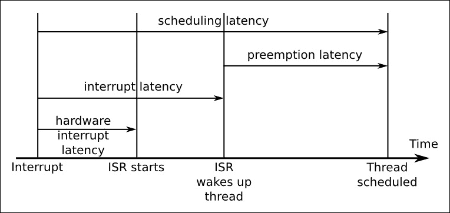

# 第十四章：实时编程

计算机系统与现实世界之间的许多交互都是实时进行的，因此这对于嵌入式系统的开发人员来说是一个重要的主题。到目前为止，我已经在几个地方提到了实时编程：在第十章中，*了解进程和线程*，我研究了调度策略和优先级反转，在第十一章中，*管理内存*，我描述了页面错误的问题和内存锁定的需求。现在，是时候把这些主题联系在一起，深入研究实时编程了。

在本章中，我将首先讨论实时系统的特性，然后考虑应用程序和内核级别的系统设计的影响。我将描述实时内核补丁`PREEMPT_RT`，并展示如何获取它并将其应用于主线内核。最后几节将描述如何使用两个工具`cyclictest`和`Ftrace`来表征系统延迟。

嵌入式 Linux 设备实现实时行为的其他方法，例如，使用专用微控制器或在 Linux 内核旁边使用单独的实时内核，就像 Xenomai 和 RTAI 所做的那样。我不打算在这里讨论这些，因为本书的重点是将 Linux 用作嵌入式系统的核心。

# 什么是实时？

实时编程的性质是软件工程师喜欢长时间讨论的主题之一，通常给出一系列矛盾的定义。我将从阐明我认为实时重要的内容开始。

如果一个任务必须在某个时间点之前完成，这个时间点被称为截止日期，那么这个任务就是实时任务。通过考虑在编译 Linux 内核时在计算机上播放音频流时会发生什么，可以看出实时任务和非实时任务之间的区别。

第一个是实时任务，因为音频驱动程序不断接收数据流，并且必须以播放速率将音频样本块写入音频接口。同时，编译不是实时的，因为没有截止日期。您只是希望它尽快完成；无论它花费 10 秒还是 10 分钟，都不会影响内核的质量。

另一个重要的事情要考虑的是错过截止日期的后果，这可能从轻微的烦恼到系统故障和死亡。以下是一些例子：

+   **播放音频流**：截止日期在几十毫秒的范围内。如果音频缓冲区不足，你会听到点击声，这很烦人，但你会克服它。

+   **移动和点击鼠标**：截止日期也在几十毫秒的范围内。如果错过了，鼠标会移动不稳定，按钮点击将丢失。如果问题持续存在，系统将变得无法使用。

+   **打印一张纸**：纸张进纸的截止日期在毫秒级范围内，如果错过了，可能会导致打印机卡住，有人必须去修理。偶尔卡纸是可以接受的，但没有人会购买一台不断卡纸的打印机。

+   **在生产线上的瓶子上打印保质期**：如果一个瓶子没有被打印，整个生产线必须停止，瓶子被移除，然后重新启动生产线，这是昂贵的。

+   **烘烤蛋糕**：有大约 30 分钟的截止日期。如果你迟到了几分钟，蛋糕可能会被毁掉。如果你迟到了很长时间，房子就会烧毁。

+   **电力浪涌检测系统**：如果系统检测到浪涌，必须在 2 毫秒内触发断路器。未能这样做会损坏设备，并可能伤害或杀死人员。

换句话说，错过截止日期会有许多后果。我们经常谈论这些不同的类别：

+   软实时：截止日期是可取的，但有时会错过而系统不被视为失败。前两个例子就是这样。

+   硬实时：在这里，错过截止日期会产生严重影响。我们可以进一步将硬实时细分为在错过截止日期会产生成本的关键任务系统，比如第四个例子，以及在错过截止日期会对生命和肢体造成危险的安全关键系统，比如最后两个例子。我提出银行的例子是为了表明，并非所有硬实时系统的截止日期都是以微秒计量的。

为安全关键系统编写的软件必须符合各种标准，以确保其能够可靠地执行。对于像 Linux 这样复杂的操作系统来说，要满足这些要求非常困难。

在关键任务系统中，Linux 通常可以用于各种控制系统，这是可能的，也是常见的。软件的要求取决于截止日期和置信水平的组合，这通常可以通过广泛的测试来确定。

因此，要说一个系统是实时的，你必须在最大预期负载下测量其响应时间，并证明它在约定时间内满足截止日期的比例。作为一个经验法则，使用主线内核的良好配置的 Linux 系统适用于截止日期为几十毫秒的软实时任务，而使用`PREEMPT_RT`补丁的内核适用于截止日期为几百微秒的软实时和硬实时的关键任务系统。

创建实时系统的关键是减少响应时间的变化，以便更有信心地确保它们不会被错过；换句话说，你需要使系统更确定性。通常情况下，这是以性能为代价的。例如，缓存通过缩短访问数据项的平均时间来使系统运行得更快，但在缓存未命中的情况下，最大时间更长。缓存使系统更快但不太确定，这与我们想要的相反。

### 提示

实时计算的神话是它很快。事实并非如此，系统越确定性越高，最大吞吐量就越低。

本章的其余部分关注识别延迟的原因以及您可以采取的措施来减少延迟。

# 识别非确定性的来源

从根本上说，实时编程是确保实时控制输出的线程在需要时被调度，从而能够在截止日期之前完成工作。任何阻碍这一点的都是问题。以下是一些问题领域：

+   调度：实时线程必须在其他线程之前被调度，因此它们必须具有实时策略，`SCHED_FIFO`或`SCHED_RR`。此外，它们应该按照我在第十章中描述的速率单调分析理论，按照截止日期最短的顺序分配优先级。

+   调度延迟：内核必须能够在事件（如中断或定时器）发生时立即重新调度，并且不会受到无限延迟的影响。减少调度延迟是本章后面的一个关键主题。

+   优先级反转：这是基于优先级的调度的结果，当高优先级线程在低优先级线程持有的互斥锁上被阻塞时，会导致无限延迟，正如我在第十章中所描述的，*了解进程和线程*。用户空间具有优先级继承和优先级屏障互斥锁；在内核空间中，我们有实时互斥锁，它实现了优先级继承，我将在实时内核部分讨论它。

+   准确的定时器：如果你想要管理毫秒或微秒级别的截止期限，你需要匹配的定时器。高分辨率定时器至关重要，并且几乎所有内核都有配置选项。

+   **页面错误**：在执行关键代码部分时发生页面错误会破坏所有时间估计。您可以通过锁定内存来避免它们，我稍后会详细描述。

+   **中断**：它们在不可预测的时间发生，并且如果突然出现大量中断，可能会导致意外的处理开销。有两种方法可以避免这种情况。一种是将中断作为内核线程运行，另一种是在多核设备上，将一个或多个 CPU 屏蔽免受中断处理的影响。我稍后会讨论这两种可能性。

+   处理器缓存：提供了 CPU 和主内存之间的缓冲区，并且像所有缓存一样，是非确定性的来源，特别是在多核设备上。不幸的是，这超出了本书的范围，但是可以参考本章末尾的参考资料。

+   **内存总线争用**：当外围设备通过 DMA 通道直接访问内存时，它们会占用一部分内存总线带宽，从而减慢 CPU 核心（或核心）的访问速度，因此有助于程序的非确定性执行。然而，这是一个硬件问题，也超出了本书的范围。

我将在接下来的章节中扩展重要问题并看看可以采取什么措施。

列表中缺少的一项是电源管理。实时和电源管理的需求方向相反。在睡眠状态之间切换时，电源管理通常会导致高延迟，因为设置电源调节器和唤醒处理器都需要时间，改变核心时钟频率也需要时间，因为时钟需要时间稳定。但是，你肯定不会期望设备立即从挂起状态响应中断吧？我知道在至少喝一杯咖啡之后我才能开始一天。

# 理解调度延迟

实时线程需要在有任务要做时立即调度。然而，即使没有其他相同或更高优先级的线程，从唤醒事件发生的时间点（中断或系统定时器）到线程开始运行的时间总会有延迟。这称为调度延迟。它可以分解为几个组件，如下图所示：



首先，硬件中断延迟是指从中断被断言直到**ISR**（中断服务例程）开始运行的时间。其中一小部分是中断硬件本身的延迟，但最大的问题是软件中禁用的中断。最小化这种*IRQ 关闭时间*很重要。

接下来是中断延迟，即 ISR 服务中断并唤醒任何等待此事件的线程所需的时间。这主要取决于 ISR 的编写方式。通常应该只需要很短的时间，以微秒为单位。

最后一个延迟是抢占延迟，即内核被通知线程准备运行的时间点到调度器实际运行线程的时间点。这取决于内核是否可以被抢占。如果它正在运行关键部分的代码，那么重新调度将不得不等待。延迟的长度取决于内核抢占的配置。

# 内核抢占

抢占延迟是因为并不总是安全或者希望抢占当前的执行线程并调用调度器。主线 Linux 有三种抢占设置，通过**内核特性** | **抢占模型**菜单选择：

+   `CONFIG_PREEMPT_NONE`：无抢占

+   `CONFIG_PREEMPT_VOLUNTARY`：启用额外的检查以请求抢占

+   `CONFIG_PREEMPT`：允许内核被抢占

设置为`none`时，内核代码将继续执行，直到通过`syscall`返回到用户空间，其中始终允许抢占，或者遇到停止当前线程的睡眠等待。由于它减少了内核和用户空间之间的转换次数，并可能减少了上下文切换的总数，这个选项以牺牲大的抢占延迟为代价，实现了最高的吞吐量。这是服务器和一些桌面内核的默认设置，其中吞吐量比响应性更重要。

第二个选项启用了更明确的抢占点，如果设置了`need_resched`标志，则调用调度程序，这会以略微降低吞吐量的代价减少最坏情况的抢占延迟。一些发行版在桌面上设置了这个选项。

第三个选项使内核可抢占，这意味着中断可以导致立即重新调度，只要内核不在原子上下文中执行，我将在下一节中描述。这减少了最坏情况的抢占延迟，因此，总体调度延迟在典型嵌入式硬件上大约为几毫秒。这通常被描述为软实时选项，大多数嵌入式内核都是以这种方式配置的。当然，总体吞吐量会有所减少，但这通常不如对嵌入式设备具有更确定的调度重要。

# 实时 Linux 内核（PREEMPT_RT）

长期以来一直在努力进一步减少延迟，这个努力被称为内核配置选项的名称为这些功能，`PREEMPT_RT`。该项目由 Ingo Molnar、Thomas Gleixner 和 Steven Rostedt 发起，并多年来得到了许多其他开发人员的贡献。内核补丁位于[`www.kernel.org/pub/linux/kernel/projects/rt`](https://www.kernel.org/pub/linux/kernel/projects/rt)，并且有一个维基，包括一个 FAQ（略有过时），位于[`rt.wiki.kernel.org`](https://rt.wiki.kernel.org)。

多年来，项目的许多部分已经并入了主线 Linux，包括高分辨率定时器、内核互斥锁和线程中断处理程序。然而，核心补丁仍然留在主线之外，因为它们相当具有侵入性，而且（有人声称）只有很小一部分 Linux 用户受益。也许，有一天，整个补丁集将被合并到上游。

中央计划是减少内核在原子上下文中运行的时间，这是不安全调用调度程序并切换到不同线程的地方。典型的原子上下文是内核：

+   正在运行中断或陷阱处理程序

+   持有自旋锁或处于 RCU 临界区。自旋锁和 RCU 是内核锁原语，这里的细节并不相关

+   在调用`preempt_disable()`和`preempt_enable()`之间

+   硬件中断被禁用

`PREEMPT_RT`的更改分为两个主要领域：一个是通过将中断处理程序转换为内核线程来减少中断处理程序的影响，另一个是使锁可抢占，以便线程在持有锁的同时可以休眠。很明显，这些更改会带来很大的开销，这使得平均情况下中断处理变慢，但更加确定，这正是我们所追求的。

# 线程中断处理程序

并非所有中断都是实时任务的触发器，但所有中断都会从实时任务中窃取周期。线程中断处理程序允许将优先级与中断关联，并在适当的时间进行调度，如下图所示：


如果中断处理程序代码作为内核线程运行，那么它就没有理由不被优先级更高的用户空间线程抢占，因此中断处理程序不会增加用户空间线程的调度延迟。自 2.6.30 版起，分线程中断处理程序已成为主线 Linux 的特性。您可以通过使用`request_threaded_irq()`注册单个中断处理程序来请求将其作为线程化，而不是使用普通的`request_irq()`。您可以通过配置内核使所有处理程序成为线程，将分线程中断设置为默认值`CONFIG_IRQ_FORCED_THREADING=y`，除非它们通过设置`IRQF_NO_THREAD`标志明确阻止了这一点。当您应用`PREEMPT_RT`补丁时，默认情况下会将中断配置为线程。以下是您可能看到的示例：

```
# ps -Leo pid,tid,class,rtprio,stat,comm,wchan | grep FF
PID     TID     CLS     RTPRIO  STAT    COMMAND          WCHAN
3       3       FF      1       S      ksoftirqd/0      smpboot_th
7       7       FF      99      S      posixcputmr/0    posix_cpu_
19      19      FF      50      S      irq/28-edma      irq_thread
20      20      FF      50      S      irq/30-edma_err  irq_thread
42      42      FF      50      S      irq/91-rtc0      irq_thread
43      43      FF      50      S      irq/92-rtc0      irq_thread
44      44      FF      50      S      irq/80-mmc0      irq_thread
45      45      FF      50      S      irq/150-mmc0     irq_thread
47      47      FF      50      S      irq/44-mmc1      irq_thread
52      52      FF      50      S      irq/86-44e0b000  irq_thread
59      59      FF      50      S      irq/52-tilcdc    irq_thread
65      65      FF      50      S      irq/56-4a100000  irq_thread
66      66      FF      50      S      irq/57-4a100000  irq_thread
67      67      FF      50      S      irq/58-4a100000  irq_thread
68      68      FF      50      S      irq/59-4a100000  irq_thread
76      76      FF      50      S      irq/88-OMAP UAR  irq_thread

```

在这种情况下，运行`linux-yocto-rt`的 BeagleBone 只有`gp_timer`中断没有被线程化。定时器中断处理程序以内联方式运行是正常的。

### 注意

请注意，中断线程都已被赋予默认策略`SCHED_FIFO`和优先级`50`。然而，将它们保留为默认值是没有意义的；现在是您根据中断的重要性与实时用户空间线程相比分配优先级的机会。

以下是建议的降序线程优先级顺序：

+   POSIX 计时器线程`posixcputmr`应始终具有最高优先级。

+   与最高优先级实时线程相关的硬件中断。

+   最高优先级的实时线程。

+   逐渐降低优先级的实时线程的硬件中断，然后是线程本身。

+   非实时接口的硬件中断。

+   软中断守护程序`ksoftirqd`，在 RT 内核上负责运行延迟中断例程，并且在 Linux 3.6 之前负责运行网络堆栈、块 I/O 层和其他内容。您可能需要尝试不同的优先级级别以获得平衡。

您可以使用`chrt`命令作为引导脚本的一部分来更改优先级，使用类似以下的命令：

```
# chrt -f -p 90 `pgrep irq/28-edma`

```

`pgrep`命令是`procps`软件包的一部分。

# 可抢占内核锁

使大多数内核锁可抢占是`PREEMPT_RT`所做的最具侵入性的更改，这段代码仍然在主线内核之外。

问题出现在自旋锁上，它们用于大部分内核锁定。自旋锁是一种忙等待互斥锁，在争用情况下不需要上下文切换，因此只要锁定时间很短，它就非常高效。理想情况下，它们应该被锁定的时间少于两次重新调度所需的时间。以下图表显示了在两个不同 CPU 上运行的线程争用相同自旋锁的情况。**CPU0**首先获得它，迫使**CPU1**自旋，等待直到它被解锁：


持有自旋锁的线程不能被抢占，因为这样做可能会使新线程进入相同的代码并在尝试锁定相同自旋锁时发生死锁。因此，在主线 Linux 中，锁定自旋锁会禁用内核抢占，创建原子上下文。这意味着持有自旋锁的低优先级线程可以阻止高优先级线程被调度。

### 注意

`PREEMPT_RT`采用的解决方案是用 rt-mutexes 几乎替换所有自旋锁。互斥锁比自旋锁慢，但是完全可抢占。不仅如此，rt-mutexes 实现了优先级继承，因此不容易发生优先级反转。

# 获取 PREEMPT_RT 补丁

RT 开发人员不会为每个内核版本创建补丁集，因为这需要大量的工作。平均而言，他们为每个其他内核创建补丁。在撰写本文时支持的最新内核版本如下：

+   4.1-rt

+   4.0-rt

+   3.18-rt

+   3.14-rt

+   3.12-rt

+   3.10-rt

这些补丁可以在[`www.kernel.org/pub/linux/kernel/projects/rt`](https://www.kernel.org/pub/linux/kernel/projects/rt)上找到。

如果您正在使用 Yocto 项目，那么内核已经有了`rt`版本。否则，您获取内核的地方可能已经应用了`PREEMPT_RT`补丁。否则，您将不得不自己应用补丁。首先确保`PREEMPT_RT`补丁版本与您的内核版本完全匹配，否则您将无法干净地应用补丁。然后按照正常方式应用，如下所示：

```
$ cd linux-4.1.10
$ zcat patch-4.1.10-rt11.patch.gz | patch -p1

```

然后，您将能够使用`CONFIG_PREEMPT_RT_FULL`配置内核。

最后一段有一个问题。RT 补丁只有在使用兼容的主线内核时才会应用。您可能不会使用兼容的内核，因为这是嵌入式 Linux 内核的特性，因此您将不得不花一些时间查看失败的补丁并修复它们，然后分析您的目标的板支持并添加任何缺失的实时支持。这些细节再次超出了本书的范围。如果您不确定该怎么做，您应该向您正在使用的内核的开发人员和内核开发人员论坛咨询。

## Yocto 项目和 PREEMPT_RT

Yocto 项目提供了两个标准的内核配方：`linux-yocto`和`linux-yoco-rt`，后者已经应用了实时补丁。假设您的目标受到这些内核的支持，那么您只需要选择`linux-yocto-rt`作为首选内核，并声明您的设备兼容，例如，通过向您的`conf/local.conf`添加类似以下的行：

```
PREFERRED_PROVIDER_virtual/kernel = "linux-yocto-rt"
COMPATIBLE_MACHINE_beaglebone = "beaglebone"
```

# 高分辨率定时器

如果您有精确的定时要求，这在实时应用程序中很典型，那么定时器分辨率就很重要。Linux 中的默认定时器是以可配置速率运行的时钟，嵌入式系统通常为 100 赫兹，服务器和台式机通常为 250 赫兹。两个定时器滴答之间的间隔称为**jiffy**，在上面的示例中，嵌入式 SoC 上为 10 毫秒，服务器上为 4 毫秒。

Linux 在 2.6.18 版本中从实时内核项目中获得了更精确的定时器，现在它们在所有平台上都可用，只要有高分辨率定时器源和设备驱动程序——这几乎总是如此。您需要使用`CONFIG_HIGH_RES_TIMERS=y`配置内核。

启用此功能后，所有内核和用户空间时钟都将准确到基础硬件的粒度。找到实际的时钟粒度很困难。显而易见的答案是`clock_getres(2)`提供的值，但它总是声称分辨率为一纳秒。我将在后面描述的`cyclictest`工具有一个选项，用于分析时钟报告的时间以猜测分辨率：

```
# cyclictest -R
# /dev/cpu_dma_latency set to 0us
WARN: reported clock resolution: 1 nsec
WARN: measured clock resolution approximately: 708 nsec
You can also look at the kernel log messages for strings like this:
# dmesg | grep clock
OMAP clockevent source: timer2 at 24000000 Hz
sched_clock: 32 bits at 24MHz, resolution 41ns, wraps every 178956969942ns
OMAP clocksource: timer1 at 24000000 Hz
Switched to clocksource timer1

```

这两种方法给出了不同的数字，我无法给出一个好的解释，但由于两者都低于一微秒，我很满意。

# 在实时应用程序中避免页面错误

当应用程序读取或写入未提交到物理内存的内存时，会发生页面错误。不可能（或者非常困难）预测何时会发生页面错误，因此它们是计算机中另一个非确定性的来源。

幸运的是，有一个函数可以让您为进程提交所有内存并将其锁定，以便它不会引起页面错误。这就是`mlockall(2)`。这是它的两个标志：

+   `MCL_CURRENT`：锁定当前映射的所有页面

+   `MCL_FUTURE`：锁定稍后映射的页面

通常在应用程序启动时调用`mlockall(2)`，同时设置两个标志以锁定所有当前和未来的内存映射。

### 提示

请注意，`MCL_FUTURE`并不是魔法，使用`malloc()/free()`或`mmap()`分配或释放堆内存时仍会存在非确定性延迟。这些操作最好在启动时完成，而不是在主控循环中完成。

在堆栈上分配的内存更加棘手，因为它是自动完成的，如果您调用一个使堆栈比以前更深的函数，您将遇到更多的内存管理延迟。一个简单的解决方法是在启动时将堆栈增大到比您预期需要的更大的尺寸。代码看起来像这样：

```
#define MAX_STACK (512*1024)
static void stack_grow (void)
{
  char dummy[MAX_STACK];
  memset(dummy, 0, MAX_STACK);
  return;
}

int main(int argc, char* argv[])
{
  [...]
  stack_grow ();
  mlockall(MCL_CURRENT | MCL_FUTURE);
  [...]
```

`stack_grow()`函数在堆栈上分配一个大变量，然后将其清零，以强制将这些内存页分配给该进程。

# 中断屏蔽

使用线程化中断处理程序有助于通过以比不影响实时任务的中断处理程序更高的优先级运行一些线程来减轻中断开销。如果您使用多核处理器，您可以采取不同的方法，完全屏蔽一个或多个核心的处理中断，从而使它们专用于实时任务。这适用于普通的 Linux 内核或`PREEMPT_RT`内核。

实现这一点的关键是将实时线程固定到一个 CPU，将中断处理程序固定到另一个 CPU。您可以使用命令行工具`taskset`设置线程或进程的 CPU 亲和性，也可以使用`sched_setaffinity(2)`和`pthread_setaffinity_np(3)`函数。

要设置中断的亲和性，首先注意`/proc/irq/<IRQ number>`中有每个中断号的子目录。其中包括中断的控制文件，包括`smp_affinity`中的 CPU 掩码。向该文件写入一个位掩码，其中每个允许处理该 IRQ 的 CPU 都设置了一个位。

# 测量调度延迟

您可能进行的所有配置和调整都将是无意义的，如果您不能证明您的设备满足截止日期。最终测试需要您自己的基准测试，但我将在这里描述两个重要的测量工具：`cyclictest`和`Ftrace`。

## cyclictest

`cyclictest` 最初由 Thomas Gleixner 编写，现在在大多数平台上都可以在名为`rt-tests`的软件包中使用。如果您使用 Yocto Project，可以通过构建实时镜像配方来创建包含`rt-tests`的目标镜像，方法如下：

```
$ bitbake core-image-rt

```

如果您使用 Buildroot，您需要在菜单**目标软件包** | **调试、性能分析和基准测试** | **rt-tests**中添加软件包`BR2_PACKAGE_RT_TESTS`。

`cyclictest` 通过比较实际休眠所需的时间和请求的时间来测量调度延迟。如果没有延迟，它们将是相同的，报告的延迟将为零。`cyclictest` 假设定时器分辨率小于一微秒。

它有大量的命令行选项。首先，您可以尝试在目标上以 root 身份运行此命令：

```
# cyclictest -l 100000 -m -n -p 99
# /dev/cpu_dma_latency set to 0us
policy: fifo: loadavg: 1.14 1.06 1.00 1/49 320

T: 0 (  320) P:99 I:1000 C: 100000 Min:  9 Act:  13 Avg:  15 Max:  134

```

所选的选项如下：

+   `-l N`: 循环 N 次：默认为无限

+   `-m`: 使用 mlockall 锁定内存

+   `-n`: 使用`clock_nanosleep(2)`而不是`nanosleep(2)`

+   `-p N`: 使用实时优先级`N`

结果行从左到右显示以下内容：

+   `T: 0`: 这是线程 0，这次运行中唯一的线程。您可以使用参数`-t`设置线程数。

+   `(320)`: 这是 PID 320。

+   `P:99`: 优先级为 99。

+   `I:1000`: 循环之间的间隔为 1,000 微秒。您可以使用参数`-i N`设置间隔。

+   `C:100000`: 该线程的最终循环计数为 100,000。

+   `Min: 9`: 最小延迟为 9 微秒。

+   `Act:13`: 实际延迟为 13 微秒。实际延迟是最近的延迟测量，只有在观察`cyclictest`运行时才有意义。

+   `Avg:15`: 平均延迟为 15 微秒。

+   `Max:134`: 最大延迟为 134 微秒。

这是在运行未修改的`linux-yocto`内核的空闲系统上获得的，作为该工具的快速演示。要真正有用，您需要在运行负载代表您期望的最大负载的同时，进行 24 小时或更长时间的测试。

`cyclictest`生成的数字中，最大延迟是最有趣的，但了解值的分布也很重要。您可以通过添加`-h <N>`来获得最多迟到`N`微秒的样本的直方图。使用这种技术，我在相同的目标板上运行了没有抢占、标准抢占和 RT 抢占的内核，同时通过洪水 ping 加载以太网流量，获得了三个跟踪。命令行如下所示：

```
# cyclictest -p 99 -m -n -l 100000 -q -h 500 > cyclictest.data

```

以下是没有抢占生成的输出：


没有抢占时，大多数样本在截止日期之前 100 微秒内，但有一些离群值高达 500 微秒，这基本上是您所期望的。

这是使用标准抢占生成的输出：


有抢占时，样本在较低端分布，但没有超过 120 微秒的情况。

这是使用 RT 抢占生成的输出：


RT 内核是明显的赢家，因为一切都紧密地集中在 20 微秒左右，没有超过 35 微秒的情况。

因此，`cyclictest`是调度延迟的标准度量。但它无法帮助您识别和解决内核延迟的特定问题。为此，您需要`Ftrace`。

## 使用 Ftrace

内核函数跟踪器有跟踪器可帮助跟踪内核延迟，这也是它最初编写的目的。这些跟踪器捕获了在运行过程中检测到的最坏情况延迟的跟踪，显示导致延迟的函数。感兴趣的跟踪器以及内核配置参数如下：

+   `irqsoff`：`CONFIG_IRQSOFF_TRACER`跟踪禁用中断的代码，记录最坏情况

+   `preemptoff`：`CONFIG_PREEMPT_TRACER`类似于`irqsoff`，但跟踪内核抢占被禁用的最长时间（仅适用于可抢占内核）

+   `preemptirqsoff`：它结合了前两个跟踪，记录了禁用`irqs`和/或抢占的最长时间

+   `wakeup`：跟踪并记录唤醒后最高优先级任务被调度所需的最大延迟

+   `wakeup_rt`：与唤醒相同，但仅适用于具有`SCHED_FIFO`、`SCHED_RR`或`SCHED_DEADLINE`策略的实时线程

+   `wakeup_dl`：与唤醒相同，但仅适用于具有`SCHED_DEADLINE`策略的截止线程

请注意，运行`Ftrace`会增加大量延迟，每次捕获新的最大值时，`Ftrace`本身可以忽略。但是，它会扭曲用户空间跟踪器（如`cyclictest`）的结果。换句话说，如果您在捕获跟踪时运行`cyclictest`，请忽略其结果。

选择跟踪器与我们在第十三章中看到的函数跟踪器相同，*性能分析和跟踪*。以下是捕获禁用抢占的最长时间的跟踪 60 秒的示例：

```
# echo preemptoff > /sys/kernel/debug/tracing/current_tracer
# echo 0 > /sys/kernel/debug/tracing/tracing_max_latency
# echo 1  > /sys/kernel/debug/tracing/tracing_on
# sleep 60
# echo 0  > /sys/kernel/debug/tracing/tracing_on

```

生成的跟踪，经过大量编辑，看起来像这样：

```
# cat /sys/kernel/debug/tracing/trace
# tracer: preemptoff
#
# preemptoff latency trace v1.1.5 on 3.14.19-yocto-standard
# --------------------------------------------------------------------
# latency: 1160 us, #384/384, CPU#0 | (M:preempt VP:0, KP:0, SP:0 HP:0)
#    -----------------
#    | task: init-1 (uid:0 nice:0 policy:0 rt_prio:0)
#    -----------------
#  => started at: ip_finish_output
#  => ended at:   __local_bh_enable_ip
#
#
#                  _------=> CPU#
#                 / _-----=> irqs-off
#                | / _----=> need-resched
#                || / _---=> hardirq/softirq
#                ||| / _--=> preempt-depth
#                |||| /     delay
#  cmd     pid   ||||| time  |   caller
#     \   /      |||||  \    |   /
 init-1       0..s.    1us+: ip_finish_output
 init-1       0d.s2   27us+: preempt_count_add <-cpdma_chan_submit
 init-1       0d.s3   30us+: preempt_count_add <-cpdma_chan_submit
 init-1       0d.s4   37us+: preempt_count_sub <-cpdma_chan_submit

[...]

 init-1       0d.s2 1152us+: preempt_count_sub <-__local_bh_enable
 init-1       0d..2 1155us+: preempt_count_sub <-__local_bh_enable_ip
 init-1       0d..1 1158us+: __local_bh_enable_ip
 init-1       0d..1 1162us!: trace_preempt_on <-__local_bh_enable_ip
 init-1       0d..1 1340us : <stack trace>

```

在这里，您可以看到在运行跟踪时禁用内核抢占的最长时间为 1,160 微秒。通过阅读`/sys/kernel/debug/tracing/tracing_max_latency`，可以获得这个简单的事实，但上面的跟踪进一步提供了导致该测量的内核函数调用序列。标记为`delay`的列显示了每个函数被调用的时间，最后一次调用是在`1162us`时的`trace_preempt_on()`，在这一点上内核抢占再次被启用。有了这些信息，您可以回顾调用链，并（希望）弄清楚这是否是一个问题。

提到的其他跟踪器工作方式相同。

## 结合 cyclictest 和 Ftrace

如果`cyclictest`报告出现意外长的延迟，您可以使用`breaktrace`选项中止程序并触发`Ftrace`以获取更多信息。

您可以使用`-b<N>`或`--breaktrace=<N>`来调用 breaktrace，其中`N`是将触发跟踪的延迟的微秒数。您可以使用`-T[tracer name]`或以下之一选择`Ftrace`跟踪器：

+   `-C`：上下文切换

+   `-E`：事件

+   -`f`：函数

+   `-w`：唤醒

+   `-W`：唤醒-rt

例如，当测量到大于 100 微秒的延迟时，这将触发`Ftrace`函数跟踪器：

```
# cyclictest -a -t -n -p99 -f -b100

```

# 进一步阅读

以下资源提供了有关本章介绍的主题的更多信息：

+   *硬实时计算系统：可预测的调度算法和应用*，作者*Buttazzo*，*Giorgio*，*Springer*，2011

+   *多核应用程序编程*，作者*Darryl Gove*，*Addison Wesley*，2011

# 总结

实时这个术语是没有意义的，除非您用截止日期和可接受的错过率来限定它。当您知道这一点时，您可以确定 Linux 是否适合作为操作系统的候选，并且开始调整系统以满足要求。调整 Linux 和您的应用程序以处理实时事件意味着使其更具确定性，以便它可以在截止日期内可靠地处理数据。确定性通常是以总吞吐量为代价的，因此实时系统无法处理与非实时系统一样多的数据。

不可能提供数学证明，证明像 Linux 这样的复杂操作系统总是能满足给定的截止日期，因此唯一的方法是通过使用`cyclictest`和`Ftrace`等工具进行广泛测试，更重要的是使用您自己的应用程序的基准测试。

为了提高确定性，您需要考虑应用程序和内核。在编写实时应用程序时，您应该遵循本章关于调度、锁定和内存的指导方针。

内核对系统的确定性有很大影响。幸运的是，多年来已经进行了大量工作。启用内核抢占是一个很好的第一步。如果您发现它错过截止日期的频率比您想要的要高，那么您可能需要考虑`PREEMPT_RT`内核补丁。它们确实可以产生低延迟，但它们尚未纳入主线内核，这意味着您可能在将它们与特定板子的供应商内核集成时遇到问题。您可能需要使用`Ftrace`和类似工具来找出延迟的原因。

这就是我对嵌入式 Linux 的剖析的结束。作为嵌入式系统工程师需要具备广泛的技能，从对硬件的低级了解，系统引导程序的工作原理以及内核与其交互的方式，到成为一个能够配置用户应用程序并调整其以高效方式运行的优秀系统工程师。所有这些都必须在几乎总是只能胜任任务的硬件上完成。有一句话概括了这一切，“一个工程师可以用一美元做到别人用两美元才能做到的事情”。我希望您能够通过我在本书中提供的信息实现这一点。
