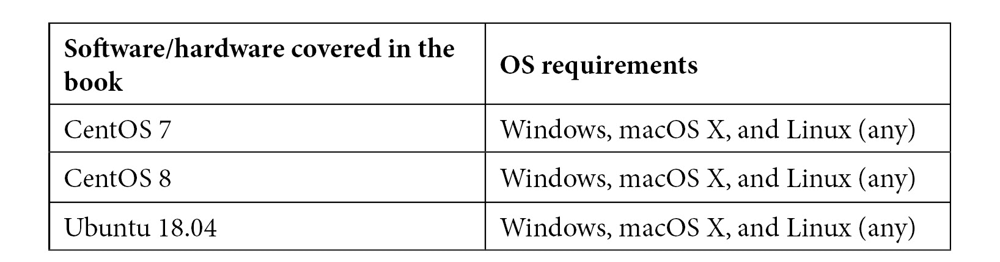

# 前言

《精通 KVM 虚拟化》是一本应该让你在阅读本书的过程中从零到英雄的书。这本书是 KVM 所提供的一切的大集合，适用于 DevOps 和普通系统管理人员，以及开发人员。我们希望通过阅读本书，你能够理解 KVM 的内部工作原理，以及更高级的概念和中间的一切。无论你是刚刚开始接触 KVM 虚拟化，还是已经很熟悉，你都应该在本书的页面上找到一些有价值的信息。

# 这本书适合谁

本书适用于 Linux 初学者和专业人士，因为它并不一定需要事先对 Linux 有高级知识。随着你阅读本书，我们会带你走向成功——这是学习过程的一个组成部分。如果你对 KVM、OpenStack、ELK Stack、Eucalyptus 或 AWS 感兴趣，我们都有涵盖。

# 本书涵盖的内容

*第一章*，*理解 Linux 虚拟化*，讨论了不同类型的虚拟化、Hypervisor 类型和 Linux 虚拟化概念（Xen 和 KVM）。在本章中，我们试图从高层次的角度解释 Linux 虚拟化的一些基础知识以及它如何适应云环境。

*第二章*，*KVM 作为虚拟化解决方案*，从讨论虚拟化概念和虚拟化环境的需求开始，解释了虚拟化的基本硬件和软件方面，以及虚拟化的各种方法。在本章中，我们开始讨论 KVM 和 libvirt，这些概念将贯穿本书始终。

*第三章*，*安装 KVM Hypervisor、libvirt 和 oVirt*，扩展了*第二章*，引入了一些新概念，包括 oVirt，这是一个可以用来管理我们虚拟化 Linux 基础设施的 GUI。我们将带你了解硬件是否兼容 KVM 的过程，介绍一些虚拟机部署的基本命令，然后解释在相同场景中如何使用 oVirt。

*第四章*，*Libvirt 网络*，解释了 libvirt 如何与各种网络概念交互——不同模式下的虚拟交换机、如何使用 CLI 工具管理 libvirt 网络、TAP 和 TUN 设备、Linux 桥接和 Open vSwitch。之后，我们通过使用 SR-IOV 讨论了更极端的网络示例，这是一个应该让我们获得最低延迟和最高吞吐量的概念，在每一毫秒都很重要的情况下使用。

*第五章*，*Libvirt 存储*，是一个重要章节，因为存储概念在构建虚拟化和云环境时非常重要。我们讨论了 KVM 支持的每种存储类型——本地存储池、NFS、iSCSI、SAN、Ceph、Gluster、多路径和冗余、虚拟磁盘类型等等。我们还为你展示了存储的未来——包括 NVMe 和 NVMeoF 等技术。

*第六章*，*虚拟显示设备和协议*，讨论了各种虚拟机显示类型、远程协议，包括 VNC 和 Spice，以及 NoVNC，它确保了显示的可移植性，因为我们可以在 Web 浏览器中使用 NoVNC 来使用虚拟机控制台。

*第七章*，*虚拟机：安装、配置和生命周期管理*，介绍了部署和配置 KVM 虚拟机的其他方法，以及迁移过程，这对任何类型的生产环境都非常重要。

第八章《创建和修改 VM 磁盘、模板和快照》，讨论了各种虚拟机镜像类型、虚拟机模板化过程、快照的使用以及在使用快照时的一些用例和最佳实践。它还作为下一章的介绍，在下一章中，我们将以更加流畅的方式使用模板化和虚拟机磁盘来定制虚拟机引导后使用`cloud-init`和`cloudbase-init`。

第九章《使用 cloud-init 自定义虚拟机》，讨论了云环境中最基本的概念之一-如何在虚拟机镜像/模板引导后进行定制。Cloud-init 在几乎所有的云环境中用于进行引导后的 Linux 虚拟机配置，我们解释了它的工作原理以及如何在您的环境中使其工作。

第十章《自动化 Windows 客户端部署和定制化》，是第九章的延续，重点关注 Microsoft Windows 虚拟机模板化和引导后定制化。为此，我们使用了 cloudbase-init，这个概念基本上与 cloud-init 相同，但仅适用于基于 Microsoft 的操作系统。

第十一章《Ansible 和编排自动化脚本》，带领我们踏上 Ansible 之旅的第一部分-部署 AWX 和 Ansible，并描述如何在基于 KVM 的环境中使用这些概念。这只是现代 IT 中使用的 Ansible 使用模型之一，因为整个 DevOps 和基础设施即代码的故事在全球范围内得到了更多的关注。

第十二章《使用 OpenStack 扩展 KVM》，讨论了基于 KVM 构建云环境的过程。当使用 KVM 时，OpenStack 是交付这一点的标准方法。在本章中，我们讨论了所有 OpenStack 构建块和服务，如何从头开始部署它，并描述了如何在生产环境中使用它。

第十三章《使用 AWS 扩展 KVM》，带领我们走向使用公共和混合云概念的旅程，使用 Amazon Web Services（AWS）。与几乎所有其他章节一样，这是一个非常实践性的章节，您也可以用它来对 AWS 有所了解，这对于在本章末使用 Eucalyptus 部署混合云基础设施至关重要。

第十四章《监控 KVM 虚拟化平台》，介绍了通过 Elasticsearch、Logstash、Kibana（ELK）堆栈进行监控的非常流行的概念。它还带领您完成了设置和集成 ELK 堆栈与您的 KVM 基础设施的整个过程，一直到最终结果-使用仪表板和 UI 来监视您的基于 KVM 的环境。

第十五章《KVM 虚拟机性能调优和优化》，讨论了在基于 KVM 的环境中调优和优化的各种方法，通过解构所有基础设施设计原则并将其正确使用。我们在这里涵盖了许多高级主题- NUMA、KSM、CPU 和内存性能、CPU 绑定、VirtIO 的调优以及块和网络设备。

*第十六章*，*KVM 平台故障排除指南*，从基础知识开始-故障排除 KVM 服务和日志记录，并解释了 KVM 和 oVirt、Ansible 和 OpenStack、Eucalyptus 和 AWS 的各种故障排除方法。这些都是我们在撰写本书时在生产环境中遇到的真实问题。在本章中，我们基本上讨论了与本书的每一章相关的问题，包括与快照和模板相关的问题。

# 充分利用本书

我们假设您至少具有基本的 Linux 知识和安装虚拟机的先验经验作为本书的先决条件。



# 实际代码演示

本书的实际代码演示视频可在[`bit.ly/32IHMdO`](https://bit.ly/32IHMdO)上观看。

# 下载彩色图像

我们还提供了一个 PDF 文件，其中包含本书中使用的屏幕截图/图表的彩色图像。您可以在这里下载：[`www.packtpub.com/sites/default/files/downloads/9781838828714_ColorImages.pdf`](http://www.packtpub.com/sites/default/files/downloads/9781838828714_ColorImages.pdf)

# 使用的约定

本书中使用了许多文本约定。

`文本中的代码`：表示文本中的代码单词、数据库表名、文件夹名、文件名、文件扩展名、路径名、虚拟 URL、用户输入和 Twitter 句柄。这是一个例子：“我们需要做的就是取消注释配置文件中定义的一个管道，该文件位于`/etc/logstash`文件夹中。”

代码块设置如下：

```
<memoryBacking>
    <locked/>
</memoryBacking>
```

当我们希望引起您对代码块的特定部分的注意时，相关行或项目将以粗体显示：

```
POWER TTWU_QUEUE NO_FORCE_SD_OVERLAP RT_RUNTIME_SHARE NO_LB_MIN NUMA 
NUMA_FAVOUR_HIGHER NO_NUMA_RESIST_LOWER
```

**粗体**：表示新术语、重要单词或屏幕上看到的单词。例如，菜单或对话框中的单词会在文本中以这种方式出现。这是一个例子：“在您点击**刷新**按钮之后，新数据应该出现在页面上。”

提示或重要说明

出现在这样。

# 联系我们

我们始终欢迎读者的反馈。

**一般反馈**：如果您对本书的任何方面有疑问，请在邮件主题中提及书名，并发送电子邮件至 customercare@packtpub.com 与我们联系。

**勘误**：尽管我们已经尽最大努力确保内容的准确性，但错误确实会发生。如果您在本书中发现错误，我们将不胜感激。请访问[www.packtpub.com/support/errata](http://www.packtpub.com/support/errata)，选择您的书籍，点击勘误提交表单链接，并输入详细信息。

**盗版**：如果您在互联网上发现我们作品的任何非法副本，请向我们提供位置地址或网站名称，我们将不胜感激。请通过 copyright@packt.com 与我们联系，并提供材料链接。

**如果您有兴趣成为作者**：如果您在某个专题上有专业知识，并且有兴趣撰写或为一本书做出贡献，请访问[authors.packtpub.com](http://authors.packtpub.com)。

# 评论

请留下评论。阅读并使用本书后，为什么不在购买书籍的网站上留下评论呢？潜在读者可以看到并使用您的客观意见来做出购买决定，我们在 Packt 可以了解您对我们产品的看法，我们的作者也可以看到您对他们书籍的反馈。谢谢！

有关 Packt 的更多信息，请访问[packt.com](http://packt.com)。
