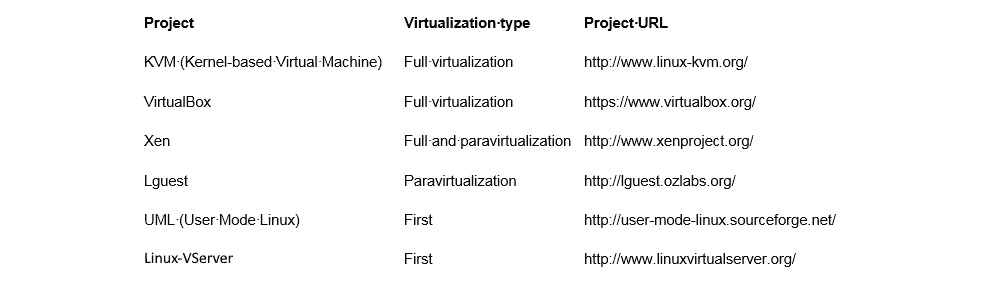
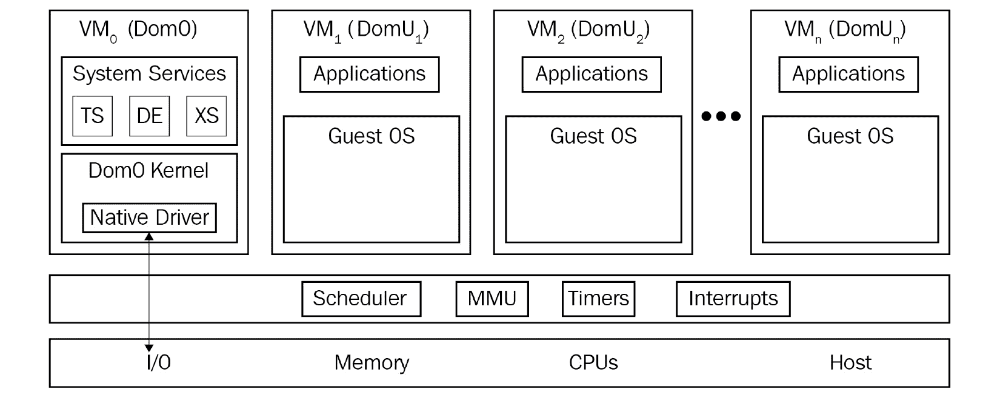

# 第一章：*第一章*：理解 Linux 虚拟化

虚拟化是一项技术，它引发了 IT 整合的重大技术转变，提供了更有效地利用资源的方式，云作为虚拟化的一个更综合、自动化和编排的版本，重点不仅在于虚拟机，还在于其他附加服务。本书共有 16 章，所有这些章节都已经安排好，以涵盖基于内核的虚拟机（KVM）虚拟化的所有重要方面。我们将从 KVM 的基本主题开始，如虚拟化概念的历史和 Linux 虚拟化，然后继续查看 KVM 的高级主题，如自动化、编排、虚拟网络、存储和故障排除。本章将为您提供有关 Linux 虚拟化中主导技术及其优势的见解。

在本章中，我们将涵盖以下主题：

+   Linux 虚拟化及其基本概念

+   虚拟化的类型

+   Hypervisor/VMM

+   开源虚拟化项目

+   Linux 虚拟化在云中为您提供了什么

# Linux 虚拟化及其起源

虚拟化是一种概念，它创建虚拟化资源并将其映射到物理资源。这个过程可以使用特定的硬件功能（通过某种分区控制器进行分区）或软件功能（hypervisor）来完成。因此，举个例子，如果你有一台物理 PC 服务器，有 16 个核心运行一个 hypervisor，你可以轻松地创建一个或多个每个有两个核心的虚拟机并启动它们。关于你可以启动多少虚拟机的限制是基于供应商的。例如，如果你运行 Red Hat Enterprise Virtualization v4.x（基于 KVM 的裸机 hypervisor），你可以使用高达 768 个逻辑 CPU 核心或线程（你可以在[`access.redhat.com/articles/906543`](https://access.redhat.com/articles/906543)上阅读更多信息）。无论如何，hypervisor 将是*首选*，它将尽可能有效地管理，以便所有虚拟机工作负载尽可能多地占用 CPU 时间。

我清楚地记得在 2004 年写了我的第一篇关于虚拟化的文章。AMD 在 2003 年推出了它的第一款消费级 64 位 CPU（Athlon 64，Opteron），这让我有点困惑。英特尔还有点犹豫是否推出 64 位 CPU - 缺乏 64 位微软 Windows 操作系统可能也有一些关系。Linux 已经支持 64 位，但这是 PC 市场即将迎来许多新事物的黎明。虚拟化本身并不是一个革命性的想法，因为其他公司已经有非 x86 产品可以进行几十年的虚拟化（例如，IBM CP-40 及其 S/360-40，从 1967 年开始）。但对于 PC 市场来说，这肯定是一个新的想法，当时市场正处于许多事情同时发生的奇怪阶段。从 64 位 CPU 切换到多核 CPU，然后从 DDR1 切换到 DDR2，再从 PCI/ISA/AGP 切换到 PCI Express，你可以想象，这是一个具有挑战性的时期。

具体来说，我记得曾经想过各种可能性 - 在一个操作系统上运行另一个操作系统，然后在其上运行另外几个操作系统是多么酷。在出版行业工作，你可以想象这将为任何人的工作流程提供多少优势，我记得当时真的很兴奋。

15 年左右的发展之后，我们现在在虚拟化解决方案方面有了一个竞争激烈的市场 - 红帽公司的 KVM，微软的 Hyper-V，VMware 的 ESXi，甲骨文的 Oracle VM，谷歌和其他关键参与者为用户和市场主导地位而争夺。这导致了各种云解决方案的发展，如 EC2，AWS，Office 365，Azure，vCloud Director 和 vRealize Automation，用于各种类型的云服务。总的来说，对于 IT 来说，这是一个非常富有成效的 15 年，你不觉得吗？

然而，回到 2003 年 10 月，随着 IT 行业发生的种种变化，有一个对于这本书和 Linux 虚拟化来说非常重要的变化：第一个针对 x86 架构的开源 Hypervisor——**Xen**的推出。它支持各种 CPU 架构（Itanium、x86、x86_64 和 ARM），可以运行各种操作系统，包括 Windows、Linux、Solaris 和一些 BSD 的变种。它仍然作为一种虚拟化解决方案存在并且备受一些供应商的青睐，比如 Citrix（XenServer）和 Oracle（Oracle VM）。我们稍后会在本章节中详细介绍 Xen 的更多技术细节。

在开源市场中最大的企业参与者 Red Hat 在其 Red Hat Enterprise Linux 5 的最初版本中包含了 Xen 虚拟化，该版本于 2007 年发布。但 Xen 和 Red Hat 并不是天作之合，尽管 Red Hat 在其 Red Hat Enterprise Linux 5 发行版中搭载了 Xen，但在 2010 年的 Red Hat Enterprise Linux 6 中，Red Hat 转向了**KVM**，这在当时是一个非常冒险的举动。实际上，从之前的版本 5.3/5.4 开始，即 2009 年发布的两个版本，从 Xen 迁移到 KVM 的整个过程就已经开始了。要把事情放到背景中，当时 KVM 还是一个相当年轻的项目，只有几年的历史。但为什么会发生这种情况有很多合理的原因，从*Xen 不在主线内核中，KVM 在*，到政治原因（Red Hat 希望对 Xen 的开发拥有更多的影响力，而这种影响力随着时间的推移而逐渐减弱）。

从技术上讲，KVM 采用了一种不同的模块化方法，将 Linux 内核转换为支持的 CPU 架构的完全功能的 Hypervisor。当我们说*支持的 CPU 架构*时，我们指的是 KVM 虚拟化的基本要求——CPU 需要支持硬件虚拟化扩展，即 AMD-V 或 Intel VT。简单来说，你真的需要非常努力才能找到一个不支持这些扩展的现代 CPU。例如，如果你在服务器或台式电脑上使用的是英特尔 CPU，那么首批支持硬件虚拟化扩展的 CPU 可以追溯到 2006 年（Xeon LV）和 2008 年（Core i7 920）。同样，我们稍后会在本章节和下一章节中详细介绍 KVM 的更多技术细节，并对 KVM 和 Xen 进行比较。

# 虚拟化类型

有各种类型的虚拟化解决方案，它们都针对不同的用例，并且取决于我们虚拟化的硬件或软件堆栈的不同部分，也就是*你*在虚拟化什么。值得注意的是，从*如何*虚拟化的角度来看，也有不同类型的虚拟化——包括分区、完全虚拟化、半虚拟化、混合虚拟化或基于容器的虚拟化。

因此，让我们首先介绍今天 IT 领域中基于*你*在虚拟化什么的五种不同类型的虚拟化：

+   桌面虚拟化（虚拟桌面基础设施（VDI））：这被许多企业公司使用，并在许多场景中提供巨大优势，因为用户不依赖于用于访问其桌面系统的特定设备。他们可以从手机、平板电脑或计算机连接，并且通常可以从任何地方连接到他们的虚拟桌面，就像他们坐在工作场所使用硬件计算机一样。优势包括更容易的集中管理和监控，更简化的更新工作流程（您可以在 VDI 解决方案中更新数百台虚拟机的基础映像，并在维护时间重新链接到数百台虚拟机），简化的部署流程（不再需要在台式机、工作站或笔记本电脑上进行物理安装，以及集中应用程序管理的可能性），以及更容易管理合规性和安全相关选项。

+   服务器虚拟化：这是今天绝大多数 IT 公司使用的技术。它提供了与常规物理服务器相比更好的服务器虚拟机整合，同时在常规物理服务器上提供了许多其他操作优势-更容易备份，更节能，在服务器之间移动工作负载更自由等。

+   应用程序虚拟化：通常使用一些流式传输/远程协议技术来实现，例如 Microsoft App-V，或者一些可以将应用程序打包成可以挂载到虚拟机并进行一致设置和交付选项的卷的解决方案，例如 VMware App Volumes。

+   网络虚拟化（以及更广泛的基于云的概念称为软件定义网络（SDN））：这是一种创建独立于物理网络设备（如交换机）的虚拟网络的技术。在更大的范围上，SDN 是网络虚拟化理念的延伸，可以跨越多个站点、位置或数据中心。在 SDN 的概念中，整个网络配置都是在软件中完成的，而不一定需要特定的物理网络配置。网络虚拟化的最大优势在于，您可以轻松管理跨多个位置的复杂网络，而无需对网络数据路径上的所有物理设备进行大规模的物理网络重新配置。这个概念将在第四章《libvirt 网络》和第十二章《使用 OpenStack 扩展 KVM》中进行解释。

+   存储虚拟化（以及一个更新的概念软件定义存储（SDS））：这是一种技术，它通过将汇集的物理存储设备创建为虚拟存储设备，我们可以将其作为单个存储设备进行集中管理。这意味着我们正在创建某种抽象层，将存储设备的内部功能与计算机、应用程序和其他类型的资源隔离开来。作为其延伸，SDS 通过从底层硬件抽象控制和管理平面来解耦存储软件堆栈，以及为虚拟机和应用程序提供不同类型的存储资源（块、文件和基于对象的资源）。

如果你看看这些虚拟化解决方案并大规模扩展它们（提示：云），那么你会意识到你需要各种工具和解决方案来*有效地*管理不断增长的基础设施，因此开发了各种自动化和编排工具。本书后面将介绍其中一些工具，如*第十一章*中的 Ansible，*编排和自动化的 Ansible*。暂时来说，我们只能说，你不能仅依靠标准实用程序（脚本，命令，甚至 GUI 工具）来管理包含数千个虚拟机的环境。你肯定需要一个更加程序化、API 驱动的方法，与虚拟化解决方案紧密集成，因此开发了 OpenStack、OpenShift、Ansible 和**Elasticsearch，Logstash，Kibana**（**ELK**）堆栈，我们将在*第十四章*中介绍*使用 ELK 堆栈监视 KVM 虚拟化平台*。

如果我们谈论*如何*虚拟化虚拟机作为一个对象，有不同类型的虚拟化：

+   分区：这是一种虚拟化类型，其中 CPU 被分成不同的部分，每个部分作为一个独立的系统。这种虚拟化解决方案将服务器隔离成分区，每个分区可以运行一个单独的操作系统（例如**IBM 逻辑分区（LPARs）**）。

+   完全虚拟化：在完全虚拟化中，使用虚拟机来模拟常规硬件，而不知道它被虚拟化的事实。这是出于兼容性原因 - 我们不必修改要在虚拟机中运行的客户操作系统。我们可以为此使用软件和硬件的方法。

基于软件：使用二进制转换来虚拟执行敏感指令集，同时使用软件来模拟硬件，这会增加开销并影响可扩展性。

基于硬件：从方程式中去除二进制转换，同时与 CPU 的虚拟化功能（AMD-V，Intel VT）进行接口，这意味着指令集直接在主机 CPU 上执行。这就是 KVM 所做的（以及其他流行的超级监视程序，如 ESXi，Hyper-V 和 Xen）。

+   半虚拟化：这是一种虚拟化类型，其中客户操作系统了解自己被虚拟化的事实，并且需要进行修改，以及其驱动程序，以便它可以在虚拟化解决方案之上运行。同时，它不需要 CPU 虚拟化扩展来运行虚拟机。例如，Xen 可以作为半虚拟化解决方案工作。

+   混合虚拟化：这是一种使用完全虚拟化和半虚拟化最大优点的虚拟化类型 - 客户操作系统可以无需修改地运行（完全），并且我们可以将额外的半虚拟化驱动程序插入虚拟机以处理虚拟机工作的某些特定方面（通常是 I/O 密集型内存工作负载）。Xen 和 ESXi 也可以以混合虚拟化模式工作。

+   基于容器的虚拟化：这是一种应用虚拟化类型，使用容器。容器是一个对象，它打包了一个应用程序及其所有依赖项，以便应用程序可以进行扩展和快速部署，而无需虚拟机或超级监视程序。请记住，有些技术可以同时作为超级监视程序和容器主机运行。这种技术的一些例子包括 Docker 和 Podman（Red Hat Enterprise Linux 8 中 Docker 的替代品）。

接下来，我们将学习如何使用超级监视程序。

# 使用超级监视程序/虚拟机管理器

正如其名称所示，**虚拟机管理器（VMM）**或虚拟机监视器是负责监视和控制虚拟机或客户操作系统的软件。虚拟机监视器/VMM 负责确保不同的虚拟化管理任务，例如提供虚拟硬件、虚拟机生命周期管理、迁移虚拟机、实时分配资源、定义虚拟机管理策略等。虚拟机监视器/VMM 还负责有效地控制物理平台资源，例如内存转换和 I/O 映射。虚拟化软件的主要优势之一是其能够在同一物理系统或硬件上运行多个客户操作系统。这些多个客户系统可以是相同的操作系统或不同的操作系统。例如，可以在同一物理系统上运行多个 Linux 客户系统作为客户。VMM 负责为这些客户操作系统分配所请求的资源。系统硬件，例如处理器、内存等，必须根据它们的配置分配给这些客户操作系统，而 VMM 可以负责这项任务。因此，VMM 是虚拟化环境中的关键组件。

就类型而言，我们可以将虚拟机监视器分类为类型 1 或类型 2。

## 类型 1 和类型 2 虚拟机监视器

虚拟机监视器主要根据其在系统中的位置或者换句话说，基础操作系统是否存在于系统中，被归类为类型 1 或类型 2 虚拟机监视器。但是并没有关于类型 1 和类型 2 虚拟机监视器的明确或标准定义。如果 VMM/虚拟机监视器直接在硬件顶部运行，通常被认为是类型 1 虚拟机监视器。如果存在操作系统，并且如果 VMM/虚拟机监视器作为一个独立层运行，它将被视为类型 2 虚拟机监视器。再次强调，这个概念存在争议，并且没有标准定义。类型 1 虚拟机监视器直接与系统硬件交互；它不需要任何主机操作系统。您可以直接在裸机系统上安装它，并使其准备好托管虚拟机。类型 1 虚拟机监视器也被称为**裸机**、**嵌入式**或**本地虚拟机监视器**。oVirt-node、VMware ESXi/vSphere 和**Red Hat Enterprise Virtualization Hypervisor**（**RHEV-H**）是类型 1 Linux 虚拟机监视器的示例。以下图表提供了类型 1 虚拟机监视器设计概念的说明：

图 1.1 - 类型 1 虚拟机监视器设计

以下是类型 1 虚拟机监视器的优点：

+   易于安装和配置

+   体积小；优化以将大部分物理资源提供给托管的客户（虚拟机）

+   生成的开销较小，因为它只带有运行虚拟机所需的应用程序

+   更安全，因为一个客户系统中的问题不会影响运行在虚拟机监视器上的其他客户系统

然而，类型 1 虚拟机监视器不利于定制。通常，当您尝试在其上安装任何第三方应用程序或驱动程序时，会有一些限制。

另一方面，类型 2 虚拟机监视器位于操作系统之上，允许您进行多项自定义。类型 2 虚拟机监视器也被称为依赖于主机操作系统进行操作的托管虚拟机监视器。类型 2 虚拟机监视器的主要优点是广泛的硬件支持，因为底层主机操作系统控制硬件访问。以下图表提供了类型 2 虚拟机监视器设计概念的说明：

图 1.2 - 类型 2 虚拟机监视器设计

](img/B14834_01_02.jpg)

图 1.2 - 类型 2 虚拟机监视器设计

我们何时使用类型 1 和类型 2 的 hypervisor？这主要取决于我们是否已经在服务器上运行了一个想要部署虚拟机的操作系统。例如，如果我们已经在工作站上运行 Linux 桌面，我们可能不会格式化工作站并安装 hypervisor – 这根本没有意义。这是类型 2 hypervisor 的一个很好的用例。众所周知的类型 2 hypervisors 包括 VMware Player、Workstation、Fusion 和 Oracle VirtualBox。另一方面，如果我们专门打算创建一个用于托管虚拟机的服务器，那么这就是类型 1 hypervisor 的领域。

# 开源虚拟化项目

以下表格是 Linux 中的开源虚拟化项目列表：

图 1.3 – Linux 中的开源虚拟化项目

在接下来的章节中，我们将讨论 Xen 和 KVM，它们是 Linux 中领先的开源虚拟化解决方案。

## Xen

Xen 起源于剑桥大学的一个研究项目。Xen 的首次公开发布是在 2003 年。后来，剑桥大学这个项目的领导者 Ian Pratt 与同样来自剑桥大学的 Simon Crosby 共同创立了一家名为 XenSource 的公司。该公司开始以开源方式开发该项目。2013 年 4 月 15 日，Xen 项目被移至 Linux 基金会作为一个协作项目。Linux 基金会为 Xen 项目推出了一个新的商标，以区别于旧的 Xen 商标的任何商业用途。有关此更多详细信息，请访问[`xenproject.org/`](https://xenproject.org/)。

Xen hypervisor 已经移植到多个处理器系列，如 Intel IA-32/64、x86_64、PowerPC、ARM、MIPS 等。

Xen 的核心概念有四个主要构建块：

+   **Xen hypervisor**：Xen 的一个组成部分，处理物理硬件和虚拟机之间的互联。它处理所有中断、时间、CPU 和内存请求以及硬件交互。

+   **Dom0**：Xen 的控制域，控制虚拟机的环境。其中的主要部分称为 QEMU，这是一款通过二进制转换来模拟常规计算机系统的软件。

+   **管理工具**：我们用来管理整个 Xen 环境的命令行工具和 GUI 工具。

+   **虚拟机**（非特权域，DomU）：我们在 Xen 上运行的客户。

如下图所示，Dom0 是一个完全独立的实体，控制其他虚拟机，而其他所有虚拟机都快乐地堆叠在一起，使用由 hypervisor 提供的系统资源：

图 1.4 – Xen

我们稍后会提到的一些管理工具实际上可以与 Xen 虚拟机一起使用。例如，`virsh`命令可以轻松连接和管理 Xen 主机。另一方面，oVirt 是围绕 KVM 虚拟化设计的，这绝对不是管理基于 Xen 的环境的首选解决方案。

## KVM

KVM 代表了最新一代的开源虚拟化。该项目的目标是创建一个现代的 hypervisor，借鉴了以前技术的经验，并利用了今天可用的现代硬件（VT-x、AMD-V 等）。

KVM 只是在安装 KVM 内核模块时将 Linux 内核转换为 hypervisor。然而，由于标准 Linux 内核是 hypervisor，它受益于对标准内核的更改（内存支持，调度程序等）。对这些 Linux 组件的优化，例如 3.1 内核中的调度程序，4.20+内核中嵌套虚拟化的改进，用于缓解 Spectre 攻击的新功能，支持 AMD 安全加密虚拟化，4/5.x 内核中的 Intel iGPU 直通等，都有利于 hypervisor（主机操作系统）和 Linux 客户操作系统。对于 I/O 仿真，KVM 使用一个用户空间软件 QEMU；这是一个进行硬件仿真的用户空间程序。

QEMU 模拟处理器和一长串外围设备，如磁盘、网络、VGA、PCI、USB、串行/并行端口等，以构建一个完整的虚拟硬件，可以在其上安装客户操作系统。这种仿真由 KVM 提供动力。

# Linux 虚拟化在云中为您提供了什么

云是过去 10 年左右几乎所有与 IT 相关的讨论中的一个流行词。如果我们回顾一下云的历史，我们可能会意识到亚马逊是云市场中的第一个关键参与者，2006 年发布了 Amazon Web Services（AWS）和 Amazon Elastic Compute Cloud（EC2）。Google Cloud Platform 于 2008 年发布，Microsoft Azure 于 2010 年发布。就基础设施即服务（IaaS）云模型而言，这些是目前最大的 IaaS 云提供商，尽管还有其他一些（IBM Cloud，VMware Cloud on AWS，Oracle Cloud 和阿里云等）。如果你浏览这个列表，你很快就会意识到大多数这些云平台都是基于 Linux 的（举个例子，亚马逊使用 Xen 和 KVM，而 Google Cloud 使用 KVM 虚拟化）。

目前，有三个主要的开源云项目使用 Linux 虚拟化来构建私有和/或混合云的 IaaS 解决方案：

+   OpenStack：一个完全开源的云操作系统，由几个开源子项目组成，提供了创建 IaaS 云的所有构建块。KVM（Linux 虚拟化）是 OpenStack 部署中使用最多（并且得到最好支持）的 hypervisor。它由供应商不可知的 OpenStack 基金会管理。如何使用 KVM 构建 OpenStack 云将在《第十二章》中详细解释，*使用 OpenStack 扩展 KVM*

+   CloudStack 这是另一个开源的 Apache 软件基金会（ASF）控制的云项目，用于构建和管理高度可扩展的多租户 IaaS 云，并且完全兼容 EC2/S3 API。虽然它支持所有顶级 Linux hypervisors，但大多数 CloudStack 用户选择 Xen，因为它与 CloudStack 紧密集成。

+   Eucalyptus：这是一种与 AWS 兼容的私有云软件，供组织使用以减少其公共云成本并恢复对安全性和性能的控制。它支持 Xen 和 KVM 作为计算资源提供者。

在讨论 OpenStack 时，除了我们在本章中迄今讨论的技术细节之外，还有其他重要的问题需要考虑。当今 IT 中最重要的概念之一实际上是能够运行一个包括各种类型解决方案（如虚拟化解决方案）的环境（纯虚拟化的环境，或云环境），并使用一种能够同时与不同解决方案一起工作的管理层。让我们以 OpenStack 为例。如果你浏览 OpenStack 文档，你很快就会意识到 OpenStack 支持 10 多种不同的虚拟化解决方案，包括以下内容：

+   KVM

+   Xen（通过 libvirt）

+   LXC（Linux 容器）

+   Microsoft Hyper-V

+   VMware ESXi

+   Citrix XenServer

+   用户模式 Linux（UML）

+   PowerVM（IBM Power 5-9 平台）

+   Virtuozzo（超融合解决方案，可以使用虚拟机、存储和容器）

+   z/VM（IBM Z 和 IBM LinuxONE 服务器的虚拟化解决方案）

这就引出了可能跨越不同 CPU 架构、不同的 hypervisors 和其他技术（如 hypervisors）的多云环境，所有这些都在同一个管理工具集下。这只是您可以使用 OpenStack 做的一件事。我们将在本书的后面回到 OpenStack 这个主题，具体来说是在*第十二章*，*使用 OpenStack 扩展 KVM*。

# 总结

在本章中，我们介绍了虚拟化及其不同类型的基础知识。牢记虚拟化在当今大规模 IT 世界中的重要性是有益的，因为了解这些概念如何联系在一起形成更大的画面——大型虚拟化环境和云环境是很重要的。基于云的技术将在后面更详细地介绍——把我们目前提到的内容当作一个开端；正餐还在后头。但下一章属于我们书中的主角——KVM hypervisor 及其相关实用程序。

# 问题

1.  存在哪些类型的 hypervisors？

1.  什么是容器？

1.  什么是基于容器的虚拟化？

1.  什么是 OpenStack？

# 进一步阅读

有关本章内容的更多信息，请参考以下链接：

+   什么是 KVM？：[`www.redhat.com/en/topics/virtualization/what-is-KVM`](https://www.redhat.com/en/topics/virtualization/what-is-KVM)

+   KVM hypervisors：[`www.linux-kvm.org/page/Main_Page`](https://www.linux-kvm.org/page/Main_Page)

+   OpenStack 平台：[`www.openstack.org`](https://www.openstack.org)

+   Xen 项目：[`xenproject.org/`](https://xenproject.org/)
